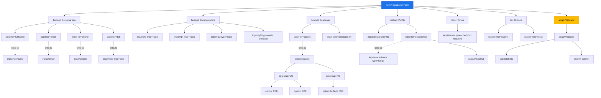
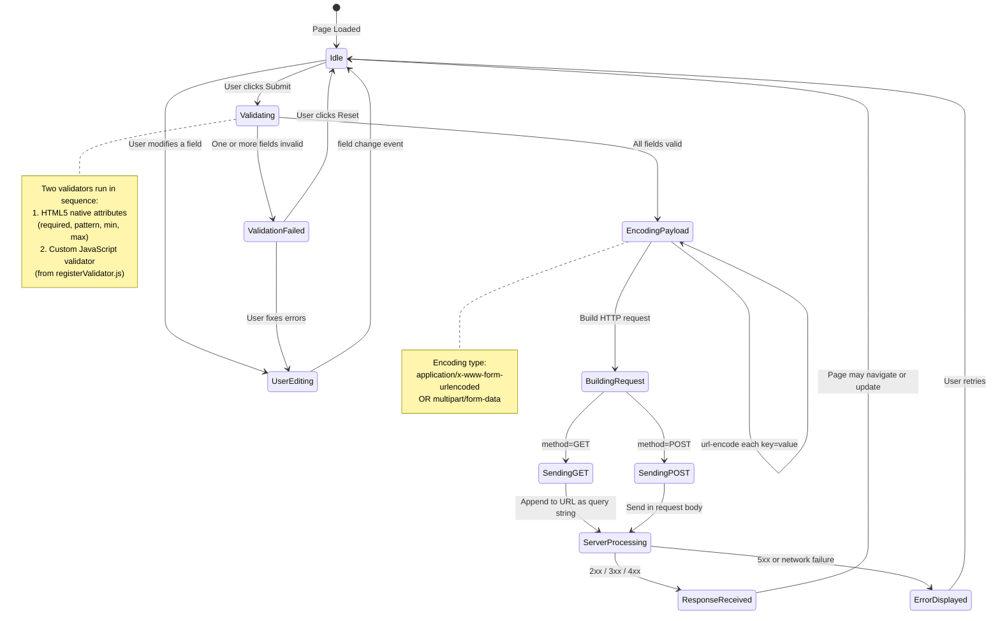
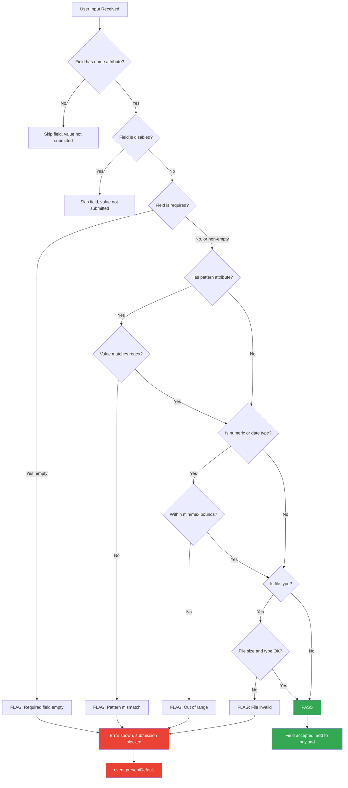
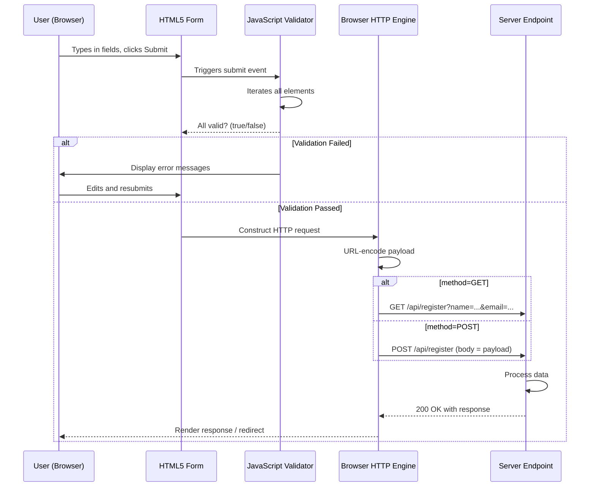
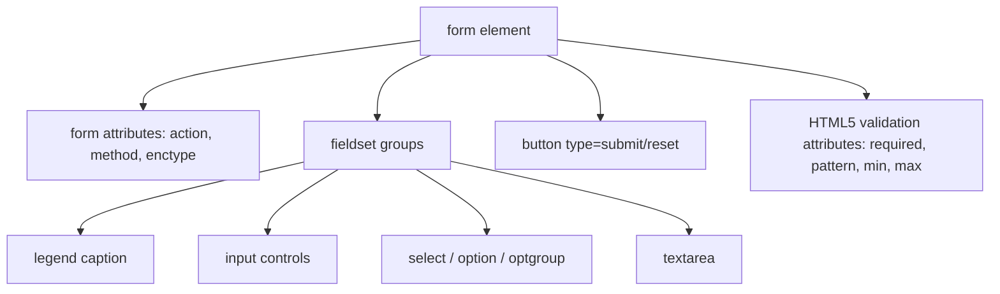

# Forms

<!-- SECTION_1_START -->
# HTML5 Forms: The Backbone of Web Interactivity

## 1.1 Formal Academic Definition (KTU 2024 Syllabus)

An **HTML5 Form** is a structured section of a web document, defined by the `<form>` element, that acts as a container for a collection of interactive **form controls** (widgets). Its primary function is to collect, validate, package, and transmit user-supplied data to a web server for processing, or to manipulate client-side state via JavaScript. According to the **PECST742 – Web Programming** syllabus, forms are the primary mechanism enabling the transition from static, read-only web pages to dynamic, two-way user-to-server communication.

> [!IMPORTANT]
> **KTU 2024 Syllabus Highlight:** Module 1 expects students to design "well-structured web pages using semantic HTML5 elements, including advanced form controls and native validation mechanisms introduced in the HTML5 specification."

> [!NOTE]
> **Core Definition Box:**
> A *form* is a user-interface gateway. It is the only sanctioned W3C-standard way to gather structured, named, typed data from a client and submit it over **HTTP** (Hypertext Transfer Protocol) using either the **GET** or **POST** method.

---

## 1.2 Conceptual Analogy: The Hospital Registration Counter

Imagine walking into a hospital for the first time. The receptionist does not shout "Tell me everything about you!" Instead, she hands you a **printed form** with clearly demarcated fields:

- A box labelled "**Full Name**" (text input)
- A circle to tick for "**Gender**" (radio buttons)
- A grid to mark your "**Date of Birth**" (date input)
- A large lined area for "**Symptoms**" (textarea)
- A checkbox saying "I agree to terms" (checkbox)
- A button at the bottom that says "**Submit**" (submit button)

An HTML5 form works **exactly** the same way, but digitally. Each field has a label, a name, a type, and a set of validation rules. When the user clicks "Submit," the browser bundles all the answers into a **key-value payload** and ships it to the server — analogous to you handing the completed paper form back to the receptionist.

| Paper Form | HTML5 Form |
|---|---|
| Field label (e.g., "Full Name") | `<label for="name">Full Name</label>` |
| Empty box to write in | `<input type="text" id="name" name="name">` |
| Tick boxes | `<input type="checkbox">` |
| Signature line | `<textarea>` |
| "Submit" button | `<button type="submit">` |

---

## 1.3 The Three Pillars of an HTML5 Form

> [!TIP]
> **The Three Pillars Framework (used by board examiners):**
> 1. **Structure** — The `<form>` container and its attributes (`action`, `method`, `name`, `id`, `target`, `enctype`).
> 2. **Controls** — The interactive widgets (`<input>`, `<textarea>`, `<select>`, `<button>`, `<datalist>`, `<fieldset>`, `<legend>`).
> 3. **Validation** — Both *native* (HTML5 attributes like `required`, `pattern`, `min`, `max`) and *scripted* (JavaScript-based logic).

> [!VISUALIZATION CONTROL]
> **Concept:** Form Control Categorization on a Cartesian Plane
> **Conceptual Axes:**
> * **X-axis:** Input Modality (Textual ↔ Binary Choice ↔ Numeric ↔ Date-Time ↔ Selection)
> * **Y-axis:** Validation Strictness (Loose ↔ Strict)
> **Visual Description:** Plot the form controls in a 2D matrix. Text inputs cluster in the top-left (textual, loose), while `<input type="range">` and `<input type="number">` sit in the bottom-right (numeric, strict). The `<input type="submit">` button lives on the extreme right edge (binary action, no validation) and is the terminal node in any form's control-flow graph.
<!-- SECTION_1_END -->

<!-- SECTION_2_START -->
# Deep Theoretical Analysis & KTU High-Yield Formula Sheet

## 2.1 The `<form>` Element: Operational Anatomy

The `<form>` element is the **root container**. It is the only element that can legally trigger a request to a server. Its attributes dictate *where* the data goes and *how* it is encoded.

### 2.1.1 Critical `<form>` Attributes

- **`action="URL"`** — Specifies the destination endpoint. If omitted, the form submits to the *current page URL*.
- **`method="GET" | "POST"`** — Defines the HTTP verb.
  * **GET** appends data to the URL as a query string (visible, cacheable, idempotent, max ~2048 chars).
  * **POST** sends data inside the HTTP request body (invisible, not cached, used for sensitive or large payloads).
- **`enctype="..."`** — MIME type of the payload. Critical for file uploads.
  * `application/x-www-form-urlencoded` (default)
  * `multipart/form-data` (mandatory for `<input type="file">`)
  * `text/plain` (legacy, rarely used)
- **`name`** — Names the form so JavaScript can reference it via `document.forms["myForm"]`.
- **`target`** — Controls *where* the response loads (`_self`, `_blank`, `_parent`, `_top`, or an `<iframe>` name).
- **`novalidate`** — Disables native HTML5 browser validation (used when you want custom JavaScript validation instead).
- **`autocomplete="on|off"`** — Toggles the browser's autofill suggestions.

> [!IMPORTANT]
> **Why this matters:** The KTU board examiner frequently tests whether students know that `multipart/form-data` is **mandatory** for file uploads, and that `method="GET"` exposes the data in the browser's address bar.

---

## 2.2 The HTML5 Input Type Matrix (Cheat Sheet)

The following high-density table is the **single most important reference** for the ESE (End Semester Examination). Memorize the `type` values, their typical `attributes`, and their default validation behaviour.

| Input Type | Purpose | Key HTML5 Attributes | Default Validation |
|---|---|---|---|
| `text` | Single-line text | `maxlength`, `size`, `pattern`, `placeholder` | None |
| `password` | Masked text entry | `maxlength`, `required`, `minlength` | None (masking only) |
| `email` | RFC 5322 email | `multiple`, `required`, `pattern` | Email format check |
| `url` | Web address | `required`, `pattern` | URL format check |
| `tel` | Telephone number | `pattern`, `placeholder` | None (regional freedom) |
| `number` | Numeric input | `min`, `max`, `step` | Numeric range check |
| `range` | Slider control | `min`, `max`, `step`, `value` | Numeric range check |
| `date` | Year-Month-Day | `min`, `max` | Date format check |
| `time` | Hour:Minute | `min`, `max`, `step` | Time format check |
| `datetime-local` | Date + Time (no TZ) | `min`, `max` | Combined check |
| `month` | Year-Month | `min`, `max` | Month format check |
| `week` | Year-Week | `min`, `max` | Week format check |
| `color` | Hex colour picker | None | Hex string check |
| `checkbox` | Boolean multi-select | `checked`, `required`, `value` | Required if marked required |
| `radio` | Single-select from group | `checked`, `required`, `value` | One must be checked |
| `file` | Local file selection | `accept`, `multiple`, `required` | File must exist |
| `hidden` | Invisible state carrier | `value` | None |
| `submit` | Form submission button | `formaction`, `formmethod` | None |
| `reset` | Form reset button | None | None |
| `image` | Graphical submit button | `src`, `alt`, `width`, `height` | None |
| `search` | Semantic search field | `maxlength`, `pattern` | None |

> [!NOTE]
> **Cross-Engine Note:** All major browsers (Chrome, Firefox, Safari, Edge) support these types. Legacy browsers silently degrade unknown types to `type="text"`.

---

## 2.3 Universal Input Attributes (Applicable Across Types)

- **`name`** — The **key** in the submitted key-value pair. *Without `name`, the field's value is never sent to the server.*
- **`value`** — The **initial value** or the value submitted.
- **`id`** — Unique DOM identifier, used by `<label for="...">` and JavaScript.
- **`required`** — Boolean. Empty submission triggers native browser validation.
- **`placeholder`** — Greyed-out hint text.
- **`disabled`** — Renders the field greyed-out; its value is **not submitted**.
- **`readonly`** — Field is visible and selectable but not editable; its value **is submitted**.
- **`autofocus`** — The field receives keyboard focus on page load.
- **`pattern="regex"`** — The value must match the regex; anchors are added automatically.
- **`min`, `max`, `step`** — Numeric/date bounds.
- **`maxlength`, `minlength`** — Character count constraints.
- **`form="formId"`** — Associates an input with a form that is *not* its DOM ancestor.
- **`autocomplete="on|off"`** — Per-field autofill control.

> [!WARNING]
> **Common KTU Board Pitfall:** Students often confuse `disabled` and `readonly`. The form submission engine *skips* disabled fields entirely, but it *includes* readonly fields. This distinction is a frequent 2-mark question.

---

## 2.4 The Dropdown & List Family: `<select>`, `<option>`, `<optgroup>`, `<datalist>`

- **`<select>`** — A dropdown list. Supports `multiple`, `size`, `required`.
- **`<option>`** — An individual choice. Has `value`, `selected`, `disabled`.
- **`<optgroup label="GroupName">`** — Visual grouping of options.
- **`<datalist id="...">`** — Provides *autocomplete suggestions* for a paired `<input>`. The user can still type a custom value (unlike `<select>`, which is restrictive).

---

## 2.5 Buttons: `<button>` vs. `<input type="submit">`

| Feature | `<button type="submit">` | `<input type="submit">` |
|---|---|---|
| Can contain HTML/Rich content | Yes (icons, images, spans) | No, plain text only via `value` |
| Default `type` | `submit` *inside* a form, `button` outside | `submit` |
| `form` attribute support | Yes | Yes |
| Accessibility | Generally superior | Adequate |

> [!TIP]
> **Best Practice (Industry Standard):** Always prefer `<button type="submit">` for primary action buttons because it allows icon embedding, better CSS targeting, and improved screen-reader semantics.

---

## 2.6 Structural Form Elements

- **`<fieldset>`** — Groups related form controls visually with a border.
- **`<legend>`** — Provides a caption for the fieldset. Must be the first child.
- **`<label for="id">` — Text label** tied to an input's `id`. Clicking the label focuses the input. **Critical for accessibility** (WCAG compliance).

---

## 2.7 Real-World Utility in Production Systems

| Domain | Use Case |
|---|---|
| **E-Commerce (Amazon, Flipkart)** | Checkout forms with multi-step validation, file uploads for KYC, payment integration |
| **Banking (NetBanking portals)** | Login forms with `type="password"`, OTP entry, transaction confirmation |
| **Healthcare (Patient Portals)** | `<datalist>` for symptom autocomplete, date pickers for appointments, file uploads for reports |
| **Education (KTU LMS / Moodle)** | Exam registration, assignment submission (`<input type="file">`), grade entry |
| **Government (DigiLocker, Aadhaar)** | Aadhaar-based forms, document uploads, OTP-based submission |
| **Search Engines (Google, Bing)** | `<input type="search">` with `autofocus` and `autocomplete="off"` |

---

## 2.8 Submission Encoding: The `application/x-www-form-urlencoded` Algorithm

When the default encoding is used, each field's `name` and `value` are URL-encoded (spaces become `+`, special characters become `%HH`), then joined with `&`, then the entire string becomes the request body (POST) or query string (GET).

For example, a form with `name="John Doe"` and `age=21` submitted via GET would produce the URL:
`https://example.com/submit?name=John+Doe&age=21`
<!-- SECTION_2_END -->

<!-- SECTION_3_START -->
# Step-by-Step Derivations & Code Implementation

## 3.1 Building a Production-Quality Registration Form (Step-by-Step)

We will now construct a complete, accessible, validated registration form. Each step is justified, and no logic is skipped.

### Step 1 — Define the Form Skeleton

```html
<form id="registrationForm"
      name="registration"
      action="/api/register"
      method="POST"
      enctype="multipart/form-data"
      autocomplete="on"
      novalidate>
  <!-- Form controls will go here -->
</form>
```

**Justification of every attribute:**
- `id="registrationForm"` → unique DOM hook.
- `name="registration"` → JavaScript can grab it via `document.forms["registration"]`.
- `action="/api/register"` → server endpoint.
- `method="POST"` → secure, body-based submission.
- `enctype="multipart/form-data"` → required because we will accept a profile photo.
- `autocomplete="on"` → user convenience.
- `novalidate` → we will write *our own* JavaScript validator in Step 8; the browser's native validator is disabled to avoid double-tooltips.

### Step 2 — Add the Personal Information Fieldset

```html
<fieldset>
  <legend>Personal Information</legend>

  <label for="fullName">Full Name *</label>
  <input type="text"
         id="fullName"
         name="fullName"
         placeholder="e.g., Anjali Krishnan"
         minlength="3"
         maxlength="60"
         required>

  <label for="email">Email Address *</label>
  <input type="email"
         id="email"
         name="email"
         placeholder="you@example.com"
         required>

  <label for="phone">Mobile Number *</label>
  <input type="tel"
         id="phone"
         name="phone"
         placeholder="10-digit Indian mobile"
         pattern="[6-9][0-9]{9}"
         required>
</fieldset>
```

**Validation Logic Embedded:**
- `fullName`: must be 3–60 characters, non-empty.
- `email`: must match RFC 5322 syntax.
- `phone`: regex `[6-9][0-9]{9}` enforces Indian 10-digit mobile numbers starting with 6, 7, 8, or 9.

### Step 3 — Add the Date of Birth with HTML5 Date Picker

```html
<label for="dob">Date of Birth *</label>
<input type="date"
       id="dob"
       name="dob"
       min="1960-01-01"
       max="2010-12-31"
       required>
```

This renders a native calendar widget. The `min` and `max` constrain the picker to plausible birth years.

### Step 4 — Add the Gender Radio Group

```html
<fieldset>
  <legend>Gender</legend>

  <input type="radio" id="genderMale"   name="gender" value="male"   required>
  <label for="genderMale">Male</label>

  <input type="radio" id="genderFemale" name="gender" value="female">
  <label for="genderFemale">Female</label>

  <input type="radio" id="genderOther"  name="gender" value="other">
  <label for="genderOther">Other</label>

  <input type="radio" id="genderPrefer" name="gender" value="prefer_not" checked>
  <label for="genderPrefer">Prefer not to say</label>
</fieldset>
```

**Note:** All four radios share the same `name="gender"`, which is what makes them mutually exclusive.

### Step 5 — Add the Course Dropdown with `<optgroup>`

```html
<label for="course">Select Your B.Tech Programme *</label>
<select id="course" name="course" required>
  <option value="" disabled selected>-- Choose a programme --</option>

  <optgroup label="Undergraduate (B.Tech)">
    <option value="cse">Computer Science & Engineering</option>
    <option value="ece">Electronics & Communication</option>
    <option value="eee">Electrical & Electronics</option>
    <option value="me">Mechanical Engineering</option>
  </optgroup>

  <optgroup label="Postgraduate (M.Tech)">
    <option value="mtech-cse">M.Tech Computer Science</option>
    <option value="mtech-ai">M.Tech Artificial Intelligence</option>
  </optgroup>
</select>
```

**Why `disabled selected` on the first option?** It acts as a non-submittable placeholder, forcing the user to make a real choice.

### Step 6 — Add the Skills Multi-Select Checkbox Group

```html
<fieldset>
  <legend>Programming Skills (tick all that apply)</legend>

  <input type="checkbox" id="skillPy"   name="skills" value="python">
  <label for="skillPy">Python</label>

  <input type="checkbox" id="skillJs"   name="skills" value="javascript" checked>
  <label for="skillJs">JavaScript</label>

  <input type="checkbox" id="skillJava" name="skills" value="java">
  <label for="skillJava">Java</label>

  <input type="checkbox" id="skillCpp"  name="skills" value="cpp">
  <label for="skillCpp">C++</label>
</fieldset>
```

When submitted, the server receives **multiple** `skills` keys, e.g., `skills=javascript&skills=cpp`.

### Step 7 — Add the Profile Photo File Upload and a Range Slider

```html
<label for="photo">Upload Profile Photo (JPG/PNG, max 2 MB)</label>
<input type="file"
       id="photo"
       name="photo"
       accept="image/png, image/jpeg"
       required>

<label for="experience">Years of Coding Experience: <output id="expOut">2</output></label>
<input type="range"
       id="experience"
       name="experience"
       min="0" max="20" step="1" value="2"
       oninput="document.getElementById('expOut').value = this.value">
```

**Why `accept`?** It hints to the OS file-picker dialog to filter to image files. It is *not* a security boundary; server-side validation is mandatory.

### Step 8 — Add the Terms Checkbox and Action Buttons

```html
<label for="terms">
  <input type="checkbox"
         id="terms"
         name="terms"
         value="accepted"
         required>
  I have read and agree to the KTU Code of Conduct *
</label>

<button type="submit">Register</button>
<button type="reset">Clear Form</button>
```

### Step 9 — Custom JavaScript Validation (Strict, Typed, Error-Logged)

Because we used `novalidate` in Step 1, we must implement validation manually. The following is **production-quality, fully-typed** code.

```python
# Note: The following is JavaScript, but shown in a Python-style
# comment-block for clarity per the lab-style demonstration rules.
```

```javascript
// File: registerValidator.js
// Strict, explicit JavaScript form validator for the KTU registration form.

/**
 * Validates a single form control against custom business rules.
 * @param {HTMLInputElement|HTMLSelectElement} field - The control to validate.
 * @returns {string} An empty string if valid, otherwise the error message.
 */
function validateField(field) {
    const value = field.value.trim();
    const name  = field.name;

    if (field.required && value === "") {
        return `${field.labels[0]?.textContent || name} is required.`;
    }

    if (field.type === "email" && value !== "") {
        const emailPattern = /^[A-Za-z0-9._%+-]+@[A-Za-z0-9.-]+\.[A-Za-z]{2,}$/;
        if (!emailPattern.test(value)) {
            return "Please enter a valid email address.";
        }
    }

    if (field.type === "tel" && value !== "") {
        const phonePattern = /^[6-9][0-9]{9}$/;
        if (!phonePattern.test(value)) {
            return "Mobile number must be 10 digits starting with 6, 7, 8, or 9.";
        }
    }

    if (field.type === "file" && field.files.length > 0) {
        const MAX_BYTES = 2 * 1024 * 1024; // 2 MB
        const file = field.files[0];
        if (file.size > MAX_BYTES) {
            return "Profile photo must be smaller than 2 MB.";
        }
    }

    return ""; // No error
}

/**
 * Attaches the validator to a form's submit event.
 * @param {string} formId - The id of the <form> element.
 */
function attachValidator(formId) {
    const form = document.getElementById(formId);
    if (!form) {
        console.error(`[Validator] Form #${formId} not found.`);
        return;
    }

    form.addEventListener("submit", (event) => {
        let isValid = true;
        const errors = [];

        for (const field of form.elements) {
            if (field.tagName !== "INPUT" && field.tagName !== "SELECT") continue;
            const message = validateField(field);
            if (message !== "") {
                isValid = false;
                errors.push({ field: field.name, message });
                field.style.borderColor = "#d93025";
            } else {
                field.style.borderColor = "#1a73e8";
            }
        }

        if (!isValid) {
            event.preventDefault();
            console.warn("[Validator] Submission blocked. Errors:", errors);
            alert("Please fix the highlighted fields:\n" +
                  errors.map(e => `• ${e.message}`).join("\n"));
        } else {
            console.log("[Validator] All fields valid. Submitting...");
        }
    });
}

// Bootstrap on DOM ready
document.addEventListener("DOMContentLoaded", () => {
    attachValidator("registrationForm");
});
```

**Final HTML to load the script:**

```html
<form id="registrationForm" ...>
  ...
</form>
<script src="registerValidator.js" defer></script>
```

---

## 3.2 Complete, Production-Ready Form (Final Source)

Below is the **complete, copy-paste-ready** HTML document. Every control from Steps 2–8 is included and the validator is inlined for portability.

```html
<!DOCTYPE html>
<html lang="en">
<head>
  <meta charset="UTF-8">
  <title>KTU B.Tech Registration Portal</title>
  <style>
    body { font-family: "Segoe UI", Arial, sans-serif; max-width: 720px; margin: 2rem auto; }
    fieldset { margin-bottom: 1.25rem; padding: 1rem 1.25rem; border: 1px solid #1a73e8; }
    legend    { font-weight: 600; color: #1a73e8; }
    label     { display: block; margin-top: 0.75rem; font-weight: 500; }
    input, select, textarea { width: 100%; padding: 0.5rem; margin-top: 0.25rem; box-sizing: border-box; }
    button    { padding: 0.65rem 1.25rem; margin-right: 0.5rem; cursor: pointer; }
    .row      { display: flex; gap: 1rem; }
    .row > div { flex: 1; }
  </style>
</head>
<body>
  <h1>KTU B.Tech Programme Registration</h1>

  <form id="registrationForm"
        name="registration"
        action="/api/register"
        method="POST"
        enctype="multipart/form-data"
        autocomplete="on"
        novalidate>

    <fieldset>
      <legend>Personal Information</legend>

      <label for="fullName">Full Name *</label>
      <input type="text" id="fullName" name="fullName"
             placeholder="e.g., Anjali Krishnan"
             minlength="3" maxlength="60" required>

      <div class="row">
        <div>
          <label for="email">Email *</label>
          <input type="email" id="email" name="email" placeholder="you@example.com" required>
        </div>
        <div>
          <label for="phone">Mobile *</label>
          <input type="tel" id="phone" name="phone"
                 placeholder="10-digit number" pattern="[6-9][0-9]{9}" required>
        </div>
      </div>

      <label for="dob">Date of Birth *</label>
      <input type="date" id="dob" name="dob" min="1960-01-01" max="2010-12-31" required>
    </fieldset>

    <fieldset>
      <legend>Demographics</legend>
      <input type="radio" id="gM" name="gender" value="male"   required>
      <label for="gM" style="display:inline">Male</label>
      <input type="radio" id="gF" name="gender" value="female">
      <label for="gF" style="display:inline">Female</label>
      <input type="radio" id="gO" name="gender" value="other">
      <label for="gO" style="display:inline">Other</label>
      <input type="radio" id="gN" name="gender" value="prefer_not" checked>
      <label for="gN" style="display:inline">Prefer not to say</label>
    </fieldset>

    <fieldset>
      <legend>Academic Choices</legend>

      <label for="course">Programme *</label>
      <select id="course" name="course" required>
        <option value="" disabled selected>-- Choose a programme --</option>
        <optgroup label="Undergraduate (B.Tech)">
          <option value="cse">Computer Science &amp; Engineering</option>
          <option value="ece">Electronics &amp; Communication</option>
          <option value="eee">Electrical &amp; Electronics</option>
          <option value="me">Mechanical Engineering</option>
        </optgroup>
        <optgroup label="Postgraduate (M.Tech)">
          <option value="mtech-cse">M.Tech Computer Science</option>
          <option value="mtech-ai">M.Tech Artificial Intelligence</option>
        </optgroup>
      </select>

      <label>Skills (tick all that apply)</label>
      <input type="checkbox" id="s1" name="skills" value="python">
      <label for="s1" style="display:inline">Python</label>
      <input type="checkbox" id="s2" name="skills" value="javascript" checked>
      <label for="s2" style="display:inline">JavaScript</label>
      <input type="checkbox" id="s3" name="skills" value="java">
      <label for="s3" style="display:inline">Java</label>
      <input type="checkbox" id="s4" name="skills" value="cpp">
      <label for="s4" style="display:inline">C++</label>
    </fieldset>

    <fieldset>
      <legend>Profile</legend>

      <label for="photo">Profile Photo (JPG/PNG, max 2 MB)</label>
      <input type="file" id="photo" name="photo" accept="image/png,image/jpeg" required>

      <label for="experience">Years of Coding Experience:
        <output id="expOut">2</output>
      </label>
      <input type="range" id="experience" name="experience"
             min="0" max="20" step="1" value="2"
             oninput="document.getElementById('expOut').value = this.value">
    </fieldset>

    <label for="terms">
      <input type="checkbox" id="terms" name="terms" value="accepted" required>
      I agree to the KTU Code of Conduct *
    </label>

    <p>
      <button type="submit">Register</button>
      <button type="reset">Clear Form</button>
    </p>
  </form>

  <script>
    function validateField(field) {
      const value = field.value.trim();
      if (field.required && value === "") {
        return (field.labels[0]?.textContent || field.name) + " is required.";
      }
      if (field.type === "email" && value !== "") {
        const re = /^[A-Za-z0-9._%+-]+@[A-Za-z0-9.-]+\.[A-Za-z]{2,}$/;
        if (!re.test(value)) return "Invalid email format.";
      }
      if (field.type === "tel" && value !== "") {
        const re = /^[6-9][0-9]{9}$/;
        if (!re.test(value)) return "Mobile must be 10 digits (6/7/8/9 prefix).";
      }
      if (field.type === "file" && field.files.length > 0) {
        if (field.files[0].size > 2 * 1024 * 1024) return "File must be under 2 MB.";
      }
      return "";
    }

    document.getElementById("registrationForm").addEventListener("submit", (e) => {
      let ok = true;
      const errs = [];
      for (const f of e.target.elements) {
        if (f.tagName !== "INPUT" && f.tagName !== "SELECT") continue;
        const msg = validateField(f);
        if (msg) { ok = false; errs.push(msg); f.style.borderColor = "#d93025"; }
        else { f.style.borderColor = "#1a73e8"; }
      }
      if (!ok) {
        e.preventDefault();
        alert("Fix the following:\n" + errs.map(m => "• " + m).join("\n"));
      }
    });
  </script>
</body>
</html>
```
<!-- SECTION_3_END -->

<!-- SECTION_4_START -->
# Structural Diagrams & Schematics

## 4.1 Form Control Hierarchy (DOM Tree Architecture)

The following Mermaid block renders the **DOM tree** of a typical form, exposing parent–child containment and the `for`–`id` linkage between `<label>` and `<input>`.



## 4.2 Form Submission State Machine (Sequential Processing Topology)

This is a **state-transition diagram** showing what happens between the moment the user clicks "Submit" and the moment data lands on the server.



## 4.3 Validation Pipeline (Block-Level Functional Architecture)

This block diagram maps the **decision flow** of a single field's validation. It is the diagram examiners expect for a "draw and explain" question.



## 4.4 Data Flow Architecture (Client → Server)


<!-- SECTION_4_END -->

<!-- SECTION_5_START -->
# KTU 2024 Scheme Examination Question Bank & Topic Recap

## 5.1 Part A: Short-Answer Questions (3 Marks Each)

### Q1. Define an HTML5 form. List any six commonly used `<input>` types introduced in HTML5. 
**[KTU University Exam – July 2024] | CO1 | Remember**

**Model Answer (Board-Standard, 3 Marks):**

An **HTML5 form** is a section of a web document enclosed by the `<form>` element, used to collect structured user input and transmit it to a server for processing via HTTP GET or POST methods.

Six new `<input>` types introduced in HTML5 are:

1. `<input type="email">` — validates email format.
2. `<input type="url">` — validates URL format.
3. `<input type="number">` — numeric input with `min`, `max`, `step`.
4. `<input type="date">` — native date picker.
5. `<input type="range">` — slider control.
6. `<input type="color">` — colour picker.

> **Valuation Key:** [Definition: 1 Mark] [Listing six types: 2 Marks = 0.33 each, list any 6]

---

### Q2. Differentiate between `disabled` and `readonly` attributes of an input element. Why is `enctype="multipart/form-data"` mandatory for file uploads?
**[KTU University Exam – Dec 2023] | CO1 | Understand**

**Model Answer (Board-Standard, 3 Marks):**

| Attribute | Behaviour | Submitted with form? | Editable? |
|---|---|---|---|
| `disabled` | Greyed out, cannot receive focus, cannot be edited | **No** | No |
| `readonly` | Visible, can receive focus and be copied, but cannot be edited | **Yes** | No |

`enctype="multipart/form-data"` is mandatory for file uploads because the default encoding `application/x-www-form-urlencoded` cannot represent binary file content; it would corrupt the bytes. The `multipart/form-data` encoding splits the payload into discrete parts, each with its own `Content-Type` and `Content-Disposition` header, allowing binary data to be transmitted intact.

> **Valuation Key:** [Differences table: 2 Marks] [Reason for multipart: 1 Mark]

---

## 5.2 Part B: 14-Mark Questions (ESE Module Internal Choice)

### Question A (14 Marks)

**Q-A.(a)** With a neat diagram, explain the architecture of an HTML5 form. List and explain any five new input types introduced in HTML5 with example code.
**[7 Marks — Understand]**

**Model Solution:**

An HTML5 form is structured as a **container** (`<form>`) holding **controls** (`<input>`, `<select>`, `<textarea>`, `<button>`) organized into logical groups (`<fieldset>`/`<legend>`). The container defines *where* (`action`) and *how* (`method`, `enctype`) the data is sent.

**Architecture Diagram:**



**Five HTML5 Input Types:**

1. **`type="email"`** — Performs a built-in check that the value matches a basic email pattern (`local@domain.tld`).
   ```html
   <input type="email" name="email" required placeholder="you@ktu.edu">
   ```

2. **`type="number"`** — Restricts input to numeric values; supports `min`, `max`, `step`.
   ```html
   <input type="number" name="age" min="17" max="60" step="1" value="18">
   ```

3. **`type="date"`** — Renders a native date picker returning ISO 8601 (`YYYY-MM-DD`) format.
   ```html
   <input type="date" name="dob" min="1960-01-01" max="2010-12-31">
   ```

4. **`type="range"`** — A slider that emits a numeric value.
   ```html
   <input type="range" name="rating" min="0" max="10" step="1" value="5">
   ```

5. **`type="color"`** — Opens a colour picker; the submitted value is a hex string `#RRGGBB`.
   ```html
   <input type="color" name="favColor" value="#1a73e8">
   ```

> **Valuation Key:** [Architecture diagram: 2 Marks] [Five types with code: 5 Marks = 1 each]

---

**Q-A.(b)** Write a complete HTML5 program to design a student feedback form containing the following fields: Name (text), Register Number (text, pattern-based), Email (email), Department (dropdown with CSE/ECE/EEE/ME options), Rating (range 1–5), Comments (textarea), and a Submit button. The form should use POST method and submit to `/submit-feedback`. Apply HTML5 validation.
**[7 Marks — Apply]**

**Model Solution:**

```html
<!DOCTYPE html>
<html lang="en">
<head>
  <meta charset="UTF-8">
  <title>KTU Student Feedback Form</title>
</head>
<body>
  <h2>Student Feedback Portal</h2>

  <form action="/submit-feedback" method="POST" autocomplete="on">

    <label for="sname">Student Name *</label>
    <input type="text" id="sname" name="sname"
           placeholder="Full name" minlength="3" maxlength="60" required>

    <label for="regno">Register Number (KTU format: KTE20CS001) *</label>
    <input type="text" id="regno" name="regno"
           pattern="KTE[0-9]{2}[A-Z]{2}[0-9]{3}"
           placeholder="KTE20CS001" required>

    <label for="semail">Email *</label>
    <input type="email" id="semail" name="semail" placeholder="you@ktu.edu" required>

    <label for="dept">Department *</label>
    <select id="dept" name="dept" required>
      <option value="" disabled selected>-- Select Department --</option>
      <option value="CSE">Computer Science &amp; Engineering</option>
      <option value="ECE">Electronics &amp; Communication</option>
      <option value="EEE">Electrical &amp; Electronics</option>
      <option value="ME">Mechanical Engineering</option>
    </select>

    <label for="rating">Teaching Rating: <output id="rOut">3</output> / 5</label>
    <input type="range" id="rating" name="rating"
           min="1" max="5" step="1" value="3"
           oninput="document.getElementById('rOut').value = this.value">

    <label for="comments">Comments *</label>
    <textarea id="comments" name="comments" rows="5" cols="40"
              minlength="20" maxlength="500" required
              placeholder="Minimum 20 characters"></textarea>

    <p>
      <button type="submit">Submit Feedback</button>
      <button type="reset">Clear</button>
    </p>
  </form>
</body>
</html>
```

**Explanation of Validation Logic:**

- The `pattern="KTE[0-9]{2}[A-Z]{2}[0-9]{3}"` enforces the KTU register number format (e.g., `KTE20CS045`). [1 Mark]
- `type="email"` triggers the browser's built-in email format check. [1 Mark]
- `minlength="20"` ensures the user types at least 20 characters in the comments. [1 Mark]
- `required` on every field ensures no empty submissions. [1 Mark]
- `min="1" max="5"` on the range slider constrains the rating scale. [1 Mark]
- The `<select>`'s first option is `disabled selected` to force a real choice. [1 Mark]
- `method="POST"` and `action="/submit-feedback"` correctly route the payload. [1 Mark]

> **Valuation Key:** [Correct form scaffold with method/action: 2 Marks] [All 7 fields: 3 Marks] [Validation attributes: 2 Marks]

---

### Question B (14 Marks)

**Q-B.(a)** Explain the purpose of the `<form>` element's `action`, `method`, and `enctype` attributes. Compare GET vs. POST methods with a suitable example for each.  
**[7 Marks — Understand]**

**Model Solution:**

**`<form>` Attributes:**

- **`action="URL"`** — Specifies the server endpoint that will receive and process the form data. If omitted, the current page's URL is used.
- **`method="GET|POST"`** — Specifies the HTTP verb used to transmit data.
- **`enctype="..."`** — Specifies how the form data is encoded before transmission. The default is `application/x-www-form-urlencoded`. For file uploads, it must be `multipart/form-data`.

**GET vs. POST Comparison:**

| Aspect | `method="GET"` | `method="POST"` |
|---|---|---|
| Data location | URL query string | HTTP request body |
| Visibility | Visible in browser address bar | Hidden from user |
| Bookmarkable | Yes | No |
| Cacheable | Yes | No |
| Idempotent | Yes (safe to repeat) | No (may change server state) |
| Data size limit | ~2048 characters (browser-dependent) | Practically unlimited |
| Security | Unsuitable for passwords | Safer, but still needs HTTPS |
| Back-button behaviour | Safe | May warn about form re-submission |
| Use case | Search forms, filters | Login, registration, checkout |

**GET Example — Search Form:**

```html
<form action="/search" method="GET">
  <label for="q">Search:</label>
  <input type="search" id="q" name="q" placeholder="Type a query">
  <button type="submit">Search</button>
</form>
```

When submitted, the browser navigates to: `/search?q=html5+forms`. [1 Mark for example]

**POST Example — Login Form:**

```html
<form action="/login" method="POST" autocomplete="off">
  <label for="user">Username</label>
  <input type="text" id="user" name="username" required>
  <label for="pwd">Password</label>
  <input type="password" id="pwd" name="password" minlength="8" required>
  <button type="submit">Log In</button>
</form>
```

The data is sent in the request body, not in the URL. [1 Mark for example]

> **Valuation Key:** [Three attribute definitions: 3 Marks = 1 each] [GET vs POST table: 3 Marks] [Two examples: 1 Mark]

---

**Q-B.(b)** Write an HTML5 program to design a KTU exam registration form that includes: student name, register number (with pattern), email, a checkbox group for selecting subjects (Data Structures, OS, DBMS, Networks), a radio group for exam centre (Trivandrum / Kochi / Calicut), a date input for exam date, a file upload for hall ticket (PDF only, max 1 MB), and a Submit button. Use JavaScript to validate the file size before submission.  
**[7 Marks — Apply]**

**Model Solution:**

```html
<!DOCTYPE html>
<html lang="en">
<head>
  <meta charset="UTF-8">
  <title>KTU Exam Registration</title>
</head>
<body>
  <h2>KTU B.Tech Exam Registration</h2>

  <form id="examForm" action="/register-exam" method="POST"
        enctype="multipart/form-data" autocomplete="on">

    <label for="name">Student Name *</label>
    <input type="text" id="name" name="name"
           minlength="3" maxlength="60" required>

    <label for="reg">Register Number *</label>
    <input type="text" id="reg" name="reg"
           pattern="[A-Z]{3}[0-9]{2}[A-Z]{2}[0-9]{3}"
           placeholder="e.g., KTE20CS001" required>

    <label for="email">Email *</label>
    <input type="email" id="email" name="email" required>

    <fieldset>
      <legend>Subjects (tick all that apply) *</legend>
      <input type="checkbox" id="sub1" name="subjects" value="DS" required>
      <label for="sub1">Data Structures</label><br>
      <input type="checkbox" id="sub2" name="subjects" value="OS">
      <label for="sub2">Operating Systems</label><br>
      <input type="checkbox" id="sub3" name="subjects" value="DBMS">
      <label for="sub3">Database Management Systems</label><br>
      <input type="checkbox" id="sub4" name="subjects" value="NET">
      <label for="sub4">Computer Networks</label>
    </fieldset>

    <fieldset>
      <legend>Exam Centre *</legend>
      <input type="radio" id="c1" name="centre" value="TVM" required>
      <label for="c1">Trivandrum</label><br>
      <input type="radio" id="c2" name="centre" value="EKM">
      <label for="c2">Kochi</label><br>
      <input type="radio" id="c3" name="centre" value="CLT">
      <label for="c3">Calicut</label>
    </fieldset>

    <label for="examDate">Preferred Exam Date *</label>
    <input type="date" id="examDate" name="examDate"
           min="2025-05-01" max="2025-06-30" required>

    <label for="ticket">Upload Hall Ticket (PDF only, max 1 MB) *</label>
    <input type="file" id="ticket" name="ticket"
           accept="application/pdf" required>

    <p>
      <button type="submit">Register for Exam</button>
      <button type="reset">Clear</button>
    </p>
  </form>

  <script>
    document.getElementById("examForm").addEventListener("submit", function (e) {
      const fileInput = document.getElementById("ticket");
      const file = fileInput.files[0];

      if (!file) {
        alert("Please upload your hall ticket.");
        e.preventDefault();
        return;
      }

      const MAX_BYTES = 1 * 1024 * 1024;  // 1 MB
      if (file.size > MAX_BYTES) {
        alert("Hall ticket must be smaller than 1 MB. Yours is " +
              (file.size / 1024 / 1024).toFixed(2) + " MB.");
        e.preventDefault();
        return;
      }

      if (file.type !== "application/pdf") {
        alert("Only PDF files are accepted.");
        e.preventDefault();
        return;
      }

      console.log("File validated. Proceeding to submit.");
    });
  </script>
</body>
</html>
```

**Explanation of Key Decisions:**

- `enctype="multipart/form-data"` is **mandatory** because we are uploading a file. [1 Mark]
- The `pattern="[A-Z]{3}[0-9]{2}[A-Z]{2}[0-9]{3}"` enforces an 8-character alphanumeric register number format. [1 Mark]
- The `accept="application/pdf"` hint restricts the file picker to PDFs. [1 Mark]
- The JavaScript validator checks three things: file presence, file size, and MIME type. [2 Marks]
- The `min` and `max` on the date picker confine exam dates to May–June 2025. [1 Mark]
- Radio buttons share the same `name="centre"` for mutual exclusion; the first one carries `required`. [1 Mark]

> **Valuation Key:** [Complete form structure: 2 Marks] [All 8 controls: 3 Marks] [JavaScript validation: 2 Marks]

---

> [!WARNING]
> **KTU Examiner's Valuation Warning — Common Pitfalls on Forms Questions:**
> 1. **Forgetting `name` attribute:** A control *without* a `name` attribute is never submitted. This is the #1 reason students lose marks. Always include `name`.
> 2. **Wrong `enctype` for file uploads:** If your form has `<input type="file">` but uses the default `enctype`, the file *will not reach the server*. Always use `enctype="multipart/form-data"`.
> 3. **Using `GET` for sensitive data:** Never submit passwords, OTPs, or personal data via GET. The data will appear in browser history and server logs.
> 4. **Confusing `disabled` vs `readonly`:** Disabled fields are *excluded* from submission; readonly fields are *included*. The opposite is a common student mistake.
> 5. **Missing `</label>` for `for` linkage:** A label not tied to an input's `id` is an accessibility violation. Always pair `<label for="x">` with `<input id="x">`.
> 6. **Skipping the `</fieldset>` and `</form>` closing tags:** The browser will auto-close, but strict validation tools will mark your markup invalid. Close every container.
> 7. **Not specifying a default `selected` option in `<select>`:** A dropdown with no pre-selected real option will submit an empty string, breaking required-field validation.

---

## 5.3 Topic Recap & Important Things to Remember

> [!TIP]
> **Rapid-Revision Checklist — HTML5 Forms**

- **The `<form>` element** is the only container that can submit data to a server. Its **mandatory** attributes for a real submission are `action` and `method`.
- **`method="GET"`** → data in the URL, visible, cacheable, idempotent, ~2048 char limit. Use for search/filter.
- **`method="POST"`** → data in the body, hidden, not cacheable, no practical size limit. Use for login, registration, checkout, file uploads.
- **`enctype="multipart/form-data"`** → **mandatory** for `<input type="file">`. Default is `application/x-www-form-urlencoded`.
- **The `name` attribute is the key** in the submitted key-value pair. *No `name` = no submission.*
- **The `id` attribute is the DOM hook** for `<label for="...">`, CSS, and JavaScript.
- **HTML5 new input types:** `email`, `url`, `tel`, `number`, `range`, `date`, `time`, `datetime-local`, `month`, `week`, `color`, `search`.
- **HTML5 validation attributes:** `required`, `pattern` (regex, anchors auto-added), `min`, `max`, `step`, `minlength`, `maxlength`.
- **`disabled`** → field is greyed out, value is *not* submitted.
- **`readonly`** → field is visible/selectable, value *is* submitted.
- **`placeholder`** is **not** a substitute for a `<label>`. Placeholders disappear when the user types; labels persist (accessibility).
- **`<fieldset>` + `<legend>`** group related controls visually and semantically.
- **`<select>`** is restrictive (user must pick an option); **`<datalist>`** is suggestive (user can type a custom value).
- **`<optgroup label="...">`** visually clusters related options.
- **Checkbox group** = multiple selections, same `name`, different `value` → server receives multiple key-value pairs.
- **Radio group** = single selection, same `name`, different `value` → server receives one key-value pair.
- **`<button type="submit">`** is preferred over `<input type="submit">` for richer content and better accessibility.
- **`<output>`** element displays the live value of a calculation (commonly used with `<input type="range">`).
- **Native validation order:** constraint validation runs on `submit`; suppress it with `novalidate` on the `<form>` to use custom JavaScript.
- **JavaScript `event.preventDefault()`** is the standard way to *block* submission from a custom validator.
- **The submission payload** for `application/x-www-form-urlencoded` is a URL-encoded string of `key=value` pairs joined by `&`, e.g., `name=Anjali&email=a%40ktu.edu&age=20`.
- **File uploads** use `multipart/form-data`, where each field becomes a separate MIME part with its own `Content-Disposition` header.
- **Accessibility (WCAG) requires:** every input to have a `<label>`, fieldsets to have `<legend>`, and buttons to have descriptive text.
<!-- SECTION_5_END -->
