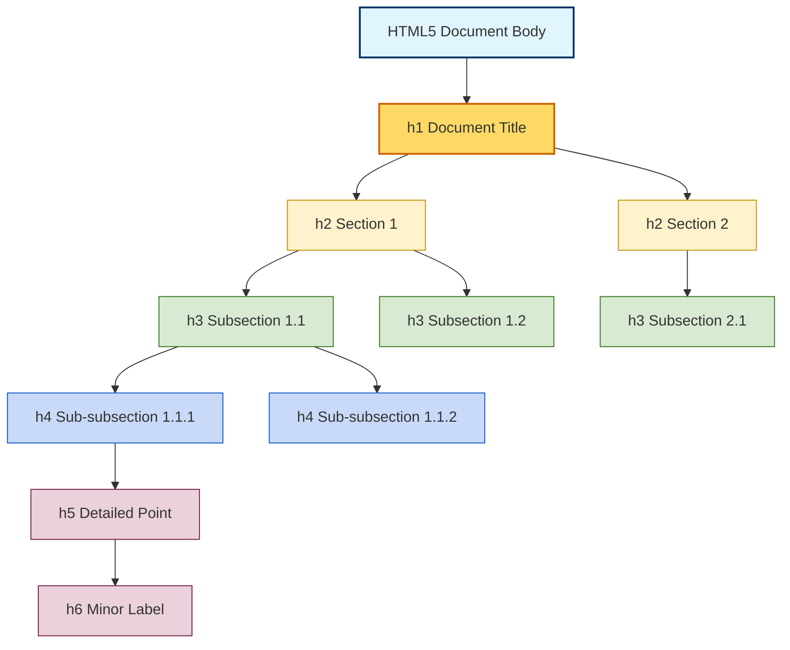
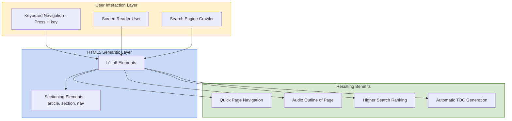

# Headings

<!-- SECTION_1_START -->
# HTML5 Headings: The Pillars of Web Document Architecture

## 1. Core Technical Definition

According to the **W3C HTML5 Specification (WHATWG HTML Living Standard)**, an HTML heading is a structural element that defines a title or subtitle within a section of a web document. HTML5 provides **six (6) distinct levels of headings**, represented by the elements `<h1>` through `<h6>`, where `<h1>` denotes the **highest level of importance** and `<h6>` denotes the **lowest**.

> [!IMPORTANT]
> **KTU 2024 Syllabus Definition (PECST742 - Module 1):**
> Headings are block-level semantic elements used to create a logical, hierarchical outline of a web page. They are not merely used to display large text — they communicate **document structure** to browsers, search engines, and assistive technologies (screen readers).

### Formal Syntax Specification

$$\texttt{Element Type: Block-level, Flow content, Palpable content}$$
$$\texttt{Range: } h1 \rightarrow h6 \quad \text{where} \quad \text{Importance}(h_i) > \text{Importance}(h_{i+1})$$

### Conceptual Analogy / Intuition

Think of an HTML document as a **book**:
- `<h1>` is the **book title** printed on the cover — there should ideally be only **one**.
- `<h2>` represents **chapter titles**.
- `<h3>` represents **sub-sections within a chapter**.
- `<h4>`, `<h5>`, and `<h6>` drill down deeper into **sub-sub-sections**, **paragraph headings**, and **minor labels** respectively.

Just like a book reader skims through headings to find what they need, a web user (or a search engine crawler) uses headings to navigate the page content efficiently. The visual size is just a *side-effect*; the **semantic meaning** is the real essence.

> [!NOTE]
> **Key Distinction from `<title>` Tag:**
> The `<title>` element lives inside `<head>` and sets the **browser tab name / bookmark title**, while `<h1>`–`<h6>` live inside `<body>` and structure the **visible page content**. This is a frequently tested KTU concept.

### Ranking of Importance & Default Visual Rendering

| Tag | Semantic Rank | Default CSS `font-size` (approx.) | Default CSS `font-weight` |
|:---:|:---:|:---:|:---:|
| `<h1>` | Highest — Document Title | **2em (32px)** | **bold (700)** |
| `<h2>` | Section Heading | 1.5em (24px) | bold (700) |
| `<h3>` | Sub-section | 1.17em (18.72px) | bold (700) |
| `<h4>` | Minor Heading | 1em (16px) | bold (700) |
| `<h5>` | Minor Sub-heading | 0.83em (13.28px) | bold (700) |
| `<h6>` | Lowest — Label | 0.67em (10.72px) | bold (700) |

> [!TIP]
> Default sizes are **never** hard rules. Modern web development relies entirely on **CSS** to control actual visual output. The HTML heading tag is for **meaning**, not for styling.

### GeoGebra / Desmos Visualization

> [!VISUALIZATION CONTROL]
> **Concept:** Relative Magnitude of HTML Heading Levels as a Decaying Function
> **GeoGebra / Desmos Input Equations:**
> * `f(x) = 32 * (0.83)^x` for `x ∈ [0, 5]`
> **Visual Description:** A smoothly decaying exponential curve starting at the point (0, 32) representing `<h1>` and ending near (5, 10.7) representing `<h6>`. The student should observe how the visual prominence drops as the heading level number increases — reinforcing the inverse relationship between `h-level` and `visual weight`.
<!-- SECTION_1_END -->

<!-- SECTION_2_START -->
# Deep Theoretical Analysis & High-Yield Notes

## 2.1 The Six Heading Elements — Detailed Breakdown

HTML5 defines exactly six heading levels. Let us analyze each one's role, constraints, and best practices.

### `<h1>` — The Document Root Heading
- Represents the **top-level heading** of the entire page.
- **KTU Board Emphasis:** Modern SEO (Search Engine Optimization) guidelines (Google, Bing Webmaster Guidelines) recommend **exactly one `<h1>` per page**. Using multiple `<h1>` is valid HTML5 (it can appear inside nested `<section>` elements), but it dilutes semantic clarity.
- Should contain the **primary topic** of the page — e.g., for a KTU student portal, `<h1>KTU B.Tech Web Programming Notes</h1>`.

### `<h2>` — Major Section Headings
- Defines primary divisions of the document.
- Common use: chapter titles in long-form articles, main product categories, or module headings.
- A page may contain **multiple `<h2>` elements**, each representing a different major section.

### `<h3>` — Sub-sections
- Lives *below* `<h2>` and breaks it into smaller logical chunks.
- **Why this matters:** Screen readers (e.g., NVDA, JAWS) generate a navigable heading list from these tags. Users with visual impairments can **jump** from `<h2>` to `<h3>` using keyboard shortcuts.

### `<h4>`, `<h5>`, `<h6>` — Deep Nesting
- Used for deeply nested content like card titles, form section dividers, legal sub-clauses, or table column groupings.
- Most modern web pages rarely go below `<h4>`. Going to `<h5>` or `<h6>` often signals that the document structure is too complex and should be **refactored** into smaller modular components.

## 2.2 Structural & Semantic Rules

1. **Empty Headings Are Invalid Semantically:** `<h1></h1>` with no content should be avoided — it provides no information.
2. **No Nesting of Headings:** A heading cannot contain another heading element (e.g., `<h1><h2>X</h2></h1>` is invalid).
3. **Block-Level Element:** Headings start on a new line and occupy the full available width.
4. **Containment by Sectioning Elements:** In HTML5, headings inherit their rank partly from the **sectioning root** they belong to (`<article>`, `<section>`, `<nav>`, `<aside>`).
5. **The "Outline Algorithm" Legacy:** HTML5 once introduced an outline algorithm where `<h1>` could be used multiple times within different sections, with its true rank determined by the section nesting. **However, browsers never implemented this algorithm**, and the W3C officially **removed it** in 2019. Current best practice: use headings sequentially without skipping levels.

## 2.3 Real-World Engineering Utility

| Application Domain | Why Headings Matter |
|:---|:---|
| **Search Engine Optimization (SEO)** | Google, Bing, and DuckDuckGo crawlers weight heading text heavily when ranking pages. `<h1>` carries the **highest SEO weight**. |
| **Web Accessibility (WCAG 2.1 / 2.2)** | Screen readers build a navigable table of contents from headings. Required for **Section 508 compliance** in US government and educational portals. |
| **Browser Features** | The browser's "Find in Page", reader mode, and bookmark systems all rely on heading metadata. |
| **Document Conversion Tools** | Pandoc, wkhtmltopdf, and headless Chrome (Puppeteer) extract heading hierarchies to build automatic **Tables of Contents** in PDF exports. |
| **Single Page Applications (React, Angular, Vue)** | Headings are preserved in Virtual DOM rendering, ensuring assistive tech compatibility in SPAs. |

## 2.4 KTU Formula Sheet / Cheat Sheet

| Concept | Rule / Formula | Notes |
|:---|:---|:---|
| Number of heading levels | **6** (`<h1>` to `<h6>`) | Fixed by HTML spec — cannot extend |
| Default `<h1>` font-size | **2em (≈ 32px)** | Browser default — overridable by CSS |
| Default heading `font-weight` | **bold (700)** | All six levels are bold by default |
| Recommended `<h1>` per page | **1** | Modern SEO best practice |
| Tag type | **Block-level** | Occupies full width, starts new line |
| Content model | **Phrasing content** (text, inline elements) | Cannot contain other block elements or other headings |
| Placement | **Inside `<body>`** | Never inside `<head>` (that's `<title>`) |
| Nesting rule | **No heading-in-heading** | `<h1><h2>x</h2></h1>` is invalid |
| W3C Validator check | **Section contains heading** (advisory) | For semantic completeness |

## 2.5 Common Student Misconceptions

- ❌ **"Headings are just big text"** — They are **semantic markers**, not visual tools. Use CSS for visual styling.
- ❌ **"Skipping levels is fine"** — Jumping from `<h1>` to `<h4>` breaks the **document outline** and confuses screen readers.
- ❌ **"`<h1>` is just for the logo"** — This was a 2010-era practice. Modern accessibility guidelines (WAI-ARIA Authoring Practices) explicitly **discourage** using heading tags for non-heading content.
- ❌ **"More `<h1>` tags = better SEO"** — Search engines may **penalize** keyword-stuffed heading hierarchies.
<!-- SECTION_2_END -->

<!-- SECTION_3_START -->
# Step-by-Step Implementation: Code & Symbolic Walkthroughs

## 3.1 Basic Heading Example — Full Working HTML5 Document

```html
<!DOCTYPE html>
<html lang="en">
<head>
    <meta charset="UTF-8">
    <title>HTML5 Headings Demonstration</title>
    <!-- Note: <title> lives in <head> and sets the browser tab name -->
</head>
<body>
    <!-- The h1 is the top-level document heading -->
    <h1>Welcome to Web Programming (PECST742)</h1>

    <!-- h2 introduces a major section -->
    <h2>Module 1: Creating Web Pages using HTML5</h2>

    <!-- h3 introduces a sub-section under Module 1 -->
    <h3>Topic: HTML Headings</h3>

    <!-- h4, h5, h6 are rarely used, but valid for deep nesting -->
    <h4>4.1 Importance of Semantic Structure</h4>
    <h5>4.1.1 Accessibility Considerations</h5>
    <h6>4.1.1.1 Screen Reader Behavior</h6>
</body>
</html>
```

**Symbolic Trace of the Document Outline:**

$$
\begin{aligned}
\text{Document Root} &\rightarrow \text{h1} \;(\text{Web Programming}) \\
&\quad \rightarrow \text{h2} \;(\text{Module 1}) \\
&\quad\quad \rightarrow \text{h3} \;(\text{Headings}) \\
&\quad\quad\quad \rightarrow \text{h4} \;(\text{Semantic Structure}) \\
&\quad\quad\quad\quad \rightarrow \text{h5} \;(\text{Accessibility}) \\
&\quad\quad\quad\quad\quad \rightarrow \text{h6} \;(\text{Screen Reader})
\end{aligned}
$$

## 3.2 Headings Inside HTML5 Sectioning Elements (Best Practice)

This pattern is **highly valued in KTU 14-mark questions** because it demonstrates real-world semantic mastery.

```html
<!DOCTYPE html>
<html lang="en">
<head>
    <meta charset="UTF-8">
    <title>KTU Academic Portal</title>
</head>
<body>
    <h1>KTU B.Tech Resources</h1>

    <!-- Each <article> has its own internal heading hierarchy -->
    <article>
        <h2>Web Programming Notes</h2>
        <section>
            <h3>Module 1: HTML5 Basics</h3>
            <p>Headings, paragraphs, and lists...</p>
        </section>
        <section>
            <h3>Module 2: CSS3 Styling</h3>
            <p>Selectors, box model, and layout...</p>
        </section>
    </article>

    <article>
        <h2>Data Structures Notes</h2>
        <section>
            <h3>Module 1: Arrays and Linked Lists</h3>
        </section>
    </article>
</body>
</html>
```

**Analytical Verification — Does this obey the no-skip rule?**

$$
\begin{aligned}
\text{Page Outline:} \quad &h1 \rightarrow h2 \rightarrow h3 \\
\text{No level skipped} \quad &\Rightarrow \text{Valid document outline} \checkmark
\end{aligned}
$$

## 3.3 CSS Overriding Default Heading Appearance (Conceptual Linking)

```html
<!DOCTYPE html>
<html lang="en">
<head>
    <meta charset="UTF-8">
    <title>Customized Headings</title>
    <style>
        /* Override defaults — proves headings are semantic, not visual */
        h1 {
            font-size: 3em;          /* Bigger than default 2em */
            color: #003366;          /* KTU blue tone */
            border-bottom: 2px solid #003366;
        }
        h2 {
            font-size: 1.4em;        /* SMALLER than default h3 */
            font-style: italic;
        }
    </style>
</head>
<body>
    <h1>Custom Styled Heading</h1>
    <h2>This h2 is visually smaller than an unstyled h3</h2>
</body>
</html>
```

> [!IMPORTANT]
> **Pedagogical Insight:** In the example above, `<h2>` is rendered *smaller* than the default `<h3>` would be. This proves that **HTML heading tag ≠ visual size**. The tag is purely semantic; CSS dictates appearance.

## 3.4 Inline Elements Allowed Inside Headings

Headings can contain **phrasing content** — inline elements like `<span>`, `<em>`, `<strong>`, `<a>`, and `` (with appropriate `alt` text) are all permitted.

```html
<h1>Welcome to <em>Web Programming</em></h1>
<h2>Module <span style="color: red;">1</span>: HTML5</h2>
<h3><a href="#section4">Jump to Section 4</a></h3>
```

**What is NOT allowed:**

```html
<!-- INVALID: Block element inside heading -->
<h1><div>Welcome</div></h1>

<!-- INVALID: Another heading nested inside -->
<h1>Module 1 <h2>Sub-Heading</h2></h1>
```

The HTML5 parser will auto-close the outer heading in the second case, producing a structural error that fails W3C validation.

## 3.5 Python Helper — Validating a Document's Heading Outline

This is a useful KTU lab exercise demonstrating how to programmatically enforce the **no-skip-heading** rule.

```python
from html.parser import HTMLParser
from typing import List, Optional

class HeadingOutlineValidator(HTMLParser):
    """
    Parses an HTML5 document and validates that the heading hierarchy
    never skips levels (e.g., h1 -> h3 without an h2 in between).
    """
    def __init__(self) -> None:
        super().__init__()
        self.outline: List[int] = []
        self.errors: List[str] = []

    def handle_starttag(self, tag: str, attrs: list) -> None:
        if tag.lower() in {"h1", "h2", "h3", "h4", "h5", "h6"}:
            level: int = int(tag[1])
            if self.outline:
                last_level: int = self.outline[-1]
                # Heading level must not skip more than one
                if level > last_level + 1:
                    self.errors.append(
                        f"INVALID: Skipped from <h{last_level}> "
                        f"to <h{level}>. Expected <h{last_level + 1}>."
                    )
            self.outline.append(level)

    def get_report(self) -> str:
        if not self.errors:
            return f"VALID outline. Sequence: {self.outline}"
        return "ERRORS FOUND:\n" + "\n".join(self.errors)


# --- Test Execution ---
sample_html = """
<html><body>
    <h1>Title</h1>
    <h2>Section</h2>
    <h4>Skipped h3!</h4>
</body></html>
"""

validator: HeadingOutlineValidator = HeadingOutlineValidator()
validator.feed(sample_html)
print(validator.get_report())
```

**Expected Output:**

$$
\text{ERRORS FOUND:} \\
\text{INVALID: Skipped from <h2> to <h4>. Expected <h3>.}
$$

This validator enforces the same rule that **screen readers and accessibility auditors** apply in production systems.
<!-- SECTION_3_END -->

<!-- SECTION_4_START -->
# Structural Diagram: Heading Hierarchy & Processing Flow

## 4.1 Mermaid Block — Heading Hierarchy as a Tree



## 4.2 Mermaid Block — Sequential Processing: How a Browser Renders Headings

```mermaid
flowchart LR
    subgraph PARSE["Phase 1: HTML Parser"]
        P1[Tokenize h1-h6 tags] --> P2[Build DOM Tree]
        P2 --> P3[Assign semantic rank]
    end
    
    subgraph STYLE["Phase 2: CSS Engine"]
        S1[Apply User-Agent Default] --> S2[Apply Author Stylesheet]
        S2 --> S3[Apply Inline style attr]
    end
    
    subgraph PAINT["Phase 3: Render Tree"]
        R1[Compute Layout Box] --> R2[Paint Text Glyphs]
    end
    
    subgraph A11Y["Phase 4: Accessibility Layer"]
        AX1[Generate Heading Map] --> AX2[Expose to Screen Reader]
    end
    
    P3 --> S1
    S3 --> R1
    R2 --> AX1
    
    style PARSE fill:#fff4e6,stroke:#cc6600
    style STYLE fill:#e6f3ff,stroke:#003366
    style PAINT fill:#e6ffe6,stroke:#38761d
    style A11Y fill:#fce4ec,stroke:#741b47
```



## 4.3 Sequential Processing Topology Matrix

| Phase | Component | Input | Output | KTU Relevance |
|:---:|:---|:---|:---|:---|
| 1 | HTML Tokenizer | Raw `.html` file | Token stream with `startTag(h1)` events | Module 1 — Document structure |
| 2 | DOM Tree Builder | Token stream | Tree node with `tagName="H1"` | Module 1 — Semantic structure |
| 3 | CSS Style Resolver | DOM + Stylesheets | Computed style for each heading | Module 2 (CSS) — Visual layer |
| 4 | Layout Engine | Styled nodes | Positioned boxes on the page | Module 2 — Box model |
| 5 | Accessibility Tree Builder | DOM nodes | A11Y tree with `role="heading"`, `aria-level` | Module 5 (Web Accessibility) |

## 4.4 Block-Level Functional Architecture Flow


<!-- SECTION_4_END -->

<!-- SECTION_5_START -->
# KTU 2024 Scheme Examination Question Bank & Topic Recap

## Part A — Short Answer Questions (3 Marks Each)

### Question 1
`[KTU University Exam - July 2024]`
**Q: List the six heading tags in HTML5 and explain the role of `<h1>`.** **[CO1, Remember]**

**Model Answer (3 Marks):**

The six heading tags in HTML5 are: `<h1>`, `<h2>`, `<h3>`, `<h4>`, `<h5>`, and `<h6>`.

The `<h1>` tag represents the **highest level of heading** in an HTML document. It typically defines the **main title** of the page and carries the **highest semantic importance** among all heading levels. Search engines like Google assign the maximum weight to `<h1>` content for indexing and ranking. Best practice dictates that a page should contain **only one `<h1>`** element to maintain clear document structure. **[3 Marks]**

> [!NOTE]
> **Valuation Tip:** Award 1 mark for listing the six tags, 1 mark for defining `<h1>`, and 1 mark for mentioning the "one per page" best practice.

---

### Question 2
`[KTU University Exam - Dec 2023]`
**Q: Differentiate between the `<title>` tag and the `<h1>` tag.** **[CO1, Understand]**

**Model Answer (3 Marks):**

| Feature | `<title>` Tag | `<h1>` Tag |
|:---|:---|:---|
| Location | Inside `<head>` section | Inside `<body>` section |
| Visibility | Not visible on the page body; shown in browser tab | Visible on the page as the main heading |
| Purpose | Names the document (used by browser tabs, bookmarks, history) | Provides semantic structure to visible content |
| Count per page | **Exactly one** (mandatory) | **One recommended** (semantic best practice) |
| Accessibility | Read by screen readers as document title | Used to build page navigation outline |

**[3 Marks]**

---

## Part B — 14 Mark Questions (Module Internal Choice)

### Question A — Option 1

`[KTU University Exam - July 2024]`
**Q: (a) Explain the different levels of headings in HTML5 with their default visual behavior. Discuss the rule of "no skipping levels" with an example.** **[CO1, Understand — 7 Marks]**

**(b) Design a complete HTML5 page for a "KTU B.Tech 2024 Scheme Syllabus" portal that demonstrates proper use of `<h1>`, `<h2>`, `<h3>`, and `<h4>` tags within nested sectioning elements. Show the rendered outline structure.** **[CO1, Apply — 7 Marks]**

---

#### Model Solution for (a) — 7 Marks

HTML5 provides **six levels of headings**: `<h1>` to `<h6>`. **[1 Mark]**

**Default Visual Behavior:**

| Tag | Default `font-size` | Purpose |
|:---:|:---:|:---|
| `<h1>` | 2em | Top-level document title |
| `<h2>` | 1.5em | Major section |
| `<h3>` | 1.17em | Sub-section |
| `<h4>` | 1em | Minor heading |
| `<h5>` | 0.83em | Minor sub-heading |
| `<h6>` | 0.67em | Lowest-level label |

**[2 Marks]**

**No Skipping Levels Rule:** A valid HTML document outline should not jump heading levels. For example, going from `<h1>` directly to `<h3>` (skipping `<h2>`) is semantically invalid because it creates a broken outline that screen readers cannot interpret correctly. **[2 Marks]**

**Example of Invalid vs Valid:**

```html
<!-- INVALID: h1 -> h3 (skips h2) -->
<h1>Module 1</h1>
<h3>Headings</h3>

<!-- VALID: Sequential hierarchy -->
<h1>Module 1</h1>
<h2>HTML5 Basics</h2>
<h3>Headings</h3>
```

**[2 Marks]**

---

#### Model Solution for (b) — 7 Marks

```html
<!DOCTYPE html>
<html lang="en">
<head>
    <meta charset="UTF-8">
    <title>KTU B.Tech 2024 Syllabus Portal</title>
</head>
<body>
    <h1>KTU B.Tech 2024 Scheme — Syllabus Overview</h1>   <!-- 1 mark -->

    <section>
        <h2>Semester 7 — Professional Elective Cluster</h2> <!-- 1 mark -->
        <article>
            <h3>Web Programming (PECST742)</h3>              <!-- 1 mark -->
            <section>
                <h4>Module 1: HTML5 Fundamentals</h4>        <!-- 1 mark -->
                <p>Topics: Headings, Lists, Tables, Forms.</p>
            </section>
            <section>
                <h4>Module 2: CSS3 and Layout</h4>
                <p>Topics: Selectors, Box Model, Flexbox.</p>
            </section>
        </article>

        <article>
            <h3>Data Structures (PCCST403)</h3>              <!-- 1 mark -->
            <section>
                <h4>Module 1: Arrays and Lists</h4>
            </section>
        </article>
    </section>
</body>
</html>
```

**[Document Outline Structure — 2 Marks]:**

$$
\begin{aligned}
\text{h1:} & \quad \text{KTU B.Tech 2024 Scheme Syllabus Overview} \\
\quad \text{h2:} & \quad \text{Semester 7 — Professional Elective Cluster} \\
\quad\quad \text{h3:} & \quad \text{Web Programming (PECST742)} \\
\quad\quad\quad \text{h4:} & \quad \text{Module 1: HTML5 Fundamentals} \\
\quad\quad\quad \text{h4:} & \quad \text{Module 2: CSS3 and Layout} \\
\quad\quad \text{h3:} & \quad \text{Data Structures (PCCST403)} \\
\quad\quad\quad \text{h4:} & \quad \text{Module 1: Arrays and Lists}
\end{aligned}
$$

**Valuation Key:**
- Correctly placed `<h1>`: 1 Mark
- Correctly placed `<h2>` inside `<section>`: 1 Mark
- `<h3>` inside `<article>` (×2 instances): 1 Mark
- `<h4>` nested inside `<section>`: 1 Mark
- Outline structure listing: 2 Marks
- No level skipping in the entire document: 1 Mark

---

### Question B — Option 2 (Alternative Choice)

`[KTU University Exam - Dec 2023]`
**Q: (a) Explain the semantic importance of HTML5 headings. How do they differ from merely increasing the font size of text using CSS? Provide at least three real-world use cases where heading structure is critical.** **[CO1, Understand — 7 Marks]**

**(b) Write an HTML5 program that uses all six heading levels (`<h1>` to `<h6>`) inside a single page. Apply inline CSS to make the `<h6>` element appear visually larger than the `<h1>` element, and explain why this still does not violate the semantic structure.** **[CO1, Apply — 7 Marks]**

---

#### Model Solution for (a) — 7 Marks

**Semantic Importance:** HTML5 headings are **semantic markers** that define the structure and outline of a document, not its visual appearance. **[1 Mark]** They convey meaning to browsers, search engines, and assistive technologies about the relative importance and hierarchy of content sections. **[1 Mark]**

**Difference from CSS Font-Size:**

| Aspect | HTML Heading Tag | CSS `font-size` on `<p>` |
|:---|:---|:---|
| Meaning | Carries semantic rank (1–6) | No semantic meaning |
| Accessibility | Used by screen readers to build outline | Invisible to accessibility tools |
| SEO | Search engines weight heading text heavily | Treated as plain paragraph content |
| Document Outline | Contributes to outline tree | Does not contribute to outline |

**[2 Marks]**

**Real-World Use Cases:** **[3 Marks — 1 Mark each]**

1. **Web Accessibility (WCAG 2.1 Compliance):** Screen reader users press keyboard shortcut 'H' to jump from one heading to the next. Without proper headings, they cannot navigate the page.
2. **Search Engine Optimization (SEO):** Google's PageRank algorithm uses `<h1>` content as a primary indicator of page topic. Higher heading rank = higher content weight.
3. **Automated Document Conversion:** Tools like Pandoc and wkhtmltopdf extract heading tags to auto-generate Tables of Contents in PDF and eBook formats.

---

#### Model Solution for (b) — 7 Marks

```html
<!DOCTYPE html>
<html lang="en">
<head>
    <meta charset="UTF-8">
    <title>All Six Headings Demo</title>
</head>
<body>
    <h1>Heading Level 1 - Highest Semantic Rank</h1>      <!-- 1 mark -->
    <h2>Heading Level 2 - Major Section</h2>              <!-- 1 mark -->
    <h3>Heading Level 3 - Sub Section</h3>                <!-- 1 mark -->
    <h4>Heading Level 4 - Minor Heading</h4>              <!-- 1 mark -->
    <h5>Heading Level 5 - Minor Sub Heading</h5>          <!-- 1 mark -->

    <!-- h6 with custom style OVERRIDING its small default -->
    <h6 style="font-size: 4em; color: red;">
        Heading Level 6 - Visually Largest!
    </h6>                                                  <!-- 1 mark -->
</body>
</html>
```

**Explanation:** In the code above, `<h6>` carries the **lowest semantic rank (level 6)**, but the inline CSS `style="font-size: 4em;"` makes it render **larger than `<h1>`** on the screen. **[0.5 Mark]**

This does **not violate semantic structure** because the HTML tag still indicates to screen readers and crawlers that this is a *minor* heading. The CSS only controls **visual presentation**, which is a separate layer. A screen reader would still announce this as "Heading Level 6" — preserving the correct outline. This demonstrates the fundamental HTML5 design principle: **separation of content semantics from visual styling**. **[0.5 Mark]**

---

## KTU Examiner's Valuation Warning / Pitfall Callout

> [!WARNING]
> **Common Mistakes Where KTU Students Lose Marks:**
> 1. **Confusing `<h1>` with `<title>`** — These are entirely different tags in different sections of the document. Examiners specifically test this in 3-mark questions.
> 2. **Writing "headings make text big"** — This answer shows a lack of understanding of semantic HTML. Always emphasize *meaning*, not *visual size*.
> 3. **Skipping heading levels in code outputs** — A 14-mark answer with `<h1>` followed by `<h4>` directly will lose 1–2 marks for breaking the outline rule.
> 4. **Forgetting to wrap code in `<!DOCTYPE html>` and proper structure** — KTU questions often ask for a "complete HTML5 page" — missing the DOCTYPE declaration results in a 0.5 to 1 mark deduction.
> 5. **Using multiple `<h1>` tags without justification** — While valid in some HTML5 contexts, examiners expect students to recommend the "one `<h1>` per page" best practice.
> 6. **Not showing the document outline** in 14-mark answers — Always include the hierarchical outline of your headings as part of the solution.

---

## Topic Recap & Important Things to Remember

- ✅ HTML5 provides **exactly six heading levels**: `<h1>`, `<h2>`, `<h3>`, `<h4>`, `<h5>`, `<h6>`.
- ✅ `<h1>` has the **highest semantic importance**; `<h6>` has the lowest.
- ✅ Headings are **block-level semantic elements** placed inside `<body>`, not `<head>`.
- ✅ **`<title>`** (in `<head>`) ≠ **`<h1>`** (in `<body>`) — different purposes, different placement.
- ✅ Recommended: **one `<h1>` per page** for clean SEO and accessibility.
- ✅ Default visual sizes decrease from `<h1>` (2em) to `<h6>` (0.67em), but **these are overridable by CSS**.
- ✅ Headings are about **meaning**, not **appearance** — CSS controls visuals.
- ✅ The **"no skipping levels"** rule ensures valid document outlines for screen readers.
- ✅ Headings cannot contain other headings or block elements — only **phrasing content** (text, `<span>`, `<em>`, `<a>`, ``).
- ✅ Critical for: **SEO ranking**, **WCAG accessibility compliance**, **PDF export TOCs**, and **SPA navigation**.
- ✅ The W3C deprecated the **HTML5 Outline Algorithm** in 2019 — sequential heading hierarchy is the only reliable approach today.
- ✅ For 14-mark KTU answers, always include: working code + document outline + explanation of semantic vs visual difference.
<!-- SECTION_5_END -->
