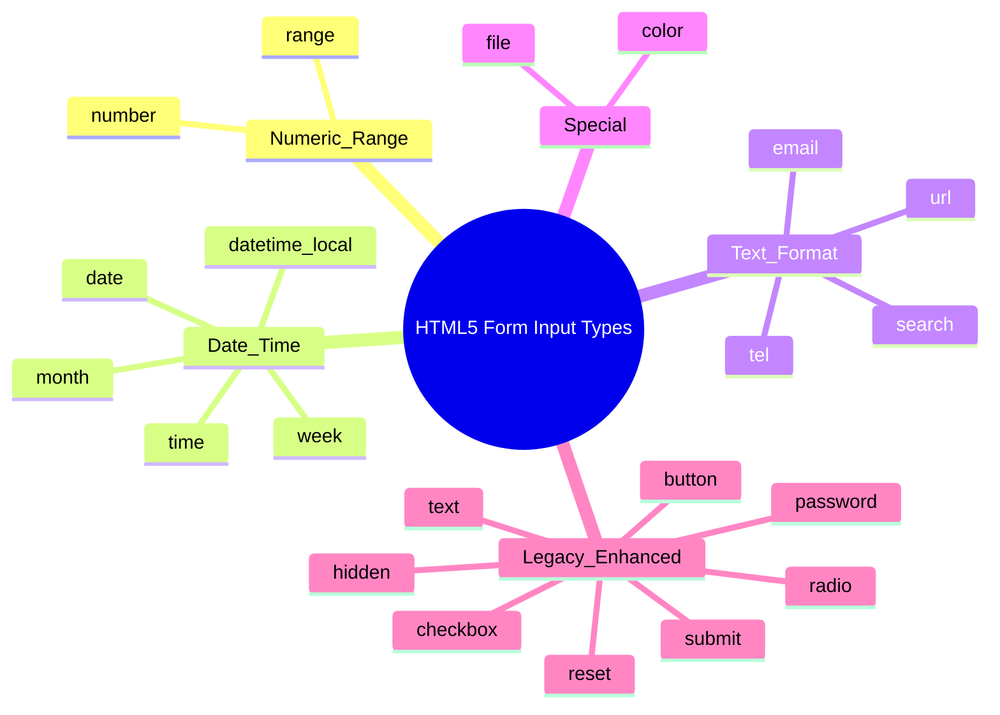
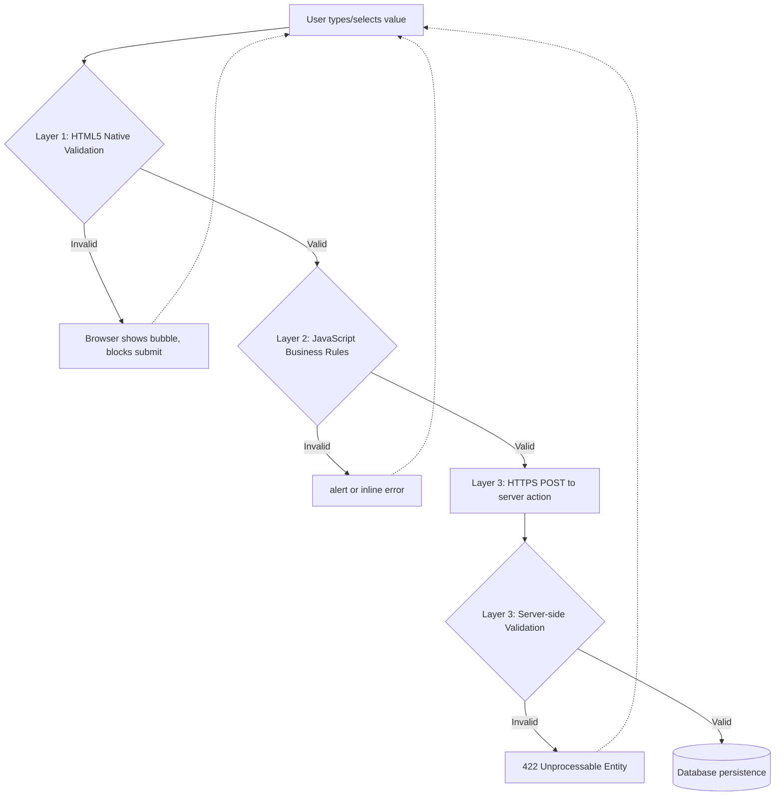
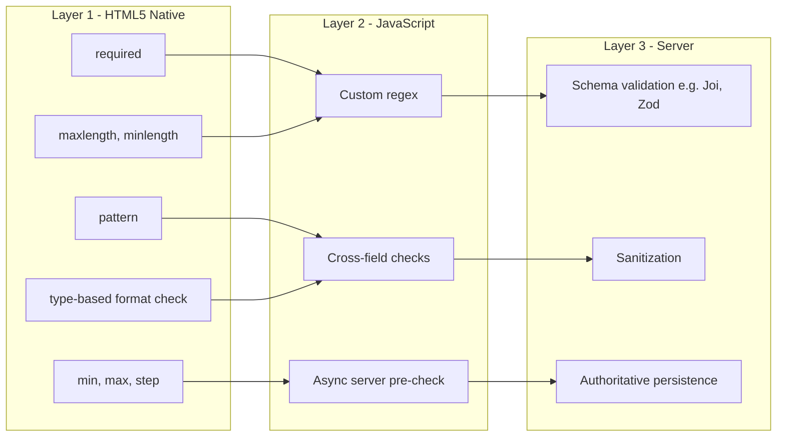
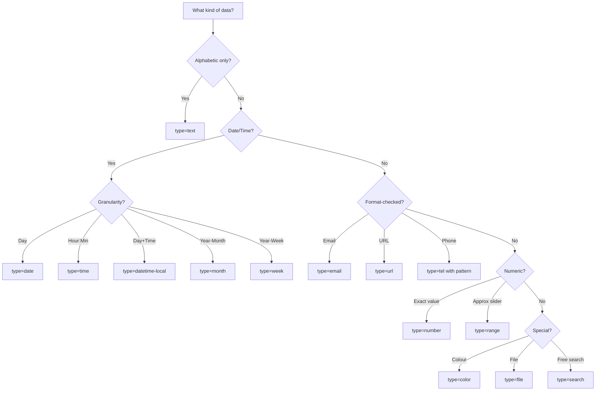

# HTML5 Form input Types

<!-- SECTION_1_START -->
# HTML5 Form Input Types — Core Technical Definition & Intuitive Overview

## 1.1 Formal Academic Definition (KTU 2024 Syllabus Terminology)

> [!IMPORTANT]
> **HTML5 Form Input Types** are specialized, semantically meaningful `<input>` element `type` attribute values introduced in the **W3C HTML5 Recommendation (2014)** that provide native, browser-level support for capturing, validating, and formatting specific kinds of user data without requiring custom JavaScript libraries. They extend the legacy HTML 4.01 input types (`text`, `password`, `checkbox`, `radio`, `submit`, `reset`, `button`, `file`, `hidden`, `image`) by adding **13 new input types**: `color`, `date`, `datetime-local`, `email`, `month`, `number`, `range`, `search`, `tel`, `time`, `url`, `week`, and the support attributes like `required`, `placeholder`, `pattern`, `min`, `max`, `step`, `autofocus`, and `autocomplete`.

> [!NOTE]
> **Module 1 Mapping:** This topic falls under *Module 1 — Creating Web Pages Using HTML5* and directly satisfies **CO1**: *"Apply HTML5 semantic elements and form constructs to develop standards-compliant, accessible, and validated static web pages."*

## 1.2 Conceptual Analogy / Intuition

Think of a **government form** at a registrar's office. The old HTML 4 forms were like a **single blank paper** — the officer had to manually check that you wrote a date, a number, a phone number. With **HTML5 input types**, it is like the officer handing you a **pre-printed form with labelled boxes**: a box that *only* accepts a date, a slider that *only* lets you pick a number between 1 and 100, a colour picker, a calendar widget. The browser itself becomes the validator. If you type letters into the "date" box, the browser refuses, just like a vending machine refusing a ₹10 note in a ₹5 slot.

## 1.3 The `form` Element — The Container

```html
<form action="/submit" method="POST" autocomplete="on" novalidate>
  <!-- input elements live here -->
</form>
```

> [!TIP]
> **Key attributes of `<form>`:** `action` (URL to send data), `method` (`GET` or `POST`), `target`, `enctype`, `autocomplete`, `novalidate` (disables built-in validation), `name`.

## 1.4 Common Global Attributes for Input Elements

| Attribute | Purpose | Example |
|---|---|---|
| `type` | Defines the data kind and widget | `type="email"` |
| `name` | Key used in form data payload | `name="user_email"` |
| `id` | DOM identifier, used by `<label>` | `id="email1"` |
| `value` | Default / current value | `value="Kerala"` |
| `placeholder` | Hint text shown when empty | `placeholder="Enter name"` |
| `required` | Field must be filled | `required` |
| `disabled` | Field is greyed out and skipped | `disabled` |
| `readonly` | Visible but uneditable | `readonly` |
| `autofocus` | Cursor lands here on page load | `autofocus` |
| `autocomplete` | Browser autofill hint | `autocomplete="off"` |

> [!VISUALIZATION CONTROL]
> **Concept:** Hierarchical Form Anatomy (Logical Form Tree)
> **Diagram Description (mental model):**
> ROOT → `<form>` (Container)
> &nbsp;&nbsp;├─ `<fieldset>` (Thematic group, optional)
> &nbsp;&nbsp;&nbsp;&nbsp;├─ `<legend>` (Caption of the group)
> &nbsp;&nbsp;&nbsp;&nbsp;├─ `<label>` → binds to `<input type="...">` (Accessibility)
> &nbsp;&nbsp;&nbsp;&nbsp;├─ `<input>` (The data widget)
> &nbsp;&nbsp;&nbsp;&nbsp;└─ `<datalist>` (Predefined suggestions, optional)
> &nbsp;&nbsp;├─ `<select>` / `<textarea>` (Alternative widgets)
> &nbsp;&nbsp;└─ `<button type="submit|reset|button">`
> **Visual Cue:** Each `<input>` is a labelled box; the `type` attribute changes both the *visual widget* and the *validation rule*.
<!-- SECTION_1_END -->

<!-- SECTION_2_START -->
# Deep Theoretical Analysis & KTU High-Yield Cheat Sheet

## 2.1 Classification of HTML5 Input Types

The 13 new input types are grouped into **three functional families** for clarity.

### A) Numeric & Range Family
- `number` — accepts integers/decimals; spinner UI.
- `range` — slider UI; no value typing.

### B) Date & Time Family
- `date` — year, month, day (e.g., `2025-03-14`).
- `month` — year and month (e.g., `2025-03`).
- `week` — year and week number (e.g., `2025-W11`).
- `time` — hour, minute, optional second (e.g., `14:30`).
- `datetime-local` — date + time, **no timezone** (e.g., `2025-03-14T14:30`).

### C) Text Variant & Format-Specific Family
- `email` — RFC 5322 e-mail pattern.
- `url` — must start with a scheme (e.g., `https://`).
- `tel` — no fixed format, hints to mobile keypad.
- `search` — semantically a search box; rounded in some browsers.
- `color` — hex colour picker (`#rrggbb`).
- `password` — masked text (technically HTML 4, but enhanced in HTML5).

## 2.2 New HTML5 Input Attributes (The Validation Engine)

| Attribute | Applies To | Behaviour |
|---|---|---|
| `required` | All except hidden, range, color, submit | Field must be non-empty |
| `placeholder` | text, search, url, tel, email, password | Hint text, **not** a label |
| `pattern` | text, search, url, tel, email, password | ECMAScript regex, anchored implicitly |
| `min`, `max` | number, range, date, time, datetime-local, month, week | Inclusive bounds |
| `step` | Same as above | Granularity (default = 1) |
| `maxlength` | text, search, url, tel, email, password | Hard character cap |
| `minlength` | Same as above | Soft minimum |
| `autocomplete` | Most text-like types | `on`, `off`, or a token like `email`, `name` |
| `autofocus` | All | Focuses on page load (only one per page) |
| `form` | All | Associates input with a `<form>` outside its parent |
| `list` | Most | Binds to a `<datalist id="...">` for suggestions |
| `multiple` | email, file | Allows comma-separated emails / multiple files |
| `accept` | file | MIME types or extensions: `accept="image/*,.pdf"` |
| `capture` | file | `user` (front cam) / `environment` (rear cam) |
| `inputmode` | text, search, tel, url, email | Hint to mobile keyboard: `numeric`, `tel`, `email`, `url`, `decimal`, `search` |

## 2.3 KTU High-Yield Cheat Sheet

| # | Input Type | Format / Pattern | Key Validation | Typical Use |
|---|---|---|---|---|
| 1 | `color` | `#RRGGBB` | Always required if used | Theme picker |
| 2 | `date` | `YYYY-MM-DD` | `min`, `max` | DOB, booking |
| 3 | `datetime-local` | `YYYY-MM-DDTHH:MM` | `min`, `max`, `step` | Meeting scheduler |
| 4 | `email` | `local@domain.tld` | One `@`, valid TLD, no spaces | Login, contact |
| 5 | `month` | `YYYY-MM` | `min`, `max` | Expiry month |
| 6 | `number` | Integer or float | `min`, `max`, `step` | Quantity, age |
| 7 | `range` | Float in `[min, max]` | `min`, `max`, `step` | Brightness, price slider |
| 8 | `search` | Free text | `maxlength` | Site search |
| 9 | `tel` | Free text (no built-in regex) | `pattern` (e.g., Indian 10-digit) | Phone number |
| 10 | `time` | `HH:MM` or `HH:MM:SS` | `min`, `max`, `step` | Alarm, slot booking |
| 11 | `url` | `scheme://...` | `pattern` optional | Website link |
| 12 | `week` | `YYYY-Www` (e.g., `2025-W11`) | `min`, `max` | Sprint planning |
| 13 | `file` | Binary | `accept`, `multiple` | Resume upload, photo |

## 2.4 The `<datalist>` Element (Companion to Input)

```html
<input list="browsers" name="browser">
<datalist id="browsers">
  <option value="Chrome">
  <option value="Firefox">
  <option value="Edge">
  <option value="Safari">
</datalist>
```
The `list` attribute on the input references the `id` of the `<datalist>`. Unlike `<select>`, the user can still **type a custom value**.

## 2.5 Real-World Engineering Utility

In production web stacks (MERN, LAMP, Django, Spring), HTML5 input types act as the **first line of defence** in a *defence-in-depth* validation strategy:
1. **Client-side native validation** (HTML5) — fastest feedback, no server round-trip.
2. **JavaScript validation** — complex business rules (e.g., "password must contain a symbol").
3. **Server-side validation** — authoritative; never to be skipped.

This three-tier approach is foundational in **OWASP Top 10** security, especially for preventing SQL Injection and XSS via sanitised input.
<!-- SECTION_2_END -->

<!-- SECTION_3_START -->
# Step-by-Step Derivations & Code Implementation

## 3.1 Exhaustive Code Demonstration — All 13 HTML5 Input Types in One Valid Form

The following code is **complete, copy-paste runnable**, and exercises every input type introduced above. Save as `demo.html` and open in any modern browser.

```html
<!DOCTYPE html>
<html lang="en">
<head>
  <meta charset="UTF-8">
  <title>HTML5 Form Input Types — KTU Demo</title>
  <style>
    body  { font-family: "Segoe UI", Arial, sans-serif; max-width: 720px; margin: 24px auto; }
    fieldset { border: 1px solid #2c7be5; border-radius: 8px; padding: 16px; margin-bottom: 20px; }
    legend   { color: #2c7be5; font-weight: 600; padding: 0 8px; }
    label    { display: block; margin-top: 10px; font-weight: 500; }
    input, select, textarea { width: 100%; padding: 6px; box-sizing: border-box; }
    input[type="color"], input[type="range"] { width: 80px; }
    button   { padding: 8px 16px; margin-right: 8px; cursor: pointer; }
    .err     { color: #c0392b; font-size: 0.85em; }
  </style>
</head>
<body>
  <h1>Student Registration — KTU Web Programming</h1>

  <form id="regForm" action="/register" method="POST" enctype="multipart/form-data">

    <!-- 1. TEXT + placeholder + required + maxlength -->
    <fieldset>
      <legend>Identity</legend>

      <label for="fname">First Name *</label>
      <input type="text" id="fname" name="first_name"
             placeholder="e.g., Anjali"
             required maxlength="30" minlength="2"
             autocomplete="given-name" autofocus>

      <label for="email">Email *</label>
      <input type="email" id="email" name="email"
             placeholder="you@ktu.ac.in"
             required multiple
             autocomplete="email">

      <label for="url">Portfolio URL</label>
      <input type="url" id="url" name="portfolio"
             placeholder="https://github.com/username"
             pattern="https://.*">
    </fieldset>

    <!-- 2. NUMERIC + RANGE -->
    <fieldset>
      <legend>Academics</legend>

      <label for="cgpa">CGPA (0 – 10) *</label>
      <input type="number" id="cgpa" name="cgpa"
             min="0" max="10" step="0.01" required
             placeholder="e.g., 8.42">

      <label for="exp">Years of Experience: <span id="expVal">0</span></label>
      <input type="range" id="exp" name="experience"
             min="0" max="20" step="1" value="0"
             oninput="document.getElementById('expVal').textContent=this.value">
    </fieldset>

    <!-- 3. DATE / TIME FAMILY -->
    <fieldset>
      <legend>Schedule</legend>

      <label for="dob">Date of Birth *</label>
      <input type="date" id="dob" name="dob"
             min="1990-01-01" max="2010-12-31" required>

      <label for="slot">Preferred Slot</label>
      <input type="time" id="slot" name="slot"
             min="09:00" max="17:00" step="900">

      <label for="meet">Meeting Date &amp; Time</label>
      <input type="datetime-local" id="meet" name="meeting"
             min="2025-01-01T00:00">

      <label for="sprint">Current Sprint</label>
      <input type="week" id="sprint" name="sprint">

      <label for="expiry">Library Card Expiry (Month)</label>
      <input type="month" id="expiry" name="expiry"
             min="2025-01">
    </fieldset>

    <!-- 4. TEL with Indian pattern -->
    <fieldset>
      <legend>Contact</legend>

      <label for="phone">Mobile (10-digit, India) *</label>
      <input type="tel" id="phone" name="phone"
             placeholder="9876543210"
             pattern="[6-9][0-9]{9}"
             title="Must be 10 digits starting with 6,7,8,9"
             required inputmode="tel">
    </fieldset>

    <!-- 5. COLOR + SEARCH -->
    <fieldset>
      <legend>Preferences</legend>

      <label for="favcolor">Favourite Colour</label>
      <input type="color" id="favcolor" name="favcolor" value="#2c7be5">

      <label for="search">Search Course</label>
      <input type="search" id="search" name="search"
             placeholder="e.g., Machine Learning">
    </fieldset>

    <!-- 6. FILE with accept + multiple -->
    <fieldset>
      <legend>Uploads</legend>

      <label for="resume">Upload Resume (PDF only, max 2 MB) *</label>
      <input type="file" id="resume" name="resume"
             accept="application/pdf,.pdf" required>

      <label for="photos">Upload Project Screenshots</label>
      <input type="file" id="photos" name="photos"
             accept="image/*" multiple>
    </fieldset>

    <!-- 7. DATALIST (Suggestions) -->
    <fieldset>
      <legend>Branch</legend>

      <label for="branch">Branch *</label>
      <input list="branchList" id="branch" name="branch" required>
      <datalist id="branchList">
        <option value="Computer Science">
        <option value="Information Technology">
        <option value="Electronics &amp; Communication">
        <option value="Mechanical">
        <option value="Civil">
      </datalist>
    </fieldset>

    <!-- 8. PASSWORD with pattern -->
    <fieldset>
      <legend>Security</legend>

      <label for="pwd">Password (min 8 chars, 1 digit, 1 special) *</label>
      <input type="password" id="pwd" name="password"
             required minlength="8"
             pattern="(?=.*\d)(?=.*[!@#$%^&amp;*]).{8,}"
             title="At least 8 characters with one digit and one special symbol">
    </fieldset>

    <!-- 9. BUTTONS -->
    <button type="submit">Register</button>
    <button type="reset">Reset</button>
    <button type="button" onclick="alert('Help requested!')">Need Help?</button>

  </form>

  <script>
    // JavaScript-tier validation (defence layer 2)
    document.getElementById('regForm').addEventListener('submit', function(e) {
      const cgpa = parseFloat(document.getElementById('cgpa').value);
      if (cgpa < 5) {
        alert('CGPA below 5 is not eligible.');
        e.preventDefault();
      }
    });
  </script>
</body>
</html>
```

## 3.2 Derivation — How `pattern` Is Evaluated

The `pattern` attribute uses an **ECMAScript regular expression** that is **implicitly anchored** at both ends (`^...$`).

For the phone field:
$$\text{pattern} = \texttt{[6-9][0-9]\{9\}}$$

Step-by-step regex evaluation against input `9876543210`:
1. `[6-9]` — first char must be `6`, `7`, `8`, or `9`. Input `9` → ✅ match.
2. `[0-9]{9}` — exactly nine more digits. Input `876543210` → ✅ match.
3. Implicit `$` anchor — end of string. Length = 10 → ✅ match.

The implicit anchoring is why you do **not** write `^[6-9][0-9]{9}$` yourself.

## 3.3 Derivation — `step` Granularity Math

For a range slider with `min=0`, `max=20`, `step=1`:
$$v_{\text{valid}} \in \{\,0,\;1,\;2,\;\dots,\;20\,\}$$

For `min=0`, `max=1`, `step=0.1`:
$$v_{\text{valid}} \in \{\,0.0,\;0.1,\;0.2,\;\dots,\;1.0\,\} \quad (\text{11 stops})$$

General formula:
$$v_{\text{valid}} = \min + k \cdot \text{step}, \quad k \in \mathbb{Z}_{\ge 0}, \quad v_{\text{valid}} \le \max$$
<!-- SECTION_3_END -->

<!-- SECTION_4_START -->
# Structural Diagrams & Schematics

## 4.1 Input Type Classification Mind-Map



## 4.2 Form Submission Data Flow



## 4.3 Sequential Processing Topology Matrix — Validation Layers



## 4.4 Input Widget Visual Reference


<!-- SECTION_4_END -->

<!-- SECTION_5_START -->
# KTU 2024 Scheme Examination Question Bank & Topic Recap

---

## Part A — 2-Mark Short Answer Questions *(carry 3 marks each as per KTU pattern)*

### Q1. `[KTU University Exam – July 2024]`  **CO1, Remember**
**List any six new input types introduced in HTML5 along with the kind of data each accepts.**

**Model Answer (Valuation Key):**
1. `email` — accepts text in `local@domain` format. **[0.5]**
2. `url` — accepts absolute URLs starting with a scheme such as `http://`. **[0.5]**
3. `number` — accepts integer or floating-point values. **[0.5]**
4. `range` — slider for numeric values within `min`–`max`. **[0.5]**
5. `date` — accepts date in `YYYY-MM-DD` format. **[0.5]**
6. `time` — accepts time in `HH:MM` or `HH:MM:SS` format. **[0.5]**
7. (Any other valid type e.g. `color`, `month`, `week`, `tel`, `search`, `datetime-local`, `file` enhancements). **[Bonus 0.5]**
**Total: 3 marks**

---

### Q2. `[KTU University Exam – Dec 2023]`  **CO1, Understand**
**Differentiate between `<input type="number">` and `<input type="range">` in HTML5.**

**Model Answer:**

| Aspect | `type="number"` | `type="range"` |
|---|---|---|
| UI Widget | Text box + spinner arrows | Slider only |
| Value precision | Exact numeric entry | Approximate selection |
| Validation attrs | `min`, `max`, `step` | `min`, `max`, `step` |
| Returned value | Typed value | Slider position |
| Use case | Age, quantity, CGPA | Volume, brightness, price range |

**[1 mark per row × 3 rows = 3 marks]**

---

## Part B — 14-Mark Questions (Module Internal Choice Pattern)

### Question A (14 Marks)  `[KTU University Exam – July 2024]`  **CO1, Apply / Analyse**

**(a)** Explain any **eight** new HTML5 input types with their syntax and one real-world use case each. **(7 marks)**

**(b)** Design a complete HTML5 form for a *“KTU Student Seminar Registration”* that uses **`text`, `email`, `tel` (with `pattern`), `date`, `number`, `range`, `color`, `file`, and `submit`** types. Include `<label>` for accessibility, `<fieldset>`/`<legend>` for grouping, `required` where appropriate, and a `<datalist>` for the topic selection. **(7 marks)**

---

### Question B (14 Marks)  `[KTU University Exam – Dec 2023]`  **CO1, Apply / Analyse**

**(a)** With neat code snippets, explain the use of the following HTML5 input attributes: **`required`, `placeholder`, `pattern`, `min`, `max`, `step`, `autofocus`, `autocomplete`**. State the input types each one is valid for. **(7 marks)**

**(b)** Write an HTML5 page that demonstrates the **`datetime-local`, `week`, `month`, `time`, `search`, `url`, `range` (with live readout), and `file` (with `accept` and `multiple`)** input types inside a single form. Validate the form using at least two HTML5 native validation attributes. **(7 marks)**

---

## Model Solution — Question A

### (a) Eight HTML5 Input Types Explained

**[1 mark per type, capped at 7; choose any 7 of these 8: 7 × 1 = 7 marks]**

1. **`type="email"`** — Validates a single e-mail address; supports `multiple` for comma-separated lists.
   ```html
   <input type="email" name="email" required>
   ```
   *Use case:* Login / contact forms.

2. **`type="url"`** — Requires a scheme like `http://` or `https://`.
   ```html
   <input type="url" name="profile" placeholder="https://...">
   ```
   *Use case:* LinkedIn / portfolio link.

3. **`type="number"`** — Numeric input with `min`, `max`, `step` validation.
   ```html
   <input type="number" name="age" min="18" max="60">
   ```
   *Use case:* Age, quantity, marks.

4. **`type="range"`** — Slider widget, no direct typing.
   ```html
   <input type="range" name="vol" min="0" max="100">
   ```
   *Use case:* Volume, price filter, brightness.

5. **`type="date"`** — Calendar picker returning `YYYY-MM-DD`.
   ```html
   <input type="date" name="dob" min="1990-01-01" max="2010-12-31">
   ```
   *Use case:* Date of birth, booking date.

6. **`type="color"`** — Colour picker returning `#rrggbb`.
   ```html
   <input type="color" name="theme" value="#ff0000">
   ```
   *Use case:* Theme customiser.

7. **`type="tel"`** — No built-in format, used with `pattern` and `inputmode="tel"`.
   ```html
   <input type="tel" pattern="[6-9][0-9]{9}" inputmode="tel">
   ```
   *Use case:* Phone number with regional regex.

8. **`type="file"`** — File selection with `accept` (MIME) and `multiple`.
   ```html
   <input type="file" accept="image/*" multiple>
   ```
   *Use case:* Resume, image gallery upload.

### (b) Complete Form — KTU Student Seminar Registration

```html
<!DOCTYPE html>
<html lang="en">
<head>
  <meta charset="UTF-8">
  <title>KTU Seminar Registration</title>
</head>
<body>
  <h2>KTU Student Seminar Registration</h2>

  <form action="/seminar/register" method="POST" enctype="multipart/form-data">

    <fieldset>
      <legend>Personal Information</legend>

      <label for="name">Full Name *</label>
      <input type="text" id="name" name="name" required
             minlength="3" maxlength="50"
             placeholder="e.g., Anjali Suresh" autofocus>

      <label for="email">Email *</label>
      <input type="email" id="email" name="email" required
             placeholder="you@ktu.ac.in">

      <label for="phone">Mobile (10-digit) *</label>
      <input type="tel" id="phone" name="phone" required
             pattern="[6-9][0-9]{9}"
             title="10-digit Indian mobile starting with 6/7/8/9"
             inputmode="tel">
    </fieldset>

    <fieldset>
      <legend>Seminar Details</legend>

      <label for="topic">Topic *</label>
      <input list="topicList" id="topic" name="topic" required>
      <datalist id="topicList">
        <option value="AI in Healthcare">
        <option value="Blockchain for Education">
        <option value="Sustainable Energy">
        <option value="Cybersecurity Trends">
        <option value="Edge Computing">
      </datalist>

      <label for="date">Presentation Date *</label>
      <input type="date" id="date" name="date" required
             min="2025-01-01" max="2025-12-31">

      <label for="participants">Expected Participants *</label>
      <input type="number" id="participants" name="participants"
             min="10" max="500" required>

      <label for="budget">Budget (₹0 – ₹100000)</label>
      <input type="range" id="budget" name="budget"
             min="0" max="100000" step="1000" value="10000"
             oninput="document.getElementById('bVal').textContent=this.value">
      <span>Selected: ₹<output id="bVal">10000</output></span>

      <label for="theme">Theme Colour</label>
      <input type="color" id="theme" name="theme" value="#2c7be5">
    </fieldset>

    <fieldset>
      <legend>Submission</legend>

      <label for="abstract">Upload Abstract (PDF only) *</label>
      <input type="file" id="abstract" name="abstract"
             accept="application/pdf,.pdf" required>

      <button type="submit">Register</button>
      <button type="reset">Clear</button>
    </fieldset>
  </form>
</body>
</html>
```

**Valuation Key for (b) — 7 marks:**
- Correct `<form>` opening with `action` / `method` / `enctype` — **[1 mark]**
- At least **two** `<fieldset>` with `<legend>` — **[1 mark]**
- `text`, `email`, `tel+pattern` implemented correctly — **[1 mark]**
- `date`, `number`, `range` with `min`/`max`/`step` — **[1 mark]**
- `color` and `file` with `accept`/`required` — **[1 mark]**
- `<datalist>` with `<option>` correctly linked via `list` attribute — **[1 mark]**
- `<label for="...">` paired with every input, plus `required` usage — **[1 mark]**

---

## Model Solution — Question B

### (a) HTML5 Input Attributes — Explanation

| Attribute | Description | Valid Input Types | Example | Marks |
|---|---|---|---|---|
| `required` | Field must be non-empty | All except hidden, color, range, submit | `<input type="text" required>` | 1 |
| `placeholder` | Hint text shown when empty | text, search, url, tel, email, password | `placeholder="Enter name"` | 1 |
| `pattern` | ECMAScript regex, implicitly anchored | text, search, url, tel, email, password | `pattern="[6-9][0-9]{9}"` | 1 |
| `min` | Lower bound (inclusive) | number, range, date, time, month, week, datetime-local | `min="0"` | 0.5 |
| `max` | Upper bound (inclusive) | same as `min` | `max="10"` | 0.5 |
| `step` | Granularity of allowed values | same as `min` | `step="0.01"` | 1 |
| `autofocus` | Focuses the field on page load | All (only one per page) | `autofocus` | 1 |
| `autocomplete` | Browser autofill hint; values: `on`, `off`, or tokens like `email`, `name` | text-like + select | `autocomplete="email"` | 1 |
| **Total** | | | | **7** |

### (b) Page Demonstrating `datetime-local`, `week`, `month`, `time`, `search`, `url`, `range`, `file`

```html
<!DOCTYPE html>
<html lang="en">
<head><meta charset="UTF-8"><title>Q-B Solution</title></head>
<body>
  <h2>Advanced HTML5 Inputs</h2>
  <form action="/submit" method="POST" enctype="multipart/form-data">

    <label for="dt">Event Date &amp; Time *</label>
    <input type="datetime-local" id="dt" name="event_dt" required
           min="2025-01-01T00:00" max="2026-12-31T23:59">

    <label for="wk">Sprint Week</label>
    <input type="week" id="wk" name="sprint" min="2025-W01">

    <label for="mo">Billing Month</label>
    <input type="month" id="mo" name="billing" min="2025-01" required>

    <label for="tm">Daily Stand-up Time</label>
    <input type="time" id="tm" name="standup" min="09:00" max="10:00" step="900">

    <label for="srch">Find Article</label>
    <input type="search" id="srch" name="q" placeholder="Type to search...">

    <label for="site">Reference URL *</label>
    <input type="url" id="site" name="site" required
           pattern="https://.*" placeholder="https://example.com">

    <label for="r">Satisfaction (0–10): <span id="rVal">5</span></label>
    <input type="range" id="r" name="satisfaction"
           min="0" max="10" step="1" value="5"
           oninput="document.getElementById('rVal').textContent=this.value">

    <label for="up">Upload Source Code (.zip / .py)</label>
    <input type="file" id="up" name="source"
           accept=".zip,application/zip,text/x-python,.py" multiple required>

    <button type="submit">Submit</button>
  </form>
</body>
</html>
```

**Valuation Key for (b) — 7 marks:**
- `datetime-local` with `min`/`max` — **[1 mark]**
- `week` and `month` correctly typed — **[1 mark]**
- `time` with `min`/`max`/`step` — **[1 mark]**
- `search` and `url` with `pattern` — **[1 mark]**
- `range` with live `<output>` readout — **[1 mark]**
- `file` with `accept` and `multiple` and `required` — **[1 mark]**
- Proper `<form>` and `<label>` structure — **[1 mark]**

---

> [!WARNING]
> **KTU Examiner's Valuation Pitfall Callout — Common Mark Losers**
> 1. **Forgetting `<label for="id">` pairing** — costs 1 mark per missing association; also breaks WCAG accessibility.
> 2. **Writing `pattern="^[6-9][0-9]{9}$"` with explicit anchors** — the HTML5 spec already anchors; writing anchors does *not* fail, but examiners may treat `^`/`$` as harmless and deduct only if the regex itself is wrong.
> 3. **Using `type="text"` where `type="email"` is required** — examiner deducts 1 mark per wrong type.
> 4. **Not closing the `<form>` tag** — entire question may be treated as invalid HTML.
> 5. **Skipping `required` when the question says "mandatory"** — 0.5 mark per missed field.
> 6. **Using `accept=".pdf"` without `application/pdf`** — works in most browsers, but board may mark incomplete; include **both** for safety.
> 7. **Mixing up `minlength` and `maxlength`** — `minlength` is the *soft* minimum (browsers enforce only if value is non-empty), `maxlength` is the *hard* maximum. Examiners check this distinction.

---

## Topic Recap & Important Things to Remember

- **HTML5 added 13 new input types**: `color`, `date`, `datetime-local`, `email`, `month`, `number`, `range`, `search`, `tel`, `time`, `url`, `week`, and enhanced `file`.
- **`type` attribute** controls *both* the **widget** and the **built-in validation rule**.
- **`<form>`** is the container; uses `action`, `method` (`GET`/`POST`), `enctype`, `autocomplete`, `novalidate`.
- **Accessibility** is achieved through `<label for="id">` paired with every input.
- **Grouping** uses `<fieldset>` and `<legend>`; suggestions use `<datalist>` referenced by `list`.
- **Validation attributes**: `required`, `pattern` (implicit `^...$`), `min`, `max`, `step`, `minlength`, `maxlength`.
- **UX attributes**: `placeholder` (hint, **not** a label), `autofocus`, `autocomplete`, `inputmode` (mobile keyboard hint).
- **Date/Time family** uses ISO 8601 formats: `YYYY-MM-DD`, `HH:MM`, `YYYY-MM-DDTHH:MM`, `YYYY-Www`, `YYYY-MM`.
- **`tel`** has **no built-in format** — must combine with `pattern` and `inputmode="tel"`.
- **`range`** shows a slider; supports `min`/`max`/`step`; pair with `<output>` for live readout.
- **`color`** returns `#RRGGBB` hex string.
- **`file`** supports `accept` (MIME / extension), `multiple`, and `capture` (mobile camera).
- **Three-tier validation** is mandatory in production: HTML5 → JavaScript → Server.
- **Native validation can be disabled** with `<form novalidate>` or `<input formnovalidate>` on a submit button.
- **`<datalist>` ≠ `<select>`**: `<datalist>` is a *suggestion list*; user can still type free text.
- **`<output>`** displays the result of a calculation or the current value of a `range` input.
- **`form` attribute** on an input can associate it with a form located elsewhere in the DOM.
- **Always use HTTPS** when forms transmit sensitive data; HTML5 validation is **not a security boundary** — it is a UX feature.
<!-- SECTION_5_END -->
