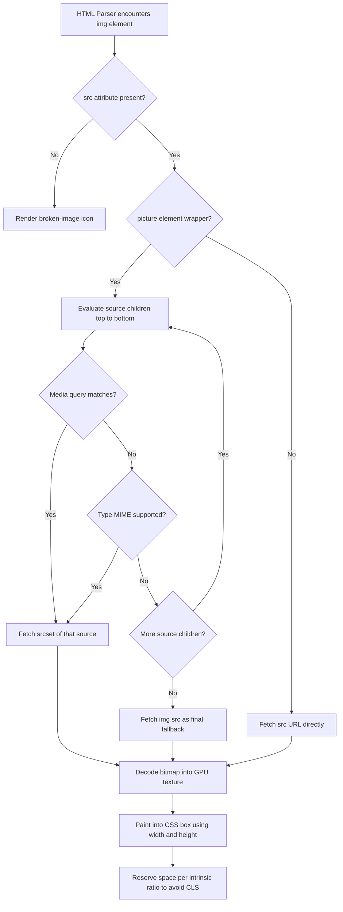
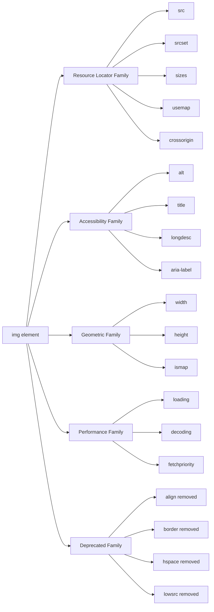
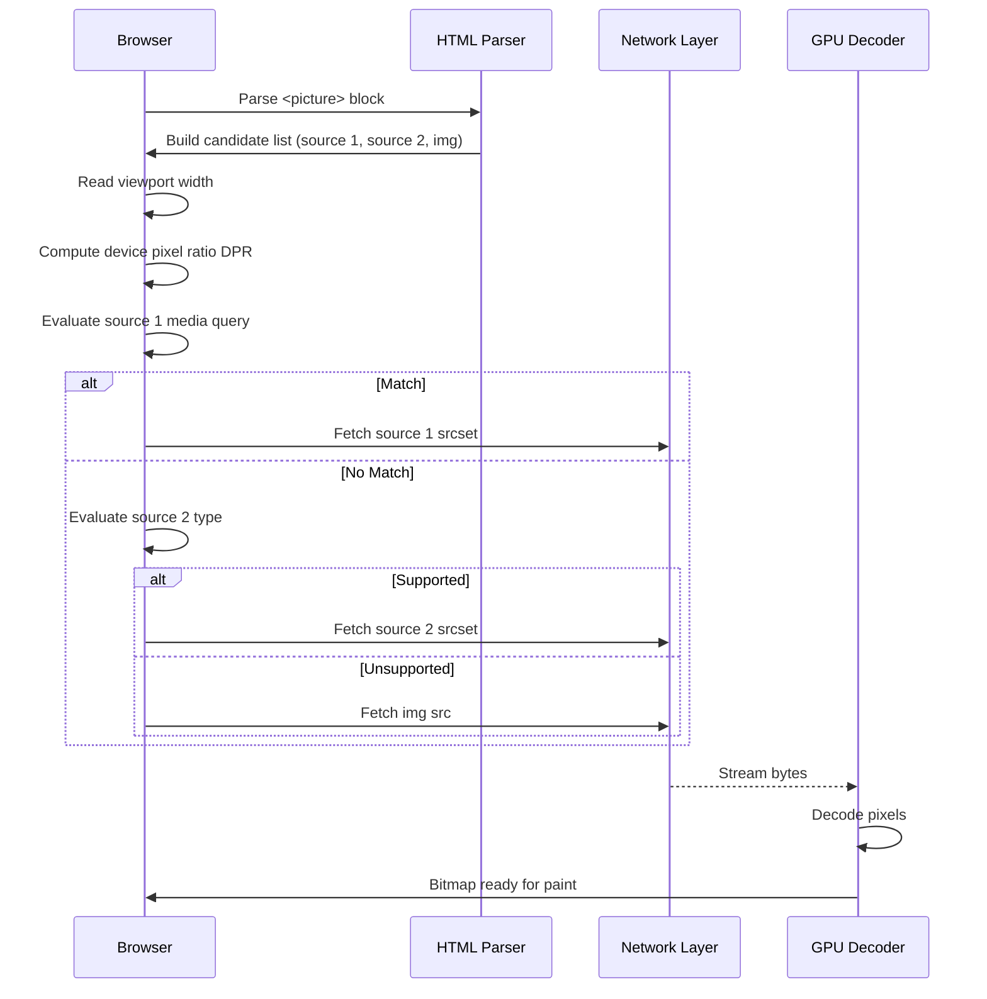
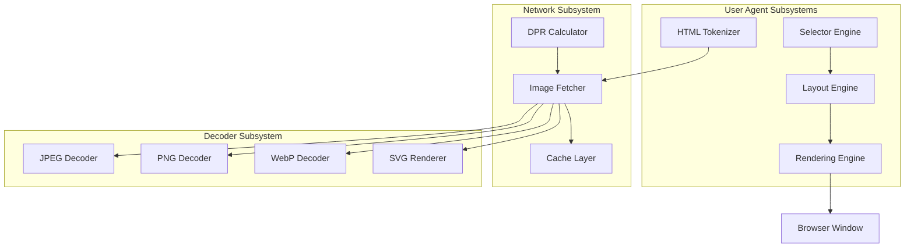
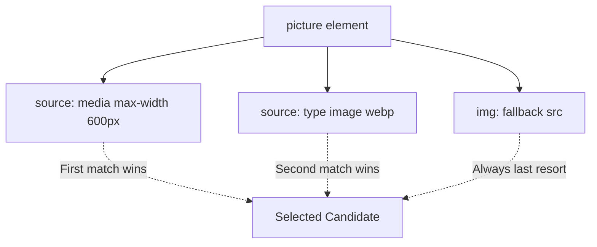

# Images

<!-- SECTION_1_START -->
# Images in HTML5

## 1.1 Formal Definition

In **HTML5 (HyperText Markup Language, 5th Revision)**, an image is an embedded external visual resource rendered inline within the document's content flow using the void/self-closing `` element. The image itself is **not** stored inside the HTML file — the `` element creates a *hyperlink reference* to an external binary asset (JPEG, PNG, GIF, SVG, WebP, AVIF, ICO) that the browser fetches, decodes, and paints onto the rendering surface (the layout tree / paint tree).

> [!IMPORTANT]
> **KTU Syllabus Highlight (Module 1):** Candidates must understand the `` element in entirety — mandatory attributes (`src`, `alt`), optional geometric attributes (`width`, `height`), accessibility hooks (`alt`, `title`, `aria-*`), responsive variants (`srcset`, `sizes`, `<picture>`), and semantic wrapping elements (`<figure>`, `<figcaption>`).

> [!NOTE]
> **W3C Reference:** The `` element is defined in the **HTML Living Standard** under the *Embedded content* category. It is a **replaced element** — meaning its intrinsic dimensions, intrinsic ratio, and visual representation are defined by the external resource, not by CSS box model rules alone.

---

## 1.2 Intuitive Overview — The "Picture Frame" Analogy

Think of a webpage as a **living room wall**, and the HTML document as a **set of nail positions with labelled tags**:

| HTML Concept | Real-World Analogy |
|--------------|--------------------|
| `` tag | A picture frame with a label slot |
| `src` attribute | The actual photograph that goes inside the frame |
| `alt` attribute | The braille / audio description for a blind visitor |
| `width` & `height` | The frame's physical dimensions (in inches) |
| `loading="lazy"` | A frame that is *only* hung when the visitor walks near that wall section |
| `<picture>` element | A **smart frame** that swaps the photo based on the room's lighting (screen size) |
| `<figure>` & `<figcaption>` | A framed artwork with a museum plaque beside it |

A user agent (browser) reads the markup, locates the file pointed to by `src`, downloads the bytes, decodes them into a bitmap, and paints them inside a rectangular content box.

> [!TIP]
> Always think of `` as a **request**, not the image itself. The image is fetched lazily over the network.

---

## 1.3 Core Anatomy of the `` Element

```html

```

> [!WARNING]
> **Common KTU Board Mistake:** Students frequently write ` </img>`. This is **invalid**. The `` element has **no closing tag** — it is a void element. Always self-close with `/>` in XHTML/Strict mode, or omit the closing tag in HTML5.

---

## 1.4 Visualization Control — Replaced Element Box

> [!VISUALIZATION CONTROL]
> **Concept:** Replaced Element Intrinsic Ratio (CSS Box-Model for an ``)
> **Desmos / GeoGebra Input Equations:**
> * `x = 0` (left edge of the CSS box)
> * `y = 0` (top edge of the CSS box)
> * `x = w` (right edge — depends on `width` attribute / CSS)
> * `y = h` (bottom edge — depends on `height` attribute / CSS)
> * `aspect_ratio = w / h` (intrinsic ratio derived from pixel data)
>
> **Visual Description:** Plot a rectangle on the XY-plane. The browser scales the raster bitmap so it fits *exactly* into this rectangle. If only one of `w` or `h` is set, the other dimension is computed using the **intrinsic aspect ratio** decoded from the image header. If neither is set, the bitmap is painted at its **natural pixel dimensions**.

<!-- SECTION_1_END -->

<!-- SECTION_2_START -->
# Deep Theoretical Analysis & KTU High-Yield Formula Sheet

## 2.1 Classification of Image Attributes

The attributes of the `` element are divided by purpose into five functional families. KTU board questions frequently ask students to *categorize* an attribute or to *justify* its use.

### Family A — Resource Locator Attributes

| Attribute | Type | Purpose | Mandatory? |
|-----------|------|---------|------------|
| `src` | URL | Specifies the URL of the image resource | **Yes** |
| `srcset` | Comma-separated URL + descriptor list | Responsive image candidate list | No |
| `sizes` | Comma-separated media-condition + length list | Tells the browser the *rendered* size for each viewport | No (used with `srcset`) |
| `crossorigin` | `anonymous` / `use-credentials` | CORS handling for canvas / WebGL pixel reads | No |
| `referrerpolicy` | Token list | Controls the `Referer` HTTP header on the image request | No |
| `usemap` | `#fragment` | Links the image to a `<map>` element for **client-side image mapping** | No |

### Family B — Accessibility Attributes

| Attribute | Type | Purpose |
|-----------|------|---------|
| `alt` | Text | **Mandatory** textual alternative for screen readers and broken images |
| `title` | Text | Advisory tooltip on hover |
| `longdesc` | URL | W3C-recommended link to a longer description (deprecated in HTML5.1, replaced by ARIA) |
| `role="img"` | ARIA role | Reinforces semantic image role for assistive tech |
| `aria-label` / `aria-labelledby` | ARIA text | Overrides or supplements `alt` |

### Family C — Geometric / Display Attributes

| Attribute | Type | Effect |
|-----------|------|--------|
| `width` | Non-negative integer (CSS pixels by default) | Sets the rendered width |
| `height` | Non-negative integer (CSS pixels by default) | Sets the rendered height |
| `loading` | `eager` / `lazy` | Defers fetch until in-viewport |
| `decoding` | `sync` / `async` / `auto` | Hint for when to decode pixels |
| `fetchpriority` | `high` / `low` / `auto` | Priority hint for the network request |
| `ismap` | Boolean | Sends click coordinates as query string to the server (server-side map) |

### Family D — Format / Source Selection (used in `<picture>`)

| Attribute | Element | Purpose |
|-----------|---------|---------|
| `type` | `<source>` | MIME type, e.g. `image/webp`, `image/avif` |
| `media` | `<source>` | Media query, e.g. `(max-width: 600px)` |
| `srcset` | `<source>` / `` | Candidate image URLs with descriptors |

### Family E — Deprecated / Discouraged Attributes

| Attribute | Status | Reason |
|-----------|--------|--------|
| `align` | Removed in HTML5 | Use CSS `float` or `vertical-align` |
| `border` | Removed | Use CSS `border` |
| `hspace` / `vspace` | Removed | Use CSS `margin` |
| `lowsrc` | Removed | Was used for low-bandwidth fallback images |
| `name` | Removed | Use `id` |

---

## 2.2 Image Format Decision Matrix

KTU 2024 examiners occasionally include a **comparison table** question. Memorize this:

| Format | MIME Type | Compression | Transparency | Animation | Best Use Case |
|--------|-----------|-------------|--------------|-----------|---------------|
| JPEG / JPG | `image/jpeg` | Lossy | ❌ No | ❌ No | Photographs, hero banners |
| PNG | `image/png` | Lossless | ✅ Yes (alpha) | ❌ No | Logos, screenshots, UI icons |
| GIF | `image/gif` | Lossless (LZW) | ✅ Yes (1-bit) | ✅ Yes | Simple animated clips |
| SVG | `image/svg+xml` | Markup-based | ✅ Yes | ✅ Yes (CSS/JS) | Icons, illustrations, logos |
| WebP | `image/webp` | Both | ✅ Yes | ✅ Yes | Modern replacement for JPEG/PNG/GIF |
| AVIF | `image/avif` | Both (AV1) | ✅ Yes | ✅ Yes | Next-gen, best compression ratio |
| ICO | `image/x-icon` | Mixed | ✅ Yes | ❌ No | Browser favicon |

---

## 2.3 Responsive Image Resolution — The "Device Pixel Ratio" Formula

> [!IMPORTANT]
> **High-Yield KTU Formula**

When the browser encounters a `srcset` candidate list, it computes an **Effective Pixel Resolution (EPR)** for each entry and chooses the one closest to the **viewport DPR (Device Pixel Ratio)**:

$$
EPR_i = \frac{\text{Candidate Width}_i \times \text{DPR}}{\text{Rendered Display Width}}
$$

The browser picks the candidate where $EPR_i \approx 1$ (or the smallest $EPR_i \geq 1$ if `srcset` lists ascending densities).

**Descriptors Used in `srcset`:**
* `1x`, `2x`, `3x` → pixel density descriptors
* `480w`, `1024w` → width descriptors (must be used with `sizes`)

---

## 2.4 Intrinsic Sizing Equation

When the browser paints a bitmap into the CSS box:

$$
\text{display\_width} = \text{width}_{\text{attr}} \quad \text{or} \quad \text{CSS computed width}
$$

$$
\text{display\_height} = \text{height}_{\text{attr}} \quad \text{or} \quad \frac{\text{display\_width}}{\text{aspect\_ratio}_{\text{intrinsic}}}
$$

$$
\text{aspect\_ratio}_{\text{intrinsic}} = \frac{\text{natural\_width}_{\text{px}}}{\text{natural\_height}_{\text{px}}}
$$

> [!NOTE]
> Setting both `width` and `height` attributes — even when overriding with CSS — is a **performance best practice**. It lets the browser reserve layout space immediately, preventing **Cumulative Layout Shift (CLS)**.

---

## 2.5 Real-World Engineering Utility

| Domain | Image Use | Why It Matters |
|--------|-----------|----------------|
| **E-Commerce** | Product thumbnails via `<picture>` with WebP/AVIF fallback | LCP (Largest Contentful Paint) directly affects SEO ranking |
| **Accessibility Engineering** | `alt` text for screen readers | WCAG 2.1 / 2.2 compliance, ADA legal compliance |
| **Geolocation Maps** | Tiled images via `` + image maps | Used in OpenStreetMap, Google Static Maps |
| **Web Games** | Sprites loaded via `` + canvas | HTML5 game engines (Phaser, PixiJS) |
| **Computer Vision** | `` + canvas | Required to read pixels without CORS taint |
| **Email Marketing** | `` tracking pixels | Analytics & open-rate tracking |

<!-- SECTION_2_END -->

<!-- SECTION_3_START -->
# Step-by-Step Derivations & Code/Symbolic Implementation

## 3.1 Worked Example 1 — Basic Embedded Image

**Problem Statement:** Create an HTML5 page that embeds a product photograph stored at `images/phone.jpg`. The image is 1200×800 pixels natively, and you want it displayed at 600×400 with descriptive alt text and a hover tooltip.

### Step-by-Step Construction

**Step 1 — Open a fresh HTML5 document skeleton.**

```html
<!DOCTYPE html>
<html lang="en">
<head>
    <meta charset="UTF-8">
    <meta name="viewport" content="width=device-width, initial-scale=1.0">
    <title>Product Showcase</title>
</head>
<body>
</body>
</html>
```

**Step 2 — Insert the `` element inside `<body>`.**

```html

```

**Step 3 — Validate the four mandatory considerations.**

* `src` — present, points to a relative URL.
* `alt` — present, descriptive (not just `"phone"`).
* `width` & `height` — declared, prevents CLS.
* `title` — provides supplementary advisory info.

**Step 4 — Final combined document.**

```html
<!DOCTYPE html>
<html lang="en">
<head>
    <meta charset="UTF-8">
    <meta name="viewport" content="width=device-width, initial-scale=1.0">
    <title>Product Showcase</title>
</head>
<body>
    <h1>Featured Product</h1>
    
    <p>Discover the new Quantum X1.</p>
</body>
</html>
```

> [!NOTE]
> **Mark Distribution Hint:** [Correctly using `` tag with `src` & `alt`: 2 Marks] [Adding `width`/`height`/`title`: 1 Mark].

---

## 3.2 Worked Example 2 — Responsive `<picture>` with WebP + JPEG Fallback

**Problem Statement:** Build a banner image that:
* Uses `banner.webp` on modern browsers
* Falls back to `banner.jpg` on older browsers
* Loads `banner-mobile.jpg` (480×270) on screens narrower than 600px
* Loads `banner-desktop.jpg` (1920×1080) otherwise

### Step-by-Step Construction

**Step 1 — Start with the `<picture>` element as a semantic container.**

The browser evaluates `<source>` children in **document order** and picks the **first match**.

**Step 2 — Add the mobile-first `<source>`.**

```html
<picture>
    <source media="(max-width: 600px)" srcset="banner-mobile.jpg">
    <source type="image/webp" srcset="banner.webp">
    
</picture>
```

**Step 3 — Trace the browser's selection logic.**

1. The browser reads the first `<source>` with `media="(max-width: 600px)"`. If the current viewport is ≤ 600 CSS pixels → it fetches `banner-mobile.jpg` and **stops**.
2. Otherwise, it evaluates the second `<source>` with `type="image/webp"`. If the browser supports WebP → it fetches `banner.webp` and **stops**.
3. Otherwise, it falls back to the `` element and fetches `banner.jpg`.

**Step 4 — Add art-direction logic for high-DPI displays.**

```html
<picture>
    <source media="(max-width: 600px)"
            srcset="banner-mobile.jpg 1x, banner-mobile@2x.jpg 2x">
    <source type="image/webp"
            srcset="banner.webp 1x, banner@2x.webp 2x">
    
</picture>
```

**Final HTML — Production Ready:**

```html
<!DOCTYPE html>
<html lang="en">
<head>
    <meta charset="UTF-8">
    <title>Responsive Banner</title>
</head>
<body>
    <picture>
        <source media="(max-width: 600px)"
                srcset="banner-mobile.jpg 1x, banner-mobile@2x.jpg 2x">
        <source type="image/webp"
                srcset="banner.webp 1x, banner@2x.webp 2x">
        
    </picture>
</body>
</html>
```

> [!TIP]
> **Why include `width` and `height` on the `` even though the `<picture>` does the heavy lifting?** Because some browsers (and search engine crawlers) skip the `<picture>` element and read the `` directly for layout reservation.

---

## 3.3 Worked Example 3 — Client-Side Image Map

**Problem Statement:** Create an image map on `worldmap.jpg` with three clickable regions: India (rectangle), Japan (circle), and Australia (polygon).

### Step-by-Step Construction

**Step 1 — Define the image.**

The `usemap` attribute links the image to a `<map>` element with a matching `name` (prefixed with `#`).

```html

```

**Step 2 — Define the `<map>` with `<area>` children.**

Each `<area>` element defines a clickable region with a `shape` and `coords` tuple.

```html
<map name="worldmap">
    <area shape="rect"
          coords="220,180,340,310"
          href="india.html"
          alt="India"
          title="India">
    <area shape="circle"
          coords="640,210,30"
          href="japan.html"
          alt="Japan"
          title="Japan">
    <area shape="poly"
          coords="600,360,720,340,760,400,700,430,610,410"
          href="australia.html"
          alt="Australia"
          title="Australia">
</map>
```

**Step 3 — Verify the coordinate system.**

* **Rectangle:** `coords = "x1, y1, x2, y2"` → top-left and bottom-right corners in CSS pixels.
* **Circle:** `coords = "cx, cy, r"` → center and radius.
* **Polygon:** `coords = "x1, y1, x2, y2, ..., xn, yn"` → list of vertices, auto-closed.

**Final HTML — Production Ready:**

```html
<!DOCTYPE html>
<html lang="en">
<head>
    <meta charset="UTF-8">
    <title>Interactive World Map</title>
</head>
<body>
    <h1>Click a Region</h1>
    

    <map name="worldmap">
        <area shape="rect"
              coords="220,180,340,310"
              href="india.html"
              alt="India"
              title="Visit India page">
        <area shape="circle"
              coords="640,210,30"
              href="japan.html"
              alt="Japan"
              title="Visit Japan page">
        <area shape="poly"
              coords="600,360,720,340,760,400,700,430,610,410"
              href="australia.html"
              alt="Australia"
              title="Visit Australia page">
    </map>
</body>
</html>
```

> [!WARNING]
> **Common Error:** Writing `usemap="worldmap"` instead of `usemap="#worldmap"`. The hash is **mandatory** — it is a fragment identifier pointing to a `name` attribute, not an `id`.

---

## 3.4 Worked Example 4 — Semantic `<figure>` with `<figcaption>`

```html
<figure>
    
    <figcaption>Figure 1: Year-over-year revenue growth, FY 2024.</figcaption>
</figure>
```

> [!NOTE]
> `<figure>` and `<figcaption>` are **not images** — they are **semantic wrappers**. They were introduced in HTML5 specifically to associate captions with embedded content (images, code blocks, diagrams, videos).

---

## 3.5 Worked Example 5 — Lazy Loading & Async Decoding Pattern

For pages with many images (e.g., product listings), defer network and decode work:

```html

```

For the **hero image** (above the fold), do the opposite:

```html

```

---

## 3.6 Python Companion — Programmatic HTML Generation (Type-Hinted)

```python
from pathlib import Path
from typing import Final

OUTPUT_PATH: Final[Path] = Path("gallery.html")
IMAGES: Final[tuple[tuple[str, str, int, int], ...]] = (
    ("gallery/photo-01.jpg", "Sunset over the Arabian Sea", 800, 533),
    ("gallery/photo-02.jpg", "Western Ghats during monsoon", 800, 533),
    ("gallery/photo-03.jpg", "Kathakali performer in full makeup", 800, 533),
)

def build_image_tag(src: str, alt: str, width: int, height: int) -> str:
    """Generate a strictly-formed HTML5  element with lazy loading."""
    if width <= 0 or height <= 0:
        raise ValueError(f"Invalid dimensions: {width}x{height}")
    return (
        f''
    )

def render_gallery() -> None:
    try:
        figure_blocks: list[str] = [
            f"  <figure>\n    {build_image_tag(*img)}\n"
            f"    <figcaption>{img[1]}</figcaption>\n  </figure>"
            for img in IMAGES
        ]
        body: str = "\n".join(figure_blocks)
        html: str = (
            "<!DOCTYPE html>\n"
            "<html lang=\"en\">\n"
            "<head><meta charset=\"UTF-8\"><title>Gallery</title></head>\n"
            f"<body>\n{body}\n</body>\n</html>\n"
        )
        OUTPUT_PATH.write_text(html, encoding="utf-8")
        print(f"[OK] Gallery written to {OUTPUT_PATH.resolve()}")
    except OSError as exc:
        print(f"[ERROR] Failed to write gallery: {exc}")

if __name__ == "__main__":
    render_gallery()
```

<!-- SECTION_3_END -->

<!-- SECTION_4_START -->
# Structural Diagrams & Schematics

## 4.1 Image Loading Decision Flow



## 4.2 Attribute Family Architecture



## 4.3 Responsive Image Selection Pipeline



## 4.4 Modular Component Map of Image Subsystem



<!-- SECTION_4_END -->

<!-- SECTION_5_START -->
# KTU 2024 Scheme Examination Question Bank & Topic Recap

## Part A — Short Answer Questions (3 Marks Each)

### Q1. `[KTU University Exam – Dec 2023]`
**Differentiate between the `src` and `srcset` attributes of the `` element. When is `srcset` preferred over `src`?**
**CO Mapping:** CO1 | **RBT Level:** Remember

**Model Answer (3 Marks):**

| Aspect | `src` | `srcset` |
|--------|-------|----------|
| Cardinality | Single URL | List of URLs with descriptors |
| Purpose | Mandatory image source | Responsive / DPR-aware image candidates |
| Browser Logic | Always fetched | Browser picks the best candidate |
| Use Case | Static layouts, icons | Hero banners, retina displays |

`srcset` is preferred when the page is accessed on devices with varying **device pixel ratios (DPR)** — e.g., a 2x retina display benefits from a 2x-resolution image to avoid pixelation, while a 1x display can use the smaller variant to save bandwidth. `[1 Mark]`

`src` is mandatory as the **fallback URL**; `srcset` is optional and supplements it. `[1 Mark]`

The browser uses the **device pixel ratio** and viewport information to pick the optimal candidate. `[1 Mark]`

---

### Q2. `[KTU University Exam – July 2024]`
**Explain the role of the `alt` attribute. What happens if it is omitted for a decorative image?**
**CO Mapping:** CO1 | **RBT Level:** Understand

**Model Answer (3 Marks):**

The `alt` attribute provides a **textual alternative** for the image. It serves three purposes: `[1 Mark]`
1. **Accessibility** — screen readers (JAWS, NVDA, VoiceOver) announce the `alt` text to visually impaired users.
2. **Broken-image fallback** — if the image fails to load, the browser renders the `alt` text inside the broken-image box.
3. **SEO** — search engine crawlers use `alt` text to index image content.

For **decorative images** (e.g., background ornaments), the `alt` attribute should be present but **empty**: `alt=""`. This tells the screen reader to **skip** the image entirely, since it conveys no information. `[1 Mark]`

Omitting `alt` entirely is a **WCAG 2.1 violation** (Success Criterion 1.1.1 – Non-text Content). Screen readers may read the image's filename (e.g., "decor234.png") or skip it unpredictably. `[1 Mark]`

---

## Part B — Long Answer Questions (14 Marks Each, Module Internal Choice)

### Question A `[KTU University Exam – Dec 2023]`

**(a)** List and explain any **seven important attributes** of the `` element in HTML5 with suitable examples. **[7 Marks]**
**CO Mapping:** CO1 | **RBT Level:** Understand

**Model Solution:**

| # | Attribute | Explanation | Example |
|---|-----------|-------------|---------|
| 1 | `src` | Mandatory URL of the image resource. | `src="cat.jpg"` |
| 2 | `alt` | Textual alternative for accessibility. | `alt="A sleeping tabby cat"` |
| 3 | `width` | Rendered width in CSS pixels. | `width="400"` |
| 4 | `height` | Rendered height in CSS pixels. | `height="300"` |
| 5 | `title` | Advisory tooltip shown on hover. | `title="Click to enlarge"` |
| 6 | `loading` | `eager` (default) or `lazy` (defer until in-viewport). | `loading="lazy"` |
| 7 | `decoding` | Hint to decode synchronously or asynchronously. | `decoding="async"` |
| 8 | `ismap` | Sends click coordinates as query string to server. | `ismap` |
| 9 | `usemap` | Associates the image with a `<map>` for client-side image maps. | `usemap="#navmap"` |
| 10 | `srcset` | Responsive image candidates with DPR/width descriptors. | `srcset="img1x.jpg 1x, img2x.jpg 2x"` |

**Mark Split:** [Listing seven attributes correctly: 4 Marks] [Explaining each with a 1-line example: 3 Marks].

---

**(b)** Write a complete HTML5 program that displays three photographs of Kerala tourism destinations inside a `<figure>` element with a `<figcaption>` for each. The page must use `loading="lazy"` and `decoding="async"` for performance. **[7 Marks]**
**CO Mapping:** CO2 | **RBT Level:** Apply

**Model Solution:**

```html
<!DOCTYPE html>
<html lang="en">
<head>
    <meta charset="UTF-8">
    <meta name="viewport" content="width=device-width, initial-scale=1.0">
    <title>Kerala Tourism Gallery</title>
    <style>
        body { font-family: Georgia, serif; margin: 2rem; }
        figure { margin: 0 0 2rem 0; }
        img { max-width: 100%; height: auto; display: block; }
        figcaption { font-style: italic; color: #555; margin-top: 0.5rem; }
    </style>
</head>
<body>
    <h1>Kerala Tourism Gallery</h1>

    <figure>
        
        <figcaption>Figure 1: Munnar Tea Gardens, Idukki District</figcaption>
    </figure>

    <figure>
        
        <figcaption>Figure 2: Alleppey Houseboat Cruise, Alappuzha</figcaption>
    </figure>

    <figure>
        
        <figcaption>Figure 3: Kovalam Lighthouse Beach, Thiruvananthapuram</figcaption>
    </figure>
</body>
</html>
```

**Mark Split:**
* [Correct document structure with `<!DOCTYPE html>` and semantic `<figure>` tags: 2 Marks]
* [Three `` elements with valid `src`, `alt`, `width`, `height`: 2 Marks]
* [Correct application of `loading="lazy"` and `decoding="async"`: 1 Mark]
* [Each `<figcaption>` properly associated: 1 Mark]
* [Neat indentation and proper closing tags: 1 Mark]

> [!WARNING]
> **Examiner's Pitfall Alert:** Do not write `...</img>`. The `` tag is a void element. Missing `alt` will cost you 1 mark immediately. Writing a single `loading="lazy"` on one image and forgetting the others is a common partial-mark deduction.

---

### Question B `[KTU University Exam – July 2024]` *(Alternative Choice)*

**(a)** Explain the **`<picture>` element** with a neat diagram. How does it differ from the `` `srcset` attribute? **[7 Marks]**
**CO Mapping:** CO1 | **RBT Level:** Understand

**Model Solution:**

The `<picture>` element is a **container** that holds zero or more `<source>` elements and **exactly one** `` element. It enables **art direction** — selecting images based on media conditions, format support, or both. `[2 Marks]`

**Architecture Diagram (Mermaid):**



**Mechanism:** The browser evaluates `<source>` children **in document order** and uses the first one that matches. If none match, the `` `src` is used. `[2 Marks]`

**Comparison Table:**

| Feature | `` | `<picture>` |
|---------|----------------|-------------|
| Art direction | ❌ No | ✅ Yes (via `media`) |
| Format selection (WebP fallback) | ❌ No | ✅ Yes (via `type`) |
| DPR-based selection | ✅ Yes | ✅ Yes |
| Mandatory `` fallback | N/A | ✅ Yes |
| Browser support | Excellent | Excellent (since 2019) |

`[1 Mark]` for the comparison; `[2 Marks]` for the explanation.

---

**(b)** Design a complete HTML5 page that uses the `<picture>` element to display a responsive banner image with **WebP** format for modern browsers and **JPEG** fallback. Include a **client-side image map** on the JPEG fallback with two regions: a "Shop Now" rectangle and a "Learn More" circle. **[7 Marks]**
**CO Mapping:** CO2, CO3 | **RBT Level:** Apply

**Model Solution:**

```html
<!DOCTYPE html>
<html lang="en">
<head>
    <meta charset="UTF-8">
    <meta name="viewport" content="width=device-width, initial-scale=1.0">
    <title>Responsive Banner with Map</title>
</head>
<body>
    <h1>Welcome to Our Store</h1>

    <picture>
        <source type="image/webp" srcset="banner.webp">
        
    </picture>

    <map name="bannermap">
        <area shape="rect"
              coords="800,300,1100,370"
              href="shop.html"
              alt="Shop Now"
              title="Shop Now — browse products">
        <area shape="circle"
              coords="300,200,80"
              href="learn.html"
              alt="Learn More"
              title="Learn more about us">
    </map>
</body>
</html>
```

**Mark Split:**
* [Correct `<picture>` with `<source type="image/webp">`: 2 Marks]
* [Fallback `` with `usemap="#bannermap"`: 1 Mark]
* [Correct `<map>` and two `<area>` children: 3 Marks]
* [Valid coordinate tuples for `rect` and `circle`: 1 Mark]

> [!WARNING]
> **Examiner's Pitfall Alert:** Many students forget the `#` prefix in `usemap="#bannermap"` — the image map link will silently break. Also, **omitting the `` inside `<picture>`** is an HTML5 spec violation; the picture element MUST have one `` child.

---

## Topic Recap & Important Things to Remember

- The `` element is a **void element** — no closing tag, ever.
- **`src` and `alt` are mandatory**; all other attributes are optional.
- The `alt` attribute is **not optional** — even decorative images must have `alt=""` to indicate intentional emptiness to screen readers.
- Always set `width` and `height` attributes to prevent **Cumulative Layout Shift (CLS)** even if you override them with CSS.
- The browser uses the **intrinsic aspect ratio** decoded from the image header to compute the missing dimension if only `width` or `height` is provided.
- `loading="lazy"` defers network fetches for off-screen images — never use it on the LCP (hero) image.
- The `<picture>` element enables **art direction** and **format negotiation**; the `` `srcset` enables **DPR-based selection** only.
- Inside `<picture>`, `<source>` elements are evaluated in **document order**; the first matching one wins.
- A `<picture>` block **must contain** exactly one `` element as the final fallback.
- Client-side image maps require **two parts**: an `` and a `<map name="id">` with `<area>` children.
- `coords` for `rect` = `x1,y1,x2,y2`; for `circle` = `cx,cy,r`; for `poly` = a list of `x,y` pairs.
- The **Device Pixel Ratio (DPR)** is the primary input the browser uses to choose among `srcset` density descriptors.
- The intrinsic aspect ratio is computed as $\text{natural\_width} / \text{natural\_height}$ decoded from the image's binary header.
- Removed HTML5 attributes: `align`, `border`, `hspace`, `vspace`, `lowsrc`, `name` — replace with CSS.
- `crossorigin="anonymous"` is required to read `` pixels from a different origin into a `<canvas>` without taint.
- For SEO and accessibility, `alt` should describe the **function** of the image, not its appearance, when the image is a link or button.
- The `<figure>` + `<figcaption>` pair is the **semantically correct** way to associate a caption with an image in HTML5.
- `fetchpriority="high"` should be reserved for the LCP image; `fetchpriority="low"` is appropriate for thumbnails.
- `decoding="async"` allows the browser to paint text and other content before image pixels finish decoding.

<!-- SECTION_5_END -->
