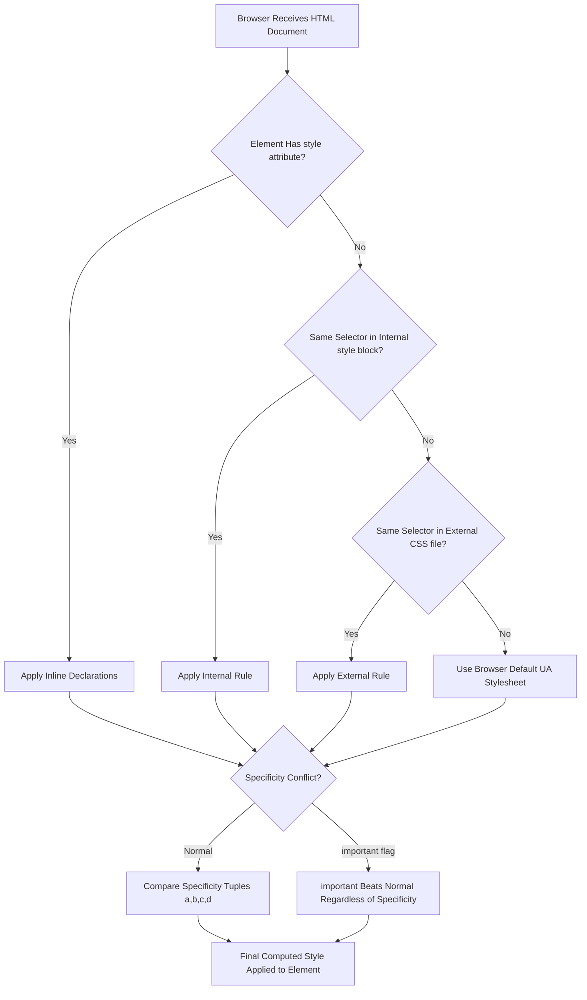
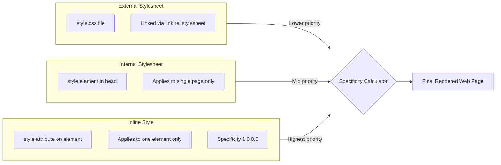
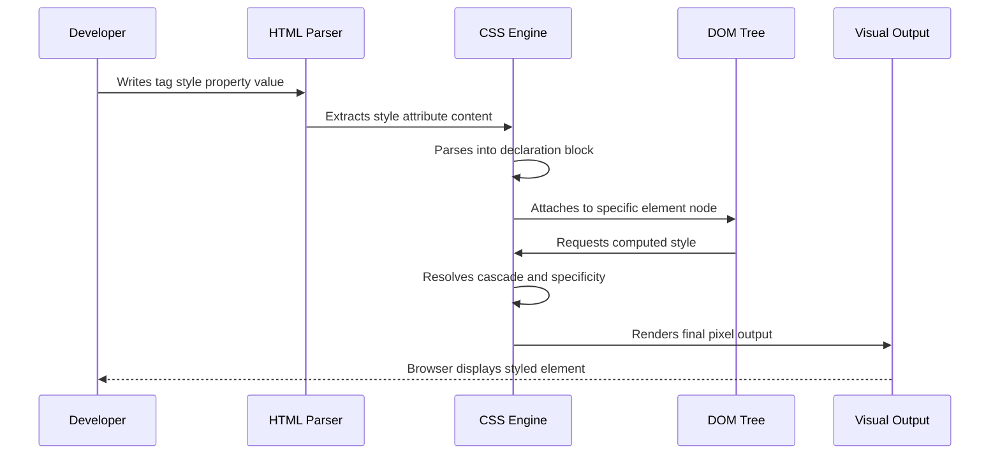
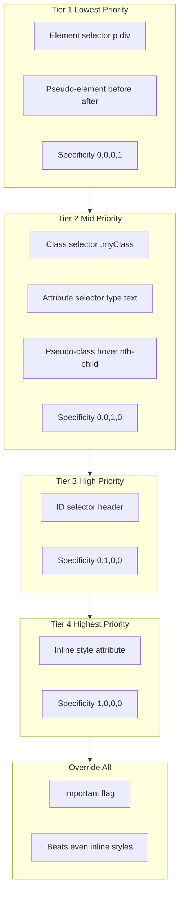

# Inline Styles

<!-- SECTION_1_START -->
# Inline Styles in HTML5

## 1.1 Formal Academic Definition (KTU 2024 Syllabus Aligned)

> [!IMPORTANT]
> **Inline Style** is a CSS (Cascading Style Sheets) application technique in HTML5 where styling declarations are written **directly inside the opening tag** of an HTML element using the special `style` attribute, rather than being placed in a separate stylesheet block (internal) or an external `.css` file.

The syntax strictly follows the pattern:

$$
\text{<tag style="property: value; property: value;">}
$$

Each inline style declaration is a **name–value pair** separated by a colon (`:`), and multiple declarations are separated by **semicolons** (`;`). Inline styles have the **highest specificity** in the CSS cascade order (specificity value of `1,0,0,0`).

---

## 1.2 Intuitive Analogy

> [!NOTE]
> **Real-World Analogy — The Personalized Post-it Note**
>
> Imagine a classroom where the principal has posted a **school-wide dress code** (this is your *external stylesheet*). A class teacher adds a **special note for her class** (this is your *internal `<style>` block*). Now, a student, just for himself, sticks a **personalized post-it note** on his shirt that says *"Blue tie today"* — this is the **inline style**.
>
> The post-it note (inline) **overrides** both the class note (internal) and the school rule (external), because it is the most specific instruction of all.

In the same way, inline styles sit **closest to the element** in the cascade and win against every other selector that targets the same property.

---

## 1.3 Physical Constants and Standards Used

- **HTML5 Standard Reference:** W3C HTML5 Specification, Section 7 (Global Attributes).
- **CSS Property Namespace:** `style` is a *global attribute* — it can legally be placed on **any** HTML5 element.
- **Specificity Constant:** Inline style carries a fixed specificity score of $\mathbf{1,0,0,0}$ in the W3C Cascade Model.
- **Keyword `!important`:** A CSS rule suffixed with `!important` can override an inline style — the only exception to the cascade priority rule.

---

## 1.4 Visual Representation of the Cascade

> [!VISUALIZATION CONTROL]
> **Concept:** CSS Cascade Specificity Tiers (a visual priority pyramid)
> **GeoGebra / Desmos Input Equations (Conceptual Plot):**
> * Plot points showing the specificity weight of each styling method: External CSS = $0,0,1,0$, Internal CSS = $0,0,1,0$ (by selector), ID selector = $0,1,0,0$, Inline Style = $1,0,0,0$.
> **Visual Description:** On a bar chart where the X-axis is the CSS rule type and the Y-axis is specificity magnitude, the **inline-style bar towers above all others**, visually demonstrating why inline styles override everything except `!important`.

---

## 1.5 When Should You Use Inline Styles?

| Scenario | Recommended? | Reasoning |
|----------|:---:|-----------|
| Quick prototyping / one-off tweaks | ✅ Yes | Fast feedback loop |
| Email HTML templates | ✅ Yes | Most email clients strip `<style>` blocks |
| Production-scale websites | ❌ No | Breaks separation of concerns |
| Dynamic JS-driven styles | ⚠️ Limited | Better to toggle classes instead |
| Accessibility-first design | ❌ No | Harder to maintain consistent theming |
<!-- SECTION_1_END -->

<!-- SECTION_2_START -->
# Deep Theoretical Analysis & KTU High-Yield Formula Sheet

## 2.1 The Anatomy of the `style` Attribute

The `style` attribute is parsed by the browser as a **declaration block**, identical in grammar to what you would place inside a CSS rule. It is composed of:

1. One or more **declarations**.
2. Each declaration = **property** `:` **value** `;`.
3. A trailing semicolon after the last declaration is **optional but strongly recommended**.

$$
\text{Inline Declaration} = \bigcup_{i=1}^{n} (\, P_i : V_i \,) \quad \text{where } P_i \in \text{CSSProperties},\; V_i \in \text{CSSValues}
$$

## 2.2 The CSS Specificity Formula

Specificity is a four-part numerical weight used by the browser to resolve conflicts when multiple rules target the same element and property.

$$
S_{\text{total}} = (a,\; b,\; c,\; d)
$$

Where:
- $a$ = inline style count (always $\mathbf{1}$ if present, else $0$)
- $b$ = ID selector count
- $c$ = class, attribute, pseudo-class count
- $d$ = element and pseudo-element count

> [!IMPORTANT]
> **The "4-Tuple Rule"**: When comparing two specificities, the browser reads them **left to right**. The leftmost differing digit wins. Example: $(1,0,0,0) > (0,9,9,9,9)$.

## 2.3 The Cascade Order (Highest → Lowest Priority)

1. Browser **user-agent** stylesheet (browser defaults)
2. **User** stylesheet (browser accessibility settings)
3. **Author** normal declarations (External → Internal → Inline)
4. **Author** `!important` declarations (External `!important` → Internal `!important` → Inline `!important`)
5. **User** `!important` declarations
6. **User-agent** `!important` declarations

| Styling Method | Specificity Tuple | Reusability | Separation of Concerns |
|---|:---:|:---:|:---:|
| External Stylesheet (`.css`) | Depends on selector | Excellent | High |
| Internal `<style>` block | Depends on selector | Page-scoped | High |
| **Inline `style` attribute** | $\mathbf{(1,0,0,0)}$ | **None (per element)** | **None** |
| `!important` flag | Overrides everything | — | — |

## 2.4 Common Inline Style Properties (KTU High-Yield Reference)

| CSS Property | Purpose | Example Value | Applicable Elements |
|---|---|---|---|
| `color` | Text color | `#ff0000`, `red`, `rgb(255,0,0)` | Text-bearing |
| `background-color` | Element background fill | `#f0f8ff`, `lightblue` | Block-level, inline-block |
| `font-size` | Text size | `16px`, `1.2em`, `120%` | Text-bearing |
| `font-family` | Typography stack | `"Arial", sans-serif` | Text-bearing |
| `text-align` | Horizontal alignment | `center`, `left`, `right`, `justify` | Block-level |
| `margin` | Outer spacing | `10px`, `10px 20px` | All |
| `padding` | Inner spacing | `15px` | All |
| `border` | Element border | `1px solid black` | All |
| `width` / `height` | Sizing | `300px`, `50%`, `auto` | Replaced / block |
| `display` | Layout model | `block`, `inline`, `flex`, `grid` | All |
| `cursor` | Mouse pointer shape | `pointer`, `crosshair` | Interactive |
| `opacity` | Transparency | `0.5` (range $0 \rightarrow 1$) | All |

## 2.5 Engineering Utility

In real production engineering, inline styles are deployed in three legitimate scenarios:

- **HTML Email Development:** Email clients (Outlook, Gmail mobile) strip `<style>` blocks; inline styles are the *only* reliable way to render consistently.
- **JavaScript Dynamic Styling:** Frameworks like React historically used the `style` prop (object syntax) before CSS-in-JS libraries matured.
- **Server-Side Rendering Tweaks:** Server templates inject last-mile style overrides for A/B testing variants.
<!-- SECTION_2_END -->

<!-- SECTION_3_START -->
# Step-by-Step Implementation & Code Walkthroughs

## 3.1 Example 1 — Basic Inline Styling of a Heading and Paragraph

```html
<!DOCTYPE html>
<html lang="en">
<head>
    <meta charset="UTF-8">
    <title>Inline Style Demo 1</title>
</head>
<body>

    <!-- Step 1: Apply inline color, font-size, and font-family to h1 -->
    <h1 style="color: navy; font-size: 36px; font-family: Georgia, serif;">
        Welcome to KTU Web Programming
    </h1>

    <!-- Step 2: Apply text-align, line-height, and background-color to p -->
    <p style="text-align: justify; line-height: 1.6; background-color: #f0f8ff; padding: 10px;">
        This paragraph uses an inline style. The browser will parse each
        declaration inside the style attribute and apply it directly to this p element.
    </p>

    <!-- Step 3: Apply border, margin, and width to a div container -->
    <div style="border: 2px solid #333; margin: 20px; width: 80%;">
        This div has a visible border, 20px outer spacing, and occupies 80% of parent width.
    </div>

</body>
</html>
```

**Line-by-line breakdown:**

1. `<h1 style="color: navy; ...">` — The `style` attribute holds **three** declarations. Note the comma-separated `Georgia, serif` is a *font fallback stack* (not a property separator).
2. `text-align: justify;` — Justifies both edges of the paragraph.
3. `line-height: 1.6;` — Unitless multiplier (relative to `font-size`).
4. The `<div>` inherits no inline style but provides a styled container.

---

## 3.2 Example 2 — Overriding an Internal Stylesheet

```html
<!DOCTYPE html>
<html lang="en">
<head>
    <meta charset="UTF-8">
    <title>Inline Override Demonstration</title>

    <!-- Internal stylesheet: ALL paragraphs will be blue by default -->
    <style>
        p {
            color: blue;
            font-size: 14px;
        }
    </style>
</head>
<body>

    <p>This paragraph follows the internal stylesheet rule (blue text).</p>

    <!-- Inline style OVERRIDES the internal rule for this specific paragraph -->
    <p style="color: red; font-size: 20px; font-weight: bold;">
        This paragraph is overridden by an inline style (red, 20px, bold).
    </p>

</body>
</html>
```

**Cascade Resolution:**

$$
\text{Internal } p \text{ rule} \rightarrow S = (0,0,0,1) \\
\text{Inline style} \rightarrow S = (1,0,0,0)
$$

Since $1,0,0,0 > 0,0,0,1$, the inline style **wins**. The second paragraph renders red, 20px, bold.

---

## 3.3 Example 3 — Using `!important` to Beat Inline Style

```html
<!DOCTYPE html>
<html lang="en">
<head>
    <meta charset="UTF-8">
    <title>important Override</title>
    <style>
        .critical {
            color: green !important;
        }
    </style>
</head>
<body>

    <!-- Inline style would normally win, but !important on the class rule flips the priority -->
    <p class="critical" style="color: red; font-size: 18px;">
        This text is GREEN because the !important class rule beats the inline style.
    </p>

</body>
</html>
```

**Cascade Resolution:**

$$
\text{Inline } \rightarrow S = (1,0,0,0)\ \text{(normal weight)} \\
\text{Internal `.critical`} \rightarrow S = (0,0,1,0)\ \text{(}!\text{important flag active)}
$$

When `!important` is in play, the **importance order** beats **specificity order** entirely. The class rule with `!important` wins regardless of the lower specificity tuple.

---

## 3.4 Example 4 — JavaScript Dynamic Inline Styling

```javascript
// Step 1: Get a reference to the DOM element
const heading = document.getElementById("dynamicHeading");

// Step 2: Apply a single property
heading.style.color = "purple";

// Step 3: Apply multiple properties using cssText (resets all previous inline styles)
heading.style.cssText = "color: purple; font-size: 28px; background-color: yellow; padding: 8px;";

// Step 4: Read the current inline value
const currentColor = heading.style.color;
console.log("Current heading color:", currentColor);
```

**Important JavaScript Rules:**

- All CSS properties accessed via `element.style` are **camelCase** in JavaScript, e.g. `background-color` → `backgroundColor`.
- The `cssText` property **replaces** the entire inline style declaration block (it does not append).
- Reading `element.style.color` returns the **inline value only** — it does not report values inherited from external stylesheets.

---

## 3.5 Example 5 — Invalid Inline Style Demonstration (Common Student Pitfall)

```html
<!-- ❌ WRONG: Using a comma instead of a semicolon -->
<h1 style="color: blue, font-size: 24px;">This will be parsed INCORRECTLY.</h1>

<!-- ❌ WRONG: Missing colon -->
<p style="font-size 18px;">Browser will ignore this declaration.</p>

<!-- ❌ WRONG: Unknown CSS property -->
<div style="colour: red;">This property name is wrong; the entire declaration is dropped.</div>

<!-- ✅ CORRECT -->
<h1 style="color: blue; font-size: 24px;">Properly formatted inline style.</h1>
```

**Parsing Behavior:** The browser uses a **fault-tolerant parser** — when it encounters an invalid declaration (wrong property name, missing colon), it skips just that declaration and continues parsing the rest. It does *not* throw an error to the console.

---

## 3.6 Property Categorization Cheat Sheet

| Category | Example Properties | Effect |
|---|---|---|
| **Typography** | `font-family`, `font-size`, `font-weight`, `line-height`, `letter-spacing` | Control text appearance |
| **Color & Background** | `color`, `background-color`, `background-image`, `opacity` | Fill and transparency |
| **Box Model** | `margin`, `padding`, `border`, `width`, `height` | Spacing and sizing |
| **Layout** | `display`, `position`, `top`, `left`, `float` | Element placement |
| **Text Decoration** | `text-align`, `text-decoration`, `text-transform` | Text formatting |
| **Visual Effects** | `box-shadow`, `transform`, `filter`, `cursor` | Advanced effects |
<!-- SECTION_3_END -->

<!-- SECTION_4_START -->
# Structural Diagrams & Schematics

## 4.1 CSS Cascade Priority Architecture



---

## 4.2 Styling Method Comparison Block Diagram



---

## 4.3 Inline Style Lifecycle Flow



---

## 4.4 Three-Tier Specificity Comparison Matrix


<!-- SECTION_4_END -->

<!-- SECTION_5_START -->
# KTU 2024 Scheme Examination Question Bank & Topic Recap

---

## 📝 Part A — Short Answer Questions (3 Marks Each)

### **Question 1** `[KTU University Exam – July 2024]`
**Explain inline styles in HTML5 with a suitable example. State any TWO limitations.**

**Model Answer (3 Marks):**

Inline styles in HTML5 are CSS rules applied **directly within an opening HTML tag** using the `style` attribute. The browser parses these declarations with the highest specificity $(1,0,0,0)$, overriding external and internal stylesheets.

*Example (1 Mark):*
```html
<p style="color: red; font-size: 18px;">Hello KTU</p>
```

*Limitations (2 Marks — any two):*
1. **No reusability** — the same style must be repeated on every element.
2. **Violates separation of concerns** — mixes content (HTML) with presentation (CSS).
3. **Harder to maintain** — changing a theme requires editing every element.
4. **Bloats HTML files** — increases document size significantly.
5. **Cannot use pseudo-classes / media queries** — these only work in stylesheet blocks.

**Mapped:** CO1, **Remember**

---

### **Question 2** `[KTU University Exam – Dec 2023]`
**What is CSS specificity? Compare the specificity of an inline style versus an ID selector.**

**Model Answer (3 Marks):**

CSS specificity is a **numerical weight** assigned to every CSS rule to determine which rule wins when multiple rules target the same element and property. It is represented as a 4-tuple $(a, b, c, d)$. (1 Mark)

*Comparison (2 Marks):*
- **Inline style** specificity = $\mathbf{(1, 0, 0, 0)}$
- **ID selector** specificity = $\mathbf{(0, 1, 0, 0)}$

Since $1 > 0$ in the leftmost position, the inline style **wins** over any ID selector rule in the cascade. The only exception is when the ID selector's declaration is suffixed with `!important`.

**Mapped:** CO1, **Understand**

---

## 📝 Part B — Long Answer Questions (14 Marks Each — Internal Choice)

### **Question A** `[KTU University Exam – July 2024]`
**(a)** Explain the syntax of the `style` attribute in HTML5. Write an HTML5 page that demonstrates inline styling on at least **four** different HTML elements using properties from **three** different categories (typography, color, box-model). **(7 Marks)**

**(b)** Demonstrate with a complete HTML example how an **inline style overrides** an internal `<style>` block. Show the cascade computation explicitly. **(7 Marks)**

#### ✅ Model Solution

**(a) Syntax Explanation & Multi-Element Demo (7 Marks)**

*Syntax Breakdown (3 Marks):*
- The `style` attribute is a **global attribute** usable on any HTML5 element.
- Grammar: `style = "property: value; property: value;"`
- Each declaration = **property name** `:` **property value** `;`
- Multiple declarations are separated by **semicolons**.
- The final semicolon is optional but recommended.
- Property-value pairs must follow standard CSS specifications.

*HTML Code (4 Marks):*
```html
<!DOCTYPE html>
<html lang="en">
<head>
    <meta charset="UTF-8">
    <title>Inline Style Multi-Element Demo</title>
</head>
<body>

    <!-- Element 1: h1 with TYPOGRAPHY properties -->
    <h1 style="font-family: 'Times New Roman', serif; font-size: 42px; font-weight: bold; color: darkblue;">
        KTU Web Programming
    </h1>

    <!-- Element 2: p with COLOR and TEXT properties -->
    <p style="color: #333; background-color: #fff8dc; text-align: justify; line-height: 1.8;">
        This paragraph demonstrates inline color, background-color, text-align, and line-height.
    </p>

    <!-- Element 3: div with BOX MODEL properties -->
    <div style="margin: 30px; padding: 20px; border: 3px dashed teal; width: 70%;">
        This div has margin, padding, border, and width all set inline.
    </div>

    <!-- Element 4: span with TYPOGRAPHY + COLOR -->
    <span style="font-style: italic; color: crimson; font-size: 20px;">
        Highlighted span text
    </span>

</body>
</html>
```

**[Code with 4 elements: 2 Marks | Properties from 3 categories: 2 Marks]**

**Mapped:** CO1, CO2 | **Apply**

---

**(b) Override Demonstration (7 Marks)**

*Concept (2 Marks):* Inline styles carry specificity $(1,0,0,0)$ which outranks any internal selector. Therefore, an inline declaration **always wins** unless the internal rule uses `!important`.

*Complete Code (3 Marks):*
```html
<!DOCTYPE html>
<html lang="en">
<head>
    <meta charset="UTF-8">
    <title>Inline Override Demo</title>
    <style>
        p {
            color: blue;        /* Rule A — specificity (0,0,0,1) */
            font-size: 16px;
            text-align: left;
        }
    </style>
</head>
<body>

    <p>Paragraph 1 — follows internal rule (blue, 16px).</p>

    <p style="color: red; font-size: 22px; text-align: center;">
        Paragraph 2 — overridden by inline style (red, 22px, centered).
    </p>

</body>
</html>
```

*Cascade Computation (2 Marks):*

$$
\begin{aligned}
S_{\text{internal } p} &= (0,\; 0,\; 0,\; 1) \\
S_{\text{inline style}} &= (1,\; 0,\; 0,\; 0)
\end{aligned}
$$

Comparison: Leftmost differing digit — $1 > 0$. Therefore the **inline style wins**. The browser discards the internal `color`, `font-size`, and `text-align` values for the second paragraph and uses the inline ones.

**[Declaring specificity tuples: 1 Mark | Final comparison: 1 Mark]**

**Mapped:** CO2, CO3 | **Apply**

---

### **Question B** `[KTU University Exam – Dec 2023]`
**(a)** What is the role of the `!important` declaration in CSS? With a worked example, show how a class selector with `!important` can override an inline style. **(7 Marks)**

**(b)** Discuss **three real-world scenarios** where inline styles are the preferred (or only viable) approach over external stylesheets. Justify each with a technical reason. **(7 Marks)**

#### ✅ Model Solution

**(a) `!important` and Override (7 Marks)**

*Concept (2 Marks):* The `!important` flag is appended after a property value to **elevate a declaration's importance** in the cascade. It flips the priority: importance order is checked **before** specificity order. Any `!important` declaration beats any normal declaration, regardless of selector type or inline status.

*Worked Example (3 Marks):*
```html
<!DOCTYPE html>
<html lang="en">
<head>
    <meta charset="UTF-8">
    <title>important Override</title>
    <style>
        .highlight {
            color: green !important;  /* Specificity (0,0,1,0) + !important flag */
            font-size: 24px !important;
        }
    </style>
</head>
<body>

    <p class="highlight" style="color: red; font-size: 16px;">
        This text appears GREEN and 24px, even though the inline style is red and 16px.
    </p>

</body>
</html>
```

*Why it works (2 Marks):*
- Inline `color: red` → specificity $(1,0,0,0)$, **normal** importance.
- Internal `.highlight { color: green !important }` → specificity $(0,0,1,0)$, **important** importance.
- Cascade rule: **important > normal** wins before specificity is even compared.
- Therefore the green color is applied.

**Mapped:** CO2, CO3 | **Understand → Apply**

---

**(b) Three Real-World Scenarios (7 Marks)**

| # | Scenario | Technical Justification |
|:-:|---|---|
| 1 | **HTML Email Templates** | Most email clients (Outlook, older Yahoo Mail, mobile Gmail) **strip `<style>` blocks and external CSS** for security. Inline styles are the only way to guarantee consistent rendering across inboxes. |
| 2 | **Dynamic JavaScript Toggles** | When a single element's style must change at runtime (e.g., drag-and-drop positions, hover popups, modal visibility), inline style updates via `element.style.X` are faster than adding/removing classes and avoid class-name collisions. |
| 3 | **Server-Side A/B Testing Overrides** | A backend templating engine (EJS, Handlebars, Jinja) can inject one-off inline style overrides for variant-specific UI tweaks (button color, banner size) without redeploying the entire stylesheet bundle. |

**[Each scenario with valid engineering justification: ~2.3 Marks; Total 7 Marks]**

**Mapped:** CO3, CO4 | **Apply → Analyze**

---

> [!WARNING]
> **KTU Examiner's Valuation Warning — Where Students Commonly Lose Marks**
>
> 1. **Forgetting the semicolon** between declarations. The browser's fault-tolerant parser will silently drop the declaration after the missing semicolon. (Loses 1–2 marks)
> 2. **Using commas instead of semicolons** inside the `style` attribute — this is a common confusion with the `font-family` comma syntax.
> 3. **Citing wrong specificity values** — many students write `0,1,0,0` for inline styles. The correct value is `1,0,0,0`.
> 4. **Claiming `!important` cannot override inline styles** — this is FALSE. It absolutely can, and KTU questions specifically test this.
> 5. **Not showing cascade computation** in override questions. Always show the specificity tuples side-by-side.
> 6. **Mixing camelCase and kebab-case** — `font-size` (CSS) vs. `fontSize` (JavaScript) — writing JavaScript syntax inside HTML loses marks.

---

## 🎯 Topic Recap & Important Things to Remember

- **Inline style** = CSS written directly inside an HTML element's `style` attribute.
- **Syntax:** `style="property: value;"` — declarations separated by semicolons.
- **Specificity** of inline style is the highest among normal declarations: $\mathbf{(1, 0, 0, 0)}$.
- **Cascade priority order** (high to low): Inline > Internal > External > User-agent.
- **Only `!important`** can override an inline style — and that too only in the importance layer.
- **Browser is fault-tolerant:** invalid declarations are silently dropped, no error thrown.
- **JavaScript access** uses `element.style.propertyName` in **camelCase** (e.g., `backgroundColor`).
- **`style.cssText`** property **replaces** (does not append) the entire inline style block.
- **No pseudo-classes or media queries** can be used inside an inline `style` attribute.
- **Best use cases:** HTML emails, dynamic JS toggles, server-side variant overrides.
- **Avoid inline styles for:** large websites, theme switching, accessibility-first designs.
- **Property categories to remember:** Typography, Color/Background, Box Model, Layout, Text Decoration, Visual Effects.
- **KTU-favorite pitfalls:** specificity tuples, `!important` override capability, cascade computation, and the `style.cssText` replacement behavior.
- **HTML5 Global Attribute:** `style` is global — legal on **every** HTML5 element.
- **Quirk:** A trailing semicolon after the last declaration is optional but **strongly recommended for maintainability**.
<!-- SECTION_5_END -->
