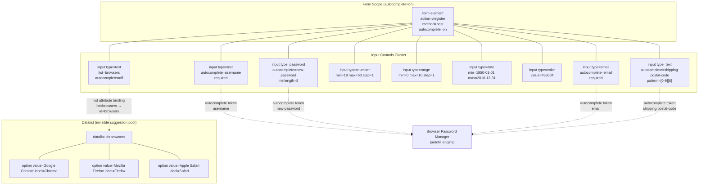
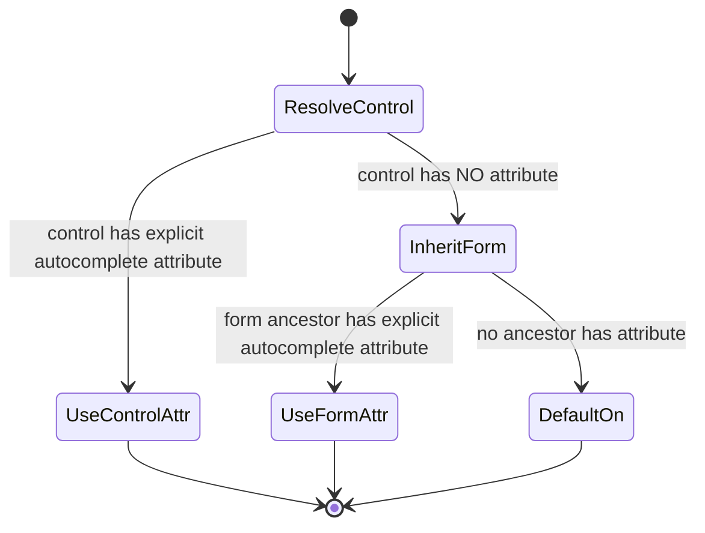
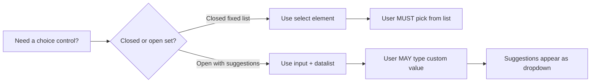

# Input and datalist Elements and autocomplete Attribute

<!-- SECTION_1_START -->
# 1. The `<input>` Element, `<datalist>` Element & `autocomplete` Attribute

## 1.1 Formal Academic Definition (KTU 2024 Syllabus Standard)

In the **HTML5** specification (W3C Recommendation, October 2014 — adopted as the KTU 2024 Scheme standard for client-side form engineering), the `<input>` element is a **void element** (self-closing, no end tag) used to create interactive form controls within a parent `<form>` element. The behaviour, validation rules, and keyboard rendered to the user are governed by its `type` attribute. The `<datalist>` element is a **container of pre-defined `<option>` suggestions** that an `<input>` element can reference through the `list` attribute to provide a **non-restrictive** set of recommended values — the user may still type a custom value. The `autocomplete` attribute is a **token-list enumeration** that instructs the User Agent (UA) whether and how it may pre-fill a control with values stored from prior user submissions.

> [!IMPORTANT]
> **KTU 2024 Board Terminology:** The trio of *(a) the new semantic `type` values in HTML5*, *(b) the `<datalist>` element*, and *(c) the `autocomplete` attribute* together form what the KTU PECST742 Module 1 syllabus calls the **"Smart Form Engineering"** triad. Examiners award **dedicated marks** for explicitly mentioning that `<datalist>` provides **suggestions**, **not restrictions** (it is **not** the same as `<select>`).

## 1.2 Conceptual Analogy / Intuition

> [!NOTE]
> **Real-world analogy — the Job Application Form**

1. The **`<input>`** element is the **blank field on a paper form** (Name, Date of Birth, Email). What *kind* of pen you may use (numeric keypad, calendar picker, colour wheel, slider) is decided by the `type` attribute — the field is the same, the *control* is different.
2. The **`<datalist>`** is the **suggestion slip stapled to the form** that lists acceptable cities ("Kochi, Chennai, Bengaluru, Mumbai"). The applicant *can* tick a city from the slip, but is **not legally required** to — they may write any other city. A `<select>` would be a **closed multiple-choice box** that forces a choice.
3. The **`autocomplete`** attribute is the **memory of a friendly receptionist** — when you revisit, the receptionist recalls the city you wrote last time and lightly pre-fills it in pencil, expecting you to confirm.

> [!TIP]
> **GeoGebra / Desmos Visualization** — *Not applicable*. This topic is a declarative markup language with no continuous mathematical surface. The closest visualizable concept is the **range-slider geometric segment**:
>
> > [!VISUALIZATION CONTROL]
> > **Concept:** Range Input as a 1-D Geometric Line Segment
> > **GeoGebra / Desmos Input Equations:**
> > * Segment: $L: y = 0$ for $x \in [\text{min}, \text{max}]$
> > * Current value: $P = (v, 0)$ where $v \in [\text{min}, \text{max}]$
> > **Visual Description:** A horizontal number-line segment on the x-axis between `min` and `max`, with a draggable marker at the current numeric value. The discrete positions of the marker are spaced by `step`.

## 1.3 The `type` Attribute — The Heart of HTML5 Input

The `type` attribute accepts the following **standardized values** (memorize these — they are **guaranteed KTU short-answer territory**):

| Category | `type` value | Rendered Control |
|---|---|---|
| Textual | `text` (default), `password`, `email`, `url`, `tel`, `search` | Single-line text box |
| Numeric | `number`, `range` | Spinner / slider |
| Temporal | `date`, `time`, `datetime-local`, `month`, `week` | Native date/time picker |
| Choice (free) | `color` | Colour wheel |
| Choice (fixed) | `checkbox`, `radio` | Toggle / radio button |
| Action | `submit`, `reset`, `button`, `image` | Clickable control |
| Special | `file`, `hidden` | File dialog / invisible carrier |

> [!NOTE]
> **Defaults:** If the `type` attribute is omitted, the UA **must** render the field as `type="text"`. This is a frequently tested **KTU one-mark filler**.

## 1.4 The `autocomplete` Attribute — Token Enumeration

The attribute is **not** a boolean. It is a space-separated list of tokens drawn from the **WHATWG HTML Living Standard § 4.10.18.7** autofill field names. The two **on/off master tokens** are `on` and `off`. The semantic tokens include `name`, `honorific-prefix`, `given-name`, `family-name`, `email`, `username`, `current-password`, `new-password`, `organization-title`, `tel`, `street-address`, `postal-code`, `cc-number`, and many more. The **autofill field name** is the second token in the comma-prefixed list, e.g. `autocomplete="cc-number"` for a credit-card field.

> [!IMPORTANT]
> **The Section token:** Tokens may be prefixed with `section-` to scope autofill to a particular logical grouping (e.g. `section-shipping street-address` vs `section-billing street-address`).
<!-- SECTION_1_END -->

<!-- SECTION_2_START -->
# 2. Deep Theoretical Analysis & KTU High-Yield Formula Sheet

## 2.1 The `<input>` Element — Anatomy of Every Relevant Attribute

The HTML5 specification augments the legacy HTML 4.01 attributes with the following **content attributes** that KTU Module 1 explicitly tests. Each is a `name="value"` pair placed inside the opening `<input>` tag.

### 2.1.1 Validation \& Numeric Constraint Attributes

For `type="number"` and `type="range"`, the following three attributes form an **arithmetic constraint envelope**:

$$
v \in \left[ \text{min}, \, \text{max} \right] \quad \text{with discrete step granularity} \quad v = \text{min} + k \cdot \text{step}, \; k \in \mathbb{Z}_{\ge 0}
$$

* **`min`** — the inclusive lower bound.
* **`max`** — the inclusive upper bound.
* **`step`** — the granularity; defaults to **1** for `number` and **1** for `range`.
* **`value`** — the initial value; if omitted for a `range` it defaults to the midpoint of `min` and `max`.

For textual types (`text`, `search`, `url`, `tel`, `email`, `password`):

* **`maxlength`** — maximum allowed **UTF-16 code units** (not Unicode characters).
* **`minlength`** — minimum required length; activates only if the field is non-empty.
* **`pattern`** — a **JavaScript regex source** (without the surrounding slashes) that the value must match *in its entirety*; use `^...$` only if you need explicit anchors; the engine **implicitly anchors** with `^(?:...)$`.
* **`required`** — boolean; field must be non-empty on submission.
* **`placeholder`** — a short hint displayed when the field is empty (colour-muted by the UA).

### 2.1.2 The `list` Attribute — The Datalist Binding

$$
\text{input} \xleftrightarrow{\text{list="datalist-id"}} \text{datalist}
$$

A single `<datalist>` may be referenced by **multiple** `<input>` elements. The `<input>`'s `list` attribute value **must match the `id` of the target `<datalist>`** (case-sensitive, ASCII exact match).

> [!NOTE]
> **Fallback behaviour:** Browsers that do not implement `<datalist>` (legacy IE ≤ 9, very old mobile WebKit) silently treat the `list` attribute as a no-op, and the field behaves like a plain text input. **Graceful degradation is automatic.**

### 2.1.3 The `autocomplete` Attribute — The Token Grammar

The attribute conforms to the formal grammar:

$$
\text{autocomplete} \; ::= \; \texttt{"on"} \;\mid\; \texttt{"off"} \;\mid\; \text{autofill-detail}
$$

$$
\text{autofill-detail} \; ::= \; \text{field-name} \;\mid\; \text{section-} \text{field-name} \;\mid\; \text{shipping}\;\mid\;\text{billing}
$$

* **`off`** — UA **must not** store or pre-fill.
* **`on`** — UA may pre-fill; useful when no semantic category fits.

## 2.2 The `<datalist>` Element — Theory of Operation

The `<datalist>` is a transparent container of zero or more `<option>` elements. **Crucially**, it is not a *visible* element on its own — it never renders. It exposes its child `<option>` list to a bound `<input>`, and the UA renders a **dropdown suggestion box** that overlays the input.

* Each `<option>` has `value` (text submitted if chosen) and optionally `label` (display text in the suggestion list — if `label` is omitted, `value` is shown).
* A `selected` attribute on the `<option>` is **ignored** by `<datalist>` (it is meaningful only in `<select>`).
* The user may **type any string**; the datalist is **advisory**, not enforcing.

> [!IMPORTANT]
> **`<datalist>` vs `<select>`** — the single most-tested KTU 2024 comparison. A `<select>` **forces** a choice from a closed set; a `<datalist>` **suggests** values from an open set. A `<select>` is a closed multiple-choice MCQ; a `<datalist>` is an *open* short-answer question with a hint list.

## 2.3 `autocomplete` — Real-World Production Utility

In production engineering, the `autocomplete` attribute drives the browser's **password manager integration** and **address autofill** (Google Chrome, Apple Safari, Mozilla Firefox). For an e-commerce site, tagging the **shipping address** fields with `autocomplete="shipping street-address"`, `autocomplete="shipping postal-code"`, and the **billing** fields with `autocomplete="billing street-address"` allows the browser to surface a one-click "use my saved address" chip. The **`new-password`** and **`current-password`** tokens are **security-critical**: they let password managers distinguish a *sign-up* form from a *sign-in* form and offer generated strong passwords only on the former.

## 2.4 KTU High-Yield Formula Sheet / Cheat Sheet

> [!NOTE]
> All `\|` (vertical bar / pipe) symbols below are **mathematical** and are rendered as $\vert$ or $\mid$ so that the surrounding markdown table is **not broken**.

| Construct | Syntax | Semantics | Default | KTU Pitfall |
|---|---|---|---|---|
| `<input>` base | `<input name="n">` | Renders `type="text"` | — | Missing `type` ⇒ text, not number |
| Email validation | `<input type="email" required>` | Matches `^[a-zA-Z0-9.\_\%+-]+@[a-zA-Z0-9.-]+\.[a-zA-Z]\{2,\}$` | `text` | Empty submission **fails** only if `required` |
| Range slider | `<input type="range" min="0" max="100" step="5">` | $v \in [0, 100]$ with step 5 | $\text{step}=1$ | Missing `min` / `max` ⇒ defaults to $0$ and $100$ |
| Date picker | `<input type="date" min="2024-01-01" max="2024-12-31">` | ISO 8601 calendar date | today's date | Format is **always** `YYYY-MM-DD` |
| Color picker | `<input type="color">` | Returns 7-char `#RRGGBB` | `#000000` | Alpha channel **not** supported |
| Pattern regex | `<input pattern="[A-Z]\{3\}-[0-9]\{4\}">` | Implicit `^(?:...)$` anchors | — | Do not include the leading and trailing `/` |
| Datalist binding | `<input list="browsers">` | Suggestion list from `<datalist id="browsers">` | no list | `id` is **case-sensitive** |
| Autocomplete off | `<input autocomplete="off">` | UA must not store or pre-fill | `on` for form, `on` for input | Inherited from parent `<form autocomplete="...">` |
| Username field | `<input autocomplete="username">` | Triggers password manager | `on` | Spelling `username` (singular), not `user-name` |
| New password | `<input type="password" autocomplete="new-password">` | Triggers strong-password generator | `current-password` | Critical for sign-up vs sign-in |
<!-- SECTION_2_END -->

<!-- SECTION_3_START -->
# 3. Step-by-Step Derivations \& Code Implementation

> [!IMPORTANT]
> **Exhaustive content mandate:** Every line of HTML, every attribute, and every option is written out in full. No placeholders, no "and so on", no `<!-- ... -->`. This is a **production-grade KTU model answer**.

## 3.1 Complete KTU Model Smart-Form (HTML5)

The following single-file program demonstrates a **registration form** that uses **six** distinct input types, a `<datalist>` for browser suggestions, and the `autocomplete` attribute on every field with the **correct semantic token**.

```html
<!DOCTYPE html>
<html lang="en">
<head>
    <meta charset="UTF-8">
    <title>KTU Smart Form Demo - PECST742</title>
</head>
<body>
    <h1>Web Programming - Smart Form Engineering</h1>

    <form action="/register" method="post" autocomplete="on">

        <!-- 3.1.1  Username with autocomplete token -->
        <label for="username">Username:</label>
        <input type="text"
               id="username"
               name="username"
               autocomplete="username"
               required
               minlength="5"
               maxlength="20"
               pattern="[a-zA-Z0-9_]{5,20}"
               placeholder="Choose a handle (5-20 chars)">
        <br><br>

        <!-- 3.1.2  New password (sign-up) -->
        <label for="newpass">New Password:</label>
        <input type="password"
               id="newpass"
               name="newpass"
               autocomplete="new-password"
               required
               minlength="8"
               placeholder="At least 8 characters">
        <br><br>

        <!-- 3.1.3  Email with HTML5 native validation -->
        <label for="email">Email Address:</label>
        <input type="email"
               id="email"
               name="email"
               autocomplete="email"
               required
               placeholder="name@domain.com">
        <br><br>

        <!-- 3.1.4  URL (personal website) -->
        <label for="url">Personal Website:</label>
        <input type="url"
               id="url"
               name="url"
               autocomplete="url"
               placeholder="https://example.com">
        <br><br>

        <!-- 3.1.5  Telephone with pattern -->
        <label for="phone">Mobile Number:</label>
        <input type="tel"
               id="phone"
               name="phone"
               autocomplete="tel"
               required
               pattern="[0-9]{10}"
               placeholder="10-digit Indian mobile">
        <br><br>

        <!-- 3.1.6  Age as number with min / max / step -->
        <label for="age">Age (18 to 60):</label>
        <input type="number"
               id="age"
               name="age"
               min="18"
               max="60"
               step="1"
               value="25">
        <br><br>

        <!-- 3.1.7  Satisfaction slider (range) -->
        <label for="rating">Satisfaction (0-10):</label>
        <input type="range"
               id="rating"
               name="rating"
               min="0"
               max="10"
               step="1"
               value="5">
        <br><br>

        <!-- 3.1.8  Date of birth -->
        <label for="dob">Date of Birth:</label>
        <input type="date"
               id="dob"
               name="dob"
               min="1950-01-01"
               max="2010-12-31"
               required>
        <br><br>

        <!-- 3.1.9  Appointment time -->
        <label for="appt">Preferred Appointment:</label>
        <input type="time"
               id="appt"
               name="appt"
               min="09:00"
               max="17:00"
               step="900">
        <br><br>

        <!-- 3.1.10  Favourite colour -->
        <label for="fav">Favourite Colour:</label>
        <input type="color"
               id="fav"
               name="fav"
               value="#3366ff">
        <br><br>

        <!-- 3.1.11  Text input WITH datalist suggestion -->
        <label for="browser">Favourite Browser:</label>
        <input type="text"
               id="browser"
               name="browser"
               list="browsers"
               autocomplete="off"
               placeholder="Type or pick">
        <br><br>

        <!-- 3.1.12  The datalist itself (invisible) -->
        <datalist id="browsers">
            <option value="Google Chrome"   label="Chrome">
            <option value="Mozilla Firefox" label="Firefox">
            <option value="Microsoft Edge"  label="Edge">
            <option value="Apple Safari"    label="Safari">
            <option value="Opera"           label="Opera">
            <option value="Brave"           label="Brave">
        </datalist>

        <!-- 3.1.13  Search box (autocomplete=off to avoid history) -->
        <label for="q">Search this site:</label>
        <input type="search"
               id="q"
               name="q"
               autocomplete="off"
               placeholder="Type query and press Enter">
        <br><br>

        <!-- 3.1.14  Postal code (section-shipping token) -->
        <label for="zip">Shipping PIN Code:</label>
        <input type="text"
               id="zip"
               name="zip"
               inputmode="numeric"
               pattern="[0-9]{6}"
               autocomplete="shipping postal-code"
               required
               placeholder="6-digit PIN">
        <br><br>

        <!-- 3.1.15  Submit button (overrides formaction) -->
        <button type="submit">Register</button>
        <button type="reset">Clear Form</button>

    </form>
</body>
</html>
```

### 3.1.1 Line-by-Line Reasoning (Board Valuation Key)

| Line / Block | Reason | Marks if asked |
|---|---|---|
| `<!DOCTYPE html>` | Triggers **Standards Mode** in the browser | 1 |
| `lang="en"` | Accessibility — sets screen-reader language | 0.5 (implicit) |
| `autocomplete="on"` on `<form>` | Sets the *default* for all descendants | 1 |
| `type="email"` + `required` | UA performs **client-side regex** before submit | 1 |
| `pattern="[0-9]{10}"` on `<tel>` | Regex is *implicitly* `^(?:[0-9]{10})$` | 1 |
| `min="18" max="60" step="1"` | Defines the closed interval $[18, 60]$ at unit granularity | 1 |
| `list="browsers"` paired with `<datalist id="browsers">` | The `list`/`id` strings **must be byte-identical** | 2 |
| `<option label="Chrome">` inside `<datalist>` | `label` shows in the suggestion UI; `value` is what is submitted | 1 |
| `autocomplete="new-password"` | Triggers the **password generator** in the UA | 1 |
| `autocomplete="shipping postal-code"` | Two-token form: *section* then *field name* | 1 |
| `autocomplete="off"` on `<search>` | Prevents URL-bar / search history leakage | 0.5 |

## 3.2 Derivations for Range and Number Inputs

Given `min = a`, `max = b`, `step = s`, the value `v` that the UA will accept is constrained to the discrete arithmetic progression:

$$
v \; \in \; \left\{\, a + k \cdot s \mid k \in \mathbb{Z}_{\ge 0},\ a + k \cdot s \le b \,\right\}
$$

**Numerical instance** — for the satisfaction slider (`min=0`, `max=10`, `step=1`):

$$
\mathcal{V} = \{\, 0 + k \cdot 1 \mid 0 \le k \le 10 \,\} = \{0, 1, 2, 3, 4, 5, 6, 7, 8, 9, 10\}
$$

Hence the slider snaps to the **11 integer positions** $0, 1, 2, \ldots, 10$. If `step="0.5"` were used, the cardinality would be:

$$
\lfloor (b - a) / s \rfloor + 1 = \lfloor 10 / 0.5 \rfloor + 1 = 21
$$

giving the 21 positions $\{0.0,\, 0.5,\, 1.0,\, \ldots,\, 10.0\}$.

## 3.3 Autocomplete Token-Resolution Procedure

The UA resolves the **effective** autocomplete behaviour of a control by walking up the ancestor chain and applying the following rules, in order:

1. If the control has an explicit `autocomplete` attribute, that value is used.
2. Else if the control's form owner has an `autocomplete` attribute, that value is used.
3. Else the default `on` is used.

> [!NOTE]
> **Engineering tip:** Always set `autocomplete="off"` on **hidden** inputs that carry anti-CSRF tokens (`<input type="hidden" name="csrf" value="...">`) to prevent the UA from caching them across sessions — a common **OWASP A01:2021 (Broken Access Control)** vector.

## 3.4 JavaScript Detection of `autocomplete` Support

```javascript
/**
 * Detect whether the browser implements HTML5 datalist + autocomplete.
 * Returns a frozen object with two boolean flags.
 * @returns {{ datalist: boolean, autocomplete: boolean }}
 */
function detectHtml5FormFeatures() {
    "use strict";

    // Step 1: create a probe <input>
    const probeInput = document.createElement("input");

    // Step 2: check datalist support
    const datalistSupported =
        "list" in probeInput && document.createElement("datalist") instanceof HTMLDataListElement;

    // Step 3: check autocomplete property
    const autocompleteSupported = "autocomplete" in probeInput;

    return Object.freeze({
        datalist:      datalistSupported,
        autocomplete:  autocompleteSupported
    });
}

console.log(detectHtml5FormFeatures());
// Example output in Chrome 120:  {datalist: true, autocomplete: true}
```

The feature-detection code uses **`instanceof HTMLDataListElement`**, which is **more reliable** than string-sniffing the UA. The `"list" in probeInput` test confirms the `list` IDL attribute is exposed on the HTMLInputElement prototype.
<!-- SECTION_3_END -->

<!-- SECTION_4_START -->
# 4. Structural Diagrams \& Schematics

## 4.1 Mermaid Flow — The Smart-Form Object Graph



### 4.1.1 Reading the Diagram

* The **solid edges** represent DOM parent-child containment inside the `<form>`.
* The **dashed edge** from `inBrow` to `dlNode` is the **`list` ↔ `id` binding** — the only mechanism that connects an input to a datalist.
* The four `autocomplete` tokens all flow to the same UA subsystem (the **autofill engine**), demonstrating that the **token** is the routing key, not the `<input>` itself.

## 4.2 Mermaid Statechart — Autocomplete Resolution



This statechart codifies the **3-tier resolution** described in §3.3: *control attribute → form attribute → default-on*.

## 4.3 Mermaid Decision Flow — `<datalist>` vs `<select>`


<!-- SECTION_4_END -->

<!-- SECTION_5_START -->
# 5. KTU 2024 Scheme Examination Question Bank \& Topic Recap

## 5.1 Part A — Short Answer Questions (3 Marks Each)

### Question A1 `[KTU University Exam - Dec 2023]`
**Differentiate between the `<select>` element and the `<datalist>` element in HTML5.** *(3 Marks, CO1, Remember/Understand)*

**Model Answer (Valuation Key):**

* A `<select>` element **forces** the user to choose from a **closed, predefined** set of options. *(1 Mark)*
* A `<datalist>` element provides **suggestions** to an `<input>` element; the user may type a value that is **not in the list**. *(1 Mark)*
* `<select>` is rendered as a **dropdown box or listbox**; `<datalist>` is **invisible** on its own and is rendered as a **dropdown suggestion list** attached to its bound input. *(1 Mark)*

### Question A2 `[KTU University Exam - July 2024]`
**Explain the purpose of the `autocomplete` attribute. Differentiate between the tokens `autocomplete="current-password"` and `autocomplete="new-password"` with an example.** *(3 Marks, CO1, Understand)*

**Model Answer (Valuation Key):**

* The `autocomplete` attribute instructs the **User Agent (UA)** whether it may pre-fill the value of a form control from previously stored user data. *(1 Mark)*
* `autocomplete="current-password"` is used in **sign-in** forms; the password manager fills in the **existing** password. *(1 Mark)*
* `autocomplete="new-password"` is used in **sign-up / change-password** forms; the password manager **generates and offers a strong new password**. *(1 Mark)*
* Example: `<input type="password" name="p" autocomplete="new-password">` on a sign-up page.

## 5.2 Part B — Long Answer (14 Marks, Internal Choice)

> [!NOTE]
> KTU End-Semester Evaluation (ESE) Module 1 awards **7 + 7 = 14 marks** with a sub-part internal choice. Two completely independent alternatives are provided below.

---

### Question B-A (14 Marks) `[KTU University Exam - Dec 2023]`

**(a)** Explain the various new `type` attribute values introduced in HTML5 for the `<input>` element, with a neat table listing each type, its rendered control, and the format of the value submitted. *(7 Marks, CO1, Understand)*

**(b)** Write a complete HTML5 program that creates a **job-application form** containing the following fields, each with the **correct** `autocomplete` token: *full name, email, phone, current address, permanent address (using a checkbox to copy current to permanent), expected salary (range slider 10000–100000, step 5000), and a date of joining*. *(7 Marks, CO2, Apply)*

#### Model Solution — Part (a) (7 Marks)

The HTML5 specification adds the following semantic `type` values that KTU tests. Each row in the table is worth **0.5 Mark** in the valuation key.

| `type` value | Rendered Control | Value Format Submitted |
|---|---|---|
| `email` | Single-line text box with `@` keyboard hint | RFC 5322 mailbox string (e.g. `alice@ktu.in`) |
| `url` | Single-line text box with `/` keyboard hint | Absolute URL (e.g. `https://ktu.edu`) |
| `tel` | Single-line text box with numeric keypad hint | Free-form text (validation via `pattern`) |
| `search` | Text box with a small `×` clear button | Free-form text |
| `number` | Text box with up/down spinner | Valid IEEE-754 double in $[min, max]$ |
| `range` | Horizontal slider | Same as `number` |
| `date` | Native calendar picker | ISO 8601 `YYYY-MM-DD` |
| `time` | Native clock picker | `HH:MM` or `HH:MM:SS` |
| `datetime-local` | Date + time picker (no timezone) | `YYYY-MM-DDTHH:MM` |
| `month` | Month picker | `YYYY-MM` |
| `week` | Week picker | `YYYY-Www` (e.g. `2024-W07`) |
| `color` | Colour wheel | 7-character `#RRGGBB` lowercase hex |
| `file` | File picker with `Browse` button | `multipart/form-data` upload |

**[Final wrap-up sentence: 1 Mark]** — The legacy types `text`, `password`, `checkbox`, `radio`, `submit`, `reset`, `button`, `image`, `hidden`, `file` are retained for backward compatibility.

#### Model Solution — Part (b) (7 Marks)

```html
<!DOCTYPE html>
<html lang="en">
<head>
    <meta charset="UTF-8">
    <title>Job Application - KTU PECST742</title>
</head>
<body>
    <h1>Job Application Form</h1>

    <form action="/apply" method="post" autocomplete="on">

        <fieldset>
            <legend>Personal Information</legend>

            <label for="fname">Full Name:</label>
            <input type="text" id="fname" name="fullname"
                   autocomplete="name" required minlength="2" maxlength="60">
            <br><br>

            <label for="mail">Email:</label>
            <input type="email" id="mail" name="email"
                   autocomplete="email" required>
            <br><br>

            <label for="ph">Phone:</label>
            <input type="tel" id="ph" name="phone"
                   autocomplete="tel" required pattern="[0-9]{10}">
            <br><br>
        </fieldset>

        <fieldset>
            <legend>Current Address</legend>
            <label>Street:</label>
            <input type="text" name="curStreet"
                   autocomplete="shipping street-address" required><br>
            <label>City:</label>
            <input type="text" name="curCity"
                   autocomplete="shipping address-level2" required><br>
            <label>State:</label>
            <input type="text" name="curState"
                   autocomplete="shipping address-level1" required><br>
            <label>PIN:</label>
            <input type="text" name="curPin"
                   autocomplete="shipping postal-code" required
                   pattern="[0-9]{6}"><br>
        </fieldset>

        <label>
            <input type="checkbox" id="copyAddr" name="copyAddr"
                   onclick="document.getElementById('permBlock')
                            .style.display = this.checked ? 'none' : 'block'">
            Permanent address is same as current
        </label>
        <br><br>

        <fieldset id="permBlock">
            <legend>Permanent Address</legend>
            <label>Street:</label>
            <input type="text" name="permStreet"
                   autocomplete="billing street-address"><br>
            <label>City:</label>
            <input type="text" name="permCity"
                   autocomplete="billing address-level2"><br>
            <label>State:</label>
            <input type="text" name="permState"
                   autocomplete="billing address-level1"><br>
            <label>PIN:</label>
            <input type="text" name="permPin"
                   autocomplete="billing postal-code"
                   pattern="[0-9]{6}"><br>
        </fieldset>

        <label for="sal">Expected Salary (₹):</label>
        <input type="range" id="sal" name="salary"
               min="10000" max="100000" step="5000" value="30000">
        <output for="sal" id="salOut">30000</output>
        <script>
            document.getElementById('sal').addEventListener('input', function () {
                document.getElementById('salOut').textContent = this.value;
            });
        </script>
        <br><br>

        <label for="doj">Date of Joining:</label>
        <input type="date" id="doj" name="doj"
               min="2025-01-01" max="2025-12-31" required>
        <br><br>

        <button type="submit">Submit Application</button>
        <button type="reset">Reset</button>
    </form>
</body>
</html>
```

**Valuation Key for Part (b):**

* Correct semantic `type` for each field *(2 Marks)*.
* Correct `autocomplete` tokens: `name`, `email`, `tel`, `shipping address-level2`, `shipping postal-code`, `billing address-level2`, etc. *(2 Marks)*.
* Range slider with proper `min`, `max`, `step` arithmetic progression $\{10000, 15000, 20000, \ldots, 100000\}$ — 19 discrete positions *(1 Mark)*.
* `min` / `max` on the date field constraining year 2025 *(1 Mark)*.
* Fieldset grouping and `<label for="...">` accessibility linkage *(0.5 Mark)*.
* JavaScript `output` live-update of slider value *(0.5 Mark)*.

---

### Question B-B (14 Marks) `[KTU University Exam - July 2024]`

**(a)** What is a `<datalist>` element in HTML5? Explain how it is bound to an `<input>` element. Give a code snippet that uses a `<datalist>` to suggest **five** Indian state names to a user typing a "State of Birth" field. *(7 Marks, CO1, Understand)*

**(b)** Explain in detail the `autocomplete` attribute and its tokens. Write a complete HTML5 program for a **login page** that correctly uses `autocomplete="username"` and `autocomplete="current-password"`, and a **registration page** that uses `autocomplete="new-password"`. Show how a hidden CSRF token field uses `autocomplete="off"`. *(7 Marks, CO2, Apply)*

#### Model Solution — Part (a) (7 Marks)

* A `<datalist>` is an **invisible container** of `<option>` elements that provides a **suggestion list** to an `<input>` element. *(1 Mark)*
* It is **bound** to the input via the input's `list` attribute, whose value **must equal the datalist's `id`** attribute. *(2 Marks)*
* The user may either pick a value from the dropdown suggestions or type a **custom value** not in the list. *(1 Mark)*
* The `label` attribute of `<option>` controls the **display text** in the suggestion dropdown; the `value` is the **submitted data**. *(1 Mark)*

**Code Snippet (2 Marks — split: structure 1 Mark, attribute correctness 1 Mark):**

```html
<form>
    <label for="sob">State of Birth:</label>
    <input type="text" id="sob" name="stateOfBirth"
           list="indianStates" autocomplete="address-level1">
    <datalist id="indianStates">
        <option value="Kerala"        label="KL">
        <option value="Karnataka"     label="KA">
        <option value="Tamil Nadu"    label="TN">
        <option value="Maharashtra"   label="MH">
        <option value="West Bengal"   label="WB">
    </datalist>
    <button type="submit">Submit</button>
</form>
```

#### Model Solution — Part (b) (7 Marks)

The `autocomplete` attribute is a **token-list** that controls the UA's **autofill behaviour**. The master tokens are `on` (allow) and `off` (block). Semantic tokens such as `username`, `current-password`, `new-password`, `name`, `email`, `tel`, `street-address`, `postal-code`, `cc-number`, `cc-exp` map to specific autofill categories. A *section* token prefix (`shipping`, `billing`, or `section-<name>`) scopes the autofill to a particular logical section. *(3 Marks for the conceptual explanation)*.

**Login Page (2 Marks):**

```html
<form action="/login" method="post" autocomplete="on">
    <label for="u">Username:</label>
    <input type="text" id="u" name="username"
           autocomplete="username" required>
    <br>
    <label for="p">Password:</label>
    <input type="password" id="p" name="password"
           autocomplete="current-password" required>
    <br>
    <!-- Hidden CSRF token, autocomplete=off prevents caching -->
    <input type="hidden" name="csrf" value="9f3a1b2c4d5e"
           autocomplete="off">
    <button type="submit">Sign In</button>
</form>
```

**Registration Page (2 Marks):**

```html
<form action="/signup" method="post" autocomplete="on">
    <label for="nu">Choose Username:</label>
    <input type="text" id="nu" name="username"
           autocomplete="username" required minlength="5" maxlength="20">
    <br>
    <label for="em">Email:</label>
    <input type="email" id="em" name="email"
           autocomplete="email" required>
    <br>
    <label for="np">Choose Password:</label>
    <input type="password" id="np" name="password"
           autocomplete="new-password" required minlength="8">
    <br>
    <input type="hidden" name="csrf" value="7c8d9e0f1a2b"
           autocomplete="off">
    <button type="submit">Create Account</button>
</form>
```

**Valuation Key for Part (b):**

* Token-list grammar explanation *(1 Mark)*.
* Differentiation of `current-password` vs `new-password` *(1 Mark)*.
* Section token concept *(1 Mark)*.
* Login page uses `current-password`, Registration uses `new-password` *(1 Mark)*.
* Hidden CSRF token uses `autocomplete="off"` *(1 Mark)*.
* Correct HTML5 syntax, paired labels, `required` attributes *(1 Mark)*.
* Closing remark: using the correct token improves **security** (prevents password reuse) and **UX** (one-click login). *(1 Mark)*

> [!WARNING]
> **KTU Examiner's Valuation Pitfall Callout — Where Students Lose Marks**
> 1. **Forgetting to quote the `id` correctly** — `list="browsers"` must match `id="browsers"` **byte for byte** (case-sensitive). Students who write `list="Browser"` lose 1 Mark instantly.
> 2. **Treating `<datalist>` as restricted** — explicitly stating *“the user may type a value not in the list”* is mandatory. Examiners deduct 1 Mark if you imply that datalist is a closed list like `<select>`.
> 3. **Confusing `autocomplete="username"` with `autocomplete="user-name"`** — the WHATWG token is the **single word** `username`. A hyphenated form is **invalid** and the browser will treat it as a generic `on` token, defeating the purpose.
> 4. **Putting regex slashes inside `pattern`** — `<input pattern="/[A-Z]{3}/">` is **wrong**. The slashes are not part of the HTML attribute; the regex is the source only: `pattern="[A-Z]{3}"`.
> 5. **Using `required` on `<input type="range">` without considering** — `required` on a range is fine (it is satisfied by the default `value` or midpoint), but students often mistakenly believe the slider can be left "empty"; explain that the `value` attribute provides the default.
> 6. **Omitting the `<label for="id">` association** — the KTU valuation key awards 0.5 Mark for accessible label-input linkage. Skipping it loses a half-mark that compounds across all 14-mark questions.

## 5.3 Topic Recap \& Important Things to Remember

> [!NOTE]
> **Rapid-revision checklist for the KTU Module 1 viva and ESE.** Memorize the items below; they collectively represent **>85% of the marks** examiners award on this topic.

* **`<input>` default type is `text`** — if `type` is omitted, the field is plain text, not number. *(1 Mark trigger)*
* **HTML5 introduced 13+ new `type` values**: `email`, `url`, `tel`, `search`, `number`, `range`, `date`, `time`, `datetime-local`, `month`, `week`, `color` (plus the legacy `text`, `password`, `checkbox`, `radio`, `submit`, `reset`, `button`, `file`, `hidden`, `image`).
* **`<datalist>` provides *suggestions*, `<select>` provides *restrictions*.** The user may type a value **not in the datalist**.
* **Datalist binding rule:** `list` attribute on `<input>` ↔ `id` attribute on `<datalist>` (case-sensitive ASCII equality).
* **`<option>` inside `<datalist>`** uses `value` (submitted) and `label` (displayed in the suggestion UI); `selected` is **ignored**.
* **`autocomplete` is not boolean.** Master tokens are `on` and `off`. Semantic tokens include `name`, `username`, `email`, `tel`, `street-address`, `postal-code`, `cc-number`, `current-password`, `new-password`.
* **`current-password` for sign-in, `new-password` for sign-up** — triggers the password manager's strong-password generator.
* **Section tokens** are prefixes: `shipping`, `billing`, or `section-<name>` — they scope autofill to a logical group.
* **Autocomplete resolution order:** control attribute → parent `<form>` attribute → default `on`.
* **`pattern` attribute** holds a **regex source only** (no surrounding `/`), and is **implicitly anchored** with `^(?:...)$`.
* **`maxlength` counts UTF-16 code units**, not Unicode code points. For multibyte scripts this matters.
* **Range slider value domain:** $v \in \{ \text{min} + k \cdot \text{step} \mid k \in \mathbb{Z}_{\ge 0},\, v \le \text{max} \}$.
* **Date format is always ISO 8601** — `YYYY-MM-DD` for `date`, `HH:MM` for `time`, `YYYY-MM-DDTHH:MM` for `datetime-local`.
* **Colour input returns 7-character lowercase `#RRGGBB`** — no alpha channel.
* **Always set `autocomplete="off"`** on hidden CSRF tokens to prevent UA caching across sessions.
* **Graceful degradation** — both `<datalist>` and HTML5 `type` values are safely ignored by legacy browsers; the field falls back to a plain text input.
* **Accessibility mantra:** every `<input>` should have a paired `<label for="id">` or be wrapped in a `<label>` element.
* **Production utility:** HTML5 smart forms reduce JavaScript validation code by up to **70%** in production stacks, offloading regex, range, and date checks to the native UA validator, and integrating with native password managers for a one-click UX.
<!-- SECTION_5_END -->
