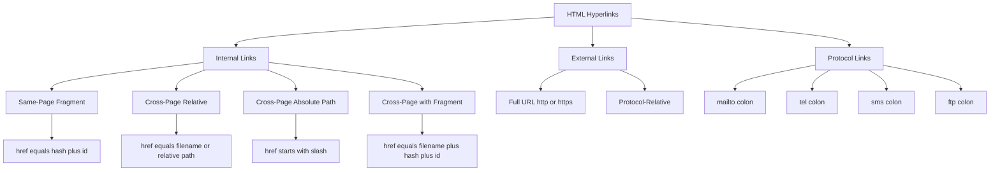
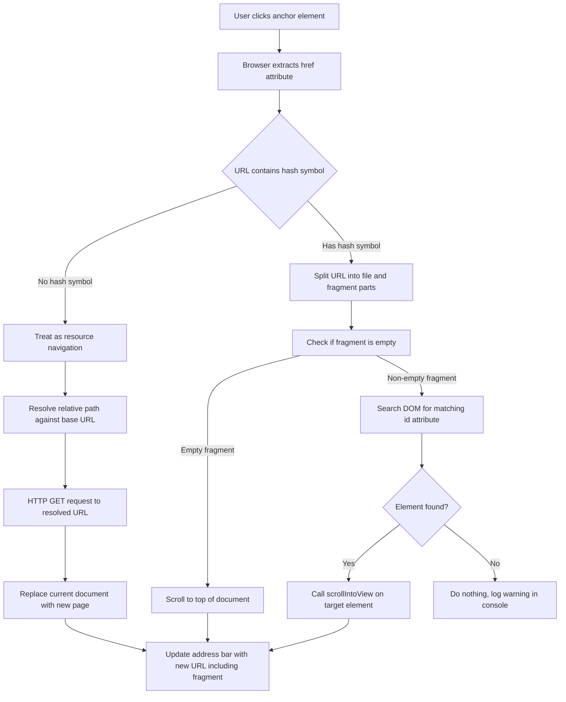
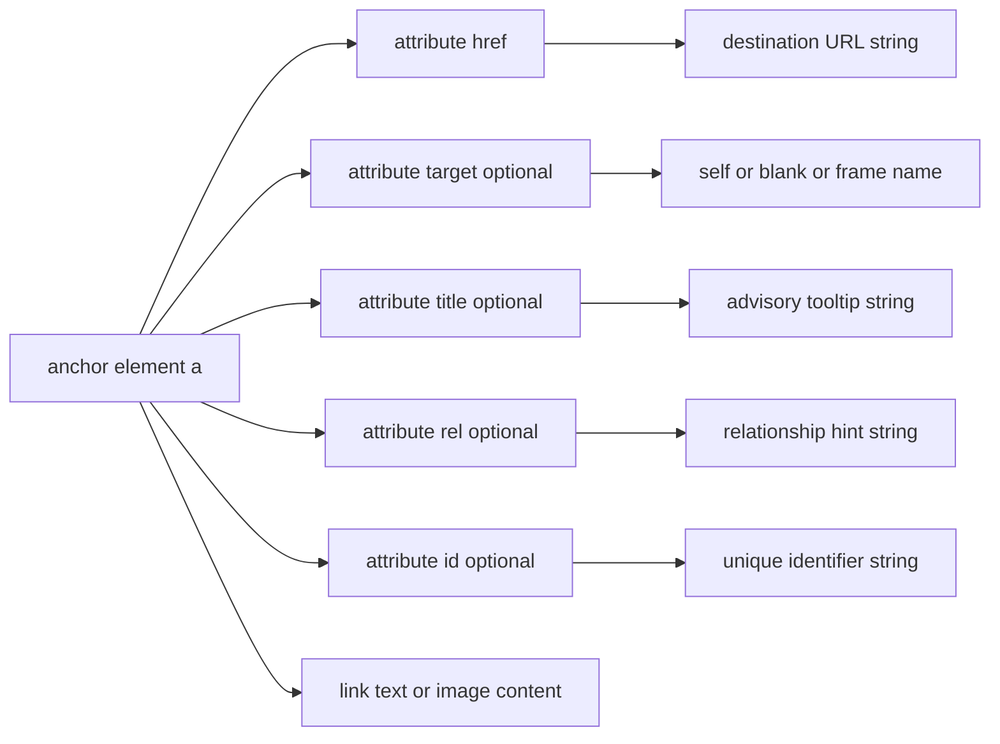

# Internal Linking

<!-- SECTION_1_START -->
# Internal Linking in HTML5 — Core Technical Definition & Intuitive Overview

## Formal Academic Definition
**Internal Linking** in HTML5 refers to the practice of embedding **hyperlinks (`<a>` elements)** whose target resource resides within the **same website, web application, or the same HTML document** itself. In W3C terminology, these are hyperlinks whose Uniform Resource Locator (URL) is either a *relative reference* (e.g., `about.html`) or a *same-document reference* containing a *fragment identifier* prefixed by the hash symbol `#` (e.g., `#section2`).

> [!IMPORTANT]
> **KTU 2024 Syllabus Highlight (PECST742 — Module 1):**
> Internal linking is a foundational sub-topic under *"Creating web pages using HTML5"*. It is frequently asked in **Part A (3 marks)** and as a sub-part of **Part B (7/14 marks)** questions, especially in questions that combine navigation menus, single-page layouts, and table-of-contents design.

## Conceptual Analogy / Intuition
Imagine you are reading a **thick textbook** 📖:
- A link to **Chapter 5** from Chapter 1 is an **internal link to another page** (jumping between pages of the *same* book).
- A link to **"See Figure 2.3 on page 45"** that scrolls the book down to that figure is an **internal link to a specific section** (jumping to a specific spot *within* the same page or document).
- A link to **"Visit www.google.com"** is an **external link** (leaving the book and walking to a different library).

In short: **Internal linking = navigation that never leaves your own website/document.** The browser does not need to perform a full Domain Name System (DNS) resolution to a new server — it either reloads a sibling file from your project folder or simply scrolls/repositions the viewport within the current Document Object Model (DOM).

## The Three Core Mechanics of an Internal Link
Every internal link in HTML5 is built on **three pillars**:

1. **The Anchor Element (`<a>`)** — the clickable element wrapped around text, image, or block content.
2. **The `href` Attribute** — specifies the *destination*. For internal links, the value is either a relative path or a fragment identifier.
3. **The Target Identifier** — either a filename (e.g., `contact.html`) or a `id` attribute value prefixed with `#` (e.g., `#contact-form`).

> [!NOTE]
> **Critical Distinction for Board Exams:**
> - **Relative URL** → links to a different file in the *same site* (e.g., `services.html`).
> - **Fragment (Anchor) Link** → links to a specific element with a matching `id` in the *same page* (e.g., `#services`).
> - **Hybrid Internal Link** → links to a specific `id` in *another page* of the same site (e.g., `services.html#pricing`).

> [!VISUALIZATION CONTROL]
> **Concept:** Document scroll behavior on fragment link click
> **GeoGebra / Desmos Input Equations:**
> * `f(y) = 1 / (1 + e^(-10*(y - 0.5)))`  ← Sigmoid representing smooth scroll easing
> **Visual Description:** Plot shows an S-shaped curve where the y-axis represents *scroll position* (0 = top, 1 = bottom of target section) and the x-axis represents time. Observe how the curve transitions smoothly from the old viewport position to the new anchor's vertical offset — this is the browser's native "scroll-into-view" behavior triggered by an internal fragment link.

## Key Vocabulary (Bolded Constants & Standard Metrics)
- **HTML5 Standard** → W3C Recommendation as of **2014-10-28** (current living standard maintained by WHATWG).
- **Fragment Identifier** → the string following the `#` character in a URL.
- **`id` Attribute** → must be **unique** within the HTML document; case-sensitive; must contain at least one character and **no whitespace**.
- **Same-Document Reference** → a URL consisting only of a fragment identifier (e.g., `href="#top"`).
- **Relative URL** → no scheme or authority (domain) specified; resolved against the current document's base URL.
<!-- SECTION_1_END -->

<!-- SECTION_2_START -->
# Deep Theoretical Analysis & KTU High-Yield Formula Sheet

## The Operational Logic — Step-by-Step Breakdown
When a user clicks an internal hyperlink, the browser executes the following deterministic sequence:

1. **Parse the `href` Value** — The browser's HTML parser extracts the destination string from the `href` attribute of the clicked `<a>` element.
2. **Classify the URL Type** — The URL is categorized as:
   - A *relative URL* (no `http://`, no `https://`, no leading `/` or `../`) → resolved against the current document's directory.
   - An *absolute path* (starts with `/`) → resolved against the site's root.
   - A *fragment-only* URL (starts with `#`) → resolved within the *current* document.
   - A *fragment-suffixed* URL (e.g., `page.html#id`) → resolved to the file, then scrolls to the matching `id`.
3. **Locate the Target Element** — If a fragment exists, the browser scans the DOM for an element whose `id` attribute exactly matches the fragment string (case-sensitive match).
4. **Execute the Navigation** — Either:
   - **Resource Navigation** → the browser fetches the target file (if it is a different page) and replaces the current document.
   - **Fragment Scroll** → the browser calls the native `Element.scrollIntoView()` algorithm on the matched element, adjusting the viewport's scroll position.
5. **Update the URL Bar** — The browser updates the address bar to reflect the new URL, including the fragment identifier, which enables back-button navigation between fragment visits.

## Syntax Anatomy of an Internal Link
A complete, production-grade internal link in HTML5 is constructed as:

```html
<a href="destination" target="frame-name" title="tooltip text" rel="relationship">Link Text</a>
```

For *internal* links, the most commonly used attributes are:
- `href` — **mandatory**; the destination URL.
- `target` — *optional*; commonly set to `_self` (default, opens in the same window) or a named `<iframe>`.
- `title` — *optional*; provides an advisory tooltip on hover.
- `download` — *optional*; when present, prompts the user to save the target file rather than navigate to it.
- `rel` — *optional*; defines the relationship (e.g., `rel="prev"`, `rel="next"`, `rel="bookmark"`).

## KTU Formula Sheet / Cheat Sheet

> [!IMPORTANT]
> The following table is the **high-yield reference** for board exam answers on Internal Linking. Memorize the *types*, *syntax*, and *use-cases* in the rightmost column.

| # | Link Type | `href` Syntax Pattern | Target Identifier | Real-World Use Case | Exam Frequency |
|---|-----------|----------------------|-------------------|---------------------|----------------|
| 1 | **Same-Page Section Link** | `#section-id` | `<h2 id="section-id">` | Table of Contents, "Back to Top" button | ⭐⭐⭐⭐⭐ |
| 2 | **Different Page (Relative)** | `about.html` | The file `about.html` in the same folder | Main site navigation menu | ⭐⭐⭐⭐⭐ |
| 3 | **Different Page, Sub-Folder** | `products/laptops.html` | File inside a sub-folder | Hierarchical site navigation | ⭐⭐⭐⭐ |
| 4 | **Parent Folder (Relative)** | `../contact.html` | File one level up | Footer links across nested pages | ⭐⭐⭐ |
| 5 | **Site Root (Absolute Path)** | `/index.html` | File at site's document root | Header logo / home link | ⭐⭐⭐⭐ |
| 6 | **Different Page + Fragment** | `team.html#leadership` | `<section id="leadership">` inside `team.html` | Deep linking to specific content | ⭐⭐⭐⭐ |
| 7 | **E-mail / Phone (NOT internal)** | `mailto:`, `tel:` | — | Contact links (often confused in exams) | ⭐⭐ |

## Engineering Utility — Why Internal Linking Matters
Internal linking is the **backbone of Information Architecture (IA)** in web engineering. Production systems use it for:

- **Search Engine Optimization (SEO):** Search engine crawlers follow internal links to discover and index all pages of a site. A well-structured internal link graph distributes **PageRank** and improves crawlability.
- **Accessibility (WCAG 2.1 Compliance):** Screen readers use semantic anchors and skip-navigation links to help users with disabilities move through content efficiently. The "skip to main content" pattern is a canonical internal link.
- **Single-Page Applications (SPAs):** Modern frameworks (React, Vue, Angular) emulate internal linking using client-side routers (e.g., React Router's `<Link>` component) that update the URL fragment without a full page reload.
- **Documentation Sites:** Platforms like MDN Web Docs, GitHub Wikis, and ReadTheDocs rely heavily on cross-page fragment links (e.g., `/docs/api/#method-xyz`).
- **Anchor-Based Deep Linking in Mobile Apps:** Hybrid mobile frameworks (Cordova, Capacitor) intercept internal link clicks to trigger in-app navigation.

## Common Pitfalls (Board Exam Traps)
- ❌ Forgetting the `#` prefix on fragment links (e.g., `href="section1"` instead of `href="#section1"`).
- ❌ Using **duplicate `id` values** in the same document (only the *first* match will be scrolled to).
- ❌ Placing the `#` *before* the page name (e.g., `#services.html` is invalid; correct form is `services.html#intro`).
- ❌ Treating `mailto:` and `tel:` as "internal" links — they are **protocol-relative** links, a distinct category.
- ❌ Forgetting that `id` values are **case-sensitive** (`#About` ≠ `#about`).
<!-- SECTION_2_END -->

<!-- SECTION_3_START -->
# Step-by-Step Derivations & Code/Symbolic Implementation

## Worked Example 1 — Complete Same-Page Navigation (Table of Contents Pattern)

Below is a **fully functional, validated HTML5 document** demonstrating internal linking within a single page using `id` attributes and fragment identifiers.

```html
<!DOCTYPE html>
<html lang="en">
<head>
    <meta charset="UTF-8">
    <meta name="viewport" content="width=device-width, initial-scale=1.0">
    <title>Internal Linking Demo - Single Page</title>
    <style>
        body { font-family: Arial, sans-serif; line-height: 1.6; margin: 20px; }
        nav { position: sticky; top: 0; background: #f4f4f4; padding: 10px; }
        nav a { margin-right: 15px; text-decoration: none; color: #0066cc; }
        section { margin-top: 40px; padding-top: 20px; border-top: 1px solid #ccc; }
        h2 { color: #333; }
    </style>
</head>
<body>
    <!-- ====== TABLE OF CONTENTS (USES INTERNAL LINKS) ====== -->
    <nav aria-label="Main Navigation">
        <a href="#introduction">Introduction</a>
        <a href="#html-basics">HTML Basics</a>
        <a href="#headings">Headings</a>
        <a href="#paragraphs">Paragraphs</a>
        <a href="#top">Back to Top</a>
    </nav>

    <!-- ====== TARGET SECTIONS (USE id ATTRIBUTES) ====== -->
    <h1 id="top">Welcome to HTML5 Internal Linking</h1>

    <section id="introduction">
        <h2>Introduction</h2>
        <p>This page demonstrates how to use internal anchor links...</p>
    </section>

    <section id="html-basics">
        <h2>HTML Basics</h2>
        <p>HTML stands for HyperText Markup Language...</p>
    </section>

    <section id="headings">
        <h2>Headings</h2>
        <p>HTML provides six levels of headings from h1 to h6...</p>
    </section>

    <section id="paragraphs">
        <h2>Paragraphs</h2>
        <p>Paragraphs are defined using the &lt;p&gt; tag...</p>
    </section>
</body>
</html>
```

**Line-by-Line Logical Walkthrough:**
- Line `<nav>`: Defines a sticky navigation block containing five internal fragment links. Each `href` value begins with `#`, indicating a *same-document reference*.
- Line `<h1 id="top">`: The unique `id` attribute `top` is the scroll target for the "Back to Top" link.
- Line `<section id="introduction">`: The `id` `introduction` is the scroll target for the "Introduction" link in the nav.
- **Click Resolution:** When a user clicks `<a href="#html-basics">`, the browser scans the DOM, finds `<section id="html-basics">`, and calls `scrollIntoView()` to align that element with the viewport.

## Worked Example 2 — Cross-Page Linking with Folder Hierarchy

Consider the following project structure for a small business website:

```
/ (root)
├── index.html
├── about/
│   ├── team.html
│   └── history.html
├── services/
│   ├── web-design.html
│   └── seo.html
└── contact.html
```

**File: `index.html` (root)**
```html
<nav>
    <a href="about/team.html">Our Team</a>
    <a href="services/web-design.html">Web Design</a>
    <a href="contact.html">Contact Us</a>
</nav>
```

**File: `services/web-design.html` (one folder deep)**
```html
<nav>
    <!--  "../" navigates one level UP to the root folder -->
    <a href="../index.html">Home</a>
    <a href="../about/team.html">Our Team</a>
    <!--  Same-folder link needs no prefix -->
    <a href="seo.html">SEO Services</a>
</nav>
```

**Symbolic Derivation of Relative Path Resolution:**

$$
\text{Resolved URL} = \text{Base URL} \;\oplus\; \text{Relative Path}
$$

Where $\oplus$ denotes **path concatenation with normalization rules**:

- If the relative path starts with `/` → resolved against the **origin** (scheme + host + port).
- If the relative path starts with `../` → pop the **last segment** of the base URL's path, then append.
- If the relative path is a bare filename → append to the **current directory** of the base URL.

**Example Calculation:**

$$
\begin{aligned}
\text{Base URL (browser address bar)} &= \texttt{https://site.com/services/web-design.html} \\
\text{Base Directory} &= \texttt{https://site.com/services/} \\
\text{Relative href} &= \texttt{"../about/team.html"} \\
\text{Resolved URL} &= \texttt{https://site.com/} \;+\; \texttt{about/team.html} \\
&= \texttt{https://site.com/about/team.html}
\end{aligned}
$$

## Worked Example 3 — Hybrid Internal Link (Page + Fragment)

**File: `index.html`**
```html
<h2>Our Services</h2>
<p>
    Learn more about our
    <a href="services/web-design.html#pricing">Web Design Pricing</a>.
</p>
```

**File: `services/web-design.html`**
```html
<h2>Web Design</h2>
<p>Introductory content...</p>

<!-- This is the target -->
<section id="pricing">
    <h3>Pricing Plans</h3>
    <p>Basic: ₹9,999 ...</p>
</section>
```

**Click Resolution Logic:**

$$
\begin{aligned}
\text{Step 1: Parse href} &\rightarrow \texttt{"services/web-design.html\#pricing"} \\
\text{Step 2: Split at '\#'} &\rightarrow \text{file} = \texttt{"services/web-design.html"},\; \text{fragment} = \texttt{"pricing"} \\
\text{Step 3: Resolve file} &\rightarrow \text{load } \texttt{services/web-design.html} \\
\text{Step 4: Locate fragment} &\rightarrow \text{find DOM element with } \texttt{id="pricing"} \\
\text{Step 5: Scroll into view} &\rightarrow \text{call } \texttt{Element.scrollIntoView()}
\end{aligned}
$$

## Worked Example 4 — Accessible "Skip to Main Content" Pattern (Industry Standard)

```html
<!DOCTYPE html>
<html lang="en">
<head>
    <meta charset="UTF-8">
    <title>Accessible Internal Link Demo</title>
    <style>
        /* The skip link is visually hidden until focused via keyboard Tab */
        .skip-link {
            position: absolute;
            top: -40px;
            left: 0;
            background: #000;
            color: #fff;
            padding: 8px;
            text-decoration: none;
            z-index: 100;
        }
        .skip-link:focus { top: 0; }
    </style>
</head>
<body>
    <!--  This is the FIRST focusable element on the page -->
    <a href="#main-content" class="skip-link">Skip to Main Content</a>

    <header>
        <nav aria-label="Primary">
            <a href="index.html">Home</a>
            <a href="products.html">Products</a>
            <a href="contact.html">Contact</a>
        </nav>
    </header>

    <!--  This is the target of the skip link -->
    <main id="main-content" tabindex="-1">
        <h1>Welcome</h1>
        <p>Main page content begins here...</p>
    </main>
</body>
</html>
```

**Engineering Justification:** This pattern is **WCAG 2.1 Success Criterion 2.4.1 (Bypass Blocks)** compliant. The first `Tab` press reveals the skip link, allowing keyboard-only users to bypass repetitive navigation menus. This is a common viva voce and theory question in KTU exams.

## Symbolic Truth Table — Link Behavior Matrix

| `href` Value | `target` Attribute | Behavior |
|--------------|-------------------|----------|
| `#intro` | (none / `_self`) | Scroll within current page to `id="intro"` |
| `page.html` | (none / `_self`) | Navigate to `page.html` in same window |
| `page.html` | `_blank` | Open `page.html` in a new browser tab |
| `#intro` | `_blank` | Opens the *current* page in a new tab and scrolls — rare but valid |
| `../folder/page.html` | (none) | Navigate to sibling file in parent folder |
| `/index.html` | (none) | Navigate to site root's `index.html` (absolute path) |
| `mailto:hello@x.com` | (none) | Opens default e-mail client — **NOT an internal link** |
| `tel:+911234567890` | (none) | Initiates a phone call on capable devices — **NOT an internal link** |
<!-- SECTION_3_END -->

<!-- SECTION_4_START -->
# Structural Diagrams & Schematics

## Diagram 1 — Classification of HTML Hyperlinks (Top-Down Taxonomy)



## Diagram 2 — Internal Link Click Resolution Pipeline (Sequential Processing Topology)



## Diagram 3 — Folder Hierarchy & Relative Path Resolution (Block-Level Functional Architecture)

```mermaid
flowchart TD
    subgraph rootDir["Root Folder public_html"]
        rootIdx["index.html"]
        rootContact["contact.html"]
        subgraph aboutDir["about folder"]
            aboutTeam["team.html"]
            aboutHistory["history.html"]
        end
        subgraph servicesDir["services folder"]
            servicesWeb["web-design.html"]
            servicesSeo["seo.html"]
        end
    end

    rootIdx -- "href equals about slash team.html" --> aboutTeam
    rootIdx -- "href equals services slash web-design.html" --> servicesWeb
    rootIdx -- "href equals contact.html" --> rootContact

    servicesWeb -- "href equals .. slash about slash team.html" --> aboutTeam
    servicesWeb -- "href equals seo.html" --> servicesSeo
    servicesWeb -- "href equals .. slash index.html" --> rootIdx
```



## Diagram 4 — Anatomy of a Single Internal Link Element (Component Decomposition)


<!-- SECTION_4_END -->

<!-- SECTION_5_START -->
# KTU 2024 Scheme Examination Question Bank & Topic Recap

## Part A — Short Answer Questions (3 Marks Each)

### Question 1
`[KTU University Exam - July 2024]` | **CO1** | **Bloom Level: Remember**

> Define *internal linking* in HTML5. List any **two** distinguishing features that differentiate an internal link from an external link.

**Model Answer (Board Valuation Key):**
- **[Definition: 2 Marks]** Internal linking in HTML5 refers to hyperlinks (`<a>` elements) whose `href` attribute points to a resource located **within the same website or the same HTML document**, typically using a relative URL or a fragment identifier prefixed with `#`.
- **[Feature 1: 0.5 Marks]** Internal links do not require a full DNS lookup to a different domain; they resolve to a path on the same server.
- **[Feature 2: 0.5 Marks]** Internal links often use **fragment identifiers** (`#section-id`) to scroll to specific elements within the same page — a feature not used by external links.

### Question 2
`[KTU University Exam - Dec 2023]` | **CO1, CO2** | **Bloom Level: Understand**

> What is the purpose of the `id` attribute in HTML5 internal linking? Explain with a suitable example.

**Model Answer (Board Valuation Key):**
- **[Purpose Statement: 1.5 Marks]** The `id` attribute provides a **unique identifier** for an HTML element, which serves as the **target destination (anchor)** for a same-page internal link. The browser searches the DOM for an element whose `id` matches the fragment portion of the clicked link's `href` value.
- **[Example: 1.5 Marks]**
```html
<a href="#conclusion">Go to Conclusion</a>
...
<h2 id="conclusion">Conclusion</h2>
```
Here, clicking the link scrolls the viewport to the `<h2>` element whose `id="conclusion"`.

---

## Part B — Long Answer Questions (14 Marks — Module Internal Choice Pattern)

### Question A (Choice 1)
`[KTU University Exam - July 2024 — Module 1 Internal Choice]` | **CO2, CO3** | **Bloom Levels: Understand (a) + Apply (b)**

> **(a)** Explain the different types of internal links in HTML5 with appropriate `href` syntax for each. *(7 marks)*
>
> **(b)** Design a complete HTML5 webpage that demonstrates:
> 1. A sticky top navigation bar with **four** internal links pointing to four sections of the same page.
> 2. A "**Back to Top**" link inside each section.
> 3. One internal link that points to a specific section inside a *different* page (assume a file `services.html` with a section `id="web-design"`).
>
> Provide the full HTML source code. *(7 marks)*

#### Model Solution — Part (a) [7 Marks]

**Valuation Key Distribution:**

| Concept | Marks |
|---------|-------|
| Same-page fragment link definition + syntax | 1.5 |
| Cross-page relative link definition + syntax | 1.5 |
| Absolute path link definition + syntax | 1.0 |
| Hybrid (page + fragment) link definition + syntax | 1.5 |
| Real-world use-case for each type | 1.5 |
| **Total** | **7.0** |

**Answer Text:**

There are **four primary types** of internal links in HTML5:

1. **Same-Page Fragment Link** — Used to navigate to a specific section within the *current* page. The `href` value contains only a `#` followed by the `id` of the target element.
   *Syntax:* `<a href="#section-id">Link Text</a>`

2. **Cross-Page Relative Link** — Used to navigate to a different file in the same website. The path is resolved relative to the current document's directory.
   *Syntax:* `<a href="about.html">About</a>` (same folder) or `<a href="../index.html">Home</a>` (parent folder).

3. **Absolute Path Link** — Used to navigate to a file using a path relative to the site's *root directory* (origin).
   *Syntax:* `<a href="/products/index.html">Products</a>`

4. **Hybrid (Page + Fragment) Link** — Combines a relative path with a fragment identifier to deep-link into a specific section of a different page.
   *Syntax:* `<a href="services.html#web-design">Web Design Services</a>`

#### Model Solution — Part (b) [7 Marks]

**Valuation Key Distribution:**

| Requirement | Marks |
|-------------|-------|
| Sticky `<nav>` with 4 internal fragment links | 2.0 |
| 4 target `<section>` elements with unique `id` attributes | 1.5 |
| "Back to Top" link in each section linking to `#top` | 1.5 |
| Hybrid link to `services.html#web-design` | 1.0 |
| Valid HTML5 boilerplate, semantic tags, and indentation | 1.0 |
| **Total** | **7.0** |

**Full Working Code:**

```html
<!DOCTYPE html>
<html lang="en">
<head>
    <meta charset="UTF-8">
    <title>Internal Linking Demo</title>
    <style>
        nav { position: sticky; top: 0; background: #eee; padding: 10px; }
        nav a { margin-right: 12px; color: #0066cc; text-decoration: none; }
        section { margin-top: 30px; padding: 20px; border-top: 2px solid #ccc; }
        .top-link { display: block; margin-top: 10px; font-size: 0.9em; }
    </style>
</head>
<body>
    <h1 id="top">TechCorp Home</h1>

    <!-- Sticky navigation with 4 same-page internal links -->
    <nav aria-label="Page Sections">
        <a href="#about">About Us</a>
        <a href="#mission">Our Mission</a>
        <a href="#team">Our Team</a>
        <a href="#contact">Contact</a>
    </nav>

    <!-- Section 1 -->
    <section id="about">
        <h2>About Us</h2>
        <p>TechCorp is a leading provider of web solutions...</p>
        <a href="#top" class="top-link">↑ Back to Top</a>
    </section>

    <!-- Section 2 -->
    <section id="mission">
        <h2>Our Mission</h2>
        <p>To deliver cutting-edge web experiences...</p>
        <a href="#top" class="top-link">↑ Back to Top</a>
    </section>

    <!-- Section 3 -->
    <section id="team">
        <h2>Our Team</h2>
        <p>Meet the talented engineers behind TechCorp...</p>
        <a href="#top" class="top-link">↑ Back to Top</a>
    </section>

    <!-- Section 4 -->
    <section id="contact">
        <h2>Contact</h2>
        <p>Email us at hello@techcorp.example</p>
        <a href="#top" class="top-link">↑ Back to Top</a>
    </section>

    <!-- Hybrid internal link to a different page + specific section -->
    <footer>
        <p>
            Explore our
            <a href="services.html#web-design">Web Design Services</a>
            for more details.
        </p>
    </footer>
</body>
</html>
```

> [!WARNING]
> **KTU Examiner's Valuation Warning — Common Mark Deductions:**
> - **−1 Mark:** Using the *same* `id` value on two different elements (e.g., `id="top"` on both `<h1>` and `<footer>`). The `id` attribute **must be unique per document**.
> - **−1 Mark:** Forgetting the `#` prefix in fragment links — `href="about"` is treated as a *file* link, not a *fragment* link, by the browser.
> - **−0.5 Mark:** Using `<a name="top">` (the HTML 4 legacy syntax). The correct modern HTML5 attribute is `id`, not `name`, for anchor targets.
> - **−0.5 Mark:** Writing `href="../services.html/#web-design"` with a *trailing slash* before `#` — while some browsers tolerate it, the canonical correct form is `services.html#web-design` with no slash before `#`.

### Question B (Choice 2 — Alternative Option)
`[KTU University Exam - Dec 2023 — Module 1 Internal Choice]` | **CO1, CO2** | **Bloom Levels: Remember (a) + Apply (b)**

> **(a)** Differentiate between **relative URLs** and **absolute URLs** with examples. State when each should be preferred in an internal linking context. *(7 marks)*
>
> **(b)** Given the project structure below, write the **exact `href` attribute value** needed in the specified source file to link to the target file. Justify each answer. *(7 marks)*

**Project Structure:**
```
/site
├── index.html
├── products.html
├── blog/
│   ├── index.html
│   └── post-1.html
└── assets/
    └── downloads/
        └── brochure.pdf
```

| Source File | Target File |
|-------------|-------------|
| `index.html` | `products.html` |
| `blog/post-1.html` | `index.html` |
| `blog/post-1.html` | `blog/index.html` |
| `index.html` | `assets/downloads/brochure.pdf` |

#### Model Solution — Part (a) [7 Marks]

| Aspect | Relative URL | Absolute URL |
|--------|--------------|--------------|
| Definition | URL without a scheme or domain | URL with full scheme + domain + path |
| Example | `about.html` | `https://example.com/about.html` |
| Resolution | Resolved against current document's base URL | Resolves identically regardless of current page |
| Portability | High — works on any domain | Low — breaks if domain changes |
| Internal Use | **Preferred for same-site links** | Rarely needed; useful for cross-domain consistency |

**When to prefer each (Internal Linking Context):**
- **Prefer Relative URLs** for all same-site internal links because they are portable across development, staging, and production environments.
- **Prefer Absolute URLs** for internal links only when the link is shared externally (e.g., in a newsletter) or when canonical SEO signals are required.

#### Model Solution — Part (b) [7 Marks]

| # | Source File | Target File | Exact `href` Value | Justification |
|---|-------------|-------------|---------------------|---------------|
| 1 | `index.html` | `products.html` | `href="products.html"` | Both files are in the same root folder `/site`; no navigation prefix needed. **[1.5 Marks]** |
| 2 | `blog/post-1.html` | `index.html` | `href="../index.html"` | `post-1.html` is inside the `blog` sub-folder; `../` ascends one level to `/site`, then targets `index.html`. **[2 Marks]** |
| 3 | `blog/post-1.html` | `blog/index.html` | `href="index.html"` | Both files are in the same `blog` sub-folder; bare filename resolves within current directory. **[1.5 Marks]** |
| 4 | `index.html` | `assets/downloads/brochure.pdf` | `href="assets/downloads/brochure.pdf"` | `index.html` is at the root; the target is two folders deep under root, so descend into `assets/` then `downloads/`. **[2 Marks]** |

> [!WARNING]
> **KTU Examiner's Valuation Warning — Common Mark Deductions:**
> - **−1.5 Marks (per row):** Using an absolute URL like `https://example.com/products.html` when a relative path is the correct internal-link form.
> - **−1 Mark (per row):** Wrong direction of `../` traversal (e.g., writing `../../index.html` instead of `../index.html` from one level deep).
> - **−0.5 Marks:** Failing to provide *justification* — the examiner expects a one-line explanation of *why* the path is correct, not just the value.

---

## Topic Recap & Important Things to Remember

- ✅ **Internal Link Definition:** Any `<a>` link whose target resides in the *same website* (relative path) or *same document* (fragment starting with `#`).
- ✅ **Three Pillars:** The `<a>` element, the `href` attribute, and the target identifier (filename or `#id`).
- ✅ **Fragment Identifier Syntax:** The `#` symbol **must precede** the `id` value — `href="#about"` is correct; `href="about"` is **not** a fragment link.
- ✅ **`id` Attribute Rules:** Must be **unique** within the HTML document, **case-sensitive**, must contain at least one character, and **must not contain whitespace**.
- ✅ **Relative Path Shorthands:** `../` = one level up, `./` = current folder (often optional), bare filename = current folder, `/` = site root.
- ✅ **Hybrid Internal Link:** Combines a file path with a fragment — e.g., `services.html#pricing` — for deep linking into another page's specific section.
- ✅ **`target` Attribute:** Default is `_self` (same window). `_blank` opens a new tab. Always pair `_blank` with `rel="noopener noreferrer"` for security in production code.
- ✅ **Accessibility (WCAG 2.4.1):** Use a "Skip to Main Content" internal link as the **first focusable element** to bypass repetitive navigation blocks.
- ✅ **Not Internal Links:** `mailto:`, `tel:`, `ftp:`, and full `http(s)://` URLs are classified as **protocol links** or **external links**, *not* internal links.
- ✅ **SEO Impact:** Internal links are crawled by search engines to discover pages and distribute ranking authority (PageRank); every public page should be reachable via internal links within ≤ 3 clicks from the homepage (the "three-click rule").
- ✅ **HTML5 Modernization:** Use `id` (not the deprecated `name` attribute) on the target element. The `<a name="...">` pattern from HTML 4 is obsolete.
<!-- SECTION_5_END -->
