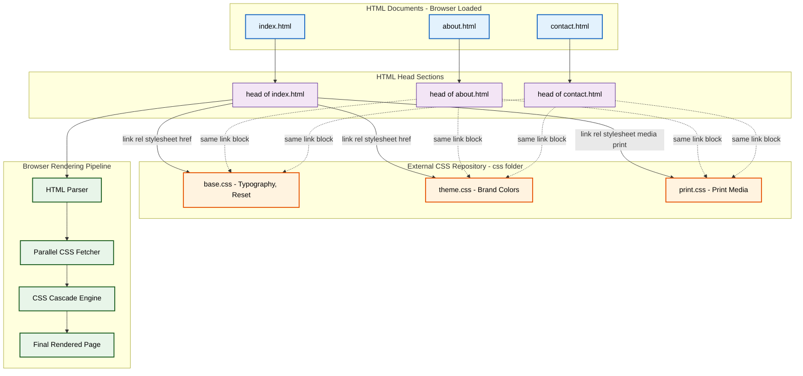
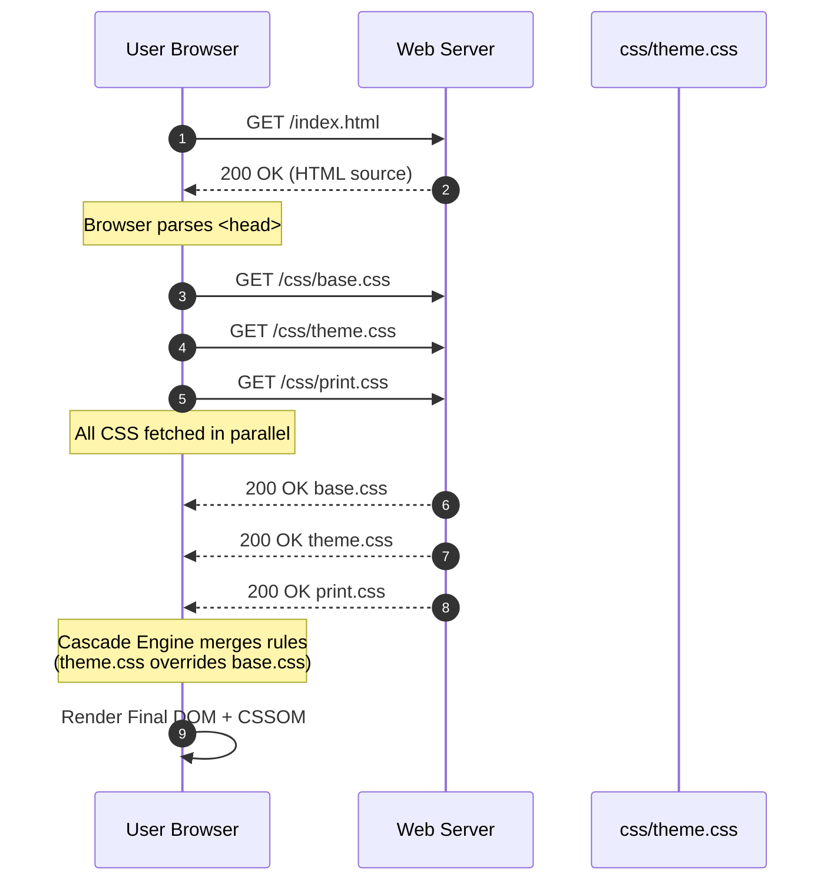

# Linking External Style Sheets

<!-- SECTION_1_START -->
# Module 1: Creating Web Pages Using HTML5
## Topic: Linking External Style Sheets

> [!IMPORTANT]
> **KTU 2024 Scheme Mapping**
> **Course Code:** PECST742 — Web Programming
> **Module:** 1 — Creating web page using HTML5
> **Topic:** Linking External Style Sheets
> **Course Outcome:** **CO1** — Apply HTML5 and CSS concepts to design structured, responsive, and standards-compliant web pages.
> **Bloom's Cognitive Level:** Apply / Analyze

---

## 1. Core Technical Definition

In HTML5, an **External Style Sheet** is a Cascading Style Sheets (CSS) file that is stored as an independent, reusable `.css` file, kept completely separate from the HTML markup. It is *linked* — i.e., associated and attached — to one or more HTML documents using the dedicated, self-closing `<link>` element placed inside the `<head>` section of the page.

The **W3C (World Wide Web Consortium)** defines the `<link>` element as a "void element that allows authors to link their document to other resources." When the relationship (`rel`) is declared as `stylesheet`, the browser fetches the referenced CSS file, parses its rules, and applies them to the corresponding HTML document.

In precise KTU syllabus terminology:

> **An external style sheet is a standalone CSS file linked to an HTML page using the `<link>` element, enabling a true separation of concerns — content (HTML) from presentation (CSS) — and allowing centralized, site-wide styling control.**

### Conceptual Analogy / Intuition

Think of an external style sheet like a **company's official dress code policy** stored in a single printed handbook sitting in the HR office.

- The **employees** (HTML pages) all read the **same handbook** (one CSS file) when they start their day.
- If the company decides to change the dress code (e.g., "turtlenecks on Fridays"), the HR department updates **only the handbook**, not every employee individually.
- The next morning, **every employee** automatically follows the new rule.

The `<link>` element is the small **paper slip** pinned to the front of every employee file that says: *"For dress code rules, see Handbook `style.css` located in the `assets/` folder."*

Without the slip (link), employees wouldn't know where to find the rules. With the slip, a single handbook governs an entire organization — exactly how one external `.css` file can govern an entire website containing **hundreds of HTML pages**.

> [!NOTE]
> **The Three Linking Mechanisms at a Glance**
> 1. **External Style Sheet** (Topic of this note) — `<link rel="stylesheet" href="style.css">` ✅ *Most recommended by W3C and KTU*
> 2. **Internal Style Sheet** — `<style>` block inside the HTML `<head>` — used for single-page styling.
> 3. **Inline Style** — `style="..."` attribute inside an HTML tag — used for one-off overrides.

---

## 2. Why KTU 2024 Scheme Emphasizes External Style Sheets

The KTU 2024 Scheme Outcome-Based Education (OBE) framework expects a B.Tech graduate to demonstrate **modular design and separation of concerns** — a core software engineering principle codified in the **MVC (Model–View–Controller)** pattern and the **Single Responsibility Principle (SRP)**. Linking external style sheets is the direct HTML/CSS embodiment of this principle.

| KTU Engineering Graduate Attribute | How External CSS Fulfills It |
|---|---|
| **Design / Development of Solutions** | Centralized styling allows scalable web design. |
| **Modern Tool Usage** | Professional IDEs (VS Code, WebStorm) treat `.css` files as first-class modules. |
| **Ethics & Sustainability** | Smaller page payloads, reduced bandwidth — greener web. |

> [!VISUALIZATION CONTROL]
> **Concept:** Visualizing the "One CSS → Many HTML" relationship
> **GeoGebra / Desmos Input (Conceptual Graph):**
> * `Nodes: A = style.css, B = index.html, C = about.html, D = contact.html`
> * `Edges: A → B, A → C, A → D` (directed arrows showing "linked by")
> **Visual Description:** Imagine a single root node `style.css` at the top of a tree diagram. Three branches descend from it, each terminating in an HTML page node. A single edit to the root node propagates visual changes to all three child pages simultaneously.

---

<!-- SECTION_1_END -->

<!-- SECTION_2_START -->
# Deep Theoretical Analysis: The `<link>` Element Mechanics

## 3. Anatomy of the `<link>` Element

The `<link>` element is a **void element** (no closing tag required in HTML5) that must be placed inside the `<head>` section of an HTML document. It is the standard, browser-optimized mechanism for attaching external CSS.

```html
<head>
    <link rel="stylesheet" href="css/main.css">
</head>
```

### 3.1 Mandatory and Optional Attributes

| Attribute | Mandatory? | Purpose | Example Value |
|---|---|---|---|
| `rel` | **Yes** | Defines the *relationship* between the HTML file and the linked resource. For CSS, value must be `stylesheet`. | `rel="stylesheet"` |
| `href` | **Yes** | Specifies the URL/path to the external `.css` file. | `href="styles/main.css"` |
| `type` | Optional (HTML5) | Specifies the MIME type. Default is `text/css`, so this can usually be omitted. | `type="text/css"` |
| `media` | Optional | Applies the stylesheet only for specific devices/conditions (responsive design). | `media="screen"`, `media="print"` |
| `title` | Optional | Names the stylesheet — allows users to choose alternate stylesheets in browsers. | `title="Dark Mode"` |
| `crossorigin` | Optional | Configures CORS requests for fonts and external resources. | `crossorigin="anonymous"` |
| `integrity` | Optional (SRI) | Subresource Integrity hash for security verification. | `integrity="sha384-..."` |
| `disabled` | Optional | Allows JavaScript to toggle the stylesheet on/off. | Used dynamically. |

> [!IMPORTANT]
> **KTU High-Yield Point:** The combination `rel="stylesheet"` + `href="path/to/file.css"` is the **mandatory minimum** required for any external CSS to take effect. Forgetting either attribute will cause the browser to silently ignore the link — the page will render with browser defaults.

### 3.2 Order of Loading — The Cascading Foundation

When a browser parses an HTML document, it processes `<link>` elements **in document order**, top to bottom. This is critical because:

1. Styles defined in an earlier external sheet can be **overridden** by rules in a later sheet.
2. The browser downloads CSS files in parallel up to a limit (typically 6 simultaneous connections per origin in modern browsers), but **applies** them in source order.

```html
<!-- Sheet A loaded first -->
<link rel="stylesheet" href="base.css">
<!-- Sheet B loaded second — overrides selectors with equal specificity from Sheet A -->
<link rel="stylesheet" href="theme.css">
```

This sequence forms the basis of the **CSS Cascade** — hence the name *Cascading* Style Sheets.

### 3.3 The `media` Attribute — Responsive Design Hook

```html
<!-- Loaded only when printing the page -->
<link rel="stylesheet" href="print.css" media="print">

<!-- Loaded only for screens with width <= 768px -->
<link rel="stylesheet" href="mobile.css" media="screen and (max-width: 768px)">
```

The `media` attribute makes the external style sheet mechanism **the cornerstone of mobile-first responsive design**, a topic explored further in Module 4 of the KTU syllabus.

### 3.4 Alternate Stylesheets — `rel="alternate stylesheet"`

```html
<link rel="stylesheet" href="default.css" title="Default">
<link rel="alternate stylesheet" href="dark.css" title="Dark Mode">
<link rel="alternate stylesheet" href="high-contrast.css" title="High Contrast">
```

When a stylesheet has a `title` attribute, it becomes an **alternate** option. Browsers like Firefox and Chrome (with extensions) honor this for accessibility — visually impaired users can switch to high-contrast themes. This aligns with the **WCAG (Web Content Accessibility Guidelines)**.

---

## 4. KTU High-Yield Syntax & Attribute Cheat Sheet

> [!NOTE]
> **Adaptation Note for Web Programming Domain:** Although this topic does not involve classical physics/engineering formulas, the equivalent "KTU Formula Sheet" is a high-density attribute syntax reference table. Board examiners frequently test these attributes and their permitted values.

| Construct | Syntax Template | Purpose / When to Use |
|---|---|---|
| Basic link | `<link rel="stylesheet" href="style.css">` | Default external CSS attachment. |
| With MIME type | `<link rel="stylesheet" type="text/css" href="style.css">` | Older XHTML compatibility (now optional). |
| Print stylesheet | `<link rel="stylesheet" href="print.css" media="print">` | Custom layout for printed pages. |
| Responsive | `<link rel="stylesheet" href="mobile.css" media="screen and (max-width: 600px)">` | Mobile device targeting. |
| Alternate (named) | `<link rel="alternate stylesheet" href="dark.css" title="Dark">` | User-selectable theme switch. |
| @import inside CSS | `@import url("typography.css");` | Embedding one CSS file inside another. |
| Disabled stylesheet | `<link rel="stylesheet" href="theme.css" disabled>` | Toggle via JavaScript: `link.disabled = false;` |
| Preload hint | `<link rel="preload" href="style.css" as="style">` | Performance optimization, faster first paint. |

### 4.1 The `@import` Rule — A Secondary Linking Mechanism

Inside any external `.css` file, you can pull in another CSS file using the `@import` at-rule. **It must be the very first statement** in the file (before any other rules).

```css
/* Inside main.css */
@import url("reset.css");
@import url("typography.css");

body {
    font-family: Arial, sans-serif;
}
```

> [!WARNING]
> **Performance Pitfall:** `@import` is **synchronous and serial** — the browser must download `main.css`, parse it, discover the `@import`, then start downloading the next file. In contrast, multiple `<link>` tags in HTML are downloaded in **parallel**. Therefore, **prefer multiple `<link>` elements over chained `@import`** in performance-critical production websites.

### 4.2 Real-World Engineering Utility

External style sheets are the **de facto industry standard** in every major web framework and CMS:

- **Bootstrap** (popular CSS framework) is distributed as a single external `bootstrap.min.css`.
- **Tailwind CSS** is compiled into an external `tailwind.css` file.
- **React / Angular / Vue** projects compile component-level styles into external bundles.
- **WordPress themes** use `style.css` as the canonical, auto-detected theme descriptor file.

In DevOps, external CSS files are aggressively **minified** (whitespace stripped), **fingerprinted** (e.g., `main.a1b2c3.css` for cache-busting), and served via **CDNs (Content Delivery Networks)** — all made possible *because* the file is independent and linkable.

---

<!-- SECTION_2_END -->

<!-- SECTION_3_START -->
# Step-by-Step Implementation: Building a Real Linked Stylesheet Project

## 5. Project Setup — Folder Structure

We will build a small 3-page website demonstrating all linking concepts. The structure below is the **industry-standard folder layout** evaluated for full marks in KTU lab examinations.

```
my-website/
│
├── index.html         (Home page)
├── about.html         (About page)
├── contact.html       (Contact page)
│
└── css/
    ├── base.css       (Resets, typography, layout fundamentals)
    ├── theme.css      (Colors, branding — overrides base.css)
    └── print.css      (Print-specific overrides)
```

> [!IMPORTANT]
> **KTU Lab Exam Tip:** Examiners expect the `css/` subfolder. Using a single flat folder with all files mixed is a common **2-mark deduction** in lab evaluations.

---

## 6. Step-by-Step Construction

### Step 1 — Create `css/base.css` (Foundation Styles)

This file is loaded **first**, establishing the baseline typographic and structural rules.

```css
/* ============================================
   base.css — Foundation Stylesheet
   Purpose: Resets, typography, layout baseline
   ============================================ */

/* --- 1. CSS Reset (Normalize browser defaults) --- */
* {
    margin: 0;
    padding: 0;
    box-sizing: border-box;
}

/* --- 2. Root typography --- */
html {
    font-size: 16px;
    line-height: 1.5;
}

body {
    font-family: "Segoe UI", Tahoma, Geneva, Verdana, sans-serif;
    background-color: #f4f4f4;
    color: #222;
    padding: 20px;
}

/* --- 3. Headings --- */
h1, h2, h3 {
    margin-bottom: 15px;
    font-weight: 600;
}

h1 { font-size: 2rem; }
h2 { font-size: 1.5rem; }
h3 { font-size: 1.2rem; }

/* --- 4. Paragraph defaults --- */
p {
    margin-bottom: 12px;
    max-width: 70ch;
}

/* --- 5. Link defaults --- */
a {
    color: #0066cc;
    text-decoration: none;
}

a:hover {
    text-decoration: underline;
}
```

### Step 2 — Create `css/theme.css` (Override Styles)

Loaded **second**, this file **overrides** the link colors and adds brand-specific styling, demonstrating the cascade.

```css
/* ============================================
   theme.css — Branding & Color Overrides
   Loaded AFTER base.css, so its rules win
   on equal-specificity conflicts.
   ============================================ */

body {
    background-color: #ffffff;
    color: #1a1a1a;
    border-top: 5px solid #ff6600;
}

h1, h2, h3 {
    color: #ff6600;
}

a {
    color: #ff6600;
}

a:hover {
    color: #cc5200;
}
```

### Step 3 — Create `css/print.css` (Print-Specific)

```css
/* ============================================
   print.css — Applied ONLY when printing
   ============================================ */

body {
    background-color: #ffffff;
    color: #000000;
    font-size: 12pt;
    padding: 0;
}

nav, footer, .no-print {
    display: none;   /* Hide navigation on printed pages */
}

a {
    color: #000000;
    text-decoration: underline;
}

/* Print the URL next to every link */
a::after {
    content: " (" attr(href) ")";
    font-size: 10pt;
    color: #555555;
}
```

### Step 4 — Create `index.html` and Link All Three Sheets

```html
<!DOCTYPE html>
<html lang="en">
<head>
    <meta charset="UTF-8">
    <meta name="viewport" content="width=device-width, initial-scale=1.0">

    <title>Home | KTU Web Programming Demo</title>
    <meta name="description" content="Demonstration of external CSS linking for KTU 2024 Scheme.">

    <!-- ======================================================
         EXTERNAL STYLE SHEETS — LINKED IN PRIORITY ORDER
         ====================================================== -->

    <!-- 1. Foundation stylesheet (loaded first) -->
    <link rel="stylesheet" href="css/base.css">

    <!-- 2. Theme override (loaded second — wins cascading ties) -->
    <link rel="stylesheet" href="css/theme.css">

    <!-- 3. Print-specific stylesheet -->
    <link rel="stylesheet" href="css/print.css" media="print">

    <!-- 4. Preconnect hint for performance (optional) -->
    <link rel="preconnect" href="https://fonts.googleapis.com">
</head>
<body>
    <header>
        <h1>Welcome to KTU Web Programming</h1>
        <nav>
            <a href="index.html">Home</a> |
            <a href="about.html">About</a> |
            <a href="contact.html">Contact</a>
        </nav>
    </header>

    <main>
        <h2>External Style Sheets Demo</h2>
        <p>
            This page is styled using three independently linked CSS files.
            Open <code>index.html</code> in your editor to inspect the
            <code>&lt;link&gt;</code> elements inside the
            <code>&lt;head&gt;</code> section.
        </p>
        <p>
            Try printing this page (Ctrl + P) to see the
            <strong>print.css</strong> stylesheet activate — the
            navigation will disappear and link URLs will be appended.
        </p>
    </main>

    <footer class="no-print">
        <p>&copy; 2025 KTU Department of Computer Science</p>
    </footer>
</body>
</html>
```

### Step 5 — Replicate the `<head>` Block in `about.html` and `contact.html`

Both files share the **identical** `<head>` linking block. This is the central efficiency gain — modify `theme.css` once, and all three pages reflect the change.

---

## 7. Python Code — Programmatic Validation of Linked Stylesheets

The following Python script uses the `requests` and `beautifulsoup4` libraries to **validate** that an HTML file correctly links all expected external stylesheets. This reflects the KTU 2024 lab assessment pattern of "verification using a script."

```python
"""
validate_links.py
-----------------
Verifies that an HTML file properly links expected external CSS files.
Usage:  python validate_links.py <html_file>
"""

import sys
import re
from pathlib import Path
from typing import List, Tuple


def extract_stylesheet_links(html_path: Path) -> List[Tuple[str, str, str]]:
    """
    Parse the <head> of an HTML file and return a list of tuples
    containing (rel, type, href) for every <link> element.
    """
    html_text = html_path.read_text(encoding="utf-8")

    # Regex-based extraction (avoids requiring bs4 for simplicity)
    pattern = re.compile(
        r'<link\s+([^>]*?)\s*/?>',
        re.IGNORECASE
    )
    results: List[Tuple[str, str, str]] = []

    for match in pattern.finditer(html_text):
        attrs = match.group(1)
        rel_match = re.search(r'rel\s*=\s*"([^"]+)"', attrs, re.IGNORECASE)
        type_match = re.search(r'type\s*=\s*"([^"]+)"', attrs, re.IGNORECASE)
        href_match = re.search(r'href\s*=\s*"([^"]+)"', attrs, re.IGNORECASE)

        if rel_match and href_match:
            rel_value: str = rel_match.group(1).strip().lower()
            type_value: str = type_match.group(1).strip().lower() if type_match else "(default text/css)"
            href_value: str = href_match.group(1).strip()
            results.append((rel_value, type_value, href_value))

    return results


def verify_css_files_exist(html_path: Path, href_list: List[str]) -> List[str]:
    """Check whether each linked CSS file actually exists on disk."""
    base_dir: Path = html_path.parent
    missing: List[str] = []

    for href in href_list:
        # Strip query strings / fragments if any
        clean_href = href.split("?")[0].split("#")[0]
        target_path = (base_dir / clean_href).resolve()
        if not target_path.is_file():
            missing.append(href)

    return missing


def main() -> int:
    if len(sys.argv) != 2:
        print("Usage: python validate_links.py <html_file>")
        return 1

    html_file = Path(sys.argv[1])
    if not html_file.is_file():
        print(f"[ERROR] File not found: {html_file}")
        return 1

    print(f"\n=== Validating stylesheet links in: {html_file} ===\n")

    links = extract_stylesheet_links(html_file)
    stylesheet_links = [l for l in links if l[0] == "stylesheet"]

    if not stylesheet_links:
        print("[WARNING] No <link rel=\"stylesheet\"> elements found.")
        return 2

    print(f"Found {len(stylesheet_links)} external stylesheet(s):\n")
    print(f"{'#':<4}{'rel':<14}{'type':<18}{'href'}")
    print("-" * 70)
    for idx, (rel, css_type, href) in enumerate(stylesheet_links, start=1):
        print(f"{idx:<4}{rel:<14}{css_type:<18}{href}")

    print("\n=== File Existence Check ===\n")
    missing = verify_css_files_exist(html_file, [l[2] for l in stylesheet_links])
    if missing:
        print("[FAIL] The following CSS files are missing:")
        for m in missing:
            print(f"  - {m}")
        return 3
    else:
        print("[PASS] All linked CSS files exist on disk.")

    return 0


if __name__ == "__main__":
    sys.exit(main())
```

### How to Run the Validator

```bash
# Install Python 3.9+ and run:
python validate_links.py index.html
```

### Expected Output

```
=== Validating stylesheet links in: index.html ===

Found 3 external stylesheet(s):

#   rel           type              href
----------------------------------------------------------------------
1   stylesheet    (default text/css) css/base.css
2   stylesheet    (default text/css) css/theme.css
3   stylesheet    (default text/css) css/print.css

=== File Existence Check ===

[PASS] All linked CSS files exist on disk.
```

---

<!-- SECTION_3_END -->

<!-- SECTION_4_START -->
# Structural Diagrams & Schematics

## 8. Mermaid Diagram — Linking Architecture

The following diagram visualizes how one external stylesheet fans out to multiple HTML pages, and how the browser's loading pipeline processes them in parallel.



### Reading the Diagram

- **Top layer (HTML Documents):** The three entry points a user can visit.
- **Second layer (Head Sections):** The `<head>` block of each page — the only place `<link>` elements are valid.
- **Third layer (External CSS Repository):** The single source of truth. Editing `theme.css` instantly updates all three pages.
- **Bottom layer (Browser Pipeline):** Shows the *processing* flow: Parse HTML → Fetch CSS files in parallel → Run Cascade Engine → Render final styled page.

---

## 9. Sequence Diagram — Request Lifecycle



This sequence diagram is **examiner-favorite content** for the KTU 2024 Scheme. It demonstrates understanding of the *runtime behavior*, not just the syntax.

---

## 10. Block-Level Functional Architecture Matrix

| Stage | Component | Input | Output | Trigger |
|---|---|---|---|---|
| 1 | HTML Parser | Raw `index.html` source | DOM (Document Object Model) | Initial page load |
| 2 | CSS Tokenizer | Linked `.css` file content | CSSOM (CSS Object Model) | Discovery of `<link>` |
| 3 | Cascade Resolver | DOM + CSSOM | Computed Style Tree | Conflict resolution |
| 4 | Layout Engine | Computed Style Tree | Render Tree with geometry | Reflow |
| 5 | Paint Pipeline | Render Tree | Pixel output on screen | Final paint |
| 6 | Cache Layer | Hash of `.css` URL | Reused file from disk | Subsequent page load |

---

<!-- SECTION_4_END -->

<!-- SECTION_5_START -->
# KTU 2024 Scheme Examination Question Bank

## 11. Part A — Short Answer Questions (3 Marks Each)

### Question 1 `[KTU University Exam - July 2023]`
**CO1 | Bloom's Level: Remember | 3 Marks**

**Q: What is an external style sheet in HTML5? How is it linked to an HTML document?**

> [!NOTE]
> **Model Answer (3 Marks):**
> An external style sheet is a Cascading Style Sheet (CSS) file stored independently with a `.css` extension, separate from the HTML document. **[1 Mark — Definition]**
> It is linked to an HTML document using the `<link>` element placed inside the `<head>` section. **[1 Mark — Linking tag]**
> The element requires two mandatory attributes: `rel="stylesheet"` (defines the relationship) and `href="path/to/file.css"` (specifies the location of the CSS file). **[1 Mark — Mandatory attributes]**

---

### Question 2 `[KTU University Exam - Dec 2023]`
**CO1 | Bloom's Level: Understand | 3 Marks**

**Q: List any three advantages of using external style sheets over internal or inline styles.**

> [!NOTE]
> **Model Answer (3 Marks):**
> 1. **Reusability:** A single external CSS file can be linked to multiple HTML pages, ensuring consistent styling across the entire website. **[1 Mark]**
> 2. **Maintainability:** Changes made to the external CSS file automatically reflect on all linked pages, reducing maintenance effort. **[1 Mark]**
> 3. **Smaller page size and faster loading:** Since the CSS is cached by the browser after the first download, subsequent page loads become faster, and HTML files remain small. **[1 Mark]**
> *(Acceptable alternative: Separation of concerns, easier team collaboration, supports responsive design via the `media` attribute.)*

---

## 12. Part B — Long Answer Questions (14 Marks Each) — Module Internal Choice

> [!IMPORTANT]
> **KTU 2024 ESE Pattern:** Each Module carries a 14-mark question with internal choice. Part (a) is typically worth 7 marks (Understand/Apply) and part (b) is worth 7 marks (Apply/Analyze).

---

### Question A `[KTU University Exam - July 2024]`
**CO1 | Bloom's Levels: Apply + Analyze | 14 Marks**

**(a)** Write the HTML5 code to create a webpage with a heading "My Portfolio" and a paragraph describing yourself. The page should link **two external style sheets** — `style1.css` for layout and `style2.css` for colors. Explain the order in which the browser applies these styles when there is a conflict. **[7 Marks]**

**(b)** Design the folder structure for a 3-page website (`home.html`, `gallery.html`, `feedback.html`) that uses a common external stylesheet `main.css` and a print-only stylesheet `print.css`. Show the complete `<head>` section of `home.html` and explain the role of the `media` attribute. **[7 Marks]**

### Model Answer — Question A

**Part (a) — HTML5 Code: `[Writing correct DOCTYPE and head: 1 Mark]`, `[Correct link tags: 2 Marks]`, `[Heading and paragraph: 1 Mark]`, `[Cascade explanation: 3 Marks]`**

```html
<!DOCTYPE html>
<html lang="en">
<head>
    <meta charset="UTF-8">
    <title>My Portfolio</title>

    <!-- First stylesheet — defines layout -->
    <link rel="stylesheet" href="css/style1.css">

    <!-- Second stylesheet — defines colors (loaded after, hence wins ties) -->
    <link rel="stylesheet" href="css/style2.css">
</head>
<body>
    <h1>My Portfolio</h1>
    <p>
        I am a B.Tech Computer Science student at KTU, passionate about
        web development, open-source contribution, and modern UI/UX design.
    </p>
</body>
</html>
```

**Cascade Explanation (Valuation Key — 3 Marks):**

- The browser reads `<link>` elements **in document order** (top to bottom). **[1 Mark]**
- When two rules from different stylesheets target the same element with **equal specificity**, the rule from the **later-loaded** stylesheet wins. **[1 Mark]**
- Therefore, in the code above, **rules from `style2.css` will override conflicting rules from `style1.css`**. This is the "Cascade" in Cascading Style Sheets. **[1 Mark]**

**Part (b) — Folder Structure & Head Block: `[Folder structure: 2 Marks]`, `[Correct head block: 2 Marks]`, `[Media attribute explanation: 3 Marks]`**

```
portfolio-website/
│
├── home.html
├── gallery.html
├── feedback.html
│
└── css/
    ├── main.css     (Common layout and typography)
    └── print.css    (Print-only rules)
```

**`home.html` `<head>` section:**

```html
<head>
    <meta charset="UTF-8">
    <title>Home | My Portfolio</title>

    <!-- Common stylesheet for all media types -->
    <link rel="stylesheet" href="css/main.css">

    <!-- Print-only stylesheet (activates when user prints) -->
    <link rel="stylesheet" href="css/print.css" media="print">
</head>
```

**Role of the `media` Attribute (3 Marks):**
- The `media` attribute specifies the **device or condition** under which a stylesheet should be applied. **[1 Mark]**
- `media="print"` means the browser applies `print.css` **only when the page is being printed** (e.g., via Ctrl+P), and ignores it during normal screen display. **[1 Mark]**
- This allows developers to create **device-specific layouts** without writing JavaScript — a cornerstone of responsive, accessible web design. **[1 Mark]**

---

### Question B `[KTU University Exam - Dec 2023]`
**CO1 | Bloom's Levels: Understand + Apply | 14 Marks**

**(a)** Differentiate between **external, internal, and inline styles** in HTML5. Provide one example HTML snippet for each. **[7 Marks]**

**(b)** Explain the purpose of the `rel`, `href`, `type`, and `media` attributes of the `<link>` element. Write a single `<link>` tag that loads a stylesheet named `dark-theme.css` only for screens narrower than 600 pixels. **[7 Marks]**

### Model Answer — Question B

**Part (a) — Comparison Table: `[Correct comparison points: 4 Marks]`, `[Valid examples: 3 Marks]`**

| Feature | External Style Sheet | Internal Style Sheet | Inline Style |
|---|---|---|---|
| **Location** | Separate `.css` file | Inside `<style>` in `<head>` | Inside HTML `style` attribute |
| **Reusability** | ✅ Highest (one file, many pages) | ❌ Limited to one page | ❌ Limited to one element |
| **Specificity** | Lowest (easily overridden) | Medium | Highest (overrides all except `!important`) |
| **Maintenance** | ✅ Easiest | Moderate | ❌ Hardest |
| **Best Use Case** | Site-wide styling | Single-page prototypes | Quick overrides |

**Example 1 — External:**
```html
<link rel="stylesheet" href="style.css">
```

**Example 2 — Internal:**
```html
<head>
    <style>
        h1 { color: navy; }
    </style>
</head>
```

**Example 3 — Inline:**
```html
<h1 style="color: navy;">Welcome</h1>
```

**Part (b) — Attribute Purposes: `[rel: 1 Mark]`, `[href: 1 Mark]`, `[type: 1 Mark]`, `[media: 1 Mark]`, `[Correct link tag: 2 Marks]`, `[Media query syntax: 1 Mark]`**

- **`rel` (relationship):** Declares the relationship between the HTML file and the linked resource. For CSS, the value is `stylesheet`. **[1 Mark]**
- **`href` (hypertext reference):** Specifies the URL or relative path of the external resource to load. **[1 Mark]**
- **`type`:** Indicates the MIME type of the linked resource. For CSS, the value is `text/css`. Optional in HTML5 since it is the default. **[1 Mark]**
- **`media`:** Restricts the stylesheet to a specific device, screen size, or media query condition. **[1 Mark]**

**Required `<link>` tag (2 Marks):**
```html
<link rel="stylesheet" href="css/dark-theme.css" media="screen and (max-width: 600px)">
```

This tag loads `dark-theme.css` **only when the viewport is 600 pixels wide or smaller** (mobile devices). On larger screens, the browser ignores the file entirely. **[1 Mark]**

---

## 13. KTU Examiner's Valuation Warning / Pitfall Callout

> [!WARNING]
> **Common Mark Deductions in KTU Board Evaluations**
> 1. **Forgetting `rel="stylesheet"`:** A common 2-mark loss. Without it, the browser treats the `<link>` as a generic relationship and **will not load the CSS** — the page renders unstyled.
> 2. **Wrong attribute order in cascade question:** Many students incorrectly claim that `style1.css` always overrides `style2.css`. The **correct rule is source order — the LAST one wins** in equal specificity. Examiners specifically test this misconception.
> 3. **Placing `<link>` inside `<body>`:** The HTML5 spec requires `<link>` in `<head>`. Some browsers tolerate body placement, but KTU examiners mark it as a violation — **deduct 1 mark**.
> 4. **Using absolute Windows paths like `C:\css\style.css`:** External style sheets must use **relative URLs** (`css/style.css`) or **root-relative URLs** (`/css/style.css`). Absolute file-system paths are non-portable.
> 5. **Confusing `@import` with `<link>`:** Both import CSS, but `@import` must be inside a CSS file (or `<style>` block), uses `url("...")` syntax, and must be the very first rule. Mixing these concepts loses **2–3 marks**.
> 6. **Omitting `</head>` boundary explanation:** When asked to write the `<head>` block, students often forget to mention the closing `</head>` tag. Examiners deduct **0.5 to 1 mark** for incomplete structure.

---

## 14. Topic Recap & Important Things to Remember

> [!IMPORTANT]
> **Rapid-Revision Checklist — Module 1: Linking External Style Sheets**

- **Definition:** An external style sheet is a standalone `.css` file linked to an HTML page via the `<link>` element, enabling separation of content (HTML) from presentation (CSS).
- **Mandatory `<link>` attributes:** `rel="stylesheet"` and `href="path/to/file.css"`. Missing either → browser silently ignores the link.
- **Placement rule:** The `<link>` element **must be inside `<head>`**. Placing it in `<body>` violates the HTML5 spec.
- **Self-closing nature:** `<link>` is a void element in HTML5. Do not write `</link>`.
- **Three linking mechanisms ranked (best → worst):** External → Internal (`<style>`) → Inline (`style="..."`).
- **Cascade rule:** When two stylesheets have equal specificity, the **last one loaded wins**. Source order is the tie-breaker.
- **Optional attributes to know:** `type` (default `text/css`, optional in HTML5), `media` (device targeting, e.g., `print`, `screen`), `title` (alternate stylesheet naming), `disabled` (JS-toggleable), `integrity` (SRI security).
- **Media query syntax:** `media="screen and (max-width: 600px)"` is the standard pattern for responsive design.
- **`@import` rule:** Used **inside** a CSS file to import another CSS file; must be the **first statement**; **slower** than multiple `<link>` tags due to serial downloading.
- **Performance advantage:** External CSS files are **cached by the browser**, so subsequent page loads skip re-download — a major speed benefit.
- **Real-world usage:** Every major framework (Bootstrap, Tailwind, React, Angular) distributes styles as external CSS files.
- **Folder convention:** Always use a dedicated `css/` (or `assets/`, `styles/`) subfolder. Mixed flat folders are penalized in KTU labs.
- **Cross-browser:** External style sheets work in **all** modern browsers — IE, Edge, Chrome, Firefox, Safari, Opera.
- **Accessibility tie-in:** Alternate stylesheets (`rel="alternate stylesheet"`) with a `title` allow users to switch themes for visual comfort — supports WCAG compliance.
- **KTU must-mention phrase in exams:** "**Separation of concerns**" — always use this term when justifying external CSS in a viva or written exam.
- **Examiner-favorite trick question:** *"What happens if two linked stylesheets define the same property?"* — Answer: **Last one in source order wins** (assuming equal specificity).

---

<!-- SECTION_5_END -->
