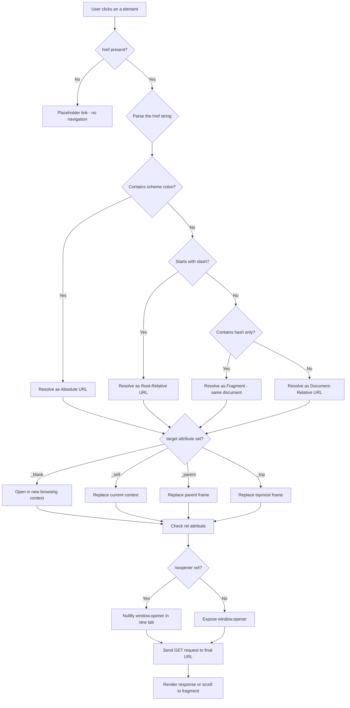
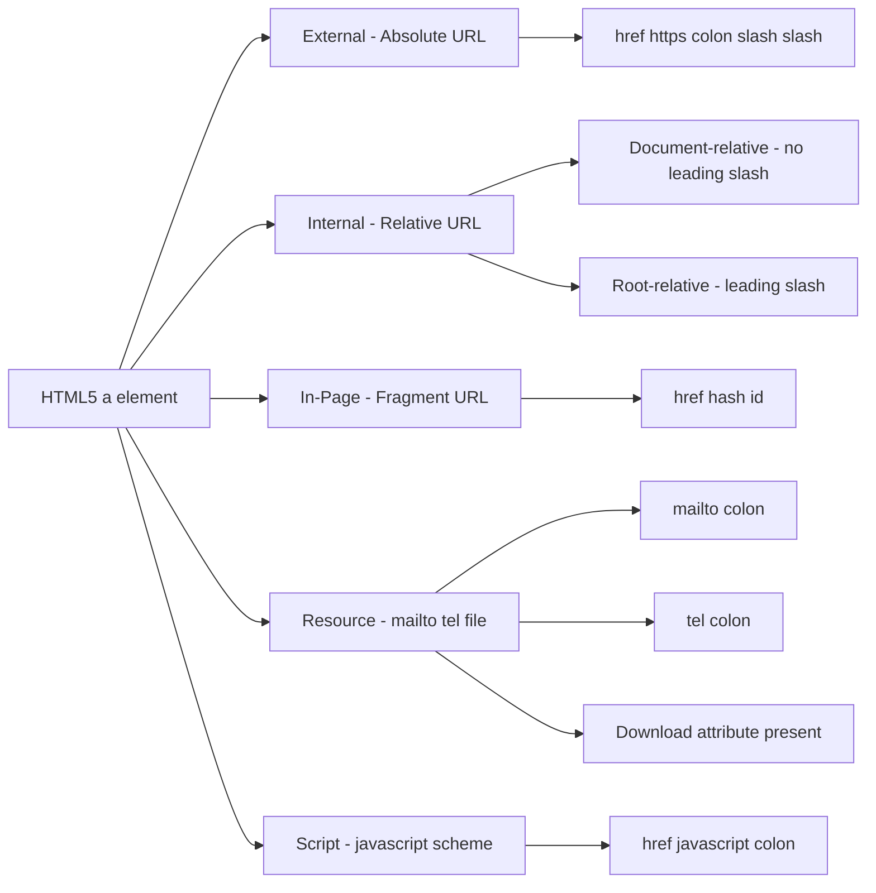
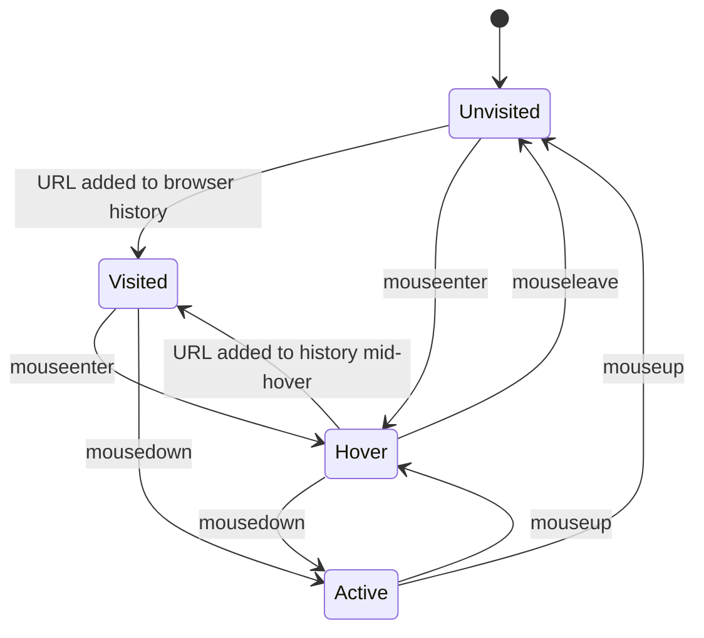

# Linking

<!-- SECTION_1_START -->
# 🔗 Linking in HTML5 — Core Definition & Intuitive Overview

## 1.1 Formal KTU 2024 Definition

In **HTML5**, a *link* (or *hyperlink*) is a unidirectional reference created using the anchor element **`<a>`** (short for *anchor*) that connects the current web resource to another web resource. The destination may be another HTML document, a specific section within the same document, a downloadable file, an email address, a telephone number, or even a script-driven action.

> [!IMPORTANT]
> **Syllabus Highlight (PECST742 — Module 1):**
> *Linking* covers the syntax and semantics of the `<a>` element, its mandatory and optional attributes, the different *URL resolution strategies* (absolute, document-relative, root-relative, fragment), and the *link-state rendering* (active, visited, hover, focus) governed by CSS pseudo-classes.

The anchor element is a **transparent inline element** by default and must wrap some *linkable content* (text, image, or any inline/phrase-content flow).

> [!NOTE]
> **Core Definition — The `<a>` Element**
> The HTML5 specification defines the `<a>` element as an element that *"represents a hyperlink — a link to another resource."* When the `href` attribute is **present**, the element is a *hyperlink*; when `href` is **absent**, the element is a *placeholder hyperlink* representing a target that the page *could* link to but does not currently.

## 1.2 Conceptual Analogy — "Doors, Roads & Signposts"

Imagine your web page is a **room in a large multi-storey building (the World Wide Web)**.

| Real-World Object | HTML5 Equivalent |
|---|---|
| A **doorway** in the room | The `<a>` element |
| A **sign above the doorway** that reads "Exit → Library" | The **link text** (the content between `<a>` and `</a>`) |
| The **address written on the sign** ("Floor 2, Block B") | The **URL inside the `href` attribute** |
| The **rule** "always open in the same building" vs "go outside the building" | Relative vs. Absolute URLs |
| A **bookmark taped to a page in a book** | A **fragment identifier** (`#section-id`) |
| A **letter slot / telephone mounted on the wall** | `mailto:` and `tel:` schemes |

A user who **clicks the doorway** is instantly *transported* to the room whose address is written on the sign. That, in one sentence, is **hyperlinking**.

## 1.3 Why the `<a>` Element Is Unique

Most HTML elements describe *what content looks like* (e.g., `<b>` for bold, `<p>` for paragraph). The `<a>` element is special because it describes **what happens when the user interacts** with that content. It is one of the few elements whose **primary purpose is behavior**, not presentation.

> [!TIP]
> **A clickable `<span>` is not a link.** Only `<a>` (or `<area>` inside `<map>`, and `<link>` inside `<head>`) carries *semantic* meaning of a hyperlink for browsers, screen readers, and search-engine crawlers.

## 1.4 GeoGebra / Desmos Visualization Control

> [!VISUALIZATION CONTROL]
> **Concept:** Visualising the *resolution radius* of a link — the concentric reach of relative, root-relative, and absolute URLs.
>
> **GeoGebra / Desmos Input Equations (Conceptual Grid):**
> * Point $C$ at $(0, 0)$ = location of the current HTML file (`/products/shoes/index.html`)
> * Point $T_{rel}$ at $(2, 0)$ = target reached via document-relative URL (`sale.html`)
> * Point $T_{root}$ at $(4, 0)$ = target reached via root-relative URL (`/about.html`)
> * Point $T_{abs}$ at $(6, 0)$ = target reached via absolute URL (`https://example.com/contact.html`)
>
> **Visual Description:** The student should observe three concentric semicircles emanating from $C$ — an *innermost* arc (document-relative, scope = current folder), a *middle* arc (root-relative, scope = entire site), and an *outermost* arc (absolute, scope = entire internet). The further the target, the larger the trust and verification burden on the browser.

<!-- SECTION_1_END -->

<!-- SECTION_2_START -->
# 🧠 Deep Theoretical Analysis & KTU High-Yield Attribute Sheet

## 2.1 Anatomy of an `<a>` Element

The full *production-grade* skeleton of an anchor element in HTML5 is:

```html
<a href="url" target="where" rel="relationship" type="mime" download="filename" hreflang="lang" media="media-query" ping="track-urls" referrerpolicy="policy">link content</a>
```

Although the **only mandatory** attribute to make a working hyperlink is `href`, the remaining attributes give the link **semantic precision, security, accessibility, and behavior control**.

## 2.2 URL Resolution Strategies (The Core Theory)

The value supplied to the `href` attribute is parsed by the browser according to the **URL Living Standard**. There are **four** resolution strategies:

### Strategy 1 — Absolute URL
An absolute URL contains the *full* scheme, host, and path. It is **fully self-contained** and can be resolved from *anywhere* on the internet.

```html
<a href="https://www.ktu.edu.in/examination">KTU Exam Portal</a>
```

### Strategy 2 — Document-Relative URL
A document-relative URL **does not begin with a slash**. It is resolved *against the folder containing the current document*. The browser performs a simple string operation on the current document's URL.

If the current document is `https://site.com/products/shoes/index.html` and the link is `sale.html`, the browser resolves it to `https://site.com/products/shoes/sale.html`.

### Strategy 3 — Root-Relative URL
A root-relative URL **begins with a single slash** `/`. It is resolved *against the root of the host*. The browser discards everything after the host name and replaces it with the root-relative path.

If the link is `/about.html`, the browser resolves it to `https://site.com/about.html` — *regardless* of which sub-folder the current page lives in.

### Strategy 4 — Fragment-Only URL
A fragment-only URL contains **only a hash** `#` followed by an `id`. It points to a section within the **current document**.

```html
<a href="#chapter-3">Jump to Chapter 3</a>
```

> [!NOTE]
> **Why the strategy matters in production:** A page served over **HTTPS** that links to an HTTP resource triggers a *mixed-content block* in modern browsers. Similarly, a document-relative link breaks the moment you rename or move a folder — root-relative links survive folder renames but break the moment the site is moved to a sub-folder for staging. The **best practice** in static-site generators is *root-relative*; the **best practice** in single-page applications is *fragment + JS routing*.

## 2.3 High-Yield Attribute Sheet

| Attribute | Required | Allowed Values | Purpose \& Engineering Use |
| :--- | :---: | :--- | :--- |
| `href` | Yes (for a working link) | Any valid URL | **H**ypertext **REF**erence — the destination of the link. |
| `target` | No | `_self`, `_blank`, `_parent`, `_top`, *framename* | Where to open the linked resource. `_blank` opens a new tab/window. |
| `rel` | No | `noopener`, `noreferrer`, `nofollow`, `external`, `next`, `prev`, `help`, `license`, `tag` | **Relationship** of the linked document to the current one. Critical for SEO and security. |
| `download` | No | A string filename, or empty | Tells the browser to *download* the resource instead of navigating to it. |
| `hreflang` | No | A valid BCP-47 language tag (e.g., `en`, `ml-IN`) | Language of the *linked* resource (not the link text). |
| `type` | No | A valid MIME type (e.g., `application/pdf`) | Hint to the browser about the *format* of the linked resource. |
| `media` | No | A valid media query (e.g., `(min-width: 600px)`) | Makes the link *conditional* on the device characteristics. |
| `ping` | No | A space-separated list of URLs | Sends a POST request to these URLs when the link is clicked (used for tracking). |
| `referrerpolicy` | No | `no-referrer`, `origin`, `strict-origin`, `no-referrer-when-downgrade`, `origin-when-cross-origin`, `unsafe-url` | Controls the `Referer` header sent with the outbound request. |

> [!IMPORTANT]
> **Security Mandate for `_blank`:** Whenever you use `target="_blank"`, you **must** also add `rel="noopener"`. Without it, the newly opened page can use `window.opener` to redirect your page to a phishing site — a vulnerability called *tabnabbing*.

## 2.4 Link Pseudo-Classes (The Four States of a Link)

A link has **four** visual states defined by the CSS *pseudo-classes* below. The order in the stylesheet is **strictly `LVHA`** — *Link, Visited, Hover, Active*:

1. `:link` — the default, unvisited state.
2. `:visited` — applies when the URL is in the browser's history.
3. `:hover` — applies when the mouse pointer is over the link.
4. `:active` — applies during the click (the brief moment between `mousedown` and `mouseup`).

```css
a:link    { color: blue; }   /* unvisited */
a:visited { color: purple; } /* visited   */
a:hover   { color: red; }    /* hovered   */
a:active  { color: orange; } /* active    */
```

## 2.5 Real-World Engineering Utility

- **Search Engine Optimisation (SEO):** Crawlers like Googlebot follow `<a href="...">` to discover new pages. A page with no inbound links is an *orphan page* and is invisible to search engines.
- **Web Accessibility (WCAG 2.1):** Screen readers announce links by their *accessible name*, which is the link text. The phrase *"click here"* is a **violation** of WCAG Success Criterion 2.4.4 because it gives no information about the destination.
- **Single-Page Application (SPA) Routing:** Frameworks like React Router intercept clicks on `<a>` elements via the History API to *prevent* full page reloads and update only the DOM.
- **Email \& Telemetry:** `mailto:` and `tel:` schemes launch the user's default email client or dialer — a *zero-JavaScript* interaction primitive.
- **Content Security Policy (CSP):** The browser's security model treats `<a>` clicks as **user-initiated top-level navigations**, which is the only safe context in which a page can navigate to a different origin without violating frame-ancestor policies.

<!-- SECTION_2_END -->

<!-- SECTION_3_START -->
# 🛠️ Step-by-Step Code Implementation

## 3.1 The Minimal HTML5 Boilerplate with Linking Examples

Below is a **fully operational, self-contained** HTML5 page that demonstrates every category of link in the KTU 2024 syllabus. Each line is annotated with a comment so the student can map code to concept.

```html
<!DOCTYPE html>
<html lang="en">
<head>
  <meta charset="UTF-8">
  <title>Linking Demo — KTU PECST742</title>
  <style>
    /* Strict LVHA order for link states */
    a:link    { color: #1a73e8; text-decoration: none; }
    a:visited { color: #6a1b9a; }
    a:hover   { color: #d93025; text-decoration: underline; }
    a:active  { color: #f57c00; }
    body      { font-family: system-ui, sans-serif; max-width: 800px; margin: 2rem auto; }
    section   { margin-bottom: 2rem; }
    h2        { border-bottom: 2px solid #1a73e8; padding-bottom: 0.3rem; }
  </style>
</head>
<body>

  <h1>Linking in HTML5 — A Complete Demonstration</h1>

  <!-- ====================================================== -->
  <!-- 3.1.1 ABSOLUTE URL — points to an external site          -->
  <!-- ====================================================== -->
  <section id="absolute">
    <h2>1. Absolute URL Link</h2>
    <p>
      <a href="https://www.ktu.edu.in"
         target="_blank"
         rel="noopener noreferrer"
         hreflang="en"
         type="text/html">
        Visit the APJ AKTU University Website
      </a>
    </p>
  </section>

  <!-- ====================================================== -->
  <!-- 3.1.2 DOCUMENT-RELATIVE URL — same folder               -->
  <!-- ====================================================== -->
  <section id="doc-relative">
    <h2>2. Document-Relative URL Link</h2>
    <p>
      <a href="about.html">About Us (same folder)</a>
    </p>
    <p>
      <a href="../syllabus/cst202.pdf">CST202 Syllabus (parent folder)</a>
    </p>
  </section>

  <!-- ====================================================== -->
  <!-- 3.1.3 ROOT-RELATIVE URL — from site root                -->
  <!-- ====================================================== -->
  <section id="root-relative">
    <h2>3. Root-Relative URL Link</h2>
    <p>
      <a href="/contact.html">Contact Us (site root)</a>
    </p>
  </section>

  <!-- ====================================================== -->
  <!-- 3.1.4 FRAGMENT-ONLY URL — in-page anchor                -->
  <!-- ====================================================== -->
  <section id="fragment">
    <h2>4. Fragment / In-Page Link</h2>
    <p>
      <a href="#absolute">Jump to Section 1</a> &nbsp;|&nbsp;
      <a href="#download">Jump to Section 5</a>
    </p>
  </section>

  <!-- ====================================================== -->
  <!-- 3.1.5 DOWNLOADABLE LINK                                  -->
  <!-- ====================================================== -->
  <section id="download">
    <h2>5. Downloadable Link</h2>
    <p>
      <a href="/files/notes.pdf"
         download="KTU_Web_Programming_Notes.pdf"
         type="application/pdf"
         rel="noopener">
        Download PDF Notes
      </a>
    </p>
  </section>

  <!-- ====================================================== -->
  <!-- 3.1.6 EMAIL & TELEPHONE SCHEMES                          -->
  <!-- ====================================================== -->
  <section id="schemes">
    <h2>6. Email and Telephone Links</h2>
    <p>
      <a href="mailto:admissions@ktu.edu.in?subject=Enquiry&body=Hello,">
        Email Admissions
      </a>
    </p>
    <p>
      <a href="tel:+914842577590">Call KTU Helpline</a>
    </p>
  </section>

  <!-- ====================================================== -->
  <!-- 3.1.7 IMAGE AS LINK CONTENT                              -->
  <!-- ====================================================== -->
  <section id="image-link">
    <h2>7. Image as Link Content</h2>
    <a href="https://www.ktu.edu.in" target="_blank" rel="noopener noreferrer">
      
    </a>
  </section>

  <!-- ====================================================== -->
  <!-- 3.1.8 PING-TRACKED LINK (advanced)                       -->
  <!-- ====================================================== -->
  <section id="ping">
    <h2>8. Ping-Tracked Link</h2>
    <p>
      <a href="https://www.example.com/article"
         ping="https://tracker.example.com/click
               https://analytics.example.com/log">
        Read the Article (click is tracked server-side)
      </a>
    </p>
  </section>

</body>
</html>
```

## 3.2 Exhaustive Walk-Through of a Single `<a>` Tag

Let us dissect the most feature-rich link in the demo above, **line by line**, in the exact order a browser parses it:

1. **`<a`** — opens the anchor element. The browser switches its parser into *"expecting attributes"* mode.
2. **`href="https://www.ktu.edu.in"`** — sets the destination. Without this, the element is a *placeholder*, not a link.
3. **`target="_blank"`** — instructs the browser to open the destination in a *new browsing context* (new tab or new window depending on user settings).
4. **`rel="noopener noreferrer"`** — the *no-opener* directive severs the `window.opener` reference, blocking reverse-tabnabbing; *noreferrer* additionally strips the `Referer` HTTP header for privacy.
5. **`hreflang="en"`** — tells assistive technology and search engines that the *linked page* is in English. It does **not** change the language of the current page.
6. **`type="text/html"`** — a hint that the linked resource is an HTML page. The browser may use this to pre-fetch the correct parser.
7. **`>Visit the APJ AKTU University Website</a>`** — the text between the tags is the **accessible name** and the **link label**. A screen reader will announce exactly this string.

## 3.3 Fragment Linking — The Mechanics of In-Page Navigation

For a fragment link to work, **two** conditions must be met:

1. The `href` value must be a hash `#` followed by the `id` of a target element.
2. The target element must have a matching `id` attribute somewhere in the same document.

```html
<!-- The link -->
<a href="#chapter-3">Go to Chapter 3</a>

<!-- The target — 500 lines later in the same document -->
<section id="chapter-3">
  <h2>Chapter 3: Linking in HTML5</h2>
  <p>...</p>
</section>
```

When the user clicks, the browser performs the following sequence:

1. The browser matches `#chapter-3` against all `id` values in the document.
2. On a match, the element is scrolled into view.
3. The browser pushes a new entry onto the History API: the URL bar now shows `currentpage.html#chapter-3`.
4. The browser updates the `:target` CSS pseudo-class, allowing designers to highlight the active section.

> [!TIP]
> **Smooth scrolling trick:** Add `html { scroll-behavior: smooth; }` to your CSS to animate the scroll. No JavaScript required.

## 3.4 Building a Clickable Table of Contents Programmatically

The following Python-style pseudocode (in HTML-comment form) shows how a server-side generator can build a TOC from heading IDs:

```html
<!-- PSEUDOCODE: server-side TOC generation
   for each heading in document:
       if heading.level == 2:
           link_text = heading.text
           link_href = "#" + heading.id
           print('<li><a href="' + link_href + '">' + link_text + '</a></li>')
-->
```

## 3.5 Accessible Link Patterns — Production-Ready Code

```html
<!-- BAD: Screen reader says "link, click here" — useless -->
<a href="/login">Click here</a> to log in.

<!-- GOOD: Screen reader says "link, log in to your account" -->
<a href="/login">Log in to your account</a>.

<!-- BAD: Image link with no alt text -->
<a href="/home"></a>

<!-- GOOD: Image link with descriptive alt text -->
<a href="/home"></a>

<!-- BEST: Empty alt + accessible text via aria-label on the link -->
<a href="/home" aria-label="Go to homepage">
   
</a>
```

<!-- SECTION_3_END -->

<!-- SECTION_4_START -->
# 🗺️ Structural Diagrams & Schematics

## 4.1 URL Resolution Flow — How the Browser Decodes a Link



## 4.2 Link Categories — A Block Diagram



## 4.3 Link State Machine (LVHA Order)



## 4.4 Block-Level Architecture of a Hyperlink Request

```mermaid
flowchart LR
    subgraph ClientLayer[Client Browser]
        A1[User Click] --> A2[DOM Event: click]
        A2 --> A3[Anchor Activation Algorithm]
    end
    subgraph NetworkLayer[Network Stack]
        A3 --> A4[URL Parser]
        A4 --> A5[DNS Resolution]
        A5 --> A6[TLS Handshake]
        A6 --> A7[HTTP GET Request]
    end
    subgraph ServerLayer[Origin Server]
        A7 --> A8[Router / Controller]
        A8 --> A9[Handler Logic]
        A9 --> A10[HTTP Response 200 OK]
    end
    A10 --> A11[Browser renders new page]
    A11 --> A12[Update History API entry]
```



<!-- SECTION_4_END -->

<!-- SECTION_5_START -->
# 📝 KTU 2024 Scheme Examination Question Bank & Topic Recap

## Part A — 3-Mark Short Answer Questions

### Question 1
**[KTU University Exam — July 2024]** *\[CO1, Remember]*

> Explain the difference between a *document-relative URL* and a *root-relative URL* in HTML5. Give one example of each.

**Model Answer (Board-Standard Key):**

A **document-relative URL** does not start with a forward slash. It is resolved by the browser *relative to the folder of the current document*. If the current page is `https://site.com/products/shoes.html` and the link is `cart.html`, the browser resolves it to `https://site.com/products/cart.html`.

A **root-relative URL** starts with a single forward slash `/`. It is resolved relative to the *root* of the current host. The link `/cart.html` from any page on the site resolves to `https://site.com/cart.html` regardless of the current folder.

**Example of document-relative:** `<a href="sale.html">Sale</a>`
**Example of root-relative:** `<a href="/sale.html">Sale</a>`

**Valuation Key:** *[Definition of document-relative: 1 Mark]*, *[Definition of root-relative: 1 Mark]*, *[Correct examples: 1 Mark]*.

---

### Question 2
**[KTU University Exam — Dec 2023]** *\[CO1, Understand]*

> List any *four* attributes of the HTML5 `<a>` element and state the purpose of each.

**Model Answer:**

1. **`href`** — specifies the URL of the linked resource. *Purpose:* defines the destination.
2. **`target`** — specifies the browsing context in which to open the link (`_self`, `_blank`, etc.). *Purpose:* controls where the link opens.
3. **`rel`** — specifies the relationship between the current and the linked document (`noopener`, `nofollow`, etc.). *Purpose:* SEO and security control.
4. **`download`** — instructs the browser to download the linked resource instead of navigating to it. *Purpose:* forces a file save.

**Valuation Key:** *[Each correct attribute with purpose: 0.75 × 4 = 3 Marks]*.

---

## Part B — 14-Mark Questions (Module Internal Choice)

### ➤ Question A (14 Marks)

**[KTU University Exam — Model Paper, PECST742]** *\[CO1, Understand + Apply]*

> **(a)** With the help of a neat diagram, describe the **URL resolution process** that a browser performs when a user clicks an anchor element. Explain the role of the `href`, `target`, and `rel` attributes. *(7 Marks)*
>
> **(b)** Write a complete, valid HTML5 page that demonstrates *all four* URL resolution strategies (absolute, document-relative, root-relative, fragment) and *two* special schemes (`mailto:` and `tel:`). *(7 Marks)*

#### Model Solution

**Part (a) — Resolution Process Diagram**

```
[Click on <a>]
        |
        v
[Browser reads href attribute]
        |
        v
[Is there a scheme like https: ?] ----Yes----> [Resolve as Absolute URL]
        |                                          |
        No                                         v
        |                                  [Send request to remote host]
        v                                          |
[Starts with / ?] ----Yes----> [Resolve as Root-Relative URL] |
        |                                          |
        No                                         v
        |                                  [Apply target attribute]
        v                                          |
[Starts with # ?] ----Yes----> [Resolve as Fragment - same doc] |
        |                                          |
        No                                         v
        v                                  [Apply rel attribute]
[Resolve as Document-Relative URL]                |
        |                                          v
        +------> [Send GET request and navigate]<-+
```

**Role of attributes:**

* `href` provides the destination URL. *(1 Mark)*
* `target` decides *where* the destination opens: `_self` (same tab), `_blank` (new tab), `_parent` (parent frame), `_top` (full window). *(2 Marks)*
* `rel` defines the *relationship* of the linked document to the current one; `noopener` blocks reverse-tabnabbing, `nofollow` tells crawlers not to follow the link for SEO. *(2 Marks)*
* Neat, well-labelled diagram. *(2 Marks)*

**Part (b) — Complete HTML5 Code**

```html
<!DOCTYPE html>
<html lang="en">
<head>
   <meta charset="UTF-8">
   <title>Link Demo</title>
</head>
<body>
   <!-- Absolute -->
   <a href="https://www.ktu.edu.in" target="_blank" rel="noopener">
      KTU Site (absolute)
   </a><br>

   <!-- Document-relative -->
   <a href="about.html">About (document-relative)</a><br>

   <!-- Root-relative -->
   <a href="/contact.html">Contact (root-relative)</a><br>

   <!-- Fragment -->
   <a href="#footer">Jump to footer (fragment)</a><br>

   <!-- mailto -->
   <a href="mailto:info@ktu.edu.in?subject=Hi">Email us (mailto)</a><br>

   <!-- tel -->
   <a href="tel:+911800123456">Call us (tel)</a><br>

   <footer id="footer">© 2025 KTU Demo</footer>
</body>
</html>
```

**Valuation Key (Part b):** *[Absolute URL present: 1 Mark]*, *[Document-relative present: 1 Mark]*, *[Root-relative present: 1 Mark]*, *[Fragment present with matching id: 2 Marks]*, *[`mailto:` with valid syntax: 1 Mark]*, *[`tel:` with valid syntax: 1 Mark]*.

---

### ➤ Question B (14 Marks) — *Alternative Choice*

**[KTU University Exam — Model Paper, PECST742]** *\[CO1, Apply + Analyze]*

> **(a)** Explain the **four CSS pseudo-classes** that govern the visual states of a hyperlink. Why is the *order* `LVHA` important? Write the complete CSS rule block. *(7 Marks)*
>
> **(b)** Discuss the **security implications** of using `target="_blank"` without the `rel="noopener"` attribute. Demonstrate a *defensive* HTML pattern for opening external links in a new tab, and explain why `rel="noreferrer"` is often added. *(7 Marks)*

#### Model Solution

**Part (a) — Pseudo-Classes**

The four states are:

1. **`:link`** — the default, unvisited link. *(1 Mark)*
2. **`:visited`** — applied when the URL is in the browser's history. *(1 Mark)*
3. **`:hover`** — applied when the mouse pointer hovers over the link. *(1 Mark)*
4. **`:active`** — applied during the active moment of the click. *(1 Mark)*

**Why LVHA order matters:** CSS uses *source-order specificity tie-breaking*. If `:hover` is placed *before* `:link`, the hover style will never win for unvisited links, because both have the same specificity and the later rule wins. *(1 Mark)*

**Complete CSS rule block:**

```css
a:link    { color: #1a0dab; }   /* unvisited  */
a:visited { color: #6a1b9a; }   /* visited    */
a:hover   { color: #d93025;
            text-decoration: underline; }  /* hover */
a:active  { color: #f57c00; }   /* active     */
```

*(2 Marks for the complete, correctly ordered block.)*

**Part (b) — Security of `target="_blank"`**

When you open a link in a new tab using `target="_blank"` *without* `rel="noopener"`, the newly opened page receives a live reference to the original page via `window.opener`. A malicious destination page can then run `window.opener.location = "https://phishing-site.com"`, silently redirecting the user's *original* tab to a phishing site. This is called **reverse tabnabbing**. *(2 Marks)*

**Defensive pattern:**

```html
<!-- 1. Minimum defensive: sever the opener reference -->
<a href="https://external.com" target="_blank" rel="noopener">
   External Site
</a>

<!-- 2. Maximum defensive: also strip the referrer -->
<a href="https://external.com" target="_blank"
   rel="noopener noreferrer">
   External Site
</a>

<!-- 3. Modern shortcut: rel="opener" was the default in HTML4
     and is the OPPOSITE of noopener; do not confuse them. -->
```

*(3 Marks for the defensive pattern.)*

**Why `rel="noreferrer"` is added:** it instructs the browser to **omit the `Referer` HTTP header** when fetching the linked resource. This prevents the destination site from learning *which* page on your site linked to them — useful for privacy and for preventing leakage of internal URLs. *(2 Marks)*

**Valuation Key:** *[Naming the four pseudo-classes: 2 Marks]*, *[LVHA order explained: 1 Mark]*, *[Complete CSS block: 2 Marks]*, *[Tabnabbing explained: 2 Marks]*, *[Defensive pattern: 2 Marks]*, *[Noreferrer explained: 1 Mark]*, *[Bonus — note about `rel="opener"`: 1 Mark]*.

> [!WARNING]
> **KTU Examiner's Pitfall Callout — Where Students Lose Marks**
> 1. **Forgetting `rel="noopener"` on `_blank` links** — board examiners explicitly mark down for this because it is a *security flaw*. Always include it.
> 2. **Writing `a:hover` *before* `a:link`** — same specificity, so the later rule wins, and your hover colour will *never* appear. Always use LVHA order.
> 3. **Confusing `rel="opener"` with `rel="noopener"`** — `opener` *enables* the dangerous reference, `noopener` *removes* it. One letter difference, opposite security outcomes.
> 4. **Forgetting the matching `id` on the fragment target** — `<a href="#x">` does nothing if no element has `id="x"`. Always double-check the target.
> 5. **Using `javascript:` schemes in `href`** — this is a security antipattern in modern HTML5. Use event listeners and `addEventListener` instead.

---

## ✅ Topic Recap \& Important Things to Remember

- The **`<a>` element** is the *only* standard HTML element that creates a hyperlink. Its mandatory attribute is **`href`**.
- The **four URL resolution strategies** are **absolute**, **document-relative**, **root-relative**, and **fragment-only**. Each has a distinct resolution algorithm in the browser.
- The **`target`** attribute controls *where* the link opens: `_self` (same tab), `_blank` (new tab), `_parent` (parent frame), `_top` (full window), or a named frame.
- The **`rel`** attribute is the modern HTML5 way to declare the *relationship* between the current and linked document. The most important production values are **`noopener`**, **`noreferrer`**, and **`nofollow`**.
- The **`download`** attribute turns a navigation into a *file download* and lets you override the saved filename.
- The **four pseudo-classes** for link states are **`:link`**, **`:visited`**, **`:hover`**, **`:active`** — and they must be written in **LVHA order** in the stylesheet.
- The two **special schemes** for non-web resources are **`mailto:`** (opens email client) and **`tel:`** (opens dialer).
- **Accessibility rule:** link text must *describe the destination* — never use the bare phrase *"click here"*.
- **Security rule:** every `target="_blank"` **must** be accompanied by `rel="noopener"` to prevent reverse-tabnabbing.
- **SEO rule:** internal navigation links help crawlers discover pages — a page with no inbound `<a>` is an *orphan page* and is invisible to search engines.
<!-- SECTION_5_END -->
