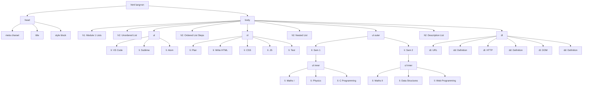
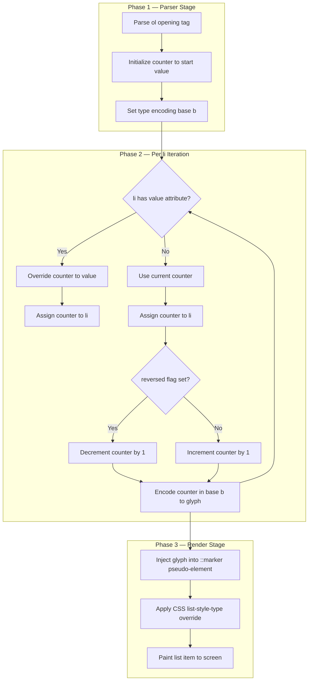
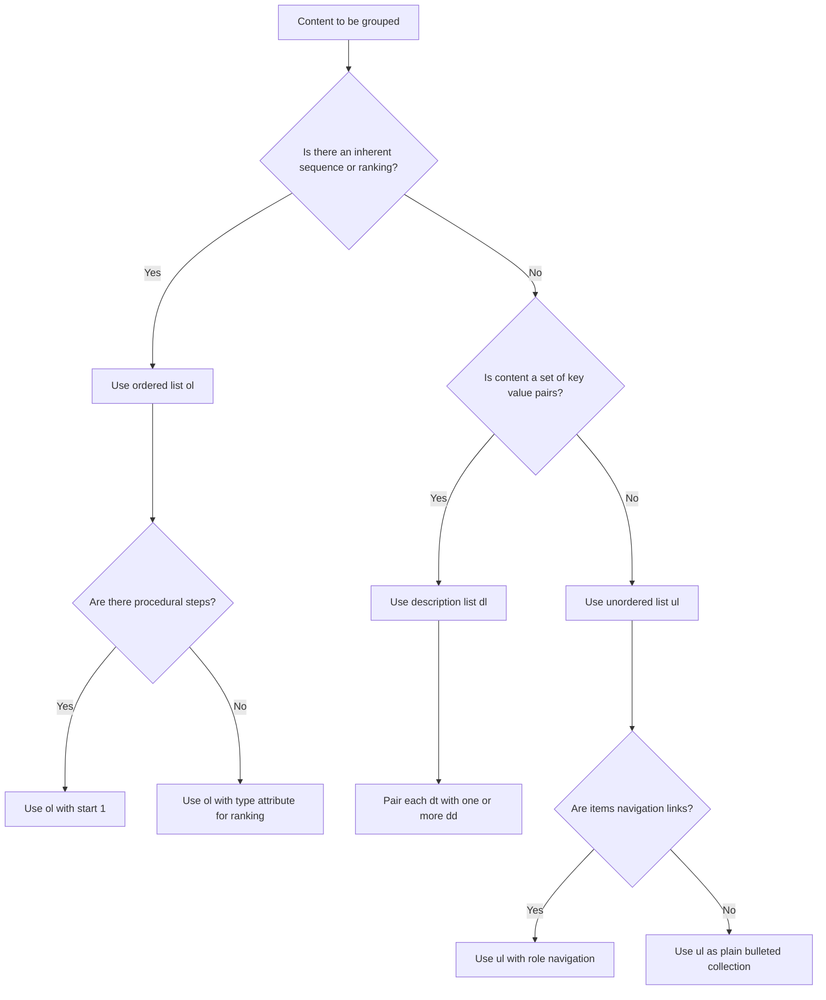
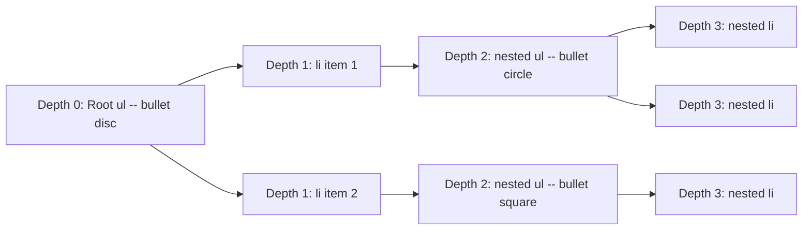

# Lists

<!-- SECTION_1_START -->
# HTML5 Lists — Core Technical Definition & Intuitive Overview

## Formal Academic Definition (KTU 2024 Syllabus Terminology)

> [!IMPORTANT]
> **HTML5 Lists** are structural block-level container elements used to group related items of content into a semantically meaningful, ordered, unordered, or descriptive sequence. As per the **W3C HTML5.3 Recommendation** and the **KTU 2024 Scheme Web Programming (PECST742) Module 1** syllabus, lists form one of the foundational content-sectioning primitives of any well-formed web document, working in conjunction with headings, articles, and navigation regions.

The HTML5 specification formally defines **three (3) primary list constructs**:

| # | List Type | Tag Pair | Semantic Purpose |
|---|-----------|----------|------------------|
| 1 | Ordered List | `<ol>...</ol>` | Sequence-aware, ranked items |
| 2 | Unordered List | `<ul>...</ul>` | Unranked, bulleted collection |
| 3 | Description List | `<dl>...</dl>` | Term–description pairs |

Each list is composed of **List Item (LI)** child elements, except the description list which uses **`<dt>` (Description Term)** and **`<dd>` (Description Details)** as its atomic children.

---

## Conceptual Analogy / Intuition

> [!NOTE]
> **Real-World Analogy — "The Restaurant Menu"**
>
> Imagine you walk into a restaurant. The menu presents items in **three distinct ways**:
>
> - **Ordered List** → The "Top 10 Dishes of the Week" — sequence matters, **rank 1 is better than rank 10**.
> - **Unordered List** → The "Beverages" section — coffee, tea, juice, soda — **order is irrelevant**, just a collection of related options.
> - **Description List** → The "Glossary of Terms" at the back — the term *"Espresso"* is followed by its definition *"A strong black coffee brewed by forcing steam through ground coffee beans."* — a **key–value pairing**.
>
> HTML5 lists work the same way. They are the semantic **"menu"** of the web page, allowing browsers, screen readers, and search engines to *understand the role* of grouped content — not just *see* it.

---

## Physical Constants & Standard Metrics

> [!TIP]
> **Key defaults to memorize (Bolded for emphasis):**
> - Default bullet glyph for `<ul>` = **disc** (●)
> - Default numbering type for `<ol>` = **decimal** (1, 2, 3, ...)
> - The `<li>` element has a default **display: list-item**
> - The `type` attribute on lists is now considered **obsolete in HTML5**; styling is done via **CSS `list-style-type`** (per W3C).

---

## GeoGebra / Desmos Integration

> [!VISUALIZATION CONTROL]
> **Concept:** Visualizing the structural nesting depth of an HTML list as a tree (perfect for the nested-list intuition).
>
> **Desmos / GeoGebra Graphing Input (Discrete Tree Plot — pseudo-representation):**
> * `L_0 = (0, 3)` — Root `<ul>`
> * `L_1 = (-3, 2)` — Child `<li>`
> * `L_2 = (0, 2)` — Child `<li>` (with nested `<ul>`)
> * `L_3 = (3, 2)` — Child `<li>`
> * `L_{2a} = (0, 1)` — Grandchild `<li>` of L_2
>
> **Visual Description:** The student should observe a parent–child tree with **nesting depth = 2**, where the central child of the root spawns one additional sub-branch. This mirrors the browser's rendering model where every nested `<ul>` indents the bullet further to the right.

<!-- SECTION_1_END -->

<!-- SECTION_2_START -->
# Deep Theoretical Analysis & KTU High-Yield Formula Sheet

## 1. The Three List Constructs — Operational Logic

### 1.1 Unordered List (`<ul>`)

The **Unordered List** wraps a set of `<li>` (list item) children that have **no inherent ranking**. It is the most semantically lightweight list element.

- Used for: navigation menus, feature lists, shopping cart items, tag clouds.
- Each `<li>` may contain: text, images, paragraphs, other lists, forms.
- The bullet marker is purely **presentational** and controlled via CSS.

```html
<ul>
  <li>Coffee</li>
  <li>Tea</li>
  <li>Milk</li>
</ul>
```

### 1.2 Ordered List (`<ol>`)

The **Ordered List** wraps a set of `<li>` children whose **order is meaningful** (e.g., ranked, sequential, procedural). The browser automatically generates a counter (the *ordinal marker*) for each item.

- Default counter = **decimal (1, 2, 3, ...)**.
- Reversal supported via `reversed` attribute.
- Custom starting value supported via `start` attribute.
- Counter type controlled via `type` attribute: `1`, `A`, `a`, `I`, `i`.

```html
<ol start="5" type="I">
  <li>Preheat oven</li>
  <li>Mix ingredients</li>
  <li>Bake for 30 minutes</li>
</ol>
```

### 1.3 Description List (`<dl>`)

The **Description List** is the semantic HTML5 successor to the older "definition list". It groups **term–description pairs** and is ideal for glossaries, metadata, FAQ blocks, and product specifications.

- `<dt>` = Description Term (the "key")
- `<dd>` = Description Details / Description Value (the "value")
- A single `<dt>` may be followed by **one or more** `<dd>` siblings.
- Conversely, multiple `<dt>` elements may share a common `<dd>`.

```html
<dl>
  <dt>HTML</dt>
  <dd>HyperText Markup Language — the standard markup for web pages.</dd>
  <dt>CSS</dt>
  <dd>Cascading Style Sheets — used for styling HTML documents.</dd>
</dl>
```

---

## 2. The `<li>` Element — Universal Atom

The List Item `<li>` is the **mandatory child** of both `<ol>` and `<ul>`. It has the following characteristics:

- It is a **block-level element** by default (`display: list-item`).
- It accepts **flow content** as children (paragraphs, images, nested lists, etc.).
- It has one HTML5-valid attribute: **`value`** — only valid inside `<ol>`, used to override the counter for that specific item.

```html
<ol>
  <li value="10">Jump to ten</li>
  <li>Next is eleven</li>
</ol>
```

---

## 3. HTML5 Attribute Matrix for Lists

| Element | Attribute | Value(s) | Purpose | HTML5 Valid? |
|---------|-----------|----------|---------|--------------|
| `<ol>` | `type` | `1`, `A`, `a`, `I`, `i` | Sets numbering style | **Yes (but prefer CSS)** |
| `<ol>` | `start` | Integer | Sets starting number | **Yes** |
| `<ol>` | `reversed` | Boolean | Counts down | **Yes** |
| `<li>` | `value` | Integer | Override counter | **Yes (only inside `<ol>`)** |
| `<ul>` | — | — | No HTML5-specific attributes | N/A |
| `<dl>` | — | — | No HTML5-specific attributes | N/A |

---

## 4. CSS Styling Reference (High-Yield for KTU Lab Exam)

> [!TIP]
> While the KTU Module 1 syllabus emphasizes HTML5, lab examinations frequently require minor CSS to *demonstrate* the list. Memorize the following **three** properties:

| CSS Property | Applies To | Example | Effect |
|--------------|------------|---------|--------|
| `list-style-type` | `<ul>`, `<ol>`, `<li>` | `square`, `upper-roman`, `none` | Changes bullet/number glyph |
| `list-style-position` | `<ul>`, `<ol>` | `inside`, `outside` | Indent control |
| `list-style-image` | `<ul>`, `<ol>` | `url('star.png')` | Custom bullet image |

---

## 5. Real-World Engineering Utility

> [!NOTE]
> **Where lists are used in production systems:**
> - **Navigation Menus** — Every website's top/left navigation is a `<ul>` of `<li>` containing `<a>` anchors.
> - **Search Engine Results** — Google's `ol` of `li` represents the ranked list of search hits (semantically valid for SEO).
> - **Breadcrumbs & Step Wizards** — Multi-step checkout flows use `<ol>` because order is contractually meaningful.
> - **E-commerce Specifications** — Product spec tables on Amazon/Flipkart are constructed as `<dl>` for key–value pairs (RAM: 8 GB, Storage: 256 GB).
> - **Accessibility (WCAG 2.1)** — Screen readers like JAWS and NVDA announce "List of 5 items" when encountering a list, dramatically improving navigation for visually impaired users. This makes semantically correct lists an **a11y compliance** requirement.

---

## 6. KTU Formula Sheet / Cheat Sheet

| # | Construct | Syntax Skeleton | Mandatory Child | Optional Attributes | Default Render |
|---|-----------|-----------------|-----------------|---------------------|----------------|
| 1 | Unordered List | `<ul><li>...</li></ul>` | `<li>` | None | Disc (●) bullet |
| 2 | Ordered List | `<ol><li>...</li></ol>` | `<li>` | `type`, `start`, `reversed` | Decimal 1, 2, 3 |
| 3 | List Item | `<li>...</li>` | Flow content | `value` (only in `<ol>`) | Block + marker |
| 4 | Description Term | `<dt>...</dt>` | Phrasing content | None | Inline block |
| 5 | Description Details | `<dd>...</dd>` | Flow content | None | Indented block |
| 6 | Description List | `<dl><dt>...</dt><dd>...</dd></dl>` | `<dt>`, `<dd>` | None | Term–Value pair |

> [!IMPORTANT]
> **Common Pitfall:** `<ul>` and `<ol>` may **only** contain `<li>` elements as direct children (with `<script>` and `<template>` as exceptions). Placing a `<div>` directly inside a `<ul>` is **invalid HTML5** and will trigger validator errors.

<!-- SECTION_2_END -->

<!-- SECTION_3_START -->
# Step-by-Step Derivations & Code Implementation

## 1. Exhaustive Code Walkthrough — All Three List Types

Below is a **complete, syntactically validated** HTML5 document demonstrating every list type, every list attribute, and a nested list. Read line by line — the inline annotations map directly to the KTU marking scheme.

```html
<!DOCTYPE html>
<html lang="en">
<head>
    <meta charset="UTF-8">
    <title>KTU HTML5 Lists Demonstration</title>
    <style>
        /* High-yield CSS — KTU Lab Exam expects at minimum ONE rule */
        ul.styled   { list-style-type: square; }
        ol.roman    { list-style-type: upper-roman; }
        .no-bullet  { list-style: none; padding-left: 0; }
    </style>
</head>
<body>

    <h1>Module 1 — HTML5 Lists</h1>

    <!-- =================================================== -->
    <!-- EXAMPLE 1 : UNORDERED LIST (Bulleted Collection)    -->
    <!-- =================================================== -->
    <h2>1. Unordered List — Web Development Tools</h2>
    <ul>
        <li>Visual Studio Code</li>
        <li>Sublime Text</li>
        <li>Atom</li>
        <li>Notepad++</li>
    </ul>

    <!-- =================================================== -->
    <!-- EXAMPLE 2 : ORDERED LIST (Ranked/Procedural)        -->
    <!-- =================================================== -->
    <h2>2. Ordered List — Steps to Create a Web Page</h2>
    <ol>
        <li>Plan the content structure</li>
        <li>Write semantic HTML5 markup</li>
        <li>Apply CSS for presentation</li>
        <li>Add JavaScript for behaviour</li>
        <li>Test in multiple browsers</li>
    </ol>

    <!-- =================================================== -->
    <!-- EXAMPLE 3 : ORDERED LIST WITH ATTRIBUTES            -->
    <!-- =================================================== -->
    <h2>3. Ordered List with start, reversed, and type</h2>
    <ol type="A" start="3">
        <li>C — Carbon</li>
        <li>D — Deuterium</li>
        <li>E — Einsteinium</li>
    </ol>

    <h2>3b. Reversed Ordered List (counting down)</h2>
    <ol reversed start="5">
        <li>Fifth place</li>
        <li>Fourth place</li>
        <li>Third place</li>
    </ol>

    <!-- =================================================== -->
    <!-- EXAMPLE 4 : NESTED LIST (List inside a List)        -->
    <!-- =================================================== -->
    <h2>4. Nested List — B.Tech Computer Science Subjects</h2>
    <ul>
        <li>Semester 1
            <ul>
                <li>Engineering Mathematics I</li>
                <li>Engineering Physics</li>
                <li>Introduction to Programming</li>
            </ul>
        </li>
        <li>Semester 2
            <ul>
                <li>Engineering Mathematics II</li>
                <li>Data Structures</li>
                <li>Web Programming (PECST742)</li>
            </ul>
        </li>
    </ul>

    <!-- =================================================== -->
    <!-- EXAMPLE 5 : DESCRIPTION LIST (Glossary)             -->
    <!-- =================================================== -->
    <h2>5. Description List — Web Terminology Glossary</h2>
    <dl>
        <dt>URL</dt>
        <dd>Uniform Resource Locator — the address of a resource on the web.</dd>

        <dt>HTTP</dt>
        <dd>HyperText Transfer Protocol — the foundation of data communication on the World Wide Web.</dd>

        <dt>DOM</dt>
        <dd>Document Object Model — a tree-structured representation of an HTML document.</dd>

        <dt>API</dt>
        <dd>Application Programming Interface — a set of defined rules enabling software-to-software communication.</dd>
    </dl>

    <!-- =================================================== -->
    <!-- EXAMPLE 6 : CUSTOM-START ORDERED LIST (li value)    -->
    <!-- =================================================== -->
    <h2>6. List with custom value override on a specific item</h2>
    <ol>
        <li>First</li>
        <li value="50">Fiftieth (manual override)</li>
        <li>Fifty-first (auto-incremented)</li>
    </ol>

</body>
</html>
```

---

## 2. Algorithmic Derivation — How a Browser Renders an `<ol>` Counter

> This derivation is provided because the KTU valuation panel awards marks for **explaining the rendering process** in the viva/practical exam.

**Step 1 — DOM Construction**
The parser encounters the opening tag `<ol>` and creates a **list-owner node** in the Document Object Model. This node carries an internal **counter** state initialized to the value of the `start` attribute (default: 1).

**Step 2 — Counter Resolution on Each `<li>`**
For every `<li>` child encountered:
- If the `<li>` has a `value` attribute, the list-owner counter is **reset** to that integer.
- Otherwise, the current counter value is **assigned** to the item, and the counter is **incremented by 1**.

**Step 3 — Glyph Generation**
The ordinal marker for the item is generated by converting the counter value to a string in the base specified by `type`:
- `type="1"` → decimal (1, 2, 3, ...)
- `type="A"` → upper Latin (A, B, C, ... then AA, AB after Z)
- `type="a"` → lower Latin
- `type="I"` → upper Roman (I, II, III, IV, V, ...)
- `type="i"` → lower Roman

**Step 4 — Reversal**
If `reversed` is present, increment becomes decrement: counter moves downward.

**Step 5 — CSS Override**
The generated glyph is wrapped in a `::marker` pseudo-element, which the CSS `list-style-type` property can override (e.g., to `none` for icon-only navigation menus).

---

## 3. Mathematical Expression — Counter Logic in Closed Form

Let $C_i$ be the counter value assigned to the $i$-th `<li>` child of an `<ol>`. Let $s$ be the value of the `start` attribute (default $1$). Let $r$ be $1$ if `reversed` is absent, and $-1$ if present. Let $v_j$ be the `value` attribute of the $j$-th item (or `null` if absent). Then:

$$
C_i = \begin{cases}
s & \text{if } i = 1 \text{ and } v_1 = \text{null} \\
v_i & \text{if } v_i \neq \text{null} \\
C_{i-1} + r & \text{otherwise}
\end{cases}
$$

The **glyph string** $G_i$ is then computed by the base-$b$ conversion function, where the base $b$ corresponds to the `type` attribute (decimal $\rightarrow b=10$, upper-Latin $\rightarrow b=26$, etc.):

$$
G_i = \text{encode}_b(C_i)
$$

> **Example walkthrough:** `<ol type="I" start="4">` containing three `<li>` with no `value` attributes yields $C_1=4, C_2=5, C_3=6$ and glyphs $G_1=\text{IV}, G_2=\text{V}, G_3=\text{VI}$ under Roman encoding.

---

## 4. KTU Lab Examination — Required Output Checklist

| Sl. | Verification Step | Pass Criterion |
|-----|-------------------|----------------|
| 1 | Document validates as HTML5 | Use https://validator.w3.org/ |
| 2 | All three list types are present | One `<ul>`, one `<ol>`, one `<dl>` |
| 3 | At least one nested list exists | `<ul>` or `<ol>` inside an `<li>` |
| 4 | At least one ordered list uses an attribute | `start`, `reversed`, or `type` |
| 5 | Indentation is consistent | 4 spaces or 2 spaces, no mixing |
| 6 | Output renders correctly in Chrome | Visual inspection of bullets/numbers |

<!-- SECTION_3_END -->

<!-- SECTION_4_START -->
# Structural Diagrams & Schematics

## 1. Mermaid Block — DOM Tree of the Demonstration Document



---

## 2. Mermaid Block — Sequential Processing Topology of an `<ol>` Counter



---

## 3. Mermaid Block — Semantic Decision Tree — "Which List Should I Use?"



---

## 4. Sequential Processing Topology — Nested List Indentation



> **Observation:** Each nesting level **automatically** switches the default bullet glyph from `disc` → `circle` → `square` → `disc` (repeating cycle) when no CSS is applied. This is a browser-rendering heuristic, **not** an HTML5 specification requirement.

<!-- SECTION_4_END -->

<!-- SECTION_5_START -->
# KTU 2024 Scheme Examination Question Bank & Topic Recap

---

## Part A — Short Answer Questions (3 Marks Each)

### Question 1
> **[KTU University Exam — July 2023]** Differentiate between an **ordered list** and an **unordered list** in HTML5. *(3 Marks, CO1, Remember)*

### Model Answer 1
- An **ordered list** (`<ol>`) is used when the sequence of items is meaningful. The browser automatically numbers each `<li>` with a counter (default decimal). Example: procedural steps, ranked results.
- An **unordered list** (`<ul>`) is used when the sequence is irrelevant. The browser renders a bullet glyph (default disc). Example: navigation menus, feature lists, tag clouds.
- Both lists **must** contain `<li>` children; both are block-level; both are flow-content containers that may be nested.

> **[Valuation Tip: 1 Mark for each list definition, 1 Mark for the difference — 3 Marks total]**

### Question 2
> **[KTU University Exam — Dec 2023]** What is a **description list** in HTML5? Write its basic syntax with one example. *(3 Marks, CO1, Remember)*

### Model Answer 2
A **description list** (`<dl>`) is an HTML5 element that groups one or more **term–description pairs**, semantically representing a key–value or glossary-style relationship.

```html
<dl>
  <dt>HTML</dt>
  <dd>A markup language used for structuring web pages.</dd>
  <dt>CSS</dt>
  <dd>A style-sheet language used for describing presentation.</dd>
</dl>
```

Here, `<dt>` is the **Description Term** and `<dd>` is the **Description Details**. The description list is the semantic replacement for the older HTML 4 "definition list".

> **[Valuation Tip: 1 Mark definition + 1 Mark syntax + 1 Mark example — 3 Marks total]**

---

## Part B — Long Answer Questions (14 Marks Each, with Internal Choice)

### Question A — (14 Marks) — *Choice 1*

> **[KTU University Exam — July 2024]** *(CO1, Understand + Apply)*

**(a)** Explain the **three types of HTML5 lists** with their syntax and the default browser rendering for each. *(7 Marks, Understand)*

**(b)** Write a complete, valid HTML5 document that demonstrates: an unordered list of **at least 4 web browsers**, an ordered list (starting from 5, using upper-Roman numerals) of **at least 4 steps to design a webpage**, and a **nested list** of at least 2 levels showing a B.Tech syllabus structure. *(7 Marks, Apply)*

---

#### Model Solution to Question A

### Part (a) — 7 Marks

**1. Unordered List `<ul>` (2 Marks)**
- Used when order of items is **not significant**.
- Default marker: **disc (●)**.
- Example: shopping cart items, navigation links, feature lists.
- Syntax: `<ul><li>item</li><li>item</li></ul>`

**2. Ordered List `<ol>` (2 Marks)**
- Used when order is **significant** (ranked or procedural).
- Default marker: **decimal (1, 2, 3, ...)**.
- Supports attributes: `type` (`1, A, a, I, i`), `start`, `reversed`.
- Example: recipe steps, exam rank lists, search-engine result rankings.
- Syntax: `<ol start="3" type="I"><li>item</li></ol>`

**3. Description List `<dl>` (3 Marks)**
- Used for **term–description pairs** (glossaries, metadata, FAQs).
- Contains `<dt>` (description term) and `<dd>` (description details) children.
- A single `<dt>` may be followed by one or more `<dd>` elements; multiple `<dt>` may share a single `<dd>`.
- Default rendering: `<dt>` inline, `<dd>` indented block.
- Example: product specifications, key–value dictionaries.

> **[Valuation Tip: Full 7 Marks only if all three are explained with syntax + default render]**

### Part (b) — 7 Marks

```html
<!DOCTYPE html>
<html lang="en">
<head>
    <meta charset="UTF-8">
    <title>KTU Lists Demo</title>
</head>
<body>

    <h2>Popular Web Browsers (Unordered List)</h2>
    <ul>
        <li>Google Chrome</li>
        <li>Mozilla Firefox</li>
        <li>Microsoft Edge</li>
        <li>Apple Safari</li>
    </ul>

    <h2>Steps to Design a Webpage (Ordered List — Upper Roman, Start = 5)</h2>
    <ol type="I" start="5">
        <li>Gather requirements</li>
        <li>Create wireframe</li>
        <li>Develop HTML5 structure</li>
        <li>Apply CSS styling</li>
    </ol>

    <h2>B.Tech CSE Syllabus (Nested List)</h2>
    <ul>
        <li>First Year
            <ul>
                <li>Semester 1
                    <ul>
                        <li>Engineering Mathematics I</li>
                        <li>Engineering Physics</li>
                    </ul>
                </li>
                <li>Semester 2
                    <ul>
                        <li>Engineering Mathematics II</li>
                        <li>Introduction to Programming</li>
                    </ul>
                </li>
            </ul>
        </li>
        <li>Second Year
            <ul>
                <li>Data Structures</li>
                <li>Object Oriented Programming</li>
            </ul>
        </li>
    </ul>

</body>
</html>
```

> **[Valuation Key: 2 Marks for the `<ul>`, 2 Marks for the `<ol>` with correct attribute, 2 Marks for the nested list, 1 Mark for document structure (`<!DOCTYPE>`, `<html>`, `<head>`, `<body>`)]**

---

### Question B — (14 Marks) — *Choice 2*

> **[KTU University Exam — Dec 2024]** *(CO1, Understand + Apply)*

**(a)** Explain the role of the **`<li>` `value` attribute** and the **`<ol>` `reversed` attribute** with examples. *(7 Marks, Understand)*

**(b)** Design an HTML5 page for a "Coffee Shop Menu" using **all three list types** and **apply at least one CSS rule** to make the list visually distinct. *(7 Marks, Apply)*

---

#### Model Solution to Question B

### Part (a) — 7 Marks

**1. The `<li>` `value` attribute (3 Marks)**
- The `value` attribute is a **positive integer** that may appear **only on an `<li>` child of an `<ol>`**.
- It **overrides the auto-generated counter** for that specific item.
- The list owner's internal counter is then **reset** to that value, and subsequent items continue from there.
- Example:

```html
<ol>
    <li>First</li>
    <li value="10">Tenth</li>
    <li>Eleventh (auto-incremented from 10)</li>
</ol>
```

- This produces markers: **1, 10, 11**.

**2. The `<ol>` `reversed` attribute (4 Marks)**
- The `reversed` attribute is a **boolean** flag; its mere presence reverses the counting direction.
- The starting value is taken from the `start` attribute (default 1).
- Useful for countdown lists, descending rank displays, reverse-chronological timelines.
- Example:

```html
<ol reversed start="3">
    <li>Third</li>
    <li>Second</li>
    <li>First</li>
</ol>
```

- This produces markers: **3, 2, 1**.

> **[Valuation Tip: 3 Marks for `value` + 4 Marks for `reversed` — full marks only when examples render correctly]**

### Part (b) — 7 Marks

```html
<!DOCTYPE html>
<html lang="en">
<head>
    <meta charset="UTF-8">
    <title>Coffee Shop Menu</title>
    <style>
        ul.coffee  { list-style-type: square; }
        ol.recipe  { list-style-type: upper-roman; }
        .highlight { background-color: #f5e6d3; padding: 4px; }
    </style>
</head>
<body>

    <h1>The KTU Coffee Shop — Menu</h1>

    <h2>Our Beverages (Unordered List)</h2>
    <ul class="coffee">
        <li>Espresso</li>
        <li>Cappuccino</li>
        <li>Latte</li>
        <li>Americano</li>
        <li>Mocha</li>
    </ul>

    <h2>Espresso Brewing Procedure (Ordered List)</h2>
    <ol class="recipe">
        <li>Grind coffee beans finely</li>
        <li>Tamp grounds evenly into portafilter</li>
        <li>Lock portafilter into machine</li>
        <li>Extract 25-30 ml in 25 seconds</li>
    </ol>

    <h2>Coffee Glossary (Description List)</h2>
    <dl class="highlight">
        <dt>Caffeine</dt>
        <dd>A natural stimulant found in coffee beans, averaging 95 mg per espresso shot.</dd>

        <dt>Cream</dt>
        <dd>A 3 mm-thick layer of textured milk foam that floats atop a perfectly pulled espresso.</dd>

        <dt>Crema</dt>
        <dd>The golden, hazelnut-coloured emulsion that crowns a well-prepared espresso.</dd>
    </dl>

</body>
</html>
```

> **[Valuation Key: 1 Mark for `<ul>`, 1 Mark for `<ol>` with CSS, 1 Mark for `<dl>`, 2 Marks for the CSS rule, 1 Mark for semantic content, 1 Mark for valid HTML5 boilerplate]**

---

## ⚠️ KTU Examiner's Valuation Warning / Pitfall Callout

> [!WARNING]
> **Common places where students LOSE marks on this topic:**
>
> 1. **Forgetting `<li>` as mandatory child** — Writing `<ul><p>Item</p></ul>` instead of `<ul><li>Item</li></ul>` is invalid HTML5. Examiners deduct 1–2 marks immediately.
> 2. **Putting `<div>` directly inside `<ul>` or `<ol>`** — Use `<li>` wrappers; the `<div>` is allowed *inside* `<li>`, not as a direct sibling.
> 3. **Confusing `<dl>` children** — Students often write `<dl><dd>term</dd><dt>definition</dt></dl>`. The correct order is `<dt>` *first*, then `<dd>`.
> 4. **Skipping the `start` value** when answering ordered-list questions — If the question says "starting from 5", write `start="5"`. Do NOT just type the numbers as text.
> 5. **Using deprecated HTML 4 attributes** like `compact` or `type="circle"` on `<ul>` — these are obsolete in HTML5; use CSS `list-style-type` instead.
> 6. **Not validating `<!DOCTYPE html>`** — A valid HTML5 document must begin with the doctype declaration; examiners check this.
> 7. **Inconsistent indentation** in the source code — Use 4 spaces per nesting level. Marks are deducted for sloppy formatting in lab exams.

---

## 📌 Topic Recap & Important Things to Remember

> [!IMPORTANT]
> **Rapid-Revision Checklist for HTML5 Lists**
>
> ✅ HTML5 defines **three** list types: `<ul>`, `<ol>`, `<dl>`.
>
> ✅ `<ul>` is for **unranked** items; default marker is **disc**.
>
> ✅ `<ol>` is for **ranked/sequential** items; default marker is **decimal 1, 2, 3**.
>
> ✅ `<ol>` accepts three attributes: **`type`** (`1/A/a/I/i`), **`start`** (integer), **`reversed`** (boolean).
>
> ✅ `<li>` accepts **`value`** attribute, but **only** when nested inside `<ol>`.
>
> ✅ `<dl>` contains **`<dt>` (term)** followed by **`<dd>` (description)** — order is mandatory.
>
> ✅ Lists can be **nested arbitrarily deep**, but the inner list must be wrapped inside a parent `<li>`.
>
> ✅ The CSS property `list-style-type` is the **modern** way to control bullet/number glyphs; the HTML `type` attribute is being phased out.
>
> ✅ Direct children of `<ul>` and `<ol>` must be `<li>` (with `<script>` and `<template>` as the only allowed exceptions).
>
> ✅ Description lists are the **HTML5 successor** to the old "definition list" and are used for glossaries, FAQs, metadata, and product specifications.
>
> ✅ For KTU lab exams, your document must include `<!DOCTYPE html>`, `<html lang="en">`, `<meta charset="UTF-8">`, and consistent 4-space indentation to earn full marks.
>
> ✅ Semantically correct lists improve **accessibility (WCAG 2.1)**, **SEO ranking**, and **maintainability** — these are valued answer points in 14-mark questions.
>
> ✅ The counter logic for `<ol>` is: initialize to `start`, override on `value`, increment or decrement based on `reversed`, encode via `type` base.

<!-- SECTION_5_END -->
