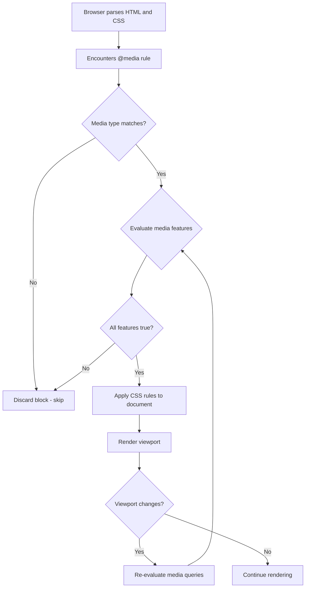
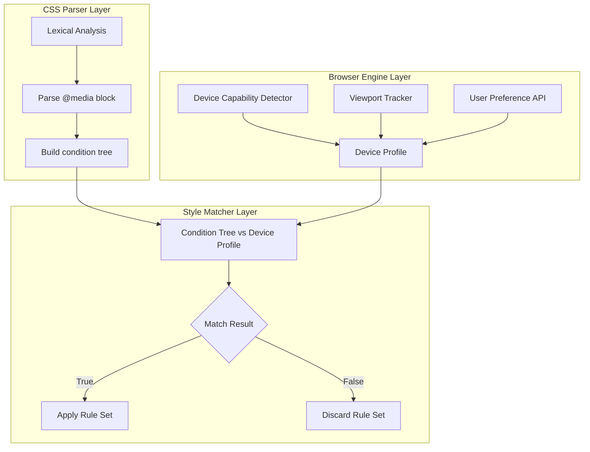
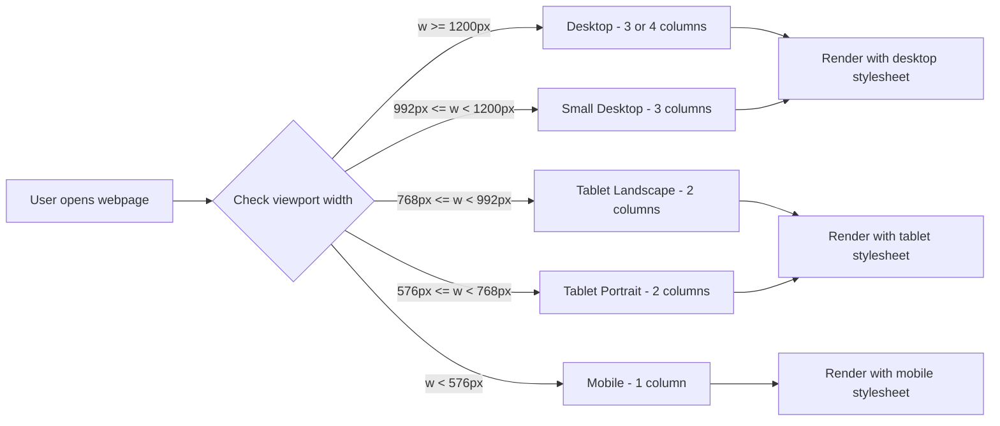
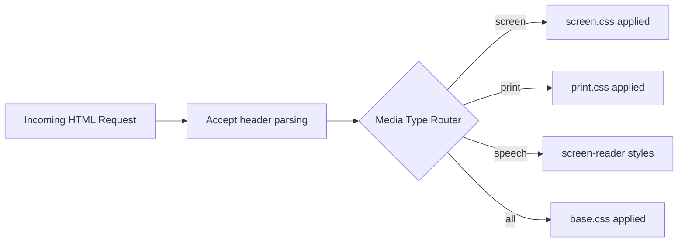
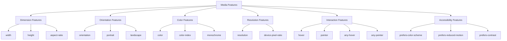
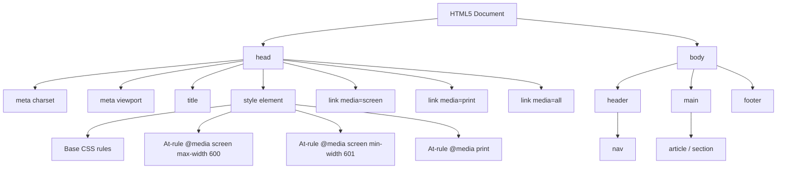

# Media Types and Media Queries

<!-- SECTION_1_START -->
# Media Types and Media Queries — KTU Web Programming Notes

## 1. Core Technical Definition & Intuitive Overview

### 1.1 Formal Definition (KTU 2024 Aligned)

> [!IMPORTANT]
> **Media Types and Media Queries (HTML5 / CSS3 Specification — W3C Recommendation)**
> A **Media Type** is a broad category of device classification (e.g., `screen`, `print`, `speech`) on which a web document is rendered. A **Media Query** is a logical expression composed of a media type and zero or more **media features** (e.g., `min-width`, `orientation`, `resolution`) used to conditionally apply CSS rules based on the rendering environment. Together, they form the foundation of **Responsive Web Design (RWD)**.

In the KTU 2024 Scheme syllabus (Module 1 – *Creating Web Pages Using HTML5*), media types and media queries are positioned as a cornerstone for building **device-agnostic, fluid layouts** that adapt seamlessly across desktops, tablets, and mobile devices.

### 1.2 Conceptual Analogy / Intuition

Imagine a stage play being performed in three different venues: a **cinema hall** (screen), a **printed program booklet** (print), and a **blind audio narration** (speech). The director prepares three different lighting scripts — one for each venue. **Media types and media queries are those "lighting scripts"** in CSS. They let the browser ask, *"Where am I rendering this page?"* and *"How big is the stage?"* — then apply the correct styling rules.

> [!NOTE]
> **Key Mental Model:** A media query is essentially a CSS `if` statement. If the device matches the conditions, the style block executes; otherwise, the browser ignores it.

### 1.3 Standard Reference Constants

| Constant / Metric | Value | Purpose |
|---|---|---|
| **W3C CSS Media Queries Level 4** | Current Recommendation | Governing specification |
| **CSS Pixel Reference (`px`)** | 1/96 of an inch (logical) | Unit for media feature values |
| **Viewport** | The user's visible browser area | Subject of `width`/`height` features |
| **Device Pixel Ratio (DPR)** | Ratio of physical to CSS pixels | Subject of `resolution` feature |
| **Common Breakpoints (Bootstrap 5)** | 576, 768, 992, 1200, 1400 (px) | Industry-standard thresholds |

> [!VISUALIZATION CONTROL]
> **Concept:** Media Query Trigger Visualization
> **GeoGebra / Desmos Input Equations:**
> * `f(x) = x >= 768` (Step function for tablet breakpoint)
> * `g(x) = x >= 992` (Step function for desktop breakpoint)
> **Visual Description:** On the x-axis lay viewport widths (in px). The y-axis (0 or 1) shows whether a particular media query block is "active" (1) or "inactive" (0). Students should observe clear vertical step transitions at the chosen breakpoint values.

---

<!-- SECTION_1_END -->

<!-- SECTION_2_START -->
# 2. Deep Theoretical Analysis & KTU High-Yield Formula Sheet

## 2.1 The Anatomy of a Media Query

A media query is structured using the `@media` at-rule. Its grammar follows the **CSS Conditional Rules Module Level 3** specification.

### 2.1.1 Basic Syntax Breakdown

```css
@media [not | only] media-type [and (media-feature: value)] {
    /* CSS rules to apply if the query matches */
}
```

**Operational Walkthrough:**

1. **`@media`** — The CSS at-rule that initiates a conditional block.
2. **`not`** — Negation operator; reverses the meaning of the entire query.
3. **`only`** — Hides the rule from older browsers that do not support media queries with features.
4. **`media-type`** — The category of device (`screen`, `print`, `all`, `speech`).
5. **`and`** — Logical conjunction used to chain multiple media features.
6. **`(media-feature: value)`** — A property-value pair tested against the rendering environment.
7. **`{ ... }`** — The CSS declaration block applied on a true evaluation.

### 2.1.2 Logical Operators in Detail

| Operator | Function | Example | Evaluates To (if true) |
|---|---|---|---|
| `and` | Conjunction | `@media screen and (min-width: 768px)` | Screen device **AND** width ≥ 768 px |
| `,` (comma) | Disjunction (OR) | `@media screen, print` | Screen **OR** print device |
| `not` | Negation | `@media not screen` | Anything **except** screen |
| `only` | No-fallback filter | `@media only screen and (color)` | Screen with color; hides from old browsers |

> [!NOTE]
> **KTU Pitfall:** The `not` keyword negates the *entire* query, not just the media type. Writing `@media not screen and (color)` is parsed as "**not** (screen and color)" — which is logically different from "not screen **and** color".

## 2.2 Media Types — Complete Catalogue

The HTML4 specification originally defined 10 media types. CSS3 narrowed the practical set. Per **KTU Module 1 expectations**, the following are essential:

| Media Type | Target | Typical Use |
|---|---|---|
| `all` | All devices | Default; applied universally |
| `screen` | Color computer screens | Primary desktop, tablet, mobile styling |
| `print` | Print preview / printed pages | Black-and-white friendly, hide nav, show URLs |
| `speech` | Screen readers (aural) | Accessibility-driven stylesheets |
| `tty` | Teletypes, fixed-pitch terminals | Rare, legacy terminals |
| `tv` | Television-type devices | Low-resolution, large-text layouts |
| `projection` | Projected presentations | Legacy; rarely used today |
| `handheld` | Mobile / handheld | Deprecated in favor of responsive design |
| `braille` | Braille tactile devices | Accessibility |
| `embossed` | Paged braille printers | Accessibility |

> [!IMPORTANT]
> In modern KTU labs, the **four operative types** are `all`, `screen`, `print`, and `speech`. Students should commit these to memory.

## 2.3 Media Features — The Responsive Toolkit

Media features are the conditions tested in a media query. They are categorized below:

### 2.3.1 Dimension-Based Features

| Feature | Description | Example |
|---|---|---|
| `width` | Exact viewport width | `(width: 1024px)` |
| `min-width` | Viewport ≥ value | `(min-width: 768px)` |
| `max-width` | Viewport ≤ value | `(max-width: 600px)` |
| `height` / `min-height` / `max-height` | Viewport height variants | `(min-height: 500px)` |

### 2.3.2 Orientation & Display

| Feature | Description | Values |
|---|---|---|
| `orientation` | Portrait or landscape | `portrait` / `landscape` |
| `aspect-ratio` | viewport-width / viewport-height | `(aspect-ratio: 16/9)` |
| `min-aspect-ratio` / `max-aspect-ratio` | Bounds | `(max-aspect-ratio: 4/3)` |

### 2.3.3 Color & Resolution

| Feature | Description | Example |
|---|---|---|
| `color` | Bits per color component | `(min-color: 8)` |
| `color-index` | Color lookup table entries | `(min-color-index: 256)` |
| `monochrome` | Bits per pixel (grayscale) | `(monochrome: 1)` |
| `resolution` | Pixel density | `(min-resolution: 192dpi)` |
| `-webkit-device-pixel-ratio` | Vendor-specific DPR | `(-webkit-min-device-pixel-ratio: 2)` |

### 2.3.4 Interaction & Accessibility

| Feature | Description | Example |
|---|---|---|
| `hover` | Can the user hover? | `(hover: hover)` |
| `pointer` | Primary input mechanism | `(pointer: fine)` / `(pointer: coarse)` |
| `any-hover` / `any-pointer` | Any of multiple inputs | `(any-pointer: fine)` |
| `prefers-color-scheme` | Dark/light user preference | `(prefers-color-scheme: dark)` |
| `prefers-reduced-motion` | OS-level motion setting | `(prefers-reduced-motion: reduce)` |

## 2.4 KTU High-Yield Formula Sheet

| # | Concept | Syntax / Equation | Engineering Utility |
|---|---|---|---|
| 1 | Media query block | `@media screen and (max-width: 600px) { ... }` | Mobile-only styles |
| 2 | Logical AND | `(A) and (B)` | Compound conditions |
| 3 | Logical OR | `query1, query2` | Multiple breakpoints |
| 4 | Negation | `not (query)` | Invert match |
| 5 | DPR formula | $\text{DPR} = \dfrac{\text{physical pixels}}{\text{CSS pixels}}$ | Retina display targeting |
| 6 | Aspect ratio | $\text{aspect} = \dfrac{\text{viewport width}}{\text{viewport height}}$ | Responsive video embeds |
| 7 | Resolution conversion | $1\,\text{dpi} = \dfrac{96}{1}\,\text{dppx} \approx 0.265\,\text{dppx}$ | Cross-syntax conversion |
| 8 | Mobile-first breakpoint | $\text{width} \geq \text{B}_i$ | Incremental scaling |
| 9 | Desktop-first breakpoint | $\text{width} \leq \text{B}_i$ | Progressive degradation |
| 10 | Min/Max resolution | $\text{dppx} \geq 2 \Rightarrow \text{Retina-grade}$ | High-DPI image swaps |

> [!TIP]
> **Conversion sanity check:** A screen with physical resolution of 1920×1080 and a CSS viewport of 960×540 has $\text{DPR} = 2.0$, which triggers `(min-resolution: 192dpi)` since $1\,\text{dppx} = 96\,\text{dpi}$, giving $2 \times 96 = 192\,\text{dpi}$.

## 2.5 Real-World Engineering Applications

* **E-commerce platforms** (Flipkart, Amazon) — switch from multi-column to single-column layout at mobile breakpoints.
* **Single-page applications (SPAs)** — use media queries in CSS-in-JS libraries (e.g., MUI's `useMediaQuery`).
* **Print-friendly documentation** — `@media print` strips backgrounds, expands link URLs, and hides interactive controls.
* **Accessibility engineering** — `(prefers-reduced-motion: reduce)` disables CSS animations for vestibular-sensitive users.
* **Cross-device progressive enhancement** — serves lighter WebP images on `(max-width: 600px)` and full-resolution AVIF on desktop.

---

<!-- SECTION_2_END -->

<!-- SECTION_3_START -->
# 3. Step-by-Step Derivations & Code/Symbolic Implementation

## 3.1 Three Methods of Linking Media Queries

The HTML5 specification defines three ways to attach media queries to a stylesheet. KTU 2024 scheme students must demonstrate proficiency in all three.

### 3.1.1 Method 1 — The `@media` Rule (Internal Block)

```html
<!DOCTYPE html>
<html lang="en">
<head>
    <meta charset="UTF-8">
    <meta name="viewport" content="width=device-width, initial-scale=1.0">
    <title>Internal @media Demo</title>
    <style>
        body {
            font-family: 'Segoe UI', Tahoma, sans-serif;
            background-color: #ffffff;
            color: #222222;
            margin: 0;
            padding: 0;
        }

        .container {
            display: grid;
            grid-template-columns: 1fr 1fr 1fr;
            gap: 16px;
            padding: 16px;
        }

        .card {
            background-color: #f4f4f4;
            border: 1px solid #dddddd;
            padding: 16px;
            border-radius: 8px;
        }

        /* -------- Tablet (≤ 992px) -------- */
        @media screen and (max-width: 992px) {
            .container {
                grid-template-columns: 1fr 1fr; /* two columns */
            }
        }

        /* -------- Mobile (≤ 600px) -------- */
        @media screen and (max-width: 600px) {
            .container {
                grid-template-columns: 1fr; /* one column */
            }

            body {
                font-size: 14px; /* smaller font */
            }
        }
    </style>
</head>
<body>
    <div class="container">
        <div class="card">Card 1</div>
        <div class="card">Card 2</div>
        <div class="card">Card 3</div>
    </div>
</body>
</html>
```

**Code Walkthrough (Line-by-Line):**

* Line 1: HTML5 doctype declaration — required for standards mode.
* Line 4: `meta charset="UTF-8"` — universal character encoding.
* Line 5: **Viewport meta tag** — sets the layout viewport to match the device width, **mandatory** for media queries to behave correctly on mobile.
* Line 13: `.container` uses a 3-column CSS Grid for desktop.
* Line 27: `@media screen and (max-width: 992px)` — when viewport ≤ 992 px, the grid collapses to 2 columns.
* Line 34: `@media screen and (max-width: 600px)` — when viewport ≤ 600 px, the grid collapses to 1 column and font shrinks.

### 3.1.2 Method 2 — The `media` Attribute on `<link>`

```html
<!DOCTYPE html>
<html lang="en">
<head>
    <meta charset="UTF-8">
    <meta name="viewport" content="width=device-width, initial-scale=1.0">
    <title>External Media Attribute</title>

    <!-- Default stylesheet for all devices -->
    <link rel="stylesheet" href="css/base.css">

    <!-- Tablet-specific -->
    <link rel="stylesheet" href="css/tablet.css"
          media="screen and (max-width: 992px) and (min-width: 601px)">

    <!-- Mobile-specific -->
    <link rel="stylesheet" href="css/mobile.css"
          media="screen and (max-width: 600px)">

    <!-- Print stylesheet -->
    <link rel="stylesheet" href="css/print.css" media="print">
</head>
<body>
    <h1>External Media Demo</h1>
    <p>Resize the browser to see the changes.</p>
</body>
</html>
```

**Walkthrough:**

* `base.css` loads unconditionally.
* `tablet.css` loads only for screens in the range 601 px – 992 px (inclusive).
* `mobile.css` loads only for screens ≤ 600 px.
* `print.css` loads only when the user triggers print preview.

> [!NOTE]
> **Browser Behavior:** Even when a `media` attribute does not match, the file is still **downloaded** (though not applied). This is a performance trade-off — use `@import` inside a single CSS file for fewer HTTP requests.

### 3.1.3 Method 3 — The `@import` Rule

```css
/* ---------- master.css ---------- */

/* Base styles first */
body {
    margin: 0;
    font-family: Arial, sans-serif;
    color: #333;
}

/* Tablet overrides */
@import url("tablet.css") screen and (max-width: 992px) and (min-width: 601px);

/* Mobile overrides */
@import url("mobile.css") screen and (max-width: 600px);

/* Print overrides */
@import url("print.css") print;
```

> [!IMPORTANT]
> **KTU Best Practice:** `@import` blocks the rendering pipeline (sequential download). For production-grade sites, prefer `<link media="...">` or compile media queries into a single bundled CSS using a tool like Sass or PostCSS.

## 3.2 The Viewport Meta Tag — Detailed Derivation

Mobile browsers historically assumed a 980 px layout viewport (the legacy "iPhone" default), which made media queries unreliable. The viewport meta tag fixes this:

```html
<meta name="viewport" content="width=device-width, initial-scale=1.0">
```

**Property derivations:**

* `width=device-width` — sets the layout viewport width to equal the device's CSS width.
* `initial-scale=1.0` — sets the initial zoom to 1:1 (1 CSS pixel = 1 device-independent pixel).
* `maximum-scale=2.0` (optional) — caps user zoom.
* `user-scalable=no` (discouraged) — disables zoom (accessibility violation).

**Mathematical model of viewport scaling:**

$$
\text{CSS px} = \dfrac{\text{Device width (px)}}{\text{DPR}}
$$

For an iPhone 12 (390 physical pixels, DPR = 3):

$$
\text{CSS px} = \dfrac{390}{3} = 130\,\text{px}
$$

Therefore, `(max-width: 130px)` matches the iPhone 12 in portrait orientation when viewport meta is correctly set.

## 3.3 Mobile-First vs Desktop-First Implementation

### 3.3.1 Mobile-First (Recommended by KTU 2024)

```css
/* Base styles target small screens (mobile) */
.container {
    display: flex;
    flex-direction: column;  /* stacked vertically on mobile */
    padding: 10px;
}

.card {
    background: #fff;
    margin-bottom: 10px;
    padding: 12px;
    font-size: 14px;
}

/* Tablet — width >= 600px */
@media (min-width: 600px) {
    .container {
        flex-direction: row;  /* side-by-side */
        flex-wrap: wrap;
    }
    .card {
        flex: 1 1 45%;
        font-size: 16px;
    }
}

/* Desktop — width >= 992px */
@media (min-width: 992px) {
    .card {
        flex: 1 1 30%;
        font-size: 18px;
    }
}
```

**Design philosophy:** Start with the most constrained environment (mobile), then progressively enhance for larger viewports using `min-width` queries.

### 3.3.2 Desktop-First (Legacy Approach)

```css
/* Base styles target large screens */
.container {
    display: flex;
    flex-direction: row;
    padding: 20px;
}

.card {
    flex: 1 1 30%;
    font-size: 18px;
}

/* Tablet — width <= 992px */
@media (max-width: 992px) {
    .card {
        flex: 1 1 45%;
        font-size: 16px;
    }
}

/* Mobile — width <= 600px */
@media (max-width: 600px) {
    .container {
        flex-direction: column;
    }
    .card {
        flex: 1 1 100%;
        font-size: 14px;
    }
}
```

## 3.4 Advanced Media Feature Combinations

### 3.4.1 Orientation-Aware Styling

```css
/* Landscape phones (height < 500px) */
@media screen and (max-height: 500px) and (orientation: landscape) {
    nav {
        display: none;  /* hide nav bar in landscape phones to save vertical space */
    }
}
```

### 3.4.2 High-DPI / Retina Targeting

```css
/* Standard screens */
.hero-image {
    background-image: url('images/hero-1x.jpg');
    background-size: cover;
}

/* Retina displays (DPR >= 2) */
@media (-webkit-min-device-pixel-ratio: 2),
       (min-resolution: 192dpi) {
    .hero-image {
        background-image: url('images/hero-2x.jpg');
    }
}
```

**Conversion derivation:**

$$
192\,\text{dpi} = 192 \times \dfrac{1\,\text{dppx}}{96\,\text{dpi}} = 2\,\text{dppx}
$$

Hence `min-resolution: 192dpi` is functionally equivalent to `min-resolution: 2dppx` and `min-device-pixel-ratio: 2`.

### 3.4.3 Accessibility-First Dark Mode

```css
:root {
    --bg-color: #ffffff;
    --text-color: #1a1a1a;
}

@media (prefers-color-scheme: dark) {
    :root {
        --bg-color: #121212;
        --text-color: #e0e0e0;
    }
}

body {
    background-color: var(--bg-color);
    color: var(--text-color);
    transition: background-color 0.3s ease;
}
```

### 3.4.4 Reduced Motion (WCAG 2.1 Compliance)

```css
/* Default — animations enabled */
.animate-box {
    animation: slide 2s infinite;
}

/* Honor user preference */
@media (prefers-reduced-motion: reduce) {
    .animate-box {
        animation: none;
    }
}
```

## 3.5 Complete Worked Example — Responsive Portfolio Page

Below is a self-contained, fully-functional HTML5 file demonstrating the integration of all concepts above.

```html
<!DOCTYPE html>
<html lang="en">
<head>
    <meta charset="UTF-8">
    <meta name="viewport" content="width=device-width, initial-scale=1.0">
    <meta name="description" content="Responsive portfolio demo for KTU Web Programming">
    <title>Responsive Portfolio — KTU Demo</title>
    <style>
        * { box-sizing: border-box; margin: 0; padding: 0; }

        body {
            font-family: system-ui, -apple-system, sans-serif;
            line-height: 1.6;
            color: #222;
            background: #fafafa;
        }

        header {
            background: #1e3a8a;
            color: white;
            padding: 20px;
            text-align: center;
        }

        nav ul {
            list-style: none;
            display: flex;
            justify-content: center;
            gap: 20px;
            margin-top: 10px;
        }

        nav a {
            color: white;
            text-decoration: none;
            font-weight: bold;
        }

        .grid {
            display: grid;
            grid-template-columns: repeat(3, 1fr);
            gap: 20px;
            padding: 20px;
        }

        .project {
            background: white;
            border-radius: 8px;
            padding: 20px;
            box-shadow: 0 2px 6px rgba(0,0,0,0.1);
        }

        .project img {
            max-width: 100%;
            height: auto;
            border-radius: 4px;
        }

        /* ---- Tablet ---- */
        @media (max-width: 992px) {
            .grid { grid-template-columns: repeat(2, 1fr); }
        }

        /* ---- Mobile ---- */
        @media (max-width: 600px) {
            .grid { grid-template-columns: 1fr; }
            nav ul { flex-direction: column; gap: 8px; }
            header h1 { font-size: 1.4rem; }
        }

        /* ---- Print ---- */
        @media print {
            header { background: none; color: black; }
            nav, .project img { display: none; }
            .project { box-shadow: none; border: 1px solid #000; }
        }
    </style>
</head>
<body>
    <header>
        <h1>John Doe</h1>
        <nav>
            <ul>
                <li><a href="#about">About</a></li>
                <li><a href="#projects">Projects</a></li>
                <li><a href="#contact">Contact</a></li>
            </ul>
        </nav>
    </header>

    <section class="grid" id="projects">
        <article class="project">
            
            <h2>Project One</h2>
            <p>A web app built with React and Node.js.</p>
        </article>
        <article class="project">
            
            <h2>Project Two</h2>
            <p>Machine learning model for image classification.</p>
        </article>
        <article class="project">
            
            <h2>Project Three</h2>
            <p>IoT-based smart home automation system.</p>
        </article>
    </section>
</body>
</html>
```

**Exhaustive behavior matrix:**

| Viewport Width | Active Media Queries | Resulting Grid Columns | Navigation Layout |
|---|---|---|---|
| $\geq 993\,\text{px}$ | None | 3 | Horizontal row |
| $601\,\text{px} \leq w \leq 992\,\text{px}$ | `max-width: 992px` | 2 | Horizontal row |
| $\leq 600\,\text{px}$ | `max-width: 600px` | 1 | Vertical stack |
| Print preview | `print` | 1 (no images) | Hidden |

---

<!-- SECTION_3_END -->

<!-- SECTION_4_START -->
# 4. Structural Diagrams & Schematics

## 4.1 Media Query Decision Flow

The following Mermaid flowchart depicts how a browser evaluates a media query at parse-time and runtime.



**Reading Guide:** The loop between H → I → J represents the **runtime reactivity** of media queries. When the user rotates a device or resizes the window, the browser re-evaluates the entire `@media` tree.

## 4.2 Media Query Evaluation Architecture



**Architectural Notes:**

* **Parser Layer** decomposes the CSS source into a tree of conditional blocks.
* **Browser Engine Layer** provides the live device profile (DPR, width, color depth, user prefs).
* **Style Matcher Layer** performs the Boolean comparison and either applies or discards the ruleset.

## 4.3 Responsive Breakpoint Decision Matrix



## 4.4 Media Type Routing Topology



## 4.5 Complete Media Feature Taxonomy (Block Diagram)



## 4.6 HTML5 Document Tree with Embedded Media Queries



---

<!-- SECTION_4_END -->

<!-- SECTION_5_START -->
# 5. KTU 2024 Scheme Examination Question Bank & Topic Recap

## 5.1 Part A — Short Answer Questions (3 Marks Each)

### Question 1 **[KTU University Exam – July 2024]**
**Q:** Define the term *Media Type* in CSS. List any four media types with their intended target devices.

**Model Answer (3 Marks):**

A media type is a category identifier in CSS that describes the general class of device on which a document is rendered. It enables conditional application of stylesheets.

* **`all`** — Suitable for all devices (default). *[1 Mark]*
* **`screen`** — For color computer screens, smartphones, tablets. *[0.5 Mark]*
* **`print`** — For paged material and documents viewed in print preview. *[0.5 Mark]*
* **`speech`** — For screen readers that read content aloud. *[0.5 Mark]*
* (Any other valid type such as `tv`, `tty` accepted) *[0.5 Mark]*

**[Cognitive Level: Remember | CO1: Understand web standards]**

---

### Question 2 **[KTU University Exam – Dec 2023]**
**Q:** Differentiate between the `not` and `only` logical keywords in a media query. Provide one example for each.

**Model Answer (3 Marks):**

| Keyword | Function | Example |
|---|---|---|
| `not` | Negates the **entire** query result. | `@media not screen and (color)` matches devices that are **not** color screens. *[1.5 Marks]* |
| `only` | Applies the styles only to browsers that *understand* the query; prevents older browsers from misapplying it. | `@media only screen and (min-width: 768px)` — old IE ignores the block. *[1.5 Marks]* |

**[Cognitive Level: Understand | CO1: Apply media concepts]**

---

## 5.2 Part B — 14-Mark Questions (Module Internal Choice)

### Question A **[14 Marks] [KTU University Exam – July 2024]**

**(a)** Explain the syntax of an `@media` rule in CSS. Discuss the role of the logical operators `and`, `or` (comma), `not`, and `only` with suitable examples. **[7 Marks]**

**(b)** Design a responsive HTML5 webpage that displays three product cards in a 3-column layout on desktop, 2-column on tablet, and 1-column on mobile. Write the complete HTML and CSS code with proper media queries and a viewport meta tag. **[7 Marks]**

---

**Model Solution:**

### Part (a) — Syntax and Logical Operators

**Syntax diagram:**

```css
@media [not | only]? <media-type> [and (<media-feature> : <value>)]* [, <media-query2>]? {
    /* CSS declarations */
}
```

**Logical operator breakdown:**

1. **`and` (Conjunction)** — Both conditions must be true.
   ```css
   @media screen and (min-width: 768px) and (orientation: landscape) { ... }
   ```
   Matches: a screen device whose width is at least 768 px **and** is in landscape. *[1 Mark]*

2. **`,` (Comma — Disjunction / OR)** — At least one of the listed queries must match.
   ```css
   @media screen, print { ... }
   ```
   Matches: screen **or** print devices. Browsers apply the ruleset if **any** of the comma-separated queries is true. *[1 Mark]*

3. **`not` (Negation)** — Inverts the result of the *entire* query.
   ```css
   @media not screen and (monochrome) { ... }
   ```
   Evaluated as: `not (screen and monochrome)`. Matches: anything that is **not** a monochrome screen. *[1 Mark]*

4. **`only` (No-fallback)** — Hides the rule from browsers that do not support media queries with media features.
   ```css
   @media only screen and (min-resolution: 192dpi) { ... }
   ```
   Old browsers see `only` and skip the block. *[1 Mark]*

**Operator precedence table (for examiner reference):**

| Priority | Operator |
|---|---|
| 1 (highest) | `not` |
| 2 | `and` |
| 3 (lowest) | `,` (or) |

*[Operator precedence explanation: 1 Mark]*

**Precedence rule:** `not` binds tightest, then `and`, then comma. So `@media not screen, print and (color)` parses as `(not screen), (print and (color))`. *[2 Marks]*

---

### Part (b) — Responsive Product Cards Page

**Complete Source Code:**

```html
<!DOCTYPE html>
<html lang="en">
<head>
    <meta charset="UTF-8">
    <meta name="viewport" content="width=device-width, initial-scale=1.0">
    <title>Responsive Product Grid</title>
    <style>
        * { box-sizing: border-box; margin: 0; padding: 0; }

        body {
            font-family: 'Helvetica Neue', sans-serif;
            background: #f5f5f5;
            padding: 20px;
        }

        h1 { text-align: center; margin-bottom: 20px; color: #1e3a8a; }

        .product-grid {
            display: grid;
            grid-template-columns: repeat(3, 1fr);
            gap: 20px;
            max-width: 1200px;
            margin: 0 auto;
        }

        .product-card {
            background: white;
            padding: 20px;
            border-radius: 10px;
            box-shadow: 0 2px 8px rgba(0,0,0,0.1);
            transition: transform 0.3s;
        }

        .product-card:hover { transform: translateY(-5px); }

        .product-image {
            width: 100%;
            height: 180px;
            background: #e0e7ff;
            border-radius: 6px;
            margin-bottom: 12px;
        }

        .price { color: #1e3a8a; font-weight: bold; font-size: 1.2rem; }

        /* Tablet: 2 columns */
        @media screen and (max-width: 992px) {
            .product-grid { grid-template-columns: repeat(2, 1fr); }
        }

        /* Mobile: 1 column */
        @media screen and (max-width: 600px) {
            .product-grid { grid-template-columns: 1fr; }
            h1 { font-size: 1.4rem; }
        }
    </style>
</head>
<body>
    <h1>Our Featured Products</h1>

    <section class="product-grid">
        <div class="product-card">
            <div class="product-image"></div>
            <h2>Wireless Headphones</h2>
            <p>Noise-cancelling, 30-hour battery life.</p>
            <p class="price">₹2,499</p>
        </div>
        <div class="product-card">
            <div class="product-image"></div>
            <h2>Smart Watch</h2>
            <p>Health tracking, AMOLED display.</p>
            <p class="price">₹4,999</p>
        </div>
        <div class="product-card">
            <div class="product-image"></div>
            <h2>Bluetooth Speaker</h2>
            <p>360° sound, waterproof.</p>
            <p class="price">₹1,799</p>
        </div>
    </section>
</body>
</html>
```

**Valuation Key (Incremental):**

* Correct `<!DOCTYPE html>` and HTML5 boilerplate: *[1 Mark]*
* Viewport meta tag included: *[1 Mark]*
* Three product cards structured in semantic HTML: *[1 Mark]*
* Base CSS Grid with 3 columns: *[1 Mark]*
* `@media` for tablet (≤ 992 px) reducing to 2 columns: *[1.5 Marks]*
* `@media` for mobile (≤ 600 px) reducing to 1 column: *[1.5 Marks]*

**[Cognitive Levels: Understand (a) → Apply (b) | CO1, CO2]**

---

### Question B **[14 Marks] [KTU University Exam – Dec 2023]** *(Alternative)*

**(a)** Explain the concept of *Mobile-First* design. Write a CSS snippet using `min-width` media queries that progressively enhances a navigation bar from a vertical mobile layout to a horizontal desktop layout. **[7 Marks]**

**(b)** Write a CSS file that uses media queries to:
  (i) Increase the base font size by 25% when the viewport width is at least 1200 px.
  (ii) Change the page background to a dark color (`#121212`) and text to light (`#f0f0f0`) when the user has `prefers-color-scheme: dark`.
  (iii) Hide all `` elements when the document is being printed.
  **[7 Marks]**

---

**Model Solution:**

### Part (a) — Mobile-First Design

**Concept (3 Marks):** Mobile-first is a design philosophy where the *baseline* styles target the smallest, most constrained viewport (mobile). Enhancements are added *progressively* using `min-width` media queries as the viewport grows. This results in:

* Faster initial render on mobile (no overrides needed).
* Forced prioritization of essential content.
* Cleaner, more maintainable CSS (no `!important` wars).

**Snippet (4 Marks):**

```css
/* Mobile baseline */
nav ul {
    list-style: none;
    display: flex;
    flex-direction: column;   /* stacked vertically */
    gap: 10px;
    padding: 10px;
}

nav a {
    display: block;
    padding: 12px;
    background: #1e3a8a;
    color: white;
    text-align: center;
    border-radius: 4px;
}

/* Tablet enhancement — width >= 600px */
@media (min-width: 600px) {
    nav ul {
        flex-direction: row;     /* side by side */
        justify-content: center;
    }
}

/* Desktop enhancement — width >= 992px */
@media (min-width: 992px) {
    nav ul {
        gap: 30px;
    }
    nav a {
        background: transparent;  /* blend with header */
        color: #1e3a8a;
    }
}
```

**Valuation Key:**

* Defining mobile-first philosophy: *[1.5 Marks]*
* Mobile baseline (vertical flex): *[1 Mark]*
* `min-width: 600px` media query (horizontal): *[1 Mark]*
* `min-width: 992px` media query (desktop polish): *[0.5 Mark]*
* Correct cascade ordering: *[1 Mark]*

---

### Part (b) — Multi-Feature Media Queries

**Solution (7 Marks):**

```css
/* (i) Increase font size on large viewports */
@media (min-width: 1200px) {
    body {
        font-size: 125%;      /* 25% increase over inherited size */
    }
}

/* (ii) Dark mode preference */
@media (prefers-color-scheme: dark) {
    body {
        background-color: #121212;
        color: #f0f0f0;
    }
}

/* (iii) Hide images in print */
@media print {
    img {
        display: none;
    }
}
```

**Valuation Key:**

* Correct use of `min-width: 1200px` with percentage: *[1.5 Marks]*
* Correct `prefers-color-scheme: dark` syntax and color tokens: *[2 Marks]*
* Correct `print` media type with `display: none` on `img`: *[1.5 Marks]*
* Clean code structure with comments: *[1 Mark]*
* Single-correctness sanity check (no syntax errors): *[1 Mark]*

**[Cognitive Levels: Understand (a) → Apply / Analyze (b) | CO2, CO3]**

---

> [!WARNING]
> **KTU Examiner's Valuation Pitfalls — Media Queries**
> * **Forgetting the viewport meta tag** — the most common 2-mark deduction. Without it, mobile devices emulate a 980 px layout and your media queries never trigger. *[Lose up to 2 Marks]*
> * **Wrong `min-width` vs `max-width` semantics** — students often write `min-width: 600px` for mobile styles. This matches **larger** screens, not mobile. *[Lose 2–3 Marks]*
> * **Missing `screen` media type** — newer browsers default to `all`, but legacy grading rubrics expect the explicit `screen` keyword. *[Lose 0.5–1 Mark]*
> * **Misusing `not`** — students write `@media not screen` expecting it to exclude only screens, but it actually negates the entire query. *[Lose 1 Mark]*
> * **Pixel-vs-em confusion** — KTU prefers `px` for media queries; using `em` in queries based on root font-size is valid but rarely required. *[Lose 0.5 Mark]*
> * **Forgetting to wrap media features in parentheses** — `@media screen and min-width: 600px` is a syntax error. *[Lose 1 Mark]*
> * **Not showing breakpoint thresholds in answer** — always state the numerical value: "when viewport ≤ 600 px" — not just "on mobile". *[Lose 1 Mark]*

---

## 5.3 Topic Recap & Important Things to Remember

* **Definition Recall:** A **Media Type** categorizes the *kind* of device; a **Media Query** is a conditional expression combining a media type with one or more **media features** to test device capabilities.
* **Canonical Media Types for KTU:** `all`, `screen`, `print`, `speech`. Others (`tv`, `tty`, `braille`, `handheld`, `projection`) are largely deprecated or niche.
* **Core Syntax:** `@media [not | only]? <type> [and (<feature> : <value>)]+ { ... }`.
* **Logical Operators:** `and` (AND), `,` (OR), `not` (negation of full query), `only` (no-fallback for legacy browsers). `not` has the highest precedence.
* **Three Attachment Methods:**
  1. Internal `<style>` block with `@media` rules.
  2. `<link rel="stylesheet" media="...">` attribute.
  3. `@import url(...) <media-query>;` (blocks rendering — avoid in production).
* **Essential Media Features:** `width`, `min-width`, `max-width`, `height`, `min-height`, `max-height`, `orientation`, `aspect-ratio`, `resolution`, `color`, `monochrome`, `hover`, `pointer`, `prefers-color-scheme`, `prefers-reduced-motion`.
* **Mobile-First vs Desktop-First:** Mobile-first uses `min-width` queries and is the modern best practice. Desktop-first uses `max-width` queries.
* **DPR Formula:** $\text{DPR} = \dfrac{\text{physical pixels}}{\text{CSS pixels}}$. Common retina values: $\text{DPR} = 2$ (Apple) and $\text{DPR} = 3$ (high-end Android).
* **Resolution Conversion:** $1\,\text{dppx} = 96\,\text{dpi}$.
* **Viewport Meta Tag is Mandatory:** Always include `<meta name="viewport" content="width=device-width, initial-scale=1.0">`.
* **Common Breakpoints:** 576 px (mobile), 768 px (tablet), 992 px (small desktop), 1200 px (large desktop), 1400 px (XL).
* **Accessibility Features:** Always honor `prefers-reduced-motion` and `prefers-color-scheme` for inclusive design.
* **Operator Precedence:** `not` > `and` > `,`. Always use parentheses implicitly through proper media query structure.
* **Print Stylesheets:** Strip backgrounds, hide nav and images, expand link URLs with `::after { content: " (" attr(href) ")"; }`.
* **Performance Tip:** Bundle media queries into a single CSS file via Sass/PostCSS to reduce HTTP requests triggered by `<link media="...">`.
* **Exam Trick Question:** The `only` keyword does **not** add a logical operation; it is purely a parser filter for non-compliant browsers.

<!-- SECTION_5_END -->
