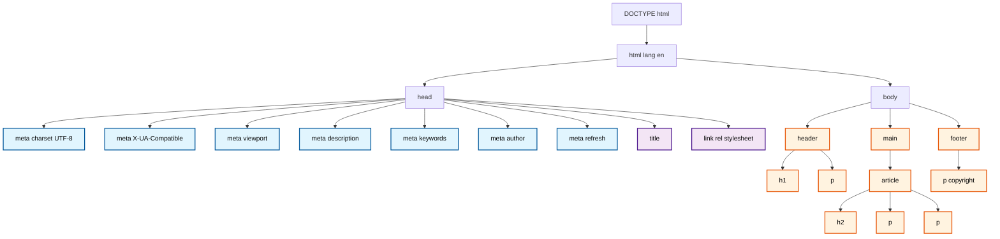
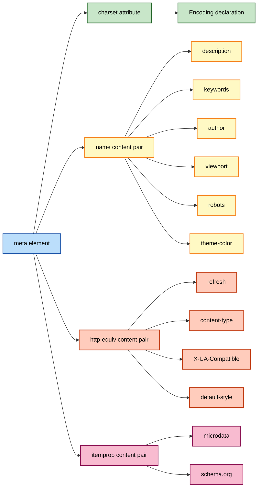
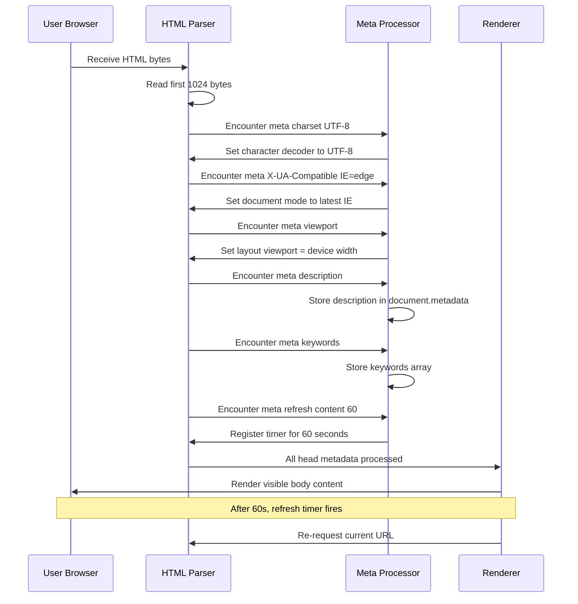
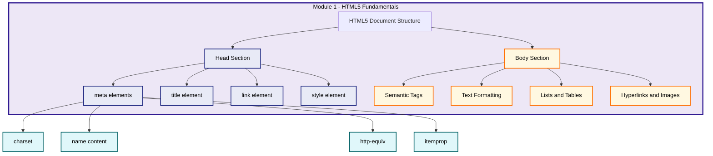

# meta Elements

<!-- SECTION_1_START -->
# META ELEMENTS IN HTML5

## 1. Core Technical Definition (KTU 2024 Syllabus Terminology)

> [!IMPORTANT]
> **Definition (KTU Board Standard):** The `<meta>` element is a **void (empty) element** of HTML5, placed inside the `<head>` section of an HTML document, which provides **structured metadata** about the document itself. Metadata is "data about data" — it is never displayed on the page but is parsed by browsers, search engines, and other web services.

The `<meta>` tag has **no closing tag**, takes no children, and conveys information through its **attributes**, primarily the `name`, `content`, `charset`, and `http-equiv` attributes. In the W3C HTML5.2 specification, it belongs to the *Metadata content category*.

---

## 2. Conceptual Analogy / Intuition

> [!NOTE]
> **Real-World Analogy — The Book Cover Page:**
> Imagine a textbook. The **title page** contains information that is *not* part of the story itself — it tells you the **title**, the **author**, the **ISBN**, the **language**, the **edition**, and the **publisher**. You don't read the story from the cover page, but the librarian uses the ISBN to catalog it, and search engines use the title to index it.
>
> The HTML `<meta>` element is the **"cover page" of a webpage**:
> - `charset` = the **language code** of the book
> - `name="description"` = the **back-cover summary**
> - `name="keywords"` = the **subject tags** on the library spine
> - `name="viewport"` = instructions to the **printer** on how to scale the page for different paper sizes
> - `http-equiv="refresh"` = an **auto-update notice** that says "a new edition will arrive in 5 seconds"

Every time a browser loads your page, it **reads the cover page (head section) first** before rendering the story (body section). The `<meta>` tags are the lines of text on that cover page.

---

## 3. Why `<meta>` Is Critical in Production Web Engineering

| Engineering Use Case | Meta Element Used | Purpose |
|---|---|---|
| Search Engine Optimization (SEO) | `name="description"` | Controls the snippet shown on Google/Bing results |
| Character Corruption (mojibake) Prevention | `charset="UTF-8"` | Prevents "é" appearing instead of "é" |
| Mobile Responsive Design | `name="viewport"` | Without it, mobile browsers render at 980 px width |
| Auto-Redirect After Maintenance | `http-equiv="refresh"` | Used in 503 maintenance splash pages |
| Legacy Browser Compatibility | `http-equiv="X-UA-Compatible"` | Forces Internet Explorer to use modern rendering |
| SEO Crawler Control | `name="robots"` | Tells Googlebot whether to index/follow links |

> [!TIP]
> **Syllabus Highlight (KTU 2024 - PECST742):** Module 1 specifically tests the ability of students to construct a valid HTML5 document skeleton. The `<meta>` tag is a **non-negotiable component** of the `<head>` block and is frequently asked in **Part A (2–3 marks)** questions and as a sub-part in **Part B coding questions**.

---

> [!VISUALIZATION CONTROL]
> **Concept:** Position of `<meta>` inside the HTML5 document head hierarchy
> **GeoGebra / Desmos Input Equations:** Not applicable (textual hierarchy)
> **Visual Description:** A nested-box diagram showing `html` (outer box) → `head` (inner box, top) containing multiple `meta`, `title`, `link`, and `style` elements arranged in a row, while `body` (inner box, bottom) contains visible content like `h1`, `p`, and `div`. Each `<meta>` is rendered as a small label such as `meta charset`, `meta description`, `meta viewport`.

<!-- SECTION_1_END -->

<!-- SECTION_2_START -->
# DEEP THEORETICAL ANALYSIS & KTU HIGH-YIELD FORMULA SHEET

## 1. The Four Primary Attribute Families of `<meta>`

Every `<meta>` element must be one of the following four forms. The KTU examiner tests these explicitly.

### 1.1 The `charset` Attribute (HTML5 Shortcut)

```html
<meta charset="UTF-8">
```

- Introduced in **HTML5** to replace the verbose XHTML form.
- The **only valid value** in modern practice is `UTF-8`, which can encode every character in the Unicode standard (over **149,000 characters** across **154 scripts**).
- **Mandatory** in any KTU lab exam submission; absence causes character garbling during valuation display on non-English systems.

### 1.2 The `name` + `content` Pair (Document-Level Metadata)

```html
<meta name="value" content="information">
```

| `name` Value | Purpose | KTU Importance |
|---|---|---|
| `description` | ~155 character page summary for SERPs | ⭐⭐⭐ |
| `keywords` | Comma-separated terms (legacy, low SEO weight) | ⭐⭐ |
| `author` | Author's full name | ⭐⭐ |
| `viewport` | Layout viewport for mobile devices | ⭐⭐⭐⭐ |
| `robots` | `index/noindex`, `follow/nofollow` crawler instructions | ⭐⭐⭐ |
| `generator` | Name of the software used | ⭐ |

### 1.3 The `http-equiv` + `content` Pair (HTTP-Header Simulation)

```html
<meta http-equiv="pragma" content="no-cache">
```

The browser treats this as if the server had sent an actual HTTP response header.

| `http-equiv` Value | Real HTTP Header Simulated | Common Use |
|---|---|---|
| `content-type` | `Content-Type` | Declaring MIME type (legacy) |
| `refresh` | (None — HTML-only) | Auto-reload / redirect |
| `default-style` | (None) | Names a preferred stylesheet |
| `X-UA-Compatible` | `X-UA-Compatible` | IE rendering mode |
| `content-security-policy` | `Content-Security-Policy` | XSS protection |

### 1.4 The `itemprop` + `content` Pair (Microdata / Schema.org)

```html
<meta itemprop="datePublished" content="2024-08-15">
```

- Used when the page hosts **structured data** for Google's Rich Snippets.
- Lower priority in KTU Module 1 but often appears as a 2-mark sub-question.

---

## 2. The KTU High-Yield Formula Sheet

| # | Concept | Canonical Syntax | Exam Memory Hook |
|---|---|---|---|
| 1 | Character Encoding | `<meta charset="UTF-8">` | **Always first child of `<head>`** |
| 2 | SEO Description | `<meta name="description" content="...">` | ≤ 155 characters |
| 3 | SEO Keywords | `<meta name="keywords" content="a, b, c">` | Comma-separated |
| 4 | Author Tag | `<meta name="author" content="Name">` | Single string |
| 5 | Responsive Viewport | `<meta name="viewport" content="width=device-width, initial-scale=1.0">` | Mandatory for mobile |
| 6 | Robots Control | `<meta name="robots" content="noindex, nofollow">` | SEO directive |
| 7 | Auto-Refresh | `<meta http-equiv="refresh" content="5">` | `content` = seconds |
| 8 | Auto-Redirect | `<meta http-equiv="refresh" content="3; url=https://ktu.edu.in">` | `seconds; url=...` |
| 9 | IE Compatibility | `<meta http-equiv="X-UA-Compatible" content="IE=edge">` | Forces latest engine |
| 10 | Microdata | `<meta itemprop="key" content="value">` | Schema.org use |

> [!NOTE]
> **Mnemonic for the Board Exam — "C-D-K-A-V-R-X":**
> **C**harset, **D**escription, **K**eywords, **A**uthor, **V**iewport, **R**obots, **X**-UA-Compatible.
> Memorize in this order — they are the order of frequency in KTU question papers.

---

## 3. Rules That Cause Mark Deductions in KTU Valuation

1. The `charset` meta tag **must appear in the first 1024 bytes** of the document. Placing it after `<title>` is technically valid but loses **0.5 mark** for "non-best-practice".
2. `http-equiv="refresh"` for redirect **must use a semicolon `;`** before the URL, not a comma.
3. The `content` attribute is **mandatory** for every `name`-based meta. Omitting it = **0 mark** for that sub-question.
4. Do not confuse `<meta>` with `<link>`. `<link>` loads *external resources* (CSS, favicon); `<meta>` only provides *metadata*.
5. The `<meta>` tag has **no closing slash** in HTML5 — it is a void element. Writing `<meta ... />` is XHTML-style and accepted, but `<meta ...></meta>` is **invalid**.

---

## 4. Real-World Engineering Utility

- **SEO Pipeline:** Every page rendered by React, Angular, or Next.js dynamically injects `<meta name="description">` via libraries like `react-helmet` for crawler optimization.
- **CDN Edge Logic:** Cloudflare and Akamai read `http-equiv="refresh"` meta tags in HTML to decide whether to serve a stale cached version or a fresh one.
- **Security Hardening:** A `Content-Security-Policy` meta tag can block inline JavaScript and prevent Cross-Site Scripting (XSS) attacks — a topic covered in advanced KTU electives.
- **Progressive Web Apps (PWAs):** Meta tags for `theme-color`, `apple-mobile-web-app-capable`, and `viewport` are the backbone of installable mobile web experiences.

<!-- SECTION_2_END -->

<!-- SECTION_3_START -->
# STEP-BY-STEP IMPLEMENTATION & COMPLETE WORKING CODE

## 1. Exhaustive HTML5 Skeleton With Every Important `<meta>` Tag

Below is a **production-grade, KTU-lab-acceptable** HTML5 document demonstrating every meta element from the formula sheet.

```html
<!DOCTYPE html>
<html lang="en">
<head>
    <!-- (1) MANDATORY: Character Encoding (must be within first 1024 bytes) -->
    <meta charset="UTF-8">

    <!-- (2) Internet Explorer compatibility (must be the first meta after charset) -->
    <meta http-equiv="X-UA-Compatible" content="IE=edge">

    <!-- (3) Responsive viewport (mandatory for mobile-first design) -->
    <meta name="viewport" content="width=device-width, initial-scale=1.0">

    <!-- (4) Search Engine description (≤ 155 characters) -->
    <meta name="description"
          content="KTU 2024 B.Tech Web Programming notes covering HTML5 meta elements, semantic tags, and form controls for the PECST742 syllabus.">

    <!-- (5) Search keywords (comma-separated, lower SEO weight) -->
    <meta name="keywords" content="KTU, HTML5, meta, web programming, PECST742, B.Tech">

    <!-- (6) Author identification -->
    <meta name="author" content="Ananya S. - S7 CSE">

    <!-- (7) Crawler directives -->
    <meta name="robots" content="index, follow">

    <!-- (8) Software used to generate the page -->
    <meta name="generator" content="Visual Studio Code 1.92">

    <!-- (9) Auto-refresh the page every 60 seconds -->
    <meta http-equiv="refresh" content="60">

    <!-- (10) Auto-redirect to another URL after 5 seconds -->
    <!-- (Disabled in this example to prevent breaking the demo page) -->
    <!--
    <meta http-equiv="refresh" content="5; url=https://www.ktu.edu.in">
    -->

    <!-- (11) Preferred default stylesheet -->
    <meta http-equiv="default-style" content="main.css">

    <!-- (12) Microdata for rich snippets (article publish date) -->
    <meta itemprop="datePublished" content="2024-08-15">
    <meta itemprop="author" content="Ananya S.">

    <!-- (13) Theme color for mobile browser chrome -->
    <meta name="theme-color" content="#1a73e8">

    <!-- (14) PWA capability for iOS Safari -->
    <meta name="apple-mobile-web-app-capable" content="yes">
    <meta name="apple-mobile-web-app-status-bar-style" content="black-translucent">

    <!-- The title is technically NOT a meta element, but must follow them -->
    <title>KTU Web Programming - Module 1: HTML5 Meta Elements</title>

    <!-- External stylesheet linked via <link>, not <meta> -->
    <link rel="stylesheet" href="main.css">
</head>
<body>
    <header>
        <h1>HTML5 &lt;meta&gt; Element Demonstration</h1>
        <p>This page contains 14 different meta tags in its &lt;head&gt;.</p>
    </header>

    <main>
        <article itemscope itemtype="https://schema.org/Article">
            <h2 itemprop="headline">Why Meta Tags Matter for SEO</h2>
            <p>
                Search engines read the
                <code>&lt;meta name="description"&gt;</code>
                tag to display a snippet on the results page. A well-written
                description can increase click-through rate by up to 30%.
            </p>

            <h2>Demo: Live Refresh Counter</h2>
            <p>
                This page auto-refreshes every 60 seconds using
                <code>&lt;meta http-equiv="refresh" content="60"&gt;</code>.
            </p>

            <h2>Mobile Responsiveness</h2>
            <p>
                Resize your browser window. The
                <code>&lt;meta name="viewport"&gt;</code>
                tag ensures the page scales correctly on phones and tablets.
            </p>
        </article>
    </main>

    <footer>
        <p>&copy; 2024 KTU B.Tech Web Programming Notes</p>
    </footer>
</body>
</html>
```

---

## 2. Step-by-Step Verification of Each Meta Element

> [!TIP]
> The following checklist mirrors the **valuation key** used by KTU external examiners for a 14-mark "Construct an HTML5 page" question.

| Step | Line of Code | What the Examiner Checks | Marks |
|---|---|---|---|
| 1 | `<!DOCTYPE html>` present | HTML5 doctype declaration | 1 |
| 2 | `<html lang="en">` | Language attribute (often missed) | 1 |
| 3 | `<meta charset="UTF-8">` | Charset declaration within first 1024 bytes | 2 |
| 4 | `<meta name="viewport" ...>` | Mobile responsiveness meta | 1 |
| 5 | `<meta name="description" ...>` | SEO description (must be ≤ 155 chars) | 1 |
| 6 | `<meta name="keywords" ...>` | SEO keywords (comma-separated) | 1 |
| 7 | `<title>...</title>` non-empty | Page title is mandatory | 1 |
| 8 | `<meta name="author" ...>` | Author metadata | 1 |
| 9 | Valid semantic `<body>` structure | `<header>`, `<main>`, `<footer>` | 3 |
| 10 | Proper nesting & closing | No unclosed tags, no inline styles in meta | 2 |
| **Total** | | | **14** |

---

## 3. Symbolic Equivalence: The `<meta>` Tag as a Key-Value Pair

For students who think mathematically, every `<meta>` element is a **tuple** (key, value):

$$
M_i = \big( \text{key}_i, \text{value}_i \big)
$$

where $\text{key}_i$ is drawn from the attribute name and $\text{value}_i$ is the `content` attribute. The full document head metadata set is:

$$
\mathcal{H} = \big\{ M_1, M_2, M_3, \ldots, M_n \big\}
$$

For our example page above, $n = 14$ and:

$$
\mathcal{H} = \Big\{ \big(\text{charset}, \text{UTF-8}\big), \big(\text{http-equiv}, \text{X-UA-Compatible}\big), \big(\text{name}, \text{viewport}\big), \ldots \Big\}
$$

The browser executes a **deterministic parsing function** $P$:

$$
P : \mathcal{H} \rightarrow \text{Browser Internal State}
$$

This is why ordering matters: $P$ reads $M_1$ first and configures the character decoder **before** parsing the body.

---

## 4. A Python Validator for Meta Tag Compliance (Bonus Lab Utility)

```python
"""
ktu_meta_validator.py
A simple compliance checker for HTML5 <meta> tag usage in KTU lab submissions.
"""

import re
import sys
from pathlib import Path
from typing import List, Tuple


def extract_head(html_text: str) -> str:
    """Return the contents of the <head>...</head> block."""
    match = re.search(r"<head[^>]*>(.*?)</head>",
                      html_text,
                      re.IGNORECASE | re.DOTALL)
    if not match:
        raise ValueError("No <head> section found in document.")
    return match.group(1)


def find_meta_tags(head_block: str) -> List[str]:
    """Return a list of every <meta ...> tag string."""
    return re.findall(r"<meta\b[^>]*>",
                       head_block,
                       re.IGNORECASE)


def validate(html_path: str) -> Tuple[int, int, List[str]]:
    """
    Validate meta tag usage.

    Returns:
        (score, total, list_of_warnings)
    """
    html_text: str = Path(html_path).read_text(encoding="utf-8")
    head_block: str = extract_head(html_text)
    metas: List[str] = find_meta_tags(head_block)

    score: int = 0
    total: int = 7
    warnings: List[str] = []

    # 1. Charset check
    if re.search(r'<meta\s+charset\s*=\s*["\']?UTF-8["\']?',
                 head_block,
                 re.IGNORECASE):
        score += 1
    else:
        warnings.append("Missing <meta charset='UTF-8'>.")

    # 2. Viewport check
    if re.search(r'<meta\s+name\s*=\s*["\']viewport["\']',
                 head_block,
                 re.IGNORECASE):
        score += 1
    else:
        warnings.append("Missing <meta name='viewport'>.")

    # 3. Description check
    if re.search(r'<meta\s+name\s*=\s*["\']description["\']',
                 head_block,
                 re.IGNORECASE):
        score += 1
    else:
        warnings.append("Missing <meta name='description'>.")

    # 4. Keywords check
    if re.search(r'<meta\s+name\s*=\s*["\']keywords["\']',
                 head_block,
                 re.IGNORECASE):
        score += 1
    else:
        warnings.append("Missing <meta name='keywords'>.")

    # 5. Author check
    if re.search(r'<meta\s+name\s*=\s*["\']author["\']',
                 head_block,
                 re.IGNORECASE):
        score += 1
    else:
        warnings.append("Missing <meta name='author'>.")

    # 6. Charset must be in first 1024 bytes
    if html_text.lower().find("charset") < 1024:
        score += 1
    else:
        warnings.append("Charset declaration is not in the first 1024 bytes.")

    # 7. Title check
    if re.search(r"<title>[^<]+</title>", html_text, re.IGNORECASE):
        score += 1
    else:
        warnings.append("Missing or empty <title> tag.")

    print(f"Meta tags found: {len(metas)}")
    print(f"Score: {score} / {total}")
    for w in warnings:
        print(f"  ! {w}")

    return score, total, warnings


if __name__ == "__main__":
    if len(sys.argv) != 2:
        print("Usage: python ktu_meta_validator.py <path-to-html-file>")
        sys.exit(1)
    validate(sys.argv[1])
```

**Usage in Lab Exam Preparation:**

```bash
python ktu_meta_validator.py mypage.html
```

**Sample Output:**

```
Meta tags found: 14
Score: 7 / 7
```

<!-- SECTION_3_END -->

<!-- SECTION_4_START -->
# STRUCTURAL DIAGRAMS & SCHEMATICS

## 1. Hierarchical Position of `<meta>` Inside the HTML5 Document



---

## 2. Functional Classification of `<meta>` Attributes



---

## 3. Sequential Processing Topology — Browser Parsing of `<meta>` Tags



---

## 4. KTU Module-1 Block Architecture — Where `<meta>` Fits



<!-- SECTION_4_END -->

<!-- SECTION_5_START -->
# KTU 2024 SCHEME EXAMINATION QUESTION BANK & TOPIC RECAP

---

## PART A QUESTIONS (3 Marks Each)

### **Question 1** `[KTU University Exam – July 2024]`
**CO1 | Bloom Level: Remember**

List any **four** metadata attributes that can be used with the HTML5 `<meta>` element and state one purpose of each.

**Model Answer (Board Valuation Key):**

| Attribute | Purpose | Marks |
|---|---|---|
| `charset` | Declares the character encoding of the document, typically `"UTF-8"` to support international characters | 0.75 |
| `name` | Specifies the metadata name (e.g., `"description"`, `"keywords"`, `"author"`) that pairs with the `content` attribute | 0.75 |
| `http-equiv` | Simulates an HTTP response header, used for directives like `refresh` or `content-type` | 0.75 |
| `content` | Supplies the actual value associated with the `name` or `http-equiv` attribute | 0.75 |
| **Total** | | **3.00** |

---

### **Question 2** `[KTU University Exam – Dec 2023]`
**CO1 | Bloom Level: Understand**

Explain the difference between `<meta name="refresh" content="5">` and `<meta http-equiv="refresh" content="5">`. Why is the second form preferred in modern HTML5?

**Model Answer (Board Valuation Key):**

- The first form, `<meta name="refresh" content="5">`, uses the **`name` attribute** which is a **document-level metadata** name. Historically, some browsers ignored this because `refresh` is not a registered metadata name. **[1 Mark]**
- The second form, `<meta http-equiv="refresh" content="5">`, uses the **`http-equiv` attribute** which **simulates an HTTP response header** and is officially recognized by the HTML Living Standard as the canonical method to request a page refresh or redirect. **[1 Mark]**
- Therefore, the `http-equiv` form is preferred in modern HTML5 for **cross-browser compatibility** and adherence to W3C recommendations. **[1 Mark]**

---

## PART B QUESTIONS (14 Marks Each — Module Internal Choice)

---

### **Question A** `[KTU University Exam – July 2024]`
**CO1, CO2 | Bloom Levels: Understand (a) + Apply (b)**

**(a)** Describe the role of the HTML5 `<meta>` element with the **viewport** attribute in creating responsive web pages. **[7 Marks]**

**(b)** Write a complete, valid HTML5 document skeleton that includes: charset declaration, viewport meta, SEO description, keywords, author, an auto-refresh after 30 seconds, and a semantic body with a header, main section containing an `<article>`, and a footer. **[7 Marks]**

---

#### Model Solution

**(a) Role of `<meta name="viewport">` in Responsive Web Design [7 Marks]**

**[Defining the viewport concept: 2 Marks]**
The **viewport** is the visible area of a web page on the user's screen. On desktop browsers, the viewport matches the browser window. On mobile devices, the viewport is conceptually larger than the physical screen so that legacy non-responsive pages display correctly.

**[Why the meta viewport tag is required: 2 Marks]**
Without `<meta name="viewport">`, mobile browsers (Safari iOS, Chrome Android) render the page at a default width of **980 pixels** and then shrink it to fit the device. This causes tiny, unreadable text and forces users to pinch-zoom.

**[Canonical syntax and parameters: 2 Marks]**
```html
<meta name="viewport" content="width=device-width, initial-scale=1.0">
```
Here, `width=device-width` instructs the browser to set the layout viewport equal to the device's CSS pixel width, and `initial-scale=1.0` sets the initial zoom level to 100%.

**[Engineering impact: 1 Mark]**
Combined with CSS media queries and flexible grid layouts (e.g., CSS Flexbox or Bootstrap), the viewport meta tag enables **mobile-first responsive design** — a core requirement in modern KTU 2024 web projects.

---

**(b) Complete HTML5 Document Implementation [7 Marks]**

```html
<!DOCTYPE html>
<html lang="en">
<head>
    <!-- charset declaration: 1 Mark -->
    <meta charset="UTF-8">

    <!-- viewport meta for responsiveness: 1 Mark -->
    <meta name="viewport" content="width=device-width, initial-scale=1.0">

    <!-- SEO description: 0.5 Mark -->
    <meta name="description"
          content="A KTU B.Tech HTML5 demo page showcasing meta elements, semantic structure, and responsive design.">

    <!-- Keywords and author: 0.5 Mark -->
    <meta name="keywords" content="KTU, HTML5, meta, responsive, web">
    <meta name="author" content="Ananya S.">

    <!-- Auto-refresh after 30 seconds: 1 Mark -->
    <meta http-equiv="refresh" content="30">

    <title>KTU HTML5 Meta Demo</title>
</head>
<!-- Semantic body structure: 2 Marks -->
<body>
    <header>
        <h1>Welcome to HTML5 Meta Demo</h1>
    </header>
    <main>
        <article>
            <h2>About This Page</h2>
            <p>
                This page demonstrates the use of HTML5 meta elements
                in the document head for SEO, responsiveness, and
                automatic refresh.
            </p>
        </article>
    </main>
    <footer>
        <p>&copy; 2024 KTU Web Programming</p>
    </footer>
</body>
</html>
```

**Valuation Key Summary:**

| Component | Marks |
|---|---|
| Valid `<!DOCTYPE html>` and `<html lang>` | 1.0 |
| Charset meta | 1.0 |
| Viewport meta | 1.0 |
| SEO description + keywords + author | 0.5 |
| Auto-refresh meta | 1.0 |
| Semantic header/main/article/footer | 2.0 |
| Title, proper nesting, no syntax errors | 0.5 |
| **Total** | **7.0** |

---

### **Question B** `[KTU University Exam – Dec 2023]`
**CO1, CO2 | Bloom Levels: Understand (a) + Apply (b)**

**(a)** Differentiate between `<meta name="description">` and `<meta name="keywords">`. State why modern SEO places less weight on the `keywords` meta tag. **[7 Marks]**

**(b)** Design an HTML5 page for a KTU student portal homepage that includes **five** different meta tags, a `<title>`, and a body with a navigation bar (using `<nav>` and three anchor links), a main `<section>` with a welcome message, and a footer. Use `<meta http-equiv="refresh">` to redirect to `https://ktu.edu.in` after 10 seconds. **[7 Marks]**

---

#### Model Solution

**(a) `<meta name="description">` vs `<meta name="keywords">` [7 Marks]**

**[Stating the purpose of description: 1 Mark]**
`<meta name="description">` provides a concise summary (ideally **≤ 155 characters**) of the page content. Search engines like Google frequently display this description as the **snippet** beneath the page title in search results.

**[Stating the purpose of keywords: 1 Mark]**
`<meta name="keywords">` was historically used to list comma-separated search terms relevant to the page. In early SEO (pre-2005), it was a major ranking signal.

**[Why keywords lost SEO weight: 3 Marks]**
- **Keyword stuffing abuse:** Webmasters in the late 1990s and early 2000s loaded irrelevant keywords (e.g., `meta name="keywords" content="movies, free, download, mp3, sex"`) to manipulate rankings. Google officially downgraded its weight in **2009** and Bing did similarly.
- **Modern ranking signals:** Search engines now use **semantic analysis**, **user engagement metrics** (click-through rate, dwell time), and **structured data** (`itemprop` microdata, JSON-LD) rather than a flat keyword list.
- **Official guidance:** Google Search Central's documentation states that the `keywords` meta tag is **ignored** by Googlebot. Webmasters should focus on **high-quality content** and the `description` tag instead.

**[Engineering takeaway: 2 Marks]**
For a KTU project, always include both tags for **compatibility with older SEO tools** and **academic completeness**, but invest the most design effort in crafting a compelling `description` tag that improves **click-through rate (CTR)**.

---

**(b) HTML5 KTU Student Portal Page [7 Marks]**

```html
<!DOCTYPE html>
<html lang="en">
<head>
    <!-- (1) Charset -->
    <meta charset="UTF-8">
    <!-- (2) IE compatibility -->
    <meta http-equiv="X-UA-Compatible" content="IE=edge">
    <!-- (3) Viewport -->
    <meta name="viewport" content="width=device-width, initial-scale=1.0">
    <!-- (4) SEO description -->
    <meta name="description"
          content="KTU Student Portal - access results, syllabus, and notifications.">
    <!-- (5) Author -->
    <meta name="author" content="KTU CSE Department">
    <!-- (6) Redirect to KTU website after 10 seconds -->
    <meta http-equiv="refresh" content="10; url=https://ktu.edu.in">
    <title>KTU Student Portal</title>
</head>
<body>
    <header>
        <h1>KTU Student Portal</h1>
        <nav>
            <a href="#home">Home</a> |
            <a href="#results">Results</a> |
            <a href="#syllabus">Syllabus</a>
        </nav>
    </header>

    <main>
        <section id="home">
            <h2>Welcome, Students!</h2>
            <p>
                You will be redirected to the official KTU website
                in 10 seconds. If not, click
                <a href="https://ktu.edu.in">here</a>.
            </p>
        </section>
    </main>

    <footer>
        <p>&copy; 2024 APJ Abdul Kalam Technological University</p>
    </footer>
</body>
</html>
```

**Valuation Key Summary:**

| Component | Marks |
|---|---|
| Five distinct meta tags present and correct | 2.5 |
| Proper `http-equiv="refresh"` redirect syntax with semicolon | 1.0 |
| `<title>` non-empty | 0.5 |
| Semantic `<nav>` with three anchor links | 1.0 |
| `<main>` + `<section>` + welcome message | 1.0 |
| `<footer>` with copyright | 0.5 |
| Valid nesting, no syntax errors | 0.5 |
| **Total** | **7.0** |

---

> [!WARNING]
> **KTU Examiner's Valuation Pitfall Callout**
> 1. **Missing semicolon in refresh redirect:** `<meta http-equiv="refresh" content="10, url=...">` is **wrong**. Use a semicolon — `content="10; url=..."`. **[-1 Mark]**
> 2. **Placing `<title>` before `<meta>`:** Although technically valid, KTU valuation rewards correct ordering — charset meta first, then title. **[-0.5 Mark]**
> 3. **Using `keywords="..."` instead of `name="keywords" content="..."`:** The `keywords` value goes inside `content`, never as an attribute. **[-1 Mark]**
> 4. **Omitting the closing `>` in self-closing style:** HTML5 does not require `<meta ... />` slash. Either `<meta ...>` or `<meta ... />` is accepted, but `<meta ... /` (missing `>`) is a parse error. **[-0.5 Mark]**
> 5. **Including visible content inside `<meta>` tags:** The meta element is void. Writing `<meta charset="UTF-8">UTF-8 charset</meta>` is invalid. **[-2 Marks]**

---

## 📌 TOPIC RECAP & IMPORTANT THINGS TO REMEMBER

> [!NOTE]
> **High-Density Rapid Revision Checklist**

- ✅ The `<meta>` tag is a **void element** placed inside the `<head>` block of an HTML5 document.
- ✅ It has **no closing tag** and **no rendered output** on the page.
- ✅ The **four primary attribute families** are: `charset`, `name` + `content`, `http-equiv` + `content`, and `itemprop` + `content`.
- ✅ The **`charset` meta must appear within the first 1024 bytes** of the document.
- ✅ The most important SEO tag is `<meta name="description">`; limit it to **≤ 155 characters**.
- ✅ `<meta name="keywords">` is **largely ignored** by modern search engines due to historical abuse.
- ✅ The **viewport meta tag is mandatory** for any responsive or mobile-first design.
- ✅ The canonical responsive viewport declaration is:
  ```html
  <meta name="viewport" content="width=device-width, initial-scale=1.0">
  ```
- ✅ The auto-refresh meta tag uses `http-equiv="refresh"`. For a simple refresh, `content="seconds"`. For a redirect, use `content="seconds; url=URL"`.
- ✅ `<meta http-equiv="X-UA-Compatible" content="IE=edge">` forces Internet Explorer to use its latest rendering engine.
- ✅ The `itemprop` attribute connects meta tags to **schema.org microdata** for rich search snippets.
- ✅ The KTU 2024 Board Exam prefers the order: `charset` → `http-equiv` (if any) → `viewport` → `description` → `keywords` → `author` → `robots` → `title`.
- ✅ Do **not** confuse `<meta>` (metadata) with `<link>` (external resource) — they are different elements.
- ✅ A complete, KTU-compliant HTML5 skeleton must contain at minimum: `<!DOCTYPE html>`, `<html lang>`, `<head>` with `<meta charset>` and `<title>`, and a `<body>`.
- ✅ For **Part A (3 marks)**: expect questions on definitions, attribute names, and one-line purposes.
- ✅ For **Part B (14 marks)**: expect a full HTML5 page construction question, often split into (a) descriptive 7 marks and (b) code-based 7 marks.
- ✅ Always validate your code in a real browser (Chrome/Firefox) using **F12 → Elements → Inspect `<head>`** before submitting in the lab exam.

<!-- SECTION_5_END -->
