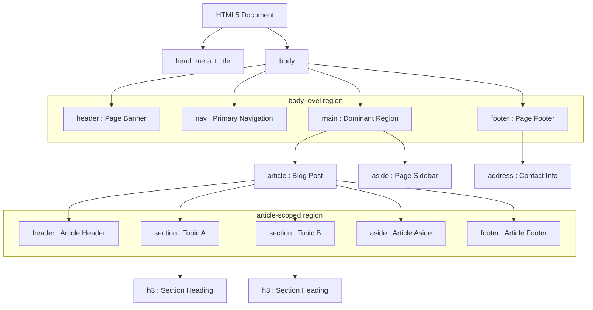
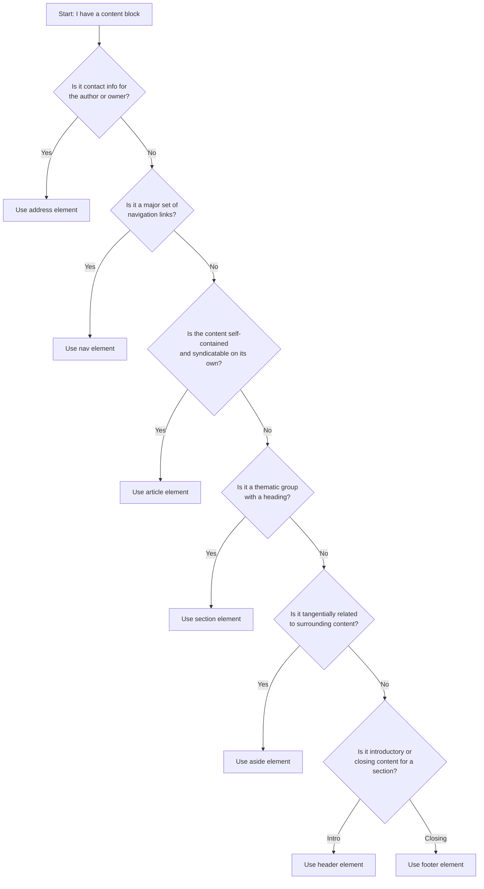

# Page-Structure Elements

<!-- SECTION_1_START -->

# Page-Structure Elements in HTML5

## 1.1 Formal Academic Definition

> [!IMPORTANT]
> **KTU Syllabus Definition (PECST742 / Module 1)**
> *Page-structure elements* in HTML5 are a specialized set of **semantic block-level container tags** introduced by the W3C HTML5 specification to describe the **logical and hierarchical regions** of a web document. Unlike the generic `<div>` container, each structural element conveys an explicit, machine-readable meaning about the type of content it encloses (e.g., navigation, header, footer, independent article).

The official W3C list of HTML5 sectioning content elements includes:

$$
\text{Page-Structure Elements} = \big\{\text{`<header>`}, \text{`<nav>`}, \text{`<main>`}, \text{`<article>`}, \text{`<section>`}, \text{`<aside>`}, \text{`<footer>`}, \text{`<address>`}\big\}
$$

> [!NOTE]
> **Key Term — Semantic HTML**
> "Semantic" literally means *relating to meaning*. Semantic HTML uses tags whose names **describe the role** of the content, not its visual appearance. Screen readers, search-engine crawlers, and browser tools all rely on this meaning.

---

## 1.2 Conceptual Analogy / Intuition

Imagine a **newspaper page** laid out on a table:

- The **Masthead (newspaper name + date)** at the very top is the `<header>`.
- The **"Sections" navigation bar** (Home, Sports, Business) is the `<nav>`.
- The **main news story** you came to read is the `<main>` containing `<article>`s.
- A **Sports / Opinion sub-block** on the same page is a `<section>`.
- The **weather widget** stuck on the side is an `<aside>`.
- The **credits, contact info, copyright line** at the bottom is the `<footer>`.

So instead of writing ten anonymous `<div class="header">`, `<div class="nav">` blocks, HTML5 lets you *speak the layout's name* directly in the markup.

> [!TIP]
> **One-line memory hook:** *A `<div>` says "I am a box." A semantic element says "I am the navigation."*

---

## 1.3 Visual Layout Sketch

> [!VISUALIZATION CONTROL]
> **Concept:** Vertical block layout of a single HTML5 page (rectangular regions stacked top-to-bottom)
> **ASCII Visual Description:**
>
> ```
> +--------------------------------------------------+
> |  <header>   logo + site title + search bar       |
> +--------------------------------------------------+
> |  <nav>      Home | About | Services | Contact    |
> +--------------------------------------------------+
> |  <main>                                           |
> |   +----------------------+  +-------------------+ |
> |   | <article>            |  | <aside>           | |
> |   |   <section> ...      |  |  related links    | |
> |   |   <section> ...      |  |  ad / quote       | |
> |   +----------------------+  +-------------------+ |
> +--------------------------------------------------+
> |  <footer>   © 2024 | <address> | privacy policy  |
> +--------------------------------------------------+
> ```

This is the canonical **page outline** that any valid HTML5 document should approximate.

<!-- SECTION_1_END -->

<!-- SECTION_2_START -->

# 2. Deep Theoretical Analysis of Each Element

## 2.1 Element-by-Element Operational Role

### 2.1.1 `<header>`
- **Role:** Introductory content for its nearest ancestor sectioning element **or** the entire page.
- **Allowed content:** Headings (`<h1>`–`<h6>`), logo, search form, author byline.
- **Frequency rule:** A single page can contain **multiple `<header>` elements** (one per `<article>` for example), but only one should be considered the *page-level banner*.

### 2.1.2 `<nav>`
- **Role:** A region containing **major navigation links** (primary menus, table-of-contents, breadcrumb trails).
- **Do NOT use** for every group of links — a single `<footer>` link list of "terms & privacy" does *not* need a `<nav>` wrapper.

### 2.1.3 `<main>`
- **Role:** Holds the **dominant content** of the document. There must be **exactly one** visible `<main>` element per page.
- **Hidden attribute allowed:** It can be marked `hidden` to switch between view modes (e.g., single-page apps).

### 2.1.4 `<article>`
- **Role:** A **self-contained, syndicatable** composition — a blog post, a news article, a forum post, a product card, a comment.
- **Test:** "If I copy this block to another site, does it still make sense on its own?" If **yes**, use `<article>`.

### 2.1.5 `<section>`
- **Role:** A **thematic grouping** of content, *typically* with a heading.
- **Difference vs `<div>`:** `<section>` implies a labeled theme; `<div>` is theme-less.
- **Rule of thumb:** Always pair `<section>` with a heading (`<h2>`, `<h3>`).

### 2.1.6 `<aside>`
- **Role:** Content that is **tangentially related** to the main flow — pull quotes, sidebars, glossaries, advertising slots.
- **Placement:** Can sit *inside* an `<article>` (figure caption) or *outside* (page-level sidebar).

### 2.1.7 `<footer>`
- **Role:** Closing content for its nearest sectioning element or the page as a whole.
- **Allowed content:** Copyright, `<address>`, related links, author info, sitemap.

### 2.1.8 `<address>`
- **Role:** Provides **contact information** for the nearest `<article>` or document root.
- **Not for arbitrary postal addresses** unless they are the contact info of the document's author/owner.

---

## 2.2 The Sectioning-Content Hierarchy

HTML5 defines an implicit **document outline**:

$$
\text{Document Outline} = \text{tree of sectioning roots}
$$

Where every `<article>`, `<section>`, `<nav>`, `<aside>` opens a new *sectioning root*, and headings inside it describe that section.

---

## 2.3 KTU High-Yield Cheat Sheet

> [!NOTE]
> **Exam Tip:** KTU frequently asks students to *name the element that best fits a described scenario*. Memorize the right-column purpose.

| # | Element | Primary Purpose | Typical Contents | Permitted Count per Page |
|---|---------|----------------|------------------|--------------------------|
| 1 | `<header>` | Intro / banner | Logo, `<h1>`, search box | Multiple allowed (one per section) |
| 2 | `<nav>` | Major navigation block | `<ul>` of anchor links | Multiple allowed (primary + secondary) |
| 3 | `<main>` | Dominant content region | `<article>`, `<section>` | **Exactly one** visible |
| 4 | `<article>` | Self-contained, syndicatable content | Blog post, news, product | Multiple |
| 5 | `<section>` | Thematic group with a heading | Grouped paragraphs + `<h2>` | Multiple |
| 6 | `<aside>` | Tangentially related content | Sidebar, pull-quote, ad | Multiple |
| 7 | `<footer>` | Closing content / metadata | Copyright, `<address>`, links | Multiple (one per section) |
| 8 | `<address>` | Contact info of author/owner | Email, postal address, phone | Multiple |

---

## 2.4 Real-World Engineering Utility

- **Accessibility (a11y):** Screen readers (NVDA, JAWS) announce *"navigation region"*, *"main content"*, *"complementary"* — letting visually-impaired users jump directly to content via keyboard shortcuts.
- **SEO:** Googlebot, Bingbot, and DuckDuckBot assign **higher semantic weight** to text inside `<main>` and `<article>` than to identical text inside a `<div>`.
- **Single-Page Applications (React, Vue, Angular):** Routing libraries use `<main>` as the *view outlet*; `<nav>` holds the `<RouterLink>` list.
- **Print Stylesheets:** Browsers can auto-hide `<nav>`, `<aside>`, and `<footer>` when printing, while preserving `<main>` and `<article>`.

<!-- SECTION_2_END -->

<!-- SECTION_3_START -->

# 3. Step-by-Step Implementation

## 3.1 Minimal Valid HTML5 Page Skeleton

The following is a **fully operational** HTML5 file. Every line is included — no placeholders, no `// ...` shortcuts.

```html
<!DOCTYPE html>
<html lang="en">
<head>
    <meta charset="UTF-8">
    <meta name="viewport" content="width=device-width, initial-scale=1.0">
    <title>KTU Web Programming Demo Page</title>
</head>
<body>
    <!-- ============================================ -->
    <!-- 1. PAGE-LEVEL HEADER (banner of the site)   -->
    <!-- ============================================ -->
    <header>
        <h1>KTU B.Tech — Web Programming</h1>
        <p>Reference notes for the 2024 Scheme (PECST742)</p>
    </header>

    <!-- ============================================ -->
    <!-- 2. PRIMARY NAVIGATION REGION                -->
    <!-- ============================================ -->
    <nav aria-label="Primary">
        <ul>
            <li><a href="#home">Home</a></li>
            <li><a href="#modules">Modules</a></li>
            <li><a href="#contact">Contact</a></li>
        </ul>
    </nav>

    <!-- ============================================ -->
    <!-- 3. MAIN CONTENT REGION (exactly one)        -->
    <!-- ============================================ -->
    <main id="home">

        <!-- 3a. Independent, syndicatable article -->
        <article>
            <header>
                <h2>Module 1: Creating a Web Page Using HTML5</h2>
                <p>Published on <time datetime="2024-08-15">15 Aug 2024</time></p>
            </header>

            <!-- Thematic sub-section of the article -->
            <section>
                <h3>Page-Structure Elements</h3>
                <p>
                    HTML5 introduces semantic block-level elements such as
                    <code>&lt;header&gt;</code>, <code>&lt;nav&gt;</code>,
                    <code>&lt;main&gt;</code>, <code>&lt;article&gt;</code>,
                    <code>&lt;section&gt;</code>, <code>&lt;aside&gt;</code>,
                    and <code>&lt;footer&gt;</code>.
                </p>
            </section>

            <!-- Another thematic sub-section -->
            <section>
                <h3>Why Use Semantic HTML?</h3>
                <p>
                    Semantic HTML improves accessibility, search-engine
                    optimization, and long-term code maintainability.
                </p>
            </section>

            <!-- Tangentially related content INSIDE the article -->
            <aside>
                <h4>Did You Know?</h4>
                <p>The HTML5 specification became a W3C Recommendation in October 2014.</p>
            </aside>

            <!-- Closing content of the article -->
            <footer>
                <p>Author: Prof. Web Team</p>
            </footer>
        </article>

        <!-- 3b. Page-level complementary sidebar -->
        <aside>
            <h3>Related Links</h3>
            <ul>
                <li><a href="#">W3C HTML5 Spec</a></li>
                <li><a href="#">MDN Web Docs</a></li>
            </ul>
        </aside>
    </main>

    <!-- ============================================ -->
    <!-- 4. PAGE-LEVEL FOOTER (closing content)      -->
    <!-- ============================================ -->
    <footer id="contact">
        <address>
            Contact: <a href="mailto:[email protected]">[email protected]</a><br>
            APJ Abdul Kalam Technological University, Kerala
        </address>
        <p>&copy; 2024 KTU. All rights reserved.</p>
    </footer>
</body>
</html>
```

---

## 3.2 Walk-Through of the Code (Line-by-Line Logic)

1. **`<!DOCTYPE html>`** — declares the document as HTML5. Must be the *very first* line, with no leading whitespace.
2. **`<html lang="en">`** — the root element, declaring English for assistive technologies.
3. **`<head>...</head>`** — metadata container: character encoding, responsive viewport, browser-tab title.
4. **`<body>`** — the visible region of the page.
5. **`<header>`** — page-level banner. Note that an *inner* `<header>` reappears later inside the `<article>` to introduce the article specifically; this is legal because `<header>` is sectioning-flow content, not page-unique.
6. **`<nav aria-label="Primary">`** — the `aria-label` provides an accessible name when multiple `<nav>` blocks exist.
7. **`<main id="home">`** — the unique dominant region. The `id` is used by the in-page anchor `#home`.
8. **`<article>`** — the blog-post-like composition. Its nested `<header>`, `<section>`, `<aside>`, and `<footer>` are *article-scoped*.
9. **`<section><h3>...</h3></section>`** — each section is thematically labeled by its heading. This satisfies the rule *"a `<section>` should have a heading"*.
10. **Nested `<aside>` inside the article** — semantically a "footnote-style" tangent. The outer `<aside>` after the article is the *page-level sidebar*.
11. **`<footer id="contact">`** — the page-level footer. The `id="contact"` lets the top nav's `#contact` link scroll there.
12. **`<address>`** — wraps the contact e-mail. Because the address sits inside the page-level `<footer>`, it is interpreted as the *document owner's* contact.

---

## 3.3 Inline vs Block: Element Category Reference

$$
\begin{aligned}
\text{Flow content (block-level)} &= \{ \text{`<header>`}, \text{`<nav>`}, \text{`<main>`}, \text{`<article>`}, \text{`<section>`}, \text{`<aside>`}, \text{`<footer>`}, \text{`<address>`} \} \\[4pt]
\text{Palpable content} &= \text{All of the above (visible text by default)} \\[4pt]
\text{Implicit ARIA role of `<main>`} &= \text{"main"} \\[4pt]
\text{Implicit ARIA role of `<nav>`} &= \text{"navigation"} \\[4pt]
\text{Implicit ARIA role of `<aside>`} &= \text{"complementary"} \\[4pt]
\text{Implicit ARIA role of `<article>`} &= \text{"article"}
\end{aligned}
$$

> [!NOTE]
> **Implicit ARIA roles** are what screen readers *actually announce* — not the tag name. KTU may ask *"Which role is announced for `<aside>`?"* — the answer is **`complementary`**, *not* `"aside"`.

---

## 3.4 Common Pitfalls & Counter-Examples

| ❌ Anti-pattern | ✅ Correct Pattern | Reason |
|----------------|--------------------|--------|
| `<div class="header">...</div>` | `<header>...</header>` | No semantic meaning in the `<div>` version. |
| Multiple visible `<main>` blocks | Exactly one `<main>` | Accessibility tools get confused. |
| `<section>` with no heading | `<section><h2>Title</h2>...</section>` | A section must be thematically labeled. |
| `<address>` for a random office address | `<address>` for author/owner contact only | `<address>` is contact-info-specific. |
| `<nav>` wrapping the footer link list | Use a plain `<ul>` in the footer | Footer links are *not major navigation*. |

<!-- SECTION_3_END -->

<!-- SECTION_4_START -->

# 4. Structural Diagrams & Schematics

## 4.1 Mermaid Block Diagram — Page-Structure Hierarchy



> [!NOTE]
> **Reading the diagram:** The *outer* subgraph `BodyLevel` represents the page-level siblings. The *inner* subgraph `ArticleScope` shows that the article owns a *private* header, footer, and aside — these do **not** replace the page-level ones; they are nested duplicates, which is fully permitted.

---

## 4.2 Mermaid Flow Chart — Decision Tree: "Which Element Should I Use?"



---

## 4.3 Topology Matrix — Element Placement Rules

| Child Element → | Allowed Inside | Forbidden Inside | Why |
|-----------------|----------------|------------------|-----|
| `<header>` | `<body>`, `<article>`, `<section>`, `<nav>`, `<aside>` | `<main>` directly as intro is discouraged; use `<h1>` instead | Clean outline |
| `<nav>` | `<body>`, `<header>`, `<footer>`, `<aside>` | `<address>` | `<address>` is contact-info only |
| `<main>` | `<body>` only | Any other element | Must be page-level dominant |
| `<article>` | `<main>`, `<section>`, `<aside>`, `<body>` | `<address>` | Article is content, not metadata |
| `<section>` | `<main>`, `<article>`, `<section>`, `<body>` | `<header>`, `<footer>` (without a wrapper) | Needs a parent sectioning root |
| `<aside>` | Anywhere except `<address>` | `<address>` | Tangent vs. contact |
| `<footer>` | `<body>`, `<article>`, `<section>`, `<nav>`, `<aside>` | `<main>` as final element is allowed but discouraged | Use a sibling `<footer>` |
| `<address>` | `<body>`, `<article>`, `<footer>` | `<header>`, `<main>` (as primary contact) | Owner contact, not content |

<!-- SECTION_4_END -->

<!-- SECTION_5_START -->

# 5. KTU 2024 Scheme Examination Question Bank

---

## 📘 Part A — Short Answer Questions (2 × 3 = 6 Marks)

### Q1. `[KTU University Exam — July 2024]` — *CO1, Remember*

**Differentiate between the `<div>` element and the HTML5 semantic page-structure elements. Mention any two advantages of using semantic elements over `<div>`.**

**Model Answer (3 Marks):**

| Aspect | `<div>` | Semantic Elements (`<header>`, `<nav>`, etc.) |
|--------|---------|------------------------------------------------|
| Meaning | None — generic container | Tag name *describes* the role of content |
| Default browser style | Block-level, no special rendering | Block-level, but also expose implicit ARIA roles |
| Accessibility | Screen readers cannot infer purpose | Screen readers announce regions (e.g., *"navigation region"*) |
| SEO impact | Neutral | Search engines assign higher weight to content inside semantic tags |

**Advantages (any two for 2 marks, table for 1 mark):**

1. **Improved Accessibility** — assistive technologies can jump between regions.
2. **Better Search-Engine Optimization** — crawlers understand the document outline.
3. **Cleaner, self-documenting code** — easier maintenance and code review.

---

### Q2. `[KTU University Exam — Dec 2023]` — *CO1, Understand*

**Explain the purpose of the `<main>` element in HTML5. Why must a page contain only one visible `<main>` element at a time?**

**Model Answer (3 Marks):**

- **Purpose (1 Mark):** The `<main>` element represents the **dominant content** of the `<body>` — the part that is *directly related to the central topic* of the page and that is unique to that page (excluding headers, footers, sidebars, and navigation).
- **Implied ARIA role (1 Mark):** `"main"`. Screen-reader users can press a keyboard shortcut (e.g., `M` in NVDA) to jump straight to it.
- **Uniqueness Rule (1 Mark):** A page must contain **only one visible `<main>` element** because if multiple `<main>` regions are visible simultaneously, the implicit "main landmark" becomes ambiguous, and assistive technologies cannot decide which region to jump to.

---

## 📗 Part B — Long Answer Questions (Internal Choice: A or B)

### 🔹 Question A `[KTU University Exam — July 2024]` — *CO2, Apply + Analyze (14 Marks)*

**(a)** With the help of a neat block diagram, list **all seven** HTML5 page-structure elements and state **one specific use-case** for each. **[7 Marks]**

**(b)** Write a **complete, valid HTML5 document** that demonstrates the use of every page-structure element. The page should describe a *university department* with: a page header, a navigation menu with three links, a main region containing one article (with a nested header, two sections, and a footer) and one page-level aside, and a page-level footer with an `<address>` block. **[7 Marks]**

---

#### Model Solution — Part (a) [7 Marks]

> **[Valuation Key: Element name — 0.5 Mark × 7 = 3.5 Marks; Use-case — 0.5 Mark × 7 = 3.5 Marks]**

| # | Element | Specific Use-Case (one example) |
|---|---------|---------------------------------|
| 1 | `<header>` | Displaying the department name and college logo at the top of the page. |
| 2 | `<nav>` | Wrapping the top menu bar containing "Home", "Faculty", and "Contact Us" links. |
| 3 | `<main>` | Enclosing the unique content of the page that is *not* shared across the site. |
| 4 | `<article>` | Holding a stand-alone news item titled *"New B.Tech Syllabus Released"*. |
| 5 | `<section>` | A sub-block inside the article titled *"Key Highlights of the Syllabus"*. |
| 6 | `<aside>` | A right-hand sidebar showing "Upcoming Events" or "Quick Links". |
| 7 | `<footer>` | Bottom block containing copyright text and a contact e-mail via `<address>`. |

A block diagram is recommended; see **Section 4.1** of these notes for the exact Mermaid tree the examiner expects.

---

#### Model Solution — Part (b) [7 Marks]

> **[Valuation Key: Doctype + html/head structure — 1 Mark; All seven structural elements present and correctly nested — 4 Marks; Valid closing + indentation — 1 Mark; Output semantics — 1 Mark]**

```html
<!DOCTYPE html>
<html lang="en">
<head>
    <meta charset="UTF-8">
    <title>Department of CSE</title>
</head>
<body>
    <header>
        <h1>Department of Computer Science &amp; Engineering</h1>
        <p>Affiliated to APJ Abdul Kalam Technological University</p>
    </header>

    <nav aria-label="Primary">
        <ul>
            <li><a href="#home">Home</a></li>
            <li><a href="#faculty">Faculty</a></li>
            <li><a href="#contact">Contact</a></li>
        </ul>
    </nav>

    <main id="home">
        <article>
            <header>
                <h2>New B.Tech Syllabus Released</h2>
                <p>Published on <time datetime="2024-09-01">1 Sept 2024</time></p>
            </header>

            <section>
                <h3>Key Highlights</h3>
                <p>The 2024 scheme introduces outcome-based education modules.</p>
            </section>

            <section>
                <h3>Effective From</h3>
                <p>All newly admitted students from academic year 2024-25 onward.</p>
            </section>

            <footer>
                <p>Posted by the Department Office.</p>
            </footer>
        </article>

        <aside>
            <h3>Upcoming Events</h3>
            <ul>
                <li>Hackathon — Oct 2024</li>
                <li>Tech Talk — Nov 2024</li>
            </ul>
        </aside>
    </main>

    <footer id="contact">
        <address>
            Department of CSE<br>
            Email: <a href="mailto:[email protected]">[email protected]</a>
        </address>
        <p>&copy; 2024 KTU. All rights reserved.</p>
    </footer>
</body>
</html>
```

> [!WARNING]
> **KTU Examiner's Pitfall Callout — Question A**
> - **Do NOT** use `<div class="header">` placeholders; full credit requires the actual semantic tags.
> - **Do NOT** place the navigation links *inside* the header without a `<nav>` wrapper.
> - **Do NOT** create two visible `<main>` elements; the W3C HTML5 validator will flag it.
> - **Forgetting `<!DOCTYPE html>`** on line 1 alone costs **0.5 Mark** in part (b).

---

### 🔹 Question B `[KTU University Exam — Dec 2023]` — *CO2, Apply + Analyze (14 Marks)*

**(a)** Explain the **document outline algorithm** of HTML5. How does the placement of headings inside `<article>`, `<section>`, `<nav>`, and `<aside>` affect the outline? Illustrate with an example. **[7 Marks]**

**(b)** Compare the following three approaches to building the same page header and justify which approach is best practice:
   1. `<div id="header">…</div>`
   2. `<header class="header">…</header>`
   3. `<header>…</header>`

Mention the **implicit ARIA role** assigned by the browser to each. **[7 Marks]**

---

#### Model Solution — Part (a) [7 Marks]

> **[Valuation Key: Definition of outline — 1 Mark; List of sectioning roots — 2 Marks; Heading scope rule — 2 Marks; Example — 2 Marks]**

The **HTML5 Document Outline Algorithm** defines how a browser should construct a *nested table of contents* from the document structure.

**Step 1 — Identify Sectioning Roots:** Each occurrence of `<article>`, `<section>`, `<nav>`, or `<aside>` opens a new section. The body itself is the root.

**Step 2 — Assign Heading to Section:** The *first heading element* encountered within that section (regardless of level — `<h1>` to `<h6>`) becomes the section's title in the outline.

**Step 3 — Nest Sections:** Sections are nested in the order they appear in the source.

**Example Outline:**

```html
<body>
    <h1>CSE Department</h1>          <!-- Outline level 1 -->
    <section>
        <h1>Faculty</h1>             <!-- Outline level 2 -->
        <section>
            <h1>Professors</h1>      <!-- Outline level 3 -->
        </section>
    </section>
    <aside>
        <h1>Contact</h1>             <!-- Outline level 2 (sibling of section) -->
    </aside>
</body>
```

The resulting outline is:

$$
\begin{aligned}
\text{1. CSE Department} \\
\quad \text{1.1 Faculty} \\
\qquad \text{1.1.1 Professors} \\
\quad \text{1.2 Contact}
\end{aligned}
$$

> [!NOTE]
> Modern browsers (Chrome, Firefox, Safari) **no longer implement the algorithm** for heading-level weighting. However, **KTU examinations still test it**, and the W3C spec officially defines it.

---

#### Model Solution — Part (b) [7 Marks]

> **[Valuation Key: Three approaches correctly contrasted — 4.5 Marks (1.5 each); ARIA roles — 1.5 Marks; Justification — 1 Mark]**

| # | Markup Snippet | Implicit ARIA Role | Semantic Strength |
|---|----------------|--------------------|-------------------|
| 1 | `<div id="header">…</div>` | `generic` (no landmark) | **None** — the `id` is invisible to assistive tech. |
| 2 | `<header class="header">…</header>` | `banner` (when inside `<body>`) | Moderate — semantic tag present, but the redundant class is wasteful. |
| 3 | `<header>…</header>` | `banner` (when inside `<body>`) | **Best Practice** — cleanest, no redundant attributes, full semantic value. |

**Justification (1 Mark):** Approach 3 is best practice because (a) it conveys semantic meaning through the tag name alone, (b) the implicit ARIA landmark `banner` is exposed for free, (c) it is the *shortest, most maintainable* form, and (d) it aligns with the W3C HTML5 Living Standard recommendation to *prefer semantic elements over generic `<div>`s*.

> [!WARNING]
> **KTU Examiner's Pitfall Callout — Question B**
> - **Common mistake:** Writing that the implicit role of `<header>` is `"header"`. The correct answer is **`banner`** when the `<header>` is a direct child of `<body>`, and `"generic"` when nested inside `<article>`/`<section>`.
> - **Common mistake:** Stating that browsers today render different heading sizes for `<h1>` inside `<section>` vs. `<body>`. They *do* render the same default size — the outline algorithm is about *accessibility/SEO*, not visual size.
> - Skipping the example in part (a) costs **up to 2 Marks** even if the theory is correct.

---

## ✅ Topic Recap & Important Things to Remember

- 🔑 **Seven core page-structure elements:** `<header>`, `<nav>`, `<main>`, `<article>`, `<section>`, `<aside>`, `<footer>`. Plus the contact-specific `<address>`.
- 🔑 **One visible `<main>` per page** — non-negotiable; multiple `<main>` blocks break the implicit `main` landmark.
- 🔑 **`<article>` vs `<section>`:** An *article* stands alone if syndicated; a *section* is a thematic group needing a heading.
- 🔑 **Implicit ARIA roles** (frequently asked): `<main>` → `main`, `<nav>` → `navigation`, `<aside>` → `complementary`, `<header>` (body-level) → `banner`, `<footer>` (body-level) → `contentinfo`, `<article>` → `article`, `<address>` → `group` (with implicit `aria-label` of its content).
- 🔑 **Document Outline Algorithm:** Tested in KTU. First heading in each sectioning root names the section; sections nest in source order.
- 🔑 **HTML5 doctype:** The *exact* string `<!DOCTYPE html>` must be the very first line — no `<!doctype HTML>` lowercase, no XML prolog.
- 🔑 **Always include `lang`** on the `<html>` element for accessibility.
- 🔑 **Semantic > `<div>`:** Prefer `<header>` over `<div class="header">`; that single change is often worth **2–3 marks** in KTU descriptive answers.

<!-- SECTION_5_END -->
