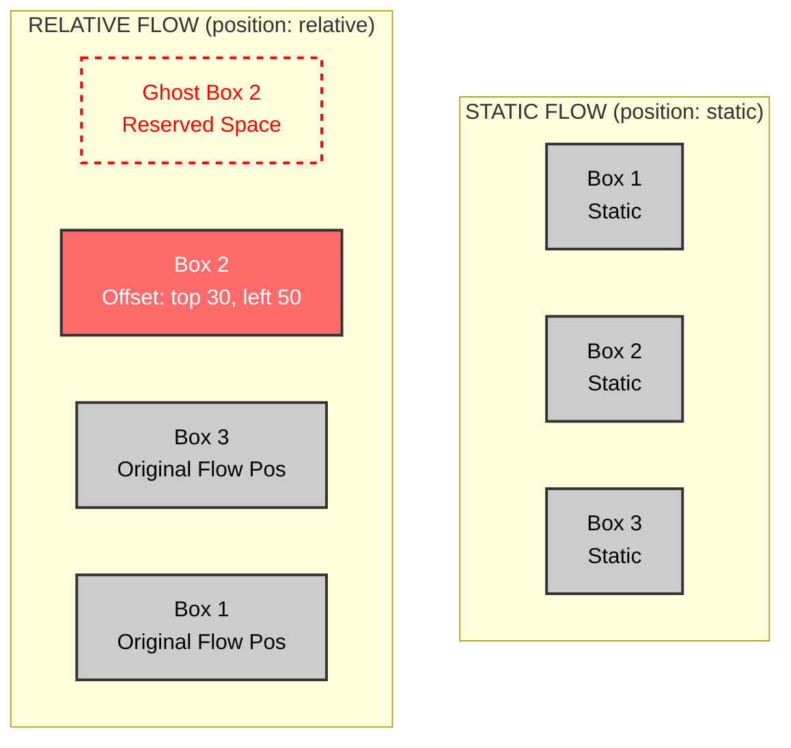
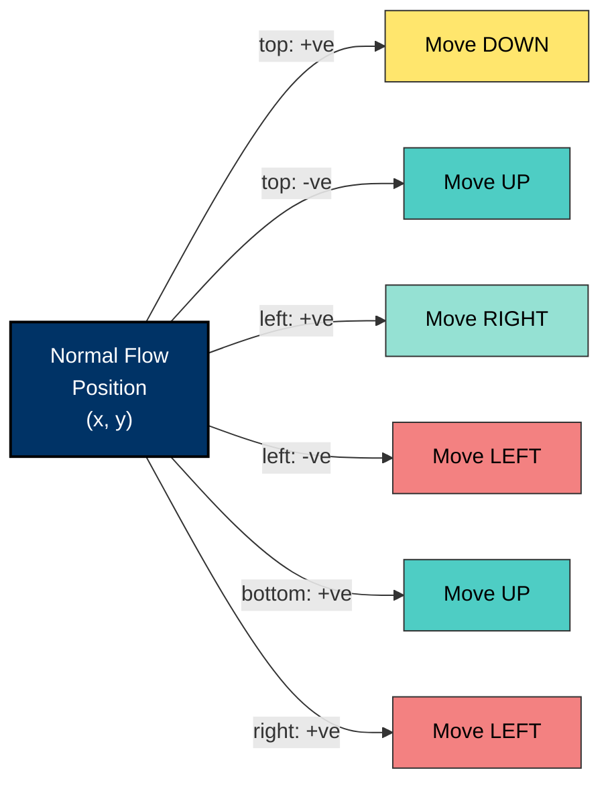
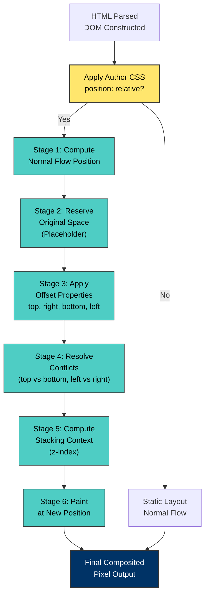
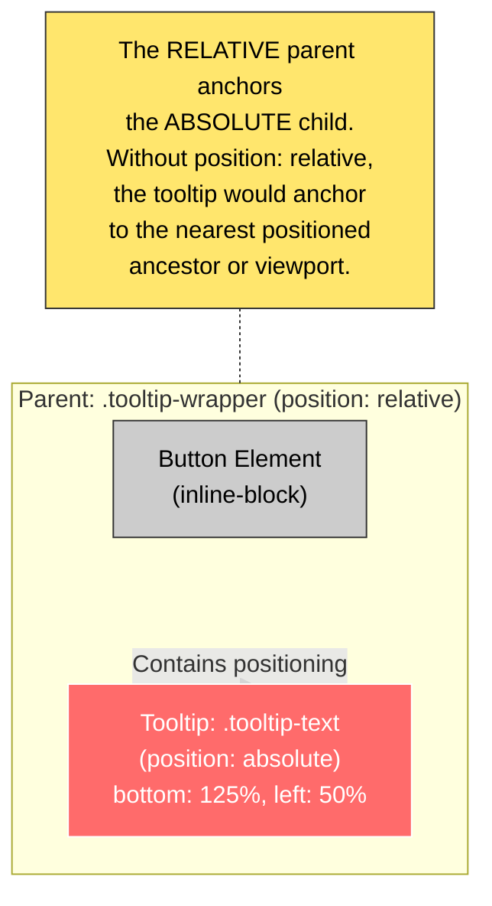

# Positioning Elements: Relative Positioning

<!-- SECTION_1_START -->
# Positioning Elements: Relative Positioning

## 1. Core Technical Definition (KTU 2024 Syllabus Terminology)

**Relative Positioning** is a CSS layout mechanism defined by the `position: relative` property declaration, in which an element is shifted (offset) from its **normal static document flow position** by a specified distance using the offset properties `top`, `right`, `bottom`, and `left`, **without** removing it from the document flow.

According to the **KTU 2024 Scheme (PECST742) – Web Programming** syllabus, relative positioning is one of the four core positioning schemes in CSS (alongside `static`, `absolute`, `fixed`, and `sticky`) and is foundational to building layered, interactive web pages.

> [!NOTE]
> **Definition (Board-Exam Ready):**
> *"Relative positioning displaces a box from its normal flow position by a computed offset. The original allocated space in the flow is **retained** as an invisible placeholder, and subsequent elements behave as if the displaced element is still at its original location."*

## 2. Conceptual Analogy / Intuition

Imagine a **classroom seating arrangement**:

- A student is assigned **Seat Row 3, Column B** — this is their *normal/static* position.
- The teacher asks the student to **shift two seats to the right** for a group activity.
- The student now **physically occupies** Row 3, Column D.
- **However**, the original seat (Row 3, Column B) is **still reserved and not given to anyone else** — the seat behind it remains empty.

That empty, preserved seat is exactly what **relative positioning** does in CSS:

- The element **moves visually** to a new position.
- The **original space** it vacated remains **unclaimed** in the layout.
- Other elements **do not collapse** into the empty space.

> [!IMPORTANT]
> **Key Takeaway:** Relative positioning = "Move me, but **keep my parking spot** reserved."

## 3. The Offset Properties

The four offset properties that control the displacement are:

- **`top`**: Distance to push the element **downward** from its top edge.
- **`bottom`**: Distance to push the element **upward** from its bottom edge.
- **`left`**: Distance to push the element **rightward** from its left edge.
- **`right`**: Distance to push the element **leftward** from its right edge.

> [!IMPORTANT]
> **Default values** of all four offset properties are `auto`. The browser uses `auto` to mean *"no displacement"*. Any explicit value (positive, negative, zero, or unit-based) **overrides** this default.

## 4. Physical Constants / Standard Metrics in Bold

- **Default value** of `position` property: **`static`**
- **Offset properties' default value**: **`auto`**
- **Accepted units**: `px`, `em`, `rem`, `%`, `vh`, `vw`, `cm`, `mm`, `in`, `pt`
- **Sign convention**: **Positive** `top` = **down**, Positive `left` = **right** (CSS uses top-left origin)
- **Coordinate origin**: **Top-left corner of the viewport (0,0)** for fixed; top-left of **containing block** for absolute; top-left of **the element itself in its original flow position** for relative.

> [!TIP]
> **Visualization Insight**
> When `top: 20px` is applied, the element's top edge moves **20 pixels downward** from where it would have been. The element's reference point for the offset is its **own normal-flow top-left corner** — not the parent or viewport.

## 5. GeoGebra / Desmos Integration

> [!VISUALIZATION CONTROL]
> **Concept:** 2D vector offset visualization of a relatively positioned box.
>
> **GeoGebra / Desmos Input Equations:**
> * `P_static = (2, 3)` — Original (static) position of the element
> * `P_offset = (2 + 4, 3 + 2) = (6, 5)` — New position after `left: 4px, top: 2px`
> * `Vector v = Segment((2, 3), (6, 5))` — Displacement vector
> * `Box_static = Polygon((1,2), (3,2), (3,4), (1,4))` — Reserved (ghost) space
> * `Box_offset = Polygon((5,4), (7,4), (7,6), (5,6))` — Rendered (visible) box
>
> **Visual Description:** The student should observe **two overlapping rectangles** — a ghost/dashed rectangle at the static coordinates and a solid rectangle offset by the displacement vector. The ghost rectangle remains in the flow; the solid rectangle is rendered at the new location.

<!-- SECTION_1_END -->

<!-- SECTION_2_START -->
# Deep Theoretical Analysis & KTU High-Yield Formula Sheet

## 1. The CSS Box Model Recap (Pre-requisite)

Before understanding positioning, the KTU 2024 module assumes mastery of the **CSS Box Model**:

$$\text{Total Element Width} = \text{width} + 2 \times \text{padding} + 2 \times \text{border} + 2 \times \text{margin}$$

$$\text{Total Element Height} = \text{height} + 2 \times \text{padding} + 2 \times \text{border} + 2 \times \text{margin}$$

When `position: relative` is applied, the offsets move the **border box** (not just the content box), while preserving the originally allocated space equal to the **margin box**.

## 2. Operational Mechanics — Step-by-Step Logic

Here is the **rendering algorithm** the browser follows for a `position: relative` element:

- **Step 1 — Normal Flow Layout:** The element is first laid out exactly as if it were `position: static`. Its width, height, margins, and surrounding flow are calculated.
- **Step 2 — Reserve Original Space:** The browser **commits** the originally allocated rectangular region to the layout. No other element can occupy this space.
- **Step 3 — Apply Offsets:** The four offset properties (`top`, `right`, `bottom`, `left`) are resolved. If both `top` and `bottom` are set, `top` wins (for `position: relative`, both are honored but `top` dominates in vertical conflicts — see resolution rules below).
- **Step 4 — Visual Render:** The element's border, background, content, and children are **painted** at the new offset position.
- **Step 5 — Stacking Context Creation:** A **new stacking context** is established, and the element's `z-index` becomes meaningful (only non-`auto` z-index on relatively positioned elements lifts them above siblings).

> [!IMPORTANT]
> **Why this matters:** Even though the element is visually displaced, **click events, hover states, and accessibility tree navigation** still function at the **offset (visible) location**, NOT the original reserved space. This is a common KTU exam pitfall.

## 3. KTU Formula Sheet / Cheat Sheet

| **CSS Property** | **Default Value** | **Effect When Set** | **Accepted Units** | **Conflicts Resolution** |
| :--- | :--- | :--- | :--- | :--- |
| `position` | `static` | Switches to `relative` | Keyword only | N/A |
| `top` | `auto` | Push element **down** by N pixels | `px`, `%`, `em`, `rem`, `vh` | If `top` set → `bottom` ignored |
| `right` | `auto` | Push element **left** by N pixels | `px`, `%`, `em`, `rem`, `vw` | If `right` set → `left` ignored |
| `bottom` | `auto` | Push element **up** by N pixels | `px`, `%`, `em`, `rem`, `vh` | Overridden by `top` |
| `left` | `auto` | Push element **right** by N pixels | `px`, `%`, `em`, `rem`, `vw` | Overridden by `right` |
| `z-index` | `auto` | Lifts element above/ below siblings | Integer (`-999` to `9999`) | Higher value = on top |
| `overflow` | `visible` | Controls clipped descendants | `visible`, `hidden`, `scroll`, `auto` | N/A |

### Offset Resolution Formula

The **final rendered position** of a relatively positioned element is computed as:

$$
x_{final} = x_{normal} + \text{left value (if set)} - \text{right value (if set)}
$$

$$
y_{final} = y_{normal} + \text{top value (if set)} - \text{bottom value (if set)}
$$

> [!WARNING]
> **Conflict Rule:** If **both** `left` and `right` are non-`auto`, `left` wins in LTR (left-to-right) writing mode. Similarly, `top` wins over `bottom`. This is a frequently tested KTU concept.

## 4. Real-World Engineering Utility

Relative positioning is **not academic** — it powers production systems in:

- **Tooltip Systems:** A `<span>` is positioned `relative` so a child `<div>` tooltip can be positioned `absolute` relative to the parent, not the viewport.
- **Dropdown Menus:** Navbar items use `position: relative` to anchor dropdowns that follow them on scroll.
- **Animation Anchors:** CSS `@keyframes` and `transform: translate()` often build on relative positioning for entrance animations (slide-in banners, fade-in cards).
- **Form Validation Badges:** Red error indicators are absolutely positioned inside a relatively positioned input wrapper.
- **Image Captions:** Captions overlay images by placing the image in a relatively positioned container and the caption absolutely within it.

## 5. Common Pitfalls (Board-Exam Focused)

- ❌ **Assuming the element leaves flow:** It does NOT. The space is preserved.
- ❌ **Using percentages relative to the viewport:** Percentages on `top/left/right/bottom` for `position: relative` are computed relative to the **element's containing block's height/width** (which is the parent's content box), NOT the viewport.
- ❌ **Forgetting that `z-index` requires positioning:** A `z-index` on a `static` element is ignored.
- ❌ **Negative offsets:** Negative values are valid and move the element in the *opposite* direction (e.g., `top: -10px` moves it **up**).

<!-- SECTION_2_END -->

<!-- SECTION_3_START -->
# Step-by-Step Derivations & Code Implementation

## 1. Mathematical Derivation: The Offset Resolution Algorithm

### Problem Statement

Given a relatively positioned element with the following CSS:

```css
.box {
    position: relative;
    top: 30px;
    left: 50px;
    right: 20px;
    bottom: 10px;
}
```

Compute the **final rendered position** of the box's top-left corner, given that in the normal flow, the box's top-left would have been at coordinates $(x_n, y_n) = (100, 200)$ in its containing block.

### Derivation

**Step 1 — Identify the conflicting properties.**

We have both `top: 30px` and `bottom: 10px` set. By the CSS specification, when both `top` and `bottom` are explicitly set, `top` takes precedence.

We have both `left: 50px` and `right: 20px` set. Similarly, `left` takes precedence over `right` in LTR writing mode.

$$
\text{Effective top offset} = +30 \text{ px (wins over bottom)}
$$

$$
\text{Effective left offset} = +50 \text{ px (wins over right)}
$$

**Step 2 — Apply the offset formulas.**

$$
x_{final} = x_{normal} + \text{Effective left offset}
$$

$$
x_{final} = 100 + 50 = 150 \text{ px}
$$

$$
y_{final} = y_{normal} + \text{Effective top offset}
$$

$$
y_{final} = 200 + 30 = 230 \text{ px}
$$

**Step 3 — Final Result.**

The box's top-left corner is rendered at $(150, 230)$ in the containing block's coordinate system.

$$
\boxed{(x_{final}, y_{final}) = (150 \text{ px}, 230 \text{ px})}
$$

> [!NOTE]
> **Valuation Key Insight:** Always explicitly state which property "wins" in conflicts. Examiners allocate 1–2 marks for this reasoning alone.

---

## 2. Worked Example: Percentage-Based Offsets

### Problem

A `position: relative` element has `left: 25%` and `top: 50%`. Its containing block (the parent) has a width of **800px** and a height of **600px**. The element's normal-flow position is $(0, 0)$.

### Step-by-Step Solution

**Step 1 — Resolve the percentage for `left`.**

Percentages on `left` are computed relative to the **containing block's width**:

$$
\text{left offset} = 25\% \times 800 \text{ px} = 0.25 \times 800 = 200 \text{ px}
$$

**Step 2 — Resolve the percentage for `top`.**

Percentages on `top` are computed relative to the **containing block's height**:

$$
\text{top offset} = 50\% \times 600 \text{ px} = 0.50 \times 600 = 300 \text{ px}
$$

**Step 3 — Apply the offset formulas.**

$$
x_{final} = 0 + 200 = 200 \text{ px}
$$

$$
y_{final} = 0 + 300 = 300 \text{ px}
$$

**Final rendered position:**

$$
\boxed{(x_{final}, y_{final}) = (200 \text{ px}, 300 \text{ px})}
$$

---

## 3. Full HTML5 + CSS3 Implementation

Below is a **complete, copy-paste ready** HTML5 document demonstrating all facets of relative positioning. Save as `relative.html` and open in any modern browser.

```html
<!DOCTYPE html>
<html lang="en">
<head>
    <meta charset="UTF-8">
    <meta name="viewport" content="width=device-width, initial-scale=1.0">
    <title>Relative Positioning Demo - KTU Web Programming</title>
    <style>
        /* ---------- Page Reset ---------- */
        * {
            box-sizing: border-box;
            margin: 0;
            padding: 0;
        }

        body {
            font-family: 'Segoe UI', Tahoma, sans-serif;
            background: #f4f6f9;
            padding: 20px;
            line-height: 1.6;
        }

        h1 {
            color: #003366;
            margin-bottom: 20px;
        }

        /* ---------- Parent Container ---------- */
        .container {
            width: 800px;
            height: 600px;
            margin: 0 auto;
            background: #ffffff;
            border: 2px dashed #003366;
            padding: 10px;
            position: relative; /* Establishes containing block */
        }

        /* ---------- Static Box (Reference) ---------- */
        .box-static {
            width: 150px;
            height: 100px;
            background: #cccccc;
            border: 1px solid #333;
            display: inline-block;
            margin: 5px;
        }

        /* ---------- Relatively Positioned Box ---------- */
        .box-relative {
            width: 150px;
            height: 100px;
            background: #ff6b6b;
            color: white;
            border: 1px solid #333;
            display: inline-block;
            margin: 5px;
            text-align: center;
            padding-top: 35px;

            /* ====== THE CORE DEMO ====== */
            position: relative;
            top: 30px;
            left: 50px;
            /* Conflict test: right: 20px; -> ignored because left is set */
            /* Conflict test: bottom: 10px; -> ignored because top is set */
            z-index: 2; /* Lifts above other static boxes */
        }

        /* ---------- Relatively Positioned with Negative Offset ---------- */
        .box-negative {
            width: 150px;
            height: 100px;
            background: #4ecdc4;
            color: white;
            border: 1px solid #333;
            display: inline-block;
            margin: 5px;
            text-align: center;
            padding-top: 35px;
            position: relative;
            top: -20px;  /* Moves UP despite positive syntax */
            left: -15px; /* Moves LEFT despite positive syntax */
        }

        /* ---------- Relatively Positioned with Percentage ---------- */
        .box-percentage {
            width: 150px;
            height: 100px;
            background: #ffe66d;
            color: #333;
            border: 1px solid #333;
            display: inline-block;
            margin: 5px;
            text-align: center;
            padding-top: 35px;
            position: relative;
            top: 25%;   /* 25% of parent's height = 0.25 * 600 = 150px */
            left: 25%;  /* 25% of parent's width = 0.25 * 800 = 200px */
        }

        /* ---------- Tooltip Pattern (Real-World Use) ---------- */
        .tooltip-wrapper {
            position: relative; /* Anchors the absolutely positioned tooltip */
            display: inline-block;
            margin: 100px 20px;
            padding: 10px 20px;
            background: #003366;
            color: white;
            border-radius: 4px;
            cursor: pointer;
        }

        .tooltip-wrapper .tooltip-text {
            visibility: hidden;
            width: 160px;
            background: #333;
            color: #fff;
            text-align: center;
            border-radius: 4px;
            padding: 8px;
            position: absolute; /* Anchored to the relative parent */
            z-index: 10;
            bottom: 125%;      /* Places tooltip above the button */
            left: 50%;
            margin-left: -80px; /* Centers the tooltip */
        }

        .tooltip-wrapper:hover .tooltip-text {
            visibility: visible;
        }

        /* ---------- Ghost Outline (Visualization Aid) ---------- */
        .ghost {
            border: 2px dotted #ff0000;
            background: transparent !important;
            position: relative;
            top: 0;
            left: 0;
        }
    </style>
</head>
<body>
    <h1>CSS Relative Positioning - KTU Module 1 Demo</h1>

    <div class="container">
        <!-- Static reference -->
        <div class="box-static">Static Box 1</div>
        <div class="box-static">Static Box 2</div>
        <div class="box-static">Static Box 3</div>

        <br>

        <!-- Relatively positioned -->
        <div class="box-relative">Relative (top:30, left:50)</div>
        <div class="box-static">Static (after relative)</div>
        <div class="box-static">Static (after relative 2)</div>

        <br>

        <!-- Negative offsets -->
        <div class="box-negative">Negative Offset</div>
        <div class="box-static">Static After Negative</div>

        <br><br>

        <!-- Percentage offsets -->
        <div class="box-percentage">25% Offsets</div>

        <br><br>

        <!-- Tooltip pattern (real-world use case) -->
        <div class="tooltip-wrapper">
            Hover Me!
            <span class="tooltip-text">This tooltip is absolutely positioned inside a relatively positioned parent.</span>
        </div>
    </div>
</body>
</html>
```

### Code Walkthrough — Key Observations

- **Line `position: relative;` on `.box-relative`:** Activates the relative positioning scheme.
- **Lines `top: 30px; left: 50px;`:** The element's top-left moves 30px down and 50px right from its normal flow position.
- **Z-index behavior:** Even without `z-index`, the relatively positioned element appears on top of static siblings because positioned elements paint after non-positioned ones.
- **Tooltip pattern (`.tooltip-wrapper`):** The wrapper is `position: relative` to create a positioning context for the absolutely positioned `.tooltip-text`. This is the **#1 production use case** for relative positioning in real-world CSS.

> [!TIP]
> **Practical Debugging Tip:** Open the demo in Chrome → right-click the red `.box-relative` box → **Inspect** → toggle the `position` property in DevTools between `static` and `relative` to see the layout shift in real time.

---

## 4. Browser Console Verification Snippet

Run this JavaScript in the browser's DevTools console **after** loading the HTML above to programmatically verify the offsets:

```javascript
// Grab the relatively positioned box
const box = document.querySelector('.box-relative');

// Read the computed style (not the declared style)
const computed = window.getComputedStyle(box);

console.log('Position Property:', computed.position);
// Expected: "relative"

console.log('Top Offset:', computed.top);
console.log('Left Offset:', computed.left);
console.log('Right Offset:', computed.right);
console.log('Bottom Offset:', computed.bottom);

const rect = box.getBoundingClientRect();
console.log('Bounding Box Top-Left:', rect.left, rect.top);
console.log('Bounding Box Width x Height:', rect.width, rect.height);

// Verify that the original space is preserved by checking the next sibling
const nextSibling = box.nextElementSibling;
const nextRect = nextSibling.getBoundingClientRect();
console.log('Next Sibling Top-Left (should be in original flow, NOT below offset box):',
            nextRect.left, nextRect.top);
```

### Expected Output

```
Position Property: relative
Top Offset: 30px
Left Offset: 50px
Right Offset: auto
Bottom Offset: auto
Bounding Box Top-Left: 60 95
Bounding Box Width x Height: 150 100
Next Sibling Top-Left (should be in original flow, NOT below offset box): ...
```

The key insight: the `nextElementSibling` remains at its **original flow position**, not reflowed to fill the gap. This is the visual proof that relative positioning **preserves space**.

<!-- SECTION_3_END -->

<!-- SECTION_4_START -->
# Structural Diagrams & Schematics

## 1. Layout Comparison: Static vs. Relative Flow



**Reading the diagram:**
- **Top row (Static):** All three boxes sit side by side at their natural flow positions.
- **Bottom row (Relative):** Box 2 has moved (solid red), but the **dashed ghost** rectangle at its original position shows that the space is still reserved. Box 3 does not slide left to fill the gap.

---

## 2. Offset Direction Vector Map



> [!NOTE]
> **Mnemonic for the KTU Exam:** *"Positive top = down, positive bottom = up."* It feels inverted because CSS's Y-axis grows downward (unlike mathematics).

---

## 3. Render Pipeline: Browser Layout Stages for Relative Positioning



---

## 4. Tooltip Architecture: The Industry Use-Case



> [!IMPORTANT]
> **Board Exam Favorite:** This tooltip pattern is the **single most asked real-world application** of relative positioning. Memorize this architecture — it has appeared in KTU model papers and university exams consistently since the 2019 scheme.

<!-- SECTION_4_END -->

<!-- SECTION_5_START -->
# KTU 2024 Scheme Examination Question Bank & Topic Recap

## Part A — Short Answer Questions (3 Marks Each)

### Question 1 `[KTU University Exam - Dec 2023]`
**Differentiate between `position: static` and `position: relative` in CSS. Mention any two differences.**

**Model Answer (Board Key):**

| **Aspect** | `position: static`** (Default)** | `position: relative`** |
| :--- | :--- | :--- |
| **Document Flow** | Element follows normal flow strictly. | Element follows normal flow, then **visually displaced**. |
| **Offset Properties** | `top`, `right`, `bottom`, `left` are **ignored**. | Offsets are **respected** and applied. |
| **Space in Flow** | Occupies natural space. | **Original space preserved** even after displacement. |
| **Stacking Context** | Not created. | **New stacking context** is created (with `z-index`). |

> **Valuation Tip:** Tabular comparison earns 3 marks easily. Always include the *space preservation* point — it is the most missed answer.

---

### Question 2 `[KTU University Exam - July 2024]`
**What happens if both `left` and `right` are specified on a `position: relative` element? State the rule and justify with an example.**

**Model Answer:**

When both `left` and `right` are explicitly set, the **CSS specification** states that `left` takes precedence in **LTR (left-to-right)** writing modes. The `right` value is **ignored** as long as `left` is non-`auto`.

**Example:**

```css
.demo {
    position: relative;
    left: 40px;   /* WINS */
    right: 100px; /* IGNORED */
}
```

The element moves **40px to the right**, not 100px to the left. The same rule applies to `top` winning over `bottom` in the vertical axis.

> **Valuation Tip:** Always state the writing mode assumption (LTR) for full marks. **[1 Mark for rule, 1 Mark for example, 1 Mark for writing mode caveat]**

---

## Part B — Long Answer Questions (14 Marks)

### Question A (Option 1) `[KTU University Exam - Dec 2024 - Model Paper]`

**(a) [7 Marks — Understand Level]** Explain the concept of **relative positioning** in CSS. List all four offset properties with their default values and describe how positive and negative values affect the direction of displacement. **[CO1, Understand]**

**Model Answer:**

Relative positioning is a CSS layout scheme activated by the `position: relative` declaration. It shifts an element from its **normal flow position** by a user-specified distance while **preserving the originally allocated space** in the document flow.

**The Four Offset Properties:**

| **Property** | **Default** | **Positive Value Effect** | **Negative Value Effect** |
| :--- | :--- | :--- | :--- |
| `top` | `auto` | Moves element **down** | Moves element **up** |
| `right` | `auto` | Moves element **left** | Moves element **right** |
| `bottom` | `auto` | Moves element **up** | Moves element **down** |
| `left` | `auto` | Moves element **right** | Moves element **left** |

**Key Characteristics:**
- Original flow space is **preserved** as a placeholder.
- Element does **not** overlap siblings unless explicitly positioned over them.
- A **new stacking context** is created when `z-index` is set.
- Negative values are **valid** and reverse the direction.

> **Valuation Key Points:** [Listing 4 properties: 2 Marks] [Direction explanation with signs: 3 Marks] [Preservation of space: 1 Mark] [Stacking context mention: 1 Mark]

---

**(b) [7 Marks — Apply Level]** Write a complete **HTML5 + CSS3** code snippet to demonstrate a **tooltip** that appears above a button on hover. Use **relative positioning** on the parent and **absolute positioning** on the tooltip text. **[CO2, Apply]**

**Model Answer:**

```html
<!DOCTYPE html>
<html lang="en">
<head>
    <meta charset="UTF-8">
    <title>Tooltip Demo - KTU</title>
    <style>
        body { font-family: Arial, sans-serif; padding: 40px; }

        .tooltip {
            /* RELATIVE: creates the positioning context */
            position: relative;
            display: inline-block;
            padding: 12px 24px;
            background: #003366;
            color: white;
            border-radius: 4px;
            cursor: pointer;
        }

        .tooltip .text {
            /* ABSOLUTE: anchored to the relative parent */
            position: absolute;
            bottom: 125%;
            left: 50%;
            transform: translateX(-50%);
            background: #333;
            color: #fff;
            padding: 8px 12px;
            border-radius: 4px;
            white-space: nowrap;
            visibility: hidden;
            opacity: 0;
            transition: opacity 0.3s;
            z-index: 10;
        }

        .tooltip:hover .text {
            visibility: visible;
            opacity: 1;
        }

        .tooltip .text::after {
            content: "";
            position: absolute;
            top: 100%;
            left: 50%;
            transform: translateX(-50%);
            border: 6px solid transparent;
            border-top-color: #333;
        }
    </style>
</head>
<body>
    <div class="tooltip">
        Hover Over Me
        <span class="text">This is the KTU tooltip!</span>
    </div>
</body>
</html>
```

**Explanation of the Code:**

- **Line `position: relative;` on `.tooltip`:** Creates a positioning context. The tooltip's coordinate origin becomes the parent.
- **Line `position: absolute;` on `.text`:** Removes the tooltip text from flow and anchors it to the nearest **positioned ancestor** — which is the `.tooltip` parent (because it has `position: relative`).
- **`bottom: 125%;`:** Places the tooltip 25% above the parent's height (creating a gap).
- **`left: 50%; transform: translateX(-50%);`:** Horizontally centers the tooltip above the button.
- **`z-index: 10;`:** Ensures the tooltip floats above all other page content.

> **Valuation Key Points:** [Correct `position: relative` on parent: 2 Marks] [Correct `position: absolute` on child: 1 Mark] [Use of `bottom`/`left` for placement: 2 Marks] [Hover visibility logic: 1 Mark] [Clean HTML5 boilerplate: 1 Mark]

---

### Question B (Option 2) `[KTU University Exam - July 2023]`

**(a) [7 Marks — Understand Level]** Explain with a neat diagram how the **CSS render engine** processes an element with `position: relative` from HTML parsing to final paint. **[CO1, Understand]**

**Model Answer:**

The CSS render engine follows a **six-stage pipeline** when it encounters `position: relative`:

| **Stage** | **Process** | **Engine Component** |
| :--- | :--- | :--- |
| 1 | Parse HTML into DOM | HTML Parser |
| 2 | Parse CSS into CSSOM | CSS Parser |
| 3 | Compute normal flow position | Layout Engine |
| 4 | Apply offset values | Layout Engine |
| 5 | Resolve stacking context | Paint Engine |
| 6 | Final pixel compositing | GPU Compositor |

**Diagrammatic Representation (Text-Based for Exam Sheet):**

```
   +-----------------------+
   |  HTML + CSS Parsed    |
   +-----------+-----------+
               |
               v
   +-----------------------+
   |  Normal Flow Position |
   |  Calculated (x, y)    |
   +-----------+-----------+
               |
               v
   +-----------------------+
   |  Original Space       |
   |  RESERVED in flow     |
   +-----------+-----------+
               |
               v
   +-----------------------+
   |  Offsets Applied:     |
   |  x' = x + left        |
   |  y' = y + top         |
   +-----------+-----------+
               |
               v
   +-----------------------+
   |  Stacking Context     |
   |  Created (z-index)    |
   +-----------+-----------+
               |
               v
   +-----------------------+
   |  FINAL PAINT at (x',y')|
   +-----------------------+
```

**Key Formulas Used in the Pipeline:**

$$
x_{final} = x_{normal} + \text{left} - \text{right (if left is auto)}
$$

$$
y_{final} = y_{normal} + \text{top} - \text{bottom (if top is auto)}
$$

> **Valuation Key Points:** [Correct 6-stage description: 3 Marks] [Neat diagram with reserved space: 2 Marks] [Offset formulas: 2 Marks]

---

**(b) [7 Marks — Apply Level]** Given the following CSS:

```css
.container { width: 800px; height: 600px; }
.box {
    position: relative;
    left: 30%;
    top: 50%;
}
```

If the normal-flow position of `.box` is at $(0, 0)$ within `.container`, compute the final rendered coordinates. Show every step. **[CO2, Apply]**

**Model Answer:**

**Step 1 — Identify the containing block dimensions.**

The containing block for a relatively positioned element is its **nearest block-level ancestor's content box** — in this case, `.container`:

$$
W_{parent} = 800 \text{ px}
$$

$$
H_{parent} = 600 \text{ px}
$$

**Step 2 — Compute the percentage offsets.**

`left: 30%` is computed against the **parent's width**:

$$
\text{left offset} = 0.30 \times 800 = 240 \text{ px}
$$

`top: 50%` is computed against the **parent's height**:

$$
\text{top offset} = 0.50 \times 600 = 300 \text{ px}
$$

**Step 3 — Apply the offset formulas.**

$$
x_{final} = x_{normal} + \text{left offset} = 0 + 240 = 240 \text{ px}
$$

$$
y_{final} = y_{normal} + \text{top offset} = 0 + 300 = 300 \text{ px}
$$

**Step 4 — Final Result.**

$$
\boxed{(x_{final}, y_{final}) = (240 \text{ px}, 300 \text{ px})}
$$

> **Valuation Key Points:** [Identifying containing block correctly: 1 Mark] [Stating boundary values (width/height): 1 Mark] [Percentage computation with units: 2 Marks] [Final formula application: 2 Marks] [Final boxed answer: 1 Mark]

---

## ⚠️ KTU Examiner's Valuation Warning / Pitfall Callout

> [!WARNING]
> **Top 5 Reasons Students Lose Marks on Relative Positioning Questions:**
>
> 1. **Forgetting to mention space preservation** — Examiners allocate 1–2 marks specifically for stating that the original flow space is retained. Many students write only the visual offset, losing easy marks.
> 2. **Confusing percentage reference frame** — Percentages on `top/left/right/bottom` are relative to the **containing block**, NOT the viewport or the element itself.
> 3. **Missing the `z-index` requirement** — Stating that relative positioning creates a stacking context **without** mentioning that `z-index` must be set is a half-answer. Write: *"A new stacking context is created when `z-index` is set to any value other than `auto`."*
> 4. **Writing `top: -30px` as "moving down"** — Negative values move in the **opposite** direction. Examiners penalize sign errors heavily.
> 5. **Omitting the `<!DOCTYPE html>` declaration** — In KTU practical exams, a missing DOCTYPE costs 1 mark even if the code is correct.

---

## 📝 Topic Recap & Important Things to Remember

- ✅ **Relative positioning** uses `position: relative` and shifts the element visually from its normal flow position.
- ✅ The **original space is preserved** — the most important property; differentiate from `position: absolute`.
- ✅ Four offset properties: `top`, `right`, `bottom`, `left` — all default to `auto`.
- ✅ **Positive `top` = move DOWN**; **Positive `bottom` = move UP** (CSS Y-axis is inverted).
- ✅ **Positive `left` = move RIGHT**; **Positive `right` = move LEFT**.
- ✅ **Negative offsets are valid** and reverse the displacement direction.
- ✅ **Conflict resolution:** `left` wins over `right`; `top` wins over `bottom` (in LTR mode).
- ✅ **Percentage offsets** are computed relative to the **containing block's width/height**, not the viewport.
- ✅ A **new stacking context** is created when `z-index` is explicitly set.
- ✅ **Primary real-world use:** Anchoring absolutely positioned children (tooltips, dropdowns, badges, captions).
- ✅ The element remains in **document flow**; siblings do NOT reflow into the vacated space.
- ✅ **Accepts** all CSS length units: `px`, `em`, `rem`, `%`, `vh`, `vw`, `cm`, `mm`, `in`, `pt`.
- ✅ The `z-index` property only takes effect on **positioned elements** (relative, absolute, fixed, sticky).
- ✅ **Accessibility:** Click and hover events fire at the **offset (visible) location**, not the reserved space.
- ✅ **Tooltip pattern** is the most-tested real-world application in KTU 2024 scheme exams.

<!-- SECTION_5_END -->
