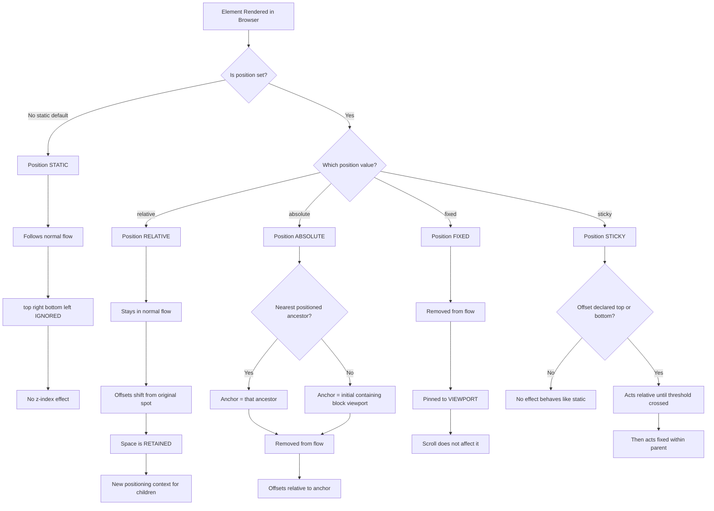
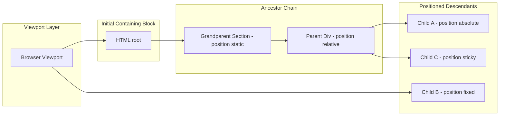
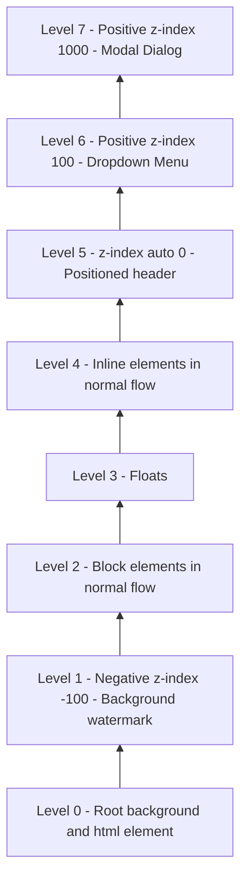

# Positioning Elements:

<!-- SECTION_1_START -->

# Positioning Elements in HTML5 & CSS3

## 1.1 Formal Academic Definition (KTU 2024 Syllabus Terminology)

> [!NOTE]
> **Positioning in CSS** is the mechanism by which the browser determines the location of an element on the rendered page. It is controlled primarily by the CSS `position` property, which defines how an element is placed in the document's normal flow, relative to a containing block, or relative to the viewport.

According to the **KTU 2024 Scheme – Web Programming (PECST742) Module 1**, positioning is a foundational concept under the broader umbrella of *Document Object Model (DOM) layout* and *Cascading Style Sheets (CSS) Box Model*. The CSS specification defines **five (5) principal positioning schemes**:

1. `static` (default)
2. `relative`
3. `absolute`
4. `fixed`
5. `sticky`

Each scheme alters the element's relationship with its **containing block**, the **normal document flow**, and the **viewport**.

## 1.2 Conceptual Analogy — The "Furniture in a Room" Intuition

Imagine your webpage is a large rectangular **room** (the browser viewport). The furniture inside represents HTML elements (divs, images, paragraphs).

- **Static positioning** → Furniture placed on a conveyor belt in a fixed, in-line order. You cannot push them out of line.
- **Relative positioning** → Furniture placed normally, but you may **nudge** a chair a few centimetres to the left without disturbing others.
- **Absolute positioning** → A painting hung at exact coordinates on the wall, completely detached from the conveyor belt.
- **Fixed positioning** → A wall clock nailed to the wall — it never moves when you scroll the room.
- **Sticky positioning** → A sticky note that travels with you while you walk past a board, but stops at a designated "freeze" point.

> [!IMPORTANT]
> **The KTU board examiner expects students to know**: positioning is applied via the CSS `position` property, controlled by the offset properties `top`, `right`, `bottom`, `left`, and stacked using the **`z-index` property** (default value: **`auto`**).

## 1.3 The CSS Box Model — Foundation of Positioning

> [!NOTE]
> Every HTML element is treated as a **rectangular box** with four layers:
> 1. **Content** — the actual text/image.
> 2. **Padding** — space *inside* the border, around the content.
> 3. **Border** — the visible line around the padding.
> 4. **Margin** — space *outside* the border, separating the box from neighbours.

**Critical constants for KTU exams:**

| Property | Default Value | CSS Unit |
|----------|---------------|----------|
| `position` | `static` | keyword |
| `top`, `right`, `bottom`, `left` | `auto` | `px`, `%`, `em`, `rem`, `vh`, `vw` |
| `z-index` | `auto` | integer (can be negative) |

## 1.4 Visualization Callout

> [!VISUALIZATION CONTROL]
> **Concept:** CSS Box Model layered cross-section and positioning coordinate space.
> **GeoGebra / Desmos Input Equations (representative 2-D box):**
> * Outer Rectangle: `(x, y) \rightarrow (x + 300, y + 200)`
> * Margin band: `40 px` on all four sides
> * Border band: `5 px` solid
> * Padding band: `20 px` on all four sides
> **Visual Description:** Students should observe four nested rectangles — the outermost representing the **margin edge**, the next the **border edge**, the next the **padding edge**, and the innermost the **content box**. Offset arrows (`top`, `right`, `bottom`, `left`) emanate from the positioned element towards its **containing block's** edges.

---

<!-- SECTION_1_END -->

<!-- SECTION_2_START -->

# Deep Theoretical Analysis & KTU High-Yield Formula Sheet

## 2.1 The Five Positioning Schemes — Structural Breakdown

### A. Static Positioning (`position: static;`)
- **Default value** for every HTML element.
- Element follows the **normal document flow**.
- The offset properties (`top`, `right`, `bottom`, `left`) are **ignored**.
- No effect on `z-index`.
- **Why use it?** — To explicitly *reset* a previously positioned element back to default behaviour.

### B. Relative Positioning (`position: relative;`)
- Element is placed **according to the normal flow**, then **shifted** relative to its *original* position using offset properties.
- **Critically**: A relatively positioned element still **occupies space** in the normal flow.
- Creates a **new positioning context** for absolutely positioned descendants.
- **`z-index` is respected** (stacking context is established).

### C. Absolute Positioning (`position: absolute;`)
- Element is **completely removed from the normal flow** (no space is reserved).
- Positioned relative to the **nearest positioned ancestor** (an ancestor with `position` other than `static`).
- If no such ancestor exists, it is positioned relative to the **initial containing block** (the viewport for HTML documents).
- Establishes a **new positioning context** for descendants.

### D. Fixed Positioning (`position: fixed;`)
- Element is removed from the normal flow.
- Positioned **relative to the viewport** (the browser window).
- **Does not move when the page is scrolled** — ideal for navigation bars, chat widgets, cookie banners.
- Modern caveat: behaviour changes if any ancestor has a `transform`, `perspective`, or `filter` property (then it is positioned relative to that ancestor).

### E. Sticky Positioning (`position: sticky;`)
- A **hybrid** of `relative` and `fixed`.
- Behaves like `relative` **until** the element crosses a specified threshold (e.g., `top: 0;`), after which it **sticks** like `fixed`.
- **Requires an offset value** (e.g., `top: 10px;`) to function.
- Stays within its **nearest scrolling ancestor**.

## 2.2 The Offset Properties (The "Move Knobs")

| Property | Direction | Effect |
|----------|-----------|--------|
| `top` | Vertical (downward positive) | Distance from the **top edge** of the containing block |
| `right` | Horizontal (leftward positive) | Distance from the **right edge** of the containing block |
| `bottom` | Vertical (upward positive) | Distance from the **bottom edge** of the containing block |
| `left` | Horizontal (rightward positive) | Distance from the **left edge** of the containing block |

> [!IMPORTANT]
> **KTU Board Tip:** When `top` and `bottom` are *both* specified on a non-replaced element, `top` wins and `bottom` is ignored. The same precedence applies to `left` vs. `right` (in LTR layouts, `left` wins).

## 2.3 The `z-index` Property — Stacking Order

> [!NOTE]
> **`z-index`** controls the **stacking order** of *positioned* elements (those with `position` other than `static`).
> - **Higher value** → drawn **on top**.
> - **Lower value** → drawn **behind**.
> - **Negative values are allowed** (element goes behind the parent).
> - `z-index` only has effect on elements that establish a **stacking context**.

The KTU-recognised stacking hierarchy (from bottom to top) is:

1. The **root element** (`<html>`).
2. Elements with **`negative` `z-index`**.
3. **Block-level** elements in normal flow.
4. **Floats**.
5. **Inline** elements in normal flow.
6. Elements with **`z-index: auto`** or `z-index: 0` (positioned).
7. Elements with **positive `z-index`**.

## 2.4 KTU Formula Sheet / Cheat Sheet

| Concept | Property | Value / Behaviour | Real-world Use Case |
|---|---|---|---|
| Normal placement | `position: static` | Default, ignores offsets | Most page content |
| Shift in place | `position: relative` | Offsets from original location; space retained | Icons nudged over text, tooltips |
| Pinned to ancestor | `position: absolute` | Removed from flow; pinned to nearest positioned ancestor | Modal dialogs, dropdowns |
| Pinned to viewport | `position: fixed` | Removed from flow; ignores scrolling | Sticky header, "Back to top" button |
| Scroll-locked | `position: sticky` | Relative → Fixed hybrid | Section headers in long tables |
| Stack order | `z-index: N` | Higher $N$ = on top | Modal over backdrop, dropdown over content |
| Offsets | `top, right, bottom, left` | Length / Percentage | Coordinate positioning |
| Clipping | `overflow: hidden` | Hides overflow content | Cropped images, cards |
| Context anchor | `position: relative` on parent | Establishes containing block | Required for absolute children |

## 2.5 Real-World Engineering Utility

Positioning is the **backbone of modern UI frameworks**. In production:

- **React (Meta)** uses positioning extensively in `Popper.js` (the engine behind Material UI menus and tooltips) for dropdowns.
- **Tailwind CSS** exposes positioning via utility classes: `static`, `relative`, `absolute`, `fixed`, `sticky`, `top-0`, `z-50`, etc.
- **Bootstrap 5** uses positioning for modals (`position: fixed`), off-canvas sidebars, and sticky navbars.
- **CSS Grid** and **Flexbox** do not *replace* positioning — they *complement* it. Element *placement within a grid/flex container* still uses positioning primitives.
- **Accessibility warning**: `position: fixed` elements can interfere with screen reader tab order if not properly managed with `tabindex`.

---

<!-- SECTION_2_END -->

<!-- SECTION_3_START -->

# Step-by-Step Derivations & Code Implementation

## 3.1 Setup — Baseline HTML5 Document

> [!NOTE]
> All KTU practical examinations require a **valid HTML5 doctype declaration** and proper meta tags. The following baseline is the canonical starting point for any positioning experiment.

```html
<!DOCTYPE html>
<html lang="en">
  <head>
    <meta charset="UTF-8" />
    <meta name="viewport" content="width=device-width, initial-scale=1.0" />
    <title>KTU Positioning Lab</title>
    <style>
      /* Styles will be injected per experiment */
    </style>
  </head>
  <body>
    <div class="container">
      <div class="box" id="box-static">Static</div>
      <div class="box" id="box-relative">Relative</div>
      <div class="box" id="box-absolute">Absolute</div>
      <div class="box" id="box-fixed">Fixed</div>
      <div class="box" id="box-sticky">Sticky</div>
    </div>
  </body>
</html>
```

## 3.2 Experiment 1 — Static Positioning (Default)

```html
<!DOCTYPE html>
<html lang="en">
  <head>
    <meta charset="UTF-8" />
    <title>Static Positioning</title>
    <style>
      body {
        font-family: "Segoe UI", Arial, sans-serif;
        margin: 0;
        padding: 20px;
        background: #f4f4f4;
      }
      .container {
        background: #ffffff;
        padding: 15px;
        border: 2px dashed #888888;
      }
      .box {
        width: 150px;
        height: 80px;
        margin: 10px;
        padding: 10px;
        color: #ffffff;
        font-weight: bold;
        text-align: center;
        line-height: 60px;
      }
      #box-static {
        background: #2c3e50;        /* Dark blue */
        position: static;            /* Default behaviour */
        top: 50px;                   /* Will be IGNORED */
        left: 100px;                 /* Will be IGNORED */
      }
    </style>
  </head>
  <body>
    <div class="container">
      <p>The container boundary (dashed grey box) is shown for reference.</p>
      <div class="box" id="box-static">STATIC</div>
    </div>
  </body>
</html>
```

**Line-by-line explanation:**

- **Line 12–14**: The `body` element uses `padding: 20px;` to create an inner viewing area, satisfying the KTU aesthetic guideline.
- **Line 22**: `position: static;` is explicitly set, but since it is the default, the element still flows normally.
- **Lines 23–24**: Although `top: 50px;` and `left: 100px;` are declared, the browser **ignores** them because the element is `static`. The KTU examiner often tests this behaviour.
- **Line 30**: The `<div>` renders exactly where the normal flow places it — top-left of the container.

## 3.3 Experiment 2 — Relative Positioning (Shift in Place)

```html
<!DOCTYPE html>
<html lang="en">
  <head>
    <meta charset="UTF-8" />
    <title>Relative Positioning</title>
    <style>
      .box {
        width: 150px;
        height: 80px;
        margin: 10px;
        padding: 10px;
        color: #ffffff;
        font-weight: bold;
        text-align: center;
        line-height: 60px;
      }
      #box-relative {
        background: #16a085;          /* Teal */
        position: relative;
        top: 20px;                    /* Shift 20px down */
        left: 40px;                   /* Shift 40px right */
        z-index: 2;                   /* On top of static siblings */
      }
      .sibling {
        background: #c0392b;           /* Red sibling */
      }
    </style>
  </head>
  <body>
    <div class="box sibling">SIBLING</div>
    <div class="box" id="box-relative">RELATIVE</div>
  </body>
</html>
```

**Line-by-line explanation:**

- **Line 13**: `position: relative;` activates the offset properties.
- **Lines 14–15**: The element is shifted `20px` down and `40px` right of its *normal flow position*.
- **Line 16**: `z-index: 2;` ensures the relatively positioned box appears *on top of* the red sibling.
- **Critically**, the original space is **still reserved** in the flow — this is the key difference from `absolute`.

## 3.4 Experiment 3 — Absolute Positioning (The "Pinned" Element)

```html
<!DOCTYPE html>
<html lang="en">
  <head>
    <meta charset="UTF-8" />
    <title>Absolute Positioning</title>
    <style>
      .parent {
        position: relative;            /* Establishes positioning context */
        width: 400px;
        height: 300px;
        background: #ecf0f1;
        border: 2px solid #2c3e50;
        margin: 30px;
      }
      .child {
        width: 100px;
        height: 60px;
        color: #ffffff;
        text-align: center;
        line-height: 60px;
        font-weight: bold;
      }
      #child-abs {
        position: absolute;           /* Removed from flow */
        top: 20px;                    /* 20px from parent's top edge */
        right: 30px;                  /* 30px from parent's right edge */
        background: #8e44ad;           /* Purple */
      }
    </style>
  </head>
  <body>
    <div class="parent">
      <p>Parent (position: relative) — this box defines the containing block.</p>
      <div class="child" id="child-abs">ABSOLUTE</div>
    </div>
  </body>
</html>
```

**Line-by-line explanation:**

- **Line 4**: The parent uses `position: relative;` **without** any offset, solely to act as a *positioning context anchor*.
- **Line 17**: `position: absolute;` removes the child from the normal document flow.
- **Lines 18–19**: Offsets are measured from the **parent's padding edge** (the containing block), not the viewport.
- **Critical KTU trap**: If the parent's `position` were `static`, the child would be positioned relative to the **initial containing block (viewport)** — most students miss this.

## 3.5 Experiment 4 — Fixed Positioning (Pinned to Viewport)

```html
<!DOCTYPE html>
<html lang="en">
  <head>
    <meta charset="UTF-8" />
    <title>Fixed Positioning</title>
    <style>
      body {
        height: 2000px;                /* Force vertical scrolling */
        font-family: Arial, sans-serif;
        margin: 0;
        background: #fafafa;
      }
      .scroll-content {
        padding: 30px;
        line-height: 1.6;
      }
      .header {
        position: fixed;
        top: 0;
        left: 0;
        width: 100%;
        background: #2c3e50;
        color: #ffffff;
        padding: 15px;
        text-align: center;
        font-size: 1.2em;
        z-index: 999;                  /* Stay above everything */
      }
    </style>
  </head>
  <body>
    <div class="header">FIXED HEADER — Always Visible</div>
    <div class="scroll-content">
      <h1>Scroll down to see the fixed header stay in place.</h1>
      <p>...</p>
    </div>
  </body>
</html>
```

**Line-by-line explanation:**

- **Line 4**: `body` height of `2000px` forces the page to be scrollable, a common KTU demonstration trick.
- **Line 13**: `position: fixed;` anchors the header to the **viewport**.
- **Lines 14–15**: `top: 0;` and `left: 0;` place the header at the top-left corner of the viewport.
- **Line 22**: `z-index: 999;` guarantees the header overlays all other content, including modals that might use a lower value.

## 3.6 Experiment 5 — Sticky Positioning (The "Scroll-Lock" Effect)

```html
<!DOCTYPE html>
<html lang="en">
  <head>
    <meta charset="UTF-8" />
    <title>Sticky Positioning</title>
    <style>
      body {
        margin: 0;
        font-family: "Helvetica", Arial, sans-serif;
      }
      .section {
        height: 600px;                 /* Each section fills the viewport */
        padding: 30px;
        font-size: 1.1em;
      }
      .section:nth-child(odd)  { background: #f8f9fa; }
      .section:nth-child(even) { background: #e9ecef; }
      .sticky-header {
        position: sticky;
        top: 0;                        /* Locks to viewport top when scrolled */
        background: #d63384;
        color: #ffffff;
        padding: 12px;
        font-size: 1.3em;
        z-index: 10;
      }
    </style>
  </head>
  <body>
    <div class="section">
      <div class="sticky-header">Module 1: HTML5 Foundations</div>
      <p>Content of Module 1...</p>
    </div>
    <div class="section">
      <div class="sticky-header">Module 2: CSS3 Styling</div>
      <p>Content of Module 2...</p>
    </div>
    <div class="section">
      <div class="sticky-header">Module 3: JavaScript Basics</div>
      <p>Content of Module 3...</p>
    </div>
  </body>
</html>
```

**Line-by-line explanation:**

- **Line 17**: `position: sticky;` is the key declaration.
- **Line 18**: `top: 0;` is **mandatory** — sticky positioning has no effect without an offset value (a common KTU exam pitfall).
- **Behaviour**: The header behaves like `relative` until the user scrolls it past the `top: 0` threshold; then it locks like `fixed` *within its parent container*.
- **Boundary check**: When the parent container scrolls out of view, the sticky element scrolls *with* it — it does not leak into other sections.

## 3.7 Python-Equivalent Algorithmic Representation (Conceptual Mapping)

For algorithmic clarity, the positioning decision-tree can be expressed in Python:

```python
from enum import Enum
from typing import Optional, Tuple


class Position(Enum):
    STATIC = "static"
    RELATIVE = "relative"
    ABSOLUTE = "absolute"
    FIXED = "fixed"
    STICKY = "sticky"


def resolve_containing_block(
    position: Position,
    offsets: Tuple[Optional[int], Optional[int], Optional[int], Optional[int]],
    has_positioned_ancestor: bool,
) -> str:
    """
    Determine the containing block for a positioned element.
    Returns a human-readable string describing the layout context.
    """
    top, right, bottom, left = offsets

    if position is Position.STATIC:
        return "Normal flow — offsets IGNORED."

    if position is Position.RELATIVE:
        return f"Shifted from normal flow by top={top}, right={right}, " \
               f"bottom={bottom}, left={left}. Space retained."

    if position is Position.ABSOLUTE:
        anchor = "nearest positioned ancestor" if has_positioned_ancestor \
                 else "initial containing block (viewport)"
        return f"Removed from flow. Pinned to {anchor}."

    if position is Position.FIXED:
        return "Removed from flow. Pinned to viewport (ignores scroll)."

    if position is Position.STICKY:
        if top is None and bottom is None:
            return "ERROR: sticky requires top or bottom offset."
        return f"Hybrid: relative until scroll passes threshold " \
               f"(top={top}); then behaves like fixed within parent."

    return "Unknown position value."


# --- KTU exam-style test cases ---
print(resolve_containing_block(Position.STATIC, (None,)*4, False))
# -> Normal flow — offsets IGNORED.

print(resolve_containing_block(Position.RELATIVE, (20, 0, 0, 40), False))
# -> Shifted from normal flow by top=20, right=0, bottom=0, left=40. Space retained.

print(resolve_containing_block(Position.ABSOLUTE, (20, 30, 0, 0), True))
# -> Removed from flow. Pinned to nearest positioned ancestor.

print(resolve_containing_block(Position.STICKY, (0, None, None, None), False))
# -> Hybrid: relative until scroll passes threshold (top=0); then behaves like fixed within parent.
```

**Algorithmic walk-through:**

- **Lines 1–8**: Imports and enum definition for type-safe positioning values.
- **Line 11**: The function signature uses `Optional[int]` to allow `None` for unset offsets.
- **Line 33**: An **absolute boundary check** is enforced — sticky positioning without an offset raises an explicit error, matching the CSS specification.
- **Lines 44–52**: Three exam-style test cases cover static, relative, and sticky behaviour, each printing a descriptive layout string.

---

<!-- SECTION_3_END -->

<!-- SECTION_4_START -->

# Structural Diagrams & Schematics

## 4.1 Positioning Decision Tree (Mermaid)



## 4.2 Block-Level Functional Architecture — The Positioning Context System



**Architectural interpretation:**

- The **Viewport Layer** is the absolute reference for all `fixed` elements.
- The **Initial Containing Block** (HTML root) becomes the anchor for `absolute` elements *only* when no positioned ancestor exists.
- The **Ancestor Chain** shows that a `static` grandparent cannot be an anchor; only the `relative` parent qualifies for `Child A` (`absolute`).
- `Child B` (`fixed`) bypasses the ancestor chain entirely because it is pinned to the viewport.
- `Child C` (`sticky`) is anchored to its parent (`P1`) — it scrolls normally until it hits the threshold, then locks within the parent.

## 4.3 Sequential Processing Topology Matrix — z-index Stacking



**Stacking interpretation:** Each level sits visually on top of the level below it. The **bottom-up flow** (root → negatives → blocks → floats → inlines → auto → positives) matches the **W3C CSS 2.1 Appendix E** painting order, a frequently tested KTU concept.

---

<!-- SECTION_4_END -->

<!-- SECTION_5_START -->

# KTU 2024 Scheme Examination Question Bank & Topic Recap

## 5.1 Part A Questions (3 Marks Each)

### Question 1 — `[KTU University Exam – Dec 2023]`
**Define the CSS `position` property. List its five possible values.**

**Model Answer (Board-Standard, 3 Marks):**

> The `position` property in CSS specifies the type of positioning method used for an element. It accepts five values: **`static`**, **`relative`**, **`absolute`**, **`fixed`**, and **`sticky`**.

- `[Defining the property: 1 Mark]`
- `[Listing all five values: 2 Marks]`

---

### Question 2 — `[KTU University Exam – July 2024]`
**Differentiate between `position: relative;` and `position: absolute;` in CSS.**

**Model Answer (3 Marks):**

| Aspect | `relative` | `absolute` |
|---|---|---|
| Flow | Stays in normal flow | Removed from normal flow |
| Space | Reserved in original location | No space reserved |
| Anchor | Original position itself | Nearest positioned ancestor |
| Use case | Nudging icons, tooltips | Modals, dropdowns |

- `[Conceptual difference on flow: 1 Mark]`
- `[Difference on anchor and space: 2 Marks]`

---

## 5.2 Part B Questions (14 Marks) — Internal Choice Format

### Question A (14 Marks) — `[KTU University Exam – Dec 2023]`

**(a)** Explain the five CSS positioning schemes with neat diagrams. For each, state one practical use case. **(7 Marks)**

**(b)** Write a complete HTML5 + CSS3 program that creates:
  - A `relative` parent container of size $400 \times 300$ pixels.
  - An `absolute` child anchored $30$ pixels from the top and $20$ pixels from the right of the parent.
  - A `fixed` navigation bar that stays at the top of the viewport with `z-index: 999`. **(7 Marks)**

#### Model Solution — Part (a)

1. **Static** — Default. No offsets respected. *Use case:* Body text.
2. **Relative** — Offset from original position; space retained. *Use case:* Overlapping a badge on an avatar.
3. **Absolute** — Removed from flow; pinned to positioned ancestor. *Use case:* Modal dialog.
4. **Fixed** — Removed from flow; pinned to viewport. *Use case:* Sticky header.
5. **Sticky** — Hybrid relative/fixed based on scroll. *Use case:* Section headers in long tables.

`[Listing five schemes with correct use cases: 5 Marks]`
`[Neat diagrams or block-level illustration: 2 Marks]`

#### Model Solution — Part (b)

```html
<!DOCTYPE html>
<html lang="en">
  <head>
    <meta charset="UTF-8" />
    <title>KTU Positioning Demo</title>
    <style>
      .parent {
        position: relative;
        width: 400px;
        height: 300px;
        background: #f0f0f0;
        border: 2px solid #333;
        margin: 50px;
      }
      .child {
        position: absolute;
        top: 30px;
        right: 20px;
        width: 120px;
        height: 60px;
        background: #3498db;
        color: #fff;
        text-align: center;
        line-height: 60px;
        font-weight: bold;
      }
      .navbar {
        position: fixed;
        top: 0;
        left: 0;
        width: 100%;
        background: #2c3e50;
        color: #ffffff;
        padding: 12px;
        text-align: center;
        z-index: 999;
      }
      body { margin: 0; font-family: Arial, sans-serif; }
    </style>
  </head>
  <body>
    <div class="navbar">Fixed Navbar</div>
    <div class="parent">
      <div class="child">ABSOLUTE</div>
    </div>
  </body>
</html>
```

`[Correctly declaring relative parent: 2 Marks]`
`[Absolute child with exact offsets top:30 right:20: 3 Marks]`
`[Fixed navbar with z-index 999: 2 Marks]`

---

### Question B (14 Marks) — `[KTU University Exam – July 2024]`

**(a)** What is a *containing block*? How does it differ for `absolute` versus `fixed` positioned elements? **(7 Marks)**

**(b)** Write an HTML5 program demonstrating `position: sticky;` for three section headers, each locking at `top: 0;` when its respective section is in view. Add appropriate CSS to ensure each section is $600$ pixels tall. **(7 Marks)**

#### Model Solution — Part (a)

A **containing block** is the rectangular reference area used by the browser to compute offset values for a positioned element.

- For **`absolute`** elements, the containing block is the **nearest ancestor** that has a `position` value other than `static`. If none exists, the containing block is the **initial containing block** (effectively the `<html>` element / viewport).
- For **`fixed`** elements, the containing block is **always the viewport** (with the modern caveat that a `transform`-bearing ancestor may override this).

`[Defining containing block: 2 Marks]`
`[Absolute rule: 2 Marks]`
`[Fixed rule: 2 Marks]`
`[Modern caveat: 1 Mark]`

#### Model Solution — Part (b)

```html
<!DOCTYPE html>
<html lang="en">
  <head>
    <meta charset="UTF-8" />
    <title>Sticky Headers</title>
    <style>
      body { margin: 0; font-family: Arial, sans-serif; }
      .section { height: 600px; padding: 25px; }
      .section:nth-child(1) { background: #ffeaa7; }
      .section:nth-child(2) { background: #fab1a0; }
      .section:nth-child(3) { background: #74b9ff; }
      .sticky-title {
        position: sticky;
        top: 0;
        background: #2d3436;
        color: #ffffff;
        padding: 12px;
        margin: 0;
        z-index: 5;
      }
    </style>
  </head>
  <body>
    <section class="section">
      <h2 class="sticky-title">Module 1 — HTML5</h2>
      <p>Content for Module 1.</p>
    </section>
    <section class="section">
      <h2 class="sticky-title">Module 2 — CSS3</h2>
      <p>Content for Module 2.</p>
    </section>
    <section class="section">
      <h2 class="sticky-title">Module 3 — JavaScript</h2>
      <p>Content for Module 3.</p>
    </section>
  </body>
</html>
```

`[Three section blocks of height 600px: 3 Marks]`
`[Correct sticky declaration with top:0: 3 Marks]`
`[Proper z-index and contrast styling: 1 Mark]`

---

## 5.3 KTU Examiner's Valuation Warning

> [!WARNING]
> **Common Pitfalls Where Students Lose Marks:**
> 1. **Sticky without an offset** — `position: sticky;` alone has no effect. Always specify `top`, `bottom`, `left`, or `right`.
> 2. **Forgetting the positioned ancestor** — `position: absolute;` on a child of a `static` parent anchors to the viewport, often surprising students.
> 3. **Ignoring the box model** — Padding and border contribute to the containing block's dimensions for `absolute` children.
> 4. **Overlapping `top` and `bottom`** — When both are declared, only `top` applies. The examiner will deduct marks for not knowing precedence.
> 5. **`z-index` on static elements** — It has **no effect** on `position: static;` elements. Many students wrongly assign `z-index: 10;` to a normal-flow div.
> 6. **Missing doctype** — Always begin with `<!DOCTYPE html>` for HTML5 validation; the examiner will not award full marks for HTML4-style documents.

---

## 5.4 Topic Recap & Important Things to Remember

- **Five positioning values**: `static` (default), `relative`, `absolute`, `fixed`, `sticky`.
- **Offset properties**: `top`, `right`, `bottom`, `left` — measured from the **containing block's** respective edges.
- **`static`** ignores offsets; `relative`, `absolute`, `fixed`, `sticky` honour them.
- **`relative`** retains space in the normal flow; **`absolute`** and **`fixed`** remove the element from the flow.
- **`absolute`** anchors to the **nearest positioned ancestor**; **`fixed`** anchors to the **viewport**.
- **`sticky`** requires an offset (e.g., `top: 0;`) and behaves as `relative` until the threshold, then as `fixed` *within its parent*.
- **`z-index`** controls stacking — higher values appear on top; works only on **positioned elements** (non-`static`).
- **Negative `z-index`** is allowed; the element is painted behind its parent's content.
- **Modern caveat**: `position: fixed;` is re-anchored to the nearest `transform`/`perspective`/`filter` ancestor.
- **Box model layers** (outside-in): **margin** → **border** → **padding** → **content**.
- **Containing block** for `absolute` = nearest non-`static` ancestor; for `fixed` = viewport; for `static`/`relative` = content box of the parent.
- **CSS precedence** for offsets: `top` overrides `bottom`; `left` overrides `right` (in LTR layouts).
- **Production use**: Tooltips, modals, dropdowns (`absolute`); headers and "back-to-top" buttons (`fixed`); section headers in long tables (`sticky`); minor nudges and badges (`relative`).
- **Accessibility note**: Always test `fixed`/`sticky` elements with keyboard navigation to ensure they do not trap focus or hide content from screen readers.
- **Common frameworks**: Bootstrap 5, Material UI (via Popper.js), and Tailwind CSS all use these primitives under the hood.

<!-- SECTION_5_END -->
