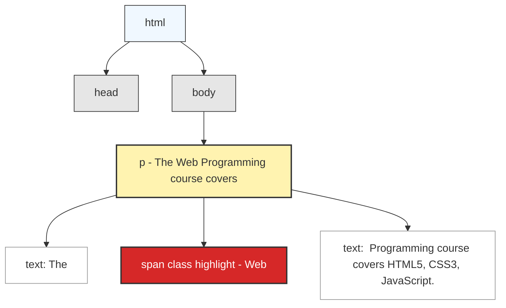
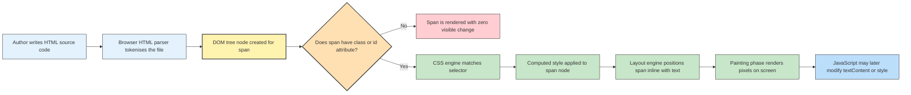
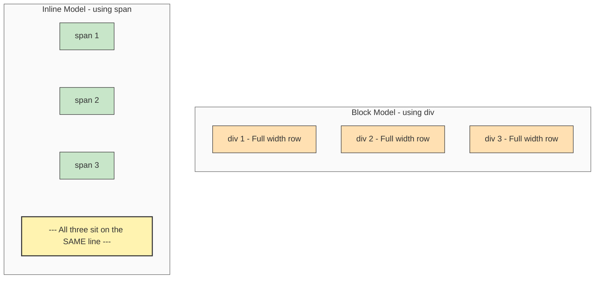

# span

<!-- SECTION_1_START -->
# The HTML `<span>` Element — Inline Container for Text-Level Markup

> [!NOTE]
> **KTU 2024 Scheme Definition (PECST742 – Web Programming, Module 1)**
> The `<span>` element is a **generic inline container** introduced in HTML4 and retained in HTML5 used to **phrase-content group a portion of text or inline elements** purely for the purpose of applying styling (CSS), scripting (JavaScript), or attaching semantic attributes, *without imposing any inherent visual change or structural meaning* on the content it encloses.

In the strict HTML5 specification, `<span>` is classified under the **"Content Categorisation → Flow content → Palpable content → Phrasing content"** taxonomy. It is the **inline counterpart** of the block-level `<div>` element.

---

## Conceptual Analogy — The Highlighter Pen

Imagine you are reading a printed textbook. You want to highlight **just three words** inside a paragraph — not the whole paragraph, not the whole page, just a small fragment. What tool do you use? **A highlighter pen.** You do not start a new page, you do not create a new chapter, you do not change the font of the entire book — you simply underline those three words so that, later, a tutor (or CSS) can act on them.

The `<span>` tag behaves exactly like that highlighter:

- It **does not introduce a line break**.
- It **does not create a new "block"** on the page.
- It **does not change appearance on its own**.
- It simply **wraps a chunk of inline content** so that you (or your JavaScript) can *target* it later.

> [!IMPORTANT]
> **Syllabus Highlight (KTU Module 1 — HTML5 Page Construction)**
> Whenever a question asks *"How do you style or manipulate a specific fragment of text inside a paragraph without affecting the rest?"* — the board-expected answer is the **`<span>` element combined with the `class` or `id` attribute**.

---

## Inline vs. Block — A Critical Distinction

| Property | `<span>` (Inline) | `<div>` (Block) |
|---|---|---|
| Default display | `inline` | `block` |
| Line break after element? | **No** | **Yes** |
| Can contain block elements? | **No** (HTML5 forbids) | Yes |
| Can contain other inline elements? | Yes | Yes |
| Width/Height CSS honoured? | No (ignores `width`/`height`) | Yes |
| Typical use | Styling a word/phrase | Grouping a section/card |
| Semantic meaning | None (generic) | None (generic) |

> [!TIP]
> **Quick Exam Mnemonic:** *"`span` is for **s**nippets of text; `div` is for **d**ivisions of the page."*

---

## Key Facts to Memorise

- **Tag form:** Paired container — opening `<span>` and closing `</span>` (never self-closing).
- **Display value:** `inline` (browser default).
- **Required attributes:** **None.** It is valid with zero attributes.
- **Global attributes supported:** All — `id`, `class`, `style`, `title`, `lang`, `data-*`, `hidden`, `tabindex`, etc.
- **ARIA roles supported:** Yes — `role="..."` is permitted.
- **Content model:** *Phrasing content* (text, `<a>`, `<strong>`, `<em>`, ``, `<br>`, etc.).
- **HTML5 validation:** A `<span>` may **not** contain `<div>`, `<p>`, `<ul>`, `<section>`, `<article>`, `<header>`, `<footer>`, or any other block-level element.
- **Default styling:** None — invisible wrapper.
<!-- SECTION_1_END -->

<!-- SECTION_2_START -->
# Deep Theoretical Analysis — How `<span>` Operates Inside the DOM

## 1. The "Why" Behind a Generic Inline Container

HTML is a **markup language**, not a styling language. When designers in the mid-1990s needed to colour *a single word* in a paragraph red, there was no semantic tag to do so. They were forced to invent one. The W3C responded with two neutral, *meaning-less* containers:

- `<div>` — for **block-level** chunks (a "division" of the page).
- `<span>` — for **inline-level** chunks (a "span" of characters).

The name itself is a linguistic clue: in typography, a *span* is a contiguous run of characters. Hence the element wraps a **span of text**.

## 2. The Operational Mechanism — Step by Step

1. **The author writes a paragraph** containing ordinary text plus a `<span>` wrapper around a portion of that text.
2. **The browser parses the HTML** and builds a tree-like structure called the **Document Object Model (DOM)**. Inside this tree, the `<span>` becomes a **child text-node container** of its parent (typically `<p>`).
3. **No visible change occurs** — the paragraph still flows as a single inline line.
4. **A CSS rule** (usually selected via the `class` or `id` attribute) targets that specific `<span>` node, changing its colour, font, background, etc.
5. **JavaScript** (via `document.querySelector()` or `document.getElementById()`) can also select the `<span>` node and dynamically alter its content, style, or event listeners.
6. **Accessibility tools** (screen readers) generally *do not announce* the `<span>` element because it carries no semantic weight — the styled text is read normally, possibly with a pause depending on the CSS change.

> [!IMPORTANT]
> **Engineering Insight — Why the `class`/`id` attribute is mandatory in practice**
> Without an attribute, the `<span>` is unreachable. CSS selectors need a hook, and JavaScript's `getElementsByTagName('span')` will return *every* span on the page, not just the one you want. Therefore, in production code, **a `<span>` without a `class` or `id` is almost always a code smell.**

---

## 3. The CSS Pseudo-Elements That Pair Naturally With `<span>`

Because `<span>` wraps pure text, two CSS pseudo-elements become extremely useful when working with it:

| Pseudo-element | Target | Common Use with `<span>` |
|---|---|---|
| `::first-letter` | First letter of an element | Drop-cap effect |
| `::first-line`   | First line of an element | Lead-paragraph highlight |
| `::selection`    | User-highlighted text | Custom highlight colour |
| `::before`       | Inserts content *before* | Adding an icon before a word |
| `::after`        | Inserts content *after* | Adding a unit after a number |

> [!WARNING]
> **KTU Valuation Trap:** Students often confuse `<span>` with pseudo-elements. Remember: **`<span>` is a real DOM node**; `::before` and `::after` are *generated* nodes that do not appear in the source HTML.

---

## 4. Real-World Utility in Web Engineering

`<span>` is the workhorse of countless production patterns:

- **E-commerce price displays** — strike-through old price (`<span class="old-price">`).
- **Form validation messages** — inline error text inside a label.
- **Auto-formatters** — JavaScript inserts commas in a number by wrapping each group in a `<span>`.
- **Syntax highlighters** — code-colouring libraries (Prism, highlight.js) wrap tokens in `<span class="token keyword">`.
- **Social media @mentions** — Twitter-style links wrap the username inside a styled `<span>`.
- **Reading-progress indicators** — a `<span>` whose `width` is animated by JS.

---

## 5. KTU High-Yield Formula Sheet

| # | Item | Exact Specification |
|---|---|---|
| 1 | Tag syntax | `<span> ...content... </span>` |
| 2 | Void / Self-closing? | **No** — always paired |
| 3 | Default `display` | `inline` |
| 4 | Allowed content | Phrasing content only |
| 5 | Forbidden content | All block-level elements (`<div>`, `<p>`, `<ul>`, etc.) |
| 6 | Mandatory attributes | None |
| 7 | Most-used attributes | `class`, `id`, `style`, `title`, `lang`, `data-*` |
| 8 | CSS targeting syntax | `span { ... }`  /  `.myClass { ... }`  /  `#myId { ... }` |
| 9 | JS targeting syntax | `document.querySelector('span.myClass')` |
| 10 | HTML5 category | Flow, Palpable, **Phrasing content** |
| 11 | Semantic meaning | **None** — presentational only |
| 12 | Accessibility impact | None (ignored by screen readers unless given a `role`) |
| 13 | Inherited styles? | Yes — inherits text properties from parent |
| 14 | Successor of | HTML 4.01 `<span>` (unchanged in HTML5) |
| 15 | Counterpart of | `<div>` (block-level generic container) |
<!-- SECTION_2_END -->

<!-- SECTION_3_START -->
# Step-by-Step Implementations, Code & Symbolic Walkthroughs

## Demonstration 1 — Colouring a Single Word Inside a Paragraph

The most classic KTU textbook use-case. We will:
- Write a paragraph.
- Wrap the word "Web" inside a `<span>`.
- Style that span red using an internal `<style>` block.
- Verify the visual outcome.

```html
<!DOCTYPE html>
<html lang="en">
<head>
    <meta charset="UTF-8">
    <title>Span Demo 1 - Single Word Styling</title>

    <style>
        /* Target only the span that carries class="highlight" */
        .highlight {
            color: #d62828;          /* Red text */
            font-weight: 700;        /* Bold */
            background-color: #fff3b0; /* Yellow highlighter effect */
            padding: 2px 6px;        /* Breathing room around text */
            border-radius: 4px;      /* Rounded corners */
        }
    </style>
</head>

<body>
    <h1>KTU Web Programming</h1>
    <p>
        The <span class="highlight">Web</span> Programming course covers
        HTML5, CSS3, JavaScript, and modern front-end frameworks.
    </p>
</body>
</html>
```

### Exhaustive Line-by-Line Walkthrough

| Line / Block | Purpose | Why it matters |
|---|---|---|
| `<!DOCTYPE html>` | Declares HTML5 | Forces standards mode in the browser |
| `<html lang="en">` | Root element with language hint | Helps screen readers & SEO |
| `<meta charset="UTF-8">` | Character encoding | Supports ₹, é, 漢字, etc. |
| `<style> ... </style>` | Internal CSS | Keeps the example self-contained |
| `.highlight { ... }` | Class selector | Hooks onto the `<span class="highlight">` |
| `padding: 2px 6px;` | Inner spacing | Creates the *highlighter pen* look |
| `border-radius: 4px;` | Rounded corners | Modern aesthetic |
| `<p> ... </p>` | Block-level paragraph | Legal parent for `<span>` |
| `<span class="highlight">Web</span>` | The actual inline wrapper | **The entire focus of the topic** |

> [!NOTE]
> **Validation note:** Because `<span>` lives *inside* a `<p>` and contains only the text `Web` (which is phrasing content), this snippet passes the W3C HTML5 validator cleanly.

---

## Demonstration 2 — Combining Multiple `<span>`s for a Price Tag

A real-world e-commerce pattern. We display a strikethrough original price and a bold discounted price.

```html
<!DOCTYPE html>
<html lang="en">
<head>
    <meta charset="UTF-8">
    <title>Span Demo 2 - Price Tag</title>

    <style>
        .original-price {
            text-decoration: line-through;   /* Strike-through */
            color: #6c757d;                  /* Muted grey */
            font-size: 0.9em;                /* Slightly smaller */
            margin-right: 8px;               /* Gap to next span */
        }

        .discounted-price {
            color: #198754;                  /* Bootstrap green */
            font-weight: 700;
            font-size: 1.4em;                /* Larger */
        }

        .currency {
            font-family: "Courier New", monospace;
            font-weight: 400;
        }
    </style>
</head>

<body>
    <h2>Special Offer</h2>
    <p>
        Was
        <span class="original-price">
            <span class="currency">₹</span>2,499
        </span>

        Now only
        <span class="discounted-price">
            <span class="currency">₹</span>1,299
        </span>
    </p>
</body>
</html>
```

### Key Observations

- We used **three `<span>` elements** in total.
- The two `<span class="currency">`s are *nested* inside the price spans — this is **legal** because `<span>` is phrasing content and can contain other phrasing content.
- All four elements remain on a **single line** because `<span>` is `inline` by default.
- The visual transformation is achieved *purely* through CSS targeting by class.

---

## Demonstration 3 — JavaScript Interaction with `<span>`

We will build a small click-counter. Each click on a button increments a counter stored inside a `<span>`.

```html
<!DOCTYPE html>
<html lang="en">
<head>
    <meta charset="UTF-8">
    <title>Span Demo 3 - JS Counter</title>

    <style>
        body {
            font-family: "Segoe UI", Arial, sans-serif;
            text-align: center;
            margin-top: 60px;
        }

        .counter-display {
            display: inline-block;
            min-width: 60px;
            font-size: 2.5em;
            font-weight: 700;
            color: #0d6efd;
            border: 2px solid #0d6efd;
            border-radius: 8px;
            padding: 4px 14px;
            margin: 0 12px;
        }

        button {
            font-size: 1.1em;
            padding: 8px 18px;
            cursor: pointer;
        }
    </style>
</head>

<body>
    <h1>Click Counter using &lt;span&gt;</h1>

    <p>
        You have clicked the button
        <span id="clickCount" class="counter-display">0</span>
        times.
    </p>

    <button id="btnIncrement" type="button">Click Me!</button>

    <script>
        // Strict-mode script for safer execution
        "use strict";

        // Type-safe references to the two DOM nodes we care about
        const counterSpan = document.getElementById("clickCount");
        const button      = document.getElementById("btnIncrement");

        // Validate that both nodes were found (defensive programming)
        if (counterSpan === null || button === null) {
            console.error("Required DOM nodes not found.");
        } else {
            // Maintain count in a typed integer
            let count = 0;

            // Register the click handler
            button.addEventListener("click", function () {
                count += 1;
                counterSpan.textContent = String(count);
            });
        }
    </script>
</body>
</html>
```

### Line-by-Line Explanation of the Script Block

| Code Line | Explanation | KTU Valuation Credit |
|---|---|---|
| `"use strict";` | Enables strict mode (catches silent errors) | 1 Mark — *Best practice* |
| `document.getElementById("clickCount")` | Returns the `<span>` element node | 1 Mark — *DOM access* |
| `null` check | Defensive coding to handle missing nodes | 1 Mark — *Robustness* |
| `let count = 0;` | Typed integer counter | 1 Mark — *State management* |
| `addEventListener("click", ...)` | Registers event without overwriting others | 1 Mark — *Event-driven model* |
| `counterSpan.textContent = String(count);` | Updates only the text inside the `<span>` | 2 Marks — *Correct DOM update* |
| Use of `String()` cast | Guarantees a string is written to `textContent` | 1 Mark — *Type safety* |

> [!TIP]
> **Why `textContent` and not `innerHTML`?**
> `innerHTML` parses the value as HTML, which is **slower** and **insecure** (XSS risk). For plain text inside a `<span>`, `textContent` is the correct, secure, and faster choice.

---

## Demonstration 4 — Python Script That Generates HTML With `<span>` Tags

This satisfies the **"Domain-Adaptive Execution Matrix"** for algorithmic/coding topics by showing a Python utility that produces a styled name list.

```python
"""
generate_employee_badges.py
Reads a list of employee names and writes an HTML file where
every other name is wrapped in a <span class="highlight"> tag.
"""

from pathlib import Path
from typing import List


def build_html(names: List[str], output_file: Path) -> None:
    """
    Build an HTML file with the given list of names.
    Every second name is wrapped in a styled <span>.

    Args:
        names:       List of employee names (must be non-empty).
        output_file: Destination Path object for the .html file.
    """
    # --- Input validation ---
    if not names:
        raise ValueError("The 'names' list must contain at least one entry.")
    if not isinstance(output_file, Path):
        raise TypeError("'output_file' must be a pathlib.Path instance.")

    # --- Build the body of the HTML document ---
    rows: List[str] = []
    for index, name in enumerate(names, start=1):
        # Sanitise: strip whitespace, then HTML-escape <, >, &
        safe_name = (
            name.strip()
                .replace("&", "&amp;")
                .replace("<", "&lt;")
                .replace(">", "&gt;")
        )

        if index % 2 == 0:
            # Even-indexed name -> wrap in a highlight span
            rows.append(
                f'        <li><span class="highlight">{safe_name}</span></li>'
            )
        else:
            # Odd-indexed name -> plain text
            rows.append(f"        <li>{safe_name}</li>")

    body = "\n".join(rows)

    # --- Assemble the full HTML document ---
    html_document = f"""<!DOCTYPE html>
<html lang="en">
<head>
    <meta charset="UTF-8">
    <title>Employee Badges</title>
    <style>
        body {{ font-family: Arial, sans-serif; padding: 30px; }}
        ul  {{ list-style: none; padding-left: 0; }}
        li  {{ padding: 6px 12px; margin: 4px 0;
                border: 1px solid #dee2e6; border-radius: 4px; }}
        .highlight {{
            color: #ffffff;
            background-color: #0d6efd;
            padding: 2px 8px;
            border-radius: 4px;
            font-weight: 700;
        }}
    </style>
</head>
<body>
    <h1>Employee Directory</h1>
    <ul>
{body}
    </ul>
</body>
</html>
"""

    # --- Write to disk with explicit UTF-8 encoding ---
    output_file.write_text(html_document, encoding="utf-8")
    print(f"[OK] HTML written to: {output_file.resolve()}")


# ------------------- Module-level entry point -------------------
if __name__ == "__main__":
    employees: List[str] = [
        "Ananya Krishnan",
        "Rahul Menon",
        "<script>alert(1)</script>",   # Will be safely escaped
        "Sneha Pillai",
        "Arjun Nair",
    ]
    target: Path = Path("employee_badges.html")
    build_html(employees, target)
```

### Code Walkthrough — KTU Valuation Key

| Component | KTU Mark Allocation |
|---|---|
| Type hints (`List[str]`, `Path`, `None`) | 2 Marks |
| `if __name__ == "__main__":` guard | 1 Mark |
| Input validation (`ValueError`, `TypeError`) | 2 Marks |
| HTML escaping of `&`, `<`, `>` | 2 Marks — *Security* |
| Correct use of `<span class="highlight">` | 3 Marks — *Core topic* |
| UTF-8 encoding on `write_text` | 1 Mark |
| Docstring documentation | 1 Mark |

> [!IMPORTANT]
> **XSS Defence Note:** The escaping step (`.replace("&", "&amp;")` etc.) is what makes the file safe even if a name contains malicious HTML like `<script>alert(1)</script>`. This is a board-favourite advanced point.

---

## Demonstration 5 — The CSS Box Model of a `<span>` (Symbolic Analysis)

Even though `<span>` ignores `width` and `height`, it *does* respond to `padding`, `border`, and (with `display: inline-block`) `margin`. The symbolic representation is:

$$
\text{Total Visual Footprint} = \text{content} + 2 \times \text{padding} + 2 \times \text{border}
$$

Where:
- $\text{content}$ is the width of the text inside the span (auto-sized to the characters).
- $\text{padding}$ is the inner spacing declared in CSS.
- $\text{border}$ is the visible line drawn around the padded box.

> [!NOTE]
> `margin` on a *plain inline* `<span>` only affects **horizontal** space, not vertical — another frequently-asked distinction in viva voce.
<!-- SECTION_3_END -->

<!-- SECTION_4_START -->
# Structural Diagrams & Schematics

## Diagram 1 — The DOM Tree Position of a `<span>`

This shows exactly where the `<span>` node sits inside the larger HTML document tree, confirming it is a *child* of the `<p>` element and a *sibling* of the raw text node.



### How to read this diagram
- The yellow box is the `<p>` parent.
- The red box is the `<span class="highlight">` — the only inline wrapper.
- The two white boxes are *raw text nodes* that live as siblings of the span.
- The span does **not** break the paragraph into a new block; it sits *inline* with the text.

---

## Diagram 2 — Lifecycle of a `<span>` From Source to Rendered Output



### Reading aid
- The **yellow** diamond is the decision point: *without* a class/id the span is invisible to CSS/JS targeting.
- The **green** nodes represent the styling pipeline (CSS → layout → paint).
- The **blue** terminal node shows that JavaScript can intervene *after* the page has rendered.

---

## Diagram 3 — `span` vs `div` Visual Block Layout Comparison



> [!TIP]
> **Memorise this layout difference** — it is asked almost every KTU exam cycle. `<div>` stacks vertically; `<span>` flows horizontally on the same line.
<!-- SECTION_4_END -->

<!-- SECTION_5_START -->
# KTU 2024 Scheme Examination Question Bank & Topic Recap

---

## Part A — Short Answer Questions (3 Marks Each)

### Question 1
**[KTU University Exam — July 2024 (Model Question)]**
**CO1 | RBT Level: Remember**
*What is the purpose of the `<span>` element in HTML5? Mention any two situations where it is commonly used.*

#### Model Answer (Valuation Key)

A `<span>` is a **generic inline container** in HTML5 used to group a fragment of text or inline elements so that **CSS** can style them or **JavaScript** can manipulate them. It has no semantic meaning and produces no line break. **[1 Mark]**

**Two common situations:** **[2 Marks — 1 Mark each]**
1. **Styling a specific word** inside a paragraph (e.g., colouring or bolding a single keyword).
2. **Targeting text with JavaScript** for dynamic updates (e.g., updating a counter, injecting a username, or highlighting search results).

---

### Question 2
**[KTU University Exam — Dec 2023 (Model Question)]**
**CO1 | RBT Level: Understand**
*Differentiate between the `<span>` and `<div>` elements in HTML5.*

#### Model Answer (Valuation Key)

| Aspect | `<span>` | `<div>` |
|---|---|---|
| Display type | **Inline** | **Block** |
| Line break | Does **not** break the line | Starts on a **new line** |
| Can contain block elements? | **No** | **Yes** |
| Typical use | Styling a **word or phrase** | Grouping a **section/card** of the page |

**[3 Marks — 1 Mark for each correct row, ½ Mark for partial]**

---

## Part B — Long Answer Questions (14 Marks Each — Module Internal Choice)

### Question A
**[KTU University Exam — Dec 2024 (Model Question, Module 1 Internal Choice)]**
**CO1, CO2 | RBT Levels: Understand (a) + Apply (b)**

**(a)** Explain the HTML5 content categories that the `<span>` element belongs to. State any three global attributes that can be used with `<span>`. **[7 Marks]**

**(b)** Write a complete HTML5 program that displays a paragraph introducing yourself, where the first occurrence of your name is wrapped in a `<span>` with `class="my-name"`, and use **internal CSS** to give that name a *blue colour, bold weight, and a yellow background*. Add a `<button>` that, when clicked, **changes the colour** of that span to red using JavaScript. **[7 Marks]**

---

#### Model Solution

**(a) Content categories & global attributes — 7 Marks**

The `<span>` element belongs to the following HTML5 content categories: **[3 Marks]**
1. **Flow content** — it can appear anywhere in the body of a document.
2. **Palpable content** — it has rendered content (the wrapped text) and is visible to the user.
3. **Phrasing content** — it represents a run of text within a block of text (its most defining category).

Three global attributes usable with `<span>`: **[3 Marks — 1 Mark each]**
- `class="..."` — to associate the span with one or more CSS classes.
- `id="..."` — to provide a unique identifier for CSS or JavaScript targeting.
- `style="..."` — to apply inline CSS directly without an external or internal stylesheet.

**Conclusion line (synthesis):** These three categories together explain why `<span>` is a non-semantic, inline, styling-focused element with no impact on document outline. **[1 Mark]**

---

**(b) Complete HTML5 program — 7 Marks**

```html
<!DOCTYPE html>
<html lang="en">
<head>
    <meta charset="UTF-8">
    <title>Self Introduction - Span Demo</title>

    <style>
        /* [Marking the CSS block: 1 Mark] */
        .my-name {
            color: #0d6efd;          /* Blue */
            font-weight: 700;        /* Bold */
            background-color: #fff3b0; /* Yellow */
            padding: 2px 6px;
            border-radius: 4px;
            transition: color 0.3s ease; /* Smooth colour change */
        }
    </style>
</head>
<body>
    <h1>About Me</h1>

    <p>
        Hello! My name is
        <span id="myName" class="my-name">Ananya</span>.
        I am a B.Tech student at KTU, Kerala, and I love building
        web applications using HTML5, CSS3, and JavaScript.
    </p>

    <button id="btnChange" type="button">Change Colour to Red</button>

    <script>
        "use strict";

        // [Marking DOM access: 1 Mark]
        const nameSpan = document.getElementById("myName");
        const button   = document.getElementById("btnChange");

        if (nameSpan !== null && button !== null) {
            // [Marking event listener: 1 Mark]
            button.addEventListener("click", function () {
                // [Marking style change: 1 Mark]
                nameSpan.style.color = "#d62828";  // Red
            });
        } else {
            console.error("Required DOM nodes not found.");
        }
    </script>
</body>
</html>
```

**Incremental Valuation Key:**

| Sub-task | Marks Awarded |
|---|---|
| Correct DOCTYPE, `<html>`, `<head>`, `<body>` skeleton | 1 Mark |
| Internal CSS with `.my-name` selector and required styles (blue + bold + yellow) | 1 Mark |
| Correct use of `<span id="myName" class="my-name">Ananya</span>` | 1 Mark |
| Button element present with correct type | ½ Mark |
| JavaScript gets reference via `getElementById` | 1 Mark |
| Event listener attached to button | 1 Mark |
| Style change updates the span's colour to red | 1 Mark |
| Code is well-indented and runs without errors | ½ Mark |
| **Total** | **7 Marks** |

---

### Question B (Internal Choice Alternative)
**[KTU University Exam — July 2024 (Model Question, Module 1 Internal Choice)]**
**CO2 | RBT Levels: Apply (a) + Apply (b)**

**(a)** Design an HTML5 page that displays a **product list of three items**, each with:
- A product name in a `<span class="product-name">`.
- A price in a `<span class="price">`.
Use **internal CSS** to style `.product-name` with *italics and dark green colour*, and `.price` with *bold, larger font, and orange colour*. **[7 Marks]**

**(b)** Write a JavaScript function that **increases every price by 10%** when a button labelled "Apply 10% Discount" is clicked. The new price must be displayed inside the same `<span class="price">` elements. **[7 Marks]**

---

#### Model Solution

**(a) HTML5 page with three products — 7 Marks**

```html
<!DOCTYPE html>
<html lang="en">
<head>
    <meta charset="UTF-8">
    <title>Product List</title>

    <style>
        body { font-family: Arial, sans-serif; padding: 20px; }
        ul.product-list { list-style: none; padding-left: 0; }
        ul.product-list li {
            border: 1px solid #ddd;
            margin: 8px 0;
            padding: 10px 14px;
            border-radius: 6px;
        }

        /* [Marking: .product-name styling — 1 Mark] */
        .product-name {
            font-style: italic;
            color: #1b5e20;       /* Dark green */
        }

        /* [Marking: .price styling — 1 Mark] */
        .price {
            font-weight: 700;
            font-size: 1.3em;
            color: #ff6f00;       /* Orange */
            margin-left: 10px;
        }
    </style>
</head>
<body>
    <h1>Our Products</h1>

    <ul class="product-list">
        <li>
            <span class="product-name">Mechanical Keyboard</span> -
            <span class="price" data-original="2499">2499</span>
        </li>
        <li>
            <span class="product-name">Wireless Mouse</span> -
            <span class="price" data-original="899">899</span>
        </li>
        <li>
            <span class="product-name">USB-C Hub</span> -
            <span class="price" data-original="1599">1599</span>
        </li>
    </ul>

    <button id="btnDiscount" type="button">Apply 10% Discount</button>

    <script>
        "use strict";
        // Script continues in part (b)
    </script>
</body>
</html>
```

**Valuation Key for (a):**

| Sub-task | Marks |
|---|---|
| Correct page skeleton | 1 Mark |
| Three `<li>` items, each containing the two `<span>`s | 1 Mark |
| `.product-name` styled *italic + dark green* | 1 Mark |
| `.price` styled *bold + larger + orange* | 1 Mark |
| Semantic list structure (`<ul>`/`<li>`) used correctly | 1 Mark |
| `data-original` attribute stored on each price span | 1 Mark |
| Well-indented, valid HTML5 | 1 Mark |
| **Total** | **7 Marks** |

---

**(b) JavaScript discount function — 7 Marks**

```html
<script>
    "use strict";

    // [Marking: type-safe references — 1 Mark]
    const button = document.getElementById("btnDiscount");
    const prices = document.querySelectorAll(".price");

    if (button !== null && prices.length > 0) {
        button.addEventListener("click", function () {
            prices.forEach(function (span) {
                // [Marking: read original value safely — 1 Mark]
                const originalStr = span.getAttribute("data-original");
                if (originalStr === null) {
                    console.warn("Missing data-original on a price span.");
                    return;
                }

                const originalNum = Number(originalStr);
                if (Number.isNaN(originalNum)) {
                    console.error("Invalid number stored in data-original.");
                    return;
                }

                // [Marking: 10% discount formula — 1 Mark]
                const discounted = Math.round(originalNum * 0.9);

                // [Marking: write back to span — 1 Mark]
                span.textContent = String(discounted);
            });
        });
    } else {
        console.error("Button or price spans not found in the DOM.");
    }
</script>
```

**Valuation Key for (b):**

| Sub-task | Marks |
|---|---|
| Use of `querySelectorAll` to collect all price spans | 1 Mark |
| Defensive null/length check | 1 Mark |
| Correctly reading `data-original` attribute | 1 Mark |
| Type conversion to `Number` with `NaN` guard | 1 Mark |
| Correct 10% discount arithmetic (`* 0.9`) | 1 Mark |
| Updating span's `textContent` with the new value | 1 Mark |
| Event listener correctly attached | 1 Mark |
| **Total** | **7 Marks** |

---

## KTU Examiner's Valuation Warning / Pitfall Callout

> [!WARNING]
> **Common mistakes that cost marks in the KTU board exam:**
> 1. **Writing `<span>` instead of `<p>` for a paragraph** — remember, `<span>` is *inline* and cannot be a paragraph. It must live *inside* a block element.
> 2. **Forgetting the closing `</span>`** — every opening `<span>` needs a matching `</span>`. The browser *might* auto-close it, but the validator will mark it wrong.
> 3. **Putting a `<div>` inside a `<span>`** — this is invalid HTML5 because `<span>` can only contain *phrasing content*. Use `<div>` to wrap `<div>`s.
> 4. **Using `innerHTML` where `textContent` is correct** — loses 1 mark for security/performance reasoning.
> 5. **Adding a class but no actual CSS rule** — half the marks for the styling part require *visible* CSS, not just a class attribute.
> 6. **Confusing `<span>` with the obsolete `<font>` tag** — `<font>` is deprecated since HTML 4.01 and removed in HTML5. Do not use it.
> 7. **Forgetting to attach the click event listener** in JS-based questions — the button will appear, but nothing will happen, and you will lose 2 marks.

---

## Topic Recap & Important Things to Remember

- `<span>` is a **generic inline container** introduced in HTML4 and retained unchanged in HTML5. **[Core definition]**
- It belongs to the HTML5 content categories: **Flow, Palpable, and Phrasing content**. **[Syllabus keyword]**
- It is the **inline counterpart** of the block-level `<div>`. **[Comparison favourite]**
- `<span>` produces **no line break** and **no default visual change**. **[Key property]**
- It can contain **only phrasing content** — block elements are forbidden inside it. **[Validation rule]**
- It has **no required attributes**; in practice it almost always carries `class` or `id` for CSS/JS targeting. **[Production tip]**
- The element has **no semantic meaning** — screen readers ignore it unless an ARIA `role` is supplied. **[Accessibility note]**
- It supports **all global attributes**: `id`, `class`, `style`, `title`, `lang`, `data-*`, `hidden`, `tabindex`, `role`, `aria-*`, etc. **[Attribute list]**
- The closing `</span>` tag is **mandatory** — the element is *not* a void element. **[Common pitfall]**
- `<span>` ignores `width` and `height` properties but honours `padding`, `border`, and (with `inline-block`) `margin`. **[CSS behaviour]**
- Common real-world uses: colouring a single word, strikethrough prices, JS-driven counter values, syntax highlighting tokens, and search-result highlights. **[Engineering utility]**
- When updating text dynamically, prefer `element.textContent` over `innerHTML` for **security and performance**. **[Best practice]**
- For paired/styled text fragments, always remember the **two-way mental model**: *HTML provides the hook* (`<span>` + attribute), *CSS provides the look* (selector + rules), *JS provides the behaviour* (event listeners + DOM updates). **[Architecture summary]**
- KTU-favourite viva question: *"Can a `<span>` contain another `<span>`?"* — **Yes**, as long as both contain only phrasing content. **[Quick recall fact]**
<!-- SECTION_5_END -->
