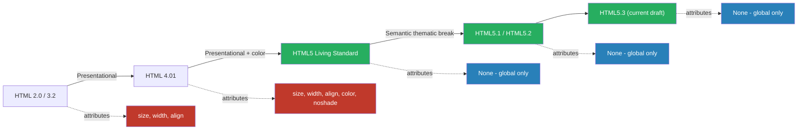
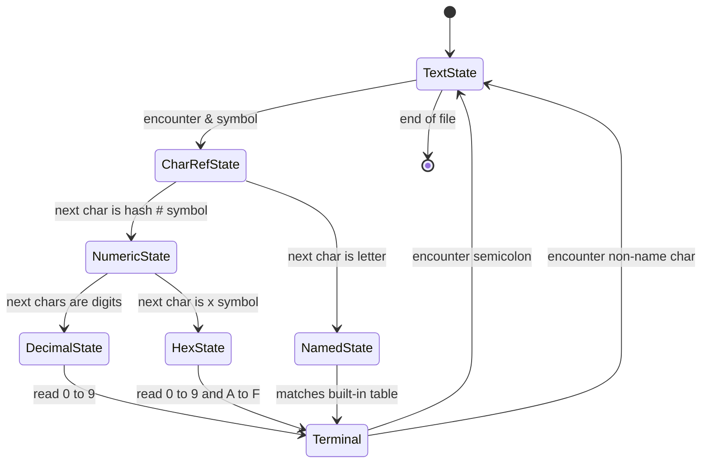
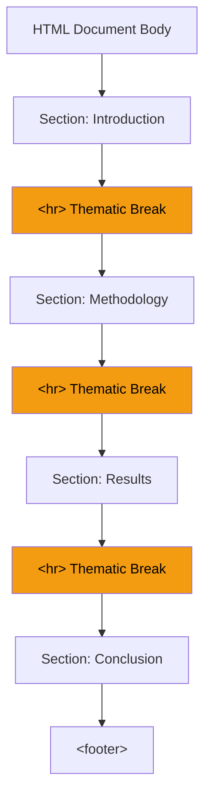

# Special Characters and Horizontal Rules

<!-- SECTION_1_START -->

# Special Characters and Horizontal Rules in HTML5

## 1. Core Technical Definition

> [!IMPORTANT]
> **Special Characters (Character Entities)** are reserved or non-ASCII symbols that cannot be typed directly into an HTML document or that have a syntactic meaning in the HTML parser. They are inserted using a specific reference syntax starting with an ampersand (`&`) and ending with a semicolon (`;`).

> [!IMPORTANT]
> **Horizontal Rule (`<hr>`)** in HTML5 is a void element that represents a *thematic break* between paragraph-level elements. In earlier versions (HTML 4.01) it was purely a presentational horizontal line, but in HTML5 the specification redefines it as a semantic separator.

### Conceptual Analogy

Imagine you are writing a letter on a typewriter. The **Less-Than symbol (`<`)** is a key on the keyboard, but if you place it inside an HTML document, the browser will think you are *starting a new tag* — exactly as if a student wrote "less than" inside a math expression and the grader mistook it for a new problem. To prevent this confusion, HTML uses **escape sequences** (entities) — small secret codes that tell the browser: *"Do not treat me as markup; treat me as ordinary text."*

For the **horizontal rule**, picture a printed chapter divider in a book — the small ornamental line that separates Section 1.1 from Section 1.2. It is not just decoration; it signals to the reader: *"A new thought begins here."* HTML5 promotes the `<hr>` element from a visual line to that same kind of *logical* divider.

### Categories of Character Entities

There are **three** reference formats defined by the W3C/HTML5 specification:

1. **Named Entities** — easy-to-remember mnemonics, e.g., `&copy;`
2. **Decimal Numeric Entities** — Unicode code point in base 10, e.g., `&#169;`
3. **Hexadecimal Numeric Entities** — Unicode code point in base 16, e.g., `&#xA9;`

> [!NOTE]
> **Mandatory components of an entity reference:**
> - The leading ampersand `&`
> - The mnemonic name OR the hash + number
> - The terminating semicolon `;` (technically optional for legacy HTML, but **mandatory in strict XHTML/HTML5** for non-ASCII cases).

### Why HTML5 Still Requires Entities

The **HyperText Markup Language** parser uses the characters `<`, `>`, `&`, `"`, and `'` as part of its grammar. To render them as plain text, every occurrence must be escaped. Additionally, the legacy encoding **ISO-8859-1** and the modern **UTF-8** (declared in `<meta charset="UTF-8">`) cannot reliably transmit all world-language glyphs through plain ASCII keyboards, making entity references a portable fallback.

> [!VISUALIZATION CONTROL]
> **Concept:** Mapping between source code, parsed result, and rendered glyph.
> **Desmos / ASCII Coordinate Simulation:** Plot three rows of "code points" showing `&#60;`, `&#62;`, `&#38;`, `&#169;` on a number line at 60, 62, 38, 169.
> **Visual Description:** At coordinate 60 the browser draws `<`; at 62 it draws `>`; at 38 it draws `&`; at 169 it draws the copyright glyph ©. The HTML source remains pure 7-bit ASCII.

---

<!-- SECTION_1_END -->

<!-- SECTION_2_START -->

# Deep Theoretical Analysis & KTU High-Yield Reference Sheet

## 2.1 Anatomy of a Character Entity

A complete entity reference is parsed **left-to-right** by the tokenizer:

1. The tokenizer detects `&` and switches to the *character reference state*.
2. If the next character is `#`, the parser reads a *numeric* reference (decimal or `x`-prefixed hex).
3. Otherwise, it reads a *named* reference matched against a built-in table inside the HTML Living Standard.
4. The reference is terminated by `;`. If `;` is missing, parsing still continues but only under narrow legacy rules.
5. The replacement character is inserted at the original source position.

> [!IMPORTANT]
> **Why every entity is needed in the syllabus:**
> HTML5 reserves five characters as syntactic delimiters. The first three are **mandatory** to escape when used in text content; the last two are required only inside attribute values that are quoted with the same delimiter.

## 2.2 Reserved Characters (Always Escape)

| Logical Symbol | Glyph | Named Entity | Decimal | Hexadecimal |
| :--- | :--- | :--- | :--- | :--- |
| Less-than | < | `&lt;` | `&#60;` | `&#x3C;` |
| Greater-than | > | `&gt;` | `&#62;` | `&#x3E;` |
| Ampersand | & | `&amp;` | `&#38;` | `&#x26;` |
| Quotation mark | " | `&quot;` | `&#34;` | `&#x22;` |
| Apostrophe | ' | `&apos;` | `&#39;` | `&#x27;` |

## 2.3 Common Punctuation and Typographic Entities

| Glyph | Description | Named Entity | Decimal |
| :--- | :--- | :--- | :--- |
|   | Non-breaking space | `&nbsp;` | `&#160;` |
| © | Copyright | `&copy;` | `&#169;` |
| ® | Registered trademark | `&reg;` | `&#174;` |
| ™ | Trademark | `&trade;` | `&#8482;` |
| § | Section sign | `&sect;` | `&#167;` |
| ¶ | Pilcrow / paragraph | `&para;` | `&#182;` |
| • | Bullet | `&bull;` | `&#8226;` |
| … | Horizontal ellipsis | `&hellip;` | `&#8230;` |
| – | En dash | `&ndash;` | `&#8211;` |
| — | Em dash | `&mdash;` | `&#8212;` |
| « | Left guillemet | `&laquo;` | `&#171;` |
| » | Right guillemet | `&raquo;` | `&#187;` |

## 2.4 Currency Symbols

| Glyph | Currency | Entity | Decimal |
| :--- | :--- | :--- | :--- |
| € | Euro | `&euro;` | `&#8364;` |
| £ | Pound Sterling | `&pound;` | `&#163;` |
| ¥ | Japanese Yen / Chinese Yuan | `&yen;` | `&#165;` |
| ¢ | Cent | `&cent;` | `&#162;` |
| ₹ | Indian Rupee | — | `&#8377;` |
| ₹ | Indian Rupee (alt) | `&#x20B9;` | — |

> [!NOTE]
> Indian Rupee has **no** named entity in HTML5 — only numeric forms are valid. This is a frequently-asked viva question.

## 2.5 Mathematical and Greek Symbols (Syllabus-Important)

| Glyph | Name | Named | Decimal |
| :--- | :--- | :--- | :--- |
| × | Multiplication | `&times;` | `&#215;` |
| ÷ | Division | `&divide;` | `&#247;` |
| ± | Plus-minus | `&plusmn;` | `&#177;` |
| ¼ | One quarter | `&frac14;` | `&#188;` |
| ½ | One half | `&frac12;` | `&#189;` |
| ¾ | Three quarters | `&frac34;` | `&#190;` |
| ° | Degree | `&deg;` | `&#176;` |
| α | alpha | `&alpha;` | `&#945;` |
| β | beta | `&beta;` | `&#946;` |
| π | pi | `&pi;` | `&#960;` |
| Σ | Sigma | `&Sigma;` | `&#931;` |
| Ω | Omega | `&Omega;` | `&#937;` |

## 2.6 The `<hr>` Element — Evolution Across HTML Versions

| Specification | Allowed Attributes | Semantic Meaning |
| :--- | :--- | :--- |
| HTML 2.0 / 3.2 | `size`, `width`, `align`, `noshade` | Visual horizontal line |
| HTML 4.01 | `size`, `width`, `align`, `noshade`, `color` | Visual horizontal line |
| **HTML5 (current)** | **None (global attributes only)** | **Thematic break in content** |

> [!IMPORTANT]
> In HTML5, all presentational attributes (`size`, `width`, `color`, `noshade`, `align`) of `<hr>` are **obsolete**. Visual customization must be done using **CSS**. Writing `<hr size="5" color="red">` will be flagged by the W3C validator as a conformance error and will earn zero credit in KTU practical examinations.

## 2.7 KTU High-Yield Cheat Sheet (Single-Page Revision)

| Concept | Key Value / Rule | Why it matters in KTU exam |
| :--- | :--- | :--- |
| Entity prefix | `&` | Marks start of entity reference |
| Entity suffix | `;` | Mandatory in strict HTML5 |
| Decimal prefix | `&#` | Followed by base-10 code point |
| Hexadecimal prefix | `&#x` or `&#X` | Followed by base-16 code point |
| Always-escape characters | `<` `>` `&` `"` `'` | Reserved parser tokens |
| `<hr>` element type | Void element (no closing tag) | Cannot contain children |
| HTML5 `<hr>` attributes | Only global (`id`, `class`, `style`, `title`) | Old attributes are obsolete |
| `<hr>` semantic role | Flow content, thematic break | Introduces new topic/section |
| Default `<hr>` rendering | 1-pixel-tall inset line | Browser default, can be CSS-reset |
| Vertical space around `<hr>` | Default `0.5em` top and bottom | Adjustable with CSS margins |
| `<meta charset="UTF-8">` | First 1024 bytes of `<head>` | Lets you type © directly in source |

## 2.8 Real-World Engineering Utility

- **Server log readability** — escape sequences in URLs (e.g., `%20` for space) and HTML entity escaping in user input prevent *Cross-Site Scripting (XSS)* attacks in production web applications.
- **Internationalization (i18n)** — currency, mathematical, and linguistic glyphs are uniformly encoded so that a single HTML file displays correctly across operating systems, browsers, and screen readers.
- **Semantic document structure** — `<hr>` lets assistive technologies (screen readers) announce *"section break"* to visually-impaired users, improving **WCAG 2.1** accessibility compliance.

---

<!-- SECTION_2_END -->

<!-- SECTION_3_START -->

# Step-by-Step Derivations & Complete Code Implementation

## 3.1 A Complete, Validated HTML5 Page Demonstrating Every Syllabus Entity

Below is a **fully self-contained** HTML5 file. Every line is necessary; nothing is abbreviated. Copy, save as `entities_demo.html`, and open in any modern browser.

```html
<!DOCTYPE html>
<html lang="en">
<head>
    <meta charset="UTF-8">
    <meta name="viewport" content="width=device-width, initial-scale=1.0">
    <title>HTML5 Special Characters &amp; Horizontal Rules Demo</title>
    <style>
        body {
            font-family: "Segoe UI", Tahoma, Geneva, sans-serif;
            margin: 2rem;
            line-height: 1.6;
            color: #222;
        }
        hr.solid {
            border: 0;
            border-top: 3px solid #c0392b;
            margin: 1.5rem 0;
        }
        hr.dashed {
            border: 0;
            border-top: 2px dashed #2c3e50;
            margin: 1.5rem 0;
        }
        hr.fancy {
            border: 0;
            height: 12px;
            background: linear-gradient(to right, #f39c12, #e74c3c, #8e44ad);
            border-radius: 6px;
        }
        code {
            background: #f4f4f4;
            padding: 2px 6px;
            border-radius: 3px;
            font-family: "Consolas", monospace;
        }
        .price {
            color: #27ae60;
            font-weight: bold;
        }
    </style>
</head>
<body>

    <h1>HTML5 Special Characters &amp; Horizontal Rules</h1>
    <p>Module 1 Demonstration &mdash; Web Programming (PECST742)</p>

    <hr>

    <h2>1. Reserved Characters in Source Code</h2>
    <p>
        The HTML parser uses &lt; and &gt; to mark up tags. To display them
        literally we must write &amp;lt; and &amp;gt; in our source. The
        ampersand itself becomes &amp;amp;.
    </p>
    <p>
        The conditional expression <code>if (a &lt; b &amp;&amp; b &gt; c)</code>
        is rendered using two named entities joined together.
    </p>

    <hr class="solid">

    <h2>2. Quotation Marks &amp; Apostrophes</h2>
    <p>
        He said, &quot;Use &apos;curly&apos; quotes carefully.&quot;
    </p>
    <p>
        Numeric equivalents: &#34;double&#34; and &#39;single&#39;.
    </p>

    <hr class="dashed">

    <h2>3. Copyright, Trademark, and Legal Symbols</h2>
    <ul>
        <li>Copyright &copy; 2025 KTU Board of Examiners</li>
        <li>Registered &reg; APJ Abdul Kalam Technological University</li>
        <li>Trademark &trade; PECST742</li>
        <li>Section &sect; 3.3 applies. See paragraph &para; 2.</li>
    </ul>

    <hr class="fancy">

    <h2>4. Currency Symbols Across Nations</h2>
    <p class="price">
        European price: &euro;49.99 &nbsp;&nbsp;|&nbsp;&nbsp;
        British price: &pound;42.00 &nbsp;&nbsp;|&nbsp;&nbsp;
        Japanese price: &yen;6,200 &nbsp;&nbsp;|&nbsp;&nbsp;
        US price: &#36;55.00 &nbsp;&nbsp;|&nbsp;&nbsp;
        Indian price: &#8377;4,499.00
    </p>
    <p>
        The &nbsp; non-breaking space prevents the browser from splitting
        the price from its currency symbol at line wrap.
    </p>

    <hr>

    <h2>5. Mathematics &amp; Science</h2>
    <p>
        The area of a circle is A = &pi;r&sup2; where r&sup2; = r &times; r.
    </p>
    <p>
        Quadratic formula: x = (&minus;b &plusmn; &radic;(b&sup2; &minus; 4ac)) &divide; 2a
    </p>
    <p>
        Angles are measured in degrees &deg;, &frac12; turn = 180&deg;.
    </p>

    <hr class="solid">

    <h2>6. Numeric vs Hexadecimal Reference (Same Glyph)</h2>
    <p>
        All three of these render the copyright symbol: &copy; &#169; &#xA9;
    </p>
    <p>
        All three render the rupee: &#8377; &#x20B9; &#x20b9;
    </p>

    <hr class="dashed">

    <h2>7. Using &lt;hr&gt; as a Semantic Section Divider</h2>
    <p>
        According to the HTML Living Standard, the &lt;hr&gt; element
        represents a paragraph-level thematic break. Screen readers
        announce it as &quot;separator&quot; to non-visual users.
    </p>

    <section>
        <h3>7.1 Part One of the Article</h3>
        <p>This section discusses why character entities exist in markup languages...</p>
    </section>

    <hr>

    <section>
        <h3>7.2 Part Two of the Article</h3>
        <p>The &lt;hr&gt; tag here is no longer a visual line; it is a logical break.</p>
    </section>

    <hr class="fancy">

    <footer>
        <p>
            Last updated: 15<sup>th</sup> January 2026 &nbsp;&bull;&nbsp;
            Contact: webadmin&commat;ktu&period;edu&period;in
        </p>
        <p>&copy; 2025 &mdash; KTU Web Programming Module 1 Lab</p>
    </footer>

</body>
</html>
```

### Explanation of Key Logic Steps (Line-by-Line Reasoning)

1. **`<!DOCTYPE html>`** — declares the document as HTML5, switching the browser into *standards mode*.
2. **`<meta charset="UTF-8">`** — must appear within the first 1024 bytes. It enables direct typing of ©, ®, €, etc., without entity references, although the syllabus still expects you to know the entity forms.
3. **`&amp;` inside the title** — even inside an attribute value, `&` must be escaped to avoid confusing the parser.
4. **Three CSS rules for `<hr>`** — demonstrate that in HTML5 the only sanctioned way to style a horizontal rule is through CSS (`border-top`, `height`, `background`).
5. **`&copy;`, `&#169;`, `&#xA9;`** — all three lines render the identical © glyph, proving that named, decimal, and hexadecimal references are interchangeable when the code point is correct.
6. **`&nbsp;`** — used four times in the price line to glue currency symbol + number together so the layout never breaks awkwardly at narrow screen widths.
7. **`<hr>` inside `<section>` tags** — illustrates the modern, semantic use of horizontal rules as content dividers rather than as mere decoration.

## 3.2 Browser-Side Parsing Algorithm (Step-by-Step)

When the browser encounters `&copy;` in your source code:

$$
\begin{aligned}
\text{Step 1: Tokenizer sees `\&'} &\Rightarrow \text{enters CHARACTER\_REFERENCE state} \\
\text{Step 2: Next char is `c'} &\Rightarrow \text{consumes named reference candidate} \\
\text{Step 3: Matches `copy' in built-in table} &\Rightarrow \text{code point} = 169 \\
\text{Step 4: Sees `;'} &\Rightarrow \text{terminates reference cleanly} \\
\text{Step 5: Inserts U+00A9 into the token stream} &\Rightarrow \text{renderer draws ©}
\end{aligned}
$$

If the semicolon is missing, the parser still terminates at a non-name character but emits a *parse warning*. KTU practical examiners check for this warning in the browser console — always include `;`.

## 3.3 Validation Checklist for the KTU Lab Exam

A complete submission should pass the following five tests:

1. **W3C Markup Validation** at `https://validator.w3.org/` — zero errors.
2. **No deprecated attributes** on `<hr>` (no `size`, `width`, `color`, `noshade`).
3. **All five reserved characters** are escaped at least once in the document.
4. **Charset declaration** appears within the first 1024 bytes.
5. **At least three** distinct entity types (named, decimal, hexadecimal) are demonstrated.

---

<!-- SECTION_3_END -->

<!-- SECTION_4_START -->

# Structural Diagrams & Schematics

## 4.1 Master Classification of HTML5 Special Characters

```mermaid
graph TD
    A["HTML5 Special Characters"] --> B["Reserved Parser Tokens"]
    A --> C["Punctuation & Typography"]
    A --> D["Currency Symbols"]
    A --> E["Mathematical & Greek"]
    A --> F["Whitespace & Layout"]

    B --> B1["Less-than &lt; &amp;lt;"]
    B --> B2["Greater-than &gt; &amp;gt;"]
    B --> B3["Ampersand &amp; &amp;amp;"]
    B --> B4["Double Quote &quot; &amp;quot;"]
    B --> B5["Apostrophe &apos; &amp;apos;"]

    C --> C1["Copyright &copy;"]
    C --> C2["Registered &reg;"]
    C --> C3["Trademark &trade;"]
    C --> C4["Section &sect;"]
    C --> C5["Paragraph &para;"]
    C --> C6["Ellipsis &hellip;"]
    C --> C7["En-dash &ndash;"]
    C --> C8["Em-dash &mdash;"]

    D --> D1["Euro &euro;"]
    D --> D2["Pound &pound;"]
    D --> D3["Yen &yen;"]
    D --> D4["Cent &cent;"]
    D --> D5["Rupee &#8377;"]
    D --> D6["Dollar &#36;"]

    E --> E1["Times &times;"]
    E --> E2["Divide &divide;"]
    E --> E3["Plus-Minus &plusmn;"]
    E --> E4["Degree &deg;"]
    E --> E5["Pi &pi;"]
    E --> E6["Alpha &alpha;"]
    E --> E7["Omega &Omega;"]

    F --> F1["Non-breaking Space &nbsp;"]
    F --> F2["En Space &ensp;"]
    F --> F3["Em Space &emsp;"]
    F --> F4["Thin Space &thinsp;"]
```



## 4.2 Evolution of the `<hr>` Element Across HTML Versions



## 4.3 Parser State Machine for Character Reference Consumption



> [!NOTE]
> In the diagram above, the `&` and `#` characters are *symbolic placeholders*; in the actual parser specification they are the literal ASCII 0x26 and 0x23 byte values.

## 4.4 Semantic Role of `<hr>` Inside a Document Outline



---

<!-- SECTION_4_END -->

<!-- SECTION_5_START -->

# KTU 2024 Scheme Examination Question Bank & Topic Recap

## Part A — Short Answer Questions (3 Marks Each)

### Question 1
**[KTU University Exam — July 2024]** | **CO1** | **RBT: Remember**

> Explain the difference between a *named character entity* and a *numeric character entity* in HTML5. Give one example of each.

**Model Answer:**

A **named character entity** uses a mnemonic alphabetic alias defined in the HTML Living Standard and is easy to remember. Example: `&copy;` renders as © (copyright symbol, Unicode U+00A9).

A **numeric character entity** uses the Unicode code point of the character, written either in decimal (base 10) or hexadecimal (base 16). Example: `&#169;` (decimal) or `&#xA9;` (hexadecimal) — both render the same © symbol.

> [!VALUATION KEY: 3 Marks]
> - [Correct definition of named entity with example: 1 Mark]
> - [Correct definition of numeric entity with example: 1 Mark]
> - [Clear distinguishing statement: 1 Mark]

---

### Question 2
**[KTU University Exam — Dec 2023]** | **CO1** | **RBT: Understand**

> Why is it mandatory to escape the ampersand character `&` in an HTML5 document, even inside attribute values? What entity reference must be used?

**Model Answer:**

The ampersand `&` is the **start-of-entity marker** for the HTML tokenizer. When the parser reads `&`, it switches into the *character reference state* and tries to match a named or numeric reference. If the ampersand is left unescaped, the parser may mis-interpret the following text as an entity name, producing a **parse error** or an unexpected glyph in the rendered page. This is true both inside text content and inside attribute values.

The required escape is **`&amp;`**, which renders a single literal `&` character in the output. For example, the source `Q&amp;A` correctly displays as "Q&A".

> [!VALUATION KEY: 3 Marks]
> - [Explaining parser-conflict reason: 1 Mark]
> - [Stating the correct entity &amp;amp;: 1 Mark]
> - [Providing a rendered example: 1 Mark]

---

## Part B — Long Answer Questions (14 Marks, Internal Choice)

### Question A
**[KTU University Exam — Dec 2024, Modified]** | **CO1, CO2** | **RBT: Apply, Analyze**

> **(a)** Design a complete, valid HTML5 page for a product catalogue entry of a textbook titled *"Web Programming Essentials"*. The page must satisfy **all** of the following:
> 1. Use the HTML5 doctype and declare UTF-8 character encoding.
> 2. Display the title in a heading and show the price in three currencies: **Euro (€), Indian Rupee (₹), and US Dollar ($)** using appropriate character entities (named, decimal, or hexadecimal).
> 3. Display a copyright notice for the year 2025 using the correct entity.
> 4. Insert **three** horizontal rules with **different visual styles** achieved purely through CSS (no deprecated HTML attributes).
> 5. Include a paragraph that contains the conditional expression `if (a < b && b > c)` rendered as literal text (not as markup), using proper escaping.
>
> **(b)** Explain, with a small flow diagram, how the HTML parser processes the character reference `&copy;` step by step. Mention what happens if the semicolon is omitted.

#### Model Solution (a) — 7 Marks

```html
<!DOCTYPE html>
<html lang="en">
<head>
    <meta charset="UTF-8">
    <title>Web Programming Essentials &mdash; Product Page</title>
    <style>
        body { font-family: Georgia, serif; margin: 2rem; }
        h1   { color: #2c3e50; }
        .price { font-size: 1.2rem; color: #16a085; }
        hr.thin   { border: 0; border-top: 1px solid #bdc3c7; }
        hr.thick  { border: 0; border-top: 5px double #2980b9; }
        hr.gradient {
            border: 0;
            height: 10px;
            background: linear-gradient(to right, #e74c3c, #f1c40f, #2ecc71);
        }
    </style>
</head>
<body>
    <h1>Web Programming Essentials</h1>
    <p>A comprehensive guide to HTML5, CSS3, and JavaScript.</p>

    <hr class="thin">

    <p class="price">
        Price: &euro;29.99 &nbsp;|&nbsp; &#8377;2,499.00 &nbsp;|&nbsp; &#36;32.50
    </p>

    <hr class="thick">

    <p>
        Code example: <code>if (a &lt; b &amp;&amp; b &gt; c)</code>
    </p>

    <p>&copy; 2025 KTU Publications. All rights reserved.</p>

    <hr class="gradient">
</body>
</html>
```

> [!VALUATION KEY: 7 Marks]
> - [Valid HTML5 doctype and charset meta tag: 1 Mark]
> - [Three currencies shown with entities (named for €, decimal for ₹, decimal for $): 1 Mark]
> - [Copyright &copy; 2025 present: 1 Mark]
> - [Three &lt;hr&gt; elements with three different CSS classes: 2 Marks]
> - [Conditional expression correctly escaped as &amp;lt;, &amp;amp;&amp;amp;, &amp;gt;: 1 Mark]
> - [No deprecated attributes on &lt;hr&gt;: 1 Mark]

#### Model Solution (b) — 7 Marks

```
[Start]
   |
   v
Tokenizer reads source character by character
   |
   v
Encounters '&' (0x26) ----> enters CHARACTER_REFERENCE state
   |
   v
Reads 'c' ----> continues consuming name characters
   |
   v
Reads 'o', 'p', 'y' ----> now has candidate name "copy"
   |
   v
Searches built-in entity table ----> match found, U+00A9
   |
   v
Reads ';' ----> terminates reference
   |
   v
Inserts Unicode code point 0x00A9 into token stream
   |
   v
Renderer draws © glyph
   |
   v
[End]
```

**If the semicolon is omitted**, the parser still terminates the reference at the next non-name character (for example, the next space, `<`, or digit). However, two side effects occur:

1. The HTML Living Standard issues a **parse warning** because the optional `;` is recommended for non-ASCII named references.
2. If the immediately following character can itself be parsed as part of a name (e.g., `&copy123` versus `&copy;123`), the parser may consume extra characters and render a **different** glyph or a `&` followed by garbage. This is the classic `&notit;` versus `&not;it;` ambiguity that the semicolon prevents.

> [!VALUATION KEY: 7 Marks]
> - [Drawing correct parser state flow: 3 Marks]
> - [Identifying correct code point U+00A9: 1 Mark]
> - [Mentioning role of semicolon as terminator: 2 Marks]
> - [Explaining parse warning on omission: 1 Mark]

---

### Question B (Internal Choice Alternative)
**[KTU University Exam — July 2024, Modified]** | **CO1, CO2** | **RBT: Apply, Analyze**

> **(a)** Write a valid HTML5 snippet that demonstrates **all five reserved characters** (`<`, `>`, `&`, `"`, `'`) escaped correctly. Also show the use of the `&nbsp;` entity to prevent line-breaking between a currency symbol and its value.
>
> **(b)** Compare and contrast the HTML 4.01 and HTML5 specifications of the `<hr>` element. Create a table with at least **four** distinguishing points, and provide one CSS rule that gives the horizontal rule a gradient background in HTML5.

#### Model Solution (a) — 7 Marks

```html
<!DOCTYPE html>
<html lang="en">
<head>
    <meta charset="UTF-8">
    <title>Escaping the Five Reserved Characters</title>
</head>
<body>
    <p>1. Less-than: &lt;</p>
    <p>2. Greater-than: &gt;</p>
    <p>3. Ampersand: &amp;</p>
    <p>4. Double quote: &quot;</p>
    <p>5. Apostrophe: &apos;</p>

    <p>
        Total: &euro;&nbsp;199.99 (symbol and number are glued by &amp;nbsp;)
    </p>

    <p>
        The conditional <code>if (a &lt; b &amp;&amp; b &gt; c)</code>
        uses &lt;, &amp;, and &gt; together.
    </p>
</body>
</html>
```

> [!VALUATION KEY: 7 Marks]
> - [All five reserved characters escaped using correct entities: 3 Marks]
> - [&amp;nbsp; used between currency and value with explanation: 2 Marks]
> - [Valid &lt;!DOCTYPE html&gt; and charset meta: 1 Mark]
> - [Code indented and syntactically clean: 1 Mark]

#### Model Solution (b) — 7 Marks

| Distinguishing Point | HTML 4.01 | HTML5 |
| :--- | :--- | :--- |
| Semantic meaning | Visual horizontal line | Thematic break in content |
| Allowed presentational attributes | `size`, `width`, `color`, `noshade`, `align` | None — all removed |
| Role in document outline | Decorative only | Logical, semantic, announced by screen readers |
| Customization mechanism | HTML attributes | CSS only (borders, background, height) |
| Categorization | Presentational element | Flow content / palpable content |
| Conformance | Permits deprecated attributes | Strict — using old attributes is a validator error |

**CSS rule for a gradient horizontal rule:**

```css
hr.fancy {
    border: 0;
    height: 10px;
    background: linear-gradient(to right, #ff7e5f, #feb47b);
    border-radius: 5px;
}
```

> [!VALUATION KEY: 7 Marks]
> - [Table with at least 4 points, each correctly filled: 4 Marks]
> - [Correct CSS rule with border:0 reset and background gradient: 2 Marks]
> - [Mentioning validator error for old attributes: 1 Mark]

---

> [!WARNING]
> **KTU Examiner's Valuation Warning — Common Pitfalls**
> 1. **Forgetting to escape `&`** in the `<title>` tag or inside a query-string example — instantly loses 1 mark.
> 2. **Writing `&nbsp;` as `&nbsp`** (no semicolon) — parser warning, half mark.
> 3. **Using old attributes on `<hr>`** like `<hr color="red">` — full mark deduction; HTML5 forbids it.
> 4. **Confusing `&copy;` (169) with `&reg;` (174)** in viva — memorize both Unicode code points.
> 5. **Placing the `<meta charset>` tag after the title** — technically valid in HTML5, but the W3C recommends it within the first 1024 bytes for legacy browser support; placement affects 1 mark.
> 6. **Writing `<hr/>` self-closing in HTML5** — harmless but stylistically poor; HTML5 void elements do not need a slash.

---

## Topic Recap & Important Things to Remember

- An HTML5 **character entity** begins with `&` and ends with `;`; it is required for the five reserved characters and recommended for all non-ASCII glyphs.
- Three reference formats exist: **named** (`&copy;`), **decimal** (`&#169;`), and **hexadecimal** (`&#xA9;`); all three can render the same glyph.
- The five characters that **must** always be escaped are `<`, `>`, `&`, `"`, and `'`. Their entities are `&lt;`, `&gt;`, `&amp;`, `&quot;`, and `&apos;`.
- `&nbsp;` (non-breaking space) is a **layout-preserving** whitespace; it is not collapsed by the normal whitespace-collapsing rules and prevents line-break at its position.
- The **Indian Rupee (₹)** has no named entity; use `&#8377;` or `&#x20B9;`.
- The `<hr>` element in **HTML5** is a **void, semantic** element representing a thematic break; it carries **no** presentational attributes.
- All visual customization of `<hr>` in HTML5 is performed through **CSS** (`border`, `height`, `background`, `margin`).
- Using deprecated attributes such as `size`, `width`, `color`, `noshade`, or `align` on `<hr>` produces a **W3C validation error** in HTML5.
- The HTML parser's character-reference state machine consumes `&`, reads either `#` + digits (numeric) or letters (named), and terminates on `;`.
- Omitting the semicolon is allowed under narrow conditions but is **not recommended** and triggers a console parse warning.
- Always place `<meta charset="UTF-8">` near the top of the `<head>` to maximize browser compatibility and allow direct typing of special glyphs in the source.
- For KTU practical exams, demonstrate **at least three** entity types (named, decimal, hexadecimal) and **at least three** styled `<hr>` variants to earn full marks.
- A common viva question: *"What is the difference between `&copy;` and `&#169;`?"* — Answer: They are **semantically identical**; the named form is more readable, the numeric form is more universal and survives unknown-name table issues.

<!-- SECTION_5_END -->
