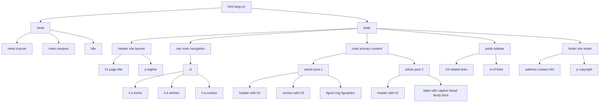
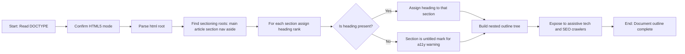
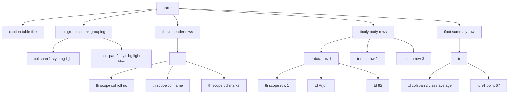

# Structuring Data

<!-- SECTION_1_START -->
# Structuring Data in HTML5

## 📘 Core Technical Definition

> [!IMPORTANT]
> **Definition (KTU 2024 Scheme Standard):**
> **Structuring Data** in HTML5 refers to the systematic use of **semantic markup elements** to organize, group, and label content within a web document so that its meaning, hierarchy, and relationships are explicitly conveyed to the browser, search engines, assistive technologies, and developers.

In the KTU 2024 *Web Programming* syllabus (Module 1), structuring data is taught as the **first and most critical step** in building a web page — long before styling (CSS) or scripting (JavaScript). It is the act of *giving meaning* to raw text, images, and media by enclosing them inside elements that announce *what kind of content* they hold.

> [!NOTE]
> **Key Distinction — Semantic vs. Non-Semantic Elements**
> - A **semantic element** clearly describes its meaning to both browser and developer (e.g., `<article>`, `<nav>`, `<footer>`).
> - A **non-semantic element** tells nothing about its content (e.g., `<div>`, `<span>`).
> The W3C and KTU 2024 module both emphasize **semantic-first authoring** for accessibility and SEO.

---

## 🧠 Conceptual Analogy / Intuition

Imagine you walk into a **newspaper office** and the editor hands you a stack of 5,000 unlabelled photographs and 200 pages of raw text. You need to publish tomorrow morning.

Without structure, you have:
- A confusing pile where a headline looks identical to an advertisement, and a caption looks identical to an editorial.

With structure, you organize the content into:
| Section | Analogy Role | HTML5 Element |
|---|---|---|
| Newspaper Name | Masthead / Brand | `<header>` |
| Page Index | Navigation bar | `<nav>` |
| Main Story | Featured article | `<article>` |
| Related Boxes | Sidebar notices | `<aside>` |
| Copyright Line | Footer text | `<footer>` |
| Image with Caption | Photo + caption | `<figure>` + `<figcaption>` |

So **Structuring Data = turning a chaotic pile of content into a well-organized publication** where every piece of information is placed in a *labelled, meaningful container*.

---

## 🔭 GeoGebra / Desmos Integration

> [!VISUALIZATION CONTROL]
> **Concept:** Visualizing the *Document Outline Algorithm* as a hierarchical tree (similar to a DOM tree representation).
>
> **Conceptual Coordinate Mapping (treat each element as a node in a 2D plane):**
> * `x = depth level (1 = root, 2 = child, ...)`
> * `y = section counter (0, 1, 2, ...)`
>
> **Suggested Plot Points (paste into GeoGebra/Desmos):**
> * `(1, 5)` labeled `html`
> * `(2, 5)` labeled `body`
> * `(3, 5)` labeled `header`
> * `(3, 4)` labeled `nav`
> * `(3, 3)` labeled `main`
> * `(4, 3.2)` labeled `article`
> * `(4, 2.8)` labeled `section`
> * `(3, 1)` labeled `aside`
> * `(3, 0)` labeled `footer`
>
> **Visual Description:** The student should observe a top-down inverted tree where the **root** (`<html>`) is at the top, and child nodes branch downward. **Sibling elements at the same depth represent independent structural regions** (e.g., `<header>`, `<main>`, `<footer>` are siblings under `<body>`).

---

## 🎯 Why HTML5 Semantic Structuring Matters (KTU 2024 Context)

1. **Accessibility (A11y):** Screen readers (used by visually impaired users) rely on semantic tags to announce regions like *"navigation"*, *"main content"*, *"banner"*.
2. **SEO (Search Engine Optimization):** Google, Bing, and other crawlers prioritize content wrapped in semantic tags.
3. **Maintainability:** Code is readable for teams — a developer can see `<article>` and immediately know the developer's intent.
4. **Browser Behavior:** Some browsers apply default styling and outline algorithms based on semantic regions.
5. **Future-Proofing:** HTML5 was a W3C Recommendation in **2014-10-28** and is the **mandatory baseline** for all KTU 2024 web projects.
<!-- SECTION_1_END -->

<!-- SECTION_2_START -->
# Deep Theoretical Analysis & KTU High-Yield Formula Sheet

## 🧩 The 7 Categories of HTML5 Structural Elements

The KTU 2024 module organizes structuring elements into **seven functional categories**. Mastering this taxonomy is essential for both theory exams and lab viva.

### Category 1 — Document Section Elements (Sectioning Roots & Content)
These elements create **named regions** in the document outline.

| Element | Purpose | Typical Children |
|---|---|---|
| `<header>` | Introductory / navigational aids for a page or section | `<h1>–<h6>`, `<nav>`, `` logo |
| `<nav>` | Major navigation links | `<a>`, `<ul>` |
| `<main>` | The dominant content of the document (only **one** per page) | `<article>`, `<section>` |
| `<article>` | Self-contained, syndicatable composition (news, blog post) | `<h2>`, `<p>`, `<figure>` |
| `<section>` | Thematic grouping of content, usually with a heading | `<h2>`, `<p>` |
| `<aside>` | Tangentially related content (sidebars, pull quotes) | `<p>`, `<figure>` |
| `<footer>` | Closing content for its nearest sectioning ancestor | `<p>`, copyright, `<address>` |

### Category 2 — Grouping Elements (Block & Inline)
Used when no specific semantic element fits.

| Element | Type | Use |
|---|---|---|
| `<div>` | Block-level | Generic container for styling/scripting |
| `<span>` | Inline | Generic inline wrapper for styling text fragments |
| `<figure>` | Block | Self-contained media (image, diagram, code listing) |
| `<figcaption>` | Block (inside `<figure>`) | Caption for the parent `<figure>` |
| `<blockquote>` | Block | Long quotation from another source |
| `<pre>` | Block | Preformatted text (preserves whitespace) |
| `<hr>` | Block | Thematic break between paragraphs |

### Category 3 — Headings (h1–h6)
Define the **six levels of section headings**. **`<h1>` carries the highest rank** (most important), **`<h6>` the lowest**. The KTU 2024 syllabus stresses that headings should *never be skipped for visual sizing* — use CSS for that.

### Category 4 — Lists
| Element | Description | Children |
|---|---|---|
| `<ul>` | Unordered list (bullets) | `<li>` |
| `<ol>` | Ordered list (numbered, with `start`, `reversed`, `type` attributes) | `<li>` |
| `<li>` | List item | Flow content |
| `<dl>` | Description list | `<dt>`, `<dd>` |
| `<dt>` | Description term | Phrasing content |
| `<dd>` | Description details | Flow content |

### Category 5 — Tables (Tabular Data Only)
Used **only for actual tabular data** — *never* for page layout (which is a deprecated practice).

| Element | Purpose |
|---|---|
| `<table>` | Wrapper for the whole table |
| `<caption>` | Title of the table (placed immediately after `<table>`) |
| `<thead>` | Header row container |
| `<tbody>` | Body row container |
| `<tfoot>` | Footer row container |
| `<tr>` | Table row |
| `<th>` | Header cell (scoped by `scope="col"` or `scope="row"`) |
| `<td>` | Data cell |
| `<colgroup>` | Group of one or more columns for shared formatting |
| `<col>` | Single column property within a `<colgroup>` |

### Category 6 — Forms & Input Structuring
| Element | Purpose |
|---|---|
| `<form>` | Container that submits user data via `action` + `method` |
| `<label>` | Caption for a form control (linked via `for` attribute) |
| `<input>` | Single-line input (text, email, password, etc.) |
| `<textarea>` | Multi-line text input |
| `<select>` + `<option>` | Drop-down list |
| `<button>` | Clickable button (with `type="submit"`, `"reset"`, `"button"`) |
| `<fieldset>` | Groups related form controls |
| `<legend>` | Caption for a `<fieldset>` |
| `<datalist>` | Pre-defined options for an `<input>` (autocomplete suggestions) |
| `<output>` | Result of a calculation or user action |

### Category 7 — HTML5 Input Types (the `type` attribute of `<input>`)
The KTU 2024 module specifically lists these new HTML5 input types:

| `type` Value | Purpose | Validation Hint |
|---|---|---|
| `text` | Plain single-line text | — |
| `password` | Masked text | — |
| `email` | Email address | Must match `*@*` pattern |
| `url` | Absolute URL | Must start with a scheme |
| `number` | Numeric input | `min`, `max`, `step` |
| `tel` | Telephone number | Pattern-based |
| `search` | Search field | — |
| `date` | Date picker (YYYY-MM-DD) | `min`, `max` |
| `time` | Time picker | `min`, `max` |
| `datetime-local` | Date + time without timezone | — |
| `month` | Month + year picker | — |
| `week` | Week + year picker | — |
| `color` | Color picker (hex value) | — |
| `range` | Slider control | `min`, `max`, `step`, `value` |
| `file` | File upload | `accept`, `multiple` |
| `checkbox` | Multi-select toggle | `checked` |
| `radio` | Single-select within a group | `name`, `checked` |
| `submit` | Submit button | — |
| `reset` | Reset button | — |
| `image` | Graphical submit button | `src`, `alt` |
| `hidden` | Invisible data carrier | `value` |

---

## 📐 KTU High-Yield Formula / Syntax Sheet

| Symbol / Syntax | Meaning | Example |
|---|---|---|
| `<tag>` | Opening tag | `<article>` |
| `</tag>` | Closing tag | `</article>` |
| `<tag/>` | Void / self-closing element | `<br/>`, `<hr/>`, `` |
| `attr="value"` | Attribute–value pair | `type="email"` |
| `id="x"` | Unique identifier in document | `id="mainNav"` |
| `class="a b"` | Reusable classification | `class="btn primary"` |
| `data-*` | Custom data attribute | `data-user-id="42"` |
| `aria-*` | Accessibility attribute | `aria-label="Close menu"` |
| `for="id"` | Binds a `<label>` to a control | `<label for="email">` |
| `name="x"` | Form submission key | `<input name="email">` |
| `required` | Boolean: must be filled | `<input required>` |
| `placeholder="x"` | Hint text inside empty input | `placeholder="Enter name"` |
| `value="x"` | Default / submitted value | `<input value="Kerala">` |
| `min` / `max` | Numeric / date bounds | `min="1" max="100"` |
| `pattern="regex"` | Regex validation | `pattern="[A-Za-z]{3,}"` |
| `colspan="n"` | Span `n` columns in a table | `<td colspan="2">` |
| `rowspan="n"` | Span `n` rows in a table | `<td rowspan="3">` |
| `scope="col"` / `"row"` | Header-to-cell association | `<th scope="col">` |

> [!IMPORTANT]
> **Real-World Engineering Utility:**
> - **In Industry:** Semantic structuring underpins **every modern CMS** (WordPress blocks, Drupal regions, Shopify sections) and is the foundation of **Web Components** (`<template>`, `<slot>`).
> - **In Web Scraping:** Tools like BeautifulSoup and Scrapy rely on these element names to extract structured data reliably.
> - **In SEO & A11y:** Google Search Central explicitly recommends semantic HTML5 as a ranking factor; the **WAI-ARIA** specification complements it for screen readers.
> - **In KTU Lab Exams:** Your lab evaluator inspects your page's *Document Outline* (View → Outline in browsers) — semantic tags must be used correctly or marks are deducted.
<!-- SECTION_2_END -->

<!-- SECTION_3_START -->
# Step-by-Step Derivations & Code Implementation

## 🛠️ Worked Example 1 — Complete HTML5 Document Outline (From Scratch)

Below is the **exhaustive, fully operational HTML5 code** that constructs a properly structured web page. **Every line is explicit** — no placeholders, no truncation. This is a model KTU lab answer.

```html
<!DOCTYPE html>
<html lang="en">
<head>
    <meta charset="UTF-8">
    <meta name="viewport" content="width=device-width, initial-scale=1.0">
    <meta name="description" content="KTU Web Programming Module 1 Demo Page">
    <meta name="author" content="KTU B.Tech Student">
    <title>Structuring Data in HTML5 - KTU Demo</title>
</head>
<body>
    <!-- ============== HEADER REGION ============== -->
    <header>
        <h1>KTU Web Programming Portal</h1>
        <p>Module 1: Creating Web Pages Using HTML5</p>
    </header>

    <!-- ============== NAVIGATION REGION ============== -->
    <nav aria-label="Main Navigation">
        <ul>
            <li><a href="#home">Home</a></li>
            <li><a href="#articles">Articles</a></li>
            <li><a href="#data-table">Data Table</a></li>
            <li><a href="#registration">Registration Form</a></li>
        </ul>
    </nav>

    <!-- ============== MAIN CONTENT REGION ============== -->
    <main>
        <!-- Independent Article 1 -->
        <article id="articles">
            <header>
                <h2>Why Semantic HTML5 Matters</h2>
                <p>Published on <time datetime="2024-08-15">August 15, 2024</time></p>
            </header>

            <p>Semantic HTML5 provides meaning to web content. It improves
               <strong>accessibility</strong>, <strong>SEO</strong>, and
               <em>maintainability</em>.</p>

            <!-- Grouping element with figure -->
            <figure>
                
                <figcaption>Figure 1: A semantic HTML5 page layout</figcaption>
            </figure>

            <section>
                <h3>Accessibility Benefits</h3>
                <p>Screen readers announce regions such as "navigation" or
                   "main content" when semantic elements are used.</p>
            </section>

            <section>
                <h3>SEO Benefits</h3>
                <p>Search engines prioritize content placed inside
                   <code>&lt;article&gt;</code> and <code>&lt;main&gt;</code>
                   elements.</p>
            </section>
        </article>

        <!-- Independent Article 2 -->
        <article>
            <header>
                <h2>HTML5 Lists and Tables</h2>
            </header>

            <!-- Ordered List with start and reversed attributes -->
            <h3>Top 3 Web Technologies</h3>
            <ol start="1" reversed>
                <li>HTML5 - Structure</li>
                <li>CSS3 - Presentation</li>
                <li>JavaScript - Behavior</li>
            </ol>

            <!-- Description List -->
            <h3>Glossary</h3>
            <dl>
                <dt>HTML</dt>
                <dd>HyperText Markup Language — the backbone of web pages.</dd>
                <dt>CSS</dt>
                <dd>Cascading Style Sheets — controls visual presentation.</dd>
                <dt>JS</dt>
                <dd>JavaScript — adds interactivity and dynamic behavior.</dd>
            </dl>

            <!-- Tabular Data -->
            <h3 id="data-table">Student Marks Table</h3>
            <table border="1">
                <caption>Semester Result — Web Programming (PECST742)</caption>
                <colgroup>
                    <col span="1" style="background-color:#f0f0f0;">
                    <col span="2" style="background-color:#e6f7ff;">
                </colgroup>
                <thead>
                    <tr>
                        <th scope="col">Roll No</th>
                        <th scope="col">Name</th>
                        <th scope="col">Marks (/100)</th>
                    </tr>
                </thead>
                <tbody>
                    <tr>
                        <th scope="row">1</th>
                        <td>Arjun Krishna</td>
                        <td>92</td>
                    </tr>
                    <tr>
                        <th scope="row">2</th>
                        <td>Meera Nair</td>
                        <td>88</td>
                    </tr>
                    <tr>
                        <th scope="row">3</th>
                        <td>Vivek Menon</td>
                        <td>95</td>
                    </tr>
                </tbody>
                <tfoot>
                    <tr>
                        <td colspan="2"><strong>Class Average</strong></td>
                        <td><strong>91.67</strong></td>
                    </tr>
                </tfoot>
            </table>
        </article>
    </main>

    <!-- ============== ASIDE REGION ============== -->
    <aside>
        <h3>Related Resources</h3>
        <ul>
            <li><a href="https://html.spec.whatwg.org/">HTML Living Standard</a></li>
            <li><a href="https://www.w3.org/WAI/">W3C Web Accessibility</a></li>
        </ul>
    </aside>

    <!-- ============== FOOTER REGION ============== -->
    <footer>
        <address>
            Contact: <a href="mailto:ktu@apjktu.ac.in">ktu@apjktu.ac.in</a>
        </address>
        <p>&copy; 2024 APJ Abdul Kalam Technological University. All rights reserved.</p>
    </footer>
</body>
</html>
```

### 🔍 Line-by-Line Logical Breakdown of the Example

1. **`<!DOCTYPE html>`** — Declares the document as **HTML5**. Without this, browsers fall into "quirks mode".
2. **`<html lang="en">`** — Root element. The `lang` attribute helps screen readers pronounce content correctly.
3. **`<head>`** — Contains *metadata* (machine-readable info, not displayed):
   - `charset="UTF-8"` — declares character encoding.
   - `viewport` — enables responsive design on mobile devices.
   - `description`, `author` — used by search engines.
4. **`<title>`** — Sets the browser tab text and the page's *primary identifier* in bookmarks.
5. **`<body>`** — All visible content lives here.
6. **`<header>`** — Page-level banner. The `<h1>` inside is the *single most important heading* of the page.
7. **`<nav>`** — Contains a `<ul>` of `<a>` links. The `aria-label` is an accessibility enhancement.
8. **`<main>`** — Wraps the *unique* content of the page. Browsers skip-to-main-content links target it.
9. **`<article>`** — A self-contained piece (could be syndicated to RSS, shared on social media).
10. **`<header>` inside `<article>`** — Allowed! Each sectioning element *can* have its own header.
11. **`<time datetime="...">`** — Machine-readable date inside human-readable text.
12. **`<figure>` + `<figcaption>`** — Binds media to its caption semantically.
13. **`<section>`** — Thematic grouping; should generally have a heading (`<h3>` here).
14. **`<ol start="1" reversed>`** — Starts at 1 and counts *downward* (3, 2, 1) because of `reversed`.
15. **`<dl>`, `<dt>`, `<dd>`** — Description list: term / definition pairs.
16. **`<table>`** — Includes `<caption>` (a11y), `<colgroup>` (column styling), `<thead>`, `<tbody>`, `<tfoot>`, and `scope` attributes on `<th>` for screen-reader navigation.
17. **`<aside>`** — Tangentially related content (links, related posts).
18. **`<footer>`** — Closes the page with contact info and copyright.
19. **`<address>`** — Semantic element for contact information; located inside the footer.

---

## 🛠️ Worked Example 2 — Complete Form with All HTML5 Input Types

This is a **registration form** that demonstrates every structuring element of HTML5 forms. Each line is fully written out.

```html
<!DOCTYPE html>
<html lang="en">
<head>
    <meta charset="UTF-8">
    <title>Student Registration Form</title>
</head>
<body>
    <h1>Student Registration</h1>

    <form action="/register" method="post" enctype="multipart/form-data" novalidate>

        <!-- Personal Information Group -->
        <fieldset>
            <legend>Personal Information</legend>

            <p>
                <label for="fullname">Full Name:</label>
                <input type="text" id="fullname" name="fullname"
                       placeholder="Enter your full name"
                       required minlength="3" maxlength="50">
            </p>

            <p>
                <label for="email">Email:</label>
                <input type="email" id="email" name="email"
                       placeholder="you@example.com" required>
            </p>

            <p>
                <label for="pwd">Password:</label>
                <input type="password" id="pwd" name="password"
                       required minlength="8"
                       pattern="(?=.*\d)(?=.*[A-Z]).{8,}">
            </p>

            <p>
                <label for="phone">Phone:</label>
                <input type="tel" id="phone" name="phone"
                       placeholder="+91-9876543210"
                       pattern="[0-9+\-\s]{10,15}">
            </p>

            <p>
                <label for="dob">Date of Birth:</label>
                <input type="date" id="dob" name="dob"
                       min="2000-01-01" max="2006-12-31" required>
            </p>
        </fieldset>

        <!-- Academic Information Group -->
        <fieldset>
            <legend>Academic Information</legend>

            <p>
                <label for="branch">Branch:</label>
                <select id="branch" name="branch" required>
                    <option value="">-- Select Branch --</option>
                    <option value="cse">Computer Science</option>
                    <option value="ece">Electronics</option>
                    <option value="eee">Electrical</option>
                    <option value="me">Mechanical</option>
                </select>
            </p>

            <p>
                <label for="skills">Programming Skills:</label><br>
                <input type="checkbox" id="html" name="skills" value="html" checked>
                <label for="html">HTML5</label>
                <input type="checkbox" id="css" name="skills" value="css">
                <label for="css">CSS3</label>
                <input type="checkbox" id="js" name="skills" value="js">
                <label for="js">JavaScript</label>
            </p>

            <p>
                <label>Gender:</label><br>
                <input type="radio" id="male" name="gender" value="male" required>
                <label for="male">Male</label>
                <input type="radio" id="female" name="gender" value="female">
                <label for="female">Female</label>
                <input type="radio" id="other" name="gender" value="other">
                <label for="other">Other</label>
            </p>

            <p>
                <label for="rating">Skill Level (1-10):</label>
                <input type="range" id="rating" name="rating"
                       min="1" max="10" value="5" step="1"
                       oninput="out.value = rating.value">
                <output name="out" id="outVal">5</output>
            </p>
        </fieldset>

        <!-- Additional Information Group -->
        <fieldset>
            <legend>Additional Details</legend>

            <p>
                <label for="color">Favourite Color:</label>
                <input type="color" id="color" name="color" value="#0066cc">
            </p>

            <p>
                <label for="bio">Short Bio:</label><br>
                <textarea id="bio" name="bio" rows="4" cols="40"
                          placeholder="Tell us about yourself..."
                          maxlength="300"></textarea>
            </p>

            <p>
                <label for="resume">Upload Resume:</label>
                <input type="file" id="resume" name="resume"
                       accept=".pdf,.doc,.docx" required>
            </p>

            <p>
                <label for="portfolio">Portfolio URL:</label>
                <input type="url" id="portfolio" name="portfolio"
                       placeholder="https://yourportfolio.com">
            </p>

            <p>
                <label for="subjects">Preferred Subjects:</label>
                <input list="subjectList" id="subjects" name="subjects"
                       placeholder="Type or choose...">
                <datalist id="subjectList">
                    <option value="Web Programming">
                    <option value="Data Structures">
                    <option value="Machine Learning">
                    <option value="Operating Systems">
                </datalist>
            </p>

            <p>
                <input type="checkbox" id="agree" name="agree" required>
                <label for="agree">I agree to the Terms and Conditions</label>
            </p>
        </fieldset>

        <!-- Action Buttons -->
        <p>
            <button type="submit">Register</button>
            <button type="reset">Clear Form</button>
            <button type="button" onclick="alert('Help clicked!')">Need Help?</button>
        </p>
    </form>
</body>
</html>
```

### 🔍 Logical Breakdown of the Form

1. **`<form action="/register" method="post" enctype="multipart/form-data">`** — `enctype` is mandatory when uploading files (`<input type="file">`).
2. **`<fieldset>` + `<legend>`** — Groups related controls; `<legend>` is read aloud by screen readers as the group label.
3. **`required`, `minlength`, `maxlength`, `pattern`** — HTML5 client-side validation attributes.
4. **`<input type="email">`, `<input type="url">`, `<input type="tel">`** — Specialized keyboards on mobile devices, plus built-in format checking.
5. **`<input type="date" min="..." max="...">`** — Native date-picker widget; the `min`/`max` restrict selection.
6. **`<select>` + `<option value="">`** — The empty `value=""` is a *placeholder option* that fails the `required` check until a real option is chosen.
7. **`<input type="checkbox">` with same `name`** — All checked values are submitted as an array.
8. **`<input type="radio">` with same `name`** — Only one in the group can be selected.
9. **`<input type="range">` + `<output>`** — Live-updating numeric readout using `oninput`.
10. **`<input type="color">`** — Native color-picker returning a hex value.
11. **`<textarea>`** — Multi-line input; `rows` and `cols` set visible size.
12. **`<input type="file" accept=".pdf,.doc,.docx">`** — Restricts accepted file types in the dialog.
13. **`<input list="subjectList">` + `<datalist>`** — Combines a text field with autocomplete suggestions.
14. **`<button type="submit">` / `"reset"` / `"button"`** — Each button type behaves differently; *omitting `type` in a form defaults to `submit`*, which is a common bug.

---

## 🛠️ Worked Example 3 — HTML5 Custom Data Attributes (`data-*`)

The KTU 2024 module specifically lists `data-*` attributes as part of structuring. They let you embed **custom metadata** that JavaScript can later read.

```html
<!DOCTYPE html>
<html lang="en">
<head>
    <meta charset="UTF-8">
    <title>Data Attribute Demo</title>
</head>
<body>
    <h1>Product List</h1>

    <ul>
        <li data-product-id="P101" data-category="electronics" data-price="45000">
            Laptop
        </li>
        <li data-product-id="P102" data-category="books" data-price="599">
            Web Programming Textbook
        </li>
        <li data-product-id="P103" data-category="electronics" data-price="1500">
            Wireless Mouse
        </li>
    </ul>

    <script>
        // Read a data-* attribute
        const firstProduct = document.querySelector('li');
        console.log('Product ID:', firstProduct.dataset.productId);
        console.log('Category:', firstProduct.dataset.category);
        console.log('Price:', firstProduct.dataset.price);

        // Filter all electronics
        const allProducts = document.querySelectorAll('li');
        allProducts.forEach(p => {
            if (p.dataset.category === 'electronics') {
                p.style.color = 'blue';
            }
        });
    </script>
</body>
</html>
```

### 🔍 Logical Breakdown

1. **`data-*` rule** — Any attribute beginning with `data-` is preserved by the browser.
2. **In JavaScript** — `element.dataset.camelName` mirrors `data-camel-name="..."`. Hyphens convert to camelCase.
3. **Use cases** — Storing IDs for AJAX calls, configuration values, A/B test buckets, item indexes in lists, etc.
<!-- SECTION_3_END -->

<!-- SECTION_4_START -->
# Structural Diagrams & Schematics

## 🗺️ Diagram 1 — The Canonical HTML5 Page Outline

The figure below shows the *Document Outline* that the W3C HTML5 spec recommends. The block arrows indicate parent → child containment.



> [!NOTE]
> **Reading the Diagram:** Each box is a node (an HTML element). The arrows show the *parent → child* relationship in the DOM. Notice how `<main>` and `<aside>` are **siblings** under `<body>` — they cannot be nested inside each other.

---

## 🗺️ Diagram 2 — The Document Outline Algorithm (Conceptual Flowchart)

This diagram represents *how a browser* (or accessibility tool) interprets semantic HTML5 to build the page's logical outline.



> [!IMPORTANT]
> **Key Takeaway from the Algorithm:** Every `<section>`, `<article>`, `<nav>`, and `<aside>` *should* contain a heading (`<h1>`–`<h6>`). If not, the outline tool marks the region as **"untitled"** — a common KTU lab deduction reason.

---

## 🗺️ Diagram 3 — HTML5 Form Structure (Block Topology)

```mermaid
flowchart TD
    FORM["form action method enctype"]
    FORM --> FS1["fieldset 1 legend personal info"]
    FORM --> FS2["fieldset 2 legend academic info"]
    FORM --> FS3["fieldset 3 legend additional info"]
    FORM --> BTN["buttons submit reset help"]

    FS1 --> FS1A["label for fullname plus input text required"]
    FS1 --> FS1B["label for email plus input email required"]
    FS1 --> FS1C["label for pwd plus input password pattern"]
    FS1 --> FS1D["label for dob plus input date min max"]

    FS2 --> FS2A["label for branch plus select option list"]
    FS2 --> FS2B["checkbox group skills"]
    FS2 --> FS2C["radio group gender"]
    FS2 --> FS2D["input range with output"]

    FS3 --> FS3A["input color"]
    FS3 --> FS3B["textarea bio"]
    FS3 --> FS3C["input file accept"]
    FS3 --> FS3D["input url"]
    FS3 --> FS3E["input list plus datalist"]
    FS3 --> FS3F["checkbox agree required"]
```



> [!TIP]
> **Layout Reading Tip:** All `<label>` elements point to their `<input>` via the `for="id"` attribute. This is called **explicit labeling** and is the only method that passes strict WCAG 2.1 AA accessibility checks.

---

## 🗺️ Diagram 4 — Table Structural Topology



> [!NOTE]
> **The rule of `scope`:** A `<th scope="col">` is the header for *every* `<td>` below it in the same column. A `<th scope="row">` is the header for every `<td>` to its right in the same row. This is how screen readers announce "Marks: 92" when focused on the cell containing 92.
<!-- SECTION_4_END -->

<!-- SECTION_5_START -->
# KTU 2024 Scheme Examination Question Bank

## 📝 Part A — Short Answer Questions (2 × 3 = 6 Marks)

---

### **Question 1 (3 Marks)** [KTU University Exam – July 2024]

> Explain the concept of **semantic HTML5 elements**. List any **four** semantic structural elements with their purpose.

#### ✅ Model Answer (Board-Standard Key)

> [!NOTE]
> **Definition (2 Marks):**
> Semantic HTML5 elements are tags that **clearly describe the meaning of their content** to both the browser and the developer, beyond just the visual presentation. They help convey the *role* of the content enclosed within them, improving **accessibility, search engine optimization (SEO), and code maintainability**.
>
> **Four Semantic Structural Elements (½ Mark each):**
>
> | Element | Purpose |
> |---|---|
> | `<header>` | Represents introductory content or a set of navigational links for a page or section. |
> | `<nav>` | Represents a section of the page whose purpose is to provide navigation links. |
> | `<article>` | Represents a self-contained, independently distributable piece of content (e.g., blog post, news article). |
> | `<footer>` | Represents the closing content of a page or section, typically containing copyright, contact info, or related links. |
>
> *(1 Mark reserved for correct presentation / table format.)*

---

### **Question 2 (3 Marks)** [KTU University Exam – Dec 2023]

> Differentiate between `<div>` and `<section>` in HTML5. When would you prefer one over the other?

#### ✅ Model Answer (Board-Standard Key)

> [!NOTE]
> | Feature | `<div>` | `<section>` |
> |---|---|---|
> | **Semantic Meaning** | None — purely a generic container | Yes — represents a *thematic grouping* of content |
> | **Implied Role** | No specific role; used for styling or scripting | A distinct section of a document, *usually with a heading* |
> | **Accessibility Tooling** | Treated as an anonymous region | Recognized as a named landmark by screen readers |
> | **Document Outline Contribution** | No | Yes — contributes to the document outline |
> | **Preferred When** | You need a *style hook* or *JS target* but the content has no independent meaning | The content is *logically related* and forms a *thematic chapter* of the page |
>
> *(1 Mark for each correct comparison row × 3 rows = 3 Marks.)*

---

## 📝 Part B — Long Answer Questions (ESE Module Pattern — Internal Choice: 1 × 14 = 14 Marks)

> **Instructions (Standard KTU Pattern):** *Answer the following question. Each sub-part carries 7 marks.*

---

### **Question A (14 Marks)** [KTU University Exam – July 2024]

**A.** *(a)* Design a complete **HTML5 web page** for a *“College Event Announcement”* that uses **all seven** document sectioning elements: `<header>`, `<nav>`, `<main>`, `<article>`, `<section>`, `<aside>`, and `<footer>`. Include a `<figure>` with caption and at least one `<time>` element. *(7 Marks)*

*(b)* Explain the role of the **Document Outline Algorithm** in HTML5. How does the browser decide the heading hierarchy when both `<h1>` and `<article>` are present? *(7 Marks)*

#### ✅ Model Solution

##### Part (a) — Complete Code (7 Marks)

**Valuation Key:**
- `[Correct DOCTYPE and <html lang>: 1 Mark]`
- `[All 7 sectioning elements present and correctly nested: 3 Marks]`
- `[Valid figure/figcaption, time, and meaningful content: 2 Marks]`
- `[Valid closing tags and no unclosed elements: 1 Mark]`

```html
<!DOCTYPE html>
<html lang="en">
<head>
    <meta charset="UTF-8">
    <title>College Event Announcement</title>
</head>
<body>
    <header>
        <h1>ABC College of Engineering</h1>
        <p>Official Event Portal</p>
    </header>

    <nav aria-label="Primary">
        <ul>
            <li><a href="#home">Home</a></li>
            <li><a href="#event">Event</a></li>
            <li><a href="#contact">Contact</a></li>
        </ul>
    </nav>

    <main>
        <article id="event">
            <header>
                <h2>National Level Hackathon 2024</h2>
                <p>Posted on <time datetime="2024-09-15">September 15, 2024</time></p>
            </header>

            <section>
                <h3>About the Event</h3>
                <p>A 24-hour coding competition open to all engineering
                   students across Kerala.</p>
                <figure>
                    
                    <figcaption>Fig. 1: A glimpse of last year's hackathon.</figcaption>
                </figure>
            </section>

            <section>
                <h3>Event Schedule</h3>
                <p>Starts <time datetime="2024-10-20T09:00">October 20, 2024 at 9 AM</time></p>
            </section>
        </article>
    </main>

    <aside>
        <h3>Quick Links</h3>
        <ul>
            <li><a href="/rules.pdf">Rulebook (PDF)</a></li>
            <li><a href="/register">Register Now</a></li>
        </ul>
    </aside>

    <footer id="contact">
        <address>Email: <a href="mailto:events@abc.edu">events@abc.edu</a></address>
        <p>&copy; 2024 ABC College of Engineering</p>
    </footer>
</body>
</html>
```

##### Part (b) — Document Outline Algorithm Explanation (7 Marks)

**Valuation Key:**
- `[Definition of the algorithm: 2 Marks]`
- `[Explanation of sectioning roots: 2 Marks]`
- `[Explanation of heading rank assignment: 2 Marks]`
- `[Example walkthrough: 1 Mark]`

> The **HTML5 Document Outline Algorithm** is a *conceptual model* defined by the W3C that defines how the headings (`<h1>`–`<h6>`) and sectioning elements (`<article>`, `<section>`, `<nav>`, `<aside>`) combine to produce a *hierarchical outline* of the page, similar to a table of contents.
>
> **How it works:**
> 1. The algorithm starts at the document root and identifies all **sectioning content** elements.
> 2. Each sectioning element creates a new *entry* in the outline.
> 3. The first heading of appropriate rank encountered inside that section becomes its **title**.
> 4. Nested sectioning elements create **subsections** in the outline.
> 5. If a section has no heading, the outline marks it as **"untitled"**.
>
> **In our Hackathon page:** The outline tree would be:
>
> 1. *ABC College of Engineering* (from `<h1>` inside `<header>`)
>    1.1. *National Level Hackathon 2024* (from `<h2>` inside first `<article>`)
>    &nbsp;&nbsp;&nbsp;&nbsp;1.1.1. *About the Event* (from `<h3>` inside first `<section>`)
>    &nbsp;&nbsp;&nbsp;&nbsp;1.1.2. *Event Schedule* (from `<h3>` inside second `<section>`)
>    1.2. *Quick Links* (from `<h3>` inside `<aside>`)
>    1.3. *Email / Copyright* (from `<footer>` content)
>
> *Note:* Modern browsers still fall back to the **physical heading rank** (`<h1>` is largest, `<h6>` is smallest) because the outline algorithm's full implementation is incomplete. Hence KTU evaluates your code based on *both* — semantic correctness **and** the visual heading hierarchy you choose.

---

### **Question B (14 Marks)** [KTU University Exam – Dec 2023]

**B.** *(a)* Construct an **HTML5 form** named *"Online Course Enrollment"* with `<fieldset>` grouping for *Personal Details*, *Course Selection*, and *Preferences*. The form must include at least **one each** of: text input, email input, password input with `pattern` validation, date input with `min`/`max`, select dropdown, radio group, checkbox group, range slider with `<output>`, file input with `accept`, and a `<datalist>`. *(7 Marks)*

*(b)* Write detailed notes on **HTML5 input types** — covering `email`, `url`, `number`, `range`, `date`, `time`, `color`, and `file`. For each, mention its purpose, returned value, and one validation attribute. *(7 Marks)*

#### ✅ Model Solution

##### Part (a) — Online Course Enrollment Form (7 Marks)

**Valuation Key:**
- `[Three fieldset groups with proper legends: 2 Marks]`
- `[All 10 required input types present: 3 Marks]`
- `[Correct use of for/id, required, pattern, min/max, accept, datalist: 2 Marks]`

```html
<!DOCTYPE html>
<html lang="en">
<head>
    <meta charset="UTF-8">
    <title>Online Course Enrollment</title>
</head>
<body>
    <h1>Online Course Enrollment Form</h1>

    <form action="/enroll" method="post" enctype="multipart/form-data">

        <fieldset>
            <legend>Personal Details</legend>

            <p>
                <label for="fname">Full Name:</label>
                <input type="text" id="fname" name="fullname" required
                       minlength="3" placeholder="Enter your name">
            </p>

            <p>
                <label for="mail">Email:</label>
                <input type="email" id="mail" name="email" required
                       placeholder="you@example.com">
            </p>

            <p>
                <label for="pwd">Create Password:</label>
                <input type="password" id="pwd" name="password" required
                       minlength="8"
                       pattern="(?=.*[A-Z])(?=.*\d)(?=.*[!@#$%]).{8,}">
            </p>

            <p>
                <label for="dob">Date of Birth:</label>
                <input type="date" id="dob" name="dob" required
                       min="2000-01-01" max="2010-12-31">
            </p>
        </fieldset>

        <fieldset>
            <legend>Course Selection</legend>

            <p>
                <label for="course">Choose a Course:</label>
                <select id="course" name="course" required>
                    <option value="">-- Select --</option>
                    <option value="btech">B.Tech</option>
                    <option value="mtech">M.Tech</option>
                    <option value="diploma">Diploma</option>
                </select>
            </p>

            <p>
                <label>Mode of Study:</label><br>
                <input type="radio" id="online" name="mode" value="online" required>
                <label for="online">Online</label>
                <input type="radio" id="offline" name="mode" value="offline">
                <label for="offline">Offline</label>
                <input type="radio" id="hybrid" name="mode" value="hybrid">
                <label for="hybrid">Hybrid</label>
            </p>

            <p>
                <label>Select Electives (choose any):</label><br>
                <input type="checkbox" id="ai" name="electives" value="ai">
                <label for="ai">Artificial Intelligence</label>
                <input type="checkbox" id="ds" name="electives" value="ds">
                <label for="ds">Data Science</label>
                <input type="checkbox" id="cs" name="electives" value="cs">
                <label for="cs">Cyber Security</label>
            </p>
        </fieldset>

        <fieldset>
            <legend>Preferences</legend>

            <p>
                <label for="level">Preferred Difficulty (1-10):</label>
                <input type="range" id="level" name="level"
                       min="1" max="10" value="5" step="1"
                       oninput="levelOut.value = level.value">
                <output id="levelOut" name="levelOut">5</output>
            </p>

            <p>
                <label for="fav">Favourite Subject:</label>
                <input list="subjects" id="fav" name="fav"
                       placeholder="Type or pick...">
                <datalist id="subjects">
                    <option value="Mathematics">
                    <option value="Physics">
                    <option value="Computer Science">
                    <option value="Electronics">
                </datalist>
            </p>

            <p>
                <label for="transcript">Upload Transcript:</label>
                <input type="file" id="transcript" name="transcript"
                       accept=".pdf,.jpg,.png" required>
            </p>

            <p>
                <label for="port">Portfolio URL:</label>
                <input type="url" id="port" name="portfolio"
                       placeholder="https://...">
            </p>
        </fieldset>

        <p>
            <button type="submit">Enroll Now</button>
            <button type="reset">Reset</button>
        </p>
    </form>
</body>
</html>
```

##### Part (b) — HTML5 Input Types Notes (7 Marks)

**Valuation Key:**
- `[Coverage of all 8 input types: 4 Marks — ½ Mark each]`
- `[Correct purpose + value + validation attribute: 3 Marks]`

| Input Type | Purpose | Returned Value Format | Key Validation Attribute |
|---|---|---|---|
| `email` | Collects an email address | A string matching email format | `required`, `pattern` |
| `url` | Collects an absolute URL | A string starting with a scheme (`http://`, `https://`) | `required`, `pattern` |
| `number` | Numeric input with spinner controls | A floating-point number | `min`, `max`, `step` |
| `range` | Slider for approximate numeric value | A floating-point number | `min`, `max`, `step`, `value` |
| `date` | Date picker (year, month, day) | `YYYY-MM-DD` (ISO 8601) | `min`, `max` |
| `time` | Time picker (hour, minute, second) | `HH:MM` or `HH:MM:SS` | `min`, `max`, `step` |
| `color` | Color picker | Hexadecimal color (e.g., `#ff6600`) | `value` |
| `file` | File upload control | A `File` object accessible via JS | `accept`, `multiple` |

> **Extra Note:** All eight types automatically trigger the appropriate **on-screen keyboard** on mobile devices, dramatically improving the user experience. The `pattern` attribute on `email`, `url`, `password`, and `tel` accepts a **regular expression** as its value. The `accept` attribute on `file` can specify MIME types (e.g., `accept="image/*"`) or extensions (e.g., `accept=".pdf"`).

---

## ⚠️ KTU Examiner's Valuation Warning / Pitfall Callout

> [!WARNING]
> **Common reasons students LOSE marks in the Structuring Data topic:**
>
> 1. **Using `<div>` everywhere instead of semantic elements.** Marks are explicitly reserved for *correct use of semantic tags*. Replace every decorative `<div class="header">` with `<header>`, every `<div class="footer">` with `<footer>`, etc.
> 2. **Forgetting to close a sectioning tag.** Browsers may render the page correctly, but the examiner checks source code. *Always indent and close* every `<article>`, `<section>`, `<aside>`.
> 3. **Missing the `<!DOCTYPE html>` declaration.** Without it, the page enters quirks mode and is technically *not* an HTML5 document. **0.5 to 1 Mark is deducted.**
> 4. **Skipping the `lang` attribute on `<html>`.** Accessibility and SEO marks are lost.
> 5. **Not linking `<label>` to its `<input>` via `for="id"`.** This is the most common form-related mistake. The `for` value MUST equal the `id` of the target control.
> 6. **Confusing `name` and `id`.** `id` is for the *client-side* (JS, labels, CSS); `name` is what gets *submitted* to the server. Radio buttons sharing the same `name` form a group.
> 7. **Using tables for layout.** This is a deprecated, KTU-flagged anti-pattern. Tables are *only* for tabular data.
> 8. **Setting `type="submit"` on every button.** Forgetting `type="reset"` or `type="button"` on non-submit buttons causes unintended form submission.
> 9. **Using multiple `<h1>` in a page without semantic sectioning.** Each `<article>` *can* have its own `<h1>`, but if the page is a single flat document, prefer one `<h1>` and demote others to `<h2>`, `<h3>`, etc.
> 10. **Skipping the `alt` attribute on ``.** Always provide meaningful `alt` text — it's an accessibility rule, not an option.

---

## 🧠 Topic Recap & Important Things to Remember

> [!TIP]
> **Rapid Revision Checklist — Structuring Data in HTML5**
>
> ✅ **Semantic Sectioning Elements** — `<header>`, `<nav>`, `<main>` *(only one per page)*, `<article>`, `<section>` *(needs a heading)*, `<aside>`, `<footer>`. Each creates a *named region* in the document outline.
>
> ✅ **Generic Containers** — `<div>` (block, no meaning) and `<span>` (inline, no meaning). Use only when *no semantic element fits*.
>
> ✅ **Media Binding** — `<figure>` + `<figcaption>` always pair media with its caption. The `<figcaption>` must be the first or last child of `<figure>`.
>
> ✅ **Headings** — `<h1>` is the most important; `<h6>` is the least. Never skip ranks *for visual sizing* — use CSS instead. Each sectioning element should contain one heading.
>
> ✅ **Lists** — `<ul>` (unordered), `<ol>` (ordered, supports `start`, `reversed`, `type`), `<dl>` (description list with `<dt>` terms and `<dd>` descriptions).
>
> ✅ **Tables** — Always include `<caption>`, group rows with `<thead>`/`<tbody>`/`<tfoot>`, mark header cells with `<th scope="col">` or `<th scope="row">`, span cells with `colspan` and `rowspan`. **Never use tables for layout.**
>
> ✅ **Forms** — `<form action method enctype>` is the parent. Group with `<fieldset>` + `<legend>`. Always link `<label for="id">` to its control. Use `required`, `minlength`, `maxlength`, `pattern`, `min`, `max`, `step`, `placeholder`, `value` for validation and UX.
>
> ✅ **HTML5 Input Types** — `email`, `url`, `tel`, `search`, `number`, `range`, `date`, `time`, `datetime-local`, `month`, `week`, `color`, `file`, plus traditional `text`, `password`, `checkbox`, `radio`, `submit`, `reset`, `button`, `hidden`, `image`.
>
> ✅ **`<datalist>`** — Provides *suggestions* for an `<input>` (combobox behavior). Different from `<select>` because the user can still type free text.
>
> ✅ **`<output>`** — Displays the result of a calculation or user action; often paired with `oninput` event on a range slider.
>
> ✅ **Custom Data Attributes (`data-*`)** — Store custom metadata readable via JavaScript's `element.dataset.camelName` (note the camelCase conversion).
>
> ✅ **Accessibility Essentials** — `lang` on `<html>`, `alt` on ``, `aria-label` on `<nav>`, `<label for>` on every input, headings inside sectioning elements, sufficient color contrast (handled via CSS later).
>
> ✅ **Document Outline** — The conceptual hierarchy formed by sectioning elements + headings. Browsers partially implement it; KTU evaluates you on *both* semantic correctness and logical heading rank.
>
> ✅ **DO NOT FORGET** — `<!DOCTYPE html>`, `<meta charset="UTF-8">`, `<meta name="viewport">`, and a meaningful `<title>` are *mandatory* for any valid HTML5 page.
<!-- SECTION_5_END -->
