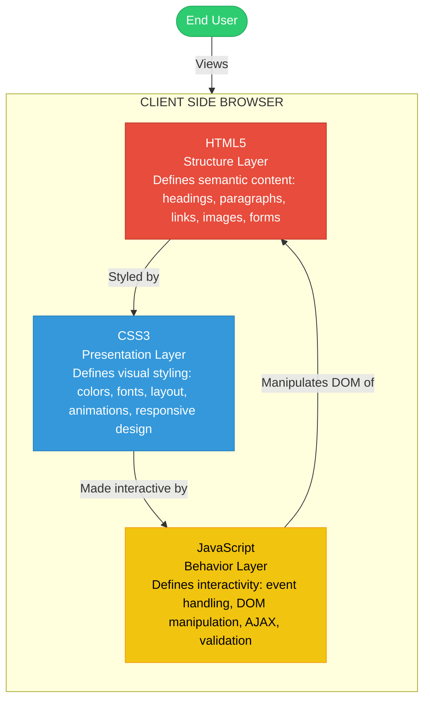
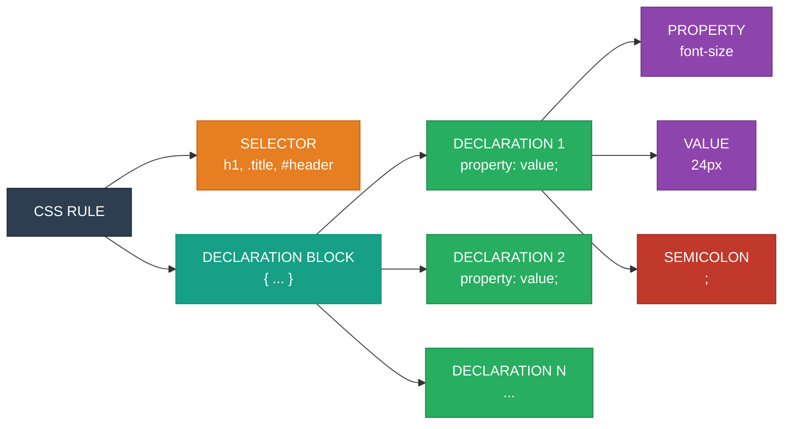
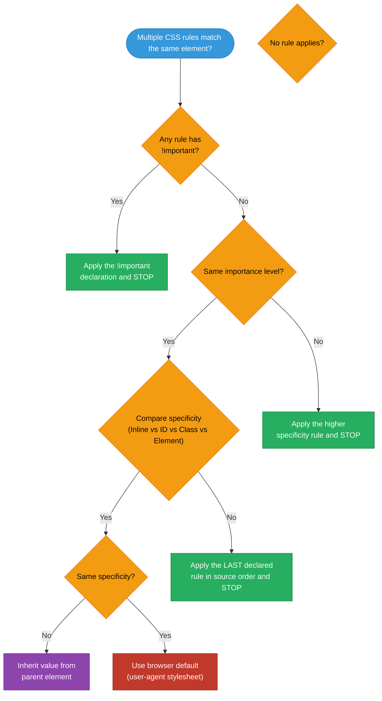
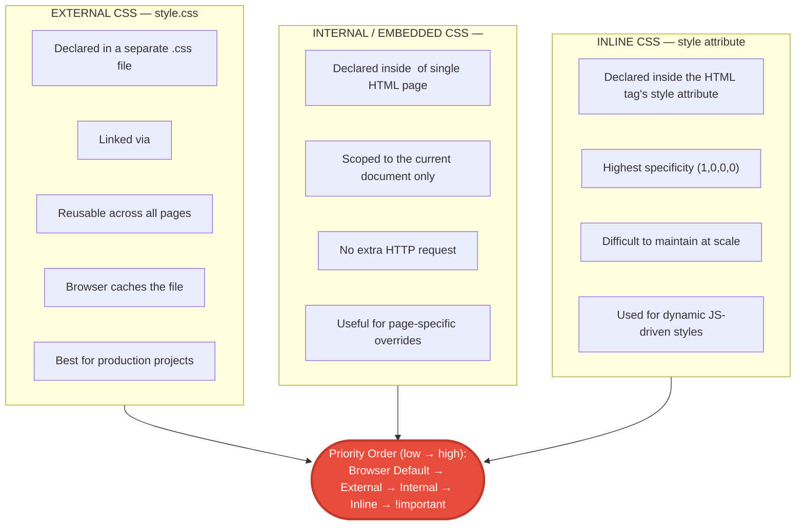
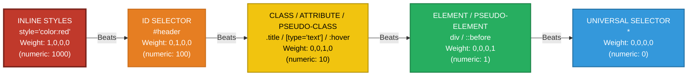

# Styling Web Page using CSS  - Introduction

<!-- SECTION_1_START -->
# Styling Web Page using CSS — Introduction

## 1.1 Formal Academic Definition (KTU 2024 Syllabus Terminology)

> [!IMPORTANT]
> **Cascading Style Sheets (CSS)** is a **style sheet language** used to describe the **presentation** and **visual formatting** of a document written in a markup language such as **HTML5** or **XML**. It is a **W3C (World Wide Web Consortium) Recommendation** that separates **content (HTML)** from **presentation (CSS)**, thereby enabling the principle of **Separation of Concerns (SoC)** in modern web engineering.

In the context of the **KTU 2024 Scheme (Course Code: PECST742 — Web Programming)**, CSS is positioned as the second pillar of front-end web development, complementing **HTML5 (structure)** and **JavaScript (behavior)** within the classic three-tier client-side model:

| Layer | Language | Responsibility |
| :--- | :--- | :--- |
| Structure | HTML5 | Defines the semantic skeleton of the page |
| Presentation | CSS3 | Controls layout, colors, fonts, spacing, animations |
| Behavior | JavaScript | Handles user interactivity and DOM manipulation |

---

## 1.2 Conceptual Analogy / Intuition

> [!NOTE]
> **Analogy: The House and the Interior Designer**
> Think of an HTML5 document as the **bare skeleton of a house** — walls, doors, windows, and rooms are all in place, but everything is grey concrete. **CSS is the interior designer and exterior painter** who decides the wall colors, the texture of the floor tiles, the size of the windows, the type of the roof, and the spacing between furniture.
> Without CSS, every web page would look identical, unstyled, and unreadable — just like walking into an unfinished building. With CSS, you transform raw markup into a polished, branded, responsive user experience.

### Why three layers?

- **HTML alone** → plain, unstyled, monochromatic text (boring).
- **HTML + CSS** → attractive, structured, branded, accessible.
- **HTML + CSS + JS** → fully interactive, dynamic web application (e.g., Gmail, Amazon).

---

## 1.3 Core CSS Terminology

> [!NOTE]
> **The Three CSS Building Blocks**
> 1. **Property** — The stylistic attribute you want to change (e.g., `color`, `font-size`, `margin`).
> 2. **Value** — The specific setting assigned to the property (e.g., `red`, `16px`, `auto`).
> 3. **Selector** — The HTML element(s) targeted by the rule (e.g., `h1`, `.classname`, `#idname`).

A **CSS Rule** is the combination of a *selector* + *declaration block* (the curly braces containing property-value pairs).

> [!IMPORTANT]
> **Anatomy of a CSS Rule**
> ```css
> selector {
>     property: value;
>     property: value;
> }
> ```
> The **selector** points to the HTML element you wish to style. The **declaration block** contains one or more **declarations** separated by semicolons. Each declaration includes a **CSS property name** and its corresponding **value**, separated by a colon.

---

## 1.4 CSS Versions & Evolution

> [!NOTE]
> **Timeline of CSS Standards**
> - **CSS 1 (1996)** — Basic styling: fonts, colors, alignment, margins, borders.
> - **CSS 2 (1998)** — Positioning (`absolute`, `relative`, `fixed`), z-index, media types.
> - **CSS 2.1 (2004–2011)** — Bug-fix and refinement of CSS 2.
> - **CSS 3 (2011–Present)** — **Modular architecture**: introduces `border-radius`, `box-shadow`, `flexbox`, `grid`, `transforms`, `transitions`, `animations`, `media queries`, and CSS variables (`--custom-property`).
> - **CSS 4 (in progress)** — Future enhancements; selectors `:has()`, `:is()`, `:where()`.

For **KTU 2024 Board Exams**, focus is on **CSS3 fundamentals** as specified in the PECST742 syllabus under Module 1.
<!-- SECTION_1_END -->

<!-- SECTION_2_START -->
# Deep Theoretical Analysis & KTU High-Yield Formula Sheet

## 2.1 Three Methods of Applying CSS

The KTU 2024 syllabus explicitly tests the three CSS application mechanisms. Understanding precedence is critical because it is a frequent Part A question topic.

> [!IMPORTANT]
> **Priority Order (Specificity Cascade — lowest → highest):**
> 1. **Browser Default Styles** (lowest priority)
> 2. **External CSS** — `<link rel="stylesheet" href="style.css">`
> 3. **Internal/Embedded CSS** — `<style> ... </style>` inside `<head>`
> 4. **Inline CSS** — `style="property: value;"` inside an HTML tag (highest priority)
> 5. **`!important` declaration** — overrides ALL of the above (used sparingly; a code smell in production)

### Method 1 — Inline CSS

Applied directly within the HTML tag using the `style` attribute. Highest specificity but **violates the Separation of Concerns principle**.

```html
<p style="color: blue; font-size: 18px;">This is an inline-styled paragraph.</p>
```

- **Pros:** Quick override, high specificity, useful for dynamic JS injection.
- **Cons:** Not reusable, bloats HTML, hard to maintain, defeats the purpose of CSS.

### Method 2 — Internal (Embedded) CSS

Defined within a `<style>` element placed inside the `<head>` of the same HTML document.

```html
<!DOCTYPE html>
<html>
<head>
    <title>Internal CSS Demo</title>
    <style>
        body {
            background-color: #f0f0f0;
            font-family: Arial, sans-serif;
        }
        h1 {
            color: navy;
            text-align: center;
        }
    </style>
</head>
<body>
    <h1>KTU Web Programming</h1>
</body>
</html>
```

- **Pros:** Affects the entire single page; no extra HTTP request.
- **Cons:** Cannot be reused across multiple pages; bloats the HTML file.

### Method 3 — External CSS

CSS rules are written in a **separate `.css` file** and linked via the `<link>` element.

**`style.css`**
```css
body {
    margin: 0;
    padding: 0;
    background-color: #ffffff;
}
h1 {
    color: #003366;
    border-bottom: 2px solid #003366;
}
```

**`index.html`**
```html
<!DOCTYPE html>
<html>
<head>
    <link rel="stylesheet" href="style.css">
</head>
<body>
    <h1>External CSS Demo</h1>
</body>
</html>
```

- **Pros:** **Reusable across unlimited pages**, browser caches the file, clean separation, professional industry standard.
- **Cons:** Extra HTTP request; page may render with a brief **Flash of Unstyled Content (FOUC)** before the file loads.

---

## 2.2 CSS Syntax — Detailed Breakdown

> [!NOTE]
> **General CSS Rule Structure**
> ```css
> selector [, selector2, ...] {
>     property-1: value-1;
>     property-2: value-2 [ !important ];
> }
> ```

**Syntax Rules:**
- Declarations are separated by **semicolons (`;`)**.
- Property-value pairs are separated by **colons (`:`)**.
- Whitespace and newlines are **ignored** by the CSS parser — format freely.
- The last declaration's semicolon is optional but **strongly recommended** for forward-compatibility.
- Curly braces `{ }` are **mandatory**.

---

## 2.3 CSS Selectors — The Heart of Targeting

Selectors are the **addressing mechanism** of CSS. KTU 2024 expects familiarity with the following.

### 2.3.1 Universal Selector (`*`)

Targets **every element** in the document.

```css
* {
    margin: 0;
    padding: 0;
    box-sizing: border-box;
}
```

### 2.3.2 Element / Type Selector

Targets all instances of a given HTML tag.

```css
p {
    line-height: 1.6;
    color: #333333;
}
```

### 2.3.3 Class Selector (`.classname`)

Targets elements with a specific `class` attribute. **Reusable**, can be applied to multiple elements.

```css
.highlight {
    background-color: yellow;
    font-weight: bold;
}
```

```html
<p class="highlight">Selected text</p>
```

### 2.3.4 ID Selector (`#idname`)

Targets **one unique element** with a specific `id` attribute. **Higher specificity** than class selectors.

```css
#main-header {
    background-color: black;
    color: white;
}
```

```html
<header id="main-header">Welcome</header>
```

> [!WARNING]
> **KTU Examiner's Note:** IDs should be **unique** within a page. Using the same ID on multiple elements is invalid HTML and produces unpredictable CSS behavior.

### 2.3.5 Group Selector

Combines multiple selectors that share the same styles. Reduces repetition.

```css
h1, h2, h3 {
    font-family: Georgia, serif;
    color: darkblue;
}
```

### 2.3.6 Descendant Selector

Targets an element that is nested inside another element (at any depth).

```css
article p {
    text-indent: 20px;
    color: #444444;
}
```

This applies to every `<p>` that is a descendant of an `<article>`.

---

## 2.4 KTU High-Yield CSS Properties Cheat Sheet

> [!NOTE]
> The following table is a **high-yield reference** for the KTU board exam. Memorize the property names, common values, and the units.

| Property | Purpose | Common Values | Default |
| :--- | :--- | :--- | :--- |
| `color` | Text color | `red`, `#ff0000`, `rgb(255,0,0)` | browser-defined |
| `background-color` | Element background | `lightblue`, `#e0e0e0` | `transparent` |
| `background-image` | Background image | `url('bg.png')` | `none` |
| `font-family` | Typeface | `Arial, sans-serif` | browser default |
| `font-size` | Text size | `16px`, `1.2em`, `100%` | `16px` |
| `font-weight` | Boldness | `normal`, `bold`, `100`-`900` | `normal` |
| `font-style` | Italics | `normal`, `italic` | `normal` |
| `text-align` | Horizontal alignment | `left`, `right`, `center`, `justify` | `left` |
| `text-decoration` | Underline/overline | `none`, `underline`, `line-through` | `none` |
| `text-transform` | Case conversion | `uppercase`, `lowercase`, `capitalize` | `none` |
| `line-height` | Vertical line spacing | `1.5`, `24px` | `normal` |
| `letter-spacing` | Space between characters | `2px`, `0.1em` | `normal` |
| `width` / `height` | Element dimensions | `300px`, `50%`, `auto` | `auto` |
| `margin` | Outer spacing | `10px`, `0 auto`, `1em 2em` | `0` |
| `padding` | Inner spacing | `15px`, `10px 20px` | `0` |
| `border` | Element border | `1px solid black` | `none` |
| `border-radius` | Rounded corners | `5px`, `50%` | `0` |
| `display` | Layout mode | `block`, `inline`, `inline-block`, `flex`, `grid`, `none` | `inline` |
| `visibility` | Hide element (preserves space) | `visible`, `hidden` | `visible` |
| `opacity` | Transparency | `0.0` to `1.0` | `1` |

---

## 2.5 CSS Color Representation

KTU frequently tests the different notations for color values.

| Notation | Example | Description |
| :--- | :--- | :--- |
| **Color Name** | `red`, `tomato`, `royalblue` | Predefined browser-supported names (~140) |
| **Hexadecimal** | `#ff0000`, `#f00`, `#ff0000aa` | RGB in base-16; `#RRGGBB` or shorthand `#RGB` |
| **RGB** | `rgb(255, 0, 0)` | Red, Green, Blue each `0`-`255` |
| **RGBA** | `rgba(255, 0, 0, 0.5)` | RGB + Alpha (transparency `0.0`-`1.0`) |
| **HSL** | `hsl(0, 100%, 50%)` | Hue, Saturation, Lightness |
| **HSLA** | `hsla(0, 100%, 50%, 0.5)` | HSL + Alpha |

---

## 2.6 CSS Length Units

> [!IMPORTANT]
> **Absolute Units** — fixed, not scalable
> - `px` (pixels) — most common in screen design
> - `pt`, `cm`, `mm`, `in` — used primarily for print
>
> **Relative Units** — scale relative to parent or root
> - `%` — percentage of parent
> - `em` — relative to **parent's** font-size
> - `rem` — relative to **root** (`<html>`) font-size (preferred for responsive design)
> - `vw`, `vh` — 1% of viewport width / height
> - `vmin`, `vmax` — 1% of viewport's smaller / larger dimension

---

## 2.7 Real-World Engineering Utility of CSS

> [!NOTE]
> **Why CSS matters in production systems:**
> 1. **Brand Consistency** — Companies like Google, Apple, and Amazon use centralized CSS frameworks to ensure every page reflects corporate identity.
> 2. **Responsive Web Design (RWD)** — CSS **media queries** and **flexbox/grid** enable a single codebase to adapt from mobile (320px) to 4K desktop screens.
> 3. **Performance** — External CSS files are cached by the browser, reducing bandwidth and improving load times (Core Web Vitals — Google's ranking factor).
> 4. **Accessibility (a11y)** — Proper CSS ensures WCAG compliance (contrast ratios, focus indicators, font sizes).
> 5. **Theming** — Dark mode, light mode, high-contrast mode all achieved via CSS variables and `prefers-color-scheme` media query.
> 6. **Animation & UX** — `transition` and `animation` properties enable smooth, GPU-accelerated visual feedback without JavaScript.
<!-- SECTION_2_END -->

<!-- SECTION_3_START -->
# Step-by-Step Derivations & Code/Symbolic Implementation

## 3.1 Worked Example 1 — Building a Styled Web Page (Full Implementation)

**Problem Statement (KTU Lab/Assignment Style):**
*Create an HTML5 page that displays a college notice board with a styled heading, three notice cards, and a footer. Use external CSS for all styling.*

### Step 1: Create the HTML file `index.html`

```html
<!DOCTYPE html>
<html lang="en">
<head>
    <meta charset="UTF-8">
    <meta name="viewport" content="width=device-width, initial-scale=1.0">
    <title>KTU Notice Board</title>
    <link rel="stylesheet" href="style.css">
</head>
<body>
    <header>
        <h1>APJ Abdul Kalam Technological University</h1>
        <h2>Official Notice Board</h2>
    </header>

    <main>
        <section class="notice-card">
            <h3>Examination Schedule</h3>
            <p>B.Tech S8 exams commence from 1st May 2025. Hall tickets available from 25th April.</p>
        </section>

        <section class="notice-card highlight">
            <h3>Project Review</h3>
            <p>Final year project reviews scheduled for next Monday at 10:00 AM in CS Department.</p>
        </section>

        <section class="notice-card">
            <h3>Hackathon 2025</h3>
            <p>Register for the inter-college hackathon before 15th April. Prize pool: 1 Lakh INR.</p>
        </section>
    </main>

    <footer>
        <p>&copy; 2025 KTU Web Programming Lab</p>
    </footer>
</body>
</html>
```

### Step 2: Create the External CSS file `style.css`

```css
/* ===== Global Reset ===== */
* {
    margin: 0;
    padding: 0;
    box-sizing: border-box;
}

/* ===== Body Styling ===== */
body {
    font-family: 'Segoe UI', Arial, sans-serif;
    background-color: #f4f6f9;
    color: #2c3e50;
    line-height: 1.6;
}

/* ===== Header Styling ===== */
header {
    background-color: #003366;
    color: #ffffff;
    padding: 30px 20px;
    text-align: center;
    border-bottom: 5px solid #ffb300;
}

header h1 {
    font-size: 28px;
    letter-spacing: 1px;
}

header h2 {
    font-size: 18px;
    font-weight: normal;
    margin-top: 5px;
    color: #ffb300;
}

/* ===== Notice Cards ===== */
main {
    max-width: 900px;
    margin: 30px auto;
    padding: 0 20px;
}

.notice-card {
    background-color: #ffffff;
    border: 1px solid #e0e0e0;
    border-left: 5px solid #003366;
    border-radius: 8px;
    padding: 20px;
    margin-bottom: 20px;
    box-shadow: 0 2px 5px rgba(0, 0, 0, 0.08);
    transition: transform 0.3s ease, box-shadow 0.3s ease;
}

.notice-card:hover {
    transform: translateY(-4px);
    box-shadow: 0 6px 15px rgba(0, 0, 0, 0.12);
}

.notice-card h3 {
    color: #003366;
    margin-bottom: 10px;
    font-size: 20px;
}

.notice-card p {
    color: #555555;
    font-size: 15px;
}

/* ===== Highlighted Notice Card ===== */
.notice-card.highlight {
    border-left-color: #d32f2f;
    background-color: #fff8f8;
}

.notice-card.highlight h3 {
    color: #d32f2f;
}

/* ===== Footer ===== */
footer {
    text-align: center;
    padding: 20px;
    background-color: #003366;
    color: #ffffff;
    font-size: 14px;
    margin-top: 40px;
}
```

### Step 3: Line-by-Line Explanation of Key CSS Rules

| Line | Code | Purpose |
| :--- | :--- | :--- |
| 2-5 | `* { margin: 0; padding: 0; box-sizing: border-box; }` | **CSS Reset** — removes browser default margins/padding so layout is predictable across Chrome, Firefox, Edge. |
| 9-13 | `body { font-family: ...; background-color: ...; }` | Sets the **base font stack** and page background. Sans-serif fallback ensures rendering on systems missing the primary font. |
| 17 | `padding: 30px 20px;` | **Shorthand** = top/bottom 30px, left/right 20px. |
| 23-26 | `letter-spacing: 1px;` | Adds breathing room between characters in the heading. |
| 32 | `max-width: 900px; margin: 30px auto;` | Centers the main content with a max width — a **responsive design pattern** (works on mobile, caps width on desktop). |
| 40-44 | `box-shadow: 0 2px 5px rgba(0,0,0,0.08);` | Creates a subtle elevation effect using **offset-X, offset-Y, blur-radius, color-with-alpha**. |
| 45 | `transition: transform 0.3s ease;` | Animates the `transform` property smoothly over 0.3s when the card is hovered. |
| 49-52 | `transform: translateY(-4px);` | Lifts the card 4 pixels on hover, creating a "lift" effect. |
| 64-65 | `.notice-card.highlight { ... }` | **Compound selector** — applies only to elements that have **both** `notice-card` AND `highlight` classes. |

---

## 3.2 Worked Example 2 — Specificity Calculation

**Problem (KTU Conceptual):** *Given the following HTML and CSS, which color will the paragraph text display? Justify using specificity.*

```html
<p id="intro" class="text" style="color: green;">Hello KTU</p>
```

```css
p            { color: red; }       /* Specificity: 0,0,0,1 */
.text        { color: blue; }      /* Specificity: 0,0,1,0 */
#intro       { color: yellow; }    /* Specificity: 0,1,0,0 */
```

### Step-by-Step Specificity Calculation

The CSS specificity is calculated as a four-part number: **(Inline, ID, Class, Element)**.

| Selector | Inline | ID | Class | Element | Total | Numeric |
| :--- | :---: | :---: | :---: | :---: | :--- | :---: |
| `p` | 0 | 0 | 0 | 1 | `0,0,0,1` | 1 |
| `.text` | 0 | 0 | 1 | 0 | `0,0,1,0` | 10 |
| `#intro` | 0 | 1 | 0 | 0 | `0,1,0,0` | 100 |
| `style="..."` | 1 | 0 | 0 | 0 | `1,0,0,0` | 1000 |

### Resolution Logic

1. Browser applies the element selector `p` → text turns **red**.
2. Class selector `.text` overrides → text turns **blue**.
3. ID selector `#intro` overrides → text turns **yellow**.
4. **Inline style** `style="color: green;"` overrides all external/internal CSS → text turns **green**.

> [!IMPORTANT]
> **Final Answer: The text will be displayed in GREEN.**
> Reason: Inline styles have the highest specificity (`1,0,0,0`), beating ID, class, and element selectors. The `!important` keyword would be the only way to override an inline style externally.

### Specificity Tie-Breaker Rule

When two selectors have **equal specificity**, the rule that appears **later in the source order** wins.

```css
.intro { color: red; }
.intro { color: orange; }   /* WINS - defined later */
```

---

## 3.3 Worked Example 3 — CSS Cascade Order (Full Algorithm)

The **cascade** is the algorithm browsers use to resolve conflicts when multiple rules target the same element.

> [!NOTE]
> **The Cascade Algorithm (in order of priority):**
> 1. **Importance** — `!important` declarations (highest).
> 2. **Origin** — User-agent → User → Author (lowest to highest).
> 3. **Specificity** — Higher specificity wins (as calculated above).
> 4. **Source Order** — Later rules win when specificity ties.
> 5. **Inheritance** — If no rule applies, properties are inherited from the parent.

```css
/* Layered example */
p        { color: black; }              /* Specificity 0,0,0,1 */
.text   { color: blue !important; }     /* !important beats all */
#intro  { color: yellow; }              /* High specificity but no !important */
p       { color: red; }                 /* Same specificity, appears later */
```

For a `<p id="intro" class="text">` element:
- The final color is **BLUE** (because of `!important`).

---

## 3.4 Worked Example 4 — CSS Comments Syntax

```css
/* This is a single-line comment */

/* This is a
   multi-line comment
   spanning three lines */

p {
    color: red; /* Inline comment explaining the color choice */
    font-size: 16px;
}
```

> [!WARNING]
> HTML comments use `<!-- -->`, but **CSS only recognizes `/* */`**. Using HTML comments inside a `.css` file will cause the browser to ignore those rules and may produce a syntax error.

---

## 3.5 Industry Best-Practice Implementation (External CSS Pattern)

For a production KTU project, the recommended folder structure is:

```
project-root/
├── index.html
├── about.html
├── contact.html
├── css/
│   ├── reset.css          /* Normalize/Reset browser defaults */
│   ├── layout.css         /* Page structure and grid */
│   ├── components.css     /* Buttons, cards, navbars */
│   └── theme.css          /* Colors, fonts, CSS variables */
├── js/
│   └── main.js
└── images/
    └── logo.png
```

**`index.html` linking multiple external stylesheets:**

```html
<head>
    <link rel="stylesheet" href="css/reset.css">
    <link rel="stylesheet" href="css/theme.css">
    <link rel="stylesheet" href="css/layout.css">
    <link rel="stylesheet" href="css/components.css">
</head>
```

> [!IMPORTANT]
> The **order matters** — later stylesheets override earlier ones (assuming equal specificity). Always load `reset.css` first, then theme, then layout, then components.
<!-- SECTION_3_END -->

<!-- SECTION_4_START -->
# Structural Diagrams & Schematics

## 4.1 The Web Development Trinity (Layered Architecture)



**Visual Description:** The diagram isolates the three client-side layers. HTML provides the structural skeleton (red), CSS applies the visual presentation (blue), and JavaScript enables dynamic behavior (yellow). The user interacts only with the rendered composite of all three.

---

## 4.2 CSS Rule Anatomy (Component Breakdown)



**Visual Description:** A single CSS rule consists of a selector (orange) followed by a declaration block (teal) containing multiple declarations. Each declaration pairs a property (purple) with a value (purple) and is terminated by a semicolon (red).

---

## 4.3 The CSS Cascade Resolution Algorithm (Flowchart)



**Visual Description:** When the browser encounters conflicting CSS rules, it follows this decision tree. The `!important` flag is checked first (top-priority shortcut). Otherwise, the browser compares origin and specificity. Ties are broken by source order. If nothing matches, inheritance or browser defaults apply.

---

## 4.4 Three Methods of CSS Application (Comparison Block Diagram)



**Visual Description:** The diagram organizes the three CSS application methods into three independent blocks (External, Internal, Inline) with their characteristic traits. The red priority banner at the bottom summarizes the specificity cascade used to resolve conflicts between them.

---

## 4.5 Specificity Weighting (Numeric Hierarchy)



**Visual Description:** The specificity pyramid flows from most powerful (red, top) to least powerful (blue, bottom). The arrows indicate "beats" relationships — Inline beats ID beats Class beats Element beats Universal. Use this hierarchy to predict which CSS rule will win in any conflict scenario.
<!-- SECTION_4_END -->

<!-- SECTION_5_START -->
# KTU 2024 Scheme Examination Question Bank & Topic Recap

---

## 5.1 Part A Questions (2 × 3 Marks = 6 Marks)

### Question 1 (3 Marks) — `[KTU University Exam - July 2024]`

**Define CSS. Explain the three methods of applying CSS to an HTML document with suitable examples.**

**Mapped CO:** CO1 — *Understand the fundamentals of web technologies* | **RBT Level:** Understand

**Model Answer:**

**Definition (1 Mark):**
> Cascading Style Sheets (CSS) is a style sheet language used to describe the presentation and visual formatting of documents written in HTML or XML. CSS separates content (HTML) from presentation, enabling the principle of Separation of Concerns.

**Three Methods (2 Marks):**

1. **Inline CSS** — Written inside the HTML tag's `style` attribute. Highest specificity.
   ```html
   <h1 style="color: red;">Hello</h1>
   ```

2. **Internal/Embedded CSS** — Written inside a `<style>` element within the `<head>` of the HTML document. Scoped to that single page.
   ```html
   <head><style>h1 { color: red; }</style></head>
   ```

3. **External CSS** — Written in a separate `.css` file and linked via the `<link>` element in `<head>`. Reusable across multiple pages.
   ```html
   <link rel="stylesheet" href="style.css">
   ```

**Valuation Key:**
- [Definition with at least one key term ("style sheet", "presentation"): 1 Mark]
- [Naming and explaining all three methods with at least one example: 2 Marks]

---

### Question 2 (3 Marks) — `[KTU University Exam - Dec 2023]`

**Explain the different types of CSS selectors with examples.**

**Mapped CO:** CO1 | **RBT Level:** Remember / Understand

**Model Answer:**

CSS selectors are patterns used to select the HTML element(s) you want to style. The main types are:

| Type | Syntax | Selects | Example |
| :--- | :--- | :--- | :--- |
| Universal | `*` | All elements | `* { margin: 0; }` |
| Element | `tagname` | All instances of tag | `p { color: blue; }` |
| Class | `.classname` | Elements with that class | `.btn { padding: 10px; }` |
| ID | `#idname` | Element with that unique ID | `#header { background: black; }` |
| Group | `A, B, C` | Multiple selectors | `h1, h2, h3 { color: navy; }` |
| Descendant | `A B` | B nested inside A | `div p { font-size: 14px; }` |

**Valuation Key:**
- [Listing at least 4 selector types: 1 Mark]
- [Correct syntax and example for each: 2 Marks]

---

## 5.2 Part B Question A (14 Marks) — `[KTU University Exam - July 2024]`

### Question A (14 Marks)

**(a) Explain the CSS syntax with a neat diagram. List any FIVE commonly used CSS properties with their purpose. (7 Marks)**

**Mapped CO:** CO1 | **RBT Level:** Understand

**Model Answer:**

**(a) CSS Syntax (4 Marks):**

The general syntax of a CSS rule is:

```css
selector {
    property-1: value-1;
    property-2: value-2;
    /* comment */
}
```

**Components:**
- **Selector** — points to the HTML element to be styled (e.g., `h1`, `.class`, `#id`).
- **Declaration Block** — enclosed in curly braces `{ }`.
- **Declaration** — a `property: value;` pair.
- **Property** — the stylistic attribute (e.g., `color`, `font-size`).
- **Value** — the assigned setting (e.g., `red`, `16px`).

**Syntax Rules:**
- Declarations are separated by **semicolons** (`;`).
- Property and value are separated by a **colon** (`:`).
- The final semicolon is optional but recommended.
- Whitespace is ignored by the CSS parser.

**Visual Diagram (2 Marks):**

```
        +-----------------+
        |    SELECTOR     |   --->  h1
        +-----------------+
                |
                v
        +-----------------+
        |       {         |
        |  property: val; |   --->  color: navy;
        |  property: val; |   --->  font-size: 24px;
        |  property: val; |   --->  text-align: center;
        |       }         |
        +-----------------+
```

**Five Common CSS Properties (3 Marks):**

| # | Property | Purpose | Example Value |
| :--- | :--- | :--- | :--- |
| 1 | `color` | Sets the text foreground color | `red`, `#ff0000` |
| 2 | `background-color` | Sets the element's background color | `lightblue` |
| 3 | `font-size` | Sets the size of the text | `16px`, `1.2em` |
| 4 | `text-align` | Horizontally aligns text | `center`, `justify` |
| 5 | `margin` | Sets the outer spacing around an element | `10px`, `0 auto` |

**Valuation Key:**
- [Correctly stating the syntax components: 2 Marks]
- [Drawing the diagram of CSS rule structure: 2 Marks]
- [Listing 5 properties with correct purpose and value: 3 Marks]

---

**(b) Write an external CSS file to design a webpage that contains a header with the college name, a paragraph about the department, and a footer with the copyright notice. Apply different colors, fonts, and padding using class and ID selectors. (7 Marks)**

**Mapped CO:** CO2 — *Develop static web pages using HTML5 and CSS3* | **RBT Level:** Apply

**Model Answer:**

**`index.html`** (2 Marks):
```html
<!DOCTYPE html>
<html lang="en">
<head>
    <meta charset="UTF-8">
    <title>KTU Computer Science Department</title>
    <link rel="stylesheet" href="style.css">
</head>
<body>
    <header id="college-header">
        <h1>APJ Abdul Kalam Technological University</h1>
    </header>

    <section id="dept-info">
        <h2 class="section-title">Department of Computer Science</h2>
        <p class="content">
            The Department of Computer Science offers B.Tech, M.Tech, and Ph.D. programs
            with specializations in AI, Data Science, and Cyber Security. Our faculty
            are actively engaged in cutting-edge research funded by DST and AICTE.
        </p>
    </section>

    <footer id="page-footer">
        <p>&copy; 2025 KTU CS Department. All rights reserved.</p>
    </footer>
</body>
</html>
```

**`style.css`** (4 Marks):
```css
/* Global Reset */
* {
    margin: 0;
    padding: 0;
    box-sizing: border-box;
}

body {
    font-family: 'Segoe UI', Tahoma, sans-serif;
    background-color: #f9f9f9;
}

/* ID Selector — unique header */
#college-header {
    background-color: #003366;
    color: #ffffff;
    padding: 25px;
    text-align: center;
    border-bottom: 4px solid #ffb300;
}

#college-header h1 {
    font-family: Georgia, serif;
    font-size: 26px;
    letter-spacing: 1.5px;
}

/* Class Selector — reusable styling */
.section-title {
    color: #003366;
    font-size: 22px;
    margin: 20px 0 10px;
    padding-left: 15px;
    border-left: 4px solid #ffb300;
}

.content {
    color: #333333;
    font-size: 16px;
    line-height: 1.7;
    padding: 15px;
    background-color: #ffffff;
    border-radius: 6px;
}

/* ID Selector — unique footer */
#page-footer {
    background-color: #222222;
    color: #cccccc;
    text-align: center;
    padding: 15px;
    margin-top: 30px;
    font-size: 13px;
}
```

**Expected Output (1 Mark):**
A visually styled page with a navy-blue header bearing the college name, a white content card with the department description, and a dark-grey footer with the copyright message.

**Valuation Key:**
- [Correctly creating the HTML structure with linked stylesheet: 2 Marks]
- [Using `#id` selectors for unique header/footer: 1 Mark]
- [Using `.class` selectors for reusable content: 1 Mark]
- [Applying colors, fonts, and padding: 1 Mark]
- [Proper CSS file structure and properties: 1 Mark]
- [Final expected output visible: 1 Mark]

---

## 5.3 Part B Question B (14 Marks) — Alternative Choice `[KTU University Exam - Dec 2023]`

### Question B (14 Marks)

**(a) Explain CSS specificity with an example. How is it calculated? Why does inline style override external stylesheet? (7 Marks)**

**Mapped CO:** CO1 | **RBT Level:** Understand / Apply

**Model Answer:**

**Definition (2 Marks):**
> CSS specificity is the algorithm used by browsers to determine which CSS rule applies when multiple rules target the same element. It is calculated as a four-part tuple: **(Inline, ID, Class/Attribute/Pseudo-class, Element/Pseudo-element)**.

**Calculation Method (3 Marks):**

The specificity is expressed as `(a, b, c, d)`:
- `a` = 1 if inline style present, else 0.
- `b` = number of ID selectors.
- `c` = number of class selectors, attribute selectors, and pseudo-classes.
- `d` = number of element selectors and pseudo-elements.

**Worked Example:**

```html
<p id="title" class="text">Hello KTU</p>
```

```css
p                { color: red; }      /* (0, 0, 0, 1) */
.text            { color: blue; }     /* (0, 0, 1, 0) */
#title           { color: green; }    /* (0, 1, 0, 0) */
[style*="color"] { color: orange; }   /* (0, 0, 1, 0) */
p.text#title     { color: purple; }   /* (0, 1, 1, 1) */
```

Specificity comparison (low → high):

| Selector | Specificity | Numeric |
| :--- | :--- | :---: |
| `p` | `(0,0,0,1)` | 1 |
| `.text` | `(0,0,1,0)` | 10 |
| `#title` | `(0,1,0,0)` | 100 |
| `p.text#title` | `(0,1,1,1)` | 111 |

The compound selector `p.text#title` wins with the highest specificity.

**Why Inline Style Overrides External CSS (2 Marks):**

Inline styles are written directly within the HTML element's `style` attribute and have a specificity of `(1, 0, 0, 0)`. This is the **highest baseline specificity** in CSS — higher than any ID, class, or element selector from an external stylesheet. Therefore, an inline style will always override an external stylesheet rule unless that external rule uses the `!important` keyword.

Example:
```html
<p style="color: red;">Hello</p>      <!-- Wins: inline (1,0,0,0) -->
```

```css
#title { color: blue; }   /* Loses: ID (0,1,0,0) — lower than inline */
```

**Valuation Key:**
- [Definition of specificity: 1 Mark]
- [Explanation of the (a,b,c,d) calculation: 1 Mark]
- [Worked example with at least 3 selectors and their specificity values: 1 Mark]
- [Clear reasoning for why inline beats external: 1 Mark]
- [Correct final answer with worked numeric example: 1 Mark]
- [Diagram or table for clarity: 1 Mark]
- [Mentioning `!important` override: 1 Mark]

---

**(b) Differentiate between Internal CSS and External CSS. Create a web page demonstrating the use of at least THREE different selectors (element, class, and id) with internal CSS. (7 Marks)**

**Mapped CO:** CO1, CO2 | **RBT Level:** Apply

**Model Answer:**

**Difference Table (3 Marks):**

| Feature | Internal CSS | External CSS |
| :--- | :--- | :--- |
| Definition | Written inside `<style>` tag within HTML `<head>` | Written in a separate `.css` file |
| Scope | Affects only the current page | Affects all pages that link the file |
| Reusability | Not reusable across pages | Fully reusable across multiple pages |
| HTTP Request | No additional request (saves bandwidth) | Requires one extra HTTP request |
| Maintenance | Difficult for large projects | Easy maintenance with one source of truth |
| Caching | Not cached separately | Cached by the browser, faster subsequent loads |
| Use Case | Single-page demos, quick prototypes | Multi-page websites, production systems |

**Code Implementation (4 Marks):**

```html
<!DOCTYPE html>
<html lang="en">
<head>
    <meta charset="UTF-8">
    <title>Internal CSS Selectors Demo</title>
    <style>
        /* Element Selector */
        h1 {
            color: darkblue;
            text-align: center;
            font-size: 28px;
        }

        /* Class Selector */
        .highlight {
            background-color: #fff3cd;
            padding: 10px;
            border-left: 4px solid #ffc107;
            font-weight: bold;
        }

        /* ID Selector */
        #main-content {
            max-width: 700px;
            margin: 20px auto;
            padding: 25px;
            background-color: #ffffff;
            border: 1px solid #e0e0e0;
            border-radius: 8px;
            font-family: Arial, sans-serif;
        }
    </style>
</head>
<body>
    <h1>Welcome to KTU</h1>
    <div id="main-content">
        <p class="highlight">This paragraph is styled using a CLASS selector.</p>
        <p>The container div is styled using an ID selector, while the h1 above uses an ELEMENT selector.</p>
    </div>
</body>
</html>
```

**Output Description (Bonus):**
- The `<h1>` is centered, dark blue, 28px (Element selector).
- The first `<p>` has a yellow background, padding, and a gold left border (Class selector).
- The container `<div>` is a white card with a max-width of 700px, centered horizontally (ID selector).

**Valuation Key:**
- [Comparison table with at least 5 valid difference points: 3 Marks]
- [Correctly using `<style>` tag inside `<head>`: 1 Mark]
- [Implementing all three selector types: 1 Mark]
- [Different properties applied to each selector: 1 Mark]
- [Well-formatted, valid HTML5 document: 1 Mark]

---

## 5.4 KTU Examiner's Valuation Warning / Pitfall Callout

> [!WARNING]
> **Common Mistakes That Cost Marks in CSS Questions**
> 1. **Missing semicolons** — Always terminate declarations with `;`. Although the last one is optional, forgetting semicolons mid-rule is a syntax error.
> 2. **Confusing class and ID selectors** — `.classname` vs `#idname`. Using the wrong symbol is an immediate 1-mark deduction.
> 3. **Forgetting units on numerical values** — `font-size: 16;` is invalid. Use `16px`, `1.2em`, or `100%`.
> 4. **Writing CSS comments using HTML syntax** — `<!-- -->` will break the CSS file. Use `/* */` only.
> 5. **Applying ID to multiple elements** — IDs must be unique. If you need to style multiple elements, use a class.
> 6. **Failing to mention the cascade order** — When asked "which rule wins", explicitly cite specificity, source order, and `!important`.
> 7. **Inline CSS in production answers** — KTU prefers external CSS in Part B questions. Use inline only when explicitly asked.
> 8. **Wrong `<link>` syntax** — The correct form is `<link rel="stylesheet" href="style.css">`, not `<link src="...">`.
> 9. **Not drawing the CSS rule anatomy diagram** — When asked for syntax, always include a labeled diagram for full marks.
> 10. **Confusing `display: none` with `visibility: hidden`** — `display: none` removes from layout; `visibility: hidden` reserves the space.

---

## 5.5 Topic Recap & Important Things to Remember

> [!NOTE]
> **Rapid-Revision Checklist — CSS Introduction**

- **CSS** = Cascading Style Sheets; **W3C-recommended** style sheet language; separates content from presentation.
- **Three layers of web development:** HTML5 (structure) + CSS3 (presentation) + JavaScript (behavior).
- **Three methods of applying CSS:** Inline, Internal (`<style>`), External (`<link>`).
- **Priority order (low → high):** Browser default → External → Internal → Inline → `!important`.
- **CSS Rule syntax:** `selector { property: value; }` — semicolons separate declarations, colons separate property from value.
- **Six major selectors:** Universal (`*`), Element (`p`), Class (`.cls`), ID (`#id`), Group (`A, B`), Descendant (`A B`).
- **Specificity formula:** `(Inline, ID, Class, Element)` — higher wins.
- **Specificity numeric weights:** Inline = 1000, ID = 100, Class = 10, Element = 1.
- **`!important` keyword** overrides all other rules — use sparingly.
- **Cascade tie-breaker:** When specificity is equal, the **last declared** rule wins.
- **CSS comments** use `/* ... */` — never `<!-- -->`.
- **Color notations:** Name, Hex (`#fff`), RGB, RGBA, HSL, HSLA.
- **Length units:** Absolute (`px`, `pt`, `cm`) vs Relative (`%`, `em`, `rem`, `vw`, `vh`).
- **Class vs ID:** Class = reusable, multiple elements; ID = unique, one per page, higher specificity.
- **External CSS** is the **industry best practice** for KTU projects — encourages reusability, caching, and clean separation.
- **Box model foundation:** Every HTML element is treated as a rectangular box with `content`, `padding`, `border`, and `margin`.
- **CSS Reset pattern:** `* { margin: 0; padding: 0; box-sizing: border-box; }` at the top of every stylesheet.
- **Inheritance:** Properties like `color` and `font-family` are inherited; properties like `margin` and `width` are not.
- **For KTU board exams:** Always include a **diagram** of the CSS rule anatomy and a **table** comparing selector types.
<!-- SECTION_5_END -->
