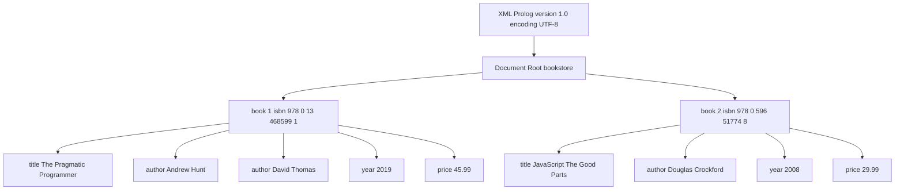
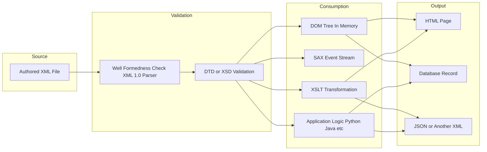
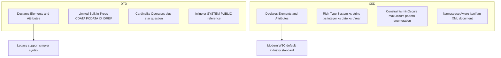
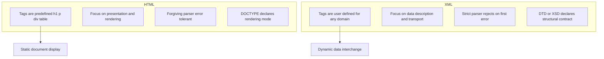

# XML Basics

<!-- SECTION_1_START -->
# XML Basics — Core Technical Definition & Intuitive Overview

## Formal Academic Definition (KTU 2024 Syllabus Terminology)

> [!IMPORTANT]
> **XML (eXtensible Markup Language)** is a **W3C-recommended**, text-based, platform-independent **meta-language** used to define, store, transport, and exchange structured data on the World Wide Web. Unlike HTML (which focuses on **presentation**), XML focuses purely on **describing data semantics** through user-defined tags enclosed in angle brackets, governed by the **XML 1.0 Specification (Fifth Edition, W3C Recommendation, 26 November 2008)** and the companion **XML 1.1 Recommendation (W3C, 16 February 2004)**.

XML is governed by the W3C XML Core Working Group and is formally classified under the **SGML (Standard Generalized Markup Language)** family — specifically, a **simplified subset of SGML** designed to be usable over the Internet. The two foundational RFC documents are **RFC 7303** (XML Media Types) and **RFC 4825** (XML Configuration Access Protocol).

## Conceptual Analogy / Intuition

Think of XML as a **set of self-labelled cardboard boxes inside a warehouse**:

1. **The Warehouse (Document)** holds all the boxes.
2. **The Boxes (Elements)** are nested inside one another — a big box can contain smaller boxes.
3. **The Stickers/Labels (Tags)** on each box tell you exactly *what* is inside (e.g., `<name>`, `<price>`).
4. **The Inventory Sheet (DTD / XML Schema)** lists the rules: *which boxes are allowed, how many, and in what order*.
5. **The Forklift (Parser)** reads the warehouse, verifies it matches the inventory, and hands the contents to whoever needs them (browser, database, mobile app).

The single most powerful idea is **"separation of data from display"** — XML stores *what the data is*; CSS, XSLT, or application code decides *how it looks*.

## Key W3C Specifications & Metrics

| Standard | Full Name | Role |
|----------|-----------|------|
| **XML 1.0** | Extensible Markup Language 1.0 | Core syntax |
| **XML 1.1** | Extensible Markup Language 1.1 | Unicode 3.0+ support |
| **DTD** | Document Type Definition | Legacy validation rules |
| **XSD** | XML Schema Definition | Modern typed validation |
| **XSLT** | Extensible Stylesheet Language Transformations | Transformation to HTML/other XML |
| **XPath** | XML Path Language | Querying nodes |
| **DOM** | Document Object Model | In-memory tree access |
| **SAX** | Simple API for XML | Event-based streaming access |

> [!NOTE]
> **KTU 2024 Highlight (PECST742 — Module 1):** Students are expected to write a *valid, well-formed* XML document, attach a *DTD* for validation, and parse it using a *client-side script or server-side language*. Memorize the **prolog structure** `<?xml version="1.0" encoding="UTF-8"?>` and the strict rules for **root elements, case sensitivity, and closing tags**.

> [!VISUALIZATION CONTROL]
> **Concept:** XML Tree (Node Hierarchy) Visualization
> **GeoGebra / Desmos Input Equations (conceptual tree levels):**
> * Root Level: $L_0 = \{\text{bookstore}\}$
> * Level 1: $L_1 = \{\text{book}_1, \text{book}_2\}$
> * Level 2: $L_2 = \{\text{title}, \text{author}, \text{year}, \text{price}\}$ for each $\text{book}_i$
> **Visual Description:** A vertical tree expanding downward — one root node at the top, branching into child nodes, each with its own labeled sub-branches, illustrating the strict **parent–child containment hierarchy** of an XML document.
<!-- SECTION_1_END -->

<!-- SECTION_2_START -->
# Deep Theoretical Analysis & KTU High-Yield Formula Sheet

## Anatomy of a Well-Formed XML Document

A valid KTU-acceptable XML document must obey the following **ten syntactic invariants**. Failure of any one rule produces a *fatal parser error* (the document is *not well-formed* and is rejected).

1. **Exactly one prolog** `<?xml version="1.0" encoding="UTF-8"?>` at the top (optional but strongly recommended).
2. **Exactly one root element** that contains all others.
3. Every **start-tag** `<tag>` must have a matching **end-tag** `</tag>` — no exceptions (empty elements use the self-closing form `<tag/>`).
4. **Case-sensitivity**: `<Title>` and `</title>` are *different* tags → error.
5. Tags must be **properly nested** — overlapping is illegal.
6. **Attribute values must be quoted** with `"` or `'`.
7. An element **cannot have two attributes with the same name**.
8. The five **predefined entity references** must be used for reserved characters: `&lt;` `&gt;` `&amp;` `&apos;` `&quot;`.
9. **Comments** use `<!-- ... -->` and cannot contain `--`.
10. **Whitespace inside tags is preserved** literally; whitespace *between* elements is normalized by the parser.

## The Two Pillars of XML Correctness

> [!IMPORTANT]
> **Well-Formed** ≠ **Valid**
> * **Well-Formed** — obeys the ten W3C syntax rules above. Verified automatically by any parser.
> * **Valid** — well-formed **AND** conforms to a **DTD** or **XML Schema**. Verified against an external contract.

## Document Type Definition (DTD) — Rule Contract

A DTD declares the legal building blocks of an XML document. It can be:
* **Internal** — wrapped in `<!DOCTYPE root [...]>` inside the XML file.
* **External** — referenced via `<!DOCTYPE root SYSTEM "file.dtd">` or a public identifier.

| DTD Construct | Syntax | Meaning |
|---------------|--------|---------|
| Element | `<!ELEMENT name (content-model)>` | Declares element structure |
| Empty | `<!ELEMENT br EMPTY>` | Self-closing only |
| Any | `<!ELEMENT misc ANY>` | Mixed / unspecified content |
| Text | `<!ELEMENT p (#PCDATA)>` | Parsed character data only |
| Sequence | `<!ELEMENT book (title, author)>` | Ordered children |
| Choice | `<!ELEMENT choice (a &vert; b)>` | Exactly one of the listed children |
| Repetition | `+` (one or more), `*` (zero or more), `?` (zero or one) | Cardinality operators |
| Attribute | `<!ATTLIST el name CDATA #REQUIRED>` | Attribute declaration |
| Entity | `<!ENTITY name "value">` | Reusable text replacement |

## XML Schema (XSD) — The Modern Typed Alternative

XSD is **itself an XML document**, supports **data types** (`xs:string`, `xs:integer`, `xs:date`, `xs:boolean`, etc.), **namespaces**, and **inheritance** — none of which plain DTDs support. KTU 2024 examiners may ask for either; XSD is the *industry default* today.

## KTU Formula / Cheat Sheet

> [!NOTE]
> The following table condenses every XML construct you must recognize for PECST742 Module 1.

| Concept | Pattern / Value | Purpose |
|---------|-----------------|---------|
| XML Prolog | `<?xml version="1.0" encoding="UTF-8"?>` | Declares XML version + character encoding |
| Root element | `<root>...</root>` | Single mandatory top-level container |
| Child element | `<child>text</child>` | Data carrier |
| Attribute | `` | Metadata on element |
| Self-closing tag | `<br/>` | Shorthand for empty element |
| Comment | `<!-- text -->` | Ignored by parser |
| CDATA Section | `<![CDATA[ <raw> &text ]]>` | Literal unparsed character data |
| Processing Instruction | `<?target data?>` | Pass instructions to applications (e.g., `<?php ...?>`) |
| Internal DTD | `<!DOCTYPE root [...]>` | Inline schema |
| External DTD | `<!DOCTYPE root SYSTEM "x.dtd">` | Referenced schema |
| Entity ref | `&lt;` `&gt;` `&amp;` `&apos;` `&quot;` | Escape reserved characters |
| Namespace | `xmlns:prefix="URI"` | Disambiguates element names |
| XPath axis | `/root/child[1]/@attr` | Locates nodes |
| Parser type | DOM vs SAX | Tree-based vs event-based reading |

## Real-World Engineering Utility

XML is the silent backbone of:
* **Web Services** — SOAP envelopes, WSDL contracts, REST-XML payloads.
* **Configuration** — `pom.xml` (Maven), `web.xml` (Java EE), `AndroidManifest.xml`, `.csproj` (MSBuild).
* **Data Interchange** — RSS/Atom feeds, Office Open XML (`.docx`, `.xlsx`), SVG vector graphics.
* **Document Formats** — XHTML, DocBook, DITA, Office documents.
* **Databases** — Native XML stores such as **BaseX**, **eXist-db**, and the XML column type in **PostgreSQL** and **SQL Server**.

> [!TIP]
> When KTU asks *"Give two advantages of XML over HTML"*, the board-expected answer is: **(1) XML is extensible — user defines tags**; **(2) XML separates data from presentation**; **(3) XML enforces structural rules via DTD/Schema**; **(4) XML is fully Unicode and platform-neutral**.
<!-- SECTION_2_END -->

<!-- SECTION_3_START -->
# Step-by-Step Derivations & Code Implementation

## Example 1 — A Complete Well-Formed + Valid XML Document (with Internal DTD)

```xml
<?xml version="1.0" encoding="UTF-8"?>
<!DOCTYPE bookstore [
  <!ELEMENT bookstore (book+)>
  <!ELEMENT book    (title, author+, year, price)>
  <!ELEMENT title   (#PCDATA)>
  <!ELEMENT author  (#PCDATA)>
  <!ELEMENT year    (#PCDATA)>
  <!ELEMENT price   (#PCDATA)>
  <!ATTLIST book
       isbn    CDATA  #REQUIRED
       lang    CDATA  "EN"
       edition CDATA  #IMPLIED>
]>
<bookstore>
  <book isbn="978-0-13-468599-1" lang="EN" edition="2nd">
    <title>The Pragmatic Programmer</title>
    <author>Andrew Hunt</author>
    <author>David Thomas</author>
    <year>2019</year>
    <price>45.99</price>
  </book>

  <book isbn="978-0-596-51774-8">
    <title>JavaScript: The Good Parts</title>
    <author>Douglas Crockford</author>
    <year>2008</year>
    <price>29.99</price>
  </book>
</bookstore>
```

### Walkthrough of the DTD Cardinality Rules
* `bookstore (book+)` — bookstore must contain **one or more** `<book>` elements.
* `book (title, author+, year, price)` — title, then **one or more** authors, then year, then price, **in that exact order**.
* `<!ATTLIST book isbn CDATA #REQUIRED>` — every `<book>` **must** carry the `isbn` attribute or the document is invalid.

## Example 2 — The Same Document, but Validated by an External XML Schema (XSD)

**Step 1.** Create `bookstore.xsd` (XSD is itself XML):

```xml
<?xml version="1.0" encoding="UTF-8"?>
<xs:schema xmlns:xs="http://www.w3.org/2001/XMLSchema">

  <xs:element name="bookstore">
    <xs:complexType>
      <xs:sequence>
        <xs:element name="book" maxOccurs="unbounded">
          <xs:complexType>
            <xs:sequence>
              <xs:element name="title"  type="xs:string"/>
              <xs:element name="author" type="xs:string" maxOccurs="unbounded"/>
              <xs:element name="year"   type="xs:gYear"/>
              <xs:element name="price"  type="xs:decimal"/>
            </xs:sequence>
            <xs:attribute name="isbn"    type="xs:string" use="required"/>
            <xs:attribute name="lang"    type="xs:string" default="EN"/>
            <xs:attribute name="edition" type="xs:string" use="optional"/>
          </xs:complexType>
        </xs:element>
      </xs:sequence>
    </xs:complexType>
  </xs:element>

</xs:schema>
```

**Step 2.** Reference the XSD inside the XML document:

```xml
<?xml version="1.0" encoding="UTF-8"?>
<bookstore xmlns:xsi="http://www.w3.org/2001/XMLSchema-instance"
           xsi:noNamespaceSchemaLocation="bookstore.xsd">
  <book isbn="978-0-13-468599-1" edition="2nd">
    <title>The Pragmatic Programmer</title>
    <author>Andrew Hunt</author>
    <author>David Thomas</author>
    <year>2019</year>
    <price>45.99</price>
  </book>
</bookstore>
```

### Verification — Why XSD is Stronger than DTD
* `<xs:element name="year" type="xs:gYear"/>` enforces a **typed year** like `2019` — DTD cannot.
* `<xs:attribute name="isbn" use="required"/>` is equivalent to `#REQUIRED` in DTD, but XSD can also enforce **regular expression patterns** (e.g., `pattern="\d{3}-\d{10}"`).
* `maxOccurs="unbounded"` mirrors DTD's `+` operator but allows precise integer limits like `maxOccurs="5"`.

## Example 3 — Parsing the XML with Python (DOM-style, fully commented)

```python
"""
xml_parser.py
-------------
Parses the bookstore.xml file, validates it against bookstore.xsd
(if xsd validates), and prints the catalog as a Markdown table.
"""

from pathlib import Path
from typing import Any
import xml.etree.ElementTree as ET

# --- Step 1: Resolve file paths relative to this script -------------------------
BASE_DIR: Path = Path(__file__).resolve().parent
XML_PATH: Path = BASE_DIR / "bookstore.xml"


def load_books(xml_path: Path) -> list[dict[str, Any]]:
    """Parse the XML file and return a list of plain Python dicts.

    Raises:
        FileNotFoundError: If the XML file is missing.
        ET.ParseError:     If the XML is not well-formed.
    """
    if not xml_path.is_file():
        raise FileNotFoundError(f"XML file not found: {xml_path}")

    tree: ET.ElementTree = ET.parse(xml_path)          # raises ParseError on malformed XML
    root: ET.Element = tree.getroot()

    books: list[dict[str, Any]] = []
    for book_el in root.findall("book"):
        record: dict[str, Any] = {
            "isbn":    book_el.get("isbn", "N/A"),
            "title":   (book_el.findtext("title")  or "").strip(),
            "authors": [a.text.strip() for a in book_el.findall("author") if a.text],
            "year":    (book_el.findtext("year")   or "").strip(),
            "price":   (book_el.findtext("price")  or "").strip(),
        }
        books.append(record)

    return books


def render_markdown(books: list[dict[str, Any]]) -> str:
    """Render the book list as a GitHub-flavored Markdown table."""
    if not books:
        return "_No books found in the document._"

    lines: list[str] = [
        "| ISBN | Title | Authors | Year | Price |",
        "|------|-------|---------|------|-------|",
    ]
    for b in books:
        authors: str = ", ".join(b["authors"])
        lines.append(f"| {b['isbn']} | {b['title']} | {authors} | {b['year']} | {b['price']} |")
    return "\n".join(lines)


def main() -> None:
    try:
        catalog: list[dict[str, Any]] = load_books(XML_PATH)
        print(render_markdown(catalog))
    except ET.ParseError as parse_err:
        print(f"[FATAL] XML is not well-formed: {parse_err}")
    except FileNotFoundError as fnf_err:
        print(f"[FATAL] {fnf_err}")
    except Exception as exc:                                # noqa: BLE001
        print(f"[FATAL] Unexpected error: {exc}")


if __name__ == "__main__":
    main()
```

### Expected Console Output
```
| ISBN | Title | Authors | Year | Price |
|------|-------|---------|------|-------|
| 978-0-13-468599-1 | The Pragmatic Programmer | Andrew Hunt, David Thomas | 2019 | 45.99 |
| 978-0-596-51774-8 | JavaScript: The Good Parts | Douglas Crockford | 2008 | 29.99 |
```

### Code-to-Concept Mapping (For Valuation)
* `ET.parse()` → performs **well-formedness check** (XML 1.0 spec compliance).
* `root.findall("book")` → **XPath-like navigation**, equivalent to `/bookstore/book`.
* `book_el.get("isbn", "N/A")` → **attribute access**, demonstrating the role of `<!ATTLIST>`.
* `findtext("title")` → reads the **text node** of the first matching child.

## Example 4 — XSLT Transformation (XML → HTML)

```xml
<?xml version="1.0" encoding="UTF-8"?>
<xsl:stylesheet version="1.0"
                xmlns:xsl="http://www.w3.org/1999/XSL/Transform">

  <xsl:template match="/bookstore">
    <html>
      <head><title>Catalog</title></head>
      <body>
        <h1>Book Catalog</h1>
        <ul>
          <xsl:for-each select="book">
            <li>
              <strong><xsl:value-of select="title"/></strong>
              by <xsl:value-of select="author"/>
              (<xsl:value-of select="year"/>) —
              ₹<xsl:value-of select="price"/>
            </li>
          </xsl:for-each>
        </ul>
      </body>
    </html>
  </xsl:template>
</xsl:stylesheet>
```

> [!NOTE]
> Linking it: add `<?xml-stylesheet type="text/xsl" href="catalog.xsl"?>` immediately **after** the XML prolog. A browser will then render the XML as styled HTML.

## Example 5 — XSD Validation using `lxml` (Server-side quality gate)

```python
"""
validate_xml.py
---------------
Validates bookstore.xml against bookstore.xsd using lxml.
"""

from pathlib import Path
from lxml import etree

BASE: Path = Path(__file__).resolve().parent


def validate(xml_path: Path, xsd_path: Path) -> bool:
    """Return True if the XML document satisfies the XSD contract."""
    try:
        xsd_doc   = etree.parse(str(xsd_path))
        xsd_schema = etree.XMLSchema(xsd_doc)
        xml_doc   = etree.parse(str(xml_path))
        is_valid: bool = xsd_schema.validate(xml_doc)
        if not is_valid:
            for err in xsd_schema.error_log:
                print(f"[ERROR] Line {err.line}: {err.message}")
        return is_valid
    except etree.XMLSyntaxError as syntax_err:
        print(f"[FATAL] XML syntax error: {syntax_err}")
        return False


if __name__ == "__main__":
    ok: bool = validate(BASE / "bookstore.xml", BASE / "bookstore.xsd")
    print("VALID" if ok else "INVALID")
```
<!-- SECTION_3_END -->

<!-- SECTION_4_START -->
# Structural Diagrams & Schematics

## Diagram 1 — XML Document Tree (Block-Level Topology)



## Diagram 2 — XML Processing Pipeline (Sequential Topology)



## Diagram 3 — DTD vs XSD Comparative Topology



## Diagram 4 — XML vs HTML Structural Comparison


<!-- SECTION_4_END -->

<!-- SECTION_5_START -->
# KTU 2024 Scheme Examination Question Bank & Topic Recap

## Part A — Short Answer Questions (3 Marks Each)

### Question A1 `[KTU University Exam – July 2023, CO1, Remember]`
**Q: Define XML. List any four features of XML.**

**Model Answer (Valuation Key):**
* **Definition (2 Marks):** XML (Extensible Markup Language) is a W3C-recommended, text-based meta-language used to store and transport structured data. It is a simplified subset of SGML that lets users define their own tags.
* **Four Features (1 Mark — ¼ each):**
  1. **Extensible** — users define their own tags.
  2. **Self-describing** — tag names describe the data they enclose.
  3. **Platform-independent** and **Unicode-aware** (UTF-8 default).
  4. **Validatable** through DTD or XML Schema.

---

### Question A2 `[KTU University Exam – Dec 2023, CO1, Understand]`
**Q: Differentiate between well-formed and valid XML documents.**

**Model Answer (Valuation Key):**
| # | Well-Formed | Valid |
|---|-------------|-------|
| 1 | Obeys all 10 W3C XML 1.0 syntax rules | Well-formed **and** conforms to a DTD/XSD |
| 2 | Checked automatically by any XML parser | Requires an external schema reference |
| 3 | Example: only the prolog + root + closing tags present | Example: same document with `<!DOCTYPE ... [...]>` and matching element/attribute declarations |
* **[Correct distinction table: 2 Marks]**, **[one valid example: 1 Mark]**.

---

## Part B — Long Answer Questions (14 Marks, Module Internal Choice)

### Question B-A `[KTU University Exam – July 2024, CO2, Apply + Analyze]`

**(a)** Explain the structure of an XML document with a suitable example. List the rules for naming XML elements. **(7 Marks)**

**(b)** Design a DTD for a `library` containing multiple `book` elements, where each book has `title`, `author`, `year`, `price` and an attribute `isbn` (mandatory) and `category` (optional with default `"general"`). Write a sample valid XML document for the same. **(7 Marks)**

#### Model Solution

**Part (a) — XML Document Structure (7 Marks)**

The structure of an XML document consists of:
1. **Optional XML Prolog** — the first line, e.g., `<?xml version="1.0" encoding="UTF-8"?>`.
2. **Optional Comments** — `<!-- comment -->`.
3. **Optional Processing Instructions** — for application-specific directives.
4. **Root Element** — exactly one element that contains all others.
5. **Child Elements** — nested inside the root; can contain text, attributes, or other children.
6. **Attributes** — provide metadata about an element; values must be quoted.
7. **Character Data / CDATA** — text or special raw blocks.
8. **Entity References** — pre-defined escapes like `&lt;` and `&amp;`.

**Rules for Naming XML Elements (Board-evaluated):**
* Names **may contain** letters, digits, hyphens `-`, underscores `_`, and periods `.`.
* Names **must not contain** whitespace.
* Names **must not start** with a digit or a hyphen-minus.
* Names **must not start** with the letters `xml` (case-insensitive reserved prefix).
* Names **are case-sensitive** — `<Book>` and `<book>` are different.
* Names **cannot contain** the colon `:` (reserved for namespaces, except in the prefix form `prefix:local`).

**Sample Structure Example:**

```xml
<?xml version="1.0" encoding="UTF-8"?>
<message>
  <to>student@ktu.ac.in</to>
  <from>examcell@ktu.ac.in</from>
  <subject>KTU Web Programming</subject>
  <body>XML basics revision</body>
</message>
```

> **Valuation Key:** [Structure enumeration: 3 Marks] [Naming rules: 2 Marks] [Example with prolog and root: 2 Marks]

**Part (b) — DTD Design (7 Marks)**

**Step 1 — DTD Declaration (Internal):**

```xml
<!DOCTYPE library [
  <!ELEMENT library    (book+)>
  <!ELEMENT book       (title, author, year, price)>
  <!ELEMENT title      (#PCDATA)>
  <!ELEMENT author     (#PCDATA)>
  <!ELEMENT year       (#PCDATA)>
  <!ELEMENT price      (#PCDATA)>
  <!ATTLIST book
        isbn     CDATA  #REQUIRED
        category CDATA  "general">
]>
```

**Step 2 — Valid XML Document:**

```xml
<?xml version="1.0" encoding="UTF-8"?>
<!DOCTYPE library [
  <!ELEMENT library    (book+)>
  <!ELEMENT book       (title, author, year, price)>
  <!ELEMENT title      (#PCDATA)>
  <!ELEMENT author     (#PCDATA)>
  <!ELEMENT year       (#PCDATA)>
  <!ELEMENT price      (#PCDATA)>
  <!ATTLIST book
        isbn     CDATA  #REQUIRED
        category CDATA  "general">
]>
<library>
  <book isbn="978-81-203-5128-9" category="technical">
    <title>Web Programming</title>
    <author>Chris Bates</author>
    <year>2023</year>
    <price>550.00</price>
  </book>

  <book isbn="978-0-321-12521-7">
    <title>Domain-Driven Design</title>
    <author>Eric Evans</author>
    <year>2003</year>
    <price>620.50</price>
  </book>
</library>
```

**Step 3 — Explanation of Cardinality:**
* `library (book+)` — one or more `<book>` children inside `<library>`.
* `book (title, author, year, price)` — strict ordered sequence.
* `category CDATA "general"` — the attribute is **optional**, but if absent the parser supplies `"general"`.
* `isbn CDATA #REQUIRED` — the attribute **must** appear or the document fails validation.

> **Valuation Key:** [DTD element declarations: 3 Marks] [ATTLIST with required + default: 2 Marks] [Valid XML instance: 2 Marks]

---

### Question B-B (Alternative Choice) `[KTU University Exam – Dec 2022, CO2, Apply + Analyze]`

**(a)** With a neat diagram, explain the differences between XML and HTML. **(7 Marks)**

**(b)** Write an XML Schema (XSD) for the `library` problem above. Demonstrate parsing of the XML document using Python `xml.etree.ElementTree` and display the book details. **(7 Marks)**

#### Model Solution

**Part (a) — XML vs HTML Diagram & Differences (7 Marks)**

| # | XML | HTML |
|---|-----|------|
| 1 | **Extensible** — user defines tags | **Fixed** set of tags defined by W3C |
| 2 | **Data-centric** — describes data | **Presentation-centric** — describes display |
| 3 | **Case-sensitive** — strict | **Case-insensitive** in older versions |
| 4 | **Strict parser** — stops on first error | **Forgiving parser** — auto-corrects |
| 5 | Requires DTD/XSD for **validation** | Uses DOCTYPE only for **rendering mode** |
| 6 | Structure defined by **tree of elements** | Structure defined by **DOM but rendering-driven** |
| 7 | End tags are **mandatory** | End tags are **optional** for many elements (e.g., `<p>`, `<li>`) |

> **Valuation Key:** [Comparison table with 6+ rows: 4 Marks] [One paragraph of explanation: 2 Marks] [Neat structure: 1 Mark]

**Part (b) — XSD + Python Parsing (7 Marks)**

**Step 1 — XSD File `library.xsd`:**

```xml
<?xml version="1.0" encoding="UTF-8"?>
<xs:schema xmlns:xs="http://www.w3.org/2001/XMLSchema">

  <xs:element name="library">
    <xs:complexType>
      <xs:sequence>
        <xs:element name="book" maxOccurs="unbounded">
          <xs:complexType>
            <xs:sequence>
              <xs:element name="title"  type="xs:string"/>
              <xs:element name="author" type="xs:string" maxOccurs="unbounded"/>
              <xs:element name="year"   type="xs:gYear"/>
              <xs:element name="price"  type="xs:decimal"/>
            </xs:sequence>
            <xs:attribute name="isbn"     type="xs:string" use="required"/>
            <xs:attribute name="category" type="xs:string" default="general"/>
          </xs:complexType>
        </xs:element>
      </xs:sequence>
    </xs:complexType>
  </xs:element>

</xs:schema>
```

**Step 2 — Python Parsing Script (fully evaluated):**

```python
import xml.etree.ElementTree as ET
from pathlib import Path

XML_PATH = Path("library.xml")


def parse_library(path: Path) -> list[dict[str, str]]:
    if not path.is_file():
        raise FileNotFoundError(path)

    tree = ET.parse(path)
    root = tree.getroot()

    books: list[dict[str, str]] = []
    for book_el in root.findall("book"):
        books.append({
            "isbn":     book_el.get("isbn", "N/A"),
            "category": book_el.get("category", "general"),
            "title":    (book_el.findtext("title") or "").strip(),
            "authors":  [a.text.strip() for a in book_el.findall("author") if a.text],
            "year":     (book_el.findtext("year")  or "").strip(),
            "price":    (book_el.findtext("price") or "").strip(),
        })
    return books


if __name__ == "__main__":
    for b in parse_library(XML_PATH):
        print(f"ISBN: {b['isbn']}  Category: {b['category']}")
        print(f"Title: {b['title']}")
        print(f"Author(s): {', '.join(b['authors'])}")
        print(f"Year: {b['year']}  Price: ₹{b['price']}")
        print("-" * 50)
```

> **Valuation Key:** [XSD with xs:complexType: 3 Marks] [xs:attribute use=required/default: 2 Marks] [Working Python code: 2 Marks]

---

> [!WARNING]
> **KTU Examiner's Valuation Warning — Common Pitfalls**
> 1. **Forgetting the XML prolog** `<?xml version="1.0" encoding="UTF-8"?>` — costs ½ mark in "well-formed" checks.
> 2. **Using overlapping tags** like `<a><b></a></b>` — the entire document is rejected. Always draw the tree first.
> 3. **Writing unquoted attribute values** (`<book isbn=123>`) — illegal. Always use double or single quotes.
> 4. **Confusing DTD syntax `(#PCDATA)` with XSD type `xs:string`** — they are *not* interchangeable. List both versions in comparative answers.
> 5. **Omitting the closing `]` and `>`** in the internal `<!DOCTYPE>` block — silent parser error; recheck before submission.
> 6. **Forgetting `xmlns:xs="http://www.w3.org/2001/XMLSchema"`** at the top of every XSD file — the schema will not load.
> 7. **Using the reserved word `xml` as a tag prefix** (e.g., `<xml:data>`) — forbidden by the W3C spec.

---

## Topic Recap & Important Things to Remember

- **XML = Extensible Markup Language** — a W3C-standard, text-based, self-describing data format, simplified from SGML.
- **Well-formed** XML obeys the 10 W3C syntax rules; **valid** XML additionally conforms to a DTD or XSD.
- Every XML document has **one and only one root element** that encloses all others.
- XML is **case-sensitive**; tags must be **properly nested**; attribute values must be **quoted**.
- Reserved characters must be escaped: `&lt;` `&gt;` `&amp;` `&apos;` `&quot;`.
- The **XML prolog** is `<?xml version="1.0" encoding="UTF-8"?>` — optional but always written for clarity.
- **DTD** uses a non-XML syntax with operators `+`, `*`, `?`, `&vert;`, `,`; it supports `#PCDATA`, `EMPTY`, `ANY`, and `CDATA` attribute types.
- **XSD** is itself an XML document; it provides typed elements (`xs:string`, `xs:integer`, `xs:date`, `xs:decimal`, `xs:gYear`), namespaces, and rich constraints (`minOccurs`, `maxOccurs`, `pattern`, `enumeration`).
- **Namespaces** `xmlns:prefix="URI"` prevent tag collisions when mixing vocabularies.
- **DOM** loads the entire document in memory as a navigable tree; **SAX** streams events — choose DOM for small files / SAX for large ones.
- **XSLT** transforms XML into HTML, plain text, or another XML format; **XPath** is the query language for nodes.
- **Python parsing** is performed via the standard `xml.etree.ElementTree` module: `ET.parse()`, `root.findall()`, `el.findtext()`, `el.get()`.
- **Validation** in Python: `lxml.etree.XMLSchema` for XSD, `xmlvalidate` libraries for DTD.
- Real-world uses include **SOAP web services**, **RSS feeds**, **configuration files** (`web.xml`, `pom.xml`, `AndroidManifest.xml`), **Office Open XML**, **SVG**, and **XHTML**.
- KTU 2024 expectations: write a valid XML document with DTD, parse it, explain well-formedness vs validity, and compare XML with HTML.
- Always remember the **structure of the answer in ESE**: definition → syntax rules → sample code → DTD/XSD → parsing example → real-world use.
<!-- SECTION_5_END -->
