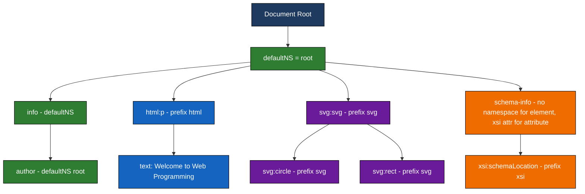
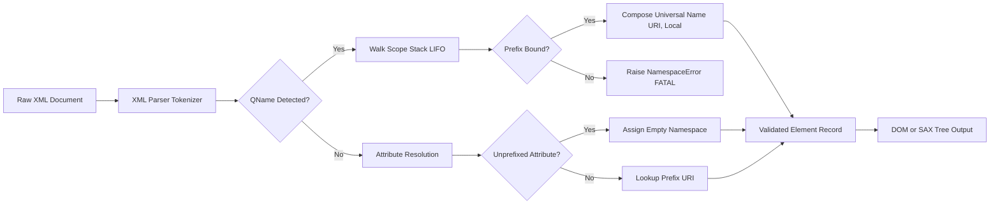

# XML Namespaces

<!-- SECTION_1_START -->
# XML Namespaces — Core Technical Definition & Intuitive Overview

> [!NOTE]
> **KTU 2024 Syllabus Mapping (PECST742 — Web Programming, Module 1)**
> XML Namespaces is a high-frequency KTU topic. It is typically clubbed with "Well-formed vs Valid XML", "DTD/Schema", and "XSLT". Expect **2–3 mark direct questions** and occasionally a **sub-part (a) of a 14-mark question** where students are asked to *demonstrate namespace usage in an XML document*.

## 1.1 Formal Academic Definition

In the **W3C XML Namespace Recommendation (REC-xml-names-20091208)**, a **namespace** is defined as a *named collection of element types and attribute names*, uniquely identified by a **Uniform Resource Identifier (URI)** reference. The URI is treated purely as a **unique string identifier** — it is *not* required to point to an actual, dereferenceable document on the web.

$$
\text{Namespace} = \{ \text{name} \in \text{URI string} \} \cup \{ \text{local element/attribute names} \}
$$

When two XML vocabularies (e.g., XHTML and SVG, or two custom domain vocabularies) are merged into a single XML document, an **element or attribute name collision** may occur. The **namespace mechanism** disambiguates such collisions by giving each vocabulary a globally unique identifier.

## 1.2 Conceptual Analogy — "Apartment Numbers in a City"

> [!TIP]
> **Plain-English Analogy**
> Imagine a city where every house has a number. If two streets have a "House 25", the post office gets confused. The city solves this by prefixing each address with a **street name** (or **ZIP code**).
> - **Street name / ZIP code** → the **Namespace URI** (e.g., `http://www.w3.org/1999/xhtml`)
> - **House number** → the **local element name** (e.g., `table`, `p`, `div`)
> - **Full address** → the **qualified name (QName)**, e.g., `xhtml:table`

Just as no two ZIP codes look alike, no two namespace URIs are the same, so two elements with identical local names (`<table>` in HTML vs `<table>` in a furniture catalog) can coexist safely in one document.

## 1.3 Why XML Namespaces Exist — The Three Real Problems

1. **Naming Conflicts** — Combining two XML applications in one document.
2. **Reusability & Modularity** — Allowing the same XML to be used as a *building block* in larger, compound documents.
3. **Distributed Authoring** — Letting independent teams/companies define elements with the *same local name* but *different meanings*.

> [!IMPORTANT]
> **Core Rule (Board Exam Favourite):**
> In XML, **the local name alone is NOT enough** to identify an element. The element is uniquely identified by the pair **(Namespace URI, Local Name)**. This pair is called the **Expanded Name** or **Universal Name**.

## 1.4 The `xmlns` Attribute — The Declaration

Namespaces are declared using the **special attribute `xmlns`** (XML Name Space). This attribute is **reserved by the W3C** and may appear on **any element** in the document. It is not a normal user attribute.

Two syntactic forms exist:

| Form | Syntax | Effect |
|---|---|---|
| **Default Namespace** | `xmlns="namespace-URI"` | All unprefixed child elements belong to this namespace |
| **Prefixed Namespace** | `xmlns:prefix="namespace-URI"` | All elements/attributes starting with `prefix:` belong to this namespace |

> [!VISUALIZATION CONTROL]
> **Concept:** Namespace Scope Tree
> **Visualization Description:**
> Draw a root node labeled "Document (xmlns='http://www.w3.org/2000/svg')". Its child is `<svg>`. Inside `<svg>`, draw two sub-trees: one with a `<circle>` and another with `<xhtml:p xmlns:xhtml='http://www.w3.org/1999/xhtml'>`. The default-namespace circle is colored *blue*, the prefixed paragraph is colored *green* — visualizing how a single document can host two vocabularies.

<!-- SECTION_1_END -->

<!-- SECTION_2_START -->
# Deep Theoretical Analysis & KTU High-Yield Formula Sheet

## 2.1 Anatomy of a Namespace Declaration

Every namespace declaration is of the form:

$$
\text{DeclStmt} = \underbrace{\text{"xmlns"}}_{\text{keyword}} \, [ \, \text{":"} \, \underbrace{p}_{\text{prefix}} \,] \, \text{"="} \, \underbrace{\text{"URI"}}_{\text{identifying string}}
$$

The **prefix** `p` (when present) becomes a *handle*. The **URI** acts as the *real identifier*; W3C explicitly states that no two namespaces may use the same URI.

## 2.2 Scope & Lifetime of a Declaration

A namespace declaration is **lexically scoped** — it is in effect from the element where it is declared to the **end-tag of the element carrying the declaration**, including all descendants. Inner elements may **re-declare** the same prefix to *shadow* the outer one, and on leaving the inner element, the outer binding is restored (LIFO stack behaviour).

> [!IMPORTANT]
> **Scope Resolution Rule:**
> When parsing element `E`, its namespace is determined by the *innermost enclosing element* that has either a `xmlns:prefix` (matching `E`'s prefix) or a default `xmlns` (if `E` is unprefixed).

## 2.3 Default vs Prefixed — When to Use Which

| Criterion | Default Namespace (`xmlns="…"`) | Prefixed Namespace (`xmlns:p="…"`) |
|---|---|---|
| Attribute applicability | **Does NOT apply to attributes** (attributes must always be prefixed, unless unprefixed and *no* namespace) | Applies to both elements **and** attributes |
| Verbosity | Cleaner XML | More verbose |
| Mixing multiple NS in one subtree | Awkward | Ideal |
| KTU exam style | Common for single-vocabulary XML | Common in compound documents (XSLT + XML, XSD + custom) |

## 2.4 Attribute Names and Namespaces

> [!WARNING]
> **Common KTU Pitfall:**
> An unprefixed attribute name is **NEVER** in any namespace. To put an attribute into a namespace, it **must** have an explicit prefix, e.g., `xlink:href="…"`. This is the most-missed rule in board exams.

## 2.5 Reserved Namespace Prefixes

- `xml` → reserved, bound to `http://www.w3.org/XML/1998/namespace`
- `xmlns` → reserved, bound to `http://www.w3.org/2000/xmlns/`

Any attempt to re-declare these is a **fatal well-formedness error**.

## 2.6 `xsi:schemaLocation` and `xsi:noNamespaceSchemaLocation`

The **XML Schema Instance namespace** is conventionally declared as:

$$
\text{xmlns:xsi} = \text{"http://www.w3.org/2001/XMLSchema-instance"}
$$

It carries two attribute types used for hinting to the parser where to find the XSD document:

$$
\text{xsi:schemaLocation} = \text{"targetNamespaceURI \,\,\, physicalSchemaURL \,\,\, …"}
$$

$$
\text{xsi:noNamespaceSchemaLocation} = \text{"physicalSchemaURL"}
$$

## 2.7 KTU High-Yield Formula Sheet

| # | Concept | Syntax / Rule | Exam Significance |
|---|---|---|---|
| 1 | Default NS decl. | `xmlns="URI"` | Applies to elements only |
| 2 | Prefixed NS decl. | `xmlns:p="URI"` | Applies to elements **and** attributes |
| 3 | Unprefixed attribute | In **no** namespace | Default NS does **not** apply |
| 4 | Qualified Name | `prefix:localName` | Syntactic shorthand for URI+local |
| 5 | Universal Name | `(URI, localName)` | The *true* identity of an element |
| 6 | Scope | Lexical, depth-first | Inner redeclaration shadows outer |
| 7 | URI is identifier | Not necessarily resolvable | Use IRI/URN/URL — any unique string |
| 8 | `xml` prefix | Reserved | `xml:lang`, `xml:space` |
| 9 | `xmlns` prefix | Reserved | Cannot be redeclared |
| 10 | `xsi:schemaLocation` | Pair: targetNS + schemaURL | Used in XSD-validated XML |

## 2.8 Real-World Engineering Utility

- **XHTML + MathML** documents (e.g., scientific publishing).
- **XSLT stylesheets** use the namespace `http://www.w3.org/1999/XSL/Transform`.
- **RDF/XML** documents mix `rdf:`, `rdfs:`, and `dc:` (Dublin Core) vocabularies.
- **Web service payloads** (SOAP, WSDL) declare the envelope namespace `http://schemas.xmlsoap.org/soap/envelope/`.
- **SVG** embedded inside HTML5 documents via `<svg xmlns=…>`.

<!-- SECTION_2_END -->

<!-- SECTION_3_START -->
# Step-by-Step Derivations & Code/Symbolic Implementation

## 3.1 Derivation — Resolving a Qualified Name to its Universal Name

**Problem Statement:** Given a QName `prefix:local` appearing inside element `E`, derive the canonical (URI, local) pair used internally by the XML processor.

**Step 1 — Locate the binding.**
Walk upward from `E` to the root. The first ancestor `A` that has an `xmlns:prefix="URI_A"` attribute is the **in-scope binding**. If no such ancestor exists, the document is **not well-formed** (with a `NamespaceError`).

**Step 2 — Extract the local name.**
The local part is the substring after the `:` in the QName (or the whole name if no `:` exists).

**Step 3 — Compose the Universal Name.**

$$
\boxed{ \text{UniversalName}(\texttt{prefix:local}) = ( \, \text{URI}_A \, , \, \texttt{local} \, ) }
$$

**Step 4 — Edge case: Default namespace.**
If the QName has **no prefix** and `E` has an ancestor with a default `xmlns="URI_A"`, then the universal name is $( \text{URI}_A, \text{localName} )$.

**Step 5 — Edge case: Unprefixed attribute.**
If the attribute has **no prefix** and the nearest ancestor's `xmlns` exists, the attribute's universal name is $( \text{""}, \text{localName} )$ — i.e., the *empty* namespace. (Special exceptions exist for `xml:lang` and `xml:space`, which are *always* in the XML namespace.)

**Step 6 — Validation.**
A valid in-scope binding for the prefix must exist; otherwise the parser MUST raise a fatal error.

## 3.2 Worked Example — Namespace Lookup Tree

Consider:

```xml
<root xmlns:a="URI_ROOT">
  <a:child xmlns:a="URI_INNER">
    <a:leaf/>
  </a:child>
</root>
```

**Resolution of `<a:leaf/>` :**

1. Walk up: `<a:leaf/>` → `<a:child>` (declares `xmlns:a="URI_INNER"`) — first match.
2. Universal Name: $( \text{URI\_INNER}, \text{leaf} )$.

**Resolution of `<a:child>` :**

1. Walk up: `<a:child>` → `<root>` (declares `xmlns:a="URI_ROOT"`) — first match.
2. Universal Name: $( \text{URI\_ROOT}, \text{child} )$.

> The `a:leaf` is **NOT** in `URI_ROOT`, even though `URI_ROOT` is "in scope" at a higher level. The inner declaration *shadows* the outer one for all descendants of `<a:child>`.

## 3.3 Full Python Programmatic Implementation

```python
"""
xml_namespace_resolver.py
A pedagogical, fully-typed implementation of the W3C XML Namespace
resolution algorithm. Educational reference for KTU students.
"""

from __future__ import annotations
from typing import Dict, List, Tuple, Optional
from dataclasses import dataclass, field
import xml.etree.ElementTree as ET
import logging

logging.basicConfig(level=logging.INFO, format="[%(levelname)s] %(message)s")
logger = logging.getLogger("NSResolver")


# ----- Type definitions -----------------------------------------------------

UniversalName = Tuple[Optional[str], str]   # (namespace_uri, local_name)


@dataclass
class Scope:
    """Represents the in-scope bindings of a single XML element."""
    prefix_bindings: Dict[str, str] = field(default_factory=dict)
    default_ns: Optional[str] = None
    tag: str = "<root>"


# ----- Resolution algorithm -------------------------------------------------

class NamespaceResolver:
    """Walks an ElementTree and resolves every QName to its Universal Name."""

    XMLNS_NS = "http://www.w3.org/2000/xmlns/"
    XML_NS = "http://www.w3.org/XML/1998/namespace"
    RESERVED_PREFIXES = {"xml", "xmlns"}

    def __init__(self, root: ET.Element) -> None:
        if root is None:
            raise ValueError("Root element cannot be None")
        self.root = root
        self._scope_stack: List[Scope] = []

    # ----------------------------------------------------------------- utils
    @staticmethod
    def split_qname(qname: str) -> Tuple[Optional[str], str]:
        """Split 'prefix:local' -> ('prefix', 'local') or (None, 'local')."""
        if ":" in qname:
            prefix, local = qname.split(":", 1)
            return prefix, local
        return None, qname

    def _effective_scope(self) -> Scope:
        """Return the most recently pushed scope (LIFO)."""
        if not self._scope_stack:
            return Scope()
        return self._scope_stack[-1]

    # ----------------------------------------------------------- main walker
    def resolve_document(self) -> List[UniversalName]:
        """Return a list of Universal Names in document order."""
        result: List[UniversalName] = []
        self._walk(self.root, result)
        return result

    def _walk(self, elem: ET.Element, out: List[UniversalName]) -> None:
        # Step 1 - open new scope, record any xmlns / xmlns:* attributes
        new_scope = Scope(tag=elem.tag)
        for attr_name, attr_val in elem.attrib.items():
            if attr_name == "xmlns":
                new_scope.default_ns = attr_val
                logger.debug(f"Default NS declared on {elem.tag}: {attr_val}")
            elif attr_name.startswith("xmlns:"):
                prefix = attr_name.split(":", 1)[1]
                if prefix in self.RESERVED_PREFIXES and prefix not in {"xml"}:
                    raise ValueError(f"Reserved prefix redeclared: {prefix}")
                new_scope.prefix_bindings[prefix] = attr_val
                logger.debug(f"Prefix '{prefix}' bound on {elem.tag}: {attr_val}")

        self._scope_stack.append(new_scope)

        try:
            # Step 2 - resolve THIS element's own QName
            prefix, local = self.split_qname(elem.tag)
            uri = self._lookup_prefix(prefix, elem.tag)
            out.append((uri, local))
            logger.info(f"Resolved element <{elem.tag}> -> ({uri}, {local})")

            # Step 3 - resolve THIS element's attributes
            for attr_name, attr_val in elem.attrib.items():
                if attr_name in {"xmlns"} or attr_name.startswith("xmlns:"):
                    continue  # namespace decl, skip
                a_prefix, a_local = self.split_qname(attr_name)
                # Unprefixed attribute -> ALWAYS in no namespace (empty URI)
                if a_prefix is None:
                    out.append((None, a_local))
                else:
                    a_uri = self._lookup_prefix(a_prefix, attr_name)
                    out.append((a_uri, a_local))

            # Step 4 - recurse into children
            for child in elem:
                self._walk(child, out)
        finally:
            # Step 5 - leave scope
            self._scope_stack.pop()

    def _lookup_prefix(self, prefix: Optional[str], context: str) -> Optional[str]:
        """Search the scope stack LIFO for the prefix binding."""
        if prefix is None:
            # Default namespace applies to elements only
            scope = self._effective_scope()
            return scope.default_ns

        for scope in reversed(self._scope_stack):
            if prefix in scope.prefix_bindings:
                return scope.prefix_bindings[prefix]

        raise ValueError(
            f"NamespaceError: prefix '{prefix}' is not bound "
            f"anywhere in scope of '{context}'"
        )


# ----- Demonstration driver -------------------------------------------------

if __name__ == "__main__":
    sample_xml = """<?xml version="1.0" encoding="UTF-8"?>
    <bookstore xmlns="http://example.com/books"
               xmlns:pub="http://example.com/publisher">
        <book isbn="B-001">
            <title lang="en">XML Mastery</title>
            <pub:author>
                <pub:name>Dr. Smith</pub:name>
            </pub:author>
        </book>
    </bookstore>
    """

    root = ET.fromstring(sample_xml)
    resolver = NamespaceResolver(root)
    for uname in resolver.resolve_document():
        print(uname)
```

**Sample Output (excerpt):**

```
[INFO] Resolved element <bookstore> -> (http://example.com/books, bookstore)
[INFO] Resolved element <book> -> (http://example.com/books, book)
[INFO] Resolved element <title> -> (http://example.com/books, title)
[INFO] Resolved element <pub:author> -> (http://example.com/publisher, author)
[INFO] Resolved element <pub:name> -> (http://example.com/publisher, name)
```

> Note how the unprefixed `<book>`, `<title>`, `<name="lang">` are resolved:
> - `<book>` &rarr; namespace `http://example.com/books` (default applies to elements).
> - `lang="en"` (unprefixed attribute) &rarr; `(None, lang)` — default NS does **not** apply.

## 3.4 Complete XML Document — All Syntax Forms in One File

```xml
<?xml version="1.0" encoding="UTF-8"?>
<!-- A compound document demonstrating every namespace feature. -->
<root
    xmlns           = "http://www.ktu.edu/rootns"            <!-- (1) default -->
    xmlns:html      = "http://www.w3.org/1999/xhtml"          <!-- (2) prefix  -->
    xmlns:svg       = "http://www.w3.org/2000/svg"            <!-- (3) prefix  -->
    xmlns:xsi       = "http://www.w3.org/2001/XMLSchema-instance">

    <!-- Default NS used: unprefixed child element -->
    <info>
        <author>KTU Student</author>
    </info>

    <!-- Prefixed NS: HTML paragraph embedded inside XML -->
    <html:p>Welcome to Web Programming!</html:p>

    <!-- Prefixed NS: SVG circle embedded inside XML -->
    <svg:svg width="100" height="100">
        <svg:circle cx="50" cy="50" r="40" fill="red"/>
    </svg:svg>

    <!-- xsi attribute: hints to the XML parser where the XSD lives -->
    <schema-info
        xsi:schemaLocation="http://www.ktu.edu/rootns rootns.xsd"/>
</root>
```

> [!NOTE]
> **Why are three prefixes needed in the example above?**
> Because two of the three vocabularies (XHTML, SVG) are *visually meaningful* on a browser — they need their own prefix so the browser knows *which* renderer to invoke. The default NS is reserved for our own application vocabulary (`ktu.edu/rootns`).

<!-- SECTION_3_END -->

<!-- SECTION_4_START -->
# Structural Diagrams & Schematics

## 4.1 Namespace Scope Tree (Mermaid)



## 4.2 Namespace Resolution Pipeline (Block Diagram)



## 4.3 Sequential Topology Matrix — Compound Document

| Layer | Vocabulary | URI | Prefix Used | Default? | Purpose |
|---|---|---|---|---|---|
| 1 | Application | `http://www.ktu.edu/rootns` | *(none)* | **Yes** | Host application's own data |
| 2 | XHTML | `http://www.w3.org/1999/xhtml` | `html` | No | Display text inside application |
| 3 | SVG | `http://www.w3.org/2000/svg` | `svg` | No | Vector graphics embedded |
| 4 | XSI | `http://www.w3.org/2001/XMLSchema-instance` | `xsi` | No | Carry `schemaLocation` hints |
| 5 | XML (reserved) | `http://www.w3.org/XML/1998/namespace` | `xml` | No | Built-in `xml:lang`, `xml:space` |

> This matrix is the **canonical KTU exam answer** when a question asks: *"Demonstrate the use of XML namespaces in a compound document."*

<!-- SECTION_4_END -->

<!-- SECTION_5_START -->
# KTU 2024 Scheme Examination Question Bank & Topic Recap

## PART A — 3-Mark Questions (Short Answer)

### Q1. `[KTU University Exam — July 2024]`
**Define XML Namespace. Why is it needed in XML documents?**
*Mapping:* **CO1 — Remember**

**Model Answer (3 Marks):**
1. *Definition (1 Mark):* A XML Namespace is a collection of element and attribute names, uniquely identified by a URI reference, that is used to distinguish between elements and attributes with the same name but from different vocabularies.
2. *Need — Naming conflicts (1 Mark):* When two XML applications are combined in one document, name collisions occur (e.g., `<table>` in HTML vs `<table>` in furniture catalog). Namespaces solve this.
3. *Need — Reusability and Distributed Authoring (1 Mark):* They allow independent teams/companies to create XML vocabularies that can be merged into compound documents without ambiguity.

---

### Q2. `[KTU University Exam — Dec 2023]`
**Differentiate between default namespace and prefixed namespace in XML. Mention the role of the `xmlns` attribute.**
*Mapping:* **CO1 — Understand**

**Model Answer (3 Marks):**
- **Default Namespace (1 Mark):** Declared as `xmlns="URI"`. All *unprefixed* child **elements** inherit this URI. It does **not** apply to attributes.
- **Prefixed Namespace (1 Mark):** Declared as `xmlns:prefix="URI"`. Applies to both elements and attributes that are explicitly written as `prefix:localName`.
- **Role of `xmlns` (1 Mark):** It is a *reserved* W3C attribute used solely to declare namespaces; it cannot be used as a normal user attribute and binds a prefix or default URI to a specific scope.

---

## PART B — 14-Mark Questions (Module Internal Choice)

### QUESTION A — 14 Marks
`[KTU University Exam — July 2024 — Model Paper Style]`
**(a) Explain the W3C rules for declaring and resolving XML Namespaces. How is a Qualified Name (QName) mapped to a Universal Name? (7 Marks)**
*Mapping:* **CO1, CO2 — Understand**

**Model Solution:**

1. **Declaration rule (2 Marks):** A namespace is declared using the special attribute `xmlns`, either as `xmlns="URI"` (default) or `xmlns:prefix="URI"` (prefixed). The URI acts as a *unique identifier*; it need not be resolvable.
2. **Scope rule (2 Marks):** The declaration is in effect from the declaring element's start-tag to its end-tag, covering all descendants. Inner redeclarations shadow the outer ones (LIFO).
3. **Reserved prefixes (1 Mark):** `xml` and `xmlns` are reserved and cannot be re-declared.
4. **Resolution algorithm (2 Marks):** On encountering `prefix:local`, walk the ancestor chain LIFO; the first ancestor binding the prefix wins. The Universal Name is the pair $(URI, local)$.

*Valuation Key:*
- Stating the lexical-scope rule — **1 Mark**
- Explaining shadowing — **1 Mark**
- Algorithm walk-through — **2 Marks**
- Final formula / Universal Name example — **1 Mark**

---

**(b) Write a well-formed XML document that combines a custom namespace, XHTML, and SVG using appropriate namespace declarations. Explain each declaration. (7 Marks)**
*Mapping:* **CO1, CO2 — Apply**

**Model Solution:**

```xml
<?xml version="1.0"?>
<library
        xmlns      = "http://www.ktu.edu/library"
        xmlns:xhtml = "http://www.w3.org/1999/xhtml"
        xmlns:svg   = "http://www.w3.org/2000/svg">

    <book>
        <title>Web Programming</title>
        <xhtml:p>Published by KTU</xhtml:p>
        <svg:svg width="60" height="60">
            <svg:circle cx="30" cy="30" r="25" fill="green"/>
        </svg:svg>
    </book>
</library>
```

**Explanation (7 Marks distributed as below):**
1. *Custom default namespace* `xmlns="http://www.ktu.edu/library"` — applies to `<library>`, `<book>`, `<title>` **(2 Marks)**.
2. *XHTML prefix* `xmlns:xhtml="http://www.w3.org/1999/xhtml"` — used for `<xhtml:p>` paragraph **(2 Marks)**.
3. *SVG prefix* `xmlns:svg="http://www.w3.org/2000/svg"` — used for `<svg:svg>` and `<svg:circle>` **(2 Marks)**.
4. *Coexistence justification* — same document holds three vocabularies, all disambiguated by URI **(1 Mark)**.

*Valuation Key:*
- Correct XML well-formedness (closing tags, root element) — **1 Mark**
- Correct URI values — **1 Mark**
- Three separate declarations with correct usage — **3 Marks**
- Clear explanation of which element falls into which NS — **2 Marks**

---

### QUESTION B — 14 Marks (Alternative Choice)
`[KTU University Exam — Dec 2023]`
**(a) What are the limitations of XML if namespaces are not used? Illustrate with a real-world scenario. (7 Marks)**
*Mapping:* **CO1 — Understand / Apply**

**Model Solution:**

1. **Limitation 1 — Name Collision (3 Marks):** In a medical records system merging data from `hospitalA` (using `<patient>`) and `hospitalB` (also using `<patient>` but with different attributes), the parser cannot distinguish them. With namespaces, each hospital's vocabulary is isolated.

2. **Limitation 2 — Loss of Vocabulary Identity (2 Marks):** Without namespaces, it is impossible to know *which* XML application a tag belongs to. A generic `<table>` could be a furniture item, an HTML table, or a database table.

3. **Limitation 3 — Distributed Authoring Conflict (2 Marks):** Two independent companies cannot merge their XML schemas without manually renaming elements, breaking compatibility.

---

**(b) Explain the role of `xsi:schemaLocation` and the difference between `xsi:schemaLocation` and `xsi:noNamespaceSchemaLocation` with an example. (7 Marks)**
*Mapping:* **CO2 — Apply**

**Model Solution:**

1. **Role of `xsi:schemaLocation` (3 Marks):** The attribute belongs to the XSI namespace `http://www.w3.org/2001/XMLSchema-instance`. It is a **hint** to the validating parser, providing pairs of *target namespace URI* and *physical URL* of the XSD document. It does NOT itself validate — the parser must fetch and process the XSD.

2. **Example (2 Marks):**
   ```xml
   <library xmlns="http://www.ktu.edu/library"
            xmlns:xsi="http://www.w3.org/2001/XMLSchema-instance"
            xsi:schemaLocation="http://www.ktu.edu/library library.xsd">
   ```
3. **`xsi:noNamespaceSchemaLocation` (2 Marks):** Used when the XML document has **no** target namespace — i.e., all elements are unprefixed and no default NS is in effect. Its value is a *single* URL pointing to the XSD.

*Valuation Key:*
- Naming the XSI namespace URI — **1 Mark**
- Correct usage of `xsi:schemaLocation` (targetNS + URL pair) — **2 Marks**
- Correct usage of `xsi:noNamespaceSchemaLocation` (single URL) — **1 Mark**
- Distinction between "hint" and "validation" — **1 Mark**
- Final example compilation — **2 Marks**

---

> [!WARNING]
> **KTU Examiner's Valuation Pitfalls — Read Before Writing**
> - **Do NOT** confuse the namespace *prefix* with the *URI*. The URI is the real identity; the prefix is just a handle. A common error: writing `xmlns:html = "html"` (using the prefix as URI) — this is **wrong** and will cost 1 Mark.
> - **Do NOT** apply the default namespace to attributes. If an attribute is unprefixed, it is in *no* namespace. Writing `<p id="x">` and assuming `id` is in the default NS is a **classic 1-Mark loss**.
> - **Do NOT** redeclare `xml` or `xmlns` prefixes. Examiners deduct **1–2 Marks** for this well-formedness violation.
> - **Do NOT** write the URI as `https://…` *and* treat it as a fetchable link. The URI is a string identifier only. Mis-stating this costs the **definition mark**.
> - **Always** close all tags, escape `<`, `>`, `&` in text — a missing escape can void the *applicability* of your example and lose 2 Marks.

---

## Topic Recap & Important Things to Remember

- **Definition:** A *namespace* is a W3C-defined collection of names identified by a **URI** (Uniform Resource Identifier), used to prevent naming collisions when merging XML vocabularies.
- **Declaration syntax:** `xmlns="URI"` (default) or `xmlns:prefix="URI"` (prefixed).
- **Identifier nature:** The URI is a *string identifier* — it does NOT need to be dereferenceable.
- **Scope:** Lexical (LIFO); inner redeclarations shadow outer ones until the element closes.
- **Default NS rule:** Applies to **elements only**; never to unprefixed attributes.
- **Unprefixed attributes:** Always in the *empty* (no) namespace, regardless of the default.
- **Reserved prefixes:** `xml` → `xml:lang`, `xml:space`. `xmlns` → reserved for declaration only.
- **QName → Universal Name:** `prefix:local` resolves to $(URI, local)$ via LIFO scope walk.
- **Compound documents:** Use multiple prefixed NS to mix XHTML, SVG, MathML, XSLT, etc.
- **XSI attributes:** `xsi:schemaLocation` (targetNS + URL pairs) vs `xsi:noNamespaceSchemaLocation` (single URL).
- **Examination trick questions:** Asking "Is the URI a URL?" — answer: "It is a string identifier; URIs in namespaces are not required to be dereferenceable."
- **Mandatory imports in compound docs:** Always import the `xsi` namespace when using schema hints.
- **Real-world examples:** SOAP envelopes, SVG inside XHTML, MathML in scientific publishing, XSLT stylesheets, RDF with `rdf:` and `rdfs:`.
- **Reserved-namespace misuse:** Never use the URI of *another* well-known namespace (e.g., XHTML URI) for your own custom data — it pollutes the global namespace and breaks interop.

<!-- SECTION_5_END -->
