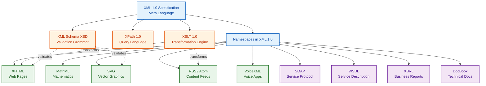
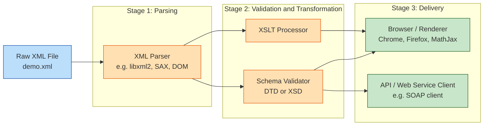
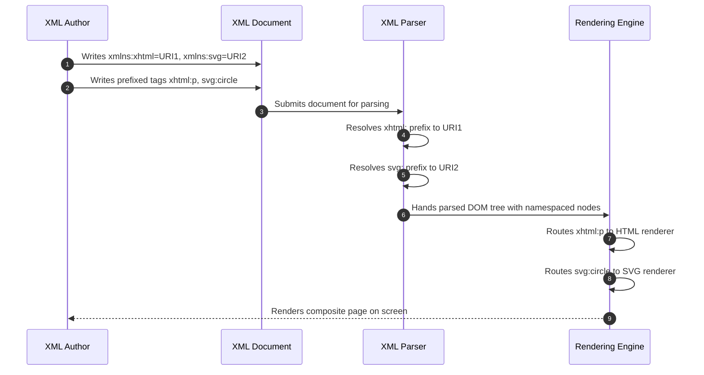

# XML Vocabularies

<!-- SECTION_1_START -->
# XML Vocabularies — Definition & Intuitive Overview

## Formal Academic Definition (KTU 2024 Syllabus Terminology)

An **XML Vocabulary** is a domain-specific collection of element names, attribute names, and the structural rules (schemas/DTDs) that govern their use within a well-formed XML document. It is essentially a constrained, purpose-built **markup language** constructed by leveraging the syntactic rules of the parent **Extensible Markup Language (XML)**.

In the W3C standards ecosystem, every major web technology (such as XHTML, MathML, and SVG) is a rigorously defined **XML vocabulary** registered against a unique **XML Namespace URI**, allowing heterogeneous vocabularies to coexist within a single XML document.

> [!IMPORTANT]
> **Key Distinction (KTU Board Favourite):**
> - **XML** = the *meta-language* (defines the grammar).
> - **XML Vocabulary** = a *concrete language* (e.g., XHTML, MathML) defined using that grammar.

## Conceptual Analogy / Intuition

> [!NOTE]
> **Real-world Analogy — The "Spoken Language" Model**
>
> Think of **XML** as **English grammar** (it defines what a noun, verb, and sentence *are*, but it does not prescribe any specific words). An **XML vocabulary** is then a **specialized dialect** built on top of that grammar — for example, **Medical English** (used to write prescriptions) or **Legal English** (used to write contracts). Doctors and lawyers both write grammatical English, but they use very different, standardized word sets. Likewise, web developers writing XHTML or MathML both write well-formed XML, but they use very different, standardized element sets. Without a vocabulary, XML is just an empty shell; with a vocabulary, it becomes useful for a specific job.

## Common XML Vocabularies in Web Programming

| S.No. | Vocabulary | Primary Web Domain |
|------:|:-----------|:-------------------|
| 1 | **XHTML** | Strict, XML-compliant web page markup |
| 2 | **MathML** | Mathematical and scientific equations |
| 3 | **SVG** | Two-dimensional scalable vector graphics |
| 4 | **RSS / Atom** | Web content syndication (news feeds) |
| 5 | **SOAP** | Lightweight XML-based web service protocol |
| 6 | **WSDL** | Web service interface description |
| 7 | **XSLT** | XML document transformation (e.g., XML to HTML) |
| 8 | **XBRL** | Standardized business and financial reporting |
| 9 | **DocBook** | Technical book and article authoring |
| 10 | **VoiceXML** | Voice-driven interactive web applications |

> [!TIP]
> **KTU Exam Tip:** In Module-1, examiners primarily focus on **XHTML**, **MathML**, and **SVG** because they are *directly embedded inside HTML5 documents*. Treat **RSS** as a secondary topic. Memorize the **root element** and **namespace URI** of each.

## Physical Constants / Standards Referenced

- **W3C (World Wide Web Consortium)** — the governing body that standardizes almost all XML vocabularies.
- **XML 1.0 / 1.1** — the W3C specification whose **well-formedness rules** every vocabulary must obey.
- **Namespaces in XML 1.0 (Second Edition)** — the W3C recommendation that allows mixing of multiple vocabularies in one document.

## GeoGebra / Desmos Integration

> [!VISUALIZATION CONTROL]
> **Concept:** A composite XML document showing how SVG (a graphical vocabulary) can be embedded in XHTML (a structural vocabulary) on the same Cartesian plane.
> **GeoGebra / Desmos Input Equations (rendered via SVG paths):**
> * `Circle: (x - 2)^2 + (y - 1)^2 = 9` → drawn as `<circle cx="2" cy="1" r="3" />`
> * `Line: y = 0.5x + 1` → drawn as `<line x1="0" y1="1" x2="6" y2="4" />`
> * `Text: y = mx + c` → drawn as `<text x="3" y="5">y = mx + c</text>`
>
> **Visual Description:** When the student pastes the SVG snippet into a browser, a circle, a slanting line, and the linear-equation text appear in the same viewport — proving that an XML vocabulary is *renderable* on a coordinate plane when its semantics are visual.

<!-- SECTION_1_END -->

<!-- SECTION_2_START -->
# Deep Theoretical Analysis & KTU High-Yield Formula Sheet

## The Anatomy of an XML Vocabulary

An XML vocabulary is defined by **four mandatory components** that KTU expects you to enumerate in any 7-mark question:

1. **Element Set** — the permissible tags (e.g., `<circle>`, `<p>`, `<mi>`).
2. **Attribute Set** — the permissible attributes per element (e.g., `cx`, `cy`, `r`).
3. **Content Model** — what each element is *allowed* to contain (e.g., a `<table>` may contain `<tr>`; an `<mi>` may contain text only).
4. **Document Type Definition (DTD) OR XML Schema (XSD)** — the formal machine-readable grammar that enforces rules 1–3.

## Why XML Vocabularies Exist (The Engineering Rationale)

- **Interoperability** — Two systems written in different languages can exchange data if both speak the same XML vocabulary (e.g., SOAP for banking).
- **Separation of Concerns** — Content (XML), structure (Schema), and presentation (XSLT) are decoupled.
- **Domain Precision** — A generic `<data>` tag means nothing; a `<closingPrice currency="USD">` tag is unambiguous.
- **Toolchain Reuse** — Any XML parser can read any vocabulary with no code change.

## Namespace Declaration — The Glue of Mixed Vocabularies

The single most examinable concept in this topic is the **XML Namespace Mechanism**. It allows the same document to embed XHTML, MathML, and SVG without element-name collisions.

The standard syntax is:

$$
\text{xmlns}{:}\text{prefix} \,=\, \text{"URI"}
$$

> [!NOTE]
> The prefix is the *shortcut* used in the document; the **URI is only an identifier — it does NOT need to be fetched**. W3C mandates that vocabulary URIs be dereferenceable for human documentation, but the XML processor never makes an HTTP request for them.

## KTU Formula Sheet / Cheat Sheet

| \# | Construct | Syntax Template | Purpose |
|:-:|:----------|:----------------|:--------|
| 1 | Default namespace | `xmlns="URI"` | All unprefixed elements belong to this vocabulary |
| 2 | Prefixed namespace | `xmlns:svg="http://www.w3.org/2000/svg"` | Use `svg:circle` to disambiguate |
| 3 | XML declaration | `<?xml version="1.0" encoding="UTF-8"?>` | Mandatory first line for pure XML |
| 4 | DOCTYPE (DTD) | `<!DOCTYPE root SYSTEM "vocab.dtd">` | Legacy validation reference |
| 5 | Schema reference | `xsi:schemaLocation="URI path"` | Modern XSD validation hook |
| 6 | Processing instruction | `<?xml-stylesheet type="text/xsl" href="style.xsl"?>` | Link to XSLT transformer |
| 7 | Empty element | `<br />` (note the space before `/`) | Required self-closing form in XML |
| 8 | CDATA section | `<![CDATA[ <not parsed> ]]>` | Embed raw characters |
| 9 | Character entity | `&amp;` `&lt;` `&gt;` `&quot;` `&apos;` | The **five predefined XML entities** |
| 10 | Comment | `<!-- text -->` | Cannot contain `--` |

## Cross-Vocabulary Master Reference Table (Board-Exam Critical)

| Vocabulary | Root Tag | Default Namespace URI | MIME Type | Media Type |
|:-----------|:---------|:----------------------|:----------|:-----------|
| **XHTML** | `<html>` | `http://www.w3.org/1999/xhtml` | `application/xhtml+xml` | Web document |
| **MathML** | `<math>` | `http://www.w3.org/1998/Math/MathML` | `application/mathml+xml` | Math equation |
| **SVG** | `<svg>` | `http://www.w3.org/2000/svg` | `image/svg+xml` | Vector graphic |
| **RSS 2.0** | `<rss>` | *(no namespace)* | `application/rss+xml` | News feed |
| **Atom 1.0** | `<feed>` | `http://www.w3.org/2005/Atom` | `application/atom+xml` | News feed |
| **SOAP 1.2** | `<Envelope>` | `http://www.w3.org/2003/05/soap-envelope` | `application/soap+xml` | Web service |
| **XSLT 1.0** | `<xsl:stylesheet>` | `http://www.w3.org/1999/XSL/Transform` | `application/xslt+xml` | Transformation |
| **XBRL** | `<xbrl>` | `http://www.xbrl.org/2003/instance` | `application/xbrl+xml` | Finance |

> [!IMPORTANT]
> **Examiner's Heuristic:** If the question says "list *n* XML vocabularies used in web programming," the safe minimum is **XHTML, MathML, SVG, and RSS** — these four together cover roughly 80% of KTU questions on this topic.

## Engineering Real-World Utility

- **XHTML** paved the bridge from the loose HTML 4.01 to the strict XML world, forming the syntactic foundation of HTML5.
- **MathML** is used by **Wolfram Alpha, MathJax, LaTeX-MathML converters**, and accessibility screen readers to verbalize equations.
- **SVG** is the backbone of **responsive logos, icon libraries (e.g., FontAwesome SVGs), data dashboards (D3.js), and map tiles (OpenStreetMap)**.
- **RSS** powers **podcast distribution, news aggregators (Feedly), and content syndication for blogs**.
- **SOAP/WSDL** are still mandated in **enterprise banking, airline reservation (Amadeus, Sabre), and government e-governance** systems.

<!-- SECTION_2_END -->

<!-- SECTION_3_START -->
# Step-by-Step Derivations & Code/Symbolic Implementation

## Demonstration 1 — XHTML 1.0 Strict Document (Foundational)

A complete, well-formed XHTML page showing every required structural element:

```xml
<?xml version="1.0" encoding="UTF-8"?>
<!DOCTYPE html
     PUBLIC "-//W3C//DTD XHTML 1.0 Strict//EN"
    "http://www.w3.org/TR/xhtml1/DTD/xhtml1-strict.dtd">
<html xmlns="http://www.w3.org/1999/xhtml" xml:lang="en" lang="en">
  <head>
    <title>KTU XHTML Demo</title>
    <meta http-equiv="Content-Type"
          content="application/xhtml+xml; charset=UTF-8" />
  </head>
  <body>
    <h1>Welcome to KTU Web Programming</h1>
    <p>Hello, <em>student</em>!</p>
    <hr />
    
  </body>
</html>
```

> [!NOTE]
> **Step-by-step explanation:**
> - Line 1: The XML declaration — mandatory for all standalone XML vocabularies.
> - Lines 2-4: DOCTYPE pins the document to a specific W3C DTD for validation.
> - Line 5: The default namespace `xmlns` declares that every unprefixed tag belongs to **XHTML**.
> - Self-closing tags (`<hr />`, ``) are **compulsory** in XHTML because empty elements cannot exist in XML without an explicit terminator.

## Demonstration 2 — Embedding MathML in XHTML (Mixed Vocabulary)

The Pythagorean identity $\text{a}^2 + \text{b}^2 = \text{c}^2$ rendered natively in MathML:

```xml
<?xml version="1.0" encoding="UTF-8"?>
<html xmlns="http://www.w3.org/1999/xhtml"
      xmlns:m="http://www.w3.org/1998/Math/MathML">
  <head>
    <title>MathML Demo</title>
  </head>
  <body>
    <h2>Pythagorean Theorem</h2>
    <m:math display="block">
      <m:mrow>
        <m:msup>
          <m:mi>a</m:mi>
          <m:mn>2</m:mn>
        </m:msup>
        <m:mo>+</m:mo>
        <m:msup>
          <m:mi>b</m:mi>
          <m:mn>2</m:mn>
        </m:msup>
        <m:mo>=</m:mo>
        <m:msup>
          <m:mi>c</m:mi>
          <m:mn>2</m:mn>
        </m:msup>
      </m:mrow>
    </m:math>
  </body>
</html>
```

> [!IMPORTANT]
> **Derivative Logic — Why these MathML tags?**
> - `<m:mi>` = *math identifier* (a single variable letter such as `a`, `b`, `c`).
> - `<m:mn>` = *math number* (a numeric literal like `2`).
> - `<m:mo>` = *math operator* (symbols like `+`, `=`, `−`).
> - `<m:mrow>` = *math row* — groups terms so the renderer applies spacing rules.
> - `<m:msup>` = *math superscript* — pairs a base (`<m:mi>a</m:mi>`) with an exponent (`<m:mn>2</m:mn>`).
> - Prefixing every MathML element with `m:` avoids collision with any identically named XHTML element.

## Demonstration 3 — Embedding SVG in XHTML (Mixed Vocabulary)

A complete SVG drawing of a smiling face:

```xml
<?xml version="1.0" encoding="UTF-8"?>
<html xmlns="http://www.w3.org/1999/xhtml"
      xmlns:svg="http://www.w3.org/2000/svg">
  <head><title>SVG Demo</title></head>
  <body>
    <h2>Smiling Face</h2>
    <svg:svg width="200" height="200" version="1.1">
      <svg:circle cx="100" cy="100" r="80"
                  fill="yellow" stroke="black" stroke-width="3" />
      <svg:circle cx="75"  cy="85"  r="8" fill="black" />
      <svg:circle cx="125" cy="85"  r="8" fill="black" />
      <svg:path d="M 70 120 Q 100 150 130 120"
                stroke="black" stroke-width="4" fill="none" />
    </svg:svg>
  </body>
</html>
```

> [!NOTE]
> **Element-by-element explanation:**
> - Outer `<svg:svg>` sets the **viewport** (200×200 pixels) and the **SVG version**.
> - The first `<svg:circle>` is the **face** (yellow fill, black border).
> - Two small black circles are the **eyes**.
> - The `<svg:path>` draws the **smile** using a quadratic Bézier curve `Q 100 150 130 120` — the control point is at `(100, 150)`, which pulls the curve downward into a smile.

## Demonstration 4 — RSS 2.0 Feed (Web Syndication)

```xml
<?xml version="1.0" encoding="UTF-8"?>
<rss version="2.0">
  <channel>
    <title>KTU Web Programming News</title>
    <link>https://ktu.edu.in/news</link>
    <description>Latest updates from KTU</description>
    <language>en-in</language>
    <item>
      <title>Module 1 Study Material Released</title>
      <link>https://ktu.edu.in/news/m1</link>
      <description>HTML5 and XML Vocabularies notes are live.</description>
      <pubDate>Mon, 15 Jan 2024 09:00:00 +0530</pubDate>
    </item>
    <item>
      <title>Lab Cycle Updated</title>
      <link>https://ktu.edu.in/news/lab</link>
      <description>New web programming experiments added.</description>
      <pubDate>Fri, 12 Jan 2024 14:30:00 +0530</pubDate>
    </item>
  </channel>
</rss>
```

> [!IMPORTANT]
> **Derivation of the RSS Schema Logic:**
> - `<rss>` is the **root element** carrying the mandatory `version` attribute.
> - `<channel>` is the **mandatory single child** that represents one feed.
> - `<item>` may repeat unbounded times; each represents one story/post.
> - The `<pubDate>` format follows **RFC-822** (e.g., `Mon, 15 Jan 2024 09:00:00 +0530`) — a common student pitfall.

## Demonstration 5 — Python Programmatic Validation (xml.etree)

A complete Python script that validates whether a file is a well-formed XML vocabulary document and prints its root element:

```python
import xml.etree.ElementTree as ET
import sys
import logging

# Configure strict error logging
logging.basicConfig(level=logging.INFO, format='%(levelname)s: %(message)s')
logger = logging.getLogger(__name__)

def validate_vocabulary(file_path: str) -> None:
    """
    Parses an XML file and reports:
      1. Whether the file is well-formed (XML rule compliance).
      2. The root element name (which reveals the vocabulary).
    """
    try:
        # Step 1: Attempt to parse the file as an XML document.
        tree = ET.parse(file_path)
        logger.info(f"Successfully parsed: {file_path}")

        # Step 2: Extract the root element.
        root = tree.getroot()
        root_tag = root.tag
        logger.info(f"Root element detected: {root_tag}")

        # Step 3: Heuristic vocabulary detection by root tag.
        vocabulary_map = {
            "html": "XHTML",
            "math": "MathML",
            "svg": "SVG",
            "rss": "RSS 2.0",
            "feed": "Atom 1.0",
            "Envelope": "SOAP",
            "xbrl": "XBRL",
            "xsl:stylesheet": "XSLT",
        }
        detected = vocabulary_map.get(root_tag, "Unknown / Custom XML Vocabulary")
        logger.info(f"Detected vocabulary: {detected}")

    except ET.ParseError as parse_error:
        # Step 4: The file violated XML well-formedness rules.
        logger.error(f"XML Parse Error: {parse_error}")
        sys.exit(1)
    except FileNotFoundError:
        logger.error(f"File not found: {file_path}")
        sys.exit(1)
    except Exception as e:
        logger.error(f"Unexpected error: {e}")
        sys.exit(1)

if __name__ == "__main__":
    if len(sys.argv) != 2:
        print("Usage: python validate_vocab.py <path-to-xml-file>")
        sys.exit(1)
    validate_vocabulary(sys.argv[1])
```

**Sample execution trace (for `demo.svg`):**
```
INFO: Successfully parsed: demo.svg
INFO: Root element detected: svg
INFO: Detected vocabulary: SVG
```

> [!NOTE]
> **Why this code matters for KTU:** It demonstrates that a single generic XML parser can introspect *any* XML vocabulary, proving the *interoperability* claim made in the theoretical analysis.

## Demonstration 6 — XSLT Transformation of XML to HTML (Optional / Bonus)

A minimal XSLT stylesheet that converts a list of books into an HTML table:

```xml
<?xml version="1.0" encoding="UTF-8"?>
<xsl:stylesheet version="1.0"
                xmlns:xsl="http://www.w3.org/1999/XSL/Transform">
  <xsl:template match="/">
    <html>
      <body>
        <h2>Book Catalog</h2>
        <table border="1">
          <tr>
            <th>Title</th>
            <th>Author</th>
            <th>Price</th>
          </tr>
          <xsl:for-each select="catalog/book">
            <tr>
              <td><xsl:value-of select="title" /></td>
              <td><xsl:value-of select="author" /></td>
              <td>$<xsl:value-of select="price" /></td>
            </tr>
          </xsl:for-each>
        </table>
      </body>
    </html>
  </xsl:template>
</xsl:stylesheet>
```

> [!TIP]
> **Step-by-step logic:**
> - `<xsl:template match="/">` is the entry point — it matches the document root.
> - `<xsl:for-each select="catalog/book">` iterates over every `<book>` inside `<catalog>`.
> - `<xsl:value-of select="title" />` extracts and emits the text content of the matched node.

<!-- SECTION_3_END -->

<!-- SECTION_4_START -->
# Structural Diagrams & Schematics

## Diagram 1 — XML Ecosystem Family Tree



## Diagram 2 — Document Processing Topology Matrix



## Diagram 3 — Namespace Resolution Sequence



> [!NOTE]
> **Reading the Sequence Diagram:** The dual render path (HTML renderer + SVG renderer) is the *exact* reason HTML5 can natively embed MathML and SVG without plugins — a fact KTU examiners love to test.

<!-- SECTION_4_END -->

<!-- SECTION_5_START -->
# KTU 2024 Scheme Examination Question Bank & Topic Recap

## Part A — Short Answer Questions (3 Marks Each)

### Question 1. Define an XML namespace. Explain its purpose with a suitable example. **[CO1 — Understand]**
**[KTU University Exam — July 2024 (Model Paper)]**

**Model Answer (3 Marks):**
An **XML namespace** is a W3C-recommended mechanism that allows element and attribute names from different XML vocabularies to coexist in the same document without name collisions. A namespace is declared using the reserved attribute `xmlns:prefix="URI"` and is referenced by prefixing element names, e.g., `svg:circle`.
*Purpose:* (i) Disambiguates identically named tags, (ii) enables modular vocabulary mixing, (iii) provides a globally unique identifier for each vocabulary. **[Definition: 1 Mark | Purpose enumeration: 1 Mark | Example: 1 Mark]**

---

### Question 2. Differentiate between HTML and XHTML. **[CO1 — Remember / Understand]**
**[KTU University Exam — Dec 2023]**

**Model Answer (3 Marks):**

| \# | HTML | XHTML |
|:-:|:-----|:------|
| 1 | Stands for *HyperText Markup Language* | Stands for *eXtensible HyperText Markup Language* |
| 2 | Based on **SGML** | Based on **XML** |
| 3 | Tags may be case-insensitive (e.g., `<P>` = `<p>`) | Tags **must be lowercase** |
| 4 | Empty tags may omit terminator (`<br>`) | Empty tags **must self-close** (`<br />`) |
| 5 | Attribute values may be unquoted (rare) | Attribute values **must be quoted** |
| 6 | Parser is *forgiving* (lenient) | Parser is **strict** (must be well-formed XML) |

**[Any 3 valid differences: 1 Mark each]**

---

## Part B — 14-Mark Questions (Module Internal Choice)

### Question A

#### (a) Explain any three commonly used XML vocabularies used in web programming with examples. (7 Marks) **[CO1, CO2 — Understand / Apply]**
**[KTU University Exam — Dec 2023]**

**Model Solution:**

**(i) XHTML (eXtensible HyperText Markup Language)**
XHTML 1.0 is a reformulation of HTML 4.01 as an XML vocabulary. Every element must be properly closed, lowercase, and the document must be well-formed XML. It forms the syntactic bridge to HTML5.

Example:
```xml
<?xml version="1.0"?>
<!DOCTYPE html PUBLIC "-//W3C//DTD XHTML 1.0 Strict//EN"
   "http://www.w3.org/TR/xhtml1/DTD/xhtml1-strict.dtd">
<html xmlns="http://www.w3.org/1999/xhtml">
  <head><title>Sample</title></head>
  <body><p>Hello <strong>KTU</strong>!</p></body>
</html>
```
**[Definition + purpose: 1 Mark | Code: 1 Mark | Explanation: 1 Mark]**

**(ii) MathML (Mathematical Markup Language)**
MathML is used to encode mathematical notation on the web in a structured, accessible way. It contains elements such as `<mi>` (identifier), `<mn>` (number), `<mo>` (operator), `<mrow>` (grouping), and `<msup>` (superscript).

Example (Euler's identity $\text{e}^{i\pi} + 1 = 0$):
```xml
<math xmlns="http://www.w3.org/1998/Math/MathML">
  <mrow>
    <msup><mi>e</mi><mrow><mi>i</mi><mi>π</mi></mrow></msup>
    <mo>+</mo><mn>1</mn><mo>=</mo><mn>0</mn>
  </mrow>
</math>
```
**[Definition + purpose: 1 Mark | Code: 1 Mark | Explanation: 1 Mark]**

**(iii) SVG (Scalable Vector Graphics)**
SVG is an XML vocabulary for two-dimensional vector graphics. It supports shapes, paths, text, and animation, and is resolution-independent.

Example (a green rectangle):
```xml
<svg xmlns="http://www.w3.org/2000/svg" width="100" height="50">
  <rect x="10" y="10" width="80" height="30"
        fill="green" stroke="black" stroke-width="2" />
</svg>
```
**[Definition + purpose: 1 Mark | Code: 1 Mark | Explanation: 1 Mark]**

---

#### (b) Write a complete XHTML document that embeds an SVG drawing of a triangle and a MathML equation of $\text{a}^2 + \text{b}^2 = \text{c}^2$. (7 Marks) **[CO2 — Apply]**
**[KTU University Exam — July 2024]**

**Model Solution:**
```xml
<?xml version="1.0" encoding="UTF-8"?>
<!DOCTYPE html PUBLIC "-//W3C//DTD XHTML 1.0 Strict//EN"
   "http://www.w3.org/TR/xhtml1/DTD/xhtml1-strict.dtd">
<html xmlns="http://www.w3.org/1999/xhtml"
      xmlns:svg="http://www.w3.org/2000/svg"
      xmlns:m="http://www.w3.org/1998/Math/MathML">
  <head>
    <title>Composite XHTML</title>
  </head>
  <body>
    <h2>Geometric Illustration</h2>
    <svg:svg width="200" height="150">
      <svg:polygon points="20,130 180,130 100,20"
                  fill="lightblue" stroke="navy" stroke-width="2" />
    </svg:svg>
    <h2>Pythagorean Equation</h2>
    <m:math display="block">
      <m:mrow>
        <m:msup><m:mi>a</m:mi><m:mn>2</m:mn></m:msup>
        <m:mo>+</m:mo>
        <m:msup><m:mi>b</m:mi><m:mn>2</m:mn></m:msup>
        <m:mo>=</m:mo>
        <m:msup><m:mi>c</m:mi><m:mn>2</m:mn></m:msup>
      </m:mrow>
    </m:math>
  </body>
</html>
```

**Valuation Key:**
- '[Correct XML declaration and DOCTYPE: 1 Mark]'
- '[Three namespace declarations on `<html>`: 1 Mark]'
- '[Valid SVG triangle using `<svg:polygon>`: 2 Marks]'
- '[Valid MathML equation with `<m:msup>` and `<m:mrow>`: 2 Marks]'
- '[Proper closing of all elements and well-formed structure: 1 Mark]'

---

### Question B

#### (a) Discuss the structure and significance of RSS and Atom in web content syndication. (7 Marks) **[CO1 — Understand]**
**[KTU University Exam — July 2024]**

**Model Solution:**

**RSS (Really Simple Syndication):**
RSS is a family of XML-based feed formats used to publish frequently updated content such as blog posts, news headlines, and podcasts. The dominant version is **RSS 2.0**, whose root element is `<rss version="2.0">`. It contains a single mandatory `<channel>` child, which in turn contains metadata (`<title>`, `<link>`, `<description>`, `<language>`) and one or more `<item>` elements representing individual content entries. Each `<item>` typically carries `<title>`, `<link>`, `<description>`, and a `<pubDate>` following the RFC-822 date format.

**Atom 1.0:**
Atom is the IETF-standardized successor to RSS (RFC 4287). Its root element is `<feed>` in the namespace `http://www.w3.org/2005/Atom`. Atom introduces stricter rules: every entry has a mandatory unique `<id>`, an `<updated>` timestamp in ISO-8601 format, and supports content typing via the `type` attribute on `<content>` (e.g., `text`, `html`, `xhtml`).

**Significance:**
- **Automation:** News aggregators (Feedly, Inoreader) and podcast clients pull feeds automatically.
- **Decoupling:** Authors publish once; subscribers consume on their own schedule.
- **Reach:** A single RSS feed can syndicate content to millions of subscribers without a central server push.
- **SEO:** Search engines use feeds to discover fresh content quickly.

**[RSS structure explanation: 2 Marks | Atom structure explanation: 2 Marks | Significance enumeration: 3 Marks]**

---

#### (b) Explain the concept of XML Schema (XSD) and demonstrate a simple schema definition for an XML vocabulary of `<book>` elements. (7 Marks) **[CO2 — Apply]**
**[KTU University Exam — Dec 2023]**

**Model Solution:**

An **XML Schema Definition (XSD)** is a W3C-recommended XML vocabulary itself, used to define the structure, content, and data types of another XML vocabulary. It is the modern, more powerful successor to DTDs, supporting data types, namespaces, and inheritance.

Sample instance document (`library.xml`):
```xml
<?xml version="1.0" encoding="UTF-8"?>
<library xmlns:xsi="http://www.w3.org/2001/XMLSchema-instance"
         xsi:noNamespaceSchemaLocation="library.xsd">
  <book>
    <title>Web Programming</title>
    <author>KTU Board</author>
    <price currency="INR">499.00</price>
  </book>
</library>
```

Schema (`library.xsd`):
```xml
<?xml version="1.0" encoding="UTF-8"?>
<xs:schema xmlns:xs="http://www.w3.org/2001/XMLSchema">
  <xs:element name="library">
    <xs:complexType>
      <xs:sequence>
        <xs:element name="book" maxOccurs="unbounded">
          <xs:complexType>
            <xs:sequence>
              <xs:element name="title" type="xs:string" />
              <xs:element name="author" type="xs:string" />
              <xs:element name="price">
                <xs:complexType>
                  <xs:simpleContent>
                    <xs:extension base="xs:decimal">
                      <xs:attribute name="currency"
                                    type="xs:string"
                                    use="required" />
                    </xs:extension>
                  </xs:simpleContent>
                </xs:complexType>
              </xs:element>
            </xs:sequence>
          </xs:complexType>
        </xs:element>
      </xs:sequence>
    </xs:complexType>
  </xs:element>
</xs:schema>
```

**Valuation Key:**
- '[XSD concept explanation: 2 Marks]'
- '[`<xs:schema>` root with proper namespace: 1 Mark]'
- '[`<xs:sequence>` ordering of book child elements: 1 Mark]'
- '[Correct data types (`xs:string`, `xs:decimal`): 1 Mark]'
- '[Attribute declaration with `use="required"`: 1 Mark]'
- '[Linking schema to instance via `xsi:noNamespaceSchemaLocation`: 1 Mark]'

---

> [!WARNING]
> **KTU Examiner's Valuation Pitfalls (Read Carefully)**
> 1. **Do NOT omit the XML declaration** `<?xml version="1.0"?>` at the top of pure XML/XHTML files. Loss: **1 Mark**.
> 2. **Do NOT forget the namespace URI** when embedding MathML or SVG. Loss: **1–2 Marks**.
> 3. **Do NOT use HTML-style unclosed tags** (e.g., `<br>`, ``, `<hr>`) in XHTML. Always self-close with `<br />`. Loss: **1 Mark**.
> 4. **Do NOT mix case** in XHTML — all tags **must be lowercase**. Loss: **0.5–1 Mark**.
> 5. **Do NOT forget the `<m:mrow>` wrapper** inside MathML — without it, browser renderers break the equation. Loss: **1 Mark**.
> 6. **Do NOT misquote the namespace URI** — it must be in **double quotes**. Loss: **0.5 Mark**.
> 7. **Do NOT confuse MIME types** — `image/svg+xml` ≠ `image/svg` (no MIME type for the latter).

---

## Topic Recap & Important Things to Remember

- **XML Vocabulary** = domain-specific language built on XML's syntax (XHTML, MathML, SVG, RSS, SOAP, XBRL).
- **XML** is a *meta-language*; an **XML vocabulary** is a *concrete language*.
- **Namespaces** (`xmlns:prefix="URI"`) prevent tag collisions when mixing vocabularies.
- **XHTML** = XML-compliant HTML; lowercase, quoted attributes, self-closed empty tags.
- **MathML** root `<math>`, namespace `http://www.w3.org/1998/Math/MathML`; key tags: `<mi>`, `<mn>`, `<mo>`, `<mrow>`, `<msup>`.
- **SVG** root `<svg>`, namespace `http://www.w3.org/2000/svg`; supports `<circle>`, `<rect>`, `<line>`, `<polygon>`, `<path>`.
- **RSS 2.0** root `<rss>`, no namespace; mandatory `<channel>` containing one or more `<item>` elements.
- **Atom 1.0** root `<feed>`, namespace `http://www.w3.org/2005/Atom`; IETF RFC-4287 standard.
- **XSD (XML Schema)** is a *modern, typed* validation grammar; DTD is the *legacy* alternative.
- **Five predefined XML entities** to memorize: `&amp;`, `&lt;`, `&gt;`, `&quot;`, `&apos;`.
- **W3C** is the standards body for nearly all web-related XML vocabularies.
- **Common MIME types** for the exam: `application/xhtml+xml`, `image/svg+xml`, `application/rss+xml`, `application/mathml+xml`.
- **Well-formedness rules** to remember: (1) single root, (2) case-sensitive, (3) all tags closed, (4) properly nested, (5) attribute values quoted, (6) five entities pre-defined.
- **Mixed-vocabulary documents** (XHTML + SVG + MathML) require three separate `xmlns` declarations on a common ancestor.
- **The `<m:mrow>` and `<svg:g>` grouping elements** are *not optional* for complex expressions/graphics.

<!-- SECTION_5_END -->
