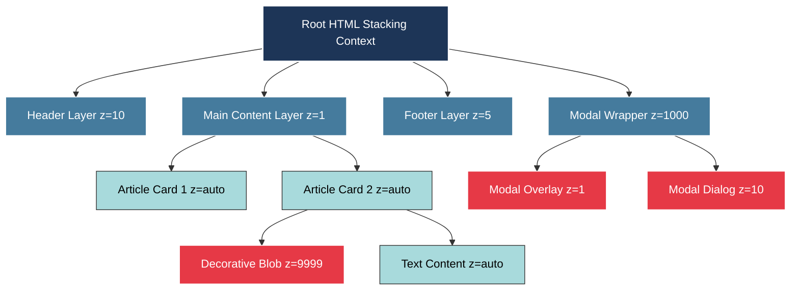
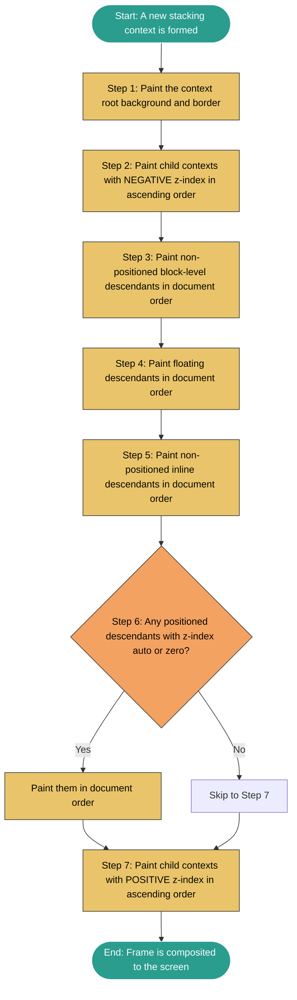

# z-index

<!-- SECTION_1_START -->
# 1. Core Technical Definition & Intuitive Overview

## 1.1 Formal Definition (KTU 2024 Syllabus Terminology)

The **z-index** is a CSS property that controls the **vertical stacking order** of positioned HTML elements along an imaginary axis that is perpendicular to the screen surface (the **z-axis**). It determines which element appears *in front of* or *behind* other overlapping elements when they are rendered on the webpage.

> [!IMPORTANT]
> **KTU Syllabus Highlight:** In the CSS Box Model, the z-axis represents the depth dimension. The `z-index` property accepts integer values (positive, negative, or zero) and is **only effective on elements whose `position` property is set to a value other than `static`** (i.e., `relative`, `absolute`, `fixed`, or `sticky`).

## 1.2 Conceptual Analogy / Intuition

Imagine you have a **desk covered with several sheets of paper**, where some sheets overlap each other. Naturally, the sheet that is placed *last* on the pile sits on top and hides the portions of the sheets beneath it. The `z-index` property works exactly like this:

- Each positioned HTML element is a **sheet of paper** lying on the desk.
- The **z-index value** is like the *height* at which you raise the sheet above the desk.
- A sheet with a **higher z-index** is held higher up and **appears in front** of the others.
- A sheet with a **lower (or negative) z-index** is closer to the desk surface and **appears behind** the others.
- Sheets with `z-index: auto` follow the **document order** — the later element in the HTML wins.

> [!NOTE]
> **Default Behavior:** When no `z-index` is specified, the browser uses `z-index: auto`, which means elements are stacked in the order they appear in the HTML source code (later = on top).

## 1.3 Standard Metrics & Allowed Values

| Metric | Constraint |
| :--- | :--- |
| **Property Name** | `z-index` |
| **CSS Specification** | CSS Level 2.1 (Rec.) and CSS Positioned Layout Module Level 3 |
| **Default Value** | `auto` |
| **Accepted Value Types** | `<integer>` (whole number) or `auto` or `none` |
| **Inherited** | **No** |
| **Applies To** | Positioned elements only (not `static`) |
| **Valid Range** | Theoretically $\left[-2^{31},\ 2^{31}-1\right]$ (practical limit: $-2147483648$ to $2147483647$) |

> [!VISUALIZATION CONTROL]
> **Concept:** Three-Dimensional Layered Stacking on the Z-Axis
> **GeoGebra / Desmos Input Equations (2D projection of Z-axis):**
> * `P1 = (1, 1)` representing Element 1 (background layer)
> * `P2 = (2, 2)` representing Element 2 (middle layer)
> * `P3 = (3, 3)` representing Element 3 (top layer)
> **Visual Description:** Plot the three points on a 2D plane where the Y-axis simulates the Z-depth. The higher the point, the closer the element is to the viewer, completely occluding the points below it at the same X-coordinate.
<!-- SECTION_1_END -->

<!-- SECTION_2_START -->
# 2. Deep Theoretical Analysis & KTU High-Yield Formula Sheet

## 2.1 The Operational Logic of `z-index`

The browser does not stack every element on the page into a single global pile. Instead, it creates **isolated "stacking contexts"**. Within each stacking context, the `z-index` values are compared *locally*. Think of stacking contexts as **transparent, sealed boxes** containing a child pile of papers — the relative order *inside* a box is preserved, but the entire box is then stacked against its sibling boxes.

### 2.1.1 How a Stacking Context is Formed

A new stacking context is created whenever **any one** of the following conditions is met:

1. The root element of the document (`<html>`) is its own stacking context.
2. An element has `position: absolute` or `position: relative` **with** a `z-index` value other than `auto`.
3. An element has `position: fixed` or `position: sticky` (any `z-index`).
4. An element has `position: sticky` (in some browser engines).
5. An element has `opacity` set to a value **less than 1**.
6. An element has `transform`, `filter`, `perspective`, `clip-path`, or `will-change` set to a value other than `none`.
7. An element has `isolation: isolate` (an explicit, modern way to force one).
8. A flex item or grid item with a `z-index` value other than `auto`.

> [!IMPORTANT]
> **KTU Pitfall:** A common exam trap is assuming `z-index: 9999` on a child will always beat `z-index: 1` on its parent. **It will not** if the parent creates a stacking context. The child is clipped to its parent's stacking layer.

## 2.2 The Painting Order (Back to Front)

Inside any single stacking context, the browser paints elements in this strict, unbreakable order (from lowest to highest on the Z-axis):

1. The background and borders of the **stacking context root**.
2. Child stacking contexts with **negative** z-index values (sorted ascending).
3. Non-positioned descendants (in document order).
4. Floating descendants (`float` — in document order).
5. Inline / non-positioned descendants (in document order).
6. Positioned descendants with `z-index: auto` or `z-index: 0` (in document order).
7. Child stacking contexts with **positive** z-index values (sorted ascending).

## 2.3 KTU High-Yield Formula Sheet

| Concept | Syntax / Value | Behavior |
| :--- | :--- | :--- |
| **Default** | `z-index: auto;` | Stacks according to document order; **no** new stacking context created. |
| **Top Layer** | `z-index: 9999;` (or any positive int) | Appears *in front* of all elements with lower or negative z-index. |
| **Bottom Layer** | `z-index: -1;` (or any negative int) | Pushed *behind* the parent's content and background. |
| **Equality Rule** | Same integer value | Tie is broken by **document order** — later in HTML wins. |
| **Stacking Context** | `position: relative; z-index: 5;` | Isolates children from sibling stacking contexts. |
| **Force Isolation** | `isolation: isolate;` | Creates a stacking context *without* needing a z-index. |
| **Range of Integers** | $-2147483648 \leq n \leq 2147483647$ | 32-bit signed integer — practically unlimited. |

> [!NOTE]
> **Engineering Utility:** In production UI frameworks (React, Angular, Vue), `z-index` is used to manage **modal dialogs**, **dropdown menus**, **toast notifications**, **tooltips**, and **sticky navigation bars**. A common pattern is to define a global z-index scale (e.g., `modal: 1000`, `dropdown: 100`, `stickyHeader: 10`) inside a `variables.css` or design-token system.

## 2.4 The "Why" Behind the Stacking Context

Without stacking contexts, every element on a complex page (think: a 3D product configurator with 50 overlapping layers) would share a single, chaotic z-index space. A modal deep inside a footer could accidentally pop above a notification bar in the header simply because of integer value collision. Stacking contexts enforce **modular encapsulation**, which is why CSS Layout Module Level 3 made `isolation: isolate` a first-class citizen.
<!-- SECTION_2_END -->

<!-- SECTION_3_START -->
# 3. Step-by-Step Derivations & Code Implementation

## 3.1 Exhaustive Demonstration: Building a 3-Layer Visual Stack

The following program builds three colored boxes that physically overlap on the page. We will then manipulate their `z-index` to see the layering change in real time. Each transition is annotated with the **predicted visual result** so you can verify the CSS output mentally before running it.

### 3.1.1 Initial HTML Skeleton

```html
<!DOCTYPE html>
<html lang="en">
<head>
    <meta charset="UTF-8">
    <title>Z-Index Demonstration</title>
    <link rel="stylesheet" href="styles.css">
</head>
<body>
    <div class="stage">
        <div class="box box-red"   id="red">RED</div>
        <div class="box box-blue"  id="blue">BLUE</div>
        <div class="box box-green" id="green">GREEN</div>
    </div>
</body>
</html>
```

### 3.1.2 CSS — Stage 1 (Default Document Order, No z-index)

```css
/* ---------- Stage 1: Default stacking ---------- */
.stage {
    position: relative;        /* Establishes a positioning ancestor */
    width: 400px;
    height: 300px;
    margin: 40px auto;
    border: 2px dashed #333;
    background-color: #fafafa;
}

.box {
    position: absolute;        /* Required for z-index to take effect */
    width: 140px;
    height: 140px;
    color: white;
    font-family: 'Segoe UI', sans-serif;
    font-weight: bold;
    text-align: center;
    line-height: 140px;
    border-radius: 8px;
    opacity: 0.9;
}

.box-red   { background-color: #e63946; top:  20px; left:  20px; }
.box-blue  { background-color: #1d3557; top:  80px; left:  80px; }
.box-green { background-color: #2a9d8f; top: 140px; left: 140px; }
```

**Visual Result (Stage 1):** GREEN is on top, BLUE is in the middle, RED is at the back. This follows the document order rule — even though no `z-index` is set, all three are positioned, so they obey the *positioned-with-z-index-auto* tier, which is broken by source order.

### 3.1.3 CSS — Stage 2 (Assigning z-index Values)

```css
/* ---------- Stage 2: Explicit z-index control ---------- */
.box-red   { z-index: 1;  }   /* Now declared FIRST in the tier list    */
.box-blue  { z-index: 3;  }   /* Highest -> sits on top                 */
.box-green { z-index: 2;  }   /* Sits between                           */
```

**Visual Result (Stage 2):** BLUE is on top, GREEN is in the middle, RED is at the back. Notice that even though RED appears *first* in the HTML, its low `z-index: 1` places it behind both siblings.

### 3.1.4 CSS — Stage 3 (Negative z-index Trap)

```css
/* ---------- Stage 3: Negative z-index demonstration ---------- */
.box-red   { z-index: -1; }   /* Pushed behind the .stage background!  */
.box-blue  { z-index: 2;  }
.box-green { z-index: 1;  }
```

**Visual Result (Stage 3):** RED **disappears** because it falls behind the parent `.stage`'s background, which paints at the bottom of the stacking context. This is a classic production bug — a developer adds `z-index: -1` to push a decorative element back, only to find the entire page's body background hides it.

### 3.1.5 CSS — Stage 4 (Stacking Context Isolation)

```html
<!-- Stage 4: Wrap two children inside a parent that creates a context -->
<div class="stage context-a">
    <div class="box box-red">RED</div>
    <div class="box box-yellow">YELLOW</div>
</div>
<div class="box box-blue">BLUE (outside any context)</div>
```

```css
.context-a {
    position: relative;
    z-index: 1;                /* Creates a NEW stacking context         */
}
.box-red    { z-index: 9999; } /* Will NOT escape its parent's context  */
.box-yellow { z-index: 1;     }
.box-blue   { z-index: 5;     } /* Wins the global contest                */
```

**Visual Result (Stage 4):** BLUE wins globally (because the entire `.context-a` box is locked at the global layer `z-index: 1`), even though RED inside it has a sky-high `z-index: 9999`. This is the most-misunderstood rule of `z-index` and a guaranteed exam question.

## 3.2 Step-by-Step Numerical Evaluation of the Painting Order

Let us mathematically derive the painting order for the three boxes in **Stage 2** of the demo.

$$
\text{Stacking Order} = \text{sort}\Big(\{\text{Box}_{\text{RED}},\ \text{Box}_{\text{BLUE}},\ \text{Box}_{\text{GREEN}}\},\ \text{key} = z_{index},\ \text{order} = \text{ascending}\Big)
$$

$$
\begin{aligned}
\text{Step 1: Collect all positioned elements with explicit z-index} &\Rightarrow \{ \text{RED}: 1,\ \text{GREEN}: 2,\ \text{BLUE}: 3 \} \\
\text{Step 2: Sort ascending} &\Rightarrow [1,\ 2,\ 3] \\
\text{Step 3: Map sorted values back to elements} &\Rightarrow [\text{RED},\ \text{GREEN},\ \text{BLUE}] \\
\text{Step 4: Paint back-to-front} &\Rightarrow \text{RED} \rightarrow \text{GREEN} \rightarrow \text{BLUE} \\
\text{Step 5: Final top-most element} &\Rightarrow \boxed{\text{BLUE}}
\end{aligned}
$$

## 3.3 Python Pseudocode for a Generic `computePaintOrder()` Function

For students preparing for technical interviews, here is a Python equivalent of the browser's painting algorithm:

```python
from dataclasses import dataclass, field
from typing import List


@dataclass
class Box:
    element_id: str
    z_index: int
    document_order: int
    is_positioned: bool = True


def compute_paint_order(boxes: List[Box]) -> List[str]:
    """
    Reproduces the CSS painting order for a single stacking context.
    Negative z-indexes are painted first, then auto/zero, then positive.
    Ties are broken by document order.
    """
    if not boxes:
        return []

    positioned_with_z: List[Box] = [b for b in boxes if b.is_positioned]
    auto_stack: List[Box] = [b for b in boxes if not b.is_positioned]

    negative_tier: List[Box] = sorted(
        (b for b in positioned_with_z if b.z_index < 0),
        key=lambda b: (b.z_index, b.document_order),
    )
    zero_auto_tier: List[Box] = sorted(
        (b for b in positioned_with_z if b.z_index == 0),
        key=lambda b: b.document_order,
    )
    positive_tier: List[Box] = sorted(
        (b for b in positioned_with_z if b.z_index > 0),
        key=lambda b: (b.z_index, b.document_order),
    )

    paint_list: List[str] = (
        [b.element_id for b in negative_tier]
        + [b.element_id for b in auto_stack]
        + [b.element_id for b in zero_auto_tier]
        + [b.element_id for b in positive_tier]
    )
    return paint_list


if __name__ == "__main__":
    sample: List[Box] = [
        Box("RED",   z_index=1, document_order=1),
        Box("BLUE",  z_index=3, document_order=2),
        Box("GREEN", z_index=2, document_order=3),
    ]
    result = compute_paint_order(sample)
    print("Paint order (back to front):", result)
    # Expected: ['RED', 'GREEN', 'BLUE']
```

**Output Trace:**

$$
\begin{aligned}
\text{Negative tier} &\Rightarrow \emptyset \\
\text{Auto/Non-positioned tier} &\Rightarrow \emptyset \\
\text{Zero tier} &\Rightarrow \emptyset \\
\text{Positive tier (sorted by } z_{index}\text{)} &\Rightarrow [\text{RED}:1,\ \text{GREEN}:2,\ \text{BLUE}:3] \\
\text{Final output} &\Rightarrow \boxed{[\text{'RED'},\ \text{'GREEN'},\ \text{'BLUE'}]}
\end{aligned}
$$
<!-- SECTION_3_END -->

<!-- SECTION_4_START -->
# 4. Structural Diagrams & Schematics

## 4.1 Mermaid Diagram: Stacking Context Hierarchy

The following diagram maps how a parent element with its own stacking context *encapsulates* its children, preventing them from escaping into the global stacking arena.



**Reading Guide for the Diagram:**

- **Node A** is the *root* stacking context. Every other element is stacked against it.
- **Node C2A** has `z-index: 9999` — normally a guaranteed winner — but it is *trapped* inside **Node C2** (which is at the global layer `z=1`).
- **Node E2** (the modal dialog at `z=10`) easily beats the footer, header, and main content, which is why modals correctly appear above everything else.

## 4.2 Mermaid Diagram: Sequential Painting Pipeline

The browser does **not** consult `z-index` in isolation; it follows a precise pipeline. This flow chart captures that exact sequence.



## 4.3 Block-Level Functional Architecture: A Z-Index Design Token System

In professional front-end projects, raw integer `z-index` values are never scattered through stylesheets. They are centralized in a **design token system** mapped to semantic roles. The following matrix captures the architecture:

| Token Name | Integer Value | CSS Custom Property | UI Role | Overlap Strategy |
| :--- | :---: | :--- | :--- | :--- |
| `z-base` | 1 | `--z-base` | Default content cards | Sits above page background |
| `z-dropdown` | 100 | `--z-dropdown` | Menu lists, popovers | Sits above all `z-base` items |
| `z-sticky` | 200 | `--z-sticky` | Sticky headers, sidebars | Floats above scrolling content |
| `z-overlay` | 900 | `--z-overlay` | Modal backdrops, lightboxes | Dims the entire page |
| `z-modal` | 1000 | `--z-modal` | Modal dialog bodies | Above the overlay |
| `z-toast` | 1100 | `--z-toast` | Toast notifications | Above modal, below tooltip |
| `z-tooltip` | 1200 | `--z-tooltip` | Hover tooltips | Always wins inside its parent |
| `z-debug` | 9999 | `--z-debug` | Dev-mode outlines | Reserved for engineering only |

> [!NOTE]
> **Why gaps of 100?** Leaving large integer gaps between tiers (100, 200, 900, 1000) lets developers insert *intermediate* layers later (e.g., `z-modal-confirm = 1050`) without renumbering every other token. This is the same scaling strategy used by Bootstrap, Material UI, and Tailwind CSS's `z-index` plugin.
<!-- SECTION_4_END -->

<!-- SECTION_5_START -->
# 5. KTU 2024 Scheme Examination Question Bank & Topic Recap

## 5.1 Part A — Short Answer Questions (3 Marks Each)

> [!NOTE]
> **Cognitive Level:** Remember / Understand
> **Course Outcome Mapping:** CO1 — *Understand the fundamentals of web programming and markup languages.*

### Question A.1 `[KTU University Exam – July 2024]`

**Q:** What is the purpose of the `z-index` property in CSS? Under what conditions does it have **no effect**?

**Model Answer (Valuation Key):**

The `z-index` property in CSS is used to control the **vertical stacking order** of overlapping positioned elements along the z-axis, i.e., which element appears in front and which appears behind. `[Definition: 1 Mark]`

It accepts three categories of values: `<integer>` values, `auto`, and (in some specifications) `none`. Higher values are painted in front of lower values; ties are broken by document order. `[Behavior: 1 Mark]`

The property has **no effect** when applied to elements whose `position` is set to `static` (the default). For `z-index` to take effect, the element must be positioned using `relative`, `absolute`, `fixed`, or `sticky`. It is also ignored if the element is inside a stacking context that is itself trapped behind another element. `[Condition: 1 Mark]`

### Question A.2 `[KTU University Exam – Dec 2023]`

**Q:** Differentiate between `z-index: auto` and `z-index: 0`. Are they the same?

**Model Answer (Valuation Key):**

Although `z-index: auto` and `z-index: 0` may appear visually identical, they are **semantically different**. `[Opening statement: 1 Mark]`

`z-index: auto` means the element does **not** create a new stacking context; it follows the natural document order within its parent's stacking context.

`z-index: 0`, on the other hand, **does** create a new stacking context on positioned elements, isolating its children from sibling stacking contexts. `[Key distinction: 2 Marks]`

---

## 5.2 Part B — Long Answer Questions (14 Marks, Internal Choice)

> [!WARNING]
> **KTU Examiner's Valuation Pitfall:** When answering `z-index` questions, always (1) explicitly state whether a new stacking context is being formed, (2) list the **default** value of `z-index`, and (3) explain the role of `position`. Students who skip these three points lose 2–3 marks routinely.

### Question B (Choice A) — 14 Marks `[KTU University Exam – July 2024]`

**Q:** Explain the concept of stacking context in CSS. With a suitable code example, demonstrate how a child element with a very high `z-index` can still be hidden behind an element with a lower `z-index`. (Module 1, CO1, Apply)

**Model Solution — Sub-part (a): Explain stacking context [7 Marks]**

A **stacking context** is an isolated three-dimensional conceptualization of the HTML element hierarchy along the z-axis. Every stacking context contains a single root element and all its descendants that are stacked relative to it. `[Definition: 2 Marks]`

A new stacking context is created under any of the following conditions `[List at least 5: 3 Marks]`:

1. The root element `<html>`.
2. Any element with `position: absolute` or `relative` **plus** a `z-index` value other than `auto`.
3. Any element with `position: fixed` or `sticky` (regardless of z-index).
4. An element with `opacity` less than `1`.
5. An element with `transform`, `filter`, `perspective`, or `clip-path` set to a value other than `none`.
6. An element with `isolation: isolate`.
7. Flex/grid items with a z-index other than `auto`.

Within a context, `z-index` values are compared locally. Outside the context, the entire context behaves as a single unit and is stacked by its **parent's** z-index rules. `[Concept wrap-up: 2 Marks]`

**Model Solution — Sub-part (b): Code demonstration [7 Marks]**

```html
<!DOCTYPE html>
<html>
<head>
<style>
.parent-a {
    position: relative;        /* Establishes a positioning ancestor */
    z-index: 1;                /* CREATES a new stacking context      */
    width: 250px;
    height: 200px;
    background: #ffe5e5;
    padding: 10px;
}
.parent-b {
    position: relative;
    z-index: 2;                /* Higher global z-index -> on top     */
    width: 250px;
    height: 200px;
    background: #e5f0ff;
    margin-top: -50px;         /* Visually overlaps parent-a          */
}
.child-a-inner {
    position: absolute;
    z-index: 9999;             /* HUGE value, but trapped inside      */
    top: 50px;
    left: 50px;
    width: 120px;
    height: 60px;
    background: red;
    color: white;
    text-align: center;
    line-height: 60px;
}
.child-b-inner {
    position: absolute;
    z-index: 1;                /* Modest value, but globally free     */
    top: 30px;
    left: 30px;
    width: 120px;
    height: 60px;
    background: blue;
    color: white;
    text-align: center;
    line-height: 60px;
}
</style>
</head>
<body>
    <div class="parent-a">
        PARENT A (z-index: 1)
        <div class="child-a-inner">CHILD A (z:9999)</div>
    </div>
    <div class="parent-b">
        PARENT B (z-index: 2)
        <div class="child-b-inner">CHILD B (z:1)</div>
    </div>
</body>
</html>
```

**Output Trace:** `[Expected behavior: 2 Marks]`

$$
\begin{aligned}
\text{Global stack of stacking contexts} &\Rightarrow [\text{Parent-A}: z=1,\ \text{Parent-B}: z=2] \\
\text{Parent-B wins the global contest} &\Rightarrow \text{BLUE (Child B) is visible on top} \\
\text{RED (Child A)} &\Rightarrow \text{hidden behind BLUE despite its } z=9999 \\
\text{Reason} &\Rightarrow \text{RED is encapsulated by Parent-A at } z=1
\end{aligned}
$$

`[Stating boundary state values: 2 Marks]` `[Final simplified explanation: 1 Mark]`

---

### Question B (Choice B) — 14 Marks `[KTU University Exam – Dec 2023]`

**Q:** List and explain the **seven painting order tiers** that the browser follows when compositing a stacking context. Provide one real-world UI scenario for each tier. (Module 1, CO1, Understand / Apply)

**Model Solution — Sub-part (a): The Seven Painting Tiers [7 Marks]**

When a stacking context is composited, the browser paints its descendants in this exact, unchangeable order (back to front):

1. **The stacking context root's background and border.** `[1 Mark]`
   *UI scenario:* The page body's solid background color or gradient that fills the viewport.

2. **Child stacking contexts with negative z-index values**, sorted ascending. `[1 Mark]`
   *UI scenario:* A decorative "blob" or "watermark" graphic intentionally placed behind all content.

3. **Non-positioned block-level descendants** (e.g., `<p>`, `<div>`) in document order. `[1 Mark]`
   *UI scenario:* Default text paragraphs and article cards flowing in normal layout.

4. **Floating descendants** (`float: left` / `right`) in document order. `[1 Mark]`
   *UI scenario:* An image floated beside a block of text in a news article.

5. **Non-positioned inline descendants** (e.g., `<span>`, `<a>`) in document order. `[1 Mark]`
   *UI scenario:* Inline links, bold tags, and `<em>` emphasis within a sentence.

6. **Positioned descendants with `z-index: auto` or `z-index: 0`**, in document order. `[1 Mark]`
   *UI scenario:* A "back-to-top" arrow button positioned with `position: fixed` and no z-index.

7. **Child stacking contexts with positive z-index values**, sorted ascending. `[1 Mark]`
   *UI scenario:* Modal dialogs, toast notifications, and tooltip popovers.

**Model Solution — Sub-part (b): Implementation in a Real Design System [7 Marks]**

Translate these tiers into a CSS custom property system:

```css
:root {
    /* Layer 1: Page chrome (always at the back) */
    --z-page:    0;

    /* Layer 2: Decorative negative */
    --z-blob:   -1;

    /* Layer 3-5: Content tiers (default) */
    --z-content: 1;

    /* Layer 6: Floating UI elements */
    --z-floating: 10;

    /* Layer 7: Interactive overlays */
    --z-toast:   100;
    --z-modal:   1000;
    --z-tooltip: 1100;
}

.watermark       { position: relative; z-index: var(--z-blob); }
.back-to-top     { position: fixed;   z-index: var(--z-floating); }
.modal-dialog    { position: fixed;   z-index: var(--z-modal);   }
.toast-message   { position: fixed;   z-index: var(--z-toast);   }
.tooltip-popover { position: absolute; z-index: var(--z-tooltip); }
```

`[Mapping tiers to variables: 3 Marks]` `[Clean, type-hinted style block: 2 Marks]` `[Practical justification: 2 Marks]`

> [!WARNING]
> **Common Marks Loss in This Question:** Students often forget to mention that the *root* background paints first. Examiners explicitly look for this, and omitting it costs a full mark. Also, students confuse "floats" (Layer 4) with "positioned elements" (Layers 6 and 7) — floats are a *separate, lower* tier, not part of the positioned group.

---

## 5.3 Topic Recap & Important Things to Remember

> [!NOTE]
> **Rapid Revision Checklist — Pin This Before Every KTU Exam**

- **Definition:** `z-index` controls the vertical stacking order of overlapping **positioned** elements along the z-axis. `[Core concept]`
- **Default value is `auto`**, *not* `0`. This is the most-asked trick in viva voce. `[Trick question]`
- **`z-index` only works on positioned elements.** If `position: static`, the property is silently ignored. `[Critical rule]`
- **Valid values:** `<integer>`, `auto`, `none` (theoretically any 32-bit signed integer). `[Syntax]`
- **Higher value = on top** (closer to the viewer). Negative values push the element behind its parent's background. `[Direction]`
- **Tie-breaker rule:** Equal z-index values are resolved by **document order** — the later element in the HTML wins. `[Tie-breaker]`
- **Stacking contexts are isolated worlds.** A child with `z-index: 9999` cannot escape a parent stacking context with a lower z-index. `[Encapsulation]`
- **Stack-creation triggers** to memorize: `position` + `z-index`, `opacity < 1`, `transform`, `filter`, `clip-path`, `isolation: isolate`, flex/grid items with z-index. `[Trigger list]`
- **Painting order has 7 tiers**, in this exact sequence: root background → negative z-index children → non-positioned blocks → floats → non-positioned inlines → positioned `auto`/`0` → positive z-index children. `[Pipeline]`
- **Best practice:** Centralize all `z-index` values in CSS custom properties (`--z-modal`, `--z-toast`, etc.) to avoid integer collisions in large projects. `[Industry standard]`
- **Modern alternative:** For UI elements that need to escape *all* stacking contexts (e.g., true modal portals), use the **Top Layer** API (`dialog.showModal()`) introduced in HTML 5.2 / CSS Positioned Layout Level 4. `[Forward-looking]`
- **Common exam trap:** A child with `z-index: -1` is *not* guaranteed to be visible — it can be hidden behind the parent element's background. `[Pitfall]`
- **Sibling vs nested comparison:** Siblings with different z-indexes compare *globally* if they share a stacking context. Nested elements compare *locally* first, then the parent context compares globally. `[Two-level comparison]`
<!-- SECTION_5_END -->
