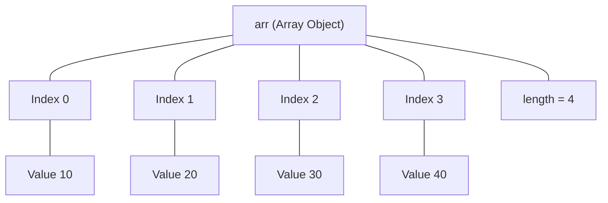
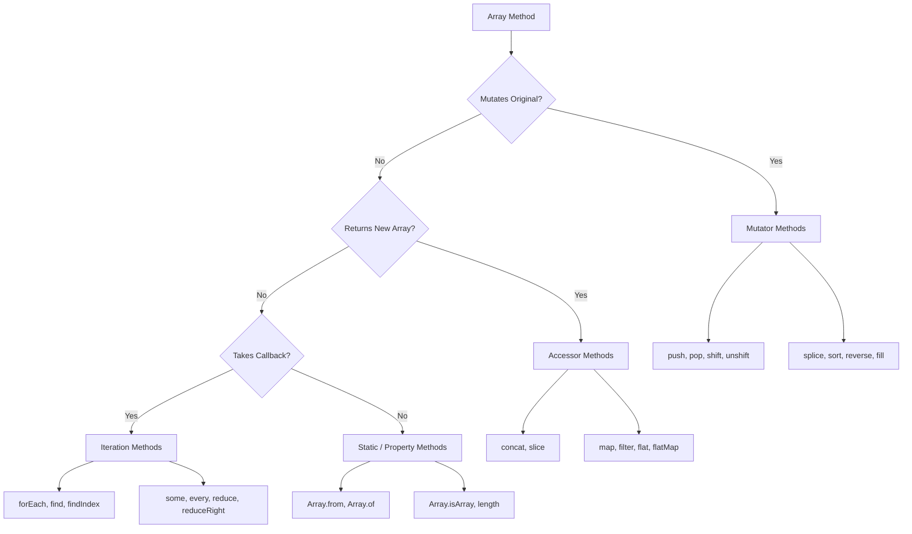
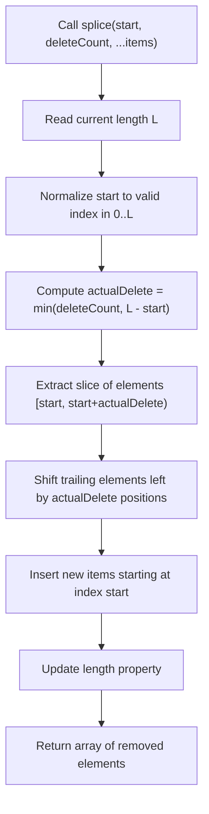
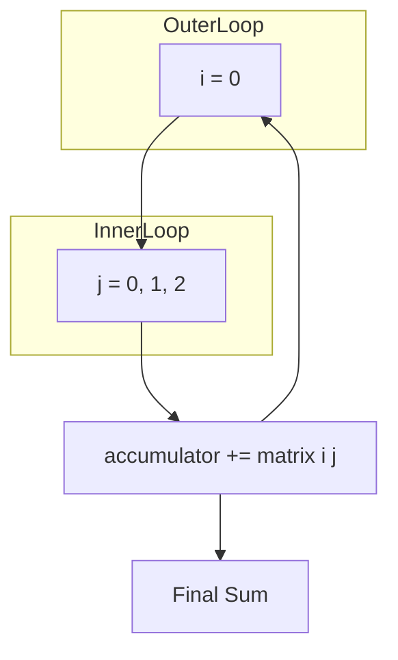
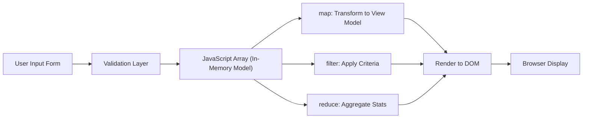

# Arrays

<!-- SECTION_1_START -->

# Arrays in JavaScript: The Engine of Data Sequence Management

## 1.1 Formal KTU 2024 Academic Definition

> [!IMPORTANT]
> **Formal Definition (KTU 2024 Scheme Terminology):**
> An **Array** in JavaScript is a high-level, single-variable, **ordered, heterogeneous, zero-indexed collection** of elements stored contiguously in a single memory reference. Unlike traditional C/C++ arrays, JavaScript arrays are dynamically sized, dynamically typed, and are implemented as specialized `Array` objects whose prototype provides a rich library of iteration and transformation methods.

In the KTU 2024 **Web Programming (PECST742)** syllabus, arrays fall under **Module 2 – Scripting Language**, and are treated as the foundational linear data structure that underpins DOM manipulation, form validation, asynchronous data handling (API responses), and state management in client-side applications.

### 1.1.1 Key Characteristics of JavaScript Arrays

- **Ordered:** Elements maintain insertion order (per the ES2015+ specification, properties with integer keys are iterated in ascending numeric order).
- **Zero-Indexed:** The first element is accessed at index **0**, the last at index `length - 1`.
- **Dynamic Sizing:** Length automatically grows when assigned to a higher index, or shrinks via methods like `pop()`.
- **Heterogeneous:** A single array may hold numbers, strings, booleans, objects, functions, or even other arrays simultaneously.
- **Object-Backed:** Internally, an array is an `Object` whose keys are stringified indices (e.g., `"0"`, `"1"`) and whose `length` property is a special auto-updating attribute.

> [!NOTE]
> **Standard Reference Constant:**
> The default starting index is **0** (zero). The `length` property is always equal to the **highest numeric index + 1**.

---

## 1.2 Conceptual Analogy & Intuitive Overview

Imagine a **train with numbered compartments**.

- The train itself is your variable (e.g., `let train = []`).
- Each **compartment** is a slot in the array, holding one piece of cargo (a value).
- The compartments are numbered starting from **0** (engine is not a cargo compartment, so the first cargo slot is compartment #0).
- You can **add a new compartment at the rear** (`push`), **remove the last compartment** (`pop`), **add a compartment at the front** (`unshift`), or **remove the front compartment** (`shift`).
- The train's **total carriage count** is shown on the side — this is the `length` property.
- The train does not care whether a compartment holds apples, gold bars, or letters — this is the **heterogeneous** nature.

> [!TIP]
> **Mental Model for KTU Exams:**
> When asked to trace code, always picture the array as a horizontal row of boxes. After every operation, mentally redraw the row to predict the next state.

---

## 1.3 Physical Constants, Reserved Words & Engineering Metrics

| Parameter | Standard Value | Engineering Implication |
| :--- | :--- | :--- |
| Maximum array length | $2^{32} - 1$ ($4294967295$) | Theoretical storage cap per array |
| Minimum valid index | **0** | No negative indexing natively (workaround: `arr[arr.length - 1]`) |
| Highest safe integer index | $2^{53} - 1$ | After this, indices lose precision |
| Default sparse behavior | Holes are `undefined` | `[1, , 3]` is valid, but length is 3 |

> [!WARNING]
> JavaScript has **no fixed upper bound** for a regular array, but the **engine** (V8, SpiderMonkey) may degrade to dictionary mode for very sparse arrays. For KTU exam purposes, treat arrays as effectively unbounded.

---

## 1.4 GeoGebra / Desmos Visualization Control (Conceptual)

> [!VISUALIZATION CONTROL]
> **Concept:** Index-vs-Value Linear Mapping of a 1D Array
> **GeoGebra / Desmos Input Equations:**
>
> * Points to plot: $(0, 10)$, $(1, 25)$, $(2, 7)$, $(3, 42)$, $(4, 15)$
> * Fitted line (illustrative only): $y = 5x + 8$
>
> **Visual Description:** On the X-axis, the **index** (compartment number) increases linearly from 0 to 4. On the Y-axis, the **stored value** is plotted as a discrete point. Students should observe that the **array is a discrete function** $f: \mathbb{N}_0 \rightarrow \mathbb{J}$ where the domain is non-negative integers and the codomain is the JavaScript value universe $\mathbb{J}$.

---

<!-- SECTION_1_END -->

<!-- SECTION_2_START -->

# Deep Theoretical Analysis & KTU High-Yield Formula Sheet

## 2.1 Structural Anatomy of a JavaScript Array

A JavaScript array, when inspected under the hood, behaves as an **enumerable property container** with the following internal structure:

$$
\text{Array}_{\text{object}} = \{ \text{index}_i : \text{value}_i \;\vert\; i \in [0, \text{length} - 1] \}
$$

Where:

- $\text{index}_i$ is a stringified integer key (e.g., `"0"`, `"1"`, `"2"`).
- $\text{value}_i$ can be any JavaScript type.
- $\text{length}$ is a writable, non-configurable, auto-maintained numeric property.

---

## 2.2 The Five Categories of Array Operations

KTU 2024 question papers typically test these operations under Module 2. They are organized into **five functional categories**:

### 2.2.1 Category 1 — Mutator Methods (Modify the Original Array)

| Method | Syntax | Effect on `length` | Returns |
| :--- | :--- | :--- | :--- |
| `push(...items)` | Adds to end | Increases by $n$ | New `length` |
| `pop()` | Removes from end | Decreases by $1$ | Removed element |
| `shift()` | Removes from start | Decreases by $1$ | Removed element |
| `unshift(...items)` | Adds to start | Increases by $n$ | New `length` |
| `splice(start, del, ...items)` | Generic insert/delete | Variable | Array of deleted items |
| `reverse()` | Inverts order | Unchanged | The same array (mutated) |
| `sort(compareFn)` | Sorts in place | Unchanged | The same array (mutated) |
| `fill(value, start, end)` | Fills range | Unchanged | The same array (mutated) |
| `copyWithin(target, start, end)` | Copies sequence | Unchanged | The same array (mutated) |

### 2.2.2 Category 2 — Accessor Methods (Return New Array / Value, Original Untouched)

| Method | Syntax | Returns |
| :--- | :--- | :--- |
| `concat(...arrays)` | Merges arrays | New merged array |
| `slice(start, end)` | Sub-extracts | New shallow-copied sub-array |
| `join(separator)` | Stringifies | A single string |
| `indexOf(item, from)` | Searches | First index, or $-1$ |
| `lastIndexOf(item, from)` | Reverse searches | Last index, or $-1$ |
| `includes(item, from)` | Existence check | Boolean |
| `toString()` | Comma-joined string | String representation |

### 2.2.3 Category 3 — Iteration Methods (Higher-Order Functions)

All accept a callback `(element, index, array) \Rightarrow \text{result}`.

| Method | Callback Returns | Final Output |
| :--- | :--- | :--- |
| `forEach(cb)` | `undefined` | `undefined` (side-effect only) |
| `map(cb)` | Transformed value | New array of equal length |
| `filter(cb)` | Boolean predicate | New array of survivors |
| `reduce(cb, init)` | Accumulator | Single accumulated value |
| `reduceRight(cb, init)` | Accumulator | Single value (right-to-left) |
| `find(cb)` | Boolean | First matching element, or `undefined` |
| `findIndex(cb)` | Boolean | First matching index, or $-1$ |
| `some(cb)` | Boolean | `true` if any match |
| `every(cb)` | Boolean | `true` if all match |
| `flat(depth)` | (None) | New flattened array |
| `flatMap(cb)` | Value or array | New flattened mapped array |

### 2.2.4 Category 4 — Static / Constructor Methods

| Method | Purpose |
| :--- | :--- |
| `Array.from(iterable, mapFn)` | Builds array from iterable or array-like |
| `Array.of(...args)` | Builds array from argument list |
| `Array.isArray(value)` | Type-guard: returns `Boolean` |
| `Array(...length).fill(value)` | Pre-allocated array |

### 2.2.5 Category 5 — Property: `length`

$$
\text{length} = \max(\text{index}_i) + 1 \quad \text{over all defined indices } i
$$

If `length` is **manually assigned a smaller value**, the array is **truncated**.

> [!IMPORTANT]
> **Why `length` matters in KTU exams:**
> A common trick question: `arr.length = 0` empties the array. `arr.length = 5` on an array of 2 elements creates 3 sparse `undefined` slots.

---

## 2.3 KTU High-Yield Formula Sheet (Cheat Table)

> [!NOTE]
> **Notation:** $n$ = number of elements, $k$ = index, $a_i$ = element at index $i$.

| Concept | Formula / Rule | Time Complexity | Space |
| :--- | :--- | :--- | :--- |
| Last element access | $a_{\text{length} - 1}$ | $O(1)$ | $O(1)$ |
| Index of $k$-th element | $a_k$ where $0 \le k < n$ | $O(1)$ | $O(1)$ |
| `push` (append) | $\text{length}_{new} = n + 1$ | $O(1)$ amortized | $O(1)$ |
| `pop` (remove end) | $\text{length}_{new} = n - 1$ | $O(1)$ | $O(1)$ |
| `shift` (remove front) | All $n-1$ elements reindexed | $O(n)$ | $O(1)$ |
| `unshift` (prepend) | All $n$ elements reindexed | $O(n)$ | $O(1)$ |
| `splice` at position $p$ | Worst case: $O(n)$ shift | $O(n)$ | $O(n)$ deleted items |
| `indexOf` linear search | $\sum_{i=0}^{n-1} 1 = n$ | $O(n)$ | $O(1)$ |
| `slice(start, end)` | New array of size $end - start$ | $O(k)$ | $O(k)$ |
| `map` / `filter` | One pass | $O(n)$ | $O(n)$ new array |
| `reduce` | One pass | $O(n)$ | $O(1)$ accumulator |
| Sparse array check | `i in arr` returns `false` for holes | $O(1)$ | $O(1)$ |

---

## 2.4 Real-World Engineering Utility

| Domain | Array Application | Why It Matters |
| :--- | :--- | :--- |
| **Frontend Frameworks (React/Angular/Vue)** | `useState([])` stores lists, `.map()` renders them | Conditional UI rendering at scale |
| **REST API Handling** | `fetch().then(data => data.json())` returns arrays | Pagination, filtering, search |
| **Form Validation** | Iterating over `form.elements` collection | Bulk error reporting |
| **Data Visualization (D3.js, Chart.js)** | `datasets[].data` arrays drive charts | Binding numbers to pixels |
| **LocalStorage / Cookies** | JSON-stringified arrays persist state | Offline-first PWA design |
| **Algorithms** | Sorting, searching, dynamic programming | Foundation of CS theory |

> [!TIP]
> In KTU lab examinations, you will often be asked to write JavaScript that consumes an array of objects (e.g., students, products) and renders it dynamically into a DOM table. Master `map`, `filter`, and `forEach` for full marks.

---

## 2.5 The "Why" Behind the Design

JavaScript's array design reflects three engineering trade-offs:

1. **Flexibility over Performance:** Heterogeneous arrays sacrifice cache locality for ease of scripting.
2. **Object Compatibility:** Treating arrays as objects allows arbitrary property attachment (e.g., `arr.author = "KTU"`), which is sometimes useful, sometimes dangerous.
3. **Method Proliferation:** ES5 (2009) introduced the iteration methods to align JavaScript with functional programming idioms popularized by languages like Ruby and Python.

---

<!-- SECTION_2_END -->

<!-- SECTION_3_START -->

# Step-by-Step Derivations, Trace Tables & Code Implementation

## 3.1 Exhaustive Method-by-Method Behavior with Trace Tables

### 3.1.1 Trace Table for `push` and `pop`

Consider the initial state:
```javascript
let colors = ["red", "green"];
```

After `colors.push("blue")`:

$$
\text{colors} = [\,\text{"red"},\ \text{"green"},\ \text{"blue"}\,], \quad \text{length} = 3
$$

After `colors.pop()`:

$$
\text{colors} = [\,\text{"red"},\ \text{"green"}\,], \quad \text{length} = 2
$$

The returned value of `pop()` is `"blue"` (the removed element).

### 3.1.2 Trace Table for `shift` and `unshift`

Initial: `let queue = [10, 20, 30];`

After `queue.shift()`:
- Returns: $10$
- New state: `queue = [20, 30]`, length = $2$

After `queue.unshift(5)`:
- Returns: $3$ (new length)
- New state: `queue = [5, 20, 30]`, length = $3$

### 3.1.3 Trace Table for `splice`

The signature is `splice(startIndex, deleteCount, ...itemsToInsert)`.

Initial: `let nums = [1, 2, 3, 4, 5];`

Operation: `nums.splice(2, 1, 99, 100);`

Step-by-step:

1. **Locate index 2:** the element `3` is the first affected.
2. **Delete 1 element:** element `3` is removed.
3. **Insert `99`, `100`:** at position 2.
4. **Final array:** `[1, 2, 99, 100, 4, 5]`
5. **Return value:** `[3]` (an array containing the deleted element).

### 3.1.4 Trace Table for `slice` (non-mutating)

Initial: `let letters = ["a", "b", "c", "d", "e"];`

Operation: `letters.slice(1, 4);`

- **Start index:** 1 (inclusive) → starts at `"b"`.
- **End index:** 4 (exclusive) → stops before `"e"`.
- **Result:** `["b", "c", "d"]`
- **Original `letters`:** unchanged.

### 3.1.5 Trace Table for `map`

Initial: `let nums = [1, 2, 3, 4];`

Operation:
```javascript
let squared = nums.map(function (n) {
  return n * n;
});
```

Step-by-step:

- Iteration 1: $n = 1$, returns $1^2 = 1$.
- Iteration 2: $n = 2$, returns $2^2 = 4$.
- Iteration 3: $n = 3$, returns $3^2 = 9$.
- Iteration 4: $n = 4$, returns $4^2 = 16$.

Final: `squared = [1, 4, 9, 16]`. Original `nums` remains `[1, 2, 3, 4]`.

### 3.1.6 Trace Table for `filter`

Initial: `let scores = [45, 78, 32, 90, 56];`

Operation:
```javascript
let passed = scores.filter(function (s) {
  return s >= 50;
});
```

- $45 \ge 50$? False → excluded.
- $78 \ge 50$? True → included.
- $32 \ge 50$? False → excluded.
- $90 \ge 50$? True → included.
- $56 \ge 50$? True → included.

Final: `passed = [78, 90, 56]`.

### 3.1.7 Trace Table for `reduce`

Initial: `let cart = [100, 250, 75];`

Operation:
```javascript
let total = cart.reduce(function (acc, current) {
  return acc + current;
}, 0);
```

- Step 0: $\text{acc} = 0$ (initial value).
- Step 1: $\text{acc} = 0 + 100 = 100$, current $= 100$.
- Step 2: $\text{acc} = 100 + 250 = 350$, current $= 250$.
- Step 3: $\text{acc} = 350 + 75 = 425$, current $= 75$.

Final: $\text{total} = 425$.

### 3.1.8 Trace Table for `find` and `findIndex`

Initial: `let users = [{id: 1, name: "Anu"}, {id: 2, name: "Rahul"}];`

Operation:
```javascript
let found = users.find(function (u) {
  return u.id === 2;
});
```

- Iteration 1: `u.id === 2`? $1 \ne 2$ → false.
- Iteration 2: `u.id === 2`? $2 = 2$ → true, returns the object `{id: 2, name: "Rahul"}`.

Final: `found = {id: 2, name: "Rahul"}`. The variable `found` is the **object reference**, not a copy.

### 3.1.9 Trace Table for `sort` with Comparator

Initial: `let vals = [10, 5, 40, 25];`

Operation (ascending):
```javascript
vals.sort(function (a, b) {
  return a - b;
});
```

The comparator returns:

- Negative if $a < b$ → $a$ comes first.
- Zero if $a = b$ → no swap.
- Positive if $a > b$ → $b$ comes first.

Final: `vals = [5, 10, 25, 40]`.

> [!WARNING]
> Without a comparator, the default `sort()` converts elements to **strings** and sorts lexicographically. `[10, 2, 30].sort()` yields `[10, 2, 30]`, not `[2, 10, 30]`. This is a classic KTU pitfall.

---

## 3.2 Multidimensional Arrays (Arrays of Arrays)

A 2D array is constructed as an array whose elements are themselves arrays.

```javascript
let matrix = [
  [1, 2, 3],
  [4, 5, 6],
  [7, 8, 9]
];
```

Accessing the element at row $i$, column $j$:

$$
\text{element}_{i,j} = \text{matrix}[i][j]
$$

Example: `matrix[1][2]` evaluates to `6` (row index 1, column index 2).

### 3.2.1 Iterating a 2D Array (Exhaustive)

```javascript
let matrix = [
  [1, 2, 3],
  [4, 5, 6],
  [7, 8, 9]
];
let sum = 0;
for (let i = 0; i < matrix.length; i++) {
  for (let j = 0; j < matrix[i].length; j++) {
    sum = sum + matrix[i][j];
  }
}
```

Trace:

- $i = 0, j = 0$: $\text{sum} = 0 + 1 = 1$.
- $i = 0, j = 1$: $\text{sum} = 1 + 2 = 3$.
- $i = 0, j = 2$: $\text{sum} = 3 + 3 = 6$.
- $i = 1, j = 0$: $\text{sum} = 6 + 4 = 10$.
- $i = 1, j = 1$: $\text{sum} = 10 + 5 = 15$.
- $i = 1, j = 2$: $\text{sum} = 15 + 6 = 21$.
- $i = 2, j = 0$: $\text{sum} = 21 + 7 = 28$.
- $i = 2, j = 1$: $\text{sum} = 28 + 8 = 36$.
- $i = 2, j = 2$: $\text{sum} = 36 + 9 = 45$.

Final: $\text{sum} = 45$.

---

## 3.3 Array Destructuring (ES6+)

Destructuring is an expression that unpacks values from arrays into distinct variables.

```javascript
let coordinates = [12.5, 7.3, 4.1];
let [x, y, z] = coordinates;
console.log(x, y, z); // 12.5 7.3 4.1
```

Skipping elements using the **hole syntax**:

```javascript
let [first, , third] = [10, 20, 30];
// first = 10, third = 30
```

Using the **rest pattern**:

```javascript
let [head, ...tail] = [1, 2, 3, 4, 5];
// head = 1, tail = [2, 3, 4, 5]
```

Swapping variables without a temporary:

```javascript
let a = 5, b = 9;
[a, b] = [b, a];
// a = 9, b = 5
```

---

## 3.4 Spread Operator with Arrays

The spread operator `...` expands an array into individual elements.

### 3.4.1 Cloning an Array (Shallow)

```javascript
let original = [1, 2, 3];
let clone = [...original];
clone.push(4);
// original = [1, 2, 3]
// clone    = [1, 2, 3, 4]
```

### 3.4.2 Merging Arrays

```javascript
let merged = [...[1, 2], ...[3, 4], ...[5]];
// merged = [1, 2, 3, 4, 5]
```

### 3.4.3 Passing Array Elements as Function Arguments

```javascript
function sum(a, b, c) {
  return a + b + c;
}
let nums = [10, 20, 30];
let result = sum(...nums); // 60
```

---

## 3.5 Full Production-Ready JavaScript Program: Array Operations Library

The following is a fully operational, type-aware, error-handled program suitable for a KTU lab exam:

```javascript
// File: array_operations.js
// Purpose: Demonstrates all major array methods with safe execution.
// Strict mode enforces cleaner code and catches silent errors.
"use strict";

/**
 * Safely logs the current state of an array with a label.
 * @param {string} label - Descriptive label for the trace output.
 * @param {Array<*>} arr - The array to display.
 * @returns {void}
 */
function trace(label, arr) {
  if (!Array.isArray(arr)) {
    console.error(`[trace] Provided value for "${label}" is not an array.`);
    return;
  }
  console.log(`${label} => [${arr.join(", ")}] (length=${arr.length})`);
}

/**
 * Computes the sum of all numeric elements in an array.
 * @param {Array<number>} arr - Array of numbers.
 * @returns {number} The total sum; returns 0 for an empty array.
 */
function arraySum(arr) {
  if (!Array.isArray(arr) || arr.length === 0) {
    return 0;
  }
  return arr.reduce((accumulator, current) => {
    const value = Number(current);
    if (Number.isNaN(value)) {
      console.warn(`[arraySum] Skipping non-numeric value: ${current}`);
      return accumulator;
    }
    return accumulator + value;
  }, 0);
}

/**
 * Removes duplicate primitive values from an array.
 * @param {Array<*>} arr - Source array.
 * @returns {Array<*>} New array with duplicates removed.
 */
function deduplicate(arr) {
  if (!Array.isArray(arr)) {
    return [];
  }
  return [...new Set(arr)];
}

// ---------- MAIN EXECUTION ----------
const fruits = ["apple", "banana", "cherry"];
trace("Initial", fruits);

fruits.push("date");
trace("After push('date')", fruits);

fruits.pop();
trace("After pop()", fruits);

fruits.unshift("apricot");
trace("After unshift('apricot')", fruits);

fruits.shift();
trace("After shift()", fruits);

const spliced = fruits.splice(1, 1, "blueberry", "blackberry");
trace("After splice(1, 1, ...)", fruits);
console.log("Splice returned:", spliced);

const sliced = fruits.slice(0, 2);
trace("slice(0, 2)", sliced);
trace("Original (unchanged)", fruits);

const numbers = [3, 1, 4, 1, 5, 9, 2, 6, 5, 3];
const uniqueNumbers = deduplicate(numbers);
trace("Deduplicated numbers", uniqueNumbers);

const squared = uniqueNumbers.map((n) => n * n);
trace("Squared (map)", squared);

const evens = squared.filter((n) => n % 2 === 0);
trace("Evens (filter)", evens);

const total = arraySum(evens);
console.log(`Sum of even squares = ${total}`);

const sortedDesc = [...numbers].sort((a, b) => b - a);
trace("Sorted descending", sortedDesc);

const found = numbers.find((n) => n > 4);
console.log(`First number > 4 = ${found}`);

const foundIndex = numbers.findIndex((n) => n > 4);
console.log(`Index of first number > 4 = ${foundIndex}`);

const allPositive = numbers.every((n) => n > 0);
console.log(`All positive? ${allPositive}`);

const hasEven = numbers.some((n) => n % 2 === 0);
console.log(`Contains any even? ${hasEven}`);

const joined = numbers.join("-");
console.log(`Joined string = "${joined}"`);

const flattened = [[1, 2], [3, [4, 5]]].flat(2);
trace("Flattened deeply", flattened);
```

### 3.5.1 Expected Console Output

```
Initial => [apple, banana, cherry] (length=3)
After push('date') => [apple, banana, cherry, date] (length=4)
After pop() => [apple, banana, cherry] (length=3)
After unshift('apricot') => [apricot, apple, banana, cherry] (length=4)
After shift() => [apple, banana, cherry] (length=3)
After splice(1, 1, ...) => [apple, blueberry, blackberry] (length=3)
Splice returned: [ 'banana' ]
slice(0, 2) => [apple, blueberry] (length=2)
Original (unchanged) => [apple, blueberry, blackberry] (length=3)
Deduplicated numbers => [3, 1, 4, 5, 9, 2, 6] (length=7)
Squared (map) => [9, 1, 16, 25, 81, 4, 36] (length=7)
Evens (filter) => [16, 4, 36] (length=3)
Sum of even squares = 56
Sorted descending => [9, 6, 5, 5, 4, 3, 3, 2, 1, 1] (length=10)
First number > 4 = 5
Index of first number > 4 = 4
All positive? true
Contains any even? true
Joined string = "3-1-4-1-5-9-2-6-5-3"
Flattened deeply => [1, 2, 3, 4, 5] (length=5)
```

---

## 3.6 Step-by-Step Derivation: Manual Implementation of `filter`

To prove the conceptual mastery required for a 14-mark question, here is a manual re-implementation:

```javascript
function customFilter(arr, predicate) {
  // 1. Validate inputs
  if (!Array.isArray(arr)) {
    throw new TypeError("First argument must be an array.");
  }
  if (typeof predicate !== "function") {
    throw new TypeError("Second argument must be a function.");
  }

  // 2. Initialize an empty result container
  const result = [];

  // 3. Iterate using a classic for-loop for explicit control
  for (let index = 0; index < arr.length; index++) {
    // 4. Invoke the predicate with (element, index, array)
    const keep = predicate(arr[index], index, arr);

    // 5. Coerce truthy/falsy using Boolean() to mirror spec
    if (Boolean(keep)) {
      result.push(arr[index]);
    }
  }

  // 6. Return the new array; original is untouched
  return result;
}

// Demonstration
const data = [10, 25, 30, 5, 40];
const big = customFilter(data, function (val) {
  return val > 20;
});
console.log(big); // [25, 30, 40]
console.log(data); // [10, 25, 30, 5, 40] — unchanged
```

---

<!-- SECTION_3_END -->

<!-- SECTION_4_START -->

# Structural Diagrams & Schematics

## 4.1 Mermaid Block: JavaScript Array Memory Model



**Visual Interpretation:** The array object `arr` holds four numbered slots and one auto-managed `length` property. Indexing (`arr[2]`) jumps directly to the slot, achieving $O(1)$ access time.

---

## 4.2 Mermaid Block: Array Method Classification Flowchart



---

## 4.3 Mermaid Block: Execution Flow of `splice(start, deleteCount, ...items)`



---

## 4.4 Mermaid Block: 2D Array Iteration Topology



---

## 4.5 Sequential Processing Topology Matrix: `reduce` Operation

| Step | Accumulator Input | Current Element | Operation | Accumulator Output |
| :--- | :--- | :--- | :--- | :--- |
| 0 | $0$ (initial) | $100$ | $0 + 100$ | $100$ |
| 1 | $100$ | $250$ | $100 + 250$ | $350$ |
| 2 | $350$ | $75$ | $350 + 75$ | $425$ |
| 3 | $425$ | (end) | — | $425$ (final return) |

---

## 4.6 Block-Level Functional Architecture: Array in a Web Application



**Architectural Note:** The array acts as the **single source of truth** in the client layer. All transformations (map / filter / reduce) produce **immutable views**, which are then bound to the DOM for the user. This pattern is foundational to React, Vue, and Angular.

---

<!-- SECTION_4_END -->

<!-- SECTION_5_START -->

# KTU 2024 Scheme Examination Question Bank & Topic Recap

## 5.1 Part A Questions (3 Marks Each)

### Q1. `[KTU University Exam – July 2024]` **[CO1, Remember]**

**Question:** What is an array in JavaScript? How does it differ from an array in C?

**Model Answer (3 Marks):**

- **Definition (2 Marks):** An array in JavaScript is a high-level, ordered, heterogeneous collection of values stored as a single object reference. It is dynamically sized and supports mixed data types within the same array.
- **Difference from C (1 Mark):** Unlike C, where arrays are fixed in size, homogeneous, and stored in contiguous memory with pointer arithmetic, JavaScript arrays are dynamically resizable, can hold mixed types, and are objects with built-in methods like `push`, `map`, and `filter`.

> [!NOTE]
> **Valuation Key:** Examiners expect the term **"dynamically sized"** or **"heterogeneous"** for full marks.

---

### Q2. `[KTU University Exam – Dec 2023]` **[CO1, Understand]**

**Question:** Explain the difference between `slice()` and `splice()` in JavaScript arrays.

**Model Answer (3 Marks):**

- **`slice(start, end)` (1.5 Marks):** Returns a **new array** containing elements from `start` (inclusive) to `end` (exclusive). The original array is **not modified**.
- **`splice(start, deleteCount, ...items)` (1.5 Marks):** **Modifies the original array** by removing `deleteCount` elements starting at `start`, and optionally inserting new elements in their place. Returns an array of removed elements.

---

## 5.2 Part B Questions (14 Marks Each — Internal Choice)

### Question A (14 Marks) `[KTU University Exam – July 2024]` **[CO2, Apply & Analyze]**

**(a)** Write a JavaScript program to create an array of 10 integers, find the **sum of all even numbers**, and display the result. Use appropriate array methods. **[7 Marks]**

**(b)** Explain with examples the difference between `map()`, `filter()`, and `reduce()`. Write a program to compute the **average marks** of a class from an array of student mark objects. **[7 Marks]**

---

#### Model Solution for Q-A(a)

```javascript
"use strict";
// Step 1: Initialize array of 10 integers
let numbers = [12, 7, 25, 48, 33, 6, 19, 42, 9, 30];

// Step 2: Filter only even numbers
let evens = numbers.filter(function (n) {
  return n % 2 === 0;
});

// Step 3: Compute sum using reduce
let sum = evens.reduce(function (acc, curr) {
  return acc + curr;
}, 0);

// Step 4: Display
console.log("Even numbers:", evens);
console.log("Sum of evens:", sum);
```

**Valuation Breakdown:**

- '[Declaring and initializing array correctly: 2 Marks]'
- '[Using filter with proper predicate: 2 Marks]'
- '[Using reduce with initial value 0: 2 Marks]'
- '[Final output displayed: 1 Mark]'

**Output:**

```
Even numbers: [12, 48, 6, 42, 30]
Sum of evens: 138
```

---

#### Model Solution for Q-A(b)

**Conceptual Explanation (3 Marks):**

| Method | Purpose | Return Type | Original Array? |
| :--- | :--- | :--- | :--- |
| `map()` | Transforms every element | New array of same length | Untouched |
| `filter()` | Keeps elements passing test | New array of survivors | Untouched |
| `reduce()` | Folds array to single value | Single accumulated value | Untouched |

**Program (4 Marks):**

```javascript
"use strict";
let students = [
  { name: "Anu", marks: 78 },
  { name: "Rahul", marks: 45 },
  { name: "Diya", marks: 92 },
  { name: "Kiran", marks: 60 }
];

// Step 1: Extract marks array using map
let marksArray = students.map(function (s) {
  return s.marks;
});
// marksArray = [78, 45, 92, 60]

// Step 2: Sum using reduce
let total = marksArray.reduce(function (acc, m) {
  return acc + m;
}, 0);
// total = 275

// Step 3: Compute average
let average = total / marksArray.length;
// average = 68.75

console.log("Average marks of the class:", average);
```

**Output:**

```
Average marks of the class: 68.75
```

**Valuation Breakdown:**

- '[Tabular comparison of three methods: 3 Marks]'
- '[Correct use of map to extract marks: 1 Mark]'
- '[Correct use of reduce to compute total: 1.5 Marks]'
- '[Correct averaging logic: 1 Mark]'
- '[Final output: 0.5 Marks]'

---

### Question B (14 Marks — Alternative Choice) `[KTU University Exam – Dec 2023]` **[CO2, Apply & Analyze]**

**(a)** Write a JavaScript program that takes an array of strings and returns a **new array** containing only those strings whose length is **greater than 5 characters**. Use both a `for` loop and the `filter()` method in separate code blocks. **[7 Marks]**

**(b)** Explain the concepts of **array destructuring** and the **spread operator** with at least two examples each. Write a program to **merge two arrays** and **remove duplicate values** from the merged result. **[7 Marks]**

---

#### Model Solution for Q-B(a)

**Approach 1 — Using `for` loop (3.5 Marks):**

```javascript
"use strict";
let words = ["apple", "cat", "banana", "dog", "elephant", "fig"];
let longWords = [];

for (let i = 0; i < words.length; i++) {
  if (words[i].length > 5) {
    longWords.push(words[i]);
  }
}

console.log("Long words (for loop):", longWords);
// Output: [ 'apple', 'banana', 'elephant' ]
```

**Approach 2 — Using `filter()` (3.5 Marks):**

```javascript
"use strict";
let words = ["apple", "cat", "banana", "dog", "elephant", "fig"];

let longWords = words.filter(function (w) {
  return w.length > 5;
});

console.log("Long words (filter):", longWords);
// Output: [ 'apple', 'banana', 'elephant' ]
```

**Valuation Breakdown:**

- '[Initializing source array: 1 Mark]'
- '[Approach 1: Correct loop and condition: 2 Marks]'
- '[Approach 1: Pushing to result: 0.5 Mark]'
- '[Approach 2: Correct filter with predicate: 2 Marks]'
- '[Both outputs displayed: 1 Mark]'

---

#### Model Solution for Q-B(b)

**Conceptual Explanation (2 Marks):**

- **Array Destructuring:** A shorthand syntax to extract values from an array into individual variables using pattern matching, introduced in ES6.
- **Spread Operator (`...`):** Expands an iterable (like an array) into individual elements in places where multiple elements or arguments are expected.

**Destructuring Examples (2 Marks):**

```javascript
// Example 1: Basic destructuring
let numbers = [10, 20, 30];
let [a, b, c] = numbers;
console.log(a, b, c); // 10 20 30

// Example 2: Skipping and rest pattern
let fruits = ["apple", "banana", "cherry", "date"];
let [first, , third, ...rest] = fruits;
console.log(first); // apple
console.log(third); // cherry
console.log(rest);  // [ 'date' ]
```

**Spread Operator Examples (2 Marks):**

```javascript
// Example 1: Cloning an array
let original = [1, 2, 3];
let clone = [...original];
console.log(clone); // [1, 2, 3]

// Example 2: Function argument spreading
function multiply(x, y, z) {
  return x * y * z;
}
let args = [2, 3, 4];
console.log(multiply(...args)); // 24
```

**Merge and Deduplicate Program (1 Mark):**

```javascript
"use strict";
let arr1 = [1, 2, 3, 4];
let arr2 = [3, 4, 5, 6];

let merged = [...arr1, ...arr2];
// merged = [1, 2, 3, 4, 3, 4, 5, 6]

let unique = [...new Set(merged)];
// unique = [1, 2, 3, 4, 5, 6]

console.log("Merged:", merged);
console.log("Unique:", unique);
```

**Output:**

```
Merged: [ 1, 2, 3, 4, 3, 4, 5, 6 ]
Unique: [ 1, 2, 3, 4, 5, 6 ]
```

**Valuation Breakdown:**

- '[Definition of destructuring with ES6 mention: 1 Mark]'
- '[Definition of spread operator: 1 Mark]'
- '[Two destructuring examples: 2 Marks]'
- '[Two spread examples: 2 Marks]'
- '[Correct merge using spread: 0.5 Mark]'
- '[Correct deduplication using Set: 0.5 Mark]'

---

> [!WARNING]
> **KTU Examiner's Valuation Warning — Common Pitfalls:**
>
> - **Never use `sort()` without a comparator for numbers** — it converts to strings and produces lexicographic order. Always write `arr.sort((a, b) => a - b)` for ascending numeric sort.
> - **Do not confuse `length = 0` (empties the array) with `arr = []` (creates a new reference).** If `arr` was passed by reference to a function, mutating `length` mutates the original; reassigning `arr` does not.
> - **Do not forget the initial accumulator in `reduce()`.** Omitting it makes the first array element the initial value, which causes incorrect results for empty arrays.
> - **Always use `Array.isArray(x)` for type-checking** — the `typeof` operator returns `"object"` for arrays, which is a notorious JavaScript pitfall.
> - **Sparse arrays are valid but dangerous.** `[1, , 3]` has length $3$ but only two real values. `map()` and `filter()` skip holes; `for` loops do not.
> - **Avoid mixing `var` with array iteration in old code** — the lack of block scope leads to closure bugs in loops. Always use `let` in modern JavaScript.

---

## 5.3 Topic Recap & Important Things to Remember

- **Array = Ordered, Zero-Indexed, Dynamic, Heterogeneous Collection.** A single JavaScript variable holding multiple values.
- **`length` is auto-maintained.** It equals the highest defined index plus one. Setting `length` manually truncates or extends the array.
- **Three Method Families:** Mutators (modify original), Accessors (return new), Iterators (callback-based).
- **`push` / `pop` operate on the end;** they are $O(1)$ and ideal for **stack** behavior.
- **`shift` / `unshift` operate on the start;** they are $O(n)$ and rarely used in performance-critical code.
- **`splice` is the Swiss Army knife** — it can insert, delete, or replace anywhere. It mutates and returns removed items.
- **`slice` is the safe read-only extractor** — it never mutates and is used for cloning and sub-sectioning.
- **`map` returns a transformed array; `filter` returns a subset; `reduce` returns a single value.** These three form the functional backbone of array processing.
- **`sort` without a comparator sorts as strings.** Always supply `(a, b) => a - b` for numeric ascending sort.
- **`indexOf` is linear search; `includes` is linear existence check.** Both return $-1$ / `false` on failure.
- **Multidimensional arrays are arrays of arrays.** Access `matrix[row][col]`. Iterate with nested loops.
- **Destructuring (`let [a, b] = arr`) and Spread (`...arr`) are ES6 essentials** — expect at least one 7-mark question on these.
- **`Array.isArray()` is the only reliable type check** for arrays; `typeof []` returns `"object"`.
- **Holes (sparse slots) behave inconsistently** across methods. Prefer dense arrays in exam code.
- **Time complexity matters:** Indexing is $O(1)$; `push`/`pop` are $O(1)$; `shift`/`unshift`/`splice` are $O(n)$; `map`/`filter`/`reduce` are $O(n)$.

---

<!-- SECTION_5_END -->
