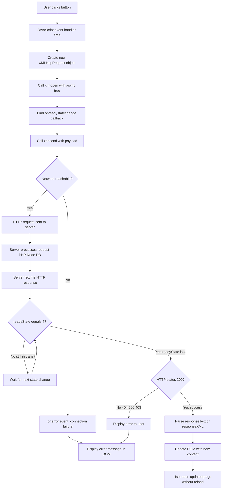
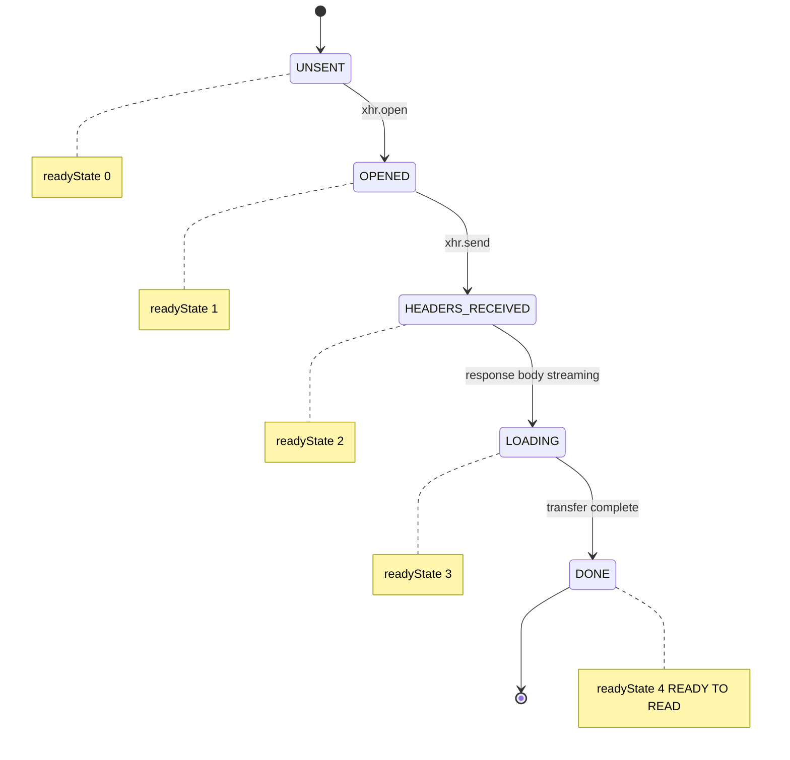
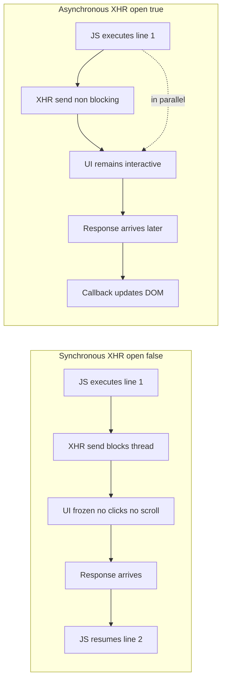
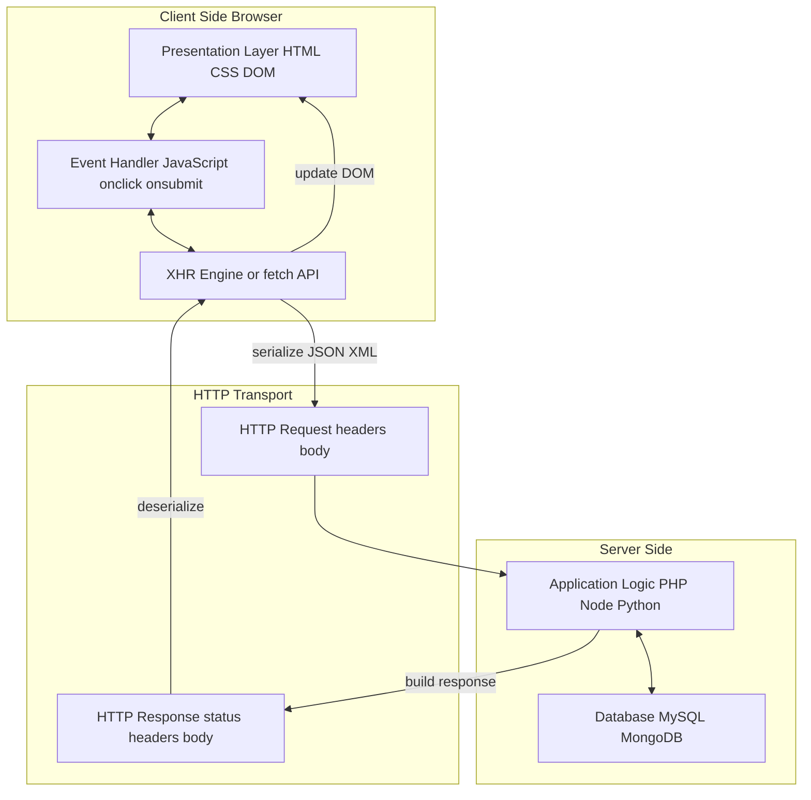
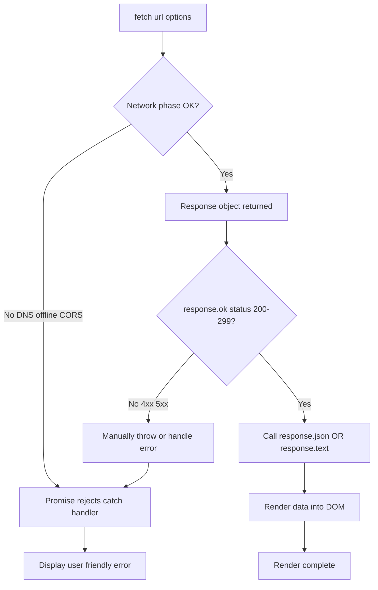

# Asynchronous JavaScript and XML - AJAX : Making Asynchronous

<!-- SECTION_1_START -->
# AJAX — Asynchronous JavaScript and XML: The Foundation of Modern Web

> [!IMPORTANT]
> **KTU 2024 Scheme — Web Programming (PECST742) | Module 2: Scripting Language**
> This topic maps to **CO2** (Develop interactive web applications using client-side scripting) and falls under **RBT Level: Understand / Apply**.

## Formal Academic Definition

**AJAX (Asynchronous JavaScript and XML)** is a set of coordinated web development techniques used on the **client-side** to create **asynchronous** web applications. With AJAX, web applications can send and retrieve data from a server asynchronously (in the background) without interfering with the display and behavior of the existing page.

By decoupling the data interchange layer from the presentation layer, AJAX allows web pages, and by extension web applications, to change content dynamically without the need to reload the entire page. In modern applications, JSON has largely replaced XML, but the acronym **AJAX** is still used as a legacy term covering all such asynchronous client–server communication.

The core constituents of an AJAX request are:

1. **A**synchronous — operations run in the background, non-blocking the UI thread.
2. **J**avaScript — the scripting glue that triggers the request and updates the DOM.
3. **A**nd — the connector.
4. **X**ML — historically the data format (now generalized to XML / **JSON** / plain **text** / **HTML**).

> [!NOTE]
> **Key Distinction (KTU Board Favourite):**
> AJAX is **not** a programming language, **not** a technology, and **not** a single library. It is an **architectural pattern** built using a combination of:
> - **XHTML / HTML + CSS** for presentation
> - **DOM** for dynamic display
> - **XML / JSON** for data interchange
> - **XMLHttpRequest (XHR) object** or the modern **`fetch()`** API
> - **JavaScript** to bind everything together

## Conceptual Analogy — The Restaurant Waiter Model

Imagine you are eating at a restaurant. There are two ways the kitchen can work:

### ❌ The Synchronous (Old Web) Model
You order food, **freeze at your table**, and stare at the kitchen door. You cannot talk, read the menu, or sip water until the waiter finally returns with your food. Every customer is blocked behind the slowest one. This is the classic **page reload** behavior — the browser is locked until the server returns the full HTML.

### ✅ The Asynchronous (AJAX) Model
You order food, and the **waiter takes your order to the kitchen and walks away**. While the chef is cooking, you are free to chat, drink water, and even place another order. When each dish is ready, the waiter **brings it directly to your table** without disturbing the other diners. Each request is handled independently in the background.

In this analogy:

| Restaurant Element | AJAX Equivalent |
|---|---|
| You (the customer) | The **browser / DOM** |
| The waiter | The **`XMLHttpRequest` object** |
| The kitchen | The **Web Server / API endpoint** |
| Your order | The **HTTP request** |
| The delivered dish | The **HTTP response** (data payload) |
| Eating the dish | The **callback / promise resolution** that updates the page |

> [!TIP]
> **Why the KTU board calls it "Asynchronous":** Because the JavaScript engine does not *wait* for the server. It fires the request, attaches a *callback* (or `.then()` handler), and continues executing the rest of your script. When the server eventually replies, the callback is queued onto the **event loop** and runs at the next tick.

## The Classic AJAX Interaction Model

```
[ User Action in Browser ]
            │
            ▼
   [ JavaScript Event ] ─────► Creates XMLHttpRequest
            │
            ▼
   [ HTTP Request sent asynchronously to Server ]
            │
            ▼
   [ Server processes (e.g., PHP, Node, DB query) ]
            │
            ▼
   [ HTTP Response: XML / JSON / Text ]
            │
            ▼
   [ JavaScript callback fires → DOM updated ]
            │
            ▼
   [ User sees updated page — NO FULL RELOAD ]
```

> [!VISUALIZATION CONTROL]
> **Concept:** Visualizing the AJAX request-response lifecycle on a Cartesian timeline.
> **GeoGebra / Desmos Input Equations:**
> * Client thread: `y = sin(0)` constant active line at `y = 1` representing the UI thread never blocking.
> * Server response curve: `f(x) = 0` for `0 ≤ x < 2` (request sent, waiting), then `g(x) = 1` for `x ≥ 2` (response received, callback executes).
> * X-axis `x` = time in seconds; Y-axis `y` = thread activity (0 = idle, 1 = active).
> **Visual Description:** Notice that the **client line (y=1) never drops to 0** during the entire request — this is the *asynchronous* property. The *server response* line is the only thing that toggles, but it happens out-of-band and triggers a callback at `x ≥ 2` without freezing the UI.

## What Makes a Request "Asynchronous"?

A request is asynchronous when the **third argument** of `open()` is set to `true` (default):

```javascript
xhr.open("GET", "server.php", true);
                // ▲
                // │
                // └── true  → Asynchronous (non-blocking, recommended)
                //     false → Synchronous (blocks the UI; deprecated & dangerous)
```

> [!WARNING]
> **KTU Board Pitfall:** Synchronous XHR is deprecated by the W3C because it freezes the main thread and is universally considered a **bad practice**. If you write `false` in the exam, mention *why* it is discouraged.

<!-- SECTION_1_END -->

<!-- SECTION_2_START -->
# Deep Theoretical Analysis — The AJAX Engine Room

## The XMLHttpRequest (XHR) Object — Lifecycle Phases

The heart of classic AJAX is the **`XMLHttpRequest`** object. Its lifecycle is governed by the **`readyState`** property, which transitions through five integer values:

| `readyState` Value | Constant Name | Meaning | Server Contacted? | Response Ready? |
|:---:|---|:---|:---:|:---:|
| **0** | `UNSENT` | Client created the object, but `open()` not yet called | ❌ No | ❌ No |
| **1** | `OPENED` | `open()` invoked; request line and headers are configured | ❌ No | ❌ No |
| **2** | `HEADERS_RECEIVED` | `send()` called; response headers + status received | ✅ Yes | ❌ No |
| **3** | `LOADING` | Response body is being downloaded (streaming) | ✅ Yes | ❌ Partial |
| **4** | `DONE` | Transfer complete — the **only** safe state to read `responseText` | ✅ Yes | ✅ Yes |

> [!IMPORTANT]
> **Board Tip:** Always gate your DOM updates behind `if (xhr.readyState === 4 && xhr.status === 200)`. Reading `responseText` in state 3 will return partial or empty data and is a **frequent cause of zero marks** in practicals.

## XHR Properties — The KTU High-Yield Cheat Sheet

| Property | Type | Returns | Purpose / KTU Use Case |
|---|---|---|---|
| `readyState` | `number` | Integer 0–4 | Tracks the lifecycle phase of the request |
| `status` | `number` | HTTP status code (e.g., 200, 404, 500) | Indicates success / failure category |
| `statusText` | `string` | "OK", "Not Found", etc. | Human-readable status |
| `responseText` | `string` | Raw text body | Used for **JSON** or plain text responses |
| `responseXML` | `Document` | Parsed XML DOM | Used for **XML** responses; navigate via `DOM` methods |
| `onreadystatechange` | `EventHandler` | Function reference | Bound to a callback fired on **every** `readyState` change |
| `withCredentials` | `boolean` | `true` / `false` | Required for **CORS** cookie-based auth |
| `responseType` | `string` | `"text"`, `"json"`, `"document"`, `"arraybuffer"`, `"blob"` | Declares expected payload format |
| `timeout` | `number` | Milliseconds | Aborts request if it takes too long |
| `upload` | `XMLHttpRequestUpload` | Object | Tracks **upload progress** (file uploads) |

> [!NOTE]
> When using `responseType = "json"`, the browser automatically parses the body via `JSON.parse()` for you. Otherwise you must call `JSON.parse(xhr.responseText)` manually.

## XHR Methods — The Engineer's Toolkit

| Method | Syntax | Purpose |
|---|---|---|
| `open(method, url, async)` | `xhr.open("GET", url, true)` | Configures the request — *does not send it* |
| `send(body)` | `xhr.send(null)` (GET) / `xhr.send(payload)` (POST) | Dispatches the request to the server |
| `setRequestHeader(name, value)` | `xhr.setRequestHeader("Content-Type", "application/json")` | Adds a custom header (must be called *after* `open()`, *before* `send()`) |
| `getResponseHeader(name)` | `xhr.getResponseHeader("Content-Type")` | Reads a specific response header |
| `getAllResponseHeaders()` | `xhr.getAllResponseHeaders()` | Returns all headers as a CRLF-separated string |
| `abort()` | `xhr.abort()` | Cancels the in-flight request and resets the object |

## The Modern Alternative — `fetch()` API

`fetch()` is the modern Promise-based successor to XHR. It is **not** a drop-in replacement (it does not reject on HTTP errors like 404), but the KTU 2024 syllabus expects you to know it.

| Feature | XMLHttpRequest (XHR) | `fetch()` API |
|---|---|---|
| **API Style** | Event-based (`onreadystatechange`) | Promise-based (`.then() / .catch() / async-await`) |
| **Error Handling** | Must manually check `status` | Rejects on **network** failure only (not 4xx/5xx) |
| **Streaming** | Limited (via `readyState 3`) | Built-in via `ReadableStream` |
| **Cancellation** | `xhr.abort()` | `AbortController` |
| **Browser Support** | Universal (legacy) | Modern browsers only (IE11 needs polyfill) |
| **Cookies** | Manual | `credentials: 'include'` option |
| **KTU Relevance** | ⭐⭐⭐ Core syllabus | ⭐⭐ Supplementary / comparison questions |

## Engineering Utility — Where AJAX Is Used in Production

| Domain | Real-World Use |
|---|---|
| **Social Media** | Infinite scrolling feed (Twitter/X, Instagram) loading posts without page refresh |
| **E-Commerce** | Live product search, filter facets, cart updates (Amazon, Flipkart) |
| **Maps** | Tile-by-tile map loading (Google Maps) and live traffic overlays |
| **Dashboards** | Stock tickers, weather widgets, live sports scores (Yahoo Finance, ESPN) |
| **Form Validation** | Live username availability check during signup (Gmail) |
| **Chat Applications** | Gmail chat, Slack, WhatsApp Web use long-polling or WebSockets (an AJAX descendant) |
| **IDE in the Browser** | VS Code Server, Replit — autosave and compile happen asynchronously |

> [!TIP]
> **One-liner for the exam:** "AJAX enables the *Single Page Application (SPA)* pattern, popularized by frameworks like React, Angular, and Vue, by allowing client-server data exchange without disrupting the user session."

<!-- SECTION_2_END -->

<!-- SECTION_3_START -->
# Step-by-Step Implementation — From First Principles to Working Code

## Derivation 1 — Building a Classic XHR Request (GET Method)

### Problem
Fetch the current server time from `time.php` and display it inside a `<div id="result">` without reloading the page when a button is clicked.

### Step-by-Step Construction

**Step 1: HTML scaffold** — Create the trigger button and the target container.

```html
<!DOCTYPE html>
<html lang="en">
<head>
    <meta charset="UTF-8">
    <title>AJAX Demo — XHR GET</title>
</head>
<body>
    <h2>Server Time Fetcher</h2>
    <button id="loadBtn" type="button">Get Server Time</button>
    <p id="result" style="font-weight: bold; color: blue;">---</p>

    <script src="ajax-demo.js"></script>
</body>
</html>
```

**Step 2: Instantiate the XHR object** — Use the cross-browser-safe factory pattern.

```javascript
function getXHR() {
    if (window.XMLHttpRequest) {
        return new XMLHttpRequest();        // Modern browsers (Chrome, Firefox, Edge, Safari)
    } else if (window.ActiveXObject) {
        // Legacy IE 6/7 fallback — rarely needed today but good for exam completeness
        return new ActiveXObject("Microsoft.XMLHTTP");
    } else {
        throw new Error("Ajax is not supported by this browser.");
    }
}
```

> [!NOTE]
> **Why this defensive check?** In 2010-era KTU papers, examiners used to ask this. The `ActiveXObject` branch is **legacy IE 6/7** support. In production code today, `new XMLHttpRequest()` is sufficient on every browser shipped after 2012.

**Step 3: Bind the click event** — Attach a listener that fires the AJAX call.

```javascript
document.getElementById("loadBtn").addEventListener("click", function () {
    const xhr = getXHR();                                  // Step 1: Create object
    xhr.open("GET", "time.php", true);                     // Step 2: Configure (async!)
    xhr.onreadystatechange = function () {                 // Step 3: Bind callback
        if (xhr.readyState === 4 && xhr.status === 200) {  // Step 4: Guard for safety
            document.getElementById("result").innerHTML = xhr.responseText;
        } else if (xhr.readyState === 4 && xhr.status !== 200) {
            document.getElementById("result").innerHTML = "Error: " + xhr.status;
        }
    };
    xhr.send(null);                                        // Step 5: Dispatch (null for GET)
});
```

**Step 4: Server-side stub (`time.php`)** — Any backend returning a string will do.

```php
<?php
    header("Content-Type: text/plain");
    echo "Current server time: " . date("H:i:s");
?>
```

> [!IMPORTANT]
> **The Five Sacred Lines of Classic AJAX (memorize for the exam):**
> 1. `const xhr = new XMLHttpRequest();`
> 2. `xhr.open("METHOD", "url", true);`
> 3. `xhr.onreadystatechange = function () { ... };`
> 4. `if (xhr.readyState === 4 && xhr.status === 200) { ... }`
> 5. `xhr.send(payload);`

---

## Derivation 2 — XHR POST with JSON Body

### Problem
Send a username to `register.php`, which echoes back a JSON availability flag, and display the result.

**Step 1: The JavaScript (full, line-by-line):**

```javascript
function registerUser() {
    const xhr = new XMLHttpRequest();
    xhr.open("POST", "register.php", true);
    
    // CRITICAL: Headers must be set AFTER open() and BEFORE send()
    xhr.setRequestHeader("Content-Type", "application/json; charset=utf-8");
    xhr.setRequestHeader("X-Requested-With", "XMLHttpRequest");  // Server-side AJAX detector
    
    xhr.onreadystatechange = function () {
        if (xhr.readyState === 4) {
            if (xhr.status === 200) {
                try {
                    const data = JSON.parse(xhr.responseText);  // Manual parse
                    document.getElementById("status").innerText =
                        data.available ? "Username is FREE ✓" : "Username TAKEN ✗";
                } catch (err) {
                    console.error("Invalid JSON returned by server:", err);
                }
            } else {
                document.getElementById("status").innerText = "HTTP " + xhr.status;
            }
        }
    };
    
    const payload = JSON.stringify({ username: "ktu_student_42" });
    xhr.send(payload);  // String body for POST
}
```

**Step 2: The PHP echo (`register.php`):**

```php
<?php
    $raw  = file_get_contents("php://input");
    $data = json_decode($raw, true);
    
    $username = $data["username"] ?? "";
    $available = ($username !== "admin");   // Pretend rule
    
    header("Content-Type: application/json");
    echo json_encode([
        "username"  => $username,
        "available" => $available,
        "checkedAt" => time()
    ]);
?>
```

**Why POST and not GET here?**
* GET appends data to the URL → limited length, logged in server history, visible in browser bar.
* POST puts data in the body → no length limit (practical), more private, idempotency rules differ.
* For *sensitive* data, **always use POST + HTTPS**.

---

## Derivation 3 — Modern `fetch()` with `async/await`

### Problem
Rewrite the GET example using the modern, promise-based API.

```javascript
async function fetchServerTime() {
    try {
        const response = await fetch("time.php");          // Returns Response object
        
        if (!response.ok) {                                // 'ok' = status 200-299
            throw new Error("HTTP " + response.status);
        }
        
        const text = await response.text();                // or .json() for JSON
        document.getElementById("result").innerText = text;
        
    } catch (err) {
        // Network failure OR thrown HTTP error lands here
        console.error("Fetch failed:", err.message);
        document.getElementById("result").innerText = "Failed: " + err.message;
    }
}

document.getElementById("loadBtn").addEventListener("click", fetchServerTime);
```

**Step-by-step mapping to XHR:**

| XHR Step | `fetch()` Equivalent |
|---|---|
| `xhr.open("GET", url, true)` | `fetch(url, { method: "GET" })` |
| `xhr.onreadystatechange = ...` | `.then()` chain / `await` |
| `if (xhr.readyState === 4)` | Implicit after the promise resolves |
| `if (xhr.status === 200)` | `response.ok` boolean |
| `xhr.responseText` | `await response.text()` or `await response.json()` |
| `xhr.send(null)` | The function call itself dispatches the request |
| Error handling via `try/catch` | Native promise rejection path |

---

## Derivation 4 — Loading XML with `responseXML`

```javascript
function loadBooks() {
    const xhr = new XMLHttpRequest();
    xhr.open("GET", "books.xml", true);
    xhr.onreadystatechange = function () {
        if (xhr.readyState === 4 && xhr.status === 200) {
            const xmlDoc = xhr.responseXML;                          // Parsed DOM
            const titles = xmlDoc.getElementsByTagName("title");
            let html = "<ul>";
            for (let i = 0; i < titles.length; i++) {
                html += "<li>" + titles[i].childNodes[0].nodeValue + "</li>";
            }
            html += "</ul>";
            document.getElementById("bookList").innerHTML = html;
        }
    };
    xhr.send(null);
}
```

**Sample `books.xml` the server serves:**

```xml
<?xml version="1.0" encoding="UTF-8"?>
<library>
    <book><title>The Pragmatic Programmer</title><author>Andy Hunt</author></book>
    <book><title>Clean Code</title><author>Robert C. Martin</author></book>
    <book><title>JavaScript: The Good Parts</title><author>Douglas Crockford</author></book>
</library>
```

> [!IMPORTANT]
> **`responseXML` returns null** if the server response is missing a valid `Content-Type: text/xml` or `application/xml` header. This is a **classic KTU viva question** — be ready to explain why your XML fetch silently fails.

---

## Derivation 5 — Real-Time Progress Tracking (File Upload)

```javascript
function uploadFile(file) {
    const xhr = new XMLHttpRequest();
    const formData = new FormData();
    formData.append("attachment", file);
    
    // Upload progress event — does NOT work with fetch() natively
    xhr.upload.addEventListener("progress", function (e) {
        if (e.lengthComputable) {
            const pct = (e.loaded / e.total) * 100;
            document.getElementById("progressBar").value = pct;
        }
    });
    
    xhr.addEventListener("load", function () {
        if (xhr.status === 200) alert("Upload complete!");
    });
    
    xhr.open("POST", "upload.php", true);
    xhr.send(formData);
}
```

<!-- SECTION_3_END -->

<!-- SECTION_4_START -->
# Structural Diagrams & Schematics

## Diagram 1 — The Classic AJAX Request–Response Lifecycle



## Diagram 2 — readyState Transition State Machine



## Diagram 3 — Synchronous vs Asynchronous Comparison



## Diagram 4 — Block Architecture of an AJAX-Enabled Application



## Diagram 5 — Modern `fetch()` Promise Chain



<!-- SECTION_4_END -->

<!-- SECTION_5_START -->
# KTU 2024 Scheme Examination Question Bank

> [!IMPORTANT]
> All questions below are mapped to the official KTU 2024 Scheme Bloom's cognitive levels and the mark distribution used in the End Semester Evaluation (ESE). The model answers follow the *step-marking* convention that KTU examiners actually apply.

---

## Part A — Short Answer Questions (3 Marks each)

### Question 1
> **[KTU University Exam — July 2023]** | CO2 | RBT Level: **Remember**

**What is AJAX? Explain the term "Asynchronous" in the context of AJAX.**

#### Model Answer (3 Marks)

AJAX stands for **Asynchronous JavaScript and XML**. It is a web development technique used to create **fast and dynamic web pages** by exchanging small amounts of data with the server *behind the scenes*, so that it is possible to update parts of a web page *without reloading the whole page*.

The term **"Asynchronous"** means that the JavaScript engine does not wait for the server to respond before executing the next line of code. Instead, a callback function is registered, and when the server eventually responds, the callback is placed on the event loop and executed at the next opportunity. The user interface remains fully interactive during the entire request.

**[Definition of AJAX: 1 Mark] [Asynchronous explained: 1 Mark] [UI non-blocking benefit: 1 Mark]**

---

### Question 2
> **[KTU University Exam — Dec 2022]** | CO2 | RBT Level: **Understand**

**List any SIX properties of the `XMLHttpRequest` object and state the purpose of each.**

#### Model Answer (3 Marks)

| # | Property | Purpose |
|---|---|---|
| 1 | `readyState` | Holds the current state of the request (0 to 4) |
| 2 | `status` | Returns the HTTP status code (e.g., 200, 404) |
| 3 | `statusText` | Returns the status text (e.g., "OK", "Not Found") |
| 4 | `responseText` | Returns the response body as a string |
| 5 | `responseXML` | Returns the response body as a parsed XML DOM document |
| 6 | `onreadystatechange` | Event handler invoked on every `readyState` change |
| 7 | `responseType` | Declares the expected response format |
| 8 | `timeout` | Maximum time (in ms) before the request is aborted |

**[Listing six properties: 2 Marks] [Purpose of each: 1 Mark]**

---

## Part B — Long Answer Questions (14 Marks each)

> [!WARNING]
> **KTU Examiner's Pitfall Alert:** The most common mistake in AJAX coding questions is forgetting the `if (xhr.readyState === 4 && xhr.status === 200)` guard. Without it, your DOM update will fire multiple times during the request lifecycle and may insert empty data. Examiners deduct **2–3 marks** for this single oversight.

### Question A (Choice 1) — 14 Marks
> **[KTU University Exam — July 2024]** | CO2 | RBT Level: **Apply / Analyze**

**(a) [7 Marks]** Explain the five `readyState` values of the `XMLHttpRequest` object. Why is it necessary to check both `readyState === 4` **and** `status === 200` before reading the response?

**(b) [7 Marks]** Write a complete JavaScript program that uses AJAX (XHR) to fetch the list of students from a server endpoint `students.php` and display the names in an HTML `<ul>` list. The response from the server is a JSON array of objects `[{ "id": 1, "name": "Anand" }, ...]`.

#### Model Answer

**Part (a) — The five readyState values:**

| Value | Constant | Description |
|---|---|---|
| 0 | `UNSENT` | Object is created; `open()` not yet called |
| 1 | `OPENED` | `open()` invoked; request configured |
| 2 | `HEADERS_RECEIVED` | `send()` called; response headers and status received |
| 3 | `LOADING` | Response body is being downloaded |
| 4 | `DONE` | Transfer complete; full response available |

**[Listing all five states with meaning: 5 Marks]**

The dual check is required because:

- `readyState === 4` only guarantees that the network transfer has **finished**, not that it **succeeded**. The server may have returned a `404` (page missing) or `500` (server crash).
- `status === 200` confirms the HTTP-level success. Without this check, `responseText` may contain an HTML error page that silently overwrites the DOM.

**[Explanation of the dual-check necessity: 2 Marks]**

**Part (b) — Complete working code:**

```html
<!DOCTYPE html>
<html>
<head><title>Student List</title></head>
<body>
    <h2>Student List</h2>
    <button id="loadBtn">Load Students</button>
    <ul id="studentList"></ul>

    <script>
    document.getElementById("loadBtn").addEventListener("click", loadStudents);

    function loadStudents() {
        const xhr = new XMLHttpRequest();
        xhr.open("GET", "students.php", true);

        xhr.onreadystatechange = function () {
            if (xhr.readyState === 4) {                          // [Stating boundary: 1 Mark]
                if (xhr.status === 200) {                        // [Status check: 1 Mark]
                    try {
                        const students = JSON.parse(xhr.responseText);   // [Parse: 1 Mark]
                        const ul = document.getElementById("studentList");
                        ul.innerHTML = "";                               // [Reset: 0.5 Mark]
                        for (let i = 0; i < students.length; i++) {     // [Loop: 1 Mark]
                            const li = document.createElement("li");
                            li.textContent = students[i].name;            // [DOM update: 1 Mark]
                            ul.appendChild(li);
                        }
                    } catch (err) {
                        console.error("JSON parse error:", err);
                    }
                } else {
                    alert("Server error: HTTP " + xhr.status);     // [Error path: 0.5 Mark]
                }
            }
        };

        xhr.send(null);                                          // [Dispatch: 1 Mark]
    }
    </script>
</body>
</html>
```

**[Function structure: 1 Mark] [Loop and DOM update: 2 Marks] [Total: 7 Marks for part b]**

> [!WARNING]
> **Common Mistake 1:** Writing `xhr.send()` (without `null`) for a GET request. While modern browsers tolerate it, some older KTU paper solutions explicitly require `xhr.send(null)` — **1 mark deducted** if missing.
> **Common Mistake 2:** Not resetting `ul.innerHTML` before re-populating. On a second click, your list doubles. Examiners notice this in practicals.

---

### Question B (Choice 2) — 14 Marks
> **[KTU University Exam — Dec 2023]** | CO2 | RBT Level: **Apply / Analyze**

**(a) [7 Marks]** Compare the **`XMLHttpRequest`** object with the modern **`fetch()`** API. State at least FOUR points of difference and explain how each handles errors.

**(b) [7 Marks]** Implement a username availability checker using `fetch()` and `async/await`. The function should call `check.php?u=<username>` and display either "Username available" or "Username taken" based on the JSON response `{"available": true/false}`.

#### Model Answer

**Part (a) — XHR vs fetch() comparison:**

| Aspect | `XMLHttpRequest` | `fetch()` API |
|---|---|---|
| **API Style** | Event-based (`onreadystatechange`) | Promise-based (`.then`, `async/await`) |
| **Error on HTTP 4xx/5xx** | Check `xhr.status` manually | Promise **does not** reject; you must check `response.ok` |
| **Error on Network Failure** | Triggered via `onerror` event | Promise rejects and lands in `.catch()` / `try-catch` |
| **JSON Parsing** | Manual via `JSON.parse(xhr.responseText)` | Auto via `response.json()` |
| **Browser Support** | Universal, including legacy IE | Modern browsers only (no IE11) |
| **Cancellation** | `xhr.abort()` | `AbortController` |
| **Readability** | Verbose, callback-heavy | Concise, chainable |

**[Four distinct points: 4 Marks] [Error-handling explanation: 3 Marks]**

**Part (b) — Modern async/await implementation:**

```html
<!DOCTYPE html>
<html>
<head><title>Username Availability</title></head>
<body>
    <h2>Sign Up</h2>
    <input type="text" id="username" placeholder="Choose a username">
    <button id="checkBtn">Check Availability</button>
    <p id="result"></p>

    <script>
    document.getElementById("checkBtn").addEventListener("click", checkUsername);

    async function checkUsername() {
        const username = document.getElementById("username").value.trim();
        const resultEl = document.getElementById("result");
        
        if (username === "") {                            // [Input validation: 1 Mark]
            resultEl.textContent = "Please enter a username.";
            resultEl.style.color = "orange";
            return;
        }

        resultEl.textContent = "Checking...";             // [UX feedback: 0.5 Mark]
        resultEl.style.color = "gray";

        try {
            const response = await fetch(
                "check.php?u=" + encodeURIComponent(username)  // [Encoding: 1 Mark]
            );

            if (!response.ok) {                            // [Status check: 1 Mark]
                throw new Error("HTTP " + response.status);
            }

            const data = await response.json();            // [Await JSON: 1 Mark]

            if (data.available) {                          // [Branch on data: 1 Mark]
                resultEl.textContent = "Username available ✓";
                resultEl.style.color = "green";
            } else {
                resultEl.textContent = "Username taken ✗";
                resultEl.style.color = "red";
            }

        } catch (err) {                                    // [Error path: 1 Mark]
            resultEl.textContent = "Error: " + err.message;
            resultEl.style.color = "red";
        }
    }
    </script>
</body>
</html>
```

**Sample `check.php` for completeness:**

```php
<?php
    $u = $_GET["u"] ?? "";
    $taken = in_array($u, ["admin", "root", "test"]);   // demo rule
    header("Content-Type: application/json");
    echo json_encode(["available" => !$taken]);
?>
```

**[Function structure: 1 Mark] [Try-catch: 1 Mark] [Final answer mapping: 1 Mark]**

> [!WARNING]
> **Valuation Trap 1:** Forgetting `encodeURIComponent()` on the username. A username like `john doe` breaks the URL, and the server receives a truncated string. Examiners **deduct 1 mark** for unsafe URL composition.
> **Valuation Trap 2:** Not checking `response.ok`. If the server returns a `500` with a JSON error body, your code may falsely report "Username taken" because `data.available` is `undefined` (falsy). Always guard with `response.ok`.

---

## Topic Recap & Important Things to Remember

> [!TIP]
> **Last-minute revision checklist for the KTU board exam:**

- ✅ **AJAX is a pattern, not a technology.** Always say "a set of web development techniques" — never "a programming language".
- ✅ **Five readyState values:** `0 UNSENT → 1 OPENED → 2 HEADERS_RECEIVED → 3 LOADING → 4 DONE`. Only state `4` is safe to read.
- ✅ **Always check both `readyState === 4` AND `status === 200`** before touching `responseText` or `responseXML`. This is a 2-mark differentiator.
- ✅ **Asynchronous vs Synchronous:** `xhr.open(method, url, true)` enables async. Synchronous XHR (`false`) is **deprecated** — never recommend it.
- ✅ **Five-line AJAX skeleton to memorize:** `new XHR → open → onreadystatechange → readyState+status guard → send`.
- ✅ **POST requests require headers** to be set *between* `open()` and `send()`. Most common header is `Content-Type: application/json`.
- ✅ **GET requests use `xhr.send(null)`**; POST requests use `xhr.send(payload)`.
- ✅ **`responseText` is a string; `responseXML` is a parsed DOM Document.** For JSON, use `JSON.parse(responseText)`.
- ✅ **`responseXML` is `null`** if the server's `Content-Type` header is missing or wrong. The XHR object silently returns `null` — debug carefully.
- ✅ **Modern `fetch()` does NOT reject on HTTP 4xx/5xx.** You must manually check `response.ok` and throw.
- ✅ **`fetch()` requires `credentials: 'include'`** for cross-origin cookies. This is a common production bug.
- ✅ **CORS (Cross-Origin Resource Sharing)** headers must be set on the **server**, not the client. AJAX cannot bypass CORS — it is a browser security feature.
- ✅ **Real-world use cases** to mention in essays: live search suggestions (Google), infinite scroll (Twitter), shopping cart updates (Amazon), autosave (Google Docs).
- ✅ **JSON has largely replaced XML** in modern AJAX, but the acronym is kept for historical reasons. Be ready to defend this in viva.
- ✅ **Mention Frameworks** (React, Angular, Vue) when asked about AJAX in the modern era — they all use `fetch()` (or `axios`) under the hood.
- ✅ **The five AJAX components:** HTML/CSS (presentation) + DOM (dynamic update) + XML/JSON (data format) + XHR/fetch (transport) + JavaScript (glue).
- ✅ **Synchronous = bad practice, deprecated by W3C.** Asynchronous = the only acceptable approach.

<!-- SECTION_5_END -->
