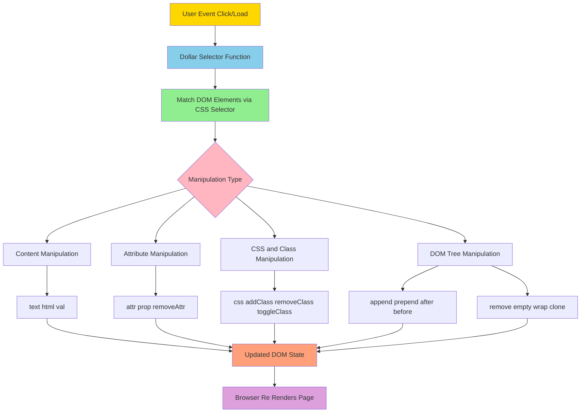
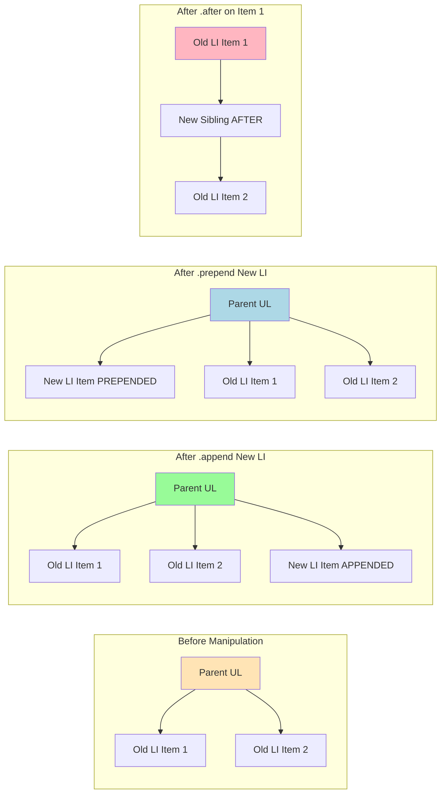
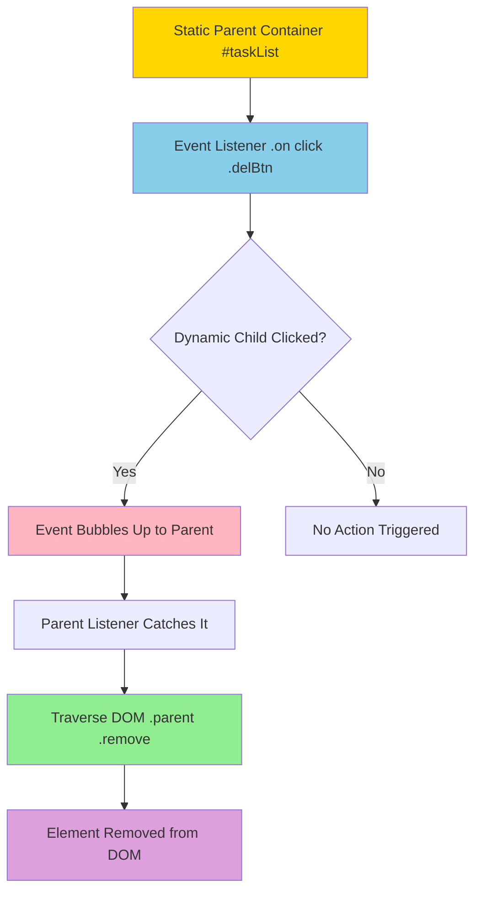
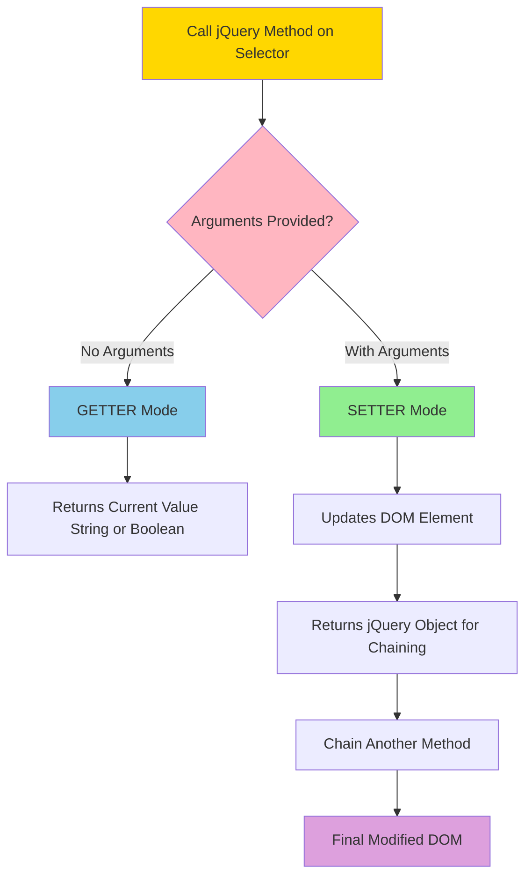
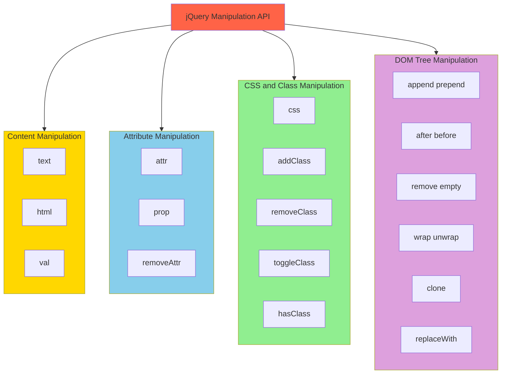

# Common Element Manipulations in jQuery

<!-- SECTION_1_START -->
# Common Element Manipulations in jQuery

## 1.1 Formal Academic Definition (KTU 2024 Syllabus Terminology)

> [!NOTE]
> **jQuery Element Manipulation** refers to the comprehensive set of methods provided by the jQuery library that enable developers to **read, modify, create, and delete** HTML elements, their attributes, properties, content, and CSS styles on the client side without manually writing verbose JavaScript DOM (Document Object Model) API calls. These methods are classified under the jQuery **DOM Manipulation API**, which forms the foundation of dynamic web programming in client-server architectures.

In the **KTU 2024 Scheme** curriculum (Course Code: **PECST742 — Web Programming**), jQuery element manipulation is positioned under **Module 2: Scripting Languages**, emphasizing *practical client-side scripting* using a lightweight, fast, and feature-rich JavaScript library.

## 1.2 Conceptual Analogy / Intuition

> [!IMPORTANT]
> **Real-World Analogy — The "Smart Home Remote Control"**
> Imagine your web page is a **smart home** with hundreds of devices (lights, fans, curtains, speakers). The **vanilla JavaScript DOM** is like walking to each switch manually — flipping breakers, tightening wires, and remembering specific wiring for each device. **jQuery** is the **universal smart remote** that lets you press one button and toggle every light, change every bulb's color, or remove a faulty fan — using **short, memorable commands** like `.addClass()`, `.html()`, or `.fadeOut()`. The remote (jQuery) translates your simple command into the complex wiring operations (raw DOM API calls) behind the scenes.

### Why jQuery for Element Manipulation?

- **Write Less, Do More** — Single-line commands replace multi-line JavaScript.
- **Cross-Browser Compatibility** — Handles inconsistencies in older browsers (especially IE).
- **Chainable Methods** — Operations can be linked, making the code compact and readable.
- **Built-in Effects** — Manipulation often comes with optional animations (`.fadeIn()`, `.slideUp()`).

> [!TIP]
> **Syllabus Highlight:** For KTU examinations, focus on the **four core manipulation categories**:
> 1. **Content Manipulation** (`text()`, `html()`, `val()`)
> 2. **Attribute & Property Manipulation** (`attr()`, `prop()`, `removeAttr()`)
> 3. **CSS & Class Manipulation** (`css()`, `addClass()`, `removeClass()`, `toggleClass()`)
> 4. **DOM Tree Manipulation** (`append()`, `prepend()`, `after()`, `before()`, `remove()`, `empty()`)

## 1.3 Standard jQuery Syntax Convention

Every jQuery manipulation follows a **standard invocation pattern**:

```javascript
$(selector).action(parameters);
```

Where:
- **`$`** — The jQuery global function/alias. Default size: **$ (1 character)**.
- **`selector`** — A CSS-style expression targeting HTML element(s).
- **`action(parameters)`** — The jQuery method to be executed.

> [!VISUALIZATION CONTROL]
> **Concept:** jQuery Selector Targeting and Method Chaining Flow
> **Pseudo-Representation:**
> * Selector targets DOM nodes → $("p.intro") matches all `<p class="intro">` elements
> * Method executes on the matched set → `.css("color", "red")` applies red text color
> * Return value (a new jQuery object) can be chained → `.css("color", "red").fadeOut(2000)`
> **Visual Description:** Picture a **funnel** where the wide top represents *all DOM elements*, the selector narrows it down to a *specific subset*, and the chained methods flow sequentially downstream applying transformations to that subset.
<!-- SECTION_1_END -->

<!-- SECTION_2_START -->
# Deep Theoretical Analysis & KTU High-Yield Formula Sheet

## 2.1 Categorical Breakdown of jQuery Manipulation Methods

### Category A — Content Manipulation (Read/Write Inner Content)

| Method | Purpose | Returns | Special Case |
|:-------|:--------|:--------|:-------------|
| `.text()` | Get/Set **plain text** (escapes HTML) | String | Strips HTML tags on get |
| `.html()` | Get/Set **inner HTML** (parses HTML) | String | Renders HTML tags on get |
| `.val()` | Get/Set value of form elements | String / Array | Works on `input`, `select`, `textarea` |

> [!NOTE]
> **Getter vs Setter Pattern (Critical for KTU):**
> - **Getter:** `$("#p1").text();` → No argument → **returns** the current content.
> - **Setter:** `$("#p1").text("Hello");` → Argument provided → **sets** the new content.
> This dual-purpose pattern is called **method overloading by argument count** in jQuery and is frequently tested in board exams.

### Category B — Attribute & Property Manipulation

| Method | Syntax | When to Use |
|:-------|:-------|:------------|
| `.attr()` | `$(sel).attr("href", "url")` | For **HTML attributes** (initial state, like `href`, `src`, `id`) |
| `.prop()` | `$(sel).prop("checked", true)` | For **DOM properties** (current state, like `checked`, `disabled`) |
| `.removeAttr()` | `$(sel).removeAttr("disabled")` | Removes an attribute from selected elements |

> [!IMPORTANT]
> **`attr()` vs `prop()` — The KTU Favorite Question:**
> - `attr("checked")` returns **"checked"** (the HTML string attribute).
> - `prop("checked")` returns **`true` / `false`** (the live boolean property).
> - For jQuery **1.6+**, use **`prop()`** for boolean attributes like `checked`, `selected`, `disabled`.

### Category C — CSS & Class Manipulation

| Method | Purpose | Example |
|:-------|:--------|:--------|
| `.css(property, value)` | Get/Set individual CSS property | `$("h1").css("color", "blue")` |
| `.css({property: value})` | Set multiple CSS via object literal | `$("h1").css({"color":"blue","font-size":"20px"})` |
| `.addClass("className")` | Adds one or more classes | `$("p").addClass("highlight error")` |
| `.removeClass("className")` | Removes specific classes | `$("p").removeClass("highlight")` |
| `.toggleClass("className")` | Alternates add/remove | `$("p").toggleClass("active")` |
| `.hasClass("className")` | Returns boolean check | `$("p").hasClass("active")` → `true`/`false` |

### Category D — DOM Tree Manipulation (Inserting, Moving, Removing)

| Method | Position | Diagram |
|:-------|:---------|:--------|
| `.append(content)` | Adds as **last child** | `[parent] [old] -> [parent] [old] [NEW]` |
| `.prepend(content)` | Adds as **first child** | `[parent] -> [parent] [NEW] [old]` |
| `.after(content)` | Adds as **next sibling** | `[old] -> [old] [NEW]` |
| `.before(content)` | Adds as **previous sibling** | `[old] -> [NEW] [old]` |
| `.remove()` | Removes element **+ its data** | `[parent] [old] -> [parent]` |
| `.empty()` | Removes only **children** | `[parent] [old inner] -> [parent] [empty]` |
| `.wrap(element)` | Wraps each match | `[old] -> [NEW [old]]` |
| `.unwrap()` | Removes parent | `[NEW [old]] -> [old]` |
| `.clone()` | Creates deep copy | Returns duplicate jQuery object |
| `.replaceWith(content)` | Replaces matched element | `[old] -> [NEW]` |

### Category E — Dimension Manipulation

| Method | What It Measures |
|:-------|:-----------------|
| `.width()` / `.height()` | Element's pure width/height (excluding padding/border) |
| `.innerWidth()` / `.innerHeight()` | Width/Height + **padding** |
| `.outerWidth()` / `.outerHeight()` | Width/Height + **padding + border** |
| `.outerWidth(true)` | Above + **margin** |

## 2.2 The "Why" Behind jQuery Chaining

> [!TIP]
> **Engineering Insight:** Almost every jQuery setter method **returns the jQuery object itself**, allowing **method chaining**. This is a classic implementation of the **Fluent Interface Design Pattern**, which improves code readability and reduces intermediate variables in production-grade client-side code.

```javascript
// Chained manipulation
$("#myDiv").css("color", "red").addClass("highlight").fadeOut(2000);
```

## 2.3 Real-World Engineering Utility

| Domain | Use Case |
|:-------|:---------|
| **E-Commerce** | Dynamically updating product prices/cart totals via `.text()` and `.html()` |
| **Form Validation** | Reading/clearing input values via `.val()` and toggling error states via `.toggleClass()` |
| **Single Page Apps (Legacy)** | Loading new content into a `<div>` via `.html()` without page reload (pre-React era) |
| **CMS Dashboards** | Live-previewing CSS changes via `.css()` |
| **Animations & UI** | Showing/hiding elements with `.append()` and `.remove()` for dynamic lists |

## 2.4 KTU Formula Sheet (Method-Parameter Cheat Sheet)

> [!IMPORTANT]
> Memorize this **Master Cheat Sheet** — these methods appear in **90%+ of KTU jQuery questions**.

| # | Method Call | Operation Type | Typical KTU Question Phrasing |
|:-:|:------------|:---------------|:------------------------------|
| 1 | `$(sel).text("Hi")` | Set text content | "Display a message inside a paragraph" |
| 2 | `$(sel).html("<b>Hi</b>")` | Set HTML content | "Insert bold text dynamically" |
| 3 | `$(sel).val()` | Get input value | "Read the username typed by user" |
| 4 | `$(sel).attr("src", "a.jpg")` | Set attribute | "Change image source on click" |
| 5 | `$(sel).prop("checked", true)` | Set property | "Pre-check a checkbox programmatically" |
| 6 | `$(sel).css("color", "red")` | Set single CSS | "Make all paragraphs red" |
| 7 | `$(sel).css({...})` | Set multiple CSS | "Apply theme styles" |
| 8 | `$(sel).addClass("a b")` | Add classes | "Highlight selected rows" |
| 9 | `$(sel).toggleClass("a")` | Toggle classes | "Switch dark/light mode" |
| 10 | `$(sel).append("<li>")` | Append child | "Add items to a list" |
| 11 | `$(sel).prepend("<li>")` | Prepend child | "Add item to top of list" |
| 12 | `$(sel).after("<hr>")` | Insert sibling | "Add horizontal line below" |
| 13 | `$(sel).remove()` | Delete element | "Remove deleted items" |
| 14 | `$(sel).empty()` | Clear children | "Empty the shopping cart" |
| 15 | `$(sel).wrap("<div>")` | Wrap with parent | "Group items in a container" |
<!-- SECTION_2_END -->

<!-- SECTION_3_START -->
# Step-by-Step Derivations & Code Implementations

## 3.1 Complete Working Program: "Dynamic Task List Manager"

> [!NOTE]
> The following program demonstrates **all four categories** of jQuery manipulation in a single cohesive application. This is the typical KTU Part B question pattern (14 marks).

### Step 1 — HTML Structure

```html
<!DOCTYPE html>
<html lang="en">
<head>
    <meta charset="UTF-8">
    <title>jQuery Task Manager - KTU Demo</title>
    <script src="https://code.jquery.com/jquery-3.7.1.min.js"></script>
    <style>
        body { font-family: Arial, sans-serif; padding: 20px; }
        .completed { text-decoration: line-through; color: gray; }
        .highlight { background-color: yellow; }
        #taskInput { padding: 8px; width: 250px; }
        button { padding: 8px 14px; margin-left: 5px; cursor: pointer; }
        ul { list-style-type: square; }
        li { padding: 6px; margin: 4px 0; }
    </style>
</head>
<body>

    <h2 id="pageTitle">My Task List</h2>

    <input type="text" id="taskInput" placeholder="Enter a new task">
    <button id="addBtn">Add Task</button>
    <button id="clearBtn">Clear All</button>
    <button id="toggleBtn">Toggle Highlight</button>

    <ul id="taskList">
        <li>Sample task (already added)</li>
    </ul>

    <p id="statusMsg"></p>

    <script>
        // jQuery code will go here in next steps
    </script>
</body>
</html>
```

### Step 2 — Feature 1: Adding Tasks (`.append()` and `.val()`)

```javascript
$(document).ready(function() {

    // ---- FEATURE 1: Add a task on button click ----
    $("#addBtn").click(function() {
        // Get the current input value
        var taskText = $("#taskInput").val();

        // Validate: do not add empty tasks
        if (taskText.trim() === "") {
            $("#statusMsg").text("Please enter a valid task.");
            $("#statusMsg").css("color", "red");
            return;
        }

        // Append a new <li> as the LAST child of <ul>
        $("#taskList").append(
            "<li>" + taskText + " <button class='delBtn'>Delete</button></li>"
        );

        // Clear the input field after adding
        $("#taskInput").val("");

        // Update the status message
        $("#statusMsg").text("Task added successfully.");
        $("#statusMsg").css("color", "green");
    });

});
```

**Line-by-Line Explanation:**

| Line | Code | Purpose |
|:-----|:-----|:--------|
| 1 | `$(document).ready(function() { ... });` | Ensures DOM is **fully loaded** before jQuery executes. Prevents errors on missing elements. |
| 3 | `$("#addBtn").click(function() { ... });` | Binds a **click event handler** to the button with `id="addBtn"`. |
| 5 | `var taskText = $("#taskInput").val();` | **Getter** — reads the live value entered by the user. |
| 8 | `if (taskText.trim() === "")` | **Input validation** — prevents empty/whitespace tasks. |
| 17 | `$("#taskList").append(...)` | **DOM insertion** — adds the new `<li>` as the last child. |
| 22 | `$("#taskInput").val("");` | **Setter** — clears the input by passing an empty string. |

### Step 3 — Feature 2: Deleting Tasks (`.remove()` and Event Delegation)

```javascript
    // ---- FEATURE 2: Delete a task (event delegation needed for dynamic elements) ----
    $("#taskList").on("click", ".delBtn", function() {
        // 'this' refers to the clicked button; parent() gives the <li>
        $(this).parent().remove();

        $("#statusMsg").text("Task deleted.");
        $("#statusMsg").css("color", "orange");
    });
```

**Key Concept — Event Delegation:**
> The `.delBtn` elements are **dynamically created** by the `.append()` call, so they don't exist at page load. **Direct binding** (`$(".delBtn").click(...)`) would fail. The **`.on()` delegated event** attaches the listener to the **static parent** `#taskList` and listens for events bubbling up from the dynamic children. This is a **frequently asked 7-mark question** in KTU exams.

### Step 4 — Feature 3: Clearing All Tasks (`.empty()`)

```javascript
    // ---- FEATURE 3: Clear all tasks from the list ----
    $("#clearBtn").click(function() {
        $("#taskList").empty();
        $("#statusMsg").text("All tasks cleared.");
        $("#statusMsg").css("color", "purple");
    });
```

**`.empty()` vs `.remove()` — KTU Distinction:**

| Method | Removes | Retains Parent? | Use When |
|:-------|:--------|:---------------|:---------|
| `.empty()` | All **child nodes + text** | **Yes** | Want to keep container, clear contents |
| `.remove()` | The element **+ everything inside** | **No** | Want to delete element entirely |

### Step 5 — Feature 4: Toggling Highlight (`.toggleClass()`)

```javascript
    // ---- FEATURE 4: Toggle highlight class on all list items ----
    $("#toggleBtn").click(function() {
        $("#taskList li").toggleClass("highlight");
    });
```

### Step 6 — Feature 5: Marking Task Complete (`.toggleClass()` + `.css()`)

```javascript
    // ---- FEATURE 5: Mark a task as completed (click on <li> itself) ----
    $("#taskList").on("click", "li", function(e) {
        // Avoid triggering when delete button is clicked
        if (e.target.tagName !== "BUTTON") {
            $(this).toggleClass("completed");
        }
    });
```

### Step 7 — Feature 6: Attribute Manipulation (`.attr()`)

```javascript
    // ---- FEATURE 6: Change the image on double-click of title ----
    // (Demonstrates .attr() usage)
    $("")
        .insertBefore("#pageTitle");

    $("#logo").dblclick(function() {
        var currentSrc = $(this).attr("src");
        if (currentSrc.includes("150")) {
            $(this).attr("src", "https://via.placeholder.com/200");
        } else {
            $(this).attr("src", "https://via.placeholder.com/150");
        }
    });
```

### Step 8 — Feature 7: Wrapping Elements (`.wrap()`)

```javascript
    // ---- FEATURE 7: Wrap each task in a styled container ----
    $("#wrapBtn").click(function() {
        $("#taskList li").wrap("<div class='taskWrapper'></div>");
    });
```

### Final Consolidated Script Block

```javascript
$(document).ready(function() {

    $("#addBtn").click(function() {
        var taskText = $("#taskInput").val();
        if (taskText.trim() === "") {
            $("#statusMsg").text("Please enter a valid task.").css("color", "red");
            return;
        }
        $("#taskList").append(
            "<li>" + taskText + " <button class='delBtn'>Delete</button></li>"
        );
        $("#taskInput").val("");
        $("#statusMsg").text("Task added successfully.").css("color", "green");
    });

    $("#taskList").on("click", ".delBtn", function() {
        $(this).parent().remove();
        $("#statusMsg").text("Task deleted.").css("color", "orange");
    });

    $("#clearBtn").click(function() {
        $("#taskList").empty();
        $("#statusMsg").text("All tasks cleared.").css("color", "purple");
    });

    $("#toggleBtn").click(function() {
        $("#taskList li").toggleClass("highlight");
    });

    $("#taskList").on("click", "li", function(e) {
        if (e.target.tagName !== "BUTTON") {
            $(this).toggleClass("completed");
        }
    });

});
```

## 3.2 Comparative Code Table — All Manipulation Categories

| Category | Getter Example | Setter Example | Result |
|:---------|:---------------|:---------------|:-------|
| **Text** | `$("p").text()` | `$("p").text("New")` | Replaces text only |
| **HTML** | `$("p").html()` | `$("p").html("<b>New</b>")` | Renders as bold |
| **Value** | `$("#x").val()` | `$("#x").val("abc")` | Sets input value |
| **Attribute** | `$("img").attr("src")` | `$("img").attr("src", "a.jpg")` | Changes image source |
| **Property** | `$("#cb").prop("checked")` | `$("#cb").prop("checked", true)` | Returns/sets boolean |
| **Single CSS** | `$("h1").css("color")` | `$("h1").css("color", "blue")` | Reads/sets one style |
| **Multi CSS** | N/A | `$("h1").css({"color":"blue","font-size":"20px"})` | Sets multiple styles |
| **Add Class** | N/A | `$("p").addClass("a b")` | Adds two classes |
| **Remove Class** | N/A | `$("p").removeClass("a")` | Removes one class |
| **Toggle Class** | N/A | `$("p").toggleClass("a")` | Alternates state |
| **Append** | N/A | `$("ul").append("<li>")` | Last child |
| **Prepend** | N/A | `$("ul").prepend("<li>")` | First child |
| **After** | N/A | `$("p").after("<hr>")` | Next sibling |
| **Before** | N/A | `$("p").before("<hr>")` | Previous sibling |
| **Remove** | N/A | `$("p").remove()` | Deletes element |
| **Empty** | N/A | `$("p").empty()` | Clears children |
| **Wrap** | N/A | `$("p").wrap("<div>")` | Surrounds with element |
<!-- SECTION_3_END -->

<!-- SECTION_4_START -->
# Structural Diagrams & Schematics

## 4.1 Mermaid Diagram: jQuery Manipulation Workflow



## 4.2 Mermaid Diagram: DOM Tree Insertion Methods Visualized



## 4.3 Mermaid Diagram: Event Delegation Architecture (for Dynamic Elements)



## 4.4 Mermaid Diagram: Getter vs Setter Decision Flow



## 4.5 Block Diagram: Manipulation Categories Overview


<!-- SECTION_4_END -->

<!-- SECTION_5_START -->
# KTU 2024 Scheme Examination Question Bank & Topic Recap

## PART A — Short Answer Questions (3 Marks Each)

### Question 1
**[KTU University Exam - July 2024] | CO1 | Remember**

**Q: Differentiate between jQuery `text()` and `html()` methods. Provide one example for each.**

**Model Answer (Board Standard):**

| Aspect | `.text()` | `.html()` |
|:-------|:----------|:----------|
| **Purpose** | Gets/Sets plain text content (HTML escaped) | Gets/Sets inner HTML content (HTML parsed) |
| **HTML Tags** | Treated as **literal text** | Treated as **markup** |
| **XSS Safety** | **Safe** (escapes user input) | **Unsafe** (executes HTML) |
| **Example Getter** | `$("#p").text()` → `"Hello <b>World</b>"` | `$("#p").html()` → `"Hello <b>World</b>"` (with bold rendered) |

```javascript
// text() - displays literal text
$("#para1").text("<b>Welcome</b>");
// Browser shows: <b>Welcome</b>  (as text, NOT bold)

// html() - renders as HTML
$("#para2").html("<b>Welcome</b>");
// Browser shows: Welcome (in BOLD)
```

> **Valuation Key:** [Correct definition: 1 Mark] [Difference in HTML handling: 1 Mark] [Working example: 1 Mark]

---

### Question 2
**[KTU University Exam - Dec 2023] | CO1 | Understand**

**Q: Explain the difference between `attr()` and `prop()` in jQuery with a suitable example.**

**Model Answer (Board Standard):**

The `attr()` method retrieves/sets the **HTML attribute** value (the value initially written in the tag), while `prop()` retrieves/sets the **DOM property** value (the live, current state of the element).

```javascript
// HTML: <input type="checkbox" id="cb" checked>

$("#cb").attr("checked");    // Returns: "checked" (String - the initial value)
$("#cb").prop("checked");    // Returns: true      (Boolean - the live state)

// User UNCHECKS the checkbox, then:
$("#cb").attr("checked");    // STILL returns: "checked"  (attribute unchanged)
$("#cb").prop("checked");    // Now returns: false       (property updated)

// Setter usage
$("#cb").prop("checked", true);   // Checks the checkbox
$("#cb").attr("disabled", "disabled"); // Disables the element via attribute
```

> [!IMPORTANT]
> **KTU Rule of Thumb:** Use `prop()` for **boolean attributes** (`checked`, `selected`, `disabled`) and `attr()` for **string values** (`href`, `src`, `title`, `alt`).

> **Valuation Key:** [Definition of attr: 1 Mark] [Definition of prop: 1 Mark] [Distinguishing example: 1 Mark]

---

## PART B — Long Answer Questions (14 Marks with Internal Choice)

### Question A — Choice 1

**[KTU University Exam - July 2024 Model Paper] | CO2, CO3 | Understand + Apply**

**Q: (a)** Explain the various jQuery methods used for content manipulation with suitable examples. **(7 Marks)**

**Q: (b)** Write a jQuery program to dynamically add a new list item to an existing unordered list when a button is clicked. The item text should be taken from a text input field. Use event delegation so that the dynamically added items can be deleted by clicking a "Delete" button inside each item. **(7 Marks)**

---

### Model Solution for Question A(a) — Content Manipulation Methods

The three primary content manipulation methods in jQuery are:

**1. `.text()` Method:**

- **Getter:** `$("selector").text()` — Returns the combined text content of all matched elements, stripping HTML tags.

```javascript
// HTML: <p id="demo">Hello <b>World</b></p>
var content = $("#demo").text();
// Result: content = "Hello World"
```

- **Setter:** `$("selector").text("new content")` — Sets the text content for all matched elements.

```javascript
$("#demo").text("New Greeting");
// HTML becomes: <p id="demo">New Greeting</p>
```

**2. `.html()` Method:**

- **Getter:** `$("selector").html()` — Returns the inner HTML (first matched element), preserving HTML tags.

```javascript
var html = $("#demo").html();
// Result: html = "Hello <b>World</b>"
```

- **Setter:** `$("selector").html("<b>Bold</b>")` — Sets the inner HTML, which is parsed by the browser.

```javascript
$("#demo").html("<i>Italic</i> Text");
// HTML becomes: <p id="demo"><i>Italic</i> Text</p>
```

**3. `.val()` Method:**

- **Getter:** `$("selector").val()` — Returns the value attribute of form elements (`input`, `select`, `textarea`).

```javascript
// HTML: <input type="text" id="username" value="John">
var name = $("#username").val();
// Result: name = "John"
```

- **Setter:** `$("selector").val("new value")` — Sets the form element's value.

```javascript
$("#username").val("Alice");
```

> **Valuation Key (7 marks):** [text() explanation with example: 2 Marks] [html() explanation with example: 2 Marks] [val() explanation with example: 2 Marks] [Getter/Setter distinction: 1 Mark]

---

### Model Solution for Question A(b) — Dynamic List with Event Delegation

**Complete Program:**

```html
<!DOCTYPE html>
<html>
<head>
    <title>Dynamic List - jQuery</title>
    <script src="https://code.jquery.com/jquery-3.7.1.min.js"></script>
    <style>
        body { font-family: Arial; padding: 20px; }
        #itemInput { padding: 8px; width: 250px; }
        #addBtn { padding: 8px 14px; }
        ul { list-style-type: none; padding-left: 0; }
        li { padding: 8px; margin: 4px 0; background: #f0f0f0; }
        .delBtn { float: right; background: red; color: white; border: none; padding: 4px 10px; cursor: pointer; }
    </style>
</head>
<body>

    <h2>Dynamic List Manager</h2>
    <input type="text" id="itemInput" placeholder="Enter list item">
    <button id="addBtn">Add Item</button>

    <ul id="myList">
        <li>Pre-existing item <button class="delBtn">Delete</button></li>
    </ul>

    <script>
        $(document).ready(function() {

            // Add new list item
            $("#addBtn").click(function() {
                var inputValue = $("#itemInput").val();

                if (inputValue.trim() === "") {
                    alert("Please enter an item!");
                    return;
                }

                // Append a new <li> with a delete button
                $("#myList").append(
                    "<li>" + inputValue + " <button class='delBtn'>Delete</button></li>"
                );

                // Clear the input field
                $("#itemInput").val("");
            });

            // Delete using EVENT DELEGATION (works for dynamic elements)
            $("#myList").on("click", ".delBtn", function() {
                $(this).parent().remove();
            });

        });
    </script>
</body>
</html>
```

**Step-by-Step Explanation:**

| Step | Code | Purpose |
|:-----|:-----|:--------|
| 1 | `$("#addBtn").click(function(){...})` | Bind click event to the "Add Item" button |
| 2 | `var inputValue = $("#itemInput").val();` | **Getter** — read what the user typed |
| 3 | `if (inputValue.trim() === "")` | Validate to prevent empty items |
| 4 | `$("#myList").append("<li>...</li>")` | **DOM insertion** — add new `<li>` as last child |
| 5 | `$("#itemInput").val("")` | **Setter** — clear the input after adding |
| 6 | `$("#myList").on("click", ".delBtn", function(){...})` | **Event delegation** — listen on parent for dynamic children |
| 7 | `$(this).parent().remove();` | `this` = clicked button; `.parent()` = the `<li>`; `.remove()` deletes it |

> **Valuation Key (7 marks):** [Input reading with .val(): 1 Mark] [.append() usage: 2 Marks] [Event delegation concept explained: 2 Marks] [.remove() used correctly: 1 Mark] [Working code with no errors: 1 Mark]

---

### Question B — Choice 2 (Alternative)

**[KTU University Exam - Dec 2023 Model Paper] | CO2, CO3 | Understand + Apply**

**Q: (a)** Explain jQuery methods for CSS and class manipulation. Differentiate between `addClass()`, `removeClass()`, and `toggleClass()` with examples. **(7 Marks)**

**Q: (b)** Design a jQuery application for a "Theme Switcher" where the user can click buttons to switch between Light Mode and Dark Mode. The page should contain a heading, a paragraph, and a body. On clicking "Dark Mode", apply a dark background and white text; on "Light Mode", revert to default styles. Use appropriate jQuery methods. **(7 Marks)**

---

### Model Solution for Question B(a) — CSS and Class Manipulation

**1. `.css()` Method:**

The `.css()` method gets or sets one or more CSS properties on matched elements.

```javascript
// Getter - returns the current value
var bgColor = $("p").css("background-color");

// Setter - single property
$("h1").css("color", "blue");

// Setter - multiple properties (object literal)
$("div").css({
    "background-color": "yellow",
    "font-size": "20px",
    "padding": "15px"
});
```

**2. `.addClass()` Method:**

Adds one or more class names to the selected elements **without removing existing classes**.

```javascript
// Add a single class
$("p").addClass("highlight");

// Add multiple classes (space-separated)
$("p").addClass("highlight bold-text");
```

**3. `.removeClass()` Method:**

Removes one or more (or all) class names from selected elements.

```javascript
$("p").removeClass("highlight");     // Remove specific class
$("p").removeClass("a b");           // Remove multiple classes
$("p").removeClass();                // Remove ALL classes
```

**4. `.toggleClass()` Method:**

Acts as a **switch** — if the class exists, it is removed; if absent, it is added. Ideal for click-based theme toggles.

```javascript
$("#switchBtn").click(function() {
    $("body").toggleClass("dark-mode");
});
```

**5. `.hasClass()` Method:**

Returns `true` if any matched element has the specified class, otherwise `false`.

```javascript
if ($("p").hasClass("highlight")) {
    console.log("Paragraph is highlighted");
}
```

**Comparison Table:**

| Method | Action | Use Case |
|:-------|:-------|:---------|
| `addClass("a")` | Always **adds** class | Apply new style permanently |
| `removeClass("a")` | Always **removes** class | Revert to original state |
| `toggleClass("a")` | **Alternates** based on current state | Buttons that switch states |
| `hasClass("a")` | **Checks** existence (returns boolean) | Conditional logic |

> **Valuation Key (7 marks):** [.css() explained: 1 Mark] [addClass explained: 1 Mark] [removeClass explained: 1 Mark] [toggleClass explained: 2 Marks] [Comparison table/diagram: 1 Mark] [Working examples: 1 Mark]

---

### Model Solution for Question B(b) — Theme Switcher Application

```html
<!DOCTYPE html>
<html>
<head>
    <title>Theme Switcher</title>
    <script src="https://code.jquery.com/jquery-3.7.1.min.js"></script>
    <style>
        body { font-family: Arial; padding: 20px; transition: background 0.3s, color 0.3s; }
        button { padding: 10px 20px; margin: 5px; cursor: pointer; }

        /* Light mode (default) */
        .light-mode { background: white; color: black; }

        /* Dark mode */
        .dark-mode { background: #222; color: white; }

        #statusText { font-weight: bold; margin-top: 20px; }
    </style>
</head>
<body class="light-mode">

    <h1>Theme Switcher Demo</h1>
    <p id="contentPara">This is a sample paragraph. Click the buttons to switch themes.</p>

    <button id="darkBtn">Dark Mode</button>
    <button id="lightBtn">Light Mode</button>
    <button id="autoBtn">Toggle Mode</button>

    <p id="statusText">Current theme: Light</p>

    <script>
        $(document).ready(function() {

            // Apply dark mode
            $("#darkBtn").click(function() {
                // Remove existing theme classes, then add dark-mode
                $("body").removeClass("light-mode").addClass("dark-mode");
                $("#statusText").text("Current theme: Dark");
            });

            // Apply light mode
            $("#lightBtn").click(function() {
                $("body").removeClass("dark-mode").addClass("light-mode");
                $("#statusText").text("Current theme: Light");
            });

            // Toggle mode using single button
            $("#autoBtn").click(function() {
                $("body").toggleClass("dark-mode light-mode");
                var currentClass = $("body").attr("class");
                $("#statusText").text("Current theme: " + currentClass);
            });

        });
    </script>
</body>
</html>
```

**Step-by-Step Explanation:**

| Step | Code | jQuery Method Used |
|:-----|:-----|:-------------------|
| 1 | `$(document).ready(...)` | Document ready handler |
| 2 | `$("body").removeClass("light-mode").addClass("dark-mode")` | `.removeClass()` + `.addClass()` |
| 3 | `$(this).toggleClass("dark-mode light-mode")` | `.toggleClass()` (alternates both) |
| 4 | `$("body").attr("class")` | `.attr()` getter to read current class |
| 5 | `$("#statusText").text("...")` | `.text()` setter to update status |
| 6 | `transition: background 0.3s` (in CSS) | Optional smooth transition |

> **Valuation Key (7 marks):** [HTML structure with body/heading/paragraph: 1 Mark] [CSS for .dark-mode and .light-mode: 1 Mark] [.removeClass()/.addClass() usage: 2 Marks] [.toggleClass() alternative: 1 Mark] [.attr() / .text() for status: 1 Mark] [Working logic: 1 Mark]

---

> [!WARNING]
> **KTU Examiner's Common Pitfall Warning:**
> 1. **Forgetting `$(document).ready():** jQuery code placed in `<head>` without `$(document).ready()` will fail because the DOM isn't loaded yet. **[Lose 2 marks]**
> 2. **Using `.click()` on dynamically added elements:** Direct binding does **NOT** work for elements created after page load. **Always use event delegation** `.on("click", ".childClass", function(){...})` on a static parent. **[Lose 2 marks]**
> 3. **Confusing `.empty()` with `.remove()`:** `.empty()` clears **children only**; `.remove()` deletes the **element itself**. Mixing them up costs full method marks. **[Lose 1 mark]**
> 4. **Confusing `attr()` and `prop()` for boolean attributes:** Use `prop("checked")` for booleans, not `attr("checked")`. **[Lose 1 mark]**
> 5. **Forgetting to include jQuery CDN:** Program will not run. Always add `<script src="https://code.jquery.com/jquery-3.7.1.min.js"></script>` in `<head>`. **[Lose 1 mark]**
> 6. **Not escaping HTML in `.text()` vs `.html()`:** Using `.html()` with user input exposes **XSS vulnerabilities**. Use `.text()` for untrusted user data. **[Conceptual marks lost]**
> 7. **Wrong chaining order:** `$(sel).append(html).css(...)` applies CSS **after** appending. Order matters in chains.

---

## Topic Recap & Important Things to Remember

> [!TIP]
> **High-Density Rapid Revision Checklist — Must Memorize for KTU 2024**

- **jQuery philosophy:** *"Write less, do more"* — short methods replace verbose JavaScript DOM API.
- **Standard syntax:** `$(selector).method(parameters);` — dollar sign is the jQuery alias.
- **Document Ready:** Always wrap code in `$(document).ready(function() { ... });` to ensure DOM is loaded.
- **Getter vs Setter:** No argument = **get**, with argument = **set**. Same method does both.
- **`.text()` vs `.html()`:** `.text()` escapes HTML (safe), `.html()` parses HTML (renders tags).
- **`.val()` works only on form elements** (`input`, `select`, `textarea`).
- **`.attr()` vs `.prop()`:** `.attr()` = HTML attribute (string), `.prop()` = DOM property (boolean for booleans).
- **`.css()` accepts either** `"property", "value"` (two args) or `{property: value}` (object).
- **`.addClass()` does NOT remove existing classes** — it only adds.
- **`.removeClass()` with no argument removes ALL classes.**
- **`.toggleClass()` is the most-used method for UI state switches** (theme toggles, menu expansions).
- **`.hasClass()` returns boolean** — useful inside `if` conditions.
- **`.append()`** = adds as **last child**; **`.prepend()`** = adds as **first child**.
- **`.after()`** = adds as **next sibling**; **`.before()`** = adds as **previous sibling**.
- **`.remove()` deletes the element + its data; `.empty()` clears only its children.**
- **`.wrap()`** surrounds each matched element; **`.unwrap()`** removes the parent (but not the matched element).
- **`.clone()` creates a deep copy** — useful for templates and lists.
- **Event Delegation:** Use `$("staticParent").on("event", "dynamicChild", handler)` for elements created dynamically via `.append()`.
- **Chaining returns the jQuery object**, enabling fluent interfaces: `$("#x").addClass("a").fadeIn().text("done")`.
- **Dimension methods:** `.width()`/`.height()` (content only), `.innerWidth()`/`.innerHeight()` (+padding), `.outerWidth()`/`.outerHeight()` (+border), `.outerWidth(true)` (+margin).
- **Always include jQuery CDN** before your custom script: `<script src="https://code.jquery.com/jquery-3.7.1.min.js"></script>`.
- **Map to Course Outcomes:** CO1 (Understand jQuery syntax), CO2 (Apply manipulation methods), CO3 (Design dynamic web applications).
<!-- SECTION_5_END -->
