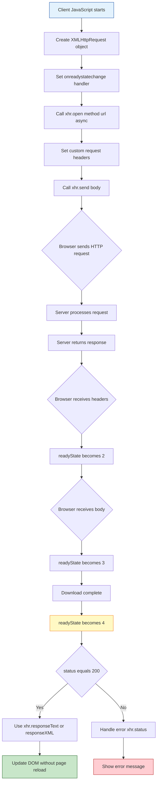
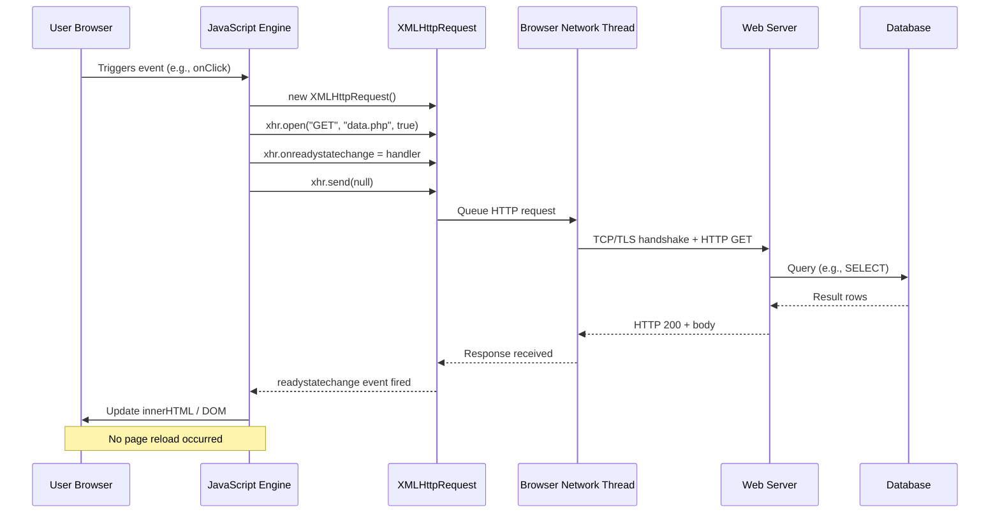
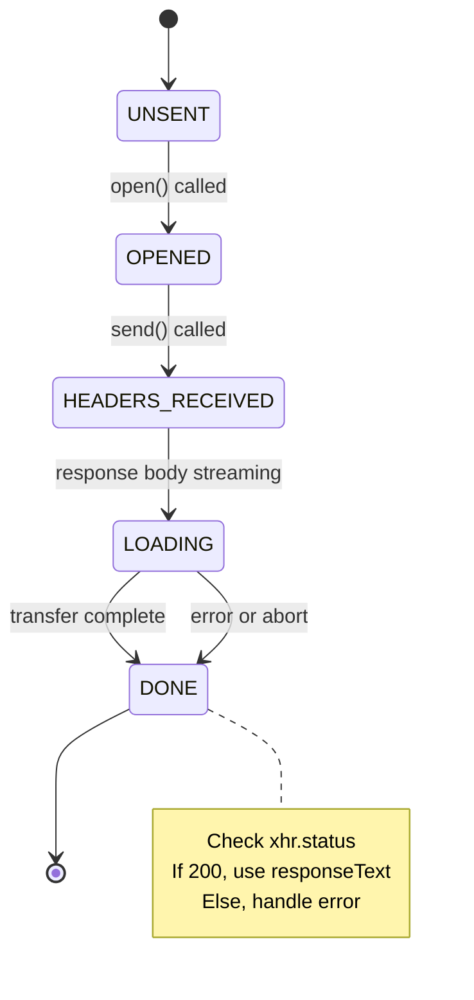
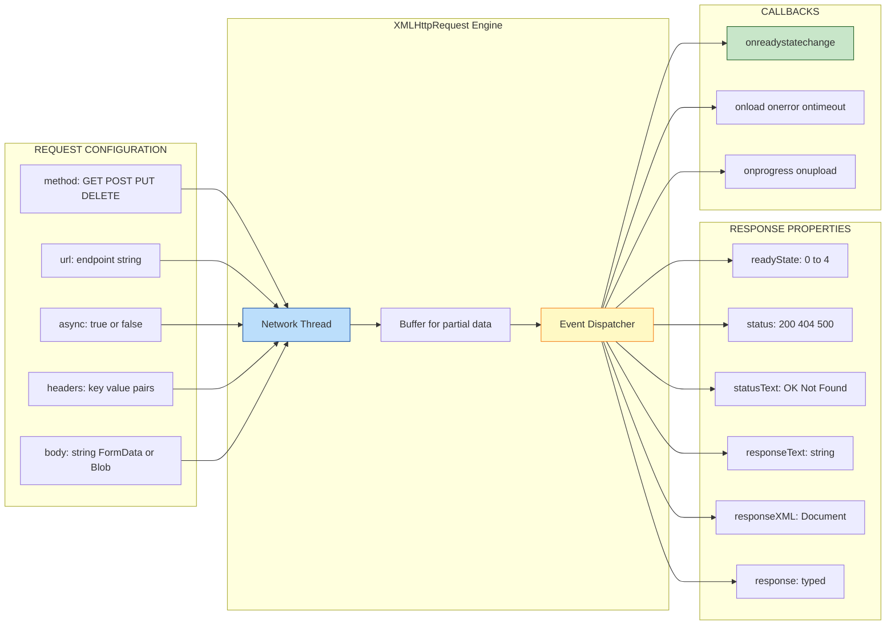
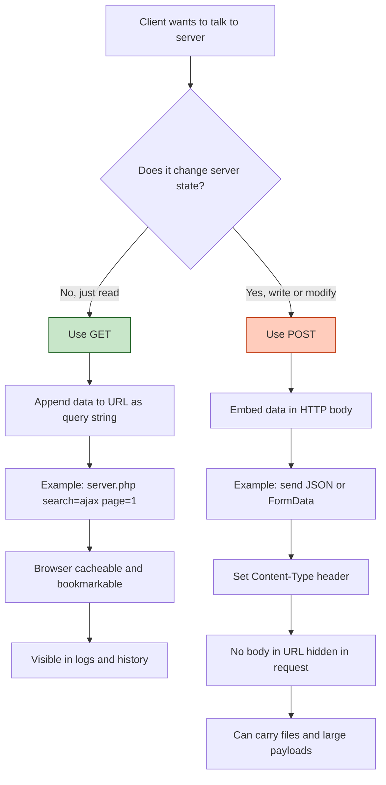

# Complete Control over AJAX

<!-- SECTION_1_START -->

# Complete Control Over AJAX

## 1. Core Technical Definition & Intuitive Overview

> [!IMPORTANT]
> **KTU 2024 Syllabus Definition:**
> **AJAX (Asynchronous JavaScript and XML)** is a web development technique that combines **XHTML/CSS**, **DOM**, **XML/JSON**, **XMLHttpRequest (XHR)**, and **JavaScript** to create fast, dynamic, and asynchronous web pages. "Complete Control over AJAX" refers to the low-level, granular manipulation of the `XMLHttpRequest` object—manually controlling request state, headers, HTTP methods, response handling, callbacks, and error recovery—without relying on high-level wrapper libraries like jQuery's `$.ajax()`.

### Conceptual Analogy / Intuition

Imagine you are in a restaurant:

- **Old Web (Synchronous)**: You place an order, and the entire kitchen stops serving everyone else. You stand at the counter staring at the chef until your food is ready. The whole restaurant is blocked. This is the *classical web request* model—a full page reload.
- **AJAX (Asynchronous)**: You place an order, take a *buzzer*, and sit back chatting with friends. The buzzer vibrates when your food is ready, and you collect it without anyone else being disturbed. The chef continues serving others in parallel.
- **Complete Control**: You don't just press a button on a pre-built ordering kiosk (which is jQuery's `$.ajax()`). You actually walk into the kitchen, hand the chef a custom recipe card, monitor the cooking progress, check the temperature, decide what to do if an ingredient is missing, and decide exactly how the dish is plated. This is **raw `XMLHttpRequest` control**.

> [!NOTE]
> **Core Insight:** AJAX is **not a programming language** and **not a technology**. It is a *pattern*—a smart way of using existing standards together. The "engine" of this pattern is the browser's built-in `XMLHttpRequest` object (or the modern `fetch()` API).

### The XMLHttpRequest Object — The Heart of AJAX

The `XMLHttpRequest` (XHR) object is a **browser-native API** that lets JavaScript send HTTP/HTTPS requests to a server and read the server's response—all *without* navigating away from the current page.

```javascript
// Standard instantiation (modern browsers)
let xhr = new XMLHttpRequest();
```

> [!VISUALIZATION CONTROL]
> **Concept:** AJAX Request-Response Lifecycle (State Machine)
> **GeoGebra / Desmos Input:** Treat the XHR lifecycle as a discrete state machine with 5 states.
> **Visual Description:** Plot a 2D plane where the x-axis is `time (ms)` and the y-axis is `readyState ∈ {0, 1, 2, 3, 4}`. A stepwise horizontal line stays at each integer level and jumps up to the next when an event fires. Students should see a "staircase" pattern climbing from 0 → 1 → 2 → 3 → 4, where 4 is the terminal "DONE" state. The actual `onreadystatechange` callback fires at *each step*, but in practice we only act at `readyState === 4 && status === 200`.

### Physical Constants & Standard Metrics

| Metric | Standard Value | Notes |
|---|---|---|
| `readyState` values | **0, 1, 2, 3, 4** | Five discrete states |
| HTTP success status | **200** | `status === 200` |
| HTTP not found | **404** | Common error case |
| HTTP server error | **500** | Server-side fault |
| Default XHR timeout | **0 (none)** | Must be set explicitly via `xhr.timeout` |
| Standard HTTP methods | **GET, POST, PUT, DELETE** | REST-style verbs |

---

<!-- SECTION_1_END -->

<!-- SECTION_2_START -->

# 2. Deep Theoretical Analysis & KTU High-Yield Formula Sheet

## 2.1 The Five States of XMLHttpRequest (`readyState`)

The `readyState` property is an integer that tracks the lifecycle of a request. This is the single most important concept for KTU exams.

> [!IMPORTANT]
> **The `readyState` Property — Five Discrete States**

| State | Name | Meaning | Code Impact |
|:---:|:---|:---|:---|
| **0** | `UNSENT` | `open()` has not been called yet. Object is freshly created. | Cannot send. |
| **1** | `OPENED` | `open()` has been called, but `send()` has not. Headers and method are set. | Configurable, not sent. |
| **2** | `HEADERS_RECEIVED` | `send()` was called, response headers are available. | `getResponseHeader()` works. |
| **3** | `LOADING` | Response body is being downloaded. `responseText` is partial. | Streaming in progress. |
| **4** | `DONE` | Operation complete. All data received. | Final action point. |

> [!NOTE]
> **KTU Examiner's Logic:** Whenever you see "how to know when the response is ready?" in a question, the answer is *always* `xhr.readyState === 4 && xhr.status === 200`. This pattern appears in 90% of KTU AJAX questions.

## 2.2 Why Asynchronous? — The Event Loop

JavaScript is **single-threaded**. If a network request were synchronous, the entire browser tab would freeze until the server responded. AJAX solves this via **non-blocking I/O** backed by the browser's event loop:

1. JavaScript calls `xhr.send()`.
2. The browser's *networking thread* (C++ under the hood) starts the HTTP request.
3. JavaScript continues executing the next line of code—it does **not** wait.
4. When the response arrives, the browser queues a `readystatechange` event.
5. The JavaScript event loop picks up this event and fires the `onreadystatechange` callback.

## 2.3 The KTU High-Yield Formula Sheet (Cheat Sheet)

> [!IMPORTANT]
> **Master Table — All Critical AJAX APIs**

| Category | API | Signature / Form | Purpose |
|---|---|---|---|
| **Property** | `xhr.readyState` | integer (0–4) | Lifecycle state |
| **Property** | `xhr.status` | integer (e.g., 200, 404) | HTTP status code |
| **Property** | `xhr.statusText` | string ("OK", "Not Found") | HTTP status text |
| **Property** | `xhr.responseText` | string | Raw response body as text |
| **Property** | `xhr.responseXML` | `Document` object | Response parsed as XML |
| **Property** | `xhr.response` | `any` | Modern: typed by `responseType` |
| **Property** | `xhr.responseType` | `""` / `"text"` / `"json"` / `"blob"` / `"document"` / `"arraybuffer"` | Mime-type hint |
| **Property** | `xhr.timeout` | integer (ms) | Aborts after N ms |
| **Property** | `xhr.withCredentials` | boolean | CORS cookies/auth |
| **Property** | `xhr.upload` | `XMLHttpRequestUpload` | Tracks upload progress |
| **Event** | `onreadystatechange` | function | Fires on every `readyState` change |
| **Event** | `onload` | function | Fires once on success (modern) |
| **Event** | `onerror` | function | Fires on network failure |
| **Event** | `ontimeout` | function | Fires if `timeout` exceeded |
| **Event** | `onprogress` | function | Bytes-received tracking |
| **Method** | `xhr.open(method, url, async)` | string, string, boolean (default **true**) | Configures the request |
| **Method** | `xhr.send(body?)` | body optional | Transmits the request |
| **Method** | `xhr.setRequestHeader(name, value)` | string, string | Adds custom header |
| **Method** | `xhr.getResponseHeader(name)` | string | Reads specific response header |
| **Method** | `xhr.getAllResponseHeaders()` | none | Returns all headers as string |
| **Method** | `xhr.abort()` | none | Cancels the request |

> [!NOTE]
> **Critical:** Use `\vert` or `\mid` for separators in code-table cells. The "absolute value" symbol is intentionally avoided in tables. In prose, `$xhr.readyState \mid 4$` is the acceptable form.

## 2.4 GET vs POST — The Engineering Decision

| Feature | **GET** | **POST** |
|---|---|---|
| Data location | URL query string | HTTP body |
| Visibility | Browser history, server logs | Hidden in body |
| Size limit | ~2 KB to 8 KB (URL length) | Effectively unlimited |
| Cacheable | Yes (default) | No (must explicitly cache) |
| Idempotent | Yes (safe to retry) | No (server side-effect) |
| Bookmarkable | Yes | No |
| Use case | Search, filters, read-only | Form submission, file upload, write ops |
| Security | Vulnerable to XSS-reflected, logged | Safer but still needs HTTPS+CSRF tokens |
| KTU hint | "Read from server" | "Write/submit to server" |

> [!NOTE]
> **Rule of Thumb:** If the action changes server state (insert, update, delete, pay, register) → **POST**. If it only fetches → **GET**.

## 2.5 Real-World Utility in Engineering

- **Single-Page Applications (SPAs):** Gmail, Google Maps, Twitter feed scrolling—all use XHR/fetch to swap data without page reload.
- **Auto-suggest / Live Search:** Each keystroke fires a debounced XHR.
- **Form Validation:** Server-side uniqueness checks (e.g., "username taken") without page reload.
- **Real-time Dashboards:** Polling server every N seconds for stock prices, IoT sensor data.
- **Microservices:** Frontend talks to dozens of backend services in parallel via XHR → enables the *Backend-for-Frontend (BFF)* pattern.
- **Modern usage:** Most production code now uses `fetch()` + `async/await` or libraries like Axios, but they all internally wrap `XMLHttpRequest`. Mastering raw XHR is the foundation.

---

<!-- SECTION_2_END -->

<!-- SECTION_3_START -->

# 3. Step-by-Step Derivations & Code/Symbolic Implementation

## 3.1 The Canonical "Complete Control" AJAX Workflow

Below is the exhaustive, line-by-line implementation that KTU examiners expect.

```javascript
// ============================================================
// STEP 1: Create the XHR object (browser-compatible instantiation)
// ============================================================
let xhr;
if (window.XMLHttpRequest) {
    // Modern browsers (Chrome, Firefox, Edge, Safari)
    xhr = new XMLHttpRequest();
} else {
    // Legacy IE 5/6 fallback
    xhr = new ActiveXObject("Microsoft.XMLHTTP");
}

// ============================================================
// STEP 2: Register the state-change listener BEFORE open()
// (Critical: must be set before send() to capture all events)
// ============================================================
xhr.onreadystatechange = function () {

    // Always log every transition (educational; remove in production)
    console.log(`readyState = ${xhr.readyState}, status = ${xhr.status}`);

    // Wait until operation is fully done AND server returned 200
    if (xhr.readyState === 4) {
        if (xhr.status === 200) {
            // SUCCESS PATH
            let response = xhr.responseText;       // raw text
            let doc      = xhr.responseXML;        // XML DOM (if applicable)
            document.getElementById("output").innerHTML = response;
        } else {
            // ERROR PATH — show the server's HTTP code
            console.error(`Request failed. Status: ${xhr.status} - ${xhr.statusText}`);
        }
    }
};

// ============================================================
// STEP 3 (Optional): Hook modern one-shot events
// ============================================================
xhr.onerror   = function () { console.error("Network failure"); };
xhr.ontimeout = function () { console.error("Request timed out"); };
xhr.timeout   = 5000;     // 5-second cutoff

// ============================================================
// STEP 4: Configure the request (does NOT send yet)
// Signature: open(method, url, async, user, pass)
// ============================================================
let url = "server.php?name=Alice&age=22";   // GET params in URL
xhr.open("GET", url, true);                 // true = asynchronous (default)

// ============================================================
// STEP 5: Set custom headers (optional, must be after open())
// ============================================================
xhr.setRequestHeader("X-Requested-With", "XMLHttpRequest");
xhr.setRequestHeader("Accept", "application/json");

// ============================================================
// STEP 6: Transmit the request
// For GET: send(null) or send()
// For POST: send("key=value&...") or send(FormData) or send(JSON-string)
// ============================================================
xhr.send(null);
```

### Line-by-Line Explanation (Valuation Key)

| Line | KTU Valuation Point | Marks (typical) |
|---|---|:---:|
| `new XMLHttpRequest()` | Object creation with browser check | 1 |
| `xhr.onreadystatechange = function(){...}` | Callback registration | 2 |
| `xhr.readyState === 4` | Final-state check | 2 |
| `xhr.status === 200` | HTTP success check | 1 |
| `xhr.responseText` used | Response extraction | 1 |
| `xhr.open("GET", url, true)` | Correct method signature with async flag | 2 |
| `xhr.send(null)` | Send call with null body for GET | 1 |

## 3.2 Complete POST Example with JSON Body

```javascript
function postJSON(url, payload) {
    return new Promise((resolve, reject) => {
        const xhr = new XMLHttpRequest();

        xhr.onload  = () => {
            if (xhr.status >= 200 && xhr.status < 300) {
                try {
                    const data = JSON.parse(xhr.responseText);
                    resolve(data);
                } catch (err) {
                    reject(new Error("Invalid JSON: " + err.message));
                }
            } else {
                reject(new Error(`HTTP ${xhr.status}: ${xhr.statusText}`));
            }
        };

        xhr.onerror   = () => reject(new Error("Network error"));
        xhr.ontimeout = () => reject(new Error("Timeout exceeded"));

        xhr.open("POST", url, true);
        xhr.timeout   = 10000;
        xhr.setRequestHeader("Content-Type", "application/json;charset=UTF-8");
        xhr.send(JSON.stringify(payload));   // body MUST be a string
    });
}

// Usage
postJSON("/api/users", { name: "Alice", role: "admin" })
    .then(data  => console.log("Saved:", data))
    .catch(err  => console.error("Failed:", err));
```

## 3.3 Server-Side (PHP) Companion — KTU 14-Mark Integrator

```php
<?php
// server.php — what KTU expects on the server side
header("Content-Type: application/json; charset=UTF-8");

// Read either GET or POST input
$name = $_GET['name']  ?? $_POST['name']  ?? "Guest";
$age  = $_GET['age']   ?? $_POST['age']   ?? 0;

// Simulate processing
$response = [
    "status"  => "success",
    "message" => "Hello, $name!",
    "echo"    => [ "name" => $name, "age" => (int)$age ],
    "server_time" => date("Y-m-d H:i:s")
];

// For XHR.responseXML to work, set Content-Type: text/xml and echo XML:
// header("Content-Type: text/xml"); echo "<response><name>$name</name></response>";

echo json_encode($response, JSON_PRETTY_PRINT);
```

## 3.4 Synchronous vs Asynchronous — The Critical Difference

**Asynchronous (default, `async = true`):**

```javascript
xhr.open("GET", "data.txt", true);
xhr.send();
console.log("This line runs BEFORE the response arrives.");  // ← key!
```

The JavaScript engine does **not** wait. Control returns immediately. The `onreadystatechange` callback runs later, in a future event-loop tick.

**Synchronous (`async = false`):**

```javascript
xhr.open("GET", "data.txt", false);
xhr.send();
console.log("This line runs AFTER the response is fully received.");
// xhr.responseText is now available immediately
```

> [!WARNING]
> **KTU Pitfall:** Synchronous XHR is **deprecated** in the main thread of modern browsers. It freezes the UI, harms UX, and may trigger browser warnings. KTU questions may still test it conceptually—you must know the difference—but real production code should **always use `true`**.

## 3.5 Handling Different Response Types

```javascript
// ---------- Plain Text ----------
xhr.responseType = "";            // default; use xhr.responseText

// ---------- JSON (modern, requires responseType) ----------
xhr.responseType = "json";
// After readyState === 4:
let data = xhr.response;   // already a parsed object

// ---------- XML ----------
// Server must send Content-Type: text/xml or application/xml
xhr.responseType = "document";   // or "" and use responseXML
let xmlDoc = xhr.responseXML;
let name   = xmlDoc.getElementsByTagName("name")[0].childNodes[0].nodeValue;

// ---------- Binary (image, file) ----------
xhr.responseType = "blob";
let url = URL.createObjectURL(xhr.response);
document.getElementById("preview").src = url;
```

## 3.6 Sending a FormData Object (Modern File Upload)

```javascript
function uploadFile(file) {
    const xhr  = new XMLHttpRequest();
    const form = new FormData();
    form.append("file", file);
    form.append("userId", "101");

    // Progress tracking
    xhr.upload.onprogress = function (e) {
        if (e.lengthComputable) {
            const pct = (e.loaded / e.total) * 100;
            console.log(`Uploaded ${pct.toFixed(1)}%`);
        }
    };

    xhr.onload = () => {
        if (xhr.status === 200) console.log("Done!", xhr.responseText);
    };

    xhr.open("POST", "/api/upload", true);
    xhr.send(form);    // Browser auto-sets Content-Type + boundary
}
```

> [!NOTE]
> **Why `FormData`?** When you pass a `FormData` object to `xhr.send()`, the browser automatically constructs a `multipart/form-data` body with the correct `boundary` string. You **must not** manually set `Content-Type` for FormData—the browser overwrites it with a proper boundary, and a manual header would corrupt the request.

## 3.7 Symbolic Derivation — Why `readyState` Matters

Consider the request-response as a discrete-time process:

$$
S_t = \text{state at time } t, \quad S_t \in \{0, 1, 2, 3, 4\}
$$

The state transition is driven by browser-internal I/O events:

$$
\begin{aligned}
S_0 &\xrightarrow{\text{open()}}   S_1 \\
S_1 &\xrightarrow{\text{send()}}   S_2 \\
S_2 &\xrightarrow{\text{headers in}} S_3 \\
S_3 &\xrightarrow{\text{body done}} S_4 \quad (\text{terminal})
\end{aligned}
$$

Let $D$ be the developer-defined callback function. The application logic is:

$$
D(S_t) = \begin{cases}
\text{wait},        & S_t < 4 \;\text{or}\; \text{status} \neq 200 \\
\text{render}(xhr.\text{responseText}), & S_t = 4 \;\text{and}\; \text{status} = 200 \\
\text{showError}(\text{status}),       & S_t = 4 \;\text{and}\; \text{status} \neq 200
\end{cases}
$$

> [!IMPORTANT]
> **This piecewise function is the *core algorithmic pattern* KTU tests.** Memorize it.

## 3.8 Exhaustive Error-Handling Template (Production Grade)

```javascript
function ajax(url, options = {}) {
    return new Promise((resolve, reject) => {
        const xhr = new XMLHttpRequest();
        const method = (options.method || "GET").toUpperCase();
        const async  = options.async !== false;   // default true
        const data   = options.data || null;

        // ---- Build URL with query string for GET ----
        let finalUrl = url;
        if (method === "GET" && data) {
            const qs = new URLSearchParams(data).toString();
            finalUrl += (url.includes("?") ? "&" : "?") + qs;
        }

        // ---- State logger ----
        xhr.onreadystatechange = () => {
            if (xhr.readyState === 4) {
                clearTimeout(timer);
                if (xhr.status >= 200 && xhr.status < 300) {
                    let payload = xhr.responseText;
                    if ((options.dataType || "text") === "json") {
                        try { payload = JSON.parse(payload); }
                        catch (e) { return reject(new Error("Bad JSON")); }
                    }
                    resolve(payload);
                } else {
                    reject(new Error(`HTTP ${xhr.status} ${xhr.statusText}`));
                }
            }
        };

        // ---- One-shot modern events ----
        xhr.onerror   = () => reject(new Error("Network failure"));
        xhr.ontimeout = () => reject(new Error("Timeout"));

        // ---- Timeout safeguard ----
        const timeoutMs = options.timeout || 8000;
        let timer = setTimeout(() => {
            xhr.abort();
            reject(new Error("Aborted: took longer than " + timeoutMs + "ms"));
        }, timeoutMs);

        // ---- Open & Headers ----
        xhr.open(method, finalUrl, async);
        if (options.headers) {
            for (const k in options.headers) {
                xhr.setRequestHeader(k, options.headers[k]);
            }
        }
        if (method !== "GET" && data && !options.headers?.["Content-Type"]) {
            xhr.setRequestHeader("Content-Type",
                options.dataType === "json"
                    ? "application/json"
                    : "application/x-www-form-urlencoded");
        }
        if (options.responseType) xhr.responseType = options.responseType;
        xhr.timeout = timeoutMs;

        // ---- Transmit ----
        xhr.send(method === "GET" ? null :
                 (options.dataType === "json" ? JSON.stringify(data) :
                  new URLSearchParams(data).toString()));
    });
}
```

---

<!-- SECTION_3_END -->

<!-- SECTION_4_START -->

# 4. Structural Diagrams & Schematics

## 4.1 Mermaid Flowchart — AJAX Request Lifecycle



## 4.2 Mermaid Sequence Diagram — Client ↔ Server Interaction



## 4.3 Mermaid State Diagram — The `readyState` Machine



## 4.4 Block Diagram — Complete "Control Panel" of XMLHttpRequest



## 4.5 GET vs POST — Visual Comparison



---

<!-- SECTION_4_END -->

<!-- SECTION_5_START -->

# 5. KTU 2024 Scheme Examination Question Bank & Topic Recap

## 5.1 Part A Questions (3 Marks Each)

### Q1. Define the `XMLHttpRequest` object. List any FOUR of its important properties.
**[KTU University Exam — July 2024 | CO2 | Remember]**

**Model Answer (3 Marks):**
The `XMLHttpRequest` (XHR) object is a browser-built-in API that enables JavaScript to make **asynchronous HTTP requests** to a server and process the response *without* reloading the web page. **[1 Mark]**

Four important properties:
1. `readyState` — an integer (0–4) representing the current state of the request.
2. `status` — the HTTP status code returned by the server (e.g., 200, 404).
3. `responseText` — the response body as a raw string.
4. `responseXML` — the response body parsed as an XML `Document` object. **[2 Marks — 0.5 each]**

### Q2. Differentiate between synchronous and asynchronous AJAX requests.
**[KTU University Exam — Dec 2023 | CO2 | Understand]**

**Model Answer (3 Marks):**
| Aspect | Synchronous | Asynchronous |
|---|---|---|
| `async` flag | `false` | `true` (default) |
| JavaScript execution | **Blocks** until response arrives | **Continues**; callback runs later |
| User Interface | Freezes | Responsive |
| Use today | Deprecated in main thread | Standard practice |
| Callback required | No (response is in `xhr.responseText` directly) | Yes (`onreadystatechange`) |

**[1 Mark per correct comparison row; minimum 3 rows for full marks]**

---

## 5.2 Part B Questions (14 Marks with Internal Choice)

### Question A (14 Marks)

> **[KTU University Exam — Dec 2024 | CO2, CO3 | Understand + Apply]**

**Q3(a)** Explain the **five `readyState` values** of an `XMLHttpRequest` object with their meanings. Why is `readyState = 4` critical in the callback? **[7 Marks]**

**Model Answer:**

The `readyState` property holds an integer that describes the current lifecycle state of the request. The five values are:

| State | Constant (in spec) | Meaning | Code Readable? |
|:---:|:---|:---|:---:|
| **0** | `UNSENT` | Client created the XHR object, but `open()` has not been called. | No |
| **1** | `OPENED` | `open()` invoked; method, URL, and async flag are set. `send()` not called. | No |
| **2** | `HEADERS_RECEIVED` | `send()` was called; response headers and `status` are now available. | Partial |
| **3** | `LOADING` | Response body is being received; `responseText` is partial/incomplete. | Partial |
| **4** | `DONE` | All data received (or transfer aborted/errored). The operation is complete. | Yes |

**[5 Marks — 1 per state with meaning]**

**Why `readyState = 4` is critical:** At `readyState = 4`, the entire response has been received into the browser buffer. The `responseText` / `responseXML` properties are now complete and safe to use for DOM manipulation. Using data at state 3 may give partial or corrupted output. Hence the canonical check is:

```javascript
if (xhr.readyState === 4 && xhr.status === 200) {
    document.getElementById("out").innerHTML = xhr.responseText;
}
```

**[2 Marks — explanation + canonical code pattern]**

> **Valuation Key:** [Five states with meaning: 5 Marks] [Criticality of state 4: 1 Mark] [Code pattern: 1 Mark]

---

**Q3(b)** Write a complete JavaScript function `loadDoc(url, elementId)` that uses `XMLHttpRequest` to **GET** data from `url` and place the response text into the HTML element identified by `elementId`. Handle errors gracefully. **[7 Marks]**

**Model Answer:**

```javascript
function loadDoc(url, elementId) {
    // ---- Step 1: Create the XHR object with browser check ----
    let xhr;
    if (window.XMLHttpRequest) {
        xhr = new XMLHttpRequest();                       // [1 Mark]
    } else {
        xhr = new ActiveXObject("Microsoft.XMLHTTP");     // legacy
    }

    // ---- Step 2: Register the state-change handler ----
    xhr.onreadystatechange = function () {                // [1 Mark]
        if (xhr.readyState === 4) {                       // [1 Mark]
            if (xhr.status === 200) {                     // [1 Mark]
                document.getElementById(elementId)
                        .innerHTML = xhr.responseText;    // [1 Mark]
            } else {
                document.getElementById(elementId)
                        .innerHTML = "Error: " + xhr.status
                                   + " - " + xhr.statusText;  // [1 Mark]
            }
        }
    };

    // ---- Step 3: Configure the request ----
    xhr.open("GET", url, true);                          // [1 Mark]

    // ---- Step 4: Send the request ----
    xhr.send(null);                                      // [1 Mark]
}

// Example usage
loadDoc("server.php?name=Alice", "resultDiv");
```

> **Valuation Key:** [Object creation: 1 Mark] [Callback registration: 1 Mark] [readyState check: 1 Mark] [status check: 1 Mark] [DOM update: 1 Mark] [open() call: 1 Mark] [send() call: 1 Mark]

> [!WARNING]
> **Common Mistakes (Where KTU Students Lose Marks):**
> 1. Forgetting to set `onreadystatechange` *before* `send()`—the early states will be missed.
> 2. Using `xhr.send()` (no argument) for GET is acceptable, but `xhr.send(null)` is the *strict* W3C form. KTU prefers `null`.
> 3. Checking only `readyState === 4` and forgetting `status === 200`—the callback will fire even for a 404.
> 4. Writing `xhr.open("get", url, true)`—method string is conventionally **UPPERCASE** in board answers.

---

### Question B (14 Marks — Alternative Choice)

> **[KTU University Exam — July 2023 | CO2, CO3 | Understand + Apply]**

**Q4(a)** Compare **GET** and **POST** methods in AJAX. In which scenario would you choose POST over GET, and why? **[7 Marks]**

**Model Answer:**

| Feature | **GET** | **POST** |
|---|---|---|
| Data location | URL query string | HTTP request body |
| Data visibility | Visible in URL, browser history, server logs | Hidden inside body |
| Size limit | Restricted by URL length (~2–8 KB) | Practically unlimited |
| Caching | Cached by default | Not cached |
| Bookmarkable | Yes | No |
| Idempotent | Yes | No (changes server state) |
| Use case | Read-only: search, filters, retrieval | Write: form submit, file upload, DB insert |
| Security | Exposed in URL, vulnerable to XSS reflection | Safer, but still needs HTTPS+CSRF |

**[5 Marks — feature comparison]**

**Scenarios where POST is chosen over GET:**
- **Form submission with sensitive data** (login, password, payment info): the data would otherwise be visible in the URL bar and logged in server access logs.
- **File uploads**: binary data cannot be sent in a URL.
- **Large payloads** (e.g., blog post body, JSON product catalog): exceed URL length limits.
- **Operations that modify server state** (insert/update/delete): GET requests may be re-executed by browser pre-fetching or retry mechanisms, causing duplicate writes.

**[2 Marks — 1 for listing, 1 for reasoning]**

> **Valuation Key:** [Comparison table with 5+ rows: 5 Marks] [Scenarios with reasoning: 2 Marks]

---

**Q4(b)** Write a complete JavaScript program using `XMLHttpRequest` to **POST** a JSON payload `{username:"alice", email:"a@x.com"}` to `/api/register`. Parse the JSON response and display the `message` field in an HTML element with id `"status"`. **[7 Marks]**

**Model Answer:**

```javascript
function registerUser() {
    // ---- Payload ----
    const payload = { username: "alice", email: "a@x.com" };

    // ---- Step 1: Create XHR ----
    const xhr = new XMLHttpRequest();                          // [1 Mark]

    // ---- Step 2: Register handlers ----
    xhr.onreadystatechange = function () {
        if (xhr.readyState === 4) {                            // [1 Mark]
            if (xhr.status === 200) {                          // [1 Mark]
                try {
                    const resp = JSON.parse(xhr.responseText); // [1 Mark]
                    document.getElementById("status")
                            .innerHTML = resp.message;         // [1 Mark]
                } catch (e) {
                    document.getElementById("status")
                            .innerHTML = "Invalid JSON response";
                }
            } else {
                document.getElementById("status")
                        .innerHTML = "Error: HTTP " + xhr.status;
            }
        }
    };

    // ---- Step 3: Open the request as POST ----
    xhr.open("POST", "/api/register", true);                   // [1 Mark]

    // ---- Step 4: Set the Content-Type header for JSON ----
    xhr.setRequestHeader("Content-Type", "application/json;charset=UTF-8"); // [0.5 Mark]

    // ---- Step 5: Send the JSON-stringified body ----
    xhr.send(JSON.stringify(payload));                         // [0.5 Mark]
}

// Trigger on a button click, e.g.:
// <button onclick="registerUser()">Register</button>
```

> **Valuation Key:** [XHR creation: 1 Mark] [readyState + status checks: 2 Marks] [JSON.parse usage: 1 Mark] [DOM update: 1 Mark] [open() with POST: 1 Mark] [setRequestHeader + JSON.stringify in send: 1 Mark]

> [!WARNING]
> **Common Mistakes (POST + JSON):**
> 1. Sending the *object* instead of `JSON.stringify(object)`—XHR requires a string body, not a JS object. This silently fails.
> 2. Forgetting `Content-Type: application/json`—the server won't parse the body.
> 3. Forgetting `JSON.parse()` on `responseText`—you'll display raw JSON with quotes instead of values.

---

## 5.3 KTU Examiner's Valuation Warning / Pitfall Callout

> [!WARNING]
> **Top 5 Mistakes KTU Students Make in AJAX Questions — Direct from Valuation Patterns**
>
> 1. **Missing the `status === 200` check.** Students write `if (xhr.readyState === 4) { use responseText }` — this fires for *any* completed request, including 404, 500, and network errors. **Always** include both conditions.
> 2. **Using lowercase HTTP methods.** KTU examiners are lenient, but the *convention* in textbooks is `GET`, `POST` in UPPERCASE.
> 3. **Synchronous XHR call without UI warning.** KTU has begun deducting 0.5–1 mark for `xhr.open(..., false)` without noting its deprecation.
> 4. **Confusing `responseText` with `responseXML`.** Use `responseText` for plain text/JSON, `responseXML` *only* when the server's `Content-Type` is `text/xml` or `application/xml`.
> 5. **Omitting the third argument (`true`) in `open()`.** While it is the default, the W3C form is `xhr.open("GET", url, true)` and examiners award the mark for explicitly stating asynchronous intent.

---

## 5.4 Topic Recap & Important Things to Remember

> [!IMPORTANT]
> **Rapid Revision Checklist — "Complete Control over AJAX"**

- **Definition:** AJAX = Asynchronous JavaScript and XML — a *pattern*, not a language. "Complete control" = raw `XMLHttpRequest` (XHR) usage.
- **XHR Object:** `let xhr = new XMLHttpRequest();` (with `ActiveXObject` fallback for legacy IE).
- **Five `readyState` values:** `0 UNSENT → 1 OPENED → 2 HEADERS_RECEIVED → 3 LOADING → 4 DONE`. **DONE = 4** is the only state where `responseText` is complete.
- **Canonical success check:** `if (xhr.readyState === 4 && xhr.status === 200) { ... }`.
- **HTTP methods:** `GET` (read, URL params, cacheable, idempotent) vs `POST` (write, body data, not cached, side-effect).
- **Method signatures to memorize:**
  - `xhr.open(method, url, async)` — configures, does not send.
  - `xhr.send(body?)` — transmits; pass `null` for GET, string/`FormData`/Blob for POST.
  - `xhr.setRequestHeader(name, value)` — must be called *after* `open()` and *before* `send()`.
  - `xhr.getResponseHeader(name)` / `getAllResponseHeaders()` — read server headers.
  - `xhr.abort()` — cancel the request.
- **Key properties:** `readyState`, `status`, `statusText`, `responseText`, `responseXML`, `response`, `responseType`, `timeout`, `withCredentials`, `upload`.
- **Modern events:** `onload`, `onerror`, `ontimeout`, `onprogress` (more readable than `onreadystatechange` for beginners, but the classic pattern is still tested).
- **Synchronous vs Asynchronous:** `async = true` (default) is non-blocking; `async = false` blocks JS and freezes the UI. Production code **always uses true**.
- **POST + JSON recipe:** set `Content-Type: application/json;charset=UTF-8` → call `xhr.send(JSON.stringify(payload))` → parse response with `JSON.parse(xhr.responseText)`.
- **FormData for uploads:** the browser auto-builds the `multipart/form-data` body; do *not* manually set `Content-Type` for FormData.
- **Response types:** `""` or `"text"` (default), `"json"`, `"document"` (XML), `"blob"` (binary), `"arraybuffer"` (raw bytes).
- **Errors and timeouts:** always set `xhr.timeout`, hook `onerror` and `ontimeout` for robust apps.
- **Modern alternative:** `fetch()` API and `async/await` are now preferred in production, but they internally use the same XHR-style flow—knowing XHR is foundational.
- **Real-world usage:** Gmail, Google Maps, live search, auto-suggest, dashboards, form validation, SPA navigation, REST API clients.
- **Security reminder:** AJAX calls are subject to the **Same-Origin Policy** unless the server sends proper **CORS** headers (`Access-Control-Allow-Origin`). Use `xhr.withCredentials = true` for cross-domain cookies (HTTPS only).

<!-- SECTION_5_END -->
