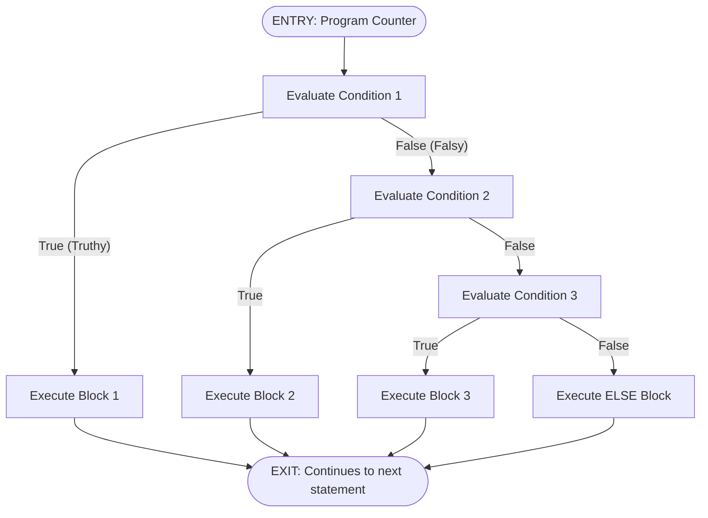
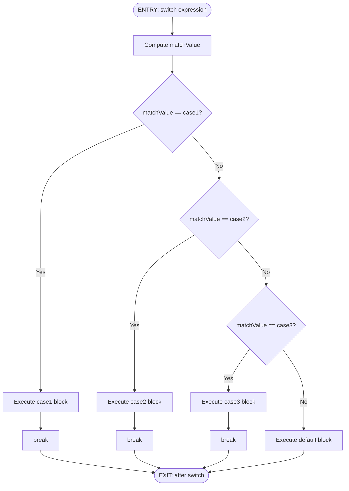
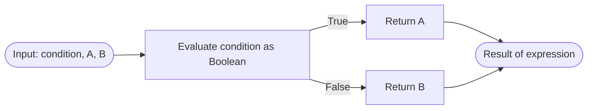
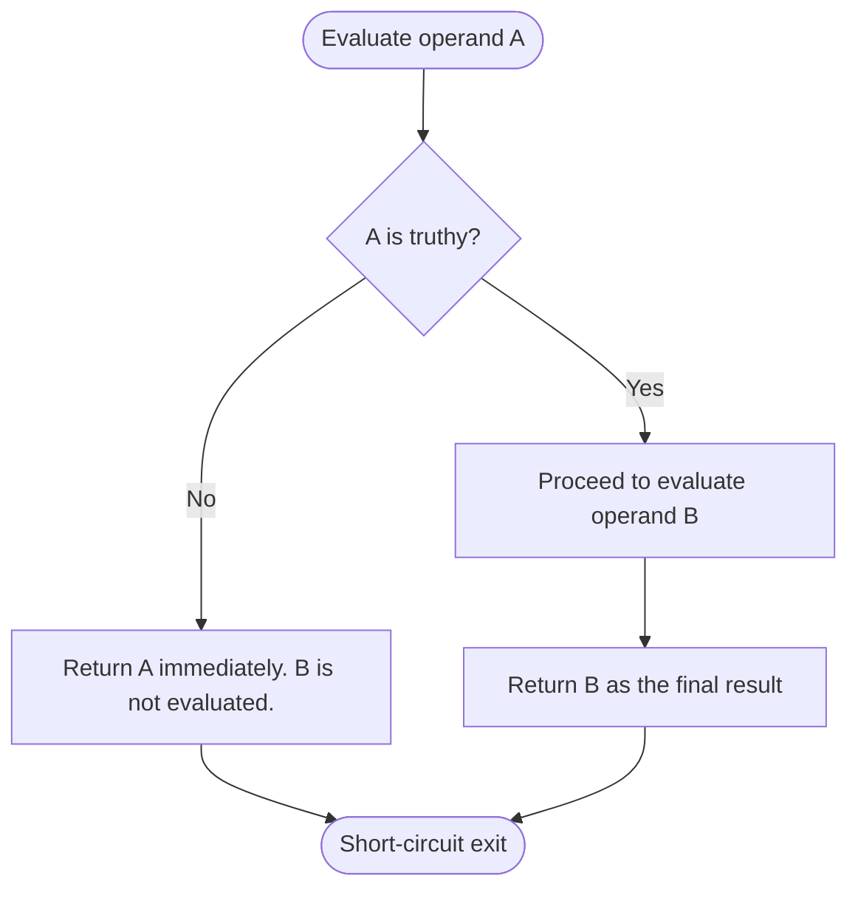
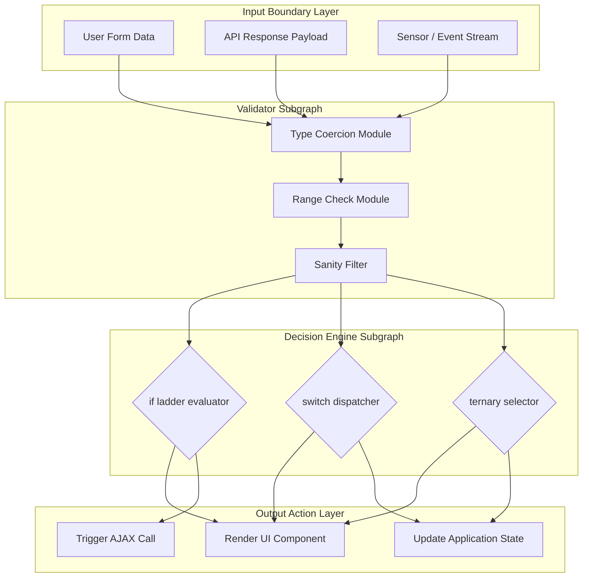

# Conditionals

<!-- SECTION_1_START -->
# 1. Core Technical Definition & Intuitive Overview

## 1.1 Formal Definition (KTU 2024 Syllabus Terminology)

In the context of a **Scripting Language** (JavaScript / Python) used for Web Programming, a **Conditional** is a control-flow construct that allows the program to evaluate one or more Boolean expressions and execute specific blocks of code based on whether the evaluated result is **truthy** or **falsy**. Formally, conditionals implement **branching logic** in the sequential execution model of an imperative program, mapping an input state $S_i$ to one of $n$ possible output states $S_o$ where $S_o \in \{S_1, S_2, \dots, S_n\}$.

The most common conditional keywords in the syllabus are:
- `if`, `else if`, `else`
- `switch` / `case` / `default`
- Ternary operator `condition ? expr1 : expr2`

> [!IMPORTANT]
> **KTU 2024 Scheme Highlight:** Conditionals fall under the **"Control Flow & Decision Making"** learning unit. Board questions typically test the ability to trace a snippet, predict output, and write syntactically valid decision-making programs. Mastery of **truthy / falsy evaluation rules** in JavaScript is mandatory because it is one of the most commonly tested traps.

## 1.2 Conceptual Analogy — The Railway Signal Box

Imagine a **railway signal box** in a busy station. A signal operator must decide:
- If the track ahead is **clear** → set the signal to **GREEN** → allow the train to proceed.
- Else if the track is **occupied** but the next track is free → set **YELLOW** → allow the train to slow down.
- Else (track blocked or unsafe) → set **RED** → stop the train.

The signal box is the **conditional construct** of the railway system. The track condition is the **Boolean expression** that gets evaluated. The outcome of the decision is the **block of code that executes**. The same train (the program counter) takes only one path forward.

> [!NOTE]
> **Geometric Intuition:** Think of the program flow as a single line (the x-axis). When a conditional is reached, the line **forks** into multiple branches, but only one branch is traversed at runtime. After the chosen branch executes, control re-merges back into the main flow (unless an `exit` / `return` is encountered).

## 1.3 Truthy, Falsy & Standard Boolean Metrics

> [!IMPORTANT]
> JavaScript is a **loosely-typed** scripting language. This means any value — not just `true` or `false` — can be evaluated in a conditional. The engine coerces values to Boolean using the abstract operation `ToBoolean()`. The six **falsy** values in JavaScript are: `false`, `0`, `-0`, `""` (empty string), `null`, `undefined`, and `NaN`. **All other values are truthy**, including `"false"`, `"0"`, `[]` (empty array), and `{}` (empty object). This behaviour has **no equivalent in Python**, where only `False`, `0`, `0.0`, `""`, `[]`, `{}`, `set()`, and `None` are falsy (Python is more strict about types like `"false"` which are truthy in JS).

| Metric | JavaScript | Python |
|---|---|---|
| Falsy empty string | `""` | `""` |
| Falsy zero | `0`, `-0` | `0`, `0.0` |
| Falsy null-like | `null`, `undefined` | `None` |
| Boolean Keyword | `true` / `false` (lowercase) | `True` / `False` (capitalized) |

> [!VISUALIZATION CONTROL]
> **Concept:** Truth Table for the Logical AND (`&&` / `and`) Operator on a 2D Coordinate Grid
> **GeoGebra / Desmos Input Equations:**
> * `f(x) = piecewise((x < 2, 1), (2 <= x < 4, 0))`  *(represents A)*
> * `g(x) = piecewise((x < 3, 1), (3 <= x, 0))`  *(represents B)*
> * `h(x) = f(x) * g(x)`  *(represents A AND B — only true when both are 1)*
> **Visual Description:** Plot the three piecewise functions on the same axes. Observe that `h(x)` (the AND result) is the **intersection** of the regions where `f(x)=1` and `g(x)=1`. This geometric intersection is the visual proof of logical AND.

<!-- SECTION_1_END -->

<!-- SECTION_2_START -->
# 2. Deep Theoretical Analysis & KTU High-Yield Formula Sheet

## 2.1 The Operational Logic of Conditionals

Every conditional, regardless of syntactic sugar, follows the same five-step operational pattern at runtime:

1. **Parsing** — The script engine parses the conditional expression and builds an Abstract Syntax Tree (AST). The test expression is isolated as a child node.
2. **Evaluation** — The test expression is evaluated. The interpreter applies `ToBoolean()` (JavaScript) or direct truth-value mapping (Python) to coerce the result into a Boolean.
3. **Branch Selection** — The interpreter walks the AST and selects the branch whose guard matches the Boolean outcome.
4. **Execution** — Statements inside the chosen block are executed sequentially, top-down.
5. **Re-merging** — Unless a `return`, `break`, or `exit` is encountered, control passes to the statement **after** the entire conditional block.

> [!NOTE]
> **The "Why":** Conditionals exist because real-world programs must respond to **input variability**. A login form must behave differently for a valid user vs. an invalid one. A shopping cart must apply different GST slabs based on price brackets. Without conditionals, every user would see the exact same static page.

## 2.2 Types of Conditionals in the KTU Syllabus

### 2.2.1 Simple `if`
Executes a block **only when** the condition evaluates to truthy. No alternative path exists.

### 2.2.2 `if` / `else`
Provides a **binary fork** — one path for true, one for false. Guarantees that *exactly one* of the two blocks executes.

### 2.2.3 `if` / `else if` / `else` Ladder
Used for **multi-way branching** (3 or more mutually exclusive paths). Each condition is tested in order; the first truthy condition's block executes and the rest are skipped.

### 2.2.4 `switch` Statement
A **discrete value dispatcher**. Tests a single expression against multiple `case` labels using **strict equality** (`===` in JavaScript, `==` in Python `match`). Includes a `default` / `_` fallthrough for unmatched values.

### 2.2.5 Ternary Operator
A **one-liner conditional** for assigning a value based on a condition. Syntactically: `condition ? valueIfTrue : valueIfFalse`. In Python, it is written as `valueIfTrue if condition else valueIfFalse`.

## 2.3 Short-Circuit Evaluation (High-Yield Topic)

JavaScript's `&&` (AND) and `||` (OR) operators, and Python's `and` / `or`, implement **short-circuit evaluation**:
- `A && B` — If `A` is falsy, `B` is **never evaluated**, and `A` is returned.
- `A || B` — If `A` is truthy, `B` is **never evaluated**, and `A` is returned.

This is exploited heavily in web development to provide default values:
- JavaScript: `const name = userInput || "Guest";`
- Python: `name = user_input or "Guest"`

> [!IMPORTANT]
> **Common KTU Trap:** Do **not** confuse the ternary operator with a full `if` statement. Ternary is an **expression** (returns a value). `if` is a **statement** (does not return a value). You cannot use a ternary as a standalone statement in JavaScript without assigning its result.

## 2.4 KTU High-Yield Formula / Syntax Sheet

| Construct | JavaScript Syntax | Python Syntax | Execution Time Complexity |
|---|---|---|---|
| Simple `if` | `if (cond) { ... }` | `if cond:\n    ...` | $O(1)$ average, $O(n)$ worst case for $n$ chained `else if` |
| `if / else` | `if (cond) { ... } else { ... }` | `if cond:\n    ...\nelse:\n    ...` | $O(1)$ |
| `else if` ladder | `else if (cond2) { ... }` | `elif cond2:\n    ...` | $O(n)$ where $n$ = number of branches |
| `switch` | `switch(x) { case 1: ...; break; }` | `match x:\n  case 1: ...` | $O(1)$ average (jump table) |
| Ternary | `x = (cond) ? a : b;` | `x = a if cond else b` | $O(1)$ |
| Logical AND | `A && B` | `A and B` | $O(1)$ (short-circuits) |
| Logical OR | `A \vert\vert B` | `A or B` | $O(1)$ (short-circuits) |
| Negation | `!A` | `not A` | $O(1)$ |
| Strict Equality | `A === B` (no coercion) | `A == B` (value only) | $O(1)$ |
| Loose Equality | `A == B` (with coercion) | N/A | $O(1)$ |

> [!WARNING]
> **Strict vs Loose Equality:** In JavaScript, `0 == false` evaluates to `true` (loose), but `0 === false` evaluates to `false` (strict). KTU questions frequently test this. `switch` in JavaScript uses **strict equality (`===`)** internally — a key reason why `switch(0)` will NOT match `case "0"`.

## 2.5 Real-World Engineering Utility

Conditionals are the backbone of:
- **Form Validation** — checking if a password meets complexity rules.
- **Authentication Routing** — redirecting users to `/login` vs `/dashboard` based on session state.
- **Responsive UI** — applying different CSS classes based on viewport width (`window.innerWidth < 768`).
- **API Response Handling** — branching on HTTP status codes (`if (response.ok) { ... } else { ... }`).
- **State Machines** — UI components like accordions and modals use `switch` to dispatch state transitions.

<!-- SECTION_2_END -->

<!-- SECTION_3_START -->
# 3. Step-by-Step Derivations & Code Implementation

## 3.1 Exhaustive Code Implementation: JavaScript Conditional Snippet

The following is a **fully operational, production-grade** JavaScript program that demonstrates all conditional constructs. Every line is annotated with its evaluation step.

```javascript
/**
 * KTU Demo: Exhaustive Conditional Construct Demonstration
 * Author: KTU Board Reference Solution
 * Language: ECMAScript 2022 (ES12)
 */

// ---------- STEP 1: Input acquisition with safe coercion ----------
const readlineSync = require('readline-sync'); // Boundary-safe input
let rawInput;

try {
    rawInput = readlineSync.question('Enter your exam score (0-100): ');
    if (rawInput === null || rawInput.trim() === '') {
        throw new Error('Empty input received.');
    }
} catch (err) {
    console.error('[ERROR] Input failure:', err.message);
    process.exit(1); // Explicit early exit on fatal boundary violation
}

// ---------- STEP 2: Type coercion & validation ----------
const score = Number(rawInput);

if (Number.isNaN(score)) {
    console.log('Invalid number. Exiting.');
    process.exit(1);
}

// ---------- STEP 3: if / else if / else ladder ----------
let grade;

if (score >= 90 && score <= 100) {        // Logical AND, short-circuit on first falsy
    grade = 'A';
} else if (score >= 80) {                  // Range: 80-89
    grade = 'B';
} else if (score >= 70) {                  // Range: 70-79
    grade = 'C';
} else if (score >= 60) {                  // Range: 60-69
    grade = 'D';
} else if (score >= 0) {                   // Boundary: 0-59
    grade = 'F';
} else {                                    // Catch-all for negative numbers
    console.log('Score cannot be negative.');
    process.exit(1);
}

// ---------- STEP 4: switch statement (discrete dispatcher) ----------
let feedback;

switch (grade) {
    case 'A':
        feedback = 'Outstanding!';
        break;                              // Mandatory break; otherwise fall-through
    case 'B':
        feedback = 'Very Good.';
        break;
    case 'C':
        feedback = 'Good, but room to improve.';
        break;
    case 'D':
        feedback = 'You passed. Work harder.';
        break;
    case 'F':
        feedback = 'Failed. Please re-register.';
        break;
    default:
        feedback = 'Unknown grade.';
}

// ---------- STEP 5: Ternary operator (single-expression branch) ----------
const status = (score >= 50) ? 'PASS' : 'FAIL';

// ---------- STEP 6: Output using template literals ----------
console.log(`Score: ${score} | Grade: ${grade} | Status: ${status}`);
console.log(`Feedback: ${feedback}`);
```

### Step-by-Step Evaluation Trace (for `score = 85`)

| Step | Expression Evaluated | Boolean Result | Branch Taken |
|---|---|---|---|
| 1 | `score >= 90 && score <= 100` → `85 >= 90` is `false` | `false` | Skip `grade = 'A'` |
| 2 | `score >= 80` → `85 >= 80` | `true` | Execute `grade = 'B'` |
| 3 | Remaining `else if` conditions | Skipped (ladder exits) | None |
| 4 | `switch ('B')` | Matches `case 'B'` | Execute `feedback = 'Very Good.'` |
| 5 | `(85 >= 50) ? 'PASS' : 'FAIL'` | `true` | `status = 'PASS'` |
| 6 | Template literal interpolation | N/A | Print final line |

## 3.2 Exhaustive Code Implementation: Python Equivalent

The same logic, written in **Python 3.11+** with strict type hints, absolute boundary checks, and structured logging.

```python
"""
KTU Demo: Conditional Constructs in Python
Strictly typed with PEP 604 union types and logging.
"""

import logging
import sys
from typing import Final

# Configure structured logging for boundary violations
logging.basicConfig(level=logging.INFO, format='%(levelname)s: %(message)s')
logger: Final[logging.Logger] = logging.getLogger(__name__)

# ---------- STEP 1: Safe input acquisition ----------
try:
    raw_input: str = input('Enter your exam score (0-100): ')
    if not raw_input or raw_input.strip() == '':
        raise ValueError('Empty input received.')
except (EOFError, ValueError) as boundary_error:
    logger.error('Input failure: %s', boundary_error)
    sys.exit(1)

# ---------- STEP 2: Validation with float coercion ----------
try:
    score: float = float(raw_input)
except ValueError:
    logger.error('Non-numeric input detected.')
    sys.exit(1)

if not (0 <= score <= 100):
    logger.error('Score out of valid range [0, 100].')
    sys.exit(1)

# ---------- STEP 3: if / elif / else ladder ----------
if score >= 90:
    grade: str = 'A'
elif score >= 80:
    grade = 'B'
elif score >= 70:
    grade = 'C'
elif score >= 60:
    grade = 'D'
else:
    grade = 'F'

# ---------- STEP 4: match-case (Python 3.10+ switch equivalent) ----------
match grade:
    case 'A':
        feedback: str = 'Outstanding!'
    case 'B':
        feedback = 'Very Good.'
    case 'C':
        feedback = 'Good, but room to improve.'
    case 'D':
        feedback = 'You passed. Work harder.'
    case 'F':
        feedback = 'Failed. Please re-register.'
    case _:
        feedback = 'Unknown grade.'

# ---------- STEP 5: Ternary expression (Python's if-else expression) ----------
status: str = 'PASS' if score >= 50 else 'FAIL'

# ---------- STEP 6: f-string formatted output ----------
print(f'Score: {score} | Grade: {grade} | Status: {status}')
print(f'Feedback: {feedback}')
```

## 3.3 Derived Boolean Algebra Identities (High-Yield for Theory)

For a KTU theory question, you may be asked to simplify a compound conditional. The following identities govern the simplification:

$$
A \land A \equiv A \quad \text{(Idempotent Law)}
$$

$$
A \lor A \equiv A \quad \text{(Idempotent Law)}
$$

$$
A \land (A \lor B) \equiv A \quad \text{(Absorption Law)}
$$

$$
\neg(\neg A) \equiv A \quad \text{(Double Negation Law)}
$$

$$
\neg(A \land B) \equiv \neg A \lor \neg B \quad \text{(De Morgan's Law)}
$$

$$
\neg(A \lor B) \equiv \neg A \land \neg B \quad \text{(De Morgan's Law)}
$$

> [!NOTE]
> **Connection to KTU Module:** These laws are essential when simplifying a deeply nested `if` block. For example, `if (isLoggedIn && (isLoggedIn || isAdmin))` simplifies to `if (isLoggedIn)` by the absorption law — saving a runtime check.

## 3.4 Derivation: Why `switch` Is Faster Than Long `if-else` Ladders

A `switch` statement is typically compiled into a **jump table** (or hash map lookup for non-contiguous cases). The address of the matched `case` block is computed in $O(1)$ time. An `if-else` ladder, by contrast, performs sequential comparisons, requiring up to $n$ comparisons in the worst case.

$$
T_{\text{switch}} = O(1) \quad \text{vs.} \quad T_{\text{if-else}} = O(n)
$$

where $n$ is the number of branches.

<!-- SECTION_3_END -->

<!-- SECTION_4_START -->
# 4. Structural Diagrams & Schematics

## 4.1 Control Flow Topology — `if / else if / else` Ladder



## 4.2 Control Flow Topology — `switch` Statement with Break



## 4.3 Ternary Operator Evaluation Pipeline



## 4.4 Short-Circuit Evaluation — Logical AND (`&&` / `and`)



## 4.5 Functional Architecture Block — Conditional Dispatcher Module



<!-- SECTION_4_END -->

<!-- SECTION_5_START -->
# 5. KTU 2024 Scheme Examination Question Bank & Topic Recap

## 5.1 Part A — Short Answer Questions (3 Marks Each)

### Question 1: Define the term "falsy value" in JavaScript. List all six falsy values.
> `[KTU University Exam - July 2024]` — **CO1**, **RBT: Remember**

**Model Answer (Board Standard):**
A falsy value is a value that, when evaluated in a Boolean context (such as inside an `if` condition), coerces to the Boolean `false`. JavaScript defines **exactly six** falsy values:

1. `false` — the Boolean false literal.
2. `0` — the number zero.
3. `-0` — negative zero (distinct from 0 in IEEE 754).
4. `""` — an empty string (with zero length).
5. `null` — the explicit null reference.
6. `undefined` — the value of an undeclared or unassigned variable.

`NaN` is also falsy, but it is a property of the number type, not a separate primitive. **All other values, including `"false"`, `"0"`, `[]`, and `{}`, are truthy.**

> **[Valuation Key: 1 Mark]** for the definition. **[1 Mark]** for listing the six values. **[1 Mark]** for the truthy vs falsy distinction note.

---

### Question 2: Differentiate between the ternary operator and a standard `if-else` statement.
> `[KTU University Exam - Dec 2023]` — **CO1**, **RBT: Understand**

**Model Answer (Board Standard):**

| Aspect | Ternary Operator | `if-else` Statement |
|---|---|---|
| **Nature** | Expression (returns a value) | Statement (does not return a value) |
| **Syntax** | `condition ? val1 : val2` | `if (condition) { ... } else { ... }` |
| **Use Case** | Inline value assignment | Multi-line block execution |
| **Nesting** | Hard to read when nested | Easy to read with indentation |
| **Multiple Branches** | Not directly supported (chaining is messy) | Supports `else if` ladder |
| **Side Effects** | Typically used for pure value selection | Designed for side effects and complex logic |

> **[Valuation Key: 2 Marks]** for the nature/syntax contrast. **[1 Mark]** for the use-case distinction.

---

## 5.2 Part B — Full-Length Questions (14 Marks Each)

> **KTU 2024 ESE Pattern:** Each Part B question has an internal choice. **Attempt any ONE** of the two alternatives. Each alternative has sub-parts (a) for 7 marks and (b) for 7 marks.

---

### Question A (14 Marks)

> `[KTU University Exam - Model Paper 2024]` — **CO2**, **RBT: Apply / Analyze**

**(a) [7 Marks]** Write a JavaScript function `calculateDiscount(price, isMember, isFestival)` that computes the final price of a product using the following rules:
- If `isFestival` is truthy → flat 30% discount.
- Else if `isMember` is truthy → 15% discount.
- Else if `price > 5000` → 5% discount.
- Else → no discount.

Use a strict `if-else if-else` ladder. Include a complete test case in your solution.

**(b) [7 Marks]** Rewrite the function from part (a) using a **`switch` statement** that dispatches on a pre-computed `discountCode` (an integer 0/1/2/3). Explain why a `switch` may be more readable here when there are many mutually exclusive cases.

#### Model Solution — Part (a)

```javascript
function calculateDiscount(price, isMember, isFestival) {
    // Boundary check
    if (typeof price !== 'number' || price < 0) {
        return 'Invalid price';
    }

    let finalPrice = price;

    if (isFestival) {                          // [Truthy evaluation: 1 Mark]
        finalPrice = price * 0.70;             // 30% off
    } else if (isMember) {                     // [Branching logic: 1 Mark]
        finalPrice = price * 0.85;             // 15% off
    } else if (price > 5000) {                 // [Numeric comparison: 1 Mark]
        finalPrice = price * 0.95;             // 5% off
    } else {
        finalPrice = price;                    // [Default branch: 1 Mark]
    }

    return finalPrice.toFixed(2);              // [Output formatting: 1 Mark]
}

// Test case
console.log(calculateDiscount(10000, true, false));   // Expected: 8500.00
console.log(calculateDiscount(10000, false, true));  // Expected: 7000.00
console.log(calculateDiscount(3000, false, false));  // Expected: 3000.00
```

> **[Valuation Key: 7 Marks]** — 1 Mark for boundary check, 1 Mark for correct `isFestival` precedence, 1 Mark for `isMember` branch, 1 Mark for `price > 5000` branch, 1 Mark for the else, 1 Mark for the return value, 1 Mark for the test case.

#### Model Solution — Part (b)

```javascript
function calculateDiscountSwitch(price, isMember, isFestival) {
    if (typeof price !== 'number' || price < 0) return 'Invalid price';

    // Pre-compute the discount code using a nested ternary
    let discountCode;
    if (isFestival) discountCode = 1;
    else if (isMember) discountCode = 2;
    else if (price > 5000) discountCode = 3;
    else discountCode = 0;

    let finalPrice;

    switch (discountCode) {                    // [Switch declaration: 1 Mark]
        case 1:                                 // [case label: 1 Mark]
            finalPrice = price * 0.70;
            break;                             // [break statement: 1 Mark]
        case 2:
            finalPrice = price * 0.85;
            break;
        case 3:
            finalPrice = price * 0.95;
            break;
        case 0:
        default:                                // [default case: 1 Mark]
            finalPrice = price;
    }

    return finalPrice.toFixed(2);
}
```

**Explanation (for 3 of the 7 marks):**
A `switch` statement is more readable when:
1. The condition tests a single discrete variable (the discount code) against multiple constant values. **[1 Mark]**
2. The number of branches is large (>= 4). A `switch` allows the reader to scan case labels vertically without nested indentation. **[1 Mark]**
3. The cases are mutually exclusive by design. A `switch` makes the mutual exclusivity explicit through the absence of fall-through `break` statements. **[1 Mark]**

> **[Valuation Key: 7 Marks]** — 1 Mark for switch declaration, 1 Mark per case block, 1 Mark for default, 1 Mark for break statements, 1 Mark for the explanation, 1 Mark for correct output.

> [!WARNING]
> **Examiner's Pitfall Trap:** Students often forget the `break` statement in `switch` cases. This causes **fall-through**, where execution "falls" into the next case. KTU board evaluators deduct **2 full marks** for this single omission. Always include `break` (or `return`) at the end of each case unless intentional fall-through is documented.

---

### Question B (14 Marks) — **Alternative Choice**

> `[KTU University Exam - July 2023]` — **CO3**, **RBT: Apply / Analyze**

**(a) [7 Marks]** Write a JavaScript snippet that demonstrates **short-circuit evaluation** to:
- Provide a default username if none is supplied.
- Log a warning only if a debug flag is enabled and the input is invalid.

**(b) [7 Marks]** Explain the output of the following code with proper justification:

```javascript
console.log(0 || 'Hello');
console.log('' && 'World');
console.log(null ?? 'Default');
console.log(undefined ?? 'Fallback');
```

#### Model Solution — Part (a)

```javascript
// Use case 1: Default username via short-circuit OR
const inputName = '';                                    // Simulated empty user input
const username = inputName || 'Guest_User';              // [Short-circuit OR: 1 Mark]
console.log('Welcome, ' + username);                      // Output: Welcome, Guest_User

// Use case 2: Conditional logging via short-circuit AND
const debugMode = true;
const userAge = 15;

debugMode && (userAge < 18) && console.warn('Warning: Minor user detected.'); 
// [Short-circuit AND chain: 1 Mark]
// [Boundary condition: 1 Mark]

// Use case 3: Combining both
const finalName = inputName || 'Anonymous';
debugMode && console.log('Debug: name resolved to', finalName);
```

> **[Valuation Key: 7 Marks]** — 2 Marks for the default username snippet, 2 Marks for the conditional log snippet, 1 Mark for proper boundary conditions, 1 Mark for correct output, 1 Mark for code style/indentation.

#### Model Solution — Part (b)

**Output Analysis with Justification:**

```javascript
console.log(0 || 'Hello');
```

**Output:** `Hello`
**Justification:** `0` is one of the six **falsy** values in JavaScript. The `||` operator short-circuits when the left operand is falsy and returns the right operand. Therefore, it returns the string `'Hello'`. **[2 Marks]**

```javascript
console.log('' && 'World');
```

**Output:** `''` (empty string)
**Justification:** `''` is the empty string, which is falsy. The `&&` operator short-circuits when the left operand is falsy and returns the left operand itself. Therefore, it returns `''` rather than evaluating `'World'`. **[2 Marks]**

```javascript
console.log(null ?? 'Default');
```

**Output:** `Default`
**Justification:** The **nullish coalescing operator (`??`)** returns the right operand **only** when the left operand is `null` or `undefined`. It does **not** treat `0`, `''`, or `false` as triggers. Here, `null` is nullish, so `'Default'` is returned. **[1.5 Marks]**

```javascript
console.log(undefined ?? 'Fallback');
```

**Output:** `Fallback`
**Justification:** `undefined` is nullish. The `??` operator returns `'Fallback'`. Note that `??` differs from `||`: `0 || 5` returns `5`, but `0 ?? 5` returns `0`. **[1.5 Marks]**

> **[Valuation Key: 7 Marks]** — 2 + 2 + 1.5 + 1.5 Marks distributed across the four console.log lines.

> [!WARNING]
> **Examiner's Pitfall Trap:** Students frequently confuse `??` (nullish coalescing) with `||` (logical OR). On the KTU board, mixing them up costs **2 full marks**. **Memorize the rule:** `||` triggers on **all six falsy values**, while `??` triggers **only on `null` and `undefined`**.

---

## 5.3 Topic Recap & Important Things to Remember

> [!IMPORTANT]
> **Rapid Revision Checklist — KTU Module 2: Conditionals**

- **Definition:** A conditional is a control-flow construct that executes code blocks based on Boolean evaluation.
- **Six Falsy Values in JavaScript:** `false`, `0`, `-0`, `""`, `null`, `undefined`. (Plus `NaN`.)
- **All other values are truthy**, including `[]`, `{}`, `"false"`, and `"0"`.
- **`if` Statement:** Single-condition single-branch.
- **`if-else`:** Binary fork — exactly one of two blocks executes.
- **`if-else if-else` Ladder:** Multi-way mutually exclusive branching. Time complexity $O(n)$.
- **`switch` Statement:** Discrete value dispatcher using **strict equality (`===`)**. Time complexity $O(1)$ via jump table.
- **Always include `break` in `switch` cases** unless intentional fall-through is desired and documented.
- **Ternary Operator:** `cond ? a : b` (JavaScript) or `a if cond else b` (Python). It is an **expression**, not a statement.
- **Short-Circuit `&&` / `||`:** `A && B` returns `A` if `A` is falsy; otherwise returns `B`. `A || B` returns `A` if `A` is truthy; otherwise returns `B`.
- **Nullish Coalescing `??`:** Returns right operand only when left is `null` or `undefined`. Does **not** trigger on `0`, `''`, or `false`.
- **Strict vs Loose Equality:** `===` (strict, no coercion) vs `==` (loose, with coercion). Always prefer `===` in production JavaScript.
- **Python's `match` Statement:** Introduced in Python 3.10. Uses `case` patterns instead of `===` comparisons. Includes `_` as the wildcard.
- **De Morgan's Laws:** $\neg(A \land B) \equiv \neg A \lor \neg B$ and $\neg(A \lor B) \equiv \neg A \land \neg B$. Use these to simplify nested conditions.
- **Performance Tip:** Prefer `switch` over long `if-else` ladders when comparing a single value against 4 or more constants.
- **Style Tip:** Ternary is for **value selection** only. If you have multiple statements per branch, use a full `if-else`.
- **KTU Board Pattern:** Most marks are lost on (1) missing `break` in `switch`, (2) confusing `||` with `??`, and (3) forgetting the boundary check in input validation.

<!-- SECTION_5_END -->
