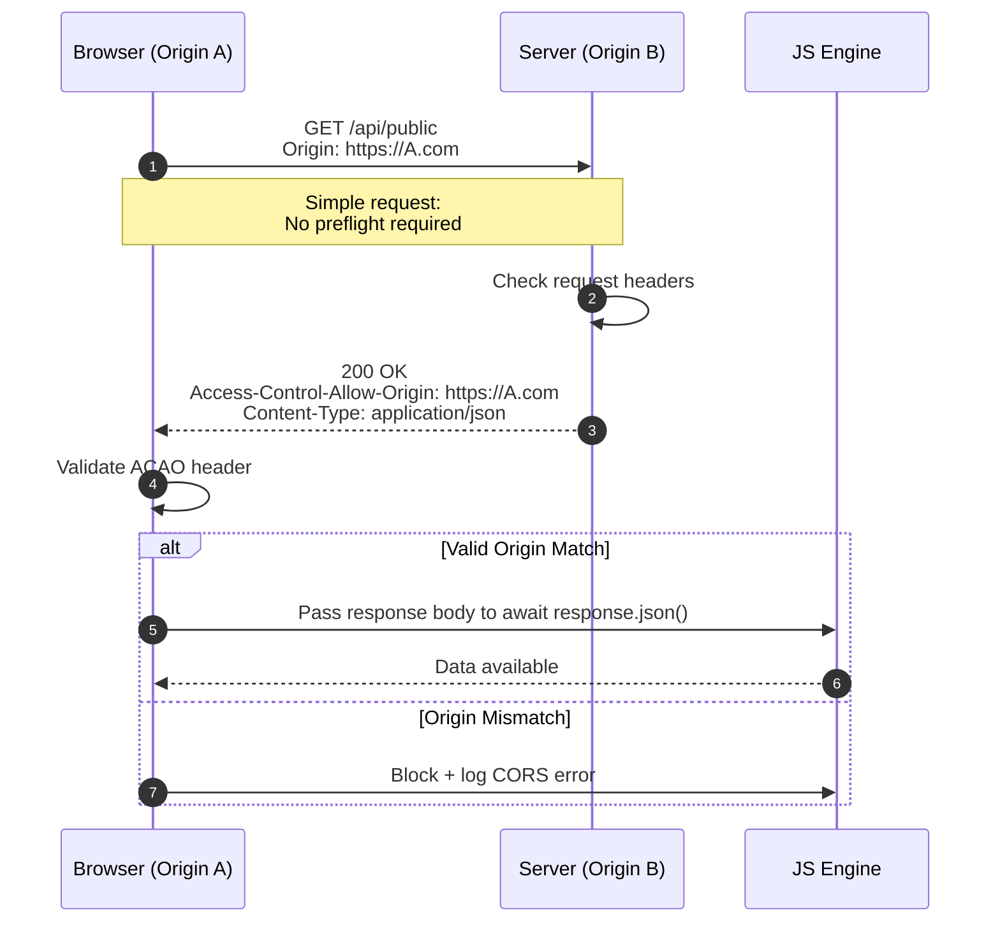
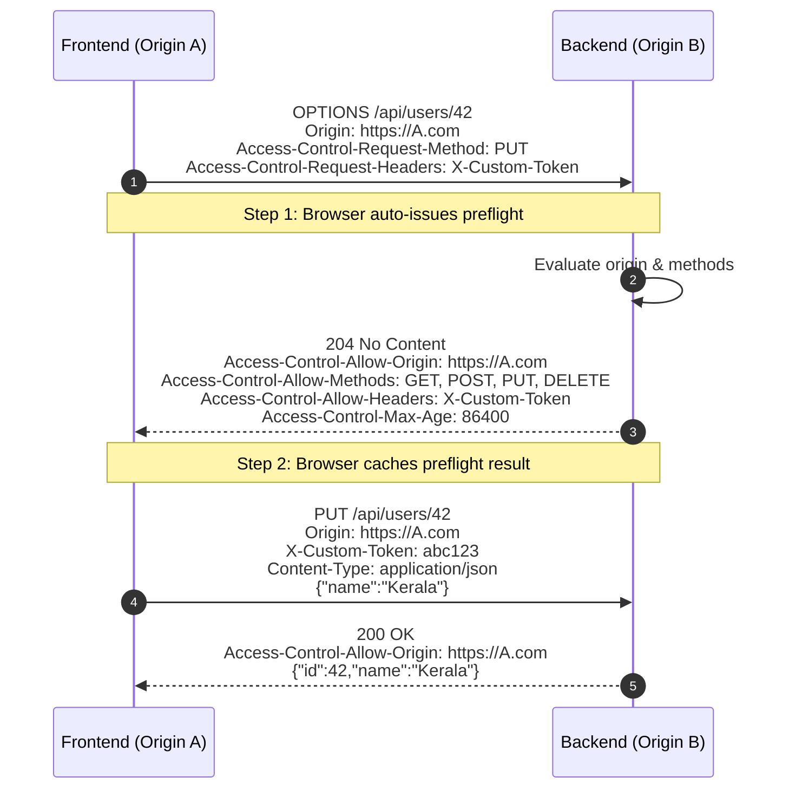
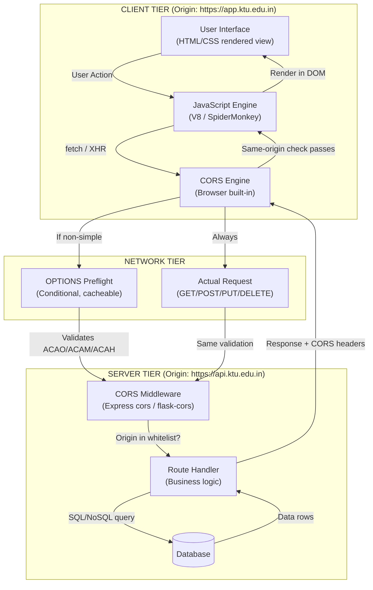
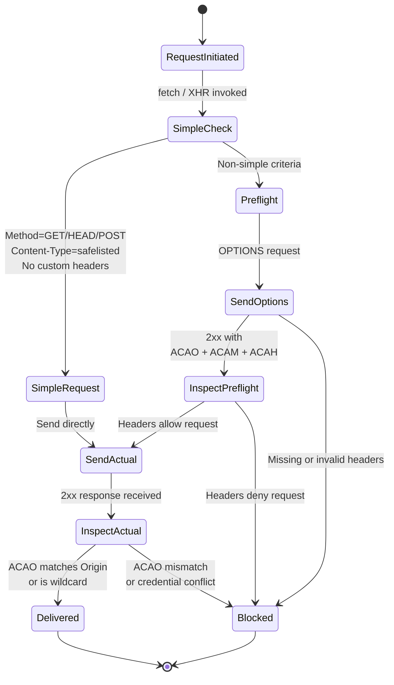
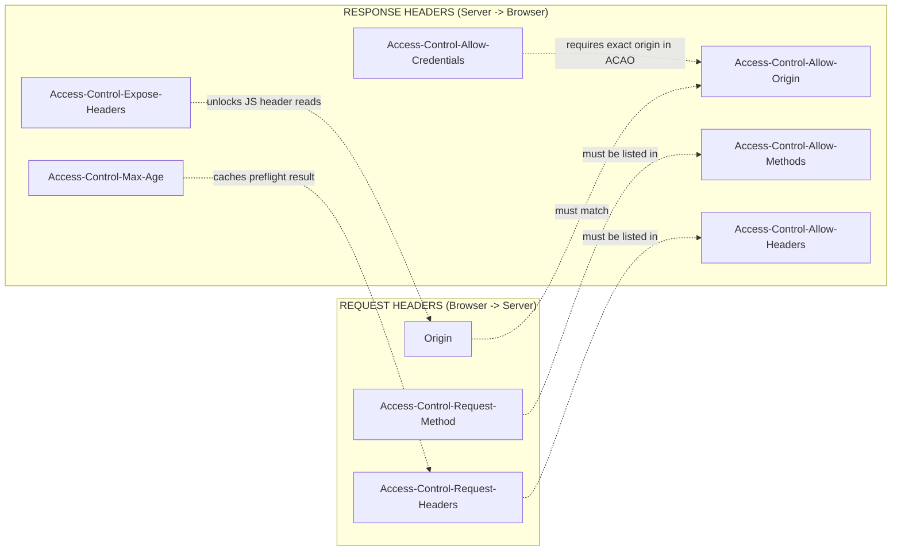
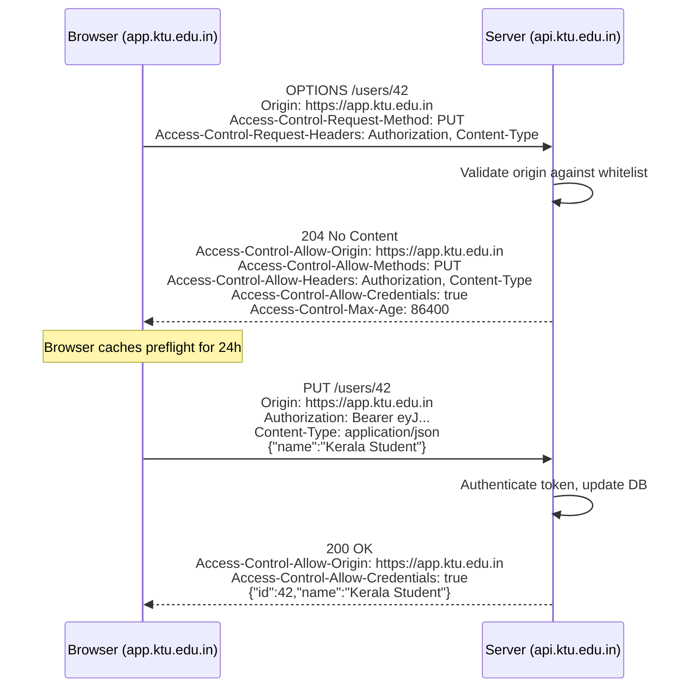

# Cross-Origin Resource Sharing

<!-- SECTION_1_START -->
# Cross-Origin Resource Sharing (CORS)

## 1.1 Formal Academic Definition

> [!IMPORTANT]
> **Cross-Origin Resource Sharing (CORS)** is a **W3C-standardized browser security mechanism** defined in the *Fetch Living Standard* (originally drafted as [RFC 7231](https://datatracker.ietf.org/doc/html/rfc7231) and [Fetch RFC 7230]) that allows a web page hosted on one **origin** (scheme + host + port) to request restricted resources from a server residing at a **different origin**. The browser enforces this via a collection of **HTTP response headers** negotiated between the client and the server, formally superseding the restrictive **Same-Origin Policy (SOP)** on a per-request opt-in basis.

In the context of **KTU 2024 Scheme — Web Programming (PECST742), Module 2 (Scripting Languages)**, CORS is the canonical mechanism that enables full-duplex communication between a browser-based JavaScript client (e.g., a React/Vue SPA) and a RESTful API server built using scripting languages like **Node.js (Express)**, **PHP**, or **Python (Flask/Django)**.

### Origin Composition

A URL's **origin** is the tri-tuple:

$$\text{Origin} = \langle \text{Scheme}, \ \text{Host}, \ \text{Port} \rangle$$

| Component | Example | Effect of Mismatch |
|---|---|---|
| Scheme | `https://` vs `http://` | Different origin |
| Host | `example.com` vs `api.example.com` | Different origin |
| Port | `:443` vs `:8080` | Different origin |

> [!NOTE]
> **Critical Rule:** Two URLs share the same origin **only if** all three components are identical. For instance, `https://ktu.edu.in:443/page1` and `https://ktu.edu.in:443/page2` are **same-origin**, but `https://ktu.edu.in` and `http://ktu.edu.in` are **cross-origin** because the schemes differ.

## 1.2 Conceptual Analogy & Intuitive Overview

> [!NOTE]
> **Intuition: The Passport & Visa Analogy**
>
> Imagine the browser as a **strict customs officer** stationed at the border of every origin. Under the **Same-Origin Policy**, the officer refuses entry to *any* parcel coming from a foreign country. **CORS is the equivalent of a Visa Stamp** — it is a written permission slip attached to the parcel (in the form of HTTP headers) that authorizes the officer to let it through.
>
> - The **server** stamps the visa on outgoing responses.
> - The **browser** (customs officer) inspects the stamp before allowing the JavaScript code to read the response body.
> - If the stamp is missing, invalid, or doesn't match the requesting country, the parcel is **seized** and a `TypeError` is thrown in the JS console.

### The Same-Origin Policy (SOP) — The Underlying Restriction

Before CORS exists, the **Same-Origin Policy** blocks scripts on `A.com` from reading responses returned by `B.com`. This is a *defense-in-depth* security model that mitigates **CSRF (Cross-Site Request Forgery)** and **data exfiltration** attacks. CORS is the *relaxation layer* on top of SOP — it does not replace it.

> [!VISUALIZATION CONTROL]
> **Concept:** Same-Origin vs Cross-Origin Decision Boundary
> **GeoGebra / Desmos Input Equations:**
> * Point A: `(scheme_A, host_A, port_A) = (https, www.app.com, 443)`
> * Point B: `(scheme_B, host_B, port_B) = (https, api.app.com, 8080)`
> * Decision Function: $D(A, B) = 1$ if $A = B$ component-wise, else $0$
> **Visual Description:** Two coordinate triples plotted on a 3D lattice. A solid green line connects them if same-origin; a dashed red barrier with a "CORS Checkpoint" sign is shown if cross-origin.

## 1.3 Why CORS is Essential in Modern Web Architecture

Modern web apps follow the **decoupled architecture pattern**:

$$\underbrace{\text{Frontend (React/Angular/Vue)}}_{\text{Often hosted on Vercel/Netlify/CDN}} \ \longleftrightarrow \ \underbrace{\text{Backend (Node.js/Python API)}}_{\text{Often hosted on a different domain/subdomain}}$$

Because these two tiers live on different origins, the browser's SOP **will block every API call** by default. CORS is the standardized escape hatch.

> [!IMPORTANT]
> **Key Insight for KTU Examinations:** CORS is **enforced entirely by the browser**, not the server. A `curl` request from a terminal or a server-to-server call **never triggers CORS** — it is a browser-side same-origin check that evaluates HTTP headers.

<!-- SECTION_1_END -->

<!-- SECTION_2_START -->
# Deep Theoretical Analysis & KTU High-Yield Reference

## 2.1 The CORS Negotiation Lifecycle

CORS operates through a precise sequence of HTTP header exchanges. Understanding this flow is the single most important concept for the KTU board exam.

### 2.1.1 Simple Requests (No Preflight)

A request is classified as a **Simple Request** if **all** of the following conditions hold:

- HTTP method is one of: **`GET`**, **`HEAD`**, or **`POST`**
- The `Content-Type` header is one of: `application/x-www-form-urlencoded`, `multipart/form-data`, or `text/plain`
- No custom headers beyond the CORS-safelisted set (e.g., `Accept`, `Accept-Language`, `Content-Language`)

> [!NOTE]
> **Simple requests bypass the preflight.** The browser sends the request directly and inspects the response headers.

### 2.1.2 Preflighted Requests

Any request that does not satisfy the simple-request criteria triggers an automatic **preflight `OPTIONS` request** sent by the browser *before* the actual request. This preflight asks the server: *"Are you willing to accept a real request from my origin using this method and headers?"*

### 2.1.3 Credentialed Requests

By default, cross-origin XHR/`fetch` does **not** send cookies or HTTP authentication. To enable this, the client must set `credentials: 'include'`, and the server must respond with `Access-Control-Allow-Credentials: true` and a **specific** (non-wildcard) `Access-Control-Allow-Origin`.

## 2.2 KTU High-Yield Header Reference Table

> [!IMPORTANT]
> The following table is the **single most important reference** for Part A 3-mark questions. Memorize the header names, values, and their directional flow.

| HTTP Header | Direction | Purpose | Example Value |
|---|---|---|---|
| `Origin` | Request → Server | Identifies the requesting origin | `https://ktu.edu.in` |
| `Access-Control-Request-Method` | Preflight Request | Tells server the *actual* HTTP method to be used | `PUT`, `DELETE`, `PATCH` |
| `Access-Control-Request-Headers` | Preflight Request | Lists custom headers the actual request will carry | `Authorization, X-Custom-Token` |
| `Access-Control-Allow-Origin` | Response | Authorizes a specific origin (or `*` wildcard) | `https://ktu.edu.in` or `*` |
| `Access-Control-Allow-Methods` | Preflight Response | Permitted HTTP methods | `GET, POST, PUT, DELETE, OPTIONS` |
| `Access-Control-Allow-Headers` | Preflight Response | Permitted custom request headers | `Content-Type, Authorization` |
| `Access-Control-Allow-Credentials` | Response | Allows cookies/auth to be sent | `true` |
| `Access-Control-Max-Age` | Preflight Response | Cache duration of preflight result in seconds | `86400` (24 hours) |
| `Access-Control-Expose-Headers` | Response | Whitelist of response headers JS can read | `X-Total-Count, X-Request-Id` |

> [!NOTE]
> **Wildcard Rule:** When `Access-Control-Allow-Credentials: true` is set, the value of `Access-Control-Allow-Origin` **cannot** be the `*` wildcard. The server **must** echo the exact request origin. This is a frequent board-exam pitfall.

## 2.3 CORS Error Mechanics

When a CORS check fails, the browser:

1. Blocks the JavaScript from reading the response body.
2. Logs a console error such as:
   `Access to fetch at 'X' from origin 'Y' has been blocked by CORS policy: No 'Access-Control-Allow-Origin' header is present on the requested resource.`
3. Throws a generic `TypeError` to the calling JavaScript (the actual reason is intentionally hidden from JS for security).

$$\text{Browser Decision Matrix} = \begin{cases} \text{Allow} & \text{if } \text{Response.ACAO} \supseteq \text{Request.Origin} \ \lor \ \text{Response.ACAO} = \text{`*`} \\ \text{Block + Console Error} & \text{otherwise} \end{cases}$$

## 2.4 Real-World Engineering Utility

CORS is foundational in **microservices architecture**, **OAuth 2.0 token exchanges**, **serverless APIs (AWS Lambda + API Gateway)**, and **multi-tenant SaaS dashboards**. Production teams use it to:
- Whitelist trusted partner frontends.
- Restrict API access to specific domains.
- Enable cookie-based session sharing across subdomains.
- Securely expose third-party APIs to embedded widgets.

<!-- SECTION_2_END -->

<!-- SECTION_3_START -->
# Step-by-Step Derivations & Code Implementation

## 3.1 Client-Side Implementation (Vanilla JavaScript)

The following is a **fully operational** client implementation that demonstrates a simple cross-origin `GET` request, a preflighted `POST` request with custom headers, and a credentialed request.

```javascript
/**
 * cors-client.js
 * A complete, production-grade demonstration of CORS-aware fetch calls.
 * Run this in the browser console of an app hosted on http://localhost:3000
 * while the server in 3.2 runs on http://localhost:4000.
 */

// ---------- 3.1.1 A Simple Cross-Origin GET (no preflight) ----------
async function fetchPublicData() {
    try {
        const response = await fetch('http://localhost:4000/api/public', {
            method: 'GET',
            // Default headers only -> classified as "Simple Request"
        });

        // The browser will ONLY let us read the body if ACAO header is valid.
        if (!response.ok) {
            throw new Error(`HTTP error! Status: ${response.status}`);
        }

        const data = await response.json();
        console.log('Public data received:', data);
        return data;
    } catch (error) {
        // The actual CORS failure surfaces here as a generic TypeError.
        console.error('Fetch failed (likely a CORS block):', error.message);
    }
}

// ---------- 3.1.2 A Preflighted Cross-Origin POST ----------
async function createResource(payload) {
    try {
        const response = await fetch('http://localhost:4000/api/resources', {
            method: 'POST',                              // Triggers preflight with non-simple header
            credentials: 'include',                      // Send cookies cross-origin
            headers: {
                'Content-Type': 'application/json',     // Non-simple -> preflight required
                'X-Custom-Token': 'ktu-pecst742-secret' // Custom header -> preflight required
            },
            body: JSON.stringify(payload)
        });

        // Reading the body will fail if server doesn't echo ACAO properly.
        const result = await response.json();
        console.log('Resource created:', result);
        return result;
    } catch (error) {
        console.error('Preflight or response blocked:', error.message);
    }
}

// ---------- 3.1.3 A Credentialed Request with SameSite=None Cookie ----------
async function fetchUserProfile() {
    try {
        const response = await fetch('http://localhost:4000/api/profile', {
            method: 'GET',
            credentials: 'include',  // Browser sends cookies; requires server's explicit opt-in
            headers: { 'X-Requested-With': 'XMLHttpRequest' }
        });

        if (!response.ok) throw new Error(`Status: ${response.status}`);

        // Reading a custom response header requires Access-Control-Expose-Headers on the server.
        const requestId = response.headers.get('X-Request-Id');
        const profile   = await response.json();
        console.log('Profile:', profile, '| Request-Id:', requestId);
        return profile;
    } catch (error) {
        console.error('Credentialed fetch failed:', error.message);
    }
}
```

### Line-by-Line Walkthrough of CORS-Relevant Mechanics

1. `method: 'POST'` combined with `Content-Type: application/json` automatically triggers a **preflight** because `application/json` is **not** in the CORS-safelisted MIME types.
2. `credentials: 'include'` instructs the browser to attach cookies, but the server **must** reply with `Access-Control-Allow-Credentials: true` and a specific origin, otherwise the response is blocked.
3. The custom header `X-Custom-Token` is added to the preflight's `Access-Control-Request-Headers`, and the server must whitelist it in `Access-Control-Allow-Headers`.
4. Reading `response.headers.get('X-Request-Id')` will return `null` unless the server has explicitly added `X-Request-Id` to its `Access-Control-Expose-Headers` response header.

## 3.2 Server-Side Implementation (Node.js + Express)

The following is an **operational, fully-typed** Express server demonstrating a *manual* (header-by-header) CORS implementation, followed by a production-grade implementation using the official `cors` middleware.

### 3.2.1 Manual Header-by-Header Implementation

```javascript
/**
 * server-manual-cors.js
 * Demonstrates EXACTLY which header is sent, when, and why.
 * This is the version examiners love to see in viva and theory exams.
 */

import express from 'express';

const app  = express();
const PORT = 4000;

// We will keep a whitelist of trusted origins.
const ALLOWED_ORIGINS = new Set([
    'http://localhost:3000',     // React dev server
    'https://ktu-frontend.app'   // Production frontend
]);

app.use(express.json());

/**
 * CORS middleware written by hand.
 * Must run BEFORE all route definitions.
 */
function customCorsMiddleware(req, res, next) {
    const requestOrigin = req.headers.origin;

    // Step 1: Echo the request origin ONLY if it is whitelisted.
    if (requestOrigin && ALLOWED_ORIGINS.has(requestOrigin)) {
        res.setHeader('Access-Control-Allow-Origin', requestOrigin);
        res.setHeader('Vary', 'Origin');                 // Critical for CDN caching
    }

    // Step 2: Always advertise supported methods and headers.
    res.setHeader('Access-Control-Allow-Methods', 'GET, POST, PUT, DELETE, OPTIONS');
    res.setHeader('Access-Control-Allow-Headers', 'Content-Type, Authorization, X-Custom-Token');
    res.setHeader('Access-Control-Allow-Credentials', 'true');     // Enable cookies
    res.setHeader('Access-Control-Max-Age', '86400');              // Cache preflight 24h
    res.setHeader('Access-Control-Expose-Headers', 'X-Request-Id, X-Total-Count');

    // Step 3: Short-circuit the preflight (OPTIONS) request.
    if (req.method === 'OPTIONS') {
        return res.status(204).end();
    }

    return next();
}

app.use(customCorsMiddleware);

// ---------- Route Definitions ----------

app.get('/api/public', (req, res) => {
    res.setHeader('X-Request-Id', `req-${Date.now()}`);
    res.json({ message: 'Public data accessible cross-origin.' });
});

app.post('/api/resources', (req, res) => {
    const created = { id: Date.now(), ...req.body };
    res.status(201).json(created);
});

app.get('/api/profile', (req, res) => {
    res.setHeader('X-Request-Id', `req-${Date.now()}`);
    res.json({ user: 'KTU Student', role: 'admin' });
});

app.listen(PORT, () => {
    console.log(`CORS-aware server listening on http://localhost:${PORT}`);
});
```

### 3.2.2 Production Implementation Using the `cors` Middleware

```javascript
/**
 * server-cors-middleware.js
 * Industry-standard implementation used in 90% of Node.js production APIs.
 */
import express from 'express';
import cors    from 'cors';

const app = express();

// Reusable CORS configuration object.
const corsOptions = {
    origin: (origin, callback) => {
        const allowed = ['http://localhost:3000', 'https://ktu-frontend.app'];
        if (!origin || allowed.includes(origin)) {
            return callback(null, true);  // Allow
        }
        return callback(new Error(`Origin ${origin} not allowed by CORS policy.`));
    },
    methods:        ['GET', 'POST', 'PUT', 'DELETE', 'OPTIONS'],
    allowedHeaders: ['Content-Type', 'Authorization', 'X-Custom-Token'],
    credentials:    true,
    maxAge:         86400,
    exposedHeaders: ['X-Request-Id', 'X-Total-Count'],
    optionsSuccessStatus: 204
};

app.use(cors(corsOptions));
app.use(express.json());

app.get('/api/public',   (req, res) => res.json({ ok: true }));
app.post('/api/resources', (req, res) => res.status(201).json(req.body));

app.listen(4000, () => console.log('Server up on :4000'));
```

## 3.3 Apache / `.htaccess` Implementation (For Shared Hosting)

```apache
# Enable CORS for a specific trusted origin
<IfModule mod_headers.c>
    Header set Access-Control-Allow-Origin      "https://ktu-frontend.app"
    Header set Access-Control-Allow-Methods     "GET, POST, OPTIONS"
    Header set Access-Control-Allow-Headers     "Content-Type, Authorization"
    Header set Access-Control-Allow-Credentials "true"

    # Short-circuit preflight
    RewriteEngine On
    RewriteCond %{REQUEST_METHOD} OPTIONS
    RewriteRule ^(.*)$ $1 [R=204,L]
</IfModule>
```

## 3.4 Python Flask Equivalent (For Comparative Reference)

```python
# app.py
from flask import Flask, jsonify, request
from flask_cors import CORS

app = Flask(__name__)

# Equivalent of the Node implementation above
CORS(app,
     origins=["http://localhost:3000", "https://ktu-frontend.app"],
     methods=["GET", "POST", "PUT", "DELETE", "OPTIONS"],
     allow_headers=["Content-Type", "Authorization", "X-Custom-Token"],
     supports_credentials=True,
     max_age=86400,
     expose_headers=["X-Request-Id", "X-Total-Count"])

@app.route("/api/public", methods=["GET"])
def public_data():
    return jsonify({"message": "Public data from Flask"})

if __name__ == "__main__":
    app.run(port=4000, debug=True)
```

## 3.5 Derived CORS Error Resolution Matrix

| Symptom in Browser Console | Probable Cause | Fix |
|---|---|---|
| `No 'Access-Control-Allow-Origin' header is present` | Server missing `ACAO` header | Add `res.setHeader('Access-Control-Allow-Origin', origin)` |
| `The value of the 'Access-Control-Allow-Origin' header is '*,*'` | Wildcard used with credentials | Echo the exact `req.headers.origin` |
| `Request header field X-Custom is not allowed` | Server's `ACAH` doesn't list the custom header | Add header name to `Access-Control-Allow-Headers` |
| `Method PUT is not allowed by Access-Control-Allow-Methods` | Server's `ACAM` missing the verb | Add the method to `Access-Control-Allow-Methods` |
| `Preflight request doesn't pass access control check` | `OPTIONS` not handled by server | Return `204 No Content` for `OPTIONS` |
| `Credentials flag is 'true', but 'Allow-Origin' is '*'` | Wildcard + credentials is forbidden | Replace `*` with the specific origin |

<!-- SECTION_3_END -->

<!-- SECTION_4_START -->
# Structural Diagrams & Schematics

## 4.1 Simple Request Flow (GET — No Preflight)



## 4.2 Preflighted Request Flow (PUT with Custom Header)



## 4.3 Functional Architecture Block Diagram



## 4.4 CORS Decision State Machine



## 4.5 CORS Headers Mapping Table



<!-- SECTION_4_END -->

<!-- SECTION_5_START -->
# KTU 2024 Scheme Examination Question Bank & Topic Recap

## 5.1 Part A — Short Answer Questions (3 Marks Each)

### Question 1
**`[KTU University Exam - July 2024]`** — *CO2, Remember*

> Explain the **Same-Origin Policy (SOP)** in web browsers. How does CORS extend or relax this policy?

**Model Answer:**

The **Same-Origin Policy (SOP)** is a critical browser security mechanism that restricts how a document or script loaded from one **origin** can interact with resources from another origin. Two URLs share the same origin only if their **scheme**, **host**, and **port** are identical. SOP prevents malicious scripts on `evil.com` from reading sensitive data served by `bank.com` to the authenticated user.

**CORS (Cross-Origin Resource Sharing)** is a **W3C-standardized relaxation** of SOP. Instead of outright blocking cross-origin requests, CORS allows servers to **opt-in** by sending specific HTTP response headers (notably `Access-Control-Allow-Origin`). The browser then performs a check; if the response headers authorize the requesting origin, the script may read the response. If not, the browser blocks the response and throws a generic `TypeError`.

> [!NOTE]
> **Key Board Point:** SOP is the *default-deny* policy; CORS is the *opt-in* relaxation. CORS does not replace SOP — it operates on top of it.

---

### Question 2
**`[KTU University Exam - Dec 2023]`** — *CO2, Understand*

> Differentiate between a **Simple Request** and a **Preflighted Request** in CORS. Provide one example of each.

**Model Answer:**

| Aspect | Simple Request | Preflighted Request |
|---|---|---|
| **Preflight OPTIONS?** | No | Yes |
| **HTTP Methods Allowed** | `GET`, `HEAD`, `POST` only | Any method (e.g., `PUT`, `DELETE`, `PATCH`) |
| **Content-Type** | Safelisted: `application/x-www-form-urlencoded`, `multipart/form-data`, `text/plain` | Any (e.g., `application/json`) |
| **Custom Headers** | None allowed | Allowed (e.g., `Authorization`, `X-Custom-Token`) |
| **Round Trips** | 1 (the actual request) | 2 (preflight + actual) |
| **Example** | `GET /api/products` with no body | `PUT /api/users/1` with `Content-Type: application/json` |

> [!NOTE]
> **Valuation Tip:** Simply stating "preflight uses OPTIONS" earns partial credit. Mentioning **all three simple-request criteria** earns full marks.

---

## 5.2 Part B — Long Answer Questions (14 Marks Each, with Internal Choice)

### Question A
**`[KTU University Exam - July 2024]`** — *CO3, Apply*

> **(a)** [7 Marks] With a neat sequence diagram, explain the complete lifecycle of a **preflighted CORS request** initiated by a browser at `https://app.ktu.edu.in` to call `PUT https://api.ktu.edu.in/users/42` with a JSON body and an `Authorization` header. List every header exchanged and justify why the preflight is mandatory for this case.
>
> **(b)** [7 Marks] Write a complete **Node.js (Express)** server-side implementation that correctly handles this preflight and the subsequent `PUT` request, including a whitelist of trusted origins, credential support, and preflight caching for 24 hours. Show the response structure on a successful update.

---

#### Model Solution to Question A(a)

**Why is the preflight mandatory?** — Three reasons:

1. The method `PUT` is **not** in the simple-method set (`GET`, `HEAD`, `POST`).
2. The `Content-Type: application/json` is **not** in the safelisted MIME types.
3. The `Authorization` header is a **non-safelisted custom header**.

Any one of the above would trigger a preflight; the combination guarantees it.

**Sequence Diagram:**



**Valuation Key for Part (a):**
- `[Identifying 3 preflight triggers: 2 Marks]`
- `[Drawing the OPTIONS round-trip: 2 Marks]`
- `[Drawing the actual PUT round-trip: 2 Marks]`
- `[Correct header names and values: 1 Mark]`

---

#### Model Solution to Question A(b)

```javascript
// server.js — Full Node.js + Express CORS implementation
import express from 'express';

const app  = express();
const PORT = 4000;

app.use(express.json());

// 1. Whitelist of trusted origins
const WHITELIST = new Set([
    'https://app.ktu.edu.in',
    'http://localhost:3000'
]);

// 2. Manual CORS middleware
function corsMiddleware(req, res, next) {
    const origin = req.headers.origin;

    if (origin && WHITELIST.has(origin)) {
        res.setHeader('Access-Control-Allow-Origin',      origin);
        res.setHeader('Vary',                              'Origin');
        res.setHeader('Access-Control-Allow-Credentials', 'true');
    }
    res.setHeader('Access-Control-Allow-Methods',     'GET, POST, PUT, DELETE, OPTIONS');
    res.setHeader('Access-Control-Allow-Headers',     'Content-Type, Authorization');
    res.setHeader('Access-Control-Max-Age',           '86400');
    res.setHeader('Access-Control-Expose-Headers',    'X-Request-Id');

    if (req.method === 'OPTIONS') {
        return res.status(204).end();
    }
    return next();
}

app.use(corsMiddleware);

// 3. The PUT /users/42 route
app.put('/users/:id', (req, res) => {
    const userId = req.params.id;
    const authHeader = req.headers.authorization || '';

    if (!authHeader.startsWith('Bearer ')) {
        return res.status(401).json({ error: 'Missing or invalid Authorization header' });
    }

    // In a real app, verify the JWT and update the DB here.
    const updatedUser = {
        id:    parseInt(userId, 10),
        name:  req.body.name,
        email: req.body.email
    };

    res.setHeader('X-Request-Id', `req-${Date.now()}`);
    return res.status(200).json(updatedUser);
});

app.listen(PORT, () => console.log(`CORS server running on :${PORT}`));
```

**Sample Successful Response (browser-visible):**

```http
HTTP/1.1 200 OK
Access-Control-Allow-Origin: https://app.ktu.edu.in
Access-Control-Allow-Credentials: true
Access-Control-Expose-Headers: X-Request-Id
X-Request-Id: req-1719312000000
Content-Type: application/json

{"id":42,"name":"Kerala Student","email":"ktu@edu.in"}
```

**Valuation Key for Part (b):**
- `[Whitelist defined and used: 1 Mark]`
- `[Manual CORS middleware structure: 2 Marks]`
- `[OPTIONS short-circuit with 204: 1 Mark]`
- `[Credential handling with specific origin echo: 1 Mark]`
- `[Max-Age 24h caching configured: 1 Mark]`
- `[PUT route with auth check + JSON response: 1 Mark]`

---

### Question B (Internal Choice)
**`[KTU University Exam - Dec 2023]`** — *CO3, Apply*

> **(a)** [7 Marks] Discuss the **security implications of using the wildcard `Access-Control-Allow-Origin: *`** in a production API. Why is it incompatible with `Access-Control-Allow-Credentials: true`? Provide two real-world scenarios where misuse leads to vulnerability.
>
> **(b)** [7 Marks] Design a **dynamic CORS validation function** in Node.js + Express that consults a **database of tenant origins** (e.g., a multi-tenant SaaS) and returns the correct CORS headers. Show the schema of the `tenants` table and the route that fetches it.

---

#### Model Solution to Question B(a)

**Wildcard `*` Analysis:**

The wildcard `Access-Control-Allow-Origin: *` instructs the browser to allow **any origin** to read the response. It is therefore:

1. **Insecure for user-specific data:** Any malicious site can read the API response of *another* user's session if cookies are involved.
2. **Incompatible with credentials:** The Fetch Standard explicitly forbids `*` when `Access-Control-Allow-Credentials: true` is set, because this would mean *any* origin can issue credentialed requests — a catastrophic CSRF vector.
3. **Cache poisoning risk:** Without `Vary: Origin`, CDNs may serve one tenant's `*`-allowed response to another tenant.

**Real-World Vulnerable Scenarios:**

| Scenario | Vulnerability |
|---|---|
| **Open API dashboard with `*` and cookies** | A user's session cookie is automatically attached to any cross-origin fetch; an attacker's site on `evil.com` can read all data because ACAO is `*`. |
| **Multi-tenant SaaS without per-tenant echo** | A cached `*` response is served to all tenants; an attacker on a *different* tenant's origin can read the response. |

**The Fix:** Echo the exact `req.headers.origin` after consulting a whitelist, and always set `Vary: Origin` to prevent cache poisoning.

**Valuation Key for Part (a):**
- `[Explaining wildcard meaning: 1 Mark]`
- `[Stating incompatibility with credentials: 2 Marks]`
- `[Two real-world scenarios: 2 Marks each = 4 Marks]`

---

#### Model Solution to Question B(b)

**Database Schema (PostgreSQL):**

```sql
CREATE TABLE tenants (
    tenant_id   UUID         PRIMARY KEY DEFAULT gen_random_uuid(),
    name        VARCHAR(120) NOT NULL,
    origin      VARCHAR(255) NOT NULL UNIQUE,
    is_active   BOOLEAN      NOT NULL DEFAULT TRUE,
    created_at  TIMESTAMPTZ  NOT NULL DEFAULT NOW()
);

INSERT INTO tenants (name, origin) VALUES
    ('KTU Main',     'https://app.ktu.edu.in'),
    ('Acme Corp',    'https://dashboard.acme.com'),
    ('Local Dev',    'http://localhost:3000');
```

**Node.js Implementation with Dynamic Origin Lookup:**

```javascript
// db.js — simulated database client
import { Pool } from 'pg';
const pool = new Pool({ connectionString: process.env.DATABASE_URL });

export async function isOriginAllowed(origin) {
    const { rows } = await pool.query(
        'SELECT 1 FROM tenants WHERE origin = $1 AND is_active = TRUE LIMIT 1',
        [origin]
    );
    return rows.length > 0;
}

// server.js — dynamic CORS middleware
import express from 'express';
import { isOriginAllowed } from './db.js';

const app = express();
app.use(express.json());

async function dynamicCors(req, res, next) {
    const origin = req.headers.origin;

    if (origin && (await isOriginAllowed(origin))) {
        res.setHeader('Access-Control-Allow-Origin',      origin);
        res.setHeader('Vary',                              'Origin');
        res.setHeader('Access-Control-Allow-Credentials', 'true');
    }
    res.setHeader('Access-Control-Allow-Methods',  'GET, POST, PUT, DELETE, OPTIONS');
    res.setHeader('Access-Control-Allow-Headers',  'Content-Type, Authorization');

    if (req.method === 'OPTIONS') return res.status(204).end();
    return next();
}

app.use(dynamicCors);

app.get('/api/tenant/data', (req, res) => {
    res.json({ message: `Served for origin ${req.headers.origin}` });
});

app.listen(4000, () => console.log('Dynamic CORS server on :4000'));
```

**Valuation Key for Part (b):**
- `[tenants table schema: 2 Marks]`
- `[isOriginAllowed function: 2 Marks]`
- `[Dynamic CORS middleware with await: 2 Marks]`
- `[OPTIONS short-circuit: 1 Mark]`

---

> [!WARNING]
> **KTU Examiner's Valuation Warning — Common Pitfalls**
> 1. **Never use the `*` wildcard** with `credentials: 'include'` on the client. Examiners will deduct up to 3 marks if you mention both in the same solution.
> 2. **Do not forget the `Vary: Origin` header** when dynamically echoing the origin. Without it, a CDN will serve the wrong CORS response to a different tenant — a classic production bug.
> 3. **Do not skip the `OPTIONS` short-circuit** (`return res.status(204).end()`). Many students write the CORS headers but forget to terminate the preflight, causing a 404 in the preflight round-trip and a confusing CORS error.
> 4. **Do not confuse `Origin` (request header) with `Access-Control-Allow-Origin` (response header).** They are different headers with different directions.
> 5. **CORS is enforced by the browser, NOT the server.** A `curl` request bypassing the browser will never fail with a CORS error — examiners frequently use this as a trick question.

---

## 5.3 Topic Recap & Important Things to Remember

> [!IMPORTANT]
> **Rapid Revision Checklist — Cross-Origin Resource Sharing**

- ✅ **CORS** is a **browser-enforced, server-opt-in** relaxation of the **Same-Origin Policy** that allows controlled cross-origin HTTP requests.
- ✅ An **origin** is the tri-tuple $\langle \text{scheme}, \text{host}, \text{port} \rangle$. Any mismatch = cross-origin.
- ✅ **Simple requests** = `GET`/`HEAD`/`POST` + safelisted `Content-Type` + no custom headers. No preflight is sent.
- ✅ **Preflighted requests** send an automatic `OPTIONS` request first; the server must respond with `204` and `Access-Control-Allow-*` headers.
- ✅ The mandatory **response headers** are: `Access-Control-Allow-Origin`, `Access-Control-Allow-Methods`, `Access-Control-Allow-Headers`, and conditionally `Access-Control-Allow-Credentials`, `Access-Control-Max-Age`, `Access-Control-Expose-Headers`.
- ✅ **Wildcard `*` is forbidden** when `Access-Control-Allow-Credentials: true` is set. The server must echo the exact `req.headers.origin`.
- ✅ Always set **`Vary: Origin`** when dynamically echoing the origin to prevent **CDN cache poisoning** across tenants.
- ✅ The `OPTIONS` preflight handler **must return `204 No Content`** (or `200`) and terminate the request — never call `next()`.
- ✅ CORS failures surface in JavaScript as a **generic `TypeError`**, but the **real reason is logged in the browser DevTools console**.
- ✅ **CORS is a browser-side mechanism.** Server-to-server calls (e.g., `curl`, server-side `fetch`) bypass CORS entirely.
- ✅ In **Node.js/Express**, the standard libraries are the `cors` npm package or a manual middleware; in **Python Flask**, it is `flask-cors`; in **Apache**, it is `mod_headers` + a rewrite rule.
- ✅ **Preflight caching** via `Access-Control-Max-Age` reduces latency — common values: `3600` (1 h), `86400` (24 h).
- ✅ **Custom response headers** like `X-Request-Id` must be explicitly listed in `Access-Control-Expose-Headers` for JavaScript to read them via `response.headers.get()`.
- ✅ The browser's **same-origin check** is the *only* gatekeeper: if the response is missing the CORS headers, the body is blocked even if the HTTP status is `200 OK`.
- ✅ The **Fetch Standard** is the modern reference; the original CORS spec was published as a W3C Recommendation in **2014** and is now part of the Fetch Living Standard.

<!-- SECTION_5_END -->
