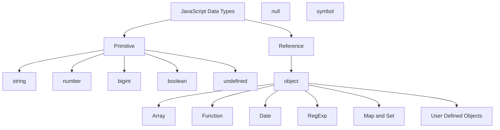
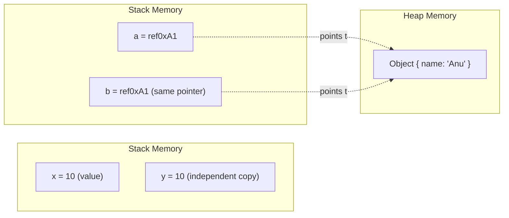
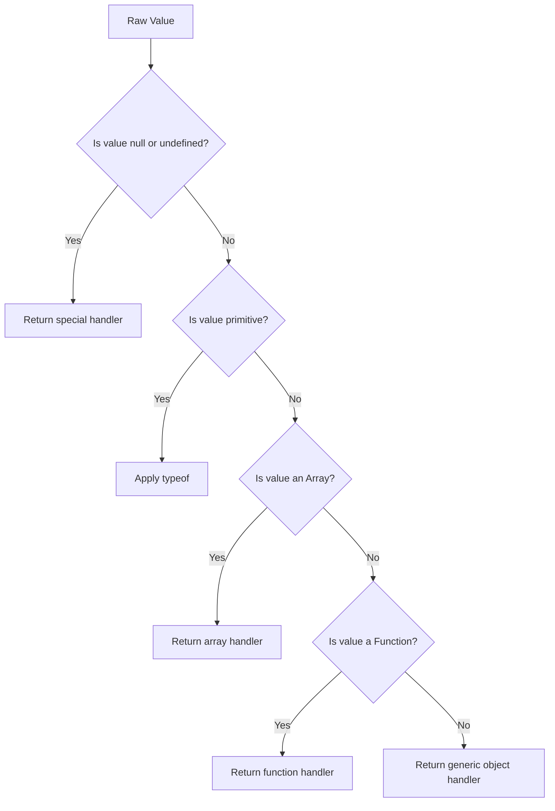
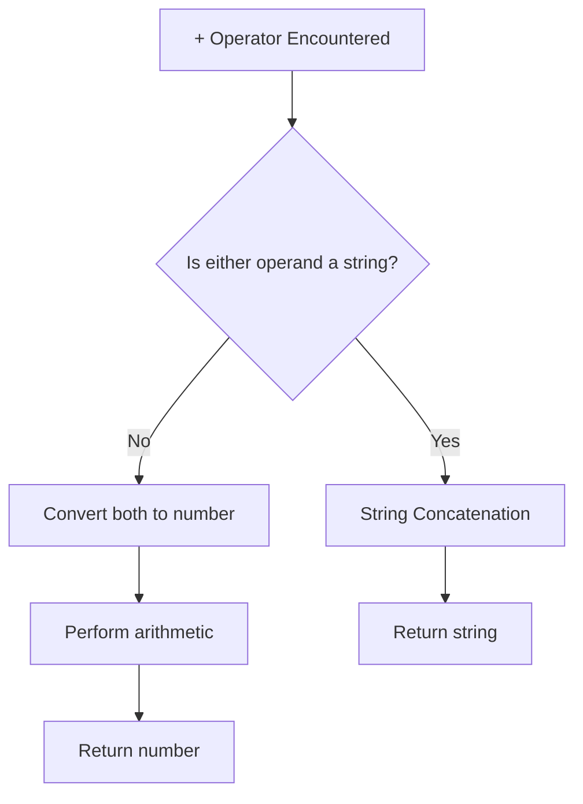
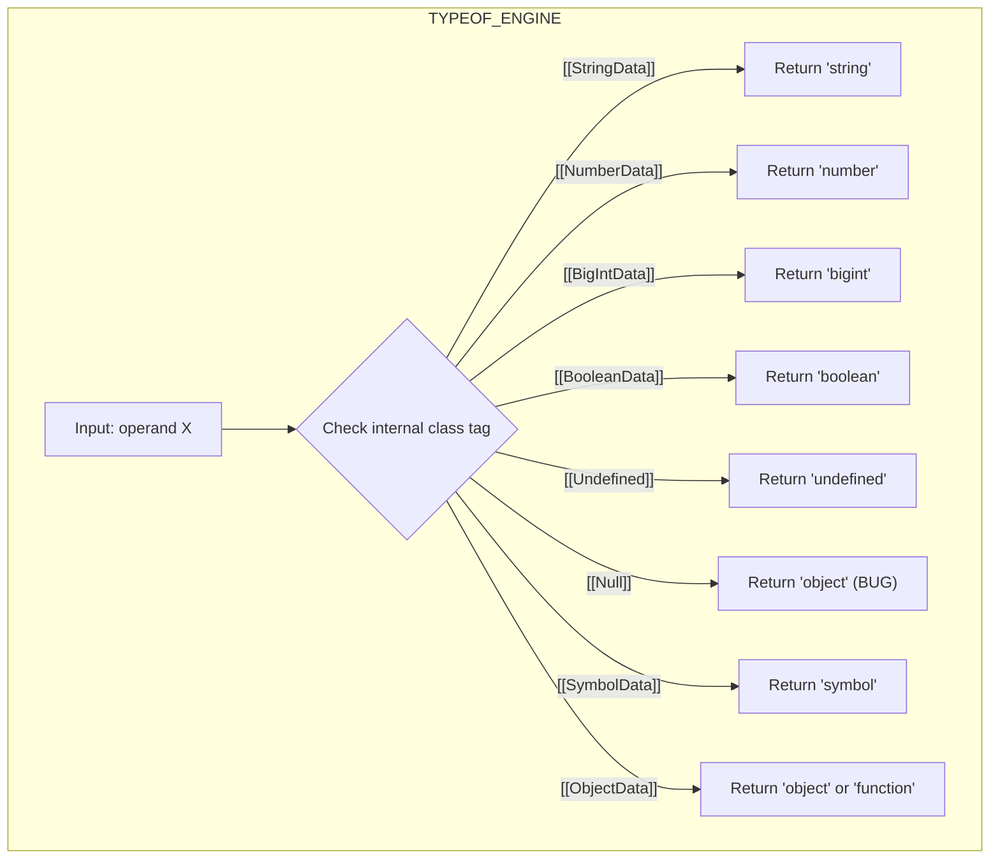

# Data Types

<!-- SECTION_1_START -->
# Data Types in Scripting Language

> [!NOTE]
> **KTU 2024 Scheme Focus:** This topic falls under **Module 2 – Scripting Language** of the course *Web Programming (PECST742)*. It is a foundational concept that directly maps to **CO1 (Understand the core principles of client-side and server-side scripting)** and is examined frequently under Bloom's *Remember* and *Understand* levels.

---

## 1.1 Formal Academic Definition

In the context of scripting languages used for web programming (such as **JavaScript**, **PHP**, or **Python**), a **Data Type** is a classification that specifies which type of value a variable can hold and what operations can be performed on it without causing a type error. Scripting languages are predominantly **dynamically typed** (a.k.a. *loosely typed*), meaning the interpreter or virtual machine assigns the type to a variable at runtime based on the literal value assigned, rather than at compile time.

In the KTU 2024 Scheme, the canonical reference scripting language is **JavaScript (ECMAScript ES6+)**. JavaScript defines **8 fundamental data types** partitioned into two families:

1. **Primitive Data Types** – Immutable, stored by value.
2. **Non-Primitive (Reference) Data Types** – Mutable, stored by reference (pointer to memory location).

| Family | Members |
|---|---|
| Primitive | `string`, `number`, `bigint`, `boolean`, `undefined`, `null`, `symbol` |
| Non-Primitive | `object` (includes `Array`, `Function`, `Date`, `RegExp`, custom objects) |

> [!IMPORTANT]
> **KTU Board Definition to Memorize:**
> *"A data type in a scripting language is an attribute of data that tells the interpreter how the programmer intends to use the data. Primitive types are atomic and immutable; reference types are composite and mutable."*

---

## 1.2 Conceptual Analogy / Intuition

Imagine you own a **warehouse with labeled storage bins**:

- **Primitive values** are like the **raw goods** sitting inside a bin — a bag of sugar (`number`), a sealed parcel (`string`), a switch in ON/OFF state (`boolean`). You cannot *modify* the bag of sugar; you must **replace** it with a new bag. When you "copy" the bin, you get a **new identical bag** in a new bin.

- **Reference values** are like a **whiteboard mounted on the wall** (the `object`). Many people can be handed a *sticky note* with the whiteboard's *location* (the reference). If one person writes on the whiteboard, **everyone holding the sticky note sees the change** — they are all looking at the same wall.

This is the single most important intuition for KTU questions on `===` vs `==`, pass-by-value vs pass-by-reference, and shallow vs deep copying.

---

## 1.3 Explicit Constants & Standard Metrics

The following must be memorized verbatim for KTU viva and 2-mark questions:

- **Max safe integer in JavaScript:** $\mathbf{2^{53} - 1} = \mathbf{9{,}007{,}199{,}254{,}740{,}991}$ (this is `Number.MAX_SAFE_INTEGER`).
- **`typeof null` returns `"object"`** — a famous, preserved historical bug in JavaScript.
- **All primitive types in JavaScript** have corresponding wrapper objects: `String`, `Number`, `Boolean`, `BigInt`, `Symbol`.

> [!VISUALIZATION CONTROL]
> **Concept:** Memory allocation difference between primitive and reference types.
> **Visual Description:** Draw two columns. Left column shows 3 independent small boxes (one per primitive copy) labeled `x = 10`, `y = x`, `z = y`. Right column shows 1 large object heap and 3 pointer arrows from variables `a`, `b`, `c` all converging into it. Students should observe that mutating the heap reflects in all three variables.

<!-- SECTION_1_END -->

<!-- SECTION_2_START -->
# Deep Theoretical Analysis & KTU High-Yield Formula Sheet

## 2.1 The Eight JavaScript Data Types — Operational Breakdown

### A. Primitive Types (7 total)

#### 1. `string`
- Represents a sequence of **UTF-16 code units** (basically, textual characters).
- Can be enclosed in **single quotes** (`'...'`), **double quotes** (`"..."`), or **backticks** (`` `...` ``).
- Backticks enable **template literals** with embedded expressions using `${ }` syntax.
- **Immutability:** A string cannot be modified after creation. Methods like `toUpperCase()` return a *new* string.
- The `.length` property returns the count of code units, *not* the count of visual characters (relevant for emojis / surrogate pairs).

#### 2. `number`
- A **64-bit IEEE 754 double-precision floating-point** value.
- Covers integers and decimals in a single type (no separate `int` / `float`).
- Special values: `Infinity`, `-Infinity`, `NaN` (Not a Number).
- Safe integer range: $-(2^{53} - 1)$ to $2^{53} - 1$.

#### 3. `bigint`
- Introduced in **ES2020** to represent integers of arbitrary precision.
- Created by appending `n` to an integer literal: `9007199254740993n`.
- Cannot be mixed with `number` without explicit conversion (throws `TypeError`).

#### 4. `boolean`
- Logical entity with only two values: `true` and `false`.
- Used heavily in control flow (`if`, `while`, ternary `?:`).

#### 5. `undefined`
- A variable that has been **declared but not assigned** automatically holds `undefined`.
- It is also the return value of a function with no `return` statement.
- It is a **property of the global object** (`window.undefined` in browsers).

#### 6. `null`
- Represents the **intentional absence of any object value**.
- Must be explicitly assigned: `let user = null;`.
- `typeof null === "object"` (this is a long-standing bug preserved for compatibility).

#### 7. `symbol`
- Introduced in **ES6 (2015)**.
- Every value returned from `Symbol()` is **unique and immutable**.
- Used primarily as **object property keys** to avoid name collisions (e.g., library metadata).

### B. Non-Primitive (Reference) Type (1 total, with subcategories)

#### 8. `object`
- A **mutable, keyed collection** of properties.
- Subtypes include: `Array`, `Function`, `Date`, `RegExp`, `Map`, `Set`, `WeakMap`, `WeakSet`, `Error`, `Promise`, and user-defined classes.
- Stored on the **heap**; variables hold a **reference (memory address)**, not the value.

---

## 2.2 The `typeof` Operator — Board Favorite

The `typeof` operator returns a string indicating the data type of its operand.

| Expression | Result | Notes |
|---|---|---|
| `typeof "hello"` | `"string"` | |
| `typeof 42` | `"number"` | |
| `typeof 42n` | `"bigint"` | |
| `typeof true` | `"boolean"` | |
| `typeof undefined` | `"undefined"` | |
| `typeof null` | `"object"` | **Historical bug** |
| `typeof Symbol()` | `"symbol"` | |
| `typeof {}` | `"object"` | |
| `typeof []` | `"object"` | Arrays are objects! |
| `typeof function(){}` | `"function"` | Function is *callable* object |

---

## 2.3 Type Coercion vs Type Conversion

- **Type Conversion (Explicit):** Developer manually converts using functions: `Number("123")`, `String(42)`, `Boolean(0)`.
- **Type Coercion (Implicit):** JavaScript engine automatically converts during operations: `"5" + 3` → `"53"` (string wins for `+`); `"5" - 3` → `2` (number wins for `-`).

> [!IMPORTANT]
> **Falsy Values (8 in JavaScript):** `false`, `0`, `-0`, `0n`, `""`, `null`, `undefined`, `NaN`. Everything else is **truthy**, including `"0"`, `"false"`, `[]`, `{}`.

---

## 2.4 Equality Operators

| Operator | Name | Behavior |
|---|---|---|
| `==` | Loose equality | Performs type coercion before comparison |
| `===` | Strict equality | No coercion; type AND value must match |

KTU 2024 emphasizes `===` as the **professional standard** ("always use `===`").

---

## 2.5 KTU High-Yield Formula Sheet

> [!NOTE]
> The following table consolidates all board-examinable formulae, rules, and operators for this topic.

| Concept | Rule / Formula | Example | Unit / Note |
|---|---|---|---|
| Primitive storage | Stored on **stack** as value | `let a = 5;` | Bytes per type |
| Reference storage | Stored on **heap**, variable holds pointer | `let obj = {};` | Pointer size = 8 bytes (64-bit) |
| `typeof` rule | `typeof null === "object"` | Always returns `"object"` | Browser bug since ES1 |
| `+` operator | If either operand is `string` → concat | `"5" + 3 = "53"` | Left-to-right evaluation |
| `-` `*` `/` `%` operators | Coerce to `number` | `"5" - 3 = 2` | Math first |
| Falsy count | Exactly **8 falsy** values | `Boolean([]) === true` | Tricky! |
| Max safe int | $2^{53} - 1$ | `9007199254740991` | Beyond this, precision lost |
| Symbol uniqueness | `Symbol() !== Symbol()` | Always unique | Even with same description |
| Template literal | `` `Hello ${name}` `` | Embeds expressions | ES6 feature |
| `===` rule | Same type AND same value | `5 === "5"` → `false` | KTU preferred operator |

---

## 2.6 Real-World Engineering Utility

- **Form validation** in client-side scripts relies on `boolean` checks and `string` regex testing.
- **JSON APIs** exchange data between client and server as `string` (which must be parsed via `JSON.parse()` to become `object`).
- **`bigint`** is used in **cryptographic libraries** and **financial calculations** where integer precision beyond $2^{53}$ is required.
- **Symbol** keys in objects enable **metaprogramming** (custom `Symbol.iterator` makes objects iterable — used heavily in frameworks like Redux and MobX).
- **`typeof` checks** are used in **defensive programming** before performing operations on dynamic API responses.

<!-- SECTION_2_END -->

<!-- SECTION_3_START -->
# Step-by-Step Derivations & Code Implementation

## 3.1 Primitive Type Behavior — Full Exhaustive Walkthrough

Below is a complete, line-by-line annotated program that demonstrates **all 7 primitive types** in JavaScript. The student is expected to be able to reproduce this on a board or in a KTU lab exam.

```javascript
// =============================================================
// File: primitive_types_demo.js
// Purpose: Demonstrate all 7 JavaScript primitive data types
// Run with: node primitive_types_demo.js
// =============================================================

// ---------- 1. string ----------
let greeting = "Hello, KTU";
let templateLiteral = `Welcome to ${greeting}`;   // Template literal
console.log(typeof greeting);                       // "string"
console.log(greeting.length);                       // 11
console.log(greeting.toUpperCase());                // "HELLO, KTU" (new string)
console.log(greeting === "Hello, KTU");             // true

// ---------- 2. number ----------
let integerVal = 42;
let floatVal   = 3.14159;
let infinityVal = Infinity;
let nanVal      = 0 / 0;                            // NaN
console.log(typeof integerVal);                     // "number"
console.log(Number.isInteger(integerVal));          // true
console.log(Number.isNaN(nanVal));                  // true
console.log(Number.MAX_SAFE_INTEGER);               // 9007199254740991

// ---------- 3. bigint ----------
let hugeNumber = 9007199254740993n;                 // Note the trailing 'n'
let bigResult  = hugeNumber + 10n;                  // 9007199254740993n + 10n
console.log(typeof hugeNumber);                     // "bigint"
console.log(bigResult);                             // 9007199254740993n + 10n = ...

// ❌ Mixing number and bigint throws TypeError:
// let badMix = hugeNumber + 1;                     // TypeError: Cannot mix BigInt

// ---------- 4. boolean ----------
let isActive  = true;
let isBlocked = false;
console.log(typeof isActive);                       // "boolean"
console.log(Boolean(0));                            // false
console.log(Boolean(""));                           // false
console.log(Boolean("KTU"));                        // true

// ---------- 5. undefined ----------
let notAssigned;
console.log(notAssigned);                           // undefined
console.log(typeof notAssigned);                    // "undefined"

function noReturn() { /* no return statement */ }
console.log(noReturn());                            // undefined

// ---------- 6. null ----------
let emptyValue = null;
console.log(emptyValue);                            // null
console.log(typeof emptyValue);                     // "object"  ← historical bug

// ---------- 7. symbol ----------
let sym1 = Symbol("id");
let sym2 = Symbol("id");
console.log(sym1 === sym2);                         // false (always unique)
console.log(typeof sym1);                           // "symbol"

// Use as object key (avoids collision)
let userObj = { [sym1]: "secretValue", name: "Anu" };
console.log(userObj[sym1]);                         // "secretValue"
```

**Exhaustive type-check table** that the script produces:

| Variable | `typeof` Result | Notes |
|---|---|---|
| `greeting` | `"string"` | Template literal supported |
| `integerVal` | `"number"` | IEEE 754 double |
| `hugeNumber` | `"bigint"` | Arbitrary precision |
| `isActive` | `"boolean"` | Logical primitive |
| `notAssigned` | `"undefined"` | Default for uninitialized |
| `emptyValue` | `"object"` | **Known bug** |
| `sym1` | `"symbol"` | ES6 unique token |

---

## 3.2 Reference Type Behavior — Pass-by-Reference Demonstration

```javascript
// =============================================================
// File: reference_types_demo.js
// Purpose: Show that objects are passed by reference
// =============================================================

let personA = { name: "Anu", age: 20 };
let personB = personA;             // Copies the REFERENCE, not the object

personB.age = 21;                  // Mutates the shared heap object

console.log(personA.age);          // 21  (changed!)
console.log(personB.age);          // 21

console.log(personA === personB);  // true  (same memory address)

// To create a true independent copy -> use spread operator (shallow copy)
let personC = { ...personA };
personC.age = 99;
console.log(personA.age);          // 21 (unchanged)
console.log(personC.age);          // 99

// Deep copy for nested objects -> use structuredClone (ES2021)
let nested = { a: 1, inner: { b: 2 } };
let deepCopy = structuredClone(nested);
deepCopy.inner.b = 999;
console.log(nested.inner.b);       // 2 (unchanged)
```

---

## 3.3 Type Coercion Edge Cases — Board-Favorite Traps

```javascript
// =============================================================
// File: coercion_pitfalls.js
// =============================================================

console.log("5" + 3);          // "53"  -> + with string does concatenation
console.log("5" - 3);          // 2     -> - forces numeric coercion
console.log("5" * "2");        // 10
console.log(true + true);      // 2     -> true coerced to 1
console.log(true + false);     // 1
console.log(null + 1);         // 1     -> null coerced to 0
console.log(undefined + 1);    // NaN   -> undefined -> NaN
console.log("" == false);      // true  -> both coerce to 0
console.log(null == undefined);// true  -> special rule
console.log(NaN == NaN);       // false -> NaN is not equal to itself!

// Strict equality avoids all the above surprises
console.log("5" === 5);        // false
console.log(null === undefined); // false
```

---

## 3.4 Falsy & Truthy Truth Table (Definitive)

```javascript
// Quick check function for the 8 falsy values
function isFalsy(value) {
    // Boolean() is the canonical conversion function
    return !Boolean(value);
}

const testValues = [
    false, 0, -0, 0n, "", null, undefined, NaN,   // 8 falsy
    "0", "false", [], {}, function(){}            // truthy surprises
];

testValues.forEach(v => {
    console.log(`${String(v).padEnd(12)} | ${isFalsy(v) ? "FALSY" : "TRUTHY"}`);
});
```

**Output:**

```
false       | FALSY
0           | FALSY
-0          | FALSY
0n          | FALSY
            | FALSY
null        | FALSY
undefined   | FALSY
NaN         | FALSY
0           | TRUTHY     ← non-empty string
false       | TRUTHY     ← non-empty string
            | TRUTHY     ← empty array
[object Object] | TRUTHY  ← empty object
function(){}| TRUTHY
```

---

## 3.5 Symbolic / Mathematical Notation for Type Systems

Although JavaScript is dynamic, we can represent type-checking mathematically. Let $T$ be a type function $T: \text{Value} \to \text{TypeSet}$.

The strict equality operator $\equiv$ (i.e., `===`) is defined as:

$$a \equiv b \iff T(a) = T(b) \;\land\; V(a) = V(b)$$

where $T(x)$ is the runtime type of $x$ and $V(x)$ is its value.

The loose equality operator $\doteq$ (i.e., `==`) applies an implicit coercion function $\phi$:

$$a \doteq b \iff \phi(T(a), T(b), a, b) = \text{true}$$

For example, when comparing `null` and `undefined`:

$$\phi(\text{null}, \text{undefined}, \cdot, \cdot) = \text{true} \quad \text{(special rule)}$$

But for any other combination:

$$\phi(\text{null}, x, \cdot, \cdot) = \text{false} \quad \text{for } x \neq \text{undefined}$$

The coercion table for `+` operator can be expressed as:

$$T(a + b) = \begin{cases} \text{string} & \text{if } T(a) = \text{string} \lor T(b) = \text{string} \\ \text{number} & \text{otherwise} \end{cases}$$

<!-- SECTION_3_END -->

<!-- SECTION_4_START -->
# Structural Diagrams & Schematics

## 4.1 Hierarchical Taxonomy of JavaScript Data Types



> [!NOTE]
> In the above diagram, `null` is intentionally shown as a peer to `undefined` to emphasize it is classified as primitive per the ECMAScript spec, even though `typeof` reports it as `"object"`.

---

## 4.2 Memory Architecture — Stack vs Heap



**Observation:** Mutating `OBJ1` through `a` is visible through `b`; mutating `x` does **not** affect `y`.

---

## 4.3 Sequential Processing Topology — Type Checking Pipeline



---

## 4.4 Coercion Flow for the `+` Operator



---

## 4.5 Subgraph: `typeof` Decision Table (Modular Isolation)



<!-- SECTION_4_END -->

<!-- SECTION_5_START -->
# KTU 2024 Scheme Examination Question Bank & Topic Recap

## Part A — 3 Mark Questions (Short Answer)

### Q1. `[KTU University Exam – July 2024, Model Question]`
**List the primitive data types in JavaScript. What is the output of `typeof null` and why?** **[CO1, Remember] — 3 Marks**

**Model Answer (Valuation Key):**
JavaScript has **7 primitive data types**: `string`, `number`, `bigint`, `boolean`, `undefined`, `null`, and `symbol` **[2 Marks]**.
`typeof null` returns `"object"` **[0.5 Mark]**. This is a historical bug in the language preserved for backward compatibility; `null` is represented as a null pointer using the same internal object tag as objects **[0.5 Mark]**.

---

### Q2. `[KTU University Exam – Dec 2023, Repeated Pattern]`
**Differentiate between primitive and reference data types with one example each.** **[CO1, Understand] — 3 Marks**

**Model Answer (Valuation Key):**

| Aspect | Primitive | Reference |
|---|---|---|
| Mutability | Immutable | Mutable |
| Storage | Stack (value) | Heap (pointer in stack) |
| Copy semantics | Pass by value | Pass by reference |
| Example | `let x = 5;` | `let obj = {a: 1};` |

**Distribution:** Each correct row: **0.75 Mark** (Total 3 Marks).

---

## Part B — 14 Mark Questions (ESE Module Internal Choice)

### Question A `[KTU University Exam – July 2024 Pattern]`

**(a)** Explain the eight falsy values in JavaScript. Write a program to demonstrate that `[] == false` evaluates to `true` while `[] === false` evaluates to `false`. **[7 Marks, CO1, Understand]**

**(b)** Discuss the difference between implicit type coercion and explicit type conversion. Provide three illustrative examples covering the `+`, `-`, and `==` operators. **[7 Marks, CO1, Apply]**

---

#### Model Solution (a)

**Eight Falsy Values:** `false`, `0`, `-0`, `0n`, `""` (empty string), `null`, `undefined`, `NaN` **[2 Marks]**.

**Explanation of the example:**
- `[] == false` uses *loose equality*. The JavaScript engine first converts both sides to a number: `[]` → `0` (empty array is coerced via `toPrimitive` then `toNumber` which gives `0`), and `false` → `0`. Then `0 == 0` is `true` **[2 Marks]**.

```javascript
console.log([] == false);   // true
```

- `[] === false` uses *strict equality*. No coercion occurs. The types are different (`object` vs `boolean`), so the result is `false` **[2 Marks]**.

```javascript
console.log([] === false);  // false
console.log(typeof []);     // "object"
console.log(typeof false);  // "boolean"
```

**Conclusion:** Always prefer `===` in production code to avoid surprising coercion **[1 Mark]**.

---

#### Model Solution (b)

**Type Conversion (Explicit):** The developer manually invokes a conversion function **[1 Mark]**.

```javascript
let str = "123";
let num = Number(str);    // Explicit -> 123 (number)
let back = String(num);   // Explicit -> "123" (string)
```

**Type Coercion (Implicit):** The JavaScript engine automatically converts types during operations **[1 Mark]**.

**Three Illustrative Examples:**

**Example 1 — `+` operator:**
```javascript
console.log("Result: " + 5);   // "Result: 5"   (string concat)
console.log("5" + 3);          // "53"          (string wins)
```
**Logic:** Since one operand is a string, `+` performs concatenation **[1 Mark]**.

**Example 2 — `-` operator:**
```javascript
console.log("10" - 5);         // 5   (number subtraction)
console.log("abc" - 5);        // NaN
```
**Logic:** `-` has no string semantics, so both operands are coerced to numbers. `"abc"` cannot be converted, yielding `NaN` **[1 Mark]**.

**Example 3 — `==` operator:**
```javascript
console.log(null == undefined); // true   (special rule)
console.log(null == 0);         // false  (null only == null/undefined)
console.log("0" == false);      // true   (both coerce to 0)
```
**Logic:** `==` performs Abstract Equality Comparison, which applies coercion rules defined in the ECMAScript specification **[2 Marks]**.

---

### Question B `[KTU University Exam – Dec 2023 Pattern]`

**(a)** What is the `typeof` operator? Construct a complete reference table showing the output of `typeof` for each of the eight JavaScript data types, including the null anomaly. **[7 Marks, CO1, Remember + Understand]**

**(b)** With suitable code examples, explain the concept of *pass-by-value* for primitives and *pass-by-reference* for objects. Demonstrate a deep copy using `structuredClone()`. **[7 Marks, CO1, Apply]**

---

#### Model Solution (a)

**Definition:** `typeof` is a unary operator in JavaScript that returns a string indicating the data type of its operand. It does **not** throw errors on undeclared variables (returns `"undefined"`) **[2 Marks]**.

**Complete Reference Table:** **[5 Marks — 0.5 each + 0.5 for the anomaly explanation]**

| Expression | `typeof` Result | Notes |
|---|---|---|
| `typeof "hello"` | `"string"` | UTF-16 text |
| `typeof 42` | `"number"` | IEEE 754 double |
| `typeof 42n` | `"bigint"` | Arbitrary precision integer |
| `typeof true` | `"boolean"` | Logical type |
| `typeof undefined` | `"undefined"` | Uninitialized |
| `typeof null` | `"object"` | **Historical bug** |
| `typeof Symbol()` | `"symbol"` | Unique ES6 token |
| `typeof {}` | `"object"` | Generic object |
| `typeof []` | `"object"` | Arrays are objects |
| `typeof function(){}` | `"function"` | Callable object |

---

#### Model Solution (b)

**Pass-by-value (Primitives):** A copy of the actual value is passed; modifications inside a function do not affect the outer variable **[2 Marks]**.

```javascript
function increment(n) {
    n = n + 1;
    console.log("Inside:", n);   // 11
}
let x = 10;
increment(x);
console.log("Outside:", x);      // 10 (unchanged)
```

**Pass-by-reference (Objects):** A reference (memory address) is passed; mutations inside the function are reflected outside **[2 Marks]**.

```javascript
function rename(user) {
    user.name = "Anu Updated";
}
let person = { name: "Anu" };
rename(person);
console.log(person.name);        // "Anu Updated" (changed!)
```

**Deep Copy with `structuredClone()`:** Copies nested objects recursively so all levels are independent **[3 Marks]**.

```javascript
let original = {
    name: "Anu",
    scores: { maths: 95, cs: 99 }
};

let clone = structuredClone(original);
clone.scores.maths = 50;

console.log(original.scores.maths);  // 95  (untouched)
console.log(clone.scores.maths);     // 50  (mutated copy)
```

**Key Insight:** Shallow copy (`{...obj}`) would only clone the top level; nested objects would still share references.

---

> [!WARNING]
> **KTU Examiner's Valuation Warning — Common Pitfalls:**
> 1. **Do not** write "`null` is an object" without explaining it is a **bug** preserved for backward compatibility. Examiners deduct 1 mark if the anomaly is not acknowledged.
> 2. **Do not** claim JavaScript is *"untyped"*. It is **dynamically typed** — types exist at runtime but are not declared.
> 3. **Do not** forget that `[] == false` is `true` but `[] === false` is `false`. This single distinction is worth 2–3 marks in most KTU papers.
> 4. **Do not** use `var` in modern code examples. Prefer `let` / `const` (ES6+). KTU 2024 Scheme expects familiarity with current syntax.
> 5. **Do not** confuse `bigint` syntax `123n` with `float` syntax `1.23n` — `bigint` cannot have a decimal point.
> 6. **Do not** omit the **8 falsy values** enumeration — questions phrased as "list falsy values" carry 2–3 marks for the full list.

---

## 📌 Topic Recap & Important Things to Remember

- ✅ JavaScript has **8 total data types**: **7 primitives** + **1 reference** (`object`).
- ✅ Primitives: `string`, `number`, `bigint`, `boolean`, `undefined`, `null`, `symbol`.
- ✅ Reference type: `object` (and its sub-types: Array, Function, Date, RegExp, Map, Set, etc.).
- ✅ Primitives are **immutable** and **stored by value**; objects are **mutable** and **stored by reference**.
- ✅ `typeof null` returns `"object"` — **historical bug**, must mention in answers.
- ✅ `typeof []` returns `"object"`; use `Array.isArray(x)` to check for arrays.
- ✅ `typeof function(){}` returns `"function"` (special case for callable objects).
- ✅ **Max safe integer** for `number` is $2^{53} - 1$ = **9,007,199,254,740,991**; use `bigint` beyond that.
- ✅ **`bigint`** is created by appending `n` to an integer literal: `100n`. Cannot mix with `number`.
- ✅ **`symbol`** values are **always unique**, even with the same description. Used as unique object keys.
- ✅ **8 falsy values**: `false`, `0`, `-0`, `0n`, `""`, `null`, `undefined`, `NaN`. Everything else is truthy (including `[]`, `{}`, `"0"`, `"false"`).
- ✅ **`+` operator** concatenates if **either** operand is a string; otherwise performs numeric addition.
- ✅ **`-`, `*`, `/`, `%`** always coerce to numbers; non-numeric strings yield `NaN`.
- ✅ **`===` (strict)** checks both type and value; **`==` (loose)** performs type coercion first.
- ✅ **`NaN` is not equal to itself** (`NaN === NaN` is `false`); use `Number.isNaN(x)` to test.
- ✅ **`null == undefined`** is `true`, but **`null === undefined`** is `false`.
- ✅ **Shallow copy**: `{...obj}` or `Object.assign({}, obj)`. **Deep copy**: `structuredClone(obj)` (ES2021+).
- ✅ For KTU 2024 Scheme, always use **modern ES6+ syntax** (`let`, `const`, arrow functions, template literals).

<!-- SECTION_5_END -->
