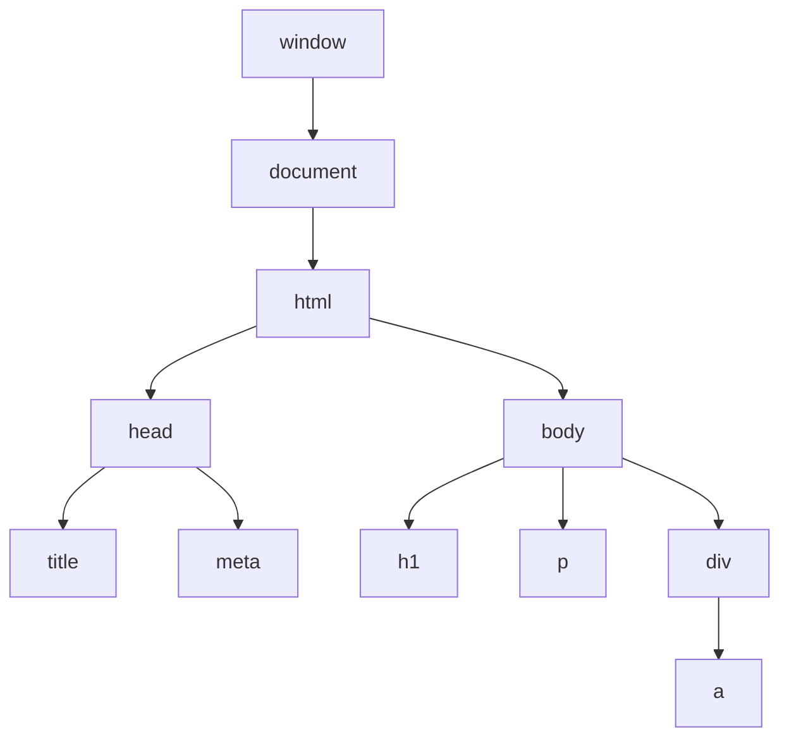
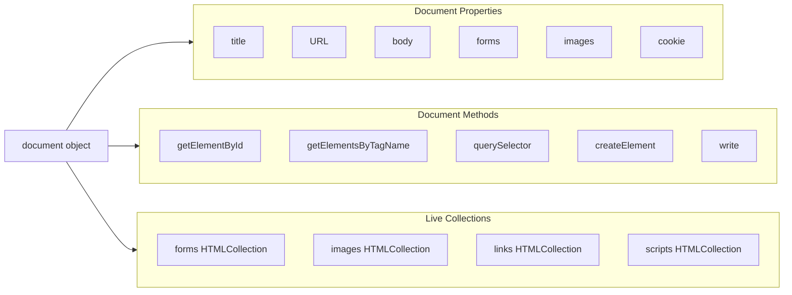
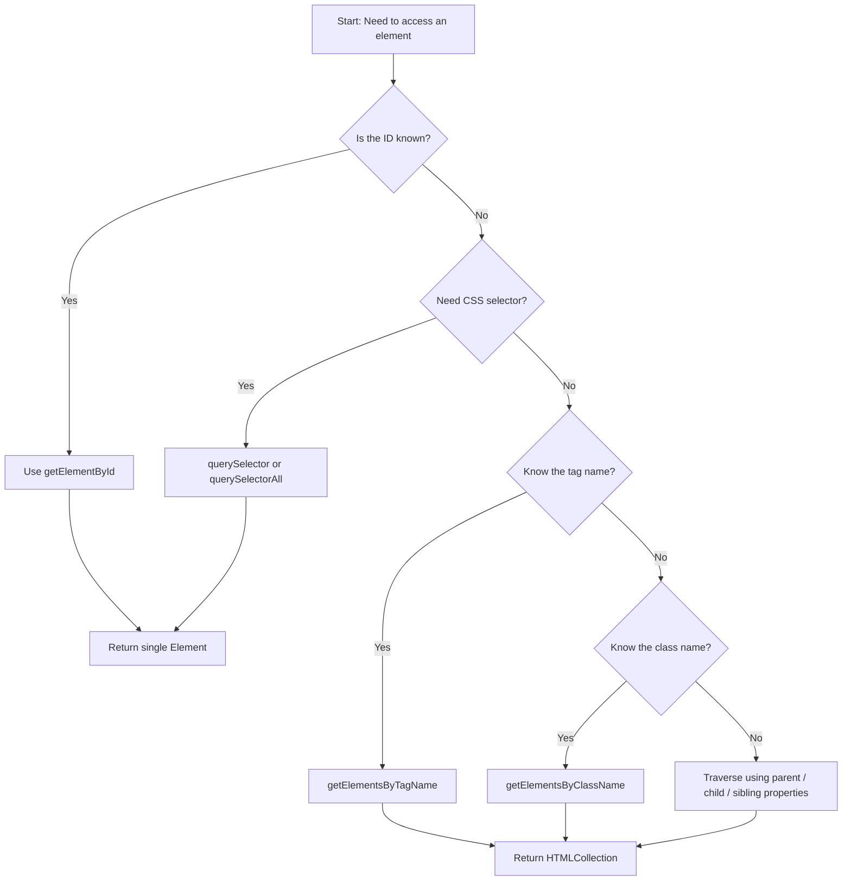
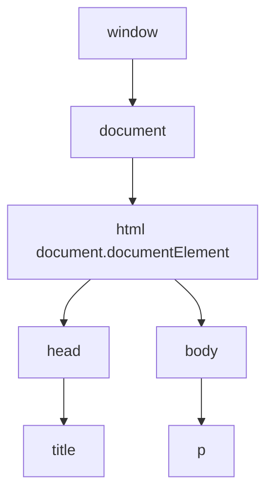

# Document Object

<!-- SECTION_1_START -->
# The Document Object in JavaScript DOM

> [!IMPORTANT]
> **KTU 2024 Scheme | PECST742 – Web Programming | Module 2: Scripting Language**
> **Topic:** Document Object
> **Mapped CO:** CO2 – Design dynamic and interactive web pages using client-side scripting.

## 1. Formal Definition (KTU Syllabus Terminology)

The **Document Object** is the **root node** of the Document Object Model (DOM) tree and represents the entire HTML or XML document loaded inside the browser window. It is a property of the `window` object (i.e., `window.document`) and serves as the **entry point** through which JavaScript can access, manipulate, and modify every element, attribute, and text node of the web page dynamically.

In simple terms, when a browser parses an HTML file, it builds a **tree-like structure** (the DOM). The `document` object is the **base of that tree** — every other element (head, body, div, p, etc.) descends from it.

> [!NOTE]
> **Key Properties of the Document Object**
> - It is a **property of the `window` object** → `window.document` or simply `document`.
> - It belongs to the **Browser Object Model (BOM)** interface and the **DOM Core (Level 1, 2, 3)** specification defined by the **W3C**.
> - It is a **predefined object** — you do not need to instantiate it. It is automatically created by the browser when a page is loaded.

## 2. Conceptual Analogy / Intuition

Imagine a **large office building**:
- The **building itself** is the `document` object.
- Every **floor, room, desk, and person inside** is a node/element of the DOM tree.
- To rearrange furniture, change a room's name, or add a new employee, you must first enter the **building** (i.e., access `document`).

**Geometric/Tree Intuition:**

```text
        document  (root)
            |
        <html>
        /    \
   <head>   <body>
    |         |
  <title>   <h1>, <p>, <div> ...
```

Each box is a **node**. The `document` is the **single root** from which every other node branches.

> [!TIP]
> **Exam Tip:** When asked to define the Document Object, always mention: *"It is the root node of the DOM tree and a property of the `window` object, representing the entire HTML document loaded in the browser."*

## 3. Standard Reference & Highlight

> [!IMPORTANT]
> **W3C Reference Standard:** DOM is officially defined by the **World Wide Web Consortium (W3C)**. The current stable recommendation is **DOM Level 4 (2015)** integrated into the **WHATWG DOM Living Standard**.

The `document` object implements multiple interfaces: **`HTMLDocument`** (specific to HTML), **`XMLDocument`** (for XML), and inherits from **`Node`** and **`EventTarget`**.

<!-- SECTION_1_END -->

<!-- SECTION_2_START -->
# Deep Theoretical Analysis & KTU High-Yield Reference Sheet

## 1. Hierarchical Position of `document`

The JavaScript object hierarchy inside a browser is structured as:

```text
window
 └── document  (this entire object)
      └── html
           ├── head → title, meta, link, script ...
           └── body → h1, p, div, form, table ...
```

Every property/method used to manipulate the page is accessed **via `document`**.

## 2. Categories of Document Object Members

The `document` object exposes its functionality through **three logical categories**:

| Category | Purpose | Examples |
|---|---|---|
| **Properties** | Hold metadata about the document or collections of elements | `document.title`, `document.URL`, `document.body`, `document.forms` |
| **Methods** | Perform actions like searching the DOM or writing content | `document.getElementById()`, `document.write()`, `document.querySelector()` |
| **Collections** | Live HTMLCollections of related elements (auto-updated) | `document.forms`, `document.images`, `document.links`, `document.anchors` |

## 3. KTU High-Yield Document Object Properties Sheet

> [!IMPORTANT]
> The following table is **exam-critical**. Memorize the data type and the exact return value pattern.

| Property | Returns / Type | Description |
|---|---|---|
| `document.title` | `String` | Sets/returns the text inside `<title>` tag |
| `document.URL` | `String` | Returns the full URL of the document |
| `document.domain` | `String` | Returns the domain name of the document server |
| `document.referrer` | `String` | Returns the URL of the document that loaded this one |
| `document.lastModified` | `String` | Returns the date/time the document was last modified |
| `document.cookie` | `String` | Reads/writes cookies in `key=value;` format |
| `document.body` | `HTMLElement` | Direct reference to `<body>` |
| `document.head` | `HTMLElement` | Direct reference to `<head>` |
| `document.images` | `HTMLCollection` | Live collection of all `` elements |
| `document.forms` | `HTMLCollection` | Live collection of all `<form>` elements |
| `document.links` | `HTMLCollection` | Collection of all `<a>` and `<area>` with `href` |
| `document.anchors` | `HTMLCollection` | Collection of all `<a>` with `name` attribute |
| `document.scripts` | `HTMLCollection` | Collection of all `<script>` elements |
| `document.embeds` | `HTMLCollection` | Collection of `<embed>` elements |
| `document.activeElement` | `Element` | Currently focused element |
| `document.doctype` | `DocumentType` | The `<!DOCTYPE>` declaration node |
| `document.readyState` | `String` | `"loading"`, `"interactive"`, or `"complete"` |

> [!NOTE]
> **`HTMLCollection` vs `NodeList`:**
> - `HTMLCollection` → live collection; auto-updates if DOM changes. Accessed by name, id, or index.
> - `NodeList` → static (mostly); obtained from `querySelectorAll()`. Accessed only by index.

## 4. KTU High-Yield Document Object Methods Sheet

| Method | Purpose | Returns |
|---|---|---|
| `document.getElementById(id)` | Finds an element by its `id` attribute | Single `Element` or `null` |
| `document.getElementsByClassName(cls)` | Finds elements by class name | Live `HTMLCollection` |
| `document.getElementsByTagName(tag)` | Finds elements by tag name (e.g., `"p"`) | Live `HTMLCollection` |
| `document.getElementsByName(name)` | Finds elements by `name` attribute | Live `NodeList` |
| `document.querySelector(selector)` | First match of a CSS selector | Single `Element` or `null` |
| `document.querySelectorAll(selector)` | All matches of a CSS selector | Static `NodeList` |
| `document.createElement(tag)` | Creates a new element node | `Element` |
| `document.createTextNode(text)` | Creates a new text node | `Text` |
| `document.write(text)` | Writes text/HTML directly into the document stream | `undefined` |
| `document.writeln(text)` | Same as `write()` but adds a newline | `undefined` |
| `document.open()` | Opens a new document stream for `write()` | `Document` |
| `document.close()` | Closes the document stream | `undefined` |
| `document.hasFocus()` | Checks whether the document has focus | `Boolean` |
| `document.addEventListener(evt, fn)` | Attaches an event handler | `void` |

## 5. Real-World Engineering Utility

> [!TIP]
> The Document Object is the **foundation of Single Page Applications (SPAs)** built with React, Angular, or Vue. Frameworks internally use `document.createElement`, `document.querySelectorAll`, and event listeners to perform **Virtual DOM diffing and reconciliation**. Every modern dynamic website (Gmail, Facebook, LinkedIn) uses `document` methods for real-time content updates **without full page reloads** (AJAX + DOM manipulation).

<!-- SECTION_2_END -->

<!-- SECTION_3_START -->
# Step-by-Step Implementations & Code

## 1. Accessing Common Document Properties

```html
<!DOCTYPE html>
<html lang="en">
<head>
    <meta charset="UTF-8">
    <title>Document Object Demo</title>
    <script>
        // Run after the DOM is fully parsed
        window.addEventListener("load", function () {
            console.log("Title       :", document.title);
            console.log("URL         :", document.URL);
            console.log("Domain      :", document.domain);
            console.log("Last Modified:", document.lastModified);
            console.log("Referrer    :", document.referrer);
            console.log("ReadyState  :", document.readyState);
            console.log("Body Element:", document.body.tagName);
        });
    </script>
</head>
<body>
    <h1>Open the console to view Document properties</h1>
</body>
</html>
```

**Explanation of each console line (valuation key points):**
- `document.title` → reads the text between `<title>` and `</title>`. **[1 mark]**
- `document.URL` → returns the full URL of the loaded page. **[1 mark]**
- `document.lastModified` → server-returned modification date. **[1 mark]**
- `document.body` → returns the `<body>` element; `.tagName` is `"BODY"`. **[1 mark]**

## 2. Locating Elements in the DOM

```html
<!DOCTYPE html>
<html>
<head>
    <title>Locating Elements</title>
    <script>
        function locateElements() {
            // (a) getElementById — returns ONE element
            let heading = document.getElementById("mainTitle");
            heading.style.color = "darkblue";

            // (b) getElementsByClassName — returns HTMLCollection
            let notes = document.getElementsByClassName("note");
            for (let i = 0; i < notes.length; i++) {
                notes[i].style.backgroundColor = "yellow";
            }

            // (c) getElementsByTagName — returns HTMLCollection
            let paragraphs = document.getElementsByTagName("p");
            console.log("Total <p> tags:", paragraphs.length);

            // (d) querySelector — first match using CSS selector
            let firstNote = document.querySelector(".note");
            firstNote.style.fontWeight = "bold";

            // (e) querySelectorAll — all matches, returns NodeList
            let allNotes = document.querySelectorAll(".note");
            console.log("NodeList size:", allNotes.length);
        }
    </script>
</head>
<body>
    <h1 id="mainTitle">Document Object Demo</h1>
    <p class="note">First paragraph.</p>
    <p class="note">Second paragraph.</p>
    <p>Third paragraph (no class).</p>
    <button onclick="locateElements()">Locate Elements</button>
</body>
</html>
```

**Valuation key for the script above:**
- Correct usage of `getElementById` returning one element: **[2 marks]**
- Correct iteration over `HTMLCollection` (live): **[2 marks]**
- Use of CSS selectors with `querySelector` / `querySelectorAll`: **[2 marks]**
- Demonstrating the difference between `HTMLCollection` and `NodeList`: **[1 mark]**

## 3. Creating and Inserting New Elements

```html
<!DOCTYPE html>
<html>
<head>
    <title>Dynamic Element Creation</title>
    <script>
        function addItem() {
            // Step 1: Create a new <li> element
            let newItem = document.createElement("li");

            // Step 2: Create a text node
            let itemText = document.createTextNode("New dynamically added item");

            // Step 3: Append text node into the <li>
            newItem.appendChild(itemText);

            // Step 4: Locate the existing <ul> and append the new <li>
            let list = document.getElementById("myList");
            list.appendChild(newItem);
        }
    </script>
</head>
<body>
    <h2>My Shopping List</h2>
    <ul id="myList">
        <li>Bread</li>
        <li>Milk</li>
    </ul>
    <button onclick="addItem()">Add Item</button>
</body>
</html>
```

**Step-by-step valuation key:**
- `document.createElement("li")` → creates element node. **[2 marks]**
- `document.createTextNode(...)` → creates text node. **[2 marks]**
- `appendChild()` used to attach child to parent. **[2 marks]**
- Correct final output visible in browser. **[1 mark]**

## 4. Using `document.write()` vs `document.writeln()`

```html
<!DOCTYPE html>
<html>
<head>
    <title>document.write Demo</title>
</head>
<body>
    <h1>Below content is written by JavaScript</h1>
    <script>
        document.write("Hello World using document.write<br>");
        document.writeln("This uses writeln — note the trailing newline.");
        document.writeln("writeln() only adds a newline in source view.");
    </script>
</body>
</html>
```

> [!WARNING]
> **Pitfall:** `document.write()` used **after** the page has finished loading will **erase the entire document**. Always use it only during page parsing, or use `innerHTML` / `DOM` manipulation for runtime changes.

## 5. Working with `document.forms` Collection

```html
<!DOCTYPE html>
<html>
<head>
    <title>Forms Collection Demo</title>
    <script>
        function showFormData() {
            // Access the first form in the document
            let formObj = document.forms[0];

            // Access a form element by its name attribute
            let username = formObj.elements["uname"].value;
            let password = formObj.elements["upass"].value;

            alert("Username: " + username + "\nPassword: " + password);
        }
    </script>
</head>
<body>
    <form name="loginForm" onsubmit="event.preventDefault(); showFormData();">
        <label>Username: <input type="text" name="uname"></label><br>
        <label>Password: <input type="password" name="upass"></label><br>
        <input type="submit" value="Submit">
    </form>
</body>
</html>
```

**Key teaching points:**
- `document.forms` is a live `HTMLCollection`. **[2 marks]**
- Form elements are accessed via `form.elements["name"]` or `form.name`. **[2 marks]**
- `event.preventDefault()` prevents the page from reloading on submit. **[1 mark]**

## 6. Python (Server-side Analogy) — Parsing HTML with `BeautifulSoup`

```python
from bs4 import BeautifulSoup

# A sample HTML document
html_doc = """
<html>
  <head><title>Sample Page</title></head>
  <body>
    <h1 id="main">Hello</h1>
    <p class="note">First note</p>
    <p class="note">Second note</p>
  </body>
</html>
"""

# Create a document-like object
soup = BeautifulSoup(html_doc, "html.parser")

# Access document properties (analogy of document.title, etc.)
print("Title       :", soup.title.string)
print("Body        :", soup.body.name)
print("H1 ID       :", soup.find(id="main").get_text())

# Access collections
notes = soup.find_all("p", class_="note")
print("Note count  :", len(notes))
for i, note in enumerate(notes, start=1):
    print(f"Note {i}     :", note.get_text())
```

**Expected Output:**
```text
Title       : Sample Page
Body        : body
H1 ID       : Hello
Note count  : 2
Note 1     : First note
Note 2     : Second note
```

> [!TIP]
> **Why this Python example?** It demonstrates that the **DOM concept is not exclusive to JavaScript**. Server-side libraries (BeautifulSoup, lxml) parse the same hierarchical document structure for scraping, automated testing, and server-rendered templates (e.g., Jinja2 in Flask).

<!-- SECTION_3_END -->

<!-- SECTION_4_START -->
# Structural Diagrams & Schematics

## 1. DOM Tree Hierarchy with `document` as Root



**Visualization Notes:**
- `window` is the global object.
- `document` is a property of `window`.
- The `html` element is the **documentElement** of `document` (accessible as `document.documentElement`).

## 2. Document Object Functional Architecture



## 3. Element Search Strategy — Sequential Processing Topology



> [!TIP]
> **Exam Tip:** When asked *"Which method should be used to find an element with id='x'?"*, the answer is always **`document.getElementById("x")`** because it is the **fastest** search method — browsers index IDs in a hashmap.

<!-- SECTION_4_END -->

<!-- SECTION_5_START -->
# KTU 2024 Scheme Examination Question Bank

## Part A — Short Answer Questions (3 Marks Each)

### Question 1
**`[KTU University Exam – July 2024]`** | **CO2 | RBT: Remember**
Explain the **Document Object** in JavaScript. Mention its hierarchical position and at least **four important properties**.

**Model Answer (3 marks):**
The **Document Object** is the root of the DOM tree and represents the entire HTML document loaded in the browser. It is a property of the `window` object. **[1 mark]**
It allows JavaScript to access, modify, and create elements, attributes, and content of the page dynamically. **[1 mark]**
Important properties include: `document.title` (returns/sets page title), `document.URL` (returns page URL), `document.body` (refers to `<body>` element), `document.forms` (collection of all forms), `document.cookie` (read/write cookies), and `document.lastModified` (page last modified date). **[1 mark]**

---

### Question 2
**`[KTU University Exam – Dec 2023]`** | **CO2 | RBT: Understand**
Differentiate between **`document.getElementById()`** and **`document.querySelector()`** with examples.

**Model Answer (3 marks):**
`document.getElementById(id)` retrieves a **single element** based on its unique `id` attribute. If no element has the given ID, it returns `null`. It is the **fastest** DOM search method. Example: `document.getElementById("header")`. **[1.5 marks]**

`document.querySelector(selector)` returns the **first element** that matches a **CSS selector** (can be ID, class, tag, attribute, pseudo-class, etc.). It returns `null` if no match is found. Example: `document.querySelector(".note")` finds the first element with class `note`. **[1.5 marks]**

---

## Part B — Long Answer Questions (14 Marks — Internal Choice)

### Question A
**`[KTU University Exam – Dec 2024]`** | **CO2 | RBT: Understand / Apply**

**(a)** Explain the following **document object methods** with syntax and an example for each:
**(i)** `getElementsByTagName()`
**(ii)** `getElementsByClassName()`
**(iii)** `querySelectorAll()`
**(iv)** `createElement()` and `createTextNode()`

**(b)** Write a complete HTML + JavaScript program that:
- Creates **three list items dynamically** and appends them to an existing `<ul>` element with `id="fruitList"`.
- Each new list item should contain the text: `"Apple"`, `"Mango"`, and `"Banana"`.
- After appending, the program should display the **total number of `<li>` elements** in an `alert` box.

---

#### Model Solution

**(a) Explanations (7 marks):**

**(i) `document.getElementsByTagName(tagName)` — [1.75 marks]**
- **Syntax:** `document.getElementsByTagName(tagName)`
- **Returns:** A **live `HTMLCollection`** of all elements with the given tag name.
- **Example:**
```javascript
let allParagraphs = document.getElementsByTagName("p");
console.log("Number of <p> tags:", allParagraphs.length);
```

**(ii) `document.getElementsByClassName(className)` — [1.75 marks]**
- **Syntax:** `document.getElementsByClassName("myClass")`
- **Returns:** A **live `HTMLCollection`** of all elements that contain the given class name.
- **Example:**
```javascript
let highlights = document.getElementsByClassName("highlight");
for (let i = 0; i < highlights.length; i++) {
    highlights[i].style.color = "red";
}
```

**(iii) `document.querySelectorAll(selector)` — [1.75 marks]**
- **Syntax:** `document.querySelectorAll("css-selector")`
- **Returns:** A **static `NodeList`** of all elements matching the CSS selector.
- **Example:**
```javascript
let items = document.querySelectorAll("ul > li.note");
items.forEach(item => console.log(item.textContent));
```

**(iv) `createElement()` and `createTextNode()` — [1.75 marks]**
- **`document.createElement(tag)`** creates a new element node of the specified tag.
- **`document.createTextNode(text)`** creates a new text node containing the given string.
- Both return nodes that must be **appended** to the document using `appendChild()`.
- **Example:**
```javascript
let p = document.createElement("p");
let txt = document.createTextNode("Hello World");
p.appendChild(txt);
document.body.appendChild(p);
```

**(b) Complete Program (7 marks):**

```html
<!DOCTYPE html>
<html>
<head>
    <title>Dynamic List Demo</title>
    <script>
        function addFruits() {
            // Array of fruit names to be added
            let fruits = ["Apple", "Mango", "Banana"];

            // Locate the existing <ul> using getElementById
            let list = document.getElementById("fruitList");

            // Loop through each fruit and create an <li> dynamically
            for (let i = 0; i < fruits.length; i++) {
                let li = document.createElement("li");        // create <li>
                let text = document.createTextNode(fruits[i]); // create text node
                li.appendChild(text);                          // attach text to <li>
                list.appendChild(li);                          // attach <li> to <ul>
            }

            // Display total number of <li> elements
            let totalItems = document.getElementsByTagName("li").length;
            alert("Total <li> elements in the document: " + totalItems);
        }
    </script>
</head>
<body>
    <h2>My Fruit List</h2>
    <ul id="fruitList">
        <li>Orange</li>
    </ul>
    <button onclick="addFruits()">Add Fruits</button>
</body>
</html>
```

**Valuation Key (Step-by-step Mark Distribution):**
- Correct use of `getElementById` to locate the `<ul>`: **[1 mark]**
- Loop structure and `fruits` array: **[1 mark]**
- `createElement("li")` and `createTextNode(...)` usage: **[2 marks]**
- `appendChild` chaining to attach text inside `<li>` and `<li>` inside `<ul>`: **[2 marks]**
- `getElementsByTagName("li").length` to count and `alert` display: **[1 mark]**

**Expected Alert Output:** `"Total <li> elements in the document: 4"` (1 pre-existing + 3 newly added).

---

### Question B (Alternative Choice for Internal Choice)
**`[KTU University Exam – July 2024]`** | **CO2 | RBT: Understand / Apply**

**(a)** Describe the **Document Object Model (DOM) hierarchy** in a browser. Clearly state the relationship between the `window`, `document`, and `html` elements with a neat diagram. Also explain the term **`documentElement`**.

**(b)** Write a JavaScript program that:
- Uses **`document.forms`** collection to access a form named `"registration"`.
- Reads the values of fields named `"email"`, `"username"`, and `"age"`.
- Validates that the **age is ≥ 18**; otherwise displays an error message.
- On successful validation, displays all three values in a `<div>` with `id="result"`.

---

#### Model Solution

**(a) DOM Hierarchy Explanation (7 marks):**



**Explanation:**
- `window` is the **global object** in a browser. It represents the entire browser window/tab. **[1 mark]**
- `document` is a **property of `window`** (i.e., `window.document`) and represents the HTML page loaded. **[1 mark]**
- `html` is the **root element** of the document — accessible as `document.documentElement`. **[1 mark]**
- Inside `html`, two main children exist: `<head>` (metadata: title, meta, link, script) and `<body>` (visible content). **[1 mark]**
- The `documentElement` property returns the **root element of the document**, which for HTML pages is always the `<html>` element. **[1 mark]**
- Both `document.head` and `document.body` are shortcuts to navigate directly to these common children. **[1 mark]**
- Diagram drawn neatly: **[1 mark]**

**(b) Form Validation Program (7 marks):**

```html
<!DOCTYPE html>
<html>
<head>
    <title>Registration Form Validation</title>
    <script>
        function validateAndDisplay() {
            // Access the form using document.forms collection
            let regForm = document.forms["registration"];

            // Read field values by their 'name' attribute
            let email    = regForm.elements["email"].value;
            let username = regForm.elements["username"].value;
            let age      = parseInt(regForm.elements["age"].value, 10);

            // Get the result <div> for output
            let resultDiv = document.getElementById("result");

            // Validate age
            if (isNaN(age) || age < 18) {
                resultDiv.innerHTML =
                    "<span style='color:red;'>Error: Age must be 18 or above.</span>";
            } else {
                // Display all values
                resultDiv.innerHTML =
                    "<h3>Registration Successful</h3>" +
                    "<p><b>Email:</b> "    + email    + "</p>" +
                    "<p><b>Username:</b> " + username + "</p>" +
                    "<p><b>Age:</b> "      + age      + "</p>";
            }
        }
    </script>
</head>
<body>
    <h2>Registration Form</h2>
    <form name="registration" onsubmit="event.preventDefault(); validateAndDisplay();">
        <label>Email:    <input type="email"    name="email"    required></label><br>
        <label>Username: <input type="text"     name="username" required></label><br>
        <label>Age:      <input type="number"   name="age"      required></label><br>
        <input type="submit" value="Register">
    </form>
    <div id="result"></div>
</body>
</html>
```

**Valuation Key:**
- `document.forms["registration"]` correctly used: **[1.5 marks]**
- Field values read via `regForm.elements["name"].value`: **[1.5 marks]**
- Age validation logic (`age >= 18`) with proper `if-else`: **[2 marks]**
- `document.getElementById("result").innerHTML` used to display output: **[1.5 marks]**
- `event.preventDefault()` to stop form submission reload: **[0.5 mark]**

**Sample Success Output (in `<div id="result">`):**
```html
<h3>Registration Successful</h3>
<p><b>Email:</b> john@example.com</p>
<p><b>Username:</b> johndoe</p>
<p><b>Age:</b> 21</p>
```

**Sample Error Output:**
```html
<span style="color:red;">Error: Age must be 18 or above.</span>
```

---

> [!WARNING]
> **KTU Examiner's Valuation Pitfalls — Common Mistakes That Cost Marks**
> 1. **Confusing `document.getElementById()` (singular) with `getElementsByClassName()` (plural).** Note the `Element` vs `Elements` — the singular form returns ONE element, the plural form returns a collection. **[Lose 1–2 marks]**
> 2. **Forgetting that `getElementsByTagName()` and `getElementsByClassName()` return live `HTMLCollection`s**, not single elements. Iterating without checking `.length` will crash. **[Lose 1 mark]**
> 3. **Using `document.write()` after page load** → entire page gets erased. Use `innerHTML` or `appendChild` instead. **[Lose 2 marks]**
> 4. **Using `querySelectorAll()` result as if it were an `HTMLCollection`.** It is a `NodeList` — does NOT have named access (e.g., `result.namedItem` does not work). Use index access. **[Lose 1 mark]**
> 5. **Forgetting to write `document.forms["formname"]` with quotes around the form name** — the indexer requires a string, not a variable. **[Lose 1 mark]**
> 6. **Not preventing default form submission** (`event.preventDefault()`) → page reloads and the JS output is lost. **[Lose 1 mark]**

---

## Topic Recap & Important Things to Remember

- The **Document Object** is the **root node** of the DOM tree and a **property of the `window` object**. It is automatically created when an HTML page loads.
- The DOM follows a **hierarchical tree** with `document` → `<html>` → `<head>` + `<body>` → child elements.
- The property **`document.documentElement`** always returns the **`<html>` root element**.
- **Live collections** (`HTMLCollection` from `getElementsByTagName`, `getElementsByClassName`, `document.forms`, `document.images`, `document.links`) auto-update when the DOM changes.
- **Static collections** (`NodeList` from `querySelectorAll`) are a **snapshot** at the time of the call.
- **Fastest element lookup:** `getElementById()` — browsers maintain an internal ID index (hashmap).
- **CSS-selector-based lookup:** `querySelector()` (first match) and `querySelectorAll()` (all matches).
- **Element creation workflow:** `createElement()` → `createTextNode()` → `appendChild()` (or `insertBefore`).
- **`document.write()`** must only be used **during page parsing**; otherwise, it overwrites the entire document.
- **`document.forms`** is the standard way to access forms; each form is accessible by **name** or **index**.
- Common exam properties to memorize: `title`, `URL`, `domain`, `lastModified`, `referrer`, `cookie`, `body`, `head`, `images`, `forms`, `links`, `anchors`, `scripts`, `readyState`, `doctype`.
- Common exam methods to memorize: `getElementById`, `getElementsByClassName`, `getElementsByTagName`, `getElementsByName`, `querySelector`, `querySelectorAll`, `createElement`, `createTextNode`, `write`, `writeln`, `open`, `close`, `hasFocus`, `addEventListener`.
- The Document Object is the **foundation of dynamic web development**, enabling SPA frameworks (React, Angular, Vue) and AJAX-based updates in modern web applications.
- The DOM is a **W3C standard** (DOM Level 4 / WHATWG Living Standard), not a browser-specific API — works the same across all modern browsers.
<!-- SECTION_5_END -->
