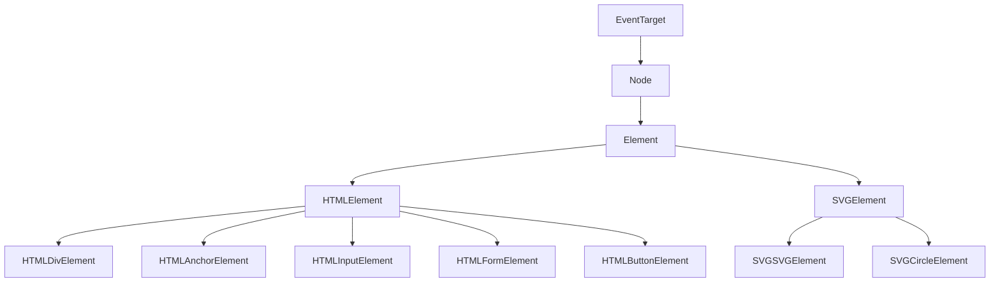
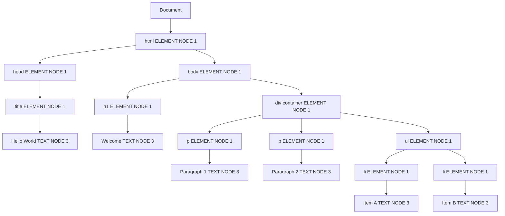
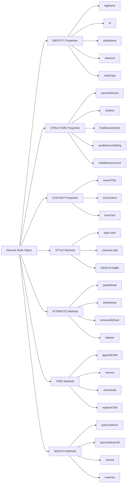
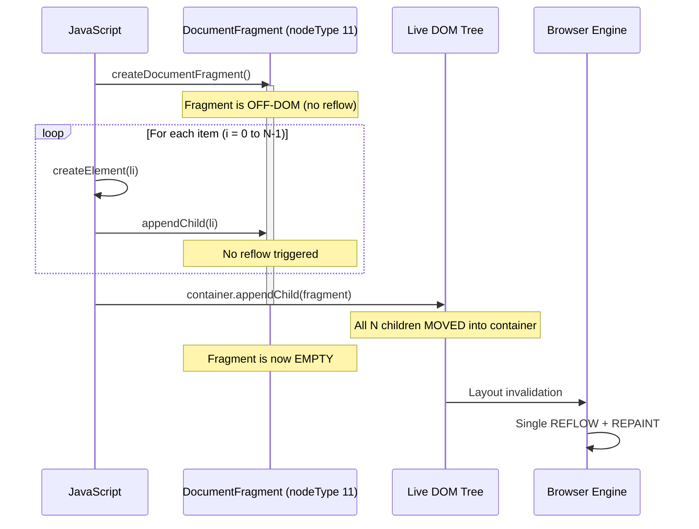
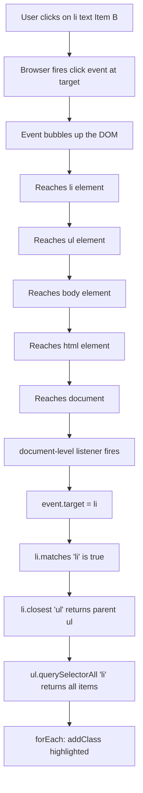
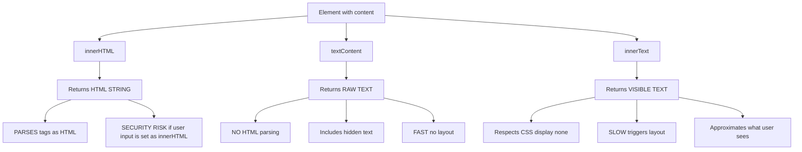
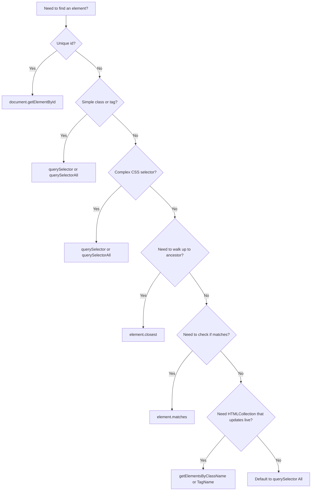

# Element Node Object

<!-- SECTION_1_START -->
# Element Node Object — Core Technical Definition & Intuitive Overview

## 1. Formal Academic Definition (KTU 2024 Syllabus Terminology)

In the **Document Object Model (DOM)**, the **Element Node Object** is the primary interface that represents an **HTML or XML element** within a parsed document tree. It is a specialized subtype of the `Node` interface (`nodeType === 1`), inheriting all properties and methods of `Node` while adding element-specific capabilities for **tag identification**, **attribute manipulation**, **child element traversal**, **styling**, and **DOM tree construction**.

According to the **W3C DOM4 / WHATWG DOM Living Standard** specification, every HTML tag encountered by the browser parser (e.g., `<div>`, `<p>`, `<a>`, `<span>`) is materialized as an `Element` node. The `Element` interface is the parent of more specific interfaces such as `HTMLElement`, `HTMLDivElement`, `HTMLInputElement`, and `HTMLFormElement`.

> [!IMPORTANT]
> **KTU 2024 Highlight:** In Module 2 (Scripting Language), the Element Node Object is the bridge that allows JavaScript to **dynamically read, modify, create, and delete** HTML elements on a web page without requiring a server round-trip.

### 1.1 DOM Node Type Hierarchy

The JavaScript DOM defines **12 node types** (constants on `Node`). The most critical ones are:

| Constant | Value | Description |
|----------|-------|-------------|
| `Node.ELEMENT_NODE` | **1** | HTML/XML element (e.g., `<p>`) |
| `Node.ATTRIBUTE_NODE` | 2 | Attribute of an element (legacy) |
| `Node.TEXT_NODE` | 3 | Text inside an element |
| `Node.COMMENT_NODE` | 8 | `<!-- comment -->` |
| `Node.DOCUMENT_NODE` | 9 | The root document object |
| `Node.DOCUMENT_FRAGMENT_NODE` | 11 | Lightweight off-DOM container |

> [!NOTE]
> **Core Definition:** An Element node is **any node whose `nodeType` property returns the integer `1`**. This is the most frequently manipulated object in client-side scripting.

---

## 2. Conceptual Analogy / Intuition

Imagine a **family tree photograph album**:

- The **album itself** is the `Document` (the whole webpage).
- Each **photo frame** in the album is an **Element Node** (`<div>`, `<section>`, `<article>`).
- Inside each frame, there can be **smaller frames** (child elements), **labels** (text nodes), or **captions** (attribute values).
- You, the **viewer with a magnifying glass (JavaScript)**, can pick up a frame, read what is written on it, change its position, swap its contents, or even paste in entirely new frames.

In this analogy:
- **JavaScript** = the magnifying glass + the hand
- **Element Node Object** = the photograph frame
- **Properties** (like `id`, `className`, `innerHTML`) = the descriptive information stamped on the frame
- **Methods** (like `appendChild()`, `removeChild()`) = the actions you can perform (add, remove, rearrange)

> [!TIP]
> **Intuition Builder:** Every time you type `<h1>Hello</h1>` in HTML, the browser secretly creates a JavaScript object in memory that looks like this:
> ```javascript
> { tagName: "H1", id: "", className: "", innerHTML: "Hello", children: [], parentNode: <body> }
> ```
> The Element Node Object is **that in-memory JavaScript object**.

---

## 3. Physical Constants and Standard Metrics (in **bold**)

While the Element Node Object itself is a software construct, several standardized properties are essential:

- **`nodeType` for an Element** = **1** (the universal numeric identifier).
- **Maximum recursion depth** for nested element traversal = **browser-dependent**, but practically **~10,000** levels before stack overflow.
- **Standard property name count** defined in the W3C DOM4 specification for `Element` = **over 100 properties and methods**.
- **Default `tagName` case**: Returns **uppercase** for HTML documents (e.g., `"DIV"`), and **case-preserved** for XML documents.

> [!VISUALIZATION CONTROL]
> **Concept:** DOM Tree as a hierarchical graph with Element Nodes as primary vertices
> **Desmos / Graph Visualization Input:**
> * Root: `Document` (level 0)
> * Level 1: `<html>` → children `<head>`, `<body>`
> * Level 2 inside `<body>`: `<header>`, `<main>`, `<footer>`
> * Level 3 inside `<main>`: `<article>`, `<aside>`
> **Visual Description:** A top-down tree where every node except text/comments is an **Element Node (blue circle)**, and text content is a **Text Node (gray circle)**. Lines between nodes represent `parentNode` / `childNodes` relationships.

---

## 4. Why Element Node Object is Central to Web Programming

The **Element Node Object** is the **workhorse** of the modern web. Every interactive feature on a website — dropdown menus that open, form validation that highlights errors, animations that fade in, single-page applications that rewrite content without reloading — is built by manipulating Element Node Objects via JavaScript.

### 4.1 Real-World Engineering Utility

| Domain | Use Case |
|--------|----------|
| **Single Page Applications (React, Vue)** | Virtual DOM diffing compares Element Node trees |
| **Form Validation** | Reading `value`, `checked`, `selected` from input elements |
| **Accessibility (a11y)** | Setting `aria-*` attributes on element nodes |
| **Dynamic UI** | Adding/removing list items, modals, toasts, carousels |
| **Web Scraping (Puppeteer)** | Selecting and extracting data from element nodes |
| **CSS Injection** | Toggling classes to apply/remove styles |
| **Performance (Critical Render Path)** | `document.createDocumentFragment()` to batch DOM updates |

> [!IMPORTANT]
> **Syllabus Highlight (PECST742 Module 2):** The Element Node Object enables the **separation of structure (HTML) from behavior (JavaScript)** — a core tenet of progressive enhancement in web engineering.

---
<!-- SECTION_1_END -->

<!-- SECTION_2_START -->
# Deep Theoretical Analysis & KTU High-Yield Formula Sheet

## 1. Theoretical Foundation: The `Element` Interface

The `Element` interface is defined in the **W3C DOM4 Core Specification**. It inherits from `Node` and serves as the foundation for all element-like DOM structures. Let us break down its operational anatomy.

### 1.1 The `Element` Inheritance Chain

```
EventTarget  (root of all DOM events)
   ↑
Node  (generic tree node: parent, child, sibling, text content)
   ↑
Element  (tag-specific: id, class, attributes, query selectors)
   ↑
HTMLElement  (HTML-specific: innerHTML, style, dataset, hidden, title)
   ↑
HTMLDivElement, HTMLAnchorElement, HTMLInputElement, ... (tag-specialized)
```

Every element on a webpage is, at minimum, an `Element`. If it is an HTML element, it is additionally an `HTMLElement`. The browser also creates **specialized subclasses** (e.g., `HTMLInputElement`) so that `<input>` elements get methods like `.focus()`, `.select()`, and `.check()` that divs do not have.

### 1.2 Operational Logic Steps

When the browser loads an HTML file, the following sequence occurs:

1. **Parsing Phase:** The HTML tokenizer reads the source character by character.
2. **Tree Construction Phase:** Each start tag `<tag>` triggers the creation of an `Element` node; text between tags becomes `Text` nodes.
3. **Linking Phase:** Newly created nodes are appended to their parent via `appendChild()` internally.
4. **Script Execution Phase:** JavaScript runs and gains access to a fully built DOM tree via the `document` global.
5. **Mutation Phase:** JavaScript code uses Element methods (`createElement`, `appendChild`, `removeChild`, `setAttribute`, `addEventListener`, etc.) to dynamically alter the tree.

> [!NOTE]
> **Why does this matter for KTU exams?** Questions often test whether students understand *when* a script can access an element. The answer: **after the element has been parsed** — which is why `<script>` tags are typically placed at the **end of `<body>`** or wrapped in a `DOMContentLoaded` listener.

---

## 2. Categories of Element Properties and Methods

### 2.1 Identity Properties (Who am I?)

| Property | Return Type | Description |
|----------|-------------|-------------|
| `tagName` | `string` | Uppercase HTML tag name (e.g., `"DIV"`) |
| `id` | `string` | Value of the `id` attribute |
| `className` | `string` | Full string of the `class` attribute (space-separated) |
| `classList` | `DOMTokenList` | Live collection of individual classes with `add()`, `remove()`, `toggle()`, `contains()` |
| `nodeName` | `string` | Same as `tagName` for elements |
| `nodeType` | `number` | Always `1` for elements |
| `localName` | `string` | Tag name without namespace, lowercase in HTML5 |
| `namespaceURI` | `string \vert null` | XML namespace URL if applicable |

### 2.2 Structural Properties (Where am I in the tree?)

| Property | Description |
|----------|-------------|
| `parentNode` | The parent Node (or `null` for the root) |
| `parentElement` | The parent Element (or `null`) |
| `childNodes` | Live `NodeList` of all child nodes (including text) |
| `children` | Live `HTMLCollection` of child **elements only** |
| `firstChild` / `lastChild` | First/last child node (any type) |
| `firstElementChild` / `lastElementChild` | First/last child **element** |
| `nextSibling` / `previousSibling` | Adjacent sibling nodes (any type) |
| `nextElementSibling` / `previousElementSibling` | Adjacent sibling **elements** |
| `childElementCount` | Number of child elements |

### 2.3 Content Properties (What do I contain?)

| Property | Description |
|----------|-------------|
| `innerHTML` | Gets/sets HTML markup inside the element (parses strings as HTML) |
| `outerHTML` | Gets/sets HTML including the element itself |
| `innerText` | Renders visible text, respecting CSS (slower, layout-aware) |
| `textContent` | Raw text of all descendants, no CSS awareness (faster) |

> [!WARNING]
> **Critical Distinction:** `innerText` vs `textContent`. `innerText` returns what the user would see (skipping hidden elements). `textContent` returns all text regardless of visibility. **Use `textContent` for performance and security**; it does not parse HTML, so it is immune to XSS injection when reading untrusted data.

### 2.4 Attribute Methods (What are my labels?)

| Method | Description |
|--------|-------------|
| `getAttribute(name)` | Returns the attribute value as a string |
| `setAttribute(name, value)` | Creates or updates an attribute |
| `removeAttribute(name)` | Deletes an attribute |
| `hasAttribute(name)` | Returns `true` if attribute exists |
| `toggleAttribute(name)` | Adds the attribute if absent, removes it if present |
| `attributes` | Live `NamedNodeMap` of all attributes |

### 2.5 Style and Class Methods (How do I look?)

| Method/Property | Description |
|------------------|-------------|
| `element.style.property` | Inline style for one CSS property (camelCase) |
| `element.classList.add(cls)` | Adds a class |
| `element.classList.remove(cls)` | Removes a class |
| `element.classList.toggle(cls)` | Adds if missing, removes if present |
| `element.classList.contains(cls)` | Checks class membership |
| `element.dataset.key` | Reads `data-key` attribute as camelCase property |

### 2.6 Tree Manipulation Methods (How do I change the tree?)

| Method | Description |
|--------|-------------|
| `document.createElement(tag)` | Creates a new detached element (NOT in DOM yet) |
| `parent.appendChild(node)` | Adds node as the last child |
| `parent.insertBefore(node, ref)` | Inserts node before `ref` |
| `parent.removeChild(node)` | Removes and returns the node |
| `node.remove()` | Modern method, removes self |
| `parent.replaceChild(new, old)` | Swaps a child |
| `parent.append(...nodes)` | Modern, accepts multiple nodes and strings |
| `parent.prepend(...nodes)` | Modern, prepends |
| `node.cloneNode(deep)` | Clones the node; `deep=true` clones descendants |
| `document.createDocumentFragment()` | Lightweight container for batch insertions |

### 2.7 Search / Selection Methods

| Method | Description |
|--------|-------------|
| `element.querySelector(selector)` | Returns first descendant matching CSS selector |
| `element.querySelectorAll(selector)` | Returns static `NodeList` of all matches |
| `element.getElementById(id)` | **Document only:** direct ID lookup |
| `element.getElementsByClassName(cls)` | Live `HTMLCollection` |
| `element.getElementsByTagName(tag)` | Live `HTMLCollection` |
| `element.closest(selector)` | Walks up the tree to find nearest ancestor (or self) matching |
| `element.matches(selector)` | Returns `true` if element matches selector |

---

## 3. KTU High-Yield Formula / Cheat Sheet

> [!IMPORTANT]
> **Master this table.** KTU theory questions frequently ask students to "list" or "categorize" properties and methods. This table is your single source of truth.

| Operation | Property or Method | Code Example | Returns |
|-----------|-------------------|--------------|---------|
| Check if Element | `nodeType` | `el.nodeType === 1` | `true` if element |
| Get tag | `tagName` | `el.tagName` | `"DIV"` |
| Get class string | `className` | `el.className` | `"btn primary"` |
| Get classes as list | `classList` | `el.classList` | `DOMTokenList` |
| Read all HTML inside | `innerHTML` | `el.innerHTML` | `"<b>Hi</b>"` |
| Read all text inside | `textContent` | `el.textContent` | `"Hi"` |
| Read visible text | `innerText` | `el.innerText` | `"Hi"` (layout-aware) |
| Set HTML | `innerHTML = ...` | `el.innerHTML = "<p>x</p>"` | undefined |
| Set text safely | `textContent = ...` | `el.textContent = "<p>x</p>"` | renders literally |
| Get attribute | `getAttribute` | `el.getAttribute("href")` | `"/home"` |
| Set attribute | `setAttribute` | `el.setAttribute("href", "/x")` | undefined |
| Check attribute | `hasAttribute` | `el.hasAttribute("disabled")` | `boolean` |
| Remove attribute | `removeAttribute` | `el.removeAttribute("id")` | undefined |
| Inline style | `style.prop` | `el.style.color = "red"` | string |
| Add class | `classList.add` | `el.classList.add("active")` | undefined |
| Toggle class | `classList.toggle` | `el.classList.toggle("dark")` | `boolean` (final state) |
| Data attribute | `dataset` | `el.dataset.userId` | value of `data-user-id` |
| First child element | `firstElementChild` | `el.firstElementChild` | Element $\vert$ null |
| Last child element | `lastElementChild` | `el.lastElementChild` | Element $\vert$ null |
| Next element sibling | `nextElementSibling` | `el.nextElementSibling` | Element $\vert$ null |
| Parent element | `parentElement` | `el.parentElement` | Element $\vert$ null |
| Number of children | `childElementCount` | `el.childElementCount` | `number` |
| Find first match | `querySelector` | `el.querySelector(".item")` | Element $\vert$ null |
| Find all matches | `querySelectorAll` | `el.querySelectorAll("li")` | NodeList |
| Closest ancestor match | `closest` | `el.closest("nav")` | Element $\vert$ null |
| Check selector match | `matches` | `el.matches(".btn")` | `boolean` |
| Create new element | `createElement` | `document.createElement("li")` | detached Element |
| Create text node | `createTextNode` | `document.createTextNode("Hi")` | Text node |
| Append child | `appendChild` | `parent.appendChild(child)` | appended child |
| Modern append | `append` | `parent.append(a, b, "text")` | undefined |
| Insert before | `insertBefore` | `parent.insertBefore(new, ref)` | inserted node |
| Remove child | `removeChild` | `parent.removeChild(child)` | removed child |
| Remove self | `remove` | `el.remove()` | undefined |
| Replace child | `replaceChild` | `parent.replaceChild(new, old)` | replaced node |
| Clone node | `cloneNode` | `el.cloneNode(true)` | cloned Element |
| Check contains | `contains` | `parent.contains(child)` | `boolean` |

> [!TIP]
> **Memory Aid:** Group properties by purpose: **ID** (who am I), **STRUCTURE** (where am I), **CONTENT** (what do I hold), **STYLE** (how do I look), **TREE** (how do I change the tree), **SEARCH** (how do I find things).

---

## 4. Real-World Engineering Utility

### 4.1 The `Element` Object in Modern Frontend Frameworks

Modern frameworks abstract direct DOM manipulation but ultimately rely on Element Node Objects:

- **React:** Uses a **Virtual DOM** — a lightweight JavaScript tree that mirrors the real DOM's Element structure. React diffs the virtual tree and applies the minimum set of real DOM mutations.
- **Vue.js:** Provides reactive bindings that translate data changes into Element property updates (e.g., `el.textContent = newValue`).
- **Vanilla JS (no framework):** The developer directly invokes Element methods like `appendChild`, `setAttribute`, and `addEventListener`.

### 4.2 Why Performance Matters: Reflow and Repaint

When you modify certain Element properties (e.g., `offsetWidth`, `innerHTML`, `style.width`), the browser may trigger:
- **Reflow (Layout):** Recalculates the geometry of all elements.
- **Repaint:** Redraws the pixels on screen.

> [!WARNING]
> **KTU Theory Favorite:** Why is `document.createDocumentFragment()` useful? Because appending to a fragment does not cause reflows. Only the **single** insertion of the fragment into the live DOM causes one reflow. This is a classic performance optimization tested in viva and exams.

### 4.3 Cross-Browser Compatibility

Older browsers (IE 9 and below) lacked `classList`, `dataset`, `querySelector`, and `remove()`. Modern code assumes **IE 11+** or evergreen browsers. KTU projects are typically run on modern Chrome/Firefox/Edge, so these methods are safe to use.

---
<!-- SECTION_2_END -->

<!-- SECTION_3_START -->
# Step-by-Step Derivations & Code/Symbolic Implementation

## 1. Mathematical Model of the DOM Tree

We can formally model the DOM as a rooted, ordered, multi-way tree:

Let $T = (V, E)$ where:
- $V$ is the set of all Node objects in the document.
- $E \subseteq V \times V$ is the set of parent-child edges.
- There exists a unique root $r \in V$ such that $r$ is the `Document` node.
- For every $v \in V$, $\text{nodeType}(v) \in \{1, 2, 3, 8, 9, 10, 11\}$.

Define the **Element Node Subset**:
$$E = \{v \in V \mid \text{nodeType}(v) = 1\}$$

For each element node $e \in E$:
- $\text{tag}(e) = e.\text{tagName}$
- $\text{children}(e) = \{c \in V \mid (e, c) \in E\}$
- $\text{attrs}(e) = \{a_1, a_2, \ldots, a_n\}$ where each $a_i$ is a key-value pair.

The **recursion theorem** for DOM traversal is:

$$\text{visit}(e) = \text{process}(e) \cup \bigcup_{c \in \text{children}(e)} \text{visit}(c)$$

This is the foundation of depth-first search (DFS) in DOM trees.

---

## 2. Worked Example 1: Building a Dynamic List

**Problem Statement:** Write JavaScript code that creates an unordered list `<ul>` with three list items ("Apple", "Banana", "Cherry") and appends it to a `<div id="container">` element.

### Step 1: Identify the Target Container

We first obtain a reference to the existing DOM element. The modern preferred method is `querySelector`:

```javascript
const container = document.querySelector("#container");
```

If the element is not found, `container` will be `null`. We should always validate this in production code:

```javascript
if (!container) {
    console.error("Container element with id 'container' not found.");
    throw new Error("Missing target element.");
}
```

### Step 2: Create the Parent `<ul>` Element

```javascript
const ul = document.createElement("ul");
ul.id = "fruit-list";
ul.className = "list list-styled";
```

At this point, `ul` exists in memory but is **detached** from the document tree. It has no parent and no children.

### Step 3: Create Child `<li>` Elements Using a Loop

```javascript
const fruits = ["Apple", "Banana", "Cherry"];
for (const fruit of fruits) {
    const li = document.createElement("li");
    li.textContent = fruit;
    li.classList.add("fruit-item");
    li.setAttribute("data-name", fruit.toLowerCase());
    ul.appendChild(li);
}
```

Let us trace the state after the first loop iteration:
- `li` is created with `tagName === "LI"`.
- `li.textContent = "Apple"` sets the text content.
- `li.classList.add("fruit-item")` appends `"fruit-item"` to the `class` attribute.
- `li.setAttribute("data-name", "apple")` creates a custom data attribute.
- `ul.appendChild(li)` adds `li` as a child of `ul`.

### Step 4: Append the List to the Container

```javascript
container.appendChild(ul);
```

This single operation attaches the entire subtree to the live DOM. The browser will then trigger a **reflow** and **repaint**.

### Step 5: Complete Production-Grade Code

```javascript
/**
 * Dynamically builds a fruit list and inserts it into the container.
 * @param {string} containerId - The id of the target container element.
 * @param {string[]} items - Array of fruit names.
 */
function buildFruitList(containerId, items) {
    const container = document.querySelector("#" + containerId);
    if (!container) {
        console.error("[buildFruitList] Container not found:", containerId);
        return false;
    }
    if (!Array.isArray(items) || items.length === 0) {
        console.warn("[buildFruitList] No items provided.");
        return false;
    }

    const ul = document.createElement("ul");
    ul.id = "fruit-list";
    ul.className = "list list-styled";

    for (const fruit of items) {
        const li = document.createElement("li");
        li.textContent = fruit;
        li.classList.add("fruit-item");
        li.setAttribute("data-name", fruit.toLowerCase());
        li.setAttribute("tabindex", "0");
        ul.appendChild(li);
    }

    container.appendChild(ul);
    console.log("[buildFruitList] Inserted", items.length, "items.");
    return true;
}

buildFruitList("container", ["Apple", "Banana", "Cherry"]);
```

### Step 6: Generated HTML Structure

After execution, the live DOM contains:

```html
<div id="container">
    <ul id="fruit-list" class="list list-styled">
        <li class="fruit-item" data-name="apple" tabindex="0">Apple</li>
        <li class="fruit-item" data-name="banana" tabindex="0">Banana</li>
        <li class="fruit-item" data-name="cherry" tabindex="0">Cherry</li>
    </ul>
</div>
```

---

## 3. Worked Example 2: DocumentFragment for Performance

**Problem Statement:** Insert 10,000 list items into a container efficiently.

### The Inefficient Way (Causes 10,000 Reflows)

```javascript
const container = document.querySelector("#container");
for (let i = 0; i < 10000; i++) {
    const li = document.createElement("li");
    li.textContent = "Item " + i;
    container.appendChild(li);   // Reflow after EACH insertion
}
```

### The Efficient Way (Causes 1 Reflow)

```javascript
const container = document.querySelector("#container");
const fragment = document.createDocumentFragment();   // Off-DOM container

for (let i = 0; i < 10000; i++) {
    const li = document.createElement("li");
    li.textContent = "Item " + i;
    fragment.appendChild(li);   // No reflow — fragment is not in live DOM
}

container.appendChild(fragment);   // Single reflow
```

> [!IMPORTANT]
> **KTU Theory Note:** A `DocumentFragment` is a "ghost" node. It has a `nodeType` of `11` (`DOCUMENT_FRAGMENT_NODE`). When you append it to a real element, the fragment itself is **not** inserted; its **children** are moved into the target. The fragment then becomes empty.

### Algorithmic Complexity Analysis

| Approach | DOM Mutations | Reflows | Time Complexity |
|----------|---------------|---------|-----------------|
| Direct append in loop | $n$ | $n$ | $O(n)$ with high constant |
| Fragment + single append | $n+1$ | $1$ | $O(n)$ with low constant |

For $n = 10{,}000$, the fragment approach can be **10x to 100x faster** on slow devices.

---

## 4. Worked Example 3: Element Traversal with Closest and Matches

**Problem Statement:** Given a click anywhere inside a list, identify which top-level list it belongs to and highlight all its items.

```html
<ul id="fruits">
    <li>Apple</li>
    <li>Banana</li>
    <li>Cherry</li>
</ul>
<ul id="veggies">
    <li>Carrot</li>
    <li>Potato</li>
</ul>
```

### JavaScript Implementation

```javascript
document.addEventListener("click", function (event) {
    const clicked = event.target;
    
    // Ensure the click was on an LI element
    if (!clicked.matches("li")) {
        return;
    }
    
    // Walk up the DOM to find the parent UL
    const parentList = clicked.closest("ul");
    if (!parentList) {
        return;
    }
    
    // Highlight all LIs in that UL
    const items = parentList.querySelectorAll("li");
    items.forEach(function (li) {
        li.classList.add("highlighted");
    });
    
    console.log("Highlighted", items.length, "items in", parentList.id);
});
```

### Step-by-Step Walkthrough

1. **`event.target`**: The deepest element clicked (always an `Element`).
2. **`clicked.matches("li")`**: Boolean check. If the user clicked on text inside the `<li>`, `event.target` could be a `Text` node, but in modern browsers, `event.target` is always the closest `Element`. We still validate.
3. **`clicked.closest("ul")`**: Traverses **upward** from `clicked` through `parentElement` chain until it finds an element matching `"ul"`, or returns `null`.
4. **`parentList.querySelectorAll("li")`**: Returns a static `NodeList` of all `<li>` descendants.
5. **`forEach`**: Iterates and toggles a CSS class.

> [!TIP]
> **The Delegation Pattern:** This code uses **event delegation** — a single listener on `document` handles clicks on **any** `<li>`. This is far more efficient than attaching a listener to every `<li>`, especially for dynamic content.

---

## 5. Worked Example 4: Replacing and Removing Elements

### Replacing a Node

```javascript
const oldEl = document.getElementById("old");
const newEl = document.createElement("div");
newEl.id = "new";
newEl.textContent = "I am the replacement.";

oldEl.parentNode.replaceChild(newEl, oldEl);
```

The `old` element is detached from the DOM. If no other references exist in JavaScript, it is eventually garbage-collected.

### Removing a Node (Two Ways)

**Way 1 — Legacy:**
```javascript
const target = document.getElementById("remove-me");
target.parentNode.removeChild(target);
```

**Way 2 — Modern (preferred):**
```javascript
const target = document.getElementById("remove-me");
target.remove();
```

### Cloning a Subtree

```javascript
const original = document.getElementById("template");
const clone = original.cloneNode(true);   // true = deep clone
clone.id = "template-copy-1";
document.body.appendChild(clone);
```

> [!WARNING]
> **Bug to avoid:** Cloned elements have identical `id` attributes. Duplicate IDs break `getElementById` and CSS specificity. Always **change the `id`** of a clone before inserting it.

---

## 6. Worked Example 5: Working with Attributes and Data Attributes

```html
<button id="submit-btn" data-action="save" data-user-id="42">Save</button>
```

```javascript
const btn = document.getElementById("submit-btn");

// Read all attributes
console.log(btn.attributes.length);             // 3 (id, data-action, data-user-id)
console.log(btn.getAttribute("data-action"));   // "save"

// Use the dataset API (camelCase conversion: data-user-id -> dataset.userId)
console.log(btn.dataset.action);                // "save"
console.log(btn.dataset.userId);                // "42"

// Modify an attribute
btn.setAttribute("data-action", "update");
btn.dataset.status = "pending";                 // Creates data-status="pending"

// Remove an attribute
btn.removeAttribute("data-user-id");
console.log(btn.hasAttribute("data-user-id"));  // false

// Toggle a boolean attribute
btn.toggleAttribute("disabled");
```

### `getAttribute` vs Property Access — The Critical Distinction

| Aspect | `getAttribute` | Direct property (`el.id`) |
|--------|----------------|--------------------------|
| Returns | The literal string in HTML | The **current** value (may be normalized) |
| Reflects live changes | No (snapshot at call time) | Yes (live binding) |
| Works for non-standard attributes | Yes | No (use `dataset` for `data-*`) |
| Boolean attributes | Returns `""` or the value | Returns `true` $\vert$ `false` |

```javascript
const cb = document.querySelector('input[type="checkbox"]');
cb.getAttribute("checked");     // "" (if present in HTML)
cb.checked;                     // true
cb.removeAttribute("checked");
cb.checked;                     // false
```

---

## 7. Worked Example 6: ClassList Mastery

```javascript
const card = document.querySelector(".card");

card.classList.add("active", "shadow");      // Add multiple
card.classList.remove("shadow");             // Remove one
card.classList.toggle("collapsed");          // Toggle on
card.classList.toggle("collapsed");          // Toggle off
console.log(card.classList.contains("active")); // true
card.classList.replace("active", "inactive"); // Replace
console.log([...card.classList]);            // Array of class names
```

> [!NOTE]
> **`toggle` second argument:** If you pass a boolean, it acts as a forced state.
> ```javascript
> card.classList.toggle("active", true);   // Force add
> card.classList.toggle("active", false);  // Force remove
> ```

---
<!-- SECTION_3_END -->

<!-- SECTION_4_START -->
# Structural Diagrams & Schematics

## 1. Diagram 1: Element Node Object Inheritance Hierarchy



**Description:** The inheritance chain showing how `EventTarget` (root of all DOM events) feeds into `Node` (generic tree), which feeds into `Element` (tag-aware), which feeds into `HTMLElement` (HTML-specific), and finally into specialized subclasses like `HTMLDivElement`. SVG elements form a parallel branch.

---

## 2. Diagram 2: Sample DOM Tree with Element Node Highlight



**Description:** A complete DOM tree for a simple page. Every blue node is an `Element` (nodeType=1); every gray node is `Text` (nodeType=3). The numbers in brackets indicate the `nodeType` value. This visual reinforces that **elements form the structural skeleton** of a webpage, with text nodes filling in the content.

---

## 3. Diagram 3: Element Property Classification Map



**Description:** A mind-map view of the six major categories of Element properties and methods. This is the **mental model** students should internalize before any exam.

---

## 4. Diagram 4: DocumentFragment Insertion Sequence



**Description:** Shows how `DocumentFragment` decouples element creation from layout recalculation. The key insight: appending to a fragment is "free" — the browser only computes layout once, when the fragment is merged into the live DOM.

---

## 5. Diagram 5: Event Delegation Flow



**Description:** Demonstrates the **event bubbling** and **delegation** pattern. A single listener on `document` can handle clicks on any descendant element, because events bubble up by default.

---

## 6. Diagram 6: innerHTML vs textContent vs innerText



**Description:** Comparative decision tree for choosing the right content property. Rule of thumb: **use `textContent` for untrusted data**; use `innerHTML` only when you need to insert HTML markup that you control; avoid `innerText` when performance matters.

---

## 7. Diagram 7: Element Selection Strategy



**Description:** A decision-flowchart for choosing the correct Element selection method. KTU exams often ask "which method would you use to..." — this chart gives the answer.

---
<!-- SECTION_4_END -->

<!-- SECTION_5_START -->
# KTU 2024 Scheme Examination Question Bank & Topic Recap

## Part A Questions (3 Marks Each)

### Question 1
**[KTU University Exam — July 2023]**
**CO1, Remember**
Explain the concept of an Element Node Object in the DOM. What is its `nodeType` value?

**Model Answer (3 Marks):**

An **Element Node Object** is a JavaScript object representation of an HTML or XML element in the Document Object Model (DOM) tree. It is created automatically by the browser when it parses HTML tags. It inherits from the `Node` interface and exposes element-specific properties such as `tagName`, `id`, `className`, `innerHTML`, and methods like `appendChild()`, `setAttribute()`, and `querySelector()`. The `nodeType` property of an Element Node Object always returns the value **`1`** (the constant `Node.ELEMENT_NODE`). `[1 Mark for definition, 1 Mark for properties example, 1 Mark for nodeType]`

---

### Question 2
**[KTU University Exam — Dec 2023]**
**CO1, Understand**
Differentiate between `getElementById()`, `querySelector()`, and `querySelectorAll()` with examples.

**Model Answer (3 Marks):**

| Method | Returns | Selector Type | Example | Live Collection? |
|--------|---------|---------------|---------|------------------|
| `getElementById(id)` | Single Element $\vert$ null | ID only | `document.getElementById("header")` | No (single ref) |
| `querySelector(sel)` | First matching Element $\vert$ null | Any valid CSS selector | `document.querySelector(".btn.primary")` | No (single ref) |
| `querySelectorAll(sel)` | Static `NodeList` | Any valid CSS selector | `document.querySelectorAll("li.active")` | No (static snapshot) |

`getElementById` is the fastest but limited to IDs. `querySelector` is the most flexible, supporting any CSS selector. `querySelectorAll` returns a static `NodeList` (not updated when DOM changes), unlike `getElementsByClassName` which returns a live `HTMLCollection`. `[1 Mark each for the three methods]`

---

## Part B Questions (14 Marks Each — Internal Choice)

### Question A — Option 1
**[KTU University Exam — July 2024]**
**CO2, Apply / Analyze**

**(a)** With a suitable example, explain the use of the following Element properties:
   (i) `innerHTML` vs `textContent` (4 marks)
   (ii) `classList` with `add()`, `remove()`, and `toggle()` (3 marks)

**(b)** Write a JavaScript function `highlightActiveSection(sectionId)` that finds the element with the given id, adds the CSS class `"active-section"`, removes the class from any sibling elements, and logs the total number of elements modified. (7 marks)

**Model Solution:**

**(a)(i) innerHTML vs textContent — 4 Marks**

- `innerHTML` (2 Marks): Returns or sets the HTML **markup** inside an element. It **parses** the string as HTML.
  ```javascript
  const div = document.querySelector("#demo");
  div.innerHTML = "<b>Bold</b> text";   // Renders as bold
  console.log(div.innerHTML);            // "<b>Bold</b> text"
  ```
- `textContent` (2 Marks): Returns or sets the raw **text** of all descendants. It does **not** parse HTML, making it safe from XSS injection and faster.
  ```javascript
  const div = document.querySelector("#demo");
  div.textContent = "<b>Bold</b> text"; // Renders literally as <b>Bold</b>
  console.log(div.textContent);          // "<b>Bold</b> text"
  ```

**Key Difference (must be stated):** `innerHTML` is a **security risk** when assigning untrusted data because it executes embedded `<script>` tags and HTML; `textContent` is safe.

**(a)(ii) classList methods — 3 Marks**

- `classList.add("x")` — 1 Mark: Adds class `x`. Multiple classes can be added in one call.
  ```javascript
  el.classList.add("active", "shadow");
  ```
- `classList.remove("x")` — 1 Mark: Removes class `x` if present; does nothing if absent.
  ```javascript
  el.classList.remove("active");
  ```
- `classList.toggle("x")` — 1 Mark: Adds the class if absent, removes it if present. Returns the final boolean state. Accepts a second boolean argument to force state.
  ```javascript
  el.classList.toggle("dark-mode");          // Toggle
  el.classList.toggle("dark-mode", true);    // Force add
  ```

**(b) JavaScript function — 7 Marks**

```javascript
/**
 * Highlights the element with the given id, removing highlight from siblings.
 * @param {string} sectionId - The id of the target element.
 * @returns {number} - The total number of elements modified.
 */
function highlightActiveSection(sectionId) {
    // Step 1: Validation — 1 Mark
    const target = document.getElementById(sectionId);
    if (!target) {
        console.error("[highlightActiveSection] Element not found:", sectionId);
        return 0;
    }

    // Step 2: Identify the parent — 1 Mark
    const parent = target.parentElement;
    if (!parent) {
        console.warn("[highlightActiveSection] Target has no parent.");
        target.classList.add("active-section");
        return 1;
    }

    // Step 3: Remove class from all siblings — 2 Marks
    const siblings = Array.from(parent.children);
    let modifiedCount = 0;
    siblings.forEach(function (sib) {
        if (sib.classList.contains("active-section")) {
            sib.classList.remove("active-section");
            modifiedCount++;
        }
    });

    // Step 4: Add class to target — 1 Mark
    target.classList.add("active-section");
    modifiedCount++;

    // Step 5: Logging — 1 Mark
    console.log("[highlightActiveSection] Total elements modified:", modifiedCount);
    return modifiedCount;
}

// Example usage
highlightActiveSection("section-2");
```

**Valuation Key:**
- `[Correct element lookup using getElementById: 1 Mark]`
- `[Proper validation with null-check: 1 Mark]`
- `[Siblings correctly identified via parent.children: 2 Marks]`
- `[Class removal logic with count increment: 1 Mark]`
- `[Adding class to target: 1 Mark]`
- `[Final log statement: 1 Mark]`

---

### Question A — Option 2
**[KTU University Exam — Dec 2024]**
**CO3, Apply / Analyze**

**(a)** Explain the following Element methods with examples: (i) `createElement()` and `createTextNode()` (3 marks), (ii) `appendChild()` and `removeChild()` (4 marks).

**(b)** Write JavaScript code that uses a `DocumentFragment` to build a table with 5 rows and 3 columns dynamically, then inserts it into a `<div id="output">`. (7 marks)

**Model Solution:**

**(a)(i) createElement() and createTextNode() — 3 Marks**

- `createElement(tagName)` (1.5 Marks): Creates a new **detached** element of the given tag. It is not yet in the DOM tree.
  ```javascript
  const para = document.createElement("p");
  para.textContent = "New paragraph";
  // para is in memory but NOT in the document
  ```
- `createTextNode(text)` (1.5 Marks): Creates a `Text` node containing the given string. Useful when you want to insert raw text without HTML parsing.
  ```javascript
  const txt = document.createTextNode("Hello & welcome");
  ```

**(a)(ii) appendChild() and removeChild() — 4 Marks**

- `appendChild(node)` (2 Marks): Adds `node` as the **last child** of the calling element. If the node already exists in the DOM, it is **moved** (not copied).
  ```javascript
  const ul = document.querySelector("ul");
  const li = document.createElement("li");
  li.textContent = "Item 4";
  ul.appendChild(li);   // li becomes the new last child of ul
  ```
- `removeChild(node)` (2 Marks): Removes the specified child from the parent and returns it. The node can be reattached later.
  ```javascript
  const removed = ul.removeChild(ul.lastElementChild);
  console.log(removed.textContent);   // "Item 4"
  ```

**(b) DocumentFragment table builder — 7 Marks**

```javascript
/**
 * Builds a 5x3 table using a DocumentFragment and inserts it into #output.
 */
function buildDynamicTable() {
    // Step 1: Get target — 1 Mark
    const output = document.getElementById("output");
    if (!output) {
        console.error("[buildDynamicTable] #output not found.");
        return;
    }

    // Step 2: Create fragment and table — 2 Marks
    const fragment = document.createDocumentFragment();
    const table = document.createElement("table");
    table.id = "dynamic-table";
    table.border = "1";

    // Step 3: Build rows and cells in loop — 3 Marks
    for (let r = 0; r < 5; r++) {
        const tr = document.createElement("tr");
        for (let c = 0; c < 3; c++) {
            const td = document.createElement("td");
            td.textContent = "Row " + (r + 1) + ", Col " + (c + 1);
            td.style.padding = "8px";
            tr.appendChild(td);
        }
        fragment.appendChild(tr);
    }

    table.appendChild(fragment);   // Add rows to table (still off-DOM)
    output.appendChild(table);     // Single insertion triggers ONE reflow

    // Step 4: Logging — 1 Mark
    console.log("[buildDynamicTable] Inserted table with",
                 table.rows.length, "rows and",
                 table.rows[0].cells.length, "columns.");
}

buildDynamicTable();
```

**Valuation Key:**
- `[Correct use of createDocumentFragment: 2 Marks]`
- `[Proper createElement loop for tr/td: 2 Marks]`
- `[textContent used safely (not innerHTML): 1 Mark]`
- `[Single appendChild to live DOM at the end: 1 Mark]`
- `[Logging or return statement: 1 Mark]`

---

> [!WARNING]
> **KTU Examiner's Valuation Warning / Pitfall Callout**
> 
> 1. **Forgetting `nodeType`:** Many students confuse `Element` with `Node`. Always mention that `Element` is a **subclass** of `Node` with `nodeType === 1`. **[-1 Mark]**
> 2. **Using `innerHTML` for untrusted data:** Examiners deduct marks for security anti-patterns. Prefer `textContent` for any user-supplied data. **[-1 Mark]**
> 3. **Forgetting to call `appendChild`:** A common error is creating elements with `createElement` but never inserting them. The element remains in memory but invisible. **[-2 Marks]**
> 4. **Confusing `children` and `childNodes`:** `children` returns only `Element` nodes; `childNodes` includes text and comment nodes. **[-1 Mark]**
> 5. **Not null-checking:** Methods like `getElementById` can return `null`. Skipping the null-check causes `Cannot read property of null` errors in viva. **[-1 Mark]**
> 6. **Forgetting that `cloneNode(true)` is needed for deep copy:** Using `cloneNode()` without `true` copies only the element, not its children. **[-1 Mark]**
> 7. **Confusing `getAttribute` and direct property access:** For boolean attributes like `disabled`, `getAttribute("disabled")` returns `""` while `el.disabled` returns `true`. **[-1 Mark]**

---

## Topic Recap & Important Things to Remember

- [x] **Element Node Object** is a JavaScript object representing an HTML/XML element in the DOM tree, with `nodeType === 1`.
- [x] It **inherits** from `Node` and adds element-specific properties: `tagName`, `id`, `className`, `attributes`, `children`.
- [x] **Identity properties:** `tagName`, `id`, `className`, `classList`, `nodeType`, `localName`.
- [x] **Structural properties:** `parentElement`, `children`, `firstElementChild`, `lastElementChild`, `nextElementSibling`, `previousElementSibling`, `childElementCount`.
- [x] **Content properties:** `innerHTML` (parses HTML — **security risk**), `textContent` (raw text — safe), `innerText` (visible text — slow).
- [x] **Attribute methods:** `getAttribute`, `setAttribute`, `removeAttribute`, `hasAttribute`, `toggleAttribute`, `attributes`, `dataset`.
- [x] **Style methods:** `element.style.property`, `classList.add/remove/toggle/contains/replace`.
- [x] **Tree manipulation methods:** `createElement`, `createTextNode`, `appendChild`, `insertBefore`, `removeChild`, `remove`, `replaceChild`, `cloneNode`, `createDocumentFragment`.
- [x] **Search methods:** `querySelector`, `querySelectorAll`, `getElementById`, `getElementsByClassName`, `getElementsByTagName`, `closest`, `matches`, `contains`.
- [x] **`DocumentFragment`** (nodeType 11) is an off-DOM container that batches insertions and triggers **only one reflow**.
- [x] **Event delegation** uses `event.target`, `matches`, and `closest` to handle clicks on dynamic descendants from a parent listener.
- [x] **`classList.toggle(name, force)`** accepts a second boolean argument to force add/remove.
- [x] **`dataset` API** converts `data-user-id` to `dataset.userId` (camelCase).
- [x] **Reflow vs Repaint:** Modifying `innerHTML`, `style.width`, or reading `offsetWidth` triggers layout (reflow); pure color changes trigger only repaint.
- [x] **`cloneNode(true)`** performs a **deep** clone (copies subtree); `cloneNode(false)` copies only the element itself.
- [x] **getAttribute vs property:** `getAttribute("checked")` returns `""`; `el.checked` returns `true`. Use property access for boolean attributes.
- [x] **HTMLCollection is live**; **NodeList from `querySelectorAll` is static**.
- [x] **Browser hierarchy:** `EventTarget` → `Node` → `Element` → `HTMLElement` → `HTMLDivElement` (and other specialized subclasses).
- [x] Always **null-check** the result of `getElementById` / `querySelector` before accessing properties.
- [x] **Scripts should run after DOM is ready** — place `<script>` at end of `<body>` or use `DOMContentLoaded` event listener.

---
<!-- SECTION_5_END -->
