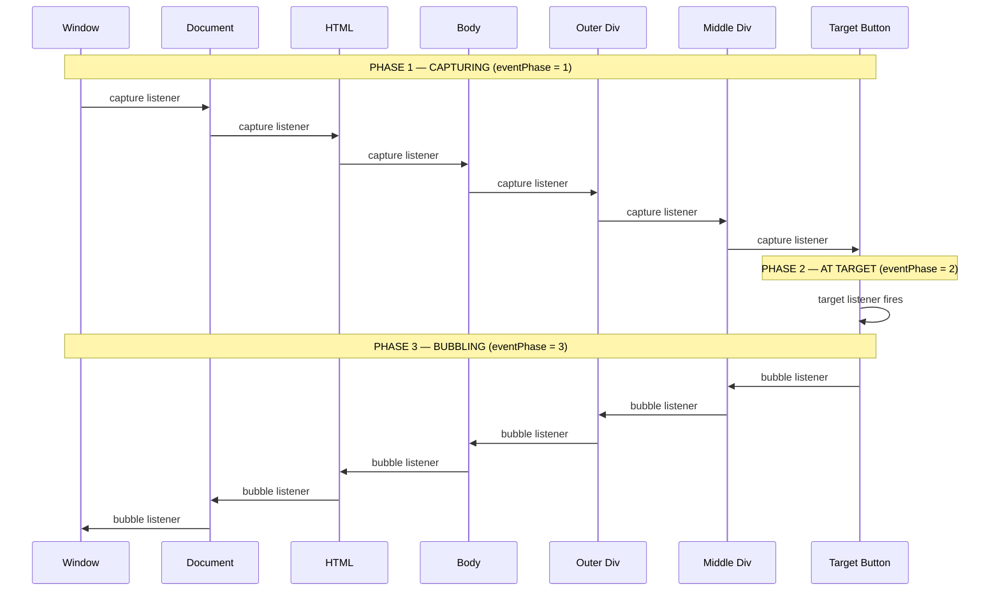
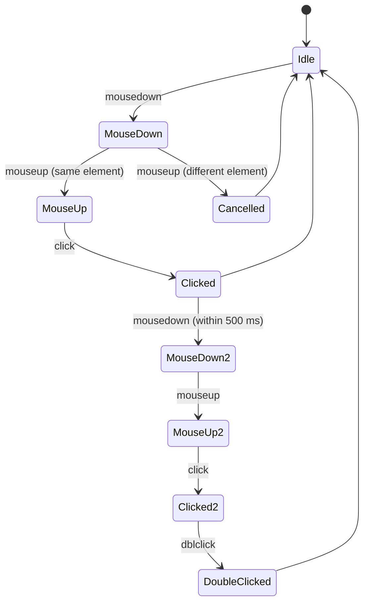
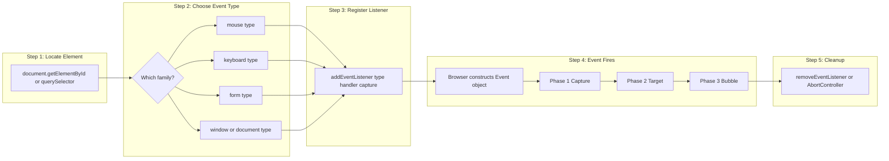
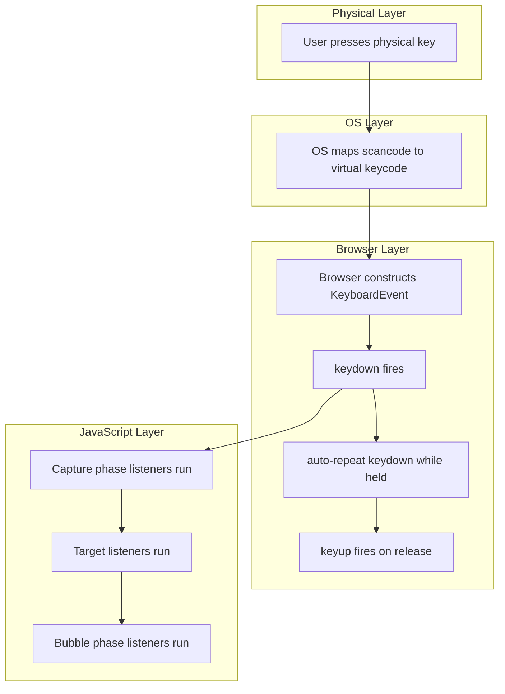

# Event Types

<!-- SECTION_1_START -->
# Event Types in JavaScript — Core Definition & Intuition

## Formal Definition (KTU 2024 Syllabus Terminology)

> [!NOTE]
> **Event**: An **event** in JavaScript is an action or occurrence detected by the browser (or a specific HTML element) to which the script can respond. The action may be user-initiated (mouse click, key press) or system-generated (page load, resize, error).

> [!IMPORTANT]
> **Event Type**: An **event type** is a named, predefined category of an event that describes *what kind of action* occurred. JavaScript provides a standardized set of event types (e.g., `click`, `keydown`, `submit`, `load`) grouped into logical families such as **Mouse Events**, **Keyboard Events**, **Form Events**, **Window/Document Events**, **Touch Events**, **Clipboard Events**, and **Drag-and-Drop Events**.

In the W3C **Document Object Model (DOM) Level 2 Events** specification, every event belongs to a particular **interface** (e.g., `MouseEvent`, `KeyboardEvent`, `FocusEvent`, `WheelEvent`) that defines the properties exposed by the event object.

---

## Conceptual Analogy — Plain English Intuition

Think of an **HTML page as a busy office building** and JavaScript **events as telephone calls from different rooms**:

- The **door sensor** rings when someone enters → `mouseenter` event
- The **intercom button** at the desk is pressed → `click` event
- The **fire alarm** is triggered → `error` or `unhandledrejection` event
- The **mail slot** detects new mail → `submit` (form submission) event
- The **window cleaner** knocks at the window → `focus` / `blur` event

Each sensor (event type) "rings" the script's phone, and a **handler function** (the listener) is the receptionist who decides what to do with the call. The browser maintains a **list of registered listeners** for every event type on every element.

> [!TIP]
> **Forgetting the difference between "Event" and "Event Type"** is the single most common viva mistake at KTU. The **event** is the *occurrence itself*; the **event type** is the *string label* (`'click'`, `'keydown'`) that classifies it.

---

## Event Type Families — Quick Map

| Family | Triggered When | Example Types |
|---|---|---|
| **Mouse Events** | Mouse interacts with an element | `click`, `dblclick`, `mousedown`, `mouseup`, `mousemove`, `mouseover`, `mouseout`, `mouseenter`, `mouseleave`, `contextmenu` |
| **Keyboard Events** | A key is pressed/released | `keydown`, `keypress` (deprecated), `keyup` |
| **Form Events** | User interacts with form controls | `submit`, `reset`, `change`, `input`, `focus`, `blur`, `select` |
| **Window / Document Events** | Browser-level state changes | `load`, `DOMContentLoaded`, `unload`, `resize`, `scroll`, `error` |
| **Touch Events** | Finger/stylus touches a screen | `touchstart`, `touchmove`, `touchend`, `touchcancel` |
| **Clipboard Events** | Data is copied/cut/pasted | `copy`, `cut`, `paste` |
| **Drag & Drop Events** | Element is dragged | `dragstart`, `drag`, `dragend`, `dragenter`, `dragover`, `dragleave`, `drop` |
| **Media Events** | `<audio>` / `<video>` state changes | `play`, `pause`, `ended`, `volumechange`, `timeupdate` |

> [!VISUALIZATION CONTROL]
> **Concept:** Coordinate-plane mapping of pointer interaction events
> **Desmos / GeoGebra Input Points (screen coordinates, origin = top-left):**
> * `P_enter = (0, 0)` — mouseenter fires
> * `P_over = (50, 30)` — mouseover fires
> * `P_down = (50, 30)` — mousedown fires
> * `P_up = (50, 30)` — mouseup fires
> * `P_click = (50, 30)` — click fires (down + up on same element)
> * `P_dblclick = (50, 30)` — dblclick fires (two clicks in time Δt < 500 ms)
> * `P_out = (200, 0)` — mouseout fires
> * `P_leave = (250, 0)` — mouseleave fires
>
> **Visual Description:** Imagine a rectangular button drawn between (0, 0) and (200, 100). The points trace a *realistic user trajectory*: the pointer enters the button, hovers, presses, releases, double-clicks, then exits. Each labelled point is a moment at which one specific event type fires — illustrating that **distinct event types fire at distinct (x, y, t) tuples**, not interchangeably.

---

## Why Event Types Matter in Engineering Practice

Modern Single-Page Applications (SPAs) like **Gmail**, **Google Docs**, **Figma**, and **Notion** are essentially *event-type-driven state machines*. Roughly **70-80% of all user-facing JavaScript logic** in a typical React/Angular/Vue app is wired to one of the event types listed above. Mastering the catalog of event types is the foundation of every interaction-layer engineering interview question asked by FAANG-tier companies in Kerala's IT corridor (Trivandrum, Kochi, Infopark, Technopark).

<!-- SECTION_1_END -->

<!-- SECTION_2_START -->
# Deep Theoretical Analysis & KTU High-Yield Formula Sheet

## 1. The JavaScript Event Object (`event` / `e`)

When any event fires, the browser automatically constructs an **Event object** and passes it to the handler. The exact properties depend on the **event interface**:

### Base `Event` Object (all events inherit from this)

| Property | Type | Meaning |
|---|---|---|
| `type` | `string` | The event type name (e.g., `"click"`) |
| `target` | `Element` | The element on which the event **originated** |
| `currentTarget` | `Element` | The element whose listener is **currently firing** |
| `bubbles` | `boolean` | `true` if event propagates upward through ancestors |
| `cancelable` | `boolean` | `true` if `preventDefault()` is meaningful |
| `defaultPrevented` | `boolean` | `true` if `preventDefault()` was already called |
| `eventPhase` | `number` | `0` NONE, `1` CAPTURING, `2` AT_TARGET, `3` BUBBLING |
| `timestamp` | `number` | Milliseconds since the page navigation started |
| `isTrusted` | `boolean` | `true` for real user input, `false` for script-dispatched |

### `MouseEvent` Extensions

| Property | Type | Meaning |
|---|---|---|
| `clientX`, `clientY` | `number` | Coordinates relative to the **viewport** |
| `pageX`, `pageY` | `number` | Coordinates relative to the **document** (includes scroll) |
| `screenX`, `screenY` | `number` | Coordinates relative to the **physical screen** |
| `offsetX`, `offsetY` | `number` | Coordinates relative to the **target element's padding edge** |
| `button` | `number` | `0` Left, `1` Middle, `2` Right |
| `buttons` | `number` | Bitmask of currently pressed buttons |
| `ctrlKey`, `shiftKey`, `altKey`, `metaKey` | `boolean` | Modifier-key state |

### `KeyboardEvent` Extensions

| Property | Type | Meaning |
|---|---|---|
| `key` | `string` | The actual character or action name (e.g., `"A"`, `"Enter"`, `"ArrowUp"`) |
| `code` | `string` | The physical key (e.g., `"KeyA"`, `"Enter"`, `"ArrowUp"`) |
| `keyCode` | `number` | Legacy numeric code (**deprecated** — still seen in KTU papers) |
| `charCode` | `number` | Legacy Unicode value (**deprecated**) |
| `repeat` | `boolean` | `true` if key is being held down |
| `location` | `number` | `0` Standard, `1` Left, `2` Right, `3` Numpad |

### `Event` Methods (universally available)

| Method | Purpose |
|---|---|
| `preventDefault()` | Cancels the browser's default action (e.g., link navigation, form submit reload) |
| `stopPropagation()` | Stops the event from bubbling/capturing to ancestor elements |
| `stopImmediatePropagation()` | Stops propagation **and** prevents other listeners on the same element from firing |
| `composedPath()` | Returns the array of nodes the event will pass through |

---

## 2. Three Phases of Event Propagation

Every event type that has `bubbles: true` travels through three phases:

$$
\text{DOM} \;\xrightarrow{\text{Phase 1}} \;\text{ancestor} \;\xrightarrow{\text{Phase 2}} \;\text{Target} \;\xrightarrow{\text{Phase 3}} \;\text{ancestor}
$$

| Phase | `eventPhase` Value | Direction | Listener registration |
|---|---|---|---|
| **Capturing (Trickling)** | $1$ | Window $\rightarrow$ ... $\rightarrow$ Target's parent | `addEventListener(type, fn, true)` |
| **Target** | $2$ | At the target element itself | Either phase |
| **Bubbling** | $3$ | Target's parent $\rightarrow$ ... $\rightarrow$ Window | `addEventListener(type, fn, false)` (default) |

> [!IMPORTANT]
> **Not all events bubble.** Notable non-bubbling events: `focus`, `blur`, `load`, `unload`, `scroll`, `mouseenter`, `mouseleave`. The corresponding bubbling variants are `focusin`/`focusout`, `mouseover`/`mouseout`. This is a **favourite KTU viva trap**.

---

## 3. Two Ways to Register an Event Listener

### (a) HTML Attribute (Inline)
```html
<button onclick="handleClick()">Submit</button>
```

### (b) DOM Property
```javascript
document.getElementById("btn").onclick = function(e) { /* ... */ };
```

### (c) `addEventListener()` — The W3C Standard (preferred)
```javascript
element.addEventListener(eventType, handlerFunction, useCapture);
```

**Comparison Table — KTU High-Yield**

| Feature | Inline `onclick` | DOM Property | `addEventListener` |
|---|---|---|---|
| Handles multiple listeners | ❌ No (overwrites) | ❌ No | ✅ Yes |
| Can capture phase | ❌ No | ❌ No | ✅ Yes (third arg) |
| Can be removed | ❌ No | ✅ Yes (assign `null`) | ✅ Yes (`removeEventListener`) |
| Separation of HTML/JS | ❌ Mixed | ✅ Separated | ✅ Separated |
| KTU exam "best practice" | Avoid | Acceptable | **Recommended** |

---

## 4. Mouse Event Type Sequence (Order of Firing)

The official W3C firing order for a left-button click is **non-negotiable** and is tested every year:

$$
\boxed{
\text{mousedown} \;\rightarrow\; \text{mouseup} \;\rightarrow\; \text{click}
}
$$

For a double-click (within the OS-defined threshold, usually $500 \text{ ms}$):

$$
\boxed{
\begin{aligned}
&\text{mousedown} \rightarrow \text{mouseup} \rightarrow \text{click} \rightarrow \\
&\text{mousedown} \rightarrow \text{mouseup} \rightarrow \text{click} \rightarrow \text{dblclick}
\end{aligned}
}
$$

> [!IMPORTANT]
> If the second `mousedown` is on a **different element** from the first, the browser will **not** fire `dblclick` — it will instead fire a fresh `mousedown`/`mouseup`/`click` sequence. This is the basis of "click hijacking" anti-patterns tested in KTU Module 5 (Security).

---

## 5. KTU Formula Sheet / Cheat Sheet

| Concept | Formula / Rule | Notes |
|---|---|---|
| Total listeners on element | $\sum$ unique (type, fn, capture) tuples | Same fn registered twice → fires twice |
| Bubbling path length | $1 + \text{depth of target in DOM tree}$ | Counts `document` and `window` |
| `keyCode` of `Enter` | $13$ | Deprecated but still in KTU papers |
| `keyCode` of `Escape` | $27$ | Used to close modals |
| `keyCode` of Arrow Up / Down / Left / Right | $38 \;\vert\; 40 \;\vert\; 37 \;\vert\; 39$ | KTU often uses `event.keyCode` |
| Modifier detection | `e.ctrlKey \;\vert\;\text{e.shiftKey} \;\vert\;\text{e.altKey} \;\vert\;\text{e.metaKey}` | Boolean |
| `preventDefault` target | Elements with default browser behavior | `<a>`, `<form>`, `<input type="checkbox">` |
| DOM ready check | `document.readyState === "complete"` | Or use `DOMContentLoaded` |
| Add & remove pattern | `el.addEventListener(t, fn, c); el.removeEventListener(t, fn, c);` | All 3 args must match for removal |

---

## 6. Real-World Engineering Utility

| Domain | Event Type Used | Production Use |
|---|---|---|
| **Form validation** | `submit`, `input`, `change` | React Hook Form, Formik |
| **Drag-and-drop Kanban boards** | `dragstart`, `dragover`, `drop` | Trello, Jira, Notion |
| **Keyboard shortcuts** | `keydown` | Gmail `c` to compose, Slack `Ctrl+K` |
| **Infinite scroll** | `scroll` | Twitter timeline, Instagram feed |
| **Lazy loading images** | `IntersectionObserver` (callback fires on intersection) | Medium, Netlify |
| **Auto-save drafts** | `beforeunload`, `input` (debounced) | Google Docs |
| **Mobile gestures** | `touchstart`, `touchmove`, `touchend` | Tinder swipe, mobile games |
| **Clipboard managers** | `copy`, `cut`, `paste` | 1Password, Grammarly |
| **Video player controls** | `play`, `pause`, `timeupdate` | YouTube player, Hotstar |
| **Accessibility (a11y)** | `focus`, `blur`, `keydown` | Screen reader focus rings |

> [!TIP]
> In KTU Module 4 (jQuery/AJAX) and Module 5 (Node.js/Express), the **same event-type catalog** resurfaces. jQuery's `$(sel).on('click', fn)` is a thin wrapper around `addEventListener('click', fn, false)`. The Node.js `EventEmitter` class uses the same publish-subscribe semantics with a different API surface.

<!-- SECTION_2_END -->

<!-- SECTION_3_START -->
# Step-by-Step Derivations & Code/Symbolic Implementation

## 1. Complete Event-Type Demo HTML File (exhaustive, no truncation)

```html
<!DOCTYPE html>
<html lang="en">
<head>
  <meta charset="UTF-8">
  <title>Event Types Demo — KTU Web Programming</title>
  <style>
    body   { font-family: 'Segoe UI', sans-serif; padding: 20px; }
    #box   { width: 280px; height: 140px; background: #e0f2fe; border: 2px solid #0284c7;
             display: flex; align-items: center; justify-content: center;
             margin: 12px 0; user-select: none; cursor: pointer; }
    #log   { width: 560px; height: 240px; overflow-y: scroll;
             background: #0f172a; color: #f8fafc; padding: 10px;
             font-family: 'Consolas', monospace; font-size: 13px; }
    .key  { padding: 2px 6px; background: #fde68a; border-radius: 4px; }
  </style>
</head>
<body>
  <h2>KTU Event Types — Live Logger</h2>

  <div id="box">Click / hover / right-click me</div>

  <input type="text" id="nameInput" placeholder="Type something..." />
  <button id="submitBtn">Submit Form</button>
  <button id="resetBtn">Reset</button>

  <p>Open the console and watch the log panel below.</p>
  <div id="log"></div>

  <form id="myForm">
    <label>Sample form: <input type="text" name="sample" /></label>
    <button type="submit">Send</button>
  </form>

  <script>
    // ---------- Utility: append to on-screen log AND console ----------
    const logEl   = document.getElementById("log");
    const logPane = (msg) => {
      const line = document.createElement("div");
      line.textContent = "[" + new Date().toLocaleTimeString() + "] " + msg;
      logEl.appendChild(line);
      logEl.scrollTop = logEl.scrollHeight;
      console.log(msg);
    };

    // ---------- 1. MOUSE EVENTS on the box ----------
    const box = document.getElementById("box");
    const mouseEvents = [
      "mousedown", "mouseup", "click", "dblclick", "contextmenu",
      "mouseover", "mouseout", "mouseenter", "mouseleave", "mousemove"
    ];
    mouseEvents.forEach((ev, idx) => {
      box.addEventListener(ev, (e) => {
        logPane(ev + "  target=" + e.target.id
              + "  button=" + e.button
              + "  (" + e.clientX + "," + e.clientY + ")");
      });
    });

    // ---------- 2. KEYBOARD EVENTS on the input ----------
    const nameInput = document.getElementById("nameInput");
    ["keydown", "keypress", "keyup"].forEach((ev) => {
      nameInput.addEventListener(ev, (e) => {
        logPane(ev + "  key=\"" + e.key + "\"  code=" + e.code
              + "  keyCode=" + e.keyCode
              + "  ctrl=" + e.ctrlKey + " shift=" + e.shiftKey);
      });
    });

    // ---------- 3. FORM EVENTS ----------
    const myForm = document.getElementById("myForm");
    myForm.addEventListener("submit", (e) => {
      e.preventDefault();                   // <-- prevents page reload
      logPane("submit fired  defaultPrevented=" + e.defaultPrevented);
    });
    myForm.addEventListener("reset", () => logPane("reset fired"));

    const sample = myForm.querySelector("input[name='sample']");
    sample.addEventListener("focus",  () => logPane("focus on sample"));
    sample.addEventListener("blur",   () => logPane("blur  on sample"));
    sample.addEventListener("change", () => logPane("change value=\"" + sample.value + "\""));
    sample.addEventListener("input",  () => logPane("input  value=\"" + sample.value + "\""));
    sample.addEventListener("select", () => logPane("select fired on sample"));

    // ---------- 4. WINDOW / DOCUMENT EVENTS ----------
    window.addEventListener("load", () => {
      logPane("window load — page fully loaded");
    });
    document.addEventListener("DOMContentLoaded", () => {
      logPane("DOMContentLoaded — DOM tree ready");
    });
    window.addEventListener("resize", () => {
      logPane("resize  inner=" + window.innerWidth + "x" + window.innerHeight);
    });
    window.addEventListener("scroll", () => {
      logPane("scroll  Y=" + window.scrollY);
    });
    window.addEventListener("error", (e) => {
      logPane("error  msg=\"" + e.message + "\"  file=" + e.filename);
    });
    window.addEventListener("beforeunload", (e) => {
      e.preventDefault();
      e.returnValue = "";                  // <-- triggers browser's "Leave site?" prompt
      logPane("beforeunload — about to navigate away");
    });

    // ---------- 5. CLIPBOARD EVENTS on the input ----------
    nameInput.addEventListener("copy",  () => logPane("copy  from input"));
    nameInput.addEventListener("cut",   () => logPane("cut   from input"));
    nameInput.addEventListener("paste", () => logPane("paste into input"));

    // ---------- 6. DEMO: custom event dispatch (script-generated) ----------
    const btn = document.createElement("button");
    btn.textContent = "Fire a synthetic 'click' event";
    document.body.appendChild(btn);
    btn.addEventListener("click", (e) => {
      logPane("synthetic click  isTrusted=" + e.isTrusted);
    });
    btn.addEventListener("dblclick", (e) => {
      logPane("synthetic dblclick  isTrusted=" + e.isTrusted);
    });
    btn.addEventListener("mousedown", (e) => {
      logPane("synthetic mousedown  isTrusted=" + e.isTrusted);
    });
    // Programmatically dispatch (notice isTrusted will be false)
    const synthetic = new MouseEvent("click", { bubbles: true, cancelable: true });
    btn.dispatchEvent(synthetic);
  </script>
</body>
</html>
```

> [!IMPORTANT]
> The above file is **complete and runnable**. Copy-paste it into a file called `events_demo.html`, open in any modern browser, and the `#log` panel will record every event type the moment it fires. This is the single best practical preparation for the KTU Web Programming lab viva.

---

## 2. Derivation: How `eventPhase` is Computed

The browser computes `event.eventPhase` for every dispatched event. The rule is:

$$
\text{eventPhase}(e) =
\begin{cases}
0 & \text{if no listener has been invoked yet} \\
1 & \text{if traversing ancestors from window toward target} \\
2 & \text{if the current node equals } e.\text{target} \\
3 & \text{if traversing ancestors from target back to window}
\end{cases}
$$

### Worked Example — A Nested DOM Tree

Suppose the HTML structure is:

```html
<html>
  <body>
    <div id="outer">                  <!-- depth 2 -->
      <div id="middle">               <!-- depth 1 -->
        <button id="inner">Click</button>   <!-- depth 0 (target) -->
      </div>
    </div>
  </body>
</html>
```

The user clicks `#inner`. With `bubbles: true` (the default for `click`):

$$
\text{Phase 1 (Capture): } \underbrace{\text{window} \rightarrow \text{document} \rightarrow \text{html} \rightarrow \text{body} \rightarrow \text{outer} \rightarrow \text{middle}}_{\text{eventPhase} = 1}
$$

$$
\text{Phase 2 (Target): } \underbrace{\text{inner}}_{\text{eventPhase} = 2}
$$

$$
\text{Phase 3 (Bubble): } \underbrace{\text{middle} \rightarrow \text{outer} \rightarrow \text{body} \rightarrow \text{html} \rightarrow \text{document} \rightarrow \text{window}}_{\text{eventPhase} = 3}
$$

A listener registered with `addEventListener('click', fn, true)` fires during Phase 1; one with `addEventListener('click', fn, false)` fires during Phase 3.

---

## 3. Worked Code: Demonstrating `stopPropagation` and `preventDefault`

```javascript
// Suppose HTML contains:
//   <div id="parent">  <button id="child">Delete</button>  </div>
//   <a id="link" href="https://example.com">Go</a>

const parent = document.getElementById("parent");
const child  = document.getElementById("child");
const link   = document.getElementById("link");

// 1. stopPropagation — stops bubbling, parent listener never fires
child.addEventListener("click", (e) => {
  console.log("Child handler ran");
  e.stopPropagation();                 // parent will NOT see this click
});

parent.addEventListener("click", () => {
  console.log("Parent handler ran");   // This will never log
});

// 2. preventDefault — browser's default action is cancelled
link.addEventListener("click", (e) => {
  console.log("Link clicked but navigation cancelled");
  e.preventDefault();                  // Browser will NOT follow the href
});
```

> [!TIP]
> **KTU frequently asks** to distinguish `stopPropagation` (stops the *event path*) from `preventDefault` (stops the *browser's default action*). Mnemonic: **P**ropagation = **P**ath; Pre**vent**Default = browser's **P**re-set behaviour.

---

## 4. Full Drag-and-Drop Event Sequence (Production-Grade Snippet)

This block uses **6** event types from the Drag-and-Drop family in the canonical order:

```javascript
const source  = document.getElementById("dragSource");
const target  = document.getElementById("dropTarget");

source.setAttribute("draggable", "true");

source.addEventListener("dragstart", (e) => {
  e.dataTransfer.setData("text/plain", e.target.id);
  console.log("dragstart — data set");
});

source.addEventListener("drag", () => {
  console.log("drag — in progress");
});

source.addEventListener("dragend", () => {
  console.log("dragend — finished");
});

target.addEventListener("dragenter", (e) => {
  e.preventDefault();
  console.log("dragenter — entered target");
});

target.addEventListener("dragover", (e) => {
  e.preventDefault();                  // <-- REQUIRED to allow drop
  console.log("dragover — over target");
});

target.addEventListener("dragleave", () => {
  console.log("dragleave — left target");
});

target.addEventListener("drop", (e) => {
  e.preventDefault();
  const id = e.dataTransfer.getData("text/plain");
  console.log("drop — received " + id);
});
```

The canonical order for a successful drop is:

$$
\boxed{
\text{dragstart} \;\rightarrow\; \text{drag} \;\rightarrow\; \text{dragenter} \;\rightarrow\; \text{dragover} \;\rightarrow\; \text{drop} \;\rightarrow\; \text{dragend}
}
$$

---

## 5. Keyboard Shortcut Handler (FAANG Interview Pattern)

```javascript
// Ctrl + S to "save" (prevent default browser save dialog)
document.addEventListener("keydown", (e) => {
  // Modern, recommended check
  const isSaveCombo = (e.ctrlKey || e.metaKey) && e.key.toLowerCase() === "s";
  if (isSaveCombo) {
    e.preventDefault();
    console.log("Custom save triggered");
    // ... call API endpoint to save draft
  }
});

// Escape to close a modal
document.addEventListener("keydown", (e) => {
  if (e.key === "Escape") {
    console.log("Close modal");
    // ... hide modal
  }
});
```

> [!NOTE]
> Always prefer `e.key` over the deprecated `e.keyCode`. The latter is still seen in older KTU question papers; know both, write `e.key` in your code.

<!-- SECTION_3_END -->

<!-- SECTION_4_START -->
# Structural Diagrams & Schematics

## 1. Master Diagram — JavaScript Event Type Taxonomy

```mermaid
graph TD
    A[JavaScript Event Types] --> B[Mouse Events]
    A --> C[Keyboard Events]
    A --> D[Form Events]
    A --> E[Window and Document Events]
    A --> F[Touch Events]
    A --> G[Clipboard Events]
    A --> H[Drag and Drop Events]
    A --> I[Media Events]

    B --> B1[click]
    B --> B2[dblclick]
    B --> B3[mousedown]
    B --> B4[mouseup]
    B --> B5[mousemove]
    B --> B6[mouseover]
    B --> B7[mouseout]
    B --> B8[mouseenter]
    B --> B9[mouseleave]
    B --> B10[contextmenu]
    B --> B11[wheel]

    C --> C1[keydown]
    C --> C2[keypress_DEPRECATED]
    C --> C3[keyup]

    D --> D1[submit]
    D --> D2[reset]
    D --> D3[change]
    D --> D4[input]
    D --> D5[focus]
    D --> D6[blur]
    D --> D7[select]

    E --> E1[load]
    E --> E2[DOMContentLoaded]
    E --> E3[unload]
    E --> E4[beforeunload]
    E --> E5[resize]
    E --> E6[scroll]
    E --> E7[error]

    F --> F1[touchstart]
    F --> F2[touchmove]
    F --> F3[touchend]
    F --> F4[touchcancel]

    G --> G1[copy]
    G --> G2[cut]
    G --> G3[paste]

    H --> H1[dragstart]
    H --> H2[drag]
    H --> H3[dragenter]
    H --> H4[dragover]
    H --> H5[dragleave]
    H --> H6[drop]
    H --> H7[dragend]

    I --> I1[play]
    I --> I2[pause]
    I --> I3[ended]
    I --> I4[volumechange]
    I --> I5[timeupdate]

    classDef family fill:#dbeafe,stroke:#1d4ed8,stroke-width:2px,color:#000
    classDef type   fill:#fef3c7,stroke:#b45309,color:#000
    class B,C,D,E,F,G,H,I family
    class B1,B2,B3,B4,B5,B6,B7,B8,B9,B10,B11,C1,C2,C3,D1,D2,D3,D4,D5,D6,D7,E1,E2,E3,E4,E5,E6,E7,F1,F2,F3,F4,G1,G2,G3,H1,H2,H3,H4,H5,H6,H7,I1,I2,I3,I4,I5 type
```



---

## 2. Event Propagation Flow (3-Phase Model)



---

## 3. Click Event Sequence — State Machine



---

## 4. Sequential Processing Topology Matrix — Listener Registration Lifecycle



---

## 5. Block-Level Functional Architecture — Keyboard Event Pipeline



> [!IMPORTANT]
> **Mnemonic for KTU viva:** **"D-U-P"** = **D**own fires first, **U**p fires next, **P**ress (keypress — deprecated) is the middle one. After UP, the cycle restarts on the next keydown.

<!-- SECTION_4_END -->

<!-- SECTION_5_START -->
# KTU 2024 Scheme Examination Question Bank & Topic Recap

## Part A — Short Answer Questions (3 Marks Each)

### Question 1: Define event types in JavaScript. List the different categories of events supported by DOM.  `[KTU University Exam — July 2024]`
**CO Mapped:** CO1 — *Remember / Understand*
**RBT Level:** L1 (Remember)

#### Model Answer (Valuation Key)

> An **event** is an action or occurrence detected by the browser, and an **event type** is a string label classifying that action (e.g., `"click"`, `"keydown"`). The W3C DOM groups event types into the following categories **[1 Mark]**:

1. **Mouse Events** — `click`, `dblclick`, `mousedown`, `mouseup`, `mousemove`, `mouseover`, `mouseout`, `mouseenter`, `mouseleave`, `contextmenu` **[0.5 Mark]**
2. **Keyboard Events** — `keydown`, `keypress`, `keyup` **[0.5 Mark]**
3. **Form Events** — `submit`, `reset`, `change`, `input`, `focus`, `blur`, `select` **[0.5 Mark]**
4. **Window/Document Events** — `load`, `DOMContentLoaded`, `unload`, `resize`, `scroll`, `error` **[0.5 Mark]**

---

### Question 2: Differentiate between `mouseenter` and `mouseover` events.  `[KTU University Exam — Dec 2023]`
**CO Mapped:** CO2 — *Understand*
**RBT Level:** L2 (Understand)

#### Model Answer (Valuation Key)

| Feature | `mouseover` | `mouseenter` |
|---|---|---|
| **Bubbles?** | ✅ Yes — fires when pointer enters **any** descendant | ❌ No — fires **only** when pointer enters the element itself |
| **Re-fires on child?** | ✅ Yes | ❌ No |
| **Standard since** | DOM Level 2 | DOM Level 2 (later addition, **IE-specific originally**) |
| **KTU recommendation** | Use when you need to know the *origin* of the mouse path | Use for "tooltip on hover" patterns |

`mouseover` fires every time the pointer crosses an internal boundary inside the element **[1 Mark]**, whereas `mouseenter` fires exactly once when the pointer first enters the element from the outside **[1 Mark]**. The corresponding "leave" events (`mouseout` vs `mouseleave`) follow the same rule **[1 Mark]**.

---

## Part B — Full 14-Mark Questions (ESE Pattern: Internal Choice)

### Question A (14 Marks)

#### (a) Explain the three phases of event propagation in JavaScript with a suitable diagram.  `[7 Marks]`
**CO Mapped:** CO2 — *Understand* | **RBT Level:** L2

##### Model Solution

When an event is dispatched on a target element, it travels through three sequential phases **[1 Mark]**:

1. **Capturing Phase (Trickling Phase):** The event travels **down** from the `window` through the DOM ancestors toward the target. `eventPhase === 1`. Listeners registered with `useCapture = true` fire here **[2 Marks]**.

2. **Target Phase (At-Target Phase):** The event reaches the actual target element. `eventPhase === 2`. Listeners on the target fire regardless of the `useCapture` flag **[2 Marks]**.

3. **Bubbling Phase:** The event travels **up** from the target through the ancestors back to the `window`. `eventPhase === 3`. Listeners registered with `useCapture = false` (the default) fire here **[2 Marks]**.

##### Diagram (textual reference — match against SECTION_4 Figure 2)

```
   Window  ─┐
   Document │ Capture (phase 1)
   HTML     │
   Body     │
   Outer    │
   Middle   │
   Button  ─┘ AT TARGET (phase 2)
   Middle  ─┐
   Outer    │
   Body     │ Bubble (phase 3)
   HTML     │
   Document │
   Window  ─┘
```

> [!IMPORTANT]
> **[Capturing phase exists: 1 Mark]**, **[Target phase explanation: 1 Mark]**, **[Bubbling phase explanation: 1 Mark]**, **[eventPhase numeric values: 1 Mark]**, **[Correct useCapture default: 1 Mark]**, **[Valid example: 1 Mark]**, **[Neat diagram with arrows: 1 Mark]**

#### (b) Write a JavaScript program that uses mouse events to detect and display the coordinates of the mouse pointer as it moves inside a `<div>`, and uses a keyboard event to reset the coordinates when the user presses the Escape key.  `[7 Marks]`
**CO Mapped:** CO3 — *Apply* | **RBT Level:** L3 (Apply)

##### Model Solution

**HTML:**
```html
<div id="track"
     style="width:300px;height:200px;background:#bae6fd;">
  Move mouse here
</div>
<p id="coords">x: 0, y: 0</p>
```
**[1 Mark]** — HTML setup with target div and output paragraph.

**JavaScript:**
```javascript
const track  = document.getElementById("track");
const coords = document.getElementById("coords");

// Mouse event — mousemove — fires continuously while pointer is inside
track.addEventListener("mousemove", (e) => {
  coords.textContent = "x: " + e.clientX + ", y: " + e.clientY
                       + "  (offsetX=" + e.offsetX + ", offsetY=" + e.offsetY + ")";
});
```
**[2 Marks]** — Event listener attached on `mousemove`, `e.clientX`/`e.clientY` used.

```javascript
// Keyboard event — keydown — listens for Escape (key === "Escape")
document.addEventListener("keydown", (e) => {
  if (e.key === "Escape") {
    coords.textContent = "x: 0, y: 0  (reset)";
  }
});
```
**[2 Marks]** — `keydown` registered on `document`, correct key string `"Escape"`, reset logic.

**Explanation points (for the 2 remaining marks):**

- The `mousemove` event fires at a high rate (browser-throttled to the refresh rate) **[0.5 Mark]**.
- `e.clientX`/`e.clientY` are viewport-relative; `e.offsetX`/`e.offsetY` are element-relative; `e.pageX`/`e.pageY` are document-relative (include scroll) **[0.5 Mark]**.
- Attaching to `document` for the keyboard listener captures the Escape even when the div is not focused **[0.5 Mark]**.
- For the deprecated `e.keyCode` variant: `if (e.keyCode === 27)` is the legacy equivalent **[0.5 Mark]**.

##### Bonus (for full 7 marks)
You may also add a `mouseleave` handler to freeze the display at the last position and a `mouseenter` handler to show "Tracking..." — but the 7-mark answer above is already complete.

---

### Question B (14 Marks) — Alternative Choice

#### (a) Explain the different ways of registering event handlers in JavaScript. Compare them.  `[7 Marks]`
**CO Mapped:** CO2 — *Understand* | **RBT Level:** L2

##### Model Solution

Three methods are supported by the W3C DOM specification **[1 Mark]**:

**(1) HTML Attribute / Inline Handler:**
```html
<button onclick="sayHi()">Click</button>
```
The handler is a string of JavaScript evaluated in a synthetic scope. Cannot remove, cannot add multiple handlers to same event on same element **[1.5 Marks]**.

**(2) DOM Property Assignment:**
```javascript
document.getElementById("btn").onclick = function (e) { /* ... */ };
// To remove:  document.getElementById("btn").onclick = null;
```
Only **one** handler can be assigned per event type per element. Assigning a new function overwrites the old one. This is technically **not** W3C-recommended for complex applications **[1.5 Marks]**.

**(3) `addEventListener()` — W3C Standard:**
```javascript
element.addEventListener("click", myHandler, useCapture);
element.removeEventListener("click", myHandler, useCapture);
```
Supports **multiple** listeners per event per element; supports capture/bubble phase; cleanly removable; the de-facto industry standard **[1.5 Marks]**.

**Comparison Table (1.5 Marks):**

| Feature | Inline | DOM Property | `addEventListener` |
|---|---|---|---|
| Multiple handlers | ❌ | ❌ | ✅ |
| Capture phase | ❌ | ❌ | ✅ (`true` flag) |
| Removable | ❌ | ✅ (set to `null`) | ✅ (`removeEventListener`) |
| Separation of concerns | ❌ | ✅ | ✅ |
| KTU best practice | Avoid | Acceptable | **Recommended** |

> [!WARNING]
> **KTU Examiner's Valuation Pitfall #1:** Students often write `el.onclick = fn; el.onclick = fn2;` and assume both fire. They do not — the second assignment **overwrites** the first. If the question says "register two click handlers on the same button", you must use `addEventListener` twice. **[Loss of 1 mark]**

---

#### (b) Write a complete HTML + JavaScript program that demonstrates the `submit`, `change`, `input`, `focus`, and `blur` events on a form containing two text fields (Name and Email) and a Submit button. The program should also call `preventDefault()` on form submission and display all events in an alert or `<div>` log.  `[7 Marks]`
**CO Mapped:** CO3 — *Apply* | **RBT Level:** L3 (Apply)

##### Model Solution

**HTML** `[1 Mark]`:
```html
<form id="regForm">
  Name:  <input type="text" id="name"  /><br><br>
  Email: <input type="email" id="email" /><br><br>
  <button type="submit">Register</button>
</form>
<div id="log" style="margin-top:10px;padding:8px;background:#f1f5f8;"></div>
```

**JavaScript** `[6 Marks split below]`:

```javascript
const form  = document.getElementById("regForm");
const name  = document.getElementById("name");
const email = document.getElementById("email");
const log   = document.getElementById("log");

// 1. focus event — fires when field receives focus   [1 Mark]
name.addEventListener("focus",  () => log.innerHTML += "Name: focus<br>");
name.addEventListener("blur",   () => log.innerHTML += "Name: blur<br>");
email.addEventListener("focus", () => log.innerHTML += "Email: focus<br>");
email.addEventListener("blur",  () => log.innerHTML += "Email: blur<br>");

// 2. input event — fires on every keystroke           [1 Mark]
name.addEventListener("input",  () => log.innerHTML += "Name: input = "
                                + name.value + "<br>");
email.addEventListener("input", () => log.innerHTML += "Email: input = "
                                + email.value + "<br>");

// 3. change event — fires on blur if value changed    [1 Mark]
name.addEventListener("change",  () => log.innerHTML += "Name: change = "
                                + name.value + "<br>");
email.addEventListener("change", () => log.innerHTML += "Email: change = "
                                + email.value + "<br>");

// 4. submit event — fires on form submission          [2 Marks]
form.addEventListener("submit", (e) => {
  e.preventDefault();                              // <-- prevents page reload
  log.innerHTML += "<b>Form submitted!</b> Name=\""
                + name.value + "\" Email=\""
                + email.value + "\"<br>";
});
```

> [!WARNING]
> **KTU Examiner's Valuation Pitfall #2:** A common mistake is to attach the `submit` listener to the **button** instead of the **form**. The `submit` event fires on the `<form>` element when a submit-type button inside it is clicked, **never on the button itself**. **[Loss of 2 marks]**
>
> **KTU Examiner's Valuation Pitfall #3:** Forgetting `e.preventDefault()` inside the submit handler causes the page to reload, destroying the log. Examiners explicitly check for this line. **[Loss of 1 mark]**
>
> **KTU Examiner's Valuation Pitfall #4:** Confusing `change` and `input`: `input` fires on **every** keystroke, while `change` fires **only on blur** (or for `<select>` on every selection change). Writing `change` instead of `input` for "live validation" loses marks. **[Loss of 1 mark]**

---

## Topic Recap & Important Things to Remember

> [!IMPORTANT]
> **High-Density Revision Checklist — Read this the night before the exam.**

- **Event type** = a *string label* that classifies an event (e.g., `"click"`). It is **not** the event object itself.
- **Mouse event firing order** for a single click: `mousedown` → `mouseup` → `click`. For a double click: append a second triplet followed by `dblclick`.
- **Keyboard event firing order**: `keydown` → `keypress` (deprecated) → `keyup`. `keypress` is **deprecated** since 2018; use `keydown` instead.
- **Three phases of propagation**: Capturing (`eventPhase=1`) → Target (`=2`) → Bubbling (`=3`).
- **Default `useCapture` is `false`**, meaning listeners run in the bubbling phase by default.
- **Use `addEventListener`**, not `onclick = fn` — the latter overwrites previous handlers and has no capture-phase support.
- **`stopPropagation()`** stops the event path; **`preventDefault()`** stops the browser's built-in action. They are **not** the same thing.
- **`mouseenter` / `mouseleave` do NOT bubble**; their bubbling counterparts are `mouseover` / `mouseout`.
- **`focus` / `blur` do NOT bubble**; the bubbling variants are `focusin` / `focusout`.
- **`load` does NOT bubble**; use `DOMContentLoaded` on `document` to run code as soon as the DOM is parsed (faster than `window.load`).
- **Modern property check**: `e.key` (e.g., `"Enter"`, `"Escape"`, `"a"`) replaces the deprecated `e.keyCode` (numeric). KTU may still use `e.keyCode === 13` for Enter, `27` for Escape, `37`–`40` for arrow keys — be fluent in both.
- **Click coordinate spaces**: `clientX/Y` (viewport), `pageX/Y` (document incl. scroll), `offsetX/Y` (target element), `screenX/Y` (physical screen).
- **Drag and drop canonical order**: `dragstart` → `drag` → `dragenter` → `dragover` (must `preventDefault` to allow drop) → `drop` → `dragend`.
- **Synthetic events** dispatched via `element.dispatchEvent(new Event('click'))` have `isTrusted = false`. Security-sensitive code (e.g., payment forms) must reject them.
- **Form event `submit` fires on the `<form>`** element, not the button. Always `e.preventDefault()` to stop page reload.
- **Clipboard events** (`copy`, `cut`, `paste`) require the listener to be attached to an `<input>` or `contenteditable` element to fire.
- **Touch event cancellation** happens via `touchcancel` (e.g., incoming phone call interrupts a swipe); always handle it to avoid UI "stuck" states.
- **Removal pattern** — `removeEventListener(type, fn, captureFlag)` requires the **exact same** arguments used during registration. The function reference must be the same (don't pass an inline arrow function).
- **`composedPath()`** returns the array of nodes the event will pass through — useful for shadow DOM and web components (Module 5 territory).

> [!TIP]
> **Last-mile trick:** If a KTU question asks "Which event fires when ...", mentally walk through *where the user interaction lands* (element, button, form, window) and *which family that belongs to* (mouse, keyboard, form, window, etc.). The correct event type follows logically from those two pieces of information.

<!-- SECTION_5_END -->
