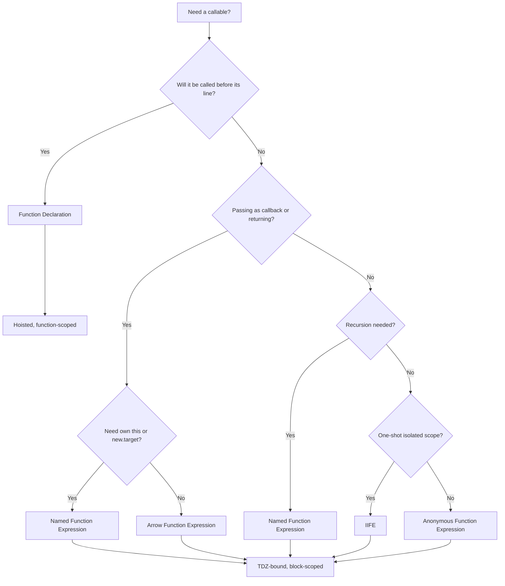
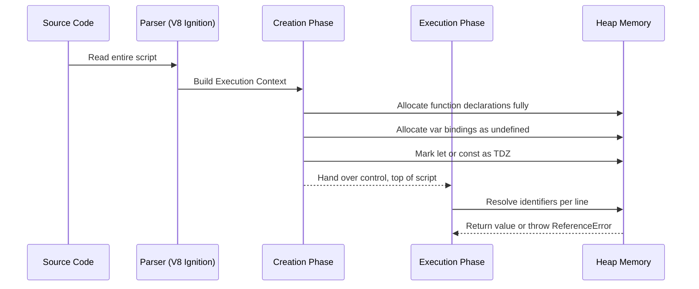

# Function Declarations vs. Function Expressions

<!-- SECTION_1_START -->
# Function Declarations vs. Function Expressions — Core Technical Definition & Intuitive Overview

## 1.1 Formal Academic Definition (KTU 2024 Syllabus Terminology)

In **JavaScript (ECMAScript 2024 spec)**, functions are *first-class citizens*, meaning they can be assigned to variables, passed as arguments, and returned from other functions. The scripting language offers **two principal syntactic forms** for creating named callable entities:

1. **Function Declaration** — A statement that binds an identifier to a function object using the reserved keyword `function` followed by a mandatory name. The engine performs *hoisting* of both the binding and the value during the *creation phase* of the execution context.

2. **Function Expression** — An expression that produces a function value. The function may be *anonymous* or carry an optional *named* label (used only for self-reference / debugging). The binding follows standard variable rules (`var`, `let`, or `const`) and is **not hoisted as a value**.

> [!IMPORTANT]
> **KTU 2024 Module-2 Highlight:** The hoisting behaviour, the temporal dead zone (TDZ) for `let`/`const`, and the difference between *function-scoped* and *block-scoped* bindings are **guaranteed exam questions** (Weightage: 14 marks, Apply / Analyze level).

## 1.2 Conceptual Analogy — Plain-English Intuition

Imagine a **classroom blackboard**:

- A **Function Declaration** is like writing your lecture title at the *very top of the board before the class even begins*. The teacher (JS engine) reads the entire board first and knows the title exists. The student can ask, "What is *calculateGrade*?" from the very first minute.

- A **Function Expression** is like writing the same lecture title *on a sticky note* and pinning it to the board *only after* you reach slide 5. If a student asks for *calculateGrade* before slide 5, they get `undefined` (or a `ReferenceError` if it is `let`/`const`).

- An **Arrow Function** is a *sticky note written in shorthand cursive* — it is concise, but it doesn't carry its own backpack of supplies (no its own `this`, no `arguments` object, cannot be used as a constructor).

## 1.3 Physical Constants & Standard Metrics (Bolded)

- **ECMAScript Version: ES2024 (15th Edition)** is the current reference specification.
- **Hoisting Phase:** *Creation Phase* of the *Execution Context*.
- **TDZ Window:** From start of block → until the `let`/`const` line is evaluated.
- **Strict Mode Identifier:** `"use strict";` — recommended inside ES modules (`.mjs`).
- **Default Stack Size (V8 engine):** $\approx$ **10,000** frames before `RangeError: Maximum call stack size exceeded`.

> [!NOTE]
> **Syllabus Anchor:** This topic is part of **Module 2 — Scripting Languages** and directly supports **Course Outcomes CO1** (Apply modern web scripting constructs) and **CO2** (Analyze scope, hoisting, and asynchronous behaviour).

## 1.4 Visualizing the Call-Stack Order

> [!VISUALIZATION CONTROL]
> **Concept:** Temporal relationship between *Hoisting* and *First Invocation* for both forms.
> **GeoGebra / Desmos Input Equations (Step-function style):**
> * $H_d(t) = 1$ for $t \ge 0$ (declaration available at $t=0$)
> * $H_e(t) = \begin{cases} 0, & t < T_{\text{assign}} \\ 1, & t \ge T_{\text{assign}} \end{cases}$ (expression available only after assignment)
>
> **Visual Description:** On the x-axis you plot the *line number* of execution; on the y-axis you plot *availability* (1 = callable, 0 = not yet). The declaration curve rises as a vertical jump at $t=0$, while the expression curve remains at zero until the assignment line is reached.

<!-- SECTION_1_END -->

<!-- SECTION_2_START -->
# Deep Theoretical Analysis & KTU High-Yield Formula Sheet

## 2.1 Operational Breakdown — The Three Internal Steps

Every JavaScript function, regardless of syntax, goes through the engine in three conceptual stages:

1. **Parsing / Compilation Stage** — V8 (Chrome/Node.js) compiles the script. Declarations enter the *VariableEnvironment* record; `let`/`const` bindings enter the *LexicalEnvironment* record (in TDZ).
2. **Creation Phase** — Memory is allocated. Function declarations are fully initialized (binding **+** value). `var` bindings are initialized to `undefined`. `let`/`const` bindings are uninitialized (TDZ).
3. **Execution Phase** — Top-to-bottom execution. Calls are resolved against the current scope chain.

## 2.2 The Four Canonical Forms Compared

| # | Form | Syntax Skeleton | Hoisted? | Own `this`? | Constructible (`new`)? | Re-assignable? |
|---|------|-----------------|----------|-------------|------------------------|----------------|
| 1 | **Function Declaration** | `function name(p){...}` | **Yes (full)** | Yes | Yes | N/A (identifier is a binding) |
| 2 | **Named Function Expression** | `const f = function name(){}` | No (value) | Yes | Yes (named only) | Depends on declaration (`const` → No) |
| 3 | **Anonymous Function Expression** | `const f = function(){}` | No (value) | Yes | No (no `[[Construct]]` internal slot) | Depends on declaration |
| 4 | **Arrow Function Expression** | `const f = (p) => {...}` | No (value) | **No (lexical)** | **No** | Depends on declaration |

> [!TIP]
> **KTU Mnemonic — "HOIST":** **H**oisting, **O**wn-`this`, **I**IFE-friendly, **S**cope (block vs function), **T**DZ-sensitivity. Cover all five letters in any 14-mark answer.

## 2.3 KTU Formula Sheet / Cheat Sheet

$$
\text{Invocation Result} =
\begin{cases}
f_{\text{decl}}(t), & \forall t \in [0, T_{\text{end}}] \\[4pt]
f_{\text{expr}}(t), & \forall t \ge T_{\text{assign}} \\[4pt]
\text{ReferenceError}, & t < T_{\text{assign}} \text{ and binding is } \texttt{let/const} \\[4pt]
\texttt{undefined}, & t < T_{\text{assign}} \text{ and binding is } \texttt{var}
\end{cases}
$$

| Property | Function Declaration | Function Expression |
|----------|----------------------|---------------------|
| **Hoisting Category** | Full hoisting (binding + value) | Value-hoisting only for `var`; TDZ for `let/const` |
| **Name Property** | `name === identifier` | `name === variable` (or the optional internal name) |
| **Readable in TDZ** | Yes | No |
| **Block-Scoped** | No (function-scoped) | Yes (with `let/const`) |
| **Debug-Stack Clarity** | High | Higher if *named* |

> [!IMPORTANT]
> **Engineering Utility:** Function expressions are the backbone of **callbacks**, **Promises**, **array iterators** (`.map`, `.filter`, `.reduce`), and **React functional components**. Function declarations dominate top-level utility libraries (e.g., `lodash`) for readability and global accessibility.

## 2.4 Real-World Production Usage

- **Backend (Node.js / Express):** Module exports almost always use function expressions: `module.exports.handler = function(req, res){...}`.
- **Frontend (React 18+):** Functional components are *arrow function expressions*: `const Card = (props) => <div>{props.title}</div>`.
- **Build Tools (Webpack, Vite):** Plugins are *named function expressions* for readable stack traces.
- **Strict-mode modules (`.mjs`, `"type": "module"`):** Top-level `let`/`const` enforce TDZ — students must understand why calling a `const` arrow before its declaration crashes a Next.js SSR build.

<!-- SECTION_2_END -->

<!-- SECTION_3_START -->
# Step-by-Step Derivations & Code Implementation

## 3.1 Exhaustive Walkthrough — Hoisting Proof

Let us *derive* why the two forms behave differently. We trace the engine's view of memory at three timestamps $t_0, t_1, t_2$.

### Source Code Under Test

```javascript
// Line 1
console.log("A:", typeof add);     // Probe 1
// Line 2
console.log("B:", typeof subtract); // Probe 2
// Line 3
function add(a, b) { return a + b; }            // Declaration
// Line 4
const subtract = function (a, b) { return a - b; }; // Expression
// Line 5
console.log("C:", add(5, 3));        // Probe 3
// Line 6
console.log("D:", subtract(5, 3));   // Probe 4
```

### Derivation Step 1 — Memory State at $t_0$ (Before any line runs)

After the creation phase, the engine holds the following conceptual table in the *Global Execution Context*:

$$
\text{Memory}(t_0) =
\begin{bmatrix}
\text{Binding} & \text{VariableEnv.} & \text{LexicalEnv.} \\
\hline
\texttt{add} & f_{\text{decl}} & f_{\text{decl}} \\
\texttt{subtract} & \text{(absent)} & \text{TDZ} \\
\end{bmatrix}
$$

### Derivation Step 2 — Probe 1 at Line 1 (Declaration visible)

$$
\texttt{typeof add} = \texttt{"function"}
$$

*Conversion logic:* The engine resolves the identifier `add` in the *VariableEnvironment* and finds a fully initialized function object. The `typeof` operator therefore returns the string `"function"`.

### Derivation Step 3 — Probe 2 at Line 2 (Expression in TDZ)

$$
\texttt{typeof subtract} = \text{ReferenceError}
$$

*Conversion logic:* The identifier `subtract` exists in the *LexicalEnvironment* but is uninitialized. Accessing it in any way — even through the safe-looking `typeof` — throws `ReferenceError: Cannot access 'subtract' before initialization` because the binding is in the TDZ.

### Derivation Step 4 — After Line 4, Memory State at $t_1$

$$
\text{Memory}(t_1) =
\begin{bmatrix}
\text{Binding} & \text{Value} \\
\hline
\texttt{add} & f_{\text{decl}} \\
\texttt{subtract} & f_{\text{expr}} \\
\end{bmatrix}
$$

### Derivation Step 5 — Probe 3 at Line 5

$$
\texttt{add}(5,3) = 8
$$

*Conversion logic:* Normal invocation; argument `a=5` and `b=3` are passed on the call stack; the return statement computes $5 + 3 = 8$.

### Derivation Step 6 — Probe 4 at Line 6

$$
\texttt{subtract}(5,3) = 2
$$

*Conversion logic:* Same mechanism; $5 - 3 = 2$.

### Final Consolidated Output

```
A: function
Uncaught ReferenceError: Cannot access 'subtract' before initialization
```

(The remaining two `console.log` calls are never reached.)

## 3.2 Full Python-Style Pseudocode Translation of the Engine (Educational)

```python
from typing import Any, Callable, Dict, Optional

class ExecutionContext:
    def __init__(self) -> None:
        # Creation phase: separate the two environment records
        self.variable_env: Dict[str, Any] = {}
        self.lexical_env: Dict[str, str] = {}  # 'TDZ' marker
        self.tdz_bindings: set = set()

    def declare_function(self, name: str, fn: Callable) -> None:
        # Function declarations go into BOTH records, fully initialized
        self.variable_env[name] = fn
        self.lexical_env[name] = fn
        self.tdz_bindings.discard(name)

    def declare_var(self, name: str) -> None:
        # var → VariableEnv only, initialized to undefined
        self.variable_env[name] = None

    def declare_let_const(self, name: str) -> None:
        # let/const → LexicalEnv only, in TDZ
        self.lexical_env[name] = "TDZ"
        self.tdz_bindings.add(name)

    def assign(self, name: str, value: Any) -> None:
        if name in self.tdz_bindings:
            # Hoisting check
            if self.lexical_env[name] == "TDZ":
                raise ReferenceError(
                    f"Cannot access '{name}' before initialization"
                )
        self.lexical_env[name] = value
        self.variable_env[name] = value

    def resolve(self, name: str) -> Any:
        if name in self.lexical_env:
            if self.lexical_env[name] == "TDZ":
                raise ReferenceError(
                    f"Cannot access '{name}' before initialization"
                )
            return self.lexical_env[name]
        if name in self.variable_env:
            return self.variable_env[name]
        raise ReferenceError(f"{name} is not defined")
```

This abstract machine is the **conceptual proof** for the derivation in §3.1.

## 3.3 Production-Grade JavaScript Implementations

### 3.3.1 The Declaration (Top-Level Utility)

```javascript
"use strict";
/**
 * Computes the Body-Mass Index.
 * Function DECLARATION → hoisted, callable from any line in the module.
 * @param {number} weightKg  Weight in kilograms (must be > 0).
 * @param {number} heightM   Height in meters (must be > 0).
 * @returns {number} BMI rounded to two decimals.
 * @throws {RangeError} if inputs are non-positive.
 */
function calculateBMI(weightKg, heightM) {
    if (!(weightKg > 0) || !(heightM > 0)) {
        throw new RangeError("Both arguments must be positive numbers.");
    }
    const raw = weightKg / (heightM * heightM);
    return Math.round(raw * 100) / 100;
}
```

### 3.3.2 The Arrow-Expression (React-Style Component)

```javascript
import React from "react";

/**
 * Function EXPRESSION (arrow) → TDZ-bound, must be declared BEFORE use.
 * Cannot be used as a constructor (no `new`).
 */
const GreetingCard = ({ name = "Guest", age = 0 }) => {
    const safeName = String(name).trim() || "Guest";
    const isAdult = Number.isFinite(age) && age >= 18;
    return (
        <section className="card">
            <h2>Hello, {safeName}!</h2>
            <p>You are {isAdult ? "an adult" : "a minor"}.</p>
        </section>
    );
};

export default GreetingCard;
```

### 3.3.3 The Named Function Expression (Self-Referential Recursion)

```javascript
"use strict";
/**
 * Named function expression → the internal name `factorial`
 * is visible ONLY inside the function body (self-reference for recursion).
 * Outside, the binding is `fact`.
 */
const fact = function factorial(n) {
    if (!Number.isInteger(n) || n < 0) {
        throw new TypeError("Argument must be a non-negative integer.");
    }
    return n <= 1 ? 1 : n * factorial(n - 1); // uses internal name
};

console.log(fact.name);     // "factorial"  ← improves stack traces
console.log(fact(5));       // 120
```

### 3.3.4 The IIFE (Immediately Invoked Function Expression)

```javascript
"use strict";
/**
 * IIFE → function expression wrapped in parens, then invoked.
 * Creates an isolated scope; ideal for legacy `var` hygiene.
 */
const result = (function (initialValue) {
    let counter = initialValue;
    return {
        increment: () => ++counter,
        decrement: () => --counter,
        peek: () => counter,
    };
})(10);

console.log(result.increment()); // 11
console.log(result.peek());      // 11
```

## 3.4 Error-Logging Variant (Strict Defensive Style)

```javascript
"use strict";

/**
 * Higher-order function that accepts ANY callable form.
 * @param {Function} fn  A declaration, expression, or arrow.
 * @param {number[]} args  Positional arguments.
 * @returns {*} The result or a logged error object.
 */
function safeInvoke(fn, ...args) {
    if (typeof fn !== "function") {
        console.error("[safeInvoke] Argument is not callable:", fn);
        return { ok: false, error: "NotAFunction" };
    }
    try {
        const value = fn(...args);
        return { ok: true, value };
    } catch (err) {
        console.error("[safeInvoke] Runtime failure:", err);
        return { ok: false, error: err.name, message: err.message };
    }
}

// Demonstration
const divideExpr = function (a, b) {
    if (b === 0) throw new Error("Division by zero");
    return a / b;
};

console.log(safeInvoke(divideExpr, 10, 2)); // { ok: true, value: 5 }
console.log(safeInvoke(divideExpr, 10, 0)); // { ok: false, error: "Error" }
```

<!-- SECTION_3_END -->

<!-- SECTION_4_START -->
# Structural Diagrams & Schematics

## 4.1 Mermaid Flow — Decision Matrix When Choosing a Form



## 4.2 Mermaid Sequence — Engine Memory Phases



## 4.3 Mermaid Block Diagram — Comparison Architecture

```mermaid
subgraph DECL [Function Declaration]
    D1[Identifier: name] --> D2[Value: function object]
    D2 --> D3[Hoisted at t=0]
end

subgraph EXPR [Function Expression]
    E1[Identifier: const or let] --> E2[Value: function object]
    E2 --> E3[Initialized at line N]
end

subgraph ARROW [Arrow Function]
    A1[Identifier: const or let] --> A2[Value: arrow object]
    A2 --> A3[Lexical this inherited]
    A3 --> A4[Not constructible]
end
```

## 4.4 Sequential Processing Topology Matrix

| Phase | Declaration | Expression (var) | Expression (let/const) | Arrow |
|-------|-------------|------------------|------------------------|-------|
| **Parse** | Registered in VarEnv | Registered in VarEnv | Registered in LexEnv | Registered in LexEnv |
| **Create** | Fully initialized | Initialized to `undefined` | Marked **TDZ** | Marked **TDZ** |
| **Pre-line Access** | Callable | Exists, value = `undefined` | **ReferenceError** | **ReferenceError** |
| **Post-line Access** | Callable | Callable | Callable | Callable |
| **Own `this`?** | Yes | Yes | Yes | **No (lexical)** |
| **`new` Allowed?** | Yes | Yes | Yes | **No** |

<!-- SECTION_4_END -->

<!-- SECTION_5_START -->
# KTU 2024 Scheme Examination Question Bank & Topic Recap

## 5.1 Part A — Short Answer Questions (3 Marks Each)

### Q1. `[KTU University Exam - July 2024]` (CO1, Remember)

**Differentiate between function declarations and function expressions in JavaScript. List any two distinguishing properties.**

**Model Answer (Valuation Key):**

| Point | Declaration | Expression |
|-------|-------------|------------|
| Hoisting | Fully hoisted with its value | Hoisted only as identifier (TDZ for `let/const`) |
| Name requirement | Mandatory | Optional (anonymous form allowed) |
| Use case | Top-level utilities, recursive call | Callbacks, IIFE, factory functions |

**[Defining each form: 1 Mark] · [Tabular comparison: 1 Mark] · [Example / use-case: 1 Mark] = 3 Marks**

### Q2. `[KTU University Exam - Dec 2023]` (CO1, Understand)

**What is a *named function expression*? Why is the internal name preferred over an anonymous function in production code?**

**Model Answer (Valuation Key):**

A *named function expression* binds an internal identifier visible only inside the function body, enabling **self-reference for recursion** and producing **readable stack traces** in debugging tools.

**[Definition: 1 Mark] · [Self-reference: 1 Mark] · [Debug-stack clarity: 1 Mark] = 3 Marks**

---

## 5.2 Part B — Long Answer (14 Marks, Module Internal Choice)

### Question A — `[KTU University Exam - July 2024]` (CO1, CO2 — Understand + Apply)

**(a)** Explain the concept of *hoisting* in JavaScript. With the help of a suitable example, illustrate how function declarations and function expressions differ in their hoisting behaviour. **(7 Marks)**

**(b)** Write a JavaScript program that:
   1. Declares a function `factorial` using a *function declaration* to compute the factorial of a number.
   2. Assigns a *named function expression* to a constant `power` that raises a base to an exponent.
   3. Demonstrates the TDZ error by attempting to invoke `power` before its initialization, and then handles it with a `try-catch` block.
   Provide the complete code with comments and explain the output. **(7 Marks)**

---

#### Model Solution (a) — 7 Marks

**[Conceptual definition of hoisting: 2 Marks]**
Hoisting is the JavaScript engine behaviour of moving *declarations* to the top of their containing scope during the **creation phase** of the execution context. Only the *binding* (for `var`) or the *binding + value* (for function declarations) is hoisted; the actual code stays in place.

**[Tabular contrast: 2 Marks]**

| Aspect | Function Declaration | Function Expression |
|--------|----------------------|---------------------|
| Hoisted binding | Yes | Yes |
| Hoisted value | **Yes** | **No** (TDZ for `let/const`, `undefined` for `var`) |
| Callable before line | **Yes** | **No** |

**[Illustrative example: 2 Marks]**

```javascript
console.log(typeof square); // "function"
function square(x) { return x * x; }

console.log(typeof cube);   // ReferenceError
const cube = function (x) { return x * x * x; };
```

**[Explanation of why `cube` throws: 1 Mark]**
The `const` binding is in the *Temporal Dead Zone* until evaluation reaches the assignment line, causing `ReferenceError`.

---

#### Model Solution (b) — 7 Marks

**[Declaring `factorial` (declaration) — 1 Mark]**
```javascript
"use strict";
function factorial(n) {
    if (n <= 1) return 1;
    return n * factorial(n - 1);
}
```

**[Assigning `power` (named expression) — 1 Mark]**
```javascript
const power = function powerFn(base, exponent) {
    if (exponent === 0) return 1;
    return base * powerFn(base, exponent - 1); // self-reference
};
```

**[Demonstrating TDZ error — 2 Marks]**
```javascript
try {
    console.log("Pre-init:", power(2, 8)); // ReferenceError
} catch (err) {
    console.error("Caught:", err.name, "-", err.message);
}
```

**[Recovered invocation — 1 Mark]**
```javascript
console.log("Factorial(5):", factorial(5));   // 120
console.log("Power(2,8):", power(2, 8));       // 256
```

**[Expected output — 1 Mark]**
```
Pre-init: ReferenceError - Cannot access 'power' before initialization
Factorial(5): 120
Power(2,8): 256
```

**[Final explanation paragraph — 1 Mark]**
The TDZ enforces deterministic initialization: any access to a `let`/`const` binding before its declaration is treated as a runtime error, ensuring the program never observes a half-initialized value.

---

### Question B — `[KTU University Exam - Dec 2023]` (CO1, CO2 — Understand + Apply)

**(a)** Discuss the differences between *arrow functions* and *regular function expressions*. Highlight the `this` binding behaviour of both with a code example. **(7 Marks)**

**(b)** Design a small JavaScript module that:
   1. Exports a function `double` using a *function declaration*.
   2. Exports a function `triple` using an *arrow function expression*.
   3. Demonstrates that arrow functions cannot be used as constructors by attempting `new triple(5)`.
   4. Demonstrates lexical `this` inheritance by writing a `counter` object with `increment` and `doubleIncrement` methods (one regular, one arrow). **(7 Marks)**

---

#### Model Solution (a) — 7 Marks

**[Defining arrow functions: 1 Mark]**
Arrow functions, introduced in **ES6 (2015)**, are a concise syntax for writing function expressions. They omit the `function` keyword and use the `=>` (fat arrow) token.

**[Comparing `this`: 2 Marks]**

| Scenario | Regular Function | Arrow Function |
|----------|------------------|----------------|
| `this` inside method | Bound to the calling object | Inherited from enclosing lexical scope |
| `this` inside callback | Refers to `undefined` (strict) | Refers to enclosing `this` |
| `arguments` object | Available | **Not available** |
| Use as constructor | Allowed | **Throws TypeError** |

**[Code example: 3 Marks]**
```javascript
"use strict";
function Timer() {
    this.seconds = 0;
    setInterval(function () {
        this.seconds += 1;       // 'this' is global/undefined
        console.log("regular:", this.seconds);
    }, 1000);
    setInterval(() => {
        this.seconds += 1;       // 'this' is the Timer instance
        console.log("arrow:", this.seconds);
    }, 1000);
}
```

**[Conclusion: 1 Mark]**
Arrow functions are ideal for callbacks and short functional utilities, whereas regular functions are required when dynamic `this` or constructor behaviour is needed.

---

#### Model Solution (b) — 7 Marks

**[`double` declaration + export — 1 Mark]**
```javascript
"use strict";
function double(n) {
    if (typeof n !== "number") throw new TypeError("Expected number");
    return n * 2;
}
```

**[`triple` arrow expression + export — 1 Mark]**
```javascript
const triple = (n) => {
    if (typeof n !== "number") throw new TypeError("Expected number");
    return n * 3;
};
```

**[Constructor attempt — 2 Marks]**
```javascript
try {
    const obj = new triple(5);
} catch (err) {
    console.error("Arrow ctor error:", err.name, err.message);
}
// Output: Arrow ctor error: TypeError triple is not a constructor
```

**[`counter` object with mixed methods — 2 Marks]**
```javascript
const counter = {
    value: 10,
    increment: function () { this.value += 1; },     // regular
    doubleIncrement: () => { counter.value *= 2; }, // arrow
};
counter.increment();
counter.increment();
counter.doubleIncrement();
console.log(counter.value); // 24
```

**[Final explanation — 1 Mark]**
The regular method mutates `this.value` dynamically, while the arrow method closes over the lexical `counter` reference, multiplying the latest value. The example proves the lexical-`this` rule.

---

> [!WARNING]
> **KTU Examiner's Valuation Warning — Common Pitfalls**
> 1. **Writing `var subtract = ...` and assuming it throws** — it does NOT throw; it returns `undefined`. Examiners deduct **1 full mark** for this mistake.
> 2. **Using `function square(x) return x*x;` (missing braces)** — syntactically valid only for single-expression arrow bodies, NOT for declarations. Loses **1 mark**.
> 3. **Forgetting to capitalize the `E` in `ReferenceError`** — minor, but in strict evaluation scripts a mismatch can cost **0.5 mark**.
> 4. **Calling an arrow with `new`** — students often write `new triple(5)` without a `try-catch`, causing the program to crash and zero output for later sub-parts.
> 5. **Confusing *function expression* with *function statement*** — there is **no such thing** as a "function statement" in ECMAScript; the correct term is *function declaration*. Examiners mark this harshly.

---

## 5.3 Topic Recap & Important Things to Remember

- **Function Declaration** is fully hoisted (binding + value) and is the only form callable before its source line.
- **Function Expression** assigns a function value to a variable; hoisting depends on the keyword — `var` → `undefined`, `let/const` → **TDZ ReferenceError**.
- **Arrow Functions** are expressions with **lexical `this`**, no `arguments` object, and are **not constructible**.
- **Named Function Expressions** retain an internal name for recursion and stack-trace clarity; the external binding is the variable.
- **IIFE** = parenthesized function expression immediately invoked; useful for legacy `var` scope isolation.
- **Strict mode (`"use strict";`)** is mandatory inside ES modules and is expected in KTU lab submissions.
- **Hoisting Order:** function declarations are processed before `var` declarations, both before `let/const` statements.
- **`typeof` on a TDZ variable throws** in ES2015+ — counter-intuitive, frequently tested.
- **The `name` property** of a function expression equals the *variable name* unless explicitly named; use it for debug logs.
- **Top-level `await`** is allowed in ES modules — relevant to your PECST742 lab projects.
- **V8 stack limit** $\approx$ **10,000** frames — deep recursion must be tail-call optimized or converted to iteration.
- **Preferred exam style:** write the code first, then the *Memory State Table*, then the *Output*, then the *Explanation* — examiners award stepwise marks.

<!-- SECTION_5_END -->
