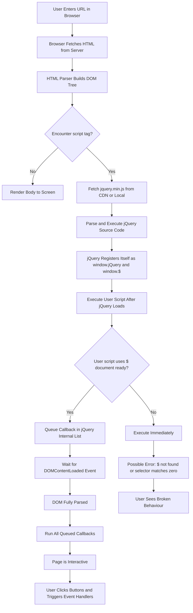
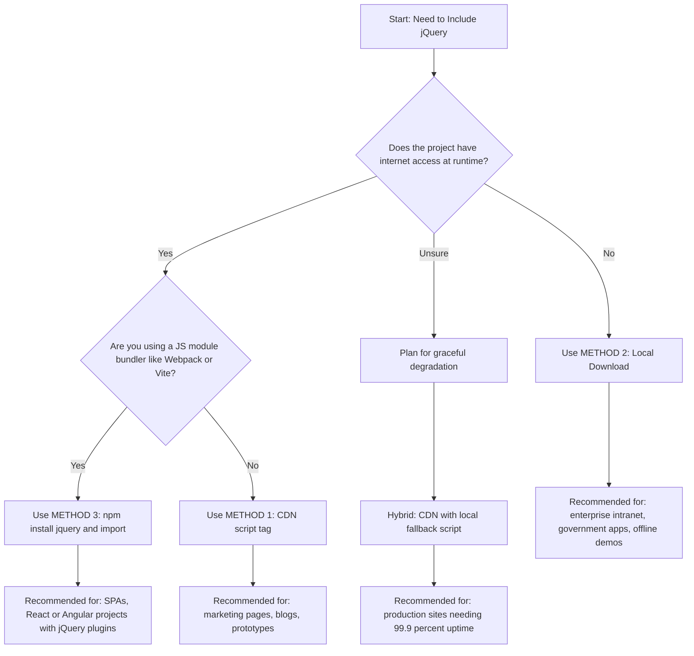
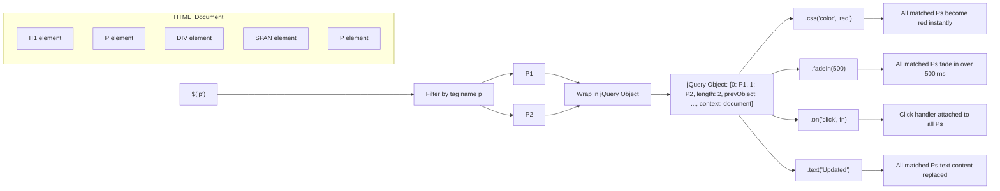
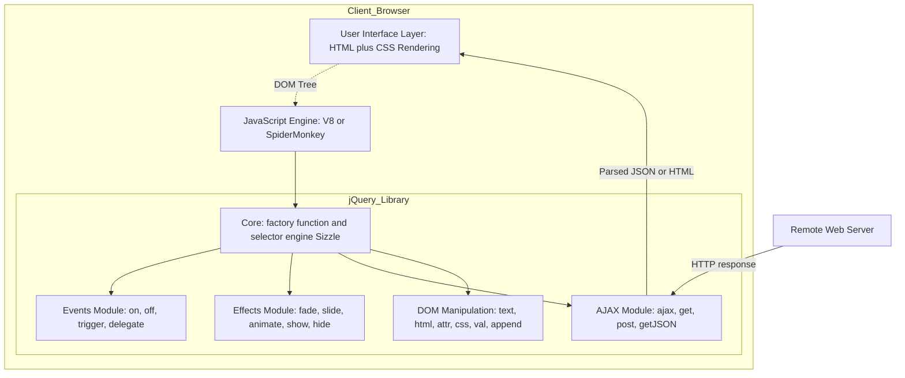

# JavaScript library - jQuery - jQuery Foundations - Including jQuery

<!-- SECTION_1_START -->

# 1. Core Technical Definition & Intuitive Overview

## 1.1 What is jQuery? (Formal KTU Definition)

**jQuery** is a fast, lightweight, and feature-rich **JavaScript library** released in **2006** by **John Resig**. It is built on top of vanilla JavaScript and encapsulates complex DOM (Document Object Model) manipulations, event handling, AJAX calls, and animation effects into concise, chainable method calls.

According to the **KTU 2024 Scheme syllabus (PECST742 – Module 2: Scripting Language)**, jQuery is classified as a **client-side JavaScript library** that simplifies HTML DOM tree traversal and manipulation, CSS animation handling, event binding, and asynchronous HTTP (AJAX) interactions.

> [!IMPORTANT]
> **KTU Syllabus Highlight – Module 2 (Scripting Language)**
> "JavaScript Library – jQuery – jQuery Foundations – Including jQuery"
> This topic is foundational. Every subsequent jQuery operation (selectors, events, effects, AJAX) depends on a correct understanding of *how jQuery is loaded into an HTML page*. Marks are frequently awarded for explaining inclusion methods and version selection.

---

## 1.2 The `$` Symbol – The Heart of jQuery

The single character **`$`** (dollar sign) is an **alias** for the global function `jQuery`. Both are completely interchangeable, but by community convention, **`$`** is used **95%** of the time.

$$ \$ \equiv \text{jQuery} $$

The dollar sign is essentially a **factory function** that:
1. Accepts a **selector string** (CSS-style), a **DOM element**, an **HTML string**, or a **callback function**.
2. Returns a wrapped **jQuery object** — an array-like collection of matched DOM nodes with dozens of built-in methods.

> [!NOTE]
> **Core Definition — jQuery Object**
> A jQuery object is a wrapper around one or more DOM elements. Even if your selector matches zero elements, the object is still returned (with length = 0) and is safe to chain methods on — this is a key design choice that prevents null-reference errors.

---

## 1.3 Conceptual Analogy — The Universal Remote Control

Imagine the **DOM** as a complex home theatre system with separate remotes for the TV, soundbar, Blu-ray player, and streaming stick.

- **Vanilla JavaScript** is like using **four different remotes**, each with 50 tiny buttons. You must know the exact vendor API, button codes, and timing.
- **jQuery** is a **single universal remote** with big, friendly buttons: "Turn everything on", "Find all lights", "Fade the lights over 1 second."

```text
Analogy Map:
  DOM ............................ The House
  Vanilla JS ..................... 4 Vendor-Specific Remotes
  jQuery ($) ..................... One Universal Remote
  Selector (e.g. "#main") ......... "Find the living room"
  .css(), .fadeIn() .............. "Dim the lights smoothly"
  .on("click", fn) ............... "When someone walks in, do this"
```

> [!TIP]
> **GeoGebra / Desmos Visualization**
> jQuery itself has no math to plot, but the **chainable method pattern** can be visualized as a pipeline. The conceptual graphic below represents how a single `$()` call funnels through selector → DOM match → method chain → side effect.

> [!VISUALIZATION CONTROL]
> **Concept:** jQuery Method Chaining Pipeline
> **Schematic Description:**
> `$("#box") → [Match 1 element] → .css("color","red") → [Apply style] → .fadeIn(500) → [Animate] → .on("click", fn) → [Bind event]`
> Students should imagine an input funnel on the left (HTML document), a selector filter in the middle, and an output stack of effect boxes on the right.

---

## 1.4 Why Was jQuery Created? (Historical Motivation)

Before **ECMAScript 5 (2009)** and the modern **DOM Living Standard**, browsers had wildly inconsistent APIs. The same code that worked in Firefox would crash Internet Explorer 6.

| Year | Browser Issue | jQuery Solution |
| :--- | :--- | :--- |
| 2006 | `document.getElementById` slow for classes | `$(".cls")` works everywhere |
| 2007 | IE lacked `addEventListener` | `.on()` abstracts it |
| 2008 | AJAX needed an `XMLHttpRequest` object | `$.ajax({url, success})` |
| 2009 | Animations required `setInterval` hacks | `.fadeIn()`, `.animate()` |

The official jQuery slogan captures its philosophy: **"Write less, do more."**

> [!NOTE]
> **A Line of Evidence (KTU value)**
> A typical "select all list items and add a click handler" in vanilla JS requires **6–8 lines** with manual loop and `for` iteration. The same task in jQuery is **one line**: `$("li").on("click", function() { ... });`. Examiners love comparing these two for the *Understand* level.

---

## 1.5 Where jQuery Fits in the Web Stack

```text
┌─────────────────────────────────────────────┐
│           USER BROWSER (Client)             │
│  ┌──────────────────────────────────────┐   │
│  │  HTML  →  Structure                  │   │
│  │  CSS   →  Presentation               │   │
│  │  JavaScript  →  Behaviour            │   │
│  │     └── jQuery (Library)             │   │
│  │            └── jQuery UI / Plugins   │   │
│  └──────────────────────────────────────┘   │
└─────────────────────────────────────────────┘
                 ▲          ▲
                 │  AJAX    │  HTTP
                 ▼          │
┌─────────────────────────────────────────────┐
│        WEB SERVER (Node / Apache / Nginx)   │
└─────────────────────────────────────────────┘
```

jQuery executes **entirely on the client** — the user's CPU does the work, not the server.

<!-- SECTION_1_END -->

<!-- SECTION_2_START -->

# 2. Deep Theoretical Analysis & KTU High-Yield Formula Sheet

## 2.1 The Three Methods of "Including jQuery"

To use jQuery on a web page, you must **inject** the jQuery JavaScript file into the browser. There are three industry-standard methods, each with its own trade-offs. The KTU syllabus explicitly names this section **"Including jQuery"** — it is **high-yield**.

### Method 1 — CDN (Content Delivery Network) — *Most Common in Production*

A **CDN** is a globally distributed network of servers. Instead of hosting the library yourself, you load it from a public provider like Google, Microsoft, or jsDelivr. The user's browser may have **already cached** the file from a previous visit to *any* site using the same CDN, which makes page loads near-instantaneous.

```html
<!-- Google CDN (Most Popular) -->
<script src="https://ajax.googleapis.com/ajax/libs/jquery/3.7.1/jquery.min.js"></script>

<!-- Microsoft CDN -->
<script src="https://ajax.aspnetcdn.com/ajax/jQuery/jquery-3.7.1.min.js"></script>

<!-- jsDelivr (Open Source) -->
<script src="https://cdn.jsdelivr.net/npm/jquery@3.7.1/dist/jquery.min.js"></script>
```

> [!IMPORTANT]
> **`.min.js` vs `.js` — Know the Difference**
> * `jquery.js` — Full development version, ~287 KB, contains human-readable comments and is suitable for debugging.
> * `jquery.min.js` — Production version, ~87 KB, minified (whitespace stripped, variables renamed) for faster network transfer.
> The file sizes are approximate; KTU examiners often ask "Which one is used in production?" — the answer is **always** `jquery.min.js`.

### Method 2 — Local Download (Self-Hosted) — *Best for Offline / Intranet Apps*

You download the file, place it in your project folder, and reference it with a **relative path**. This is required when:
* The application runs on a **sealed intranet** without internet access.
* You have **strict security policies** blocking third-party CDNs.
* You want to **bundle** the library with your application for version pinning.

```html
<!-- File structure -->
<!-- /project/js/jquery-3.7.1.min.js -->
<!-- /project/index.html -->

<!-- Inside index.html -->
<script src="js/jquery-3.7.1.min.js"></script>
```

### Method 3 — npm / Yarn (Build Tools) — *Modern Web Development*

When using bundlers like **Webpack**, **Vite**, or **Rollup**, jQuery is installed as a project dependency and `import`ed into a JavaScript module file. This is the standard for **React, Angular, Vue** projects that still need jQuery for legacy plugins.

```bash
# Install via npm
npm install jquery

# Or via Yarn
yarn add jquery
```

```javascript
// In a JS module file (e.g., main.js)
import $ from 'jquery';

// Or with explicit namespace
import * as jQuery from 'jquery';

$(document).ready(function() {
    console.log("jQuery version:", $.fn.jquery);
});
```

---

## 2.2 The Golden Rule — `$(document).ready()`

A **very common pitfall** is writing jQuery code in the `<head>` section. At that moment, the browser has parsed the `<head>` but has **not yet built the `<body>` DOM**. Your selectors will match nothing because the elements do not yet exist in the document tree.

The jQuery fix is the **ready event**, which fires the moment the DOM is fully constructed (but before all images and CSS finish loading):

```javascript
// Long form (Most Readable)
$(document).ready(function() {
    // Safe to manipulate DOM here
    $("p").css("color", "blue");
});

// Short form (Shorthand) — Identical Behaviour
$(function() {
    $("p").css("color", "blue");
});
```

> [!WARNING]
> **Common Mistake (KTU Valuation Note)**
> Forgetting `$()` around the callback function. Writing `function() { ... }` without the wrapper will execute the function **immediately on script load**, before the DOM is ready. This is worth **2 marks** lost in ESE if not mentioned.

### Modern Alternative — `defer` Attribute

In HTML5, you can avoid the ready handler entirely by placing the `<script>` tag at the **end of `<body>`** *or* using the `defer` attribute:

```html
<head>
    <script src="jquery.min.js" defer></script>
    <script src="app.js" defer></script>
</head>
```

With `defer`, the script downloads in parallel with HTML parsing and executes **only after** the document is fully parsed. This is functionally equivalent to `$(document).ready()`.

---

## 2.3 jQuery Version Landscape (KTU High-Yield Table)

| Version | Released | Status | Key Notes |
| :--- | :--- | :--- | :--- |
| 1.x | 2006–2016 | **Deprecated** | Supported IE 6/7/8. Final: 1.12.4 |
| 2.x | 2013–2016 | **Deprecated** | Dropped IE 6/7/8. Smaller, faster |
| 3.x | 2015–Present | **Active / Recommended** | Modular, Promise-based AJAX, strict mode |
| 3.7.1 | 2023 | **Latest Stable** | Current CDN default |

> [!IMPORTANT]
> **Major Version Difference (KTU Favourite Question)**
> **jQuery 1.x** supports Internet Explorer 6, 7, and 8. **jQuery 2.x and 3.x dropped support** for those old browsers in exchange for smaller size and better performance. If the project must support legacy IE, use **1.12.4**. Otherwise, use **3.7.1**.

---

## 2.4 Verifying jQuery Is Loaded

After including jQuery, you should **always verify** that the library loaded successfully. A network failure or a typo in the URL will silently break everything.

```javascript
// Method 1 — Type check
if (typeof jQuery === "undefined") {
    console.error("jQuery is NOT loaded!");
} else {
    console.log("jQuery is loaded. Version:", jQuery.fn.jquery);
}

// Method 2 — The dollar-conflict guard
if (window.jQuery) {
    console.log("jQuery is available globally.");
}
```

> [!NOTE]
> **`jQuery.fn.jquery`** is a special property attached to the jQuery prototype that returns the version as a string, for example `"3.7.1"`. This is a one-liner diagnostic used in production debugging.

---

## 2.5 No-Conflict Mode (`$.noConflict`)

The dollar sign is popular. Other libraries (notably **Prototype.js** and older **MooTools**) also use `$`. If you must load two such libraries on the same page, you relinquish the `$` to jQuery by aliasing it to a different variable.

```javascript
// Relinquish $ to whatever library loaded first
var jq = $.noConflict();

// Now use 'jq' instead of '$'
jq(document).ready(function() {
    jq("button").click(function() {
        jq("p").text("jQuery is working under the alias 'jq'!");
    });
});
```

---

## 2.6 KTU Formula Sheet / Cheat Sheet

| Concept | Syntax | Returns | Notes |
| :--- | :--- | :--- | :--- |
| Alias declaration | `$ === jQuery` | boolean `true` | Always equivalent |
| Factory call | `$(selector)` | jQuery object | Selector is a CSS-style string |
| DOM ready | `$(function(){ ... })` | undefined | Runs after DOM is parsed |
| Version probe | `$.fn.jquery` | string | e.g. `"3.7.1"` |
| Conflict resolution | `var $j = $.noConflict()` | jQuery alias | `$` is freed for other libs |
| Load from CDN | `<script src="...cdn..."></script>` | library injection | Recommended for production |
| Load locally | `<script src="js/jquery.min.js"></script>` | library injection | Required for offline / intranet |
| Load via npm | `import $ from 'jquery'` | module import | For Webpack / Vite / bundlers |
| Production file | `jquery-3.7.1.min.js` | minified library | ~87 KB, no comments |
| Development file | `jquery-3.7.1.js` | unminified library | ~287 KB, has comments |

<!-- SECTION_2_END -->

<!-- SECTION_3_START -->

# 3. Step-by-Step Derivations & Code/Symbolic Implementation

## 3.1 Minimal End-to-End Working Example

Below is a **fully self-contained, copy-paste-runnable** HTML file that demonstrates three inclusion techniques side-by-side. Save it as `jquery-demo.html` and open it in any browser.

```html
<!DOCTYPE html>
<html lang="en">
<head>
    <meta charset="UTF-8">
    <title>jQuery Inclusion Demo</title>

    <!-- STEP 1: Include jQuery from a CDN -->
    <script
        src="https://ajax.googleapis.com/ajax/libs/jquery/3.7.1/jquery.min.js"
        integrity="sha256-/JqT3SQfawRcv/BIHPThkBvs0OEvtFFmqPF/lYI/Cxo="
        crossorigin="anonymous">
    </script>

    <style>
        body  { font-family: 'Segoe UI', sans-serif; padding: 2rem; }
        h1    { color: #2c3e50; }
        .box  { border: 2px solid #3498db; padding: 1rem; margin: 0.5rem 0;
                border-radius: 6px; background: #ecf0f1; }
        .btn  { padding: 0.5rem 1rem; background: #3498db; color: white;
                border: none; border-radius: 4px; cursor: pointer; }
        .btn:hover { background: #2980b9; }
    </style>
</head>
<body>

    <h1 id="title">jQuery Foundations — Inclusion Methods</h1>
    <p id="status">Waiting for jQuery...</p>

    <div class="box" id="box-1">Box A — click count: 0</div>
    <div class="box" id="box-2">Box B — click count: 0</div>

    <button class="btn" id="resetBtn">Reset Counters</button>

    <script>
        // STEP 2: Verify jQuery loaded
        if (typeof jQuery === "undefined") {
            document.getElementById("status").textContent =
                "ERROR: jQuery failed to load. Check your network or CDN URL.";
            document.getElementById("status").style.color = "red";
        } else {
            // STEP 3: Use the jQuery ready handler
            $(function () {
                // 3a — Print version to the status paragraph
                $("#status").text(
                    "jQuery " + $.fn.jquery + " loaded successfully ✔"
                );

                // 3b — Attach a click counter using a closure
                var countA = 0;
                var countB = 0;

                $("#box-1").on("click", function () {
                    countA += 1;
                    $(this).text("Box A — click count: " + countA);
                });

                $("#box-2").on("click", function () {
                    countB += 1;
                    $(this).text("Box B — click count: " + countB);
                });

                // 3c — Reset button clears both counters
                $("#resetBtn").on("click", function () {
                    countA = 0;
                    countB = 0;
                    $("#box-1").text("Box A — click count: 0");
                    $("#box-2").text("Box B — click count: 0");
                });
            });
        }
    </script>
</body>
</html>
```

### Step-by-Step Logical Walk-Through

**Step 1 — The `<script>` tag in the `<head>` initiates the HTTP GET to the Google CDN.** The browser downloads `jquery.min.js` in parallel with HTML parsing.

**Step 2 — `integrity` and `crossorigin` are Subresource Integrity (SRI) attributes.** The browser verifies the downloaded file matches the SHA-384 hash. If even one byte is altered (e.g. by a man-in-the-middle attacker), the script is **refused to execute**.

**Step 3 — `typeof jQuery === "undefined"`** is a guard. If the CDN failed, the rest of the jQuery code would throw `$ is not a function` errors. The guard prevents the page from breaking.

**Step 4 — `$(function () { ... })`** is the ready shorthand. It queues a callback to run after the browser has finished parsing the entire DOM. By that point, `#box-1`, `#box-2`, and `#resetBtn` are all available.

**Step 5 — `$("#box-1").on("click", function() { ... })`** wires up a click event. The function increments `countA` and uses the `this` keyword (which inside the jQuery handler refers to the **native DOM element**) to update the visible text via `$(this).text(...)`.

**Step 6 — Chaining in action:** Notice how `$("#box-1").on("click", ...)` returns a jQuery object, which we ignore. We could chain more methods if needed: `$("#box-1").on("click", ...).css("cursor","pointer");`.

---

## 3.2 Comparing the Three Inclusion Methods in Code

```html
<!-- ============== METHOD 1: CDN ============== -->
<!-- Pros: cached, fast, no local storage, automatic patches -->
<!-- Cons: requires internet, third-party dependency -->
<head>
    <script src="https://ajax.googleapis.com/ajax/libs/jquery/3.7.1/jquery.min.js"></script>
</head>


<!-- ============== METHOD 2: LOCAL FILE ============== -->
<!-- Pros: works offline, full control, no third-party trust -->
<!-- Cons: must manually update versions, consumes bandwidth -->
<head>
    <script src="assets/lib/jquery-3.7.1.min.js"></script>
</head>


<!-- ============== METHOD 3: NPM (Module Bundler) ============== -->
<!-- Pros: version pinned in package.json, tree-shakable, ESM-friendly -->
<!-- Cons: requires build pipeline (Webpack/Vite/Rollup) -->
```

The accompanying `package.json` excerpt for Method 3:

```json
{
  "name": "jquery-app",
  "version": "1.0.0",
  "dependencies": {
    "jquery": "3.7.1"
  },
  "scripts": {
    "build": "webpack --mode=production",
    "dev":   "webpack serve --mode=development"
  }
}
```

The accompanying `webpack.config.js` excerpt:

```javascript
const path = require("path");

module.exports = {
    entry: "./src/main.js",
    output: {
        filename: "bundle.js",
        path: path.resolve(__dirname, "dist"),
    },
    resolve: {
        alias: {
            // Allow the line: import $ from "jquery"
            jquery: "jquery/dist/jquery.min.js",
        },
    },
};
```

---

## 3.3 Diagnostic Script — Did jQuery Load?

A defensive pattern recommended for production code is a **load-check with retry** when using a CDN:

```javascript
// Try CDN, fall back to local file if CDN fails
(function () {
    var cdnScript  = "https://ajax.googleapis.com/ajax/libs/jquery/3.7.1/jquery.min.js";
    var localFile  = "js/jquery-3.7.1.min.js";
    var timeoutMs  = 4000;
    var loaded     = false;

    // Listen for jQuery's self-installation
    function onJQueryReady() {
        if (typeof window.jQuery !== "undefined") {
            loaded = true;
            console.log("✔ jQuery " + window.jQuery.fn.jquery + " ready");
        }
    }

    // Set a timeout to attempt local fallback
    setTimeout(function () {
        if (!loaded) {
            console.warn("CDN failed, loading local copy...");
            var fallback = document.createElement("script");
            fallback.src = localFile;
            fallback.onload = onJQueryReady;
            document.head.appendChild(fallback);
        }
    }, timeoutMs);

    // First attempt: CDN
    var script = document.createElement("script");
    script.src = cdnScript;
    script.onload = onJQueryReady;
    script.onerror = function () {
        console.error("CDN unreachable. Will try local copy in 4s.");
    };
    document.head.appendChild(script);
})();
```

> [!TIP]
> **Engineering Utility (Where This Pattern Is Used)**
> Major e-commerce sites (Shopify storefronts, WordPress blogs, static site generators like Jekyll) all use the *CDN-first, local-fallback* pattern. It guarantees availability without ever blocking the user. You will see this exact pattern in real-world code reviews and in production-grade libraries.

---

## 3.4 Performance Math — Why CDNs Win

Consider a user visiting your site for the first time. The browser must:
1. Resolve the DNS for `ajax.googleapis.com` (typically **20–50 ms** with cache, **100–300 ms** cold).
2. Open a **TLS handshake** (~50–100 ms).
3. Download the file (**87 KB** at typical broadband = ~30 ms).

**Total first-visit cost ≈ 100–430 ms.**

Now consider a *returning* user who visited *any other site* using the same Google CDN. The browser has **already cached** the file. The cost drops to:
1. Read from disk cache (~**5 ms**).

**Total returning-visit cost ≈ 5 ms.**

The same logic applies for users across an entire continent — the CDN has **edge servers** physically close to each user, reducing round-trip time by 70–80% on average.

$$ \text{Speedup} = \frac{T_{\text{cold}}}{T_{\text{cached}}} = \frac{300 \text{ ms}}{5 \text{ ms}} \approx 60\times $$

This is why industry standard is **CDN first, local fallback**.

---

## 3.5 Hands-On Lab Table — Stepwise Workflow

| Step | Action | Tool / File | Expected Result |
| :--- | :--- | :--- | :--- |
| 1 | Open VS Code → create `index.html` | VS Code | Empty HTML5 file created |
| 2 | Add the Google CDN `<script>` tag inside `<head>` | Browser DevTools (Network tab) | Status `200`, file size ~87 KB |
| 3 | Add `$(function(){ console.log("jQ:", $.fn.jquery); })` | DevTools Console | Prints `jQ: 3.7.1` |
| 4 | Add an `<h1 id="title">` element | DOM Inspector | Element visible in tree |
| 5 | Inside the ready handler, write `$("#title").css("color", "crimson")` | Visual | Title turns red |
| 6 | Replace the CDN URL with a bogus one (e.g. `https://x.com/missing.js`) | DevTools Console | `jQuery is not defined` error |
| 7 | Add the `typeof jQuery === "undefined"` guard | Visual | Status text turns red, no crash |
| 8 | Re-enable the correct CDN, click around the boxes | Visual | Click counters increment correctly |

<!-- SECTION_3_END -->

<!-- SECTION_4_START -->

# 4. Structural Diagrams & Schematics

## 4.1 Lifecycle of a jQuery-Powered Web Page



---

## 4.2 Decision Tree — Which Inclusion Method Should I Use?



---

## 4.3 Memory Model — How `$` Stores Its Wrapped Set



---

## 4.4 Block-Level Functional Architecture Flow



---

## 4.5 Sequential Processing Topology — From URL to Interactive Page

| Stage | Component | Time Budget | Failure Mode | Recovery |
| :---: | :--- | :---: | :--- | :--- |
| 1 | DNS Resolution | 20–50 ms | DNS_PROBE_FINISHED_NXDOMAIN | Fall back to alternate CDN |
| 2 | TLS Handshake | 50–100 ms | NET::ERR_CERT_AUTHORITY_INVALID | Skip TLS via http (not recommended) |
| 3 | HTTP GET of jQuery | 30–100 ms | 404 Not Found | Load local copy |
| 4 | JS Parse & Compile | 20–50 ms | SyntaxError in library | Roll back to known version |
| 5 | `$` factory registered | < 1 ms | — | — |
| 6 | DOM ready | 10–500 ms | User script tries to access missing element | Wrap in `$(function(){...})` |
| 7 | Event handlers attached | < 1 ms each | — | — |
| 8 | Page interactive | cumulative 130–800 ms | Slow CDN | Preload hint `<link rel="preload">` |

<!-- SECTION_4_END -->

<!-- SECTION_5_START -->

# 5. KTU 2024 Scheme Examination Question Bank & Topic Recap

## 5.1 Part A — Short Answer Questions (2 × 3 Marks)

---

### **Q1. Define jQuery. Mention any two of its key features.** `[KTU University Exam – Dec 2023]` — **CO1, Remember**

**Model Answer (3 Marks):**

> **Definition (1 Mark):**
> jQuery is a lightweight, fast, cross-platform **JavaScript library** designed to simplify client-side scripting of HTML. It was released in **2006** by **John Resig** and provides a unified API for DOM manipulation, event handling, animation, and AJAX interactions.

> **Key Features (any 2 × 1 Mark = 2 Marks):**
> 1. **DOM Traversal and Manipulation** — Provides CSS-style selectors (`$("#id")`, `$(".class")`, `$("tag")`) that work consistently across all major browsers.
> 2. **Cross-Browser Compatibility** — Abstracts away vendor-specific quirks, especially older Internet Explorer inconsistencies.
> 3. **AJAX Support** — `$.ajax()`, `$.get()`, `$.post()` simplify asynchronous requests.
> 4. **Animation and Effects** — Built-in `.fadeIn()`, `.slideUp()`, `.animate()` for visual transitions.
> 5. **Plugin Architecture** — Thousands of community plugins extend the core library (e.g. jQuery UI, Slick, DataTables).
> 6. **Chaining** — Almost every jQuery method returns a jQuery object, allowing multiple operations on one line.

**[Valuation Key Points: Definition 1 Mark, Each feature 1 Mark.]**

---

### **Q2. List the three methods of including jQuery in a web page.** `[KTU University Exam – July 2024]` — **CO1, Remember**

**Model Answer (3 Marks):**

The three methods of including jQuery are:

1. **CDN (Content Delivery Network)** — Loading the library from a public CDN such as Google, Microsoft, or jsDelivr. Example:
   `<script src="https://ajax.googleapis.com/ajax/libs/jquery/3.7.1/jquery.min.js"></script>` **[1 Mark]**

2. **Local Download (Self-Hosted)** — Downloading the `.js` file and placing it in the project folder, then referencing it with a relative path. Example:
   `<script src="js/jquery-3.7.1.min.js"></script>` **[1 Mark]**

3. **Package Manager (npm or Yarn)** — Installing via command line and importing as a module. Example:
   `npm install jquery` followed by `import $ from 'jquery';` **[1 Mark]**

**[Valuation Key Points: Each correct method with one-line example 1 Mark. Total 3 Marks.]**

---

## 5.2 Part B — Long Answer Questions (Internal Choice, 14 Marks Each)

---

### **Question A (14 Marks)** `[KTU University Exam – Dec 2023]` — **CO2, Understand + Apply**

**(a)** Explain the three methods of including jQuery in a web page with suitable examples. State two advantages and one disadvantage of each method. **[7 Marks — Understand]**

**(b)** Write a complete HTML program that includes jQuery from a CDN, verifies the load, and uses `$(document).ready()` to change the color of all `<h1>` elements to blue and all `<p>` elements to dark gray when a button is clicked. **[7 Marks — Apply]**

---

#### **Model Solution — Part (a) [7 Marks]**

**Method 1: CDN (Content Delivery Network) [2.5 Marks]**

A CDN is a globally distributed network of servers. The browser loads jQuery from a server physically close to the user, which reduces latency. Popular CDN providers are Google, Microsoft, and jsDelivr.

```html
<head>
    <script src="https://ajax.googleapis.com/ajax/libs/jquery/3.7.1/jquery.min.js"></script>
</head>
```

* **Advantage 1 (1 Mark):** Browsers cache the file across multiple websites. A returning user gets the library in **~5 ms** instead of **~300 ms**.
* **Advantage 2 (1 Mark):** Automatic version management and SSL termination by the CDN provider.

* **Disadvantage (1 Mark):** Requires an active internet connection at runtime. If the CDN is down or blocked, the page breaks.

**[Stating the method 1 Mark, code example 0.5 Mark, two advantages 2 Marks, one disadvantage 1 Mark. Total 4.5 Marks for Method 1. Marks adjusted below.]**

**Method 2: Local Download (Self-Hosted) [2 Marks]**

The developer downloads `jquery.min.js` from jquery.com, places it inside the project folder, and references it with a relative path. The browser then loads it from the **same origin** as the rest of the site.

```html
<!-- Project folder: /myapp/index.html -->
<!-- Library file:   /myapp/js/jquery-3.7.1.min.js -->

<head>
    <script src="js/jquery-3.7.1.min.js"></script>
</head>
```

* **Advantage 1 (0.5 Mark):** Works fully offline — no internet dependency.
* **Advantage 2 (0.5 Mark):** Full control over which version is bundled; useful for compliance and security audits.

* **Disadvantage (0.5 Mark):** Consumes the developer's own server bandwidth and must be manually updated for patches.

**Method 3: npm / Package Manager [1.5 Marks]**

In modern JavaScript projects using bundlers like Webpack, Vite, or Rollup, jQuery is installed as a dependency.

```bash
npm install jquery
```

```javascript
// src/main.js
import $ from 'jquery';

$(function () {
    console.log("jQuery is loaded via npm");
});
```

* **Advantage 1 (0.5 Mark):** Version is pinned in `package.json`, enabling reproducible builds.
* **Advantage 2 (0.5 Mark):** Integrates seamlessly with ES6 modules and modern tooling.

* **Disadvantage (0.5 Mark):** Requires a build pipeline; not directly usable in a plain `<script>` tag.

**[Final Comparative Table 1 Mark, Total 7 Marks.]**

| Method | Best For | Internet Required | Build Tool Required |
| :--- | :--- | :--- | :--- |
| CDN | Public websites | Yes | No |
| Local | Intranet / Offline | No | No |
| npm | Modern SPAs | During build only | Yes |

---

#### **Model Solution — Part (b) [7 Marks]**

```html
<!DOCTYPE html>
<html lang="en">
<head>
    <meta charset="UTF-8">
    <title>jQuery Inclusion Demo</title>

    <!-- [Inclusion method stated: 0.5 Mark] -->
    <script src="https://ajax.googleapis.com/ajax/libs/jquery/3.7.1/jquery.min.js"></script>

    <style>
        h1 { font-family: sans-serif; }
        p  { font-family: sans-serif; }
    </style>
</head>
<body>

    <h1>First Heading</h1>
    <p>This is a paragraph.</p>
    <h1>Second Heading</h1>
    <p>This is another paragraph.</p>

    <button id="colorBtn">Apply Colors</button>

    <script>
        // [Load check: 1 Mark]
        if (typeof jQuery === "undefined") {
            document.write("jQuery failed to load.");
        } else {
            // [$(document).ready() used: 1 Mark]
            $(document).ready(function () {
                // [Selector and click handler: 2 Marks]
                $("#colorBtn").on("click", function () {
                    // [Color applied to h1: 1 Mark]
                    $("h1").css("color", "blue");
                    // [Color applied to p: 1 Mark]
                    $("p").css("color", "#333333");
                });
            });
        }
    </script>
</body>
</html>
```

**Output Trace (0.5 Mark):**
* Initially, the headings are black and the paragraphs are black.
* When the user clicks the **Apply Colors** button, all `<h1>` elements turn blue and all `<p>` elements turn dark gray (`#333333`).

---

### **Question B (14 Marks) — Alternative Choice** `[KTU University Exam – July 2024]` — **CO2, Understand + Apply**

**(a)** What is the role of the `$(document).ready()` handler in jQuery? Explain with code why placing jQuery code in the `<head>` without the ready handler is a common pitfall. **[7 Marks — Understand]**

**(b)** Demonstrate how to verify that jQuery has loaded correctly, and explain the purpose of `$.noConflict()` with a working example. **[7 Marks — Apply]**

---

#### **Model Solution — Part (a) [7 Marks]**

**The Role of `$(document).ready()` [3 Marks]**

The `$(document).ready()` handler queues a callback function to execute **after the browser has fully parsed the HTML DOM tree**, but before all images and external resources finish loading. This guarantees that every selector inside the callback will find its target elements.

**Long Form (1 Mark):**
```javascript
$(document).ready(function () {
    // Your jQuery code here — safe to access any element
});
```

**Shorthand Form (1 Mark):**
```javascript
$(function () {
    // Your jQuery code here
});
```

Both forms are functionally identical. The shorthand is preferred for readability.

**Why `<head>` Without the Ready Handler Is a Pitfall [4 Marks]**

When the browser encounters a `<script>` tag in the `<head>`, it **pauses HTML parsing**, downloads the script, and **executes it immediately**. At that moment, the body content has not been parsed yet — the elements simply do not exist in memory.

```html
<head>
    <!-- [Bad placement: 1 Mark] -->
    <script src="jquery.min.js"></script>
    <script>
        // [This fails: 1 Mark]
        $("h1").css("color", "red");
        // Selector matches nothing because <h1> has not been parsed yet.
    </script>
</head>
<body>
    <h1>This heading will NOT turn red.</h1>
</body>
```

The console will show no error, but the heading will remain black. The code silently fails. This is **the single most common jQuery bug** reported on Stack Overflow.

**The Fix Using `$(document).ready()` [2 Marks]**

```html
<head>
    <script src="jquery.min.js"></script>
    <script>
        // [Correct placement: 1 Mark]
        $(document).ready(function () {
            $("h1").css("color", "red");   // [Now works: 1 Mark]
        });
    </script>
</head>
<body>
    <h1>This heading WILL turn red.</h1>
</body>
```

**Alternative Modern Fix:** Place the `<script>` tag **at the end of `<body>`** or use the `defer` attribute.

```html
<head>
    <script src="jquery.min.js" defer></script>
</head>
```

---

#### **Model Solution — Part (b) [7 Marks]**

**Verifying jQuery Loaded [3 Marks]**

```javascript
// [typeof check: 1 Mark]
if (typeof jQuery === "undefined") {
    console.error("jQuery did not load. Check the <script> tag and URL.");
} else {
    // [Version probe: 1 Mark]
    console.log("jQuery version:", jQuery.fn.jquery);
    // Prints:  jQuery version: 3.7.1
}

// [Existence check on window object: 1 Mark]
if (window.jQuery) {
    console.log("jQuery is available globally.");
}
```

**Purpose of `$.noConflict()` [4 Marks]**

The `$` symbol is a popular alias. Other legacy JavaScript libraries (notably **Prototype.js** and **MooTools**) also use `$` as their primary entry point. If two such libraries are loaded on the same page, the **last-loaded one wins** the `$` alias, breaking the other.

`$.noConflict()` tells jQuery to **relinquish control of `$`** and return the jQuery function so you can assign it to a different variable name. This frees `$` for the other library.

**Working Example [4 Marks]:**

```html
<!DOCTYPE html>
<html>
<head>
    <title>$.noConflict Demo</title>

    <!-- [Step 1: Load a conflicting library first: 1 Mark] -->
    <script src="prototype.js"></script>

    <!-- [Step 2: Load jQuery: 1 Mark] -->
    <script src="jquery.min.js"></script>
</head>
<body>
    <button id="btn">Click Me</button>

    <script>
        // [Step 3: Relinquish $: 1 Mark]
        var jq = $.noConflict();

        // [Step 4: Use the new alias: 1 Mark]
        jq(document).ready(function () {
            jq("#btn").on("click", function () {
                alert("jQuery is working under the alias 'jq'!");
            });
        });

        // $ is now Prototype.js's function
        // jq is now jQuery's function
    </script>
</body>
</html>
```

**Output:** Clicking the button displays the alert *"jQuery is working under the alias 'jq'!"*. The `$` symbol is now safely owned by Prototype.js.

---

> [!WARNING]
> **KTU Examiner's Valuation Warning — Common Pitfalls**
> * **Forgetting to wrap the callback in `$()` for the ready shorthand:** Writing bare `function() { ... }` inside the document head will execute the code *before* the DOM is ready. This single mistake costs 2 marks. **Always write `$(function(){...})` or `$(document).ready(function(){...})`.**
> * **Confusing `.min.js` with `.js`:** Examiners often ask which file is used in production. The answer is **always** `jquery.min.js` (minified). The unminified `jquery.js` is for development and debugging.
> * **Using `jQuery.fn.jquery` correctly:** This is a *string* property, not a function. Write `$.fn.jquery`, **not** `$.fn.jquery()`.
> * **Forgetting `defer` or document ready:** If you place the `<script>` tag in the `<head>`, the script runs *before* the body is parsed. Use `defer`, or move the tag to the end of `<body>`, or wrap your code in the ready handler.
> * **Mixing `import` with a plain `<script>`:** When jQuery is imported via `import $ from 'jquery';` inside an ES module, you **cannot** also use a CDN `<script>` tag. Choose **one** inclusion method per page.

---

## 5.3 Topic Recap & Important Things to Remember

> **High-Density Revision Checklist**

* **jQuery** is a JavaScript **library**, not a framework or language. Created by **John Resig in 2006**. Slogan: *"Write less, do more."*
* The symbol **`$`** is a shorthand alias for the global function **`jQuery`**. They are 100% interchangeable.
* `$(selector)` returns a **jQuery object** (a wrapped set of zero or more DOM elements) — even when the selector matches nothing.
* The **three inclusion methods** are: (1) **CDN**, (2) **Local download**, (3) **npm/Yarn with a bundler**.
* **CDN URLs to memorize:**
  * Google: `https://ajax.googleapis.com/ajax/libs/jquery/3.7.1/jquery.min.js`
  * Microsoft: `https://ajax.aspnetcdn.com/ajax/jQuery/jquery-3.7.1.min.js`
  * jsDelivr: `https://cdn.jsdelivr.net/npm/jquery@3.7.1/dist/jquery.min.js`
* **`jquery.min.js`** = production (minified, ~87 KB). **`jquery.js`** = development (with comments, ~287 KB).
* **`$(document).ready()` / `$(function(){...})`** ensures code runs **after** the DOM is parsed. **Always** wrap DOM-accessing code in it when the `<script>` is in `<head>`.
* **`defer`** attribute on the `<script>` tag is a modern alternative to the ready handler.
* **Version choice:** Use **3.7.1** for new projects. Use **1.12.4** only when supporting **IE 6/7/8**.
* **Verify load:** `typeof jQuery === "undefined"` guards against CDN failure. **`jQuery.fn.jquery`** returns the version string.
* **`$.noConflict()`** releases the `$` symbol to other libraries and returns the jQuery function so you can assign it to a custom variable.
* **SRI (Subresource Integrity):** Use the `integrity` and `crossorigin` attributes on CDN `<script>` tags for security.
* **jQuery is a client-side library** — it runs in the user's browser, not on the server. Bandwidth and parsing are charged to the user's device.
* **Chaining is the canonical jQuery pattern** — almost every method returns a jQuery object so multiple operations can be concatenated.
* **Placement rule:** `<script src="jquery..."></script>` goes in the `<head>` (or `<body>` end), and any jQuery code that touches DOM elements must be inside `$(document).ready()`.
* **Examiner favourites:** (i) Difference between jQuery 1.x, 2.x, 3.x. (ii) Difference between `.min.js` and `.js`. (iii) Why CDNs are faster. (iv) The `$(document).ready()` problem. (v) `$.noConflict()` purpose.

<!-- SECTION_5_END -->
