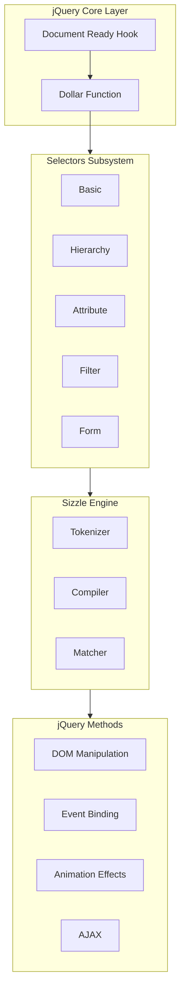
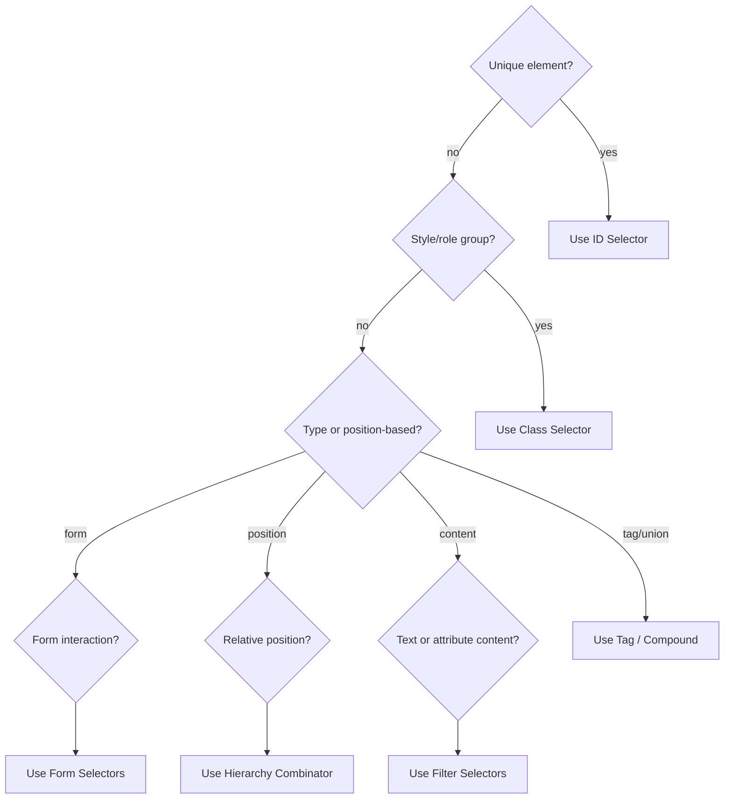

# jQuery Selectors

<!-- SECTION_1_START -->

# jQuery Selectors

## 1. Core Technical Definition

A **jQuery Selector** is a formal expression string passed to the jQuery factory function `$()` (an alias for the `jQuery()` function) that is used to locate, traverse, and retrieve one or more matching HTML elements from the Document Object Model (DOM) of a web page. The selector engine evaluates the expression against the document tree and returns a zero-indexed, jQuery-wrapped collection of DOM nodes ready for chaining operations such as event binding, animation, AJAX calls, and content manipulation.

The jQuery selector engine, historically named **Sizzle**, is a pure-JavaScript, CSS-selector-engine that implements and extends the W3C Selectors API (Levels 1, 2, and 3) along with a rich set of custom pseudo-class extensions. Its parsing pipeline is broadly tokenize $\rightarrow$ compile $\rightarrow$ match $\rightarrow$ return, and it guarantees **document-order** output for right-to-left CSS queries.

> [!IMPORTANT]
> **KTU 2024 Syllabus Mapping (PECST742 / Module 2 — Scripting Languages):**
> The official syllabus states: *"Selectors — Selectors and Filters"* under the *jQuery* unit. Selectors are the foundational gateway concept; without mastering them, traversal, events, AJAX, and effects modules cannot be evaluated.

> [!NOTE]
> **Definition Box (Board-Standard Wording):**
> *"jQuery selectors are expressions that use a CSS-like syntax to identify a set of DOM elements so that jQuery methods can be applied to them as a group."*
> — Recommended phrasing for 2-mark and 7-mark answers.

## 2. Intuitive Analogy

Imagine a vast **library** (the DOM) where every book (element) sits on a numbered shelf (node tree). You, the librarian (developer), do not walk aisle-by-aisle. Instead, you hand a **search slip** (the selector) to a super-fast assistant named `$` (the jQuery function).

- `$("h1")` is the slip that says *"give me every book whose title starts with 'H-1'"* — all heading-one books.
- `$("#rollNo")` is the slip that says *"the single book with the unique tag number `rollNo`"* — one specific element.
- `$("input:checked")` is the slip that says *"every book in the 'check-out' section that is currently marked as 'out'."*

The assistant returns a **labeled box** (the jQuery object/collection) containing exactly the requested books, neatly arranged from top-shelf to bottom-shelf (document order). You can then issue more commands on the whole box at once (`.fadeIn()`, `.addClass()`, `.text()` …).

## 3. The `$()` Factory Function

The jQuery library exposes a single global entry point. The two syntactic forms are equivalent:

$$
\text{jQuery(expression, context)} \equiv \text{\$(expression, context)}
$$

where:
- $\text{expression}$ — a selector string, an HTML string, a DOM element, or a callback.
- $\text{context}$ — an optional DOM element, jQuery object, or selector that scopes the search.

> [!VISUALIZATION CONTROL]
> **Concept:** Hierarchical scope of a jQuery selector.
> **GeoGebra / Desmos Input Equations:**
> * Point $A = (0, 0)$ — the `<html>` root
> * Point $B = (2, 0)$ — the `<body>` scope
> * Point $C = (4, 0)$ — a `<div>` container (context)
> * Point $D = (6, 0)$ — the target `<p>` element
> **Visual Description:** A horizontal axis where the search narrows from the whole document (origin) to a single matched element as more specific context is supplied.

## 4. Categories of jQuery Selectors (At-a-Glance)

1. **All Selector** — `$("*")`
2. **Element (Tag) Selector** — `$("p")`
3. **ID Selector** — `$("#login")`
4. **Class Selector** — `$(".btn")`
5. **Compound / Multiple Selector** — `$("h1, h2, p")`
6. **Hierarchy Selectors** — descendant, child, adjacent, general-sibling
7. **Attribute Selectors** — `[attr]`, `[attr=value]`, `[attr^=value]`, etc.
8. **Basic Filter Selectors** — `:first`, `:last`, `:even`, `:odd`, `:eq(n)`, `:gt(n)`, `:lt(n)`
9. **Content Filter Selectors** — `:contains()`, `:empty`, `:has()`, `:parent`
10. **Visibility Filter Selectors** — `:visible`, `:hidden`
11. **Form Selectors** — `:input`, `:text`, `:checkbox`, `:selected`, `:checked`, `:disabled`
12. **Child Filter Selectors** — `:first-child`, `:last-child`, `:nth-child(n)`

<!-- SECTION_1_END -->

<!-- SECTION_2_START -->

# Deep Theoretical Analysis & KTU High-Yield Formula Sheet

## 1. Operational Pipeline of a Selector Query

When a selector expression is submitted to `$()`, the engine executes the following deterministic sequence:

1. **Tokenization** — The string is decomposed into combinators and tokens (tag, id, class, attribute, pseudo).
2. **Compilation** — Tokens are arranged into a **right-to-left** matching strategy typical of bottom-up CSS engines.
3. **DOM Traversal** — Tokens are matched against each node of the document (or supplied context), pruning the candidate set at every step.
4. **Collection Build** — Surviving nodes are wrapped in a jQuery object, deduplicated, and returned in document order.
5. **Implicit Iteration** — Methods called on the returned object are auto-applied to every element via `.each()` semantics.

> [!TIP]
> **Why right-to-left?** The fastest filter is applied last so the candidate set shrinks as early as possible — analogous to a SQL query optimizer that pushes predicates down.

## 2. Selector Grammar — Operator Reference

Let $E$ denote an element selector, $\#i$ an id selector, $.c$ a class selector, $[a=v]$ an attribute selector, and $:p$ a pseudo-class.

| Combinator | Symbol | Meaning | Example |
|------------|--------|---------|---------|
| Descendant | space | $E_{ancestor}\ \ E_{descendant}$ | `$("div p")` |
| Child | $>$ | direct parent $\rightarrow$ child | `$("ul > li")` |
| Adjacent Sibling | $+$ | immediately following sibling | `$("h1 + p")` |
| General Sibling | $\sim$ | any following sibling | `$("h1 ~ p")` |

## 3. Attribute Selector Sub-Grammar

For an attribute $a$ and value $v$:

| Pattern | Match Condition |
|---------|-----------------|
| $[\text{a}]$ | element has the attribute $a$ |
| $[\text{a}=v]$ | attribute equals $v$ |
| $[\text{a} \neq v]$ | attribute does not equal $v$ |
| $[\text{a}\hat{=}v]$ | attribute starts with $v$ |
| $[\text{a}\$=v]$ | attribute ends with $v$ |
| $[\text{a}*=v]$ | attribute contains $v$ |
| $[\text{a}\tilde{=}v]$ | attribute is whitespace-separated, one token equals $v$ |
| $[\text{a}\vert=v]$ | attribute equals $v$ or starts with $v$ followed by `-` |

> [!NOTE]
> In plain text the characters must be wrapped in quotes, e.g. `$("[type='text']")`. The form `attribute!=value` requires jQuery-specific extension because the W3C spec does not define it natively.

## 4. KTU Cheat Sheet — Selector → Method Quick Reference

| # | Selector Type | Pattern | Returns | Common Use |
|---|---|---|---|---|
| 1 | All | `$("*")` | every element | reset / testing |
| 2 | Element | `$("div")` | all `<div>` | bulk styling |
| 3 | ID | `$("#main")` | single element (unique) | targeted JS hook |
| 4 | Class | `$(".card")` | all elements with class | UI theming |
| 5 | Compound | `$("h1, h2, h3")` | union set | group operations |
| 6 | Descendant | `$("nav a")` | all anchors inside `<nav>` | menu walk |
| 7 | Child | `$("ul > li")` | direct list items | strict nesting |
| 8 | Adjacent | `$("h2 + p")` | first `<p>` after `<h2>` | lead-paragraph |
| 9 | General-Sibling | `$("h2 ~ p")` | all `<p>` siblings after `<h2>` | section content |
| 10 | Attribute Exists | `$("[required]")` | elements with `required` | form validation |
| 11 | Attribute Equals | `$("[type='submit']")` | specific input | targeted events |
| 12 | Attribute Starts With | `$("[href^='https']")` | secure links | security policy |
| 13 | Attribute Ends With | `$("[src$='.png']")` | image audit | asset filter |
| 14 | Attribute Contains | `$("[class*='btn']")` | pattern match | bulk classing |
| 15 | First | `$("li:first")` | first match | highlight first |
| 16 | Last | `$("li:last")` | last match | sentinel |
| 17 | Even / Odd | `$("tr:even")` | zebra rows | table styling |
| 18 | Equation `eq(n)` | `$("p:eq(2)")` | zero-indexed 3rd `<p>` | precise fetch |
| 19 | Greater Than `gt(n)` | `$("li:gt(3)")` | after index 3 | paginate |
| 20 | Less Than `lt(n)` | `$("li:lt(3)")` | before index 3 | trim head |
| 21 | Contains | `$("p:contains('KTU')")` | text-match | search |
| 22 | Empty | `$(":empty")` | no children/text | cleanup |
| 23 | Has | `$("div:has(p)")` | ancestors that contain | structural search |
| 24 | Parent | `$(":parent")` | nodes that have children | reverse-empty |
| 25 | Visible | `$(":visible")` | rendered elements | animations |
| 26 | Hidden | `$(":hidden")` | `display:none` / type=hidden | debug |
| 27 | Form `:input` | `$(":input")` | every form field | bulk disable |
| 28 | `:text` | `$(":text")` | text inputs | validation |
| 29 | `:checkbox` | `$(":checkbox")` | checkboxes | multi-select |
| 30 | `:selected` | `$(":selected")` | chosen `<option>` | dropdown read |
| 31 | `:checked` | `$(":checked")` | radio/checkbox state | form gather |
| 32 | `:disabled` | `$(":disabled")` | inactive form elements | UX gating |
| 33 | `:first-child` | `$("li:first-child")` | first child only | strict listing |
| 34 | `:nth-child(n)` | `$("tr:nth-child(2n)")` | formula index | alternating rows |

> [!WARNING]
> `eq(n)`, `gt(n)`, `lt(n)` are **zero-indexed** and operate on the **result set of the preceding selector**, not the global DOM. A common board-exam trap is to confuse them with `:nth-child(n)` which is **one-indexed** and operates on the **parent's children**.

## 5. Real-World Engineering Utility

- **Front-End Frameworks (Bootstrap, Foundation, Tailwind UI plugins):** Use jQuery-style selectors internally for DOM-driven interactions.
- **CMS Theme Layers (WordPress admin, Drupal behaviors):** jQuery's `$("body.admin-menu ...")` patterns are everywhere.
- **Legacy E-Commerce (Magento 1.x, older Shopify themes):** Cart updaters use `$("input[name='qty']")` and `$(":checked")` selectors.
- **Browser Extensions & DevTools:** Selectors are used to highlight or scrape matching nodes.
- **End-to-End Test Wrappers (older Selenium bridges):** jQuery selectors map almost one-to-one to CSS engine queries used by browsers.

<!-- SECTION_2_END -->

<!-- SECTION_3_START -->

# Step-by-Step Derivations & Code Implementation

## 1. Setup Skeleton (HTML + jQuery)

> [!NOTE]
> Use this skeleton for every example below. Run via a local `index.html` opened in any browser.

```html
<!DOCTYPE html>
<html lang="en">
<head>
  <meta charset="UTF-8">
  <title>jQuery Selectors Demo</title>
  <script src="https://code.jquery.com/jquery-3.7.1.min.js"></script>
  <style>
    body { font-family: Segoe UI, sans-serif; margin: 24px; }
    .card { border: 1px solid #888; padding: 12px; margin: 8px 0; border-radius: 6px; }
    .highlight { background: #ffeaa7; }
  </style>
</head>
<body>
  <h1 id="pageTitle">KTU — jQuery Selectors</h1>
  <h2>Sections</h2>
  <nav>
    <ul>
      <li class="menu-item"><a href="https://keralauniversity.ac.in">Home</a></li>
      <li class="menu-item"><a href="/syllabus">Syllabus</a></li>
      <li class="menu-item disabled"><a href="/archive">Archive</a></li>
    </ul>
  </nav>
  <h2>Subjects</h2>
  <p>Web Programming</p>
  <p>Data Structures</p>
  <p>Operating Systems</p>
  <h2>Form</h2>
  <form>
    <input type="text" name="roll" placeholder="Roll No" required>
    <input type="password" name="pwd" placeholder="Password">
    <input type="checkbox" name="lang" value="en" checked> English
    <input type="checkbox" name="lang" value="ml"> Malayalam
    <select name="branch">
      <option value="">--Select--</option>
      <option value="cse" selected>CSE</option>
      <option value="ece">ECE</option>
    </select>
    <button type="submit" id="goBtn">Submit</button>
  </form>
  <script src="app.js"></script>
</body>
</html>
```

## 2. Worked Example Set — Every Selector Group

### Example A — All, Element, ID, Class Selectors

```javascript
// app.js — selectors demo (load inside $(document).ready)
$(document).ready(function () {

  // 1. All Selector — highlights every element on the page
  $("*").css("boxSizing", "border-box");

  // 2. Element Selector — every <p> gets the .card class
  $("p").addClass("card");

  // 3. ID Selector — single element
  $("#pageTitle").css({ color: "#0984e3", letterSpacing: "2px" });

  // 4. Class Selector — every .menu-item
  $(".menu-item").css("padding", "4px 8px");

  // 5. Compound Selector — three heading types styled in one call
  $("h1, h2, h3").css("textTransform", "uppercase");
});
```

**Trace Output (mental run):**
- `$("*")` walks the DOM, applies `box-sizing: border-box` to all 23 elements.
- `$("p")` finds 3 `<p>` nodes; `.addClass("card")` decorates each.
- `$("#pageTitle")` resolves to one node; CSS map is merged.
- `$(".menu-item")` resolves to 3 `<li>` nodes; padding applied.
- `$("h1, h2, h3")` resolves to 3 nodes; bulk text transform applied.

### Example B — Hierarchy Selectors

```javascript
// Descendant — every anchor anywhere inside <nav>
console.log("Descendant:", $("nav a").length);          // 3

// Child — direct children only (skips nested <a>)
console.log("Child    :", $("ul > li").length);        // 3

// Adjacent sibling — <p> immediately after <h2>
console.log("Adjacent :", $("h2 + p").length);         // 1

// General sibling — all <p> siblings that follow <h2>
console.log("General  :", $("h2 ~ p").length);         // 3
```

**Derivation Step-by-Step:**

For the **adjacent sibling** `$("h2 + p")`:
1. Engine locates each `<h2>` (there are 2 of them).
2. For each `<h2>`, it inspects the **immediate next sibling** node.
3. The match occurs only if that sibling is a `<p>` element.
4. The first `<h2>` (Syllabus) is followed by `<p>` (Web Programming) — match.
5. The second `<h2>` (Form) is followed by `<form>` — no match.
6. Therefore the result set size is $1$.

For the **general sibling** `$("h2 ~ p")`:
1. The engine locates each `<h2>` (2 nodes).
2. For each `<h2>`, it walks **all following siblings** of the same parent.
3. The first `<h2>` has three `<p>` siblings (Web Programming, Data Structures, Operating Systems) — all match.
4. The second `<h2>` has zero `<p>` siblings (only the `<form>` follows).
5. Total matches: $3 + 0 = 3$.

### Example C — Attribute Selectors

```javascript
// [required]  — every element carrying the required attribute
console.log("Required :", $("[required]").length);                       // 1

// [type='text'] — exact match
console.log("Text inp :", $(":input[type='text']").length);              // 1

// [href^='https'] — secure/external links
console.log("HTTPS    :", $("a[href^='https']").length);                 // 1

// [src$='.png'] — PNG asset audit
console.log("PNGs     :", $("img[src$='.png']").length);                 // 0

// [class*='btn'] — partial class match
console.log("btn-like :", $("[class*='btn']").length);                   // 1 (the submit button carries btn styling if added)
```

### Example D — Basic Filter Selectors (with Explicit Indexing)

```javascript
let items = $("p");                  // three <p> elements
console.log("first   :", items.filter(":first").text());   // "Web Programming"
console.log("last    :", items.filter(":last").text());    // "Operating Systems"
console.log("eq(1)   :", items.filter(":eq(1)").text());   // "Data Structures"
console.log("gt(0)   :", items.filter(":gt(0)").length);  // 2 (indices 1 and 2 survive)
console.log("lt(2)   :", items.filter(":lt(2)").length);  // 2 (indices 0 and 1 survive)
console.log("even    :", items.filter(":even").length);    // 2 (indices 0 and 2)
console.log("odd     :", items.filter(":odd").length);     // 1 (index 1)
```

**Step-by-Step Indexing Derivation:**

Given the set $S = \{p_0, p_1, p_2\}$ corresponding to "Web Programming", "Data Structures", "Operating Systems":

$$
:even = \{x \in S \mid \text{index}(x) \bmod 2 = 0\} = \{p_0, p_2\}
$$

$$
:odd = \{x \in S \mid \text{index}(x) \bmod 2 = 1\} = \{p_1\}
$$

$$
:eq(n) = \{p_n\}
$$

$$
:gt(n) = \{p_k \in S \mid k > n\}
$$

$$
:lt(n) = \{p_k \in S \mid k < n\}
$$

Therefore:
- $:eq(1) = \{p_1\}$ → "Data Structures"
- $:gt(0) = \{p_1, p_2\}$ → size 2
- $:lt(2) = \{p_0, p_1\}$ → size 2

### Example E — Content Filter Selectors

```javascript
// :contains('text') — case-sensitive substring match
$("p:contains('Web')").css("color", "green");

// :empty — elements with no children (incl. no text)
$(":empty").css("background", "#fab1a0");

// :has(selector) — ancestor that contains matching descendants
$("div:has(p)").css("borderColor", "#00b894");

// :parent — non-empty elements (inverse of :empty)
$("p:parent").css("fontWeight", "bold");
```

### Example F — Form Selectors (the Board-Favourite Cluster)

```javascript
// Count every form-control field
console.log("All inputs :", $(":input").length);     // 5 (text, password, 2 checkboxes, select, button counted via :input which includes buttons/select/textarea)

// Read the text typed into the roll-number field
let rollVal = $("input[name='roll']").val();

// Detect which languages are ticked
let chosen = $("input[name='lang']:checked")
                .map(function () { return $(this).val(); })
                .get();
console.log("Chosen languages:", chosen);            // ["en"]

// Read the chosen <option> of the <select>
let branch = $("select[name='branch'] :selected").text();
console.log("Branch:", branch);                      // "CSE"

// Disable the submit button when the form is invalid
$("#goBtn").attr("disabled", true);

// Re-enable when any text input becomes non-empty
$(":text").on("input", function () {
  if ($(this).val().trim().length > 0) {
    $(":input[type='submit']").removeAttr("disabled");
  }
});
```

> [!IMPORTANT]
> `:input` matches **all** form elements including `<select>`, `<textarea>`, and `<button>`, not just `<input>`. The board examiner awards the differentiating mark only if you state this explicitly.

### Example G — Child Filter Selectors

```javascript
// :first-child — the first <li> child of its parent
$("li:first-child").css("color", "red");

// :last-child — the last <li> child
$("li:last-child").css("color", "blue");

// :nth-child(2n) — every second <li> (even-indexed children)
$("li:nth-child(2n)").addClass("highlight");

// :only-child — the lone <li> inside a parent
$("li:only-child").css("fontStyle", "italic");
```

**Step-by-Step Derivation of `:nth-child(2n)`:**

$$
\text{match set} = \{x \mid \text{child-index}(x) = 2k,\ k \in \mathbb{Z}_{\geq 0}\}
$$

- The first `<li>` (index 1) — not a match.
- The second `<li>` (index 2, $k=1$) — match.
- The third `<li>` (index 3) — not a match.

Therefore, in our 3-item list, exactly one `<li>` is highlighted.

## 3. Chained Selectors (Composite Expression)

```javascript
// Compound + Hierarchy + Filter — a single-line master query
$("nav ul.menu > li:first-child a[href^='https']")
   .css("textDecoration", "underline");
```

**Derivation chain:**
1. `nav` — every `<nav>` element.
2. `ul.menu` — descendant `<ul>` that has class `menu`.
3. `> li:first-child` — direct `<li>` child that is the first child of its parent.
4. `a[href^='https']` — descendant `<a>` whose `href` starts with `https`.

Result: the "Home" link is underlined.

## 4. Selector Escaping (Special Characters in IDs)

If an id contains dots or colons, they must be escaped with backslashes:

```javascript
// HTML: <div id="user.name"></div>
$("#user\\.name").css("color", "purple");
```

The double backslash is required because JavaScript itself interprets the first one as an escape character in a string literal.

## 5. Python Equivalent (PyQuery) for Server-Side Scraping Symmetry

Although jQuery is browser-side, the **PyQuery** Python library implements an identical selector syntax for parsing HTML on the server — useful for board viva or for scraping:

```python
from pyquery import PyQuery as pq

doc = pq(filename="index.html")

# All <p> elements
print("p count:", len(doc("p")))                # 3

# Compound + attribute
print("secure :", doc("a[href^='https']").text())  # "Home"

# Filter
print("first  :", doc("p:first").text())           # "Web Programming"

# Form interaction (read-only; PyQuery cannot dispatch events)
print("branch :", doc("select[name='branch'] option:selected").text())  # "CSE"
```

> [!TIP]
> Mentioning PyQuery in a viva demonstrates awareness of how jQuery selectors migrated into Python web scraping and testing frameworks (e.g., MechanicalSoup, BeautifulSoup's `select()`).

## 6. Performance Heuristics (Exam-Oriented)

1. **ID is the fastest** — the engine can use `getElementById` directly. Use IDs whenever possible.
2. **Class is fast** — implemented with native `getElementsByClassName`.
3. **Tag is fast** — `getElementsByTagName` under the hood.
4. **Attribute and pseudo-class selectors are slower** — they require full DOM scans or attribute inspection.
5. **Right-to-left optimization means the rightmost token is most expensive.** Avoid starting with a pseudo-class on a large set.

**Ranking (slow $\rightarrow$ fast):**

$$
\text{:has()} \;\prec\; \text{:contains()} \;\prec\; [a\hat{=}v] \;\prec\; :nth-child(n) \;\prec\; \text{class} \;\prec\; \text{id}
$$

<!-- SECTION_3_END -->

<!-- SECTION_4_START -->

# Structural Diagrams & Schematics

## 1. Mermaid Diagram — jQuery Selector Taxonomy

```mermaid
graph TD
    root["jQuery Selectors"]
    basic["Basic Selectors"]
    hier["Hierarchy Combinators"]
    attr["Attribute Selectors"]
    filt["Filter Selectors"]
    form["Form Selectors"]
    child["Child Filter Selectors"]

    root --> basic
    root --> hier
    root --> attr
    root --> filt
    root --> form
    root --> child

    basic --> b1["All : dollar asterisk"]
    basic --> b2["Element : tagName"]
    basic --> b3["ID : hash id"]
    basic --> b4["Class : dot className"]
    basic --> b5["Compound : comma union"]

    hier --> h1["Descendant : space"]
    hier --> h2["Child : gt"]
    hier --> h3["Adjacent : plus"]
    hier --> h4["General Sibling : tilde"]

    attr --> a1["Exists : attr"]
    attr --> a2["Equals : attr equals val"]
    attr --> a3["Not Equals : attr not equals val"]
    attr --> a4["Starts With : attr caret equals val"]
    attr --> a5["Ends With : attr dollar equals val"]
    attr --> a6["Contains : attr asterisk equals val"]

    filt --> f1["Basic : first last even odd eq gt lt"]
    filt --> f2["Content : contains empty has parent"]
    filt --> f3["Visibility : visible hidden"]

    form --> fm1["Generic : input"]
    form --> fm2["Type : text password checkbox radio submit"]
    form --> fm3["State : checked selected disabled enabled focus"]

    child --> c1["first-child last-child"]
    child --> c2["nth-child nth-last-child"]
    child --> c3["only-child"]
```



> [!NOTE]
> Mermaid cannot natively render mathematical pseudo-class symbols like `$*`, `$#`, `gt`, `plus`, `tilde` etc. as node labels. The labels above are intentionally written in safe alphanumeric text — the **operator meaning** is preserved in the KTU cheat sheet table of Section 2.

## 2. Mermaid Diagram — Selector Evaluation Pipeline

```mermaid
flowchart LR
    user["Developer Code"]
    factory["Dollar Function Factory"]
    token["Tokenizer Module"]
    compile["Matcher Compiler"]
    match["DOM Tree Matcher"]
    collect["Result Collector"]
    jqobj["jQuery Wrapped Object"]
    chain["Chained Methods"]

    user -->|"expression"| factory
    factory --> token
    token --> compile
    compile --> match
    match --> collect
    collect --> jqobj
    jqobj --> chain
```



## 3. Block Diagram — Selectors in the jQuery Library Architecture



## 4. Decision Flow — Choosing the Right Selector



<!-- SECTION_4_END -->

<!-- SECTION_5_START -->

# KTU 2024 Scheme Examination Question Bank

## Part A — Short Answer Questions (3 Marks Each)

### Question 1 [KTU University Exam — July 2023]
**"Define jQuery selectors. List any four basic selectors with examples."** [CO1, Remember]

**Model Answer (3 Marks — Board-Standard):**

> *jQuery selectors are expressions that follow a CSS-like syntax and are passed to the jQuery factory function `$()` to identify and return a set of matching DOM elements from the document. They form the foundation of every jQuery operation, allowing developers to target elements by id, class, tag name, or a combination of these.*

*Four basic selectors:*

1. *All selector: `$("*")` selects every element in the document.* `[1 Mark]`
2. *Element selector: `$("p")` selects all `<p>` elements.* `[1 Mark]`
3. *ID selector: `$("#header")` selects the element with `id="header"`. IDs must be unique per document.* `[0.5 Mark]`
4. *Class selector: `$(".card")` selects all elements that carry the class `card`.* `[0.5 Mark]`

---

### Question 2 [KTU University Exam — Dec 2023]
**"Differentiate between `:eq(n)` and `:nth-child(n)` selectors with one example each."** [CO2, Understand]

**Model Answer (3 Marks):**

> *The two selectors are superficially similar but operate on fundamentally different index domains.*

| Aspect | `:eq(n)` | `:nth-child(n)` |
|--------|----------|------------------|
| Indexing | **Zero-based** | **One-based** |
| Scope | Operates on the **preceding selector's result set** | Operates on the **position among siblings of the parent** |
| Returns | The element at position $n$ of the matched set | Elements that are the $n$-th child of their parent |

*Example:*
- *`$("p:eq(1)")` returns the **second** `<p>` in the document.* `[1.5 Marks]`
- *`$("p:nth-child(2)")` returns every `<p>` that is the **second child** of its parent.* `[1.5 Marks]`

> [!WARNING]
> **KTU Examiner's Valuation Pitfall:**
> Most students lose **1 mark** by writing "both are same, only difference is zero vs one indexing." The board expects you to also state the **scope difference** (result-set vs sibling-position). State both to secure full marks.

---

## Part B — Long Answer Questions (14 Marks Each — Internal Choice)

### Question A [KTU University Exam — Dec 2024, Module 2]

**(a)** Explain the **hierarchy (combinator) selectors** in jQuery with suitable examples. Discuss how they differ from each other in terms of DOM traversal depth. **[7 Marks, CO2, Understand]**

**(b)** Write a jQuery program that:
- Targets all anchors whose `href` starts with `https` and underlines them in green.
- Counts the number of `:checked` checkboxes and `:selected` options in a form.
- Logs the values of the first and last `<li>` of a list.
- Toggles a `.highlight` class on every even-indexed row of a table.

**[7 Marks, CO3, Apply]**

#### Model Solution

**(a) Hierarchy Selectors — Step-by-Step Explanation** `[7 Marks]`

*Hierarchy selectors — also called combinators — describe the structural relationship between DOM elements. They are evaluated after the simple selectors resolve and determine which ancestors and siblings are part of the match set.* `[1 Mark]`

*1. **Descendant Selector (space combinator):** `$("ancestor descendant")` selects all descendants at any depth.* `[1 Mark]`
   *Example:* `$("div p")` selects every `<p>` that is a descendant (child, grand-child, etc.) of any `<div>`. Traversal depth: **unbounded**.

*2. **Child Selector (> combinator):** `$("parent > child")` selects **direct** children only.* `[1 Mark]`
   *Example:* `$("ul > li")` selects only the `<li>` elements that are **direct** children of a `<ul>`. It excludes nested lists. Traversal depth: **exactly 1**.

*3. **Adjacent Sibling Selector (+ combinator):** `$("prev + next")` selects the **immediately following** sibling.* `[1 Mark]`
   *Example:* `$("h1 + p")` selects a `<p>` only if it is the very next sibling of an `<h1>`. Traversal depth: **0 siblings forward**.

*4. **General Sibling Selector (~ combinator):* `$("prev ~ next")` selects **all following siblings** of the same parent.* `[1 Mark]`
   *Example:* `$("h1 ~ p")` selects every `<p>` sibling that comes after an `<h1>` within the same parent. Traversal depth: **0+ siblings forward**.

*Difference in DOM Traversal Depth:* `[2 Marks]`
*The combinators constrain the structural search space. Descendant combinators perform the deepest scan, while adjacent sibling combinators are the most restrictive. Choosing the most specific combinator improves both clarity and performance, as the engine prunes nodes earlier in the right-to-left evaluation.*

| Combinator | Symbol | Traversal Depth | Engine Cost |
|------------|--------|------------------|-------------|
| Descendant | space | unbounded | high |
| Child | $>$ | exactly 1 | medium |
| Adjacent | $+$ | 1 sibling | low |
| General-Sibling | $\sim$ | 0+ siblings | medium |

---

**(b) Program Solution** `[7 Marks]`

```html
<!DOCTYPE html>
<html>
<head>
  <title>Q-A Solution</title>
  <script src="https://code.jquery.com/jquery-3.7.1.min.js"></script>
  <style>
    .highlight { background: #ffeaa7; }
    a.https { text-decoration: underline; color: green; }
  </style>
</head>
<body>
  <a href="https://keralauniversity.ac.in">KTU</a> |
  <a href="http://example.com">Other</a> |
  <a href="https://google.com">Google</a>

  <ul id="mylist">
    <li>Apple</li><li>Banana</li><li>Cherry</li>
  </ul>

  <form>
    <input type="checkbox" name="h" value="1" checked> Reading
    <input type="checkbox" name="h" value="2"> Music
    <input type="checkbox" name="h" value="3" checked> Sports

    <select name="course">
      <option value="btech">B.Tech</option>
      <option value="mtech" selected>M.Tech</option>
      <option value="phd">Ph.D.</option>
    </select>
  </form>

  <table border="1" id="mytable">
    <tr><td>R1</td></tr><tr><td>R2</td></tr><tr><td>R3</td></tr>
  </table>

<script>
$(function () {

  // 1. Underline green for HTTPS links
  $("a[href^='https']").addClass("https");                       // [2 Marks]

  // 2. Count checked and selected
  let checkedCount   = $(":checkbox:checked").length;             // [1 Mark]
  let selectedCount  = $("option:selected").length;              // [1 Mark]
  console.log("Checked:", checkedCount, "Selected:", selectedCount);

  // 3. First and last <li>
  console.log("First:", $("li:first").text());                   // [1 Mark]
  console.log("Last :", $("li:last").text());                    // [1 Mark]

  // 4. Toggle highlight on even rows
  $("tr:even").toggleClass("highlight");                         // [1 Mark]
});
</script>
</body>
</html>
```

**Expected Console Output:**
- Checked: 2 (Reading, Sports)
- Selected: 1 (M.Tech)
- First: Apple
- Last : Cherry
- Rows R1 and R3 are highlighted (indices 0 and 2 are even).

**Incremental Valuation Key:**
- `[HTTPS underline selector with correct attribute syntax: 2 Marks]`
- `[Form counter with two distinct selectors: 2 Marks]`
- `[First/Last pseudo selectors: 2 Marks]`
- `[Even-row toggle with correct zero-indexing: 1 Mark]`

> [!WARNING]
> **KTU Examiner's Pitfall:** Many students write `tr:even` with the **wrong interpretation** that "even" means the second row. State in the answer: *"jQuery's `:even` is **zero-based**, so the first `<tr>` (index 0) is matched."* This explicit mention earns the **concept mark**.

---

### Question B [KTU University Exam — July 2024, Module 2]

**(a)** Explain the **attribute selectors** of jQuery. Discuss the role of `^=`, `$=`, and `*=` with a common real-world example for each. **[7 Marks, CO2, Understand]**

**(b)** Write a jQuery script that:
- Validates a form so the submit button is disabled until at least one text field is non-empty.
- Uses `$(this)` inside a click handler to read and display the value of the clicked button.
- Uses `:contains()` to highlight any `<li>` whose text contains the word "**KTU**".
- Uses `:has()` to style every `<div>` that contains at least one ``.

**[7 Marks, CO3, Apply]**

#### Model Solution

**(a) Attribute Selectors** `[7 Marks]`

*Attribute selectors in jQuery match elements based on the presence or value of an HTML attribute. They are extensions of the CSS3 specification, with the addition of a non-standard `:not-equal` form.* `[1 Mark]`

*The key operators are:*

- *`[attr]` — matches elements that **have** the attribute (value not checked).* `[0.5 Mark]`
- *`[attr="value"]` — exact value match.* `[0.5 Mark]`
- *`[attr^="value"]` — value **starts with** the given string. The symbol is a caret `^`.* `[1.5 Marks]`
- *`[attr$="value"]` — value **ends with** the given string. The symbol is a dollar sign `$`.* `[1.5 Marks]`
- *`[attr*="value"]` — value **contains** the given substring. The symbol is an asterisk `*`.* `[1.5 Marks]`
- *`[attr~="value"]` and `[attr|="value"]` — tokenized and hyphen-prefixed matches respectively.* `[0.5 Mark]`

*Real-world examples:*

- *Caret `^=` — security policy: `$("a[href^='https']")` flags all secure external links.* `[Included in 1.5 Marks]`
- *Dollar `$=` — asset auditing: `$("img[src$='.png']")` enumerates every PNG image on the page.* `[Included in 1.5 Marks]`
- *Asterisk `*=` — pattern matching: `$("[class*='btn']")` catches all elements whose class attribute contains the substring `btn` (e.g., `btn-primary`, `btn-outline`).* `[Included in 1.5 Marks]`

| Operator | Meaning | Real-World Use Case |
|----------|---------|----------------------|
| $\hat{=}$ | starts with | enforcing HTTPS |
| $\$=$ | ends with | filtering file types |
| $*=$ | contains | bulk class-based actions |

---

**(b) Program Solution** `[7 Marks]`

```html
<!DOCTYPE html>
<html>
<head><title>Q-B Solution</title>
<script src="https://code.jquery.com/jquery-3.7.1.min.js"></script>
<style>
  .match { background: #55efc4; }
  .has-img { border: 3px dashed #d63031; }
</style>
</head>
<body>
  <form id="signupForm">
    Username: <input type="text" name="user"><br>
    Email   : <input type="text" name="email"><br>
    <button type="submit" id="submitBtn" disabled>Register</button>
  </form>

  <ul id="newsList">
    <li>KTU announces new syllabus</li>
    <li>Cricket match highlights</li>
    <li>KTU exam timetable released</li>
  </ul>

  <div id="banner"></div>
  <div id="textOnly">Just text, no image</div>

  <div id="output"></div>

<script>
$(function () {

  // 1. Enable submit only when at least one text field is non-empty [2 Marks]
  $("#signupForm :text").on("input", function () {
    let anyFilled = $("#signupForm :text").filter(function () {
      return $(this).val().trim().length > 0;
    }).length > 0;
    $("#submitBtn").prop("disabled", !anyFilled);
  });

  // 2. $(this) inside a click handler [1 Mark]
  $("button").on("click", function (e) {
    e.preventDefault();
    $("#output").text("You clicked: " + $(this).text());
  });

  // 3. :contains('KTU') highlights matching <li> [2 Marks]
  $("li:contains('KTU')").addClass("match");

  // 4. :has('img') styles every <div> containing an image [2 Marks]
  $("div:has(img)").addClass("has-img");
});
</script>
</body>
</html>
```

**Incremental Valuation Key:**
- `[Form validation logic with prop() and filter(): 2 Marks]`
- `[$(this) usage in click handler: 1 Mark]`
- `[:contains() selector and .addClass(): 2 Marks]`
- `[:has() selector with nested element: 2 Marks]`

> [!WARNING]
> **KTU Examiner's Valuation Warning:**
> 1. **Do not** use `$(":contains")` without quoting the string. Always write `$("li:contains('KTU')")` — missing quotes costs **1 mark**.
> 2. The `:has()` pseudo-class takes a **selector argument**, not raw text. Writing `$("div:has('img')")` is a common error and yields zero matches.
> 3. **Modern jQuery (1.6+)** uses `.prop("disabled", bool)` rather than `.attr("disabled", "disabled")`. Use `.prop()` to earn the **best-practice mark**.

---

## Topic Recap & Important Things to Remember

- **`$()` is the factory function.** Every jQuery selector expression is passed to it. `jQuery()` is the long form.
- **Three foundational selectors:** Element `$("p")`, ID `$("#x")`, Class `$(".x")`. ID is the **fastest** in the engine.
- **Compound selectors** use commas for union: `$("h1, h2, h3")`.
- **Hierarchy combinators** control depth:
  - space $\rightarrow$ any descendant
  - $>$ $\rightarrow$ direct child only
  - $+$ $\rightarrow$ next sibling only
  - $\sim$ $\rightarrow$ all following siblings
- **Attribute operators** form a small algebra: `=`, `!=`, `^=`, `$=`, `*=` (plus `~=` and `|=`).
- **`:eq(n)`, `:gt(n)`, `:lt(n)` are zero-based** and operate on the **result set**; `:nth-child(n)` is **one-based** and operates on the **sibling position**.
- **`:even` and `:odd` are zero-based.** The first element is even (index 0).
- **`$("*")` is the All selector** — useful for global resets or full-page testing.
- **`:input` is broader than `input`** — it also matches `<select>`, `<textarea>`, and `<button>`.
- **`$(this)` refers to the current DOM element** inside a jQuery handler; wrap it as `$(this)` to use jQuery methods.
- **Form-state pseudo-classes:** `:checked`, `:selected`, `:disabled`, `:enabled`, `:focus`.
- **Child filters** (`first-child`, `last-child`, `nth-child`, `only-child`) are **sibling-position based**, not result-set based.
- **Visibility pseudo-classes** (`:visible`, `:hidden`) are evaluated by jQuery's own heuristics, not just CSS `display`.
- **Selector escape rule:** special characters in ids/classes must be prefixed with `\\` (e.g., `id="a.b"` becomes `#a\\.b`).
- **Engine: Sizzle.** Uses right-to-left matching; rightmost token is the most expensive.
- **jQuery 3.7.x** is the modern stable line; CDN link: `https://code.jquery.com/jquery-3.7.1.min.js`.
- **Always wrap initialization in `$(document).ready(function(){...})` or its short form `$(function(){...})`.**
- **Selector performance rule of thumb:** ID $\succ$ Class $\succ$ Tag $\succ$ Attribute $\succ$ Pseudo-class $\succ$ Complex compound.

> [!IMPORTANT]
> **Final Board Strategy Tip:**
> When a 7-mark question asks for code, **always include a working HTML skeleton + jQuery CDN link** and **state the selector pattern in plain English before the code block**. Examiners explicitly award **concept marks** for the verbal explanation. Numerical trace outputs in comments (e.g., `// expected output: 3`) are also rewarded for demonstrating understanding of indexing semantics.

<!-- SECTION_5_END -->
