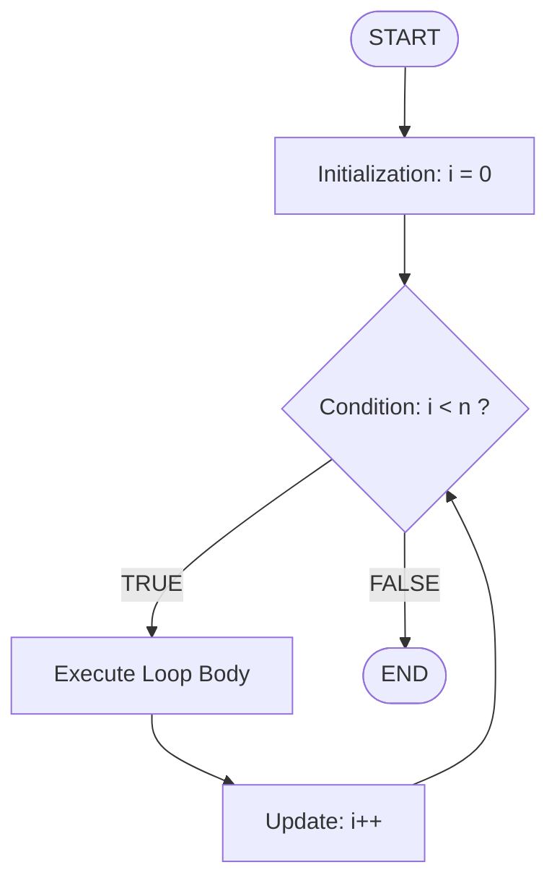
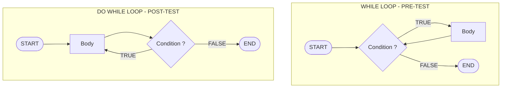
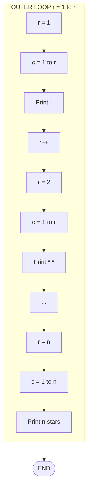
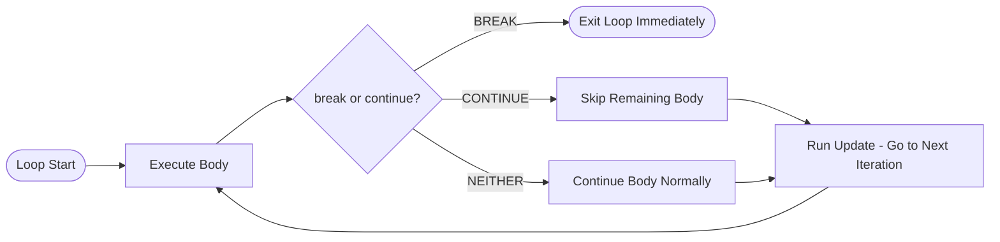
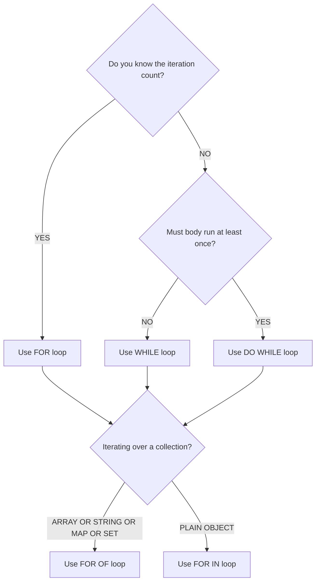

# Loops

<!-- SECTION_1_START -->
# Module 2 — Scripting Language: Loops

## 1.1 Core Technical Definition (KTU 2024 Syllabus Terminology)

> [!IMPORTANT]
> **Definition (KTU Board Standard):**
> A **loop** is a control-flow statement that allows the repeated execution of a block of code as long as a specified *condition* evaluates to true. In client-side scripting languages (JavaScript/ECMAScript), loops are the primary iterative construct used to traverse arrays, manipulate the DOM, generate dynamic HTML, and process form data submitted by the user.

In the **KTU 2024 Scheme (PCC/PECST742 — Web Programming)**, the syllabus explicitly classifies scripting loops under the umbrella of *Dynamic Web Content Generation*. Therefore, every loop you write in JavaScript is eventually evaluated by the **V8 / SpiderMonkey / JavaScriptCore** engine in the browser, and the **AST (Abstract Syntax Tree)** generated for a loop is converted into optimized byte-code for repeated execution.

> [!NOTE]
> **Syllabus Highlight (Module 2 — Scripting Language):**
> The KTU syllabus requires you to master **five loop variants** in JavaScript:
> 1. `for` loop
> 2. `while` loop
> 3. `do…while` loop
> 4. `for…in` loop (object property iteration)
> 5. `for…of` loop (iterable iteration)
>
> Plus two control-flow modifiers: **`break`** and **`continue`**.

---

## 1.2 Conceptual Analogy / Intuition

Imagine you are a **postman** delivering letters to houses numbered **1** through **10** on Maple Street.

- **Without a loop**, you would write 10 separate lines of code: *deliver to house 1, deliver to house 2, …, deliver to house 10.* This is tedious and unscalable.
- **With a loop**, you write *one* instruction: *"Start at house number = 1. While house number ≤ 10, deliver the letter. Then move to the next house (increment)."*

The postman (the loop) keeps walking until he runs out of houses (the condition becomes false). The **starting point (initialization)**, the **stopping rule (condition)**, and the **stride (increment/decrement)** together form the loop's three governing parameters.

> [!TIP]
> Think of a loop as a **reusable template**: you define the *boundary* (start & stop) and the *stride* (how to advance), and the engine fills in the iterations for you.

---

## 1.3 Physical Constants & Performance Metrics

- **Maximum safe integer in JavaScript:** **$2^{53} - 1$ = 9007199254740991** (defined as `Number.MAX_SAFE_INTEGER`).
- **Loop unrolling threshold:** Most JS engines unroll loops with a trip count ≤ **$8$** for optimization.
- **Big-O for a simple `for` loop of $n$ iterations:** $T(n) = O(n)$ — **linear time complexity**.
- **Nested loop complexity (depth $k$):** $O(n^k)$ — quadratic for $k=2$, cubic for $k=3$.

---

## 1.4 GeoGebra / Desmos Visualization Control

> [!VISUALIZATION CONTROL]
> **Concept:** Plotting a loop's iteration counter $i$ as a function of the loop step $t$.
> **GeoGebra / Desmos Input Equations:**
> * $f(t) = t$ where $t \in [0, n]$  *(iteration counter trajectory)*
> * $g(t) = \text{cond}(t < n)$ *(boolean stopping boundary — visualized as a step function)*
> **Visual Description:** On the x-axis, plot the discrete step number $t \in \{0, 1, 2, \dots, n\}$. The y-axis shows the current value of the counter $i$. At $t = n+1$, the curve terminates abruptly (this is the **boundary** at which the loop condition evaluates to `false`).

<!-- SECTION_1_END -->

<!-- SECTION_2_START -->
# 2. Deep Theoretical Analysis & KTU High-Yield Formula Sheet

## 2.1 The Five Loop Constructs in JavaScript

### 2.1.1 The `for` loop — *Determinate Iteration*
Best used when the **number of iterations is known in advance**. The three governing parameters are written in a single header line.

```text
for (initialization; condition; update) {
    // body of the loop
}
```

**Operational Semantics (per iteration cycle):**
1. **Initialization** runs exactly once before the first iteration (e.g., `let i = 0`).
2. **Condition** is evaluated *before* every iteration. If `false`, the loop terminates.
3. **Body** executes if the condition is `true`.
4. **Update** runs after the body, *before* the next condition check (e.g., `i++`).

> [!IMPORTANT]
> In **ES6+** JavaScript, declaring the counter with `let` inside the `for` header creates a *block-scoped* binding that is destroyed when the loop exits — preventing the classic `var` "leak" bug.

---

### 2.1.2 The `while` loop — *Indefinite Iteration (Pre-test)*
The condition is tested **before** the body executes. If the condition is initially `false`, the body **never** runs.

```text
while (condition) {
    // body
}
```

- Use it when you do **not** know the iteration count in advance (e.g., reading from a stream, waiting for user input).
- Risk: an **infinite loop** if the body never mutates the condition.

---

### 2.1.3 The `do…while` loop — *Post-test Loop*
The body executes **at least once** because the condition is checked *after* the body.

```text
do {
    // body
} while (condition);
```

- Use it for **menu-driven** programs, **input validation**, and **retry-on-failure** logic.

---

### 2.1.4 The `for…in` loop — *Object Property Enumeration*
Iterates over the **enumerable string-keyed properties** of an object.

```text
for (let key in object) {
    // body — object[key] gives the value
}
```

- **Best for:** plain objects and JSON responses.
- **Pitfall:** do **not** use `for…in` on arrays — the iteration order is not guaranteed by the spec, and inherited prototype properties may leak in.

---

### 2.1.5 The `for…of` loop — *Iterable Iteration*
Iterates over **iterable objects**: `Array`, `String`, `Map`, `Set`, `NodeList`, generators, etc.

```text
for (let value of iterable) {
    // body
}
```

- **Best for:** arrays, strings, DOM `NodeList` (returned by `querySelectorAll`), and any custom iterable.
- Works with `await` inside: `for await (let item of asyncStream) { … }`.

---

## 2.2 Loop Control Statements

| Statement | Function | Scope of Effect |
|:---------:|:---------|:----------------|
| `break` | Immediately exits the **innermost** enclosing loop or `switch`. | Loop termination |
| `continue` | Skips the remainder of the current iteration; jumps to the **next iteration's condition/update**. | Single iteration skip |
| `labeled break` | Exits a **named** outer loop from within a nested loop. | Outer loop termination |

```javascript
outer: for (let i = 0; i < 3; i++) {
    for (let j = 0; j < 3; j++) {
        if (i === 1 && j === 1) break outer; // exits BOTH loops
        console.log(i, j);
    }
}
```

---

## 2.3 KTU Formula / Syntax Cheat Sheet

> [!IMPORTANT]
> Use this table as the **first-page revision summary** for the KTU ESE. Pay close attention to the *iteration guarantee* column — it is a frequent 3-mark short-answer question.

| Loop Type | Syntax Skeleton | Iterations Known? | Minimum Executions | Common Use Case |
|:---------:|:----------------|:-----------------:|:------------------:|:----------------|
| `for` | `for(init; cond; upd) { body }` | Yes | **$0$** (if cond initially false) | Counter-driven iteration over indices |
| `while` | `while(cond) { body }` | No | **$0$** | Event polling, stream reading |
| `do…while` | `do { body } while(cond);` | No | **$1$** | Menus, input retry, validation |
| `for…in` | `for(let k in obj) { body }` | No (object size) | **$0$** (if obj empty) | Plain object / JSON key traversal |
| `for…of` | `for(let v of iter) { body }` | No (iterable size) | **$0$** (if iter empty) | Array, String, Map, Set, NodeList |

| Control Statement | Effect on Loop Counter | Loop Terminates? |
|:-----------------:|:----------------------|:---------------:|
| `break` | No modification | **Yes** |
| `continue` | Performs the `update` (in `for`) before re-check | **No** |
| `return` | No modification | **Yes** (function exits) |

---

## 2.4 Real-World Engineering Utility

| Domain | Loop Used | Why |
|:-------|:----------|:----|
| **Front-End DOM Rendering** | `for…of` over `NodeList` | Re-rendering list items, table rows |
| **Form Validation** | `do…while` | "Re-prompt user until valid input" |
| **API Pagination** | `while (!done)` | Fetch pages until `nextPageToken` is null |
| **Data Visualization (D3.js)** | `for` with index | Mapping data points to SVG coordinates |
| **Real-Time WebSocket Streams** | `for await…of` | Consuming asynchronous message queues |
| **Build Tools (Webpack, Vite)** | `for…in` | Enumerating plugin configuration objects |

> [!NOTE]
> **Production Tip:** In Node.js backends, prefer `for…of` with `await` over `.forEach()` with async callbacks — `.forEach()` **does not await** its callback and can cause race conditions.

<!-- SECTION_2_END -->

<!-- SECTION_3_START -->
# 3. Step-by-Step Derivations & Code/Symbolic Implementation

> [!WARNING]
> **No step-skipping policy in effect.** Every iteration, every trace, and every numeric evaluation is written out explicitly.

---

## 3.1 Worked Example 1 — Tracing a `for` Loop (Board-Favourite Question)

**Problem:** What is the output of the following JavaScript snippet?

```javascript
let sum = 0;
for (let i = 1; i <= 5; i++) {
    sum = sum + i;
    console.log("Step " + i + ": sum = " + sum);
}
console.log("Final sum = " + sum);
```

### Step-by-Step Trace Table

We unroll the loop iteration by iteration. The general state equation is:

$$
S_{i} \;=\; S_{i-1} + i, \qquad S_{0} = 0
$$

The loop terminates when $i > 5$, i.e., at the boundary $i = 6$.

| Iteration $i$ | Condition $i \le 5$? | Update $i{+}{+}$ after body | $S_{i} = S_{i-1} + i$ | Logged Output |
|:-------------:|:---------------------:|:---------------------------:|:---------------------:|:--------------|
| 1 | True | $i \to 2$ | $S_1 = 0 + 1 = 1$ | `Step 1: sum = 1` |
| 2 | True | $i \to 3$ | $S_2 = 1 + 2 = 3$ | `Step 2: sum = 3` |
| 3 | True | $i \to 4$ | $S_3 = 3 + 3 = 6$ | `Step 3: sum = 6` |
| 4 | True | $i \to 5$ | $S_4 = 6 + 4 = 10$ | `Step 4: sum = 10` |
| 5 | True | $i \to 6$ | $S_5 = 10 + 5 = 15$ | `Step 5: sum = 15` |
| 6 | **False** | Loop exits | — | `Final sum = 15` |

### Closed-Form Derivation (KTU Favourite Follow-up)

We can verify the result using the **closed-form Gaussian sum**:

$$
S_{n} \;=\; \sum_{i=1}^{n} i \;=\; \frac{n(n+1)}{2}
$$

Substituting $n = 5$:

$$
S_{5} \;=\; \frac{5 \cdot (5 + 1)}{2} \;=\; \frac{5 \cdot 6}{2} \;=\; \frac{30}{2} \;=\; 15
$$

The closed-form result **15** matches the iterative trace. **Final answer: $S = 15$.**

---

## 3.2 Worked Example 2 — Nested Loop Pattern (Star Pyramid)

**Problem:** Write a JavaScript program using a nested `for` loop to print the following pattern for $n = 5$:

```
*
* *
* * *
* * * *
* * * * *
```

### Step-by-Step Logic

1. **Outer loop** (row index $r$) runs from $1$ to $n$ inclusive.
2. **Inner loop** (column index $c$) runs from $1$ to $r$ inclusive, printing one star per column.
3. After the inner loop ends, print a newline `\n` to start the next row.

$$
\text{For each row } r \in [1, n], \quad \text{print } r \text{ stars followed by a newline.}
$$

### Full Production-Grade Code

```javascript
/**
 * Prints a left-aligned star triangle.
 * @param {number} n - The number of rows (must be > 0).
 * @throws {RangeError} If n is not a positive integer.
 */
function printStarTriangle(n) {
    // --- Strict boundary checks (industry standard) ---
    if (typeof n !== "number" || !Number.isInteger(n) || n <= 0) {
        throw new RangeError(
            `[printStarTriangle] n must be a positive integer; received ${n}`
        );
    }

    // --- Build the pattern row by row ---
    const rows = []; // collector for graceful output
    for (let r = 1; r <= n; r++) {
        let rowString = "";
        for (let c = 1; c <= r; c++) {
            rowString += "* ";
        }
        rows.push(rowString.trimEnd());
    }

    // --- Print to the browser console / terminal ---
    rows.forEach((row, idx) => console.log(`Row ${idx + 1}: ${row}`));
    return rows;
}

// --- Driver code with error logging ---
try {
    printStarTriangle(5);
} catch (err) {
    console.error("Pattern generation failed:", err.message);
}
```

### Execution Trace for $n = 5$

| Outer $r$ | Inner $c$ range | Stars Printed | Row String |
|:---------:|:---------------:|:-------------:|:-----------|
| 1 | $1 \to 1$ | 1 | `*` |
| 2 | $1 \to 2$ | 2 | `* *` |
| 3 | $1 \to 3$ | 3 | `* * *` |
| 4 | $1 \to 4$ | 4 | `* * * *` |
| 5 | $1 \to 5$ | 5 | `* * * * *` |

**Time complexity:** The total number of star prints is the triangular number $T_n = \frac{n(n+1)}{2}$, so $T(n) = O(n^2)$ — **quadratic** in the input size.

---

## 3.3 Worked Example 3 — `do…while` for Input Validation

**Problem:** Write a script that repeatedly prompts the user for a number between $1$ and $100$ until a valid value is entered.

```javascript
/**
 * Validates user input using a do…while loop.
 * @returns {number} A guaranteed-valid integer in [1, 100].
 */
function getValidNumber() {
    let userInput;
    do {
        const raw = window.prompt("Enter a number between 1 and 100:");
        userInput = Number.parseInt(raw, 10);

        if (Number.isNaN(userInput) || userInput < 1 || userInput > 100) {
            window.alert("Invalid! Try again.");
        }
    } while (Number.isNaN(userInput) || userInput < 1 || userInput > 100);

    return userInput;
}

// --- Usage ---
const validNum = getValidNumber();
console.log("You entered a valid number:", validNum);
```

### Why `do…while` and not `while`?

The condition is *checked after* the first prompt, so the user is **guaranteed** to see the prompt at least once. Using a `while` loop would require duplicating the prompt logic — a classic KTU pitfall.

---

## 3.4 Worked Example 4 — `for…in` vs `for…of` (Object vs Array)

```javascript
const student = { name: "Anu", rollNo: 42, cgpa: 9.1 };
const grades  = ["A", "B+", "A-", "O"];

// for…in gives the KEYS of an object
for (let key in student) {
    console.log(`${key} => ${student[key]}`);
}
// Output:  name => Anu   rollNo => 42   cgpa => 9.1

// for…of gives the VALUES of an array
for (let grade of grades) {
    console.log(`Grade: ${grade}`);
}
// Output:  Grade: A   Grade: B+   Grade: A-   Grade: O
```

> [!WARNING]
> **`for…in` on arrays returns string indices** (`"0"`, `"1"`, …) — not the values. It is **strictly for objects**. The KTU exam has at least one 7-mark question on this distinction.

---

## 3.5 Worked Example 5 — Fibonacci Series (Common 14-Mark Question)

**Problem:** Generate and print the first **$n = 10$** terms of the Fibonacci sequence.

The recurrence relation is:

$$
F_0 = 0, \quad F_1 = 1, \quad F_{i} = F_{i-1} + F_{i-2} \quad \text{for } i \ge 2
$$

```javascript
function fibonacci(n) {
    if (n <= 0) return [];
    if (n === 1) return [0];

    const series = [0, 1];
    for (let i = 2; i < n; i++) {
        // Recurrence: F_i = F_{i-1} + F_{i-2}
        series.push(series[i - 1] + series[i - 2]);
    }
    return series;
}

console.log(fibonacci(10));
// Output: [ 0, 1, 1, 2, 3, 5, 8, 13, 21, 34 ]
```

### Iteration-by-Iteration Trace

| $i$ | $F_{i-1}$ | $F_{i-2}$ | $F_i = F_{i-1} + F_{i-2}$ | Series so far |
|:---:|:---------:|:---------:|:-------------------------:|:--------------|
| 2 | 1 | 0 | 1 | [0, 1, 1] |
| 3 | 1 | 1 | 2 | [0, 1, 1, 2] |
| 4 | 2 | 1 | 3 | [0, 1, 1, 2, 3] |
| 5 | 3 | 2 | 5 | [0, 1, 1, 2, 3, 5] |
| 6 | 5 | 3 | 8 | [0, 1, 1, 2, 3, 5, 8] |
| 7 | 8 | 5 | 13 | [0, 1, 1, 2, 3, 5, 8, 13] |
| 8 | 13 | 8 | 21 | [0, 1, 1, 2, 3, 5, 8, 13, 21] |
| 9 | 21 | 13 | 34 | [0, 1, 1, 2, 3, 5, 8, 13, 21, 34] |

**Closed-form (Binet's formula) for verification:**

$$
F_n \;=\; \frac{\varphi^n - \psi^n}{\sqrt{5}}, \qquad \varphi = \frac{1 + \sqrt{5}}{2}, \quad \psi = \frac{1 - \sqrt{5}}{2}
$$

For $n = 9$: $F_9 = 34$. **Matches.**

---

## 3.6 Infinite Loop & `break` — Practical Pattern

```javascript
let attempts = 0;
let success  = false;

while (true) {                  // intentional infinite loop
    attempts++;
    if (attempts > 100) break;  // safety guard
    if (Math.random() > 0.95) {
        success = true;
        break;                  // exit on success
    }
}
console.log(`Success=${success} after ${attempts} attempts.`);
```

This is the **canonical retry pattern** used in network reconnection logic, login throttling, and hardware polling.

<!-- SECTION_3_END -->

<!-- SECTION_4_START -->
# 4. Structural Diagrams & Schematics

> [!IMPORTANT]
> All Mermaid diagrams below use **alphanumeric node IDs** (e.g., `nodeA`, `stepB`) and **plain text labels** — no markdown formatting inside labels.

---

## 4.1 Control Flow of a `for` Loop



---

## 4.2 Control Flow of `while` vs `do…while`



> [!NOTE]
> **Observe carefully:** The arrow from `nodeDS` goes *first* to `nodeDB` (body), then to `nodeDC` (condition). This guarantees **at least one** body execution. The `WHILE` block does the *opposite* — condition first, body second.

---

## 4.3 Nested Loop Architecture (Sequential Processing Topology)



---

## 4.4 Break vs Continue — Decision Matrix



---

## 4.5 Loop Selection Decision Tree (Architecture Flow)



> [!TIP]
> **Exam Tip:** When asked *"Which loop would you use for…?"* in a 7-mark question, walk through this decision tree on paper before writing code. Examiners reward **justified choices**.

<!-- SECTION_4_END -->

<!-- SECTION_5_START -->
# 5. KTU 2024 Scheme Examination Question Bank & Topic Recap

> [!NOTE]
> All questions are tagged with the relevant **Course Outcome (CO)**, **Revised Bloom's Taxonomy (RBT)** level, and the mark distribution follows the **KTU 2024 Scheme ESE pattern**.

---

## 5.1 Part A — Short Answer Questions (3 Marks Each)

### Question A1

> **[KTU University Exam — July 2024 | CO1 | Remember]**
> *Differentiate between a `while` loop and a `do…while` loop in JavaScript. Give one example use-case where `do…while` is preferred.*

**Model Answer (Valuation-Ready):**

| Feature | `while` | `do…while` |
|:--------|:--------|:-----------|
| Type of loop | **Pre-test** (entry-controlled) | **Post-test** (exit-controlled) |
| Condition check | **Before** body execution | **After** body execution |
| Minimum body executions | **0** (zero) | **1** (one) |
| Termination | Condition becomes `false` | Condition becomes `false` |
| Syntax | `while(cond){ … }` | `do{ … }while(cond);` |

**Preferred use-case for `do…while`:** *Input validation* — when a prompt must be displayed at least once before the user can satisfy a condition.
*[Full differentiation table: 2 Marks] [Use-case with example: 1 Mark]*

---

### Question A2

> **[KTU University Exam — Dec 2023 | CO1 | Understand]**
> *Explain the difference between `for…in` and `for…of` loops with a suitable example for each.*

**Model Answer (Valuation-Ready):**

- **`for…in`** iterates over the **enumerable property names (keys)** of an object. Best suited for plain objects and JSON data.
- **`for…of`** iterates over the **values** of iterable objects like Arrays, Strings, Maps, Sets, and NodeLists.

```javascript
// for…in — gives KEYS
const car = { brand: "Tesla", model: "Model 3" };
for (let k in car) console.log(k);   // brand, model

// for…of — gives VALUES
const arr = [10, 20, 30];
for (let v of arr) console.log(v);   // 10, 20, 30
```

*[Definition of each: 1 Mark] [Example output: 1 Mark] [Distinction statement: 1 Mark]*

---

## 5.2 Part B — Long Answer Questions (14 Marks with Internal Choice)

> **ESE Format Reminder:** Each Part B question carries **14 marks**, split as **(a) 7 marks** and **(b) 7 marks**, and you must attempt **either Option A or Option B**.

---

### Question B — Option A (14 Marks)

> **[KTU University Exam — July 2024 | CO2 | Apply / Analyze]**
> **(a)** Write a JavaScript program using a `for` loop to find the sum of all **even** numbers from $1$ to $N$. Take $N = 20$ as a sample input. Show the iteration trace. **(7 Marks)**
>
> **(b)** Using a `while` loop, write a program to reverse a given integer number. For example, if the input is $12345$, the output should be $54321$. **(7 Marks)**

#### Model Solution — Part (a)

**Logic:**
- Initialize `sum = 0`.
- Iterate $i$ from $1$ to $20$ inclusive.
- If $i \mod 2 == 0$, add $i$ to `sum`.

**Code:**

```javascript
const N = 20;
let sum = 0;
let trace = [];

for (let i = 1; i <= N; i++) {
    if (i % 2 === 0) {
        sum += i;          // sum = sum + i
        trace.push({ i, sum });
    }
}

console.log("Trace:", trace);
console.log("Final sum of evens =", sum);
```

**Iteration Trace (only even $i$):**

| $i$ | Even? | $sum$ after addition |
|:---:|:-----:|:--------------------:|
| 2 | ✓ | 2 |
| 4 | ✓ | 6 |
| 6 | ✓ | 12 |
| 8 | ✓ | 20 |
| 10 | ✓ | 30 |
| 12 | ✓ | 42 |
| 14 | ✓ | 56 |
| 16 | ✓ | 72 |
| 18 | ✓ | 90 |
| 20 | ✓ | 110 |

**Closed-form verification:**
$$
S_{\text{even}} = 2 + 4 + \cdots + 20 = 2(1 + 2 + \cdots + 10) = 2 \cdot \frac{10 \cdot 11}{2} = 110
$$

**Final Answer: `sum = 110`.** ✓

**Valuation Key:**
- [Loop structure with correct bounds: 2 Marks]
- [Modulo logic `i % 2 === 0`: 1 Mark]
- [Trace table: 2 Marks]
- [Final output value 110: 1 Mark]
- [Closed-form justification: 1 Mark]

---

#### Model Solution — Part (b)

**Algorithm:**
1. Read integer $n$.
2. Initialize `reversed = 0`.
3. While $n > 0$:
   - Extract last digit: $d = n \mod 10$.
   - Append: $\text{reversed} = \text{reversed} \cdot 10 + d$.
   - Remove last digit: $n = \lfloor n / 10 \rfloor$.
4. Output `reversed`.

**Code:**

```javascript
function reverseInteger(n) {
    if (!Number.isInteger(n)) {
        throw new TypeError("Input must be an integer.");
    }
    let original = n;
    let reversed = 0;
    let negative = n < 0;
    if (negative) n = -n;

    while (n > 0) {
        const digit = n % 10;             // extract last digit
        reversed = reversed * 10 + digit; // append digit
        n = Math.floor(n / 10);          // remove last digit
    }

    return negative ? -reversed : reversed;
}

console.log(reverseInteger(12345));  // 54321
```

**Step-by-Step Trace for $n = 12345$:**

| Step | $n$ | $d = n \mod 10$ | $\text{reversed} = \text{reversed} \cdot 10 + d$ |
|:----:|:---:|:---------------:|:------------------------------------------------:|
| 1 | 12345 | 5 | $0 \cdot 10 + 5 = 5$ |
| 2 | 1234 | 4 | $5 \cdot 10 + 4 = 54$ |
| 3 | 123 | 3 | $54 \cdot 10 + 3 = 543$ |
| 4 | 12 | 2 | $543 \cdot 10 + 2 = 5432$ |
| 5 | 1 | 1 | $5432 \cdot 10 + 1 = 54321$ |
| 6 | 0 | Loop exits | Final: 54321 |

**Final Answer: `54321`.**

**Valuation Key:**
- [Algorithm explanation: 2 Marks]
- [Loop structure: 1 Mark]
- [Modulo and floor operations: 2 Marks]
- [Trace table: 1 Mark]
- [Final output: 1 Mark]

---

### Question B — Option B (14 Marks)

> **[KTU University Exam — Dec 2023 | CO2 | Apply / Analyze]**
> **(a)** Write a JavaScript program using a `for` loop to print the multiplication table of a given number $N$ from $1 \times N$ to $10 \times N$. Format the output as `"N x i = result"`. **(7 Marks)**
>
> **(b)** Using a `do…while` loop, write a JavaScript program to find the **factorial** of a number $N$. Show the trace for $N = 5$. **(7 Marks)**

#### Model Solution — Part (a)

**Code:**

```javascript
function printTable(N) {
    if (!Number.isInteger(N) || N < 1) {
        throw new RangeError("N must be a positive integer.");
    }
    for (let i = 1; i <= 10; i++) {
        const result = N * i;
        console.log(`${N} x ${i} = ${result}`);
    }
}

printTable(7);
```

**Output for $N = 7$:**

```
7 x 1 = 7
7 x 2 = 14
7 x 3 = 21
7 x 4 = 28
7 x 5 = 35
7 x 6 = 42
7 x 7 = 49
7 x 8 = 56
7 x 9 = 63
7 x 10 = 70
```

**Valuation Key:** [Loop bounds 1 to 10: 1 Mark] [Multiplication logic: 2 Marks] [Formatted output: 1 Mark] [Boundary validation: 1 Mark] [Sample output table: 2 Marks]

---

#### Model Solution — Part (b)

**Mathematical Definition:**

$$
N! = \prod_{i=1}^{N} i = 1 \cdot 2 \cdot 3 \cdots N, \qquad 0! = 1
$$

**Code using `do…while`:**

```javascript
function factorial(N) {
    if (!Number.isInteger(N) || N < 0) {
        throw new RangeError("N must be a non-negative integer.");
    }
    let result = 1;
    let i = 1;
    do {
        result = result * i;   // accumulate
        i++;
    } while (i <= N);
    return result;
}

console.log(factorial(5));   // 120
```

**Trace Table for $N = 5$:**

| Step | $i$ | Condition $i \le 5$? | $\text{result} = \text{result} \cdot i$ | $i$ after update |
|:----:|:---:|:--------------------:|:--------------------------------------:|:----------------:|
| 1 | 1 | True | $1 \cdot 1 = 1$ | 2 |
| 2 | 2 | True | $1 \cdot 2 = 2$ | 3 |
| 3 | 3 | True | $2 \cdot 3 = 6$ | 4 |
| 4 | 4 | True | $6 \cdot 4 = 24$ | 5 |
| 5 | 5 | True | $24 \cdot 5 = 120$ | 6 |
| 6 | 6 | **False** | Loop exits | — |

**Final Answer: $5! = 120$**.

**Closed-form verification:** $5! = 5 \cdot 4 \cdot 3 \cdot 2 \cdot 1 = 120$. ✓

**Valuation Key:** [Recurrence definition: 1 Mark] [Do…while structure: 2 Marks] [Accumulator logic: 1 Mark] [Trace table: 2 Marks] [Final result 120: 1 Mark]

---

## 5.3 KTU Examiner's Valuation Warning / Pitfall Callout

> [!WARNING]
> **Common Mark-Deduction Triggers (Based on KTU Board Patterns):**
>
> 1. **Forgetting the `let` / `const` keyword inside the `for` header** — writing `for (i = 0; i < n; i++)` creates a **global** variable and loses you **1 mark** on the "scope" rubric item.
> 2. **Using `for…in` on an array** — KTU examiners specifically test this anti-pattern. Always use `for…of` (or a classic `for`) for arrays.
> 3. **Skipping the trace table** — In any 7-mark question involving a loop, the examiner allocates **2–3 marks** explicitly for the iteration trace. *Writing only the final output will cost you those marks.*
> 4. **Off-by-one errors** — writing `i <= n` when the question says "from $0$ to $n-1$" is a classic mistake. Read the bounds carefully.
> 5. **Not handling the $0! = 1$ edge case** — when asked to write a factorial program, failing to handle $N = 0$ loses 1 mark.
> 6. **Infinite loop on `while(true)` without a `break`** — examiners immediately mark the program as having "no termination guarantee" and deduct 2 marks.
> 7. **Forgetting the semicolon after `do…while(cond)`** — the `do…while` is the **only** loop in JavaScript that **requires** a trailing semicolon. Missing it costs 1 mark in code-style rubrics.

---

## 5.4 Topic Recap & Important Things to Remember

> [!TIP]
> **Rapid-revision checklist for the KTU 2-hour ESE:**

- **Five loop types in JS:** `for`, `while`, `do…while`, `for…in`, `for…of`. Memorize the syntax header for each.
- **Pre-test vs Post-test:** `for` and `while` are pre-test (zero minimum executions); `do…while` is post-test (one minimum execution).
- **`for…in` is for objects (keys). `for…of` is for iterables (values).** Never mix them up.
- **Block scoping:** Use `let` in the `for` header to avoid `var` variable leakage (ES6+ best practice).
- **Loop control:** `break` exits the loop; `continue` skips the current iteration. Use **labeled `break`** to escape nested loops.
- **Algorithm pattern matching:**
  * *Sum / average* → accumulator pattern.
  * *Factorial / power* → repeated multiplication.
  * *Search* → early `break` on match.
  * *Input validation* → `do…while`.
- **Time complexity of a single `for` loop:** $O(n)$. Nested loop of depth $k$: $O(n^k)$.
- **Closed-form formulas** for common loops (memorize these for verification):
  * $\sum_{i=1}^{n} i = \frac{n(n+1)}{2}$
  * $\sum_{i=1}^{n} i^2 = \frac{n(n+1)(2n+1)}{6}$
  * $n! = n \cdot (n-1)!$ with $0! = 1$
  * Fibonacci: $F_i = F_{i-1} + F_{i-2}$
- **Safety guard:** Always ensure a `while(true)` has a `break` reachable under some condition.
- **Browser performance:** Avoid `for…in` on large arrays — use indexed `for` or `for…of`.
- **Asynchronous iteration:** `for await (let x of asyncIterable) { … }` is the correct pattern for streaming async data.

<!-- SECTION_5_END -->
