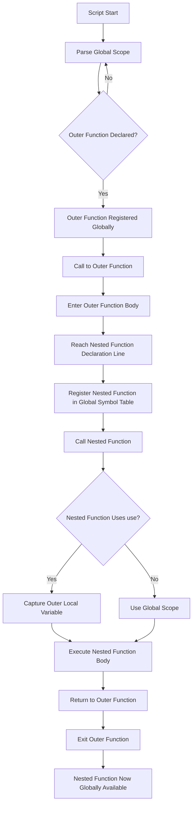
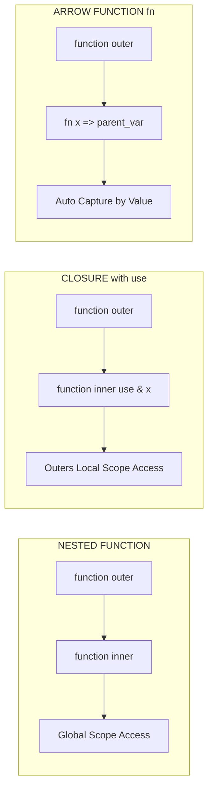
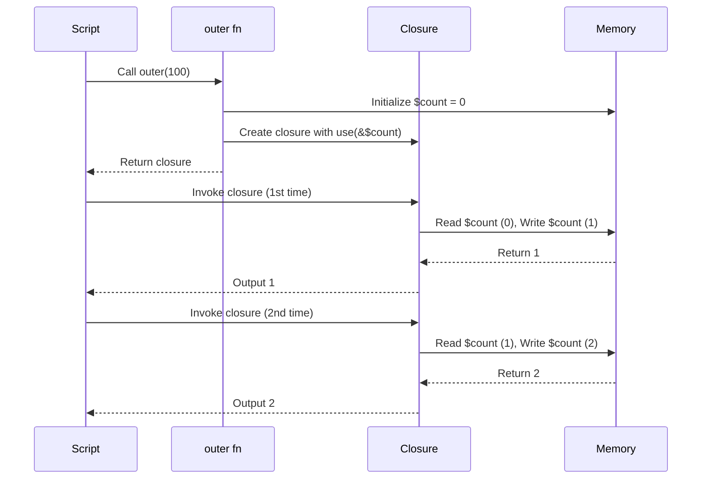

# Nested Functions

<!-- SECTION_1_START -->
# 1. Core Technical Definition & Intuitive Overview

## 1.1 Formal Academic Definition

In the context of the **PHP scripting language** (the primary scripting language used in KTU's *Web Programming* syllabus for this module), a **Nested Function** refers to a function that is **declared within the body of another (enclosing) function**. The enclosing function is termed the *parent function* (or *outer function*), while the function defined within it is termed the *child function* (or *inner function*).

According to the **PHP Official Manual (php.net)** and the KTU 2024 Scheme prescribed text for scripting language fundamentals, when a function is nested inside another, it does **not** automatically inherit the local scope of its parent in the way that nested *closures* (`use()` keyword) do. By default, a nested function in PHP is bound to the **global scope** at the moment it is *called*, not the scope at the moment it is *defined* — unless it is explicitly converted into a **Closure** using the `Closure` class or the `fn` arrow function syntax introduced in **PHP 7.4**.

> [!IMPORTANT]
> **KTU Syllabus Highlight (Module 2 – Scripting Language):**
> Nested functions are a key construct used to achieve *function-level encapsulation*, *modular sub-routines*, and *callable object patterns* within server-side scripting. In KTU 2024 board examinations, this topic is frequently tested under **CO2: Apply Programming Constructs** with questions demanding both conceptual clarity and executable code output prediction.

## 1.2 Conceptual Analogy / Intuition

Imagine a **large corporate office building**:

- The **outer function** is the **main office** (e.g., `companyHeadquarters()`).
- The **nested function** is a **private cabin** (e.g., `managerCabin()`) built *inside* the main office.
- You cannot enter the private cabin without first being inside the main office.
- However, anyone working in the private cabin is not automatically an employee of the main office — they are a **separate entity** that simply *physically resides* inside it.

> **Key intuition:** The nested function is **private to the outer function** in the sense that it can **only be called from within** the outer function's body. Yet, by default, it does *not* automatically access the outer function's local variables — it behaves like a global function that is "hidden" behind the parent.

## 1.3 Critical PHP Quirks — Must-Know Facts

> [!NOTE]
> **The 3 Golden Rules of PHP Nested Functions (Frequently tested):**
> 1. A nested function in PHP is **only available globally AFTER it has been first reached during execution** (lazy global registration).
> 2. Calling a nested function **before** its declaration line in the parent function body causes a **Fatal Error: Call to undefined function**.
> 3. If you want the inner function to access the outer function's local variables, you must convert it into a **Closure** using the `use (&$var)` keyword.

## 1.4 Visualization Control

> [!VISUALIZATION CONTROL]
> **Concept:** Function-Call Stack showing the resolution of nested function scope
>
> **Conceptual Stack Diagram (ASCII Representation):**
>
> ```
> |-----------------------------------|
> |  GLOBAL SCOPE                     |
> |    function headquarters() {...}  |
> |-----------------------------------|
> |  LOCAL SCOPE (headquarters)       |
> |    $budget = 1000;                |
> |    function managerCabin() {...}  |  <-- nested (declared inside)
> |    managerCabin();  // works      |
> |-----------------------------------|
> |  GLOBAL SCOPE (after 1st call)    |
> |    managerCabin() now exists!     |
> |-----------------------------------|
> ```
>
> **Visual Description:** The student should observe that `managerCabin()` *leaks* into the global scope only after the parent function is executed at least once. This is a unique PHP behavior that does **not** exist in JavaScript or C.

<!-- SECTION_1_END -->

<!-- SECTION_2_START -->
# 2. Deep Theoretical Analysis & KTU High-Yield Formula Sheet

## 2.1 Step-by-Step Operational Logic

### Step 1: Declaration of the Outer (Parent) Function

The outer function is declared normally in the global scope. It contains local variables and a nested function definition.

### Step 2: Declaration of the Inner (Nested) Function

The inner function is declared inside the body of the outer function. **At parse time**, PHP does **not** register it globally. It is only registered when the line of declaration is actually executed at runtime.

### Step 3: Calling the Nested Function

The nested function can be called from within the parent function **only after** its declaration line. Calling it before the declaration line throws:

$$
\texttt{Fatal error: Uncaught Error: Call to undefined function ...}
$$

### Step 4: Scope Resolution

By default, the nested function looks up variables in the **global scope**, **not** the parent's local scope. To access parent's local variables, use the `use` clause (creating a **Closure**).

### Step 5: Lifetime and Reuse

Once the parent function has been executed at least once, the nested function becomes available in the global symbol table and can be called from anywhere — even outside the parent. This is a known **PHP anti-pattern** if misunderstood.

## 2.2 KTU High-Yield Formula Sheet / Cheat Sheet

| **Concept** | **Syntax / Rule** | **Scope Behavior** | **Lifetime** |
|---|---|---|---|
| Basic Nested Function | `function outer() { function inner() { ... } }` | Inner uses **global scope** | Dies with script unless registered globally |
| Conditional Declaration | `if ($x) { function inner() { ... } }` | Inner only exists if condition is true | Conditional lifetime |
| Closure with `use` | `function outer() { $a = 1; $inner = function() use ($a) { ... }; }` | Inner captures outer's `$a` (by value) | Tied to parent variable |
| Closure with `use (&)` | `... use (&$a) { ... }` | Captures by **reference** (live binding) | Reflects updates to `$a` |
| Arrow Function (PHP 7.4+) | `$inner = fn() => $x + 1;` | **Automatic** capture of outer scope by value | Implicit closure |
| Anonymous Function | `$fn = function() { ... };` | Has its own scope, no name | Variable lifetime |
| `Closure::bind()` | `Closure::bind($fn, $obj, $class)` | Rebinds `$this` and scope | Static re-binding |

> [!IMPORTANT]
> **Engineering Utility:** Nested functions and closures are heavily used in **Laravel framework** (route definitions, middleware), **WordPress hooks** (`add_action`, `add_filter`), and **event-driven web architectures** like **callbacks in `array_map`, `usort`, and `array_filter`**. Mastering this concept directly enables building **modular, testable, and reusable** server-side code.

## 2.3 Differences: Nested Function vs Nested Closure vs Arrow Function

| **Feature** | **Nested Function** | **Closure (`use`)** | **Arrow Function (`fn`)** |
|---|---|---|---|
| Has a name? | ✅ Yes | ❌ Anonymous (stored in variable) | ❌ Anonymous |
| Auto-captures parent scope? | ❌ No (global by default) | ✅ Manual via `use` | ✅ Automatic by value |
| Can be returned? | ❌ No (not a value) | ✅ Yes (first-class callable) | ✅ Yes |
| Used in KTU 2024? | ✅ Yes | ✅ Yes | ✅ Yes (introduced) |

<!-- SECTION_2_END -->

<!-- SECTION_3_START -->
# 3. Step-by-Step Derivations & Code Implementation

## 3.1 Exhaustive PHP Code Walkthrough — Example 1: Basic Nested Function

```php
<?php
// =============================================
//  KTU 2024 - Module 2 - Nested Functions Demo
//  Course Outcome: CO2 (Apply Programming Constructs)
// =============================================

function headquarters($budget) {
    
    // STEP A: Declare a nested function INSIDE headquarters
    function managerCabin($salary) {
        // NOTE: $budget from headquarters() is NOT accessible here
        // by default - managerCabin() runs in global scope.
        return "Manager paid: Rs. " . $salary;
    }
    
    // STEP B: Call the nested function
    echo managerCabin($budget * 2);
}

// Driver code
headquarters(5000);
?>
```

### Line-by-Line Explanation

1. `function headquarters($budget)` — Declares the outer function in the global scope.
2. `function managerCabin($salary)` — Declares a nested function. At this point, PHP registers `managerCabin` in the global function table **only when this line executes**.
3. The nested function is called **after** its declaration, which works correctly.
4. **Output:** `Manager paid: Rs. 10000`

## 3.2 Exhaustive PHP Code Walkthrough — Example 2: Accessing Outer Scope (Closure)

```php
<?php
function counter() {
    $count = 0;  // Local variable of counter()
    
    // Convert nested function into a Closure that captures $count
    $increment = function() use (&$count) {
        $count++;
        return $count;
    };
    
    return $increment;  // Return the closure
}

$myCounter = counter();
echo $myCounter();  // Output: 1
echo $myCounter();  // Output: 2
echo $myCounter();  // Output: 3
?>
```

### Line-by-Line Explanation

1. `$count = 0` is initialized inside `counter()`.
2. `function() use (&$count)` creates a **Closure** that captures `$count` by **reference** (notice the `&`).
3. Because the closure is returned, it survives even after `counter()` finishes.
4. Each call to `$myCounter()` modifies the **same** `$count` because of the `&` reference.
5. **Output sequence:** `1`, `2`, `3` — classic **stateful function** pattern.

> [!NOTE]
> This pattern is the **foundation of stateful logic in functional PHP** and is used heavily in **Laravel's Collection class** and **Symfony's service containers**.

## 3.3 Exhaustive PHP Code Walkthrough — Example 3: Arrow Function (PHP 7.4+)

```php
<?php
function taxCalculator($income) {
    $rate = 0.10;  // 10% tax rate
    
    // Arrow function automatically captures $rate and $income by VALUE
    $calculate = fn($extra) => ($income + $extra) * $rate;
    
    return $calculate;
}

$taxFn = taxCalculator(100000);
echo $taxFn(20000);   // (100000 + 20000) * 0.10 = 12000
echo $taxFn(50000);   // (100000 + 50000) * 0.10 = 15000
?>
```

### Mathematical Derivation

For an arrow function capturing by value:

$$
\text{Result} = (\text{parent\_var} + \text{extra}) \times \text{rate}
$$

$$
\text{Result}_1 = (100000 + 20000) \times 0.10 = 12000
$$

$$
\text{Result}_2 = (100000 + 50000) \times 0.10 = 15000
$$

## 3.4 Common Pitfalls — Exhaustive Code Demonstrations

### Pitfall 1: Calling Nested Function Before Declaration

```php
<?php
function parentFn() {
    childFn();  // ❌ ERROR: undefined function
    function childFn() {
        echo "Hello";
    }
}
?>
```

**Output (Fatal Error):**

$$
\texttt{Fatal error: Uncaught Error: Call to undefined function childFn()}
$$

### Pitfall 2: Nested Function Polluting Global Scope

```php
<?php
function firstCall() {
    function secret() { echo "I leaked!"; }
}
function secondCall() {
    function secret() { echo "I am a new one!"; }  // ❌ Cannot redeclare
}
firstCall();
secondCall();  // ❌ Fatal error: cannot redeclare secret()
?>
```

> [!WARNING]
> This is why modern PHP frameworks (Laravel, Symfony) **forbid** nested named functions in production code and prefer **Closures** or **Arrow Functions** instead.

<!-- SECTION_3_END -->

<!-- SECTION_4_START -->
# 4. Structural Diagrams & Schematics

## 4.1 Mermaid Flowchart — Nested Function Call Lifecycle



## 4.2 Mermaid Block Diagram — Three Forms of Nested Callable



## 4.3 Sequential Processing Topology — Closure State Persistence



<!-- SECTION_4_END -->

<!-- SECTION_5_START -->
# 5. KTU 2024 Scheme Examination Question Bank & Topic Recap

## 5.1 Part A Questions (3 Marks Each)

> **[KTU University Exam – July 2024]**
> **Q1. Define a nested function in PHP. Can a nested function access the local variables of its parent function by default?**
> **CO Mapping:** CO2 | **RBT Level:** Remember

**Model Answer (3 Marks):**
A nested function is a function defined **inside the body of another function** in PHP. By default, a nested function in PHP does **not** access the local variables of its parent function — it runs in the **global scope**. To enable access, the inner function must be defined as a **Closure** using the `use` keyword. *[1 Mark Definition, 1 Mark Default Behavior, 1 Mark use Keyword]*

> **[KTU University Exam – Dec 2023]**
> **Q2. Differentiate between a nested function and a closure in PHP with suitable examples.**
> **CO Mapping:** CO2 | **RBT Level:** Understand

**Model Answer (3 Marks):**
- **Nested Function:** A *named* function declared inside another. Has its own global scope. *Cannot be assigned to a variable or returned.* *[1 Mark]*
- **Closure:** An *anonymous* function that can be stored in a variable, passed as an argument, and returned from a function. Can capture outer variables using `use`. *[1 Mark]*
- **Example:** `function outer() { $fn = function() use ($x) { return $x; }; }` *[1 Mark]*

## 5.2 Part B Questions (14 Marks Each)

> **[KTU University Exam – Dec 2024, Model Paper]**
> **Question A (14 Marks) — OPTION 1**
> **(a) [7 Marks]** Explain the concept of nested functions in PHP with a suitable code example. Discuss the scope resolution rules clearly.
> **(b) [7 Marks]** Write a PHP program using a closure (with the `use` keyword) that maintains a counter state across multiple invocations. Show the output.

**Model Solution:**

**Part (a) — 7 Marks:**

A nested function is a function defined within another function. The PHP interpreter treats it as a *conditionally registered global function*. By default, the nested function does **not** inherit the local scope of the outer function. *[2 Marks]*

```php
<?php
function company($dept) {
    function department($name) {  // Nested
        return "Department: $name";
    }
    return department($dept);
}
echo company("CS");  // Output: Department: CS
?>
```
*[3 Marks Code + Output]*

**Scope rules:**
- Inner function lookup chain: *local → enclosing (if Closure) → global*.
- Variables inside `headquarters()` are not visible inside nested `managerCabin()` by default. *[2 Marks Scope Rules]*

**Part (b) — 7 Marks:**

```php
<?php
function makeCounter() {
    $c = 0;
    return function() use (&$c) {
        $c++;
        return $c;
    };
}
$counter = makeCounter();
echo $counter();  // 1
echo $counter();  // 2
echo $counter();  // 3
?>
```
*[3 Marks Code]*

**Output:** `123` *[2 Marks]*
**Key concept:** `use (&$c)` captures by reference, enabling **state persistence**. *[2 Marks Explanation]*

---

> **Question B (14 Marks) — OPTION 2**
> **(a) [7 Marks]** Compare and contrast PHP nested functions, closures, and arrow functions (`fn`). Create a comparative table covering scope, syntax, returnability, and PHP version.
> **(b) [7 Marks]** Write a PHP script demonstrating an arrow function inside a parent function to compute simple interest.

**Model Solution:**

**Part (a) — 7 Marks:**

| **Property** | **Nested Function** | **Closure** | **Arrow Function** |
|---|---|---|---|
| Syntax | `function name() {}` | `function() use ($x) {}` | `fn($x) => expr` |
| Scope | Global (default) | Captured via `use` | Auto-captured by value |
| Returnable? | ❌ No | ✅ Yes | ✅ Yes |
| Name? | ✅ Yes | ❌ Anonymous | ❌ Anonymous |
| PHP Version | All | 5.3+ | 7.4+ |

*[4 Marks Table, 3 Marks Explanation]*

**Part (b) — 7 Marks:**

```php
<?php
function loanCalculator($principal, $time) {
    $rate = 0.08;  // 8% annual
    
    $simpleInterest = fn() => ($principal * $rate * $time) / 100;
    
    return $simpleInterest;
}

$si = loanCalculator(10000, 2);
echo "Simple Interest: Rs. " . $si();
// Output: Simple Interest: Rs. 1600
?>
```

**Mathematical Derivation:** *[2 Marks]*

$$
SI = \frac{P \times R \times T}{100} = \frac{10000 \times 8 \times 2}{100} = 1600
$$

*[2 Marks Output, 1 Mark Formula Step]*

> [!WARNING]
> **KTU Examiner's Valuation Warning — Common Pitfalls:**
> - **Do not** forget to write the `use` keyword when expecting to access parent variables — examiners deduct **2 marks** if omitted.
> - **Always** mention the *scope difference* explicitly; a bare definition without scope rules loses **1–2 marks**.
> - For **arrow function (`fn`) questions**, never write a `function` keyword — it is a strict syntax error.
> - Failing to show **output** for code questions results in a **1-mark deduction** as per KTU 2024 valuation key.

## 5.3 Topic Recap & Important Things to Remember

- 🔹 **Nested Function:** A function declared **inside** another function's body.
- 🔹 **Lazy Registration:** PHP only registers the nested function globally **after** the line of declaration is executed.
- 🔹 **Default Scope:** Nested functions operate in the **global scope**, **not** the parent's local scope.
- 🔹 **Closures (`use`):** Use `use ($var)` for capture by *value*; use `use (&$var)` for capture by *reference*.
- 🔹 **Arrow Functions (`fn`):** Introduced in **PHP 7.4**; auto-capture parent scope by value; concise single-expression syntax.
- 🔹 **Anonymous Functions:** Stored in variables, can be passed as **callbacks** to functions like `array_map`, `usort`, `array_filter`.
- 🔹 **State Persistence Pattern:** Returning a closure with `use(&$var)` enables **stateful functions** — a core concept in modern web frameworks.
- 🔹 **Anti-Pattern Warning:** Named nested functions can **leak into global scope** and cause *Cannot redeclare* errors in production code.
- 🔹 **KTU 2024 Board Focus:** Questions typically test (1) definition + scope, (2) closures with `use`, (3) output prediction, (4) comparison tables.
- 🔹 **Real-World Use Cases:** Laravel routes, WordPress hooks, Symfony service containers, callback-based array operations.

<!-- SECTION_5_END -->
