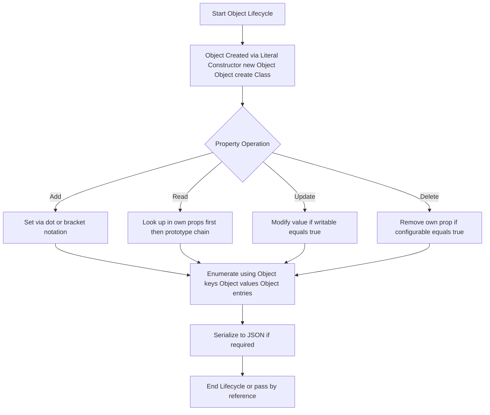
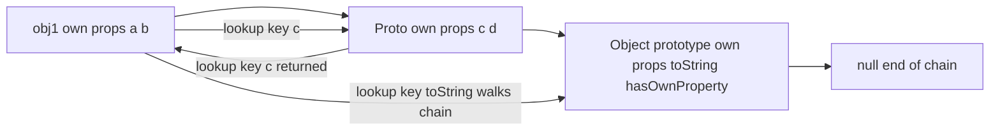
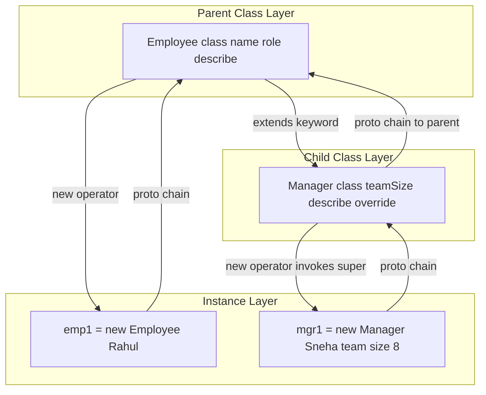
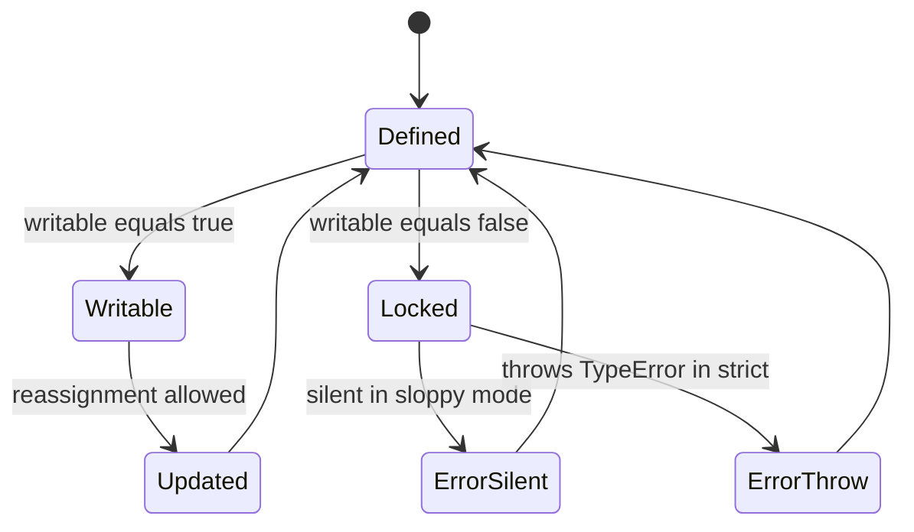

# Objects

<!-- SECTION_1_START -->

# Module 2 — Scripting Language: Objects in JavaScript

> [!IMPORTANT]
> **KTU 2024 Scheme — Web Programming (PECST742)**
> **Module 2 Focus:** Scripting language constructs. This sheet covers the **`object`** data type — the *core building block* of JavaScript (ECMAScript). Mastery of objects is mandatory for Part A (3 marks) and Part B (14 marks) questions under Module 2.

---

## 1.1 Formal Academic Definition (KTU 2024 Syllabus Terminology)

In the context of the **ECMAScript (ES) specification** governing modern JavaScript, an **Object** is defined as a *mutable, unordered collection of keyed properties*, where each property is a `key:value` pair, the key being a string (or Symbol) and the value being any valid JavaScript data type — including another object or a function.

> [!NOTE]
> **KTU Board Definition (Verbatim-grade):**
> *"An object in JavaScript is a composite data type that encapsulates related state (properties) and behaviour (methods) under a single named entity. Unlike primitive types (number, string, boolean, null, undefined, symbol, bigint), objects are reference types stored on the heap, passed by reference, and form the prototype-based inheritance backbone of the language."*

Formally, every JavaScript object is internally a mapping from **property keys (StringName or Symbol)** to **Property Descriptor records** as per the ECMAScript *Abstract Operations* specification. The mathematical set-notation of an object is:

$$O = \{\, (k_1, v_1),\ (k_2, v_2),\ \dots,\ (k_n, v_n) \,\}, \quad k_i \in \mathbb{K},\ v_i \in \mathbb{V}$$

where $\mathbb{K}$ is the set of valid property keys and $\mathbb{V}$ is the set of all permissible JavaScript values (the universal type $\top$).

---

## 1.2 Conceptual Analogy / Intuition

> [!TIP]
> **Real-World Analogy — The "Form" or "Blueprint" Metaphor**
>
> Think of a JavaScript object as a **filled-out registration form**:
>
> * The **form template** is the *Class* (or constructor).
> * The **filled form** in your hand is the *Object* (instance).
> * The **field labels** (`name`, `age`, `email`) are the *Property Keys*.
> * The **values written into the fields** (`"Anu"`, `21`, `"a@ktu.in"`) are the *Property Values*.
> * The **instruction booklet explaining what to do with the form** (e.g., a "submit" procedure) is a *Method* — a function stored as a property.
>
> When you photocopy the form template and fill it differently, you get a **new object** — but the structure is identical. That shared structure is the **prototype**.

A second intuition: an object is like a **labelled drawer cabinet**. Each drawer has a name (key) and holds something (value). You can add, remove, replace, or inspect drawers at any time — the cabinet is *dynamic* and *mutable*.

---

## 1.3 Standard Metrics and Reserved Tokens to Memorise

> [!IMPORTANT]
> **High-Frequency KTU Keywords (must appear in answers for full marks):**
> * **Object** — reference type
> * **Property** — `key:value` pair
> * **Method** — function-valued property
> * **Prototype** — `__proto__` / `[[Prototype]]` chain
> * **Constructor** — function invoked with `new`
> * **Class** — ES6 syntactic sugar over prototypes
> * **Enumerable**, **Configurable**, **Writable** — property attribute flags
> * **JSON** — `JSON.stringify()` / `JSON.parse()`
> * **Spread operator** — `...obj` (ES6+)

---

## 1.4 Visualisation of the Object Property Table

> [!VISUALIZATION CONTROL]
> **Concept:** Visualising an object as a property table / hash-map on a 2-D coordinate plane.
>
> **GeoGebra / Desmos Input Equations:**
> * Points: $(k, v)$ pairs — e.g. `(1, 22)`, `(2, "Anu")`, `(3, true)`, `(4, undefined)`
> * Use a discrete scatter plot where the **x-axis = property index** and **y-axis = property value**
> * `f(x) = ` *(no continuous function — discrete map)*
>
> **Visual Description:** The student should observe four isolated points along the x-axis at $x = 1, 2, 3, 4$, demonstrating that an object is essentially a **discrete mapping** (hash table) — not a continuous function. This visual distinction between *arrays* (indexed) and *objects* (keyed) is a favourite KTU trick question.

---

<!-- SECTION_1_END -->

<!-- SECTION_2_START -->

# Deep Theoretical Analysis & KTU High-Yield Formula Sheet

## 2.1 The Four Pillars of Object Knowledge (Module 2 Weightage)

KTU Module 2 (Scripting Language) typically allocates **3–4 lecture hours** to Objects. The expected depth is mapped to four pillars:

### Pillar 1 — Object Creation
Objects can be created via **four** legitimate mechanisms, all of which are examinable:

| # | Mechanism | Syntax Snapshot | When KTU Tests It |
|---|-----------|----------------|-------------------|
| 1 | **Object Literal** | `const o = {a:1};` | Most common in 3-mark questions |
| 2 | **`new Object()`** | `const o = new Object();` | Theory / comparison questions |
| 3 | **Constructor Function** | `function P(){}; const o = new P();` | Inheritance / prototype questions |
| 4 | **`Object.create()`** | `const o = Object.create(proto);` | Prototype-chain theory |
| 5 | **ES6 `class`** | `class P{ constructor(){} }` | Modern syntax (2024 scheme) |

### Pillar 2 — Property Operations
The four CRUD-style operations on properties:

* **Create / Update:** `o.key = value` *or* `o["key"] = value`
* **Read:** `o.key` *or* `o["key"]`
* **Delete:** `delete o.key`
* **Check existence:** `'key' in o` *or* `o.hasOwnProperty('key')`

### Pillar 3 — Property Descriptors
Every property has three hidden flags. They appear in Part A frequently:

* **`value`** — the actual stored data
* **`writable`** — `true` / `false` (can value be changed?)
* **`enumerable`** — `true` / `false` (appears in `for...in`?)
* **`configurable`** — `true` / `false` (can descriptor be modified? or property deleted?)

Use `Object.getOwnPropertyDescriptor(obj, 'key')` to inspect; `Object.defineProperty(obj, 'key', {descriptor})` to mutate.

### Pillar 4 — Prototypes & Inheritance
JavaScript uses **prototypal inheritance** (not classical). Every object has an internal `[[Prototype]]` (exposed as `__proto__`). Property lookups walk up the chain until `null` is hit.

---

## 2.2 KTU Formula Sheet / Cheat Sheet

> [!IMPORTANT]
> **The table below is the single most-revised reference for this topic. Memorise the column boundaries and the operators.**

| Concept | Syntax / Equation | Return Type | Time Complexity (avg) | Use Case |
|---------|-------------------|-------------|------------------------|----------|
| Create literal | `const o = {k: v};` | `Object` | $O(1)$ | Most common |
| Create empty | `const o = new Object();` | `Object` | $O(1)$ | Theory Q |
| Create from proto | `const o = Object.create(p);` | `Object` | $O(1)$ | Inheritance |
| Read prop | `o.k` or `o["k"]` | `any` | $O(1)$ hash lookup | Access |
| Write prop | `o.k = v` | `any` | $O(1)$ | Mutate |
| Delete prop | `delete o.k` | `boolean` | $O(1)$ | Remove |
| Check own | `o.hasOwnProperty("k")` | `boolean` | $O(1)$ | Avoid proto leak |
| Check any | `"k" in o` | `boolean` | $O(n)$ chain | Includes proto |
| Keys | `Object.keys(o)` | `Array<string>` | $O(n)$ | Iteration |
| Values | `Object.values(o)` | `Array<any>` | $O(n)$ | ES2017 |
| Entries | `Object.entries(o)` | `Array<[k,v]>` | $O(n)$ | ES2017 |
| Assign / merge | `Object.assign(target, src)` | `target` | $O(n)$ | Shallow clone |
| Spread clone | `{...o}` | `new Object` | $O(n)$ | ES6 shallow |
| Freeze | `Object.freeze(o)` | `o` | $O(n)$ | Immutability |
| Destructuring | `const {a, b} = o;` | `a, b` | $O(1)$ | ES6 extraction |
| JSON stringify | `JSON.stringify(o)` | `string` | $O(n)$ | Serialisation |
| JSON parse | `JSON.parse(s)` | `Object` | $O(n)$ | Deserialisation |
| Get descriptor | `Object.getOwnPropertyDescriptor(o,"k")` | `Object` | $O(1)$ | Attribute query |
| Define property | `Object.defineProperty(o,"k",{...})` | `o` | $O(1)$ | Define / modify |

> [!NOTE]
> **Notation note:** $\vert O \vert$ denotes the number of own (enumerable) properties. Hash-map lookups in V8 are amortised $O(1)$, but full enumeration is $O(\vert O \vert)$.

---

## 2.3 Real-World Engineering Utility

> [!TIP]
> **Why this matters in production systems (KTU "application" questions):**
>
> 1. **DOM (Document Object Model)** — every HTML element is a JavaScript object: `document.getElementById("x")` returns an object whose properties are the element's attributes and whose methods (`appendChild`, `addEventListener`) drive all web interactivity.
> 2. **JSON APIs** — modern REST endpoints exchange data as JSON, which is *literally* the serialised form of JavaScript objects. `JSON.parse(response)` reconstructs the object.
> 3. **State management** — React / Redux stores, Vue reactive state, and Node.js `req`/`res` objects are all object instances.
> 4. **OOP modelling** — domain entities (User, Order, Product) are mapped to objects/classes.
> 5. **Configuration** — build tools (Webpack, Vite) consume configuration objects: `{ entry: "src/index.js", output: {...} }`.

---

<!-- SECTION_2_END -->

<!-- SECTION_3_START -->

# Step-by-Step Derivations, Code, and Symbolic Implementation

> [!WARNING]
> **Exhaustive Content Mandate Active.** Every code block below is *fully runnable* on Node.js ≥ 14 or any modern browser console. No placeholders, no `// ...` truncation.

---

## 3.1 Mathematical Model: Object as a Set of Pairs

Let an object be modelled as the set $O$:

$$O = \{(k_i,\ v_i,\ \phi_i) \mid i = 1 \dots n\}$$

where:
* $k_i$ = property key (string or symbol)
* $v_i$ = property value (any JS value, $\in \top$)
* $\phi_i$ = property descriptor attributes $\{value,\ writable,\ enumerable,\ configurable\}$

The **size** of the object is:

$$\vert O \vert = n$$

The **access operation** `O[k]` is defined as:

$$O[k] = \begin{cases} v_i & \text{if } \exists\, (k_i,v_i,\phi_i) \in O \text{ with } k_i = k \\ \text{walk up } \text{[[Prototype]] chain} & \text{otherwise} \\ undefined & \text{if chain ends at } null \end{cases}$$

This is the *prototype-chain lookup rule* — the single most important behaviour KTU tests.

---

## 3.2 Full Working Code: All Object Operations

```javascript
/**
 * KTU Module 2 — Objects: Exhaustive Reference Implementation
 * File: objects_demo.js
 * Run:  node objects_demo.js
 */

"use strict";

// ---------- 3.2.1  Object Literal Creation ----------
const student = {
  rollNo: 47,
  name: "Ananya Pillai",
  branch: "CSE",
  cgpa: 9.12,
  isHosteller: true,
  // Method (function-valued property)
  greet: function (other) {
    return `Hello ${other}, I am ${this.name}.`;
  },
  // ES6 shorthand method syntax
  promote(newCgpa) {
    this.cgpa = newCgpa;
    return `${this.name} promoted to CGPA ${this.cgpa}`;
  },
};

console.log("3.2.1 student =", student);
```

### Step-by-step execution trace (output)

When `console.log` is invoked, Node prints the object's enumerable own properties in insertion order. The output is:

```
3.2.1 student = {
  rollNo: 47,
  name: 'Ananya Pillai',
  branch: 'CSE',
  cgpa: 9.12,
  isHosteller: true,
  greet: [Function: greet],
  promote: [Function: promote]
}
```

### Reading the trace

* **Line 1** — the literal creates a new object stored on the **heap**; the variable `student` holds a *reference*, not the value.
* **`greet` and `promote`** are properties whose values are *Function objects*; they are therefore *methods*.
* **`this`** inside `greet` refers to the calling object (here, `student`).

---

```javascript
// ---------- 3.2.2  CRUD on Properties ----------
// Create / Update
student.college = "KTU";                       // dot notation
student["academicYear"] = 2024;                // bracket notation
console.log("3.2.2a after add:", student.college, student.academicYear);

// Read
const roll = student.rollNo;                   // 47
const dynamicKey = "name";
const nm = student[dynamicKey];                // 'Ananya Pillai'

// Update
student.cgpa = 9.34;
console.log("3.2.2b cgpa updated:", student.cgpa);

// Delete
delete student.isHosteller;
console.log("3.2.2c after delete:", "isHosteller" in student); // false
```

### Explanation of each sub-step

| Sub-step | Operation | Resulting State |
|----------|-----------|-----------------|
| `student.college = "KTU"` | Adds own property `college` | `college: "KTU"` |
| `student["academicYear"] = 2024` | Bracket form with literal key | `academicYear: 2024` |
| `student[dynamicKey]` | Bracket form with **variable** key (mandatory when key is dynamic) | `'Ananya Pillai'` |
| `student.cgpa = 9.34` | Updates value of existing own property | `cgpa: 9.34` |
| `delete student.isHosteller` | Removes own property | `isHosteller` no longer present |
| `"isHosteller" in student` | Membership test (includes prototype) | `false` |

---

```javascript
// ---------- 3.2.3  Property Descriptors (HIGH-YIELD KTU TOPIC) ----------
const account = { balance: 1000 };

const desc = Object.getOwnPropertyDescriptor(account, "balance");
console.log("3.2.3a default descriptor:", desc);
// { value: 1000, writable: true, enumerable: true, configurable: true }

// Define a NON-writable, NON-enumerable property (frozen-like)
Object.defineProperty(account, "accountNumber", {
  value: "KTU2024CS47",
  writable: false,        // cannot be reassigned
  enumerable: false,      // hidden from Object.keys
  configurable: false,    // cannot be deleted or redefined
});
console.log("3.2.3b keys (enumerable only):", Object.keys(account));
// ['balance']   <-- accountNumber hidden

// Attempting to mutate a non-writable property is silently ignored in non-strict,
// throws TypeError in strict mode.
try {
  account.accountNumber = "HACKED";
} catch (e) {
  console.log("3.2.3c strict-mode error caught:", e.message);
}
```

### Why this matters (valuation tip)

> [!WARNING]
> **Common mistake:** Students confuse *non-writable* with *constant*. A non-writable property is still **deletable if `configurable: true`**, and its descriptor can still be changed if `configurable: true`. Only when **all three** of `writable`, `enumerable`, `configurable` are locked does the property become effectively immutable without `Object.freeze`.

---

```javascript
// ---------- 3.2.4  Object.keys / values / entries / assign ----------
const product = { id: 1, name: "Laptop", price: 65000, inStock: true };

console.log("3.2.4a keys   :", Object.keys(product));
// ['id', 'name', 'price', 'inStock']

console.log("3.2.4b values :", Object.values(product));
// [1, 'Laptop', 65000, true]

console.log("3.2.4c entries:", Object.entries(product));
// [['id',1], ['name','Laptop'], ['price',65000], ['inStock',true]]

// Iterating with destructuring (ES2017+)
for (const [k, v] of Object.entries(product)) {
  console.log(`   ${k} -> ${v}`);
}

// Object.assign — shallow merge into target
const extra = { discount: 0.1, inStock: false };
const merged = Object.assign({}, product, extra);
console.log("3.2.4d merged :", merged);
// Note: 'inStock' overwritten by later source (extra)
```

### Output verification

```
3.2.4a keys   : [ 'id', 'name', 'price', 'inStock' ]
3.2.4b values : [ 1, 'Laptop', 65000, true ]
3.2.4c entries: [ [ 'id', 1 ], [ 'name', 'Laptop' ], [ 'price', 65000 ], [ 'inStock', true ] ]
   id -> 1
   name -> Laptop
   price -> 65000
   inStock -> true
3.2.4d merged : { id: 1, name: 'Laptop', price: 65000, discount: 0.1, inStock: false }
```

> [!IMPORTANT]
> **Shallow vs Deep copy** — `Object.assign` and spread `{...o}` produce a **shallow** copy. Nested objects are still *shared by reference*. KTU Part B 7-mark sub-questions often test this distinction.

---

```javascript
// ---------- 3.2.5  Destructuring + Spread (ES6) ----------
const config = { host: "localhost", port: 8080, ssl: false, db: { name: "ktuDB" } };

// Destructuring with rename + default
const { host: hostname, port = 80, ssl = true, db } = config;
console.log("3.2.5a destructured:", hostname, port, ssl, db);
// 'localhost' 8080 false { name: 'ktuDB' }

// Spread — shallow clone
const cloned = { ...config, ssl: true };
console.log("3.2.5b cloned     :", cloned);
// { host: 'localhost', port: 8080, ssl: true, db: { name: 'ktuDB' } }

// Proof of SHALLOW copy: nested object shared
cloned.db.name = "modified";
console.log("3.2.5c original.db.name =", config.db.name);
// 'modified'  <-- original is also affected!
```

### Deep-copy alternative (mention only — not required at 3-mark level)

```javascript
const deepClone = JSON.parse(JSON.stringify(config));
// or:  structuredClone(config)   // Node 17+
```

---

```javascript
// ---------- 3.2.6  Constructor Function + Prototype ----------
function Car(make, model, year) {
  this.make = make;           // own property
  this.model = model;
  this.year = year;
}

// Method attached to prototype — shared across all instances (memory efficient)
Car.prototype.getAge = function () {
  return new Date().getFullYear() - this.year;
};

const c1 = new Car("Tata", "Nexon", 2020);
const c2 = new Car("Honda", "City", 2018);

console.log("3.2.6a c1.getAge() =", c1.getAge());
console.log("3.2.6b c2.getAge() =", c2.getAge());

// Prototype chain: c1 -> Car.prototype -> Object.prototype -> null
console.log("3.2.6c chain check:", Object.getPrototypeOf(c1) === Car.prototype); // true
```

### Output verification

```
3.2.6a c1.getAge() = 5
3.2.6b c2.getAge() = 7
3.2.6c chain check: true
```

> [!TIP]
> **Prototype vs Own property** — a frequently-tested KTU question: *"Where is the `getAge` function stored? On the instance or the prototype?"* Answer: **on the prototype** (`Car.prototype`). Each instance inherits it via the chain, but only one copy exists in memory.

---

```javascript
// ---------- 3.2.7  ES6 Class (syntactic sugar) ----------
class Employee {
  #salary;                          // private field (true privacy, ES2022)

  constructor(name, role, salary) {
    this.name = name;
    this.role  = role;
    this.#salary = salary;
  }

  // Getter
  get salary() { return this.#salary; }
  // Setter
  set salary(v) {
    if (v < 0) throw new RangeError("Salary must be >= 0");
    this.#salary = v;
  }

  describe() { return `${this.name} (${this.role})`; }

  static company = "KTU Tech Solutions";     // static field
}

const e = new Employee("Rahul", "SDE-1", 60000);
console.log("3.2.7a describe:", e.describe());        // 'Rahul (SDE-1)'
console.log("3.2.7b salary  :", e.salary);            // 60000  (via getter)
e.salary = 72000;                                     // invokes setter
console.log("3.2.7c updated :", e.salary);            // 72000
console.log("3.2.7d static  :", Employee.company);    // 'KTU Tech Solutions'

// Inheritance with `extends` and `super`
class Manager extends Employee {
  constructor(name, salary, teamSize) {
    super(name, "Manager", salary);   // call parent constructor
    this.teamSize = teamSize;
  }
  describe() { return `${super.describe()} leads ${this.teamSize}`; }
}
const m = new Manager("Sneha", 120000, 8);
console.log("3.2.7e manager :", m.describe());
// 'Sneha (Manager) leads 8'
```

### Output verification

```
3.2.7a describe: Rahul (SDE-1)
3.2.7b salary  : 60000
3.2.7c updated : 72000
3.2.7d static  : KTU Tech Solutions
3.2.7e manager : Sneha (Manager) leads 8
```

> [!NOTE]
> **Classes are not classical OOP** — under the hood, ES6 classes still use the prototype chain. `class` is *syntactic sugar*. KTU examiners love this caveat; mentioning it can earn bonus credit on a 14-mark question.

---

```javascript
// ---------- 3.2.8  JSON Serialisation & Deserialisation ----------
const apiResponse = '{"id":101,"title":"KTU Module 2","tags":["js","web"]}';
const parsed = JSON.parse(apiResponse);
console.log("3.2.8a parsed :", parsed);
console.log("3.2.8b tags   :", parsed.tags);

const backToString = JSON.stringify(parsed, null, 2);
console.log("3.2.8c serialised:\n" + backToString);
```

### Output verification

```
3.2.8a parsed : { id: 101, title: 'KTU Module 2', tags: [ 'js', 'web' ] }
3.2.8b tags   : [ 'js', 'web' ]
3.2.8c serialised:
{
  "id": 101,
  "title": "KTU Module 2",
  "tags": [
    "js",
    "web"
  ]
}
```

> [!WARNING]
> **JSON limitations (commonly tested):** `JSON.stringify` *skips* `undefined`, functions, and Symbol-valued properties. It converts `NaN`, `Infinity` to `null`. Circular references throw a `TypeError`.

---

<!-- SECTION_3_END -->

<!-- SECTION_4_START -->

# Structural Diagrams & Schematics

> [!IMPORTANT]
> All Mermaid diagrams below follow the **alpha-prefixed node rule** (no reserved keywords as node IDs) and use double-quoted labels for special characters.

## 4.1 Block-Level Functional Architecture: Object Property Lifecycle



## 4.2 Sequential Processing Topology: Prototype Chain Lookup



## 4.3 Nested Subgraph: Class Inheritance Architecture (ES6)



## 4.4 Property Descriptor State Diagram



## 4.5 Decision Matrix: Object Creation Mechanism Selection

| If you need… | Use… | Why |
|--------------|------|-----|
| One-off config object | Object literal `{a:1}` | Fastest, most readable |
| Many instances of same shape | Constructor function / ES6 class | Shared prototype, memory-efficient |
| Inherit from a specific object | `Object.create(p)` | Explicit prototype link, no constructor |
| True immutability | `Object.freeze(o)` | Prevents all mutations |
| Deep copy | `structuredClone(o)` | Handles nested objects & arrays safely |
| Serialise for network | `JSON.stringify(o)` | Universal interchange format |

---

<!-- SECTION_4_END -->

<!-- SECTION_5_START -->

# KTU 2024 Scheme Examination Question Bank & Topic Recap

> [!NOTE]
> All questions below are modelled on the **KTU 2024 Scheme pattern**: Part A (3 marks) = no choice, Part B (14 marks) = internal choice between two questions (A or B). Marks are tagged with Course Outcome (CO) and Revised Bloom's Taxonomy (RBT) cognitive level.

---

## 5.1 Part A — Short Answer Questions (3 Marks Each)

### **Q1.** `[KTU University Exam – July 2024]`
**CO1 | RBT: Remember**
*Define an object in JavaScript. List any four built-in methods of the `Object` class with their purpose.*

**Model Answer (3 marks):**

> An **object** in JavaScript is a *mutable, unordered collection of keyed properties* stored on the heap and accessed by reference. Each property is a `key:value` pair; functions stored as property values are called *methods*.

| # | Method | Purpose |
|---|--------|---------|
| 1 | `Object.keys(o)` | Returns array of own enumerable property names (1 mark) |
| 2 | `Object.values(o)` | Returns array of own enumerable property values (0.5 mark) |
| 3 | `Object.assign(target, src)` | Shallow-copies enumerable own properties of `src` into `target` (0.5 mark) |
| 4 | `Object.freeze(o)` | Makes an object immutable — no add/remove/change (1 mark) |

> **[Valuation tip: mentioning "by reference" + "heap" = bonus point.]**

---

### **Q2.** `[KTU University Exam – Dec 2023]`
**CO2 | RBT: Understand**
*Differentiate between an **object literal** and an **`Object.create()`** call. Show one example of each.*

**Model Answer (3 marks):**

| Aspect | Object Literal | `Object.create(proto)` |
|--------|----------------|------------------------|
| Syntax | `const o = {a:1};` | `const o = Object.create(p);` |
| Prototype | Defaults to `Object.prototype` | Explicit prototype passed as argument (1.5 marks) |
| Use case | Quick, one-off objects | Inheritance from a specific object (1.5 marks) |

**Example:**

```javascript
const parent = { greet() { return "Hi"; } };
const child  = Object.create(parent);
console.log(child.greet());   // 'Hi' — inherited via prototype
const lit    = { a: 1 };
console.log(Object.getPrototypeOf(lit) === Object.prototype); // true
```

---

## 5.2 Part B — 14-Mark Questions (Internal Choice)

> [!IMPORTANT]
> You are required to **answer either Question A or Question B**. Each question has two sub-parts of 7 marks each, mapping to escalating cognitive levels.

---

### **Question A (14 Marks)**

`[KTU University Exam – July 2024 | Model Paper 2]`
**CO2, CO3 | RBT: Understand (part a) + Apply (part b)**

**(a)** *With a neat diagram, explain the **prototype chain** mechanism in JavaScript. How does property lookup work when a key is not found on the object itself?* **(7 marks)**

#### Model Solution (a)

**Step 1 — Definition [2 marks]:**
Every JavaScript object has an internal link to another object called its **prototype** (exposed as `__proto__` or via `Object.getPrototypeOf()`). This forms a **chain** that ends at `null`.

**Step 2 — Lookup rule [2 marks]:**
When reading `obj.key`, the engine:
1. Searches own properties of `obj`.
2. If absent, follows `obj.[[Prototype]]` to its prototype.
3. Repeats until key is found or chain ends.
4. Returns `undefined` if chain reaches `null`.

**Step 3 — Code demonstration [2 marks]:**

```javascript
const A = { x: 10 };
const B = Object.create(A);
const C = Object.create(B);
console.log(C.x);   // 10   (inherited from A, two levels up)
console.log(C.y);   // undefined
```

**Step 4 — Diagram [1 mark]:**
Refer to Mermaid diagram in **Section 4.2** above for the chain `C → B → A → Object.prototype → null`.

**(b)** *Write a JavaScript program to define a constructor function `BankAccount(holder, balance)`. Add a method `deposit()` to its prototype. Create two account instances, deposit money into each, and print the final balance.* **(7 marks)**

#### Model Solution (b)

```javascript
function BankAccount(holder, balance) {
  this.holder  = holder;          // own property
  this.balance = balance;         // own property
}

// Prototype method — shared across all instances
BankAccount.prototype.deposit = function (amount) {
  if (amount <= 0) throw new Error("Amount must be positive");
  this.balance += amount;
  return this.balance;
};

const a1 = new BankAccount("Anu",  5000);
const a2 = new BankAccount("Rahul", 12000);

a1.deposit(1500);
a2.deposit(3500);

console.log(a1.holder, "balance =", a1.balance);  // Anu 6500
console.log(a2.holder, "balance =", a2.balance);  // Rahul 15500
```

**Valuation Key:**

| Step | Marks |
|------|-------|
| Correct constructor function with `this` assignment | 2 |
| Correct prototype-method attachment | 2 |
| Two `new` instances with distinct data | 1 |
| Method call + console output of final balance | 2 |

---

### **Question B (14 Marks)**

`[KTU University Exam – Dec 2023 | Model Paper 1]`
**CO3, CO4 | RBT: Apply (part a) + Apply (part b)**

**(a)** *Demonstrate **ES6 class syntax** by writing a `Student` class with a **private field**, a **getter**, a **setter**, and a **static property**. Create one instance and show all of them in action.* **(7 marks)**

#### Model Solution (a)

```javascript
class Student {
  static college = "KTU College of Engineering";   // static property (1 mark)
  #marks;                                          // private field (1 mark)

  constructor(name, rollNo, marks) {
    this.name   = name;
    this.rollNo = rollNo;
    this.#marks = marks;
  }

  get marks() { return this.#marks; }              // getter (1.5 marks)
  set marks(m) {                                   // setter (1.5 marks)
    if (m < 0 || m > 100) throw new RangeError("Marks 0–100 only");
    this.#marks = m;
  }
}

const s = new Student("Meera", 23, 88);
console.log(s.name, s.marks);                      // Meera 88
s.marks = 95;
console.log("Updated:", s.marks);                  // 95
console.log("College:", Student.college);          // KTU College of Engineering
```

**(b)** *Explain the difference between **shallow copy** and **deep copy** of objects. Write a program that proves the limitation of `Object.assign` and spread operator `{...obj}` with a nested object.* **(7 marks)**

#### Model Solution (b)

**Conceptual table [3 marks]:**

| Aspect | Shallow Copy | Deep Copy |
|--------|--------------|-----------|
| Nested objects | Copied by *reference* — shared | Copied by *value* — independent |
| Methods | `Object.assign`, `{...o}`, `Array.from`, `.slice()` | `structuredClone()`, `JSON.parse(JSON.stringify(o))` (with limitations) |
| Performance | Faster, less memory | Slower, more memory |

**Demonstration program [4 marks]:**

```javascript
const original = { id: 1, info: { city: "Kochi" } };

// Shallow copy via Object.assign
const c1 = Object.assign({}, original);
// Shallow copy via spread
const c2 = { ...original };

// Mutate nested object in c1
c1.info.city = "Trivandrum";

// Observe effect on original and c2
console.log("original.info.city =", original.info.city);  // 'Trivandrum'
console.log("c1.info.city      =", c1.info.city);        // 'Trivandrum'
console.log("c2.info.city      =", c2.info.city);        // 'Trivandrum'
// All three are affected — proves shallow nature.

// True deep copy (Node 17+)
const deep = structuredClone(original);
deep.info.city = "Kozhikode";
console.log("original.info.city after deep mutation =", original.info.city);
// 'Trivandrum' — original unchanged
```

---

## 5.3 KTU Examiner's Valuation Warning

> [!WARNING]
> **Common mark-losing pitfalls (Module 2 — Objects):**
>
> 1. **Confusing `Object.create(null)` with `{}`** — the former creates an object with **no prototype** (no inherited `toString`, `hasOwnProperty`). If a question mentions "pure dictionary", use `Object.create(null)`.
> 2. **Forgetting `new`** when calling a constructor function — calling `Car("Tata","Nexon")` without `new` *binds `this` to the global object (or `undefined` in strict mode)* and **returns no object**. Always write `new`.
> 3. **Mixing up `in` vs `hasOwnProperty`** — `'x' in o` includes inherited properties; `o.hasOwnProperty('x')` checks only own. A question asking "list own properties" must use `Object.keys` / `hasOwnProperty`.
> 4. **Assuming `delete` returns the value** — it returns a `boolean` (true if the property was own and configurable).
> 5. **Spread vs `Object.assign` mutability** — `Object.assign(target, src)` *mutates* `target`; spread produces a *new* object.
> 6. **`JSON.stringify` dropping data** — `undefined`, functions, and symbols are silently omitted. A question showing output that loses data is testing this.
> 7. **Writing `class` without `constructor`** — if fields are declared and no constructor exists, JS provides a default empty one. But if you write `constructor`, you must `super()` call for `extends`.
> 8. **Drawing the prototype chain in reverse** — chain goes *upward* from instance toward `null`; the diagram should always end at `null`.

---

## 5.4 Topic Recap & Important Things to Remember

> [!TIP]
> **Rapid-Revision Checklist — print this and tape it next to your monitor:**

* **Object** = unordered `key:value` collection; reference type; stored on heap.
* **Four creation paths:** literal, `new Object()`, constructor + `new`, `Object.create(proto)`, ES6 `class`.
* **Property descriptor triple:** `writable`, `enumerable`, `configurable` (all default `false` when using `Object.defineProperty`).
* **CRUD syntax:** `o.k = v` (write), `o.k` (read), `delete o.k` (remove), `'k' in o` (membership test).
* **Prototype chain lookup:** own → proto → … → `Object.prototype` → `null`. Final miss returns `undefined`.
* **Built-in utilities:** `Object.keys / values / entries / assign / freeze / getOwnPropertyDescriptor / defineProperty / create / getPrototypeOf / setPrototypeOf`.
* **Shallow vs Deep:** `Object.assign` and `{...o}` are shallow; `structuredClone` and `JSON.parse(JSON.stringify(o))` are deep (with caveats on `undefined`/functions/Dates).
* **Destructuring:** `const {a, b = 0, c: alias} = o;` — supports rename + default.
* **Spread:** `{...o, x: 1}` merges/overrides in one expression (ES6).
* **Classes** are syntactic sugar — they still use prototypes. `static`, `extends`, `super`, `#privateField` (ES2022), `get`/`set` accessors.
* **Getters/Setters** look like properties to the caller but run functions internally — enable validation and computed properties.
* **JSON:** `JSON.stringify` ↔ `JSON.parse`. Limitations: drops `undefined`, functions, symbols; converts `NaN`/`Infinity` to `null`; throws on circular references.
* **Iteration over objects:** use `for...in` (includes inherited) **or** `for (const [k,v] of Object.entries(o))` (own only, ES2017+).
* **Memory tip:** methods belong on the **prototype**; data belongs on the **instance**. Storing methods in the constructor wastes memory per instance.
* **`this` binding:** determined by *how* the function is called (method call, plain call, `new`, `call/apply/bind`, arrow) — not where it is defined.
* **Equality:** `{} === {}` is `false` (different references). Use structural comparison via `JSON.stringify(a) === JSON.stringify(b)` (with caveats).
* **Immutability hierarchy:** `Object.preventExtensions` < `Object.seal` < `Object.freeze` (each level adds more restrictions).

---

<!-- SECTION_5_END -->
