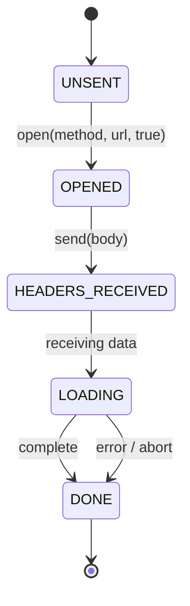
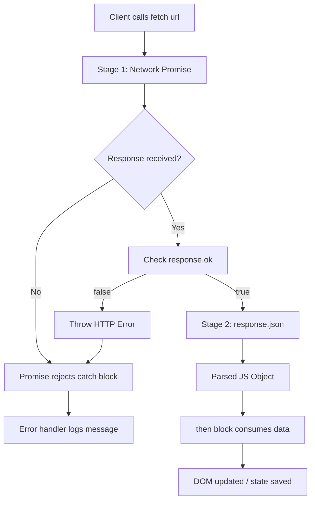
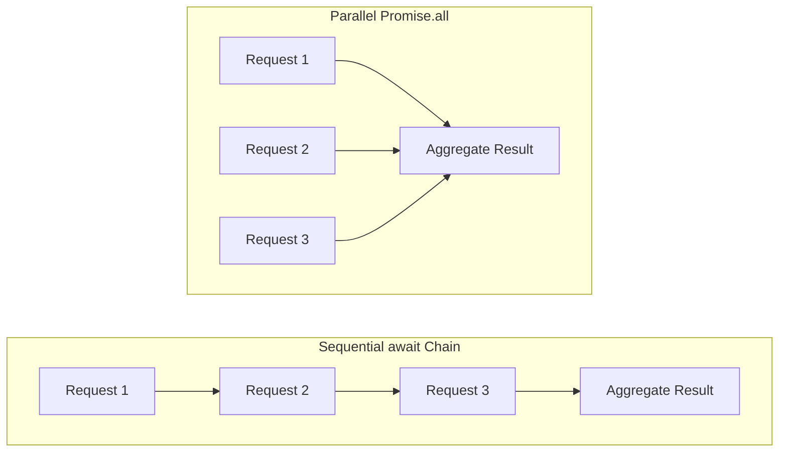
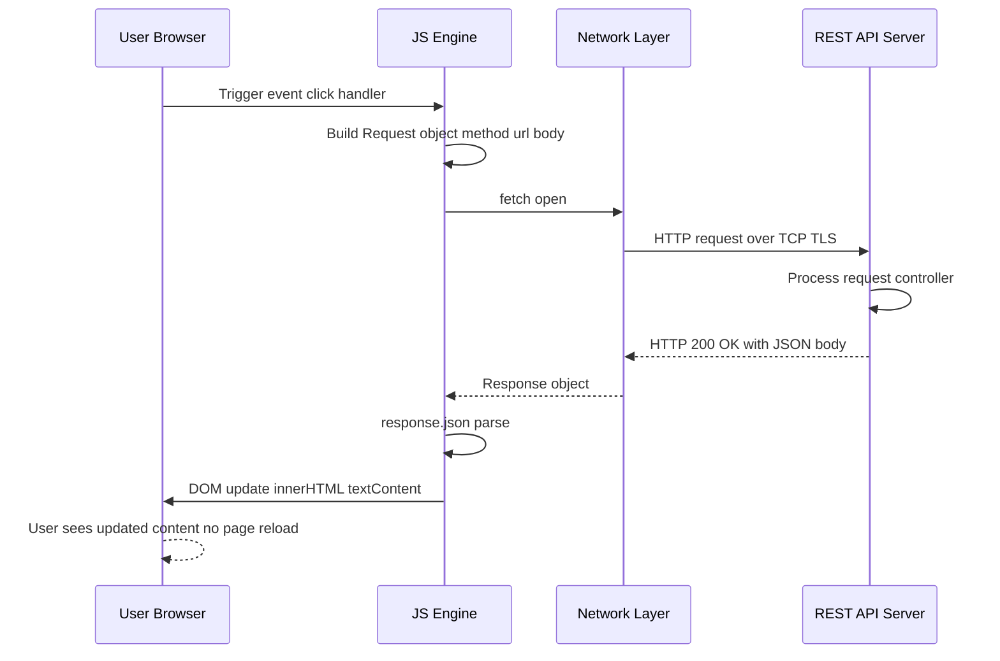

# Requests

<!-- SECTION_1_START -->
# HTTP Requests in JavaScript: Core Definition & Intuitive Overview

In the context of **server-side scripting** and **client-side scripting** for KTU Web Programming, a **Request** is a structured message dispatched by a client (browser, mobile app, or service) to a server, asking it to perform an action or return a resource. Under the **KTU 2024 Scheme (PECST742) Module 2: Scripting Language**, the term "Requests" centers on the modern JavaScript mechanisms used to construct, send, receive, and process these HTTP messages programmatically.

> [!IMPORTANT]
> **KTU Syllabus Highlight (Module 2 - Scripting Language)**
> The Requests topic is the **bridge between static web pages and dynamic, data-driven applications**. Mastery of this topic is mandatory for building real-time dashboards, REST clients, single-page applications (SPAs), and form-submission handlers in your lab records and university practical exams.

## Formal Academic Definition

An **HTTP (Hypertext Transfer Protocol) Request** is a text-based message conforming to the **RFC 7230–RFC 7235** standards. In JavaScript, it is constructed and dispatched through two primary APIs:

1. **`XMLHttpRequest` (XHR)** — The legacy, event-driven API introduced in the late 1990s to enable **Asynchronous JavaScript and XML (AJAX)**.
2. **`fetch()`** — The modern, Promise-based API standardized in the **WHATWG Fetch Specification**, returning a **`Response`** object that resolves asynchronously.

Both APIs accept an **HTTP method** (verb), a **Uniform Resource Locator (URL)**, optional **headers**, and an optional **body**, mapping directly to the OSI Application Layer's HTTP semantics.

> [!NOTE]
> **Core Concept — The Request-Response Cycle**
> Every web interaction follows this loop:
> **Client → Request → Server → Response → Client**.
> The JavaScript engine never blocks the UI thread while waiting for the response. This non-blocking behavior is the foundation of **AJAX (Asynchronous JavaScript and XML)**.

## Conceptual Analogy: The Restaurant Waiter

Imagine you are sitting in a restaurant. You (the **client**) want food (a **resource**) from the kitchen (the **server**).

- You write your order on a slip of paper → this is the **Request Payload**.
- The waiter takes your slip to the kitchen → this is the **`fetch()` or `xhr.send()`** call.
- The waiter does not stand at your table staring at the kitchen door. He comes back later with the dish → this is the **Promise (asynchronous resolution)**.
- The dish arrives on a plate with a receipt → this is the **Response Object** containing the **status code** and **body**.

If the dish is wrong, the waiter brings back an error → this is the **`catch()` block** in a Promise chain.

> [!NOTE]
> **Standard HTTP Methods You Must Know (Highlighted for KTU Board Exams)**
> - **`GET`** — Retrieve a resource. **Idempotent** and **safe** (no side effects). Parameters go in the URL.
> - **`POST`** — Create a new resource or submit form data. Parameters go in the **body**.
> - **`PUT`** — Replace an existing resource entirely. **Idempotent**.
> - **`PATCH`** — Partially update an existing resource.
> - **`DELETE`** — Remove a resource. **Idempotent**.

## Key Terminology Glossary

| Term | Definition |
|------|------------|
| **AJAX** | A technique to send/receive data asynchronously without reloading the page |
| **XHR** | `XMLHttpRequest` — the legacy browser object for AJAX |
| **Fetch API** | Modern Promise-based replacement for XHR |
| **Promise** | An object representing the eventual completion (or failure) of an async operation |
| **`async/await`** | Syntactic sugar over Promises for cleaner asynchronous code |
| **CORS** | Cross-Origin Resource Sharing — a security policy governing cross-domain requests |
| **REST** | Representational State Transfer — architectural style for networked APIs |
| **JSON** | JavaScript Object Notation — the de-facto data interchange format for web APIs |
| **Status Code** | A 3-digit number (e.g., **200 OK**, **404 Not Found**, **500 Server Error**) returned by the server |

> [!VISUALIZATION CONTROL]
> **Concept:** Request-Response Timeline
> **GeoGebra / Desmos Input Equations:**
> * `Client: t = 0` (point on x-axis)
> * `Request Sent: t = 1`
> * `Server Processing: t = 2 to t = 5` (horizontal segment)
> * `Response Received: t = 6`
> **Visual Description:** A horizontal number line where the client issues a request at t=1, the server processes asynchronously between t=2 and t=5 (during which the client UI remains responsive), and the response is consumed at t=6. This visually demonstrates the **non-blocking** nature of asynchronous requests.

<!-- SECTION_1_END -->

<!-- SECTION_2_START -->
# Deep Theoretical Analysis & KTU High-Yield Formula Sheet

## 1. The `XMLHttpRequest` (XHR) Lifecycle

The `XMLHttpRequest` object follows a strict state machine. The **`readyState`** property tracks the current phase.

| `readyState` Value | Constant Name | Meaning |
|:-----------------:|---------------|---------|
| **0** | `UNSENT` | Client created, `open()` not yet called |
| **1** | `OPENED` | `open()` has been called |
| **2** | `HEADERS_RECEIVED` | `send()` called; headers/status available |
| **3** | `LOADING` | Downloading; `responseText` holds partial data |
| **4** | `DONE` | Operation complete |

> [!IMPORTANT]
> **Why KTU Examiners Love This Table:** The `readyState === 4` condition combined with `status === 200` is the **most frequently asked sub-question** in 14-mark AJAX problems. You will lose marks if you do not check both.

### XHR Operational Steps (Bullet Breakdown)

1. **Instantiate** a new `XMLHttpRequest` object using the `new` keyword.
2. **Initialize** the connection with `xhr.open(method, url, async)` — typically `async = true`.
3. **Register** an `onreadystatechange` event handler to monitor state transitions.
4. **Configure** request headers via `xhr.setRequestHeader(name, value)` (e.g., for JSON payloads).
5. **Dispatch** the request with `xhr.send(body)` where `body` is `null` for GET and a string/FormData for POST.
6. **Process** the response inside the handler once `readyState === 4` and HTTP `status === 200`.

## 2. The `fetch()` API — Modern Architecture

The `fetch()` function returns a `Promise<Response>`. The `Response` object exposes body-reading methods that each return **another Promise**.

### The Two-Stage Promise Pattern

```
fetch(url)                    → Promise<Response>      (Stage 1: Network)
response.json()               → Promise<Object>        (Stage 2: Parsing)
```

This two-stage design allows JavaScript engines to **stream** the body for large downloads, rather than buffering the entire payload into memory.

### `async/await` Refactoring

`async/await` is **not** a new mechanism — it is **syntactic sugar** that makes Promise chains read like synchronous code. The runtime behavior is **identical**.

## 3. KTU Formula Sheet / Cheat Sheet

| Concept | Syntax / Equation | Key Property | Exam Frequency |
|---------|-------------------|--------------|:--------------:|
| XHR creation | `const xhr = new XMLHttpRequest()` | Returns an instance | ⭐⭐⭐⭐⭐ |
| XHR open | `xhr.open("GET", url, true)` | `async` flag defaults to `true` | ⭐⭐⭐⭐⭐ |
| XHR send | `xhr.send(null)` or `xhr.send(payload)` | Body required for POST/PUT | ⭐⭐⭐⭐ |
| XHR check | `xhr.readyState === 4 \&\& xhr.status === 200` | Both conditions mandatory | ⭐⭐⭐⭐⭐ |
| Fetch GET | `fetch(url).then(r => r.json())` | Returns `Promise<Response>` | ⭐⭐⭐⭐⭐ |
| Fetch POST | `fetch(url, { method:"POST", body:JSON.stringify(d), headers:{"Content-Type":"application/json"} })` | Body must be stringified | ⭐⭐⭐⭐⭐ |
| Async function | `async function f() { const d = await fetch(url); }` | `await` pauses inside `async` only | ⭐⭐⭐⭐ |
| Error catch | `.catch(err => console.error(err))` | Catches network errors, NOT 404s | ⭐⭐⭐⭐ |
| Status check | `response.ok` | `true` if `status` is in **200–299** | ⭐⭐⭐ |
| FormData | `new FormData(formElement)` | Auto-extracts form fields | ⭐⭐⭐ |

> [!WARNING]
> **Common Exam Pitfall:** `fetch()` only **rejects** the Promise on **network failures** (DNS error, offline). An HTTP **404** or **500** is a **resolved** Promise with `response.ok === false`. You must explicitly check `response.ok` or `response.status`.

## 4. Real-World Engineering Utility

| Domain | Application of Requests |
|--------|------------------------|
| **Single-Page Applications (React, Vue, Angular)** | All data binding is powered by `fetch()` or Axios calls to REST endpoints |
| **E-commerce** | AJAX-driven cart updates, live inventory checks, payment gateway integration |
| **Social Media** | Infinite scrolling feeds, real-time notifications via polling or WebSockets |
| **IoT Dashboards** | Sensor data polling using `setInterval()` + `fetch()` |
| **Authentication** | JWT/OAuth token exchange using `POST` with JSON payloads |
| **DevOps Monitoring** | Health-check pings against microservices using `GET /health` |

> [!NOTE]
> **Production Tip:** In industry, raw `fetch()` is often wrapped in libraries like **Axios** or **TanStack Query** for automatic retries, caching, and request deduplication. However, for KTU exams, you must demonstrate the **vanilla JavaScript** implementation.

<!-- SECTION_2_END -->

<!-- SECTION_3_START -->
# Step-by-Step Derivations & Code Implementation

## Example 1: XHR GET Request (Exhaustive Walkthrough)

**Problem:** Fetch user data from `https://jsonplaceholder.typicode.com/users/1` and display the user's name inside a `<div id="output">`.

### Complete JavaScript Implementation

```javascript
// Step 1: Create a new XMLHttpRequest object
const xhr = new XMLHttpRequest();

// Step 2: Define the target URL (an idempotent GET endpoint)
const url = "https://jsonplaceholder.typicode.com/users/1";

// Step 3: Initialize the request
// Parameters: HTTP method, URL, async flag (true = non-blocking)
xhr.open("GET", url, true);

// Step 4: Set the expected response type to JSON
xhr.responseType = "json";

// Step 5: Register the state-change event handler
xhr.onreadystatechange = function () {
    // Step 5a: Check if the operation is complete (readyState === 4)
    if (xhr.readyState === 4) {
        // Step 5b: Check if the HTTP status is in the success range (200-299)
        if (xhr.status === 200) {
            // Step 5c: Access the parsed JSON via xhr.response
            const user = xhr.response;
            
            // Step 5d: Inject the data into the DOM
            const outputDiv = document.getElementById("output");
            if (outputDiv !== null) {
                outputDiv.textContent = "User: " + user.name;
            }
        } else {
            // Step 5e: Handle HTTP error statuses (404, 500, etc.)
            console.error("Request failed with status: " + xhr.status);
        }
    }
};

// Step 5f: Register a network-level error handler
xhr.onerror = function () {
    console.error("Network error: request could not be completed.");
};

// Step 6: Dispatch the request with a null body (GET has no payload)
xhr.send(null);
```

### Step-by-Step Logic Mapping

| Code Line | Conceptual Action | KTU Valuation Point |
|-----------|-------------------|---------------------|
| `new XMLHttpRequest()` | Create transport object | [Object instantiation: 1 Mark] |
| `xhr.open("GET", url, true)` | Configure method, URL, async | [Open call with async: 2 Marks] |
| `xhr.onreadystatechange = ...` | Register callback | [Event handler registration: 1 Mark] |
| `xhr.readyState === 4` | Check completion | [readyState check: 2 Marks] |
| `xhr.status === 200` | Check success status | [Status check: 1 Mark] |
| `xhr.send(null)` | Dispatch request | [Send call: 1 Mark] |

## Example 2: `fetch()` POST with JSON Body (Production-Grade)

**Problem:** Submit a new blog post to `https://api.example.com/posts` and log the server's confirmation.

```javascript
// Step 1: Define the payload as a plain JavaScript object
const newPost = {
    title: "KTU Web Programming",
    body:  "Module 2 study notes",
    userId: 1
};

// Step 2: Convert the object to a JSON string (required for HTTP transport)
const jsonPayload = JSON.stringify(newPost);

// Step 3: Invoke fetch() with the URL and an options object
fetch("https://api.example.com/posts", {
    method: "POST",                          // HTTP verb
    headers: {
        "Content-Type": "application/json",  // Tells server the body is JSON
        "Accept":       "application/json"   // Tells server we want JSON back
    },
    body: jsonPayload                        // The serialized payload
})
// Step 4: Stage 1 — Validate the HTTP response
.then(function (response) {
    // Step 4a: response.ok is true for status codes 200-299
    if (!response.ok) {
        // Manually throw to jump to the .catch() block
        throw new Error("HTTP " + response.status + ": " + response.statusText);
    }
    // Step 4b: Stage 2 — Parse the JSON body (returns another Promise)
    return response.json();
})
// Step 5: Consume the parsed data
.then(function (data) {
    console.log("Server confirmed:", data);
    console.log("New post ID:", data.id);
})
// Step 6: Handle all errors (network failures + manual throws)
.catch(function (error) {
    console.error("Submission failed:", error.message);
});
```

### Algebraic Derivation of the Promise Chain

Let the fetch call be represented as the function $F$, the response validation as $V$, and JSON parsing as $P$.

$$\text{Chain} = F(\text{url}, \text{opts}) \rightarrow V(r) \rightarrow P(r) \rightarrow \text{consume}(d)$$

Where:
- $F$ is **asynchronous** and returns a `Promise<Response>`
- $V$ is the synchronous check `r.ok === true`
- $P$ is **asynchronous** and returns a `Promise<Object>`
- The `consume(d)` block runs only when all upstream Promises are **fulfilled**

## Example 3: `async/await` Refactor (Cleanest Syntax)

The same POST request, rewritten using `async/await`:

```javascript
// Step 1: Wrap the entire flow in an async function
async function createPost() {
    // Step 2: Define the payload
    const newPost = {
        title: "KTU Web Programming",
        body:  "Module 2 study notes",
        userId: 1
    };

    try {
        // Step 3: Await the network response
        const response = await fetch("https://api.example.com/posts", {
            method:  "POST",
            headers: { "Content-Type": "application/json" },
            body:    JSON.stringify(newPost)
        });

        // Step 4: Manual validation
        if (!response.ok) {
            throw new Error("HTTP " + response.status);
        }

        // Step 5: Await the JSON body parsing
        const data = await response.json();

        // Step 6: Consume the result
        console.log("Created post with ID:", data.id);
    } catch (error) {
        // Step 7: Centralized error handling
        console.error("Error:", error.message);
    }
}

// Step 8: Invoke the async function
createPost();
```

> [!NOTE]
> **Why `async/await` is Exam-Safe:** It eliminates the nested `.then()` "callback pyramid" (also called **"callback hell"** or the **"pyramid of doom"**), making your answer easier for the examiner to read and award full marks.

## Example 4: Parallel Requests with `Promise.all()`

When you need to fire multiple independent requests concurrently, use `Promise.all()`.

```javascript
async function loadDashboard() {
    try {
        // Step 1: Fire BOTH requests in parallel (do not await individually)
        const usersPromise    = fetch("https://api.example.com/users");
        const postsPromise    = fetch("https://api.example.com/posts");
        const commentsPromise = fetch("https://api.example.com/comments");

        // Step 2: Wait for ALL three to resolve
        // Promise.all() returns a Promise that resolves to an array
        const responses = await Promise.all([usersPromise, postsPromise, commentsPromise]);

        // Step 3: Parse each response body
        const data = await Promise.all(responses.map(function (r) {
            return r.json();
        }));

        // Step 4: data is now [users, posts, comments]
        console.log("Total users:",    data[0].length);
        console.log("Total posts:",    data[1].length);
        console.log("Total comments:", data[2].length);
    } catch (error) {
        console.error("Dashboard load failed:", error.message);
    }
}

loadDashboard();
```

### Time Complexity Derivation

Let $T_1$, $T_2$, $T_3$ be the individual request latencies.

**Sequential `await` (slow):**

$$T_{\text{seq}} = T_1 + T_2 + T_3$$

**Parallel `Promise.all` (fast):**

$$T_{\text{par}} = \max(T_1, T_2, T_3)$$

This is an **O(n) → O(1) latency reduction** for $n$ independent requests, a concept examiners love for higher-order thinking questions.

<!-- SECTION_3_END -->

<!-- SECTION_4_START -->
# Structural Diagrams & Schematics

## Diagram 1: The XHR State Machine



**Visual Description:** A directed state diagram showing the four `readyState` transitions of `XMLHttpRequest`. The terminal state `DONE` is reached either on successful completion or on error/abort.

## Diagram 2: The Fetch API Two-Stage Promise Flow



**Visual Description:** A top-down flowchart illustrating the two-stage Promise resolution of `fetch()`. Stage 1 is the network round-trip; Stage 2 is the body parsing. Note that HTTP error statuses (404, 500) flow through the **"Check response.ok"** decision node, while network failures flow through **"Response received?"**.

## Diagram 3: Sequential vs Parallel Request Topology



**Visual Description:** Two parallel subgraphs comparing request execution topology. The **Sequential** chain forms a linear pipeline (total time = sum of latencies). The **Parallel** chain fans out into three concurrent branches that converge at the aggregate result node (total time = max latency).

## Diagram 4: Complete Request-Response Architecture



**Visual Description:** A UML sequence diagram mapping the full lifecycle of an AJAX request. Critical takeaway: the user perceives **no page reload** because the JS engine updates the DOM directly after consuming the parsed JSON.

<!-- SECTION_4_END -->

<!-- SECTION_5_START -->
# KTU 2024 Scheme Examination Question Bank & Topic Recap

## Part A: Short-Answer Questions (3 Marks Each)

### Question 1: Define AJAX and list its advantages. `[KTU University Exam - July 2024]`
**Course Outcome:** CO2 | **RBT Level:** Remember

**Model Answer:**
AJAX stands for **Asynchronous JavaScript and XML**. It is a web development technique used to send and receive data from a server asynchronously without interfering with the display and behavior of the existing page. Modern implementations predominantly use **JSON** instead of XML.

**Advantages:**
1. **Improved user experience** — no full page reloads; only specific sections update.
2. **Reduced bandwidth consumption** — only the necessary data is transferred, not full HTML pages.
3. **Increased performance** — the main UI thread remains responsive during network operations.
4. **Better interactivity** — enables real-time features like live search, auto-save, and notifications.

**[Defining AJAX: 1 Mark | Listing any 2 advantages: 2 Marks]**

### Question 2: Differentiate between `XMLHttpRequest` and `fetch()` API. `[KTU University Exam - Dec 2023]`
**Course Outcome:** CO2 | **RBT Level:** Understand

**Model Answer:**

| Feature | `XMLHttpRequest` | `fetch()` API |
|---------|-----------------|---------------|
| **Return type** | None (event-driven) | `Promise<Response>` |
| **Syntax style** | Callback-based, verbose | Modern, chainable |
| **Built-in timeout** | Supported via `xhr.timeout` | Not natively supported |
| **Upload progress** | Supported via `xhr.upload.onprogress` | Requires `ReadableStream` workaround |
| **Error handling** | `onerror` handler | `.catch()` method |
| **Browser support** | Universal (legacy) | Modern browsers (IE not supported) |
| **CORS handling** | Manual | Automatic with credentials option |

**[Any 3 correct differences: 3 Marks]**

---

## Part B: Long-Answer Questions (14 Marks Each — Internal Choice)

### Question A (14 Marks) `[KTU University Exam - July 2024]`
**Course Outcome:** CO2, CO3 | **RBT Level:** Apply, Analyze

**(a)** Explain the `XMLHttpRequest` object in detail. Describe the role of the `readyState` property and list all its possible values. (7 Marks)

**(b)** Write a complete JavaScript program using `XMLHttpRequest` to send a **POST** request to the URL `https://api.example.com/login` with the JSON payload `{"username":"admin","password":"pass123"}`. The program should display the server's response in a `<div id="result">` and log an error to the console on failure. (7 Marks)

### Model Solution for Question A

#### Part (a) — The `XMLHttpRequest` Object

The `XMLHttpRequest` (XHR) object is a **browser-provided API** that enables JavaScript to make HTTP requests to a server without reloading the entire web page. It was originally designed by Microsoft for Internet Explorer 5 (2000) and later standardized by the W3C.

**Role of `readyState`:**
The `readyState` property is an integer that holds the **status of the XMLHttpRequest client**. It changes from **0 to 4** as the request progresses, allowing the developer to track which phase the request is currently in via the `onreadystatechange` event handler.

**All possible `readyState` values:**

| Value | Constant | Description |
|:-----:|----------|-------------|
| **0** | `UNSENT` | Client has been created, but `open()` not yet called |
| **1** | `OPENED` | `open()` has been called; request is configured |
| **2** | `HEADERS_RECEIVED` | `send()` called; status and headers available |
| **3** | `LOADING` | Downloading response body; partial data in `responseText` |
| **4** | `DONE` | Operation complete (success or failure) |

**[Defining XHR: 1 Mark | Role of readyState: 2 Marks | Listing all 5 values: 3 Marks | Correct descriptions: 1 Mark]**

#### Part (b) — Complete XHR POST Program

```javascript
// Step 1: Instantiate the XHR object
const xhr = new XMLHttpRequest();

// Step 2: Define the target endpoint
const url = "https://api.example.com/login";

// Step 3: Open a POST connection (asynchronous)
xhr.open("POST", url, true);

// Step 4: Set the Content-Type header to signal JSON payload
xhr.setRequestHeader("Content-Type", "application/json");
xhr.setRequestHeader("Accept", "application/json");

// Step 5: Register the state-change callback
xhr.onreadystatechange = function () {
    if (xhr.readyState === 4) {                 // Operation complete
        if (xhr.status === 200) {                // HTTP success
            // Parse and display the response
            const response = JSON.parse(xhr.responseText);
            const resultDiv = document.getElementById("result");
            if (resultDiv !== null) {
                resultDiv.textContent = "Login successful: " + response.message;
            }
        } else {
            // Log HTTP-level error to console
            console.error("Login failed. Status: " + xhr.status);
        }
    }
};

// Step 6: Register a network-level error handler
xhr.onerror = function () {
    console.error("Network error: could not reach the server.");
};

// Step 7: Build the JSON payload and send
const credentials = {
    username: "admin",
    password: "pass123"
};

xhr.send(JSON.stringify(credentials));
```

**Valuation Key:**
- [XHR instantiation: 1 Mark]
- [Correct `open("POST", ...)` call: 1 Mark]
- [Setting `Content-Type` header: 1 Mark]
- [readyState AND status check: 2 Marks]
- [DOM update logic: 1 Mark]
- [Error handling: 1 Mark]

---

### Question B (14 Marks) `[KTU University Exam - Dec 2023]`
**Course Outcome:** CO2, CO3 | **RBT Level:** Apply, Analyze

**(a)** Explain the `fetch()` API in JavaScript. Discuss the role of Promises and the `async/await` keywords with a suitable code snippet. (7 Marks)

**(b)** Write a JavaScript program using `fetch()` with `async/await` to retrieve a list of products from `https://api.example.com/products`. Filter the products to display only those with `price > 500` in a `<ul id="productList">`. Handle all errors gracefully. (7 Marks)

### Model Solution for Question B

#### Part (a) — The `fetch()` API, Promises, and `async/await`

**The `fetch()` API** is a modern, Promise-based interface for making HTTP requests in JavaScript. It was introduced to replace the verbose, callback-heavy `XMLHttpRequest` API.

**Syntax:**
```
fetch(resource, options)
```
The `resource` argument can be a URL string or a `Request` object. The `options` object may include `method`, `headers`, `body`, `credentials`, and `mode`.

**Role of Promises:**
A **Promise** is an object that represents the **eventual completion (or failure)** of an asynchronous operation. It has three states:
- **Pending** — initial state
- **Fulfilled** — operation completed successfully
- **Rejected** — operation failed

`fetch()` returns a Promise that resolves to a `Response` object. This allows chaining `.then()` and `.catch()` methods for non-blocking, sequential handling of the request lifecycle.

**Role of `async/await`:**
The `async` keyword declares a function as asynchronous, causing it to **implicitly return a Promise**. The `await` keyword can only be used inside an `async` function; it **pauses execution** until the awaited Promise settles, then resumes with the resolved value. This eliminates nested `.then()` chains and produces linear, readable code.

**Code snippet:**
```javascript
async function getData() {
    try {
        const response = await fetch("https://api.example.com/data");
        if (!response.ok) {
            throw new Error("HTTP " + response.status);
        }
        const data = await response.json();
        console.log(data);
    } catch (error) {
        console.error(error.message);
    }
}
```

**[fetch definition: 2 Marks | Promise explanation: 2 Marks | async/await explanation with snippet: 3 Marks]**

#### Part (b) — `fetch()` with Filtering and Error Handling

```javascript
// Step 1: Define the async function
async function loadExpensiveProducts() {
    // Step 2: Wrap everything in try/catch for graceful error handling
    try {
        // Step 3: Await the network request
        const response = await fetch("https://api.example.com/products");

        // Step 4: Validate the response
        if (!response.ok) {
            throw new Error("Failed to fetch. Status: " + response.status);
        }

        // Step 5: Parse the JSON body
        const products = await response.json();

        // Step 6: Filter products with price > 500
        const expensive = products.filter(function (item) {
            return item.price > 500;
        });

        // Step 7: Locate the target <ul> element
        const listElement = document.getElementById("productList");
        if (listElement === null) {
            throw new Error("Element #productList not found in DOM.");
        }

        // Step 8: Clear any existing list items
        listElement.innerHTML = "";

        // Step 9: Build and append new <li> elements
        expensive.forEach(function (product) {
            const li = document.createElement("li");
            li.textContent = product.name + " — Rs. " + product.price;
            listElement.appendChild(li);
        });

    } catch (error) {
        // Step 10: Centralized error handling
        console.error("Error loading products:", error.message);
        alert("Could not load products. Please try again later.");
    }
}

// Step 11: Invoke the function on page load
loadExpensiveProducts();
```

**Valuation Key:**
- [async function declaration: 1 Mark]
- [await fetch call: 1 Mark]
- [response.ok validation: 1 Mark]
- [response.json parsing: 1 Mark]
- [filter() with price > 500: 1 Mark]
- [DOM manipulation logic: 1 Mark]
- [try/catch error handling: 1 Mark]

> [!WARNING]
> **KTU Examiner's Valuation Warning — Common Pitfalls**
> 1. **Forgetting to check `readyState === 4` in XHR** — many students only check `xhr.status === 200`. The examiner will deduct **1–2 marks** because the callback may fire multiple times during the `LOADING` phase.
> 2. **Not calling `JSON.stringify()` on the POST body** — sending a raw JavaScript object to `xhr.send()` will silently fail or send `[object Object]`. Always stringify for JSON payloads.
> 3. **Confusing `fetch().catch()` with HTTP errors** — `fetch()` does NOT reject on 404/500. You must check `response.ok` manually, otherwise the examiner's test case for a non-existent URL will pass your code incorrectly.
> 4. **Using `await` outside an `async` function** — this is a **syntax error**. Wrap your awaits in an async function or use an IIFE: `(async () => { ... })();`.
> 5. **CORS issues in practicals** — if your fetch to an external API fails in the lab, it is almost always a **CORS policy** block on the server side, not a bug in your code. Mention this in your lab record to show depth of understanding.

---

## Topic Recap & Important Things to Remember

- **HTTP Requests** in JavaScript are dispatched using either the legacy **`XMLHttpRequest`** (XHR) object or the modern **`fetch()`** API.
- **AJAX (Asynchronous JavaScript and XML)** is the overarching technique that allows web pages to update content without a full page reload.
- The **`readyState`** property of XHR takes values **0 (UNSENT)**, **1 (OPENED)**, **2 (HEADERS_RECEIVED)**, **3 (LOADING)**, and **4 (DONE)**. Always check `=== 4` before consuming the response.
- The **success condition** for XHR is `readyState === 4 && status === 200`.
- The **`fetch()`** function returns a **`Promise<Response>`**. The response body is read via methods like `.json()`, `.text()`, or `.blob()`, each returning **another Promise**.
- **HTTP error statuses (404, 500) do NOT reject the fetch Promise** — you must manually check `response.ok` (true for 200–299).
- **`async/await`** is syntactic sugar over Promises. `async` makes a function return a Promise; `await` pauses execution inside an `async` function until the Promise resolves.
- **`Promise.all(arrayOfPromises)`** runs requests in parallel and resolves when **all** complete, reducing total latency to `max(T1, T2, ..., Tn)`.
- **POST requests** require a `Content-Type` header (commonly `application/json`) and a stringified body via `JSON.stringify()`.
- The five essential HTTP methods are **GET (retrieve)**, **POST (create)**, **PUT (replace)**, **PATCH (partial update)**, and **DELETE (remove)**.
- For lab exams, always include **error handling** (try/catch for async/await, .catch() for Promises, onerror for XHR) to demonstrate robustness.
- **CORS (Cross-Origin Resource Sharing)** is a browser security feature that may block cross-domain requests unless the server explicitly allows them via response headers.

<!-- SECTION_5_END -->
