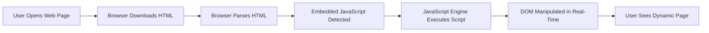
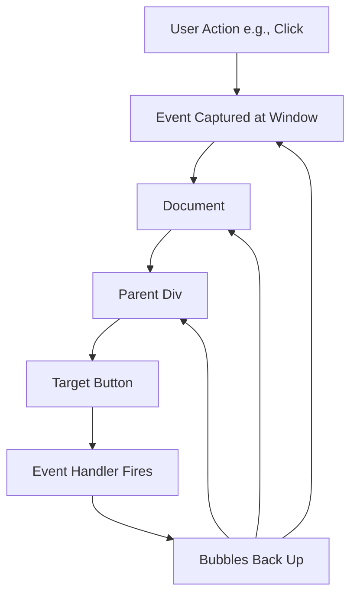
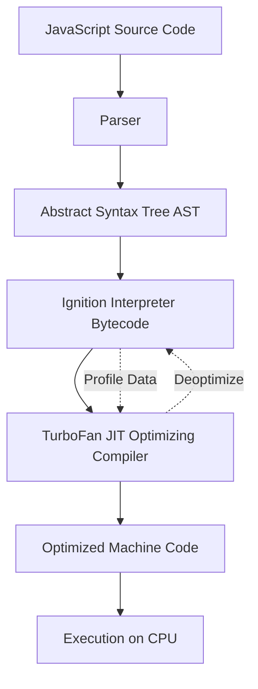
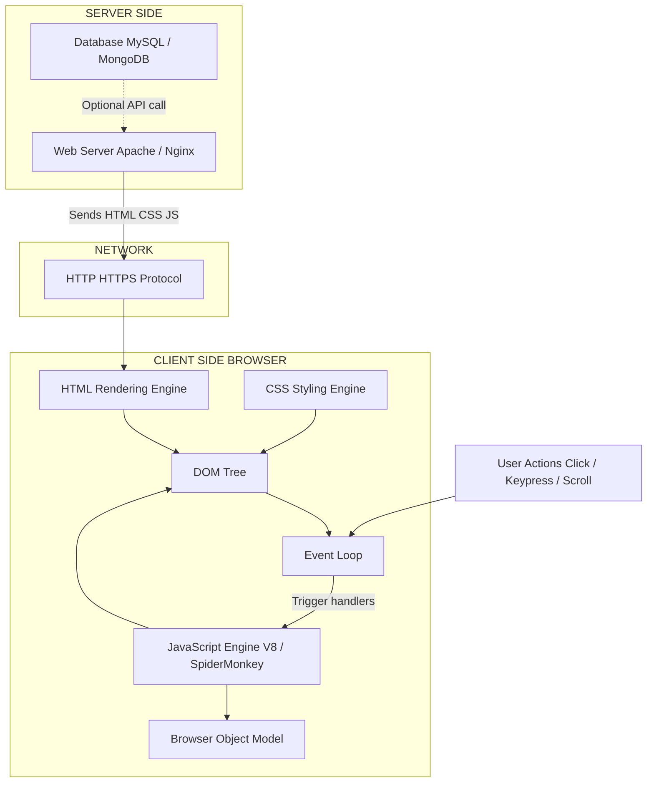
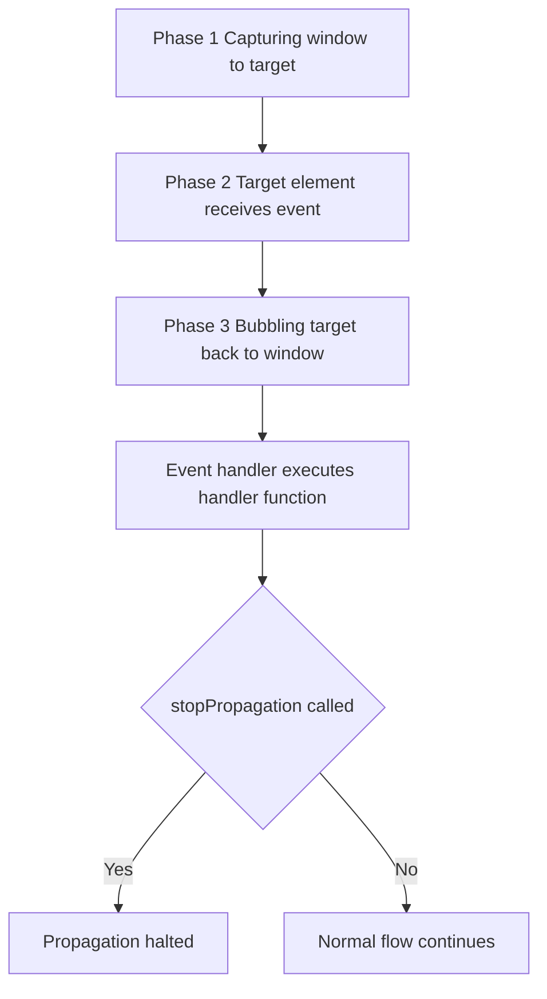
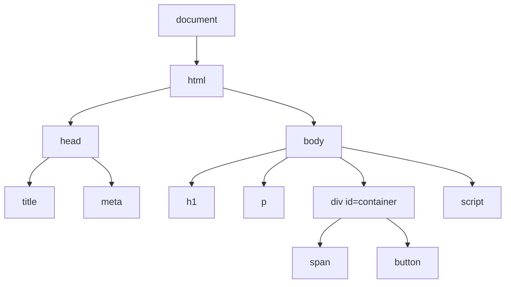
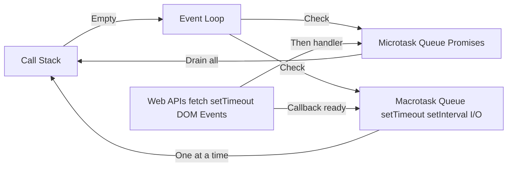
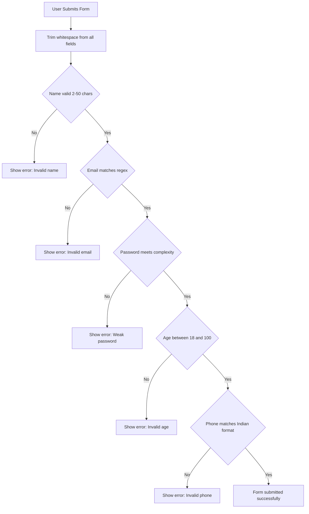
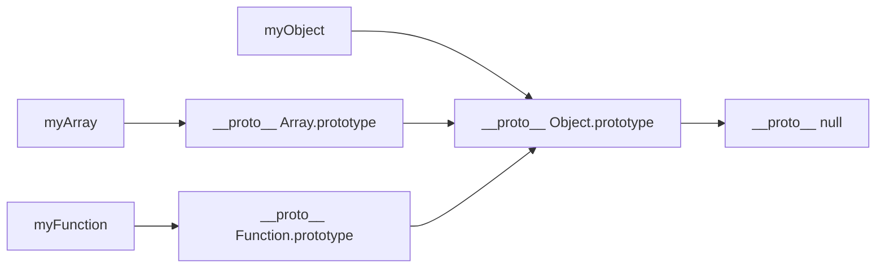
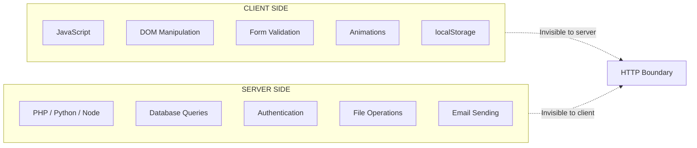

# Scripting language  - Client-Side Scripting

<!-- SECTION_1_START -->
# Client-Side Scripting — Core Technical Definition & Intuitive Overview

## Formal Academic Definition (KTU 2024 Syllabus Terminology)

**Client-Side Scripting** refers to a class of programming scripts that are executed by the user's web browser (client) rather than on the web server. The most dominant client-side scripting language used in modern web development is **JavaScript (ECMAScript)**. Client-side scripts are embedded within HTML documents, downloaded by the browser, and interpreted by the browser's JavaScript engine (e.g., Google's **V8**, Mozilla's **SpiderMonkey**, Apple's **JavaScriptCore**).

> [!IMPORTANT]
> **KTU 2024 Definition:** Client-side scripting enables dynamic content manipulation, user interactivity, form validation, asynchronous communication, and local data storage — all without requiring a round-trip to the web server, thereby reducing latency and server load.

## Conceptual Analogy / Intuition

Imagine a **restaurant**:

- The **kitchen (server)** prepares meals (generates HTML pages) and sends them out.
- The **waiter (client-side script / JavaScript)** delivers the food and can also perform small adjustments at your table — adding pepper, refilling water, clearing plates — *without needing to walk back to the kitchen*.
- The **customer (user)** gets instant responses (validation, animations, popups) right at the table.

Just like the waiter, JavaScript operates on the user's device to make the page **interactive, responsive, and alive** — instead of forcing the browser to call the kitchen for every minor change.

### Key Characteristics of Client-Side Scripting

| Characteristic | Description |
|---|---|
| **Execution Location** | Runs inside the user's browser (on the client machine) |
| **Language** | Primarily **JavaScript** (also VBScript legacy, TypeScript compiled to JS) |
| **Visibility** | Source code is **viewable** by the user (no security through obscurity) |
| **Performance** | Fast execution (no network round-trip) |
| **Dependency** | Requires a **JavaScript-enabled browser** |
| **Security Model** | Subject to **Same-Origin Policy** and sandbox restrictions |
| **APIs Available** | DOM, BOM, Fetch API, LocalStorage, Geolocation, Canvas, WebGL |

> [!NOTE]
> **Core Distinction:** Server-side scripts (PHP, Python, Node.js) execute on the remote server and produce HTML. Client-side scripts execute *after* the page is delivered, modifying what the user sees and interacts with.

## JavaScript — The Heart of Client-Side Scripting

**JavaScript** was created by **Brendan Eich** in **1995** at Netscape Communications. It is a **high-level, interpreted, dynamically-typed, multi-paradigm** scripting language that conforms to the **ECMAScript (ES)** specification standardized by **ECMA International** in **ECMA-262**.



> [!VISUALIZATION CONTROL]
> **Concept:** JavaScript Engine Execution Flow (V8 Pipeline)
> **Conceptual Description:** Visualize source code entering a pipeline: Source Code → Parser → AST (Abstract Syntax Tree) → Bytecode → JIT Compilation → Optimized Machine Code → Execution.
> **GeoGebra Input Equations:**
> * `f(x) = sin(x)` representing AST nodes
> * `T = parseTime + compileTime + runTime`
> **Visual Description:** A linear flow diagram showing progressive transformation of code from human-readable text to optimized machine instructions.

## Client-Side vs Server-Side Scripting — A Comparative Snapshot

| Parameter | Client-Side | Server-Side |
|---|---|---|
| **Where it runs** | Browser | Web server |
| **Languages** | JavaScript, TypeScript | PHP, Python, Ruby, Java, Node.js |
| **Speed** | Faster (no network latency) | Slower (network round-trip) |
| **Security** | Less secure (visible source) | More secure (hidden source) |
| **Database Access** | Not directly (via APIs) | Direct access |
| **SEO Impact** | Limited (crawlers may not execute JS) | Excellent |
| **Examples** | Form validation, animations | User authentication, database queries |

> [!TIP]
> **Syllabus Highlight:** In KTU's *Web Programming* module, client-side scripting is studied with **JavaScript** as the primary language, focusing on syntax, DOM manipulation, event handling, and form validation.
<!-- SECTION_1_END -->

<!-- SECTION_2_START -->
# Deep Theoretical Analysis & KTU High-Yield Formula Sheet

## JavaScript Embedding Strategies in HTML

JavaScript can be integrated into an HTML document in **three distinct ways**:

### 1. Inline Scripting (Event Handlers)

```html
<button onclick="alert('Hello!')">Click Me</button>
```

### 2. Internal Scripting (`<script>` tag within HTML)

```html
<script>
  document.write("Hello from JavaScript!");
</script>
```

### 3. External Scripting (Linked `.js` file)

```html
<script src="script.js"></script>
```

> [!IMPORTANT]
> **Best Practice:** Always place `<script>` tags at the **end of the `<body>`** element (or use `defer` / `async` attributes) to ensure the DOM is fully loaded before the script runs.

## JavaScript Core Syntax Architecture

### Variables and Data Types

JavaScript supports **three variable declaration keywords**:

| Keyword | Scope | Re-assignable | Re-declarable | Hoisting |
|---|---|---|---|---|
| `var` | Function-scoped | Yes | Yes | Hoisted (initialized as `undefined`) |
| `let` | Block-scoped | Yes | No | Hoisted (Temporal Dead Zone) |
| `const` | Block-scoped | No | No | Hoisted (Temporal Dead Zone) |

**Primitive Data Types:**

| Type | Example | Description |
|---|---|---|
| `string` | `"Hello"`, `'World'` | Sequence of Unicode characters |
| `number` | `42`, `3.14` | IEEE 754 double-precision (64-bit) |
| `boolean` | `true`, `false` | Logical values |
| `null` | `null` | Intentional absence of value |
| `undefined` | `undefined` | Variable declared but not assigned |
| `symbol` | `Symbol('id')` | Unique immutable identifier (ES6) |
| `bigint` | `9007199254740993n` | Arbitrary precision integers (ES2020) |

**Reference Data Types:** `Object`, `Array`, `Function`, `Date`, `RegExp`

### Operators in JavaScript

| Category | Operators | Example |
|---|---|---|
| Arithmetic | `+`, `-`, `*`, `/`, `%`, `**` | `5 ** 2 = 25` |
| Assignment | `=`, `+=`, `-=`, `*=`, `/=`, `%=` | `x += 5` |
| Comparison | `==`, `===`, `!=`, `!==`, `>`, `<`, `>=`, `<=` | `5 === "5"` is `false` |
| Logical | `&&`, `\|\|`, `!` | `true && false` is `false` |
| Bitwise | `&`, `\|`, `^`, `~`, `<<`, `>>`, `>>>` | `5 & 1 = 1` |
| Ternary | `condition ? val1 : val2` | `x > 0 ? "pos" : "neg"` |
| Type | `typeof`, `instanceof` | `typeof 42` is `"number"` |

> [!WARNING]
> **Always prefer `===` (strict equality)** over `==` (loose equality) to avoid unexpected type coercion. The `==` operator converts types before comparison, leading to subtle bugs.

## KTU High-Yield Formula Sheet

| Concept | Syntax / Formula | Description |
|---|---|---|
| Variable Declaration | `let x = 10;` | Block-scoped variable |
| Constant | `const PI = 3.14159;` | Immutable binding |
| Function Declaration | `function name(p1, p2) { ... }` | Hoisted function |
| Arrow Function | `const f = (a, b) => a + b;` | ES6 concise function |
| Array Creation | `let arr = [1, 2, 3];` | Ordered collection |
| Object Literal | `let obj = { key: value };` | Key-value store |
| DOM Selection | `document.getElementById('id')` | Single element |
| DOM Selection | `document.querySelector('.class')` | CSS selector match |
| Event Binding | `el.addEventListener('click', handler)` | Attach listener |
| Form Validation | `if (form.checkValidity()) { ... }` | HTML5 validation API |
| JSON Parse | `JSON.parse(string)` | String to Object |
| JSON Stringify | `JSON.stringify(object)` | Object to String |
| setTimeout | `setTimeout(fn, ms)` | Delay execution |
| setInterval | `setInterval(fn, ms)` | Repeated execution |
| localStorage Set | `localStorage.setItem('key', 'val')` | Persistent storage |
| localStorage Get | `localStorage.getItem('key')` | Retrieve value |
| try-catch | `try { ... } catch(e) { ... }` | Error handling |
| Template Literal | `` `Hello, ${name}!` `` | String interpolation |
| Spread Operator | `[...arr1, ...arr2]` | Expand iterable |
| Destructuring | `const {a, b} = obj;` | Unpack properties |
| Promise | `new Promise((resolve, reject) => ...)` | Async operation |
| async/await | `await fetch(url)` | Syntactic sugar for Promises |
| Strict Mode | `"use strict";` | Enforce stricter parsing |
| typeof Check | `typeof x === 'undefined'` | Type guard |

## Document Object Model (DOM) — The Tree of Life

The **DOM** is a **tree-structured representation** of the HTML document, where every element, attribute, and text node is an object that JavaScript can access and manipulate.

```
                    [document]
                        |
                    [html]
                   /       \
              [head]       [body]
              /    \         |
        [meta]  [title]  [h1] [p] [script]
```

### Key DOM Properties and Methods

| Property / Method | Returns | Purpose |
|---|---|---|
| `document.getElementById(id)` | Single `Element` | Find by unique ID |
| `document.getElementsByClassName(c)` | `HTMLCollection` | Find by class name |
| `document.getElementsByTagName(t)` | `HTMLCollection` | Find by tag name |
| `document.querySelector(sel)` | Single `Element` | First CSS selector match |
| `document.querySelectorAll(sel)` | `NodeList` | All CSS selector matches |
| `element.innerHTML` | String | Get/set HTML content |
| `element.textContent` | String | Get/set text content |
| `element.style.property` | String | Modify inline CSS |
| `element.setAttribute(name, val)` | `undefined` | Set any attribute |
| `element.appendChild(node)` | `Node` | Add child element |
| `element.removeChild(node)` | `Node` | Remove child element |
| `element.createElement(tag)` | `Element` | Create new element |

## Event Handling Model

JavaScript responds to user actions through an **event-driven programming model**. Events flow through **three phases**:

1. **Capturing Phase** — Event travels from `window` → `document` → ... → target
2. **Target Phase** — Event reaches the target element
3. **Bubbling Phase** — Event propagates back up from target → `document` → `window`



> [!TIP]
> **Exam Tip:** Use `event.stopPropagation()` to halt bubbling, and `event.preventDefault()` to stop default browser behavior (e.g., form submission).

## Browser Object Model (BOM) — Window-Level APIs

The **BOM** provides JavaScript access to browser-level objects outside the document:

| Object | Purpose |
|---|---|
| `window` | Global object, represents the browser window |
| `navigator` | Browser information (user agent, platform) |
| `screen` | Display screen dimensions |
| `location` | Current URL, redirect, reload |
| `history` | Browser back/forward navigation |
| `document` | The DOM root |

> [!NOTE]
> **Real-World Utility:** The BOM is widely used for **redirects** (`window.location.href = '...'`), **popups** (`window.open(...)`), and **timing operations** (`setInterval`, `setTimeout`).

## JavaScript — Where It Powers the Modern Web

| Domain | Application |
|---|---|
| **Front-End Frameworks** | React, Angular, Vue, Svelte |
| **Mobile Apps** | React Native, Ionic, Cordova |
| **Server-Side** | Node.js, Deno, Bun |
| **Desktop Apps** | Electron, Tauri |
| **Game Development** | Phaser, Three.js, Babylon.js |
| **Machine Learning** | TensorFlow.js, Brain.js |
| **IoT** | Johnny-Five, Espruino |
| **Browser Extensions** | Chrome Extensions, Firefox Add-ons |
<!-- SECTION_2_END -->

<!-- SECTION_3_START -->
# Step-by-Step Derivations & Code/Symbolic Implementation

## Example 1: JavaScript Variable Manipulation and Type Coercion

**Problem:** Demonstrate variable declarations, type checking, and strict equality.

```javascript
"use strict";  // Enable strict mode for safer code

// Variable declarations using let, const, and var
let studentName = "Arjun";          // Block-scoped, reassignable
const MAX_SCORE = 100;              // Block-scoped, immutable binding
var legacyCounter = 0;              // Function-scoped (legacy, avoid in modern code)

// Type checking
console.log(typeof studentName);     // Output: "string"
console.log(typeof MAX_SCORE);       // Output: "number"

// Strict vs loose equality — a common pitfall
console.log(5 == "5");               // Output: true  (loose equality, type coercion)
console.log(5 === "5");              // Output: false (strict equality, no coercion)
console.log(null === undefined);     // Output: false
console.log(null == undefined);      // Output: true

// Template literals for string interpolation
let score = 87;
let message = `Student ${studentName} scored ${score}/${MAX_SCORE}`;
console.log(message);
// Output: Student Arjun scored 87/100
```

**Line-by-Line Explanation:**

| Line | Explanation |
|---|---|
| `"use strict";` | Activates strict parsing — catches common errors like undeclared variable assignment. |
| `let studentName` | Block-scoped variable, can be reassigned later. |
| `const MAX_SCORE` | Constant binding — cannot be reassigned after declaration. |
| `typeof studentName` | Returns the data type as a string. |
| `5 == "5"` | JavaScript coerces the string `"5"` to number `5`, so comparison yields `true`. |
| `5 === "5"` | Strict equality checks both type *and* value — returns `false`. |
| Template literal | Uses backticks and `${}` for embedded expressions, far cleaner than string concatenation. |

## Example 2: Control Flow — Conditional Logic and Loops

```javascript
// Grade classification using if-else-if ladder
function classifyGrade(marks) {
  if (marks < 0 || marks > 100) {
    return "Invalid Input";
  } else if (marks >= 90) {
    return "A+ Grade (Outstanding)";
  } else if (marks >= 80) {
    return "A Grade (Excellent)";
  } else if (marks >= 70) {
    return "B Grade (Very Good)";
  } else if (marks >= 60) {
    return "C Grade (Good)";
  } else if (marks >= 50) {
    return "D Grade (Pass)";
  } else {
    return "F Grade (Fail)";
  }
}

// Switch statement for day-of-week
function getDayType(day) {
  switch (day) {
    case 1: case 2: case 3: case 4: case 5:
      return "Weekday";
    case 6: case 7:
      return "Weekend";
    default:
      return "Invalid Day";
  }
}

// For loop: sum of first N natural numbers
function sumNaturalNumbers(n) {
  let total = 0;
  for (let i = 1; i <= n; i++) {
    total += i;
  }
  return total;
}

// forEach loop over an array
let fruits = ["Apple", "Banana", "Mango", "Orange"];
fruits.forEach((fruit, index) => {
  console.log(`${index + 1}. ${fruit}`);
});
// Output:
// 1. Apple
// 2. Banana
// 3. Mango
// 4. Orange

// Test calls
console.log(classifyGrade(85));    // Output: A Grade (Excellent)
console.log(getDayType(6));        // Output: Weekend
console.log(sumNaturalNumbers(10)); // Output: 55
```

**Mathematical Derivation of Sum:**

$$\text{Sum} = \sum_{i=1}^{n} i = \frac{n(n+1)}{2}$$

For $n = 10$:

$$\text{Sum} = \frac{10 \times 11}{2} = \frac{110}{2} = 55$$

## Example 3: Array Methods — Modern ES6+ Operations

```javascript
let numbers = [12, 45, 3, 78, 23, 56, 89, 1, 34];

// map: transform each element
let doubled = numbers.map(n => n * 2);
// Result: [24, 90, 6, 156, 46, 112, 178, 2, 68]

// filter: keep elements that pass a test
let aboveForty = numbers.filter(n => n > 40);
// Result: [45, 78, 56, 89]

// reduce: accumulate values
let total = numbers.reduce((accumulator, current) => accumulator + current, 0);
// Result: 341

// find: first element matching condition
let firstBig = numbers.find(n => n > 50);
// Result: 78

// some: at least one element passes test
let hasEven = numbers.some(n => n % 2 === 0);
// Result: true

// every: all elements pass test
let allPositive = numbers.every(n => n > 0);
// Result: true

// sort: arrange in ascending order
let sorted = [...numbers].sort((a, b) => a - b);
// Result: [1, 3, 12, 23, 34, 45, 56, 78, 89]

// Spread operator: merge arrays
let moreNumbers = [100, 200];
let combined = [...numbers, ...moreNumbers];
// Result: [12, 45, 3, 78, 23, 56, 89, 1, 34, 100, 200]

// Destructuring: extract values
let [first, second, ...rest] = numbers;
console.log(first);  // 12
console.log(second); // 45
console.log(rest);   // [3, 78, 23, 56, 89, 1, 34]
```

## Example 4: Object Literals and ES6 Classes

```javascript
// Object literal
let car = {
  brand: "Tesla",
  model: "Model 3",
  year: 2024,
  start: function() {
    return `${this.brand} ${this.model} is starting...`;
  },
  get age() {
    return new Date().getFullYear() - this.year;
  }
};

console.log(car.start());   // Output: Tesla Model 3 is starting...
console.log(car.age);       // Output: 1

// ES6 Class
class Animal {
  constructor(name, species) {
    this.name = name;
    this.species = species;
  }

  describe() {
    return `${this.name} is a ${this.species}.`;
  }
}

class Dog extends Animal {
  constructor(name, breed) {
    super(name, "Dog");
    this.breed = breed;
  }

  bark() {
    return `${this.name} says: Woof!`;
  }
}

let myDog = new Dog("Buddy", "Golden Retriever");
console.log(myDog.describe()); // Output: Buddy is a Dog.
console.log(myDog.bark());     // Output: Buddy says: Woof!
```

## Example 5: DOM Manipulation — Interactive Web Page

```html
<!DOCTYPE html>
<html lang="en">
<head>
  <meta charset="UTF-8">
  <title>DOM Manipulation Demo</title>
  <style>
    body { font-family: Arial, sans-serif; padding: 20px; }
    #counter { font-size: 48px; color: #2c3e50; margin: 20px 0; }
    button { padding: 10px 20px; font-size: 16px; margin: 5px; cursor: pointer; }
  </style>
</head>
<body>
  <h1>Interactive Counter</h1>
  <div id="counter">0</div>
  <button id="incrementBtn">Increment</button>
  <button id="decrementBtn">Decrement</button>
  <button id="resetBtn">Reset</button>

  <h2>Dynamic List</h2>
  <input type="text" id="itemInput" placeholder="Enter item name">
  <button id="addItemBtn">Add Item</button>
  <ul id="itemList"></ul>

  <script>
    // Counter logic
    let count = 0;
    const counterDisplay = document.getElementById("counter");
    const incrementBtn = document.getElementById("incrementBtn");
    const decrementBtn = document.getElementById("decrementBtn");
    const resetBtn = document.getElementById("resetBtn");

    function updateDisplay() {
      counterDisplay.textContent = count;
      counterDisplay.style.color = count > 0 ? "#27ae60" : (count < 0 ? "#e74c3c" : "#2c3e50");
    }

    incrementBtn.addEventListener("click", () => {
      count++;
      updateDisplay();
    });

    decrementBtn.addEventListener("click", () => {
      count--;
      updateDisplay();
    });

    resetBtn.addEventListener("click", () => {
      count = 0;
      updateDisplay();
    });

    // Dynamic list logic
    const itemInput = document.getElementById("itemInput");
    const addItemBtn = document.getElementById("addItemBtn");
    const itemList = document.getElementById("itemList");

    addItemBtn.addEventListener("click", () => {
      const itemText = itemInput.value.trim();
      if (itemText === "") {
        alert("Please enter an item name!");
        return;
      }

      // Create new list item
      const li = document.createElement("li");
      li.textContent = itemText;

      // Add delete button to each item
      const deleteBtn = document.createElement("button");
      deleteBtn.textContent = "Delete";
      deleteBtn.style.marginLeft = "10px";
      deleteBtn.addEventListener("click", () => {
        itemList.removeChild(li);
      });

      li.appendChild(deleteBtn);
      itemList.appendChild(li);
      itemInput.value = ""; // Clear input
    });

    // Allow Enter key to add item
    itemInput.addEventListener("keypress", (event) => {
      if (event.key === "Enter") {
        addItemBtn.click();
      }
    });
  </script>
</body>
</html>
```

**Explanation of DOM Flow:**

1. `document.getElementById("counter")` — retrieves the counter `<div>` from the DOM tree.
2. `addEventListener("click", callback)` — registers a click handler on each button.
3. `textContent` — updates the visible text without reloading the page.
4. `style.color` — dynamically changes the CSS color based on counter value.
5. `createElement("li")` — manufactures a new DOM node programmatically.
6. `appendChild(node)` — inserts the new node into the document tree.
7. `removeChild(node)` — deletes a node from the document tree.

## Example 6: Form Validation — Complete Implementation

```html
<!DOCTYPE html>
<html lang="en">
<head>
  <meta charset="UTF-8">
  <title>Registration Form Validation</title>
</head>
<body>
  <form id="registrationForm" onsubmit="return validateForm()">
    <label>Full Name: <input type="text" id="fullName" required></label><br><br>
    <label>Email: <input type="email" id="email" required></label><br><br>
    <label>Password: <input type="password" id="password" required minlength="8"></label><br><br>
    <label>Age: <input type="number" id="age" required min="18" max="100"></label><br><br>
    <label>Phone: <input type="tel" id="phone" required></label><br><br>
    <button type="submit">Register</button>
  </form>

  <div id="errorMessages" style="color: red; margin-top: 10px;"></div>

  <script>
    function validateForm() {
      const fullName = document.getElementById("fullName").value.trim();
      const email = document.getElementById("email").value.trim();
      const password = document.getElementById("password").value;
      const age = parseInt(document.getElementById("age").value, 10);
      const phone = document.getElementById("phone").value.trim();
      const errorDiv = document.getElementById("errorMessages");
      let errors = [];

      // Name validation: must contain at least two words, letters and spaces only
      if (!/^[A-Za-z\s]{2,50}$/.test(fullName)) {
        errors.push("Name must be 2-50 characters, letters and spaces only.");
      }

      // Email validation
      const emailPattern = /^[a-zA-Z0-9._%+-]+@[a-zA-Z0-9.-]+\.[a-zA-Z]{2,}$/;
      if (!emailPattern.test(email)) {
        errors.push("Please enter a valid email address.");
      }

      // Password validation: at least 8 chars, one uppercase, one lowercase, one digit
      if (!/^(?=.*[a-z])(?=.*[A-Z])(?=.*\d).{8,}$/.test(password)) {
        errors.push("Password must be 8+ chars with uppercase, lowercase, and a digit.");
      }

      // Age validation
      if (isNaN(age) || age < 18 || age > 100) {
        errors.push("Age must be a number between 18 and 100.");
      }

      // Phone validation: 10 digits, optional +91 prefix
      if (!/^(\+91[\s-]?)?[6-9]\d{9}$/.test(phone)) {
        errors.push("Please enter a valid 10-digit Indian phone number.");
      }

      if (errors.length > 0) {
        errorDiv.innerHTML = errors.map(e => `• ${e}`).join("<br>");
        return false; // Prevent form submission
      } else {
        errorDiv.innerHTML = "";
        alert("Registration successful!");
        return true;
      }
    }
  </script>
</body>
</html>
```

**Validation Rules Summary Table:**

| Field | Regex Pattern | Constraint |
|---|---|---|
| Full Name | `/^[A-Za-z\s]{2,50}$/` | 2-50 chars, letters/spaces |
| Email | `/^[a-zA-Z0-9._%+-]+@[a-zA-Z0-9.-]+\.[a-zA-Z]{2,}$/` | Standard email format |
| Password | `/^(?=.*[a-z])(?=.*[A-Z])(?=.*\d).{8,}$/` | 8+ chars, mixed case, digit |
| Age | Numeric range check | 18 ≤ age ≤ 100 |
| Phone | `/^(\+91[\s-]?)?[6-9]\d{9}$/` | Indian 10-digit mobile |

## Example 7: AJAX and Fetch API — Asynchronous Communication

```javascript
// Fetching data from a public API
async function fetchUserData(userId) {
  const apiUrl = `https://jsonplaceholder.typicode.com/users/${userId}`;

  try {
    const response = await fetch(apiUrl);

    if (!response.ok) {
      throw new Error(`HTTP Error: ${response.status}`);
    }

    const userData = await response.json();
    console.log("User Name:", userData.name);
    console.log("Email:", userData.email);
    console.log("City:", userData.address.city);
    return userData;
  } catch (error) {
    console.error("Failed to fetch user data:", error.message);
    return null;
  }
}

// Calling the async function
fetchUserData(3);

// Promise-based alternative (pre-async/await)
function fetchPosts() {
  return fetch("https://jsonplaceholder.typicode.com/posts?_limit=5")
    .then(response => response.json())
    .then(posts => {
      posts.forEach(post => {
        console.log(`Title: ${post.title}`);
      });
    })
    .catch(error => console.error("Error:", error));
}

fetchPosts();
```

**Fetch API Flow:**

$$\text{call fetch(url)} \rightarrow \text{Promise} \rightarrow \text{Response} \rightarrow \text{.json()} \rightarrow \text{JavaScript Object}$$

## Example 8: localStorage — Client-Side Persistent Storage

```javascript
// Storing data
localStorage.setItem("username", "arjun_krishnan");
localStorage.setItem("theme", "dark");
localStorage.setItem("loginTime", new Date().toISOString());

// Storing complex objects (must JSON-stringify)
let userProfile = {
  id: 101,
  name: "Arjun",
  preferences: { language: "Malayalam", notifications: true }
};
localStorage.setItem("profile", JSON.stringify(userProfile));

// Retrieving data
let username = localStorage.getItem("username");
console.log(username); // Output: arjun_krishnan

// Retrieving and parsing object
let profile = JSON.parse(localStorage.getItem("profile"));
console.log(profile.preferences.language); // Output: Malayalam

// Removing data
localStorage.removeItem("theme");

// Clearing all storage
// localStorage.clear(); // Uncomment to wipe everything
```

> [!NOTE]
> **Storage Capacity:** `localStorage` offers approximately **5-10 MB** per origin. For larger data, use **IndexedDB**.

## Example 9: Error Handling with try-catch and Custom Errors

```javascript
function divideNumbers(a, b) {
  try {
    if (typeof a !== "number" || typeof b !== "number") {
      throw new TypeError("Both arguments must be numbers.");
    }
    if (b === 0) {
      throw new Error("Division by zero is not allowed.");
    }
    return a / b;
  } catch (error) {
    console.error(`Error Type: ${error.name}`);
    console.error(`Error Message: ${error.message}`);
    return null;
  } finally {
    console.log("Division operation completed.");
  }
}

console.log(divideNumbers(10, 2));   // Output: 5
console.log(divideNumbers(10, 0));   // Error caught, returns null
console.log(divideNumbers(10, "a")); // TypeError caught, returns null
```
<!-- SECTION_3_END -->

<!-- SECTION_4_START -->
# Structural Diagrams & Schematics

## 1. JavaScript Engine Execution Pipeline (V8 Model)



**Explanation:** The V8 engine first parses source code into an AST, compiles it to bytecode via the Ignition interpreter, and then uses the TurboFan optimizing compiler to generate high-performance machine code based on runtime profiling.

## 2. Client-Side Scripting Architecture Overview



## 3. Event Propagation Phases (Capturing, Target, Bubbling)



## 4. DOM Tree Structure (Hierarchical)



## 5. Asynchronous JavaScript Execution Model (Event Loop)



**Priority Order:**

$$\text{Microtasks (Promises)} \succ \text{Macrotasks (Timers, I/O)} \succ \text{Render (Repaint)}$$

## 6. Form Validation Decision Flow



## 7. JavaScript Prototype Chain (Inheritance Model)



## 8. Comparison Matrix: Client-Side vs Server-Side Processing



> [!NOTE]
> **Visualization Note:** The diagrams above illustrate the **separation of concerns** — client-side handles presentation and interaction, while server-side handles logic, persistence, and security.
<!-- SECTION_4_END -->

<!-- SECTION_5_START -->
# KTU 2024 Scheme Examination Question Bank & Topic Recap

## Part A: Short Answer Questions (3 Marks Each)

### Question 1: Define client-side scripting. List any two client-side scripting languages. `[KTU University Exam - Dec 2023]` **(CO1, Remember)**

**Model Answer:**

> **Client-side scripting** is a type of computer programming that enables interactivity within web browsers by executing scripts on the user's machine (client) rather than on the web server. The browser downloads the script along with the HTML and runs it locally, allowing dynamic content updates, form validation, animations, and asynchronous communication without requiring a page reload.

Two client-side scripting languages are:
1. **JavaScript** (the most widely used, standardized as ECMAScript)
2. **TypeScript** (a superset of JavaScript developed by Microsoft, compiled to plain JavaScript)

*Legacy option:* VBScript (deprecated, was used in Internet Explorer)

**[Definition: 2 Marks | Examples: 1 Mark]**

---

### Question 2: What is the difference between `var`, `let`, and `const` in JavaScript? Provide one example for each. `[KTU University Exam - July 2024]` **(CO1, Understand)**

**Model Answer:**

| Keyword | Scope | Re-assignment | Hoisting |
|---|---|---|---|
| `var` | Function-scoped (or global) | Allowed | Hoisted with `undefined` value |
| `let` | Block-scoped (within `{}`) | Allowed | Hoisted but in Temporal Dead Zone |
| `const` | Block-scoped | **Not** allowed (binding is immutable) | Hoisted but in Temporal Dead Zone |

**Examples:**

```javascript
var a = 10;       // Function-scoped, can be redeclared
let b = 20;       // Block-scoped, can be reassigned
const c = 30;     // Block-scoped, cannot be reassigned
```

`let` and `const` were introduced in **ES6 (ECMAScript 2015)** to address scoping issues inherent to `var`.

**[Tabular comparison: 2 Marks | Examples: 1 Mark]**

---

## Part B: Long Answer Questions (14 Marks Each)

### Question A: JavaScript Fundamentals, Functions, and Arrays `[KTU University Exam - Dec 2023]` **(CO1, CO2 — Understand, Apply)**

#### (a) Explain the different data types available in JavaScript with examples. How does JavaScript handle type coercion? **(7 Marks) (Understand)**

**Model Answer:**

JavaScript supports **two broad categories** of data types:

**1. Primitive Data Types** (immutable, stored by value):

| Type | Description | Example |
|---|---|---|
| `string` | Textual data | `let name = "Arjun";` |
| `number` | Integers and floating-point | `let age = 21;` |
| `boolean` | True or false | `let isActive = true;` |
| `null` | Intentional absence of value | `let data = null;` |
| `undefined` | Variable declared, no value assigned | `let x;` |
| `symbol` | Unique identifier (ES6) | `let id = Symbol("id");` |
| `bigint` | Arbitrary-precision integers (ES2020) | `let big = 9007199254740993n;` |

**2. Reference Data Types** (mutable, stored by reference):

| Type | Description | Example |
|---|---|---|
| `Object` | Collection of key-value pairs | `let obj = {name: "Arjun"};` |
| `Array` | Ordered collection | `let arr = [1, 2, 3];` |
| `Function` | Callable object | `function greet() {}` |

**Type Coercion:**

JavaScript performs **automatic type conversion** in two scenarios:

- **Implicit Coercion:** JavaScript automatically converts types during operations.

```javascript
console.log("5" + 3);      // "53" (number 3 coerced to string for concatenation)
console.log("5" - 3);      // 2   (string "5" coerced to number for subtraction)
console.log(true + 1);     // 2   (true coerced to 1)
console.log(null + 5);     // 5   (null coerced to 0)
```

- **Explicit Coercion:** Developer manually converts types.

```javascript
let num = Number("42");       // 42 (string to number)
let str = String(42);         // "42" (number to string)
let bool = Boolean(0);        // false (0 is falsy)
```

> The `==` operator triggers implicit coercion, while `===` does not. Best practice is to use `===` to avoid unexpected results.

**[Listing primitive types with examples: 3 Marks | Reference types: 1 Mark | Type coercion explanation with examples: 3 Marks]**

---

#### (b) Write a JavaScript program that accepts an array of numbers and returns a new array containing only the prime numbers, sorted in descending order. Use arrow functions and array methods. **(7 Marks) (Apply)**

**Model Answer:**

```javascript
"use strict";

// Helper function to check if a number is prime
const isPrime = (num) => {
  if (num < 2) return false;
  if (num === 2) return true;
  if (num % 2 === 0) return false;
  for (let i = 3; i <= Math.sqrt(num); i += 2) {
    if (num % i === 0) return false;
  }
  return true;
};

// Main function: filter primes and sort descending
const getPrimesDescending = (inputArray) => {
  return inputArray
    .filter(num => Number.isInteger(num) && isPrime(num))  // Keep only primes
    .sort((a, b) => b - a);                                // Sort descending
};

// Test
let numbers = [1, 2, 3, 4, 5, 6, 7, 8, 9, 10, 11, 13, 17, 19, 23, 29, 31];
let primes = getPrimesDescending(numbers);
console.log("Primes in descending order:", primes);
// Output: [31, 29, 23, 19, 17, 13, 11, 7, 5, 3, 2]
```

**Step-by-Step Logic:**

1. `isPrime` function uses trial division up to $\sqrt{n}$ for efficiency.
2. The mathematical bound for primality testing:

$$n \text{ is prime if no integer } d \text{ exists where } 2 \leq d \leq \sqrt{n} \text{ and } d \mid n$$

3. `filter` keeps only integers that pass `isPrime`.
4. `sort((a, b) => b - a)` arranges in descending order.
5. The entire pipeline is a chain of **higher-order functions** demonstrating functional programming.

**Sample Trace for `isPrime(29)`:**

| Step | Operation | Result |
|---|---|---|
| 1 | Check $29 < 2$ | `false` |
| 2 | Check $29 === 2$ | `false` |
| 3 | Check $29 \% 2 === 0$ | `false` |
| 4 | Loop $i = 3$ to $\sqrt{29} \approx 5.39$ | $i = 3, 5$ |
| 5 | $29 \% 3 = 2$ | Not divisible |
| 6 | $29 \% 5 = 4$ | Not divisible |
| 7 | Return | `true` |

**[isPrime helper: 2 Marks | Filter and sort logic: 2 Marks | Working program with output: 2 Marks | Use of arrow functions and array methods: 1 Mark]**

---

### Question B: DOM Manipulation and Event Handling `[KTU University Exam - July 2024]` **(CO2, CO3 — Apply, Analyze)**

#### (a) Explain the Document Object Model (DOM) in JavaScript. Describe the different methods to access DOM elements with suitable examples. **(7 Marks) (Understand)**

**Model Answer:**

The **Document Object Model (DOM)** is a **platform- and language-neutral interface** that allows programs and scripts to dynamically access and update the content, structure, and style of a document. The W3C standardizes the DOM, and modern browsers implement it as a **tree of nodes**.

**DOM Tree Structure:**

```
document
 └── html
      ├── head
      │    ├── title
      │    └── meta
      └── body
           ├── h1
           ├── p
           └── div
```

**Methods to Access DOM Elements:**

| Method | Returns | Selector Type | Example |
|---|---|---|---|
| `getElementById(id)` | Single `Element` or `null` | ID | `document.getElementById("header")` |
| `getElementsByClassName(cls)` | Live `HTMLCollection` | Class name | `document.getElementsByClassName("item")` |
| `getElementsByTagName(tag)` | Live `HTMLCollection` | Tag name | `document.getElementsByTagName("p")` |
| `querySelector(selector)` | First matching `Element` or `null` | Any CSS selector | `document.querySelector("#main .title")` |
| `querySelectorAll(selector)` | Static `NodeList` | Any CSS selector | `document.querySelectorAll("li.active")` |

**Practical Example:**

```html
<!DOCTYPE html>
<html>
<body>
  <h1 id="title">Welcome</h1>
  <p class="description">This is a paragraph.</p>
  <ul>
    <li class="item">Apple</li>
    <li class="item">Banana</li>
    <li class="item">Cherry</li>
  </ul>

  <script>
    // Access by ID
    let title = document.getElementById("title");
    console.log(title.textContent);  // "Welcome"

    // Access by class name
    let items = document.getElementsByClassName("item");
    console.log(items.length);  // 3
    console.log(items[0].textContent);  // "Apple"

    // Access by tag name
    let paragraphs = document.getElementsByTagName("p");
    console.log(paragraphs[0].textContent);  // "This is a paragraph."

    // Access by CSS selector
    let firstActive = document.querySelector("li.item");
    console.log(firstActive.textContent);  // "Apple"

    let allItems = document.querySelectorAll("li.item");
    allItems.forEach(li => console.log(li.textContent));
    // Apple, Banana, Cherry

    // Modify content
    title.textContent = "Hello, KTU Students!";
    title.style.color = "#2980b9";
  </script>
</body>
</html>
```

**DOM Modification Methods:**

| Method | Purpose |
|---|---|
| `element.innerHTML = "..."` | Set HTML content |
| `element.textContent = "..."` | Set plain text |
| `element.setAttribute("class", "newClass")` | Modify attributes |
| `element.style.color = "red"` | Modify inline CSS |
| `element.appendChild(newNode)` | Add child node |
| `element.removeChild(childNode)` | Remove child node |
| `document.createElement("div")` | Create new element |

**[DOM definition and tree explanation: 2 Marks | Five access methods with examples: 3 Marks | Modification methods: 2 Marks]**

---

#### (b) Design a complete HTML page with JavaScript that creates a dynamic to-do list. Users should be able to add tasks, mark them as complete (strike-through), and delete them. All operations should use DOM manipulation and event listeners. **(7 Marks) (Apply)**

**Model Answer:**

```html
<!DOCTYPE html>
<html lang="en">
<head>
  <meta charset="UTF-8">
  <title>Dynamic To-Do List</title>
  <style>
    body { font-family: 'Segoe UI', sans-serif; max-width: 500px; margin: 40px auto; }
    h1 { color: #2c3e50; }
    .input-container { display: flex; gap: 10px; margin-bottom: 20px; }
    #taskInput { flex: 1; padding: 10px; font-size: 16px; border: 1px solid #bdc3c7; border-radius: 4px; }
    #addBtn { padding: 10px 20px; background: #27ae60; color: white; border: none; cursor: pointer; border-radius: 4px; }
    .task-item { display: flex; align-items: center; padding: 10px; margin: 5px 0; background: #ecf0f1; border-radius: 4px; }
    .task-item.completed span { text-decoration: line-through; color: #7f8c8d; }
    .task-item span { flex: 1; margin-left: 10px; cursor: pointer; }
    .delete-btn { background: #e74c3c; color: white; border: none; padding: 5px 10px; border-radius: 4px; cursor: pointer; }
  </style>
</head>
<body>
  <h1>📝 My To-Do List</h1>
  <div class="input-container">
    <input type="text" id="taskInput" placeholder="Enter a new task...">
    <button id="addBtn">Add Task</button>
  </div>
  <ul id="taskList"></ul>

  <script>
    const taskInput = document.getElementById("taskInput");
    const addBtn = document.getElementById("addBtn");
    const taskList = document.getElementById("taskList");

    // Function to add a new task
    function addTask() {
      const taskText = taskInput.value.trim();
      if (taskText === "") {
        alert("Please enter a task!");
        return;
      }

      // Create list item
      const li = document.createElement("li");
      li.className = "task-item";

      // Create checkbox
      const checkbox = document.createElement("input");
      checkbox.type = "checkbox";
      checkbox.addEventListener("change", function() {
        li.classList.toggle("completed");
      });

      // Create task text span
      const span = document.createElement("span");
      span.textContent = taskText;
      span.addEventListener("click", function() {
        checkbox.checked = !checkbox.checked;
        li.classList.toggle("completed");
      });

      // Create delete button
      const deleteBtn = document.createElement("button");
      deleteBtn.textContent = "Delete";
      deleteBtn.className = "delete-btn";
      deleteBtn.addEventListener("click", function() {
        taskList.removeChild(li);
      });

      // Assemble and append
      li.appendChild(checkbox);
      li.appendChild(span);
      li.appendChild(deleteBtn);
      taskList.appendChild(li);

      taskInput.value = ""; // Clear input
    }

    // Event listeners
    addBtn.addEventListener("click", addTask);
    taskInput.addEventListener("keypress", function(event) {
      if (event.key === "Enter") addTask();
    });
  </script>
</body>
</html>
```

**Architecture Explanation:**

| Component | DOM API Used | Purpose |
|---|---|---|
| `taskInput`, `addBtn`, `taskList` | `getElementById` | Cache references for performance |
| `<li>`, `<input>`, `<span>`, `<button>` | `createElement` | Dynamically build nodes |
| `checkbox`, `span`, `deleteBtn` | `addEventListener` | Attach interactive behavior |
| `li.classList.toggle("completed")` | `classList API` | Toggle CSS class dynamically |
| `taskList.removeChild(li)` | `removeChild` | Remove node from tree |

**Key Learning Outcomes Demonstrated:**

1. **DOM Traversal & Modification** — creating, appending, removing elements
2. **Event Handling** — `click`, `change`, `keypress` events
3. **CSS Class Manipulation** — using `classList` for state changes
4. **User Experience** — clearing input, keyboard support, visual feedback
5. **Separation of Concerns** — structure (HTML), presentation (CSS), behavior (JS)

**[Correct HTML structure: 1 Mark | DOM element creation logic: 2 Marks | Event listener registration: 2 Marks | Complete working solution with styling: 2 Marks]**

---

> [!WARNING]
> **KTU Examiner's Valuation Warning / Pitfall Callout:**
> - **Do not** confuse `getElementById` (returns single element) with `getElementsByClassName` (returns live HTMLCollection).
> - **Do not** use `var` in modern JavaScript solutions — use `let` or `const`.
> - **Do not** forget to call `event.preventDefault()` when handling form submissions via JavaScript.
> - **Do not** use `==` for comparison — always use `===` to avoid type coercion bugs.
> - **Always** attach event listeners **after** the DOM is fully loaded, or place `<script>` at the end of `<body>`.
> - For **DOM questions**, explicitly mention the method name (e.g., `querySelector`) and the return type (e.g., `Element`, `NodeList`).
> - For **event handling questions**, explain all **three phases** of event propagation (capturing, target, bubbling).

---

## Topic Recap & Important Things to Remember

- **Client-side scripting** executes in the user's browser, primarily using **JavaScript** (ECMAScript).
- The three embedding methods are **inline** (event handlers), **internal** (`<script>` tag), and **external** (`.js` file).
- **Variables** use `let` (block-scoped, reassignable) or `const` (block-scoped, immutable). Avoid `var` in modern code.
- JavaScript has **7 primitive types** (`string`, `number`, `boolean`, `null`, `undefined`, `symbol`, `bigint`) and **reference types** (`Object`, `Array`, `Function`).
- Always use **strict equality (`===`)** over loose equality (`==`).
- **Control structures** include `if-else`, `switch`, `for`, `while`, `do-while`, and `forEach`/`for...of` loops.
- **Functions** can be declared using `function` keyword, function expressions, or **arrow functions** (`(a, b) => a + b`).
- **Array methods** like `map`, `filter`, `reduce`, `find`, `some`, `every` enable functional programming.
- **ES6 features** include `let`/`const`, arrow functions, template literals, destructuring, spread operator, classes, and Promises.
- The **DOM** is a tree representation of the HTML document; access elements via `getElementById`, `querySelector`, etc.
- **Event propagation** has three phases: **capturing**, **target**, and **bubbling**.
- **Form validation** can be done using HTML5 attributes (`required`, `pattern`, `min`, `max`) or JavaScript regex.
- **localStorage** provides persistent key-value storage (5-10 MB) across browser sessions.
- **Fetch API** with `async/await` handles asynchronous HTTP requests to servers.
- The **BOM** includes `window`, `navigator`, `screen`, `location`, and `history` objects.
- **Error handling** uses `try-catch-finally` blocks to gracefully manage runtime errors.
- JavaScript is **single-threaded** but achieves concurrency through the **event loop** and **callback queue**.
- The **V8 engine** (Chrome/Node.js) uses a **JIT compiler** for high-performance execution.
- **TypeScript** is a statically-typed superset of JavaScript that compiles to plain JavaScript.
- **Security**: Client-side code is **fully visible** to users — never store secrets in JavaScript.
- **Best practices**: place `<script>` at end of `<body>`, use `"use strict"`, prefer `const` over `let` when possible, and always validate user input.
- The **Same-Origin Policy** restricts cross-origin requests, mitigated by **CORS** headers.
- **Strict mode** (`"use strict";`) enforces safer coding practices and catches silent errors.
<!-- SECTION_5_END -->
