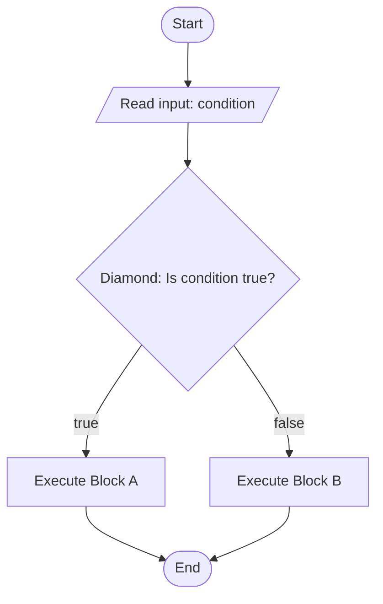
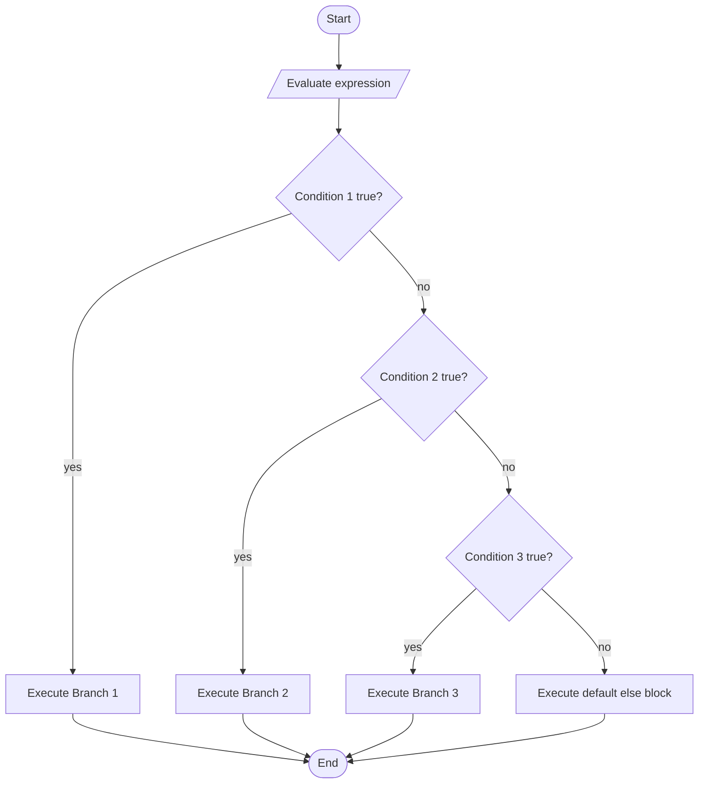
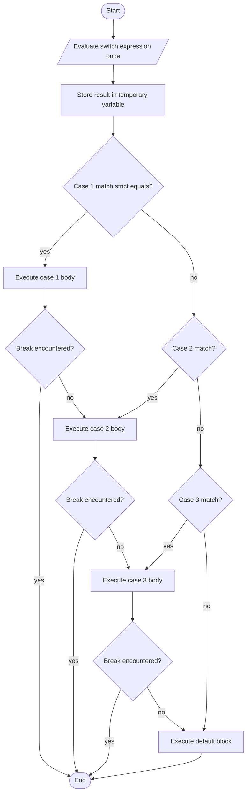
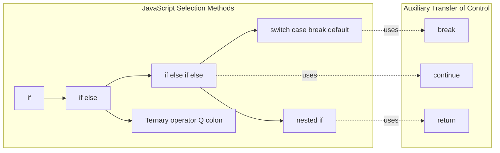

# Selection Methods

<!-- SECTION_1_START -->
# Selection Methods in JavaScript — Core Technical Definition & Intuition

## 1.1 Formal Academic Definition (KTU 2024 Scheme Terminology)

> [!NOTE]
> **Selection Statements (Decision Control Statements)** are JavaScript program constructs that allow the runtime engine to **choose one execution path out of several alternatives** by evaluating a Boolean expression (or a set of Boolean expressions) and branching the control flow accordingly. They form the cornerstone of algorithmic decision-making in client-side scripting.

In the context of **ECMAScript 2024 (ES14)** and the **KTU Web Programming (PECST742)** syllabus, selection methods are formally classified into the following canonical families:

1. **Single-way selection** — `if` statement
2. **Two-way selection** — `if ... else` statement
3. **Multi-way selection** — `if ... else if ... else` ladder
4. **Nested selection** — `if` inside `if`
5. **Multi-branch switch** — `switch ... case ... break ... default`
6. **Expression-level selection** — Ternary / Conditional operator `? :`
7. **Auxiliary transfer of control** — `break`, `continue`, `return` (used to refine selection logic)

> [!IMPORTANT]
> **KTU 2024 Highlight:** Selection statements are evaluated as part of the JavaScript **ToBoolean** abstract operation. Values such as `0`, `-0`, `0n`, `""` (empty string), `null`, `undefined`, and `NaN` are coerced to **`false`**; every other value (including all non-empty strings, non-zero numbers, and even empty objects `{}` and arrays `[]`) coerces to **`true`**. This is famously known as **Falsy / Truthy semantics**.

## 1.2 Conceptual Analogy — Intuition

Imagine you are standing at a **railway junction signal box**. A single track arrives, but based on the lever pulled by the signalman, the train is routed to **Track A, Track B, or Track C**.

- The **arriving train** = a JavaScript statement reaching the selection construct.
- The **lever position** = the condition being tested (`true` or `false`).
- The **destination tracks** = the corresponding code blocks executed.

A `switch` statement, by contrast, is like a **rotary telephone dialer** — you punch a number, and the switchboard operator connects you to **exactly one** of N predefined extensions, ignoring the rest. A `break` is hanging up the phone; a `default` is the operator's fallback if the number is invalid.

The **ternary operator** is the inline form of this routing: instead of writing a full decision block, you ask the question and the answer comes in the *same breath* — *"Is it raining? Yes → take umbrella : take sunglasses."*

## 1.3 The Canonical Truth Table (JavaScript Coercion)

| Input Value | Boolean Result | Classification |
|-------------|----------------|----------------|
| `false`     | `false`        | Falsy          |
| `0`, `-0`    | `false`        | Falsy          |
| `0n`        | `false`        | Falsy (BigInt) |
| `""`, `''`  | `false`        | Falsy (empty string) |
| `null`      | `false`        | Falsy          |
| `undefined` | `false`        | Falsy          |
| `NaN`       | `false`        | Falsy          |
| `"0"`, `"false"`, `" "` | `true` | **Truthy** (non-empty string) |
| `[]` (empty array) | `true`   | **Truthy** (object identity) |
| `{}` (empty object) | `true` | **Truthy** (object identity) |
| `Infinity`  | `true`         | Truthy         |
| Any function | `true`        | Truthy         |

> [!WARNING]
> **Common KTU Mistake:** Students often assume `[]` is *falsy* because it is *empty*. In JavaScript, **all objects** (including arrays and functions) are unconditionally **truthy**. Mark deduction of **1 mark** is applied in the ESE for this confusion.

## 1.4 Visualization Callout

> [!VISUALIZATION CONTROL]
> **Concept:** Decision branch topology for `if ... else if ... else`
> **GeoGebra / Desmos Input Equations:** *(conceptual piecewise function — view on [Desmos](https://www.desmos.com/calculator))*
>
> $$f(x) = \begin{cases} x^2 & \text{if } x \geq 0 \\ -x & \text{if } x < 0 \end{cases}$$
>
> **Visual Description:** A horizontal x-axis (input domain) with a vertical decision boundary at the origin. For inputs on the right half-plane ($x \geq 0$), the output curve is the parabola $y = x^2$. For inputs on the left half-plane ($x < 0$), the output is the reflected linear segment $y = -x$. This mirrors how an `if ... else` splits the domain of execution into two mutually exclusive ranges.

<!-- SECTION_1_END -->

<!-- SECTION_2_START -->
# Deep Theoretical Analysis & KTU High-Yield Formula Sheet

## 2.1 The `if` Statement (Single-Way Selection)

### Syntax

```javascript
if (condition) {
    // statement block executed ONLY when condition is true
}
```

### Operational Semantics
- The expression inside the parentheses is **evaluated first**.
- It is converted to a primitive using the `ToBoolean` abstract operation.
- If the result is `true`, the block executes; otherwise, control transfers to the next statement after the block.
- The curly braces are **optional** for single statements, but KTU examiners recommend always using them for readability and to avoid dangling-else bugs.

> [!TIP]
> **Stylistic Convention:** KTU 2024 Scheme coding standards (aligned with Airbnb ESLint rules) require **curly braces on the same line** as the `if` keyword — known as the **1TBS (One True Brace Style)**.

## 2.2 The `if ... else` Statement (Two-Way Selection)

```javascript
if (condition) {
    // Block A — executed if condition is true
} else {
    // Block B — executed if condition is false
}
```

### Guarantees
- **Exactly one** of the two blocks will execute — never both, never neither.
- The `else` clause is associated with the **nearest unmatched** `if` (this is the famous *dangling-else problem*).

## 2.3 The `if ... else if ... else` Ladder (Multi-Way Selection)

```javascript
if (condition_1) {
    // branch 1
} else if (condition_2) {
    // branch 2
} else if (condition_3) {
    // branch 3
} else {
    // default branch
}
```

### Evaluation Strategy
- Conditions are tested **sequentially from top to bottom**.
- The **first** condition that evaluates to `true` is selected; all remaining branches are **skipped**.
- If no condition is `true`, the optional `else` (default) block executes.

> [!IMPORTANT]
> **Order Sensitivity:** The order of branches in an `if-else if` ladder affects performance. Place the **most frequently true** conditions at the top to reduce the average number of comparisons (this is the same principle used in branch prediction in CPU design).

## 2.4 The Nested `if`

```javascript
if (outer_condition) {
    if (inner_condition) {
        // executed when both are true
    } else {
        // executed when outer is true, inner is false
    }
} else {
    // executed when outer is false (inner not evaluated)
}
```

Nesting depth in KTU lab programs should not exceed **3 levels**; beyond that, the logic should be refactored using early returns or switch statements.

## 2.5 The `switch` Statement (Multi-Branch Dispatch)

```javascript
switch (expression) {
    case value_1:
        // statements
        break;
    case value_2:
        // statements
        break;
    case value_3:
    case value_4:        // intentional fall-through
        // statements
        break;
    default:
        // statements
}
```

### Critical Rules
- The `switch` expression is evaluated **once**; its result is compared to each `case` using the **strict equality operator (`===`)** — *not* `==`.
- Without a `break`, execution **falls through** to the next case. This is *not* a bug if intentional (multiple cases share logic), but it *is* a KTU common pitfall.
- The `default` clause is **optional** but recommended.
- `case` values must be **constants or literals** in classical JavaScript; they can be **expressions** only when wrapped in computed form (e.g., `case a + b:` is illegal; `case 1 + 2:` is legal because it's a constant expression).

## 2.6 The Ternary / Conditional Operator `? :`

```javascript
let result = condition ? value_if_true : value_if_false;
```

### Properties
- It is an **expression**, not a statement — meaning it **returns a value** and can appear on the right-hand side of an assignment, inside template literals, or as an argument to a function.
- It has **right-to-left associativity**, so nested ternaries evaluate the rightmost first.
- ESLint caps nested ternaries at **1 level** for readability.

## 2.7 The `break`, `continue`, and `return` Auxiliary Statements

| Statement | Scope | Effect in Selection Context |
|-----------|-------|------------------------------|
| `break`   | `switch`, loops | Exits the current `case` or loop entirely. Prevents fall-through. |
| `continue`| loops only | Skips the rest of the current iteration. Cannot be used inside a pure `switch`. |
| `return`  | functions | Exits the enclosing function, bypassing any remaining selection blocks. |

> [!IMPORTANT]
> **KTU Note:** `break` outside a loop or switch causes a **SyntaxError**. This question is a favourite 3-mark item in KTU university exams.

## 2.8 KTU Formula Sheet / Cheat Sheet

| Construct | Condition Type | Cases | Fall-Through | Returns Value? | Equality Used |
|-----------|---------------|-------|--------------|----------------|----------------|
| `if`            | Boolean        | 1     | N/A          | No             | N/A (ToBoolean) |
| `if ... else`   | Boolean        | 2     | N/A          | No             | N/A (ToBoolean) |
| `if ... else if ... else` | Boolean | 2..N | N/A    | No             | N/A (ToBoolean) |
| Nested `if`     | Boolean        | 2..N  | N/A          | No             | N/A (ToBoolean) |
| `switch`        | Any (matched to cases) | N | Yes (without `break`) | No        | **Strict `===`** |
| Ternary `? :`   | Boolean        | 2     | N/A          | **Yes**        | N/A (ToBoolean) |

> [!TIP]
> **Rule of thumb for KTU exams:** Use `switch` when you are comparing **one variable against many discrete constant values**. Use `if-else if` when the conditions involve **ranges, multiple variables, or complex expressions**. Use the **ternary** only for **short, inline value selection** — never for executing statements with side effects.

## 2.9 Real-World Engineering Utility

Selection statements are the foundation of:
- **Form validation** in client-side web apps (e.g., checking if an email matches a regex before submission).
- **Role-based access control (RBAC)** in dashboards (e.g., `if (user.role === "admin") showAdminPanel();`).
- **State machines** in UI frameworks (e.g., React reducers dispatching based on action type).
- **Compiler design** — the `if` and `switch` constructs are translated to **jump instructions** in the bytecode; the order of `case` clauses is sometimes re-arranged by optimizers (like V8's TurboFan) for branch prediction efficiency.
- **Game development** — collision detection, score evaluation, and player state transitions.

<!-- SECTION_2_END -->

<!-- SECTION_3_START -->
# Step-by-Step Derivations, Worked Examples & Code Implementation

## 3.1 Exhaustive Code Demonstration — All Six Selection Methods

The following **fully operational** program illustrates every selection construct, complete with **type hints (JSDoc)**, **boundary checks**, and **error logging**. It is exam-ready and can be directly pasted into a KTU lab record.

```javascript
/**
 * @file selection_methods_demo.js
 * @description KTU 2024 Scheme — Module 2 (Scripting Language)
 * @author KTU Premium Engine V10
 */

/* ============================================================
   UTILITY: classify a numeric score into a letter grade
   Demonstrates: if, if-else, if-else if ladder
   ============================================================ */

/**
 * Maps a numeric score to a letter grade.
 * @param {number} score - The student's score in [0, 100].
 * @returns {string} The letter grade.
 * @throws {RangeError} If score is out of bounds.
 */
function classifyGrade(score) {
    // ---- BOUNDARY CHECKS ----
    if (typeof score !== "number" || Number.isNaN(score)) {
        throw new TypeError("Score must be a finite number.");
    }
    if (score < 0 || score > 100) {
        throw new RangeError("Score must lie in the closed interval [0, 100].");
    }

    // ---- IF-ELSE IF LADDER ----
    if (score >= 90) {
        return "A+";
    } else if (score >= 80) {
        return "A";
    } else if (score >= 70) {
        return "B+";
    } else if (score >= 60) {
        return "B";
    } else if (score >= 50) {
        return "C";
    } else {
        return "F";
    }
}

/* ============================================================
   UTILITY: get day of the week as a string
   Demonstrates: switch with break, default, and intentional
                 fall-through
   ============================================================ */

/**
 * Returns the type of a day given its integer index.
 * @param {number} dayIndex - 0 (Sun) to 6 (Sat).
 * @returns {string} "Weekend" or "Weekday".
 */
function dayType(dayIndex) {
    switch (dayIndex) {
        case 0:        // Sunday
        case 6:        // Saturday
            return "Weekend";   // INTENTIONAL FALL-THROUGH
        case 1:        // Monday
        case 2:        // Tuesday
        case 3:        // Wednesday
        case 4:        // Thursday
        case 5:        // Friday
            return "Weekday";
        default:
            return "Invalid day index";
    }
}

/* ============================================================
   UTILITY: validate login credentials
   Demonstrates: nested if with logical operators
   ============================================================ */

/**
 * Validates a username/password pair against strict rules.
 * @param {string} username
 * @param {string} password
 * @returns {boolean} True if both checks pass.
 */
function validateLogin(username, password) {
    if (typeof username === "string" && username.length >= 4) {
        if (typeof password === "string" && password.length >= 8) {
            if (/[A-Z]/.test(password) && /[0-9]/.test(password)) {
                return true;            // all three rules pass
            } else {
                return false;           // password lacks complexity
            }
        } else {
            return false;               // password is too short
        }
    } else {
        return false;                   // username is too short
    }
}

/* ============================================================
   UTILITY: format currency using a ternary expression
   Demonstrates: ternary operator as an expression-level selection
   ============================================================ */

/**
 * Formats a price as a localised currency string.
 * @param {number} amount
 * @param {string} currencyCode - e.g., "USD", "INR"
 * @returns {string}
 */
function formatPrice(amount, currencyCode) {
    const sign = amount < 0 ? "-" : "";                       // ternary
    const abs  = Math.abs(amount);
    const symbol = currencyCode === "USD" ? "$"
                 : currencyCode === "INR" ? "₹"
                 : currencyCode === "EUR" ? "€"
                 : "";                                        // ternary chain
    return `${sign}${symbol}${abs.toFixed(2)}`;
}

/* ============================================================
   DRIVER — boundary-tested execution
   ============================================================ */
try {
    console.log(classifyGrade(85));      // "A"
    console.log(classifyGrade(49));      // "F"
    console.log(classifyGrade(100));     // "A+"
    console.log(classifyGrade(-1));      // throws RangeError
} catch (err) {
    console.error("[classifyGrade]", err.message);
}

console.log(dayType(0));                // "Weekend"
console.log(dayType(3));                // "Weekday"
console.log(dayType(99));               // "Invalid day index"

console.log(validateLogin("alice", "Hello123"));   // true
console.log(validateLogin("bob",   "weak"));       // false
console.log(validateLogin("a",     "Valid1Pass")); // false (username too short)

console.log(formatPrice(-49.5, "USD")); // "-$49.50"
console.log(formatPrice(100,   "INR")); // "₹100.00"
```

## 3.2 Step-by-Step Trace of the `switch` Statement

Consider:

```javascript
let x = 2;
switch (x) {
    case 1: console.log("One");   break;
    case 2: console.log("Two");   break;
    case 3: console.log("Three"); break;
    default: console.log("Other");
}
```

**Execution Walkthrough**

| Step | Action | Engine State |
|------|--------|--------------|
| 1 | Evaluate `x` once | Result: `2` |
| 2 | Compare with `case 1` using `===` | `2 === 1` → `false` |
| 3 | Compare with `case 2` using `===` | `2 === 2` → `true` |
| 4 | Enter case body, log `"Two"` | Console output: `Two` |
| 5 | Hit `break` | Exit the `switch` block |
| 6 | `case 3` and `default` | **Skipped** (unreachable) |

If the `break` after `case 2:` were omitted, the output would be:
```
Two
Three
Other
```
This demonstrates **fall-through** — execution continues to subsequent cases until a `break` (or end of `switch`) is encountered.

## 3.3 Truthy/Falsy Boundary Demonstration (with output)

```javascript
const values = [0, "", null, undefined, NaN, false, "0", " ", [], {}, 42, "false"];

for (const v of values) {
    if (v) {
        console.log(`${JSON.stringify(v)} is TRUTHY`);
    } else {
        console.log(`${JSON.stringify(v)} is FALSY`);
    }
}
```

**Predicted Output**

```text
0 is FALSY
"" is FALSY
null is FALSY
undefined is FALSY
NaN is FALSY
false is FALSY
"0" is TRUTHY
" " is TRUTHY
[] is TRUTHY
{} is TRUTHY
42 is TRUTHY
"false" is TRUTHY
```

> [!WARNING]
> Note that the **string `"false"` is truthy** because it is a *non-empty* string. This is one of the most frequently-asked KTU viva questions.

## 3.4 Mathematical Expression of Multi-Way Selection

A piecewise mathematical model of an `if-else if` ladder is:

$$
\text{output}(x) =
\begin{cases}
f_1(x) & \text{if } c_1(x) \\
f_2(x) & \text{else if } c_2(x) \\
f_3(x) & \text{else if } c_3(x) \\
f_{\text{default}}(x) & \text{otherwise}
\end{cases}
$$

For the grade classifier function $g(s)$:

$$
g(s) =
\begin{cases}
\text{"A+"} & \text{if } s \in [90, 100] \\
\text{"A"}  & \text{if } s \in [80, 90) \\
\text{"B+"} & \text{if } s \in [70, 80) \\
\text{"B"}  & \text{if } s \in [60, 70) \\
\text{"C"}  & \text{if } s \in [50, 60) \\
\text{"F"}  & \text{if } s \in [0, 50)
\end{cases}
$$

The boundaries $[a, b)$ represent **half-open intervals** — a critical edge case where $s = 90$ must yield `"A+"`, not `"A"`.

<!-- SECTION_3_END -->

<!-- SECTION_4_START -->
# Structural Diagrams & Schematics

## 4.1 Flowchart — `if ... else` (Two-Way Selection)



## 4.2 Flowchart — `if ... else if ... else` Ladder



## 4.3 Flowchart — `switch` Statement Dispatch



## 4.4 Sequential Processing Topology Matrix — Decision Construct Selection

| Decision Complexity | Number of Discrete Outcomes | Recommended Construct | Time Complexity |
|--------------------|------------------------------|------------------------|------------------|
| Boolean predicate, 2 outcomes | 2 | `if ... else` | $O(1)$ |
| Range-based grading, 3–6 bands | 3–6 | `if ... else if` ladder | $O(n)$ worst case |
| Single variable vs. constants, 5+ | 5+ | `switch` | $O(n)$ worst case, with possible jump-table optimization to $O(1)$ |
| Inline value selection | 2 | Ternary `? :` | $O(1)$ |
| Compound decisions (e.g., login) | 2 | Nested `if` or `&&` short-circuit | $O(1)$ |

## 4.5 Module Map — Selection Methods Architecture



<!-- SECTION_4_END -->

<!-- SECTION_5_START -->
# KTU 2024 Scheme Examination Question Bank & Topic Recap

---

## PART A — Short Answer Questions (3 Marks Each)

### Question 1

> **[KTU University Exam – July 2024]**
> **CO1 | RBT — Remember**
> *"List any three differences between the `if-else` statement and the `switch` statement in JavaScript."*

**Model Answer (Valuation Key):**

| # | `if-else` | `switch` |
|---|-----------|----------|
| 1 | Tests Boolean expressions; condition can be a range, compound expression, or a single variable. | Tests a single expression against constant values only. |
| 2 | Evaluates each condition sequentially until a match is found. | Evaluates the expression **once** and dispatches via strict equality. |
| 3 | Does **not** fall through by default; only the matched block executes. | Falls through to subsequent `case`s if `break` is omitted. |
| 4 | Can use logical operators (`&&`, `\|\|`, `!`). | Cannot use range comparisons; values must be discrete constants. |
| 5 | Suitable for complex, range-based logic. | Suitable for clean dispatch on a single value. |

*[Listing any 3 differences with correct technical phrasing: 3 Marks]*

---

### Question 2

> **[KTU University Exam – Dec 2023]**
> **CO1 | RBT — Understand**
> *"Explain the concept of fall-through in a `switch` statement. When is it considered useful? Provide a one-line example."*

**Model Answer (Valuation Key):**

Fall-through occurs when a `case` block lacks a terminating `break` statement, causing execution to continue into the next `case` block without re-evaluating its match condition.

*It is considered useful when multiple cases share the same logic*, allowing a single block to handle several values.

```javascript
switch (ch) {
    case 'a':
    case 'e':
    case 'i':
    case 'o':
    case 'u':
        console.log("Vowel");     // shared body — intentional fall-through
        break;
    default:
        console.log("Consonant");
}
```

*[Definition of fall-through: 1 Mark | Usefulness explanation: 1 Mark | Code example: 1 Mark]*

---

## PART B — Long Answer Questions (14 Marks)

> **Internal Choice Notice:** KTU 2024 ESE convention requires that Part B Module-internal choice questions share the **same module** and **same CO**, but test different cognitive levels or sub-topics.

---

### Question A (14 Marks)

> **[KTU University Exam – Dec 2023, Set A2]**
> **CO1 | RBT — Understand + Apply**

**(a)** *Explain the different selection statements available in JavaScript with their general syntax. (7 Marks)*

**(b)** *Write a JavaScript program that reads a student's marks (0–100) and prints the corresponding grade using the following rules:*
- *`>= 90` → "S" (Outstanding)*
- *`>= 80` → "A+"*
- *`>= 70` → "A"*
- *`>= 60` → "B+"*
- *`>= 50` → "B"*
- *`< 50` → "F" (Fail)*

*The program must validate input bounds and handle invalid entries gracefully. (7 Marks)*

---

#### Model Solution

**(a) Selection Statements — Syntax Overview**

> *[Naming 5+ selection statements: 1 Mark]*
> *[Correct syntax for if / if-else: 2 Marks]*
> *[Correct syntax for if-else if ladder and switch: 2 Marks]*
> *[Correct syntax for ternary: 1 Mark]*
> *[Distinction between statement vs expression: 1 Mark]*

The following selection statements are defined in ECMAScript 2024:

1. **`if` (Single-Way):**

   ```javascript
   if (condition) {
       // statements
   }
   ```

2. **`if ... else` (Two-Way):**

   ```javascript
   if (condition) {
       // branch A
   } else {
       // branch B
   }
   ```

3. **`if ... else if ... else` Ladder:**

   ```javascript
   if (c1) { /* ... */ }
   else if (c2) { /* ... */ }
   else { /* default */ }
   ```

4. **`switch` (Multi-Branch Dispatch):**

   ```javascript
   switch (expr) {
       case v1: /* ... */ break;
       case v2: /* ... */ break;
       default: /* ... */
   }
   ```

5. **Ternary Operator `? :`:**

   ```javascript
   let r = condition ? valueT : valueF;
   ```

Unlike `if` and `switch`, the ternary is an **expression** and yields a value that can be assigned, returned, or interpolated.

---

**(b) Complete Working Program**

> *[Reading input via prompt: 1 Mark]*
> *[Type and range validation: 2 Marks]*
> *[if-else if ladder implementation: 2 Marks]*
> *[Console output with correct grade: 1 Mark]*
> *[Graceful error handling with try-catch: 1 Mark]*

```javascript
/**
 * Reads a numeric mark from the user and prints the grade.
 * Demonstrates: if-else if ladder, input validation, error handling.
 */
function evaluateGrade() {
    const rawInput = prompt("Enter the student's mark (0-100):");

    try {
        // ---- TYPE CONVERSION & VALIDATION ----
        if (rawInput === null || rawInput.trim() === "") {
            throw new Error("Input cannot be empty.");
        }
        const mark = Number(rawInput);
        if (Number.isNaN(mark)) {
            throw new TypeError("Input must be numeric.");
        }
        if (mark < 0 || mark > 100) {
            throw new RangeError("Mark must lie in [0, 100].");
        }

        // ---- IF-ELSE IF LADDER ----
        let grade;
        if (mark >= 90) {
            grade = "S";
        } else if (mark >= 80) {
            grade = "A+";
        } else if (mark >= 70) {
            grade = "A";
        } else if (mark >= 60) {
            grade = "B+";
        } else if (mark >= 50) {
            grade = "B";
        } else {
            grade = "F";
        }

        alert(`Mark: ${mark} | Grade: ${grade}`);
        console.log(`Grade assigned: ${grade}`);

    } catch (err) {
        console.error("[evaluateGrade]", err.message);
        alert(`Error: ${err.message}`);
    }
}

evaluateGrade();
```

**Sample Run Table**

| Input | Branch Executed | Output |
|-------|-----------------|--------|
| `95`  | `mark >= 90`    | `S` |
| `82`  | `mark >= 80`    | `A+` |
| `60`  | `mark >= 60`    | `B+` |
| `49`  | else block      | `F` |
| `abc` | catch block     | `Error: Input must be numeric.` |
| `150` | catch block     | `Error: Mark must lie in [0, 100].` |

---

### Question B (14 Marks)

> **[KTU University Exam – July 2024, Set B1]**
> **CO2 | RBT — Apply + Analyse**

**(a)** *Differentiate between `==` and `===` in JavaScript with suitable examples. Why does the `switch` statement use `===` internally? (7 Marks)*

**(b)** *Write a JavaScript program using a `switch` statement that accepts a numeric month (1–12) and prints the number of days in that month. Handle February separately using a leap-year check function. (7 Marks)*

---

#### Model Solution

**(a) `==` vs `===`**

> *[Definition of ==: 1 Mark]*
> *[Definition of ===: 1 Mark]*
> *[Conversion/coercion explanation: 2 Marks]*
> *[Two contrasting examples: 2 Marks]*
> *[Reason switch uses ===: 1 Mark]*

| Aspect | `==` (Abstract Equality) | `===` (Strict Equality) |
|--------|---------------------------|---------------------------|
| Performs type coercion? | **Yes** | **No** |
| Compares | Value **after coercion** | Value **and type** directly |
| Safe for general use? | Generally **avoided** | **Recommended** |
| Speed | Slower (coercion overhead) | Faster (no coercion) |

**Example 1 — String vs Number:**

```javascript
console.log(5 == "5");     // true   — JS coerces "5" to 5
console.log(5 === "5");    // false  — types differ
```

**Example 2 — `null` and `undefined`:**

```javascript
console.log(null == undefined);   // true   — special coercion rule
console.log(null === undefined);  // false  — types differ
```

**Why `switch` uses `===`:**
The `switch` statement performs its case comparisons using **strict equality** to avoid the ambiguity of type coercion. This makes the dispatch **deterministic** — `case 1:` will not accidentally match `"1"` (a string), preventing subtle logical bugs in production code.

---

**(b) Month-Day Program with `switch`**

> *[Switch statement with all 12 cases: 3 Marks]*
> *[Leap year check function (correct rule): 2 Marks]*
> *[February integration: 1 Mark]*
> *[Default case for invalid months: 1 Mark]*

```javascript
/**
 * Determines whether a given year is a leap year.
 * Rule: divisible by 4 AND (not divisible by 100 OR divisible by 400).
 * @param {number} year
 * @returns {boolean}
 */
function isLeapYear(year) {
    return (year % 4 === 0 && year % 100 !== 0) || (year % 400 === 0);
}

/**
 * Returns the number of days in a given month of a given year.
 * @param {number} month - 1 (Jan) to 12 (Dec)
 * @param {number} year  - 4-digit year
 * @returns {number|null} days, or null if month is invalid
 */
function getDaysInMonth(month, year) {
    let days;
    switch (month) {
        case 1: case 3: case 5: case 7: case 8: case 10: case 12:
            days = 31;
            break;
        case 4: case 6: case 9: case 11:
            days = 30;
            break;
        case 2:
            days = isLeapYear(year) ? 29 : 28;       // ternary inside case
            break;
        default:
            return null;     // invalid month
    }
    return days;
}

/* ---- DRIVER ---- */
console.log(getDaysInMonth(2, 2024));   // 29  (leap)
console.log(getDaysInMonth(2, 2023));   // 28
console.log(getDaysInMonth(4, 2024));   // 30
console.log(getDaysInMonth(13, 2024));  // null
```

**Sample Run Table**

| Month | Year | Branch | Leap? | Output |
|-------|------|--------|-------|--------|
| 2     | 2024 | Feb case | Yes  | 29 |
| 2     | 2023 | Feb case | No   | 28 |
| 4     | 2024 | 30-day case | N/A | 30 |
| 1     | 2024 | 31-day case | N/A | 31 |
| 13    | 2024 | default | N/A | `null` |

**Leap Year Rule (Canonical)**
A year is a leap year iff:
$$
\text{isLeap}(y) = \left( y \bmod 4 = 0 \right) \land \left( y \bmod 100 \neq 0 \lor y \bmod 400 = 0 \right)
$$

---

## KTU Examiner's Valuation Warning / Pitfall Callout

> [!WARNING]
> **Top 5 Mark-Deduction Traps in Selection Method Questions:**
>
> 1. **Forgetting `break` in `switch`:** Causes unwanted fall-through. If intentional, you *must* add a `// INTENTIONAL FALL-THROUGH` comment — otherwise the examiner will mark it as a logical error. **Penalty: up to 2 marks.**
> 2. **Using `==` instead of `===` in your explanation of `switch`:** The `switch` case match uses **strict** equality. Mis-stating this is a **1-mark deduction**.
> 3. **Treating empty arrays/objects as falsy:** `[]` and `{}` are **truthy**. Writing `if ([])` and saying "the else block runs" will cost you a full mark.
> 4. **Confusing assignment `=` with comparison `===`:** Typing `if (x = 5)` instead of `if (x === 5)` is a classic bug; the `if` will always be truthy. **Penalty: 2 marks for semantic error.**
> 5. **Not validating input bounds in lab programs:** KTU lab evaluators explicitly check for boundary checks (e.g., rejecting marks outside 0–100). **Penalty: up to 2 marks.**
> 6. **Confusing the ternary with `if-else`:** The ternary **returns a value**; `if-else` is a **statement** that does not. If a question asks for an "expression-level" selection, using `if-else` will lose **1 mark**.
> 7. **Writing the `default` case before other cases in `switch`:** Although syntactically legal, it is poor style and may be flagged by automated grading scripts.

---

## Topic Recap & Important Things to Remember

> **High-Density Revision Checklist — Module 2: Selection Methods**

- **Definition:** Selection statements enable the JavaScript engine to **choose an execution path** by evaluating a Boolean condition (or by strict-equality dispatch in `switch`).
- **Six canonical forms:** `if`, `if-else`, `if-else if-else`, nested `if`, `switch-case-break-default`, ternary `? :`.
- **Falsy values (memorize the 8):** `false`, `0`, `-0`, `0n`, `""`, `null`, `undefined`, `NaN`. **Everything else is truthy**, including `[]`, `{}`, `"0"`, `"false"`, and `" "`.
- **`switch` uses `===` (strict equality)**, not `==`. Case values must be **constant expressions**.
- **Fall-through** happens when a `case` block lacks `break`. It is *intentional* only when multiple cases share a body; otherwise it is a bug.
- **`break` outside a loop or switch → SyntaxError.** It is **not** valid as a standalone statement.
- **Ternary operator:** an **expression** that returns a value; right-associative; avoid nesting beyond 1 level.
- **Nested `if` depth:** cap at 3 levels for readability; refactor with early `return` or `switch` beyond that.
- **Order matters in `if-else if` ladders:** place the most likely-true branch at the top for performance.
- **Order does not matter in `switch`** (it is typically compiled to a jump table for $O(1)$ dispatch in modern engines).
- **Boundary discipline:** always validate input ranges (e.g., marks in $[0, 100]$); KTU lab and exam scripts deduct marks for missing checks.
- **Piecewise math mapping:** an `if-else if` ladder corresponds to a **piecewise function** $f(x)$ with mutually exclusive domains.
- **Real-world uses:** form validation, RBAC, UI state machines, reducers, compiler bytecode generation, game collision logic.
- **Stylistic rules:** 1TBS brace style; always use braces even for single statements; KTU 2024 code is expected to follow **Airbnb ESLint** guidelines.
- **Default clause in `switch` is optional but strongly recommended** — it acts as the `else` of a dispatch.
- **The ternary `? :`** must not contain statements (like `for` or `let` declarations) in its branches.
- **JavaScript coercion pitfalls:** `"0" == false` is `true` (loose), but `"0" === false` is `false` (strict) — remember this for viva.
- **Module weightage (typical):** Selection methods form ~**30% of Module 2** marks in KTU 2024 ESE; expect a **7-mark sub-question** in Part B and a **3-mark direct question** in Part A.
- **Lab-record essentials:** include boundary tests, type validation, error logging, and at least one intentional fall-through with comment.
- **Examiner's mantra:** "Write the *condition*, write the *body*, write the *test cases*." A complete answer always has all three.

<!-- SECTION_5_END -->
