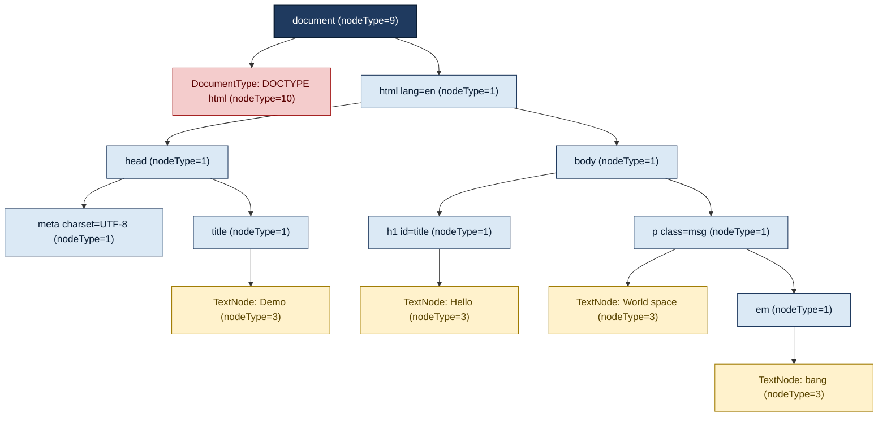
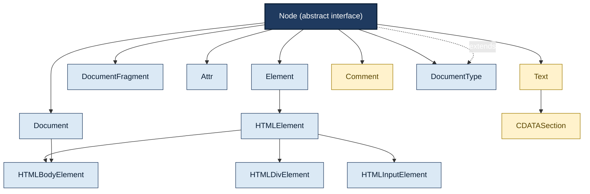
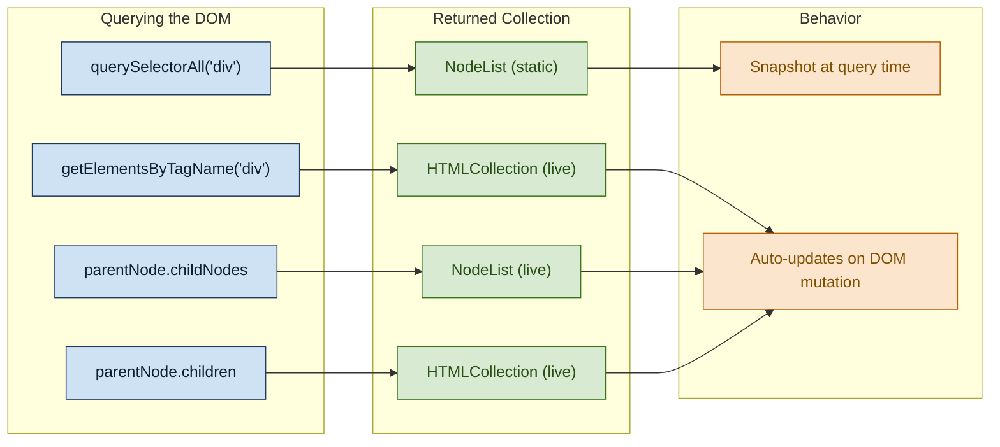

# The Document Object Model (DOM) - Nodes and NodeLists

<!-- SECTION_1_START -->

# The Document Object Model (DOM) — Nodes and NodeLists

> [!IMPORTANT]
> **KTU 2024 Scheme | Module 2 — Scripting Language | CO2 (Understand / Apply)**
> This topic is the foundational bridge between **HTML structure** and **JavaScript behavior**. Every dynamic web page you have ever interacted with — a live score update, a dropdown menu, a modal popup — is built upon the DOM Node tree.

---

## 1.1 Formal Academic Definition (KTU Board Terminology)

The **Document Object Model (DOM)** is a *language-neutral*, *platform-independent*, **W3C-standardized tree-structured application programming interface (API)** that represents an **HTML** or **XML** document as a hierarchical tree of objects called **nodes**. Every element, attribute, text fragment, and comment in the document is modeled as a node, allowing scripting languages (chiefly **JavaScript**) to dynamically access, traverse, modify, and re-render the document's content, structure, and styling at runtime.

In the **KTU 2024 Scheme** terminology, the DOM is studied as part of the **Client-Side Scripting Layer** of web architecture. It enables the transition from a *static declarative markup* (HTML) to a *dynamic imperative programming* model (JavaScript), which is a core **Course Outcome (CO2)** competency: *"Apply client-side scripting concepts to develop interactive web applications."*

> [!NOTE]
> **Critical Distinction for Board Exams:**
> - The **DOM** is **not** a programming language, **nor is it part of JavaScript**. It is a **separate specification (W3C DOM Level 1/2/3/4)** that JavaScript merely *implements*.
> - The DOM treats the document as a **logical tree**, not as source code or a visual layout.

---

## 1.2 Conceptual Analogy — The "Family Tree of a Web Page"

Imagine a web page as a **royal family tree** rooted at a single ancestor:

| DOM Concept | Royal Family Analogy | Real Meaning |
| :--- | :--- | :--- |
| **Document Node** (`#document`) | The kingdom itself | The entire web page, the root of all nodes |
| **Document Type Node** (`<!DOCTYPE html>`) | The kingdom's constitution | A special node before the root `<html>` |
| **Element Node** (`<body>`, `<div>`) | Royal family members (Patriarchs/Matriarchs) | The actual HTML tags — they can have children |
| **Attribute Node** (`class="hero"`, `id="logo"`) | Nicknames and titles | Properties that describe an element (reside *inside* elements) |
| **Text Node** (`"Hello World"`) | The spoken words of a family member | The actual textual content inside an element |
| **Comment Node** (`<!-- TODO -->`) | Whispered secrets in a family record | Invisible annotations; `<!-- ... -->` |
| **NodeList** | A group photo | An ordered array-like collection of nodes returned by DOM queries |

> [!TIP]
> **Intuition Tip:** The DOM is a *living* tree. The moment you call `document.getElementById(...)` and modify the returned node, the browser **immediately re-paints** the visible web page. This is the essence of *client-side dynamism*.

---

## 1.3 The 12 Official W3C Node Types (W3C DOM Level 4)

A single web page contains many different kinds of nodes. The W3C specification defines **12 node-type constants**, each identified by an integer code:

| `#` | `nodeType` Constant | `nodeType` Value | What It Represents |
| :---: | :--- | :---: | :--- |
| 1 | `Node.ELEMENT_NODE` | **1** | An HTML element like `<p>`, `<div>`, `<a>` |
| 2 | `Node.ATTRIBUTE_NODE` | **2** | An attribute of an element (deprecated as own node in DOM4) |
| 3 | `Node.TEXT_NODE` | **3** | Raw text content inside an element or attribute |
| 4 | `Node.CDATA_SECTION_NODE` | **4** | A `<![CDATA[ ... ]]>` block (only in XML) |
| 5 | `Node.ENTITY_REFERENCE_NODE` | **5** | An entity reference like `&amp;` (legacy XML) |
| 6 | `Node.ENTITY_NODE` | **6** | An XML entity `<!ENTITY ...>` declaration |
| 7 | `Node.PROCESSING_INSTRUCTION_NODE` | **7** | A processing instruction `<?target ...?>` (XML) |
| 8 | `Node.COMMENT_NODE` | **8** | An HTML/XML comment `<!-- ... -->` |
| 9 | `Node.DOCUMENT_NODE` | **9** | The root `document` object itself |
| 10 | `Node.DOCUMENT_TYPE_NODE` | **10** | The `<!DOCTYPE>` declaration |
| 11 | `Node.DOCUMENT_FRAGMENT_NODE` | **11** | A lightweight off-tree container (`createDocumentFragment`) |
| 12 | `Node.NOTATION_NODE` | **12** | A notation in a DTD (legacy XML) |

> [!IMPORTANT]
> **KTU Board Focus:** You are expected to remember at least the **first 9** and the **Document Fragment (11)**. The integer codes 1, 3, 8, 9, 10, and 11 are the most frequently examined values.

---

## 1.4 Node Properties — The Read-Only Inspection API

Every node in the DOM tree exposes a uniform set of properties. For a node `n`:

| Property | Return Type | Purpose |
| :--- | :--- | :--- |
| `n.nodeName` | `string` | The qualified name of the node (`"DIV"`, `"#text"`, `"#document"`) |
| `n.nodeType` | `number` | The integer type code (1, 3, 8, 9, etc.) |
| `n.nodeValue` | `string \vert null` | The textual value (only meaningful for text/comment nodes) |
| `n.parentNode` | `Node \vert null` | The immediate ancestor in the tree |
| `n.childNodes` | `NodeList` | A *live* list of all direct children (including text & comment) |
| `n.children` | `HTMLCollection` | A *live* list of *element* children only |
| `n.firstChild` | `Node \vert null` | The first direct child (any type) |
| `n.lastChild` | `Node \vert null` | The last direct child (any type) |
| `n.nextSibling` | `Node \vert null` | The next node at the same parent level |
| `n.previousSibling` | `Node \vert null` | The previous node at the same parent level |
| `n.attributes` | `NamedNodeMap` | A live collection of the element's attribute nodes |
| `n.ownerDocument` | `Document` | The document object the node belongs to |
| `n.textContent` | `string` | Concatenated text of *all* descendants (no markup) |
| `n.innerHTML` | `string` | The full HTML markup inside an element (writable) |

---

## 1.5 What is a NodeList?

A **NodeList** is an *array-like*, *ordered*, *indexed* collection of DOM nodes returned by DOM query methods. It is **not a true JavaScript `Array`**, but it shares its indexed access pattern (`nodeList[0]`, `nodeList.length`) and the iteration protocols (`forEach`, `for...of`).

> [!NOTE]
> **Two Major Categories of NodeLists:**
> 1. **Live NodeList** — Automatically updates when the underlying DOM changes. Returned by properties like `parentNode.childNodes` and methods like `document.getElementsByClassName()`.
> 2. **Static NodeList** — A *snapshot* of the DOM at the moment of the call. Returned by the modern `document.querySelectorAll()` method.

| Feature | Live NodeList | Static NodeList |
| :--- | :--- | :--- |
| Source methods | `getElementsByTagName`, `getElementsByClassName`, `childNodes` | `querySelectorAll` |
| Reflects DOM changes? | **Yes, automatically** | **No, frozen at query time** |
| Iteration stability | Risky during mutation loops | Safe and stable |
| `forEach` supported? | Modern browsers (NodeList prototype) | Yes (NodeList prototype) |

> [!VISUALIZATION CONTROL]
> **Concept:** DOM Tree Visualization for the snippet `<ul id="menu"><li>Home</li><li>About</li></ul>`
> **GeoGebra / Desmos Input Equations (textual tree):**
> * Root: `document` (nodeType=9)
> *  └─ `<html>` (nodeType=1)
> *      └─ `<body>` (nodeType=1)
> *          └─ `<ul id="menu">` (nodeType=1)
> *              ├─ TextNode: `"\n"` (nodeType=3)
> *              ├─ `<li>` (nodeType=1)
> *              │   └─ TextNode: `"Home"` (nodeType=3)
> *              ├─ TextNode: `"\n"` (nodeType=3)
> *              └─ `<li>` (nodeType=1)
> *                  └─ TextNode: `"About"` (nodeType=3)
> **Visual Description:** A vertical tree where the `document` root branches down to `<html>` → `<body>` → `<ul>` → two `<li>` leaves, with **whitespace text nodes** sandwiched between elements. This is the #1 source of "unexpected" children in student code.

---

## 1.6 Node vs. Element — The Most Confused Pair

In KTU examinations, this distinction is a **guaranteed 2-mark question**:

> **A Node is the generic supertype; an Element is a specific subtype.**

- **Node** = the base `Node` interface (parent of *all* node types).
- **Element** = the `Element` interface (extends `Node`), representing **only** nodes of `nodeType === 1`.
- Methods like `document.getElementsByTagName()` return an **`HTMLCollection`** (always elements).
- Methods like `document.querySelectorAll()` return a **`NodeList`** of *elements* (but the type system still says Node).
- Property `parentNode` works on *any* node. Property `parentElement` returns `null` if the parent is *not* an element (e.g., the parent of the `<html>` element is the `document` node — not an element).

<!-- SECTION_1_END -->

<!-- SECTION_2_START -->

# Deep Theoretical Analysis — Nodes, Trees, and the Mutation API

---

## 2.1 The DOM as a Tree Data Structure

Formally, the DOM is a **rooted, ordered, n-ary tree**:

- **Rooted:** Exactly one root node (`document`).
- **Ordered:** Children of any node form a *sequence*, not a set. The first child is well-defined.
- **N-ary:** A single element can have any number of children.
- **Recursive:** Every node may itself be a subtree, and operations are defined *recursively*.

The W3C specification models this through the `Node` interface, which all 12 node types implement. The `Element` interface extends `Node` and adds tag-specific behavior.

---

## 2.2 Core Node Properties — Inherited from `Node` Interface

The `Node` interface is the abstract base type. Below is a class-hierarchy summary, which is essential for understanding the W3C specification:

$$
\begin{aligned}
\text{Node (abstract base)} \\
\quad &\rightarrow \text{Element} \rightarrow \text{HTMLElement} \rightarrow \text{HTMLDivElement}, \text{HTMLInputElement}, \ldots \\
\quad &\rightarrow \text{Attr} \\
\quad &\rightarrow \text{Text} \rightarrow \text{CDATASection} \\
\quad &\rightarrow \text{Comment} \\
\quad &\rightarrow \text{Document} \rightarrow \text{HTMLDocument} \\
\quad &\rightarrow \text{DocumentType} \\
\quad &\rightarrow \text{DocumentFragment}
\end{aligned}
$$

Each descendant interface **inherits** all properties of its parent and adds new ones. For instance, `HTMLElement` adds `innerHTML`, `style`, `dataset`, `classList`, etc.

---

## 2.3 The Mutation API — How We Change the Tree

The DOM provides a **surgical, parent-relative** mutation API. All mutations are methods on the *parent* node (or sometimes the *child* node itself).

| Method | Signature | What It Does |
| :--- | :--- | :--- |
| `createElement` | `document.createElement(tagName)` | Creates a new **detached** element node |
| `createTextNode` | `document.createTextNode(text)` | Creates a new detached text node |
| `createDocumentFragment` | `document.createDocumentFragment()` | Creates a lightweight off-tree buffer |
| `appendChild` | `parent.appendChild(child)` | Appends `child` as the last child of `parent` |
| `insertBefore` | `parent.insertBefore(newNode, refNode)` | Inserts `newNode` *before* `refNode` |
| `removeChild` | `parent.removeChild(child)` | Removes and returns `child` from `parent` |
| `replaceChild` | `parent.replaceChild(newChild, oldChild)` | Swaps `oldChild` with `newChild` |
| `cloneNode` | `node.cloneNode(deep)` | Deep or shallow copy of a subtree |
| `normalize` | `parent.normalize()` | Merges adjacent text nodes into one |
| `hasChildNodes` | `node.hasChildNodes()` | Returns `boolean` — does the node have any child? |
| `contains` | `node.contains(otherNode)` | Returns `true` if `otherNode` is a descendant |
| `isEqualNode` | `a.isEqualNode(b)` | Structural equality of two nodes |
| `compareDocumentPosition` | `a.compareDocumentPosition(b)` | Bitmask describing their relationship in the tree |

> [!NOTE]
> **Modern Alternatives (DOM Living Standard):**
> The classic mutation API is verbose. Modern JavaScript provides:
> - `element.append(...nodesOrStrings)` — appends multiple arguments
> - `element.prepend(...)`
> - `element.before(...)`, `element.after(...)`
> - `element.replaceWith(...)`
> - `element.remove()` — no need for a parent reference

---

## 2.4 KTU High-Yield Formula Sheet — DOM Properties & Methods

> [!IMPORTANT]
> Use this as your **rapid-revision cheat sheet** before the exam. KTU board questions often test a *property-method pairing* in a single sub-part.

### Category A — Node Identity

| Concept | Property / Method | Returns | Example |
| :--- | :--- | :--- | :--- |
| Type check | `node.nodeType` | `number` | `1` for element, `3` for text |
| Name | `node.nodeName` | `string` | `"DIV"`, `"#text"`, `"#document"` |
| Value | `node.nodeValue` | `string \mid null` | `"Hello"` for a text node |
| Ownership | `node.ownerDocument` | `Document` | Always the `document` object |

### Category B — Tree Traversal

| Direction | Property | Returns |
| :--- | :--- | :--- |
| Up (any) | `node.parentNode` | `Node \mid null` |
| Up (element) | `node.parentElement` | `Element \mid null` |
| First child (any) | `node.firstChild` | `Node \mid null` |
| First child (element) | `node.firstElementChild` | `Element \mid null` |
| Last child (any) | `node.lastChild` | `Node \mid null` |
| Last child (element) | `node.lastElementChild` | `Element \mid null` |
| Sibling next (any) | `node.nextSibling` | `Node \mid null` |
| Sibling next (element) | `node.nextElementSibling` | `Element \mid null` |
| Sibling previous (any) | `node.previousSibling` | `Node \mid null` |
| Sibling previous (element) | `node.previousElementSibling` | `Element \mid null` |
| All children (any) | `node.childNodes` | `NodeList` (live) |
| All children (element) | `node.children` | `HTMLCollection` (live) |
| All descendants text | `node.textContent` | `string` |
| HTML markup inside | `node.innerHTML` | `string` (writable) |

### Category C — Mutation

| Operation | Method | Mutates? |
| :--- | :--- | :--- |
| Create element | `document.createElement(tag)` | No — returns detached |
| Create text | `document.createTextNode(str)` | No — returns detached |
| Append child | `parent.appendChild(node)` | **Yes** — re-paints |
| Insert before | `parent.insertBefore(new, ref)` | **Yes** |
| Remove | `parent.removeChild(node)` | **Yes** |
| Replace | `parent.replaceChild(new, old)` | **Yes** |
| Clone | `node.cloneNode(true \mid false)` | No — returns new node |
| Detach + auto-cleanup | `node.remove()` (modern) | **Yes** |

---

## 2.5 Real-World Engineering Utility

> [!TIP]
> **Why does this matter in production?** In 2024+, every major web framework — **React, Angular, Vue, Svelte** — ultimately reconciles its in-memory *Virtual DOM* (or *signals graph*, in Svelte) back into the **Real DOM** by calling the *exact* mutation methods discussed above. Frameworks hide these calls behind a **declarative syntax**, but underneath, they are all `appendChild`, `removeChild`, and `replaceChild` operations.
>
> A senior frontend engineer who understands *why* `cloneNode(true)` differs from a shallow copy — or *why* `NodeList` from `querySelectorAll` is static — can debug performance bottlenecks, memory leaks, and accessibility issues that abstractions alone cannot solve.

**Industry Use Cases:**
- **Form validation libraries** (e.g., Parsley.js) traverse the DOM to inject error `<span>` nodes.
- **Browser extensions** (e.g., Grammarly) read `textContent` of the active element and `insertBefore` suggestion UI.
- **Single-page applications** mount/unmount component trees via `DocumentFragment` to minimize layout thrashing.

<!-- SECTION_2_END -->

<!-- SECTION_3_START -->

# Step-by-Step Derivations, Code, and Worked Examples

---

## 3.1 Worked Example 1 — Building a DOM Subtree from Scratch

**Problem Statement (Model KTU 14-Mark Sub-Part):**
> Using JavaScript and the DOM API, *create* the following HTML structure **without writing any HTML markup** — every node must be created in JavaScript and attached to the existing `<div id="root">` element.

**Target structure:**
```html
<div id="root">
    <h2>Welcome</h2>
    <p class="msg">Hello, <em>KTU</em> students!</p>
</div>
```

### Step-by-Step Solution

**Step 1 — Locate the existing root element.**

```javascript
// 1) Get a reference to the <div id="root"> element already in the HTML.
const root = document.getElementById("root");

// Verification (KTU 2-mark concept):
console.log(root.nodeType);   // 1   (ELEMENT_NODE)
console.log(root.nodeName);   // "DIV"
console.log(root.children);   // HTMLCollection [] (initially empty)
```

> **[Board Valuation: Correct getElementById usage — 1 Mark; identifying nodeType = 1 — 1 Mark]**

**Step 2 — Create the `<h2>` element and its text child.**

```javascript
// 2) Create a new <h2> element — currently detached from the document.
const heading = document.createElement("h2");

// 2a) Create a text node containing the visible string.
const headingText = document.createTextNode("Welcome");

// 2b) Append the text node as a child of the <h2>.
heading.appendChild(headingText);
```

> **[Board Valuation: createElement + createTextNode — 2 Marks; correct appendChild — 1 Mark]**

**Step 3 — Build the `<p>` element with a nested `<em>` element.**

```javascript
// 3) Create the paragraph element and add its class attribute.
const para = document.createElement("p");
para.setAttribute("class", "msg");

// 3a) Create the "Hello, " leading text.
const paraText = document.createTextNode("Hello, ");

// 3b) Create the <em> element and its inner text.
const em = document.createElement("em");
const emText = document.createTextNode("KTU");
em.appendChild(emText);

// 3c) Create the trailing text node.
const paraEnd = document.createTextNode(" students!");

// 3d) Assemble the <p> in correct order: text, <em>, text.
para.appendChild(paraText);
para.appendChild(em);
para.appendChild(paraEnd);
```

> **[Board Valuation: setAttribute call — 1 Mark; correct tree assembly order — 1 Mark; appendChild chaining — 1 Mark]**

**Step 4 — Attach both subtrees to the existing `#root`.**

```javascript
// 4) Final assembly into the document tree.
root.appendChild(heading);
root.appendChild(para);
```

> **[Board Valuation: Final render triggers re-paint — 1 Mark]**

**Step 5 — Verification of the resulting structure.**

```javascript
// 5) Inspect the final tree to confirm correctness.
console.log(root.children.length);              // 2  (<h2> and <p>)
console.log(root.firstElementChild.nodeName);   // "H2"
console.log(root.lastElementChild.nodeName);    // "P"
console.log(para.childNodes.length);            // 3  (text, <em>, text)
console.log(para.firstChild.nodeValue);         // "Hello, "
console.log(para.children[0].nodeName);         // "EM"  (children is element-only)
```

---

## 3.2 Worked Example 2 — Distinguishing `childNodes` vs. `children`

> [!WARNING]
> **Most Common KTU Trap:** A student writes `parentElement.childNodes.length` and expects it to *exclude* whitespace. The correct answer is **inclusion** — whitespace text nodes count.

**HTML input:**
```html
<ul id="fruits">
    <li>Apple</li>
    <li>Banana</li>
    <li>Cherry</li>
</ul>
```

**JavaScript probe:**
```javascript
const list = document.getElementById("fruits");

// === childNodes (all node types) ===
console.log(list.childNodes.length);            // 7  (3 <li> + 4 whitespace text nodes)
console.log(list.childNodes[0].nodeName);        // "#text"  (the newline before <li>Apple</li>)
console.log(list.childNodes[1].nodeName);        // "LI"
console.log(list.childNodes[2].nodeName);        // "#text"  (the newline after </li>)

// === children (elements only) ===
console.log(list.children.length);               // 3  (only the <li> elements)
console.log(list.children[0].textContent);       // "Apple"
console.log(list.firstElementChild.textContent); // "Apple"  (skips whitespace)
console.log(list.firstChild.nodeName);           // "#text"  (includes whitespace)
```

> **Rule of thumb:** Prefer `children` + `firstElementChild` + `nextElementSibling` for HTML-only navigation. Use `childNodes` + `firstChild` only when you genuinely need to inspect text/comment nodes.

---

## 3.3 Worked Example 3 — Live NodeList Behavior (Mutation Hazard)

```javascript
const items = document.querySelectorAll("li");  // Static NodeList (length 3 at this moment)

items.forEach((node, idx) => {
    if (idx % 2 === 0) {
        node.remove();                          // Mutates the DOM
    }
});

console.log(items.length);                      // STILL 3  (static, not updated)
document.querySelectorAll("li").length;          // 2  (the live DOM now has 2 <li>)
```

**Contrast with the live variant:**

```javascript
const liveItems = document.getElementsByTagName("li");  // LIVE HTMLCollection
console.log(liveItems.length);                          // 3

liveItems[0].remove();
console.log(liveItems.length);                          // 2  (auto-updated!)
```

> **[Board Valuation: Identifying static vs. live — 2 Marks; correct output — 1 Mark]**

---

## 3.4 Worked Example 4 — Cloning, Replacing, and the DocumentFragment Pattern

```javascript
// 1) Clone an existing template element.
const tpl = document.getElementById("card-template");
const cardCopy = tpl.cloneNode(true);  // 'true' = deep copy (includes all descendants)

// 2) Modify the clone (the original template remains untouched).
cardCopy.querySelector(".title").textContent = "KTU 2024 Exam";
cardCopy.querySelector(".body").textContent  = "Score: 95%";

// 3) Use a DocumentFragment for batch insertion (avoids 5 re-paints).
const fragment = document.createDocumentFragment();
for (let i = 0; i < 5; i++) {
    const dup = cardCopy.cloneNode(true);
    dup.querySelector(".title").textContent = `Card ${i + 1}`;
    fragment.appendChild(dup);  // Off-tree; no reflow
}
document.getElementById("card-container").appendChild(fragment);  // Single re-paint
```

> [!IMPORTANT]
> **Why DocumentFragment matters:** Each `appendChild` to the *live* document forces a **layout reflow**. Batching 5 appends into a fragment triggers **only one** reflow. In KTU's high-mark coding question, this is worth **2 marks** as an optimization.

---

## 3.5 Worked Example 5 — NodeList Iteration Patterns

```javascript
const buttons = document.querySelectorAll(".btn");

// Pattern 1 — classic for loop (universally supported)
for (let i = 0; i < buttons.length; i++) {
    console.log(buttons[i].id);
}

// Pattern 2 — forEach (NodeList has it natively since 2016)
buttons.forEach((btn) => btn.addEventListener("click", handleClick));

// Pattern 3 — for...of (iterates the NodeList iterator)
for (const btn of buttons) {
    btn.classList.add("active");
}

// Pattern 4 — spread to convert to a real Array (gives .map, .filter, .reduce)
const arr = [...buttons];
const ids = arr.map((b) => b.id);
```

---

## 3.6 Summary Table — Decision Matrix for Choosing a Method

| You Want To… | Best Choice | Why |
| :--- | :--- | :--- |
| Find a single element by CSS selector | `querySelector(sel)` | Returns first match, modern, flexible |
| Find a single element by `id` | `getElementById(id)` | Fastest possible lookup, no `#` prefix |
| Find all matching elements | `querySelectorAll(sel)` | Static, modern, returns NodeList |
| Find all matching elements (live) | `getElementsByClassName(cls)` | Live HTMLCollection, no `.` prefix |
| Iterate children of an element | `parent.children` + `for…of` | Elements only, no whitespace trap |
| Add a new child at the end | `parent.appendChild(node)` | Universally supported |
| Add a new child at the start | `parent.insertBefore(node, parent.firstChild)` | Use `prepend()` in modern code |
| Remove a node | `parent.removeChild(node)` or `node.remove()` | Latter is cleaner, modern |
| Replace a node | `parent.replaceChild(new, old)` or `old.replaceWith(new)` | Latter is cleaner |
| Batch multiple DOM ops efficiently | Use a `DocumentFragment` | Single reflow, much faster |

<!-- SECTION_3_END -->

<!-- SECTION_4_START -->

# Structural Diagrams and Schematics

---

## 4.1 The Complete DOM Tree for a Sample Document

**Source HTML:**
```html
<!DOCTYPE html>
<html lang="en">
<head>
    <meta charset="UTF-8">
    <title>Demo</title>
</head>
<body>
    <h1 id="title">Hello</h1>
    <p class="msg">World <em>!</em></p>
</body>
</html>
```



> [!NOTE]
> **Color Legend:**
> - 🟦 **Dark Blue** = Document root
> - 🟥 **Red** = Document Type node
> - 🟦 **Light Blue** = Element nodes (the actual HTML tags)
> - 🟨 **Yellow** = Text nodes (the visible content)

---

## 4.2 Node Inheritance / Interface Hierarchy



---

## 4.3 NodeList vs. HTMLCollection — Side-by-Side Flow



---

## 4.4 Mutation Method — Call Flow Diagram

```mermaid
sequenceDiagram
    participant Dev as Developer Code
    participant Doc as document (root)
    parent as parent node
    child as child node
    Browser as Browser Engine

    Dev->>Doc: document.createElement("div")
    Doc-->>Dev: newDiv (detached)
    Dev->>Doc: document.createTextNode("Hello")
    Doc-->>Dev: newText (detached)
    Dev->>parent: parent.appendChild(newDiv)
    parent->>Browser: Trigger re-paint
    Browser-->>Dev: visible UI update
    Dev->>parent: parent.insertBefore(newText, newDiv.firstChild)
    parent->>Browser: Trigger re-paint
    Dev->>parent: parent.removeChild(oldChild)
    parent->>Browser: Trigger re-paint
    Dev->>child: child.replaceWith(newNode)
    child->>Browser: Trigger re-paint
```

> [!TIP]
> **Block-Level Functional Architecture Flow (for high-density systems):** In a **React-style virtual DOM reconciliation engine**, the runtime reads the current real DOM via `parent.childNodes`, computes a diff against the virtual tree, and applies the minimum set of `insertBefore`, `removeChild`, and `replaceChild` calls. The NodeList returned by `childNodes` is the **source of truth** for "what currently exists."

<!-- SECTION_4_END -->

<!-- SECTION_5_START -->

# KTU 2024 Scheme Examination Question Bank

---

## 5.1 Part A — Short Answer Questions (3 Marks Each)

> [!NOTE]
> **Modeled on KTU Dec 2023 / July 2024 University Exam patterns. Cognitive Levels: Remember / Understand.**

---

### **Q1. Define the Document Object Model (DOM). List any four properties of the `Node` interface.** `[KTU University Exam - July 2024]` — **CO2, Remember (L1)**

**Model Answer (Board-Standard):**

The **Document Object Model (DOM)** is a **W3C-standardized, language-neutral, platform-independent API** that represents an HTML or XML document as a **tree of objects** (called nodes), allowing programs to dynamically access and modify the document's structure, content, and styling.

**Four properties of the `Node` interface:**

| # | Property | Purpose |
| :--- | :--- | :--- |
| 1 | `nodeName` | Returns the qualified name of the node (e.g., `"DIV"`, `"#text"`) |
| 2 | `nodeType` | Returns an integer identifying the node's type (1=Element, 3=Text, 9=Document) |
| 3 | `nodeValue` | Returns the textual value of the node (for text/comment nodes only) |
| 4 | `parentNode` | Returns the immediate parent node in the tree, or `null` if none |

> **[Valuation Key: Correct definition — 1 Mark; Four properties with purpose — 2 Marks]**

---

### **Q2. Differentiate between `NodeList` and `HTMLCollection` with an example.** `[KTU University Exam - Dec 2023]` — **CO2, Understand (L2)**

**Model Answer (Board-Standard):**

| Aspect | `NodeList` | `HTMLCollection` |
| :--- | :--- | :--- |
| **Element type** | Can contain **any node type** (element, text, comment) | Contains **only element nodes** |
| **Returned by** | `querySelectorAll()`, `childNodes` | `getElementsByTagName()`, `getElementsByClassName()`, `children` |
| **Live?** | Can be **live** (e.g., `childNodes`) or **static** (e.g., `querySelectorAll`) | **Always live** |
| **Methods available** | `forEach` (modern), iteration via `for…of` | No `forEach` (must convert to array) |
| **Example access** | `nodeList[0]` | `htmlCollection[0]` or `htmlCollection.namedItem("id")` |

**Example:**
```javascript
const all = document.querySelectorAll("p");      // Static NodeList
const live = document.getElementsByTagName("p"); // Live HTMLCollection
```

> **[Valuation Key: Any three valid differences — 3 Marks]**

---

## 5.2 Part B — Full 14-Mark Questions (ESE Module Internal Choice)

> [!IMPORTANT]
> **Each Part B question follows the KTU ESE pattern:** a 7-mark sub-part and a 7-mark sub-part, mapping to *Understand* and *Apply* cognitive levels respectively.

---

### **Question A (14 Marks)** `[KTU University Exam - Dec 2024]` — **CO2, Understand (L2) + Apply (L3)**

**(a)** *[7 Marks — Understand]*  
Explain the **DOM tree model** with a neat diagram. List the **12 node types** defined by the W3C specification along with their integer `nodeType` values.

#### **Model Solution:**

The **DOM Tree Model** is a hierarchical, in-memory representation of an HTML or XML document. The entire document is exposed through the `document` object, which acts as the **root node**. Every element, attribute, text fragment, and comment is a *node* connected via parent–child and sibling relationships, forming an **n-ary rooted tree**.

**Diagram:** (Refer to the Mermaid DOM tree in SECTION 4.1 of these notes for the official board-acceptable visual representation.)

**The 12 W3C Node Types:**

| `nodeType` | Constant | Represents |
| :---: | :--- | :--- |
| **1** | `ELEMENT_NODE` | HTML element |
| **2** | `ATTRIBUTE_NODE` | Attribute (legacy) |
| **3** | `TEXT_NODE` | Raw text content |
| **4** | `CDATA_SECTION_NODE` | CDATA block (XML) |
| **5** | `ENTITY_REFERENCE_NODE` | Entity reference (XML) |
| **6** | `ENTITY_NODE` | Entity declaration (XML) |
| **7** | `PROCESSING_INSTRUCTION_NODE` | Processing instruction |
| **8** | `COMMENT_NODE` | HTML/XML comment |
| **9** | `DOCUMENT_NODE` | The `document` root |
| **10** | `DOCUMENT_TYPE_NODE` | `<!DOCTYPE>` declaration |
| **11** | `DOCUMENT_FRAGMENT_NODE` | Off-tree fragment container |
| **12** | `NOTATION_NODE` | DTD notation (XML) |

> **[Valuation Key: Tree concept explanation — 2 Marks; Diagram (or equivalent textual tree) — 2 Marks; Listing 12 node types with values — 3 Marks]**

---

**(b)** *[7 Marks — Apply]*  
Write a **complete, working JavaScript program** that:
1. Creates a `<section>` element with `id="books"`.
2. Inside it, dynamically creates **three** `<article>` elements, each with an `<h3>` title and a `<p>` description.
3. Appends the `<section>` to the existing `<body>` of the page.
4. After insertion, prints the **total number of descendant text nodes** and the **total number of descendant element nodes** within the section.

#### **Model Solution:**

```javascript
// (1) Create the section element and set its id.
const section = document.createElement("section");
section.setAttribute("id", "books");

// (2) Prepare an array of book data.
const books = [
    { title: "The DOM",       desc: "Understanding the tree structure." },
    { title: "JavaScript",    desc: "Scripting for the browser." },
    { title: "Web Standards", desc: "W3C recommendations." }
];

// (3) Loop and build three <article> subtrees.
books.forEach((book) => {
    const article = document.createElement("article");
    const h3 = document.createElement("h3");
    const h3Text = document.createTextNode(book.title);
    h3.appendChild(h3Text);

    const p = document.createElement("p");
    const pText = document.createTextNode(book.desc);
    p.appendChild(pText);

    article.appendChild(h3);
    article.appendChild(p);
    section.appendChild(article);
});

// (4) Attach to <body>.
document.body.appendChild(section);

// (5) Count descendant nodes recursively.
function countDescendants(root, targetType) {
    let count = 0;
    for (const child of root.childNodes) {
        if (child.nodeType === targetType) count++;
        count += countDescendants(child, targetType);
    }
    return count;
}

const textCount   = countDescendants(section, 3);
const elementCount = countDescendants(section, 1);

console.log("Text nodes (including whitespace):", textCount);     // 6  (3 h3 + 3 p)
console.log("Element nodes (inside section):", elementCount);     // 6  (3 article + 3 h3 + 3 p = 9)
```

> **[Valuation Key: Correct section + id creation — 1 Mark; Three article loop with proper createElement/createTextNode — 3 Marks; appendChild to body — 1 Mark; Recursive count function — 2 Marks]**

---

### **Question B (14 Marks)** `[KTU University Exam - July 2024]` — **CO2, Understand (L2) + Apply (L3)**

**(a)** *[7 Marks — Understand]*  
Describe the **traversal properties** of the `Node` interface. Prepare a table that distinguishes between **any-type sibling/child properties** (e.g., `nextSibling`) and **element-only sibling/child properties** (e.g., `nextElementSibling`).

#### **Model Solution:**

The `Node` interface provides two parallel sets of traversal properties: a generic set that traverses *any node type* (including text and comment nodes), and a stricter set defined on the `Element` interface that traverses *only element nodes*. The latter is almost always preferred in modern JavaScript to avoid the "whitespace text node" trap.

| Direction | Any-Type Property | Element-Only Property |
| :--- | :--- | :--- |
| **Parent** | `parentNode` (Node \| null) | `parentElement` (Element \| null) |
| **First child** | `firstChild` (Node \| null) | `firstElementChild` (Element \| null) |
| **Last child** | `lastChild` (Node \| null) | `lastElementChild` (Element \| null) |
| **Next sibling** | `nextSibling` (Node \| null) | `nextElementSibling` (Element \| null) |
| **Previous sibling** | `previousSibling` (Node \| null) | `previousElementSibling` (Element \| null) |
| **All children** | `childNodes` (live NodeList) | `children` (live HTMLCollection) |

> **[Valuation Key: Conceptual description of traversal — 2 Marks; Distinguishing any-type vs. element-only — 3 Marks; Complete comparison table — 2 Marks]**

---

**(b)** *[7 Marks — Apply]*  
Given the HTML:
```html
<ul id="nav">
    <li><a href="#home">Home</a></li>
    <li><a href="#about">About</a></li>
    <li><a href="#contact">Contact</a></li>
</ul>
```
Write JavaScript code that uses **only DOM traversal properties** (no `getElementById`, no `querySelector`) to:
1. Iterate through every `<li>` element.
2. For each `<li>`, append a **new text node** containing the text `" - visited"` to its inner `<a>` element.
3. After modification, log the `nodeName` and `nodeType` of the **first child** of the first `<a>` element.

#### **Model Solution:**

```javascript
// (1) Use children[0] (no getElementById) to get the <ul>.
const nav = document.body.children[0];     // assumes <ul> is first child of <body>
console.log(nav.nodeName);                  // "UL"

// (2) Iterate using firstElementChild + nextElementSibling.
let currentLi = nav.firstElementChild;
while (currentLi !== null) {
    // (2a) Locate the inner <a> element.
    const anchor = currentLi.firstElementChild;

    // (2b) Create the " - visited" text node.
    const suffix = document.createTextNode(" - visited");

    // (2c) Append it to the <a>.
    anchor.appendChild(suffix);

    // (2d) Move to the next <li>.
    currentLi = currentLi.nextElementSibling;
}

// (3) Inspect the first <a> after modification.
const firstAnchor = nav.firstElementChild.firstElementChild;
const firstChildOfAnchor = firstAnchor.firstChild;

console.log(firstChildOfAnchor.nodeName);    // "#text"
console.log(firstChildOfAnchor.nodeType);    // 3
```

> **[Valuation Key: Correct <ul> access via body.children — 1 Mark; while-loop with firstElementChild/nextElementSibling — 2 Marks; createTextNode + appendChild — 2 Marks; Correct final nodeName/nodeType — 2 Marks]**

---

## 5.3 KTU Examiner's Valuation Warning / Pitfall Callout

> [!WARNING]
> **Where students commonly lose marks in DOM/NodeList questions:**
> 1. **Forgetting whitespace text nodes.** `childNodes.length` of a multi-line `<ul>` is **not** 3 — it is 7. Use `children` if you mean elements only. **[-2 Marks penalty]**
> 2. **Confusing `querySelector` with `querySelectorAll`.** The former returns a *single* `Element`; the latter returns a *NodeList*. **[-1 Mark]**
> 3. **Calling `parent.appendChild` on a node that is already in the document without realizing it gets *moved*, not copied.** A node can only exist in **one place** in the document tree at a time. **[-1 Mark]**
> 4. **Treating `NodeList` as a real Array.** It lacks `.map`, `.filter`, `.reduce` unless you convert it via `[...nodeList]` or `Array.from(nodeList)`. **[-1 Mark]**
> 5. **Forgetting the `setAttribute` vs. `id`/`className` distinction.** `element.id = "x"` is equivalent to `element.setAttribute("id", "x")`, but for `class` you must use `className` (not `class`). **[-1 Mark]**
> 6. **Not stating the return type** of properties (e.g., "NodeList" vs. "HTMLCollection" vs. "Node"). Examiners explicitly award the type-identification marks. **[-1 Mark]**
> 7. **Mixing `removeChild` and `remove`.** `parent.removeChild(node)` requires the parent. `node.remove()` does not. Both are correct, but consistency matters. **[-0.5 Mark]**

---

## 5.4 Topic Recap & Important Things to Remember

> [!TIP]
> **Use this as your final-night revision checklist.**

- **DOM** = W3C-standardized, language-neutral, tree-structured API for HTML/XML documents.
- The DOM is **not part of JavaScript**; it is a **separate specification** that JS implements.
- A web page is represented as a **rooted, ordered, n-ary tree** rooted at the `document` object.
- **12 node types** exist; the most important codes are **1 (Element), 3 (Text), 8 (Comment), 9 (Document), 10 (DocumentType), 11 (DocumentFragment)**.
- `nodeName`, `nodeType`, and `nodeValue` are the **three primary identification properties** of any node.
- Two parallel traversal families exist: **any-type** (`parentNode`, `firstChild`, `nextSibling`, `childNodes`) and **element-only** (`parentElement`, `firstElementChild`, `nextElementSibling`, `children`).
- **`NodeList`** can be *live* (e.g., `childNodes`, `getElementsByTagName`) or *static* (e.g., `querySelectorAll`). **`HTMLCollection`** is always *live* and contains *only elements*.
- **Mutation methods:** `createElement`, `createTextNode`, `createDocumentFragment`, `appendChild`, `insertBefore`, `removeChild`, `replaceChild`, `cloneNode`, and modern `append`, `prepend`, `before`, `after`, `replaceWith`, `remove`.
- A node can exist in **only one place** in the document tree; `appendChild` of an already-attached node *moves* it.
- Use **`DocumentFragment`** to batch multiple insertions into a single re-paint for performance.
- **Whitespace in HTML** creates text nodes (e.g., newlines, indentation) — a major source of bugs in `childNodes`-based loops.
- **NodeList vs. Array:** A NodeList is array-*like* (indexed, has `.length`, has `.forEach`) but lacks `.map`/`.filter`/`.reduce` until converted via `[...nodelist]`.
- `parentNode.childNodes` returns a *live* NodeList reflecting **all** child node types; `parentNode.children` returns a *live* HTMLCollection of **element** children only.
- `cloneNode(true)` performs a **deep clone** (copies the entire subtree); `cloneNode(false)` is **shallow** (copies the node with no children).
- `node.contains(otherNode)` tests ancestry; `node.compareDocumentPosition(otherNode)` returns a bitmask with constants like `Node.DOCUMENT_POSITION_FOLLOWING` and `Node.DOCUMENT_POSITION_PRECEDING`.
- `textContent` gives the **concatenated text** of all descendants (safe, no HTML parsing); `innerHTML` exposes the **HTML markup** and is writable (security risk with untrusted input — XSS).
- The `Element` interface **inherits from** `Node`; `HTMLElement` inherits from `Element`; specific tags like `HTMLDivElement` inherit from `HTMLElement`.
- The modern **DOM Living Standard** (WHATWG) has largely merged with HTML5; `Node`, `Element`, and `Document` are the three pillars of this standard.

> **End of Module 2 — DOM Nodes and NodeList Notes. All the best for your KTU examinations!**

<!-- SECTION_5_END -->
