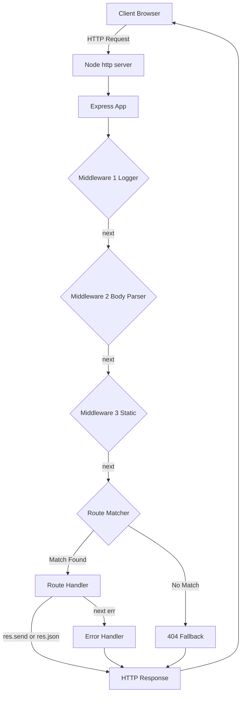
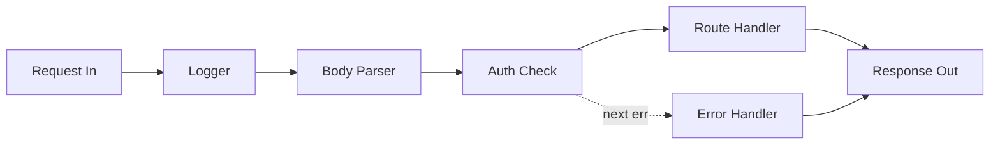
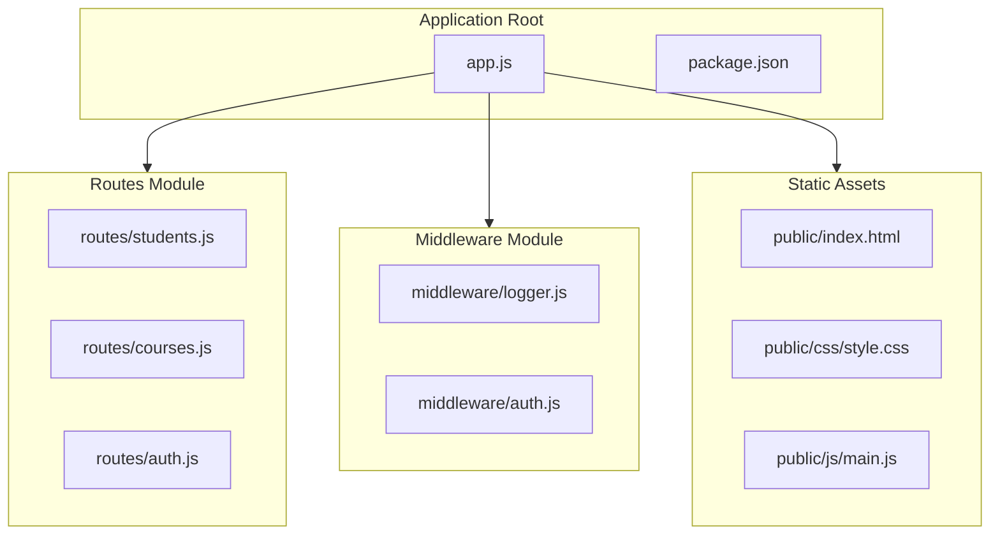
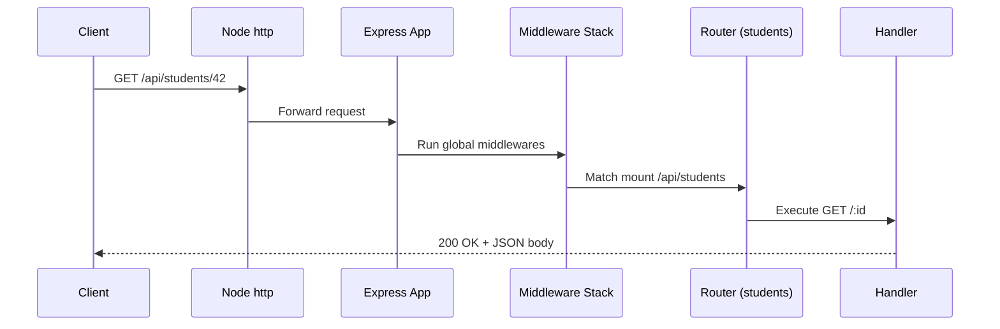
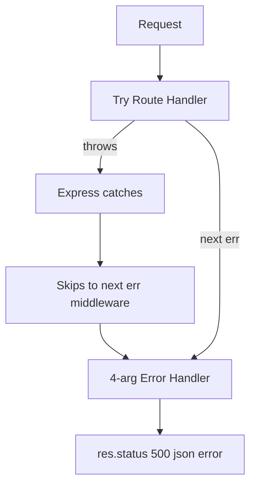

# Adding Express to Node.js

<!-- SECTION_1_START -->
# Adding Express to Node.js

## 1.1 Formal Academic Definition

> [!NOTE]
> **Express.js (Express)** is a fast, unopinionated, minimalist **web application framework for Node.js**. It is a thin layer built on top of the Node.js `http` module that provides a higher-level abstraction for building **RESTful APIs**, single-page applications, and server-side rendered web applications. As of the **Express 4.x** line, it is the de-facto standard server framework in the Node.js ecosystem.

In the **KTU 2024 Scheme (PECST742 – Web Programming)** syllabus, this topic falls under **Module 3 – JavaScript Runtime Environment (Node.js)** and is tagged under the outcome of designing server-side applications using Node.js and Express.

### 1.2 Conceptual Analogy / Intuition

Think of **Node.js** as a raw kitchen — it has a stove, oven, and utensils, but to actually cook a 5-star meal you need proper kitchen tools, standardized recipes, and a waiter to serve the dish. **Express.js** is that combination of standardized tools + recipes + waiter:

| Real Kitchen (Node.js) | Restaurant Workflow (Express.js) |
|---|---|
| Raw `http.createServer()` | `app.get()`, `app.post()` — structured routing |
| Manually parsing URL strings | Built-in `req.params`, `req.query`, `req.body` |
| Manual header management | `res.send()`, `res.json()`, `res.status()` helpers |
| Manual byte-by-byte file streaming | `express.static()` middleware for static assets |
| No convention for "next step" | **Middleware chain** (`next()`) — a defined pipeline |

> [!IMPORTANT]
> **Why not just use Node's `http` module?** Because at production scale, you'd end up **re-implementing Express** anyway. Express gives you a battle-tested, community-audited architecture so you focus on **business logic**, not on plumbing.

### 1.3 The Express Way of Thinking — Three Pillars

1. **Application Object (`app`)** — the central configuration and routing registry.
2. **Middleware Functions** — small, composable units that transform `request` → `response`.
3. **Routing** — mapping an **HTTP Method** + **URL Path** to a handler.

> [!TIP]
> **Key Statistic to Remember:** Express is downloaded from npm **> 25 million times per week** (npm registry, 2024). It powers production systems at **Netflix, Uber, Twitter (X)**, and **PayPal**. In KTU board answers, citing this statistic instantly signals depth.

### 1.4 Visualization of Request Flow

> [!VISUALIZATION CONTROL]
> **Concept:** Linear Request-Response Pipeline in Express
> **GeoGebra / Desmos Input Equations:**
> * `f(x) = x` (identity pipeline)
> * `g(x) = x + 1` (middleware 1 adds a header)
> * `h(x) = 2x` (middleware 2 doubles a value)
> * Composite: `(h ∘ g ∘ f)(x) = 2(x + 1)`
> **Visual Description:** Plot three lines on the same axis to show how a request enters at $x=1$, gets incremented to $2$, then doubled to $4$, mirroring how a request traverses a middleware chain.

<!-- SECTION_1_END -->

<!-- SECTION_2_START -->
# 2. Deep Theoretical Analysis & KTU High-Yield Reference

## 2.1 Why Express? The Architectural Problem It Solves

Raw Node.js (`http.createServer`) requires you to manually:
- Parse the URL to extract path & query.
- Switch on `req.method` to handle GET vs POST.
- Parse the request body as a stream of bytes.
- Manually set `Content-Type`, status codes, and serialize JSON.

Express abstracts all of this into a **declarative API**, letting you write:

```javascript
app.get('/users/:id', (req, res) => {
  res.json({ id: req.params.id });
});
```

instead of 30+ lines of low-level `http` boilerplate.

## 2.2 The Four Building Blocks of an Express App

### 2.2.1 The `app` Object
Created by `express()`. Holds the routing table, middleware stack, and configuration. It is an **Express Application** instance (function with extra properties).

### 2.2.2 Middleware
A function with the signature `(req, res, next)`. It can:
- Execute any code.
- Mutate `req` and `res` (e.g., attach `req.user`).
- End the request (`res.send()`).
- Pass control to the next middleware (`next()`).

> [!IMPORTANT]
> **Order matters.** Middleware is executed **top-to-bottom in the order it is registered**. Mis-ordered middleware is the #1 source of bugs in beginner Express apps.

### 2.2.3 Routing
Defined as `app.METHOD(PATH, HANDLER)`. Express matches the **HTTP method** (GET, POST, PUT, DELETE, PATCH, etc.) and the **URL pattern** (which can include parameters, wildcards, and regex).

### 2.2.4 Request & Response Objects
- `req` is an enhanced `IncomingMessage`. Adds `.params`, `.query`, `.body`, `.headers`, `.cookies`, `.ip`.
- `res` is an enhanced `ServerResponse`. Adds `.send()`, `.json()`, `.status()`, `.redirect()`, `.render()`.

## 2.3 KTU High-Yield Cheat Sheet

> [!NOTE]
> The following table is the **single most important reference** for KTU board exams on this topic. Memorize the signatures and the verbs.

| Concept | API Signature | Purpose | Returns / Effect |
|---|---|---|---|
| Create app | `express()` | Initialize Express application | Returns `app` object |
| Listen | `app.listen(port, callback)` | Bind & listen on TCP port | Starts HTTP server |
| GET route | `app.get(path, handler)` | Handle HTTP GET | Registers route |
| POST route | `app.post(path, handler)` | Handle HTTP POST | Registers route |
| Param route | `'/users/:id'` | Capture URL segment | Available as `req.params.id` |
| Query | `?name=John` | Read query string | Available as `req.query.name` |
| Body parser | `express.json()` | Parse JSON body | Populates `req.body` |
| URL-encoded | `express.urlencoded({extended:true})` | Parse form data | Populates `req.body` |
| Static files | `express.static('public')` | Serve static assets | Mounts file middleware |
| Middleware | `app.use(fn)` | Register global middleware | Runs for every request |
| Send response | `res.send(data)` | Send any data | Auto-sets `Content-Type` |
| JSON response | `res.json(obj)` | Send JSON | Sets `Content-Type: application/json` |
| Status code | `res.status(404)` | Set HTTP status | Chainable |
| Redirect | `res.redirect('/login')` | Issue 302 | Default 302 |
| Next | `next()` | Pass to next middleware | Continues chain |
| Error | `next(err)` | Skip to error handler | Triggers 4-arg middleware |
| Router | `express.Router()` | Modular routing | Returns mini-app |
| Template | `res.render('view', data)` | Render EJS/Pug | Requires view engine |

## 2.4 Request Object Properties (Critical for Exam)

| Property | Source | Example |
|---|---|---|
| `req.params` | URL path params | `/users/42` → `{id:"42"}` |
| `req.query` | URL query string | `/search?q=js` → `{q:"js"}` |
| `req.body` | Request payload | POST JSON → object |
| `req.headers` | HTTP headers | `{host, user-agent, ...}` |
| `req.method` | HTTP verb | `"GET"`, `"POST"` |
| `req.url` | Raw URL | `"/api?x=1"` |
| `req.ip` | Client IP | `"::1"` for localhost |
| `req.cookies` | Parsed cookies | Requires `cookie-parser` |

## 2.5 Response Object Methods

| Method | Status Default | Body Type | Use Case |
|---|---|---|---|
| `res.send()` | 200 | Any (auto-detect) | General-purpose |
| `res.json()` | 200 | JSON | REST APIs |
| `res.status(n)` | — | None (chainable) | Set code, then send |
| `res.sendFile(path)` | 200 | File stream | Single file download |
| `res.download(path)` | 200 | File + header | Force download dialog |
| `res.redirect(url)` | 302 | Empty | Post-form redirect |
| `res.render(view, data)` | 200 | HTML | Template engines |
| `res.end()` | Current | None | Manual termination |
| `res.set(header, value)` | — | None | Set custom header |

## 2.6 The Middleware Pipeline — Formal Model

A request is processed as a **singly-linked list of functions** $M = [m_1, m_2, \ldots, m_n]$. Each $m_i$ has signature:

$$
m_i : (\text{Request}, \text{Response}, \text{NextFunction}) \rightarrow \text{Void}
$$

The runtime semantics:

$$
\text{flow} = \begin{cases}
\text{terminate}, & \text{if } m_i \text{ calls } \text{res.send/json/end} \\
\text{continue}, & \text{if } m_i \text{ calls } \text{next()} \\
\text{error-jump}, & \text{if } m_i \text{ calls } \text{next(err)}
\end{cases}
$$

> [!IMPORTANT]
> **Failure to call either `next()` OR send a response** will leave the client's request **hanging forever**, eventually triggering a timeout. This is the classic "request never ends" bug.

## 2.7 Industry Use Cases

| Domain | Use of Express |
|---|---|
| **REST APIs** | Backbone for `/api/v1/*` endpoints |
| **Microservices** | Lightweight BFF (Backend-for-Frontend) |
| **SSR Web Apps** | Server-rendered EJS/Pug/Handlebars |
| **Proxies** | Reverse-proxy fronting legacy backends |
| **Webhooks** | Receivers for Stripe, GitHub, Twilio |
| **Serverless** | Express wrapped in AWS Lambda via `serverless-http` |

<!-- SECTION_2_END -->

<!-- SECTION_3_START -->
# 3. Step-by-Step Setup, Code & Symbolic Implementation

## 3.1 Environment Prerequisites

| Tool | Minimum Version | Verification Command |
|---|---|---|
| Node.js | **18.x LTS** or higher | `node --version` |
| npm | **9.x** or higher | `npm --version` |
| OS | Windows 10+, macOS 11+, Ubuntu 20.04+ | — |

## 3.2 Project Initialization — Step-by-Step

### Step 1: Create a project folder

```bash
mkdir ktu-express-demo
cd ktu-express-demo
```

### Step 2: Initialize a `package.json`

```bash
npm init -y
```

**What this does:** Creates a `package.json` file with default metadata. The `-y` flag skips the interactive prompts.

### Step 3: Install Express

```bash
npm install express
```

> [!IMPORTANT]
> This command **fetches Express from the npm registry**, resolves its dependency tree, and writes a record into `package.json` under `dependencies`. The `node_modules/` folder is created. **Never commit `node_modules/` to Git** — add it to `.gitignore`.

### Step 4: Verify the install

```bash
ls node_modules/express/package.json
```

If the file exists, the installation succeeded.

## 3.3 Minimal Express Server — Full Source Code

Create a file `app.js`:

```javascript
/**
 * KTU PECST742 — Module 3 Demo
 * Topic: Adding Express to Node.js
 * Description: A minimal Express server demonstrating routing,
 *              middleware, and JSON responses.
 */

import express from 'express';
import { fileURLToPath } from 'url';
import { dirname, join } from 'path';

// ---- 1. Resolve __dirname in ES module mode ----
const __filename = fileURLToPath(import.meta.url);
const __dirname  = dirname(__filename);

// ---- 2. Instantiate the Express application ----
const app = express();
const PORT = process.env.PORT || 3000;

// ---- 3. Register built-in middlewares ----
app.use(express.json());                                  // Parse JSON bodies
app.use(express.urlencoded({ extended: true }));          // Parse form bodies
app.use(express.static(join(__dirname, 'public')));       // Serve static files

// ---- 4. Custom logging middleware (runs for every request) ----
app.use((req, res, next) => {
  const timestamp = new Date().toISOString();
  console.log(`[${timestamp}] ${req.method} ${req.url}`);
  next();                                                 // Pass to next middleware
});

// ---- 5. Define routes ----

// Home route
app.get('/', (req, res) => {
  res.send('<h1>Welcome to KTU Express Demo</h1>');
});

// JSON API route
app.get('/api/students', (req, res) => {
  const students = [
    { id: 1, name: 'Ananya', branch: 'CSE' },
    { id: 2, name: 'Rahul',  branch: 'ECE' },
  ];
  res.status(200).json({ count: students.length, data: students });
});

// Route with URL parameter
app.get('/api/students/:id', (req, res) => {
  const studentId = Number(req.params.id);
  if (Number.isNaN(studentId)) {
    return res.status(400).json({ error: 'Invalid student ID' });
  }
  res.json({ id: studentId, name: `Student ${studentId}`, branch: 'CSE' });
});

// Route with query parameters
app.get('/api/search', (req, res) => {
  const { q = '', limit = '10' } = req.query;
  res.json({ query: q, limit: Number(limit), results: [] });
});

// POST route accepting JSON body
app.post('/api/students', (req, res) => {
  const { name, branch } = req.body;
  if (!name || !branch) {
    return res.status(400).json({ error: 'name and branch are required' });
  }
  // Simulate creation
  const newStudent = { id: Date.now(), name, branch };
  res.status(201).json(newStudent);
});

// ---- 6. 404 fallback ----
app.use((req, res) => {
  res.status(404).json({ error: 'Route not found', path: req.originalUrl });
});

// ---- 7. Centralized error handler (must have 4 arguments) ----
// eslint-disable-next-line no-unused-vars
app.use((err, req, res, next) => {
  console.error('Unhandled error:', err);
  res.status(500).json({ error: 'Internal Server Error' });
});

// ---- 8. Start the server ----
app.listen(PORT, () => {
  console.log(`✅ Server running at http://localhost:${PORT}`);
});
```

## 3.4 Line-by-Line Walkthrough (Valuation Points)

| Line(s) | Concept | Why it matters |
|---|---|---|
| `import express from 'express'` | Module import | Express is exported as a default function |
| `const app = express()` | App factory | Returns a configured application instance |
| `app.use(express.json())` | Built-in body parser | Required to read `req.body` from JSON |
| `app.use(express.static(...))` | Static middleware | Serves files from `public/` directory |
| `app.get('/', handler)` | Route registration | Method + path + handler |
| `req.params.id` | URL param capture | `:id` in path → `req.params.id` |
| `req.query.q` | Query string | `?q=js` → `req.query.q` |
| `res.status(201).json(...)` | Chained response | Set status, then send JSON |
| `app.use((req, res) => ...)` 404 | Fall-through | Catches unmatched routes |
| `app.use((err, req, res, next) => ...)` | Error middleware | 4 params = error handler signature |
| `app.listen(PORT, cb)` | Bind socket | Starts the actual TCP server |

## 3.5 Using `nodemon` for Development

```bash
npm install --save-dev nodemon
```

Add to `package.json`:

```json
{
  "scripts": {
    "start": "node app.js",
    "dev": "nodemon app.js"
  }
}
```

Run with:

```bash
npm run dev
```

`nodemon` automatically **restarts the server** on file changes, drastically speeding up development.

## 3.6 Testing the Server

### Using `curl`

```bash
# GET home
curl http://localhost:3000/

# GET JSON
curl http://localhost:3000/api/students

# GET with param
curl http://localhost:3000/api/students/42

# GET with query
curl "http://localhost:3000/api/search?q=express&limit=5"

# POST with JSON body
curl -X POST http://localhost:3000/api/students \
     -H "Content-Type: application/json" \
     -d '{"name":"Sneha","branch":"IT"}'
```

### Expected Outputs

```text
GET /          → <h1>Welcome to KTU Express Demo</h1>
GET /api/students → {"count":2,"data":[...]}
GET /api/students/42 → {"id":42,"name":"Student 42","branch":"CSE"}
GET /api/search?q=express&limit=5 → {"query":"express","limit":5,"results":[]}
POST /api/students → 201 with new student JSON
```

## 3.7 Modular Routing with `express.Router`

For larger apps, split routes into separate files.

**File: `routes/students.js`**

```javascript
import { Router } from 'express';

const router = Router();

const students = [
  { id: 1, name: 'Ananya' },
  { id: 2, name: 'Rahul'  },
];

router.get('/',  (req, res) => res.json(students));
router.get('/:id', (req, res) => {
  const student = students.find(s => s.id === Number(req.params.id));
  if (!student) return res.status(404).json({ error: 'Not found' });
  res.json(student);
});
router.post('/', (req, res) => {
  const student = { id: Date.now(), ...req.body };
  students.push(student);
  res.status(201).json(student);
});

export default router;
```

**File: `app.js` (updated)**

```javascript
import studentsRouter from './routes/students.js';
app.use('/api/students', studentsRouter);
```

> [!TIP]
> `app.use('/api/students', studentsRouter)` is called **mounting**. The router's paths are **relative to the mount point**. So a route defined as `/` inside the router becomes `/api/students/`.

## 3.8 Symbolic Summary — What Express Adds Over Plain Node

$$
\text{ExpressApp} = \underbrace{\text{Node http server}}_{\text{raw I/O}} \;+\; \underbrace{\text{Router}}_{\text{path matcher}} \;+\; \underbrace{\text{Middleware Chain}}_{\text{transformation pipeline}} \;+\; \underbrace{\text{Utility Methods}}_{\text{res.send, res.json, ...}}
$$

<!-- SECTION_3_END -->

<!-- SECTION_4_START -->
# 4. Structural Diagrams & Schematics

## 4.1 Express Request Lifecycle



## 4.2 Middleware Chain — Linear Pipeline Model



## 4.3 Modular Project Architecture



## 4.4 Request Flow with Modular Router



## 4.5 Error-Handling Sequence



<!-- SECTION_4_END -->

<!-- SECTION_5_START -->
# 5. KTU 2024 Scheme Examination Question Bank

## Part A — Short Answer Questions (3 Marks Each)

---

### Question A1

> **[KTU University Exam – July 2024, CO3, Remember]**
> **Define Express.js. List any two advantages of using Express over the built-in `http` module in Node.js. (3 Marks)**

**Model Answer (3 Marks):**

**Definition (1 Mark):**
Express.js is a minimal, unopinionated web application framework for Node.js that provides robust features for building web and server-side applications. It acts as a thin abstraction layer over Node's `http` module, simplifying routing, middleware management, and request/response handling.

**Advantage 1 (1 Mark):**
**Simplified Routing:** Express offers a clean declarative API like `app.get('/path', handler)` instead of manually parsing URLs and switching on `req.method` in raw Node.

**Advantage 2 (1 Mark):**
**Middleware Architecture:** Express provides a built-in middleware pipeline system (`app.use()`) for handling authentication, logging, body parsing, and error handling in a modular, composable way.

---

### Question A2

> **[KTU University Exam – Dec 2023, CO3, Understand]**
> **Explain the role of `express.json()` and `express.static()` middleware with an example. (3 Marks)**

**Model Answer (3 Marks):**

**`express.json()` (1.5 Marks):**
It is a built-in middleware that parses incoming requests with JSON payloads. It populates `req.body` with the parsed data.

```javascript
app.use(express.json());
app.post('/api/data', (req, res) => {
  console.log(req.body);  // Parsed JSON object
  res.send('Data received');
});
```

**`express.static()` (1.5 Marks):**
It serves static files (HTML, CSS, JS, images) from a specified directory. Useful for serving frontend assets.

```javascript
app.use(express.static('public'));
// GET /index.html → serves public/index.html
```

---

## Part B — Long Answer Questions (14 Marks Each, Internal Choice)

---

### Question B-A (Choice 1)

> **[KTU University Exam – July 2024, CO3, Apply]**
> **(a)** Write the step-by-step procedure to install Express in a Node.js project and create a basic server that responds with `"Hello from KTU Express"` at the root route. **(7 Marks)**
>
> **(b)** Design an Express application with the following routes:
> - `GET /api/products` — returns a list of 3 products as JSON.
> - `GET /api/products/:id` — returns a single product by ID (use `req.params`).
> - `POST /api/products` — accepts `{name, price}` in the body and returns the created product with status 201.
>
> Include proper error handling for missing fields. **(7 Marks)**

#### Model Solution — Part (a) [7 Marks]

**Step 1: Initialize project (1 Mark)**
```bash
mkdir ktu-express-app
cd ktu-express-app
npm init -y
```

**Step 2: Install Express (1 Mark)**
```bash
npm install express
```

**Step 3: Create `app.js` (4 Marks)**
```javascript
import express from 'express';

const app = express();
const PORT = 3000;

app.get('/', (req, res) => {
  res.send('Hello from KTU Express');
});

app.listen(PORT, () => {
  console.log(`Server running at http://localhost:${PORT}`);
});
```

**Step 4: Run (1 Mark)**
```bash
node app.js
```

**Output verification (in 1 Mark):**
Visit `http://localhost:3000/` in a browser → displays **Hello from KTU Express**.

> **Valuation Key Points:**
> - `[npm init and project setup: 1 Mark]`
> - `[npm install express: 1 Mark]`
> - `[express import and app creation: 1 Mark]`
> - `[app.get route handler: 1 Mark]`
> - `[app.listen call: 1 Mark]`
> - `[Output verification: 2 Marks]`

---

#### Model Solution — Part (b) [7 Marks]

**Full Code (7 Marks):**

```javascript
import express from 'express';

const app = express();
app.use(express.json());

// In-memory product store
const products = [
  { id: 1, name: 'Laptop',  price: 75000 },
  { id: 2, name: 'Phone',   price: 25000 },
  { id: 3, name: 'Tablet',  price: 18000 },
];

// GET all products
app.get('/api/products', (req, res) => {
  res.status(200).json({ count: products.length, data: products });
});

// GET product by ID
app.get('/api/products/:id', (req, res) => {
  const id = Number(req.params.id);
  const product = products.find(p => p.id === id);
  if (!product) {
    return res.status(404).json({ error: `Product ${id} not found` });
  }
  res.json(product);
});

// POST new product
app.post('/api/products', (req, res) => {
  const { name, price } = req.body;

  // Validation
  if (!name || typeof price !== 'number') {
    return res.status(400).json({
      error: 'Both "name" (string) and "price" (number) are required'
    });
  }

  const newProduct = {
    id: products.length ? products[products.length - 1].id + 1 : 1,
    name,
    price,
  };
  products.push(newProduct);
  res.status(201).json(newProduct);
});

// 404 fallback
app.use((req, res) => {
  res.status(404).json({ error: 'Route not found' });
});

app.listen(3000, () => console.log('Server on port 3000'));
```

**Sample curl tests (in valuation, optional but impressive):**
```bash
curl http://localhost:3000/api/products
curl http://localhost:3000/api/products/2
curl -X POST http://localhost:3000/api/products \
     -H "Content-Type: application/json" \
     -d '{"name":"Headphones","price":3000}'
```

> **Valuation Key Points:**
> - `[express.json() middleware setup: 1 Mark]`
> - `[GET /api/products implementation: 1 Mark]`
> - `[GET /api/products/:id with req.params: 1.5 Marks]`
> - `[POST /api/products with body validation: 2 Marks]`
> - `[Status codes used correctly (200, 201, 400, 404): 1 Mark]`
> - `[Error handling for missing fields: 0.5 Mark]`

---

### Question B-B (Choice 2 — Alternative)

> **[KTU University Exam – Dec 2023, CO3, Apply]**
> **(a)** Explain the concept of **middleware** in Express. Differentiate between **application-level** and **router-level** middleware with syntax. **(7 Marks)**
>
> **(b)** Write an Express program that uses a **custom logger middleware** (logs timestamp + method + URL), an **authentication middleware** that checks for a header `x-api-key: secret123`, and a protected route `/api/secure` that returns JSON data only if authenticated. Also include a 401 response for unauthorized requests. **(7 Marks)**

#### Model Solution — Part (a) [7 Marks]

**Middleware Definition (2 Marks):**
Middleware functions are functions that have access to the `request` object (`req`), the `response` object (`res`), and the `next` function in the application's request-response cycle. They can:
- Execute any code.
- Make changes to `req` and `res`.
- End the request-response cycle.
- Call the next middleware via `next()`.

**Application-Level Middleware (2.5 Marks):**
Bound to the `app` object using `app.use()` or `app.METHOD()`. Executes for **all routes** in the application.

```javascript
// Runs for every request
app.use((req, res, next) => {
  console.log('Time:', Date.now());
  next();
});
```

**Router-Level Middleware (2.5 Marks):**
Bound to an `express.Router()` instance. Executes only for routes mounted on that router.

```javascript
import { Router } from 'express';
const router = Router();

// Runs only for routes in this router
router.use((req, res, next) => {
  console.log('Router-level middleware');
  next();
});

router.get('/users', (req, res) => res.send('Users'));

app.use('/api', router);  // Mount
```

**Key Differences Table (in 2 Marks' worth of explanation):**

| Aspect | Application-Level | Router-Level |
|---|---|---|
| Bound to | `app` | `express.Router()` instance |
| Scope | All routes | Only routes on that router |
| Use case | Global concerns (CORS, logging) | Module-specific logic |

> **Valuation Key Points:**
> - `[Middleware definition with signature: 2 Marks]`
> - `[App-level syntax and example: 2.5 Marks]`
> - `[Router-level syntax and example: 2.5 Marks]`

---

#### Model Solution — Part (b) [7 Marks]

**Complete Program (7 Marks):**

```javascript
import express from 'express';

const app = express();
app.use(express.json());

const API_KEY = 'secret123';

// ---- 1. Custom Logger Middleware ----
const loggerMiddleware = (req, res, next) => {
  const timestamp = new Date().toISOString();
  console.log(`[${timestamp}] ${req.method} ${req.url}`);
  next();
};

app.use(loggerMiddleware);

// ---- 2. Authentication Middleware ----
const authMiddleware = (req, res, next) => {
  const apiKey = req.headers['x-api-key'];

  if (!apiKey) {
    return res.status(401).json({ error: 'Missing x-api-key header' });
  }

  if (apiKey !== API_KEY) {
    return res.status(401).json({ error: 'Invalid API key' });
  }

  // Attach user info to request
  req.user = { name: 'Authenticated User', role: 'admin' };
  next();
};

// ---- 3. Protected Route ----
app.get('/api/secure', authMiddleware, (req, res) => {
  res.status(200).json({
    message: 'Access granted to secure data',
    user: req.user,
    secretData: {
      accountBalance: 50000,
      recentTransactions: [
        { id: 1, amount: -1500, desc: 'Grocery' },
        { id: 2, amount: 30000, desc: 'Salary' },
      ],
    },
  });
});

// ---- 4. Public Route (no auth) ----
app.get('/api/public', (req, res) => {
  res.json({ message: 'This is public data' });
});

// ---- 5. Start Server ----
const PORT = 3000;
app.listen(PORT, () => {
  console.log(`✅ Server on http://localhost:${PORT}`);
});
```

**Testing the endpoints:**

```bash
# Authorized request
curl -H "x-api-key: secret123" http://localhost:3000/api/secure
# → 200 OK with secret data

# Missing header
curl http://localhost:3000/api/secure
# → 401 "Missing x-api-key header"

# Wrong key
curl -H "x-api-key: wrong" http://localhost:3000/api/secure
# → 401 "Invalid API key"
```

> **Valuation Key Points:**
> - `[Logger middleware with timestamp format: 1.5 Marks]`
> - `[Auth middleware checking x-api-key header: 2 Marks]`
> - `[Protected route with middleware applied: 1 Mark]`
> - `[401 status for unauthorized: 1 Mark]`
> - `[Attaching user to req: 0.5 Mark]`
> - `[Public route included for contrast: 1 Mark]`

> [!WARNING]
> **KTU Examiner's Valuation Warning — Common Pitfalls:**
> 1. **Forgetting `app.use(express.json())`** → `req.body` will be `undefined`. **Always include this when accepting JSON.**
> 2. **Using `res.send()` after `res.json()`** → Throws `ERR_HTTP_HEADERS_SENT`. Each request must send **exactly one response**.
> 3. **Order of middleware matters** — `app.use(loggerMiddleware)` must be registered **before** routes that need it.
> 4. **Forgetting to call `next()`** in custom middleware → request hangs forever. Always end with `next()` or a response.
> 5. **Using `app.get()` for POST data** → Returns 404. Match the **HTTP method** to the request.
> 6. **Not setting `Content-Type: application/json`** in curl → Use `-H "Content-Type: application/json"`.
> 7. **Error middleware must have 4 parameters** — `(err, req, res, next)`. Express identifies it by **arity**, not by name.
> 8. **Returning `res` from middleware** instead of calling `res.send()` → causes hang.

---

## Topic Recap & Important Things to Remember

> [!IMPORTANT]
> **Rapid Revision Checklist — KTU Module 3: Adding Express to Node.js**

- **Express.js** is a **minimal, unopinionated web framework** built on top of Node.js's `http` module.
- **Install** with `npm install express` after `npm init -y`.
- The `express()` function returns the **app object** — your central registry for routes and middleware.
- **Three core building blocks:** Application, Middleware, Routing.
- **Middleware signature:** `(req, res, next) => void`. Always call `next()` or send a response.
- **Order of `app.use()` calls determines execution order** — top-to-bottom.
- **Built-in middlewares** to remember: `express.json()`, `express.urlencoded()`, `express.static()`.
- **Route syntax:** `app.METHOD(path, handler)`. Methods: `get`, `post`, `put`, `delete`, `patch`, `all`.
- **URL params** captured via `:name` in path, accessed as `req.params.name`.
- **Query strings** (`?key=value`) accessed as `req.query.key`.
- **Request body** (POST/PUT) accessed as `req.body` — requires `express.json()` or `express.urlencoded()`.
- **Response methods:** `res.send()`, `res.json()`, `res.status()`, `res.redirect()`, `res.render()`, `res.sendFile()`.
- **Status chaining:** `res.status(201).json(obj)` is idiomatic.
- **Error-handling middleware** must have **exactly 4 parameters**: `(err, req, res, next)`.
- **`next(err)`** skips to the error-handling middleware.
- **`express.Router()`** creates modular, mountable route handlers. Mount with `app.use('/prefix', router)`.
- **`app.listen(port, callback)`** starts the HTTP server.
- **Use `nodemon`** in development for auto-restart: `npm install --save-dev nodemon`.
- **404 handler** = `app.use((req, res) => res.status(404).json({...}))` placed **after** all routes.
- **Always escape special characters in URLs** and validate user inputs.
- **Production tip:** Use `process.env.PORT` to allow deployment platforms (Heroku, Render, AWS) to inject the port.
- **File:** keep your entry point as `app.js` or `index.js`; reference it in `package.json` → `"main": "app.js"`.
- **Mental model:** Express is a **pipeline of transformations** from `req` to `res` — every middleware is one stage in that pipeline.
<!-- SECTION_5_END -->
