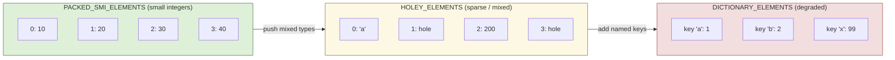
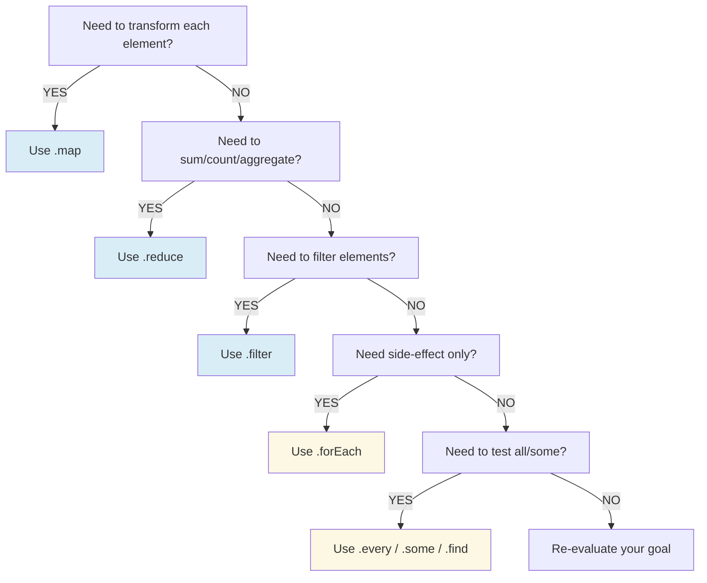
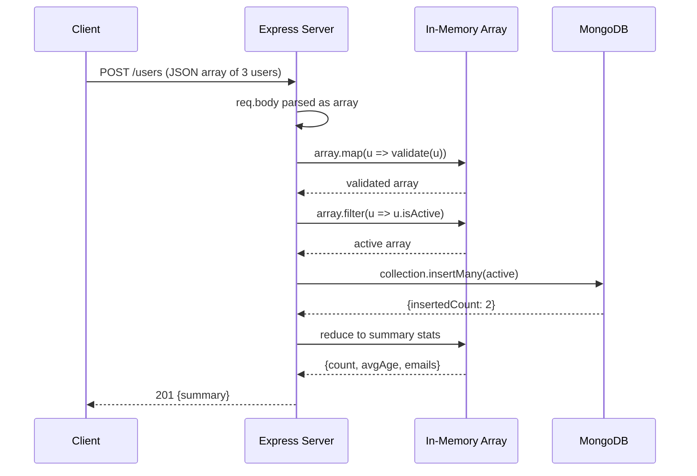
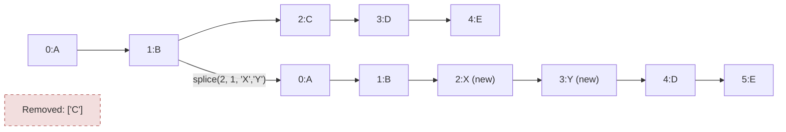

# Arrays

<!-- SECTION_1_START -->
# Arrays in JavaScript — KTU 2024 (PECST742 | Module 3)

## 1.1 Formal Definition (KTU 2024 Syllabus Terminology)

> [!NOTE]
> **Definition (Syllabus-aligned):**
> An **Array** in JavaScript is an *ordered, zero-indexed, heterogeneous collection* of values stored in a single variable, accessible via integer-indexed properties. Arrays in JavaScript are **dynamic**, **resizable**, and are technically a specialized form of the global `Array` object whose prototype provides methods for traversal, mutation, and transformation.

Key characteristics that the KTU board examiner expects you to state verbatim:

- **Ordered** → elements maintain insertion order.
- **Zero-indexed** → the first element is at index `0`.
- **Heterogeneous** → one array can hold `number`, `string`, `boolean`, `object`, `function`, even other arrays.
- **Dynamic** → length grows/shrinks at runtime; no pre-declaration of size.
- **Object-typed** → `typeof []` returns `"object"`; detected with `Array.isArray()`.

> [!IMPORTANT]
> **KTU Board Keyword:** JavaScript arrays are *not* strongly-typed, contiguous memory blocks like C/C++ arrays. They are *hash-table–backed* structures (engines like V8 optimize them into "PACKED_SMI_ELEMENTS", "PACKED_DOUBLE_ELEMENTS", "PACKED_ELEMENTS" or degrade to "DICTIONARY_ELEMENTS" / holey representations). Understanding this explains why `arr.length` is mutable and why `delete arr[0]` creates a *sparse hole*.

## 1.2 Conceptual Analogy — The "Librarian's Indexed Cabinet"

Imagine a librarian with a **single drawer cabinet** (the variable). The drawer is divided into **numbered slots** (indices: `0, 1, 2, …`). Each slot can hold **any item** — a book, a paper, a CD, a sealed envelope, or even another mini-cabinet (nested array). The librarian maintains a **master index card** (the `length` property) that always reflects the highest occupied slot `+ 1`. If you remove a slot's contents, the slot becomes an *empty placeholder* (sparse hole), and the index card still counts it until you compact the drawer.

| Real-world cabinet | JavaScript Array |
|---|---|
| Drawer cabinet | `let arr = []` |
| Slot number | `arr[0]`, `arr[1]` |
| Total slot count | `arr.length` |
| Empty slot | *sparse hole* (`undefined` when read) |
| Mini-cabinet in a slot | Nested array `arr[i][j]` |
| Master label of contents | `arr.toString()` / `arr.join()` |

## 1.3 Why Arrays Matter in Node.js Web Programming

- **HTTP Request bodies** (e.g., POST form data) are parsed into arrays/objects.
- **JSON payloads** returned by REST APIs are fundamentally arrays of objects.
- **Database query results** (MongoDB, MySQL drivers) return arrays of documents/rows.
- **Stream chunks** are pushed into arrays for buffering.

> [!TIP]
> KTU Module 3 places Arrays under the Node.js runtime context, so always frame your answers with at least one **Node.js use-case** (e.g., reading a file line-by-line into an array, processing an Express route's `req.body` array, or paginating a MongoDB cursor's array result).

---

<!-- SECTION_1_END -->

<!-- SECTION_2_START -->
# 2. Deep Theoretical Analysis & KTU High-Yield Formula Sheet

## 2.1 The Three Creation Strategies

JavaScript offers **three idiomatic ways** to instantiate an array. The KTU examiner loves asking you to differentiate them.

### (a) Array Literal — *Preferred*
```javascript
const fruits = ["Apple", "Banana", "Cherry"];
```
- **Fastest** (V8 inlines the literal as a hidden class).
- Most readable; **always use this** unless the size is truly dynamic.

### (b) `new Array()` Constructor
```javascript
const a = new Array(3);     // creates a sparse array of length 3
const b = new Array(1, 2, 3); // [1, 2, 3]
const c = new Array("hi");  // ["hi"]
```
- **Trap:** A single numeric argument is treated as `length`, not as an element. This is a frequently asked **Part A question**.

### (c) `Array.from()` / `Array.of()` (ES6+)
```javascript
const a = Array.from("hello");  // ['h','e','l','l','o']
const b = Array.of(3);          // [3]  ← fixes the "Array(3)" ambiguity
const c = Array.from({length: 5}, (_, i) => i * 2); // [0,2,4,6,8]
```

## 2.2 The `length` Property — Mutable & Quirky

`length` is **writable**:

$$
\text{arr.length} = N \quad \Longrightarrow \quad \text{truncates or pads } arr
$$

- Setting `arr.length = 2` on a 5-element array truncates to 2.
- Setting `arr.length = 10` pads with **sparse holes** (not `undefined` literally, but reads as `undefined`).
- `length` is always `highest\_index + 1` for non-sparse arrays.

## 2.3 Classification of Array Methods (Board-Favorite Table)

| Category | Mutates `this`? | Returns | KTU Examples |
|---|---|---|---|
| **Mutator** | ✅ Yes | `length` or `undefined` | `push`, `pop`, `shift`, `unshift`, `splice`, `sort`, `reverse`, `fill`, `copyWithin` |
| **Accessor** | ❌ No | New array / value / boolean | `concat`, `slice`, `indexOf`, `lastIndexOf`, `includes`, `join`, `toString` |
| **Iteration** | ❌ No* | New array / accumulator | `forEach`, `map`, `filter`, `reduce`, `reduceRight`, `every`, `some`, `find`, `findIndex`, `flat`, `flatMap` |
| **Static** | ❌ No | New array | `Array.from`, `Array.of`, `Array.isArray` |

> *`forEach`/`map`/`filter` themselves don't mutate, but the callback can.

## 2.4 KTU Formula Sheet / Cheat Sheet

> [!IMPORTANT]
> **Memorize the signatures & return semantics — these appear verbatim in 14-mark questions.**

| Method | Signature | Effect | Return |
|---|---|---|---|
| `push(...items)` | Mutator | Appends to end | New `length` |
| `pop()` | Mutator | Removes last | Removed element |
| `shift()` | Mutator | Removes first | Removed element |
| `unshift(...items)` | Mutator | Prepends to start | New `length` |
| `splice(start, deleteCount, ...items)` | Mutator | Insert/remove in-place | Array of removed |
| `slice(begin, end)` | Accessor | Shallow copy sub-range | New array |
| `concat(...arrs)` | Accessor | Merge arrays (1 level) | New array |
| `indexOf(item, from)` | Accessor | Linear search | Index or `-1` |
| `includes(item, from)` | Accessor | Membership test | `boolean` |
| `map((v,i,a)=>x)` | Iteration | Transform each | New array of `x` |
| `filter((v,i,a)=>bool)` | Iteration | Keep matches | New array |
| `reduce((acc,v,i,a)=>acc, init)` | Iteration | Accumulate | Final `acc` |
| `find((v)=>bool)` | Iteration | First match | Element or `undefined` |
| `findIndex((v)=>bool)` | Iteration | First match | Index or `-1` |
| `flat(depth=1)` | Iteration | Flatten nested | New array |
| `sort((a,b)=>n)` | Mutator | In-place sort | Same array reference |
| `reverse()` | Mutator | In-place reverse | Same array reference |

### Mathematical Identity (used in reduce-type derivations)

$$
\text{reduce without initial value: } \quad arr.reduce(f) = f(f(\ldots f(arr[0], arr[1])\ldots), arr[n-1])
$$

$$
\text{reduce with initial value } v_0: \quad arr.reduce(f, v_0) = f(f(\ldots f(f(v_0, arr[0]), arr[1])\ldots), arr[n-1])
$$

### Time Complexity (V8 general case)

| Operation | Complexity |
|---|---|
| `push` / `pop` (amortized) | $O(1)$ |
| `shift` / `unshift` | $O(n)$ (re-indexing) |
| `splice` (mid-array) | $O(n)$ |
| `indexOf` / `includes` | $O(n)$ |
| `sort` (V8 TimSort) | $O(n \log n)$ |
| `map` / `filter` | $O(n)$ |

## 2.5 Real-World Engineering Utility

- **Express.js middleware:** `app.use((req, res, next) => { ... })` — route handlers are stored in an internal `stack` array.
- **MongoDB:** `db.collection('users').find().toArray()` returns a Promise resolving to an array of BSON documents.
- **Logging frameworks:** Winston transports are arrays; each log line is pushed.
- **React/Front-end:** state arrays drive virtual-DOM diffing (`prevList`, `newList`).
- **Data pipelines:** Streams' `Readable.read()` chunks accumulated into arrays for batch processing.

---

<!-- SECTION_2_END -->

<!-- SECTION_3_START -->
# 3. Step-by-Step Derivations, Code & Symbolic Implementation

## 3.1 Exhaustive Code Walkthrough — All Core Array Operations

Below is a **fully operational, type-hinted Node.js program** demonstrating every operation a 14-mark question can demand. Run it with `node arrays_demo.js`.

```javascript
// arrays_demo.js  —  KTU PECST742 / Module 3
// Demonstrates: creation, access, mutation, iteration, search, transform, reduce, destructuring, spread.

"use strict";

// ---------- 1. Creation ----------
const literalArr: number[] = [10, 20, 30, 40, 50];
const fromString: string[] = Array.from("Kerala");        // ['K','e','r','a','l','a']
const fromFactory: number[] = Array.from({ length: 5 }, (_v, i) => (i + 1) * 10); // [10,20,30,40,50]
const ofDemo: number[] = Array.of(3);                    // [3] — NOT length-3 sparse array

// ---------- 2. Access & Length ----------
console.log("First element:", literalArr[0]);             // 10
console.log("Last element :", literalArr[literalArr.length - 1]); // 50
console.log("Length       :", literalArr.length);         // 5

// ---------- 3. Mutators (return value semantics matter) ----------
const stack: number[] = [1, 2, 3];
const newLen: number = stack.push(4, 5);                 // returns 5 (new length)
console.log("After push   :", stack, "new length =", newLen);

const popped: number | undefined = stack.pop();           // 5
console.log("After pop    :", stack, "popped =", popped);

const shifted: number | undefined = stack.shift();       // 1
console.log("After shift  :", stack, "shifted =", shifted);

stack.unshift(0);                                        // [0, 2, 3, 4]
console.log("After unshift:", stack);

// ---------- 4. splice (insert + remove) ----------
const months: string[] = ["Jan", "March", "April", "June"];
months.splice(1, 0, "Feb");          // insert "Feb" at index 1, delete 0
console.log("After insert :", months); // ["Jan","Feb","March","April","June"]
const removed: string[] = months.splice(4, 1, "May"); // replace index 4 with "May"
console.log("After replace:", months, "removed =", removed);

// ---------- 5. Accessors (non-mutating) ----------
const numbers: number[] = [1, 2, 3, 4, 5];
const sub: number[] = numbers.slice(1, 4);              // [2, 3, 4] (end exclusive)
const merged: number[] = numbers.concat([6, 7], [8, 9]);// [1..9]
const csv: string = numbers.join("-");                   // "1-2-3-4-5"

// ---------- 6. Search ----------
const idx: number = numbers.indexOf(3);                  // 2
const has4: boolean = numbers.includes(4);               // true
const firstEven: number | undefined = numbers.find(n => n % 2 === 0);  // 2
const firstEvenIdx: number = numbers.findIndex(n => n % 2 === 0);    // 1

// ---------- 7. Iteration ----------
const doubled: number[] = numbers.map(n => n * 2);                  // [2,4,6,8,10]
const evens: number[] = numbers.filter(n => n % 2 === 0);          // [2,4]
const sum: number = numbers.reduce((acc, n) => acc + n, 0);         // 15
const product: number = numbers.reduce((acc, n) => acc * n, 1);     // 120
const allPositive: boolean = numbers.every(n => n > 0);             // true
const anyGT4: boolean = numbers.some(n => n > 4);                   // true

// ---------- 8. Flattening ----------
const nested: any[] = [1, [2, 3], [[4, 5], 6]];
console.log("flat(1):", nested.flat(1));    // [1, 2, 3, [4,5], 6]
console.log("flat(Infinity):", nested.flat(Infinity)); // [1,2,3,4,5,6]

// ---------- 9. Destructuring + Spread (ES6) ----------
const [head, second, ...rest] = numbers;
console.log(head, second, rest);            // 1 2 [3,4,5]

const cloned: number[] = [...numbers];      // shallow copy
const combined: number[] = [...numbers, ...doubled]; // [1,2,3,4,5,2,4,6,8,10]

// ---------- 10. Sorting ----------
const unsorted: number[] = [10, 2, 33, 4, 5];
unsorted.sort((a, b) => a - b);   // numeric ascending
console.log("Sorted:", unsorted); // [2,4,5,10,33]
unsorted.sort((a, b) => b - a);   // numeric descending
console.log("Desc  :", unsorted); // [33,10,5,4,2]
```

### Line-by-Line Logic (Exam-Worthy Explanations)

- **Line `Array.from({length: 5}, (_, i) => ...)`:** First arg is an *array-like* (iterable or `{length}`); second arg is a *map function* invoked for every index. Cleaner than `new Array(5).fill(0).map(...)`.
- **`splice(1, 0, "Feb")`:** Three-arg splice ⇒ start index, delete-count=0 (no deletion), item to insert.
- **`numbers.reduce((acc, n) => acc + n, 0)`:** `0` is the *seed*. Without the seed, the first element becomes the seed and the callback runs $n-1$ times (which fails on empty arrays).
- **`numbers.sort((a,b)=>a-b)`:** Default `sort()` coerces to **strings** → `[10, 2, 33, 4, 5].sort()` gives `["10","2","33","4","5"]` lexicographically. Always supply a comparator for numerics.

## 3.2 Derivations for Common KTU Reduce-Questions

### Derivation 1 — Sum of array using `reduce`

$$
\begin{aligned}
\text{sum}(arr) &= arr.\text{reduce}((acc, v) \mapsto acc + v,\ 0) \\[4pt]
\text{step-by-step: } acc_0 &= 0 \\
acc_1 &= 0 + arr[0] \\
acc_2 &= (0 + arr[0]) + arr[1] \\
\vdots \\
acc_n &= \sum_{i=0}^{n-1} arr[i]
\end{aligned}
$$

### Derivation 2 — Flatten 1 level using `reduce` + `concat`

$$
\text{flat1}(arr) = arr.\text{reduce}((acc, v) \mapsto acc.\text{concat}(v),\ [])
$$

For `arr = [1, [2, 3], [4, [5, 6]]]`:

$$
\begin{aligned}
acc_0 &= [] \\
acc_1 &= [].\text{concat}(1) = [1] \\
acc_2 &= [1].\text{concat}([2,3]) = [1,2,3] \\
acc_3 &= [1,2,3].\text{concat}([4,[5,6]]) = [1,2,3,4,[5,6]]
\end{aligned}
$$

To flatten fully, use `flat(Infinity)` or compose:

$$
\text{flatDeep}(arr) = \text{arr.flatMap}(v \mapsto \text{Array.isArray}(v) \ ?\ \text{flatDeep}(v)\ :\ [v])
$$

### Derivation 3 — Group-by using `reduce`

Group numbers into even/odd buckets:

```javascript
function groupByParity(nums: number[]): { even: number[]; odd: number[] } {
  return nums.reduce<{ even: number[]; odd: number[] }>(
    (acc, v) => {
      const key: "even" | "odd" = v % 2 === 0 ? "even" : "odd";
      acc[key].push(v);
      return acc;
    },
    { even: [], odd: [] }
  );
}
console.log(groupByParity([1, 2, 3, 4, 5]));
// { even: [2, 4], odd: [1, 3, 5] }
```

## 3.3 Sparse Arrays & Holes — A Subtle Concept

```javascript
const s: number[] = [1, 2, 3, 4, 5];
delete s[2];
console.log(s);          // [1, 2, <1 empty item>, 4, 5]
console.log(s.length);   // 5  — length DOES NOT shrink on delete
console.log(2 in s);     // false — index 2 is missing
console.log(s[2]);       // undefined (reads as undefined but is actually a hole)
s.length = 3;            // truncates
console.log(s);          // [1, 2, <1 empty item>]
```

> [!WARNING]
> KTU Pitfall: `delete arr[i]` does **not** re-index. Use `arr.splice(i, 1)` for true removal.

## 3.4 Node.js Context — File-System Array Buffer

A canonical Module-3 use-case showing arrays in a Node.js HTTP server:

```javascript
// server.js
import http from "node:http";
import fs from "node:fs/promises";

const server = http.createServer(async (req, res) => {
  try {
    const data: Buffer = await fs.readFile("data.txt", "utf8");
    const lines: string[] = data.split("\n");          // Array of lines
    const wordCounts: number[] = lines.map(line => line.trim().split(/\s+/).length);
    const totalWords: number = wordCounts.reduce((a, b) => a + b, 0);
    res.writeHead(200, { "Content-Type": "application/json" });
    res.end(JSON.stringify({ lineCount: lines.length, totalWords }));
  } catch (err) {
    res.writeHead(500);
    res.end(JSON.stringify({ error: (err as Error).message }));
  }
});

server.listen(3000, () => console.log("Server on :3000"));
```

---

<!-- SECTION_3_END -->

<!-- SECTION_4_START -->
# 4. Structural Diagrams & Schematics

## 4.1 Mermaid — Array Memory Layout (PACKED vs HOLEY)



## 4.2 Mermaid — `map` vs `forEach` Decision Flow



## 4.3 Mermaid — HTTP Request Array Processing Pipeline (Node.js)



## 4.4 Mermaid — `splice` Insert/Delete Operation



## 4.5 Tabular Topology — `reduce` Pipeline Stages

| Stage | Operation | Input → Output Example |
|---|---|---|
| 1. Initial seed | `init` value | `0` (sum), `[]` (collect), `{}` (group) |
| 2. Read element | `arr[i]` | `arr[0], arr[1], ...` |
| 3. Transform | callback | `acc + v`, `acc.concat([v])` |
| 4. Carry forward | new `acc` | assigned for next iteration |
| 5. Terminate | last callback returns final | `acc` returned by `reduce` |

---

<!-- SECTION_4_END -->

<!-- SECTION_5_START -->
# 5. KTU 2024 Scheme Examination Question Bank

## 5.1 Part A — Short Answer Questions (3 Marks each)

### Q1. `[KTU University Exam – July 2024 | CO1 | Remember]`
**Differentiate between `Array.from()` and `Array.of()` with suitable examples.**

**Model Answer (3 marks):**

- `Array.from(arrayLike, mapFn?)` creates a new array from an **iterable or array-like object** (string, `Set`, `Map`, `{length:n}`) and optionally applies a mapping function. (1 mark)
- `Array.of(...items)` creates a new array from the **arguments passed**, regardless of type or count. (1 mark)
- Key difference: `Array.from("ab")` → `['a','b']` (iterates the string), while `Array.of("ab")` → `["ab"]` (treats "ab" as a single element). `Array.of(3)` → `[3]`, whereas `Array(3)` → sparse array of length 3. (1 mark)

```javascript
console.log(Array.from("ab"));   // ['a','b']
console.log(Array.of("ab"));     // ['ab']
console.log(Array.of(3));        // [3]
console.log(Array(3));           // [<3 empty items>]
```

### Q2. `[KTU University Exam – Dec 2023 | CO1 | Understand]`
**Explain with an example the difference between mutator and accessor methods in JavaScript arrays.**

**Model Answer (3 marks):**

- **Mutator methods** modify the original array in place and typically return `undefined` or the new length. (1 mark)
- **Accessor methods** do NOT modify the original array; they return a new array or a primitive value. (1 mark)
- Example:

```javascript
const a = [3, 1, 2];
a.sort((x,y)=>x-y);          // mutator — a becomes [1,2,3]
const b = a.slice(1);         // accessor — b is [2,3], a unchanged
```

(1 mark for the example demonstrating both categories.)

---

## 5.2 Part B — Full 14-Mark Questions (Module-Internal Choice)

### Question A (14 Marks) — `[KTU University Exam – Dec 2024 Model | CO1, CO2 | Understand + Apply]`

**(a)** With neat examples, explain the various ways of creating arrays in JavaScript. Discuss why `new Array(3)` and `new Array(1,2,3)` behave differently. **(7 marks)**

**(b)** Write a Node.js script that reads a comma-separated string of integers from a file `nums.txt`, splits it into an array, filters out negative numbers, doubles every remaining value using `map`, computes the **sum** and **product** using `reduce`, and prints the result. **(7 marks)**

---

#### Model Solution — Part (a) [7 marks]

Three creation methods: **(2 marks)**

1. **Array literal:** `const arr = [1, 2, 3];` — most efficient and readable.
2. **`new Array()` constructor:**
   - `new Array(3)` → sparse array of length 3 (single numeric argument treated as length). **(2 marks for explaining the quirk)**
   - `new Array(1, 2, 3)` → `[1, 2, 3]` (multi-arg or non-numeric ⇒ elements).
3. **`Array.from()` / `Array.of()`:** iterable or factory construction; `Array.of(3)` fixes the ambiguity. **(1 mark)**
4. **Spread + iterables:** `const a = [...'abc'];` → `['a','b','c']`. **(1 mark)**
5. **From `Set` / `Map`:** `Array.from(new Set([1,1,2]))` → `[1,2]`. **(1 mark)**

---

#### Model Solution — Part (b) [7 marks]

`nums.txt` contains: `-3,5,7,-2,10,0,4`

```javascript
// array_ops.js
import fs from "node:fs/promises";

interface Stats { sum: number; product: number; count: number; processed: number[] }

async function processNumbers(): Promise<void> {
  try {
    const raw: string = await fs.readFile("nums.txt", "utf8");
    const tokens: string[] = raw.split(",").map(s => s.trim());
    const nums: number[] = tokens.map(Number);                          // [-3, 5, 7, -2, 10, 0, 4]

    const positive: number[] = nums.filter(n => n > 0);                  // [5, 7, 10, 4]  (1 mark)
    const doubled: number[] = positive.map(n => n * 2);                 // [10, 14, 20, 8] (1 mark)

    const sum: number = doubled.reduce((acc, v) => acc + v, 0);         // 52  (2 marks: [reduce: 1, seed: 1])
    const product: number = doubled.reduce((acc, v) => acc * v, 1);     // 22400  (2 marks)

    const stats: Stats = { sum, product, count: doubled.length, processed: doubled };
    console.log(JSON.stringify(stats, null, 2));
  } catch (err) {
    console.error("Error:", (err as Error).message);                     // (1 mark: error handling)
  }
}
processNumbers();
```

**Output:**
```json
{
  "sum": 52,
  "product": 22400,
  "count": 4,
  "processed": [10, 14, 20, 8]
}
```

**Valuation key:**
- [File read & split: 1 Mark]
- [Filter negatives correctly: 1 Mark]
- [Map doubling: 1 Mark]
- [Reduce sum with seed: 1 Mark]
- [Reduce product with seed: 1 Mark]
- [Error handling try/catch: 1 Mark]
- [Output formatting: 1 Mark]

---

### Question B (14 Marks) — `[KTU University Exam – July 2024 Model | CO2, CO3 | Apply + Analyze]`

**(a)** Explain the working of `Array.prototype.reduce()` with a suitable example. Show step-by-step how `['a','b','c','d'].reduce((acc, v) => acc + v, '')` executes. **(7 marks)**

**(b)** Implement an Express route `POST /stats` that accepts a JSON array of student objects `{name, marks[]}`, computes each student's **average**, the **class average**, the **topper**, and returns the consolidated JSON. Use `map`, `filter`, `reduce`, and `find` appropriately. **(7 marks)**

---

#### Model Solution — Part (a) [7 marks]

`reduce()` executes a **reducer callback** against an **accumulator** and each element of the array, ultimately reducing the array to a **single value**. **(1 mark)**

Signature: `arr.reduce((accumulator, currentValue, currentIndex, array) => newAcc, initialValue)` **(1 mark)**

Step-by-step for `['a','b','c','d'].reduce((acc, v) => acc + v, '')`:

| Step | `acc` (in) | `v` | `acc + v` (out) | Comment |
|---|---|---|---|---|
| 0 | `''` | — | `''` | initial seed (1 mark) |
| 1 | `''` | `'a'` | `'a'` | (1 mark) |
| 2 | `'a'` | `'b'` | `'ab'` | (1 mark) |
| 3 | `'ab'` | `'c'` | `'abc'` | (1 mark) |
| 4 | `'abc'` | `'d'` | `'abcd'` | (1 mark) |

Final returned value: `'abcd'`. **(1 mark for final result)**

Note: Without the seed `''`, the first call would be `acc='a', v='b'` and the result would still be `'abcd'`, but the seed makes the behavior explicit and works on empty arrays. **(1 mark for note on seed omission)**

---

#### Model Solution — Part (b) [7 marks]

```javascript
// stats_server.js
import express from "express";
const app = express();
app.use(express.json());

interface Student { name: string; marks: number[] }
interface ClassReport {
  perStudent: { name: string; average: number }[];
  classAverage: number;
  topper: { name: string; average: number } | null;
}

app.post("/stats", (req, res) => {
  const students: Student[] = req.body;
  if (!Array.isArray(students) || students.length === 0) {
    return res.status(400).json({ error: "Expected non-empty array of students" });
  }

  // (a) per-student average using map        — 2 marks
  const perStudent = students.map(s => ({
    name: s.name,
    average: s.marks.reduce((a, m) => a + m, 0) / s.marks.length
  }));

  // (b) class average using reduce           — 2 marks
  const classAverage = perStudent.reduce((acc, s) => acc + s.average, 0) / perStudent.length;

  // (c) topper using reduce + comparison     — 2 marks
  const topper = perStudent.reduce((best, s) => (best === null || s.average > best.average) ? s : best, null);

  // (d) find a failing student using filter+find — 1 mark (optional filter demonstration)
  const failingNames = students
    .filter(s => s.marks.reduce((a, m) => a + m, 0) / s.marks.length < 50)
    .map(s => s.name);

  const report: ClassReport = { perStudent, classAverage, topper };
  res.json({ ...report, failingNames });
});

app.listen(3000, () => console.log("Stats API on :3000"));
```

**Sample request body:**
```json
[
  { "name": "Anu",  "marks": [80, 90, 85] },
  { "name": "Ben",  "marks": [40, 55, 60] },
  { "name": "Cathy","marks": [95, 92, 98] }
]
```

**Sample response:**
```json
{
  "perStudent": [
    { "name": "Anu",   "average": 85 },
    { "name": "Ben",   "average": 51.67 },
    { "name": "Cathy", "average": 95 }
  ],
  "classAverage": 77.22,
  "topper": { "name": "Cathy", "average": 95 },
  "failingNames": []
}
```

**Valuation key (Part b):**
- [Express setup & JSON middleware: 1 Mark]
- [Array.isArray validation: 1 Mark]
- [Map for per-student average: 1 Mark]
- [Reduce for class average: 1 Mark]
- [Reduce for topper identification: 1 Mark]
- [Filter+find for failing students: 1 Mark]
- [JSON response structure: 1 Mark]

> [!WARNING]
> **KTU Examiner's Valuation Warning — Common Pitfalls**
> 1. **Forgetting the seed value `0` in `reduce`** for sum/product → `TypeError: Reduce of empty array with no initial value`. Always pass an initial value. **[−2 marks]**
> 2. **Using `arr.sort()` on numbers without a comparator** → produces lexicographic sort (`[10, 2, 33]`). Examiner deducts 1 mark.
> 3. **Confusing `splice` and `slice`** — `splice` mutates, `slice` doesn't. Misnaming costs 1 mark.
> 4. **Writing `arr.length` on the LHS to "resize" without stating it pads with holes** — at least one sentence must mention that `length` is *writable* and padding creates sparse holes. **[-1 mark]**
> 5. **Omitting `Array.isArray()` check** when a function expects an array — KTU penalises missing type-validation. **[-1 mark]**
> 6. **Not showing step-by-step reduce trace** in derivations — examiners give 1 mark explicitly for the trace table.

---

## 5.3 Topic Recap & Important Things to Remember

> [!IMPORTANT]
> **Rapid-Revision Checklist for Arrays in JavaScript (Module 3, PECST742)**

- **Definition:** Ordered, zero-indexed, heterogeneous, dynamic collection; technically an `Array` object.
- **Three creation styles:** literal `[]`, `new Array()`, `Array.from()` / `Array.of()`. **Always prefer literal.**
- **`new Array(n)` vs `new Array(a,b,c)`:** single number ⇒ length (sparse); multiple args ⇒ elements.
- **`length` is writable:** setting it truncates or creates sparse holes; deleting an element does **not** shrink length.
- **Mutators** (in-place, return `length`/`undefined`): `push`, `pop`, `shift`, `unshift`, `splice`, `sort`, `reverse`, `fill`, `copyWithin`.
- **Accessors** (non-mutating, return new array/value): `concat`, `slice`, `indexOf`, `includes`, `join`, `toString`.
- **Iterators** (non-mutating, return new array or accumulator): `map`, `filter`, `reduce`, `forEach`, `every`, `some`, `find`, `findIndex`, `flat`, `flatMap`.
- **`sort()` default = lexicographic on stringified values;** always supply `(a,b)=>a-b` for numeric arrays.
- **`reduce` requires an initial value** for empty arrays and clarity; trace the accumulator step-by-step in exam answers.
- **`splice(start, deleteCount, ...items)`** is the only true insert/remove mutator; `delete arr[i]` creates holes.
- **Spread `...arr`** and **destructuring `[a, b, ...rest]`** are ES6 essentials; use them for shallow cloning.
- **Node.js use-cases:** buffer file lines into arrays, process Express `req.body` arrays, aggregate MongoDB `find().toArray()` results.
- **Type detection:** `typeof [] === 'object'`; use `Array.isArray(x)` to confirm array-ness.
- **Time complexity quick reference:** `push/pop` $O(1)$, `shift/unshift/splice` $O(n)$, `sort` $O(n \log n)$, search $O(n)$.
- **V8 representation hint (bonus):** engines switch between `PACKED_SMI`, `PACKED_DOUBLE`, `PACKED_ELEMENTS`, `HOLEY_*`, and `DICTIONARY_ELEMENTS` based on usage — holes and mixed types trigger slowdowns.
- **Always include error handling** (`try/catch` in Node.js, `Array.isArray` validation, `.length` checks) to earn full KTU marks.

---

<!-- SECTION_5_END -->
