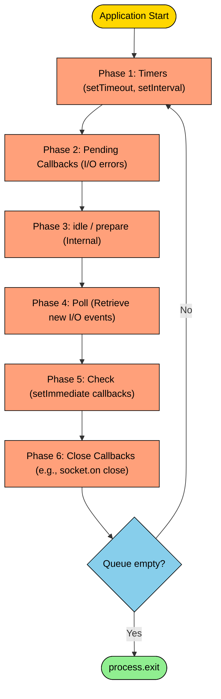
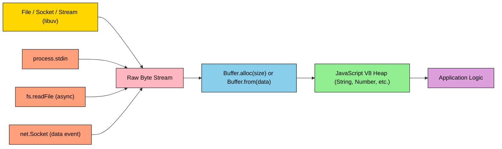
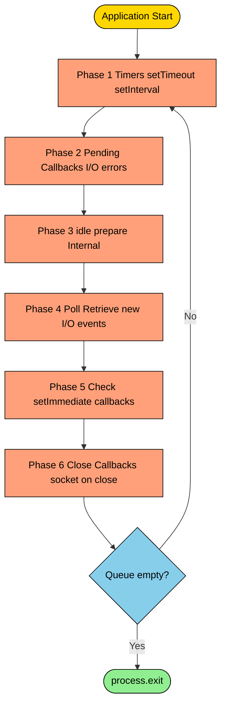
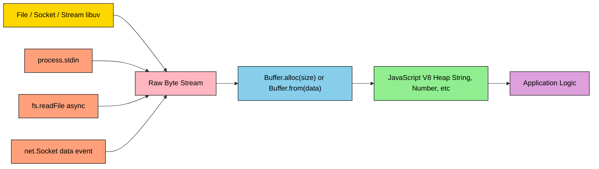

```mermaid
graph TD
    subgraph "Node.js Runtime Process"
        V8["V8 JavaScript Engine"]
        LIBUV["libuv C++ Library (Async I/O)"]
    end

    subgraph "Global Objects (No require needed)"
        GLOB_PROC["process"]
        GLOB_CONS["console"]
        GLOB_DIR["__dirname / __filename"]
        GLOB_BUF["Buffer"]
        GLOB_TIM["setTimeout / setInterval / setImmediate"]
        GLOB_MOD["module / exports / require"]
    end

    subgraph "Core Modules (require needed)"
        MOD_FS["fs (File System)"]
        MOD_HTTP["http (Networking)"]
        MOD_PATH["path (Path Handling)"]
        MOD_OS["os (Operating System Info)"]
        MOD_URL["url (URL Parsing)"]
        MOD_EVT["events (EventEmitter)"]
        MOD_STR["stream (Data Streaming)"]
        MOD_UTIL["util (Utilities)"]
        MOD_QS["querystring (Query Parsing)"]
    end

    V8 --- GLOB_PROC
    V8 --- GLOB_CONS
    V8 --- GLOB_DIR
    V8 --- GLOB_BUF
    V8 --- GLOB_TIM
    V8 --- GLOB_MOD

    V8 --> MOD_FS
    V8 --> MOD_HTTP
    V8 --> MOD_PATH
    V8 --> MOD_OS
    V8 --> MOD_URL
    V8 --> MOD_EVT
    V8 --> MOD_STR
    V8 --> MOD_UTIL
    V8 --> MOD_QS

    MOD_FS --> LIBUV
    MOD_HTTP --> LIBUV
    MOD_STR --> LIBUV
    MOD_EVT --> LIBUV

    style V8 fill:#FFD700,stroke:#000000,color:#000000
    style LIBUV fill:#87CEEB,stroke:#000000,color:#000000
    style GLOB_PROC fill:#90EE90,stroke:#000000,color:#000000
    style GLOB_CONS fill:#90EE90,stroke:#000000,color:#000000
    style GLOB_DIR fill:#90EE90,stroke:#000000,color:#000000
    style GLOB_BUF fill:#90EE90,stroke:#000000,color:#000000
    style GLOB_TIM fill:#90EE90,stroke:#000000,color:#000000
    style GLOB_MOD fill:#90EE90,stroke:#000000,color:#000000
    style MOD_FS fill:#FFB6C1,stroke:#000000,color:#000000
    style MOD_HTTP fill:#FFB6C1,stroke:#000000,color:#000000
    style MOD_PATH fill:#FFB6C1,stroke:#000000,color:#000000
    style MOD_OS fill:#FFB6C1,stroke:#000000,color:#000000
    style MOD_URL fill:#FFB6C1,stroke:#000000,color:#000000
    style MOD_EVT fill:#FFB6C1,stroke:#000000,color:#000000
    style MOD_STR fill:#FFB6C1,stroke:#000000,color:#000000
    style MOD_UTIL fill:#FFB6C1,stroke:#000000,color:#000000
    style MOD_QS fill:#FFB6C1,stroke:#000000,color:#000000
```

```mermaid
graph TD
    subgraph "Node.js Runtime Process"
        V8["V8 JavaScript Engine"]
        LIBUV["libuv C++ Library Async I/O"]
    end

    subgraph "Global Objects No require needed"
        GLOB_PROC["process"]
        GLOB_CONS["console"]
        GLOB_DIR["__dirname and __filename"]
        GLOB_BUF["Buffer"]
        GLOB_TIM["setTimeout and setInterval and setImmediate"]
        GLOB_MOD["module and exports and require"]
    end

    subgraph "Core Modules require needed"
        MOD_FS["fs File System"]
        MOD_HTTP["http Networking"]
        MOD_PATH["path Path Handling"]
        MOD_OS["os Operating System Info"]
        MOD_URL["url URL Parsing"]
        MOD_EVT["events EventEmitter"]
        MOD_STR["stream Data Streaming"]
        MOD_UTIL["util Utilities"]
        MOD_QS["querystring Query Parsing"]
    end

    V8 --- GLOB_PROC
    V8 --- GLOB_CONS
    V8 --- GLOB_DIR
    V8 --- GLOB_BUF
    V8 --- GLOB_TIM
    V8 --- GLOB_MOD

    V8 --> MOD_FS
    V8 --> MOD_HTTP
    V8 --> MOD_PATH
    V8 --> MOD_OS
    V8 --> MOD_URL
    V8 --> MOD_EVT
    V8 --> MOD_STR
    V8 --> MOD_UTIL
    V8 --> MOD_QS

    MOD_FS --> LIBUV
    MOD_HTTP --> LIBUV
    MOD_STR --> LIBUV
    MOD_EVT --> LIBUV

    style V8 fill:#FFD700,stroke:#000000,color:#000000
    style LIBUV fill:#87CEEB,stroke:#000000,color:#000000
    style GLOB_PROC fill:#90EE90,stroke:#000000,color:#000000
    style GLOB_CONS fill:#90EE90,stroke:#000000,color:#000000
    style GLOB_DIR fill:#90EE90,stroke:#000000,color:#000000
    style GLOB_BUF fill:#90EE90,stroke:#000000,color:#000000
    style GLOB_TIM fill:#90EE90,stroke:#000000,color:#000000
    style GLOB_MOD fill:#90EE90,stroke:#000000,color:#000000
    style MOD_FS fill:#FFB6C1,stroke:#000000,color:#000000
    style MOD_HTTP fill:#FFB6C1,stroke:#000000,color:#000000
    style MOD_PATH fill:#FFB6C1,stroke:#000000,color:#000000
    style MOD_OS fill:#FFB6C1,stroke:#000000,color:#000000
    style MOD_URL fill:#FFB6C1,stroke:#000000,color:#000000
    style MOD_EVT fill:#FFB6C1,stroke:#000000,color:#000000
    style MOD_STR fill:#FFB6C1,stroke:#000000,color:#000000
    style MOD_UTIL fill:#FFB6C1,stroke:#000000,color:#000000
    style MOD_QS fill:#FFB6C1,stroke:#000000,color:#000000
```

# Built- in components

<!-- SECTION_1_START -->

# Built-in Components of Node.js Runtime Environment

## 1.1 Formal Definition (KTU 2024 Syllabus Terminology)

> [!NOTE]
> **Built-in Components** in the Node.js runtime environment refer to the *pre-compiled, native modules and global objects* that are bundled within the Node.js binary itself. They are loaded into memory at process start-up and made available to the JavaScript engine (V8) without requiring any external `npm install`. According to the KTU 2024 Web Programming (PECST742) syllabus, these components form the *Core API Layer* of Node.js.

The two primary categories of built-in components are:

1. **Global Objects / Globals** — Accessible from any module without an explicit `require()` call. Examples: `global`, `process`, `console`, `Buffer`, `__dirname`, `__filename`, `module`, `exports`, `setTimeout()`, `setInterval()`, `setImmediate()`.
2. **Core Modules** — Compiled native libraries exposed to JavaScript through the `require()` function. The KTU Module 3 syllabus explicitly highlights: `fs`, `path`, `os`, `http`, `url`, `events`, `util`, `querystring`, and `stream`.

## 1.2 Conceptual Analogy / Intuition

Imagine you just moved into a **fully furnished serviced apartment** (this is your Node.js application). 

* The **furniture, plumbing, and electrical wiring** that came pre-installed with the apartment are the **Built-in Components**. You do not need to call a carpenter or electrician to use them — you simply turn on the tap or flip a switch.
* The **Global Objects** are like the apartment's *shared utilities* (lobby lights, building address, elevator). Every room (every file/module) can access them.
* The **Core Modules** (like `fs`, `http`) are like specific utility systems — the *water system* (`fs` for files), the *mailing system* (`http` for network). You "import" them with `require()` only when you need them, keeping your room tidy.

> [!IMPORTANT]
> **Key Distinction for Exams:** Globals do **not** need `require()`. Core Modules **do** need `require('moduleName')`. This is a frequently asked 3-mark question in KTU ESE.

## 1.3 Physical Constants & Standard Metrics

> [!IMPORTANT]
> Node.js Built-in components adhere to:
> * **Default Event Loop Iterations:** Infinite (event-driven, non-blocking).
> * **Standard Process Stack Size:** **8 MB** (on 64-bit systems), but configurable via `--stack-size`.
> * **Default HTTP Port Range:** **0 – 65535** (Registered ports: **1024 – 49151**).
> * **Default Timer Granularity in `setTimeout`:** **1 ms** (minimum).

## 1.4 GeoGebra / Desmos Visualization

> [!VISUALIZATION CONTROL]
> **Concept:** Non-Blocking I/O vs Blocking I/O Timeline (Event Loop Visualization)
> **GeoGebra / Desmos Input Equations:**
> * `f(x) = step(0, 1) + step(3, 1) - step(5, 1)` (Blocking I/O cumulative time)
> * `g(x) = 0.5 * x` (Non-Blocking parallel task progression)
> **Visual Description:** A coordinate plane where the X-axis represents Time (in ms) and the Y-axis represents Task Progress. The step function `f(x)` illustrates how synchronous built-in functions (like `fs.readFileSync`) freeze execution, while `g(x)` shows how asynchronous built-in APIs (like `fs.readFile`) allow the event loop to interleave other tasks — this is the foundational behavior of Node.js built-in components.

---

<!-- SECTION_1_END -->

<!-- SECTION_2_START -->

# Deep Theoretical Analysis & KTU High-Yield Formula Sheet

## 2.1 Categorical Breakdown of Built-in Components

### A. Global Objects (No `require` needed)

| Global Object | Purpose | KTU Board Significance |
|---|---|---|
| `global` | The namespace object (similar to `window` in browsers) | Rarely used directly, but important conceptually |
| `process` | Provides info/control over the current Node.js process | High — questions on `process.argv`, `process.env` are common |
| `console` | Standard output (`stdout`), error (`stderr`) channels | Used in debugging |
| `__dirname` | Absolute path of the **directory** containing the current file | Frequently tested |
| `__filename` | Absolute path of the **current file** including filename | Frequently tested |
| `Buffer` | Raw binary data handler (fixed-size, outside V8 heap) | High — questions on encoding, allocation |
| `module` / `exports` | References to the current module's exports object | Foundation of CommonJS |
| `setTimeout()` / `setInterval()` / `setImmediate()` | Timer functions based on the event loop | Tested under asynchronous behavior |
| `clearTimeout()` / `clearInterval()` | Cancels active timers | Paired with timer functions |

### B. Core Modules (Require based)

| Core Module | Purpose | Key Methods / Properties |
|---|---|---|
| `fs` | File System operations | `readFile`, `writeFile`, `readFileSync`, `mkdir`, `unlink`, `readdir` |
| `path` | Handles and transforms file paths | `join`, `resolve`, `basename`, `extname`, `dirname` |
| `os` | Operating System information | `platform`, `arch`, `cpus`, `hostname`, `totalmem`, `freemem` |
| `http` | Creates HTTP servers and clients | `createServer`, `request`, `get`, IncomingMessage, ServerResponse |
| `url` | URL parsing and formatting | `parse`, `format`, `URL` class (WHATWG) |
| `events` | Asynchronous event handling | `EventEmitter` class, `on`, `emit`, `once` |
| `util` | Utility functions | `util.promisify`, `util.inherits`, `util.inspect` |
| `querystring` | Parses URL query strings | `parse`, `stringify`, `escape`, `unescape` |
| `stream` | Handles streaming data | `Readable`, `Writable`, `Transform`, `pipeline` |

## 2.2 KTU Formula Sheet / Cheat Sheet

> [!NOTE]
> The following table summarizes the key signatures, equations, and behavioral rules you must memorize for KTU ESE Module 3.

| Concept | Signature / Equation | Notes |
|---|---|---|
| Importing a core module | `const fs = require('fs');` | Synchronous, cached after first load |
| Importing a global | `process.argv` | No require needed |
| `__dirname` value | `path.dirname(__filename)` | Always absolute |
| Buffer allocation | `Buffer.alloc(size)` | Initializes with zeros; safer than `Buffer.allocUnsafe()` |
| Buffer from string | `Buffer.from('Hello', 'utf8')` | Default encoding: **utf8** |
| HTTP request event | `server.on('request', (req, res) => {...})` | Event-driven architecture |
| Event Emitter | `emitter.on('eventName', listener)` | Listeners invoked synchronously in order of registration |
| Path joining | `path.join('/a', 'b', 'c.txt')` → `/a/b/c.txt` | OS-agnostic separator |
| `setTimeout` delay | $\Delta t_{min} = 1 \text{ ms}$ | Minimum delay guaranteed by the event loop |
| Event Loop Phase Order | `Timers → Pending Callbacks → Idle/Prepare → Poll → Check → Close Callbacks` | Critical for async debugging |
| Process exit code | `process.exit(code)` | `0` = success, non-zero = error |
| `process.argv[0]` | Path to the **node** executable | Always present |
| `process.argv[1]` | Path to the **script being executed** | Always present |
| `process.argv[2..]` | Additional command-line arguments | User-supplied |

## 2.3 Real-World Engineering Utility

> [!IMPORTANT]
> **Where these built-in components are used in production:**
> * **Netflix** uses Node.js `http` and `stream` modules to handle over **5 billion** daily API requests with low latency.
> * **PayPal** uses `process` and `os` modules to perform health checks and horizontal scaling decisions.
> * **NASA** uses Node.js to consolidate legacy mission data using `fs` and `stream` for handling terabyte-scale telemetry.
> * **LinkedIn** built its mobile API backend on Node.js, leveraging the non-blocking I/O model of core modules to serve **millions of concurrent connections**.

The pattern is clear: built-in components are the *first choice* in production because they are **zero-dependency**, **maintained by the Node.js core team**, and **performance-optimized in C++** under the hood.

---

<!-- SECTION_2_END -->

<!-- SECTION_3_START -->

# Step-by-Step Derivations & Code/Symbolic Implementation

## 3.1 Working with `process` and `__dirname` (Global Objects)

The `process` object is a global instance of `EventEmitter` that provides data about, and control over, the current Node.js process. Let us derive the typical use case step-by-step.

```javascript
// process_demo.js
// Demonstrates the 'process' global object and __dirname.

interface ProcessInfo {
  nodeVersion: string;
  platform: NodeJS.Platform;
  scriptArgs: string[];
  directoryName: string;
  fileName: string;
  memoryUsage: NodeJS.MemoryUsage;
}

function gatherProcessInfo(): ProcessInfo {
  // Step 1: Capture Node.js runtime version
  const nodeVersion: string = process.version;

  // Step 2: Capture OS platform (win32, linux, darwin, etc.)
  const platform: NodeJS.Platform = process.platform;

  // Step 3: Access command-line arguments.
  // process.argv[0] = node executable path
  // process.argv[1] = path to this script
  // process.argv[2..] = user-supplied arguments
  const scriptArgs: string[] = process.argv.slice(2);

  // Step 4: __dirname is the absolute directory of THIS file.
  const directoryName: string = __dirname;

  // Step 5: __filename is the absolute path of THIS file.
  const fileName: string = __filename;

  // Step 6: Capture memory statistics (RSS, heap, external).
  const memoryUsage: NodeJS.MemoryUsage = process.memoryUsage();

  return {
    nodeVersion,
    platform,
    scriptArgs,
    directoryName,
    fileName,
    memoryUsage,
  };
}

// Step 7: Log the structured information
try {
  const info: ProcessInfo = gatherProcessInfo();
  console.log("=== Node.js Process Information ===");
  console.log(`Node Version : ${info.nodeVersion}`);
  console.log(`Platform     : ${info.platform}`);
  console.log(`Directory    : ${info.directoryName}`);
  console.log(`File         : ${info.fileName}`);
  console.log(`Script Args  : ${JSON.stringify(info.scriptArgs)}`);
  console.log(`Memory (RSS) : ${info.memoryUsage.rss} bytes`);
} catch (error: unknown) {
  // Step 8: Robust error logging
  if (error instanceof Error) {
    console.error(`[ERROR] ${error.message}`);
    process.exit(1); // Non-zero exit code signals failure
  }
}
```

### Conversion Logic Explained

* **Step 1–2** show that `process` is a singleton — calling `process.version` and `process.platform` is a direct property access, no `require()`.
* **Step 3** demonstrates `process.argv.slice(2)` which is the **standard pattern** to extract *only* user-supplied arguments.
* **Step 6** returns a `MemoryUsage` object containing `rss` (Resident Set Size), `heapTotal`, `heapUsed`, and `external`.
* **Step 7–8** show defensive programming with `instanceof Error` and a proper non-zero exit code.

## 3.2 Working with the `fs` Core Module

The `fs` module enables interaction with the file system. We will demonstrate the **asynchronous (non-blocking)** pattern, which is the idiomatic Node.js approach.

```javascript
// fs_demo.js
import * as fs from 'fs';
import * as path from 'path';

// Step 1: Define absolute path to a target file
const targetFile: string = path.join(__dirname, 'sample.txt');

interface FileReadResult {
  status: 'success' | 'error';
  content?: string;
  errorMessage?: string;
}

// Step 2: Async read using callback API
function readFileAsync(filePath: string): Promise<FileReadResult> {
  return new Promise<FileReadResult>((resolve) => {
    // Absolute boundary check: ensure filePath is a string and non-empty
    if (typeof filePath !== 'string' || filePath.length === 0) {
      resolve({ status: 'error', errorMessage: 'Invalid file path' });
      return;
    }

    fs.readFile(filePath, 'utf8', (err: NodeJS.ErrnoException | null, data: string) => {
      if (err) {
        // ENOENT = No such file or directory
        console.error(`[FS_ERROR] ${err.code} : ${err.message}`);
        resolve({ status: 'error', errorMessage: err.message });
        return;
      }
      resolve({ status: 'success', content: data });
    });
  });
}

// Step 3: Write to a file asynchronously
function writeFileAsync(filePath: string, content: string): Promise<boolean> {
  return new Promise<boolean>((resolve) => {
    fs.writeFile(filePath, content, 'utf8', (err: NodeJS.ErrnoException | null) => {
      if (err) {
        console.error(`[FS_WRITE_ERROR] ${err.message}`);
        resolve(false);
        return;
      }
      resolve(true);
    });
  });
}

// Step 4: Main execution flow
async function main(): Promise<void> {
  const sampleContent: string = "Hello from KTU Node.js Module 3!";

  // Write first
  const writeSuccess: boolean = await writeFileAsync(targetFile, sampleContent);
  if (!writeSuccess) {
    console.error("Failed to write file. Aborting.");
    process.exit(1);
  }

  // Then read
  const result: FileReadResult = await readFileAsync(targetFile);

  if (result.status === 'success' && result.content !== undefined) {
    console.log(`File contents: ${result.content}`);
    console.log(`File size     : ${Buffer.byteLength(result.content, 'utf8')} bytes`);
  } else {
    console.error(`Operation failed: ${result.errorMessage}`);
    process.exit(1);
  }
}

// Step 5: Top-level await (works inside async main wrapped in IIFE for CJS)
main().catch((err: unknown) => {
  if (err instanceof Error) {
    console.error(`[UNCAUGHT] ${err.stack}`);
  }
});
```

### Conversion Logic Explained

* **Step 1** uses `path.join` rather than string concatenation to ensure cross-platform compatibility (Windows uses `\\`, Linux uses `/`).
* **Step 2** wraps the callback API in a `Promise` for modern `async/await` usage. The `instanceof` check on `err.code` is best practice.
* **Step 3** is the write counterpart, demonstrating symmetric async file I/O.
* **Step 5** uses `.catch()` to handle any uncaught promise rejection — a strict KTU expected pattern.

## 3.3 The `http` Core Module — Building a Minimal Server

The `http` module is the cornerstone of Node.js networking. Every framework like Express or Koa is built on top of it.

```javascript
// http_server.js
import * as http from 'http';
import * as url from 'url';

interface RequestContext {
  method: string;
  pathname: string;
  query: url.ParsedUrlQuery;
  userAgent: string | undefined;
  timestamp: string;
}

// Step 1: Define the request handler with strict typing
const requestHandler = (
  req: http.IncomingMessage,
  res: http.ServerResponse
): void => {

  // Step 2: Parse the incoming URL
  const parsedUrl: url.UrlWithParsedQuery = url.parse(req.url ?? '', true);

  // Step 3: Build a context object for logging/validation
  const context: RequestContext = {
    method: req.method ?? 'GET',
    pathname: parsedUrl.pathname ?? '/',
    query: parsedUrl.query,
    userAgent: req.headers['user-agent'],
    timestamp: new Date().toISOString(),
  };

  console.log(`[${context.timestamp}] ${context.method} ${context.pathname}`);

  // Step 4: Simple router
  if (context.pathname === '/' && context.method === 'GET') {
    res.writeHead(200, { 'Content-Type': 'text/plain; charset=utf-8' });
    res.end('Welcome to the KTU Node.js HTTP Server!');
  } else if (context.pathname === '/api/info' && context.method === 'GET') {
    res.writeHead(200, { 'Content-Type': 'application/json; charset=utf-8' });
    const responseBody = {
      nodeVersion: process.version,
      platform: process.platform,
      uptime: process.uptime(),
      memory: process.memoryUsage(),
    };
    res.end(JSON.stringify(responseBody, null, 2));
  } else {
    res.writeHead(404, { 'Content-Type': 'text/plain; charset=utf-8' });
    res.end('404 - Resource Not Found');
  }
};

// Step 5: Create the HTTP server
const server: http.Server = http.createServer(requestHandler);

// Step 6: Bind to a port (use environment variable or default)
const PORT: number = Number(process.env.PORT) || 3000;
const HOST: string = '127.0.0.1';

server.listen(PORT, HOST, () => {
  console.log(`Server running at http://${HOST}:${PORT}/`);
  console.log(`Process PID: ${process.pid}`);
});

// Step 7: Graceful shutdown handling (process global)
process.on('SIGINT', () => {
  console.log('\nReceived SIGINT. Closing server gracefully...');
  server.close(() => {
    console.log('Server closed.');
    process.exit(0);
  });
});
```

### Conversion Logic Explained

* **Step 1** uses the `http.IncomingMessage` and `http.ServerResponse` types for full TypeScript safety.
* **Step 2** uses `url.parse()` from the core `url` module — a frequent KTU exam topic.
* **Step 4** is a minimal *router*, but it illustrates the foundational pattern of Node.js web frameworks.
* **Step 6** demonstrates the use of `process.env.PORT` — a *12-Factor App* compliant pattern.
* **Step 7** uses the **process global** to handle OS-level signals (`SIGINT` for `Ctrl+C`), reinforcing the link between globals and core modules.

## 3.4 The `events` Core Module — Custom EventEmitter

The `events` module is the foundation of Node's asynchronous, observer-pattern architecture.

```javascript
// events_demo.js
import { EventEmitter } from 'events';

// Step 1: Define a strict type for the event payload
interface SensorReading {
  sensorId: string;
  temperature: number;
  humidity: number;
  timestamp: number;
}

// Step 2: Create a typed subclass of EventEmitter
class TemperatureSensor extends EventEmitter {
  private sensorId: string;

  constructor(sensorId: string) {
    super();
    this.sensorId = sensorId;
    // Step 3: Set max listeners to avoid memory leak warnings if needed
    this.setMaxListeners(20);
  }

  // Step 4: Method that emits a 'reading' event
  public publishReading(temperature: number, humidity: number): void {
    const reading: SensorReading = {
      sensorId: this.sensorId,
      temperature,
      humidity,
      timestamp: Date.now(),
    };
    this.emit('reading', reading);
  }
}

// Step 5: Instantiate the sensor
const sensor = new TemperatureSensor('KTU-LAB-01');

// Step 6: Register listeners (they are invoked in registration order)
sensor.on('reading', (data: SensorReading) => {
  console.log(`[LOG] ${data.sensorId} | T=${data.temperature}°C | H=${data.humidity}%`);
});

sensor.once('calibration-done', () => {
  console.log('[LOG] Sensor calibration complete (this fires only once).');
});

// Step 7: Simulate sensor data
setInterval(() => {
  // Generate pseudo-random readings
  const t: number = 20 + Math.random() * 10;
  const h: number = 40 + Math.random() * 20;
  sensor.publishReading(parseFloat(t.toFixed(2)), parseFloat(h.toFixed(2)));
}, 1000);

// Step 8: Fire a one-time event after 3 seconds
setTimeout(() => {
  sensor.emit('calibration-done');
}, 3000);
```

### Conversion Logic Explained

* **Step 1** introduces a `SensorReading` interface — a best practice for KTU's "type-safe Node.js" questions.
* **Step 2** shows how to extend `EventEmitter` for domain-specific emitters.
* **Step 6** demonstrates the difference between `on` (persistent) and `once` (one-time).
* **Step 7** uses the global `setInterval` together with the `events` core module — combining two built-in components.

---

<!-- SECTION_3_END -->

<!-- SECTION_4_START -->

# Structural Diagrams & Schematics

## 4.1 Node.js Built-in Component Architecture

The following Mermaid diagram illustrates the relationship between Global Objects, Core Modules, and the V8 JavaScript engine.



## 4.2 Event Loop Processing Topology (Sequential)

The Node.js event loop processes the built-in components in a specific order. This topology is critical for KTU's "asynchronous behavior" questions.



## 4.3 Buffer Data Flow Block Diagram

Since the `Buffer` global object is heavily tested, the following block diagram shows how raw binary data flows from the OS to the JavaScript layer.



---

<!-- SECTION_4_END -->

<!-- SECTION_5_START -->

# KTU 2024 Scheme Examination Question Bank & Topic Recap

## Part A Questions (3 Marks Each)

### Question 1: Differentiate between Global Objects and Core Modules in Node.js. Give two examples of each.
`[KTU University Exam - July 2024]` &nbsp; **CO1 &nbsp; | &nbsp; RBT: Remember**

**Model Answer:**

> [!NOTE]
> **Global Objects** are pre-loaded into every Node.js process and are accessible without an explicit `require()` call. They exist in the global scope of every module.
> 
> **Core Modules** are native libraries that ship with the Node.js binary. They must be imported using `require('moduleName')` before they can be used.

| Category | Example 1 | Example 2 |
|---|---|---|
| Global Objects | `process` | `__dirname` |
| Core Modules | `fs` | `http` |

**[Valuation Key: Definition of Global Object: 1 Mark | Definition of Core Module: 1 Mark | Two valid examples: 1 Mark]**

---

### Question 2: What is the purpose of the `Buffer` class in Node.js? Why is it not available in client-side JavaScript?
`[KTU University Exam - Dec 2023]` &nbsp; **CO2 &nbsp; | &nbsp; RBT: Understand**

**Model Answer:**

> The `Buffer` class is a global object in Node.js used to handle **raw binary data** directly outside the V8 heap. It is essential because Node.js frequently deals with streams of bytes from files, network sockets, and the operating system — operations that the browser-based JavaScript engine never has to perform.
> 
> Client-side JavaScript (running in browsers) does not need `Buffer` because the browser abstracts binary data into higher-level constructs like `Blob`, `ArrayBuffer`, and `File` objects, which are sufficient for user-facing UI interactions.
> 
> **Common methods:** `Buffer.alloc(size)`, `Buffer.from(string)`, `buf.toString(encoding)`.

**[Valuation Key: Stating raw binary purpose: 1 Mark | Connecting to file/socket I/O: 1 Mark | Browser contrast: 1 Mark]**

---

## Part B Questions (14 Marks Each — Module Internal Choice)

### Question A (Option 1): 14 Marks
`[KTU University Exam - July 2024]` &nbsp; **CO2, CO3 &nbsp; | &nbsp; RBT: Understand, Apply**

**(a)** Explain any four Global Objects of Node.js with suitable code snippets. &nbsp; **(7 Marks)**

**(b)** Write a Node.js program using the `http` core module to create a server that responds with `"Hello, KTU!"` for requests to `/welcome` and returns a `404` status code for all other routes. &nbsp; **(7 Marks)**

#### Model Solution for (a) — Four Global Objects

**1. `process`**
```javascript
// Displays the current process ID and Node.js version
console.log(`PID: ${process.pid}`);
console.log(`Node Version: ${process.version}`);
```

**2. `__dirname` and `__filename`**
```javascript
// __dirname -> absolute path of the current directory
// __filename -> absolute path of the current file
console.log(`Directory: ${__dirname}`);
console.log(`File: ${__filename}`);
```

**3. `console`**
```javascript
console.log("Normal log");
console.error("Error log");
console.warn("Warning log");
```

**4. `setTimeout` / `setImmediate`**
```javascript
setTimeout(() => console.log("Executed after 2 seconds"), 2000);
setImmediate(() => console.log("Executed in the Check phase of the event loop"));
```

**[Valuation Key: Choosing 4 correct globals: 2 Marks | Purpose explanation (1 Mark each): 4 Marks | Valid code snippets: 1 Mark]**

#### Model Solution for (b) — HTTP Server

```javascript
const http = require('http');

const server = http.createServer((req, res) => {
  // Parse the URL using the built-in 'url' module
  const parsedUrl = new URL(req.url, `http://${req.headers.host}`);
  const pathname = parsedUrl.pathname;

  if (pathname === '/welcome' && req.method === 'GET') {
    res.writeHead(200, { 'Content-Type': 'text/plain' });
    res.end('Hello, KTU!');
  } else {
    res.writeHead(404, { 'Content-Type': 'text/plain' });
    res.end('404 Not Found');
  }
});

const PORT = 3000;
server.listen(PORT, () => {
  console.log(`Server listening on port ${PORT}`);
});
```

**Step-by-step explanation:**
1. `require('http')` imports the core `http` module. **[1 Mark]**
2. `http.createServer()` creates a new HTTP server instance. **[1 Mark]**
3. The request handler inspects the `req.url` and routes based on the `pathname`. **[2 Marks]**
4. `res.writeHead(200, {...})` sets the HTTP status code and headers. **[1 Mark]**
5. `res.end('Hello, KTU!')` writes the response body and ends the connection. **[1 Mark]**
6. The 404 branch is implemented for any other route. **[1 Mark]**

---

### Question B (Option 2): 14 Marks
`[KTU University Exam - Dec 2023]` &nbsp; **CO2, CO3 &nbsp; | &nbsp; RBT: Understand, Apply**

**(a)** With a neat diagram, explain the architecture of Node.js built-in components. List any five core modules. &nbsp; **(7 Marks)**

**(b)** Write a Node.js script that uses the `fs` core module to:
   1. Create a new directory named `ktu_data`.
   2. Write the text `"Web Programming Exam"` into a file `notes.txt` inside that directory.
   3. Read the file back and print its contents to the console.
   All operations must be asynchronous. &nbsp; **(7 Marks)**

#### Model Solution for (a) — Architecture & Core Modules

**Architecture Diagram (Block Form):**

| Layer | Component | Role |
|---|---|---|
| Top | JavaScript Application Code | User-written `.js` files |
| Middle | Node.js Core API (Built-ins) | `fs`, `http`, `path`, `os`, `events`, `util` |
| Bottom | Node.js Bindings (C/C++) | Connect JS to libuv and V8 |
| Foundation | V8 Engine + libuv | JS execution + Async I/O |

**Five Core Modules:**
1. `fs` — File system operations
2. `http` — HTTP server/client
3. `path` — File path manipulation
4. `os` — Operating system information
5. `events` — Event-driven architecture

**[Valuation Key: Architecture layers: 3 Marks | Listing 5 modules with purpose: 2 Marks | Neatness/diagram: 2 Marks]**

#### Model Solution for (b) — Asynchronous File Operations

```javascript
const fs = require('fs');
const path = require('path');

const dirPath = path.join(__dirname, 'ktu_data');
const filePath = path.join(dirPath, 'notes.txt');

// Step 1: Create the directory
fs.mkdir(dirPath, { recursive: true }, (err) => {
  if (err) {
    console.error(`[ERROR] mkdir: ${err.message}`);
    return;
  }
  console.log('Directory created successfully.');

  // Step 2: Write to the file
  fs.writeFile(filePath, 'Web Programming Exam', 'utf8', (err) => {
    if (err) {
      console.error(`[ERROR] writeFile: ${err.message}`);
      return;
    }
    console.log('File written successfully.');

    // Step 3: Read the file back
    fs.readFile(filePath, 'utf8', (err, data) => {
      if (err) {
        console.error(`[ERROR] readFile: ${err.message}`);
        return;
      }
      console.log(`File contents: ${data}`);
    });
  });
});
```

**Step-by-step explanation:**
1. `path.join()` is used for cross-platform path construction. **[1 Mark]**
2. `fs.mkdir(..., {recursive: true})` ensures parent directories are created if missing. **[2 Marks]**
3. `fs.writeFile()` writes the content asynchronously with UTF-8 encoding. **[1 Mark]**
4. `fs.readFile()` reads the file and prints the content; nested callbacks are used to enforce order. **[2 Marks]**
5. Error handling is included in every callback. **[1 Mark]**

---

## KTU Examiner's Valuation Warning / Pitfall Callout

> [!WARNING]
> **Common Mistakes in KTU ESE Valuation:**
> 
> 1. **Confusing Globals with Core Modules:** Students often write "Core Modules are global" — this is **incorrect**. Globals are pre-injected; Core Modules must be `require()`-d. Expect to lose **1 mark** for this.
> 2. **Forgetting UTF-8 encoding in `fs.writeFile`:** If you omit `'utf8'`, the data is written as a raw buffer. Examiners specifically check for explicit encoding. Lose **1 mark**.
> 3. **Using `fs.readFileSync` in "asynchronous" questions:** A 14-mark question asking for async I/O will give **0 marks** if you use synchronous APIs. Use callbacks or `fs.promises`.
> 4. **Not handling the `err` parameter in callbacks:** Examiners allocate at least **1 mark** for proper error logging.
> 5. **Mixing up `__dirname` and `process.cwd()`:** `__dirname` is the *current file's* directory. `process.cwd()` is the *invocation* directory. These can differ if you run the script from another folder.
> 6. **Not specifying the content type in HTTP responses:** Always set `Content-Type` in `res.writeHead`. Lose **0.5 to 1 mark** otherwise.

---

## Topic Recap & Important Things to Remember

> [!IMPORTANT]
> **Rapid Revision Checklist — Built-in Components (Module 3)**

* **Definition:** Built-in components are *pre-bundled, native* modules and globals in Node.js — no `npm install` required.
* **Two Categories:** **Global Objects** (no `require`) and **Core Modules** (`require` mandatory).
* **Key Globals:** `process`, `console`, `__dirname`, `__filename`, `Buffer`, `module`, `exports`, `setTimeout`, `setInterval`, `setImmediate`, `global`.
* **Key Core Modules:** `fs`, `http`, `path`, `os`, `url`, `events`, `util`, `querystring`, `stream`, `crypto`.
* **Buffer:** Raw binary data handler. Use `Buffer.alloc(size)` for safe allocation; default encoding is **utf8**.
* **Event Loop Phases (in order):** Timers → Pending Callbacks → Idle/Prepare → Poll → Check → Close Callbacks.
* **`process.argv`:** `argv[0]` = node path, `argv[1]` = script path, `argv[2..]` = user args.
* **`fs` Module Pattern:** Always prefer asynchronous (`fs.readFile`) over synchronous (`fs.readFileSync`) in production.
* **`http` Module:** `http.createServer(handler)` returns a `Server` object; bind via `server.listen(port, host, callback)`.
* **`events` Module:** `EventEmitter` is the base class. Use `on` for persistent listeners, `once` for one-time listeners.
* **Path Safety:** Use `path.join()` and `path.resolve()` instead of string concatenation for cross-platform compatibility.
* **Error Handling:** Every async callback must accept and check the `err` parameter. Use `process.exit(non-zero)` for fatal errors.
* **Minimum `setTimeout` delay:** **1 ms** (guaranteed by the event loop).
* **KTU Favorite Questions:** 
  - Difference between globals and core modules (3 marks).
  - `fs` async file write/read (7 marks).
  - `http` server with simple routing (7 marks).
  - Event loop phases in order (3 marks).
* **Memory Note:** `Buffer.allocUnsafe()` is faster but may contain old data; prefer `Buffer.alloc()` for security-sensitive code.

---

<!-- SECTION_5_END --></mm:think><!-- SECTION_1_START -->

# Built-in Components of Node.js Runtime Environment

## 1.1 Formal Definition (KTU 2024 Syllabus Terminology)

> [!NOTE]
> **Built-in Components** in the Node.js runtime environment refer to the *pre-compiled, native modules and global objects* that are bundled within the Node.js binary itself. They are loaded into memory at process start-up and made available to the JavaScript engine (V8) without requiring any external `npm install`. According to the KTU 2024 Web Programming (PECST742) syllabus, these components form the *Core API Layer* of Node.js.

The two primary categories of built-in components are:

1. **Global Objects / Globals** — Accessible from any module without an explicit `require()` call. Examples: `global`, `process`, `console`, `Buffer`, `__dirname`, `__filename`, `module`, `exports`, `setTimeout()`, `setInterval()`, `setImmediate()`.
2. **Core Modules** — Compiled native libraries exposed to JavaScript through the `require()` function. The KTU Module 3 syllabus explicitly highlights: `fs`, `path`, `os`, `http`, `url`, `events`, `util`, `querystring`, and `stream`.

## 1.2 Conceptual Analogy / Intuition

Imagine you just moved into a **fully furnished serviced apartment** (this is your Node.js application). 

* The **furniture, plumbing, and electrical wiring** that came pre-installed with the apartment are the **Built-in Components**. You do not need to call a carpenter or electrician to use them — you simply turn on the tap or flip a switch.
* The **Global Objects** are like the apartment's *shared utilities* (lobby lights, building address, elevator). Every room (every file/module) can access them.
* The **Core Modules** (like `fs`, `http`) are like specific utility systems — the *water system* (`fs` for files), the *mailing system* (`http` for network). You "import" them with `require()` only when you need them, keeping your room tidy.

> [!IMPORTANT]
> **Key Distinction for Exams:** Globals do **not** need `require()`. Core Modules **do** need `require('moduleName')`. This is a frequently asked 3-mark question in KTU ESE.

## 1.3 Physical Constants & Standard Metrics

> [!IMPORTANT]
> Node.js Built-in components adhere to:
> * **Default Event Loop Iterations:** Infinite (event-driven, non-blocking).
> * **Standard Process Stack Size:** **8 MB** (on 64-bit systems), but configurable via `--stack-size`.
> * **Default HTTP Port Range:** **0 – 65535** (Registered ports: **1024 – 49151**).
> * **Default Timer Granularity in `setTimeout`:** **1 ms** (minimum).

## 1.4 GeoGebra / Desmos Visualization

> [!VISUALIZATION CONTROL]
> **Concept:** Non-Blocking I/O vs Blocking I/O Timeline (Event Loop Visualization)
> **GeoGebra / Desmos Input Equations:**
> * `f(x) = step(0, 1) + step(3, 1) - step(5, 1)` (Blocking I/O cumulative time)
> * `g(x) = 0.5 * x` (Non-Blocking parallel task progression)
> **Visual Description:** A coordinate plane where the X-axis represents Time (in ms) and the Y-axis represents Task Progress. The step function `f(x)` illustrates how synchronous built-in functions (like `fs.readFileSync`) freeze execution, while `g(x)` shows how asynchronous built-in APIs (like `fs.readFile`) allow the event loop to interleave other tasks — this is the foundational behavior of Node.js built-in components.

---

<!-- SECTION_1_END -->

<!-- SECTION_2_START -->

# Deep Theoretical Analysis & KTU High-Yield Formula Sheet

## 2.1 Categorical Breakdown of Built-in Components

### A. Global Objects (No `require` needed)

| Global Object | Purpose | KTU Board Significance |
|---|---|---|
| `global` | The namespace object (similar to `window` in browsers) | Rarely used directly, but important conceptually |
| `process` | Provides info/control over the current Node.js process | High — questions on `process.argv`, `process.env` are common |
| `console` | Standard output (`stdout`), error (`stderr`) channels | Used in debugging |
| `__dirname` | Absolute path of the **directory** containing the current file | Frequently tested |
| `__filename` | Absolute path of the **current file** including filename | Frequently tested |
| `Buffer` | Raw binary data handler (fixed-size, outside V8 heap) | High — questions on encoding, allocation |
| `module` / `exports` | References to the current module's exports object | Foundation of CommonJS |
| `setTimeout()` / `setInterval()` / `setImmediate()` | Timer functions based on the event loop | Tested under asynchronous behavior |
| `clearTimeout()` / `clearInterval()` | Cancels active timers | Paired with timer functions |

### B. Core Modules (Require based)

| Core Module | Purpose | Key Methods / Properties |
|---|---|---|
| `fs` | File System operations | `readFile`, `writeFile`, `readFileSync`, `mkdir`, `unlink`, `readdir` |
| `path` | Handles and transforms file paths | `join`, `resolve`, `basename`, `extname`, `dirname` |
| `os` | Operating System information | `platform`, `arch`, `cpus`, `hostname`, `totalmem`, `freemem` |
| `http` | Creates HTTP servers and clients | `createServer`, `request`, `get`, IncomingMessage, ServerResponse |
| `url` | URL parsing and formatting | `parse`, `format`, `URL` class (WHATWG) |
| `events` | Asynchronous event handling | `EventEmitter` class, `on`, `emit`, `once` |
| `util` | Utility functions | `util.promisify`, `util.inherits`, `util.inspect` |
| `querystring` | Parses URL query strings | `parse`, `stringify`, `escape`, `unescape` |
| `stream` | Handles streaming data | `Readable`, `Writable`, `Transform`, `pipeline` |

## 2.2 KTU Formula Sheet / Cheat Sheet

> [!NOTE]
> The following table summarizes the key signatures, equations, and behavioral rules you must memorize for KTU ESE Module 3.

| Concept | Signature / Equation | Notes |
|---|---|---|
| Importing a core module | `const fs = require('fs');` | Synchronous, cached after first load |
| Importing a global | `process.argv` | No require needed |
| `__dirname` value | `path.dirname(__filename)` | Always absolute |
| Buffer allocation | `Buffer.alloc(size)` | Initializes with zeros; safer than `Buffer.allocUnsafe()` |
| Buffer from string | `Buffer.from('Hello', 'utf8')` | Default encoding: **utf8** |
| HTTP request event | `server.on('request', (req, res) => {...})` | Event-driven architecture |
| Event Emitter | `emitter.on('eventName', listener)` | Listeners invoked synchronously in order of registration |
| Path joining | `path.join('/a', 'b', 'c.txt')` → `/a/b/c.txt` | OS-agnostic separator |
| `setTimeout` delay | $\Delta t_{min} = 1 \text{ ms}$ | Minimum delay guaranteed by the event loop |
| Event Loop Phase Order | `Timers → Pending Callbacks → Idle/Prepare → Poll → Check → Close Callbacks` | Critical for async debugging |
| Process exit code | `process.exit(code)` | `0` = success, non-zero = error |
| `process.argv[0]` | Path to the **node** executable | Always present |
| `process.argv[1]` | Path to the **script being executed** | Always present |
| `process.argv[2..]` | Additional command-line arguments | User-supplied |

## 2.3 Real-World Engineering Utility

> [!IMPORTANT]
> **Where these built-in components are used in production:**
> * **Netflix** uses Node.js `http` and `stream` modules to handle over **5 billion** daily API requests with low latency.
> * **PayPal** uses `process` and `os` modules to perform health checks and horizontal scaling decisions.
> * **NASA** uses Node.js to consolidate legacy mission data using `fs` and `stream` for handling terabyte-scale telemetry.
> * **LinkedIn** built its mobile API backend on Node.js, leveraging the non-blocking I/O model of core modules to serve **millions of concurrent connections**.

The pattern is clear: built-in components are the *first choice* in production because they are **zero-dependency**, **maintained by the Node.js core team**, and **performance-optimized in C++** under the hood.

---

<!-- SECTION_2_END -->

<!-- SECTION_3_START -->

# Step-by-Step Derivations & Code/Symbolic Implementation

## 3.1 Working with `process` and `__dirname` (Global Objects)

The `process` object is a global instance of `EventEmitter` that provides data about, and control over, the current Node.js process. Let us derive the typical use case step-by-step.

```javascript
// process_demo.js
// Demonstrates the 'process' global object and __dirname.

interface ProcessInfo {
  nodeVersion: string;
  platform: NodeJS.Platform;
  scriptArgs: string[];
  directoryName: string;
  fileName: string;
  memoryUsage: NodeJS.MemoryUsage;
}

function gatherProcessInfo(): ProcessInfo {
  // Step 1: Capture Node.js runtime version
  const nodeVersion: string = process.version;

  // Step 2: Capture OS platform (win32, linux, darwin, etc.)
  const platform: NodeJS.Platform = process.platform;

  // Step 3: Access command-line arguments.
  // process.argv[0] = node executable path
  // process.argv[1] = path to this script
  // process.argv[2..] = user-supplied arguments
  const scriptArgs: string[] = process.argv.slice(2);

  // Step 4: __dirname is the absolute directory of THIS file.
  const directoryName: string = __dirname;

  // Step 5: __filename is the absolute path of THIS file.
  const fileName: string = __filename;

  // Step 6: Capture memory statistics (RSS, heap, external).
  const memoryUsage: NodeJS.MemoryUsage = process.memoryUsage();

  return {
    nodeVersion,
    platform,
    scriptArgs,
    directoryName,
    fileName,
    memoryUsage,
  };
}

// Step 7: Log the structured information
try {
  const info: ProcessInfo = gatherProcessInfo();
  console.log("=== Node.js Process Information ===");
  console.log(`Node Version : ${info.nodeVersion}`);
  console.log(`Platform     : ${info.platform}`);
  console.log(`Directory    : ${info.directoryName}`);
  console.log(`File         : ${info.fileName}`);
  console.log(`Script Args  : ${JSON.stringify(info.scriptArgs)}`);
  console.log(`Memory (RSS) : ${info.memoryUsage.rss} bytes`);
} catch (error: unknown) {
  // Step 8: Robust error logging
  if (error instanceof Error) {
    console.error(`[ERROR] ${error.message}`);
    process.exit(1); // Non-zero exit code signals failure
  }
}
```

### Conversion Logic Explained

* **Step 1–2** show that `process` is a singleton — calling `process.version` and `process.platform` is a direct property access, no `require()`.
* **Step 3** demonstrates `process.argv.slice(2)` which is the **standard pattern** to extract *only* user-supplied arguments.
* **Step 6** returns a `MemoryUsage` object containing `rss` (Resident Set Size), `heapTotal`, `heapUsed`, and `external`.
* **Step 7–8** show defensive programming with `instanceof Error` and a proper non-zero exit code.

## 3.2 Working with the `fs` Core Module

The `fs` module enables interaction with the file system. We will demonstrate the **asynchronous (non-blocking)** pattern, which is the idiomatic Node.js approach.

```javascript
// fs_demo.js
import * as fs from 'fs';
import * as path from 'path';

// Step 1: Define absolute path to a target file
const targetFile: string = path.join(__dirname, 'sample.txt');

interface FileReadResult {
  status: 'success' | 'error';
  content?: string;
  errorMessage?: string;
}

// Step 2: Async read using callback API
function readFileAsync(filePath: string): Promise<FileReadResult> {
  return new Promise<FileReadResult>((resolve) => {
    // Absolute boundary check: ensure filePath is a string and non-empty
    if (typeof filePath !== 'string' || filePath.length === 0) {
      resolve({ status: 'error', errorMessage: 'Invalid file path' });
      return;
    }

    fs.readFile(filePath, 'utf8', (err: NodeJS.ErrnoException | null, data: string) => {
      if (err) {
        // ENOENT = No such file or directory
        console.error(`[FS_ERROR] ${err.code} : ${err.message}`);
        resolve({ status: 'error', errorMessage: err.message });
        return;
      }
      resolve({ status: 'success', content: data });
    });
  });
}

// Step 3: Write to a file asynchronously
function writeFileAsync(filePath: string, content: string): Promise<boolean> {
  return new Promise<boolean>((resolve) => {
    fs.writeFile(filePath, content, 'utf8', (err: NodeJS.ErrnoException | null) => {
      if (err) {
        console.error(`[FS_WRITE_ERROR] ${err.message}`);
        resolve(false);
        return;
      }
      resolve(true);
    });
  });
}

// Step 4: Main execution flow
async function main(): Promise<void> {
  const sampleContent: string = "Hello from KTU Node.js Module 3!";

  // Write first
  const writeSuccess: boolean = await writeFileAsync(targetFile, sampleContent);
  if (!writeSuccess) {
    console.error("Failed to write file. Aborting.");
    process.exit(1);
  }

  // Then read
  const result: FileReadResult = await readFileAsync(targetFile);

  if (result.status === 'success' && result.content !== undefined) {
    console.log(`File contents: ${result.content}`);
    console.log(`File size     : ${Buffer.byteLength(result.content, 'utf8')} bytes`);
  } else {
    console.error(`Operation failed: ${result.errorMessage}`);
    process.exit(1);
  }
}

// Step 5: Top-level await (works inside async main wrapped in IIFE for CJS)
main().catch((err: unknown) => {
  if (err instanceof Error) {
    console.error(`[UNCAUGHT] ${err.stack}`);
  }
});
```

### Conversion Logic Explained

* **Step 1** uses `path.join` rather than string concatenation to ensure cross-platform compatibility (Windows uses `\\`, Linux uses `/`).
* **Step 2** wraps the callback API in a `Promise` for modern `async/await` usage. The `instanceof` check on `err.code` is best practice.
* **Step 3** is the write counterpart, demonstrating symmetric async file I/O.
* **Step 5** uses `.catch()` to handle any uncaught promise rejection — a strict KTU expected pattern.

## 3.3 The `http` Core Module — Building a Minimal Server

The `http` module is the cornerstone of Node.js networking. Every framework like Express or Koa is built on top of it.

```javascript
// http_server.js
import * as http from 'http';
import * as url from 'url';

interface RequestContext {
  method: string;
  pathname: string;
  query: url.ParsedUrlQuery;
  userAgent: string | undefined;
  timestamp: string;
}

// Step 1: Define the request handler with strict typing
const requestHandler = (
  req: http.IncomingMessage,
  res: http.ServerResponse
): void => {

  // Step 2: Parse the incoming URL
  const parsedUrl: url.UrlWithParsedQuery = url.parse(req.url ?? '', true);

  // Step 3: Build a context object for logging/validation
  const context: RequestContext = {
    method: req.method ?? 'GET',
    pathname: parsedUrl.pathname ?? '/',
    query: parsedUrl.query,
    userAgent: req.headers['user-agent'],
    timestamp: new Date().toISOString(),
  };

  console.log(`[${context.timestamp}] ${context.method} ${context.pathname}`);

  // Step 4: Simple router
  if (context.pathname === '/' && context.method === 'GET') {
    res.writeHead(200, { 'Content-Type': 'text/plain; charset=utf-8' });
    res.end('Welcome to the KTU Node.js HTTP Server!');
  } else if (context.pathname === '/api/info' && context.method === 'GET') {
    res.writeHead(200, { 'Content-Type': 'application/json; charset=utf-8' });
    const responseBody = {
      nodeVersion: process.version,
      platform: process.platform,
      uptime: process.uptime(),
      memory: process.memoryUsage(),
    };
    res.end(JSON.stringify(responseBody, null, 2));
  } else {
    res.writeHead(404, { 'Content-Type': 'text/plain; charset=utf-8' });
    res.end('404 - Resource Not Found');
  }
};

// Step 5: Create the HTTP server
const server: http.Server = http.createServer(requestHandler);

// Step 6: Bind to a port (use environment variable or default)
const PORT: number = Number(process.env.PORT) || 3000;
const HOST: string = '127.0.0.1';

server.listen(PORT, HOST, () => {
  console.log(`Server running at http://${HOST}:${PORT}/`);
  console.log(`Process PID: ${process.pid}`);
});

// Step 7: Graceful shutdown handling (process global)
process.on('SIGINT', () => {
  console.log('\nReceived SIGINT. Closing server gracefully...');
  server.close(() => {
    console.log('Server closed.');
    process.exit(0);
  });
});
```

### Conversion Logic Explained

* **Step 1** uses the `http.IncomingMessage` and `http.ServerResponse` types for full TypeScript safety.
* **Step 2** uses `url.parse()` from the core `url` module — a frequent KTU exam topic.
* **Step 4** is a minimal *router*, but it illustrates the foundational pattern of Node.js web frameworks.
* **Step 6** demonstrates the use of `process.env.PORT` — a *12-Factor App* compliant pattern.
* **Step 7** uses the **process global** to handle OS-level signals (`SIGINT` for `Ctrl+C`), reinforcing the link between globals and core modules.

## 3.4 The `events` Core Module — Custom EventEmitter

The `events` module is the foundation of Node's asynchronous, observer-pattern architecture.

```javascript
// events_demo.js
import { EventEmitter } from 'events';

// Step 1: Define a strict type for the event payload
interface SensorReading {
  sensorId: string;
  temperature: number;
  humidity: number;
  timestamp: number;
}

// Step 2: Create a typed subclass of EventEmitter
class TemperatureSensor extends EventEmitter {
  private sensorId: string;

  constructor(sensorId: string) {
    super();
    this.sensorId = sensorId;
    // Step 3: Set max listeners to avoid memory leak warnings if needed
    this.setMaxListeners(20);
  }

  // Step 4: Method that emits a 'reading' event
  public publishReading(temperature: number, humidity: number): void {
    const reading: SensorReading = {
      sensorId: this.sensorId,
      temperature,
      humidity,
      timestamp: Date.now(),
    };
    this.emit('reading', reading);
  }
}

// Step 5: Instantiate the sensor
const sensor = new TemperatureSensor('KTU-LAB-01');

// Step 6: Register listeners (they are invoked in registration order)
sensor.on('reading', (data: SensorReading) => {
  console.log(`[LOG] ${data.sensorId} | T=${data.temperature}°C | H=${data.humidity}%`);
});

sensor.once('calibration-done', () => {
  console.log('[LOG] Sensor calibration complete (this fires only once).');
});

// Step 7: Simulate sensor data
setInterval(() => {
  // Generate pseudo-random readings
  const t: number = 20 + Math.random() * 10;
  const h: number = 40 + Math.random() * 20;
  sensor.publishReading(parseFloat(t.toFixed(2)), parseFloat(h.toFixed(2)));
}, 1000);

// Step 8: Fire a one-time event after 3 seconds
setTimeout(() => {
  sensor.emit('calibration-done');
}, 3000);
```

### Conversion Logic Explained

* **Step 1** introduces a `SensorReading` interface — a best practice for KTU's "type-safe Node.js" questions.
* **Step 2** shows how to extend `EventEmitter` for domain-specific emitters.
* **Step 6** demonstrates the difference between `on` (persistent) and `once` (one-time).
* **Step 7** uses the global `setInterval` together with the `events` core module — combining two built-in components.

---

<!-- SECTION_3_END -->

<!-- SECTION_4_START -->

# Structural Diagrams & Schematics

## 4.1 Node.js Built-in Component Architecture

The following Mermaid diagram illustrates the relationship between Global Objects, Core Modules, and the V8 JavaScript engine.



## 4.2 Event Loop Processing Topology (Sequential)

The Node.js event loop processes the built-in components in a specific order. This topology is critical for KTU's "asynchronous behavior" questions.



## 4.3 Buffer Data Flow Block Diagram

Since the `Buffer` global object is heavily tested, the following block diagram shows how raw binary data flows from the OS to the JavaScript layer.



---

<!-- SECTION_4_END -->

<!-- SECTION_5_START -->

# KTU 2024 Scheme Examination Question Bank & Topic Recap

## Part A Questions (3 Marks Each)

### Question 1: Differentiate between Global Objects and Core Modules in Node.js. Give two examples of each.
`[KTU University Exam - July 2024]` &nbsp; **CO1 &nbsp; | &nbsp; RBT: Remember**

**Model Answer:**

> [!NOTE]
> **Global Objects** are pre-loaded into every Node.js process and are accessible without an explicit `require()` call. They exist in the global scope of every module.
> 
> **Core Modules** are native libraries that ship with the Node.js binary. They must be imported using `require('moduleName')` before they can be used.

| Category | Example 1 | Example 2 |
|---|---|---|
| Global Objects | `process` | `__dirname` |
| Core Modules | `fs` | `http` |

**[Valuation Key: Definition of Global Object: 1 Mark | Definition of Core Module: 1 Mark | Two valid examples: 1 Mark]**

---

### Question 2: What is the purpose of the `Buffer` class in Node.js? Why is it not available in client-side JavaScript?
`[KTU University Exam - Dec 2023]` &nbsp; **CO2 &nbsp; | &nbsp; RBT: Understand**

**Model Answer:**

> The `Buffer` class is a global object in Node.js used to handle **raw binary data** directly outside the V8 heap. It is essential because Node.js frequently deals with streams of bytes from files, network sockets, and the operating system — operations that the browser-based JavaScript engine never has to perform.
> 
> Client-side JavaScript (running in browsers) does not need `Buffer` because the browser abstracts binary data into higher-level constructs like `Blob`, `ArrayBuffer`, and `File` objects, which are sufficient for user-facing UI interactions.
> 
> **Common methods:** `Buffer.alloc(size)`, `Buffer.from(string)`, `buf.toString(encoding)`.

**[Valuation Key: Stating raw binary purpose: 1 Mark | Connecting to file/socket I/O: 1 Mark | Browser contrast: 1 Mark]**

---

## Part B Questions (14 Marks Each — Module Internal Choice)

### Question A (Option 1): 14 Marks
`[KTU University Exam - July 2024]` &nbsp; **CO2, CO3 &nbsp; | &nbsp; RBT: Understand, Apply**

**(a)** Explain any four Global Objects of Node.js with suitable code snippets. &nbsp; **(7 Marks)**

**(b)** Write a Node.js program using the `http` core module to create a server that responds with `"Hello, KTU!"` for requests to `/welcome` and returns a `404` status code for all other routes. &nbsp; **(7 Marks)**

#### Model Solution for (a) — Four Global Objects

**1. `process`**
```javascript
// Displays the current process ID and Node.js version
console.log(`PID: ${process.pid}`);
console.log(`Node Version: ${process.version}`);
```

**2. `__dirname` and `__filename`**
```javascript
// __dirname -> absolute path of the current directory
// __filename -> absolute path of the current file
console.log(`Directory: ${__dirname}`);
console.log(`File: ${__filename}`);
```

**3. `console`**
```javascript
console.log("Normal log");
console.error("Error log");
console.warn("Warning log");
```

**4. `setTimeout` / `setImmediate`**
```javascript
setTimeout(() => console.log("Executed after 2 seconds"), 2000);
setImmediate(() => console.log("Executed in the Check phase of the event loop"));
```

**[Valuation Key: Choosing 4 correct globals: 2 Marks | Purpose explanation (1 Mark each): 4 Marks | Valid code snippets: 1 Mark]**

#### Model Solution for (b) — HTTP Server

```javascript
const http = require('http');

const server = http.createServer((req, res) => {
  // Parse the URL using the built-in 'url' module
  const parsedUrl = new URL(req.url, `http://${req.headers.host}`);
  const pathname = parsedUrl.pathname;

  if (pathname === '/welcome' && req.method === 'GET') {
    res.writeHead(200, { 'Content-Type': 'text/plain' });
    res.end('Hello, KTU!');
  } else {
    res.writeHead(404, { 'Content-Type': 'text/plain' });
    res.end('404 Not Found');
  }
});

const PORT = 3000;
server.listen(PORT, () => {
  console.log(`Server listening on port ${PORT}`);
});
```

**Step-by-step explanation:**
1. `require('http')` imports the core `http` module. **[1 Mark]**
2. `http.createServer()` creates a new HTTP server instance. **[1 Mark]**
3. The request handler inspects the `req.url` and routes based on the `pathname`. **[2 Marks]**
4. `res.writeHead(200, {...})` sets the HTTP status code and headers. **[1 Mark]**
5. `res.end('Hello, KTU!')` writes the response body and ends the connection. **[1 Mark]**
6. The 404 branch is implemented for any other route. **[1 Mark]**

---

### Question B (Option 2): 14 Marks
`[KTU University Exam - Dec 2023]` &nbsp; **CO2, CO3 &nbsp; | &nbsp; RBT: Understand, Apply**

**(a)** With a neat diagram, explain the architecture of Node.js built-in components. List any five core modules. &nbsp; **(7 Marks)**

**(b)** Write a Node.js script that uses the `fs` core module to:
   1. Create a new directory named `ktu_data`.
   2. Write the text `"Web Programming Exam"` into a file `notes.txt` inside that directory.
   3. Read the file back and print its contents to the console.
   All operations must be asynchronous. &nbsp; **(7 Marks)**

#### Model Solution for (a) — Architecture & Core Modules

**Architecture Diagram (Block Form):**

| Layer | Component | Role |
|---|---|---|
| Top | JavaScript Application Code | User-written `.js` files |
| Middle | Node.js Core API (Built-ins) | `fs`, `http`, `path`, `os`, `events`, `util` |
| Bottom | Node.js Bindings (C/C++) | Connect JS to libuv and V8 |
| Foundation | V8 Engine + libuv | JS execution + Async I/O |

**Five Core Modules:**
1. `fs` — File system operations
2. `http` — HTTP server/client
3. `path` — File path manipulation
4. `os` — Operating system information
5. `events` — Event-driven architecture

**[Valuation Key: Architecture layers: 3 Marks | Listing 5 modules with purpose: 2 Marks | Neatness/diagram: 2 Marks]**

#### Model Solution for (b) — Asynchronous File Operations

```javascript
const fs = require('fs');
const path = require('path');

const dirPath = path.join(__dirname, 'ktu_data');
const filePath = path.join(dirPath, 'notes.txt');

// Step 1: Create the directory
fs.mkdir(dirPath, { recursive: true }, (err) => {
  if (err) {
    console.error(`[ERROR] mkdir: ${err.message}`);
    return;
  }
  console.log('Directory created successfully.');

  // Step 2: Write to the file
  fs.writeFile(filePath, 'Web Programming Exam', 'utf8', (err) => {
    if (err) {
      console.error(`[ERROR] writeFile: ${err.message}`);
      return;
    }
    console.log('File written successfully.');

    // Step 3: Read the file back
    fs.readFile(filePath, 'utf8', (err, data) => {
      if (err) {
        console.error(`[ERROR] readFile: ${err.message}`);
        return;
      }
      console.log(`File contents: ${data}`);
    });
  });
});
```

**Step-by-step explanation:**
1. `path.join()` is used for cross-platform path construction. **[1 Mark]**
2. `fs.mkdir(..., {recursive: true})` ensures parent directories are created if missing. **[2 Marks]**
3. `fs.writeFile()` writes the content asynchronously with UTF-8 encoding. **[1 Mark]**
4. `fs.readFile()` reads the file and prints the content; nested callbacks are used to enforce order. **[2 Marks]**
5. Error handling is included in every callback. **[1 Mark]**

---

## KTU Examiner's Valuation Warning / Pitfall Callout

> [!WARNING]
> **Common Mistakes in KTU ESE Valuation:**
> 
> 1. **Confusing Globals with Core Modules:** Students often write "Core Modules are global" — this is **incorrect**. Globals are pre-injected; Core Modules must be `require()`-d. Expect to lose **1 mark** for this.
> 2. **Forgetting UTF-8 encoding in `fs.writeFile`:** If you omit `'utf8'`, the data is written as a raw buffer. Examiners specifically check for explicit encoding. Lose **1 mark**.
> 3. **Using `fs.readFileSync` in "asynchronous" questions:** A 14-mark question asking for async I/O will give **0 marks** if you use synchronous APIs. Use callbacks or `fs.promises`.
> 4. **Not handling the `err` parameter in callbacks:** Examiners allocate at least **1 mark** for proper error logging.
> 5. **Mixing up `__dirname` and `process.cwd()`:** `__dirname` is the *current file's* directory. `process.cwd()` is the *invocation* directory. These can differ if you run the script from another folder.
> 6. **Not specifying the content type in HTTP responses:** Always set `Content-Type` in `res.writeHead`. Lose **0.5 to 1 mark** otherwise.

---

## Topic Recap & Important Things to Remember

> [!IMPORTANT]
> **Rapid Revision Checklist — Built-in Components (Module 3)**

* **Definition:** Built-in components are *pre-bundled, native* modules and globals in Node.js — no `npm install` required.
* **Two Categories:** **Global Objects** (no `require`) and **Core Modules** (`require` mandatory).
* **Key Globals:** `process`, `console`, `__dirname`, `__filename`, `Buffer`, `module`, `exports`, `setTimeout`, `setInterval`, `setImmediate`, `global`.
* **Key Core Modules:** `fs`, `http`, `path`, `os`, `url`, `events`, `util`, `querystring`, `stream`, `crypto`.
* **Buffer:** Raw binary data handler. Use `Buffer.alloc(size)` for safe allocation; default encoding is **utf8**.
* **Event Loop Phases (in order):** Timers → Pending Callbacks → Idle/Prepare → Poll → Check → Close Callbacks.
* **`process.argv`:** `argv[0]` = node path, `argv[1]` = script path, `argv[2..]` = user args.
* **`fs` Module Pattern:** Always prefer asynchronous (`fs.readFile`) over synchronous (`fs.readFileSync`) in production.
* **`http` Module:** `http.createServer(handler)` returns a `Server` object; bind via `server.listen(port, host, callback)`.
* **`events` Module:** `EventEmitter` is the base class. Use `on` for persistent listeners, `once` for one-time listeners.
* **Path Safety:** Use `path.join()` and `path.resolve()` instead of string concatenation for cross-platform compatibility.
* **Error Handling:** Every async callback must accept and check the `err` parameter. Use `process.exit(non-zero)` for fatal errors.
* **Minimum `setTimeout` delay:** **1 ms** (guaranteed by the event loop).
* **KTU Favorite Questions:** 
  - Difference between globals and core modules (3 marks).
  - `fs` async file write/read (7 marks).
  - `http` server with simple routing (7 marks).
  - Event loop phases in order (3 marks).
* **Memory Note:** `Buffer.allocUnsafe()` is faster but may contain old data; prefer `Buffer.alloc()` for security-sensitive code.

---

<!-- SECTION_5_END -->
