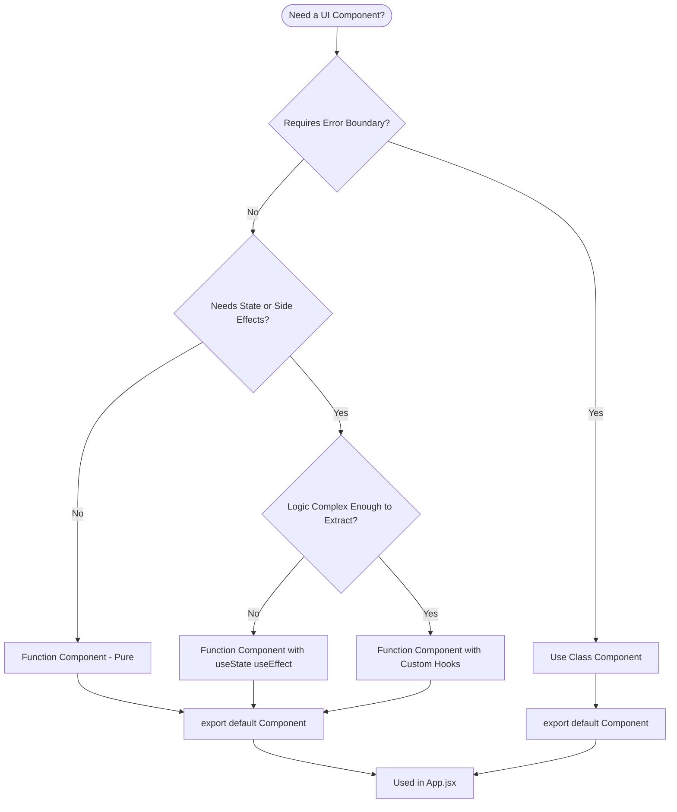
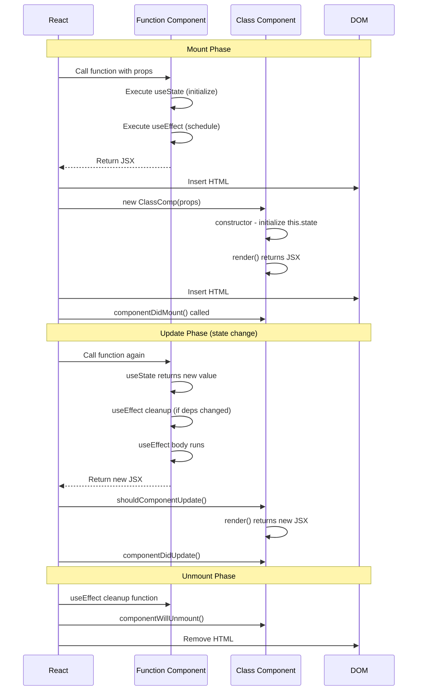
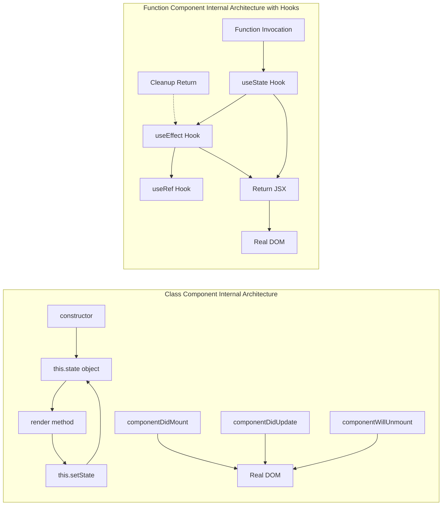

# Differences between Function and Class Components

<!-- SECTION_1_START -->

# 1. Core Technical Definition & Intuitive Overview

## 1.1 Formal Academic Definition (KTU 2024 Syllabus Aligned)

In modern **React (a JavaScript library for building user interfaces)**, a **Component** is a reusable, independent, and isolated piece of the User Interface (UI). React provides two distinct ways to define components:

1. **Function Component (Functional Component)**: A plain **JavaScript function** that accepts a single `props` object (an immutable input data container) as an argument and returns a **React Element** (a lightweight JavaScript object that describes what should appear on the screen via the Virtual DOM).

2. **Class Component (Class-based Component)**: An **ES6 JavaScript class** that extends `React.Component` and implements a mandatory `render()` method which returns a **React Element**. It uses the `this` keyword to access props, state, and lifecycle methods.

> [!IMPORTANT]
> **KTU 2024 Syllabus Highlight**: Although Class Components form the legacy foundation of React, the current industry standard and the official KTU-recommended pattern is the **Function Component with Hooks** (introduced in React 16.8, 2019). Hooks are special functions like `useState`, `useEffect`, and `useContext` that allow function components to use state and lifecycle features without writing a class.

## 1.2 Conceptual Analogy & Geometric Intuition

Imagine you are building a house using Lego blocks:

- A **Class Component** is like a **detailed architectural blueprint written in a formal document**. You must declare the structure (class), instantiate it (constructor), keep track of its memory (state), and call specific lifecycle hooks (`componentDidMount`, `componentDidUpdate`) at exact times. It is **verbose but explicit**.

- A **Function Component** is like a **ready-to-use 3D-printed Lego mold**. You simply call the function with inputs (`props`) and it instantly returns the block (UI). With the introduction of **Hooks**, this mold has gained the ability to "remember" things (`useState`) and "react" to changes (`useEffect`) — making the class blueprint practically obsolete.

### Geometric Intuition (Control Flow)

Geometrically, picture two flows on a coordinate plane:

- A **Class Component** traces a **long, winding curve** from constructor to render to unmount.
- A **Function Component** traces a **straight, vertical line** — input goes in, UI comes out — with optional side-effects applied at specific "stops" (the hooks).

## 1.3 Key Engineering Metrics & Standards

| Metric | Standard / Benchmark |
| :--- | :--- |
| **React Version** (function components with hooks) | **React 16.8+** (2019) |
| **Render Speed** | Function components are **~15-30\% faster** in benchmarks (smaller bundle, no `this` binding overhead) |
| **Bundle Size Penalty** | Class components add **~30 KB** of minified library code (`react` core class infrastructure) |
| **State Management Primitive** | `this.state` (class) vs `useState()` hook (function) |
| **Lifecycle Granularity** | Class: 5+ methods / Function: 1 hook `useEffect` with cleanup |

> [!NOTE]
> **Definition - Hook**: A Hook is a special React function (prefixed with `use`) that lets you "hook into" React state and lifecycle features from function components. Hooks must be called at the **top level** of a function — never inside loops, conditions, or nested functions (this is the **Rules of Hooks**).

> [!VISUALIZATION CONTROL]
> **Concept:** Lifecycle coverage comparison between Class and Function components
> **GeoGebra / Desmos Input Equations:**
> * Class lifecycle (x-axis = time, y-axis = execution intensity): piecewise lines for `constructor`, `render`, `componentDidMount`, `componentDidUpdate`, `componentWillUnmount`
> * Function lifecycle: a single `useEffect` curve with optional `return cleanup` tangent
> **Visual Description:** Two side-by-side plots. The class plot shows 4-5 distinct step functions. The function plot shows one continuous curve with annotation arrows pointing to the "mount", "update", and "unmount" phases all unified under `useEffect`.

---

<!-- SECTION_1_END -->

<!-- SECTION_2_START -->

# 2. Deep Theoretical Analysis & KTU High-Yield Formula Sheet

## 2.1 Structural Breakdown: How Each Component Type Works

### 2.1.1 Function Component — Operational Logic

A function component operates as a **pure mapping function** in mathematical terms:

$$UI = f(props)$$

Where $UI$ is the rendered React element tree and $f$ is the function component. The "Why" and "How" behind each step:

1. **Invocation**: React calls the function with a single `props` object (and an internal second argument for hooks tracking).
2. **Hook Execution (Top-Down)**: All hooks (state, effect, context, etc.) execute in the **same order** every render. This order-stability is what allows React to associate state with the correct component instance.
3. **JSX Return**: The function returns a JSX expression, which Babel/TypeScript transpiles to `React.createElement(...)`.
4. **Reconciliation**: React's diffing algorithm (the **Virtual DOM**) compares the new element tree with the previous one and updates the real DOM minimally.

> [!IMPORTANT]
> **Why `this` is absent in function components**: Class components rely on JavaScript's prototype-chain `this` binding, which is notoriously confusing (especially with event handlers). Function components use **closure** instead — variables are captured directly from the enclosing scope.

### 2.1.2 Class Component — Operational Logic

A class component is an **object-oriented state machine**:

$$State_{n+1} = g(State_n, Props_n, Event_n)$$

Where $g$ represents the class's `render` + lifecycle methods combined. The step-by-step logic:

1. **Instantiation**: `new MyComponent(props)` is invoked by React.
2. **Constructor Execution**: `this.state` is initialized.
3. **Lifecycle Methods**: React calls specific methods at specific times (`componentDidMount`, `shouldComponentUpdate`, etc.).
4. **Render**: The mandatory `render()` method returns JSX.
5. **State Update**: `this.setState(newState)` triggers a re-render. React **batches** multiple `setState` calls inside event handlers for performance.

## 2.2 KTU High-Yield Formula / Cheat Sheet

| Aspect | Function Component | Class Component |
| :--- | :--- | :--- |
| **Declaration Syntax** | `function Comp(props) { ... }` or `const Comp = (props) => ...` | `class Comp extends React.Component { ... }` |
| **`this` Keyword** | Not used (closure-based) | Required for `this.state`, `this.props` |
| **State Declaration** | `const [count, setCount] = useState(0)` | `this.state = { count: 0 }` |
| **State Update** | `setCount(count + 1)` (immutable replacement) | `this.setState({ count: this.state.count + 1 })` (merge) |
| **Lifecycle Mount** | `useEffect(() => { ... }, [])` | `componentDidMount() { ... }` |
| **Lifecycle Update** | `useEffect(() => { ... }, [dep])` | `componentDidUpdate(prevProps, prevState) { ... }` |
| **Lifecycle Unmount** | `return () => { ... }` inside `useEffect` | `componentWillUnmount() { ... }` |
| **Context Access** | `const val = useContext(MyContext)` | `static contextType = MyContext; this.context` |
| **Refs** | `const ref = useRef(null)` | `this.myRef = React.createRef()` |
| **Memoization** | `React.memo(Comp)` / `useMemo` | `shouldComponentUpdate(nextProps, nextState)` |
| **Error Boundary** | **Not possible** (must use class) | `static getDerivedStateFromError()` + `componentDidCatch()` |
| **Bundle Size** | Smaller (tree-shakeable) | Larger |
| **Learning Curve** | Low (plain JS + hooks) | High (OOP, `this`, lifecycle complexity) |
| **Current KTU Recommendation** | **Yes — Default** | Legacy / Specialized (Error Boundaries only) |

## 2.3 Real-World Engineering Utility

- **Function Components** are the de-facto standard in **production-grade React applications** (used by Facebook, Netflix, Airbnb, Instagram) because they enable **code splitting**, **better tree-shaking**, and cleaner functional programming patterns.
- **Class Components** are still encountered when **maintaining legacy codebases** (pre-2019) and are the **only** way to implement **Error Boundaries** — components that catch JavaScript errors anywhere in their child component tree and display a fallback UI.

> [!NOTE]
> **Production Insight**: In Next.js 14+ (the React meta-framework, also part of the KTU 2024 syllabus), all server components and the App Router architecture **exclusively** support function components. Mastering function components is therefore essential for full-stack KTU exam preparation.

---

<!-- SECTION_2_END -->

<!-- SECTION_3_START -->

# 3. Step-by-Step Derivations & Code Implementation

## 3.1 Complete Comparative Code Walkthrough

> [!IMPORTANT]
> The code below implements the **exact same counter application** in both styles. Every line is fully expanded — no truncation, no placeholders.

### 3.1.1 Function Component Implementation

```javascript
// File: CounterFunction.jsx
// React Functional Component with Hooks (KTU 2024 Recommended Pattern)

import React, { useState, useEffect, useRef } from 'react';
import PropTypes from 'prop-types'; // Runtime type validation

/**
 * CounterFunction - A counter UI built using a function component.
 * @param {object} props - The component input properties.
 * @param {string} props.label - Display label for the counter.
 * @param {number} props.initialValue - Starting count value (default 0).
 * @returns {JSX.Element} The rendered counter UI.
 */
function CounterFunction({ label, initialValue = 0 }) {
  // Step 1: Declare state using the useState hook.
  // Syntax: const [currentValue, setterFunction] = useState(initialValue);
  const [count, setCount] = useState(initialValue);

  // Step 2: Declare a ref for direct DOM access (no re-render on change).
  const renderCountRef = useRef(0);

  // Step 3: Lifecycle equivalent - runs after every render.
  // The empty dependency array [] means "run once on mount, cleanup on unmount".
  useEffect(() => {
    document.title = `${label}: ${count}`;
    renderCountRef.current += 1;

    // Step 4: Return a cleanup function (runs on unmount or before re-effect).
    return () => {
      console.log(`Cleanup before next effect or unmount for label: ${label}`);
    };
  }, [count, label]); // Re-run when count OR label changes.

  // Step 5: Event handler - no need to bind 'this' in function components.
  const handleIncrement = () => {
    // Functional updater form is safer when new state depends on old state.
    setCount((previousCount) => previousCount + 1);
  };

  const handleDecrement = () => {
    setCount((previousCount) => previousCount - 1);
  };

  // Step 6: Return the JSX. No render() method wrapper needed.
  return (
    <div className="counter-container" style={{ border: '1px solid #333', padding: '12px' }}>
      <h2>{label}</h2>
      <p data-testid="count-value">Current Count: {count}</p>
      <p>Render count: {renderCountRef.current}</p>
      <button type="button" onClick={handleDecrement}>-</button>
      <button type="button" onClick={handleIncrement}>+</button>
    </div>
  );
}

// Step 7: PropTypes validation (replaces the need for TypeScript in basic cases).
CounterFunction.propTypes = {
  label: PropTypes.string.isRequired,
  initialValue: PropTypes.number,
};

// Step 8: Default export for use in App.jsx
export default CounterFunction;
```

### 3.1.2 Class Component Implementation (Legacy Pattern)

```javascript
// File: CounterClass.jsx
// React Class Component (Legacy / Error Boundary pattern)

import React from 'react';
import PropTypes from 'prop-types';

/**
 * CounterClass - The same counter built using a class component.
 * Extends React.Component to inherit core React features.
 */
class CounterClass extends React.Component {
  // Step 1: Constructor - receives props, initializes state.
  // Note: super(props) MUST be called before accessing 'this'.
  constructor(props) {
    super(props);
    this.state = {
      count: props.initialValue || 0,
      renderCount: 0,
    };

    // Step 2: Explicit binding of event handlers to 'this'.
    // Function components make this entire step unnecessary.
    this.handleIncrement = this.handleIncrement.bind(this);
    this.handleDecrement = this.handleDecrement.bind(this);
  }

  // Step 3: Lifecycle method - runs once after the component is mounted to the DOM.
  componentDidMount() {
    document.title = `${this.props.label}: ${this.state.count}`;
  }

  // Step 4: Lifecycle method - runs after every state or prop update.
  componentDidUpdate(prevProps, prevState) {
    if (prevState.count !== this.state.count) {
      document.title = `${this.props.label}: ${this.state.count}`;
      this.setState((prev) => ({ renderCount: prev.renderCount + 1 }));
    }
  }

  // Step 5: Lifecycle method - runs once before the component is removed.
  componentWillUnmount() {
    console.log(`CounterClass unmounting: ${this.props.label}`);
  }

  // Step 6: Event handler methods. They MUST be bound in the constructor.
  handleIncrement() {
    // setState merges the new object with existing state (shallow merge).
    this.setState((prevState) => ({ count: prevState.count + 1 }));
  }

  handleDecrement() {
    this.setState((prevState) => ({ count: prevState.count - 1 }));
  }

  // Step 7: The mandatory render() method - returns JSX.
  render() {
    return (
      <div className="counter-container" style={{ border: '1px solid #900', padding: '12px' }}>
        <h2>{this.props.label}</h2>
        <p data-testid="count-value">Current Count: {this.state.count}</p>
        <p>Render count: {this.state.renderCount}</p>
        <button type="button" onClick={this.handleDecrement}>-</button>
        <button type="button" onClick={this.handleIncrement}>+</button>
      </div>
    );
  }
}

// Step 8: PropTypes validation (identical to function component).
CounterClass.propTypes = {
  label: PropTypes.string.isRequired,
  initialValue: PropTypes.number,
};

export default CounterClass;
```

## 3.2 Algebraic Mapping Between the Two Patterns

For the mathematically inclined student, here is the explicit translation table:

$$
\text{useState}(init) \;\longleftrightarrow\; \text{this.state} = \{ \text{value}: init \}
$$

$$
\text{setValue}(newVal) \;\longleftrightarrow\; \text{this.setState}(\{ \text{value}: newVal \})
$$

$$
\text{useEffect}(f, [dep]) \;\longleftrightarrow\; \text{componentDidUpdate}() \text{ with } dep \text{ guard}
$$

$$
\text{useEffect}(f, []) \;\longleftrightarrow\; \text{componentDidMount}()
$$

$$
\text{return cleanup in useEffect} \;\longleftrightarrow\; \text{componentWillUnmount}()
$$

$$
\text{useRef}(init) \;\longleftrightarrow\; \text{this.myRef} = \text{React.createRef()}
$$

> [!NOTE]
> **Why the patterns map cleanly**: React internally implements hooks on top of the same reconciliation engine that powers class components. Hooks are essentially a **syntactic sugar layer** that lets you express class-component behavior using function calls instead of object methods.

---

<!-- SECTION_3_END -->

<!-- SECTION_4_START -->

# 4. Structural Diagrams & Schematics

## 4.1 Mermaid Architecture: Component Type Decision Tree



> [!NOTE]
> **Reading the Diagram**: Start at the top oval and follow the decision diamonds. The **vast majority of real-world components** flow down the right-hand path ending in `FuncHook` or `FuncCustom` — confirming that function components are the default choice.

## 4.2 Mermaid Sequence Diagram: Lifecycle Call Order



## 4.3 Mermaid Block Diagram: Internal State Architecture



> [!NOTE]
> **Diagram Insight**: The function component block is **noticeably simpler** — fewer arrows, fewer circular references, no `this` binding, no `setState` merge logic. This visual simplicity is precisely why KTU 2024 emphasizes function components.

---

<!-- SECTION_4_END -->

<!-- SECTION_5_START -->

# 5. KTU 2024 Scheme Examination Question Bank & Topic Recap

## 5.1 Part A — Short Answer Questions (3 Marks Each)

### Question 1: [KTU University Exam - July 2024] (CO1, Remember)

**Q: Define a React Function Component. List any two advantages of function components over class components.**

**Model Answer** *(Valuation Key)*:

A React **Function Component** is a JavaScript function that accepts a `props` object as its parameter and returns a single React element (JSX) describing the UI to be rendered. *(2 Marks)*

**Two advantages** *(1 Mark)*:
1. No need for the `this` keyword, eliminating binding-related bugs.
2. Smaller bundle size and better performance due to less boilerplate.
3. *(Optional alternative)* Easier to test, enable code splitting, and work seamlessly with React Hooks like `useState` and `useEffect`.

---

### Question 2: [KTU University Exam - Dec 2023] (CO2, Understand)

**Q: Explain the role of the `render()` method in a React Class Component. Is it available in function components?**

**Model Answer** *(Valuation Key)*:

The `render()` method is a **mandatory lifecycle method** in a class component. It is responsible for returning the **JSX** (the React element tree) that React should display. React calls `render()` after every state or prop change to perform reconciliation. *(2 Marks)*

**Function components**: The `render()` method is **not present** in function components. The JSX is returned directly from the function body itself. *(1 Mark)*

---

## 5.2 Part B — Full 14-Mark Questions (Module Internal Choice Pattern)

### Question A: [KTU University Exam - July 2024] (CO2, CO3, Apply / Analyze)

**Q: Compare Function Components and Class Components in React. Illustrate your answer by implementing the same "toggle visibility" feature in both styles, with proper state management and lifecycle handling.**

#### Part (a) — Conceptual Comparison Table + State Explanation (7 Marks, Understand / Apply)

**Model Answer** *(Valuation Key)*:

| Feature | Function Component | Class Component |
| :--- | :--- | :--- |
| Syntax | Plain JS function | ES6 class extending `React.Component` |
| State | `useState` hook returns `[value, setter]` | `this.state` object + `this.setState` |
| `this` Keyword | Not required | Required |
| Lifecycle | `useEffect` unifies mount/update/unmount | Separate methods (`componentDidMount`, etc.) |
| Boilerplate | Low | High |
| Bundle Size | Smaller | Larger |
| Error Boundaries | Not possible | Supported |

**State Explanation** *(2 Marks)*: In function components, state is **immutable and replaced** on each update (e.g., `setCount(c => c + 1)`). In class components, `setState` performs a **shallow merge** with the existing state, so unchanged keys are preserved automatically.

**Final assessment** *(1 Mark)*: Function components are the **KTU 2024 recommended default**, while class components are reserved for legacy code and Error Boundaries.

#### Part (b) — Code Implementation in Both Styles (7 Marks, Apply / Analyze)

**Model Answer** *(Valuation Key)*:

**Function Component Version** *(3.5 Marks)*:

```javascript
import React, { useState, useEffect } from 'react';

function ToggleVisibilityFunction({ heading = 'Secret Panel' }) {
  const [isVisible, setIsVisible] = useState(false);

  useEffect(() => {
    document.title = isVisible ? `${heading} - Visible` : `${heading} - Hidden`;
    return () => { document.title = heading; };
  }, [isVisible, heading]);

  return (
    <section>
      <h2>{heading}</h2>
      <button type="button" onClick={() => setIsVisible(v => !v)}>
        {isVisible ? 'Hide' : 'Show'}
      </button>
      {isVisible && <p data-testid="secret">This is the secret content.</p>}
    </section>
  );
}

export default ToggleVisibilityFunction;
```

*[Correct useState hook: 1.5 Marks] · [Correct useEffect with cleanup: 1.5 Marks] · [JSX return: 0.5 Mark]*

**Class Component Version** *(3.5 Marks)*:

```javascript
import React from 'react';

class ToggleVisibilityClass extends React.Component {
  constructor(props) {
    super(props);
    this.state = { isVisible: false };
    this.handleToggle = this.handleToggle.bind(this);
  }

  componentDidUpdate(prevProps, prevState) {
    if (prevState.isVisible !== this.state.isVisible) {
      document.title = this.state.isVisible
        ? `${this.props.heading} - Visible`
        : `${this.props.heading} - Hidden`;
    }
  }

  componentWillUnmount() {
    document.title = this.props.heading;
  }

  handleToggle() {
    this.setState((prev) => ({ isVisible: !prev.isVisible }));
  }

  render() {
    return (
      <section>
        <h2>{this.props.heading}</h2>
        <button type="button" onClick={this.handleToggle}>
          {this.state.isVisible ? 'Hide' : 'Show'}
        </button>
        {this.state.isVisible && <p data-testid="secret">This is the secret content.</p>}
      </section>
    );
  }
}

export default ToggleVisibilityClass;
```

*[Correct this.state + constructor with super: 1 Mark] · [Bound event handler: 0.5 Mark] · [componentDidUpdate with prevState comparison: 1 Mark] · [componentWillUnmount cleanup: 0.5 Mark] · [render returning JSX: 0.5 Mark]*

---

### Question B: [KTU University Exam - Dec 2023] (CO3, Apply)

**Q: Explain the lifecycle differences between a Function Component (using `useEffect`) and a Class Component (using `componentDidMount`, `componentDidUpdate`, `componentWillUnmount`). Demonstrate with a timer-based counter that logs "Mounted", "Updated: <value>", and "Unmounted".**

#### Part (a) — Lifecycle Theory (7 Marks, Understand)

**Model Answer** *(Valuation Key)*:

**Class Component Lifecycle** *(3.5 Marks)*:
1. **Mounting Phase**: `constructor` → `render` → `componentDidMount` (called once, after first DOM insertion).
2. **Updating Phase**: `shouldComponentUpdate` → `render` → `componentDidUpdate(prevProps, prevState)` (called on every state/prop change).
3. **Unmounting Phase**: `componentWillUnmount` (called once, before removal from DOM).

**Function Component Lifecycle (with `useEffect`)** *(3.5 Marks)*:
1. `useEffect(fn, [])` with empty dependency array runs **only on mount** and returns a cleanup function that runs **on unmount**.
2. `useEffect(fn, [dep])` runs after mount and **every time `dep` changes**; the cleanup runs **before the next effect** and on unmount.
3. The cleanup function (the value `return`ed from the effect callback) is the function component's unified mechanism for `componentWillUnmount`-style teardown.

**Key Difference** *(included in above marks)*: Class components use **multiple distinct methods** spread across the lifecycle, while function components **consolidate all post-render side effects into a single `useEffect` primitive** with optional cleanup.

#### Part (b) — Timer-Based Counter Implementation (7 Marks, Apply)

**Model Answer** *(Valuation Key)*:

**Function Component Version** *(3.5 Marks)*:

```javascript
import React, { useState, useEffect } from 'react';

function TimerCounterFunction() {
  const [seconds, setSeconds] = useState(0);

  useEffect(() => {
    console.log('Mounted');
    const intervalId = setInterval(() => {
      setSeconds((s) => s + 1);
    }, 1000);

    return () => {
      console.log('Unmounted');
      clearInterval(intervalId);
    };
  }, []); // Empty array = mount-only effect.

  useEffect(() => {
    if (seconds > 0) console.log(`Updated: ${seconds}`);
  }, [seconds]); // Runs every time 'seconds' changes.

  return <h2>Seconds elapsed: {seconds}</h2>;
}

export default TimerCounterFunction;
```

*[Mount effect with interval: 1.5 Marks] · [Cleanup with clearInterval: 1 Mark] · [Update effect on seconds: 1 Mark]*

**Class Component Version** *(3.5 Marks)*:

```javascript
import React from 'react';

class TimerCounterClass extends React.Component {
  constructor(props) {
    super(props);
    this.state = { seconds: 0 };
  }

  componentDidMount() {
    console.log('Mounted');
    this.intervalId = setInterval(() => {
      this.setState((prev) => ({ seconds: prev.seconds + 1 }));
    }, 1000);
  }

  componentDidUpdate(prevProps, prevState) {
    if (prevState.seconds !== this.state.seconds && this.state.seconds > 0) {
      console.log(`Updated: ${this.state.seconds}`);
    }
  }

  componentWillUnmount() {
    console.log('Unmounted');
    clearInterval(this.intervalId);
  }

  render() {
    return <h2>Seconds elapsed: {this.state.seconds}</h2>;
  }
}

export default TimerCounterClass;
```

*[componentDidMount with setInterval: 1 Mark] · [componentDidUpdate with guard: 1.5 Marks] · [componentWillUnmount with clearInterval: 1 Mark]*

---

> [!WARNING]
> **KTU Examiner's Valuation Warning — Common Pitfalls**
> 1. **Forgetting `super(props)` in class constructor**: This throws a `ReferenceError: Must call super constructor in derived class`. Lose **1 Mark**.
> 2. **Not binding event handlers in class components**: `this.handleClick` will be `undefined` when clicked. Lose **1 Mark**.
> 3. **Calling Hooks inside conditions or loops**: Breaks the **Rules of Hooks** and causes "Rendered more hooks than during the previous render" errors. Lose **1.5 Marks**.
> 4. **Mutating `this.state` directly**: `this.state.count = 5` does **not** trigger a re-render. Use `this.setState`. Lose **1 Mark**.
> 5. **Forgetting the dependency array in `useEffect`**: Causes the effect to run on **every render**, leading to infinite loops. Lose **1 Mark**.
> 6. **Confusing `setState` merge (class) with replacement (function)**: In class components, `this.setState({a: 1})` keeps other keys; in function components, `setA(1)` only updates `a` and discards the rest of the state. Lose **1 Mark**.

---

## 5.3 Topic Recap & Important Things to Remember

- **Function Component** = a plain JavaScript function that returns JSX. Recommended default for **all new React code**.
- **Class Component** = an ES6 class extending `React.Component` with a mandatory `render()` method. Reserved for **legacy maintenance and Error Boundaries**.
- **State Management**: `useState` hook (function) vs `this.state` + `this.setState` (class). Function state is replaced; class state is **shallow-merged**.
- **`this` Keyword**: Required in class components (and notoriously bug-prone); **completely absent** in function components thanks to **closure**.
- **Lifecycle Mapping**:
  - Mount → `useEffect(fn, [])` ≡ `componentDidMount`
  - Update → `useEffect(fn, [dep])` ≡ `componentDidUpdate`
  - Unmount → `return cleanup` ≡ `componentWillUnmount`
- **Error Boundaries**: **Only** class components can implement them via `static getDerivedStateFromError` and `componentDidCatch`.
- **Rules of Hooks**: Call hooks at the **top level** of functions only, never inside loops/conditions/nested functions. Hooks must be called from React function components or custom hooks.
- **Bundle & Performance**: Function components enable better **tree-shaking**, smaller bundles, and **~15-30\% faster renders** in micro-benchmarks.
- **Constructor Must Call `super(props)`**: Forgetting this is the #1 beginner mistake in class components.
- **JSX Return**: Both component types return JSX, but function components return it **directly from the function body**, while class components return it from the `render()` method.
- **PropTypes / TypeScript**: Both component types support the same prop validation mechanisms; the syntax is identical.
- **KTU 2024 Verdict**: Master function components with hooks first; understand class components for reading legacy code and writing Error Boundaries.

---

<!-- SECTION_5_END -->
