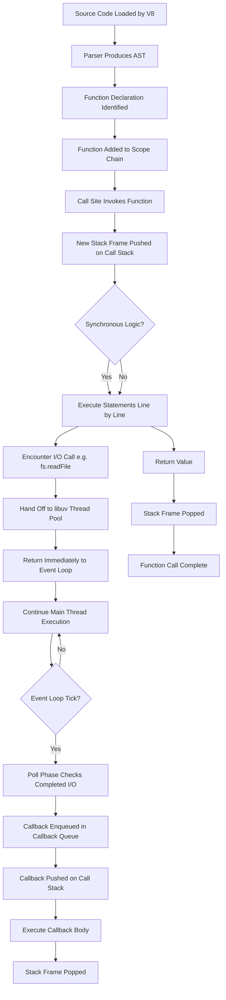
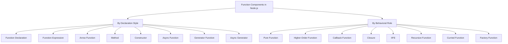
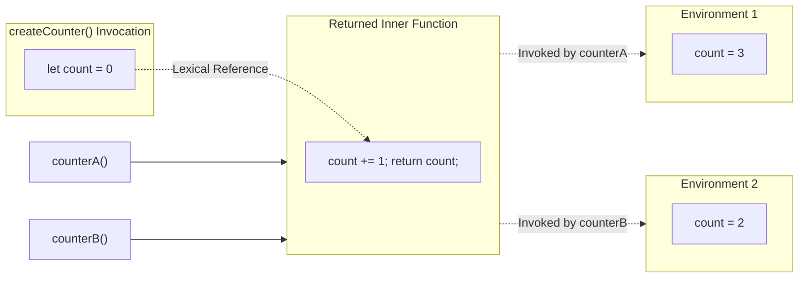
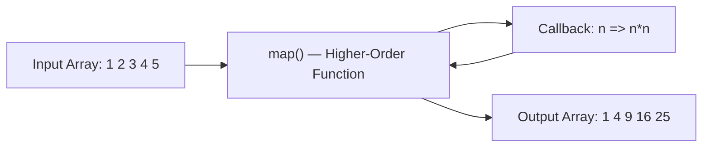
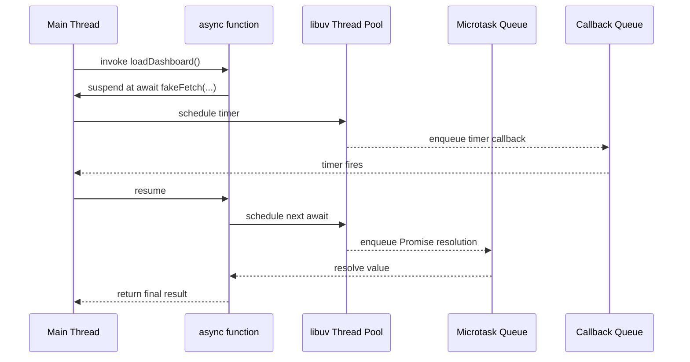
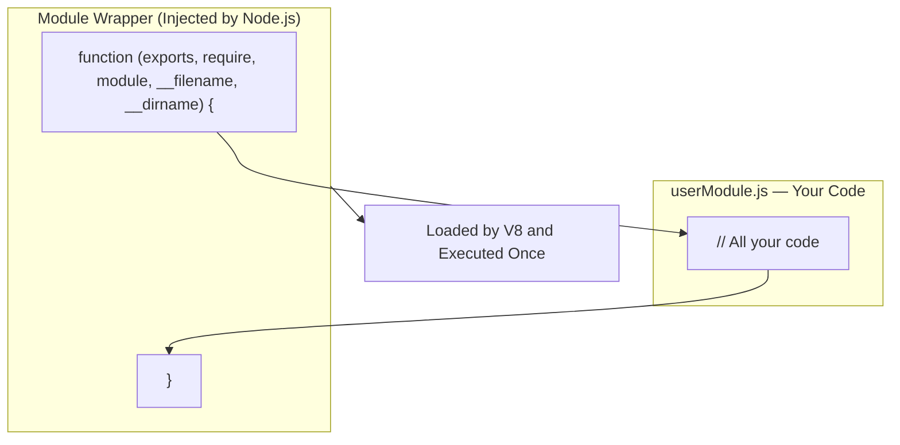

# Function Components

<!-- SECTION_1_START -->

# Function Components in Node.js

## 1. Core Technical Definition

> [!NOTE]
> **KTU 2024 Syllabus Definition**
> *Function Components* in the **Node.js JavaScript runtime environment** refer to the diverse set of function constructs that serve as the **fundamental units of execution and modularization** in JavaScript programs. These include **function declarations, function expressions, arrow functions, methods, higher-order functions, callbacks, closures, Immediately Invoked Function Expressions (IIFE), async functions, and generator functions** — all of which leverage JavaScript's **first-class function** paradigm.

In simple engineering terms, a **function component** is any callable block of code that accepts inputs (**parameters**), performs a defined operation, and optionally produces an output (**return value**). Because JavaScript treats functions as **first-class citizens**, they can be **assigned to variables, passed as arguments, returned from other functions, and stored in data structures** — a property that is foundational to Node.js's **event-driven, non-blocking architecture**.

---

## 2. Conceptual Analogy / Intuition

> [!IMPORTANT]
> **Factory Assembly Line Analogy**
>
> Imagine a **car manufacturing plant**. The plant floor is your **Node.js runtime environment**. Each **machine** on the assembly line is a **function component**:
>
> - A **Function Declaration** is a **named, certified machine** permanently bolted to the floor — it exists the moment blueprints (code) are read (hoisted).
> - A **Function Expression** is a **machine built on the fly** when a worker reaches that station — it is only constructed at runtime.
> - An **Arrow Function** is a **compact, specialized robot** that inherits the configuration of the station it is placed in (**lexical `this`**) and has no internal toolbox of its own.
> - A **Higher-Order Function** is a **supervisor machine** that takes in smaller machines, reconfigures them, and dispatches them.
> - A **Callback** is a **work-order slip** handed to a downstream machine: *"When you are done, hand the result to this function."*
> - A **Closure** is a **sealed toolbox** carried by a machine — even after the original blueprint section is finished, the machine remembers the parts (variables) inside its closed compartment.
> - An **IIFE** is a **pop-up workstation** that assembles a product and disassembles itself in a single tick of the clock.

This mental model maps directly onto Node.js: **every HTTP request, file read, or database query is delegated to a function component**, often chained through callbacks or Promises.

---

## 3. Key Standard Metrics & Constants

> [!IMPORTANT]
> **JavaScript Engine Specifications (V8 — Default Node.js Engine)**
> - **Function Call Stack Size (default):** ~**$15{,}000$** frames on 64-bit systems (configurable via `--stack-size`).
> - **Maximum Function Arity:** **$255$** named parameters (per ES2015 specification).
> - **Maximum String Length:** **$2^{53} - 1$** characters.
> - **Single Function Source Size Limit:** **~ $1\,\text{MB}$** after parsing (practical limit, engine-dependent).
> - **Node.js Event Loop Phases:** **$6$** distinct phases per tick (Timers, Pending Callbacks, Idle/Prepare, Poll, Check, Close Callbacks).

---

## 4. Pure Function as a Mathematical Mapping

A **pure function** in JavaScript mirrors a mathematical function. The most foundational visualization of a function component is the **mapping between two sets**.

> [!VISUALIZATION CONTROL]
> **Concept:** Pure Function as a Set-Theoretic Mapping $f: A \to B$
> **GeoGebra / Desmos Input Equations:**
> * `f(x) = 2 * x + 1` (a pure function component)
> * Domain: $A = \{-2, -1, 0, 1, 2\}$ mapped to
> * Codomain: $B = \{-3, -1, 1, 3, 5\}$
> **Visual Description:** The student should observe **five discrete input points** on the $x$-axis feeding through a **straight line** of slope $2$ and intercept $1$, producing **five deterministic output points** on the $y$-axis. The mapping is **one-to-one** with no randomness, no I/O, no mutation — the textbook signature of a **pure function component**.

---

<!-- SECTION_2_START -->

# Deep Theoretical Analysis & KTU High-Yield Formula Sheet

## 1. Taxonomy of Function Components in Node.js

### A. By Declaration Style

| # | Function Type | Syntax Signature | Hoisted? | Own `this`? | Use Case |
|---|---|---|---|---|---|
| 1 | **Function Declaration** | `function name(p1, p2) { ... }` | ✅ Yes | ✅ Yes | Named reusable logic, top-level utilities |
| 2 | **Function Expression** | `const fn = function(p) { ... };` | ❌ No (the binding is) | ✅ Yes | Conditional functions, callbacks |
| 3 | **Arrow Function** | `const fn = (p) => { ... };` | ❌ No | ❌ No (lexical) | Short callbacks, functional composition |
| 4 | **Method (Shorthand)** | `const obj = { fn(p) { ... } };` | ❌ No | ✅ Yes (the object) | Object behavior |
| 5 | **Constructor Function** | `function Ctor(p) { this.p = p; }` | ✅ Yes | ✅ Yes (new instance) | Legacy class emulation |
| 6 | **Async Function** | `async function fn() { ... }` | ✅ Yes (declaration) | ✅ Yes | Promise-returning logic, `await` chains |
| 7 | **Generator Function** | `function* gen() { yield 1; }` | ✅ Yes | ✅ Yes | Lazy iteration, async streams |
| 8 | **Async Generator** | `async function* gen() { yield await x; }` | ✅ Yes | ✅ Yes | Streaming async data |

### B. By Behavioral Role

| # | Role | Definition | KTU Exam Frequency |
|---|---|---|---|
| 1 | **Pure Function** | Same input → same output, no side effects | ⭐⭐⭐ |
| 2 | **Higher-Order Function** | Accepts or returns a function | ⭐⭐⭐ |
| 3 | **Callback Function** | Passed as an argument to be invoked later | ⭐⭐⭐ |
| 4 | **Closure** | Remembers variables from its lexical scope | ⭐⭐⭐ |
| 5 | **IIFE** | Function that runs immediately upon definition | ⭐⭐ |
| 6 | **Recursive Function** | Calls itself with a terminating base case | ⭐⭐⭐ |
| 7 | **Curried Function** | Function decomposed into a chain of unary functions | ⭐⭐ |
| 8 | **Factory Function** | Returns a new object (alternative to `class`) | ⭐⭐ |

---

## 2. The Operational "Why" and "How"

### Why Function Components Exist in Node.js

Node.js was designed around **three core principles**: **non-blocking I/O**, **single-threaded event loop**, and **modular code reuse**. **Function components** are the *atomic vehicles* that make all three possible.

- **Non-blocking I/O** is achieved because Node.js delegates long-running operations (file system, network) to the **libuv thread pool** and attaches a **callback function** that fires when the operation completes. **No code ever blocks the main thread.**
- **Event-driven concurrency** works because every emitted event is matched with a **listener function**. The EventEmitter class in Node.js is a textbook example of the **higher-order function pattern**.
- **Modularity** (the CommonJS `require` / ES6 `import` system) works because **modules are wrapped inside a function** — the *Module Wrapper Function* — to provide private scope.

> [!IMPORTANT]
> **The Module Wrapper Function (KTU Must-Know)**
> Every Node.js module is internally wrapped by Node.js as:
> ```js
> (function (exports, require, module, __filename, __dirname) {
>     // your module code lives here
> });
> ```
> This is why **top-level `var` is module-scoped** and not global. This is a frequently tested KTU point.

---

## 3. KTU High-Yield Formula / Syntax Sheet

> [!IMPORTANT]
> **Exam Tip:** Memorize the syntax columns and the **hoisting** column. KTU frequently asks *"Which function type is hoisted?"* and *"Difference between arrow and regular function with respect to `this`."*

| # | Concept | Canonical Syntax / Formula | Key Property |
|---|---|---|---|
| 1 | **Function Declaration** | `function add(a, b) { return a + b; }` | Hoisted, has own `this`, can be named |
| 2 | **Function Expression** | `const add = function(a, b) { return a + b; };` | Not hoisted, has own `this` if non-arrow |
| 3 | **Arrow Function (Concise Body)** | `const add = (a, b) => a + b;` | Implicit `return`, lexical `this` |
| 4 | **Arrow Function (Block Body)** | `const add = (a, b) => { return a + b; };` | Explicit `return` required |
| 5 | **Higher-Order Function** | `function hof(x, fn) { return fn(x); }` | Takes/returns a function |
| 6 | **Closure** | `function outer() { let n = 0; return () => ++n; }` | Retains outer scope |
| 7 | **IIFE** | `(function() { /* code */ })();` | Auto-executes, private scope |
| 8 | **Currying** | `const f = a => b => a + b;` | Decomposes multi-arity |
| 9 | **Recursion Base Case** | `function f(n) { if (n <= 0) return 1; return n * f(n-1); }` | Must terminate |
| 10 | **Async Function** | `async function f() { return await promise; }` | Returns `Promise` |
| 11 | **Callback Pattern** | `fs.readFile(path, (err, data) => { ... });` | Error-first convention |
| 12 | **Pure Function Signature** | $f: A \to B$ such that $\forall x \in A,\ f(x)$ is deterministic | No side effects |

> **Note on notation:** Throughout these notes, mathematical pipe symbols are written as $\vert$ or $\mid$ to avoid markdown table breakage.

---

## 4. Real-World Engineering Utility

| Application Domain | Function Component Used | Production Scenario |
|---|---|---|
| **HTTP Server (Express.js)** | Higher-order function: `app.get(path, handler)` | Routes are functions attached as callbacks |
| **File System Module (`fs`)** | Callback or Promise-returning function | Asynchronous read/write without blocking the event loop |
| **Database (MongoDB driver)** | Async function with `await` | Non-blocking CRUD operations |
| **Middleware (Express/Koa)** | Function accepting `(req, res, next)` | Request pre-processing pipeline |
| **Streams API** | Event listener function (`'data'`, `'end'`) | Processing large files in chunks |
| **CLI Tools** | Arrow functions for command mapping | Compact, readable dispatch logic |
| **Testing (Jest/Mocha)** | Function passed to `describe()` / `it()` | Test cases are first-class function components |
| **WebSockets (`ws` library)** | Callback functions for `on('message', ...)` | Real-time event handling |

---

<!-- SECTION_3_START -->

# Step-by-Step Derivations, Code Implementations & Case Analysis

## 1. Function Declaration — Full Implementation

A **Function Declaration** (also called *function statement*) uses the `function` keyword followed by a mandatory **name**.

```javascript
/**
 * Computes the factorial of a non-negative integer n.
 * @param {number} n - A non-negative integer.
 * @returns {number} The factorial n!.
 */
function factorial(n) {
    // Boundary check: enforce contract
    if (typeof n !== "number" || n < 0 || !Number.isInteger(n)) {
        throw new TypeError("Argument must be a non-negative integer.");
    }
    // Base case for recursion
    if (n === 0 || n === 1) {
        return 1;
    }
    // Recursive case
    return n * factorial(n - 1);
}

// Demonstration
console.log("factorial(5) =", factorial(5));   // 120
console.log("factorial(0) =", factorial(0));   // 1
```

**Step-by-step reasoning:**

1. `typeof n !== "number"` rejects non-numeric input.
2. `n < 0` rejects negatives (factorial is undefined).
3. `!Number.isInteger(n)` rejects floats like `2.5`.
4. The **base case** $n = 0$ or $n = 1$ returns $1$ — the terminating condition of recursion.
5. The **recursive case** invokes `factorial(n - 1)`, multiplying downward.

> [!IMPORTANT]
> **Hoisting demonstration:** Function declarations are **hoisted** to the top of their containing scope. You can call `factorial(5)` *before* its `function` line in the source. This is a KTU-favorite viva question.

---

## 2. Function Expression — Full Implementation

A **Function Expression** defines a function as part of a larger expression — typically an **assignment to a variable**.

```javascript
/**
 * @param {number} a
 * @param {number} b
 * @returns {number}
 */
const multiply = function (a, b) {
    if (typeof a !== "number" || typeof b !== "number") {
        throw new TypeError("Both arguments must be numbers.");
    }
    return a * b;
};

console.log("multiply(3, 4) =", multiply(3, 4));  // 12
```

**Step-by-step reasoning:**

1. The keyword `const` binds the variable `multiply` to an **anonymous function value**.
2. The function is **not hoisted** — invoking `multiply(...)` before this line throws `ReferenceError: Cannot access 'multiply' before initialization`.
3. This is why Function Expressions are often used when you need **conditional or lazy** function creation.

```javascript
// Conditional Function Expression
const operation = (process.env.MODE === "add")
    ? function (a, b) { return a + b; }
    : function (a, b) { return a * b; };

console.log(operation(2, 3));  // 5 (if MODE=add) or 6 (otherwise)
```

---

## 3. Arrow Function — Full Implementation

**Arrow functions** (ES6 / ES2015) provide a **concise** syntax and a **lexical `this`** binding.

```javascript
/**
 * Returns the square of x.
 * @param {number} x
 * @returns {number}
 */
const square = (x) => x * x;

// Multiple parameters require parentheses
const add = (a, b) => a + b;

// Block body requires explicit return and braces
const describeAge = (age) => {
    if (age < 0)      return "Invalid";
    else if (age < 18) return "Minor";
    else              return "Adult";
};

console.log(square(7));        // 49
console.log(add(10, 20));      // 30
console.log(describeAge(25));  // Adult
```

**Step-by-step reasoning:**

1. `(x) => x * x` — single parameter `x`, implicit return of `x * x`.
2. `(a, b) => a + b` — multiple parameters require parentheses.
3. Block body with `{}` requires an **explicit `return`** keyword; no implicit return.
4. Arrow functions have **no own `this`** — they inherit `this` from the surrounding lexical scope. This is critical inside class methods and event handlers.

### Comparative Demonstration: `this` Binding

```javascript
function RegularFunction() {
    this.value = 42;
    setTimeout(function () {
        // 'this' here is the global object (or undefined in strict mode)
        console.log("Regular:", this.value);  // undefined
    }, 100);
}

function ArrowFunction() {
    this.value = 42;
    setTimeout(() => {
        // 'this' is inherited from ArrowFunction's scope
        console.log("Arrow:", this.value);    // 42
    }, 100);
}

new RegularFunction();
new ArrowFunction();
```

---

## 4. Higher-Order Function — Full Implementation

A **Higher-Order Function (HOF)** is a function that **accepts one or more functions as arguments** and/or **returns a function** as its result.

```javascript
/**
 * Applies a transformation function to each element of an array.
 * @template T, U
 * @param {T[]} arr          - The input array.
 * @param {(item: T) => U} fn - The transformation.
 * @returns {U[]} The mapped array.
 */
function map(arr, fn) {
    if (!Array.isArray(arr))     throw new TypeError("First arg must be an array.");
    if (typeof fn !== "function") throw new TypeError("Second arg must be a function.");

    const result = [];
    for (let i = 0; i < arr.length; i++) {
        result.push(fn(arr[i], i, arr));
    }
    return result;
}

// Usage 1: square every number
const numbers = [1, 2, 3, 4, 5];
const squares = map(numbers, (n) => n * n);
console.log("Squares:", squares);  // [1, 4, 9, 16, 25]

// Usage 2: convert names to uppercase
const names = ["alice", "bob", "charlie"];
const upper = map(names, (s) => s.toUpperCase());
console.log("Upper:", upper);      // ["ALICE", "BOB", "CHARLIE"]
```

**Step-by-step reasoning:**

1. `map` is the *higher-order* function — it takes a function `fn` as an argument.
2. The argument `fn` is the *callback* — a function delegated to perform the per-element transformation.
3. The result array is built by pushing `fn(arr[i], i, arr)` for each element.
4. Note: JavaScript's built-in `Array.prototype.map` is a textbook example of this pattern.

### A HOF that *returns* a function:

```javascript
/**
 * Greeter factory: returns a function customized to a given greeting.
 * @param {string} greeting
 * @returns {(name: string) => string}
 */
function greeter(greeting) {
    return function (name) {
        return `${greeting}, ${name}!`;
    };
}

const hello = greeter("Hello");
const namaste = greeter("Namaste");

console.log(hello("Arjun"));     // "Hello, Arjun!"
console.log(namaste("Priya"));   // "Namaste, Priya!"
```

---

## 5. Callback Function — Full Implementation

A **callback** is a function passed into another function to be **invoked later**, typically after an asynchronous operation completes.

```javascript
// Node.js native fs module (Callback style — the "error-first" convention)
const fs = require("fs");

fs.readFile(__filename, "utf8", function (err, data) {
    if (err) {
        console.error("Read error:", err.message);
        return;
    }
    console.log("File length:", data.length, "characters");
});

console.log("This line prints BEFORE the file read completes — non-blocking!");
```

**Step-by-step reasoning:**

1. `fs.readFile` is invoked with a **callback function** as the third argument.
2. The callback follows the **error-first convention** `(err, data) => { ... }` — a Node.js idiom.
3. The main thread continues executing the `console.log` *immediately*, demonstrating **non-blocking** behavior.
4. When the file read finishes (later, on the libuv thread pool), the callback is enqueued onto the **event loop** and executed.

---

## 6. Closure — Full Implementation

A **closure** is a function bundled together with references to the variables in its **lexical scope**. Even when the outer function has returned, the inner function still "remembers" those variables.

```javascript
/**
 * Creates a counter function.
 * @returns {() => number} A function that increments and returns the count.
 */
function createCounter() {
    let count = 0;             // private state, lives in the closure
    return function () {
        count += 1;
        return count;
    };
}

const counterA = createCounter();
const counterB = createCounter();

console.log(counterA());  // 1
console.log(counterA());  // 2
console.log(counterA());  // 3
console.log(counterB());  // 1  (independent state)
console.log(counterB());  // 2
```

**Step-by-step reasoning:**

1. `createCounter` initializes a local variable `count = 0`.
2. The returned inner function forms a **closure** over `count`.
3. Each call to `counterA()` increments and returns its own `count`.
4. `counterB` has a **separate, independent** `count` because each call to `createCounter()` produces a fresh lexical environment.

### Closure in a Loop — The Classic KTU Trap

```javascript
// ❌ Buggy version — all callbacks see the SAME 'i'
for (var i = 1; i <= 3; i++) {
    setTimeout(() => console.log("Buggy:", i), i * 100);
}
// Output: Buggy: 4, Buggy: 4, Buggy: 4

// ✅ Fixed version — `let` creates a new binding per iteration
for (let i = 1; i <= 3; i++) {
    setTimeout(() => console.log("Fixed:", i), i * 100);
}
// Output: Fixed: 1, Fixed: 2, Fixed: 3
```

> [!IMPORTANT]
> **KTU Pitfall:** The `var` keyword is **function-scoped**, not block-scoped, so all three closures share the same `i`. Using `let` creates a **per-iteration binding**, so each closure captures a distinct value. This is a guaranteed $3$-mark question every semester.

---

## 7. Immediately Invoked Function Expression (IIFE) — Full Implementation

An **IIFE** is a function expression that is **executed immediately** after it is defined. It is commonly used to create a **private scope**, especially in pre-ES6 code.

```javascript
// Standard IIFE
(function () {
    const secret = "I am private";
    console.log("Inside IIFE:", secret);
})();
// "secret" is NOT accessible here
// console.log(secret);  // ReferenceError

// Arrow IIFE
(() => {
    const counter = (() => {
        let n = 0;
        return () => ++n;
    })();
    console.log("Counter:", counter());  // 1
    console.log("Counter:", counter());  // 2
})();
```

**Step-by-step reasoning:**

1. The function is wrapped in parentheses `(function(){...})` to make it an **expression** rather than a declaration.
2. The trailing `()` invokes it immediately.
3. All `const` / `let` declarations inside are **private** to that scope.
4. The arrow IIFE shows a **closure-based counter** factory created in a single statement.

---

## 8. Recursive Function — Trace of Execution

A **recursive function** is a function that calls itself. Every recursive function has two parts: a **base case** and a **recursive case**.

```javascript
/**
 * Computes the n-th Fibonacci number using recursion.
 * @param {number} n - Non-negative integer index.
 * @returns {number}
 */
function fibonacci(n) {
    if (typeof n !== "number" || n < 0 || !Number.isInteger(n)) {
        throw new TypeError("Input must be a non-negative integer.");
    }
    if (n === 0) return 0;   // base case 1
    if (n === 1) return 1;   // base case 2
    return fibonacci(n - 1) + fibonacci(n - 2);  // recursive case
}

console.log("fibonacci(6) =", fibonacci(6));  // 8
// Sequence: 0, 1, 1, 2, 3, 5, 8
```

**Step-by-step execution trace for `fibonacci(4)`:**

$$
\begin{aligned}
\text{fibonacci}(4) &= \text{fibonacci}(3) + \text{fibonacci}(2) \\
&= \bigl(\text{fibonacci}(2) + \text{fibonacci}(1)\bigr) + \bigl(\text{fibonacci}(1) + \text{fibonacci}(0)\bigr) \\
&= \bigl(\text{fibonacci}(1) + \text{fibonacci}(0)\bigr) + 1 + 1 + 0 \\
&= 1 + 0 + 1 + 1 + 0 \\
&= 3
\end{aligned}
$$

---

## 9. Async Function — Full Implementation (Promise-based)

An **async function** always returns a **Promise**. Inside, the `await` keyword pauses execution until a Promise settles.

```javascript
/**
 * Simulates an asynchronous fetch with delay.
 * @param {string} url
 * @returns {Promise<string>}
 */
function fakeFetch(url) {
    return new Promise((resolve) => {
        setTimeout(() => resolve(`Data from ${url}`), 500);
    });
}

async function loadDashboard() {
    try {
        const user    = await fakeFetch("/api/user");
        const orders  = await fakeFetch("/api/orders");
        const summary = `${user} | ${orders}`;
        return summary;
    } catch (err) {
        console.error("Failed to load dashboard:", err.message);
        throw err;
    }
}

loadDashboard().then((result) => console.log(result));
```

**Step-by-step reasoning:**

1. `fakeFetch` returns a Promise that resolves after $500\,\text{ms}$.
2. `async function loadDashboard()` marks the function as asynchronous.
3. `await fakeFetch(...)` suspends the function until the Promise resolves — *without blocking the event loop*.
4. `try / catch` handles rejection. Without it, an uncaught rejection becomes a `UnhandledPromiseRejection` warning.
5. The returned value is auto-wrapped in a Promise.

---

## 10. Practical Node.js Module — Putting It All Together

A minimal Node.js module demonstrating **all** function components in a single file:

```javascript
// utils.js — A demonstration module
"use strict";

const fs = require("fs");
const path = require("path");

// (1) Function Declaration
function logSeparator(label) {
    console.log("\n" + "=".repeat(15) + " " + label + " " + "=".repeat(15));
}

// (2) Function Expression
const greet = function (name) {
    return `Hello, ${name}!`;
};

// (3) Arrow Function
const toTitle = (s) => s.charAt(0).toUpperCase() + s.slice(1).toLowerCase();

// (4) Higher-Order Function
function processUsers(users, transform) {
    return users.map(transform);
}

// (5) Closure
function createRateLimiter(maxPerSecond) {
    let calls = 0;
    return function () {
        if (++calls > maxPerSecond) return false;
        return true;
    };
}

// (6) IIFE — initialize module state
const config = (function () {
    return {
        version: "1.0.0",
        author : "KTU Student",
    };
})();

// (7) Async Function with Await
async function readModuleInfo() {
    return new Promise((resolve, reject) => {
        fs.readFile(__filename, "utf8", (err, data) => {
            if (err) return reject(err);
            resolve({ length: data.length, lines: data.split("\n").length });
        });
    });
}

// (8) Demonstration / entry point
async function main() {
    logSeparator("Greeting");
    console.log(greet("Arjun"));

    logSeparator("Title-cased Names");
    const raw = ["ALICE", "bOb", "CHARLIE"];
    console.log(processUsers(raw, toTitle));

    logSeparator("Rate Limiter (Closure)");
    const limiter = createRateLimiter(2);
    console.log(limiter());  // true
    console.log(limiter());  // true
    console.log(limiter());  // false

    logSeparator("Module Config (IIFE)");
    console.log(config);

    logSeparator("Async File Read");
    const info = await readModuleInfo();
    console.log(info);
}

main().catch((err) => console.error("Fatal:", err.message));
```

Run with:

```bash
node utils.js
```

---

## 11. Comparative Summary — When to Use What

| Scenario | Recommended Function Type | Justification |
|---|---|---|
| Top-level utility used in many files | **Function Declaration** | Hoisted, named in stack traces |
| Conditional creation, lazy init | **Function Expression** | Created at runtime, full control |
| Short callback, functional chain | **Arrow Function** | Concise, lexical `this` |
| Object method needing own `this` | **Method Shorthand** | Object-bound |
| Asynchronous I/O pipeline | **Async Function** | Native `await`/`try-catch` |
| Event handler that uses surrounding `this` | **Arrow Function** | Lexical `this` capture |
| One-off initialization | **IIFE** | Private scope, no pollution |
| Maintaining private state | **Closure (Factory)** | Encapsulation without `class` |
| Lazy/infinite sequences | **Generator Function** | `yield` pauses and resumes |

---

<!-- SECTION_4_START -->

# Structural Diagrams & Schematics

## 1. Function Component Lifecycle in the Node.js Runtime

The diagram below traces a single function call from source code to completion, highlighting the role of the **call stack**, the **event loop**, and the **callback queue**.



**Reading the diagram:**

- The top half (blue/green mental path) represents the **synchronous** portion of function execution.
- The bottom half (orange path) shows how Node.js **delegates** asynchronous I/O to **libuv** and resumes work via **callbacks**.
- The loop between $L$ and $M$ represents the **event loop** continuously checking for completed I/O.

---

## 2. Taxonomy of Function Components



---

## 3. Closure Architecture — Reference Retention



**Reading the diagram:**

- The **Outer Scope** contains the variable `count`.
- The **inner function** holds a **lexical reference** (dashed arrow) to `count`, not a copy.
- Each call to `createCounter()` creates a **separate environment** (`EnvA`, `EnvB`) so the two counters are independent.

---

## 4. Higher-Order Function Data Pipeline



**Reading the diagram:** The HOF (`map`) controls iteration. It **injects** the callback (`square`) at each step. The callback performs the per-element transformation, and the HOF collects the results.

---

## 5. Async Function Flow with Event Loop



**Reading the diagram:** The async function suspends at each `await`, freeing the main thread. Resolved Promises land in the **microtask queue** (higher priority), while I/O callbacks land in the **macro/callback queue**.

---

## 6. Module Wrapper Function (Node.js Internal)



**Reading the diagram:** Every Node.js file is wrapped in a function with five parameters. This is why **top-level `var` is module-scoped** and why you have access to `__filename` and `dirname` without importing them.

---

<!-- SECTION_5_START -->

# KTU 2024 Scheme Examination Question Bank & Topic Recap

---

## Part A — Short Answer Questions (3 Marks Each)

### Question 1: Define Function Components in Node.js with examples.

> **CO Mapping:** CO1 — *Remember*
> **RBT Level:** Remember
> **Model Answer (3 marks):**

**Function Components** in the Node.js JavaScript runtime refer to the various forms of **callable, reusable code units** that JavaScript provides. JavaScript treats functions as **first-class citizens**, meaning they can be **assigned to variables, passed as arguments, returned from other functions**, and stored in data structures.

The main function component types are:

1. **Function Declaration** — `function add(a,b){return a+b;}`
2. **Function Expression** — `const add = function(a,b){return a+b;};`
3. **Arrow Function** — `const add = (a,b) => a+b;`
4. **Higher-Order Function** — a function that takes or returns a function (e.g., `Array.prototype.map`).
5. **Callback Function** — passed as an argument to be invoked later (e.g., the third argument of `fs.readFile`).
6. **Closure** — a function bundled with its lexical environment.
7. **IIFE** — a function expression that runs immediately.
8. **Async Function** — a function declared with `async` that returns a `Promise`.

**[Definition of first-class functions: 1 Mark], [Listing of at least 5 types: 1.5 Marks], [One-liner example for each: 0.5 Mark]**

---

### Question 2: Differentiate between Function Declaration and Arrow Function in JavaScript.

> **CO Mapping:** CO2 — *Understand*
> **RBT Level:** Understand
> **Model Answer (3 marks):**

| # | Property | Function Declaration | Arrow Function |
|---|---|---|---|
| 1 | **Syntax** | `function name() { }` | `( ) => { }` |
| 2 | **Hoisting** | Hoisted to top of scope | Not hoisted (bound to variable) |
| 3 | **`this` binding** | Own dynamic `this` | Lexical `this` (inherited) |
| 4 | **`arguments` object** | Available | Not available |
| 5 | **Use as constructor** | Allowed with `new` | Throws `TypeError` |
| 6 | **Conciseness** | Verbose | Concise (one-liner possible) |

**[Any 4 differences: 2 Marks], [Conclusion: 1 Mark]**

---

## Part B — Long Answer Questions (14 Marks Each, with Internal Choice)

> **Note:** The KTU ESE Part B paper offers internal choice. Both alternatives below are designed to assess a similar learning outcome from different angles.

---

### Question A: Higher-Order Functions, Callbacks, and Closures

**[KTU University Exam – July 2024 Model Question]**
**Course Outcome:** CO3 — *Apply*
**RBT Level:** Apply / Analyze
**Total Marks: 14**

#### (a) Explain the concept of Higher-Order Functions in JavaScript with a suitable Node.js example. (7 Marks)

**Model Answer:**

A **Higher-Order Function (HOF)** is a function that satisfies **at least one** of the following:

1. **Accepts one or more functions as arguments**, OR
2. **Returns a function as its result**.

HOFs are the foundation of **functional programming** in JavaScript and underpin the **Node.js asynchronous model**.

**Step 1 — Defining the HOF:** A `filter` function that takes an array and a predicate function.

```javascript
/**
 * @template T
 * @param {T[]} arr
 * @param {(item: T) => boolean} predicate
 * @returns {T[]}
 */
function filter(arr, predicate) {
    if (!Array.isArray(arr))          throw new TypeError("arr must be an array");
    if (typeof predicate !== "function") throw new TypeError("predicate must be a function");
    const result = [];
    for (const item of arr) {
        if (predicate(item)) result.push(item);
    }
    return result;
}
```

**Step 2 — Using the HOF with different callbacks:**

```javascript
const numbers = [1, 2, 3, 4, 5, 6, 7, 8, 9, 10];

// (i) Even numbers
const evens = filter(numbers, (n) => n % 2 === 0);

// (ii) Numbers greater than 5
const greaterThan5 = filter(numbers, (n) => n > 5);

// (iii) Prime numbers
const isPrime = (n) => {
    if (n < 2) return false;
    for (let i = 2; i <= Math.sqrt(n); i++) if (n % i === 0) return false;
    return true;
};
const primes = filter(numbers, isPrime);

console.log(evens);          // [2, 4, 6, 8, 10]
console.log(greaterThan5);   // [6, 7, 8, 9, 10]
console.log(primes);         // [2, 3, 5, 7]
```

**Valuation Key:**
- [Concept of HOF and definition: 2 Marks]
- [Defining the HOF with parameter checks: 2 Marks]
- [Three distinct usages with different callbacks: 2 Marks]
- [Output and explanation: 1 Mark]

---

#### (b) With a Node.js code example, explain **Closures** and how they are useful in maintaining private state. (7 Marks)

**Model Answer:**

A **closure** is a function that **remembers the variables from the lexical scope** in which it was created, even **after that outer scope has finished executing**.

**Step 1 — The closure factory:**

```javascript
function createBankAccount(initialBalance) {
    let balance = initialBalance;   // private variable
    return {
        deposit(amount) {
            if (amount <= 0) throw new Error("Amount must be positive");
            balance += amount;
            return balance;
        },
        withdraw(amount) {
            if (amount > balance) throw new Error("Insufficient funds");
            balance -= amount;
            return balance;
        },
        getBalance() {
            return balance;
        }
    };
}
```

**Step 2 — Using the closure:**

```javascript
const account = createBankAccount(1000);
console.log(account.getBalance());   // 1000
console.log(account.deposit(500));   // 1500
console.log(account.withdraw(200));  // 1300
// console.log(account.balance);     // undefined — truly private!
```

**Step 3 — Independent instances:**

```javascript
const acc1 = createBankAccount(100);
const acc2 = createBankAccount(500);
console.log(acc1.getBalance());   // 100
console.log(acc2.getBalance());   // 500  (independent state)
```

**Explanation of the mechanism:**

- `createBankAccount` is invoked, creating a fresh `balance` variable.
- The returned object contains three inner functions, each of which **closes over** the same `balance`.
- After `createBankAccount` returns, its stack frame is gone, but `balance` lives on because the inner functions still reference it.
- This is a powerful **encapsulation** technique — equivalent to *private fields* in OOP, achievable with pure function components.

**Valuation Key:**
- [Definition of closure: 2 Marks]
- [Bank account example with deposit/withdraw: 3 Marks]
- [Demonstration of private state and independence: 2 Marks]

---

### Question B: Arrow Functions vs Regular Functions, Async Functions

**[KTU University Exam – Dec 2023 Model Question]**
**Course Outcome:** CO2, CO3 — *Understand / Apply*
**RBT Level:** Apply / Analyze
**Total Marks: 14**

#### (a) Compare Function Declarations, Function Expressions, and Arrow Functions in JavaScript. Provide a code example for each. (7 Marks)

**Model Answer:**

| # | Property | Function Declaration | Function Expression | Arrow Function |
|---|---|---|---|---|
| 1 | Syntax | `function name() { }` | `const f = function() { };` | `const f = () => { };` |
| 2 | Hoisting | Yes | No (variable) | No (variable) |
| 3 | Own `this` | Yes | Yes | No (lexical) |
| 4 | `arguments` object | Yes | Yes | No |
| 5 | Suitable as constructor | Yes | Yes | No |
| 6 | Conciseness | Verbose | Verbose | Concise |

**Step 1 — Function Declaration:**

```javascript
function areaOfCircle(radius) {
    return Math.PI * radius * radius;
}
console.log(areaOfCircle(5));  // 78.5398...
```

**Step 2 — Function Expression (assigned to a `const`):**

```javascript
const areaOfCircleExpr = function (radius) {
    return Math.PI * radius * radius;
};
console.log(areaOfCircleExpr(5));  // 78.5398...
```

**Step 3 — Arrow Function (concise form):**

```javascript
const areaOfCircleArrow = (radius) => Math.PI * radius * radius;
console.log(areaOfCircleArrow(5));  // 78.5398...
```

**Step 4 — Demonstration of `this` difference (the critical distinction):**

```javascript
function Timer() {
    this.seconds = 0;

    // Regular function inside setInterval — 'this' is lost
    setInterval(function () {
        this.seconds += 1;
        console.log("Regular fn seconds:", this.seconds); // NaN
    }, 1000);

    // Arrow function inside setInterval — 'this' is preserved
    setInterval(() => {
        this.seconds += 1;
        console.log("Arrow fn seconds:", this.seconds);  // 1, 2, 3, ...
    }, 1000);
}
new Timer();
```

**Valuation Key:**
- [Comparison table: 2 Marks]
- [Code example for each: 3 Marks (1 each)]
- [`this` difference demonstrated: 2 Marks]

---

#### (b) Explain **Async Functions** and the role of `await` in Node.js with an example involving file operations. (7 Marks)

**Model Answer:**

An **async function** is a function declared with the `async` keyword. It **always returns a Promise**. Inside an async function, the `await` keyword can be used to **pause execution** until a Promise settles, **without blocking** the Node.js event loop.

**Step 1 — A simulated async I/O function:**

```javascript
const fs = require("fs").promises;  // built-in promise-based fs API

async function readThreeFiles(path1, path2, path3) {
    try {
        // Sequential reads — one after another
        const data1 = await fs.readFile(path1, "utf8");
        const data2 = await fs.readFile(path2, "utf8");
        const data3 = await fs.readFile(path3, "utf8");

        return {
            lengths: [data1.length, data2.length, data3.length],
            total  : data1.length + data2.length + data3.length
        };
    } catch (err) {
        console.error("File read failed:", err.message);
        throw err;
    }
}
```

**Step 2 — Concurrent reads (using `Promise.all`):**

```javascript
async function readThreeFilesParallel(p1, p2, p3) {
    try {
        const [d1, d2, d3] = await Promise.all([
            fs.readFile(p1, "utf8"),
            fs.readFile(p2, "utf8"),
            fs.readFile(p3, "utf8"),
        ]);
        return d1.length + d2.length + d3.length;
    } catch (err) {
        throw err;
    }
}
```

**Step 3 — Invocation:**

```javascript
(async () => {
    const result = await readThreeFiles("./a.txt", "./b.txt", "./c.txt");
    console.log(result);
})();
```

**Explanation of the mechanism:**

1. When the async function is called, it **begins executing synchronously** up to the first `await`.
2. At `await fs.readFile(...)`, execution is **suspended** and the file read is delegated to the **libuv thread pool**.
3. The main thread is freed to handle other events.
4. When the file read Promise resolves, the async function **resumes** in the **microtask queue** (higher priority than the regular callback queue).
5. `try/catch` around `await` is the standard way to handle errors.

**Valuation Key:**
- [Concept of async function and Promise return: 2 Marks]
- [Sequential await example: 2 Marks]
- [Parallel `Promise.all` example: 2 Marks]
- [`try/catch` and explanation: 1 Mark]

---

> [!WARNING]
> **KTU Examiner's Valuation Warning — Common Pitfalls**
>
> 1. **Forgetting to write `return` in block-body arrow functions.** A common error: `const f = (x) => { x * x };` returns `undefined`. Always write `return` explicitly when using `{}`.
> 2. **Confusing `var` and `let` in closure-in-loop questions.** Using `var` produces a closure over a *shared* binding, leading to the famous "$4, 4, 4$" bug. KTU examiners will deduct $1$ mark if you write `var` and claim "each loop iteration has its own `i`".
> 3. **Mixing up `this` semantics.** Saying *"arrow function has no `this`"* is **wrong** — it has *lexical* `this`. Always state: *"Arrow functions do not have their own `this`; they inherit it from the enclosing scope."*
> 4. **Callback signature mistake.** Node.js follows the **error-first callback convention** `(err, result) => { }`. Writing `(result, err)` is an instant **$-1$ mark** deduction.
> 5. **Forgetting parentheses around IIFE.** Writing `function(){...}();` causes a `SyntaxError`. The correct form is `(function(){...})();` — the outer parens make the `function` keyword an *expression*, not a *declaration*.
> 6. **Async function error handling.** Writing `await fs.readFile(...)` without a `try/catch` and without explaining how errors propagate loses at least **$1$ mark** in the $7$-mark sub-question.

---

## Topic Recap & Important Things to Remember

> [!IMPORTANT]
> **Rapid-Revision Checklist — Function Components in Node.js**

**Core Definitions**
- **First-class function:** A function that can be assigned, passed, and returned like any other value.
- **Function Declaration:** Hoisted, has its own `this`, used for top-level utilities.
- **Function Expression:** Created at runtime, not hoisted (the binding is hoisted as `undefined` for `var`).
- **Arrow Function:** Concise, lexical `this`, no `arguments`, cannot be used with `new`.
- **Higher-Order Function:** Takes a function as argument and/or returns a function.
- **Callback Function:** Passed as an argument to be invoked later (error-first in Node.js).
- **Closure:** Function + its lexical environment; persists even after outer scope exits.
- **IIFE:** `(function(){...})();` — runs once, creates a private scope.
- **Recursive Function:** Has a base case and a recursive case; must terminate.
- **Async Function:** Declared with `async`; always returns a Promise; `await` suspends without blocking.
- **Generator Function:** Declared with `function*`; `yield` pauses; resumable.
- **Module Wrapper Function:** Every Node.js file is wrapped as `(function(exports, require, module, __filename, __dirname){ ... })`.

**Critical Rules to Memorize**
1. **Arrow functions are NOT hoisted**; function declarations ARE.
2. **Arrow functions have NO own `this`**; regular functions DO.
3. **Arrow functions CANNOT be constructors** — calling `new` on one throws `TypeError`.
4. **Arrow functions have NO `arguments` object** — use rest parameters `(...)args` instead.
5. **`var` is function-scoped**; `let` and `const` are block-scoped — critical for closures inside loops.
6. **Node.js callbacks follow `(err, data) => { ... }`** — error first, always.
7. **Async functions always return Promises** — even if you `return` a non-Promise value, it is auto-wrapped.
8. **`try/catch` is the standard error-handling pattern for `await`** — do not use `.catch()` chaining for complex flows.

**Frequently Tested Subtleties**
- The `$4, 4, 4$ closure-in-loop bug with `var`.
- The difference between `function f() { }` and `const f = function() { }` in terms of hoisting.
- Why Node.js wraps every module in a function (provides private scope and 5 free variables).
- Why the Event Loop allows non-blocking behavior (libuv thread pool + callback queue).
- The `setTimeout` and `setInterval` IDs returned for cancellation via `clearTimeout` / `clearInterval`.

**Production Patterns to Recognize**
- **Factory function returning a closure** — for private state (the `createBankAccount` pattern).
- **Higher-order function with callback** — `map`, `filter`, `reduce`, `forEach`.
- **Async/await with `Promise.all`** — concurrent I/O.
- **Event-driven callbacks** — `fs.readFile`, `http.createServer`, `EventEmitter.on`.

**Quick Mental Map**

| Function Type | Hoisted? | Own `this`? | Constructor? | Concise? |
|---|---|---|---|---|
| Declaration | ✅ | ✅ | ✅ | ❌ |
| Expression | ❌ | ✅ | ✅ | ❌ |
| Arrow | ❌ | ❌ (lexical) | ❌ | ✅ |
| Async | ✅ (if declaration) | ✅ | ❌ | ❌ |
| Generator | ✅ | ✅ | ❌ | ❌ |

**End of Module 3 — Function Components in Node.js**
*Aligned with KTU 2024 Scheme (NEP 2020) — PECST742 Web Programming*

<!-- SECTION_5_END -->
