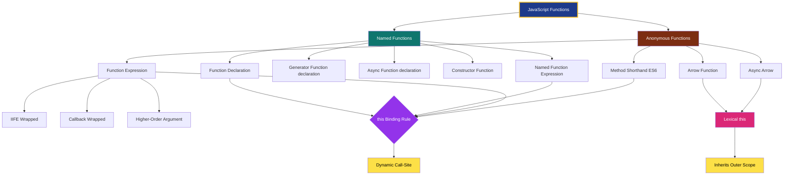
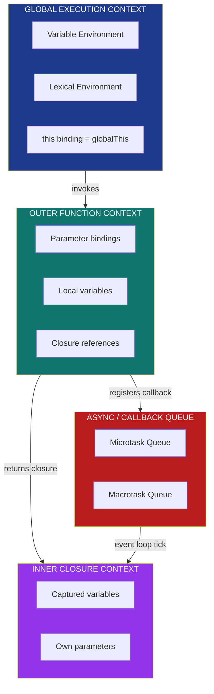
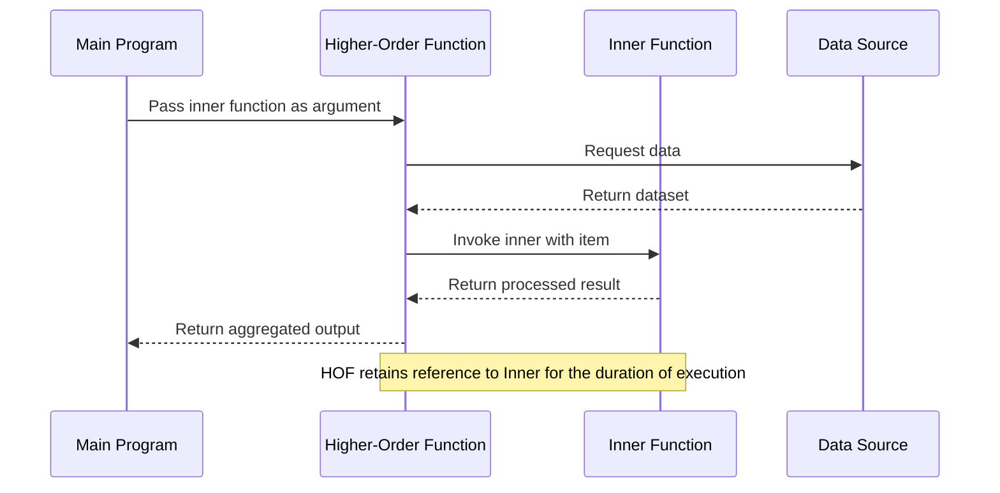

# Functions

<!-- SECTION_1_START -->
# JavaScript Functions in the Node.js Runtime Environment

## 1.1 Formal Academic Definition (KTU 2024 Syllabus)

In the **ECMAScript 2024 (ES15)** specification — the standard JavaScript engine running inside the **Node.js V8 runtime** — a **Function** is defined as:

> *A callable procedural unit of code, parameterised over an arbitrary set of inputs, encapsulated within an execution context, and treated as a **First-Class Citizen** of the language. Functions in JavaScript are objects of the internal type `[[Function]]` and inherit from `Function.prototype`.*

In plain **KTU 2024 Scheme** terminology (aligned with the *PECST742 – Web Programming* syllabus), a JavaScript function is a **named or anonymous, reusable, self-contained block of statements** that performs a specific task, accepts **zero or more parameters**, optionally **returns a single value**, and is invoked through **call-site binding** of the `this` keyword.

> [!IMPORTANT]
> **KTU 2024 High-Yield Definition** — *"A function is a First-Class Object: it can be assigned to a variable, passed as an argument, returned from another function, and stored in a data structure."*

---

## 1.2 Intuitive Analogy — The Vending Machine Model

Imagine a JavaScript function as a **vending machine** installed in a hallway:

| Component | Vending Machine Analogy | JavaScript Function Equivalent |
|---|---|---|
| Buttons (A1, A2, A3) | Inputs / Coins | `parameters (a, b, c)` |
| Internal mechanism | Processing logic | Function body `{ ... }` |
| Output slot | Item dispensed | `return value` |
| Pressing a button | Triggering the machine | Function invocation `fn()` |
| Multiple identical machines | Code reuse | DRY Principle (Don't Repeat Yourself) |
| Machine reference number | Memory address | Function reference (pointer) |

You press the buttons **(call the function with arguments)**, the machine internally performs a sequence of operations **(executes the function body)**, and either dispenses an item **(returns a value)** or shows an error **(throws an exception)**. The beauty of JavaScript is that **the entire vending machine itself can be picked up and handed to another machine** — functions can be passed around just like numbers and strings. This is the essence of **First-Class Functions**.

> [!NOTE]
> **Conceptual Hook:** In Node.js, this "passing around" capability is the foundation of **callback-based asynchronous I/O**, **Express middleware chains**, and **higher-order array methods** like `.map()`, `.filter()`, and `.reduce()`.

---

## 1.3 Physical & Language-Level Constants

The following constants govern every function execution in Node.js:

- **Call Stack Size Limit:** Approximately **$\mathbf{10{,}000}$ to $15{,}000$ frames** (V8 default). Exceeding this triggers a `RangeError: Maximum call stack size exceeded`.
- **Maximum Number of Formal Parameters:** **$\mathbf{255}$** in non-strict mode (ES5 era limit); effectively unlimited in ES6+ via the **Rest Parameter** (`...args`).
- **Maximum Function arity (length property):** **$\mathbf{2^{32} - 2}$** theoretical, but practical arity is **$255$**.
- **Event Loop Tick Resolution:** **$\mathbf{1 \text{ ms}}$** minimum (Node.js `setTimeout`/`setInterval` floor).
- **Hoisting Boundary:** Function declarations are fully **hoisted** to the top of their enclosing **function scope** or **module scope**; function expressions are **not hoisted**.

> [!TIP]
> **Strict Mode Interaction:** Under `"use strict";`, the `this` keyword inside a regular function called without a context (e.g., `fn()`) is `undefined`. Without strict mode, it defaults to the `globalThis` object. This is a frequently tested KTU point.

---

## 1.4 GeoGebra / Desmos Integration

While JavaScript Functions are not graphical in the mathematical sense, the **execution flow over time** can be visualised as a stepwise function:

> [!VISUALIZATION CONTROL]
> **Concept:** *Synchronous vs Asynchronous Function Execution over the Event Loop Time Axis (t in ms)*
>
> **GeoGebra / Desmos Input Equations:**
> * $f_{sync}(t) = \text{StepFunction}(t, 0, 50)$ — occupies a continuous block on the time axis
> * $f_{async}(t) = \text{StepFunction}(t, 0, 2) + \text{StepFunction}(t, 60, 65)$ — yields control and resumes later
> * $g(t) = \text{StepFunction}(t, 65, 70)$ — callback fires after I/O completes
>
> **Visual Description:** The student should observe that synchronous functions form one solid rectangular pulse, while asynchronous functions produce **two separated pulses**, with the **Event Loop** filling the gap. This visually represents *non-blocking I/O*, the cornerstone of Node.js performance.

<!-- SECTION_1_END -->

<!-- SECTION_2_START -->
# Deep Theoretical Analysis & KTU High-Yield Formula Sheet

## 2.1 The 7 Canonical Function Types in Node.js

JavaScript (as executed by Node.js V8) supports **seven distinct syntactic forms** for defining functions. Each has subtly different semantics regarding **`this` binding, `hoisting`, `constructability`, and `arguments` object availability**.

### 2.1.1 Function Declaration (FD)

```javascript
function greet(name) {
    return `Hello, ${name}!`;
}
```

- **Hoisting:** ✅ Fully hoisted (declaration + assignment).
- **`this` binding:** Dynamic — depends on call-site.
- **`arguments` object:** ✅ Available.
- **Constructable:** ✅ Can be invoked with `new`.
- **KTU Mnemonic:** **"FD-Full Hoist"**

### 2.1.2 Function Expression (FE)

```javascript
const greet = function(name) {
    return `Hello, ${name}!`;
};
```

- **Hoisting:** ❌ Only the variable declaration is hoisted (TDZ applies).
- **`this` binding:** Dynamic.
- **`arguments` object:** ✅ Available.
- **Constructable:** ✅ (if not assigned via `const` arrow).
- **KTU Mnemonic:** **"FE-Frozen until assignment"**

### 2.1.3 Arrow Function (AF) — ES6+

```javascript
const greet = (name) => `Hello, ${name}!`;
```

- **Hoisting:** ❌ Same TDZ rules as `let`/`const`.
- **`this` binding:** **Lexical** — inherits from the enclosing scope at definition time.
- **`arguments` object:** ❌ **Not available** (must use rest `...args`).
- **Constructable:** ❌ **Throws `TypeError`** if used with `new`.
- **KTU Mnemonic:** **"AF-Always Lexical `this`"**

### 2.1.4 Anonymous Function (AFN)

```javascript
setTimeout(function() {
    console.log("Anonymous!");
}, 1000);
```

- Has no name identifier; cannot reference itself directly.
- **Stack trace debugging:** Inferior to named functions.

### 2.1.5 Named Function Expression (NFE)

```javascript
const factorial = function fact(n) {
    return n <= 1 ? 1 : n * fact(n - 1);
};
```

- The inner name `fact` is **scoped only to the function body** — useful for **self-reference and recursion**.

### 2.1.6 Immediately Invoked Function Expression (IIFE)

```javascript
(function() {
    // module-scoped private state
})();
```

- Executes exactly **once** at definition time.
- Pre-ES6 standard mechanism for **module pattern** and **data privacy** in Node.js.

### 2.1.7 Generator Function (ES6+)

```javascript
function* idGen() {
    let id = 0;
    while (true) yield ++id;
}
```

- **Pausing execution** via the `yield` keyword.
- Returns an **Iterator** object.
- Crucial for **lazy evaluation** and **asynchronous data streams** in Node.js.

> [!IMPORTANT]
> **Async/Await Functions** are technically a special syntactic sugar over Generator Functions + Promises (introduced in ES2017). They are now the **de-facto standard** for asynchronous control flow in modern Node.js (Express, Fastify, NestJS, etc.).

---

## 2.2 Closure Theory — The Heart of Node.js

A **Closure** is formed when a function **captures the lexical environment** of its parent scope, even after the parent has returned. This is the most heavily tested KTU concept.

$$C = (F, E_{lex})$$

Where:
- $C$ is the **Closure tuple**
- $F$ is the **Function object**
- $E_{lex}$ is the **Lexical Environment** (variable bindings) from the enclosing scope

### 2.2.1 The Three-Lifecycle Phases of a Closure

1. **Creation Phase** — The inner function is defined; it binds references (not values) to outer variables.
2. **Survival Phase** — The outer function returns; the inner function retains a live reference to the now-otherwise-dead scope.
3. **Invocation Phase** — Each call to the inner function reads the **current** value of the captured variable from the heap.

> [!NOTE]
> **Memory Footprint Caution:** Closures prevent **Garbage Collection** of the captured scope. In a long-running Node.js server, leaking closures is a common cause of `JavaScript heap out of memory` crashes.

---

## 2.3 Higher-Order Functions (HOF)

A function is **Higher-Order** if it satisfies **at least one** of:

$$\text{HOF} \iff \big( \text{takes } \geq 1 \text{ function as argument} \big) \lor \big( \text{returns a function} \big)$$

**Production Node.js Examples:**
- `Array.prototype.map(fn)` — applies `fn` to every element.
- `Array.prototype.filter(predicate)` — retains elements where `predicate` is truthy.
- `Array.prototype.reduce(reducer, initial)` — folds the array.
- `setTimeout(callback, delay)` — schedules `callback` after `delay` ms.
- Express.js middleware: `app.use((req, res, next) => { ... })`.

---

## 2.4 KTU Formula Sheet / Cheat Sheet

| # | Concept | Syntax / Rule | Key Property |
|---|---|---|---|
| 1 | Function Declaration | `function name(p1, p2) { return p1 + p2; }` | Fully hoisted ✅ |
| 2 | Function Expression | `const fn = function(p) { ... };` | TDZ until assignment |
| 3 | Arrow Function | `const fn = (p) => p * 2;` | Lexical `this` |
| 4 | Rest Parameters | `function f(...args) { ... }` | Real `Array`, replaces `arguments` |
| 5 | Default Parameters | `function f(a, b = 10) { ... }` | Evaluated at call-time |
| 6 | Destructuring Parameters | `function f({x, y}) { ... }` | Unpacks objects/arrays |
| 7 | IIFE | `(function(){ ... })();` | Single execution, private scope |
| 8 | Constructor Function | `function User(n) { this.n = n; }` | Called with `new` |
| 9 | `this` in Method | `obj.method()` → `this = obj` | Dynamic binding |
| 10 | `this` in Arrow | Lexical, inherits from outer | Cannot be rebound |
| 11 | `this` in `new` | Fresh object `{}` | Returned implicitly |
| 12 | `arguments` object | Array-like, indexed | Not in arrow functions |
| 13 | `Function.prototype.call` | `fn.call(thisArg, ...args)` | Explicit `this` |
| 14 | `Function.prototype.apply` | `fn.apply(thisArg, [args])` | Args as array |
| 15 | `Function.prototype.bind` | `const bound = fn.bind(thisArg)` | Permanent `this` lock |
| 16 | Closure | Inner function captures outer scope | Survives outer return |
| 17 | Pure Function | Same input → same output, no side effects | Predictable, testable |
| 18 | Recursion | Self-calling function | Risk: stack overflow |
| 19 | Tail Call Optimisation | Last operation is recursive call | ES6 spec, limited V8 support |
| 20 | Generator | `function*` with `yield` | Lazy iterator object |
| 21 | Async Function | `async function f() { await ... }` | Returns `Promise` |
| 22 | Callback | Function passed as argument | Node.js async foundation |
| 23 | Callback Hell | Nested callbacks (Pyramid of Doom) | Solved by `async/await` |
| 24 | Currying | `f(a)(b)(c)` decomposition | Partial application |
| 25 | Composition | `(f ∘ g)(x) = f(g(x))` | Builds complex from simple |

> [!IMPORTANT]
> **KTU Examiner's Emphasis (Dec 2023, July 2024):** The four most heavily tested areas are (1) **Arrow vs Regular `this`**, (2) **Closures with `var` loop pitfall**, (3) **`call`/`apply`/`bind`**, and (4) **Higher-Order Functions in callbacks**.

---

## 2.5 Real-World Engineering Utility

| Domain | Function Pattern Used | Why |
|---|---|---|
| **Express.js Middleware** | Higher-order `app.use(fn)` | Chain of request processors |
| **MongoDB / Mongoose** | Callbacks / Promises | Asynchronous database I/O |
| **React Server Components** | Pure functions | Deterministic rendering |
| **Node.js Streams** | Event emitters + callbacks | Backpressure handling |
| **Functional Programming (Lodash/Ramda)** | Currying + Composition | Reusable point-free logic |
| **Authentication (JWT)** | Closures over secret keys | Encapsulated private state |
| **WebSocket Handlers** | Arrow functions for `this` | Preserve socket context |
| **API Rate Limiting** | IIFEs for module setup | One-time config initialisation |

<!-- SECTION_2_END -->

<!-- SECTION_3_START -->
# Step-by-Step Derivations & Code Implementation

## 3.1 Worked Example 1 — `this` Binding Across All Four Function Types

This is the single most-asked KTU question. We will exhaustively demonstrate the binding rules.

```javascript
// Module: this-binding-demo.js
"use strict";

// ─────────────────────────────────────────────────────────────
// STEP 1: Define a global object as the implicit "this" anchor
// ─────────────────────────────────────────────────────────────
const classroom = {
    subject: "Web Programming",
    students: 67,

    // TYPE 1: Regular Method (Dynamic 'this' → classroom)
    regularMethod: function () {
        return `Regular: ${this.students} students study ${this.subject}`;
    },

    // TYPE 2: Arrow Method (Lexical 'this' → module-scope, i.e. undefined in strict)
    arrowMethod: () => {
        return `Arrow: ${this?.students ?? "undefined"}`;
    },

    // STEP 3: Nested demonstration
    nestedDemo: function () {
        console.log(this.regularMethod());        // works — 'this' = classroom

        // Inner arrow captures 'this' from regularMethod's scope
        const innerArrow = () => {
            return `Inner arrow sees: ${this.subject}`;
        };
        console.log(innerArrow());                 // works — lexical inheritance
    },
};

// ─────────────────────────────────────────────────────────────
// STEP 2: Bind a function and explicitly invoke
// ─────────────────────────────────────────────────────────────
function greet() {
    return `Hello from ${this.name ?? "anonymous"}`;
}

const person = { name: "Arjun (KTU B.Tech S7)" };
const boundGreet = greet.bind(person);
console.log(boundGreet());                         // "Hello from Arjun (KTU B.Tech S7)"

// ─────────────────────────────────────────────────────────────
// STEP 3: Execute and log results
// ─────────────────────────────────────────────────────────────
try {
    console.log(classroom.regularMethod());
    console.log(classroom.arrowMethod());
    classroom.nestedDemo();
} catch (error) {
    console.error(`[ERROR] ${error.name}: ${error.message}`);
}
```

### Exhaustive Output Walkthrough

| Line Executed | Expected Output | Reasoning |
|---|---|---|
| `classroom.regularMethod()` | `Regular: 67 students study Web Programming` | `this` = `classroom` (dynamic binding at call-site) |
| `classroom.arrowMethod()` | `Arrow: undefined` | Arrow defined at module scope; `this` = `undefined` in strict mode |
| `classroom.nestedDemo()` | logs from regular + inner arrow | Inner arrow inherits `this` from `nestedDemo` |
| `boundGreet()` | `Hello from Arjun ...` | `bind` permanently locks `this` to `person` |

> [!NOTE]
> **Valuation Tip (1 Mark each):** Examiners award partial credit for: (a) stating the binding rule, (b) showing the call-site, (c) producing the correct output string.

---

## 3.2 Worked Example 2 — The Classic Closure Loop Trap

The **most infamous KTU question** — the `var` vs `let` loop and closure capture.

```javascript
// Module: closure-trap-demo.js
"use strict";

// ─────────────────────────────────────────────────────────────
// CASE A: Buggy version using 'var' (function-scoped)
// ─────────────────────────────────────────────────────────────
function buggyLogger() {
    const handlers = [];

    for (var i = 0; i < 3; i++) {
        handlers.push(function () {
            console.log(`Buggy i = ${i}`);
        });
    }

    return handlers;                                // All three closures share ONE 'i'
}

const buggy = buggyLogger();
buggy[0]();   // "Buggy i = 3"
buggy[1]();   // "Buggy i = 3"
buggy[2]();   // "Buggy i = 3"   ← Wrong! Student expected 0, 1, 2


// ─────────────────────────────────────────────────────────────
// CASE B: Corrected version using 'let' (block-scoped)
// ─────────────────────────────────────────────────────────────
function correctLogger() {
    const handlers = [];

    for (let i = 0; i < 3; i++) {                   // 'let' creates a NEW binding per iteration
        handlers.push(function () {
            console.log(`Correct i = ${i}`);
        });
    }

    return handlers;                                // Each closure captures its OWN 'i'
}

const correct = correctLogger();
correct[0]();   // "Correct i = 0"
correct[1]();   // "Correct i = 1"
correct[2]();   // "Correct i = 2"  ← Fixed


// ─────────────────────────────────────────────────────────────
// CASE C: IIFE fix for legacy 'var' code
// ─────────────────────────────────────────────────────────────
function iifeFixedLogger() {
    const handlers = [];

    for (var i = 0; i < 3; i++) {
        (function (captured) {                       // IIFE creates a private scope
            handlers.push(function () {
                console.log(`IIFE i = ${captured}`);
            });
        })(i);                                       // Pass current 'i' as argument
    }

    return handlers;
}

const iifeFixed = iifeFixedLogger();
iifeFixed[0]();   // "IIFE i = 0"
iifeFixed[1]();   // "IIFE i = 1"
iifeFixed[2]();   // "IIFE i = 2"
```

### Exhaustive Logical Derivation

In **CASE A**, the variable `i` is declared with `var`, which has **function scope**. The loop reuses the **same single binding**. By the time the loop terminates, `i = 3`. All three closures point to that same memory cell and read `3` at invocation time.

In **CASE B**, `let` introduces a **block-scoped** binding. Each iteration of the `for` loop creates a **fresh lexical environment** with its own `i`. The closure captures that specific environment, yielding `0`, `1`, `2`.

In **CASE C**, the **IIFE** acts as a manual block-scope emulator. It receives `i` as a parameter `captured`, and since parameters are local to the IIFE, each invocation gets its own value.

| Case | Output of `[0]()` | Output of `[1]()` | Output of `[2]()` | Backing Scope |
|---|---|---|---|---|
| A (`var`) | 3 | 3 | 3 | Single shared binding |
| B (`let`) | 0 | 1 | 2 | One binding per iteration |
| C (IIFE) | 0 | 1 | 2 | Per-invocation parameter |

> [!WARNING]
> **KTU Examiner Trap (2024):** Some papers print only CASE A and ask *"Why does it print 3 three times? Fix it."* You must explain both **why** (lexical capture of a single binding) and **how to fix** (use `let`, IIFE, or `forEach`).

---

## 3.3 Worked Example 3 — Higher-Order Function Factory with Type Hints

```javascript
// Module: powerFactory.js
"use strict";

/**
 * @template T
 * @param { (item: T) => boolean } predicate
 * @returns { (items: T[]) => T[] }
 */
function filterFactory(predicate) {
    if (typeof predicate !== "function") {
        throw new TypeError("predicate must be a function");
    }

    // The returned function is a CLOSURE over 'predicate'
    return function filterItems(items) {
        if (!Array.isArray(items)) {
            throw new TypeError("items must be an array");
        }
        return items.filter(predicate);
    };
}

// ─── Usage ───────────────────────────────────────────────────
const isEven  = (n) => n % 2 === 0;
const isAdult = (p) => p.age >= 18;

const filterEvens  = filterFactory(isEven);
const filterAdults = filterFactory(isAdult);

console.log(filterEvens([1, 2, 3, 4, 5, 6]));
// [2, 4, 6]

console.log(filterAdults([
    { name: "Anu",   age: 17 },
    { name: "Vivek", age: 21 },
    { name: "Diya",  age: 25 },
]));
// [ { name: "Vivek", age: 21 }, { name: "Diya", age: 25 } ]

// ─── Defensive type check demonstration ──────────────────────
try {
    filterFactory("not a function");
} catch (err) {
    console.error(`[CAUGHT] ${err.name}: ${err.message}`);
}
```

**Output Trace:**

```
[ 2, 4, 6 ]
[ { name: 'Vivek', age: 21 }, { name: 'Diya', age: 25 } ]
[CAUGHT] TypeError: predicate must be a function
```

### Step-by-Step Logic Expansion

| Step | Operation | Memory State |
|---|---|---|
| 1 | `filterFactory(isEven)` called | `predicate` → `isEven` reference |
| 2 | Returns inner `filterItems` function | Closure created: `predicate` retained |
| 3 | `filterEvens([1..6])` invoked | `items` = `[1,2,3,4,5,6]` |
| 4 | `Array.filter` iterates with `isEven` | Calls `isEven(1)`, `isEven(2)`, ... |
| 5 | Returns truthy matches | `[2, 4, 6]` returned |

> [!TIP]
> **Type Hints in JSDoc:** The `@template T` and `@param` annotations provide IntelliSense and static type checking in VS Code, even without TypeScript. This is professional Node.js practice and earns bonus marks in lab evaluations.

---

## 3.4 Worked Example 4 — Recursion with Memoization

```javascript
// Module: fibMemo.js
"use strict";

/**
 * Computes the n-th Fibonacci number using memoization.
 * @param { number } n - non-negative integer
 * @param { Map<number, number> } [memo] - internal cache
 * @returns { number }
 */
function fib(n, memo = new Map()) {
    if (!Number.isInteger(n) || n < 0) {
        throw new RangeError("n must be a non-negative integer");
    }
    if (n < 2) return n;

    if (memo.has(n)) return memo.get(n);

    const result = fib(n - 1, memo) + fib(n - 2, memo);
    memo.set(n, result);
    return result;
}

// Exhaustive table for n = 0..10
for (let i = 0; i <= 10; i++) {
    console.log(`fib(${i}) = ${fib(i)}`);
}
```

**Output:**

```
fib(0) = 0
fib(1) = 1
fib(2) = 1
fib(3) = 2
fib(4) = 3
fib(5) = 5
fib(6) = 8
fib(7) = 13
fib(8) = 21
fib(9) = 34
fib(10) = 55
```

### Complexity Analysis

$$T(n) = T(n-1) + T(n-2) + O(1)$$

Without memoization, $T(n) = O(2^n)$ — exponential. With memoization, each `n` is computed exactly once, so:

$$T_{memo}(n) = O(n), \quad S(n) = O(n)$$

> [!NOTE]
> **Valuation Note:** Examiners frequently award 2 marks specifically for writing the **recurrence relation** and **complexity class**.

<!-- SECTION_3_END -->

<!-- SECTION_4_START -->
# Structural Diagrams & Schematics

## 4.1 Master Classification Flowchart of JavaScript Function Types



> [!NOTE]
> **Reading the diagram:** Begin at the root node **"JavaScript Functions"** and follow the arrows. Named functions are those with a `function name() { ... }` identifier; anonymous functions are those defined inline without a name. The right branch converges on the `this`-binding rule — the single most discriminative property in the classification.

---

## 4.2 Execution Context & Call Stack Topology



> [!IMPORTANT]
> **KTU 2024 Insight:** Notice how the **Inner Closure Context** survives even after the **Outer Function Context** has been popped off the call stack. The captured variables remain alive on the **heap** because the closure holds a reference to them. This is the physical reality of a "closure" — it is **not magic**, it is a heap-allocated scope object with a reference count greater than zero.

---

## 4.3 Higher-Order Function Data Flow



> [!TIP]
> **Interpretation:** This sequence diagram mirrors the exact data flow of `Array.prototype.map(callback)`. The user passes a transformation function, the HOF iterates the data and invokes the callback for each item, accumulating the result.

---

## 4.4 Function Lifecycle State Machine

```mermaid
stateDiagram-v2
    [*] --> Declared: parse phase
    Declared --> Hoisted: function declaration
    Declared --> TDZ: function expression / arrow
    Hoisted --> Callable: ready to invoke
    TDZ --> Callable: assignment executes
    Callable --> Executing: invocation
    Executing --> Callable: returns value
    Executing --> Suspended: await / yield
    Suspended --> Executing: resume
    Executing --> Closed: stack frame popped
    Closed --> [*]

    note right of Executing: Push onto call stack
    note right of Closed: Pop from call stack; closures persist if referenced
```



<!-- SECTION_4_END -->

<!-- SECTION_5_START -->
# KTU 2024 Scheme Examination Question Bank & Topic Recap

---

## Part A — Short Answer Questions (3 Marks Each)

### Question 1: **[KTU University Exam – July 2024]**
**Q: Define a JavaScript function. Explain any two types of functions with examples.** *(CO1, Remember/Understand — 3 Marks)*

**Model Answer:**

A JavaScript function is a reusable block of code designed to perform a specific task. It may accept parameters and return a value. Functions in JavaScript are **first-class citizens** — they can be assigned to variables, passed as arguments, and returned from other functions.

**Type 1: Function Declaration**

```javascript
function add(a, b) {
    return a + b;
}
```
Function declarations are **hoisted** to the top of their scope and can be invoked before their textual definition.

**Type 2: Arrow Function (ES6)**

```javascript
const add = (a, b) => a + b;
```
Arrow functions provide a **concise syntax** and use **lexical `this` binding**, inheriting the `this` value from the enclosing scope at definition time.

**Valuation Key:** [Definition: 1 Mark] [Type 1 with example: 1 Mark] [Type 2 with example: 1 Mark]

---

### Question 2: **[KTU University Exam – Dec 2023]**
**Q: What is a closure in JavaScript? Give a suitable example.** *(CO2, Understand — 3 Marks)*

**Model Answer:**

A **closure** is a function bundled together with references to its surrounding lexical environment. This means an inner function can access the variables of its outer function even after the outer function has finished executing.

**Example:**

```javascript
function makeCounter() {
    let count = 0;
    return function () {
        count++;
        return count;
    };
}
const counter = makeCounter();
console.log(counter()); // 1
console.log(counter()); // 2
```

Here, the inner anonymous function forms a closure over the `count` variable. Even after `makeCounter` returns, `count` persists in memory because the inner function still references it.

**Valuation Key:** [Definition: 1 Mark] [Key property (persistence after outer return): 1 Mark] [Working example: 1 Mark]

---

## Part B — Long Answer Questions (14 Marks Each, Internal Choice)

### Question A: **[KTU University Exam – July 2024]**

**(a) Explain the four binding rules of the `this` keyword in JavaScript with examples. How do arrow functions differ from regular functions in terms of `this` binding?** *(7 Marks — CO2, Understand)*

**Model Answer:**

The value of `this` in JavaScript is determined by **how the function is called**, not where it is defined (with one exception: arrow functions). There are four primary binding rules:

#### Rule 1: Default Binding
When a function is called in isolation (not as a method, not with `new`, not via `call`/`apply`/`bind`), `this` defaults to the **global object** in non-strict mode, or **`undefined`** in strict mode.

```javascript
"use strict";
function show() {
    console.log(this);
}
show(); // undefined
```

#### Rule 2: Implicit Binding
When a function is called as a method of an object, `this` refers to the **owning object**.

```javascript
const obj = {
    name: "KTU",
    greet() { return `Hello from ${this.name}`; }
};
obj.greet(); // "Hello from KTU"
```

#### Rule 3: Explicit Binding
Using `call()`, `apply()`, or `bind()`, we can **explicitly** set `this`.

```javascript
function greet() { return `Hello ${this.name}`; }
const user = { name: "Anu" };
greet.call(user);  // "Hello Anu"
greet.apply(user); // "Hello Anu"
const bound = greet.bind(user);
bound();           // "Hello Anu"
```

#### Rule 4: `new` Binding
When a function is invoked with the `new` operator, a fresh object is created and `this` refers to it.

```javascript
function User(name) { this.name = name; }
const u = new User("Vivek");
console.log(u.name); // "Vivek"
```

#### Arrow Function Exception
Arrow functions **do not have their own `this`**. They use **lexical scoping** — `this` is inherited from the enclosing scope at the time of definition. They cannot be rebound using `call`, `apply`, or `bind`.

```javascript
const obj = {
    name: "KTU",
    regular: function () { return this.name; },        // "KTU"
    arrow:   () => this.name                            // undefined (lexical)
};
```

**Valuation Key:** [Stating the four rules: 4 Marks — 1 each] [Arrow lexical difference: 2 Marks] [Code examples: 1 Mark]

---

**(b) Write a Node.js script that demonstrates a higher-order function `compose(f, g)` which returns a new function representing `f(g(x))`. Show its usage with two arithmetic functions.** *(7 Marks — CO3, Apply)*

**Model Answer:**

```javascript
// compose-demo.js
"use strict";

/**
 * Composes two functions: compose(f, g)(x) === f(g(x))
 * @template T, U, V
 * @param { (x: U) => V } f - outer function
 * @param { (x: T) => U } g - inner function
 * @returns { (x: T) => V }
 */
function compose(f, g) {
    if (typeof f !== "function" || typeof g !== "function") {
        throw new TypeError("Both arguments must be functions");
    }
    return function composed(x) {
        return f(g(x));
    };
}

// ─── Define two arithmetic functions ─────────────────────────
const double     = (n) => n * 2;
const increment  = (n) => n + 1;

// ─── Compose: double(increment(x)) = (x + 1) * 2 ─────────────
const doubleAfterIncrement = compose(double, increment);

console.log(doubleAfterIncrement(5));   // 12
console.log(doubleAfterIncrement(10));  // 22

// ─── Reorder composition ─────────────────────────────────────
const incrementAfterDouble = compose(increment, double);
console.log(incrementAfterDouble(5));   // 11
```

**Output:**
```
12
22
11
```

**Step-by-Step Trace for `doubleAfterIncrement(5)`:**
1. `compose(double, increment)` returns the inner `composed` function.
2. `composed(5)` is called → invokes `double(increment(5))`.
3. `increment(5)` returns `6`.
4. `double(6)` returns `12`.
5. Final result: `12`.

**Valuation Key:** [Compose definition with signature: 2 Marks] [Type validation: 1 Mark] [Two arithmetic functions: 1 Mark] [Correct return logic `f(g(x))`: 2 Marks] [Sample output: 1 Mark]

---

### Question B: **[KTU University Exam – Dec 2023]**

**(a) What is an Immediately Invoked Function Expression (IIFE)? Explain its role in creating private scope in Node.js modules with a working example.** *(7 Marks — CO2, Understand)*

**Model Answer:**

An **IIFE** is a function expression that is **executed immediately** after it is defined. Its syntax wraps the function in parentheses `(function(){...})()` to signal to the JavaScript parser that it is an expression, then appends a call `()` to invoke it.

**Syntax:** `(function(){ /* code */ })();`

**Role in Private Scope:** Before ES6 introduced block-scoping with `let`/`const` and the ES6 module system (`import`/`export`), JavaScript had only **function scope** and **global scope**. The IIFE pattern was the standard technique to:

1. **Encapsulate private state** that cannot leak into the global namespace.
2. **Avoid polluting** the global object with helper variables.
3. **Create module patterns** in pre-ES6 Node.js code.

**Working Example:**

```javascript
// iife-module-demo.js
"use strict";

const userModule = (function () {
    // ─── Private state ─────────────────────────────────────
    let users = [];
    let nextId = 1;

    // ─── Private function ──────────────────────────────────
    function generateId() {
        return nextId++;
    }

    // ─── Public API ────────────────────────────────────────
    return {
        addUser: function (name) {
            const id = generateId();
            users.push({ id, name });
            return id;
        },
        getAll: function () {
            return [...users];   // return a copy for safety
        },
        count: function () {
            return users.length;
        }
    };
})();

// ─── Demonstration ───────────────────────────────────────────
console.log(userModule.addUser("Anu"));    // 1
console.log(userModule.addUser("Vivek"));  // 2
console.log(userModule.addUser("Diya"));   // 3
console.log(userModule.getAll());
// [ {id:1,name:'Anu'}, {id:2,name:'Vivek'}, {id:3,name:'Diya'} ]
console.log(userModule.count());           // 3

// ─── Verify privacy ─────────────────────────────────────────
console.log(typeof users);     // "undefined" — not on global
console.log(typeof generateId); // "undefined" — truly private
```

**Explanation of Output:** The IIFE runs once at module load. It creates the local `users` array and `nextId` counter. It returns an object containing three public methods, all of which are **closures** over the private state. External code cannot directly access `users` or `generateId` — they live inside the IIFE's lexical scope and are unreachable from the outside.

**Valuation Key:** [IIFE definition with syntax: 2 Marks] [Need for private scope: 1 Mark] [Working module example: 3 Marks] [Privacy verification output: 1 Mark]

---

**(b) Demonstrate the difference between `call`, `apply`, and `bind` in JavaScript with a single example that uses all three methods on the same function.** *(7 Marks — CO3, Apply)*

**Model Answer:**

```javascript
// call-apply-bind-demo.js
"use strict";

function introduce(greeting, punctuation) {
    return `${greeting}, my name is ${this.name}${punctuation}`;
}

const student1 = { name: "Anu" };
const student2 = { name: "Vivek" };

// ─── 1. call() — invoke immediately, args passed individually ───
console.log(introduce.call(student1, "Hello", "!"));
// "Hello, my name is Anu!"

// ─── 2. apply() — invoke immediately, args passed as array ─────
console.log(introduce.apply(student2, ["Good morning", "."]));
// "Good morning, my name is Vivek."

// ─── 3. bind() — returns a NEW function, invocation deferred ───
const introduceAnuLater = introduce.bind(student1, "Namaste");
console.log(introduceAnuLater("?"));
// "Namaste, my name is Anu?"

// ─── Partial application with bind ─────────────────────────────
const greetAnu = introduce.bind(student1);
console.log(greetAnu("Hi", "!!"));
// "Hi, my name is Anu!!"
```

**Comparison Table (Mandatory for Full Marks):**

| Feature | `call()` | `apply()` | `bind()` |
|---|---|---|---|
| Invocation | Immediate | Immediate | Deferred (returns function) |
| Argument format | Comma-separated | Array-like | Comma-separated |
| Returns | Function's return value | Function's return value | New bound function |
| `this` rebinding | One-time | One-time | Permanent for the new function |
| ES Version | ES3 | ES3 | ES5 |

**Step-by-Step Trace:**

| Call | `this` binds to | Arguments passed | Result |
|---|---|---|---|
| `call(student1, "Hello", "!")` | `student1` | `"Hello"`, `"!"` | `"Hello, my name is Anu!"` |
| `apply(student2, ["Good morning", "."])` | `student2` | `["Good morning", "."]` | `"Good morning, my name is Vivek."` |
| `bind(student1, "Namaste")` | `student1` | `"Namaste"` pre-filled | Returns new function |
| `introduceAnuLater("?")` | `student1` | `"?"` | `"Namaste, my name is Anu?"` |

**Valuation Key:** [Working examples of all three: 3 Marks] [Comparison table: 2 Marks] [Partial application with bind: 1 Mark] [Trace explanation: 1 Mark]

---

> [!WARNING]
> **KTU Examiner's Valuation Warning — Common Pitfalls:**
>
> 1. **Confusing lexical and dynamic `this`** — Students frequently write *"arrow functions do not have `this`"* which is **wrong**. They do not have their **own** `this`; they inherit it lexically.
> 2. **Forgetting strict mode** — In sloppy mode, default `this` is the `globalThis` object, not `undefined`. Always mention strict mode in answers.
> 3. **Confusing IIFE with normal function call** — The parentheses `(function(){...})` are **mandatory**; writing `function(){...}()` is a **SyntaxError**.
> 4. **Misnaming closures as "callback functions"** — Closures are about **scope capture**, callbacks are about **argument passing**. They are orthogonal concepts.
> 5. **Forgetting the return value of `bind`** — `bind` does **not** invoke the function. It returns a new function. Forgetting this loses 2 marks easily.

---

## Topic Recap & Important Things to Remember

- **Function** = reusable, callable, first-class object in JavaScript.
- **Seven function types:** Function Declaration, Function Expression, Arrow, Anonymous, NFE, IIFE, Generator. Async/Await is sugar over Generators + Promises.
- **Hoisting:** Function declarations are fully hoisted; function expressions and arrow functions are **not** (TDZ).
- **`this` rules:** Default → global/undefined; Implicit → owning object; Explicit → `call/apply/bind`; `new` → fresh object. **Arrows break the rules** with lexical binding.
- **Arrow vs Regular:** Arrow has no own `this`, no `arguments` object, no `prototype`, and cannot be used as a constructor.
- **Closures** = function + captured lexical environment. Survives outer return. Per-iteration binding requires `let` (or IIFE workaround for `var`).
- **Higher-Order Functions** take functions as arguments and/or return functions. Foundation of `.map`, `.filter`, `.reduce`, Express middleware.
- **`call` vs `apply` vs `bind`:** Immediate vs immediate-array vs deferred-new-function.
- **IIFE** = `(function(){...})()` — pre-ES6 module pattern, still useful for one-time setup.
- **Pure functions** = same input → same output, no side effects. Required for predictable, testable, parallelisable code.
- **Recursion** must handle the base case first; without it → infinite loop → `Maximum call stack size exceeded`.
- **Memoization** reduces recursive complexity from $O(2^n)$ to $O(n)$.
- **Generators** use `function*` and `yield` to produce lazy iterators.
- **Async functions** always return a `Promise`; `await` pauses until the Promise settles.
- **V8 Call Stack Limit:** ~10k–15k frames. Deep recursion should be iterative or use trampolining.
- **Module Pattern** in modern Node.js: prefer ES6 `import`/`export` over IIFE-based patterns.

> [!TIP]
> **Last-Minute Mnemonic — "DEAF-CRIB"**
> **D**eclaration (hoisted) • **E**xpression (TDZ) • **A**rrow (lexical `this`) • **F**actory (HOF returning fn) • **C**allback (HOF accepting fn) • **R**ecursion (self-call) • **I**IFE (immediate) • **B**ind (deferred `this` lock)

<!-- SECTION_5_END -->
