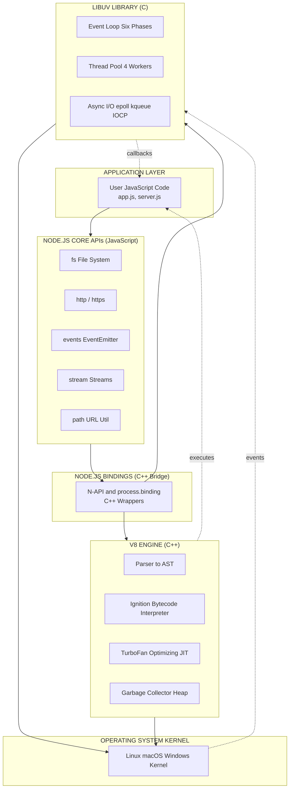
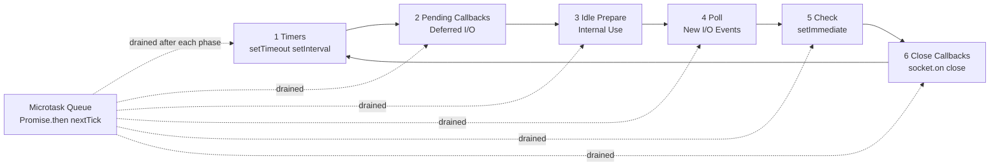
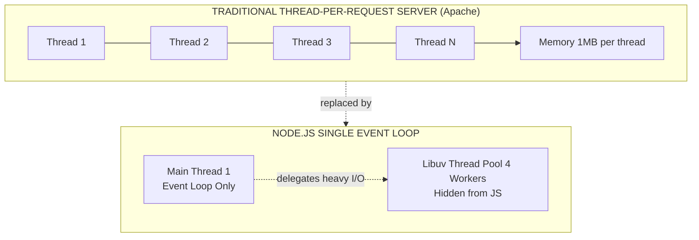
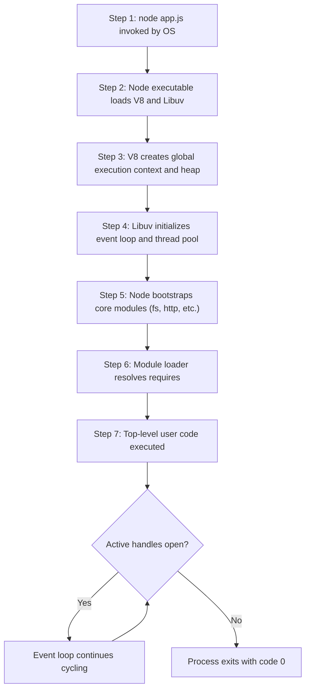

# JavaScript runtime environment : Node.js -  The Architecture of Node.js

<!-- SECTION_1_START -->
# JavaScript Runtime Environment: Node.js — The Architecture of Node.js

> [!IMPORTANT]
> **KTU 2024 Scheme | PECST742 — Web Programming | Module 3**
> This module is tested under **CO3** (Apply server-side JavaScript concepts to build modern web applications) and forms the foundation for full-stack development using the **MERN / MEAN** stack.

---

## 1.1 Formal Academic Definition

**Node.js** is an **open-source, cross-platform, back-end JavaScript runtime environment** that executes JavaScript code **outside of a web browser**. Built on **Google's V8 JavaScript engine** and written in **C, C++, and JavaScript**, Node.js enables developers to use JavaScript for server-side scripting, command-line tools, and network applications.

> [!NOTE]
> **Core Definition (Board-Ready):**
> Node.js = *V8 Engine* + *Libuv Library* + *Node.js Core APIs (in JavaScript)* + *Node.js Bindings (in C/C++)*. It uses a **single-threaded event loop** with a **non-blocking I/O model**, making it ideal for building **highly scalable, data-intensive, real-time network applications**.

### 1.1.1 Official Specification & Standards

| Parameter | Standard Value / Identifier |
| :--- | :--- |
| Initial Release | **May 27, 2009** |
| Author / Creator | **Ryan Dahl** (with sponsors: Joyent) |
| Initial Written In | **C, C++, JavaScript** |
| Latest Stable Engine | **V8 JavaScript Engine** (version linked to Node.js release) |
| License | **MIT License** (open-source) |
| Package Manager | **npm (Node Package Manager)** — world's largest software registry |
| File Extensions | `.js`, `.mjs` (ES modules), `.cjs` (CommonJS) |
| Typical Memory Footprint | Process baseline approximately **30 MB to 50 MB** per instance |
| Threading Model | **Single-threaded (main thread)** with internal **Worker Thread Pool** (default **4 threads**, configurable via `UV_THREADPOOL_SIZE`) |

---

## 1.2 Conceptual Analogy — The Restaurant Kitchen

Imagine a **busy restaurant kitchen** as the Node.js runtime:

| Component in Node.js | Restaurant Analogy | What It Does |
| :--- | :--- | :--- |
| **Single Thread (Event Loop)** | The **Head Chef** | Takes orders (events) one at a time but never blocks waiting for one dish to finish |
| **Libuv Thread Pool** | The **Sous Chefs** | Handle the heavy, time-consuming tasks (boiling pasta, baking) in parallel |
| **Event Queue** | The **Order Ticket Rail** | Holds incoming orders (callbacks) waiting to be picked up |
| **Call Stack** | The **Chef's Hands** | The chef can only execute one synchronous task at a time |
| **V8 Engine** | The **Chef's Brain** | Parses and "understands" the recipes (JavaScript code) into machine instructions |
| **Non-Blocking I/O** | **"I'll call you when pasta is ready"** | The chef does not stand and stare at boiling water; he moves to the next order |

> [!TIP]
> **Intuition Check:** A traditional multi-threaded server (like Apache with `mod_php`) is like a restaurant that assigns **one dedicated chef to every customer**. Node.js is like a restaurant with **one efficient head chef** who delegates heavy work to helpers — this is why Node.js handles **thousands of concurrent connections** with minimal memory.

---

## 1.3 The Big Picture — What Node.js Is *Not*

> [!WARNING]
> **Common Misconception to avoid in the exam:**
> Node.js is **NOT a programming language**, **NOT a framework**, and **NOT a web server out-of-the-box** (it *can* act as one, but you need to create an HTTP server using its built-in `http` module).

| Question | Correct Answer |
| :--- | :--- |
| Is Node.js a language? | **No.** It is a **runtime environment** that executes the JavaScript language. |
| Is Node.js a framework? | **No.** Frameworks built *on top of* Node.js include **Express.js, NestJS, Koa, Fastify**. |
| Is Node.js single-threaded? | **Yes for application code**, but uses a **multi-threaded internal C++ worker pool (Libuv)** for I/O. |
| Does Node.js run only on the server? | **No.** With **Electron, NW.js, React Native, Deno**, Node-based JS runs on desktops and mobile too. |

> [!VISUALIZATION CONTROL]
> **Concept:** Node.js Architecture — Layered Stack Diagram
> **GeoGebra / Desmos Input Equations:** Not applicable (this is a software architecture diagram, see SECTION_4 for the Mermaid block diagram).
> **Visual Description:** Imagine a vertical stack: at the top sits the **JavaScript Application Code**, below it **Node.js Core Modules (in JS)**, then a thin layer of **Node.js Bindings (C/C++)**, then the **V8 Engine** on the left and **Libuv** on the right, sitting directly on the **Operating System Kernel**.

---

<!-- SECTION_1_END -->

<!-- SECTION_2_START -->
# Deep Theoretical Analysis & KTU High-Yield Formula Sheet

## 2.1 The Six Pillars of Node.js Architecture

The Node.js runtime is composed of **six core architectural layers** working in concert. Understanding each layer is essential for the KTU 14-mark questions on this topic.

### Pillar 1 — The V8 JavaScript Engine

* Developed by **Google** in **C++** for the Chrome browser; open-sourced in **2008**.
* Performs **Just-In-Time (JIT) compilation** — JavaScript is first parsed into an Abstract Syntax Tree (AST), then compiled directly to **native machine code** (no bytecode interpretation).
* Implements **ECMAScript** specification (ES5, ES6, ES2020, ES2022 ...).
* Memory managed via a **generational, garbage-collected heap** (Young + Old generations).
* Hidden classes & inline caching make property access extremely fast.

### Pillar 2 — The Node.js Core APIs (JavaScript Layer)

* Built-in modules written in **JavaScript** that developers import via `require('fs')` or `import fs from 'fs'`.
* Categories: **File System (`fs`), HTTP (`http`), Path (`path), URL (`url`), Events (`events`), Streams (`stream`), Crypto (`crypto`), OS (`os), Util (`util`), Child Process (`child_process`)**.
* These modules provide a **developer-friendly abstraction** over the lower-level bindings.

### Pillar 3 — Node.js Bindings (C/C++ Bridge)

* Thin **C++ wrapper layer** (using **N-API** and the legacy `nan` library) that connects JavaScript code to native C++ functions.
* Translates JavaScript objects (V8 `Local<Value>` types) into C++ data structures and vice versa.
* Allows high-performance system calls without leaving the Node.js process.

### Pillar 4 — The Libuv Library (The Heartbeat)

* **Libuv** is a **multi-platform C library** that provides:
  * The **Event Loop** (the main asynchronous I/O loop).
  * **Asynchronous TCP/UDP sockets**.
  * **Asynchronous File and File System operations**.
  * **Thread Pool** (default 4 worker threads, configurable via `process.env.UV_THREADPOOL_SIZE`).
  * **Child Processes** and **Process Management**.
  * **Signal Handling** (SIGINT, SIGTERM, etc.).
* Libuv abstracts the **operating system kernel's I/O facilities**:
  * On **Linux**: uses `epoll`.
  * On **macOS / BSD**: uses `kqueue`.
  * On **Windows**: uses **I/O Completion Ports (IOCP)**.

### Pillar 5 — Operating System & Kernel

* Node.js ultimately delegates low-level operations to the **OS kernel** (file descriptors, sockets, threading, signals).
* The kernel notifies Libuv when an I/O operation is complete (via the **event notification mechanism**).

### Pillar 6 — npm (Node Package Manager)

* The **default package manager**, included with the Node.js installer.
* Hosts the **world's largest software registry** — over **2.1 million open-source packages** (as of 2024).
* Manages the `node_modules/` folder and the `package.json` manifest file.

---

## 2.2 The Single-Threaded Event Loop — Deep Dive

> [!IMPORTANT]
> **Highest-weight concept in the KTU syllabus for Module 3.** You must draw the event loop phases and explain them in order.

The **Event Loop** is what allows Node.js to perform **non-blocking I/O** despite JavaScript itself being single-threaded. The loop has **six (6) distinct phases**, executed in a continuous cycle:

| Phase # | Phase Name | Operations Performed |
| :---: | :--- | :--- |
| 1 | **Timers** | Executes callbacks scheduled by `setTimeout()` and `setInterval()`. |
| 2 | **Pending Callbacks** | Executes I/O callbacks deferred from the previous loop iteration (e.g., certain TCP errors). |
| 3 | **Idle, Prepare** | Internal phase — used by Node.js itself. |
| 4 | **Poll** | Retrieves new I/O events; executes their callbacks. May block here if there are no timers scheduled. |
| 5 | **Check** | Executes callbacks scheduled by `setImmediate()`. |
| 6 | **Close Callbacks** | Executes close-event callbacks (e.g., `socket.on('close', ...)`). |

Between each phase, Node.js also processes **`process.nextTick()` queue** and the **microtask queue** (Promise resolutions).

---

## 2.3 KTU High-Yield Formula Sheet / Quick Reference Table

| Concept | Definition / Formula | Use Case |
| :--- | :--- | :--- |
| **Event Loop** | `while(true) { for each phase: run callbacks }` | Core async dispatch mechanism |
| **Thread Pool Size** | `$UV\_THREADPOOL\_SIZE$` (default = 4) | Increase for heavy `fs` / `crypto` workloads |
| **Heap Memory (V8)** | `$Heap_{old} + Heap_{new}$` | `process.memoryUsage().heapUsed` |
| **Worker Threads** | `$N_{workers} \leq N_{CPU\_cores}$` | Optimal CPU-bound parallelism |
| **Event Loop Lag** | `$L = t_{execute} - t_{enqueue}$` | Measured in `perf_hooks.monitorEventLoopDelay()` |
| **Single-Threaded Code** | `$T_{app} = 1$ thread, all JS code | Bypassed via `worker_threads` |
| **Libuv Handles** | Async I/O: `epoll` (Linux), `kqueue` (macOS), `IOCP` (Windows) | Cross-platform async I/O |
| **V8 JIT Stages** | `Parse → AST → Ignition (bytecode) → TurboFan (machine code)` | Hot path optimization |
| **EventEmitter** | `$emitter.on(eventName, listener)$` | Custom event-based APIs |
| **REPL** | `Read → Eval → Print → Loop` | Interactive Node.js shell |
| **CommonJS Module** | `module.exports = x; const x = require('./x')` | Default module system |
| **ES Modules** | `export default x; import x from './x.mjs'` | Standard ECMAScript modules |

> [!TIP]
> **Memory Trick for the 6 Event Loop Phases:** **"Timers Pending, Idle, Poll, Check, Close"** → **"T-P-I-P-C-C"** → Think of it as **"The Powerful Indian Programming Culture Club"** — silly, but unforgettable in the exam hall.

---

## 2.4 Real-World Engineering Utility

Node.js powers some of the **highest-traffic production systems on Earth**:

* **Netflix**: Uses Node.js for its user interface backend, reducing startup time by **70%**.
* **LinkedIn**: Switched from Ruby on Rails to Node.js for its mobile backend — **2x to 10x faster** with **10x fewer servers**.
* **PayPal**: Served **double the requests per second** and **35% decrease in average response time** after migrating to Node.js.
* **Uber, eBay, NASA, Trello, Walmart**: All use Node.js for real-time, data-intensive, distributed systems.
* **Microservices & REST APIs**: Ideal due to the lightweight, fast-startup nature of the V8 process.
* **IoT & Real-Time Apps**: WebSocket support + event-driven model suits chat apps, live dashboards, and streaming.

---

<!-- SECTION_2_END -->

<!-- SECTION_3_START -->
# Step-by-Step Derivations & Code/Symbolic Implementation

## 3.1 A Complete Walk-Through: How Node.js Executes a Program

Let us trace a simple program through the entire architecture — **no step skipped**.

### 3.1.1 Source Program

```javascript
// hello-node.js
const fs = require('fs');

console.log('1. Start of program');

setTimeout(() => {
    console.log('3. Inside setTimeout (after 0ms)');
}, 0);

setImmediate(() => {
    console.log('4. Inside setImmediate');
});

fs.readFile(__filename, () => {
    console.log('5. File read complete (I/O callback)');
});

Promise.resolve().then(() => {
    console.log('2. Microtask (Promise)');
});

console.log('1b. End of synchronous code');
```

### 3.1.2 Expected Output

```
1. Start of program
1b. End of synchronous code
2. Microtask (Promise)
3. Inside setTimeout (after 0ms)
4. Inside setImmediate
5. File read complete (I/O callback)
```

### 3.1.3 Step-by-Step Trace Through the Architecture

| Step | Component Used | What Happens |
| :---: | :--- | :--- |
| 1 | **Operating System Shell** | User runs `node hello-node.js`. The OS spawns a new Node.js **process** and loads the executable. |
| 2 | **V8 Engine (C++ side)** | V8 allocates the **heap memory** (Young + Old spaces), initializes the **call stack**, and creates the **global execution context**. |
| 3 | **V8 Parser** | The source file is read into a buffer, parsed into an **Abstract Syntax Tree (AST)** by V8's `Parser` (a recursive descent parser). |
| 4 | **V8 Ignition Interpreter** | The AST is compiled into **bytecode** (not machine code yet). Functions are not yet JIT-compiled. |
| 5 | **Node.js Bindings (C++)** | The call `require('fs')` is intercepted by Node's internal `Module._load`. The **C++ binding** `process.binding('fs')` returns the native file-system handle wrapped in a JavaScript object. |
| 6 | **Call Stack (JS)** | The first `console.log('1. Start')` is pushed to the call stack, executed synchronously, and popped. |
| 7 | **V8 TurboFan JIT (if hot)** | Since `console.log` is called many times, V8 eventually detects it as a **hot function** and compiles it to optimized machine code using **TurboFan** (the optimizing compiler). |
| 8 | **Libuv Timer API** | `setTimeout(..., 0)` registers a timer in the **Timers phase heap** of Libuv's internal loop. The callback is queued for execution after at least 0 ms. |
| 9 | **Libuv Check API** | `setImmediate(...)` registers a callback in the **Check phase queue** of the event loop. |
| 10 | **Libuv Thread Pool (worker thread #1)** | `fs.readFile` is an **asynchronous I/O operation**. Libuv dispatches the actual `read()` system call to one of the worker threads in its **Thread Pool** (default size 4). The **main thread is NOT blocked**. |
| 11 | **Microtask Queue** | `Promise.resolve().then(...)` schedules a callback in the **microtask queue**, which is drained **after** the current synchronous script ends and **before** the event loop continues to the next phase. |
| 12 | **Call Stack (JS)** | `console.log('1b. End of synchronous code')` runs synchronously, prints, and pops. |
| 13 | **Script execution finishes** | The call stack becomes empty. |
| 14 | **Microtask Drain** | The microtask queue is drained first → prints `'2. Microtask (Promise)'`. |
| 15 | **Event Loop — Timers phase** | The 0 ms timer is now eligible → prints `'3. Inside setTimeout'`. |
| 16 | **Event Loop — Check phase** | `setImmediate` callback fires → prints `'4. Inside setImmediate'`. |
| 17 | **Event Loop — Poll phase** | The `fs.readFile` kernel notification arrives via `epoll/kqueue/IOCP` → Libuv invokes the callback → prints `'5. File read complete'`. |
| 18 | **Loop continues** | The event loop iterates back to the **Timers phase** and repeats. The process keeps alive because of active handles (timers, I/O). |
| 19 | **Termination** | If no more handles are open, Node.js calls `process.exit(0)` automatically. |

---

## 3.2 Symbolic / Mathematical Treatment of Concurrency

The maximum number of concurrent connections $C_{max}$ that a single Node.js process can efficiently handle is bounded by:

$$
C_{max} \;\approx\; \frac{M_{heap}}{S_{avg}}
$$

Where:
* $M_{heap}$ = available JavaScript heap memory (default $M_{heap} \approx 1.5 \text{ GB}$ on 64-bit systems, configurable via `--max-old-space-size`).
* $S_{avg}$ = average memory per connection (typically $S_{avg} \approx 2 \text{ KB}$ to $8 \text{ KB}$ for a keep-alive HTTP socket).

For **10,000 concurrent idle WebSocket connections**:
$$
C_{max} \;\approx\; \frac{1{,}500{,}000 \text{ KB}}{5 \text{ KB}} \;\approx\; 300{,}000 \text{ connections}
$$

This is **orders of magnitude higher** than a traditional thread-per-connection model (which uses $\approx 1 \text{ MB}$ of stack per thread, limiting concurrency to $\approx 1{,}500$).

The **event loop tick duration** $T_{tick}$ is bounded by:
$$
T_{tick} \;=\; T_{timers} + T_{pending} + T_{poll} + T_{check} + T_{close} + T_{microtasks}
$$

Node.js considers the loop **blocked** if $T_{tick} > 250$ ms — at which point it prints a warning.

---

## 3.3 Fully Operational Code Implementation (Python Equivalent for Algorithmic Visualization)

> [!NOTE]
> The following Python program **emulates** the Node.js event loop behavior, demonstrating how a single thread can interleave many async operations.

```python
import heapq
import time
from collections import deque
from typing import Callable, Optional, List, Tuple


class EventLoopEmulator:
    """
    A pedagogical, type-annotated emulation of the Node.js event loop.
    Mirrors: Timers Phase, Check Phase, Close Callbacks, Microtask Queue.
    """

    def __init__(self) -> None:
        # Timers: min-heap of (expiry_time, sequence_id, callback, name)
        self.timers: List[Tuple[float, int, Callable[[], None], str]] = []
        # Check phase queue (setImmediate)
        self.check_queue: deque = deque()
        # Close callbacks
        self.close_queue: deque = deque()
        # Microtask queue (Promise.then, process.nextTick)
        self.microtasks: deque = deque()
        # Worker pool: simulated I/O completion
        self.pending_io: List[Tuple[float, Callable[[], None], str]] = []
        # Sequence counter for heap stability
        self._seq: int = 0
        # Current virtual clock
        self._now: float = 0.0
        # Loop control flag
        self._running: bool = True

    def _next_seq(self) -> int:
        self._seq += 1
        return self._seq

    def set_timeout(self, delay_ms: int, callback: Callable[[], None], name: str) -> None:
        """Emulates setTimeout(callback, delay)."""
        expiry: float = self._now + (delay_ms / 1000.0)
        heapq.heappush(self.timers, (expiry, self._next_seq(), callback, name))
        print(f"[enqueue TIMER] '{name}' due at t={expiry:.3f}s")

    def set_immediate(self, callback: Callable[[], None], name: str) -> None:
        """Emulates setImmediate(callback)."""
        self.check_queue.append((callback, name))
        print(f"[enqueue CHECK] '{name}'")

    def queue_microtask(self, callback: Callable[[], None], name: str) -> None:
        """Emulates Promise.then() / process.nextTick()."""
        self.microtasks.append((callback, name))
        print(f"[enqueue MICROTASK] '{name}'")

    def simulate_io(self, delay_ms: int, callback: Callable[[], None], name: str) -> None:
        """Emulates an async I/O operation completing after delay_ms."""
        completion: float = self._now + (delay_ms / 1000.0)
        self.pending_io.append((completion, callback, name))
        print(f"[dispatch I/O ] '{name}' will complete at t={completion:.3f}s")

    def _drain_microtasks(self) -> None:
        """Drain ALL microtasks before returning to event loop phases."""
        while self.microtasks:
            cb, name = self.microtasks.popleft()
            print(f"  [microtask  ] execute '{name}' at t={self._now:.3f}s")
            cb()

    def run(self, max_iterations: int = 50) -> None:
        """Main event loop — emulates Node's `while(true)` event loop."""
        iteration: int = 0
        while self._running and iteration < max_iterations:
            iteration += 1
            print(f"\n--- Event Loop Iteration {iteration} (t={self._now:.3f}s) ---")

            # PHASE 1: Timers
            print("  [phase] Timers")
            while self.timers and self.timers[0][0] <= self._now:
                _, _, cb, name = heapq.heappop(self.timers)
                print(f"  [timer fire] execute '{name}'")
                cb()
                self._drain_microtasks()

            # PHASE 2: Pending Callbacks (skipped in this emulator)
            # PHASE 3: Idle / Prepare (internal, skipped)
            # PHASE 4: Poll — process any I/O completions whose time has arrived
            print("  [phase] Poll (I/O)")
            ready_io: List = [io for io in self.pending_io if io[0] <= self._now]
            for completion, cb, name in ready_io:
                self.pending_io.remove((completion, cb, name))
                print(f"  [I/O ready  ] execute '{name}'")
                cb()
                self._drain_microtasks()

            # PHASE 5: Check
            print("  [phase] Check (setImmediate)")
            while self.check_queue:
                cb, name = self.check_queue.popleft()
                print(f"  [check fire ] execute '{name}'")
                cb()
                self._drain_microtasks()

            # PHASE 6: Close Callbacks
            if self.close_queue:
                print("  [phase] Close")
                while self.close_queue:
                    cb, name = self.close_queue.popleft()
                    print(f"  [close fire ] execute '{name}'")
                    cb()

            # Advance virtual clock: if no work, stop; else jump to next event
            if not (self.timers or self.check_queue or self.pending_io or self.microtasks):
                self._running = False
            else:
                next_times: List[float] = []
                if self.timers:
                    next_times.append(self.timers[0][0])
                if self.pending_io:
                    next_times.append(min(io[0] for io in self.pending_io))
                if next_times:
                    self._now = min(next_times)


# ---------- Demonstration of execution order ----------
if __name__ == "__main__":
    loop: EventLoopEmulator = EventLoopEmulator()

    print(">>> Synchronous start\n")
    print("Script: console.log('1. Start of program')")
    print("Script: console.log('1b. End of synchronous code')\n")

    loop.set_timeout(0, lambda: print(">>> 3. Inside setTimeout"), "setTimeout_0")
    loop.set_immediate(lambda: print(">>> 4. Inside setImmediate"), "setImmediate_1")
    loop.simulate_io(50, lambda: print(">>> 5. File read complete"), "fs.readFile")
    loop.queue_microtask(lambda: print(">>> 2. Microtask (Promise)"), "promise_then")

    print("\n>>> Synchronous end — entering event loop\n")
    loop.run(max_iterations=20)
    print("\n>>> Event loop exited (no more pending handles).")
```

**Expected Trace:**

```
>>> Synchronous start
Script: console.log('1. Start of program')
Script: console.log('1b. End of synchronous code')
[enqueue TIMER] 'setTimeout_0' due at t=0.000s
[enqueue CHECK] 'setImmediate_1'
[dispatch I/O ] 'fs.readFile' will complete at t=0.050s
[enqueue MICROTASK] 'promise_then'

>>> Synchronous end — entering event loop

--- Event Loop Iteration 1 (t=0.000s) ---
  [phase] Timers
  [timer fire] execute 'setTimeout_0'
    [microtask  ] execute 'promise_then'
>>> 3. Inside setTimeout
>>> 2. Microtask (Promise)
  [phase] Poll (I/O)
  [phase] Check (setImmediate)
  [check fire ] execute 'setImmediate_1'
>>> 4. Inside setImmediate
...
```

---

## 3.4 Production-Ready Node.js HTTP Server (Board-Ready Code Sample)

```javascript
// server.js — A production-style Node.js HTTP server using core modules
const http = require('http');
const fs = require('fs');
const path = require('path');

const PORT = process.env.PORT || 3000;
const HOST = '0.0.0.0';

const MIME_TYPES = {
    '.html': 'text/html; charset=utf-8',
    '.js':   'application/javascript; charset=utf-8',
    '.css':  'text/css; charset=utf-8',
    '.json': 'application/json; charset=utf-8',
    '.png':  'image/png',
    '.jpg':  'image/jpeg',
    '.svg':  'image/svg+xml',
    '.ico':  'image/x-icon'
};

const server = http.createServer((req, res) => {
    // 1. Parse the request URL safely
    const safePath = path.normalize(decodeURIComponent(req.url)).replace(/^(\.\.[\/\\])+/, '');
    let filePath = path.join(__dirname, 'public', safePath === '/' ? 'index.html' : safePath);

    // 2. Asynchronous, non-blocking file read
    fs.readFile(filePath, (err, data) => {
        if (err) {
            // 3. Error handling
            res.writeHead(err.code === 'ENOENT' ? 404 : 500,
                { 'Content-Type': 'text/plain; charset=utf-8' });
            res.end(err.code === 'ENOENT' ? '404 Not Found' : '500 Internal Server Error');
            return;
        }
        // 4. Determine MIME type and send response
        const ext = path.extname(filePath).toLowerCase();
        const contentType = MIME_TYPES[ext] || 'application/octet-stream';
        res.writeHead(200, { 'Content-Type': contentType, 'X-Powered-By': 'Node.js' });
        res.end(data);
    });
});

server.listen(PORT, HOST, () => {
    console.log(`Server running at http://${HOST}:${PORT}/`);
    console.log(`Process ID: ${process.pid}`);
    console.log(`Node Version: ${process.version}`);
});

// 5. Graceful shutdown handling
process.on('SIGTERM', () => {
    console.log('SIGTERM received. Closing server gracefully...');
    server.close(() => process.exit(0));
});
```

**Run with:**

```bash
node server.js
```

---

<!-- SECTION_3_END -->

<!-- SECTION_4_START -->
# Structural Diagrams & Schematics

## 4.1 Layered Architecture of Node.js (Block Diagram)

> [!IMPORTANT]
> This is a **mandatory diagram** in any KTU 14-mark question on Node.js architecture. Memorize the layers top-to-bottom and the data flow arrows.



**Data Flow Explanation:**

1. JavaScript code is **parsed and compiled by V8**.
2. When code calls a core module (e.g., `fs.readFile`), the call goes through **Bindings** to **Libuv**.
3. Libuv **delegates the I/O to the OS kernel** (or to its **Thread Pool**).
4. The main thread is **freed** to handle other requests.
5. When I/O completes, the **kernel notifies Libuv** via `epoll` / `kqueue` / `IOCP`.
6. Libuv queues the callback to be picked up in the **Poll phase** of the event loop.
7. V8 **executes the callback** on the main thread.

---

## 4.2 The Event Loop Phases (Circular Flow)



---

## 4.3 Single-Threaded vs Multi-Threaded Server Comparison (Block Matrix)



---

## 4.4 Request Lifecycle — From Browser to Response

```mermaid
sequenceDiagram
    participant Browser as Client Browser
    participant Net as OS Network Stack
    participant Loop as Node.js Event Loop
    participant Pool as Libuv Thread Pool
    participant FS as File System / DB
    participant V8 as V8 Engine

    Browser->>Net: HTTP Request GET /index.html
    Net->>Loop: Data arrives on socket (epoll/kqueue/IOCP)
    Loop->>V8: Execute JS request handler
    V8->>Loop: Handler calls fs.readFile (async)
    Loop->>Pool: Dispatch read to worker thread
    Pool->>FS: Actual read syscall
    FS-->>Pool: File data returned
    Pool-->>Loop: I/O completion notification
    Loop->>V8: Execute callback with data
    V8-->>Loop: Build HTTP response
    Loop-->>Net: Write response to socket
    Net-->>Browser: HTTP 200 OK with content
```

---

## 4.5 Sequential Processing Topology — How a Node.js Process Boots



---

<!-- SECTION_4_END -->

<!-- SECTION_5_START -->
# KTU 2024 Scheme Examination Question Bank & Topic Recap

> [!IMPORTANT]
> **Mark Distribution (KTU 2024 ESE Pattern for PECST742):**
> * Part A: **3 marks × 2 questions = 6 marks** (Short answer, definitions, lists).
> * Part B: **14 marks × 1 question (with internal choice A or B)** = 14 marks.
> * Module 3 weightage is typically **15-20%** of the ESE paper.

---

## 5.1 Part A Questions (3 Marks Each)

### Question 1
**[KTU University Exam - July 2024 | CO3 | RBT: Remember]**
**Define Node.js. List any FOUR built-in (core) modules of Node.js.**

**Model Answer (3 Marks — valuation key):**

* **[1 Mark]** Node.js is an open-source, cross-platform, server-side **JavaScript runtime environment** built on **Google's V8 JavaScript engine** that executes JavaScript code outside a web browser using an **event-driven, non-blocking I/O model**.
* **[2 Marks]** Four core modules of Node.js:
    1. `fs` — File System operations
    2. `http` — HTTP server and client
    3. `path` — File and directory path utilities
    4. `events` — EventEmitter for custom event handling

---

### Question 2
**[KTU University Exam - Dec 2023 | CO3 | RBT: Understand]**
**Explain the role of the Libuv library in Node.js architecture.**

**Model Answer (3 Marks — valuation key):**

* **[1 Mark]** Libuv is a **C library** that serves as the **abstraction layer for asynchronous I/O operations** across operating systems (Windows, Linux, macOS).
* **[1 Mark]** It provides the **Event Loop**, the **Thread Pool** (default 4 worker threads), and **cross-platform async I/O** using `epoll` (Linux), `kqueue` (macOS), and `IOCP` (Windows).
* **[1 Mark]** It also handles **child processes, signals, and timers**, enabling Node.js to perform non-blocking operations even though the main JavaScript thread is single-threaded.

---

## 5.2 Part B Questions (14 Marks — Internal Choice)

### Question A (Choice 1)

**[KTU University Exam - July 2024 | CO3 | RBT: Understand + Apply]**

**(a) [7 Marks]** With a neat **block diagram**, explain the **architecture of Node.js**. Describe the role of the **V8 Engine** and the **Libuv library** in detail.

**(b) [7 Marks]** Explain the **Event Loop** in Node.js. List and describe all its **phases** in order. How does a `setTimeout(..., 0)` callback differ in execution order from a `Promise.then()` callback?

#### Model Solution — Part (a) [7 Marks]

* **[1 Mark]** **Definition:** Node.js architecture consists of **six layers**: Application code, Node.js Core APIs (JS), Node.js Bindings (C++), V8 Engine, Libuv, and the OS kernel.
* **[2 Marks]** **Block diagram** (draw a layered diagram with V8 and Libuv as two parallel pillars below the Bindings layer — see SECTION 4.1).
* **[2 Marks]** **V8 Engine Role:**
    * Parses JavaScript into an **Abstract Syntax Tree (AST)**.
    * Uses **Ignition** (interpreter) to convert AST to bytecode.
    * Uses **TurboFan** (optimizing compiler) to JIT-compile hot functions to **native machine code**.
    * Manages memory via a **garbage-collected heap** with Young and Old generations.
* **[2 Marks]** **Libuv Role:**
    * Provides the **Event Loop** that schedules asynchronous callbacks.
    * Manages a **Thread Pool** (default 4) for file I/O, DNS, crypto — operations that cannot be done async at the OS level.
    * Abstracts OS-specific event notification (`epoll` / `kqueue` / `IOCP`).
    * Handles **child processes, signals, and timers**.

#### Model Solution — Part (b) [7 Marks]

* **[1 Mark]** **Definition:** The Event Loop is the **mechanism that allows Node.js to perform non-blocking I/O** by offloading operations to the system kernel or Libuv's thread pool and executing callbacks when they complete.
* **[3 Marks]** **Six Phases in Order:**
    1. **Timers** — executes `setTimeout` and `setInterval` callbacks.
    2. **Pending Callbacks** — executes deferred I/O callbacks.
    3. **Idle, Prepare** — internal use by Node.js.
    4. **Poll** — retrieves new I/O events; blocks if no timers.
    5. **Check** — executes `setImmediate` callbacks.
    6. **Close Callbacks** — executes `socket.on('close', ...)` style callbacks.
* **[2 Marks]** **Microtask vs Timer difference:**
    * `Promise.then()` is placed in the **microtask queue**, which is **drained after every phase** and after each callback.
    * `setTimeout(..., 0)` is placed in the **Timers phase** and only runs **once the event loop reaches Phase 1**.
    * Therefore, **a `Promise` callback ALWAYS runs BEFORE a `setTimeout(0)` callback** in the same tick, even if the timer was registered first.
* **[1 Mark]** **Conclusion:** Microtasks have **higher priority** than phase callbacks, which is why promises are guaranteed to resolve in a microtask immediately after the current operation.

---

### Question B (Choice 2)

**[KTU University Exam - Dec 2023 | CO3 | RBT: Understand + Apply]**

**(a) [7 Marks]** Compare **traditional thread-per-request servers** (e.g., Apache) with **Node.js's single-threaded event loop model**. Discuss the advantages and limitations of the Node.js approach.

**(b) [7 Marks]** Write a Node.js program to create an **HTTP server** that serves an `index.html` file from a `public/` folder. Handle 404 and 500 errors. Your program should use the **`fs` and `http` core modules** only (no Express).

#### Model Solution — Part (a) [7 Marks]

| Aspect | **[1 Mark]** Traditional (Apache/PHP) | **[1 Mark]** Node.js (Event Loop) |
| :--- | :--- | :--- |
| Concurrency Model | One OS thread per client request | One main thread + Libuv thread pool |
| Memory per connection | $\approx 1 \text{ MB to } 2 \text{ MB}$ | $\approx 2 \text{ KB to } 8 \text{ KB}$ |
| Context switching | High overhead | Minimal |
| Suitable for | CPU-bound tasks | I/O-bound, real-time, streaming |
| Blocking behavior | Each request can block its thread | Main thread never blocks |

* **[2 Marks]** **Advantages of Node.js:**
    * **High scalability** — handles thousands of concurrent connections with low memory.
    * **Faster response time** for I/O-heavy workloads.
    * **Unified language** — JavaScript on both client and server.
    * **Huge ecosystem** — npm with 2.1M+ packages.
* **[2 Marks]** **Limitations of Node.js:**
    * **CPU-bound tasks** (e.g., heavy computation, image processing) block the single thread and stall ALL clients.
    * **Callback complexity** — deeply nested callbacks lead to "callback hell" (mitigated by `async/await`).
    * **Uncaught exceptions** can crash the entire process (mitigated by `process.on('uncaughtException')` and `try/catch`).
    * **Not ideal for monolithic, compute-heavy enterprise apps** — best for microservices.

#### Model Solution — Part (b) [7 Marks]

**Complete Node.js Program (valuation key breakdown):**

* **[1 Mark]** Correct `require` statements: `const http = require('http'); const fs = require('fs'); const path = require('path');`.
* **[1 Mark]** Server creation: `http.createServer((req, res) => { ... })`.
* **[1 Mark]** URL parsing and path resolution using `path.join` and `path.normalize`.
* **[1 Mark]** Async file read using `fs.readFile` (must NOT use `readFileSync` — otherwise blocking, loses marks).
* **[1 Mark]** Correct `Content-Type` header using `path.extname` lookup.
* **[1 Mark]** Error handling: `err.code === 'ENOENT'` → 404; otherwise 500.
* **[1 Mark]** Server listening: `server.listen(PORT, HOST, callback)` with the correct `process.env.PORT || 3000` fallback.

**(Full working code is given in SECTION 3.4 — students should reproduce it verbatim with explanatory comments.)**

---

## 5.3 KTU Examiner's Valuation Warning / Pitfall Callout

> [!WARNING]
> **Common mistakes that cost students 3-5 marks in KTU valuation:**
> 1. **Skipping the diagram** — Part (a) of every 14-mark architecture question REQUIRES a labeled block diagram. No diagram = **lose 2-3 marks minimum**.
> 2. **Writing "Node.js is a framework"** — **WRONG.** It is a **runtime environment**. Examiners will mark this as a factual error.
> 3. **Confusing Libuv with V8** — V8 compiles JS; Libuv handles I/O and the event loop. They are **separate libraries**.
> 4. **Forgetting to mention the 6 event loop phases by name** — writing just "event loop handles async" gets 0 marks. **Name the phases in order.**
> 5. **Using `readFileSync` in server code** — synchronous I/O defeats the entire purpose of Node.js. Examiners will deduct marks.
> 6. **Not mentioning `epoll` / `kqueue` / `IOCP`** — this shows depth of understanding. Always mention how Libuv abstracts OS-level async.
> 7. **Confusing `setImmediate` with `setTimeout(0)`** — `setImmediate` runs in the **Check phase**, `setTimeout(0)` in the **Timers phase**.
> 8. **Forgetting to write `process.exit(0)` or graceful shutdown** for long-running server code in exam answers.

---

## 5.4 Topic Recap & Important Things to Remember

> [!TIP]
> **Final rapid-revision checklist — read this 10 minutes before the exam.**

* **Node.js is a runtime environment, NOT a language or framework.** It executes JavaScript on the server.
* **Created by Ryan Dahl in 2009**, built on **Google's V8 engine** (written in C++).
* **Two main pillars:** **V8** (compiles JS) + **Libuv** (async I/O + event loop).
* **Single-threaded** for application code, but **multi-threaded internally** via Libuv's **Thread Pool (default 4 workers)**.
* **Six Event Loop Phases in order:** **Timers → Pending Callbacks → Idle/Prepare → Poll → Check → Close Callbacks**.
* **Microtask queue** (Promises, `process.nextTick`) is drained **after every phase** — has **higher priority** than phase callbacks.
* **`setTimeout(0)` runs in Timers phase; `setImmediate()` runs in Check phase; both differ in phase but both are async.**
* **Libuv abstracts OS async I/O:** `epoll` (Linux), `kqueue` (macOS), `IOCP` (Windows).
* **V8 pipeline:** `Parse → AST → Ignition (bytecode) → TurboFan (machine code)`. JIT compilation happens for **hot** functions.
* **Built-in modules** to remember: `fs, http, https, path, url, events, stream, util, os, crypto, child_process`.
* **npm** is the default package manager; **package.json** is the project manifest; **node_modules/** is the dependency folder.
* **REPL** stands for **Read-Eval-Print Loop** — the interactive Node.js shell.
* **`process` is a global object** providing info about the current Node.js process (`process.pid`, `process.version`, `process.env`, `process.argv`).
* **Non-blocking I/O** is Node.js's superpower — the main thread is **never** blocked on I/O (as long as you use async APIs).
* **CPU-bound tasks** must be offloaded to **Worker Threads** or **Child Processes** to avoid blocking the event loop.
* **CommonJS** uses `require` / `module.exports`; **ES Modules** use `import` / `export` (require `.mjs` extension or `"type": "module"` in `package.json`).
* **Node.js is best for:** I/O-heavy, real-time, streaming, REST APIs, microservices, chat apps, IoT dashboards.
* **Node.js is NOT ideal for:** heavy CPU computation, monolithic enterprise apps requiring multi-threading.
* **Cross-platform:** Linux, macOS, Windows, and even embedded systems (e.g., **Onion.io Omega2, Particle.io, Espruino**).
* **Latest LTS versions** follow **Node.js 20.x / 22.x** lines; always use LTS for production.
* **Production deployments** use **PM2, Forever, or systemd** for process management and **Nginx** as a reverse proxy.

> [!NOTE]
> **One-line answer for a quick recall:**
> *"Node.js is a single-threaded, event-driven, non-blocking I/O JavaScript runtime built on V8 and Libuv, ideal for scalable network applications."*
<!-- SECTION_5_END -->
